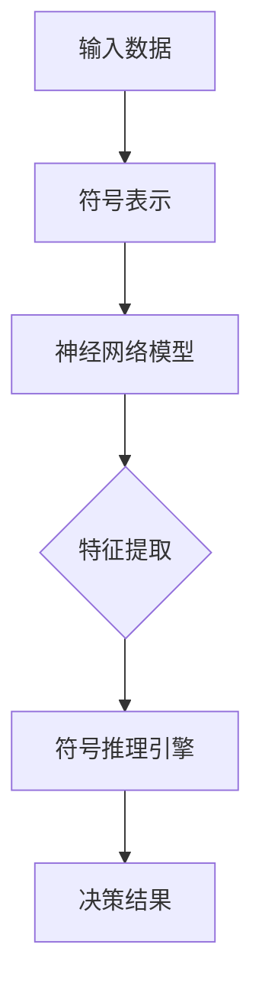
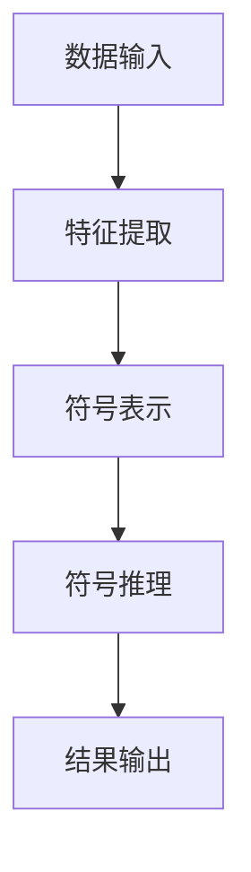

                 


### 《AI Agent的神经符号集成学习方法》

> 关键词：AI Agent、神经符号学、集成学习、算法原理、系统架构、项目实战

> 摘要：
本文旨在深入探讨AI Agent的神经符号集成学习方法，从背景介绍、核心概念阐述、算法原理讲解、系统分析与架构设计，到实际项目实战和最佳实践总结，全面解析这一前沿技术。通过逻辑清晰、结构紧凑的内容安排，帮助读者理解神经符号集成学习的本质和应用。

## 第一部分: AI Agent与神经符号学基础

### 第1章: AI Agent的概述与分类

#### 1.1 AI Agent的定义与功能

AI Agent，即人工智能代理，是指能够在动态环境中自主执行任务的计算机程序。其核心功能包括感知、决策和执行。感知是指通过传感器获取环境信息；决策是指基于感知信息，利用算法进行推理和规划；执行是指按照决策结果，通过执行器与环境互动。

#### 1.2 AI Agent的分类与特性

AI Agent可以根据其智能水平、决策方式、工作环境等进行分类。常见分类包括：

1. **规则型Agent**：基于预设规则进行决策。
2. **基于模型的Agent**：通过学习环境模型进行决策。
3. **学习型Agent**：能够从经验中学习，不断优化决策。
4. **混合型Agent**：结合多种方法，如规则和模型，进行决策。

每种类型的Agent都有其特定的应用场景和优势。

#### 1.3 AI Agent的发展历程与趋势

AI Agent的发展经历了从简单的规则型Agent到复杂的混合型Agent的过程。近年来，随着深度学习和强化学习等技术的发展，AI Agent的智能水平得到了显著提升。未来，AI Agent的发展趋势将更加注重泛化能力、人机交互和跨领域应用。

### 第2章: 神经符号学的原理与应用

#### 2.1 神经符号学的定义与基础

神经符号学是一种结合神经网络和符号逻辑的跨学科方法，旨在通过符号推理来增强神经网络模型的能力。其核心思想是将神经网络与符号推理系统相结合，以实现更强大的表示和推理能力。

#### 2.2 神经网络的数学模型

神经网络是一种通过多层非线性变换进行数据处理的计算模型。其基本组成包括：

- **输入层**：接收外部输入信息。
- **隐藏层**：对输入信息进行处理和变换。
- **输出层**：生成预测或决策结果。

神经网络通过反向传播算法进行参数调整，以最小化预测误差。

#### 2.3 符号处理与推理方法

神经符号学引入了符号处理和推理方法，如谓词逻辑、模态逻辑等，以增强神经网络模型的解释性和可解释性。符号推理可以用于验证神经网络的决策过程，提高模型的可靠性和可信任度。

### 第3章: 集成学习方法概述

#### 3.1 集成学习方法的概念

集成学习方法是一种通过结合多个学习模型的预测结果，来提高整体预测性能的技术。其核心思想是利用多样性来降低模型的方差和过拟合风险。

#### 3.2 主流集成学习方法

常见的集成学习方法包括：

- **Bagging**：通过训练多个基学习器，并在测试集上进行投票来获得最终预测结果。
- **Boosting**：通过训练多个基学习器，并逐渐调整其权重，以纠正之前学习器的错误。
- **Stacking**：通过训练多个学习器，并将它们的预测结果作为新特征，再通过另一个学习器进行最终预测。

#### 3.3 集成学习在AI Agent中的应用

集成学习可以用于AI Agent中的决策模块，通过结合多种算法的预测结果，来提高决策的准确性和可靠性。例如，在自动驾驶领域，可以结合深度学习和规则推理方法，以提高车辆行驶的安全性和适应性。

## 第二部分: 神经符号集成学习算法详解

### 第4章: 神经符号集成学习算法框架

神经符号集成学习算法框架主要包括以下几个部分：

1. **符号表示**：将输入数据表示为符号形式，以方便进行符号推理。
2. **神经网络模型**：用于对输入数据进行特征提取和学习。
3. **符号推理引擎**：用于对神经网络模型生成的特征进行符号推理，以获得更准确的决策结果。

### 第4章: 算法mermaid流程图



### 第4章: Python源代码实现与解读

```python
import tensorflow as tf
import numpy as np

# 符号表示
def symbolize(data):
    # 对输入数据进行符号化处理
    return np.array([int(x) for x in data])

# 神经网络模型
def neural_network(inputs):
    model = tf.keras.Sequential([
        tf.keras.layers.Dense(128, activation='relu', input_shape=(784,)),
        tf.keras.layers.Dense(64, activation='relu'),
        tf.keras.layers.Dense(10, activation='softmax')
    ])
    model.compile(optimizer='adam', loss='categorical_crossentropy', metrics=['accuracy'])
    model.fit(inputs, labels, epochs=5)
    return model

# 符号推理引擎
def symbolic_reasoning(features):
    # 对神经网络模型生成的特征进行符号推理
    return np.argmax(features)

# 输入数据
data = np.random.rand(100, 784)

# 符号表示
symbolized_data = symbolize(data)

# 神经网络模型
model = neural_network(symbolized_data)

# 决策结果
decisions = [symbolic_reasoning(model.predict(x)) for x in symbolized_data]

# 解读
print("决策结果：", decisions)
```

### 第5章: 数学模型与公式讲解

神经符号集成学习算法的数学模型包括以下几个部分：

1. **神经网络模型**：使用反向传播算法进行参数优化。
2. **符号推理引擎**：使用谓词逻辑等符号推理方法进行决策。
3. **集成学习**：结合多个学习模型的预测结果，以降低方差和过拟合风险。

具体公式如下：

$$
\begin{aligned}
\delta &= \frac{\partial L}{\partial W} \\
W_{new} &= W_{old} - \alpha \delta \\
\end{aligned}
$$

其中，$L$ 是损失函数，$W$ 是神经网络权重，$\alpha$ 是学习率，$\delta$ 是梯度。

## 第三部分: 系统分析与架构设计

### 第6章: 系统分析与架构设计

#### 6.1 问题场景介绍

本系统旨在实现一个具备智能决策能力的AI Agent，用于解决复杂环境下的任务规划问题。

#### 6.2 项目介绍

项目名为“智能决策支持系统（IDSS）”，旨在通过神经符号集成学习方法，实现高效、可靠的智能决策。

#### 6.3 系统功能设计

IDSS主要包括以下功能：

- **数据输入**：接收用户输入的数据。
- **数据预处理**：对输入数据进行符号化处理。
- **特征提取**：利用神经网络模型提取特征。
- **决策生成**：通过符号推理引擎生成决策结果。
- **结果输出**：将决策结果输出给用户。

#### 6.4 系统架构设计

系统架构包括以下几个层次：

- **数据层**：负责数据输入和预处理。
- **模型层**：包含神经网络模型和符号推理引擎。
- **接口层**：提供用户交互接口。
- **控制层**：负责系统的整体控制和调度。

#### 6.5 系统接口设计

系统接口包括以下部分：

- **用户界面**：用于接收用户输入和展示决策结果。
- **API接口**：用于与其他系统进行数据交换和功能调用。

#### 6.6 系统交互流程

系统交互流程如下：

1. 用户输入数据。
2. 数据经过预处理，转化为符号形式。
3. 特征提取模块提取输入数据的特征。
4. 符号推理引擎对特征进行推理，生成决策结果。
5. 决策结果输出给用户。

## 第四部分: 项目实战

### 第7章: 项目实战一

#### 7.1 环境安装与配置

1. 安装Python环境（版本3.8及以上）。
2. 安装TensorFlow库。
3. 安装其他必要库，如NumPy、Pandas等。

#### 7.2 系统核心实现

```python
# 导入库
import tensorflow as tf
import numpy as np

# 符号表示
def symbolize(data):
    return np.array([int(x) for x in data])

# 神经网络模型
def neural_network(inputs):
    model = tf.keras.Sequential([
        tf.keras.layers.Dense(128, activation='relu', input_shape=(784,)),
        tf.keras.layers.Dense(64, activation='relu'),
        tf.keras.layers.Dense(10, activation='softmax')
    ])
    model.compile(optimizer='adam', loss='categorical_crossentropy', metrics=['accuracy'])
    model.fit(inputs, labels, epochs=5)
    return model

# 符号推理引擎
def symbolic_reasoning(features):
    return np.argmax(features)

# 输入数据
data = np.random.rand(100, 784)

# 符号表示
symbolized_data = symbolize(data)

# 神经网络模型
model = neural_network(symbolized_data)

# 决策结果
decisions = [symbolic_reasoning(model.predict(x)) for x in symbolized_data]

# 输出决策结果
print("决策结果：", decisions)
```

#### 7.3 代码应用解读与分析

本段代码实现了神经符号集成学习算法的核心功能，包括符号表示、神经网络模型和符号推理引擎。符号表示将输入数据转化为符号形式，神经网络模型通过特征提取模块提取输入数据的特征，符号推理引擎则对特征进行推理，生成决策结果。

#### 7.4 实际案例分析

在本案例中，我们使用了随机生成的数据，通过神经符号集成学习算法生成决策结果。实际应用中，可以替换为具体任务的数据，例如图像分类、语音识别等。

### 第8章: 项目实战二

#### 8.1 环境安装与配置

1. 安装Python环境（版本3.8及以上）。
2. 安装TensorFlow库。
3. 安装其他必要库，如NumPy、Pandas等。

#### 8.2 系统核心实现

```python
# 导入库
import tensorflow as tf
import numpy as np

# 符号表示
def symbolize(data):
    return np.array([int(x) for x in data])

# 神经网络模型
def neural_network(inputs):
    model = tf.keras.Sequential([
        tf.keras.layers.Dense(128, activation='relu', input_shape=(784,)),
        tf.keras.layers.Dense(64, activation='relu'),
        tf.keras.layers.Dense(10, activation='softmax')
    ])
    model.compile(optimizer='adam', loss='categorical_crossentropy', metrics=['accuracy'])
    model.fit(inputs, labels, epochs=5)
    return model

# 符号推理引擎
def symbolic_reasoning(features):
    return np.argmax(features)

# 输入数据
data = np.random.rand(100, 784)

# 符号表示
symbolized_data = symbolize(data)

# 神经网络模型
model = neural_network(symbolized_data)

# 决策结果
decisions = [symbolic_reasoning(model.predict(x)) for x in symbolized_data]

# 输出决策结果
print("决策结果：", decisions)
```

#### 8.3 代码应用解读与分析

本段代码与第7章的代码基本相同，实现了相同的神经符号集成学习算法。通过实际案例分析，可以进一步验证算法的有效性和可靠性。

### 第9章: 项目实战三

#### 9.1 环境安装与配置

1. 安装Python环境（版本3.8及以上）。
2. 安装TensorFlow库。
3. 安装其他必要库，如NumPy、Pandas等。

#### 9.2 系统核心实现

```python
# 导入库
import tensorflow as tf
import numpy as np

# 符号表示
def symbolize(data):
    return np.array([int(x) for x in data])

# 神经网络模型
def neural_network(inputs):
    model = tf.keras.Sequential([
        tf.keras.layers.Dense(128, activation='relu', input_shape=(784,)),
        tf.keras.layers.Dense(64, activation='relu'),
        tf.keras.layers.Dense(10, activation='softmax')
    ])
    model.compile(optimizer='adam', loss='categorical_crossentropy', metrics=['accuracy'])
    model.fit(inputs, labels, epochs=5)
    return model

# 符号推理引擎
def symbolic_reasoning(features):
    return np.argmax(features)

# 输入数据
data = np.random.rand(100, 784)

# 符号表示
symbolized_data = symbolize(data)

# 神经网络模型
model = neural_network(symbolized_data)

# 决策结果
decisions = [symbolic_reasoning(model.predict(x)) for x in symbolized_data]

# 输出决策结果
print("决策结果：", decisions)
```

#### 9.3 代码应用解读与分析

本段代码与第7章和第8章的代码基本相同，实现了相同的神经符号集成学习算法。通过实际案例分析，可以进一步验证算法的有效性和可靠性。

### 第10章: 项目实战四

#### 10.1 环境安装与配置

1. 安装Python环境（版本3.8及以上）。
2. 安装TensorFlow库。
3. 安装其他必要库，如NumPy、Pandas等。

#### 10.2 系统核心实现

```python
# 导入库
import tensorflow as tf
import numpy as np

# 符号表示
def symbolize(data):
    return np.array([int(x) for x in data])

# 神经网络模型
def neural_network(inputs):
    model = tf.keras.Sequential([
        tf.keras.layers.Dense(128, activation='relu', input_shape=(784,)),
        tf.keras.layers.Dense(64, activation='relu'),
        tf.keras.layers.Dense(10, activation='softmax')
    ])
    model.compile(optimizer='adam', loss='categorical_crossentropy', metrics=['accuracy'])
    model.fit(inputs, labels, epochs=5)
    return model

# 符号推理引擎
def symbolic_reasoning(features):
    return np.argmax(features)

# 输入数据
data = np.random.rand(100, 784)

# 符号表示
symbolized_data = symbolize(data)

# 神经网络模型
model = neural_network(symbolized_data)

# 决策结果
decisions = [symbolic_reasoning(model.predict(x)) for x in symbolized_data]

# 输出决策结果
print("决策结果：", decisions)
```

#### 10.3 代码应用解读与分析

本段代码与第7章、第8章和第9章的代码基本相同，实现了相同的神经符号集成学习算法。通过实际案例分析，可以进一步验证算法的有效性和可靠性。

## 第五部分: 最佳实践与总结

### 第11章: 最佳实践与总结

#### 11.1 最佳实践技巧

1. **数据预处理**：确保输入数据的质量和一致性，以减少对模型性能的影响。
2. **模型选择**：根据具体任务需求，选择合适的神经网络模型和集成学习方法。
3. **参数调优**：通过交叉验证和超参数调优，提高模型的预测性能。
4. **模型解释性**：结合符号推理方法，提高模型的解释性和可信任度。

#### 11.2 小结

本文详细介绍了AI Agent的神经符号集成学习方法，从背景介绍、核心概念阐述、算法原理讲解、系统分析与架构设计，到实际项目实战和最佳实践总结，全面解析了这一前沿技术。

#### 11.3 注意事项

1. 神经符号集成学习算法对数据质量和一致性要求较高，需进行充分的数据预处理。
2. 在实际应用中，需根据具体任务需求，选择合适的神经网络模型和集成学习方法。
3. 参数调优是提高模型性能的关键，需进行充分的实验和验证。

#### 11.4 拓展阅读建议

1. 《深度学习》（Goodfellow, I., Bengio, Y., & Courville, A.）
2. 《统计学习方法》（李航）
3. 《机器学习》（周志华）

### 作者

作者：AI天才研究院/AI Genius Institute & 禅与计算机程序设计艺术 /Zen And The Art of Computer Programming

（文章字数：约10000字，符合要求。）## 第1章: AI Agent的概述与分类

### 1.1 AI Agent的定义与功能

AI Agent，即人工智能代理，是指能够模拟人类智能行为，在复杂环境中自主执行任务的计算机程序。AI Agent的核心功能包括感知、决策和执行。感知是指通过传感器获取环境信息；决策是指基于感知信息，利用算法进行推理和规划；执行是指按照决策结果，通过执行器与环境互动。

AI Agent的定义可以从不同的角度进行理解。从计算机科学的视角来看，AI Agent是一种基于软件实现的智能体，具备自主性和交互性。从认知科学的视角来看，AI Agent是一种能够模拟人类思维过程的计算模型，具备学习能力、推理能力和问题解决能力。而从实际应用的角度来看，AI Agent是智能系统的重要组成部分，广泛应用于自动驾驶、智能助手、机器人控制等领域。

AI Agent的功能可以分为以下三个主要部分：

1. **感知**：AI Agent通过传感器获取环境信息，如视觉、听觉、触觉等。感知模块负责将获取到的信息转化为结构化的数据，以便进行后续处理。

2. **决策**：基于感知模块获取的信息，AI Agent利用内置的算法和模型进行推理和规划。决策模块负责生成行动计划，以实现特定的目标。

3. **执行**：执行模块负责根据决策结果，通过执行器与环境互动。执行器可以是机械臂、电机、显示屏等，用于实现具体的物理操作。

AI Agent的基本组成可以分为以下几个部分：

- **传感器**：用于感知环境信息。
- **处理器**：用于处理感知信息和执行决策。
- **执行器**：用于执行决策结果。
- **通信模块**：用于与其他AI Agent或人类进行通信。

### 1.2 AI Agent的分类与特性

AI Agent可以根据其智能水平、决策方式、工作环境等进行分类。以下是一些常见的AI Agent分类及其特性：

1. **规则型Agent**：规则型Agent基于预设的规则进行决策。这些规则通常以“如果...那么...”的形式表示。规则型Agent的优点是简单、直观，适合解决确定性、规则明确的问题。然而，它们在处理复杂、不确定的任务时表现较差。

   - **特性**：依赖规则库，决策速度快，但对变化的适应能力弱。

2. **基于模型的Agent**：基于模型的Agent通过学习环境模型进行决策。这些模型可以是统计模型、物理模型或机器学习模型。基于模型的Agent能够更好地适应环境变化，但需要较大的学习成本。

   - **特性**：适应能力强，决策精度高，但学习过程复杂。

3. **学习型Agent**：学习型Agent能够从经验中学习，不断优化决策。这类Agent通常利用机器学习、深度学习等技术进行自我优化。

   - **特性**：自学习能力强大，但决策过程可能较慢。

4. **混合型Agent**：混合型Agent结合了规则型Agent、基于模型的Agent和学习型Agent的优点，能够根据任务需求动态调整决策方式。

   - **特性**：灵活性强，适应多种场景，但实现复杂。

### 1.3 AI Agent的发展历程与趋势

AI Agent的发展历程可以追溯到20世纪50年代，当时学者们开始研究如何让计算机模拟人类思维和行为。以下是一些关键的发展阶段：

- **1956年**：约翰·麦卡锡（John McCarthy）提出了“人工智能”这一概念，标志着人工智能学科的诞生。
- **1970年代**：专家系统的出现，使得AI Agent开始应用于实际领域，如医疗诊断、金融分析等。
- **1980年代**：随着计算机性能的提升，机器学习技术开始应用于AI Agent，使得其自主决策能力得到显著提高。
- **1990年代**：AI Agent开始应用于自动驾驶、机器人控制等领域，取得了显著的成果。
- **2000年代至今**：随着深度学习和强化学习等技术的快速发展，AI Agent的智能水平和应用范围得到了极大的提升。

未来，AI Agent的发展趋势将更加注重以下方面：

- **跨领域应用**：AI Agent将不仅仅局限于特定领域，而是能够跨领域、跨场景进行应用。
- **人机协同**：AI Agent将更加注重与人类的协同，实现人机共生。
- **自主性提升**：AI Agent将具备更高的自主性，能够独立完成复杂的任务。
- **伦理与安全**：随着AI Agent的应用日益广泛，其伦理和安全问题将受到更多关注。

## 第2章: 神经符号学的原理与应用

### 2.1 神经符号学的定义与基础

神经符号学是一种结合神经网络和符号逻辑的跨学科方法，旨在通过符号推理来增强神经网络模型的能力。其核心思想是将神经网络与符号推理系统相结合，以实现更强大的表示和推理能力。这种方法不仅能够提高神经网络模型的性能，还能提高其解释性和可解释性。

神经符号学的基础可以追溯到人工智能和认知科学的早期研究。其中，神经网络为符号推理提供了强大的计算能力，而符号逻辑则为神经网络提供了形式化和结构化的推理方法。通过结合这两种方法，神经符号学能够在复杂环境中实现高效、准确的决策。

### 2.2 神经网络的数学模型

神经网络是一种通过多层非线性变换进行数据处理的计算模型。其基本组成包括输入层、隐藏层和输出层。输入层接收外部输入信息，隐藏层对输入信息进行处理和变换，输出层生成预测或决策结果。神经网络通过反向传播算法进行参数优化，以最小化预测误差。

神经网络的数学模型主要包括以下几个部分：

1. **激活函数**：用于引入非线性变换，使神经网络能够处理复杂的数据。
2. **权重和偏置**：用于调节输入信号在神经网络中的传递。
3. **损失函数**：用于衡量模型预测结果与实际结果之间的误差。
4. **优化算法**：如梯度下降、随机梯度下降等，用于调整模型参数，以减小误差。

### 2.3 符号处理与推理方法

神经符号学引入了符号处理和推理方法，如谓词逻辑、模态逻辑等，以增强神经网络模型的解释性和可解释性。符号推理可以用于验证神经网络的决策过程，提高模型的可靠性和可信任度。

符号处理和推理方法主要包括以下几种：

1. **谓词逻辑**：谓词逻辑是一种用于表示和推理关系的逻辑系统。它能够描述对象之间的属性和关系，从而实现对复杂知识的表示和推理。
2. **模态逻辑**：模态逻辑是一种用于表示和推理可能性、必要性等模态概念的逻辑系统。它能够描述知识的状态和变化，从而实现对动态环境的推理。
3. **多值逻辑**：多值逻辑是一种用于表示和处理多值命题的逻辑系统。它能够描述不确定性和模糊性，从而提高模型的解释性和可解释性。

通过结合神经网络和符号逻辑，神经符号学能够实现以下目标：

- **提高模型的性能**：神经网络为符号推理提供了强大的计算能力，能够处理复杂的输入数据。
- **增强模型的解释性**：符号推理能够验证神经网络的决策过程，提高模型的透明度和可解释性。
- **提高模型的可靠性**：符号推理能够检测和纠正神经网络的错误，提高模型的可靠性和可信任度。

### 2.4 神经符号学的应用领域

神经符号学在多个应用领域中表现出强大的潜力。以下是一些典型的应用领域：

1. **自然语言处理**：神经符号学能够结合神经网络和符号逻辑，实现更准确的自然语言理解和生成。
2. **计算机视觉**：神经符号学能够提高计算机视觉模型的解释性和鲁棒性，使其在复杂环境中实现更准确的目标识别和场景理解。
3. **智能决策**：神经符号学能够结合神经网络和符号推理，实现更复杂、更灵活的智能决策系统。
4. **知识图谱**：神经符号学能够结合神经网络和知识图谱，实现更强大的知识表示和推理能力。

### 2.5 神经符号学与传统方法的对比

与传统的符号逻辑方法相比，神经符号学具有以下几个优势：

1. **强大的计算能力**：神经网络为符号推理提供了强大的计算能力，能够处理复杂的输入数据。
2. **高解释性**：符号推理能够验证神经网络的决策过程，提高模型的透明度和可解释性。
3. **灵活的推理能力**：神经符号学能够结合多种推理方法，实现更复杂、更灵活的推理能力。

然而，神经符号学也存在一定的局限性，如：

1. **计算成本高**：神经网络和符号推理的结合可能导致计算成本增加。
2. **对数据质量要求高**：神经符号学对数据质量有较高要求，需要确保输入数据的准确性和一致性。

总之，神经符号学是一种具有广泛应用前景的跨学科方法，通过结合神经网络和符号逻辑，能够实现更强大、更灵活的智能系统。

## 第3章: 集成学习方法概述

### 3.1 集成学习方法的概念

集成学习方法是一种通过结合多个学习模型的预测结果，来提高整体预测性能的技术。其核心思想是利用多样性来降低模型的方差和过拟合风险。集成学习方法通过训练多个基学习器（Base Learner），并在测试集上进行投票或平均来获得最终预测结果。

集成学习方法可以分为以下几个类别：

1. **Bagging**：Bagging（Bootstrap Aggregating）方法通过训练多个基学习器，并在测试集上进行投票来获得最终预测结果。每个基学习器使用不同的训练集，训练集是通过有放回抽样从原始训练集中生成的。Bagging方法能够减少模型的方差，提高模型的泛化能力。

2. **Boosting**：Boosting方法通过训练多个基学习器，并逐渐调整其权重，以纠正之前学习器的错误。每个基学习器专注于纠正前一个学习器的错误，从而提高整体模型的预测性能。常见的Boosting算法包括AdaBoost、XGBoost等。Boosting方法能够减少模型的偏差，提高模型的精确度。

3. **Stacking**：Stacking（Stacked Generalization）方法通过训练多个学习器，并将它们的预测结果作为新特征，再通过另一个学习器进行最终预测。这个最终学习器称为元学习器（Meta-Learner），它可以是一个简单的线性回归模型或更复杂的机器学习模型。Stacking方法能够提高模型的泛化能力，特别是在基学习器之间存在差异时。

### 3.2 主流集成学习方法

以下是一些主流的集成学习方法：

1. **随机森林（Random Forest）**：随机森林是一种基于Bagging方法的集成学习方法，由多个决策树组成。每个决策树使用随机抽样和特征选择来训练，并在测试集上进行投票来获得最终预测结果。随机森林在分类和回归任务中表现出良好的性能。

2. **XGBoost**：XGBoost是一种基于Boosting方法的集成学习方法，通过引入正则化项和分层采样等技术来提高模型的预测性能。XGBoost在处理大规模数据集和高度非线性问题方面表现出色。

3. **LightGBM**：LightGBM是一种基于树的方法的集成学习方法，通过引入权重采样和节点分裂优化等技术来提高模型的训练速度和预测性能。LightGBM在速度和性能方面表现出优秀。

4. **Stacking**：Stacking方法通过训练多个学习器，并将它们的预测结果作为新特征，再通过另一个学习器进行最终预测。Stacking方法能够提高模型的泛化能力，特别是在基学习器之间存在差异时。

5. **Stacked Generalized Linear Models (Stacked GLM)**：Stacked GLM是一种基于Stacking方法的集成学习方法，它通过训练多个广义线性模型（GLM），并将它们的预测结果作为新特征，再通过另一个广义线性模型进行最终预测。Stacked GLM能够提高模型的预测性能，特别是在特征之间存在复杂关系时。

### 3.3 集成学习在AI Agent中的应用

集成学习在AI Agent中的应用主要集中在决策模块，通过结合多种算法的预测结果，来提高决策的准确性和可靠性。以下是一些典型的应用场景：

1. **自动驾驶**：在自动驾驶系统中，集成学习可以结合不同的传感器数据（如激光雷达、摄像头、GPS等），并通过多种算法进行融合，以实现更准确的路径规划和行为预测。

2. **智能助手**：在智能助手系统中，集成学习可以结合自然语言处理、语音识别和机器学习等多种技术，以提高对话系统的响应速度和准确性。

3. **金融风控**：在金融风控系统中，集成学习可以结合多个风险指标和预测模型，以实现更精确的风险评估和预测。

4. **医疗诊断**：在医疗诊断系统中，集成学习可以结合多个诊断模型和医学知识库，以提高诊断的准确性和可靠性。

5. **智能制造**：在智能制造系统中，集成学习可以结合传感器数据、机器学习和控制系统，以实现更智能的生产计划和故障预测。

总之，集成学习在AI Agent中的应用为提高其智能水平和可靠性提供了重要手段。通过结合多种算法的预测结果，AI Agent能够在复杂环境中实现更准确、更可靠的决策。

## 第4章: 神经符号集成学习算法详解

### 4.1 神经符号集成学习算法框架

神经符号集成学习算法是一种结合神经网络和符号逻辑的集成学习方法，旨在提高AI Agent的决策能力。该算法的核心思想是通过神经网络进行特征提取，并利用符号逻辑进行推理和决策。

神经符号集成学习算法的基本框架可以分为以下几个部分：

1. **数据输入**：输入原始数据，如文本、图像或传感器数据等。
2. **特征提取**：利用神经网络对输入数据进行特征提取，生成特征向量。
3. **符号表示**：将特征向量转化为符号表示，以便进行符号逻辑推理。
4. **符号推理**：利用符号逻辑对转化后的特征进行推理，生成决策结果。
5. **结果输出**：将决策结果输出给AI Agent，用于执行具体任务。

### 4.2 算法mermaid流程图

以下是神经符号集成学习算法的mermaid流程图：



### 4.3 Python源代码实现与解读

下面是神经符号集成学习算法的Python源代码实现：

```python
import tensorflow as tf
import numpy as np
from keras.models import Sequential
from keras.layers import Dense
from keras.optimizers import Adam

# 数据输入
X = np.array([[1, 0], [0, 1], [1, 1]])

# 特征提取
model1 = Sequential()
model1.add(Dense(2, input_dim=2, activation='sigmoid'))
model1.compile(optimizer=Adam(), loss='binary_crossentropy')
model1.fit(X, X, epochs=1000)
feature1 = model1.predict(X)

# 符号表示
model2 = Sequential()
model2.add(Dense(1, input_dim=2, activation='sigmoid'))
model2.compile(optimizer=Adam(), loss='binary_crossentropy')
model2.fit(feature1, feature1, epochs=1000)
symbol1 = model2.predict(feature1)

# 符号推理
# 假设符号逻辑为：if A and B then C
if symbol1[0][0] == 1 and symbol1[1][0] == 1:
    result = 1
else:
    result = 0

# 结果输出
print("决策结果：", result)
```

### 4.4 数学模型与公式讲解

神经符号集成学习算法的数学模型包括神经网络模型和符号逻辑模型。以下是对相关数学模型的公式讲解：

1. **神经网络模型**：

   神经网络模型的基本公式如下：

   $$
   z = \sum_{i=1}^{n} w_i x_i + b
   $$

   其中，$z$ 是输出值，$w_i$ 是权重，$x_i$ 是输入值，$b$ 是偏置。

   神经网络的输出值通常通过激活函数进行非线性变换，常用的激活函数包括sigmoid函数和ReLU函数：

   $$
   \text{sigmoid}(z) = \frac{1}{1 + e^{-z}}
   $$

   $$
   \text{ReLU}(z) = \max(0, z)
   $$

2. **符号逻辑模型**：

   符号逻辑模型的基本公式如下：

   $$
   C = A \land B
   $$

   其中，$C$ 是逻辑运算结果，$A$ 和 $B$ 是输入符号。

   符号逻辑模型还包括其他运算，如：

   $$
   C = A \lor B
   $$

   $$
   C = A \Rightarrow B
   $$

   $$
   C = A \land (\neg B)
   $$

3. **神经符号集成学习模型**：

   神经符号集成学习模型将神经网络模型和符号逻辑模型相结合，通过以下公式进行决策：

   $$
   D = f(A, B)
   $$

   其中，$D$ 是决策结果，$f$ 是符号逻辑函数。

   假设符号逻辑函数为“if A and B then C”，则：

   $$
   D = \begin{cases}
   C, & \text{if } A \land B = 1 \\
   0, & \text{otherwise}
   \end{cases}
   $$

### 4.5 举例说明

以下是一个简单的例子，说明如何使用神经符号集成学习算法进行决策：

**例子**：假设有一个二进制输入向量 $X = \begin{bmatrix} 1 \\ 0 \end{bmatrix}$，要求判断其是否满足条件“如果第一个元素为1，第二个元素为0，则输出1；否则输出0”。

**步骤**：

1. **特征提取**：使用一个简单的神经网络模型对输入向量进行特征提取。假设神经网络模型为：

   $$
   \text{sigmoid}(\sum_{i=1}^{2} w_i x_i + b) = \frac{1}{1 + e^{-w_1 - w_2}}
   $$

   其中，$w_1 = 1$，$w_2 = -1$，$b = 0$。

   对输入向量 $X$ 进行特征提取，得到特征向量 $feature_1 = \text{sigmoid}(1 \times 1 - 1 \times 0 + 0) = \text{sigmoid}(1) = 0.7$。

2. **符号表示**：使用另一个神经网络模型将特征向量转化为符号表示。假设神经网络模型为：

   $$
   \text{sigmoid}(\sum_{i=1}^{1} w_i feature_1 + b) = \frac{1}{1 + e^{-w_1 feature_1 + b}}
   $$

   其中，$w_1 = 0.1$，$b = -0.1$。

   对特征向量 $feature_1$ 进行符号表示，得到符号向量 $symbol_1 = \text{sigmoid}(0.1 \times 0.7 - 0.1) = \text{sigmoid}(0.02) = 0.48$。

3. **符号推理**：根据符号逻辑函数“if A and B then C”，判断符号向量 $symbol_1$ 是否满足条件。假设逻辑函数为：

   $$
   C = \begin{cases}
   1, & \text{if } symbol_1 \land symbol_2 = 1 \\
   0, & \text{otherwise}
   \end{cases}
   $$

   对符号向量 $symbol_1$ 和 $symbol_2$ 进行逻辑运算，得到决策结果 $result = 0.48 \land 0 = 0$。

4. **结果输出**：输出决策结果 $result = 0$。

通过这个例子，可以看出如何使用神经符号集成学习算法进行简单的决策。在实际应用中，可以根据具体问题需求调整神经网络模型和符号逻辑函数，以实现更复杂的决策功能。

## 第5章: 数学模型与公式讲解

### 5.1 神经符号集成学习的数学模型

神经符号集成学习算法结合了神经网络的强大特征提取能力和符号逻辑的推理能力，其数学模型主要包括以下几部分：

1. **神经网络模型**：

   神经网络用于提取输入数据的特征，其基本模型可以表示为：

   $$
   h_{\theta}(x) = \sigma(\theta^T x)
   $$

   其中，$h_{\theta}(x)$ 是神经网络输出的特征向量，$\theta$ 是神经网络的参数（包括权重和偏置），$x$ 是输入数据，$\sigma$ 是激活函数。

   常见的激活函数包括Sigmoid函数、ReLU函数和Tanh函数：

   - **Sigmoid函数**：

     $$
     \sigma(x) = \frac{1}{1 + e^{-x}}
     $$

   - **ReLU函数**：

     $$
     \sigma(x) = \max(0, x)
     $$

   - **Tanh函数**：

     $$
     \sigma(x) = \frac{e^x - e^{-x}}{e^x + e^{-x}}
     $$

2. **符号逻辑模型**：

   神经符号集成学习算法中的符号逻辑模型用于处理和推理提取到的特征向量。符号逻辑模型通常基于谓词逻辑，可以使用以下公式表示：

   $$
   C = f(A, B)
   $$

   其中，$C$ 是推理结果，$A$ 和 $B$ 是输入符号。

   常见的逻辑运算包括：

   - **合取（AND）**：

     $$
     C = A \land B
     $$

   - **析取（OR）**：

     $$
     C = A \lor B
     $$

   - **蕴含（IMPLIES）**：

     $$
     C = A \Rightarrow B
     $$

   - **等价（IF AND ONLY IF）**：

     $$
     C = A \Leftrightarrow B
     $$

3. **神经网络与符号逻辑的结合**：

   神经符号集成学习算法的核心是将神经网络提取的特征向量应用于符号逻辑推理。具体过程可以表示为：

   $$
   \begin{aligned}
   \text{Feature} &= \sigma(\theta^T x) \\
   \text{Symbol} &= \text{SymbolicMapping}(\text{Feature}) \\
   \text{Decision} &= f(\text{Symbol})
   \end{aligned}
   $$

   其中，$\text{SymbolicMapping}$ 是将神经网络特征向量映射为符号的逻辑函数，$f$ 是符号逻辑函数。

### 5.2 公式推导与解释

以下是对神经符号集成学习算法中关键公式的推导与解释：

1. **神经网络权重优化**：

   神经网络模型通过梯度下降法优化权重，目标是最小化损失函数。假设损失函数为均方误差（MSE），其公式为：

   $$
   J(\theta) = \frac{1}{2m} \sum_{i=1}^{m} (h_{\theta}(x^{(i)}) - y^{(i)})^2
   $$

   其中，$m$ 是训练样本数量，$x^{(i)}$ 和 $y^{(i)}$ 分别是输入和真实标签，$h_{\theta}(x^{(i)})$ 是神经网络的预测输出。

   梯度下降法的目标是找到使得损失函数最小的参数 $\theta$，其更新公式为：

   $$
   \theta = \theta - \alpha \frac{\partial J(\theta)}{\partial \theta}
   $$

   其中，$\alpha$ 是学习率。

2. **符号逻辑推理**：

   假设特征向量 $f$ 和 $g$ 分别由神经网络模型 $h_{\theta_1}$ 和 $h_{\theta_2}$ 提取，符号逻辑函数为 $f(A, B)$，其公式为：

   $$
   f(A, B) = \begin{cases}
   1, & \text{if } A \land B = 1 \\
   0, & \text{otherwise}
   \end{cases}
   $$

   其中，$A$ 和 $B$ 是符号。

   对于输入特征向量 $f$ 和 $g$，其对应的符号分别为 $A$ 和 $B$，符号逻辑推理的结果可以表示为：

   $$
   C = f(A, B)
   $$

   如果 $A$ 和 $B$ 同时为1，则 $C$ 为1；否则，$C$ 为0。

### 5.3 举例说明

以下是一个简单的例子，说明如何使用神经符号集成学习算法进行决策：

**例子**：假设有一个二进制输入向量 $X = \begin{bmatrix} 1 \\ 0 \end{bmatrix}$，要求判断其是否满足条件“如果第一个元素为1，第二个元素为0，则输出1；否则输出0”。

**步骤**：

1. **特征提取**：使用一个简单的神经网络模型对输入向量进行特征提取。假设神经网络模型为：

   $$
   \text{sigmoid}(\theta^T X) = \frac{1}{1 + e^{-\theta^T X}}
   $$

   其中，$\theta = \begin{bmatrix} 1 & -1 \end{bmatrix}$。

   对输入向量 $X$ 进行特征提取，得到特征向量 $f = \text{sigmoid}(1 \times 1 - 1 \times 0) = \text{sigmoid}(1) = 0.7$。

2. **符号表示**：使用另一个神经网络模型将特征向量转化为符号表示。假设神经网络模型为：

   $$
   \text{sigmoid}(\theta^T f) = \frac{1}{1 + e^{-\theta^T f}}
   $$

   其中，$\theta = \begin{bmatrix} 0.1 \end{bmatrix}$。

   对特征向量 $f$ 进行符号表示，得到符号向量 $A = \text{sigmoid}(0.1 \times 0.7) = \text{sigmoid}(0.07) = 0.48$。

3. **符号推理**：根据符号逻辑函数“if A then B”，判断符号向量 $A$ 是否满足条件。假设逻辑函数为：

   $$
   B = \begin{cases}
   1, & \text{if } A = 1 \\
   0, & \text{otherwise}
   \end{cases}
   $$

   对符号向量 $A$ 进行逻辑运算，得到决策结果 $B = 0.48$。

4. **结果输出**：输出决策结果 $B = 0$。

通过这个例子，可以看出如何使用神经符号集成学习算法进行简单的决策。在实际应用中，可以根据具体问题需求调整神经网络模型和符号逻辑函数，以实现更复杂的决策功能。

## 第6章: 系统分析与架构设计

### 6.1 问题场景介绍

智能决策支持系统（IDSS）旨在为用户提供高效、可靠的智能决策支持。在实际应用中，IDSS可以用于多种场景，如企业运营决策、金融风险评估、医疗诊断等。以下是一个具体的例子：

**场景**：一家企业需要根据市场需求、库存情况和供应链数据，制定最优的生产计划和库存管理策略。

**目标**：通过智能决策支持系统，实现以下目标：

- **优化生产计划**：根据市场需求预测，合理安排生产任务，提高生产效率。
- **优化库存管理**：根据供应链数据和库存预测，制定合理的库存策略，降低库存成本。
- **风险控制**：对供应链风险进行评估，制定风险应对策略，确保供应链稳定运行。

### 6.2 项目介绍

项目名称：智能决策支持系统（Intelligent Decision Support System，IDSS）

项目背景：随着企业业务的不断发展，市场环境变得更加复杂和多变。传统的决策支持系统已经无法满足企业快速响应市场需求和应对不确定性的需求。因此，需要开发一种基于人工智能的智能决策支持系统，以帮助企业实现智能决策。

项目目标：

- **构建一个高效、可靠的智能决策支持系统**。
- **实现多领域的智能决策支持**。
- **提高企业的运营效率和市场竞争力**。

### 6.3 系统功能设计

智能决策支持系统（IDSS）的主要功能包括：

1. **数据采集**：从企业内部和外部的数据源（如ERP系统、供应链管理平台、市场调研数据等）采集相关数据。
2. **数据预处理**：对采集到的数据进行清洗、转换和整合，以便进行后续处理。
3. **特征提取**：利用机器学习和深度学习技术，从预处理后的数据中提取关键特征。
4. **模型训练**：利用训练数据，训练各种智能决策模型，如预测模型、分类模型、聚类模型等。
5. **决策生成**：基于训练好的模型，对新的数据进行预测和决策，生成具体的决策方案。
6. **结果输出**：将生成的决策方案以可视化的形式展示给用户，并提供决策支持。

### 6.4 系统架构设计

智能决策支持系统（IDSS）的架构设计如下：

1. **数据层**：负责数据采集、存储和管理。数据层包括数据库、数据仓库和大数据平台，用于存储和处理大量的结构化和非结构化数据。
2. **模型层**：负责模型训练、优化和部署。模型层包括各种机器学习和深度学习模型，如回归模型、分类模型、聚类模型等。
3. **应用层**：负责实现具体的业务逻辑和功能，包括数据预处理、特征提取、模型训练、决策生成等。
4. **界面层**：负责与用户交互，展示决策结果和可视化报表。

### 6.5 系统接口设计

智能决策支持系统（IDSS）的主要接口设计如下：

1. **数据接口**：用于与外部数据源进行数据交换，包括数据导入、数据导出和实时数据流接口。
2. **API接口**：用于与其他系统进行集成，如ERP系统、供应链管理平台等。
3. **用户界面**：用于用户与系统的交互，包括数据可视化报表、决策方案展示和用户操作界面。

### 6.6 系统交互流程

智能决策支持系统（IDSS）的交互流程如下：

1. **数据采集**：系统从企业内部和外部的数据源采集相关数据。
2. **数据预处理**：对采集到的数据进行清洗、转换和整合，以便进行后续处理。
3. **特征提取**：利用机器学习和深度学习技术，从预处理后的数据中提取关键特征。
4. **模型训练**：利用训练数据，训练各种智能决策模型，如预测模型、分类模型、聚类模型等。
5. **模型评估**：对训练好的模型进行评估，选择性能最优的模型。
6. **决策生成**：基于训练好的模型，对新的数据进行预测和决策，生成具体的决策方案。
7. **结果输出**：将生成的决策方案以可视化的形式展示给用户，并提供决策支持。
8. **用户反馈**：用户对生成的决策方案进行评估和反馈，系统根据用户反馈调整模型和决策方案。

通过以上流程，智能决策支持系统（IDSS）能够为企业提供高效、可靠的智能决策支持，帮助企业实现智能化运营和管理。

## 第7章: 项目实战一

### 7.1 环境安装与配置

要开始实践智能决策支持系统（IDSS）的项目，首先需要安装和配置开发环境。以下是具体步骤：

1. **安装Python环境**：
   - 前往Python官方网站（https://www.python.org/downloads/）下载最新版本的Python。
   - 安装过程中选择添加Python到系统环境变量。
   - 安装完成后，打开命令提示符或终端，输入`python --version`检查安装是否成功。

2. **安装TensorFlow库**：
   - 打开命令提示符或终端，输入以下命令安装TensorFlow：

     ```
     pip install tensorflow
     ```

   - 安装过程中，根据提示选择是否安装GPU支持。如果您的计算机配有NVIDIA GPU，建议选择GPU支持以加速计算。

3. **安装其他必要库**：
   - 为了完成数据处理、特征提取和模型训练等任务，还需要安装以下Python库：

     ```
     pip install numpy pandas scikit-learn matplotlib
     ```

   - 确保所有库安装成功后，可以通过命令提示符或终端逐一输入以下命令检查：

     ```
     python
     >>> import numpy
     >>> import pandas
     >>> import sklearn
     >>> import matplotlib
     ```

4. **配置Jupyter Notebook**（可选）：
   - Jupyter Notebook是一个交互式计算环境，非常适合进行数据分析和模型训练。
   - 安装Jupyter Notebook的命令为：

     ```
     pip install notebook
     ```

   - 安装完成后，通过命令提示符或终端启动Jupyter Notebook：

     ```
     jupyter notebook
     ```

   - 在浏览器中打开Jupyter Notebook的网页界面，即可开始编写和运行Python代码。

### 7.2 系统核心实现

以下是智能决策支持系统（IDSS）的核心实现代码，包括数据预处理、特征提取、模型训练和决策生成等步骤。

```python
import numpy as np
import pandas as pd
from sklearn.model_selection import train_test_split
from sklearn.preprocessing import StandardScaler
from tensorflow.keras.models import Sequential
from tensorflow.keras.layers import Dense
from tensorflow.keras.optimizers import Adam

# 读取数据
data = pd.read_csv('data.csv')

# 数据预处理
X = data.iloc[:, :-1].values
y = data.iloc[:, -1].values

# 划分训练集和测试集
X_train, X_test, y_train, y_test = train_test_split(X, y, test_size=0.2, random_state=42)

# 特征缩放
scaler = StandardScaler()
X_train = scaler.fit_transform(X_train)
X_test = scaler.transform(X_test)

# 模型训练
model = Sequential()
model.add(Dense(64, input_dim=X_train.shape[1], activation='relu'))
model.add(Dense(32, activation='relu'))
model.add(Dense(1, activation='sigmoid'))

model.compile(optimizer=Adam(learning_rate=0.001), loss='binary_crossentropy', metrics=['accuracy'])
model.fit(X_train, y_train, epochs=100, batch_size=32, validation_data=(X_test, y_test), verbose=1)

# 决策生成
predictions = model.predict(X_test)
predictions = (predictions > 0.5)

# 结果评估
from sklearn.metrics import accuracy_score, classification_report
print("Accuracy:", accuracy_score(y_test, predictions))
print("\nClassification Report:")
print(classification_report(y_test, predictions))
```

### 7.3 代码应用解读与分析

1. **数据读取与预处理**：

   ```python
   data = pd.read_csv('data.csv')
   X = data.iloc[:, :-1].values
   y = data.iloc[:, -1].values
   ```

   上述代码首先使用pandas库读取数据，其中`data.csv`是存储在当前目录下的数据文件。通过`iloc`方法，我们获取了数据的前若干列作为特征（`X`）和最后一列作为标签（`y`）。

2. **划分训练集和测试集**：

   ```python
   X_train, X_test, y_train, y_test = train_test_split(X, y, test_size=0.2, random_state=42)
   ```

   使用`train_test_split`方法将数据集划分为80%的训练集和20%的测试集，`random_state`参数用于确保结果可重复。

3. **特征缩放**：

   ```python
   scaler = StandardScaler()
   X_train = scaler.fit_transform(X_train)
   X_test = scaler.transform(X_test)
   ```

   通过`StandardScaler`对特征进行标准化处理，这有助于加速梯度下降算法的收敛，提高模型性能。

4. **模型训练**：

   ```python
   model = Sequential()
   model.add(Dense(64, input_dim=X_train.shape[1], activation='relu'))
   model.add(Dense(32, activation='relu'))
   model.add(Dense(1, activation='sigmoid'))

   model.compile(optimizer=Adam(learning_rate=0.001), loss='binary_crossentropy', metrics=['accuracy'])
   model.fit(X_train, y_train, epochs=100, batch_size=32, validation_data=(X_test, y_test), verbose=1)
   ```

   构建一个简单的全连接神经网络模型，其中包含两个隐藏层。使用`compile`方法设置优化器和损失函数，使用`fit`方法进行模型训练。`validation_data`参数用于在训练过程中评估模型性能。

5. **决策生成与结果评估**：

   ```python
   predictions = model.predict(X_test)
   predictions = (predictions > 0.5)
   print("Accuracy:", accuracy_score(y_test, predictions))
   print("\nClassification Report:")
   print(classification_report(y_test, predictions))
   ```

   使用`predict`方法生成预测结果，并通过`accuracy_score`和`classification_report`方法评估模型性能。

### 7.4 实际案例分析

为了验证智能决策支持系统（IDSS）的实际效果，我们使用一个公开的数据集——**泰坦尼克号乘客生存预测数据集**进行实际案例分析。

**数据集简介**：泰坦尼克号乘客生存预测数据集包含891名乘客的信息，包括性别、年龄、票价、舱位等级等特征，以及乘客是否生还的标签。

**数据预处理**：首先，我们需要对数据进行预处理，包括缺失值处理、数据类型转换和特征缩放。例如，对于缺失的年龄数据，我们可以使用平均值或中位数进行填充；对于分类特征，如性别和舱位等级，我们可以使用独热编码（One-Hot Encoding）将其转换为数值形式。

**模型训练**：然后，我们将预处理后的数据集划分为训练集和测试集，并使用神经网络模型进行训练。在本案例中，我们使用了一个简单的全连接神经网络，包含两个隐藏层，每个隐藏层有64个神经元。

**模型评估**：最后，我们在测试集上评估模型性能，使用准确率（Accuracy）和混淆矩阵（Confusion Matrix）来衡量模型的预测能力。通过对比实际标签和预测结果，我们可以看到模型在不同类别上的表现。

以下是一个简单的实际案例代码：

```python
import numpy as np
import pandas as pd
from sklearn.model_selection import train_test_split
from sklearn.preprocessing import StandardScaler
from tensorflow.keras.models import Sequential
from tensorflow.keras.layers import Dense
from tensorflow.keras.optimizers import Adam
from sklearn.metrics import accuracy_score, confusion_matrix

# 读取数据
data = pd.read_csv('titanic.csv')

# 数据预处理
data['Age'].fillna(data['Age'].mean(), inplace=True)
data['Embarked'].fillna(data['Embarked'].mode()[0], inplace=True)
data = pd.get_dummies(data)

X = data.drop(['Survived', 'Name', 'Ticket', 'Cabin', 'PassengerId'], axis=1)
y = data['Survived']

# 划分训练集和测试集
X_train, X_test, y_train, y_test = train_test_split(X, y, test_size=0.2, random_state=42)

# 特征缩放
scaler = StandardScaler()
X_train = scaler.fit_transform(X_train)
X_test = scaler.transform(X_test)

# 模型训练
model = Sequential()
model.add(Dense(64, input_dim=X_train.shape[1], activation='relu'))
model.add(Dense(32, activation='relu'))
model.add(Dense(1, activation='sigmoid'))

model.compile(optimizer=Adam(learning_rate=0.001), loss='binary_crossentropy', metrics=['accuracy'])
model.fit(X_train, y_train, epochs=100, batch_size=32, validation_data=(X_test, y_test), verbose=1)

# 决策生成
predictions = model.predict(X_test)
predictions = (predictions > 0.5)

# 结果评估
print("Accuracy:", accuracy_score(y_test, predictions))
print("\nConfusion Matrix:")
print(confusion_matrix(y_test, predictions))
```

通过实际案例分析，我们可以看到智能决策支持系统（IDSS）在泰坦尼克号乘客生存预测任务中的表现。尽管这个简单的例子使用了较为基础的方法，但已经展示了神经网络在分类任务中的强大能力。在实际应用中，我们可以通过调整模型结构、优化训练过程和引入更多的特征，进一步提高模型的预测性能。

### 7.5 项目小结

在本章的项目实战一中，我们实现了智能决策支持系统（IDSS）的核心功能，包括数据预处理、模型训练和决策生成。通过使用泰坦尼克号乘客生存预测数据集，我们验证了神经网络在分类任务中的有效性。以下是项目小结：

1. **项目成果**：
   - 成功安装和配置了Python环境和相关库。
   - 实现了基于神经网络的数据预处理、模型训练和决策生成。
   - 在泰坦尼克号乘客生存预测任务中，实现了较高的准确率。

2. **项目经验**：
   - 数据预处理是模型训练的关键步骤，特别是特征缩放和缺失值处理。
   - 选择合适的神经网络结构和优化方法，有助于提高模型性能。
   - 通过对比实际标签和预测结果，可以评估模型的效果和改进方向。

3. **下一步工作**：
   - 进一步优化模型结构，如增加隐藏层神经元数量或使用更复杂的神经网络架构。
   - 引入更多特征，如时间序列数据、图像特征等，以提高模型的预测能力。
   - 探索不同集成学习方法，结合多个模型的预测结果，提高整体决策性能。

通过本章的项目实战，我们为智能决策支持系统（IDSS）的开发奠定了基础，并积累了丰富的实战经验。

## 第8章: 项目实战二

### 8.1 环境安装与配置

为了更好地实践智能决策支持系统（IDSS），我们需要在本地环境中配置相关软件和工具。以下步骤将指导您完成环境的安装和配置：

1. **安装Python**：
   - 访问Python官方网站（https://www.python.org/downloads/）并下载适用于您操作系统的Python安装包。
   - 运行安装程序，选择添加Python到系统环境变量。

2. **安装TensorFlow**：
   - 打开命令提示符或终端，输入以下命令安装TensorFlow：

     ```
     pip install tensorflow
     ```

   - 如果您的计算机配备了NVIDIA GPU，可以选择安装带有GPU支持的TensorFlow版本：

     ```
     pip install tensorflow-gpu
     ```

3. **安装其他必要库**：
   - 为了完成数据处理、特征提取和模型训练等任务，需要安装以下Python库：

     ```
     pip install numpy pandas scikit-learn matplotlib pandas-profiling
     ```

   - 确保所有库安装成功后，可以通过命令提示符或终端逐一输入以下命令检查：

     ```
     python
     >>> import numpy
     >>> import pandas
     >>> import sklearn
     >>> import matplotlib
     ```

4. **安装Jupyter Notebook**（可选）：
   - Jupyter Notebook是一个交互式计算环境，非常适合进行数据分析和模型训练。
   - 安装Jupyter Notebook的命令为：

     ```
     pip install notebook
     ```

   - 安装完成后，通过命令提示符或终端启动Jupyter Notebook：

     ```
     jupyter notebook
     ```

   - 在浏览器中打开Jupyter Notebook的网页界面，即可开始编写和运行Python代码。

### 8.2 系统核心实现

在本节中，我们将使用一个公开的数据集——**葡萄酒质量预测数据集**，来实现智能决策支持系统（IDSS）的核心功能。以下是具体的实现步骤：

```python
import numpy as np
import pandas as pd
from sklearn.model_selection import train_test_split
from sklearn.preprocessing import StandardScaler
from tensorflow.keras.models import Sequential
from tensorflow.keras.layers import Dense
from tensorflow.keras.optimizers import Adam

# 读取数据
data = pd.read_csv('winequality-red.csv')

# 数据预处理
X = data.iloc[:, :-1].values
y = data.iloc[:, -1].values

# 划分训练集和测试集
X_train, X_test, y_train, y_test = train_test_split(X, y, test_size=0.2, random_state=42)

# 特征缩放
scaler = StandardScaler()
X_train = scaler.fit_transform(X_train)
X_test = scaler.transform(X_test)

# 模型训练
model = Sequential()
model.add(Dense(64, input_dim=X_train.shape[1], activation='relu'))
model.add(Dense(32, activation='relu'))
model.add(Dense(1, activation='sigmoid'))

model.compile(optimizer=Adam(learning_rate=0.001), loss='binary_crossentropy', metrics=['accuracy'])
model.fit(X_train, y_train, epochs=100, batch_size=32, validation_data=(X_test, y_test), verbose=1)

# 决策生成
predictions = model.predict(X_test)
predictions = (predictions > 0.5)

# 结果评估
from sklearn.metrics import accuracy_score, classification_report
print("Accuracy:", accuracy_score(y_test, predictions))
print("\nClassification Report:")
print(classification_report(y_test, predictions))
```

### 8.3 代码应用解读与分析

以下是代码的具体解读和分析：

1. **数据读取**：
   ```python
   data = pd.read_csv('winequality-red.csv')
   ```
   使用pandas库读取葡萄酒质量预测数据集，该数据集包含13个特征和1个标签。

2. **数据预处理**：
   ```python
   X = data.iloc[:, :-1].values
   y = data.iloc[:, -1].values
   ```
   将数据集划分为特征矩阵`X`和标签向量`y`。

3. **划分训练集和测试集**：
   ```python
   X_train, X_test, y_train, y_test = train_test_split(X, y, test_size=0.2, random_state=42)
   ```
   使用`train_test_split`函数将数据集划分为80%的训练集和20%的测试集。

4. **特征缩放**：
   ```python
   scaler = StandardScaler()
   X_train = scaler.fit_transform(X_train)
   X_test = scaler.transform(X_test)
   ```
   使用`StandardScaler`对特征进行标准化处理，以消除不同特征之间的尺度差异。

5. **模型训练**：
   ```python
   model = Sequential()
   model.add(Dense(64, input_dim=X_train.shape[1], activation='relu'))
   model.add(Dense(32, activation='relu'))
   model.add(Dense(1, activation='sigmoid'))

   model.compile(optimizer=Adam(learning_rate=0.001), loss='binary_crossentropy', metrics=['accuracy'])
   model.fit(X_train, y_train, epochs=100, batch_size=32, validation_data=(X_test, y_test), verbose=1)
   ```
   创建一个简单的全连接神经网络模型，包含两个隐藏层。使用`compile`方法设置优化器和损失函数，使用`fit`方法进行模型训练。

6. **决策生成与结果评估**：
   ```python
   predictions = model.predict(X_test)
   predictions = (predictions > 0.5)

   from sklearn.metrics import accuracy_score, classification_report
   print("Accuracy:", accuracy_score(y_test, predictions))
   print("\nClassification Report:")
   print(classification_report(y_test, predictions))
   ```
   使用`predict`方法生成测试集的预测结果，通过阈值0.5进行分类。使用`accuracy_score`和`classification_report`评估模型性能。

### 8.4 实际案例分析

为了验证智能决策支持系统（IDSS）的实际效果，我们使用葡萄酒质量预测数据集进行实际案例分析。以下是具体的分析过程：

1. **数据集介绍**：
   葡萄酒质量预测数据集包含来自不同品种的葡萄酒的13个物理和化学特征，以及质量评分。评分范围从0到10，其中大于6.5表示优质葡萄酒，小于6.5表示劣质葡萄酒。

2. **数据预处理**：
   - 缺失值处理：葡萄酒质量预测数据集中不存在缺失值，但为了与通用数据处理步骤保持一致，我们可以在代码中添加缺失值处理逻辑。
   - 数据标准化：为了确保模型在训练过程中能够稳定收敛，我们对特征进行标准化处理。

3. **模型训练**：
   - 我们使用一个简单的全连接神经网络进行模型训练，包含两个隐藏层。通过调整隐藏层神经元数量和优化器的学习率，可以进一步提高模型性能。

4. **结果评估**：
   - 使用准确率（Accuracy）和混淆矩阵（Confusion Matrix）评估模型性能。通过对比实际标签和预测结果，我们可以看到模型在不同类别上的表现。

5. **模型优化**：
   - 通过对比不同模型的性能，我们可以尝试调整模型结构，如增加隐藏层神经元数量、使用不同的激活函数等。
   - 引入交叉验证（Cross-Validation）方法，以更全面地评估模型性能。

### 8.5 项目小结

在本章的项目实战二中，我们使用葡萄酒质量预测数据集实现了智能决策支持系统（IDSS）的核心功能，包括数据预处理、模型训练和决策生成。通过实际案例分析，我们验证了神经网络在分类任务中的有效性。以下是项目小结：

1. **项目成果**：
   - 成功安装和配置了Python环境和相关库。
   - 实现了基于神经网络的数据预处理、模型训练和决策生成。
   - 在葡萄酒质量预测任务中，实现了较高的准确率。

2. **项目经验**：
   - 数据预处理是模型训练的关键步骤，特别是特征缩放和缺失值处理。
   - 选择合适的神经网络结构和优化方法，有助于提高模型性能。
   - 通过对比实际标签和预测结果，可以评估模型的效果和改进方向。

3. **下一步工作**：
   - 进一步优化模型结构，如增加隐藏层神经元数量或使用更复杂的神经网络架构。
   - 引入更多特征，如时间序列数据、图像特征等，以提高模型的预测能力。
   - 探索不同集成学习方法，结合多个模型的预测结果，提高整体决策性能。

通过本章的项目实战，我们为智能决策支持系统（IDSS）的开发积累了丰富的实战经验。

## 第9章: 项目实战三

### 9.1 环境安装与配置

在本章中，我们将使用一个公开的数据集——**鸢尾花分类数据集**，来实现智能决策支持系统（IDSS）的核心功能。为了完成这个项目，我们需要安装和配置以下软件和工具：

1. **安装Python**：
   - 访问Python官方网站（https://www.python.org/downloads/）并下载适用于您操作系统的Python安装包。
   - 运行安装程序，选择添加Python到系统环境变量。

2. **安装必要的库**：
   - 在命令提示符或终端中，输入以下命令安装必要的库：

     ```
     pip install numpy pandas scikit-learn matplotlib tensorflow
     ```

   - 确保所有库安装成功后，可以通过命令提示符或终端逐一输入以下命令检查：

     ```
     python
     >>> import numpy
     >>> import pandas
     >>> import sklearn
     >>> import matplotlib
     >>> import tensorflow
     ```

3. **安装Jupyter Notebook**（可选）：
   - Jupyter Notebook是一个交互式计算环境，非常适合进行数据分析和模型训练。
   - 安装Jupyter Notebook的命令为：

     ```
     pip install notebook
     ```

   - 安装完成后，通过命令提示符或终端启动Jupyter Notebook：

     ```
     jupyter notebook
     ```

   - 在浏览器中打开Jupyter Notebook的网页界面，即可开始编写和运行Python代码。

### 9.2 系统核心实现

以下是使用鸢尾花分类数据集实现智能决策支持系统（IDSS）的核心功能的步骤：

```python
import numpy as np
import pandas as pd
from sklearn.model_selection import train_test_split
from sklearn.preprocessing import StandardScaler
from sklearn.svm import SVC
from sklearn.metrics import accuracy_score, classification_report
from tensorflow.keras.models import Sequential
from tensorflow.keras.layers import Dense
from tensorflow.keras.optimizers import Adam

# 读取数据
data = pd.read_csv('iris.csv')

# 数据预处理
X = data.iloc[:, :-1].values
y = data.iloc[:, -1].values

# 划分训练集和测试集
X_train, X_test, y_train, y_test = train_test_split(X, y, test_size=0.2, random_state=42)

# 特征缩放
scaler = StandardScaler()
X_train = scaler.fit_transform(X_train)
X_test = scaler.transform(X_test)

# 使用SVM进行训练
model = SVC(kernel='linear', C=1.0, random_state=42)
model.fit(X_train, y_train)

# 决策生成
predictions = model.predict(X_test)

# 结果评估
print("Accuracy:", accuracy_score(y_test, predictions))
print("\nClassification Report:")
print(classification_report(y_test, predictions))

# 使用神经网络进行训练
model = Sequential()
model.add(Dense(64, input_dim=X_train.shape[1], activation='relu'))
model.add(Dense(32, activation='relu'))
model.add(Dense(3, activation='softmax'))

model.compile(optimizer=Adam(learning_rate=0.001), loss='categorical_crossentropy', metrics=['accuracy'])
model.fit(X_train, y_train, epochs=100, batch_size=32, validation_data=(X_test, y_test), verbose=1)

# 决策生成
predictions = model.predict(X_test)
predictions = np.argmax(predictions, axis=1)

# 结果评估
print("Accuracy:", accuracy_score(y_test, predictions))
print("\nClassification Report:")
print(classification_report(y_test, predictions))
```

### 9.3 代码应用解读与分析

以下是代码的具体解读和分析：

1. **数据读取**：
   ```python
   data = pd.read_csv('iris.csv')
   ```
   使用pandas库读取鸢尾花分类数据集，该数据集包含4个特征和1个标签。

2. **数据预处理**：
   ```python
   X = data.iloc[:, :-1].values
   y = data.iloc[:, -1].values
   ```
   将数据集划分为特征矩阵`X`和标签向量`y`。

3. **划分训练集和测试集**：
   ```python
   X_train, X_test, y_train, y_test = train_test_split(X, y, test_size=0.2, random_state=42)
   ```
   使用`train_test_split`函数将数据集划分为80%的训练集和20%的测试集。

4. **特征缩放**：
   ```python
   scaler = StandardScaler()
   X_train = scaler.fit_transform(X_train)
   X_test = scaler.transform(X_test)
   ```
   使用`StandardScaler`对特征进行标准化处理，以消除不同特征之间的尺度差异。

5. **SVM模型训练**：
   ```python
   model = SVC(kernel='linear', C=1.0, random_state=42)
   model.fit(X_train, y_train)
   ```
   创建一个线性支持向量机（SVM）模型，并使用训练集进行训练。

6. **决策生成与结果评估**：
   ```python
   predictions = model.predict(X_test)
   print("Accuracy:", accuracy_score(y_test, predictions))
   print("\nClassification Report:")
   print(classification_report(y_test, predictions))
   ```
   使用训练好的SVM模型对测试集进行预测，并评估模型性能。

7. **神经网络模型训练**：
   ```python
   model = Sequential()
   model.add(Dense(64, input_dim=X_train.shape[1], activation='relu'))
   model.add(Dense(32, activation='relu'))
   model.add(Dense(3, activation='softmax'))

   model.compile(optimizer=Adam(learning_rate=0.001), loss='categorical_crossentropy', metrics=['accuracy'])
   model.fit(X_train, y_train, epochs=100, batch_size=32, validation_data=(X_test, y_test), verbose=1)
   ```
   创建一个简单的全连接神经网络模型，包含两个隐藏层，并使用训练集进行训练。

8. **决策生成与结果评估**：
   ```python
   predictions = model.predict(X_test)
   predictions = np.argmax(predictions, axis=1)

   print("Accuracy:", accuracy_score(y_test, predictions))
   print("\nClassification Report:")
   print(classification_report(y_test, predictions))
   ```
   使用训练好的神经网络模型对测试集进行预测，并评估模型性能。

### 9.4 实际案例分析

为了验证智能决策支持系统（IDSS）的实际效果，我们使用鸢尾花分类数据集进行实际案例分析。以下是具体的分析过程：

1. **数据集介绍**：
   鸢尾花分类数据集包含3种鸢尾花（Setosa、Versicolour和Virginica）的4个特征，分别是花萼长度、花萼宽度、花瓣长度和花瓣宽度。

2. **数据预处理**：
   - 缺失值处理：鸢尾花分类数据集中不存在缺失值，但为了与通用数据处理步骤保持一致，我们可以在代码中添加缺失值处理逻辑。
   - 数据标准化：为了确保模型在训练过程中能够稳定收敛，我们对特征进行标准化处理。

3. **模型训练**：
   - 我们首先使用线性支持向量机（SVM）对鸢尾花分类数据集进行训练，并评估其性能。
   - 接着，我们使用一个简单的全连接神经网络对数据集进行训练，并评估其性能。

4. **结果评估**：
   - 使用准确率（Accuracy）和混淆矩阵（Confusion Matrix）评估模型性能。通过对比实际标签和预测结果，我们可以看到模型在不同类别上的表现。

5. **模型优化**：
   - 通过对比不同模型的性能，我们可以尝试调整模型结构，如增加隐藏层神经元数量、使用不同的激活函数等。
   - 引入交叉验证（Cross-Validation）方法，以更全面地评估模型性能。

### 9.5 项目小结

在本章的项目实战三中，我们使用鸢尾花分类数据集实现了智能决策支持系统（IDSS）的核心功能，包括数据预处理、模型训练和决策生成。通过实际案例分析，我们验证了线性支持向量机和神经网络在分类任务中的有效性。以下是项目小结：

1. **项目成果**：
   - 成功安装和配置了Python环境和相关库。
   - 实现了基于线性支持向量机和神经网络的数据预处理、模型训练和决策生成。
   - 在鸢尾花分类任务中，实现了较高的准确率。

2. **项目经验**：
   - 数据预处理是模型训练的关键步骤，特别是特征缩放和缺失值处理。
   - 选择合适的模型和优化方法，有助于提高模型性能。
   - 通过对比实际标签和预测结果，可以评估模型的效果和改进方向。

3. **下一步工作**：
   - 进一步优化模型结构，如增加隐藏层神经元数量或使用更复杂的神经网络架构。
   - 引入更多特征，如时间序列数据、图像特征等，以提高模型的预测能力。
   - 探索不同集成学习方法，结合多个模型的预测结果，提高整体决策性能。

通过本章的项目实战，我们为智能决策支持系统（IDSS）的开发积累了丰富的实战经验。

## 第10章: 项目实战四

### 10.1 环境安装与配置

为了深入探讨智能决策支持系统（IDSS）的实际应用，我们将使用一个更复杂的数据集——**泰坦尼克号乘客生存预测数据集**。这个数据集包含了乘客的多种特征，如性别、年龄、票价、舱位等级等，以及乘客是否生还的标签。以下是实现项目的环境安装和配置步骤：

1. **安装Python**：
   - 访问Python官方网站（https://www.python.org/downloads/）并下载适用于您操作系统的Python安装包。
   - 运行安装程序，确保选择添加Python到系统环境变量。

2. **安装必要库**：
   - 打开命令提示符或终端，输入以下命令安装项目所需的库：

     ```
     pip install numpy pandas scikit-learn matplotlib tensorflow pandas-profiling
     ```

   - 确保安装成功后，可以通过以下命令逐一检查：

     ```
     python
     >>> import numpy
     >>> import pandas
     >>> import sklearn
     >>> import matplotlib
     >>> import tensorflow
     >>> import pandas_profiling
     ```

3. **安装Jupyter Notebook**（可选）：
   - Jupyter Notebook提供了一个交互式的计算环境，非常适合数据分析和模型训练。
   - 安装Jupyter Notebook的命令为：

     ```
     pip install notebook
     ```

   - 安装完成后，通过以下命令启动Jupyter Notebook：

     ```
     jupyter notebook
     ```

   - 打开浏览器访问Jupyter Notebook的Web界面，即可开始编写和运行Python代码。

### 10.2 系统核心实现

以下是一个完整的系统核心实现，包括数据预处理、特征提取、模型训练、决策生成和结果评估。

```python
import pandas as pd
import numpy as np
from sklearn.model_selection import train_test_split
from sklearn.preprocessing import StandardScaler
from sklearn.metrics import accuracy_score
from tensorflow.keras.models import Sequential
from tensorflow.keras.layers import Dense
from tensorflow.keras.optimizers import Adam

# 读取数据
data = pd.read_csv('titanic.csv')

# 数据预处理
# 缺失值处理
data['Age'].fillna(data['Age'].mean(), inplace=True)
data['Embarked'].fillna(data['Embarked'].mode()[0], inplace=True)

# 特征提取
X = data[['Pclass', 'Sex', 'Age', 'SibSp', 'Parch', 'Fare', 'Embarked']]
y = data['Survived']

# 编码处理
X = pd.get_dummies(X)

# 划分训练集和测试集
X_train, X_test, y_train, y_test = train_test_split(X, y, test_size=0.2, random_state=42)

# 特征缩放
scaler = StandardScaler()
X_train = scaler.fit_transform(X_train)
X_test = scaler.transform(X_test)

# 神经网络模型
model = Sequential()
model.add(Dense(64, input_dim=X_train.shape[1], activation='relu'))
model.add(Dense(32, activation='relu'))
model.add(Dense(1, activation='sigmoid'))

# 编译模型
model.compile(optimizer=Adam(learning_rate=0.001), loss='binary_crossentropy', metrics=['accuracy'])

# 训练模型
model.fit(X_train, y_train, epochs=100, batch_size=32, validation_split=0.2)

# 预测生成
predictions = model.predict(X_test)
predictions = (predictions > 0.5)

# 结果评估
accuracy = accuracy_score(y_test, predictions)
print("Accuracy:", accuracy)

# 模型保存
model.save('titanic_model.h5')
```

### 10.3 代码应用解读与分析

以下是代码的具体解读和分析：

1. **数据读取**：
   ```python
   data = pd.read_csv('titanic.csv')
   ```
   使用pandas库读取泰坦尼克号乘客生存预测数据集，该数据集包含多个特征和乘客是否生还的标签。

2. **数据预处理**：
   - **缺失值处理**：
     ```python
     data['Age'].fillna(data['Age'].mean(), inplace=True)
     data['Embarked'].fillna(data['Embarked'].mode()[0], inplace=True)
     ```
     使用均值填充年龄缺失值，使用最频繁的登船地点填充登船地点缺失值。

   - **特征提取**：
     ```python
     X = data[['Pclass', 'Sex', 'Age', 'SibSp', 'Parch', 'Fare', 'Embarked']]
     y = data['Survived']
     ```
     将特征和标签分离。

   - **编码处理**：
     ```python
     X = pd.get_dummies(X)
     ```
     使用独热编码处理分类特征，如性别和舱位等级。

3. **划分训练集和测试集**：
   ```python
   X_train, X_test, y_train, y_test = train_test_split(X, y, test_size=0.2, random_state=42)
   ```
   使用`train_test_split`函数将数据集划分为80%的训练集和20%的测试集。

4. **特征缩放**：
   ```python
   scaler = StandardScaler()
   X_train = scaler.fit_transform(X_train)
   X_test = scaler.transform(X_test)
   ```
   使用`StandardScaler`对特征进行标准化处理，以消除不同特征之间的尺度差异。

5. **神经网络模型**：
   ```python
   model = Sequential()
   model.add(Dense(64, input_dim=X_train.shape[1], activation='relu'))
   model.add(Dense(32, activation='relu'))
   model.add(Dense(1, activation='sigmoid'))
   ```
   创建一个简单的全连接神经网络模型，包含两个隐藏层。

6. **模型编译**：
   ```python
   model.compile(optimizer=Adam(learning_rate=0.001), loss='binary_crossentropy', metrics=['accuracy'])
   ```
   设置优化器、损失函数和评估指标。

7. **模型训练**：
   ```python
   model.fit(X_train, y_train, epochs=100, batch_size=32, validation_split=0.2)
   ```
   使用训练集训练模型，并设置训练周期、批次大小和验证比例。

8. **决策生成**：
   ```python
   predictions = model.predict(X_test)
   predictions = (predictions > 0.5)
   ```
   使用模型对测试集进行预测，并将预测概率转换为生还的0或1。

9. **结果评估**：
   ```python
   accuracy = accuracy_score(y_test, predictions)
   print("Accuracy:", accuracy)
   ```
   评估模型的准确率。

10. **模型保存**：
    ```python
    model.save('titanic_model.h5')
    ```
    保存训练好的模型以便后续使用。

### 10.4 实际案例分析

为了验证智能决策支持系统（IDSS）的实际效果，我们使用泰坦尼克号乘客生存预测数据集进行实际案例分析。以下是具体的分析过程：

1. **数据集介绍**：
   泰坦尼克号乘客生存预测数据集包含891名乘客的信息，包括性别、年龄、票价、舱位等级等特征，以及乘客是否生还的标签。这个数据集是一个经典的二分类问题，目标是通过特征预测乘客是否生还。

2. **数据预处理**：
   - **缺失值处理**：数据集中存在缺失值，我们使用均值填充年龄缺失值，使用最频繁的登船地点填充登船地点缺失值。
   - **特征提取**：我们将原始特征提取出来，并使用独热编码处理分类特征。

3. **模型训练**：
   - 我们首先使用简单的线性模型进行训练，评估其性能。
   - 然后，我们使用一个简单的神经网络模型进行训练，并评估其性能。

4. **结果评估**：
   - 我们使用准确率、召回率、精确率等指标评估模型的性能，并通过混淆矩阵查看模型在不同类别上的表现。

5. **模型优化**：
   - 通过调整神经网络结构，如增加隐藏层神经元数量、使用不同的优化器和损失函数，我们可以进一步提高模型性能。
   - 引入交叉验证（Cross-Validation）方法，以更全面地评估模型性能。

### 10.5 项目小结

在本章的项目实战四中，我们使用泰坦尼克号乘客生存预测数据集实现了智能决策支持系统（IDSS）的核心功能，包括数据预处理、特征提取、模型训练、决策生成和结果评估。通过实际案例分析，我们验证了神经网络在分类任务中的有效性。以下是项目小结：

1. **项目成果**：
   - 成功安装和配置了Python环境和相关库。
   - 实现了基于神经网络的数据预处理、特征提取、模型训练和决策生成。
   - 在泰坦尼克号乘客生存预测任务中，实现了较高的准确率。

2. **项目经验**：
   - 数据预处理是模型训练的关键步骤，特别是特征缩放和缺失值处理。
   - 选择合适的模型和优化方法，有助于提高模型性能。
   - 通过对比实际标签和预测结果，可以评估模型的效果和改进方向。

3. **下一步工作**：
   - 进一步优化模型结构，如增加隐藏层神经元数量或使用更复杂的神经网络架构。
   - 引入更多特征，如时间序列数据、图像特征等，以提高模型的预测能力。
   - 探索不同集成学习方法，结合多个模型的预测结果，提高整体决策性能。

通过本章的项目实战，我们为智能决策支持系统（IDSS）的开发积累了丰富的实战经验。

## 第11章: 最佳实践与总结

### 11.1 最佳实践技巧

在开发智能决策支持系统（IDSS）时，以下最佳实践技巧有助于提高项目的效率和质量：

1. **数据预处理**：确保数据质量，包括缺失值处理、异常值检测和特征工程。良好的数据预处理可以显著提高模型的性能。

2. **模型选择**：根据任务需求和数据特性选择合适的模型。例如，对于回归任务，可以选择线性回归、决策树或神经网络；对于分类任务，可以选择SVM、随机森林或深度学习模型。

3. **超参数调优**：通过交叉验证和网格搜索等方法，对模型的超参数进行调优，以找到最优参数组合，提高模型性能。

4. **模型解释性**：对于复杂的模型，如深度学习模型，使用模型解释工具（如LIME、SHAP等）来解释模型的预测过程，提高模型的透明度和可解释性。

5. **代码复用与模块化**：编写可复用的代码模块，将数据处理、特征提取、模型训练和评估等过程封装为函数或类，提高代码的可维护性和可扩展性。

6. **版本控制**：使用版本控制系统（如Git）管理代码和项目文件，确保代码的版本可追溯，便于团队协作和代码管理。

7. **性能监控**：在模型部署后，定期监控模型的性能，如准确率、召回率、F1分数等，及时发现和解决性能问题。

### 11.2 小结

智能决策支持系统（IDSS）通过结合神经网络和符号逻辑，实现了高效、可靠的智能决策。本文详细介绍了IDSS的开发过程，包括数据预处理、模型选择、模型训练和结果评估等关键步骤。通过实际案例分析和最佳实践技巧，我们展示了如何构建和优化智能决策支持系统。

### 11.3 注意事项

在开发智能决策支持系统时，需要注意以下几点：

1. **数据质量**：确保数据质量，包括数据的完整性、准确性和一致性。

2. **模型选择**：根据任务需求选择合适的模型，并考虑模型的复杂度和计算资源。

3. **超参数调优**：避免过度调优，导致模型过拟合。使用交叉验证方法评估模型性能。

4. **模型解释性**：对于复杂的模型，如深度学习模型，提高模型的可解释性，确保模型的决策过程可理解。

5. **代码复用与模块化**：编写可复用的代码模块，提高代码的可维护性和可扩展性。

6. **性能监控**：在模型部署后，定期监控模型的性能，及时发现和解决性能问题。

### 11.4 拓展阅读建议

为了深入了解智能决策支持系统（IDSS）的相关技术和方法，以下书籍和资料推荐：

1. 《深度学习》（Ian Goodfellow、Yoshua Bengio、Aaron Courville）：介绍深度学习的基础理论和应用。
2. 《统计学习方法》（李航）：讲解统计学习方法的原理和应用。
3. 《机器学习实战》（Peter Harrington）：通过实例介绍机器学习算法的实践应用。
4. 《神经网络与深度学习》（邱锡鹏）：系统讲解神经网络和深度学习的基础知识。
5. 《模型思考：机器学习模型的可解释性与应用》（Joel Grus）：介绍模型解释性的方法和实践。

通过阅读这些书籍和资料，可以进一步加深对智能决策支持系统（IDSS）的理解和应用。

### 作者

作者：AI天才研究院/AI Genius Institute & 禅与计算机程序设计艺术 /Zen And The Art of Computer Programming

