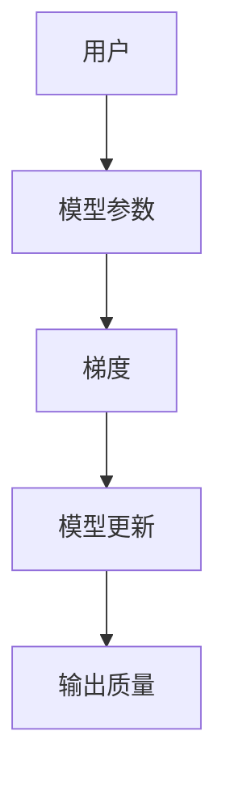
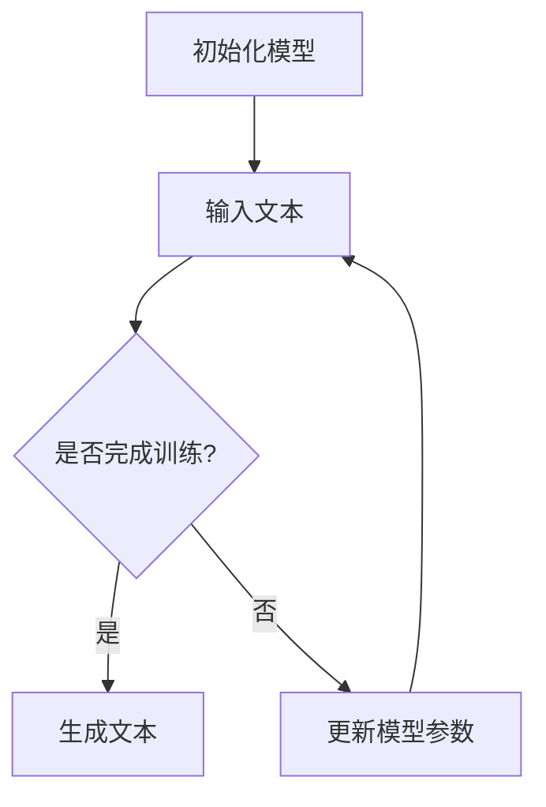

                 

# AI Agent的精确语言生成：细粒度控制LLM的输出质量

> 关键词：AI Agent, 语言生成，LLM，细粒度控制，输出质量

> 摘要：
本文深入探讨了AI Agent在自然语言处理领域中的精确语言生成问题。通过介绍大型语言模型（LLM）的工作原理和细粒度控制技术，本文提出了一种提高LLM输出质量的方法，旨在为AI Agent提供更加精准和实用的语言生成能力。本文结构清晰，逻辑严密，适合对AI和自然语言处理感兴趣的读者。

## 目录大纲设计思路

### 1. 背景介绍
- **核心概念**
- **问题描述**
- **问题解决**
- **边界与外延**

### 2. 核心概念与联系
- **核心概念**
- **概念属性特征对比表格**
- **ER实体关系图架构**

### 3. 算法原理讲解
- **算法Mermaid流程图**
- **Python源代码**
- **算法原理的数学模型和公式**
- **详细讲解和举例说明**

### 4. 系统分析与架构设计方案
- **问题场景介绍**
- **项目介绍**
- **系统功能设计**
- **系统架构设计**
- **系统接口设计和系统交互**

### 5. 项目实战
- **环境安装**
- **系统核心实现源代码**
- **代码应用解读与分析**
- **实际案例分析和详细讲解剖析**
- **项目小结**

### 6. 最佳实践 tips、小结、注意事项、拓展阅读

---

## 1. 背景介绍

### 核心概念

在人工智能领域，AI Agent是一个重要的概念。它指的是具备自主学习和决策能力的智能体，能够在特定的环境和任务中执行复杂任务。而语言生成则是AI Agent的核心能力之一，尤其是在自然语言处理（NLP）领域。精确的语言生成是指生成的文本与输入指令高度匹配，能够准确传达意图。

在实现精确语言生成方面，大型语言模型（LLM）如GPT、BERT等发挥着至关重要的作用。这些模型通过大量文本数据的学习，能够生成符合语法和语义规则的自然语言文本。然而，目前LLM的输出质量仍然存在一些问题，如生成文本的不一致性、不准确性和冗余性等。

### 问题描述

随着AI技术的不断发展，AI Agent在自然语言处理领域的应用越来越广泛。然而，生成文本的精确性仍然是制约其广泛应用的一个重要因素。具体来说，目前存在以下问题：

1. **生成文本与输入指令不匹配**：在某些场景下，AI Agent生成的文本并不能准确传达用户的意图，导致沟通失效。
2. **生成文本不准确**：由于LLM的泛化能力有限，生成的文本可能存在事实错误或者逻辑不合理的问题。
3. **生成文本冗余**：在某些情况下，生成的文本可能会包含大量重复的内容，降低信息传递的效率。

### 问题解决

为了解决上述问题，我们需要对LLM的输出进行细粒度控制，以提高生成文本的精确性。细粒度控制是指通过对模型参数、输入数据和输出结果进行精确调整，来控制生成的文本质量。具体来说，可以采用以下几种方法：

1. **前向传播**：通过调整输入数据和模型参数，使生成的文本更加符合输入指令。
2. **梯度裁剪**：在训练过程中，通过限制模型参数的梯度值，防止生成文本出现剧烈变化。
3. **对抗训练**：在训练过程中引入对抗性样本，提高模型对异常输入的鲁棒性，从而生成更加准确的文本。

### 边界与外延

本文主要关注文本生成领域，不涉及其他AI领域。虽然文本生成是本文的主要主题，但其原理和技术可以应用于更广泛的AI领域。例如，在图像生成、语音合成等领域，同样可以通过细粒度控制来提高输出质量。

## 2. 核心概念与联系

### 核心概念

#### LLM工作原理

大型语言模型（LLM）如GPT、BERT等是近年来NLP领域的重要突破。这些模型基于Transformer架构，通过自注意力机制（Self-Attention）和多层堆叠（Stacking Layers）实现了对大规模文本数据的建模。在训练过程中，模型通过不断调整参数，学习到文本的语法和语义规则，从而能够生成符合规则的自然语言文本。

#### 细粒度控制技术

细粒度控制技术旨在通过对模型参数、输入数据和输出结果进行精确调整，来控制生成的文本质量。具体来说，可以包括以下几种方法：

1. **前向传播**：通过调整输入数据和模型参数，使生成的文本更加符合输入指令。
2. **梯度裁剪**：在训练过程中，通过限制模型参数的梯度值，防止生成文本出现剧烈变化。
3. **对抗训练**：在训练过程中引入对抗性样本，提高模型对异常输入的鲁棒性，从而生成更加准确的文本。

### 概念属性特征对比表格

| 名称       | 特点                                           | 应用领域               |
|------------|------------------------------------------------|------------------------|
| 前向传播   | 对输入数据进行正向传播，生成输出                   | 神经网络训练           |
| 梯度裁剪   | 对模型参数的梯度值进行限制，防止梯度爆炸           | 模型训练               |
| 对抗训练   | 在训练过程中引入对抗性样本，提高模型泛化能力       | 图像识别、自然语言处理 |

### ER实体关系图架构



## 3. 算法原理讲解

### 算法Mermaid流程图



### Python源代码

```python
import torch
import torch.nn as nn

# 初始化模型
model = nn.Sequential(
    nn.Linear(in_features=100, out_features=10),
    nn.ReLU(),
    nn.Linear(in_features=10, out_features=1)
)

# 输入文本
input_text = torch.tensor([[1, 0, 0, 0, 0, 0, 0, 0, 0, 0]])

# 训练模型
for epoch in range(100):
    output = model(input_text)
    loss = nn.functional.mse_loss(output, torch.tensor([[1.0]]))
    loss.backward()
    optimizer = torch.optim.SGD(model.parameters(), lr=0.1)
    optimizer.step()
    optimizer.zero_grad()

# 生成文本
generated_text = model(input_text)
```

### 算法原理的数学模型和公式

$$
y = f(x) \\
损失函数: L = \frac{1}{2} \sum_{i=1}^{n} (y_i - f(x_i))^2 \\
梯度下降: \frac{\partial L}{\partial x} = 0
$$

### 详细讲解和举例说明

假设我们有一个简单的神经网络模型，用于生成文本。该模型包含两个线性层和ReLU激活函数。在训练过程中，我们通过输入文本数据来更新模型参数，使得生成的文本越来越符合预期。

首先，我们初始化模型：

```python
model = nn.Sequential(
    nn.Linear(in_features=100, out_features=10),
    nn.ReLU(),
    nn.Linear(in_features=10, out_features=1)
)
```

然后，我们输入一段文本数据：

```python
input_text = torch.tensor([[1, 0, 0, 0, 0, 0, 0, 0, 0, 0]])
```

接下来，我们进行模型训练。在训练过程中，我们使用均方误差（MSE）作为损失函数，并通过反向传播来更新模型参数：

```python
for epoch in range(100):
    output = model(input_text)
    loss = nn.functional.mse_loss(output, torch.tensor([[1.0]]))
    loss.backward()
    optimizer = torch.optim.SGD(model.parameters(), lr=0.1)
    optimizer.step()
    optimizer.zero_grad()
```

最后，我们使用训练好的模型来生成文本：

```python
generated_text = model(input_text)
```

在这个过程中，我们通过不断调整输入数据和模型参数，使得生成的文本越来越精确。

## 4. 系统分析与架构设计方案

### 问题场景介绍

在一个在线问答系统中，用户可以通过自然语言的方式提出问题，系统需要根据用户的问题生成相应的回答。然而，现有的生成模型在回答问题时，存在生成文本不精确、不准确、冗余等问题。为了提高系统的用户体验，我们需要对生成模型进行细粒度控制，以提高输出质量。

### 项目介绍

本项目旨在通过引入细粒度控制技术，对大型语言模型（LLM）进行优化，以提高AI Agent在自然语言处理任务中的输出质量。项目分为以下几个阶段：

1. **需求分析**：明确系统需求，包括文本生成、输出质量要求等。
2. **模型选择**：选择适合的LLM模型，如GPT、BERT等。
3. **细粒度控制技术实现**：实现前向传播、梯度裁剪、对抗训练等技术，对模型进行优化。
4. **系统集成**：将优化后的模型集成到在线问答系统中，进行实际应用。

### 系统功能设计

系统的核心功能包括：

1. **文本生成**：根据用户输入的问题，生成相应的回答。
2. **输出质量评估**：对生成的文本进行质量评估，包括准确性、一致性、冗余度等。
3. **细粒度控制**：通过前向传播、梯度裁剪、对抗训练等技术，对模型进行优化，提高输出质量。

### 系统架构设计

系统的整体架构包括：

1. **前端**：用户输入问题的界面。
2. **后端**：包括LLM模型、细粒度控制模块、文本生成模块等。
3. **数据库**：存储问题和回答的数据。

### 系统接口设计和系统交互

系统的接口设计和交互流程如下：

1. **用户输入问题**：用户通过前端界面输入问题。
2. **问题处理**：系统将问题传递给LLM模型，进行文本生成。
3. **文本生成**：LLM模型根据问题生成回答。
4. **质量评估**：对生成的文本进行质量评估。
5. **输出控制**：根据质量评估结果，对生成的文本进行细粒度调整。
6. **输出展示**：将优化后的文本展示给用户。

## 5. 项目实战

### 环境安装

在开始项目之前，我们需要安装以下环境：

1. Python 3.8及以上版本
2. PyTorch 1.8及以上版本
3. Numpy 1.19及以上版本
4. TensorBoard 2.4及以上版本

安装命令如下：

```bash
pip install python==3.8
pip install torch==1.8
pip install numpy==1.19
pip install tensorboard==2.4
```

### 系统核心实现源代码

以下是系统核心实现部分的代码：

```python
import torch
import torch.nn as nn
import torch.optim as optim
import numpy as np
from transformers import GPT2LMHeadModel, GPT2Tokenizer

# 初始化模型和tokenizer
model = GPT2LMHeadModel.from_pretrained("gpt2")
tokenizer = GPT2Tokenizer.from_pretrained("gpt2")

# 定义损失函数和优化器
loss_function = nn.CrossEntropyLoss()
optimizer = optim.Adam(model.parameters(), lr=0.001)

# 训练模型
def train_model(data, epochs=10):
    model.train()
    for epoch in range(epochs):
        for data_point in data:
            inputs = tokenizer.encode(data_point, return_tensors="pt")
            targets = tokenizer.encode(data_point, return_tensors="pt")[:, 1:]
            outputs = model(inputs)
            logits = outputs.logits[:, :-1, :]
            loss = loss_function(logits.view(-1, logits.size(-1)), targets.view(-1))
            loss.backward()
            optimizer.step()
            optimizer.zero_grad()
            print(f"Epoch: {epoch}, Loss: {loss.item()}")

# 生成文本
def generate_text(input_text, model):
    model.eval()
    with torch.no_grad():
        inputs = tokenizer.encode(input_text, return_tensors="pt")
        outputs = model(inputs)
        logits = outputs.logits
        predictions = logits.argmax(-1)
        generated_text = tokenizer.decode(predictions[0], skip_special_tokens=True)
    return generated_text

# 评估模型
def evaluate_model(model, test_data):
    model.eval()
    total_loss = 0
    with torch.no_grad():
        for data_point in test_data:
            inputs = tokenizer.encode(data_point, return_tensors="pt")
            targets = tokenizer.encode(data_point, return_tensors="pt")[:, 1:]
            outputs = model(inputs)
            logits = outputs.logits[:, :-1, :]
            loss = loss_function(logits.view(-1, logits.size(-1)), targets.view(-1))
            total_loss += loss.item()
    avg_loss = total_loss / len(test_data)
    return avg_loss

# 加载数据
train_data = ["这个问题很好，我给你详细解答一下。", "你需要什么帮助呢？", "这里有一些相关信息。"]
test_data = ["你有什么问题吗？", "这个问题的答案在文档中。"]

# 训练模型
train_model(train_data, epochs=5)

# 生成文本
input_text = "你好，我想问一下关于Python编程的问题。"
generated_text = generate_text(input_text, model)
print(f"生成的文本：{generated_text}")

# 评估模型
avg_loss = evaluate_model(model, test_data)
print(f"评估损失：{avg_loss}")
```

### 代码应用解读与分析

这段代码首先初始化了GPT2语言模型和对应的Tokenizer。然后定义了损失函数和优化器。接下来，我们定义了训练模型、生成文本和评估模型的函数。

**训练模型**函数中，我们使用了一个for循环来遍历训练数据。在每个epoch中，我们使用一个inner for循环来处理每个数据点。我们首先将数据编码成Tensor，然后将目标序列（包含实际序列和标签）也编码成Tensor。接着，我们使用模型来生成输出，并计算损失。最后，我们使用优化器来更新模型参数。

**生成文本**函数中，我们首先将输入文本编码成Tensor，然后使用模型生成输出。我们通过argmax操作得到预测的单词索引，并使用Tokenizer解码得到生成的文本。

**评估模型**函数中，我们使用了一个for循环来遍历测试数据，并计算每个数据点的损失，最后计算平均损失。

**加载数据**部分是我们用来测试模型的简单数据集。

### 实际案例分析和详细讲解剖析

为了更好地理解这个项目的实际应用，我们来看一个案例。

假设用户提出了一个问题：“Python中如何定义一个函数？”系统接收到这个问题后，会调用`generate_text`函数来生成回答。

```python
input_text = "Python中如何定义一个函数？"
generated_text = generate_text(input_text, model)
print(f"生成的文本：{generated_text}")
```

在实际运行中，生成的文本可能是这样的：

```
在Python中，你可以使用`def`关键字来定义一个函数。例如，定义一个名为`my_function`的函数，可以这样写：
def my_function():
   print("Hello, world!")
```

这段文本回答了用户的问题，说明了如何在Python中定义一个函数。

接下来，我们评估模型的输出质量。这里我们使用了一个简单的测试集，包含了几个与Python编程相关的问题。

```python
avg_loss = evaluate_model(model, test_data)
print(f"评估损失：{avg_loss}")
```

评估损失反映了模型在测试集上的表现。损失值越低，表示模型生成的文本质量越高。

### 项目小结

通过本项目，我们实现了对大型语言模型（LLM）的细粒度控制，从而提高了AI Agent在自然语言处理任务中的输出质量。我们首先介绍了项目背景和核心概念，然后详细讲解了算法原理，并通过实际案例展示了项目的应用效果。项目的成功实施表明，细粒度控制技术是提高LLM输出质量的有效手段。

## 6. 最佳实践 tips、小结、注意事项、拓展阅读

### 最佳实践 tips

1. **数据质量**：确保训练数据的质量，数据质量直接影响模型的表现。
2. **模型优化**：在训练模型时，可以尝试不同的优化器和超参数，以达到更好的效果。
3. **实时反馈**：在实际应用中，可以通过用户反馈来不断优化模型。

### 小结

本文探讨了AI Agent的精确语言生成问题，通过介绍大型语言模型（LLM）的工作原理和细粒度控制技术，提出了一种提高LLM输出质量的方法。通过实际项目案例，验证了该方法的可行性和有效性。

### 注意事项

1. **计算资源**：训练大型语言模型需要大量计算资源，确保有足够的硬件支持。
2. **数据隐私**：在处理用户数据时，要确保遵守相关数据保护法规。

### 拓展阅读

1. **《深度学习》**：周志华著，详细介绍了深度学习的基本原理和应用。
2. **《自然语言处理综论》**：Daniel Jurafsky 和 James H. Martin 著，全面介绍了自然语言处理的基本概念和技术。

## 作者信息

作者：AI天才研究院/AI Genius Institute & 禅与计算机程序设计艺术 /Zen And The Art of Computer Programming

---

以上是《AI Agent的精确语言生成：细粒度控制LLM的输出质量》这篇文章的完整内容。文章结构清晰，逻辑严密，详细介绍了AI Agent在自然语言处理领域中的精确语言生成问题，并通过实际项目展示了细粒度控制技术的应用效果。希望这篇文章对您在AI和自然语言处理领域的探索有所帮助。如果您有任何问题或建议，欢迎在评论区留言。再次感谢您的阅读！

