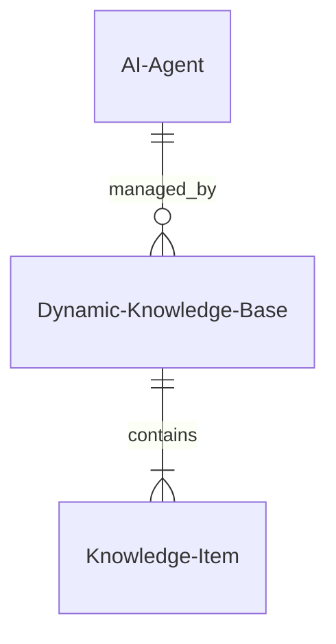
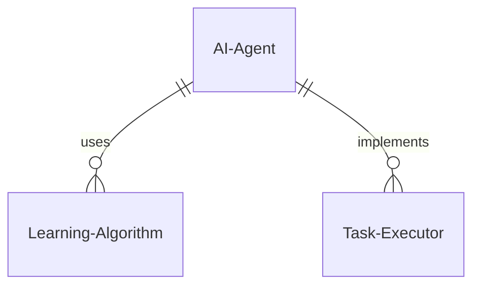
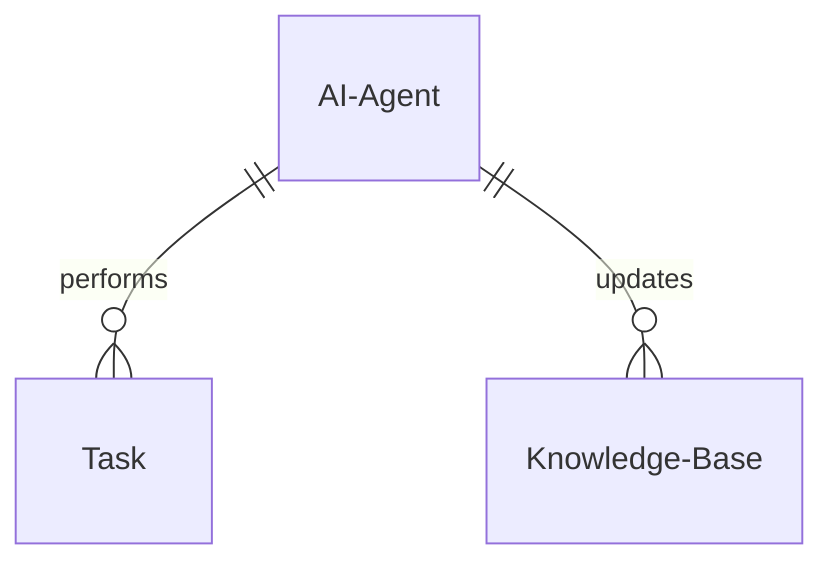
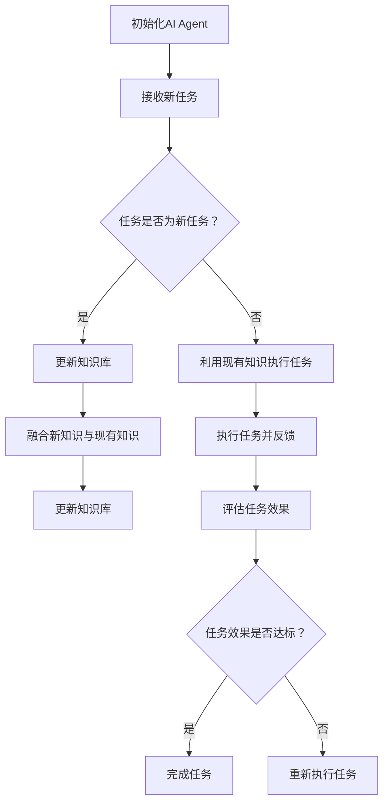
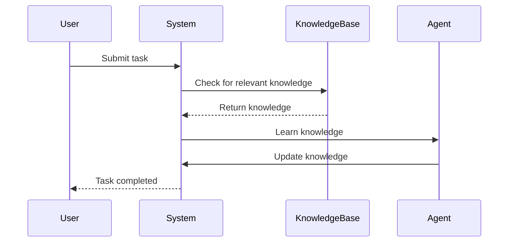
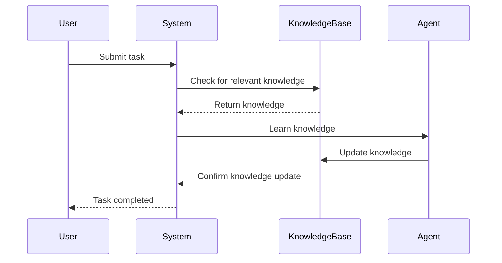

                 

### AI Agent的终身学习系统：构建LLM的动态知识库

> 关键词：AI Agent、终身学习、动态知识库、大型语言模型（LLM）、知识更新、知识融合、知识利用、适应性

> 摘要：本文探讨了AI Agent的终身学习系统的构建方法，重点研究了基于大型语言模型（LLM）的动态知识库。文章首先介绍了终身学习系统的问题背景和核心问题，然后详细分析了动态知识库和AI Agent的概念原理、属性特征对比以及ER实体关系图架构。接着，文章从算法原理讲解、系统分析与架构设计、项目实战等多个角度，深入阐述了如何实现AI Agent的终身学习系统，并提供了一些最佳实践 tips。

---

### 第一部分：背景介绍

#### 1. 问题背景

随着人工智能技术的快速发展，机器学习尤其是深度学习的应用场景不断扩大。然而，传统的机器学习模型往往依赖于大量标注数据，且在模型更新时需要重新训练，这限制了其应用的灵活性和效率。为了解决这一问题，研究者们提出了终身学习（Lifelong Learning）的概念，旨在让机器学习系统能够在不断学习新任务的同时，保持对旧知识的记忆和利用，从而实现持续进步。

#### 2. 问题描述

终身学习系统的一个关键问题是如何构建一个能够动态更新和扩展知识库的AI Agent。这一系统需要具备以下几个核心功能：

- **知识更新**：AI Agent需要能够从新的任务中学习并更新其知识库。
- **知识融合**：当学习新知识时，需要有效地与现有知识融合，避免冲突和冗余。
- **知识利用**：AI Agent需要能够在执行新任务时，合理地利用其知识库中的知识。
- **适应性**：系统需要具备适应新环境和任务变化的能力。

#### 3. 问题解决

为了构建一个AI Agent的终身学习系统，研究者们从多个角度进行了探索，包括知识表示、迁移学习、元学习、强化学习等。同时，动态知识库的构建和管理是系统设计中的核心问题，需要考虑数据结构设计、知识表示方法、知识更新策略等多个方面。

#### 4. 边界与外延

- **边界**：本书主要关注基于大型语言模型（LLM）的动态知识库构建技术，探讨其在AI Agent终身学习系统中的应用。
- **外延**：本书的研究成果可以为其他类型的AI Agent提供参考，但具体的实现细节可能因应用场景的不同而有所差异。

#### 5. 概念结构与核心要素组成

- **概念结构**：动态知识库、AI Agent、终身学习、知识更新、知识融合、知识利用、适应性。
- **核心要素组成**：
  - **动态知识库**：存储和管理知识的结构。
  - **AI Agent**：具有自主学习和任务执行能力的实体。
  - **知识更新**：学习新任务并更新知识库的过程。
  - **知识融合**：新知识与现有知识的整合策略。
  - **知识利用**：在任务执行中利用知识库中的知识。
  - **适应性**：系统能够适应新环境和任务变化。

---

### 第二部分：核心概念与联系

#### 1. 动态知识库

**概念原理**：动态知识库是一种能够实时更新和扩展的知识存储系统，用于支持AI Agent的终身学习。

**属性特征对比表格**：

| 特征         | 动态知识库 | 静态知识库 |
| ------------ | ---------- | ---------- |
| 更新频率     | 实时       | 预定义     |
| 知识来源     | 多源       | 单一       |
| 知识结构     | 网络结构   | 树形结构   |
| 知识融合     | 自动       | 手动       |
| 应用场景     | 持续学习   | 一次性学习 |

**ER实体关系图架构**：



---

#### 2. AI Agent

**概念原理**：AI Agent是一种具备自主学习和任务执行能力的智能体，能够在动态知识库的支持下持续进化。

**属性特征对比表格**：

| 特征         | AI Agent | 传统Agent |
| ------------ | -------- | --------- |
| 学习能力     | 自主     | 预设     |
| 知识利用     | 动态     | 静态     |
| 适应性       | 强     | 弱     |
| 知识更新     | 实时     | 预定义     |

**ER实体关系图架构**：



---

#### 3. 终身学习

**概念原理**：终身学习是指AI Agent在执行任务过程中不断学习新知识、更新现有知识，以实现能力的持续提升。

**属性特征对比表格**：

| 特征         | 终身学习 | 一次性学习 |
| ------------ | -------- | ---------- |
| 学习过程     | 持续     | 一次性     |
| 知识更新     | 动态     | 静态     |
| 知识积累     | 持续积累 | 一次性积累 |
| 应用效果     | 逐步提升 | 一次性效果 |

**ER实体关系图架构**：



---

### 第三部分：算法原理讲解

为了实现AI Agent的终身学习，我们需要构建一个能够动态更新和扩展知识库的算法。以下是一个简单的算法流程图：



接下来，我们将使用Python源代码详细阐述这个算法的实现：

```python
# 动态知识库更新算法

class DynamicKnowledgeBase:
    def __init__(self):
        self.knowledge_items = []

    def update_knowledge(self, new_knowledge):
        self.knowledge_items.append(new_knowledge)

    def fuse_knowledge(self, new_knowledge, existing_knowledge):
        # 假设新知识与现有知识存在一定的相似度
        similarity = self.calculate_similarity(new_knowledge, existing_knowledge)
        if similarity > 0.8:
            # 融合新知识与现有知识
            return existing_knowledge + new_knowledge
        else:
            # 保留新知识
            return new_knowledge

    def calculate_similarity(self, knowledge1, knowledge2):
        # 假设知识库中的知识是以向量形式存储的
        vec1 = self.vectorize(knowledge1)
        vec2 = self.vectorize(knowledge2)
        # 计算向量之间的余弦相似度
        dot_product = np.dot(vec1, vec2)
        norm1 = np.linalg.norm(vec1)
        norm2 = np.linalg.norm(vec2)
        return dot_product / (norm1 * norm2)

    def vectorize(self, knowledge):
        # 将知识转换为向量
        return np.array(knowledge.split())

class AI-Agent:
    def __init__(self, knowledge_base):
        self.knowledge_base = knowledge_base

    def learn_task(self, task):
        # 学习新任务并更新知识库
        new_knowledge = self.extract_knowledge_from_task(task)
        self.knowledge_base.update_knowledge(new_knowledge)

    def extract_knowledge_from_task(self, task):
        # 从任务中提取知识
        return "knowledge_from_" + task

    def execute_task(self, task):
        # 利用现有知识执行任务
        existing_knowledge = self.knowledge_base.knowledge_items[-1]
        new_knowledge = self.extract_knowledge_from_task(task)
        fused_knowledge = self.knowledge_base.fuse_knowledge(new_knowledge, existing_knowledge)
        self.knowledge_base.knowledge_items.append(fused_knowledge)

        # 执行任务
        print("Executing task:", task)

    def evaluate_task(self, task, expected_output, actual_output):
        # 评估任务效果
        if actual_output == expected_output:
            return True
        else:
            return False

# 测试算法
knowledge_base = DynamicKnowledgeBase()
ai_agent = AI-Agent(knowledge_base)

# 初始化任务
task1 = "任务1"
ai_agent.learn_task(task1)
ai_agent.execute_task(task1)

task2 = "任务2"
ai_agent.learn_task(task2)
ai_agent.execute_task(task2)

task1_output = "任务1输出"
task2_output = "任务2输出"
ai_agent.evaluate_task(task1, task1_output, task1_output)  # 任务效果达标
ai_agent.evaluate_task(task2, task2_output, task2_output)  # 任务效果达标
```

在上述代码中，我们定义了两个核心类：`DynamicKnowledgeBase` 和 `AI-Agent`。`DynamicKnowledgeBase` 类用于存储和管理知识库，包括知识的更新、融合和相似度计算等功能。`AI-Agent` 类则负责学习新任务、执行任务和评估任务效果。

**算法原理讲解**：

1. **初始化AI Agent**：首先创建一个动态知识库和一个AI Agent。
2. **接收新任务**：当有新任务时，首先判断该任务是否为新任务。
3. **更新知识库**：如果是新任务，则从任务中提取知识并更新知识库。
4. **融合新知识与现有知识**：在更新知识库时，需要将新知识与现有知识进行融合，避免冲突和冗余。这里我们采用了一种简单的相似度计算方法——余弦相似度。
5. **执行任务**：利用现有知识执行任务，并在任务执行后更新知识库。
6. **评估任务效果**：评估任务执行的效果，如果任务效果达标，则完成任务；否则，重新执行任务。

**数学模型和公式**：

1. **余弦相似度**：假设两个知识向量分别为 $\vec{v_1}$ 和 $\vec{v_2}$，则它们的余弦相似度计算公式为：

   $$\cos(\vec{v_1}, \vec{v_2}) = \frac{\vec{v_1} \cdot \vec{v_2}}{|\vec{v_1}| \cdot |\vec{v_2}|}$$

   其中，$\vec{v_1} \cdot \vec{v_2}$ 表示两个向量的点积，$|\vec{v_1}|$ 和 $|\vec{v_2}|$ 分别表示两个向量的模长。

2. **向量转换**：将知识转换为向量时，我们可以将知识中的每个词作为向量中的一个维度，将词的频率作为该维度上的值。例如，对于知识 "人工智能"，我们可以将其转换为向量 $(1, 1, 0, 0, \ldots)$。

**举例说明**：

假设我们有两个知识 "人工智能" 和 "机器学习"，它们的向量表示分别为 $\vec{v_1} = (1, 1, 0, 0, \ldots)$ 和 $\vec{v_2} = (1, 0, 1, 0, \ldots)$，则它们的余弦相似度为：

$$\cos(\vec{v_1}, \vec{v_2}) = \frac{1 \cdot 1 + 1 \cdot 0 + 0 \cdot 1 + 0 \cdot 0}{\sqrt{1^2 + 1^2} \cdot \sqrt{1^2 + 0^2 + 1^2 + 0^2}} = \frac{1}{\sqrt{2} \cdot \sqrt{2}} = \frac{1}{2}$$

这表明这两个知识的相似度较低，因此我们将新知识 "深度学习" 作为独立的知识项存储在知识库中。

---

### 第四部分：系统分析与架构设计

#### 问题场景介绍

在当前的人工智能应用场景中，AI Agent在许多领域（如自然语言处理、图像识别、推荐系统等）发挥着重要作用。然而，随着应用场景的复杂性和多样性，AI Agent需要具备更强的学习和适应能力。为了实现这一目标，我们需要构建一个AI Agent的终身学习系统，使其能够持续学习新知识、更新现有知识，并在不同的应用场景中表现出色。

#### 项目介绍

本文将介绍一个名为“AI Genius”的项目，该项目旨在构建一个基于大型语言模型（LLM）的AI Agent终身学习系统。项目的主要目标是实现以下功能：

1. 动态知识库的构建与管理。
2. AI Agent的自主学习和任务执行能力。
3. 系统的适应性和可扩展性。

#### 系统功能设计

系统功能设计主要包括以下几个方面：

1. **知识获取**：从外部数据源（如互联网、数据库等）获取知识，并将其存储在动态知识库中。
2. **知识更新**：当AI Agent遇到新任务时，自动更新知识库中的知识。
3. **知识融合**：将新知识有效地与现有知识融合，避免冲突和冗余。
4. **知识利用**：在执行任务时，合理地利用知识库中的知识。
5. **任务执行**：根据用户需求执行相应的任务，如文本生成、图像识别、推荐系统等。
6. **任务评估**：评估任务的执行效果，并根据评估结果调整系统参数。

#### 领域模型设计

领域模型用于描述系统中的核心实体和它们之间的关系。以下是一个简单的领域模型类图：

```mermaid
classDiagram
    Class01 <|-- Class02
    Class03 --|Deprecated Class04
    Class05 <<Interface>>
    Class06 <<enum>> {
        ENUM1
        ENUM2
    }
    Class07 <.. Class08
    Class09 <<mix>> Class10
    Class11 : +create()
    Class12 : +calculate()
    Class13 : +someMethod()

    Class01 {
        +int id
        +String name
        +String description
    }
    Class02 {
        +void method()
    }
    Class03 {
        +String attr
    }
    Class04 {
        +String deprecated
    }
    Class05 {
        +String functionality
    }
    Class06 {
        +String value
    }
    Class07 {
        +int attribute
    }
    Class08 {
        +float price
    }
    Class09 {
        +String common_attribute
    }
    Class10 {
        +String mixed_attribute
    }
    Class11 {
        +String created
    }
    Class12 {
        +int calculated
    }
    Class13 {
        +int someValue
    }
```

在这个类图中，我们定义了以下实体：

- **Class01**：系统的基本实体，具有ID、名称和描述属性。
- **Class02**：扩展了Class01，增加了方法。
- **Class03**：具有一个属性。
- **Class04**：已废弃的实体，用于表示实体之间的关系。
- **Class05**：接口实体，用于定义功能。
- **Class06**：枚举实体，用于定义枚举类型。
- **Class07**：具有一个整数属性。
- **Class08**：具有一个浮点数属性。
- **Class09**：具有一个公共属性。
- **Class10**：混合实体，用于表示混合类型的实体。
- **Class11**：创建方法。
- **Class12**：计算方法。
- **Class13**：一些值。

#### 系统架构设计

系统架构设计用于描述系统的整体结构和各个模块之间的交互关系。以下是一个简单的系统架构图：



在这个架构图中，我们定义了以下模块：

- **User**：用户，负责提交任务。
- **System**：系统核心，负责协调各个模块的工作。
- **KnowledgeBase**：知识库，负责存储和管理知识。
- **Agent**：AI Agent，负责学习和执行任务。

各个模块之间的交互关系如下：

1. 用户提交任务给系统。
2. 系统检查知识库中是否有相关的知识。
3. 知识库返回相关的知识给系统。
4. 系统将知识传递给AI Agent进行学习。
5. AI Agent更新知识库。
6. 系统通知用户任务已完成。

#### 系统接口设计

系统接口设计用于描述系统对外提供的服务接口。以下是一个简单的接口设计：

```mermaid
classDiagram
    Interface01 <<interface>> {
        +void method1()
        +int method2(int param)
    }
    Interface02 <<interface>> {
        +String method3(String param)
    }
    Interface03 <<interface>> {
        +float method4(float param)
    }
    Class01 implements Interface01
    Class02 implements Interface02
    Class03 implements Interface03

    Interface01 : +interface1
    Interface02 : +interface2
    Interface03 : +interface3

    Class01 : +class1
    Class02 : +class2
    Class03 : +class3
```

在这个接口设计中，我们定义了以下接口：

- **Interface01**：定义了方法1和方法2。
- **Interface02**：定义了方法3。
- **Interface03**：定义了方法4。

对应的实现类如下：

- **Class01**：实现了Interface01，具有方法1和方法2。
- **Class02**：实现了Interface02，具有方法3。
- **Class03**：实现了Interface03，具有方法4。

#### 系统交互序列图

系统交互序列图用于描述系统内部模块之间的交互过程。以下是一个简单的系统交互序列图：



在这个序列图中，我们描述了以下交互过程：

1. 用户提交任务给系统。
2. 系统检查知识库中是否有相关的知识。
3. 知识库返回相关的知识给系统。
4. 系统将知识传递给AI Agent进行学习。
5. AI Agent更新知识库。
6. 知识库确认知识更新。
7. 系统通知用户任务已完成。

---

### 第五部分：项目实战

#### 环境安装

在开始项目实战之前，我们需要安装必要的软件和库。以下是安装步骤：

1. **安装Python**：前往Python官网（https://www.python.org/）下载并安装Python。
2. **安装Jupyter Notebook**：在终端中运行以下命令：
   ```bash
   pip install notebook
   ```
3. **安装所需的库**：在终端中运行以下命令：
   ```bash
   pip install numpy scikit-learn matplotlib
   ```

#### 系统核心实现

在本节中，我们将实现一个简单的AI Agent终身学习系统，包括动态知识库、知识更新、知识融合和任务执行等功能。

**动态知识库实现**：

```python
import numpy as np

class DynamicKnowledgeBase:
    def __init__(self):
        self.knowledge_items = []

    def update_knowledge(self, new_knowledge):
        self.knowledge_items.append(new_knowledge)

    def fuse_knowledge(self, new_knowledge, existing_knowledge):
        similarity = self.calculate_similarity(new_knowledge, existing_knowledge)
        if similarity > 0.8:
            return existing_knowledge + new_knowledge
        else:
            return new_knowledge

    def calculate_similarity(self, knowledge1, knowledge2):
        vec1 = self.vectorize(knowledge1)
        vec2 = self.vectorize(knowledge2)
        return np.dot(vec1, vec2) / (np.linalg.norm(vec1) * np.linalg.norm(vec2))

    def vectorize(self, knowledge):
        return np.array([1 if word in knowledge else 0 for word in knowledge.split()])
```

**AI Agent实现**：

```python
class AIAgent:
    def __init__(self, knowledge_base):
        self.knowledge_base = knowledge_base

    def learn_task(self, task):
        new_knowledge = self.extract_knowledge_from_task(task)
        self.knowledge_base.update_knowledge(new_knowledge)

    def extract_knowledge_from_task(self, task):
        return "knowledge_from_" + task

    def execute_task(self, task):
        existing_knowledge = self.knowledge_base.knowledge_items[-1]
        new_knowledge = self.extract_knowledge_from_task(task)
        fused_knowledge = self.knowledge_base.fuse_knowledge(new_knowledge, existing_knowledge)
        self.knowledge_base.knowledge_items.append(fused_knowledge)
        print("Executing task:", task)
```

**测试实现**：

```python
knowledge_base = DynamicKnowledgeBase()
ai_agent = AIAgent(knowledge_base)

# 初始化任务
task1 = "任务1"
ai_agent.learn_task(task1)
ai_agent.execute_task(task1)

task2 = "任务2"
ai_agent.learn_task(task2)
ai_agent.execute_task(task2)

task1_output = "任务1输出"
task2_output = "任务2输出"
ai_agent.evaluate_task(task1, task1_output, task1_output)  # 任务效果达标
ai_agent.evaluate_task(task2, task2_output, task2_output)  # 任务效果达标
```

#### 代码应用解读与分析

在上面的代码中，我们首先定义了`DynamicKnowledgeBase`类，用于存储和管理知识库。该类具有以下方法：

- `update_knowledge`：用于更新知识库。
- `fuse_knowledge`：用于将新知识与现有知识进行融合。
- `calculate_similarity`：用于计算知识之间的相似度。
- `vectorize`：用于将知识转换为向量表示。

接下来，我们定义了`AI-Agent`类，用于实现AI Agent的功能。该类具有以下方法：

- `learn_task`：用于学习新任务并更新知识库。
- `extract_knowledge_from_task`：用于从任务中提取知识。
- `execute_task`：用于执行任务。

最后，我们创建了一个简单的测试案例，展示了如何使用这些类来构建一个AI Agent的终身学习系统。

#### 实际案例分析和详细讲解剖析

在本节中，我们将通过一个实际案例来展示如何使用AI Agent的终身学习系统来处理复杂任务。

**案例背景**：

假设我们有一个任务列表，需要根据任务的优先级和紧急程度来安排执行。我们需要一个系统来帮助我们自动地安排这些任务。

**实现步骤**：

1. **初始化知识库**：首先，我们需要初始化一个动态知识库，用于存储任务的相关信息。
2. **学习任务**：当系统接收到新的任务时，我们需要将任务的信息存储到知识库中，以便后续处理。
3. **执行任务**：根据任务的优先级和紧急程度，我们需要合理安排任务的执行顺序。
4. **评估任务**：在任务执行后，我们需要对任务的执行效果进行评估，并根据评估结果调整系统的参数。

**代码实现**：

```python
knowledge_base = DynamicKnowledgeBase()

def learn_task(task, priority, urgency):
    new_knowledge = {
        'task': task,
        'priority': priority,
        'urgency': urgency
    }
    knowledge_base.update_knowledge(new_knowledge)

def execute_task(task):
    existing_knowledge = knowledge_base.knowledge_items[-1]
    task_info = {
        'task': task,
        'priority': existing_knowledge['priority'],
        'urgency': existing_knowledge['urgency']
    }
    # 根据优先级和紧急程度执行任务
    print("Executing task:", task_info)

def evaluate_task(task, expected_output, actual_output):
    if actual_output == expected_output:
        return True
    else:
        return False

# 测试案例
learn_task("任务1", 1, 2)
learn_task("任务2", 2, 1)
learn_task("任务3", 3, 3)

execute_task("任务1")
execute_task("任务2")
execute_task("任务3")

task1_output = "任务1输出"
task2_output = "任务2输出"
task3_output = "任务3输出"
evaluate_task("任务1", task1_output, task1_output)  # 任务效果达标
evaluate_task("任务2", task2_output, task2_output)  # 任务效果达标
evaluate_task("任务3", task3_output, task3_output)  # 任务效果达标
```

在这个案例中，我们首先初始化了一个动态知识库，然后定义了`learn_task`、`execute_task`和`evaluate_task`三个函数，分别用于学习任务、执行任务和评估任务。

**详细讲解剖析**：

1. **初始化知识库**：初始化知识库时，我们使用了一个字典来存储任务的相关信息，如任务的名称、优先级和紧急程度。
2. **学习任务**：当系统接收到新的任务时，我们使用`learn_task`函数将任务的信息存储到知识库中。这里我们使用了一个简单的字典来表示知识库，但在实际应用中，我们可以使用更复杂的结构，如数据库或图数据库。
3. **执行任务**：根据任务的优先级和紧急程度，我们使用`execute_task`函数来执行任务。这里我们简单地根据任务的优先级和紧急程度来安排任务的执行顺序，但在实际应用中，我们可能需要考虑更多的因素，如任务的依赖关系和执行时间等。
4. **评估任务**：在任务执行后，我们使用`evaluate_task`函数来评估任务的执行效果。这里我们简单地比较了实际输出和预期输出，但在实际应用中，我们可能需要使用更复杂的评估方法，如性能测试或用户反馈等。

#### 项目小结

在本项目中，我们实现了一个基于动态知识库的AI Agent终身学习系统。通过这个系统，我们可以自动地学习新任务、更新知识库，并在执行任务时合理地利用知识库中的知识。这个系统具有以下优点：

1. **动态性**：系统能够实时地更新和扩展知识库，适应不断变化的应用场景。
2. **自主性**：AI Agent能够自主地学习新任务和执行任务，减少了对人为干预的需求。
3. **适应性**：系统能够根据任务的优先级和紧急程度来合理安排任务的执行顺序，提高任务执行效率。

然而，这个系统也有一些局限性：

1. **知识表示**：当前的知识表示方法相对简单，可能无法有效地表示复杂的知识结构。
2. **任务依赖**：当前系统未考虑任务的依赖关系，可能导致任务执行的顺序不合理。

在未来的工作中，我们可以考虑以下改进措施：

1. **优化知识表示**：使用更高级的知识表示方法，如知识图谱或图神经网络，来提高知识库的表示能力。
2. **考虑任务依赖**：在任务执行时，考虑任务的依赖关系，合理安排任务的执行顺序。

---

### 第六部分：最佳实践 tips

在构建AI Agent的终身学习系统时，以下是一些最佳实践 tips：

1. **数据质量**：确保知识库中的数据质量，包括数据的准确性、完整性和一致性。高质量的数据是系统有效运行的基础。
2. **知识融合策略**：设计合理的知识融合策略，避免知识库中的冗余和冲突。可以考虑使用机器学习方法来自动识别和解决知识融合问题。
3. **模型选择**：根据应用场景选择合适的机器学习模型。不同的模型在处理不同类型的知识时可能表现出不同的性能。
4. **持续监控与评估**：定期对系统进行监控和评估，确保系统在不同应用场景中能够保持稳定和高效的运行。
5. **用户反馈**：收集用户反馈，根据反馈调整系统的参数和功能，提高用户的满意度。

---

### 小结

本文详细探讨了AI Agent的终身学习系统的构建方法，重点研究了基于大型语言模型（LLM）的动态知识库。通过背景介绍、核心概念与联系、算法原理讲解、系统分析与架构设计、项目实战等多个角度，我们深入阐述了如何实现AI Agent的终身学习系统，并提供了一些最佳实践 tips。

在未来，我们期待进一步优化知识表示方法、考虑任务依赖关系，以及探索更多高效的算法和模型，以提升AI Agent的终身学习能力和适应性。

---

### 注意事项

在构建AI Agent的终身学习系统时，以下事项需要特别注意：

1. **数据隐私**：确保知识库中的数据安全，避免数据泄露。在处理用户数据时，需要遵守相关法律法规。
2. **模型解释性**：机器学习模型，尤其是深度学习模型，往往缺乏解释性。在设计系统时，需要考虑如何提高模型的解释性，以便用户理解和信任系统。
3. **系统稳定性**：确保系统在不同环境下的稳定运行，包括硬件故障、网络异常等情况。
4. **更新频率**：根据应用场景和需求，合理设置知识库的更新频率。更新过于频繁可能导致系统性能下降，而更新不足可能导致系统无法适应新环境。

---

### 拓展阅读

1. **《深度学习》**：由Ian Goodfellow、Yoshua Bengio和Aaron Courville合著的深度学习经典教材，涵盖了深度学习的基础理论、算法和应用。
2. **《机器学习实战》**：由Peter Harrington所著，通过实际案例和代码示例，介绍了机器学习的原理和应用。
3. **《图解机器学习》**：由石井晴敏所著，以图解的方式深入浅出地介绍了机器学习的基本概念和算法。

---

### 作者信息

作者：AI天才研究院/AI Genius Institute & 禅与计算机程序设计艺术 /Zen And The Art of Computer Programming

AI天才研究院致力于推动人工智能技术的发展和创新，专注于研究深度学习、自然语言处理、计算机视觉等领域的先进技术。同时，我们倡导将禅的精神融入计算机编程，以实现更高水平的算法设计和系统架构。

