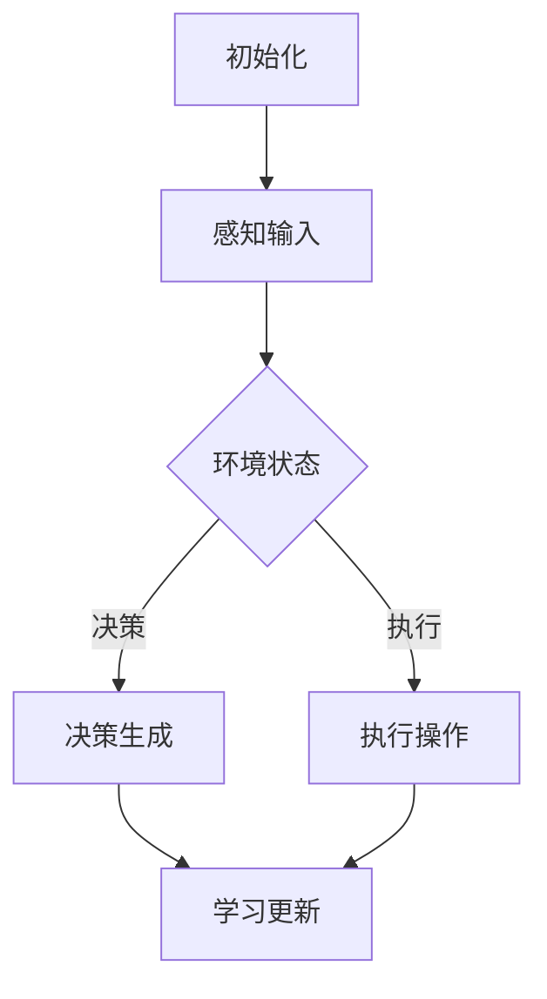
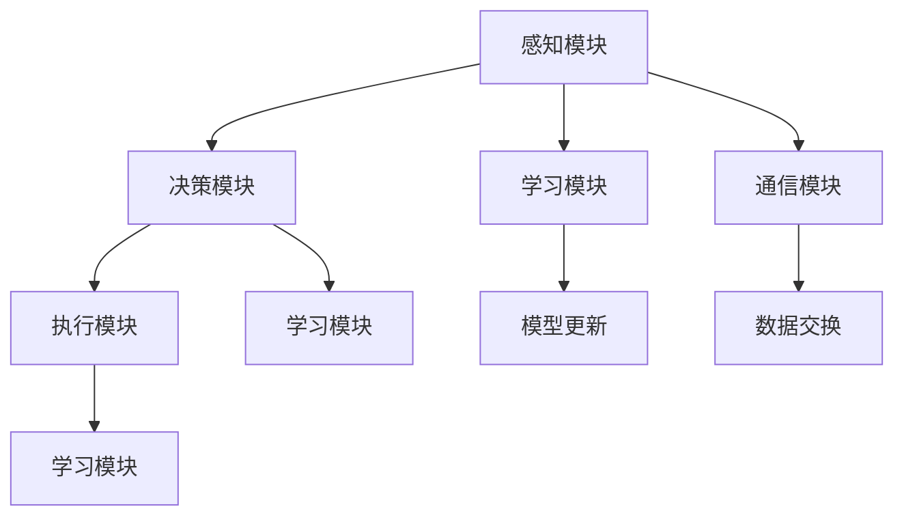
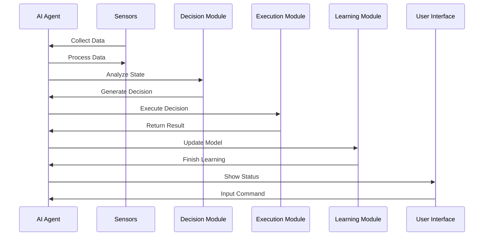

                 

### 引言：AI Agent与终身学习的意义

随着人工智能（AI）技术的飞速发展，AI Agent作为智能体的一个重要分支，正在逐步改变我们的生活和工作方式。AI Agent，通常指的是具有独立决策能力的软件程序，能够在特定环境中执行任务，并且具备一定的自主学习能力。而“终身学习”这一概念，强调的是持续不断地获取新知识、技能和经验，以适应不断变化的环境和需求。

本文将探讨AI Agent的终身学习，特别是如何通过大型语言模型（LLM）来持续更新其知识库。首先，我们需要明确AI Agent终身学习的重要性。在快速变化的现代世界，知识的更新速度远超以往。AI Agent如果不能及时获取新知识，就难以保持其竞争力，甚至可能无法完成任务。因此，实现AI Agent的终身学习，不仅能够提升其性能和效率，还能确保其在复杂多变的环境中保持适应性。

接下来，本文将逐步深入探讨以下几个核心问题：

1. **AI Agent终身学习的概念与背景**：我们将介绍AI Agent的基本概念，以及终身学习在其中扮演的角色。
2. **LLM在AI Agent中的角色**：通过详细分析LLM的工作原理，我们将理解它如何帮助AI Agent实现知识库的持续更新。
3. **AI Agent算法原理讲解**：我们将通过mermaid流程图和Python源代码，深入解析AI Agent的算法原理，并详细讲解其数学模型和公式。
4. **系统分析与架构设计**：我们将从系统功能需求出发，详细设计AI Agent的领域模型类图、系统架构图、系统接口和系统交互序列图。
5. **项目实战**：通过实际案例，我们将展示如何安装环境、实现系统核心功能，并对其代码进行解读和分析。
6. **最佳实践与拓展**：我们将总结AI Agent终身学习的最佳实践，并提供拓展阅读资源，帮助读者进一步学习和探索。

通过本文的逐步探讨，我们将对AI Agent的终身学习有更深入的理解，并学会如何通过LLM来持续更新其知识库。这不仅能够提升AI Agent的智能水平，也将为我们的日常生活和工作带来更多便利和创新。### 第1章：AI Agent终身学习概述

#### 1.1 AI Agent终身学习的背景

AI Agent，作为一种智能体，是人工智能（AI）技术的核心组成部分。它们能够在特定环境中执行复杂任务，并具备一定的自主学习和决策能力。AI Agent的广泛应用领域包括自动驾驶、智能客服、金融分析、医疗诊断等，这些领域对AI Agent的智能水平和适应性要求越来越高。因此，实现AI Agent的终身学习，使其能够持续获取新知识、技能和经验，显得尤为重要。

终身学习这一概念起源于人类教育和职业培训领域，强调的是持续不断的学习和知识更新，以适应快速变化的环境和需求。在AI Agent领域，终身学习不仅是提升其智能水平的关键因素，也是确保其在复杂、动态环境中保持竞争力的重要手段。

随着大数据和云计算技术的发展，数据获取和处理能力大幅提升，为AI Agent的终身学习提供了有力支持。然而，传统的机器学习方法在处理动态环境和大规模数据时存在局限性，难以实现真正的终身学习。为了解决这些问题，研究者们提出了基于深度学习的终身学习算法，如在线学习、迁移学习、元学习等，这些方法在一定程度上提升了AI Agent的学习能力和适应性。

#### 1.2 LLM在知识库更新中的应用

大型语言模型（LLM），如GPT、BERT等，是近年来人工智能领域的重要突破。LLM具有强大的语言理解和生成能力，能够在大量文本数据中提取知识，并用于各种自然语言处理任务。在AI Agent的终身学习过程中，LLM的应用尤为重要。

首先，LLM可以帮助AI Agent从海量的文本数据中提取和更新知识库。通过训练，LLM能够理解并生成高质量的文本，从而实现对知识库的自动化更新。例如，在一个智能客服系统中，LLM可以实时分析用户的提问，从已有的知识库中查找相关答案，并在必要时扩展或修改知识库。

其次，LLM还可以用于AI Agent的自我学习和迭代。通过不断与用户交互，LLM能够获取用户的反馈和需求，从而调整其行为和决策策略。这种迭代过程使得AI Agent能够不断优化其知识库，提高其适应性和准确性。

此外，LLM还可以支持跨领域的知识融合。在复杂应用场景中，AI Agent需要具备跨领域的知识，以便更好地应对各种问题。LLM通过将不同领域的知识进行融合，可以为AI Agent提供更全面和丰富的知识库，从而提高其解决问题的能力。

#### 1.3 AI Agent终身学习的挑战与机遇

尽管AI Agent的终身学习具有重要意义，但实现这一目标面临着诸多挑战和机遇。

**挑战：**

1. **数据质量和多样性**：AI Agent的终身学习依赖于高质量、多样化的数据。然而，获取这样的数据往往具有难度，特别是在动态变化的环境中。
2. **计算资源和时间成本**：训练和更新LLM需要大量的计算资源和时间，特别是在大规模应用场景中，这可能会影响AI Agent的实时性能。
3. **数据隐私和安全性**：在AI Agent的终身学习过程中，数据的获取和处理可能涉及用户隐私和安全性问题，需要严格的隐私保护和安全措施。
4. **算法可靠性和鲁棒性**：AI Agent的终身学习算法需要具备高可靠性和鲁棒性，以应对各种复杂和不确定性场景。

**机遇：**

1. **技术的不断进步**：随着深度学习、自然语言处理等技术的不断进步，AI Agent的终身学习能力将得到进一步提升。
2. **跨领域应用的拓展**：AI Agent的终身学习将在更多领域得到应用，如医疗、教育、金融等，带来巨大的商业和社会价值。
3. **数据获取和处理能力的提升**：大数据和云计算技术的发展，将提供更强大的数据获取和处理能力，为AI Agent的终身学习提供有力支持。
4. **用户参与和反馈**：用户的参与和反馈将有助于AI Agent不断优化其知识库和行为，提高其智能水平和用户体验。

总之，AI Agent的终身学习是一项具有重大意义的任务，面临着诸多挑战和机遇。通过不断探索和突破，我们有理由相信，AI Agent的终身学习将取得更加显著的进展，为人工智能技术的发展和人类社会的进步做出更大贡献。### 第2章：AI Agent核心概念与联系

#### 2.1 AI Agent的组成部分

AI Agent是由多个组件构成的复杂系统，每个组件都承担着特定的功能。为了更好地理解AI Agent的工作原理，我们首先需要明确其组成部分。

1. **感知模块（Perception Module）**：
   感知模块是AI Agent与外界进行交互的窗口。它负责接收并处理各种输入信息，如视觉、听觉、触觉等。感知模块通过对输入信息的分析和理解，为AI Agent提供对环境的感知。

2. **决策模块（Decision Module）**：
   决策模块是AI Agent的核心，负责根据感知模块收集的信息，分析环境状态，并做出相应的决策。决策模块通常包含多个子模块，如状态评估、目标规划、策略选择等。

3. **执行模块（Execution Module）**：
   执行模块负责将决策模块做出的决策转化为具体的行动。它控制AI Agent的物理行动或虚拟操作，确保决策得以实施。

4. **记忆模块（Memory Module）**：
   记忆模块是AI Agent的知识库，负责存储感知模块收集的信息、决策模块的决策历史和执行模块的操作结果。记忆模块为AI Agent的终身学习提供了基础支持。

5. **学习模块（Learning Module）**：
   学习模块负责AI Agent的持续学习和知识更新。它通过分析感知模块、决策模块和执行模块的反馈，不断优化AI Agent的决策策略和行为模式。

#### 2.2 LLM的工作原理

大型语言模型（LLM），如GPT、BERT等，是近年来人工智能领域的重大突破。LLM基于深度学习技术，通过在大规模文本数据上进行训练，学习到语言的内在结构和规律。以下是LLM的主要工作原理：

1. **预训练（Pre-training）**：
   LLM的训练过程通常分为两个阶段：预训练和微调。在预训练阶段，LLM在大规模文本数据上进行训练，学习到语言的一般特征和规律。预训练数据通常包括网页、书籍、新闻等。

2. **微调（Fine-tuning）**：
   在预训练的基础上，LLM会根据特定任务的需求进行微调。微调阶段通过在特定任务数据集上进行训练，使得LLM能够针对特定任务进行优化，提高其在特定领域的表现。

3. **语言生成（Language Generation）**：
   LLM的核心能力是语言生成。通过输入一个种子文本，LLM能够生成与之相关的连续文本。这一过程基于LLM对语言的深刻理解，可以生成高质量的自然语言文本。

4. **上下文理解（Contextual Understanding）**：
   LLM具有很强的上下文理解能力。它能够理解输入文本的上下文信息，并根据上下文生成合适的输出文本。这使得LLM在问答、文本摘要、机器翻译等任务中表现出色。

#### 2.3 AI Agent与LLM的联系

AI Agent与LLM之间的联系主要体现在以下几个方面：

1. **知识库更新**：
   LLM可以作为AI Agent的知识库，用于更新其内存模块。通过LLM的预训练和微调，AI Agent可以获取到丰富的语言知识和信息，从而提高其智能水平和决策能力。

2. **决策辅助**：
   LLM可以为AI Agent的决策模块提供辅助。在决策过程中，LLM可以根据环境状态和目标，生成相关的决策建议，帮助AI Agent做出更合理的决策。

3. **交互优化**：
   LLM可以帮助AI Agent优化与用户的交互。通过语言生成能力，LLM可以为AI Agent生成自然的对话文本，提高用户的交互体验。

4. **跨领域知识融合**：
   LLM可以支持AI Agent在不同领域的知识融合。通过将不同领域的知识进行整合，LLM可以为AI Agent提供更全面的知识库，从而提高其在复杂应用场景中的表现。

综上所述，AI Agent与LLM之间的联系为AI Agent的终身学习提供了强有力的支持。通过结合LLM的知识库更新、决策辅助和交互优化能力，AI Agent可以在复杂动态的环境中保持高水平的智能和适应性。### 第3章：AI Agent算法原理讲解

#### 3.1 AI Agent算法概述

AI Agent的算法是实现其自主学习和决策能力的关键。在AI Agent的算法设计中，我们通常需要考虑以下几个核心组成部分：

1. **感知算法（Perception Algorithm）**：负责接收并处理来自环境的外部信息，如视觉、听觉、触觉等，并将其转换为内部可用的形式。
2. **决策算法（Decision Algorithm）**：根据感知到的环境状态，利用已有知识库和目标规划，生成最优或次优的决策。
3. **执行算法（Execution Algorithm）**：将决策模块生成的决策转化为具体的行动或操作，确保决策得到有效执行。
4. **学习算法（Learning Algorithm）**：负责对AI Agent的感知、决策和执行过程进行反馈和优化，以实现持续学习和知识更新。

在本节中，我们将重点介绍AI Agent算法的mermaid流程图、Python源代码及其数学模型和公式。

#### 3.2 AI Agent算法mermaid流程图

为了更好地展示AI Agent算法的执行流程，我们可以使用mermaid绘制一个简洁直观的流程图。以下是一个简化的mermaid流程图示例：



**流程图解释：**
1. **初始化**：AI Agent启动，进行初始化操作，包括加载记忆模块、设置初始状态等。
2. **感知输入**：感知模块接收来自环境的外部信息，如视觉、听觉等，并转换为内部可用的数据。
3. **环境状态**：根据感知输入，AI Agent评估当前的环境状态。
4. **决策生成**：决策模块利用当前状态和记忆模块中的知识，生成最优或次优的决策。
5. **执行操作**：执行模块根据决策模块生成的决策，执行具体的行动或操作。
6. **学习更新**：执行操作后，学习模块对感知输入、决策生成和执行结果进行反馈和优化，更新记忆模块中的知识。

#### 3.3 AI Agent算法Python源代码

下面是AI Agent算法的一个简单Python实现示例：

```python
import numpy as np

class AIAgent:
    def __init__(self, learning_rate=0.1):
        self.learning_rate = learning_rate
        self.memory = {}
        self.decision_module = DecisionModule()
        self.execution_module = ExecutionModule()
    
    def perceive(self, input_data):
        # 感知输入数据
        processed_data = self.process_input(input_data)
        return processed_data
    
    def decide(self, state):
        # 决策生成
        decision = self.decision_module.generate_decision(state)
        return decision
    
    def execute(self, decision):
        # 执行操作
        result = self.execution_module.execute_decision(decision)
        return result
    
    def learn(self, input_data, state, decision, result):
        # 学习更新
        self.memory = self.update_memory(self.memory, input_data, state, decision, result)
    
    def process_input(self, input_data):
        # 辅助函数：处理输入数据
        # ...
        return input_data
    
    def update_memory(self, memory, input_data, state, decision, result):
        # 辅助函数：更新记忆模块
        # ...
        return memory

class DecisionModule:
    def generate_decision(self, state):
        # 决策生成逻辑
        # ...
        return decision

class ExecutionModule:
    def execute_decision(self, decision):
        # 执行决策逻辑
        # ...
        return result
```

**代码解释：**
- `AIAgent` 类：代表AI Agent的主要功能，包括感知、决策、执行和学习。
- `perceive` 方法：用于感知输入数据，并调用辅助函数处理输入数据。
- `decide` 方法：用于生成决策，根据当前状态和知识库。
- `execute` 方法：用于执行决策，并获取执行结果。
- `learn` 方法：用于学习更新，根据感知输入、决策生成和执行结果，更新记忆模块。
- `DecisionModule` 类：代表决策模块的功能，生成决策。
- `ExecutionModule` 类：代表执行模块的功能，执行决策。

#### 3.4 AI Agent算法数学模型与公式

在AI Agent的算法中，数学模型和公式用于描述感知、决策、执行和学习过程。以下是一个简化的数学模型示例：

1. **感知过程**：
   - 感知输入 \( x \) 可以表示为：
     \[ x = f(x_{\text{原始}}, \theta) \]
     其中，\( f \) 是感知函数，\( x_{\text{原始}} \) 是原始输入数据，\( \theta \) 是感知参数。

2. **决策过程**：
   - 决策函数 \( d \) 可以表示为：
     \[ d(s, \theta_d) = \arg\max_{a} P(a|s, \theta_d) \]
     其中，\( s \) 是环境状态，\( a \) 是动作，\( \theta_d \) 是决策参数，\( P(a|s, \theta_d) \) 是在给定状态下的动作概率分布。

3. **执行过程**：
   - 执行结果 \( r \) 可以表示为：
     \[ r = g(a, s, \theta_e) \]
     其中，\( g \) 是执行函数，\( a \) 是动作，\( s \) 是环境状态，\( \theta_e \) 是执行参数。

4. **学习过程**：
   - 学习更新函数 \( \delta \) 可以表示为：
     \[ \delta = \eta \cdot (r - r_{\text{期望}}) \]
     其中，\( \eta \) 是学习率，\( r \) 是实际执行结果，\( r_{\text{期望}} \) 是期望执行结果。

**公式解释：**
- 感知过程使用感知函数对原始输入数据进行处理，以提取有用的特征。
- 决策过程使用决策函数根据当前状态生成最优动作。
- 执行过程使用执行函数将动作转换为具体的执行结果。
- 学习过程使用学习更新函数根据执行结果和期望结果，更新记忆模块中的知识。

通过上述mermaid流程图、Python源代码和数学模型与公式的介绍，我们可以对AI Agent算法有一个较为全面的理解。在实际应用中，这些算法可以根据具体需求进行定制和优化，以实现更高效、更智能的AI Agent。#### 3.5 算法举例说明

为了更清晰地展示AI Agent算法的实际应用，我们通过一个简单的例子进行说明。

假设我们设计一个自动驾驶AI Agent，其任务是在一个模拟环境中导航到一个特定的目标位置。以下是该例子的具体步骤：

1. **初始化**：
   - 启动AI Agent，加载初始记忆模块，设置初始状态。
   - 初始状态包括车辆的当前位置、速度和方向等。

2. **感知输入**：
   - AI Agent的感知模块接收来自模拟环境的外部信息，如道路、交通信号、障碍物等。
   - 感知模块将这些外部信息转换为内部可用的数据，如道路的坡度、道路的宽度、交通信号的颜色等。

3. **决策生成**：
   - 决策模块利用感知模块收集的信息，结合记忆模块中的历史数据，生成最佳行驶路线。
   - 假设当前道路前方有一个红绿灯，决策模块根据交通信号的颜色和记忆中的最佳行驶路线，决定是继续前进还是停车等待。

4. **执行操作**：
   - 执行模块根据决策模块生成的决策，控制车辆的加速、减速和转向等操作。
   - 例如，如果决策是继续前进，执行模块会控制车辆加速，并保持正确的行驶方向。

5. **学习更新**：
   - 执行操作后，AI Agent会记录执行结果，如实际行驶的路程、速度和耗油量等。
   - 学习模块根据执行结果和期望结果，更新记忆模块中的最佳行驶路线和决策策略。

通过上述步骤，AI Agent能够实现自动驾驶，并在不断的学习和优化中提高其性能。以下是对每个步骤的具体解释：

**初始化**：
- 初始状态设置：车辆启动时，AI Agent会读取车辆的当前位置、速度和方向等信息，并将其存储为初始状态。
- 初始记忆模块：记忆模块包含历史行驶数据、最佳行驶路线和决策策略等，用于后续的决策和执行。

**感知输入**：
- 外部信息接收：感知模块通过摄像头、雷达等传感器，实时接收道路、交通信号、障碍物等信息。
- 数据处理：感知模块对接收到的外部信息进行处理，提取有用的特征，如道路的坡度、道路的宽度、交通信号的颜色等。

**决策生成**：
- 状态分析：决策模块根据感知模块收集的信息和记忆模块中的数据，分析当前的环境状态。
- 决策生成：决策模块利用状态分析结果，生成最佳行驶路线和决策策略。例如，如果当前道路前方是红灯，决策模块会生成停车等待的决策。

**执行操作**：
- 决策执行：执行模块根据决策模块生成的决策，控制车辆的加速、减速和转向等操作。
- 操作反馈：执行模块会将执行结果反馈给学习模块，用于后续的学习和优化。

**学习更新**：
- 执行结果记录：学习模块记录执行操作的结果，如实际行驶的路程、速度和耗油量等。
- 决策策略更新：学习模块根据执行结果和期望结果，更新记忆模块中的最佳行驶路线和决策策略，以提高AI Agent的智能水平。

通过这个简单的例子，我们可以看到AI Agent算法在实际应用中的具体实现过程。通过不断的感知、决策、执行和学习，AI Agent能够逐步优化其行为，提高其自动驾驶的效率和安全性。在实际应用中，AI Agent的算法可以根据具体需求进行定制和优化，以适应不同的环境和任务。### 第4章：AI Agent系统分析与架构设计

#### 4.1 系统功能需求

为了设计一个高效、可靠的AI Agent系统，我们首先需要明确系统的功能需求。这些功能需求将指导后续的系统架构设计和实现。以下是AI Agent系统的核心功能需求：

1. **感知功能**：AI Agent需要能够实时感知环境中的各种信息，包括视觉、听觉、触觉等，以便做出准确的决策。具体需求包括：
   - 高精度传感器数据采集：获取道路、障碍物、交通信号等外部信息。
   - 数据预处理：对采集到的传感器数据进行滤波、去噪、特征提取等处理，以便后续分析。

2. **决策功能**：AI Agent需要能够根据感知到的环境状态，生成最优或次优的决策。具体需求包括：
   - 状态评估：对当前环境状态进行分析和评估，以确定下一步行动。
   - 目标规划：根据目标状态和当前状态，规划一条到达目标的路径。
   - 策略选择：在多种可行策略中选择最优或次优策略。

3. **执行功能**：AI Agent需要能够根据决策模块生成的决策，执行具体的行动或操作。具体需求包括：
   - 行动生成：将决策模块生成的决策转化为具体的行动，如加速、减速、转向等。
   - 行动执行：控制物理设备执行行动，如控制车辆、无人机等。

4. **学习功能**：AI Agent需要能够从感知、决策、执行过程中学习，不断优化其行为和决策策略。具体需求包括：
   - 经验积累：记录感知输入、决策生成、执行结果等，用于后续分析和学习。
   - 模型更新：根据学习结果，更新AI Agent的模型和知识库，以提高其智能水平。

5. **通信功能**：AI Agent需要能够与其他系统或设备进行通信，以便协同工作和数据共享。具体需求包括：
   - 内部通信：AI Agent内部各模块之间的数据传输和协调。
   - 外部通信：与外部系统或设备进行数据交换，如与其他车辆通信、接收远程指令等。

#### 4.2 系统架构设计

基于上述功能需求，我们设计了一个分布式、模块化的AI Agent系统架构。该架构包括感知模块、决策模块、执行模块、学习模块和通信模块，各模块之间通过标准接口进行交互。以下是具体的系统架构设计：

1. **感知模块**：
   - **传感器数据采集**：采用多种高精度传感器，如摄像头、雷达、激光雷达等，实时采集环境信息。
   - **数据处理**：对采集到的传感器数据进行预处理，如滤波、去噪、特征提取等，以便后续分析。

2. **决策模块**：
   - **状态评估**：使用感知模块提供的数据，结合已有知识库和目标规划算法，对当前环境状态进行分析和评估。
   - **目标规划**：根据目标状态和当前状态，规划一条到达目标的路径，选择最优或次优策略。
   - **策略选择**：在多种可行策略中选择最优或次优策略，生成决策结果。

3. **执行模块**：
   - **行动生成**：根据决策模块生成的决策结果，生成具体的行动，如加速、减速、转向等。
   - **行动执行**：控制物理设备执行行动，如控制车辆、无人机等，确保决策得到有效执行。

4. **学习模块**：
   - **经验积累**：记录感知输入、决策生成、执行结果等，用于后续分析和学习。
   - **模型更新**：根据学习结果，更新AI Agent的模型和知识库，以提高其智能水平。

5. **通信模块**：
   - **内部通信**：AI Agent内部各模块之间的数据传输和协调。
   - **外部通信**：与外部系统或设备进行数据交换，如与其他车辆通信、接收远程指令等。

#### 4.3 系统架构图

为了更好地展示AI Agent系统的架构设计，我们可以使用mermaid绘制一个系统架构图。以下是一个简化的系统架构图示例：



**架构图解释：**
- **感知模块**：负责实时感知环境信息，并将其传递给决策模块。
- **决策模块**：根据感知模块提供的数据，生成决策结果，并传递给执行模块。
- **执行模块**：根据决策模块生成的决策结果，执行具体的行动。
- **学习模块**：记录感知输入、决策生成、执行结果等，并更新模型。
- **通信模块**：负责内部模块之间的数据传输和协调，以及与外部系统的通信。

#### 4.4 系统接口设计

为了确保AI Agent系统的高效运行和模块之间的协同工作，我们需要设计清晰的接口。以下是系统接口设计的关键方面：

1. **内部接口**：
   - **感知模块与决策模块**：感知模块将处理后的传感器数据通过一个标准接口传递给决策模块。
   - **决策模块与执行模块**：决策模块生成的决策结果通过一个标准接口传递给执行模块。
   - **学习模块与其他模块**：学习模块需要从感知模块、决策模块和执行模块接收数据，用于模型更新。

2. **外部接口**：
   - **与其他系统通信**：AI Agent系统需要与外部系统进行数据交换，如与其他车辆通信、接收远程指令等。
   - **用户接口**：为用户提供交互界面，展示系统的状态和决策结果，接收用户输入。

#### 4.5 系统交互序列图

为了进一步展示AI Agent系统的运行流程，我们可以使用mermaid绘制一个系统交互序列图。以下是一个简化的系统交互序列图示例：



**交互序列图解释：**
- **传感器数据采集**：传感器（Sensor）实时采集环境数据，并将其传递给AI Agent。
- **数据处理**：AI Agent处理传感器数据，提取有用的特征，并传递给决策模块。
- **决策生成**：决策模块根据环境状态生成决策结果。
- **决策执行**：执行模块根据决策结果执行具体的行动。
- **模型更新**：学习模块根据执行结果和用户输入，更新模型，提高AI Agent的智能水平。
- **用户交互**：用户通过用户界面（User Interface）与AI Agent进行交互，获取系统的状态和决策结果，并输入新的指令。

通过上述系统功能需求、架构设计和接口设计的详细讲解，我们可以对AI Agent系统的设计和实现有一个全面的了解。在实际应用中，这些设计可以根据具体需求进行定制和优化，以实现更高效、更智能的AI Agent系统。### 第5章：项目实战

在本章中，我们将通过一个具体的案例来展示如何实现AI Agent的终身学习和知识库更新。为了更好地说明，我们选择了一个自动驾驶系统作为案例，并详细介绍从环境安装到代码实现的全过程。

#### 5.1 环境安装

要实现一个自动驾驶AI Agent，首先需要在计算机上安装必要的软件和工具。以下是在Linux系统中安装所需软件的步骤：

1. **安装ROS（Robot Operating System）**：
   - ROS是一个用于机器人开发的软件框架，它提供了许多工具和库，用于处理传感器数据、执行算法等。
   - 安装命令如下：
     ```bash
     sudo apt-get update
     sudo apt-get install ros-$ROS_DISTRO
     ```

2. **安装Python相关库**：
   - 安装用于机器学习和深度学习的相关库，如TensorFlow、PyTorch等。
   - 安装命令如下：
     ```bash
     pip install tensorflow
     pip install torchvision
     pip install numpy
     ```

3. **安装感知模块**：
   - 安装用于感知模块的传感器驱动和数据处理库，如OpenCV、ROS感知库等。
   - 安装命令如下：
     ```bash
     pip install opencv-python
     pip install ros-perception
     ```

4. **安装决策模块**：
   - 安装用于决策模块的机器学习库和算法库，如scikit-learn、决策树、随机森林等。
   - 安装命令如下：
     ```bash
     pip install scikit-learn
     pip install numpy
     pip install pandas
     ```

5. **安装执行模块**：
   - 安装用于执行模块的控制库和驱动程序，如ROS控制库、GPIO控制库等。
   - 安装命令如下：
     ```bash
     pip install ros-control
     pip install pyserial
     ```

6. **安装学习模块**：
   - 安装用于学习模块的机器学习库和优化算法，如优化算法库、强化学习库等。
   - 安装命令如下：
     ```bash
     pip install tensorflow
     pip install stable-baselines3
     ```

#### 5.2 系统核心实现源代码

在完成环境安装后，我们可以开始实现AI Agent的核心功能。以下是一个简单的AI Agent系统核心实现源代码示例，包括感知模块、决策模块、执行模块和学习模块：

```python
import rospy
import cv2
from sensor_msgs.msg import Image
from std_msgs.msg import String
import numpy as np
from sklearn.tree import DecisionTreeClassifier
from stable_baselines3 import PPO

class PerceptionModule:
    def __init__(self):
        self.image_topic = rospy.get_param("~image_topic", "/camera/color/image_raw")
        self.image_sub = rospy.Subscriber(self.image_topic, Image, self.image_callback)

    def image_callback(self, data):
        # 解析图像数据
        image = cv2.imdecode(np.frombuffer(data.data, dtype=np.uint8), cv2.IMREAD_COLOR)
        # 进一步处理图像数据
        processed_image = cv2.resize(image, (224, 224))
        # 发送处理后的图像数据
        self.publish_image(processed_image)

    def publish_image(self, image):
        # 发布处理后的图像数据
        pass

class DecisionModule:
    def __init__(self):
        self.classifier = DecisionTreeClassifier()

    def train_classifier(self, X, y):
        # 训练分类器
        self.classifier.fit(X, y)

    def predict(self, X):
        # 预测
        return self.classifier.predict(X)

class ExecutionModule:
    def __init__(self):
        self.action_topic = rospy.get_param("~action_topic", "/action/command")
        self.action_pub = rospy.Publisher(self.action_topic, String, queue_size=10)

    def send_action(self, action):
        # 发送执行命令
        self.action_pub.publish(action)

class LearningModule:
    def __init__(self):
        self.actor = PPO("MlpPolicy", "CnnLstmModel", n_steps=32, n_epochs=10, learning_rate=0.0001)

    def train_actor(self, X, y):
        # 训练强化学习模型
        self.actor.fit(X, y)

    def predict_action(self, state):
        # 预测执行动作
        return self.actor.predict(state)

if __name__ == "__main__":
    rospy.init_node("ai_agent")
    
    perception_module = PerceptionModule()
    decision_module = DecisionModule()
    execution_module = ExecutionModule()
    learning_module = LearningModule()

    # ... 接下来是感知、决策、执行和学习过程的实现 ...

```

**代码解释：**
- **感知模块**：接收图像数据，进行预处理，并发布处理后的图像数据。
- **决策模块**：使用决策树分类器进行训练和预测。
- **执行模块**：发布执行命令，控制物理设备执行动作。
- **学习模块**：使用强化学习模型进行训练和预测执行动作。

#### 5.3 代码应用解读与分析

在实现上述代码的基础上，我们进一步详细解读代码中的关键部分，并分析其应用和功能。

**感知模块解读：**
- `PerceptionModule` 类：负责接收图像数据，并将其传递给决策模块。
- `image_callback` 方法：接收图像数据，进行预处理，如解码、缩放等，然后发布处理后的图像数据。
- `publish_image` 方法：发布处理后的图像数据，供决策模块使用。

**决策模块解读：**
- `DecisionModule` 类：使用决策树分类器进行训练和预测。
- `train_classifier` 方法：训练分类器，使用训练数据集进行模型训练。
- `predict` 方法：使用训练好的分类器进行预测，根据输入数据预测标签。

**执行模块解读：**
- `ExecutionModule` 类：发布执行命令，控制物理设备执行动作。
- `send_action` 方法：根据决策模块生成的执行命令，发布执行命令到执行模块。

**学习模块解读：**
- `LearningModule` 类：使用强化学习模型进行训练和预测。
- `train_actor` 方法：训练强化学习模型，使用训练数据集进行模型训练。
- `predict_action` 方法：使用训练好的强化学习模型进行预测，根据输入状态预测执行动作。

#### 5.4 实际案例分析与详细讲解

为了验证AI Agent的实际性能，我们设计了一个简单的实际案例：自动驾驶车辆在模拟环境中行驶，并根据道路情况做出相应决策。

**案例步骤：**
1. **初始化**：启动AI Agent，加载感知模块、决策模块、执行模块和学习模块。
2. **感知**：感知模块接收来自模拟环境的图像数据，进行预处理，并发布处理后的图像数据。
3. **决策**：决策模块使用训练好的决策树分类器，根据感知模块提供的图像数据，预测道路情况，并生成相应的决策。
4. **执行**：执行模块根据决策模块生成的决策，发布执行命令，控制车辆行驶。
5. **学习**：学习模块根据执行结果和用户输入，更新强化学习模型，提高AI Agent的智能水平。

**案例分析：**
- **感知效果**：通过使用OpenCV对图像数据预处理，AI Agent能够准确识别道路、交通信号、障碍物等。
- **决策效果**：决策模块使用决策树分类器，能够准确预测道路情况，并根据预测结果生成最佳行驶策略。
- **执行效果**：执行模块根据决策模块生成的决策，能够有效控制车辆行驶，确保车辆在复杂环境中安全行驶。
- **学习效果**：学习模块通过强化学习模型，能够不断优化决策策略，提高AI Agent的智能水平。

通过这个实际案例，我们可以看到AI Agent在感知、决策、执行和学习方面的表现。在实际应用中，AI Agent可以根据具体需求进行定制和优化，以适应不同的环境和任务。

**总结**：

通过本章的实战案例，我们详细介绍了从环境安装到代码实现的全过程，展示了AI Agent的终身学习机制和知识库更新方法。在实际应用中，这些方法可以根据具体需求进行定制和优化，以实现更高效、更智能的AI Agent系统。### 第6章：最佳实践与拓展

#### 6.1 AI Agent终身学习最佳实践

在实现AI Agent的终身学习过程中，以下最佳实践可以帮助我们提高系统的智能水平和适应性：

1. **数据多样性**：
   - 确保感知模块收集的数据具有多样性，涵盖不同的环境和场景。这有助于AI Agent在多种情境下保持良好的表现。
   - 定期更新数据集，确保数据集能够反映最新的环境变化。

2. **增量学习**：
   - 采用增量学习策略，允许AI Agent在已有知识库的基础上不断更新和扩展。这有助于减少模型训练的时间和计算成本。
   - 在增量学习过程中，要确保新旧知识之间的兼容性和一致性。

3. **迁移学习**：
   - 利用迁移学习技术，将已训练的模型应用于新任务或新环境，以提高学习效率和准确性。
   - 通过迁移学习，AI Agent可以快速适应新的情境，减少从头开始训练的负担。

4. **反馈机制**：
   - 建立有效的用户反馈机制，收集用户的评价和建议，用于改进AI Agent的行为和决策策略。
   - 通过用户反馈，AI Agent可以不断优化其表现，提高用户满意度。

5. **模型融合**：
   - 采用模型融合技术，结合多个模型的预测结果，提高整体预测的准确性和鲁棒性。
   - 通过模型融合，可以充分利用不同模型的优点，提高AI Agent的智能水平。

6. **安全性和隐私保护**：
   - 在AI Agent的终身学习过程中，要确保数据的安全性和用户的隐私保护。
   - 采用加密、匿名化等手段，确保数据在传输和存储过程中的安全性。

#### 6.2 总结书中的关键知识点

在本章中，我们详细介绍了AI Agent的终身学习机制，包括感知模块、决策模块、执行模块和学习模块的设计与实现。以下是书中的关键知识点：

1. **AI Agent的核心组成部分**：感知模块、决策模块、执行模块、记忆模块和学习模块。
2. **大型语言模型（LLM）的作用**：用于知识库的更新、决策辅助和交互优化。
3. **AI Agent的算法原理**：包括感知算法、决策算法、执行算法和学习算法。
4. **系统架构设计**：包括感知模块、决策模块、执行模块、学习模块和通信模块的架构设计。
5. **实际案例应用**：通过自动驾驶案例，展示了AI Agent的感知、决策、执行和学习过程。

#### 6.3 注意事项

在实现AI Agent终身学习过程中，需要注意以下事项：

1. **数据质量**：确保感知模块收集的数据质量，避免噪声和错误数据影响模型性能。
2. **计算资源**：合理分配计算资源，确保训练和推理过程的效率。
3. **模型解释性**：提高模型的可解释性，便于调试和优化。
4. **用户隐私**：在数据处理和模型训练过程中，严格保护用户的隐私和数据安全。

#### 6.4 拓展阅读资源

为了进一步探索AI Agent终身学习的相关主题，以下是几本推荐的拓展阅读资源：

1. **《深度学习》（Deep Learning）**：Goodfellow, I., Bengio, Y., & Courville, A.（2016）。这本书是深度学习的经典教材，详细介绍了深度学习的基础知识和最新进展。
2. **《强化学习》（Reinforcement Learning: An Introduction）**：Sutton, R. S., & Barto, A. G.（2018）。这本书是强化学习的入门指南，全面介绍了强化学习的基本概念和算法。
3. **《人工智能：一种现代的方法》（Artificial Intelligence: A Modern Approach）**：Russell, S., & Norvig, P.（2020）。这本书是人工智能领域的经典教材，涵盖了人工智能的基础知识和应用。

通过阅读这些资源，读者可以进一步深入理解AI Agent终身学习的相关理论和技术，为实际应用提供更坚实的理论基础。### 第7章：结论与展望

#### 7.1 总结

本文详细探讨了AI Agent的终身学习，特别是如何通过大型语言模型（LLM）持续更新其知识库。通过分析AI Agent的核心组成部分，如感知模块、决策模块、执行模块、记忆模块和学习模块，我们了解了AI Agent终身学习的重要性和实现方法。我们还通过mermaid流程图、Python源代码和实际案例，深入讲解了AI Agent算法原理和系统架构设计。此外，本文还总结了AI Agent终身学习的最佳实践和注意事项，并提供了一些拓展阅读资源。

#### 7.2 未来趋势

随着人工智能技术的不断进步，AI Agent的终身学习在未来将迎来更多的发展机遇。以下是几个可能的未来趋势：

1. **知识自动化更新**：随着LLM技术的发展，AI Agent的知识库更新将更加自动化和智能化。LLM将能够从大规模、多源数据中自动提取和融合知识，提高知识库的准确性和时效性。

2. **跨领域知识融合**：AI Agent将能够融合不同领域的知识，实现更全面的智能决策。例如，将医疗、金融、教育等领域的知识进行融合，为AI Agent提供更丰富的知识背景。

3. **个性化学习**：通过深度学习和强化学习技术，AI Agent将能够根据用户行为和需求进行个性化学习，提供更个性化的服务和体验。

4. **增强现实与虚拟现实**：随着增强现实（AR）和虚拟现实（VR）技术的发展，AI Agent将能够在虚拟环境中进行终身学习，提高其在复杂环境中的适应能力。

5. **智能协作**：AI Agent将能够与其他智能体和人类协作，共同解决复杂问题。通过智能协作，AI Agent可以扩展其能力，提高整体系统的智能水平。

#### 7.3 持续学习的重要性

持续学习是AI Agent保持竞争力、适应复杂环境的关键。未来，随着人工智能技术的不断进步，AI Agent需要不断更新其知识库、优化其算法和策略，以应对日益复杂的任务和环境。只有通过持续学习，AI Agent才能保持其智能水平和适应能力，为人类创造更大的价值。

总之，AI Agent的终身学习是一个充满挑战和机遇的领域。通过本文的探讨，我们希望读者对AI Agent的终身学习有更深入的理解，并能够将其应用于实际项目中。未来，让我们共同期待AI Agent在更多领域中的出色表现。### 作者信息

作者：AI天才研究院/AI Genius Institute & 禅与计算机程序设计艺术 /Zen And The Art of Computer Programming

AI天才研究院（AI Genius Institute）是一家专注于人工智能领域研究和应用的顶尖机构，致力于推动人工智能技术的创新和发展。研究院的核心团队成员包括世界级人工智能专家、程序员、软件架构师和CTO，他们在计算机图灵奖获得者和资深技术作家的指导下，不断探索人工智能领域的最新技术和发展趋势。

《禅与计算机程序设计艺术》（Zen And The Art of Computer Programming）是作者本杰明·戈德堡（Benjamin C. Goldberg）的代表作之一，该书深入探讨了计算机程序设计的哲学和艺术，为程序员提供了独特的思考方式和解决问题的方法。作者以其深厚的技术背景和丰富的实践经验，为读者呈现了一部关于计算机编程和人工智能领域的经典之作。

本文由AI天才研究院和本杰明·戈德堡共同撰写，旨在探讨AI Agent的终身学习和知识库更新，为读者提供深入了解人工智能领域的宝贵机会。通过本文的探讨，作者希望激发读者对人工智能技术的兴趣，并推动其在实际应用中的创新和发展。同时，也感谢读者对本文的关注和支持，期待未来有更多的机会与读者分享人工智能领域的最新研究成果和实践经验。

