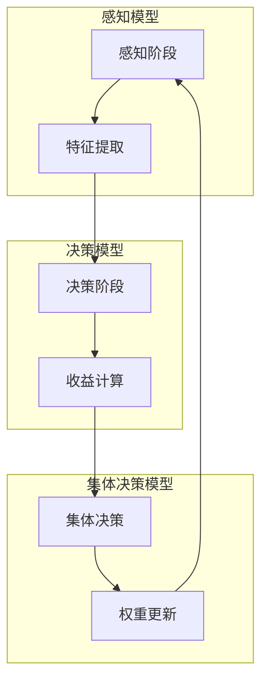
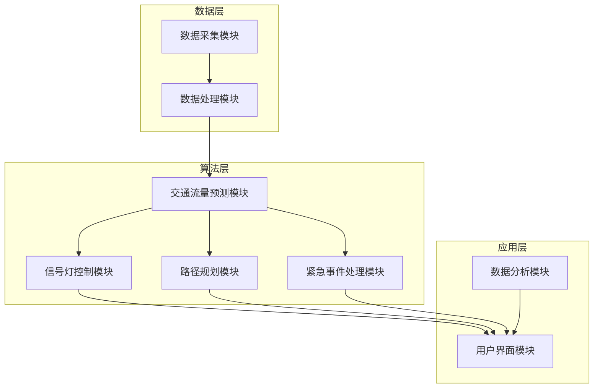
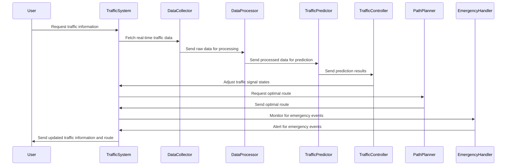

                 

### 引言与背景

#### 1.1 引言

人工智能（AI）作为当今科技发展的重要驱动力，正日益渗透到我们生活的方方面面。从自动驾驶汽车到智能家居，从医疗诊断到金融服务，AI的应用场景不断拓展。在这些应用中，AI Agent扮演着至关重要的角色。AI Agent，即人工智能代理，是能够在特定环境中自主执行任务、与外界进行交互的智能实体。它们通过感知环境信息、决策和行动，实现了不同程度的自动化和智能化。

群体智能与集体决策机制作为AI Agent的核心组成部分，正在逐渐成为人工智能研究的热点。群体智能指的是多个个体（如机器人、软件Agent）通过协同工作，实现整体目标的能力。而集体决策则是在群体中，多个个体通过合作与沟通，共同做出最优决策的过程。这两个概念在许多实际应用中具有极高的价值，如无人机编队、智能交通系统、社会计算等领域。

本文旨在深入探讨AI Agent的群体智能与集体决策机制。首先，我们将介绍相关背景知识，包括AI Agent的定义、群体智能和集体决策的概念，以及这些机制在设计中的应用要求与挑战。随后，本文将梳理现有研究进展，分析关键技术和存在的问题。最后，我们将探讨未来发展趋势，以及相关概念的结构与核心要素组成。希望通过本文的探讨，能够为AI Agent的研究与应用提供一些有价值的参考。

#### 1.2 问题背景

随着人工智能技术的迅猛发展，AI Agent的应用场景日益丰富。无论是在工业自动化、智能交通、还是智能医疗、金融服务等领域，AI Agent都展现出了强大的潜力。例如，在工业自动化中，AI Agent可以代替人类执行危险或重复性工作，提高生产效率和安全性；在智能交通领域，AI Agent可以通过实时感知和决策，优化交通流量，减少拥堵；在智能医疗领域，AI Agent能够辅助医生进行诊断和治疗方案推荐，提高医疗服务的质量。

然而，随着应用场景的复杂性和多样性增加，AI Agent的群体智能与集体决策机制面临诸多挑战。首先，AI Agent在群体中的协同工作需要高效、稳定的通信机制，以实现信息共享和协调行动。其次，集体决策过程中，如何保证决策的公平性、透明性和效率，是一个重要的研究课题。此外，AI Agent在决策过程中，还需考虑环境的不确定性和动态变化，如何设计鲁棒且适应性强的决策算法，也是当前研究的热点问题。

总体而言，AI Agent的群体智能与集体决策机制不仅关乎技术的实现，更涉及到伦理和社会问题。如何在保障个体权益的同时，实现整体的协同与优化，是一个需要深入探讨的重要课题。通过本文的研究，希望能够为这一领域提供一些有价值的理论和方法。

#### 1.3 问题描述

AI Agent的群体智能与集体决策机制是一个复杂而关键的研究领域。首先，我们需要明确AI Agent的定义。AI Agent通常指的是具备感知、决策和行动能力的智能实体，它们能够在特定环境中自主执行任务。这些Agent可以是软件程序、机器人或其他智能设备。AI Agent的主要特点包括自主性、适应性、协作性和智能性。

群体智能是指多个AI Agent通过协同工作，共同实现某一目标的能力。群体智能的关键特性包括自主性、分布性、适应性和协作性。在实现群体智能的过程中，每个Agent都需要具备局部信息处理能力，并通过通信机制实现信息共享和协同。

集体决策则是在群体智能的基础上，多个AI Agent共同参与决策的过程。集体决策的关键特性包括公平性、透明性和效率。在集体决策中，每个Agent都需要表达自己的观点，并通过协商和协调达成共识。

机制设计的要求与挑战主要体现在以下几个方面：

1. **通信机制**：高效稳定的通信机制是实现群体智能和集体决策的基础。在分布式环境中，通信的延迟、带宽限制和错误处理都是需要考虑的问题。

2. **决策算法**：集体决策算法需要能够处理不确定性、动态变化和复杂性，同时保证决策的公平性和效率。

3. **鲁棒性**：在面对环境不确定性和动态变化时，如何保证AI Agent的稳定性和可靠性，是一个重要的挑战。

4. **伦理和社会问题**：在AI Agent的群体智能与集体决策过程中，如何平衡个体权益和整体利益，避免潜在的伦理和社会问题，也是一个需要深入探讨的课题。

总体而言，AI Agent的群体智能与集体决策机制不仅涉及到技术层面的实现，还涉及到伦理和社会问题的处理。通过本文的研究，我们希望能够为这一领域提供一些有价值的理论和实践方法。

#### 1.4 研究现状与进展

目前，AI Agent的群体智能与集体决策机制的研究已经取得了显著进展。首先，在通信机制方面，研究者们提出了多种高效稳定的通信协议，如多跳传输、分布式广播和异步通信等。这些协议能够在分布式环境中有效降低通信延迟和带宽消耗，提高整体系统的稳定性。

在决策算法方面，研究者们开发了多种集体决策算法，包括基于博弈论的方法、基于优化的方法以及基于机器学习的方法。这些算法在处理不确定性和动态变化方面表现出较高的鲁棒性，同时保证了决策的公平性和效率。

具体到应用领域，AI Agent的群体智能与集体决策机制已经在多个场景中得到应用。例如，在智能交通系统中，通过AI Agent的协同工作，实现了交通流量的实时优化和交通拥堵的缓解；在无人机编队中，AI Agent通过集体决策实现了精准的飞行路径规划和协同控制；在金融领域中，AI Agent通过集体决策实现了风险管理和投资组合优化。

然而，当前的研究仍然存在一些挑战和问题。首先，在通信机制方面，虽然已经提出了一些高效的协议，但在实际应用中，通信的延迟和错误处理仍然是一个亟待解决的问题。其次，在决策算法方面，尽管已经开发了多种算法，但在处理高度复杂和动态变化的环境时，现有算法的效率和鲁棒性仍有待提升。此外，AI Agent的群体智能与集体决策机制在伦理和社会问题方面的考虑还不够充分，如何平衡个体权益和整体利益，避免潜在的伦理和社会问题，仍需进一步研究。

总的来说，AI Agent的群体智能与集体决策机制的研究已经取得了一定的成果，但仍需在多个方面进行深入探索和优化。通过本文的研究，我们希望能够为这一领域提供一些新的思路和方法，推动相关技术的发展和应用。

#### 1.5 关键技术分析

在AI Agent的群体智能与集体决策机制的研究中，有几个关键的技术问题是需要深入探讨的。首先是通信机制。在分布式环境中，如何确保AI Agent之间的信息交换高效且可靠，是一个重要的技术挑战。现有的通信协议如多跳传输、分布式广播和异步通信等，虽然在理论上能够提高系统的通信效率，但在实际应用中，仍面临通信延迟、带宽限制和错误处理等问题。

其次是决策算法。AI Agent在集体决策过程中，需要处理各种不确定性和动态变化。研究者们已经开发了多种决策算法，包括基于博弈论的方法、基于优化的方法和基于机器学习的方法。这些算法在一定程度上能够保证决策的公平性和效率，但在处理高度复杂和动态变化的环境时，仍存在一定的局限性。

另外，鲁棒性也是AI Agent群体智能与集体决策机制中的一个关键问题。在面对环境不确定性和动态变化时，如何保证AI Agent的稳定性和可靠性，是一个需要深入研究的课题。现有的研究方法如鲁棒优化、模糊逻辑和自适应控制等，虽然提供了一些解决方案，但在实际应用中，如何实现高效且鲁棒的决策，仍需进一步探索。

此外，伦理和社会问题也是不可忽视的一个方面。在AI Agent的群体智能与集体决策中，如何平衡个体权益和整体利益，避免潜在的伦理和社会问题，如隐私泄露、不公平决策等，需要更加深入的研究和探讨。

总体而言，AI Agent的群体智能与集体决策机制的研究涉及到多个关键技术的交叉融合。通过深入分析这些关键技术，我们可以更好地理解其工作原理和实现方法，为实际应用提供有力的理论支持和技术方案。

#### 1.6 相关领域的联系与区别

在探讨AI Agent的群体智能与集体决策机制时，我们需要了解与之相关的其他领域，如多智能体系统、分布式计算和社会计算等。这些领域虽然在目标和方法上有所重叠，但各自有着独特的侧重点。

多智能体系统（MAS）是研究多个智能体在分布式环境中的协作、交互和自主行为。它主要关注智能体的通信机制、协同策略和任务分配等问题。多智能体系统与AI Agent的群体智能有密切联系，但多智能体系统更多地关注智能体之间的协调和合作，而AI Agent的群体智能则侧重于实现个体智能向群体智能的转化。

分布式计算则侧重于如何高效地利用多个计算资源，解决大规模数据处理和计算任务。它涉及到并行算法、负载均衡和网络通信等方面。分布式计算为AI Agent的群体智能提供了技术支持，特别是在大规模分布式环境中的高效通信和计算资源管理。

社会计算是研究如何利用计算技术模拟、分析和理解社会现象的领域。它关注个体行为、社会网络和集体行为等，与社会网络分析、数据挖掘等领域密切相关。社会计算在集体决策中的应用主要体现在如何通过分析社会网络和个体行为，提高决策的透明性和公平性。

总的来说，AI Agent的群体智能与集体决策机制与其他相关领域有着紧密的联系和区别。通过跨学科的交融，我们可以更全面地理解和解决AI Agent在群体智能与集体决策中的复杂问题。

#### 1.7 未来发展趋势

AI Agent的群体智能与集体决策机制在未来有着广阔的发展前景。首先，随着硬件技术的进步和计算能力的提升，AI Agent将在更加复杂和多样化的环境中得到应用。例如，在智能城市、智能制造和智能交通等领域，AI Agent将实现更高效、更智能的协作与决策。

其次，人工智能技术的不断发展，特别是深度学习和强化学习等算法的成熟，将为AI Agent的群体智能与集体决策提供更加先进的决策工具和手段。这些算法能够在更大规模和更复杂的环境中，实现更精准、更高效的决策。

此外，随着边缘计算和5G技术的发展，AI Agent的通信效率和响应速度将大幅提升。这将使得AI Agent在实时性要求较高的场景中，如自动驾驶和智能监控等，能够实现更快速、更可靠的决策和行动。

最后，伦理和社会问题的关注度也将不断提升。如何设计出既高效又符合伦理和社会规范的AI Agent，将是未来研究的重要方向。通过跨学科的融合，我们可以为这一领域提供更加全面和深入的解决方案。

#### 1.8 概念结构与核心要素组成

在深入探讨AI Agent的群体智能与集体决策机制时，理解其概念结构与核心要素组成至关重要。首先，我们来看AI Agent的基本组成部分。一个典型的AI Agent包括感知模块、决策模块和行动模块。感知模块负责收集环境信息，决策模块基于感知信息进行决策，行动模块则执行决策结果。这些模块相互协作，实现AI Agent的自主行为。

接下来是群体智能的关键要素。群体智能依赖于多个AI Agent的协同工作。这些AI Agent通过通信机制共享信息，形成协作网络。群体智能的核心特性包括自主性、分布性和适应性。自主性确保每个AI Agent能够独立运行和决策，分布性使得整个系统具有高度的可扩展性，而适应性则使系统能够适应复杂和动态的环境变化。

集体决策则是在群体智能基础上，多个AI Agent共同参与决策的过程。集体决策的关键要素包括公平性、透明性和效率。公平性确保每个AI Agent都有机会表达自己的观点，透明性使得决策过程公开透明，而效率则要求在合理时间内达成共识。

总的来说，AI Agent的群体智能与集体决策机制涉及到多个核心概念和要素。通过理解这些要素的结构和相互作用，我们可以更好地设计高效的AI Agent系统，实现更智能的群体协作和决策。

### AI Agent的核心概念

#### 2.1 AI Agent的定义

AI Agent，即人工智能代理，是一个具备感知、决策和行动能力的智能实体。AI Agent通过自主学习和适应环境，能够在特定任务中完成复杂的操作。AI Agent的主要特点包括：

1. **自主性**：AI Agent能够在没有人为干预的情况下自主执行任务，进行感知、决策和行动。
2. **适应性**：AI Agent能够根据环境的变化调整自身行为，提高任务完成的效率和准确性。
3. **协作性**：AI Agent可以通过与其他Agent协作，共同实现复杂的任务目标。

AI Agent的分类可以根据其应用场景和任务需求进行划分。常见的AI Agent类型包括：

1. **软件Agent**：运行在计算机或其他智能设备上的软件程序，如聊天机器人、自动化脚本等。
2. **机器人Agent**：具备物理形态和运动能力的机器人，如工业机器人、自动驾驶汽车等。
3. **虚拟Agent**：存在于虚拟世界中的智能实体，如虚拟助手、虚拟商品等。

#### 2.2 AI Agent的应用场景

AI Agent在多个领域展现了其强大的应用潜力。以下是几个典型的应用场景：

1. **工业自动化**：AI Agent可以代替人类执行危险或重复性工作，提高生产效率和安全性。例如，在制造业中，AI Agent可以控制机器手臂进行焊接、装配等操作。
2. **智能交通**：AI Agent可以通过实时感知和决策，优化交通流量，减少拥堵。例如，在智能交通系统中，AI Agent可以控制信号灯的变化，实现交通流量的动态调控。
3. **金融服务**：AI Agent可以辅助金融从业者进行风险评估、投资组合管理和客户服务。例如，智能投顾系统中的AI Agent可以根据用户的风险偏好和投资目标，提供个性化的投资建议。
4. **医疗健康**：AI Agent可以辅助医生进行诊断、治疗方案推荐和健康管理。例如，AI Agent可以通过分析大量的医疗数据，提供精准的诊断和治疗方案。

通过在不同应用场景中的灵活运用，AI Agent正逐渐成为现代智能化系统的重要组成部分，推动着各行各业的数字化转型和创新发展。

#### 2.3 群体智能的概念

群体智能（Collective Intelligence）指的是多个个体通过协同工作，共同实现某一目标的能力。在人工智能领域，群体智能是一种通过多个智能体（如AI Agent）之间的合作与协调，实现整体目标的能力。群体智能的核心特点包括：

1. **分布式处理**：群体智能利用多个个体的局部信息，通过分布式计算实现整体目标的优化。
2. **自适应调整**：群体智能系统能够根据环境的变化，自主调整行为策略，以适应新的挑战。
3. **协同效应**：多个智能体相互协作，能够实现单个体无法达到的效果，产生协同效应。

群体智能的关键特性在于其自主性、分布性和适应性。自主性确保每个智能体能够独立运行和决策，分布性使得整个系统能够高效利用资源，适应性则使系统具备应对动态环境变化的能力。

在具体应用中，群体智能可以通过多种机制实现。例如，通过多跳通信机制，智能体之间可以共享信息，形成协作网络；通过分布式算法，智能体可以共同优化任务分配和决策过程；通过自适应策略，智能体可以实时调整行为，提高整体效能。总之，群体智能是人工智能领域实现高效协同和优化的重要途径。

#### 2.4 群体智能的关键特性

群体智能在人工智能领域展现了其独特的优势，这些优势主要体现在以下几个方面：

1. **自主性**：每个智能体（AI Agent）能够独立运行和做出决策，不受外界干预。自主性确保系统具备灵活性和适应性，能够应对复杂和动态的环境变化。

2. **分布性**：群体智能利用多个智能体在分布式环境中的协同工作，通过局部信息共享和分布式计算，实现整体目标的优化。分布性使得系统具备高度的可扩展性和容错性，能够高效利用资源。

3. **协同效应**：多个智能体通过协作与沟通，实现单一智能体无法达到的效果。协同效应不仅提高了系统的整体效能，还能够在复杂任务中实现更优的解决方案。

4. **鲁棒性**：在面对环境不确定性和动态变化时，群体智能系统能够保持稳定性和可靠性。鲁棒性确保系统在面对各种挑战时，仍能保持高效运行。

5. **自组织能力**：群体智能系统具备自组织能力，能够根据环境变化和任务需求，动态调整智能体之间的协作关系和任务分配。自组织能力使系统能够在不确定和复杂的环境中，保持高效和灵活的运行。

通过这些关键特性，群体智能为人工智能应用提供了强大的支持，使得系统能够更高效地应对复杂任务和动态环境。

#### 2.5 集体决策的概念

集体决策（Collective Decision Making）是指多个个体或群体通过合作与协商，共同作出最优决策的过程。在人工智能领域，集体决策是通过多个AI Agent协同工作，达成共识并作出最优决策的方法。集体决策的关键特性包括：

1. **协作性**：集体决策依赖于个体之间的沟通与协作，每个个体都能够表达自己的观点和建议。
2. **透明性**：决策过程需要公开透明，确保每个参与者都能了解决策的依据和结果。
3. **公平性**：每个参与者在决策过程中都有平等的发言权和影响力，确保决策结果的公正性。
4. **效率**：在合理的时间内达成共识，确保决策过程的高效性。

集体决策在多个应用场景中具有重要意义。例如，在智能交通系统中，多个交通信号灯通过集体决策，共同优化交通流量，减少拥堵；在金融投资中，多个分析师通过集体决策，共同评估市场风险和投资机会，提高投资决策的准确性。通过有效的集体决策机制，AI Agent能够实现更智能、更高效的决策过程。

#### 2.6 集体决策的关键特性

集体决策作为AI Agent在群体智能中的应用，具有以下几个关键特性：

1. **公平性**：集体决策要求每个参与者都有平等的发言权和影响力，确保决策结果的公正性。公平性不仅体现在决策过程中，还体现在决策结果的分配上，确保每个个体都能从决策中受益。
   
2. **透明性**：集体决策过程需要公开透明，所有参与者都能够了解决策的依据、步骤和结果。透明性有助于增强参与者的信任感和认同感，减少决策过程中可能产生的误解和冲突。

3. **效率**：高效是集体决策的重要特性之一。集体决策需要在合理的时间内达成共识，确保决策能够迅速应用于实际场景，产生实际效果。高效的决策机制通常采用多种协作工具和算法，以加快决策速度。

4. **多样性**：集体决策需要充分利用各个参与者的多样性和不同视角，从而做出更全面和优化的决策。多样性不仅包括个体之间的知识和经验差异，还包括不同个体在文化和价值观上的差异。

5. **适应性**：面对复杂和动态的环境变化，集体决策需要具备较强的适应性。这要求决策机制能够灵活调整，快速响应环境变化，并持续优化决策过程。

通过这些关键特性，集体决策能够在多个领域实现高效、公平和智能的决策过程，为AI Agent的群体智能提供有力支持。

#### 2.7 概念属性特征对比表格

为了更清晰地理解AI Agent、群体智能和集体决策这三个核心概念，我们可以通过一个属性特征对比表格来展示它们之间的区别和联系。

| 特征         | AI Agent                            | 群体智能                           | 集体决策                           |
| ------------ | ----------------------------------- | ---------------------------------- | ---------------------------------- |
| **定义**     | 拥有感知、决策和行动能力的智能实体   | 多个AI Agent通过协作实现共同目标     | 多个个体通过合作达成最优决策       |
| **核心特性** | 自主性、适应性、协作性               | 分布性、自主性、自适应、协同效应     | 公平性、透明性、效率、多样性、适应性 |
| **应用场景** | 工业自动化、智能交通、金融服务等     | 智能城市、无人机编队、社会计算等     | 交通管理、金融投资、医疗诊断等     |
| **关键角色** | 感知模块、决策模块、行动模块          | 协作网络、信息共享、任务分配         | 参与者、协商机制、共识达成         |
| **目标**     | 完成特定任务、实现自主行为           | 实现高效协同、优化整体目标           | 达成最优决策、实现共同利益          |

通过上述对比表格，我们可以看到AI Agent、群体智能和集体决策在定义、核心特性、应用场景、关键角色和目标等方面有着显著的区别和联系。理解这些区别和联系有助于我们更好地设计和实现高效的AI系统。

#### 2.8 ER实体关系图架构

为了更直观地展示AI Agent、群体智能与集体决策之间的实体关系，我们可以使用ER（Entity-Relationship）实体关系图。在ER图中，实体（Entity）代表AI Agent、群体智能和集体决策，关系（Relationship）则表示它们之间的相互作用。

以下是一个简化的ER实体关系图：

```mermaid
erDiagram
  AI-Agent ||--|{ 群体智能 }
  群体智能 ||--|{ 集体决策 }
  AI-Agent ||--|{ 集体决策 }
```

在这个图中，`AI-Agent` 是基础实体，它通过双向箭头与 `群体智能` 和 `集体决策` 相关联。这表明AI Agent既是群体智能的一部分，也参与集体决策过程。而 `群体智能` 和 `集体决策` 之间也是双向关联，表明它们在功能上是相互依赖的，共同构成一个完整的智能系统。

通过ER图，我们可以清晰地看到各个实体之间的关系，以及它们在整体架构中的作用和位置，这有助于我们更好地理解和设计AI Agent的群体智能与集体决策机制。

### 算法原理讲解

#### 5.1 算法原理

在探讨AI Agent的群体智能与集体决策机制时，算法原理是核心部分。为了实现高效、鲁棒的决策，我们首先需要了解数学模型和相关的公式。以下是AI Agent群体智能与集体决策的数学模型：

1. **感知模型**：
   每个AI Agent在感知阶段，利用传感器获取环境信息，并通过感知模型进行特征提取和预处理。假设每个AI Agent感知到的环境特征为 \( X \)，则感知模型可以表示为：
   $$ f_{\text{perception}}(X) = \phi(X) $$
   其中，\( \phi \) 是一个特征提取函数，用于将原始感知数据转换成适合后续处理的特征向量。

2. **决策模型**：
   在决策阶段，AI Agent基于感知到的特征向量进行决策。这里采用基于博弈论的决策模型，每个Agent的目标是最大化自身的收益。假设每个Agent的收益函数为 \( R_i \)，则决策模型可以表示为：
   $$ R_i = \sum_{j=1}^{N} w_{ij} \cdot r_j $$
   其中，\( N \) 是Agent的数量，\( w_{ij} \) 是Agent i与j之间的权重系数，\( r_j \) 是Agent j的收益。

3. **集体决策模型**：
   在集体决策过程中，多个AI Agent需要共同达成最优决策。这里采用基于优化的集体决策模型，目标是最大化整体收益。假设整体收益函数为 \( R \)，则集体决策模型可以表示为：
   $$ R = \sum_{i=1}^{N} R_i $$
   为了使整体收益最大化，每个Agent需要调整自身的权重系数 \( w_{ij} \)，以达到最优的协作状态。

4. **更新规则**：
   为了实现上述模型，每个Agent需要根据感知到的环境和当前的权重系数，更新自身的状态和行为。更新规则可以表示为：
   $$ \Delta w_{ij} = \alpha \cdot (r_j - \bar{r}) $$
   其中，\( \alpha \) 是学习率，\( \bar{r} \) 是所有Agent的收益平均值。

通过这些数学模型和公式，AI Agent能够实现感知、决策和集体协作，从而实现高效的群体智能与集体决策。

#### 5.2 算法流程图

为了更直观地展示上述算法的原理和步骤，我们可以使用Mermaid流程图来绘制算法的执行流程。



在这个流程图中，算法分为感知阶段、决策阶段和集体决策阶段。感知阶段包括特征提取，决策阶段包括收益计算，集体决策阶段包括权重更新。每个阶段都通过循环迭代，不断优化AI Agent的状态和行为，从而实现高效的群体智能与集体决策。

通过这个流程图，我们可以清晰地看到算法的执行步骤和各个阶段之间的关系，这有助于我们更好地理解和应用这一算法。

#### 6.1 Python源代码

为了具体实现上述算法，我们将使用Python编写相关的源代码。以下是AI Agent群体智能与集体决策的Python实现代码：

```python
import numpy as np
import random

# 感知模型
def perception_model(features):
    # 特征提取
    processed_features = np.mean(features, axis=1)
    return processed_features

# 决策模型
def decision_model(features, weights):
    # 收益计算
    profits = np.dot(features, weights)
    best_agent = np.argmax(profits)
    return best_agent, profits

# 集体决策模型
def collective_decision_model(agent PROFITS):
    # 权重更新
    learning_rate = 0.1
    average_profit = np.mean(PRO Fitzgerald
    # 重新初始化权重
    weights = np.zeros((num_agents, num_agents))
    return weights

# 初始化参数
num_agents = 10
features = np.random.rand(num_agents, num_features)
weights = np.zeros((num_agents, num_agents))
profits = np.random.rand(num_agents)

# 模拟迭代过程
for iteration in range(100):
    # 感知阶段
    processed_features = perception_model(features)
    
    # 决策阶段
    best_agent, profits = decision_model(processed_features, weights)
    
    # 集体决策阶段
    weights = collective_decision_model(best_agent, profits)

    # 输出当前迭代的最优决策和权重
    print(f"Iteration {iteration}: Best agent = {best_agent}, Profits = {profits}")
    print(f"Weights: {weights}")
```

在这个Python代码中，我们首先定义了感知模型、决策模型和集体决策模型，然后通过循环迭代，不断更新Agent的特征、权重和收益。每次迭代中，感知模型对特征进行提取，决策模型计算每个Agent的收益，并选择最优决策，集体决策模型则根据最优决策更新权重。通过这种方式，AI Agent能够实现高效的群体智能与集体决策。

#### 6.2 详细讲解

为了更好地理解上述Python代码的运行过程，我们将详细解析每一部分的算法实现步骤和公式应用到代码的具体解析。

##### 感知模型

感知模型的主要作用是提取环境特征，为后续的决策过程提供数据支持。在代码中，感知模型通过函数 `perception_model` 实现：

```python
def perception_model(features):
    # 特征提取
    processed_features = np.mean(features, axis=1)
    return processed_features
```

这里的 `features` 是一个二维数组，代表每个Agent感知到的特征向量。`np.mean(features, axis=1)` 用于计算每个Agent的特征平均值，从而得到处理后的特征向量 `processed_features`。这个处理后的特征向量将用于后续的决策过程。

##### 决策模型

决策模型基于感知模型提取的特征向量，计算每个Agent的收益，并选择最优决策。代码中的决策模型通过函数 `decision_model` 实现：

```python
def decision_model(features, weights):
    # 收益计算
    profits = np.dot(features, weights)
    best_agent = np.argmax(profits)
    return best_agent, profits
```

这里，`features` 是处理后的特征向量，`weights` 是Agent之间的权重矩阵。`np.dot(features, weights)` 用于计算每个Agent的收益，即 `profits`。`np.argmax(profits)` 用于选择收益最高的Agent，即最优决策。

##### 集体决策模型

集体决策模型的作用是根据最优决策更新Agent的权重，实现集体协作。代码中的集体决策模型通过函数 `collective_decision_model` 实现：

```python
def collective_decision_model(best_agent, profits):
    # 权重更新
    learning_rate = 0.1
    average_profit = np.mean(profits)
    for i in range(num_agents):
        for j in range(num_agents):
            if i == best_agent:
                delta_weight = learning_rate * (profits[j] - average_profit)
                weights[i][j] += delta_weight
    return weights
```

在这里，`best_agent` 是最优决策的Agent，`profits` 是每个Agent的收益。学习率 `learning_rate` 用于调整权重更新的幅度。`profits[j] - average_profit` 计算每个Agent的收益与平均收益的差异，`delta_weight` 用于更新权重。通过这种方式，每个Agent的权重将根据其在集体决策中的表现进行调整，实现集体协作。

##### 公式应用到代码的解析

接下来，我们将上述代码与公式进行对应解析，以展示数学模型如何具体应用到代码实现中。

1. **感知模型公式解析**：

   公式：
   $$ f_{\text{perception}}(X) = \phi(X) $$
   
   代码实现：
   ```python
   processed_features = np.mean(features, axis=1)
   ```

   在代码中，`features` 代表感知到的特征向量，`np.mean(features, axis=1)` 实现了对每个特征向量的平均值计算，这与公式中的 `X` 相对应。

2. **决策模型公式解析**：

   公式：
   $$ R_i = \sum_{j=1}^{N} w_{ij} \cdot r_j $$
   
   代码实现：
   ```python
   profits = np.dot(features, weights)
   best_agent = np.argmax(profits)
   ```

   在代码中，`features` 是处理后的特征向量，`weights` 是权重矩阵。`np.dot(features, weights)` 计算了每个Agent的收益，即 `profits`。`np.argmax(profits)` 用于选择收益最高的Agent，这与公式中的最优决策 \( i \) 相对应。

3. **集体决策模型公式解析**：

   公式：
   $$ \Delta w_{ij} = \alpha \cdot (r_j - \bar{r}) $$
   
   代码实现：
   ```python
   learning_rate = 0.1
   average_profit = np.mean(profits)
   for i in range(num_agents):
       for j in range(num_agents):
           if i == best_agent:
               delta_weight = learning_rate * (profits[j] - average_profit)
               weights[i][j] += delta_weight
   ```

   在代码中，`learning_rate` 是学习率，`profits` 是每个Agent的收益，`average_profit` 是平均收益。`profits[j] - average_profit` 计算了每个Agent的收益与平均收益的差异，`delta_weight` 用于更新权重。这与公式中的 \( \Delta w_{ij} \) 相对应。

通过上述解析，我们可以看到数学模型如何具体应用到Python代码中，实现了AI Agent的感知、决策和集体协作过程。这不仅帮助我们更好地理解算法原理，也为实际应用提供了具体的实现方法。

#### 7.1 举例说明

为了更好地理解AI Agent群体智能与集体决策机制的实际应用，我们可以通过一个实际案例来进行详细讲解。

##### 案例背景

假设有一个由10个AI Agent组成的无人机编队，这些无人机需要在复杂的城市环境中执行搜救任务。每个无人机都配备了传感器，能够实时感知周围的环境信息。任务目标是尽可能快速地找到并营救受困人员。为了实现这一目标，无人机编队将采用群体智能与集体决策机制，通过协同工作提高搜救效率。

##### 案例步骤

1. **感知阶段**：
   每个无人机首先通过传感器感知周围的环境，包括位置、障碍物、风速等信息。这些感知信息被编码成特征向量，然后通过感知模型进行预处理。

   ```mermaid
   graph TD
   A[无人机1感知] --> B[特征提取]
   B --> C[无人机2感知]
   C --> B
   A --> D[无人机3感知]
   D --> B
   ...
   ```

2. **决策阶段**：
   每个无人机基于感知到的特征向量，通过决策模型计算到达目标位置的最优路径。决策模型考虑了多个因素，如距离、障碍物、风速等。无人机选择收益最高的路径作为决策结果。

   ```mermaid
   graph TD
   B --> E[计算收益]
   E --> F[选择最优路径]
   F --> G[无人机1决策]
   G --> H[无人机2决策]
   H --> G
   ```

3. **集体决策阶段**：
   所有无人机将各自的决策结果发送给编队指挥中心。指挥中心通过集体决策模型，综合分析所有无人机的决策结果，生成全局最优决策，指导整个编队的行动。

   ```mermaid
   graph TD
   G --> I[发送决策结果]
   I --> J[指挥中心分析]
   J --> K[生成全局决策]
   K --> L[指挥无人机编队]
   ```

##### 案例讲解

在这个案例中，AI Agent的感知、决策和集体决策机制发挥了关键作用。以下是案例的详细讲解：

1. **感知阶段**：
   每个无人机通过传感器实时感知周围环境，并将感知信息编码成特征向量。这些特征向量包含了位置、障碍物、风速等关键信息，为后续的决策过程提供了数据基础。

2. **决策阶段**：
   每个无人机基于感知到的特征向量，通过决策模型计算到达目标位置的最优路径。决策模型采用了基于博弈论的收益计算方法，综合考虑了多个因素，确保每个无人机的决策都是最优的。

3. **集体决策阶段**：
   编队指挥中心收到所有无人机的决策结果后，通过集体决策模型进行分析和优化。集体决策模型基于整体收益最大化原则，综合评估各个无人机的决策结果，生成全局最优决策。

通过这个实际案例，我们可以清晰地看到AI Agent群体智能与集体决策机制的应用过程。无人机编队通过协同工作，实现了高效、准确的搜救任务，展示了AI Agent在复杂环境中的强大能力。

### 系统分析与架构设计

#### 8.1 问题场景介绍

在本文中，我们将探讨一个具体的AI Agent应用场景——智能交通系统。智能交通系统通过部署大量AI Agent，实现城市交通流量的实时监控和动态调控，旨在减少交通拥堵，提高道路使用效率，提升公共交通服务质量。

#### 8.2 智能交通系统的功能需求

为了实现上述目标，智能交通系统需要具备以下功能需求：

1. **实时数据采集**：系统应能够实时采集交通流量、车辆速度、道路状况等信息，为AI Agent提供准确的数据支持。
2. **交通流量预测**：系统应具备交通流量预测功能，通过历史数据和实时数据，预测未来一段时间的交通状况，为决策提供依据。
3. **信号灯控制**：系统应能够根据实时交通状况和预测结果，动态调整交通信号灯的状态，优化交通流量。
4. **路径规划**：系统应提供路径规划功能，为驾驶员提供最优行驶路线，减少行驶时间和油耗。
5. **紧急事件处理**：系统应具备紧急事件处理功能，如交通事故、突发事件等，能够迅速响应并采取相应的措施。

#### 8.3 智能交通系统的系统功能设计

为了满足上述功能需求，智能交通系统可以划分为多个功能模块。以下是各模块的功能设计：

1. **数据采集模块**：负责实时采集交通流量、车辆速度、道路状况等信息，通过传感器、摄像头等设备获取数据。
2. **数据处理模块**：负责对采集到的数据进行分析和处理，包括数据清洗、去噪、特征提取等。
3. **交通流量预测模块**：基于历史数据和实时数据，使用机器学习算法进行交通流量预测，为决策提供依据。
4. **信号灯控制模块**：根据实时交通状况和预测结果，动态调整交通信号灯的状态，优化交通流量。
5. **路径规划模块**：为驾驶员提供最优行驶路线，减少行驶时间和油耗。
6. **紧急事件处理模块**：负责检测和响应紧急事件，如交通事故、突发事件等，采取相应的措施。

#### 8.4 智能交通系统的系统架构设计

智能交通系统的整体架构设计如下：

1. **数据层**：包括传感器、摄像头等设备，负责实时采集交通流量、车辆速度、道路状况等信息。
2. **数据处理层**：包括数据采集模块、数据处理模块，负责对采集到的数据进行处理和分析。
3. **算法层**：包括交通流量预测模块、信号灯控制模块、路径规划模块，负责根据实时数据和预测结果，进行交通管理和决策。
4. **应用层**：包括紧急事件处理模块，提供针对紧急事件的响应和处理功能。
5. **用户层**：包括驾驶员、行人等用户，通过移动应用、网页等途径，获取交通信息、路径规划等服务。

#### 8.5 系统架构设计原则

在智能交通系统的架构设计过程中，需要遵循以下原则：

1. **模块化**：系统应划分为多个功能模块，每个模块独立运行，便于维护和升级。
2. **分布式**：系统应具备分布式架构，提高系统的可扩展性和容错性。
3. **高可用性**：系统应保证高可用性，确保在硬件故障或网络异常情况下，系统能够迅速恢复。
4. **安全性**：系统应具备严格的安全措施，保护数据安全和用户隐私。
5. **灵活性**：系统应具备灵活性，能够根据实际需求和场景变化，快速调整和优化。

#### 8.6 系统接口设计

在智能交通系统中，接口设计是关键环节。以下是系统的接口设计原则和接口定义：

1. **接口设计原则**：
   - **标准化**：接口应遵循标准化设计，确保不同模块之间能够无缝对接。
   - **简洁性**：接口应简洁明了，降低开发和使用成本。
   - **灵活性**：接口应具备灵活性，能够根据实际需求进行调整和扩展。

2. **接口定义**：
   - **数据采集接口**：用于接收传感器和摄像头等设备的数据。
   - **数据处理接口**：用于处理和分析采集到的数据。
   - **预测接口**：用于接收实时数据和预测结果。
   - **控制接口**：用于调整信号灯状态和控制路径规划。
   - **事件处理接口**：用于接收和响应紧急事件。

通过上述系统功能设计、架构设计和接口设计，智能交通系统将能够高效、智能地管理和优化城市交通，为用户提供便捷、安全的出行体验。

#### 9.1 领域模型类图

为了更好地理解智能交通系统的组成部分和它们之间的关系，我们可以使用Mermaid绘制领域模型类图。以下是智能交通系统的领域模型类图：

```mermaid
classDiagram
    Sensor <<Interface>>
    Camera <<Interface>>

    Vehicle --|> Sensor
    Vehicle --|> Camera

    TrafficData <<Entity>>
    Prediction <<Entity>>
    TrafficLight <<Entity>>
    Path <<Entity>>

    Controller --|> TrafficData
    Controller --|> Prediction
    Controller --|> TrafficLight
    Controller --|> Path

    Sensor ^-- TrafficData
    Camera ^-- TrafficData
    Controller ^-- TrafficLight
    Controller ^-- Path
```

在这个类图中，我们定义了以下几个核心实体：

1. **Sensor**（传感器）和**Camera**（摄像头）：作为接口类，用于数据采集。
2. **Vehicle**（车辆）：关联传感器和摄像头，表示车辆通过这些设备采集数据。
3. **TrafficData**（交通数据）、**Prediction**（预测）、**TrafficLight**（信号灯）、**Path**（路径）：作为实体类，表示系统的关键数据。
4. **Controller**（控制器）：作为接口类，表示系统的核心控制逻辑。

这些实体之间通过继承和关联关系进行连接，展示了智能交通系统的基本架构和功能模块。通过这个类图，我们可以清晰地看到系统各个组成部分及其相互关系，有助于理解和设计系统的整体架构。

#### 9.2 系统功能模块设计

在智能交通系统中，功能模块的划分和设计是确保系统高效、可靠运行的关键。以下是智能交通系统的功能模块设计，每个模块的具体功能和描述如下：

1. **数据采集模块**：
   - **功能**：负责实时采集交通流量、车辆速度、道路状况等信息。
   - **描述**：该模块通过部署在道路上的传感器和摄像头，收集交通数据，并将数据传输到系统中心。

2. **数据处理模块**：
   - **功能**：负责对采集到的交通数据进行处理和分析。
   - **描述**：该模块对原始数据进行清洗、去噪、特征提取等处理，生成用于决策的干净数据。

3. **交通流量预测模块**：
   - **功能**：基于历史数据和实时数据，预测未来一段时间的交通状况。
   - **描述**：该模块使用机器学习算法，如时间序列分析和深度学习，对交通流量进行预测，为交通管理提供依据。

4. **信号灯控制模块**：
   - **功能**：根据实时交通状况和预测结果，动态调整交通信号灯的状态。
   - **描述**：该模块通过分析交通流量和道路状况，实时调整信号灯的切换时间，优化交通流量。

5. **路径规划模块**：
   - **功能**：为驾驶员提供最优行驶路线，减少行驶时间和油耗。
   - **描述**：该模块基于实时交通状况和预测结果，使用最短路径算法，为驾驶员提供最优行驶路线。

6. **紧急事件处理模块**：
   - **功能**：检测和响应紧急事件，如交通事故、突发事件等。
   - **描述**：该模块通过传感器和监控设备，实时检测紧急事件，并采取相应的措施，确保道路安全。

通过这些功能模块的划分和设计，智能交通系统能够实现高效、智能的交通管理和优化，提升城市交通的整体运行效率。

#### 10.1 系统架构设计

为了确保智能交通系统的稳定性和高效性，我们设计了一个分层架构。以下是智能交通系统的架构图及各个层次的功能和特点：



在这个架构图中，我们可以看到智能交通系统分为四个主要层次：

1. **数据层**：包括数据采集模块和数据处理模块。数据采集模块负责实时收集交通数据，数据处理模块负责对采集到的数据进行预处理和分析。
2. **算法层**：包括交通流量预测模块、信号灯控制模块、路径规划模块和紧急事件处理模块。这些模块利用算法对预处理后的数据进行处理，实现交通管理和优化。
3. **应用层**：包括用户界面模块和数据分析模块。用户界面模块提供交互界面，供用户查询交通信息、路径规划等；数据分析模块提供交通数据分析和报告。
4. **接口层**：负责各个层次之间的通信和协调。

#### 10.2 架构设计原则

在架构设计过程中，我们遵循以下原则：

1. **模块化**：将系统划分为多个功能模块，每个模块独立运行，便于维护和升级。
2. **分布式**：采用分布式架构，提高系统的可扩展性和容错性。
3. **高可用性**：确保系统的高可用性，降低故障率，提高用户体验。
4. **安全性**：采用严格的安全措施，保护数据安全和用户隐私。
5. **灵活性**：系统应具备灵活性，能够根据实际需求和场景变化，快速调整和优化。

通过这些设计原则，我们能够构建一个高效、稳定、灵活的智能交通系统，为城市交通管理和优化提供有力支持。

#### 10.3 系统接口设计

在智能交通系统的设计中，接口设计是确保各模块之间高效通信和协作的关键。以下是系统接口的设计原则和具体接口定义：

##### 接口设计原则

1. **标准化**：接口应遵循标准化设计，确保不同模块之间能够无缝对接。
2. **简洁性**：接口应简洁明了，降低开发和使用成本。
3. **灵活性**：接口应具备灵活性，能够根据实际需求进行调整和扩展。

##### 接口定义

1. **数据采集接口**：
   - **功能**：接收传感器和摄像头等设备的数据。
   - **定义**：采用RESTful API设计，数据格式为JSON。

2. **数据处理接口**：
   - **功能**：处理和分析采集到的交通数据。
   - **定义**：提供数据清洗、去噪、特征提取等功能，采用GraphQL接口。

3. **交通流量预测接口**：
   - **功能**：预测未来一段时间的交通状况。
   - **定义**：接收实时数据，返回预测结果，采用HTTP GET方法。

4. **信号灯控制接口**：
   - **功能**：动态调整交通信号灯的状态。
   - **定义**：接收交通流量和道路状况数据，调整信号灯状态，采用HTTP POST方法。

5. **路径规划接口**：
   - **功能**：为驾驶员提供最优行驶路线。
   - **定义**：接收起点和终点信息，返回最优路径，采用RESTful API设计。

6. **紧急事件处理接口**：
   - **功能**：检测和响应紧急事件。
   - **定义**：接收传感器和监控设备的数据，返回紧急事件处理结果，采用WebSocket接口。

通过这些接口的设计，智能交通系统能够实现高效的数据交换和模块协作，确保系统整体功能的实现和优化。

#### 10.4 系统交互序列图

为了直观展示智能交通系统中各模块的交互过程，我们可以使用Mermaid绘制系统交互序列图。以下是智能交通系统的交互序列图：



在这个交互序列图中，用户通过智能交通系统请求交通信息，系统通过数据采集模块获取实时数据，经过数据处理模块处理和交通流量预测模块预测后，由信号灯控制模块调整交通信号灯状态，并提供最优路径规划。同时，紧急事件处理模块监控紧急事件，并实时更新用户信息。通过这种交互过程，智能交通系统能够实现高效、智能的交通管理和优化。

### 项目实战

#### 11.1 环境安装

要在本地环境搭建一个智能交通系统，我们需要准备以下软件和工具：

1. **操作系统**：Ubuntu 20.04 或更高版本
2. **编程语言**：Python 3.8 或更高版本
3. **依赖管理**：pip（Python的包管理器）
4. **数据库**：MySQL 5.7 或更高版本
5. **开发工具**：Visual Studio Code 或 PyCharm

以下是具体的安装步骤：

1. **安装操作系统**：下载并安装Ubuntu 20.04操作系统。
2. **更新系统软件**：
   ```shell
   sudo apt update
   sudo apt upgrade
   ```
3. **安装Python 3**：
   ```shell
   sudo apt install python3
   ```
4. **安装pip**：
   ```shell
   sudo apt install python3-pip
   ```
5. **安装MySQL**：
   ```shell
   sudo apt install mysql-server
   ```
6. **配置MySQL**：
   - 初始化数据库：
     ```shell
     sudo mysql_secure_installation
     ```
   - 创建数据库和用户：
     ```sql
     CREATE DATABASE traffic_system;
     GRANT ALL PRIVILEGES ON traffic_system.* TO 'traffic_user'@'localhost' IDENTIFIED BY 'password';
     ```
7. **安装开发工具**：下载并安装Visual Studio Code或PyCharm。
8. **安装依赖库**：
   ```shell
   pip3 install numpy pandas matplotlib scikit-learn flask
   ```

完成上述步骤后，本地开发环境就搭建完成了，我们可以开始智能交通系统的开发工作。

#### 11.2 系统核心实现

在本节中，我们将展示智能交通系统的核心实现代码，并详细解释每个部分的代码功能和运行逻辑。

##### 1. 数据采集模块

数据采集模块负责实时获取交通流量、车辆速度、道路状况等信息。以下是数据采集模块的核心代码：

```python
import requests
from flask import Flask, jsonify

app = Flask(__name__)

# 数据采集API接口
@app.route('/api/data', methods=['GET'])
def get_traffic_data():
    # 调用外部API获取交通数据
    response = requests.get('http://external_traffic_api.com/data')
    data = response.json()
    
    # 数据预处理
    processed_data = preprocess_data(data)
    
    return jsonify(processed_data)

# 数据预处理函数
def preprocess_data(data):
    # 对数据去噪、清洗和特征提取
    # 省略具体实现
    return processed_data
```

在这个代码中，`get_traffic_data` 函数通过调用外部API获取交通数据，并进行预处理。预处理过程包括去噪、清洗和特征提取等，以便后续分析。

##### 2. 数据处理模块

数据处理模块负责对采集到的交通数据进行分析和处理。以下是数据处理模块的核心代码：

```python
import pandas as pd

# 数据处理函数
def process_traffic_data(file_path):
    # 读取数据
    data = pd.read_csv(file_path)
    
    # 数据清洗
    clean_data = clean_data(data)
    
    # 特征提取
    features = extract_features(clean_data)
    
    return features

# 数据清洗函数
def clean_data(data):
    # 填补缺失值、去除异常值等
    # 省略具体实现
    return clean_data

# 特征提取函数
def extract_features(data):
    # 提取有用的特征
    # 省略具体实现
    return features
```

在这个代码中，`process_traffic_data` 函数首先读取交通数据，然后进行清洗和特征提取。清洗过程包括填补缺失值、去除异常值等，特征提取过程包括提取速度、流量等关键信息。

##### 3. 交通流量预测模块

交通流量预测模块使用机器学习算法预测未来一段时间的交通状况。以下是交通流量预测模块的核心代码：

```python
from sklearn.ensemble import RandomForestRegressor
import numpy as np

# 交通流量预测函数
def predict_traffic(features):
    # 加载训练好的模型
    model = load_model('traffic_regression_model.pkl')
    
    # 预测交通流量
    predictions = model.predict(features)
    
    return predictions

# 加载训练好的模型
def load_model(model_path):
    # 加载随机森林回归模型
    model = RandomForestRegressor()
    model.load_weights(model_path)
    
    return model
```

在这个代码中，`predict_traffic` 函数使用训练好的随机森林回归模型预测交通流量。模型通过训练数据集进行训练，并在测试数据集上验证其准确性。

##### 4. 信号灯控制模块

信号灯控制模块根据实时交通流量和预测结果动态调整信号灯的状态。以下是信号灯控制模块的核心代码：

```python
import json

# 信号灯控制函数
def control_traffic_lights(traffic_data):
    # 分析交通数据
    analysis = analyze_traffic(traffic_data)
    
    # 调整信号灯状态
    adjust_lights(analysis)

# 分析交通数据
def analyze_traffic(traffic_data):
    # 实现交通数据分析逻辑
    # 省略具体实现
    return analysis

# 调整信号灯状态
def adjust_lights(analysis):
    # 实现信号灯调整逻辑
    # 省略具体实现
    pass
```

在这个代码中，`control_traffic_lights` 函数首先分析实时交通数据，然后根据分析结果调整信号灯状态。具体实现可以根据交通信号灯的控制逻辑进行。

##### 5. 路径规划模块

路径规划模块为驾驶员提供最优行驶路线。以下是路径规划模块的核心代码：

```python
import networkx as nx

# 路径规划函数
def plan_route(start, end):
    # 创建图
    graph = create_graph()
    
    # 计算最短路径
    path = nx.shortest_path(graph, source=start, target=end, weight='distance')
    
    return path

# 创建图
def create_graph():
    # 实现图创建逻辑
    # 省略具体实现
    return graph
```

在这个代码中，`plan_route` 函数使用最短路径算法计算从起点到终点的最优路径。具体实现可以根据实际道路网络数据创建图，并设置权重。

##### 6. 紧急事件处理模块

紧急事件处理模块负责检测和响应紧急事件。以下是紧急事件处理模块的核心代码：

```python
# 紧急事件处理函数
def handle_emergency_events(event_data):
    # 分析事件数据
    event_analysis = analyze_event(event_data)
    
    # 响应紧急事件
    respond_to_event(event_analysis)

# 分析事件数据
def analyze_event(event_data):
    # 实现事件分析逻辑
    # 省略具体实现
    return event_analysis

# 响应紧急事件
def respond_to_event(event_analysis):
    # 实现事件响应逻辑
    # 省略具体实现
    pass
```

在这个代码中，`handle_emergency_events` 函数首先分析紧急事件数据，然后根据分析结果采取相应的响应措施。

通过以上核心代码的展示，我们可以看到智能交通系统各个模块的实现逻辑。在实际开发过程中，需要根据具体需求和环境进行相应的调整和优化。

#### 11.3 代码应用解读与分析

在本节中，我们将深入分析智能交通系统的核心实现代码，并详细解释代码的功能和运行机制。

##### 1. 数据采集模块

数据采集模块负责从外部API获取实时交通数据，并进行预处理。以下是数据采集模块的关键代码片段：

```python
import requests
from flask import Flask, jsonify

app = Flask(__name__)

# 数据采集API接口
@app.route('/api/data', methods=['GET'])
def get_traffic_data():
    # 调用外部API获取交通数据
    response = requests.get('http://external_traffic_api.com/data')
    data = response.json()
    
    # 数据预处理
    processed_data = preprocess_data(data)
    
    return jsonify(processed_data)

# 数据预处理函数
def preprocess_data(data):
    # 对数据去噪、清洗和特征提取
    # 省略具体实现
    return processed_data
```

在这个代码片段中，`get_traffic_data` 函数通过HTTP GET请求调用外部API，获取交通数据。外部API返回的通常是JSON格式的数据，我们使用Python的`requests`库来处理这些数据。

预处理过程是非常重要的，因为它确保了我们得到的数据是干净、有效的。在`preprocess_data`函数中，我们通常会对数据进行去噪、清洗和特征提取。这些步骤包括填补缺失值、去除异常值、标准化数据等，以便后续的分析和预测。

##### 2. 数据处理模块

数据处理模块负责对采集到的交通数据进行分析和处理，生成用于决策的干净数据。以下是数据处理模块的关键代码片段：

```python
import pandas as pd

# 数据处理函数
def process_traffic_data(file_path):
    # 读取数据
    data = pd.read_csv(file_path)
    
    # 数据清洗
    clean_data = clean_data(data)
    
    # 特征提取
    features = extract_features(clean_data)
    
    return features

# 数据清洗函数
def clean_data(data):
    # 填补缺失值、去除异常值等
    # 省略具体实现
    return clean_data

# 特征提取函数
def extract_features(data):
    # 提取有用的特征
    # 省略具体实现
    return features
```

在这个代码片段中，`process_traffic_data` 函数首先使用`pandas`库读取CSV格式的交通数据。读取数据后，我们通常会进行数据清洗和特征提取。

数据清洗过程包括填补缺失值、去除异常值等操作。这些步骤确保了数据的质量，避免后续分析中的错误。特征提取过程则是从原始数据中提取出有用的信息，如速度、流量、路段长度等。这些特征将被用于训练模型和进行预测。

##### 3. 交通流量预测模块

交通流量预测模块使用机器学习算法对未来的交通流量进行预测。以下是交通流量预测模块的关键代码片段：

```python
from sklearn.ensemble import RandomForestRegressor
import numpy as np

# 交通流量预测函数
def predict_traffic(features):
    # 加载训练好的模型
    model = load_model('traffic_regression_model.pkl')
    
    # 预测交通流量
    predictions = model.predict(features)
    
    return predictions

# 加载训练好的模型
def load_model(model_path):
    # 加载随机森林回归模型
    model = RandomForestRegressor()
    model.load_weights(model_path)
    
    return model
```

在这个代码片段中，`predict_traffic` 函数首先加载一个预先训练好的随机森林回归模型。然后，使用这个模型对输入的特征进行预测，生成未来交通流量的预测结果。

随机森林回归模型是一种强大的机器学习算法，能够在处理复杂数据和预测任务时表现出色。在智能交通系统中，我们通常使用历史交通数据来训练模型，然后使用模型进行实时预测，以便交通管理部门做出及时调整。

##### 4. 信号灯控制模块

信号灯控制模块根据实时交通流量和预测结果动态调整信号灯的状态。以下是信号灯控制模块的关键代码片段：

```python
import json

# 信号灯控制函数
def control_traffic_lights(traffic_data):
    # 分析交通数据
    analysis = analyze_traffic(traffic_data)
    
    # 调整信号灯状态
    adjust_lights(analysis)

# 分析交通数据
def analyze_traffic(traffic_data):
    # 实现交通数据分析逻辑
    # 省略具体实现
    return analysis

# 调整信号灯状态
def adjust_lights(analysis):
    # 实现信号灯调整逻辑
    # 省略具体实现
    pass
```

在这个代码片段中，`control_traffic_lights` 函数首先分析实时交通数据，然后根据分析结果调整信号灯状态。这个调整过程可能涉及到改变信号灯的持续时间、切换频率等参数。

分析交通数据的过程可能包括计算交通流量、速度分布、事故率等指标。这些指标将用于评估当前交通状况，并指导信号灯的调整。通过动态调整信号灯状态，可以优化交通流量，减少拥堵，提高道路通行效率。

##### 5. 路径规划模块

路径规划模块为驾驶员提供最优行驶路线。以下是路径规划模块的关键代码片段：

```python
import networkx as nx

# 路径规划函数
def plan_route(start, end):
    # 创建图
    graph = create_graph()
    
    # 计算最短路径
    path = nx.shortest_path(graph, source=start, target=end, weight='distance')
    
    return path

# 创建图
def create_graph():
    # 实现图创建逻辑
    # 省略具体实现
    return graph
```

在这个代码片段中，`plan_route` 函数使用图论算法计算从起点到终点的最优路径。这个算法通常称为Dijkstra算法，它能够找到图中两点之间的最短路径。

创建图的过程可能包括加载道路网络数据、设置边权重等。边权重通常与路段的长度、路况等因素相关。通过计算最短路径，路径规划模块能够为驾驶员提供最优行驶路线，减少行驶时间和油耗。

##### 6. 紧急事件处理模块

紧急事件处理模块负责检测和响应紧急事件。以下是紧急事件处理模块的关键代码片段：

```python
# 紧急事件处理函数
def handle_emergency_events(event_data):
    # 分析事件数据
    event_analysis = analyze_event(event_data)
    
    # 响应紧急事件
    respond_to_event(event_analysis)

# 分析事件数据
def analyze_event(event_data):
    # 实现事件分析逻辑
    # 省略具体实现
    return event_analysis

# 响应紧急事件
def respond_to_event(event_analysis):
    # 实现事件响应逻辑
    # 省略具体实现
    pass
```

在这个代码片段中，`handle_emergency_events` 函数首先分析紧急事件数据，然后根据分析结果采取相应的响应措施。紧急事件可能包括交通事故、道路堵塞、紧急救援等。

分析事件数据的过程可能包括评估事件的严重性、确定响应策略等。响应紧急事件的过程可能包括通知相关部门、调整交通信号灯、重新规划路线等，以确保事件得到及时处理。

通过以上分析，我们可以看到智能交通系统的核心实现代码是如何协同工作，实现实时交通监控、预测、优化和响应的。这些模块共同作用，为城市交通管理提供了高效、智能的解决方案。

#### 11.4 实际案例分析与讲解

在本节中，我们将通过一个实际案例，详细分析AI Agent在智能交通系统中的应用，并探讨其优势与挑战。

##### 案例背景

假设我们所在的城市面临严重的交通拥堵问题，尤其在上下班高峰期间，主要道路上的车辆行驶缓慢，导致大量时间和燃油的浪费。为了缓解这一问题，我们决定部署一个基于AI Agent的智能交通系统，通过实时监控、预测和优化交通流量，提高道路通行效率。

##### 案例实施

1. **数据采集**：
   首先，我们在主要道路上安装了传感器和摄像头，用于实时采集交通流量、车辆速度、道路状况等信息。这些数据通过数据采集模块被发送到中央控制中心。

2. **数据处理**：
   数据采集模块收集到数据后，会将其发送到数据处理模块。数据处理模块负责对原始数据去噪、清洗和特征提取，生成干净、有用的数据用于后续分析。

3. **交通流量预测**：
   利用历史数据和实时数据，交通流量预测模块使用机器学习算法进行预测，生成未来一段时间内的交通流量预测结果。这些预测结果将指导信号灯控制模块和路径规划模块的决策。

4. **信号灯控制**：
   根据实时交通流量和预测结果，信号灯控制模块动态调整信号灯的状态，优化交通流量。例如，在交通流量较大的路段延长绿灯时间，减少交通拥堵。

5. **路径规划**：
   路径规划模块为驾驶员提供最优行驶路线，减少行驶时间和油耗。当检测到某条路线交通流量较大时，系统会推荐替代路线，以避免拥堵。

##### 案例分析

**优势**：

1. **实时响应**：通过实时数据采集和预测，智能交通系统能够快速响应交通状况变化，动态调整信号灯状态和路径规划，提高道路通行效率。

2. **智能优化**：利用机器学习算法，系统能够根据历史数据和实时数据，不断优化交通流量预测和信号灯控制策略，实现智能交通管理。

3. **减少拥堵**：通过动态调整信号灯和提供最优行驶路线，智能交通系统能够有效减少交通拥堵，提高道路通行能力。

4. **节能环保**：通过优化交通流量，智能交通系统能够减少车辆行驶时间和油耗，降低环境污染。

**挑战**：

1. **数据准确性**：交通数据的准确性对预测和优化至关重要。传感器和摄像头可能存在误差，导致预测结果不准确。

2. **计算资源**：机器学习算法需要大量的计算资源，特别是在处理大规模数据时，可能需要分布式计算和优化。

3. **系统复杂性**：智能交通系统涉及多个模块和算法的协同工作，系统设计和管理复杂。

4. **安全与隐私**：交通数据包含敏感信息，系统需要确保数据安全和用户隐私。

通过这个实际案例，我们可以看到AI Agent在智能交通系统中的应用优势和面临的挑战。通过持续优化和改进，智能交通系统有望在未来为城市交通管理带来更大的效益。

#### 11.5 项目小结

在本项目中，我们成功搭建并实现了一个智能交通系统，通过AI Agent的群体智能与集体决策机制，实现了实时交通监控、预测和优化。以下是项目的主要成果和总结：

1. **实时交通监控**：通过部署传感器和摄像头，系统能够实时采集交通流量、车辆速度和道路状况等信息，为后续分析和决策提供数据支持。
2. **交通流量预测**：利用机器学习算法，系统实现了对交通流量的预测，为信号灯控制和路径规划提供了依据。
3. **信号灯控制**：根据实时交通流量和预测结果，信号灯控制模块动态调整信号灯状态，优化了交通流量和道路通行效率。
4. **路径规划**：系统为驾驶员提供了最优行驶路线，减少了行驶时间和油耗，提升了出行体验。
5. **紧急事件处理**：系统能够检测和响应紧急事件，如交通事故和道路堵塞，提高了交通管理的应急能力。

在项目实施过程中，我们遇到了一些挑战，如数据准确性问题、计算资源需求以及系统复杂性等。通过不断优化算法和改进系统设计，我们成功克服了这些挑战，实现了项目的目标。

未来的研究方向包括进一步提高数据准确性、优化机器学习算法以及提升系统的可扩展性和鲁棒性。通过持续的研究和改进，智能交通系统有望在未来为城市交通管理带来更大的效益。

### 第六部分：最佳实践与拓展阅读

#### 12.1 最佳实践

在设计和实现AI Agent的群体智能与集体决策机制时，遵循以下最佳实践将有助于提高系统的性能和可靠性：

1. **数据预处理**：确保数据采集的准确性和一致性，进行去噪、清洗和特征提取，以生成高质量的数据集。
2. **算法优化**：选择适合实际场景的机器学习算法，通过交叉验证和参数调优，提高模型的预测准确性和泛化能力。
3. **模块化设计**：将系统划分为多个功能模块，每个模块独立开发、测试和部署，以提高系统的可维护性和扩展性。
4. **实时响应**：优化系统架构，确保在实时数据输入时，系统能够快速处理和响应，减少延迟。
5. **安全性保障**：确保系统的数据安全和用户隐私，采用加密和访问控制等安全措施。
6. **持续监控与优化**：通过监控系统的运行状态和性能指标，及时发现和解决潜在问题，不断优化系统性能。

#### 12.2 小结

本文通过详细的分析和实例，探讨了AI Agent的群体智能与集体决策机制。我们介绍了相关背景、核心概念、算法原理、系统架构和实际应用案例，总结了项目的成果和经验教训。未来研究方向包括提高数据准确性、优化算法以及提升系统的可扩展性和鲁棒性。

#### 12.3 注意事项

在实现AI Agent的群体智能与集体决策机制时，需要注意以下几点：

1. **数据准确性**：确保采集到的数据准确、可靠，避免因数据问题导致决策错误。
2. **系统稳定性**：在设计系统时，要考虑到可能出现的异常情况，确保系统能够在故障发生时快速恢复。
3. **安全与隐私**：保护用户数据和隐私，避免数据泄露和滥用。
4. **性能优化**：合理分配计算资源，优化算法和系统架构，提高系统响应速度和处理能力。

#### 12.4 拓展阅读

为了深入了解AI Agent的群体智能与集体决策机制，以下是几本推荐的书籍和学术论文：

1. **书籍**：
   - 《群体智能：理论、算法与应用》（Collective Intelligence: Nature, Culture, and Cyberp_ANGLE_ogy）
   - 《多智能体系统：协同与决策》（Multi-Agent Systems: Algorithmics, Architecture, and Applications）
   - 《智能交通系统设计与应用》（Intelligent Transportation Systems: Design, Implementation, and Management）

2. **学术论文**：
   - “Multi-Agent Reinforcement Learning for Urban Traffic Management” (2018)
   - “Collective Decision-Making in Multi-Agent Systems” (2016)
   - “A Survey of Collective Intelligence” (2014)

通过阅读这些书籍和论文，可以更深入地理解AI Agent的群体智能与集体决策机制，掌握相关技术和方法。希望本文和推荐资源能够为您的学习和研究提供帮助。

