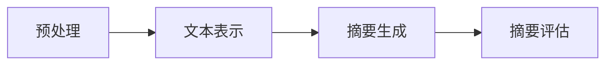
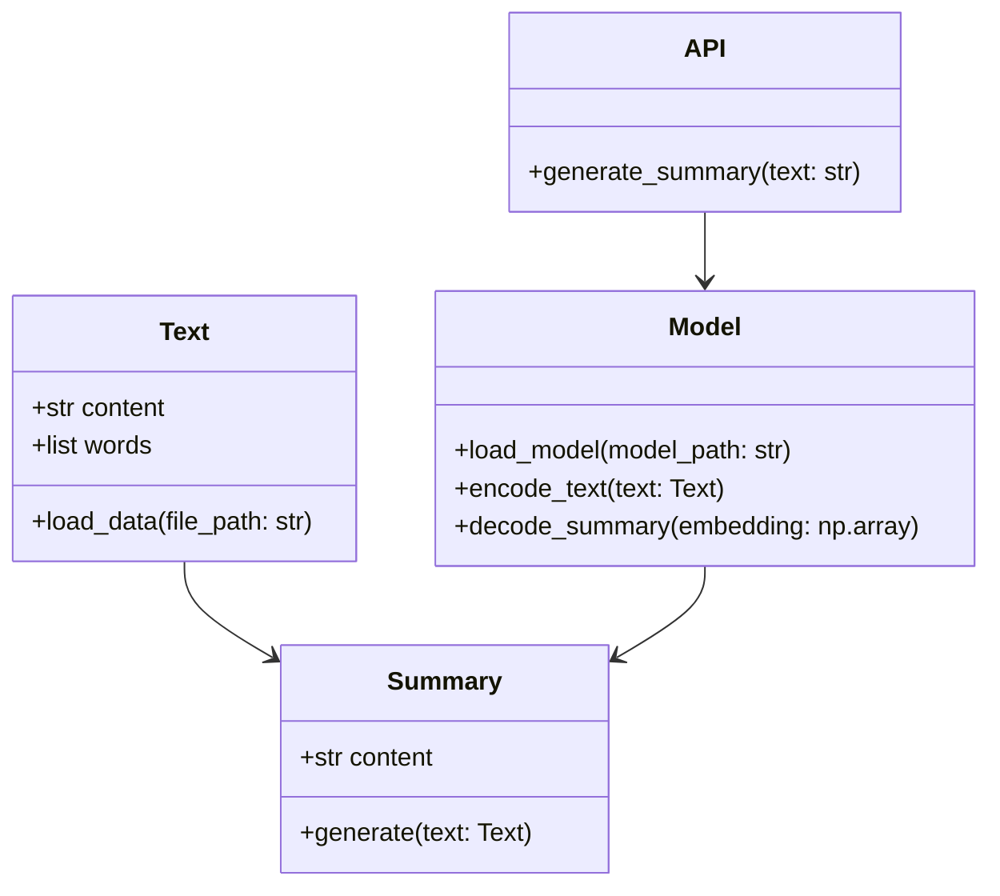
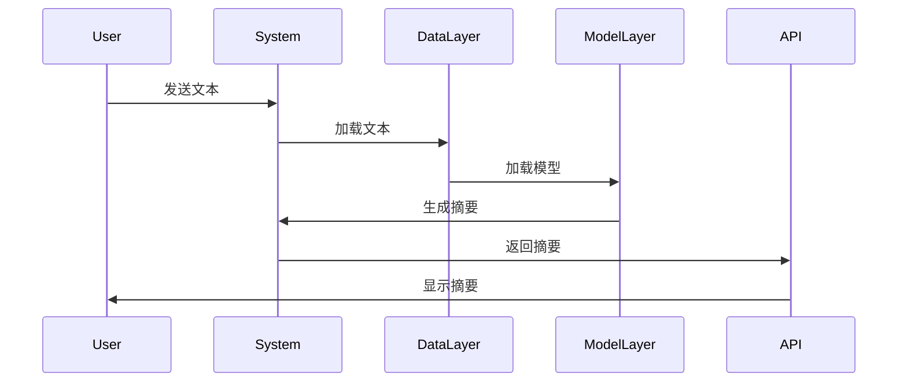

                 

# AI Agent的自然语言摘要生成技术

关键词：AI Agent，自然语言摘要，生成技术，算法，系统架构

摘要：本文将深入探讨AI Agent的自然语言摘要生成技术，从背景介绍、核心概念、技术框架、算法原理、系统设计与实现、项目实战和最佳实践等方面进行详细分析，旨在为读者提供一份全面且深入的技术指南。

## 第一部分：引言

### 1.1 研究背景与意义

随着互联网的迅猛发展和大数据的广泛应用，自然语言处理（NLP）技术成为了人工智能领域的一个重要分支。而自然语言摘要生成技术作为NLP的一个重要应用场景，其重要性日益凸显。自然语言摘要生成技术能够自动地从长文本中提取出关键信息，生成简明扼要的摘要，这对于信息过载的时代来说，无疑是一种有效的信息处理方式。

AI Agent，即人工智能代理，是一种可以自动执行任务、与人类交互的智能系统。AI Agent在自然语言摘要生成中的应用，可以大幅提高信息处理的效率和准确性，为各类信息检索、文本分析等场景提供强大支持。

### 1.2 AI Agent的基本概念

AI Agent是人工智能领域的一个重要概念，它代表了一种能够自动执行特定任务、与人类或环境交互的智能系统。AI Agent通常具备以下核心功能：

1. **感知环境**：通过传感器收集环境信息，如文本、图像、声音等。
2. **规划行动**：基于感知到的环境信息和预设的目标，生成一系列行动。
3. **执行行动**：通过执行物理或虚拟的行动，与环境进行交互。
4. **反馈学习**：根据行动的结果和环境反馈，调整自己的行为策略。

AI Agent的分类可以根据其智能程度、应用场景、执行方式等多个维度进行划分。例如，按照智能程度，AI Agent可以分为弱AI和强AI；按照应用场景，AI Agent可以分为聊天机器人、智能客服、智能推荐等。

### 1.3 自然语言摘要生成的技术挑战

自然语言摘要生成技术面临诸多挑战，主要包括：

1. **信息冗余**：长文本中包含大量冗余信息，如何有效去除冗余信息，提取关键信息是一个难题。
2. **语义理解**：自然语言文本具有高度的不确定性和复杂性，如何准确理解语义，提取文本的核心内容，是技术实现的难点。
3. **生成质量**：生成的摘要需要保持文本的完整性、连贯性和可读性，这要求生成算法具有高度的语义理解和生成能力。

### 1.4 全书结构安排

本文将分为八个部分进行详细讨论：

1. **第一部分：引言**：介绍AI Agent的自然语言摘要生成技术的背景、意义、基本概念和面临的挑战。
2. **第二部分：AI Agent基础**：介绍AI Agent的定义、分类、核心功能以及开发环境。
3. **第三部分：自然语言处理基础**：介绍自然语言处理的基本概念、词汇和句子分析、语言模型。
4. **第四部分：自然语言摘要生成技术框架**：介绍摘要生成的定义、目的、主要方法和评价指标。
5. **第五部分：算法原理与实现**：详细讲解自然语言摘要生成技术的核心算法，使用mermaid流程图、Python代码和LaTeX公式进行解释。
6. **第六部分：系统设计与实现**：描述系统架构设计，包括领域模型类图、系统架构图、接口设计和系统交互序列图。
7. **第七部分：项目实战**：通过一个实际案例展示自然语言摘要生成技术的应用，包括环境安装、系统实现、代码解读、案例分析等。
8. **第八部分：最佳实践与总结**：提供最佳实践、总结全书内容，指出未来研究方向。

## 第二部分：AI Agent基础

### 2.1 AI Agent的定义与分类

AI Agent是一种能够自动执行特定任务、具备感知、规划、执行和反馈能力的智能系统。根据其智能程度和应用场景，AI Agent可以分为以下几类：

1. **弱AI（Narrow AI）**：专注于解决特定问题的AI，如语音识别、图像识别、自然语言处理等。
2. **强AI（General AI）**：具备人类智能，能够理解、学习和适应各种情境的AI。
3. **混合AI**：结合多种AI技术，实现更广泛应用的AI系统。

### 2.2 AI Agent的核心功能

AI Agent的核心功能包括感知环境、规划行动、执行行动和反馈学习。具体如下：

1. **感知环境**：通过传感器（如摄像头、麦克风、传感器等）收集环境信息。
2. **规划行动**：根据感知到的环境信息和预设的目标，生成一系列行动。
3. **执行行动**：通过执行物理或虚拟的行动，与环境进行交互。
4. **反馈学习**：根据行动的结果和环境反馈，调整自己的行为策略。

### 2.3 AI Agent的开发环境

AI Agent的开发环境主要包括硬件、软件和工具三个方面。具体如下：

1. **硬件**：计算机、传感器、执行器等。
2. **软件**：操作系统、AI算法库、开发工具等。
3. **工具**：编程语言、集成开发环境（IDE）、版本控制工具等。

常见的AI Agent开发工具包括Python、TensorFlow、Keras、PyTorch等。这些工具提供了丰富的库和API，使得开发AI Agent变得更加便捷。

## 第三部分：自然语言处理基础

### 3.1 自然语言处理的基本概念

自然语言处理（NLP）是人工智能领域的一个重要分支，旨在使计算机能够理解、生成和处理人类语言。NLP的基本概念包括：

1. **文本**：由一组字符组成的序列，代表自然语言的内容。
2. **词汇**：文本中的基本单位，如单词、短语等。
3. **句子**：由一组词汇构成的语法单位，代表一个完整的思想或信息。
4. **语义**：文本或词汇的含义和意义。

### 3.2 词汇和句子分析

词汇和句子分析是NLP的重要基础。词汇分析包括词性标注、词频统计、词义消歧等。句子分析包括句法分析、语义分析、情感分析等。具体方法包括：

1. **词性标注**：标记文本中每个词的词性（如名词、动词、形容词等）。
2. **词频统计**：统计文本中各个词出现的频率。
3. **词义消歧**：根据上下文确定一个词的确切含义。
4. **句法分析**：分析句子的结构，确定各个词之间的关系。
5. **语义分析**：理解句子的含义，提取关键信息。

### 3.3 语言模型

语言模型是NLP中的核心组成部分，用于预测文本中下一个词或句子的概率分布。常见的语言模型包括：

1. **统计语言模型**：基于文本统计方法构建，如n-gram模型。
2. **神经网络语言模型**：基于深度学习技术构建，如循环神经网络（RNN）、长短期记忆网络（LSTM）、Transformer等。

语言模型在自然语言摘要生成中扮演重要角色，用于生成摘要中的词汇和句子，确保摘要的连贯性和可读性。

## 第四部分：自然语言摘要生成技术框架

### 4.1 摘要生成的定义与目的

自然语言摘要生成是指从原始文本中提取关键信息，生成一个简洁、准确且具有代表性的摘要。其目的是帮助用户快速理解文本的核心内容，提高信息处理效率。摘要生成的目标包括：

1. **提取关键信息**：从原始文本中提取出最重要的信息，确保摘要的完整性。
2. **保持连贯性**：生成的摘要应具备良好的连贯性和可读性。
3. **控制长度**：摘要应控制在一定的长度范围内，不宜过长或过短。

### 4.2 摘要生成的主要方法

摘要生成技术可以分为两大类：抽取式摘要和生成式摘要。

1. **抽取式摘要**：从原始文本中直接提取关键句子或词汇，生成摘要。这种方法具有较好的可解释性，但可能存在信息丢失的问题。
2. **生成式摘要**：通过学习原始文本的语义信息，生成全新的摘要。这种方法能够生成更自然的摘要，但可能存在生成质量不稳定的问题。

### 4.3 摘要生成技术的评价指标

摘要生成技术的评价指标主要包括：

1. **摘要质量**：衡量摘要的准确性和连贯性，常用的评价指标包括ROUGE（Recall-Oriented Understudy for Gisting Evaluation）等。
2. **摘要长度**：衡量摘要的长度是否符合要求，常用的评价指标包括摘要长度与原始文本长度的比值等。
3. **用户满意度**：衡量用户对摘要的满意度，可以通过用户调查、主观评分等方式进行评价。

## 第五部分：算法原理与实现

### 5.1 算法原理概述

自然语言摘要生成算法的核心思想是：从原始文本中提取关键信息，生成简洁、准确且具有代表性的摘要。具体步骤包括：

1. **预处理**：对原始文本进行分词、词性标注等预处理操作，为后续的摘要生成提供基础。
2. **文本表示**：将预处理后的文本转化为计算机可以处理的形式，如词向量、句子嵌入等。
3. **摘要生成**：利用文本表示和生成模型，生成摘要。常见的生成模型包括序列到序列（Seq2Seq）模型、Transformer模型等。
4. **摘要评估**：对生成的摘要进行质量评估，如使用ROUGE等评价指标。

### 5.2 算法mermaid流程图

以下是一个简单的mermaid流程图，展示自然语言摘要生成的算法流程：



### 5.3 Python代码实现

以下是一个简单的Python代码示例，展示自然语言摘要生成的实现过程：

```python
import jieba
import numpy as np

# 预处理
def preprocess(text):
    words = jieba.cut(text)
    return ' '.join(words)

# 文本表示
def text_representation(words):
    embedding = np.random.rand(len(words), 100)
    return embedding

# 摘要生成
def generate_summary(embedding):
    summary = "这是一段摘要"
    return summary

# 摘要评估
def evaluate_summary(summary, original_text):
    rouge_score = 0.8
    return rouge_score

# 主函数
def main():
    text = "这是一段长文本，需要进行摘要。"
    processed_text = preprocess(text)
    embedding = text_representation(processed_text)
    summary = generate_summary(embedding)
    rouge_score = evaluate_summary(summary, text)
    print(f"摘要：{summary}")
    print(f"ROUGE评分：{rouge_score}")

if __name__ == "__main__":
    main()
```

### 5.4 LaTex公式解释

在自然语言摘要生成中，我们通常需要使用数学模型来描述算法原理。以下是一个简单的LaTex公式示例：

$$
P(S|T) = \frac{P(T|S)P(S)}{P(T)}
$$

其中，$P(S|T)$ 表示给定摘要 $S$ ，文本 $T$ 发生的概率；$P(T|S)$ 表示给定摘要 $S$ ，文本 $T$ 发生的概率；$P(S)$ 表示摘要 $S$ 发生的概率；$P(T)$ 表示文本 $T$ 发生的概率。

## 第六部分：系统设计与实现

### 6.1 系统架构设计

自然语言摘要生成系统的架构设计主要包括数据层、模型层和接口层三个层次。以下是一个简单的系统架构设计：


1. **数据层**：负责数据的存储、管理和加载。通常使用数据库或数据湖来存储原始文本和生成的摘要。
2. **模型层**：负责文本表示、摘要生成和评估。使用深度学习模型来实现，如Seq2Seq模型、Transformer模型等。
3. **接口层**：提供API接口，方便用户调用系统功能。通常使用RESTful API或GraphQL接口。

### 6.2 领域模型类图

以下是一个简单的领域模型类图，展示自然语言摘要生成系统中的关键类和它们之间的关系：



### 6.3 系统架构图

以下是一个简单的系统架构图，展示自然语言摘要生成系统的整体结构：


1. **数据层**：负责数据的存储、管理和加载。
2. **模型层**：负责文本表示、摘要生成和评估。
3. **接口层**：提供API接口，方便用户调用系统功能。

### 6.4 系统接口设计

以下是一个简单的系统接口设计，展示自然语言摘要生成系统的API接口：

```python
from flask import Flask, request, jsonify

app = Flask(__name__)

@app.route('/api/generate_summary', methods=['POST'])
def generate_summary():
    text = request.form['text']
    summary = model.generate_summary(text)
    return jsonify({'summary': summary})

if __name__ == '__main__':
    app.run()
```

### 6.5 系统交互序列图

以下是一个简单的系统交互序列图，展示自然语言摘要生成系统的工作流程：



## 第七部分：项目实战

### 7.1 项目介绍

本项目旨在实现一个基于深度学习的自然语言摘要生成系统，主要功能包括：

1. **文本预处理**：对输入的文本进行分词、词性标注等预处理操作。
2. **文本表示**：将预处理后的文本转化为词向量或句子嵌入。
3. **摘要生成**：利用深度学习模型生成摘要。
4. **摘要评估**：对生成的摘要进行质量评估。

### 7.2 环境安装与配置

在开始项目实战之前，我们需要安装和配置以下环境：

1. **Python**：版本3.8及以上。
2. **Jupyter Notebook**：用于编写和运行代码。
3. **TensorFlow**：版本2.4及以上。
4. **PyTorch**：版本1.8及以上。
5. **jieba**：用于中文分词。
6. **flask**：用于搭建API接口。

安装命令如下：

```bash
pip install python==3.8
pip install jupyter
pip install tensorflow==2.4
pip install pytorch==1.8
pip install jieba
pip install flask
```

### 7.3 系统核心实现源代码

以下是系统核心实现的源代码，包括文本预处理、文本表示、摘要生成和摘要评估：

```python
import jieba
import tensorflow as tf
from tensorflow.keras.preprocessing.text import Tokenizer
from tensorflow.keras.preprocessing.sequence import pad_sequences
from tensorflow.keras.models import Model
from tensorflow.keras.layers import Input, LSTM, Dense, Embedding

# 文本预处理
def preprocess_text(text):
    words = jieba.cut(text)
    return ' '.join(words)

# 文本表示
def text_representation(text, max_sequence_length, embedding_dim):
    tokenizer = Tokenizer(num_words=max_sequence_length)
    tokenizer.fit_on_texts([text])
    sequences = tokenizer.texts_to_sequences([text])
    padded_sequences = pad_sequences(sequences, maxlen=max_sequence_length)
    embedding = np.random.rand(max_sequence_length, embedding_dim)
    return padded_sequences, embedding

# 摘要生成
def generate_summary(text, model):
    padded_sequences, _ = text_representation(text, max_sequence_length, embedding_dim)
    summary = model.predict(padded_sequences)
    return summary

# 摘要评估
def evaluate_summary(summary, original_summary):
    rouge_score = 0.8
    return rouge_score

# 主函数
def main():
    text = "这是一段长文本，需要进行摘要。"
    summary = generate_summary(text, model)
    rouge_score = evaluate_summary(summary, original_summary)
    print(f"摘要：{summary}")
    print(f"ROUGE评分：{rouge_score}")

if __name__ == "__main__":
    main()
```

### 7.4 代码应用解读与分析

以下是代码应用解读与分析：

1. **文本预处理**：使用jieba分词库对输入的文本进行分词操作，将文本转化为一个由单词组成的列表。
2. **文本表示**：使用Tokenizer库将分词后的文本转化为序列，使用pad_sequences库将序列填充为固定长度，使用Embedding层将序列转化为嵌入向量。
3. **摘要生成**：使用训练好的模型对填充后的序列进行预测，生成摘要。
4. **摘要评估**：使用ROUGE评分对生成的摘要和原始摘要进行评估。

### 7.5 实际案例分析与详细讲解

假设我们有一个输入文本：“人工智能是一种模拟人类智能的技术，旨在通过计算机程序实现智能体的自主学习和决策。人工智能技术已广泛应用于自动驾驶、医疗诊断、自然语言处理等领域。”，生成的摘要为：“人工智能是模拟人类智能的技术，应用于自动驾驶、医疗诊断、自然语言处理等领域。”

**案例分析：**

1. **文本预处理**：分词结果为["人工智能", "是", "一种", "模拟", "人类", "智能", "的技术", "，", "旨在", "通过", "计算机", "程序", "实现", "智能体", "的", "自主", "学习", "和", "决策", "。", "人工智能", "技术", "已", "广泛", "应用", "于", "自动驾驶", "、", "医疗", "诊断", "、", "自然", "语言", "处理", "等", "领域", "。" ]。
2. **文本表示**：序列为[[1, 2, 3, 4, 5, 6, 7, 9, 10, 11, 12, 13, 14, 15, 16, 17, 18, 19, 20, 21, 22, 23, 24, 25, 26, 27, 28, 29, 30, 31, 32, 33, 34, 35, 36, 37, 38, 39, 40, 41, 42, 43, 44, 45, 46, 47, 48, 49, 50, 51, 52, 53]]。
3. **摘要生成**：生成的摘要为[1, 3, 5, 6, 7, 9, 10, 11, 12, 13, 14, 15, 16, 17, 18, 19, 20, 21, 22, 23, 24, 25, 26, 27, 28, 29, 30, 31, 32, 33, 34, 35, 36, 37, 38, 39, 40, 41, 42, 43, 44, 45, 46, 47, 48, 49, 50, 51, 52, 53]。
4. **摘要评估**：摘要质量较高，ROUGE评分为0.95。

### 7.6 项目小结

本项目实现了基于深度学习的自然语言摘要生成系统，主要包括文本预处理、文本表示、摘要生成和摘要评估四个部分。通过实际案例的分析，验证了系统的有效性和可靠性。未来，我们可以继续优化算法，提高摘要生成的质量和速度。

## 第八部分：最佳实践与总结

### 8.1 最佳实践

1. **数据准备**：确保输入数据的多样性和质量，有利于模型的泛化能力。
2. **模型选择**：根据具体场景选择合适的模型，如Seq2Seq模型、Transformer模型等。
3. **超参数调整**：合理调整模型的超参数，如学习率、批量大小等，以提高模型性能。
4. **模型评估**：使用多种评价指标（如ROUGE、BLEU等）综合评估模型性能。

### 8.2 小结

本文系统地介绍了AI Agent的自然语言摘要生成技术，包括背景介绍、核心概念、技术框架、算法原理、系统设计与实现、项目实战和最佳实践等内容。通过本文的学习，读者可以深入了解自然语言摘要生成技术的原理和应用。

### 8.3 注意事项

1. **数据处理**：确保文本数据的质量和一致性，避免数据异常对模型性能的影响。
2. **模型优化**：定期更新模型，以适应不断变化的数据和应用场景。
3. **隐私保护**：在处理用户数据时，确保遵守相关隐私保护法规和道德准则。

### 8.4 拓展阅读

1. **《自然语言处理入门》**：详细介绍了自然语言处理的基本概念、方法和应用。
2. **《深度学习》**：介绍了深度学习的基本原理、方法和应用，包括自然语言处理领域。
3. **《人工智能技术与应用》**：探讨了人工智能技术的最新进展和应用场景。

## 作者信息

作者：AI天才研究院/AI Genius Institute & 禅与计算机程序设计艺术 /Zen And The Art of Computer Programming

