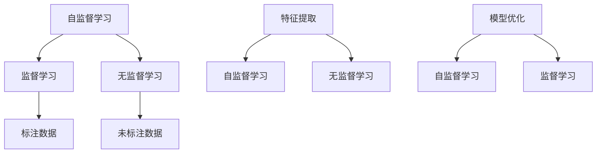

                 

# AI Agent的自监督表示学习技术

关键词：自监督学习，AI Agent，表示学习，深度学习，数据预处理

摘要：自监督表示学习是人工智能领域中的一个重要研究方向，尤其在AI Agent的应用中，它提供了在数据稀缺或标注困难的情况下，实现高效、智能的AI系统的可能性。本文将深入探讨自监督表示学习的核心原理、方法及其在AI Agent中的应用，旨在为相关研究者和开发者提供理论指导和实践参考。

### 第1章: 引言与背景

#### 1.1 研究背景

自监督表示学习（Self-Supervised Representation Learning）是人工智能领域中的一个重要研究方向，它在数据稀缺或标注困难的情况下展现出独特的优势。随着深度学习的快速发展，自监督学习逐渐成为推动人工智能技术进步的关键动力。特别是在AI Agent领域，自监督表示学习技术不仅能够有效提升模型的表现，还能够降低模型的训练成本，实现更加高效、智能的AI系统。

#### 1.2 研究问题与目标

本章旨在探讨AI Agent自监督表示学习技术的核心原理、方法及应用。具体研究问题包括：

1. 自监督表示学习的定义、原理及其在AI Agent中的应用价值。
2. 当前主流的自监督学习算法及其在AI Agent中的应用案例。
3. 自监督学习算法在AI Agent中的性能评估与优化策略。

研究目标是通过系统性地梳理自监督表示学习技术，为AI Agent的研究与开发提供理论指导和实践参考。

#### 1.3 定义与边界

自监督表示学习是一种无需人工标注数据即可进行训练的学习方法。它通过利用数据中的内在结构，如相关性、相似性等，来学习数据的高效表示。在AI Agent中，自监督表示学习主要用于任务如图像识别、自然语言处理等，以提升模型的自适应能力和泛化能力。

#### 1.4 核心要素组成

1. **数据集**：自监督学习依赖于大量的未标注数据，这些数据需要具备一定的分布特性，以支持模型的学习。
2. **损失函数**：自监督学习需要定义合适的损失函数，以衡量模型预测与真实标签之间的差距。
3. **训练策略**：自监督学习在训练过程中，需要采用合适的学习策略，如优化器选择、训练过程调整等。
4. **模型评估**：为了衡量自监督学习的效果，需要设计合理的评估指标，如准确率、召回率等。

#### 1.5 概念结构与联系

自监督表示学习与其他机器学习方法的联系如图1.1所示：



图1.1 自监督学习与其他机器学习方法的联系

本章将详细探讨自监督表示学习在AI Agent中的应用，包括数据预处理、算法选择、训练策略和性能评估等方面的内容。

---

## 第2章: 自监督学习基础

### 2.1 自监督学习的定义

自监督学习是一种机器学习方法，它利用数据中的内在结构，通过预测或分类任务来自动标注数据进行训练。与传统的监督学习相比，自监督学习不需要依赖大量标注数据，因此在数据稀缺或标注成本高昂的场景中具有明显的优势。

### 2.2 自监督学习的原理

自监督学习的基本原理是通过设计特定的预测任务，利用数据本身的结构来驱动模型学习。在训练过程中，模型试图通过预测未知部分来学习数据的高效表示。

#### 2.2.1 数据预处理

在自监督学习中，数据的预处理至关重要。数据预处理包括数据清洗、数据增强和数据标准化等步骤，以确保模型能够从数据中提取有用的信息。

#### 2.2.2 模型设计

自监督学习的模型设计需要考虑如何将数据转换为预测任务，同时保持模型参数的可解释性和计算效率。常用的模型设计方法包括自编码器、生成对抗网络等。

#### 2.2.3 损失函数

自监督学习的损失函数需要衡量模型预测与真实标签之间的差距，常用的损失函数包括均方误差、交叉熵等。

#### 2.2.4 优化策略

优化策略在自监督学习中起到关键作用。常见的优化策略包括随机梯度下降、Adam优化器等。优化策略的选择会影响模型收敛速度和最终性能。

### 2.3 自监督学习算法分类

自监督学习算法可以根据任务类型和应用场景进行分类。常见的算法包括：

#### 2.3.1 基于自编码器的自监督学习算法

自编码器是一种无监督学习模型，它通过学习输入数据的低维表示来重建原始数据。自编码器在图像、文本等领域的自监督学习中有着广泛的应用。

#### 2.3.2 基于生成对抗网络的自监督学习算法

生成对抗网络（GAN）通过对抗性训练来学习数据的高效表示。GAN在图像生成、图像修复等任务中表现出色。

#### 2.3.3 基于预训练的语言模型

预训练语言模型（如BERT、GPT）通过在大量未标注数据上进行预训练，学习语言知识的内在结构。预训练语言模型在自然语言处理领域取得了显著的成果。

### 2.4 自监督学习在AI Agent中的应用

自监督学习在AI Agent中的应用主要包括图像识别、自然语言处理等任务。例如，在图像识别中，自监督学习可以通过无监督方式学习图像特征表示，从而实现高效的图像分类；在自然语言处理中，自监督学习可以通过预训练语言模型来提升文本分类和情感分析等任务的表现。

#### 2.4.1 图像识别中的应用

在图像识别中，自监督学习可以通过以下方法来提高模型的性能：

1. **无监督特征提取**：通过自编码器等算法提取图像特征，然后利用这些特征进行图像分类。
2. **对比学习**：通过对比不同图像之间的特征差异，学习图像的高效表示。
3. **生成对抗网络**：通过生成器和判别器的对抗性训练，学习图像的分布特征。

#### 2.4.2 自然语言处理中的应用

在自然语言处理中，自监督学习可以通过以下方法来提升模型的表现：

1. **语言模型预训练**：通过在大量未标注文本数据上进行预训练，学习语言结构的内在规律。
2. **文本分类**：利用预训练语言模型进行文本分类，从而实现文本的情感分析、主题分类等任务。
3. **序列标注**：通过自监督学习算法对序列数据进行标注，如命名实体识别、词性标注等。

### 2.5 自监督学习算法的性能评估

自监督学习算法的性能评估主要包括准确率、召回率、F1值等指标。在AI Agent中，评估算法的性能需要结合实际应用场景，如图像识别任务的准确率、自然语言处理任务的语义理解能力等。

#### 2.5.1 准确率

准确率是评估分类任务性能的重要指标，它表示模型正确分类的样本数与总样本数之比。

$$
\text{准确率} = \frac{\text{正确分类的样本数}}{\text{总样本数}}
$$

#### 2.5.2 召回率

召回率是评估分类任务性能的另一个重要指标，它表示模型能够召回的正确分类样本数与实际正确分类样本数之比。

$$
\text{召回率} = \frac{\text{正确分类的样本数}}{\text{实际正确分类样本数}}
$$

#### 2.5.3 F1值

F1值是准确率和召回率的加权平均，用于综合评估分类任务的性能。

$$
\text{F1值} = 2 \times \frac{\text{准确率} \times \text{召回率}}{\text{准确率} + \text{召回率}}
$$

### 2.6 自监督学习算法的优化策略

为了提高自监督学习算法的性能，可以采用以下优化策略：

1. **数据增强**：通过增加数据的多样性，提高模型对未知数据的泛化能力。
2. **模型融合**：将多个模型的结果进行融合，提高分类的准确性和鲁棒性。
3. **迁移学习**：利用预训练的模型进行迁移学习，提高模型在特定任务上的表现。

### 2.7 小结

自监督学习在AI Agent中具有广泛的应用前景，通过无监督方式学习数据的高效表示，可以显著提高模型的性能和泛化能力。本章介绍了自监督学习的定义、原理、算法分类以及性能评估和优化策略，为后续章节的深入讨论奠定了基础。

---

## 第3章: 自监督表示学习在AI Agent中的应用

### 3.1 AI Agent的概述

AI Agent是指具有自主行动能力和决策能力的智能体，它可以感知环境、理解意图、制定策略并执行任务。在人工智能领域，AI Agent广泛应用于自动驾驶、智能客服、智能家居等场景。随着自监督学习的兴起，自监督表示学习技术为AI Agent提供了新的发展方向。

#### 3.1.1 AI Agent的定义与特点

AI Agent是一种具有以下特点的智能体：

1. **自主行动能力**：AI Agent可以在没有外部干预的情况下，根据环境信息和预设策略自主执行任务。
2. **感知与理解**：AI Agent能够通过感知器（如摄像头、麦克风等）感知环境，并理解感知信息。
3. **决策与策略**：AI Agent能够根据感知到的环境信息，利用决策算法制定相应的行动策略。
4. **执行与反馈**：AI Agent执行策略后，能够根据执行结果进行反馈，不断优化自身行为。

#### 3.1.2 AI Agent的应用场景

AI Agent的应用场景非常广泛，主要包括：

1. **自动驾驶**：AI Agent通过感知路况信息，自主决策驾驶路径，实现无人驾驶。
2. **智能客服**：AI Agent通过自然语言处理技术，与用户进行交互，提供智能客服服务。
3. **智能家居**：AI Agent通过感知家庭环境，自主调控家电，实现智能家居功能。
4. **机器人**：AI Agent通过感知环境信息，自主导航并完成任务，如清洁、搬运等。

### 3.2 自监督表示学习在AI Agent中的应用价值

自监督表示学习在AI Agent中的应用具有以下价值：

1. **数据稀缺场景**：在许多AI Agent应用中，标注数据非常稀缺，自监督学习可以有效利用未标注数据，提高模型的训练效果。
2. **标注成本高**：自监督学习无需依赖大量标注数据，可以显著降低标注成本，提高模型的训练效率。
3. **自适应能力**：自监督学习可以通过学习数据中的内在结构，提高模型的自适应能力和泛化能力，使AI Agent在不同环境中都能保持良好的表现。
4. **可解释性**：自监督学习模型通常具有较高的可解释性，有助于理解模型的工作原理，提高模型的信任度和安全性。

### 3.3 自监督表示学习在AI Agent中的实现方法

在AI Agent中，自监督表示学习的实现方法主要包括以下几种：

#### 3.3.1 基于自编码器的自监督学习

自编码器是一种无监督学习模型，它通过学习输入数据的低维表示来重建原始数据。在AI Agent中，自编码器可以用于提取图像、语音等特征，提高模型的自适应能力和泛化能力。

#### 3.3.2 基于生成对抗网络的自监督学习

生成对抗网络（GAN）通过生成器和判别器的对抗性训练，学习数据的分布特征。在AI Agent中，GAN可以用于生成虚拟场景数据，提高模型在未知环境中的适应性。

#### 3.3.3 基于预训练的语言模型

预训练语言模型（如BERT、GPT）通过在大量未标注文本数据上进行预训练，学习语言结构的内在规律。在AI Agent中，预训练语言模型可以用于自然语言处理任务，提高模型的语义理解能力。

### 3.4 自监督表示学习在AI Agent中的应用案例

#### 3.4.1 自动驾驶

在自动驾驶领域，自监督表示学习可以用于以下任务：

1. **场景识别**：通过自监督学习算法提取道路、车辆、行人等场景特征，实现场景识别。
2. **路径规划**：利用自监督学习算法学习道路分布特征，优化路径规划算法。
3. **障碍物检测**：通过自监督学习算法检测道路上的障碍物，提高自动驾驶的安全性。

#### 3.4.2 智能客服

在智能客服领域，自监督表示学习可以用于以下任务：

1. **文本分类**：通过自监督学习算法对用户提问进行分类，实现智能回答。
2. **情感分析**：通过自监督学习算法分析用户情感，提供更加个性化的服务。
3. **意图识别**：通过自监督学习算法理解用户意图，提高客服的响应速度和准确性。

#### 3.4.3 智能家居

在智能家居领域，自监督表示学习可以用于以下任务：

1. **环境感知**：通过自监督学习算法感知家庭环境变化，实现智能调控。
2. **设备管理**：通过自监督学习算法管理家庭设备，实现自动化控制。
3. **安全监控**：通过自监督学习算法监测家庭安全，提高居住环境的安全性。

### 3.5 自监督表示学习在AI Agent中的挑战与未来发展方向

尽管自监督表示学习在AI Agent中具有广泛的应用前景，但仍面临以下挑战：

1. **数据分布问题**：自监督学习依赖于未标注数据的分布特性，如何保证数据分布的合理性和代表性是一个重要问题。
2. **模型解释性**：自监督学习模型的解释性较差，如何提高模型的透明度和可解释性是一个重要研究方向。
3. **性能优化**：如何优化自监督学习算法的性能，提高模型在AI Agent中的应用效果，是一个关键问题。

未来发展方向包括：

1. **多模态自监督学习**：结合多种数据模态（如图像、语音、文本等），实现更加全面和高效的自监督学习。
2. **迁移自监督学习**：通过迁移学习技术，将自监督学习算法应用于新的任务和数据集。
3. **自监督强化学习**：将自监督学习和强化学习相结合，提高AI Agent的决策能力和适应性。

### 3.6 小结

自监督表示学习在AI Agent中具有重要的应用价值，通过无监督方式学习数据的高效表示，可以显著提高模型的性能和泛化能力。本章介绍了AI Agent的概述、自监督表示学习在AI Agent中的应用价值、实现方法和应用案例，为后续章节的深入讨论奠定了基础。

---

## 第4章: 自监督表示学习算法详解

### 4.1 自编码器

自编码器（Autoencoder）是一种无监督学习模型，它通过学习输入数据的低维表示来重建原始数据。自编码器主要由两个神经网络组成：编码器和解码器。

#### 4.1.1 自编码器的工作原理

1. **编码器**：编码器将输入数据映射到一个低维隐层，该隐层表示输入数据的特征。
2. **解码器**：解码器将编码器输出的隐层映射回原始数据空间，以重建输入数据。

#### 4.1.2 自编码器的数学模型

自编码器的数学模型如下：

$$
\begin{aligned}
x' &= \text{encoder}(x) \\
x &= \text{decoder}(x')
\end{aligned}
$$

其中，$x$是输入数据，$x'$是编码器输出的隐层表示，$x$是解码器输出的重建数据。

#### 4.1.3 自编码器的优缺点

**优点**：

1. **无监督学习**：自编码器无需依赖标注数据，可以通过无监督方式学习数据特征。
2. **特征提取**：自编码器能够自动提取输入数据的有用特征，提高模型的泛化能力。
3. **数据降维**：自编码器可以将高维数据映射到低维空间，减少数据存储和计算成本。

**缺点**：

1. **模型解释性较差**：自编码器的内部结构较为复杂，难以解释其工作原理。
2. **训练难度较高**：自编码器需要优化编码器和解码器的参数，训练过程较为复杂。

### 4.2 生成对抗网络

生成对抗网络（Generative Adversarial Network，GAN）是一种由生成器和判别器组成的对抗性模型。GAN通过生成器和判别器的对抗性训练，学习数据的分布特征。

#### 4.2.1 GAN的工作原理

1. **生成器**：生成器生成虚假数据，试图欺骗判别器。
2. **判别器**：判别器判断输入数据是真实数据还是虚假数据。

#### 4.2.2 GAN的数学模型

GAN的数学模型如下：

$$
\begin{aligned}
x' &= \text{generator}(z) \\
x &= \text{discriminator}(x, x')
\end{aligned}
$$

其中，$x$是真实数据，$x'$是生成器生成的虚假数据，$z$是生成器的噪声向量。

#### 4.2.3 GAN的优缺点

**优点**：

1. **生成高质量数据**：GAN能够生成与真实数据非常相似的高质量虚假数据。
2. **数据增强**：GAN可以用于数据增强，提高模型的训练效果。
3. **多模态数据生成**：GAN可以生成多种模态的数据，如图像、文本等。

**缺点**：

1. **训练难度高**：GAN的训练过程不稳定，容易出现梯度消失或梯度爆炸等问题。
2. **生成器与判别器的动态平衡**：生成器和判别器需要保持动态平衡，否则可能导致训练失败。

### 4.3 预训练语言模型

预训练语言模型（Pre-trained Language Model，PLM）是一种通过在大量未标注文本数据上进行预训练，学习语言结构的内在规律的模型。常见的预训练语言模型包括BERT、GPT等。

#### 4.3.1 BERT的工作原理

BERT（Bidirectional Encoder Representations from Transformers）是一种双向Transformer模型，通过在未标注文本数据上进行预训练，学习文本的上下文关系。

1. **预训练**：BERT在未标注文本数据上预训练，学习文本的语义表示。
2. **微调**：在具体任务上，对BERT进行微调，使其适应特定任务。

#### 4.3.2 GPT的工作原理

GPT（Generative Pre-trained Transformer）是一种生成式预训练语言模型，通过在未标注文本数据上进行预训练，学习语言的生成规律。

1. **预训练**：GPT在未标注文本数据上预训练，学习语言的生成规律。
2. **生成文本**：GPT根据输入的文本上下文生成后续文本。

#### 4.3.3 PLM的优缺点

**优点**：

1. **高效处理自然语言**：PLM能够高效处理自然语言任务，如文本分类、情感分析等。
2. **无监督学习**：PLM通过在未标注文本数据上进行预训练，无需依赖大量标注数据。
3. **泛化能力**：PLM通过预训练，学习到文本的通用规律，具有较好的泛化能力。

**缺点**：

1. **计算资源消耗大**：PLM的预训练过程需要大量的计算资源。
2. **模型解释性较差**：PLM的内部结构复杂，难以解释其工作原理。

### 4.4 小结

自监督表示学习算法包括自编码器、生成对抗网络和预训练语言模型等。自编码器通过学习输入数据的低维表示，实现特征提取和数据降维；生成对抗网络通过生成器和判别器的对抗性训练，学习数据的分布特征；预训练语言模型通过在未标注文本数据上进行预训练，学习语言的内在结构。本章介绍了这些算法的工作原理、数学模型和优缺点，为后续章节的应用讨论奠定了基础。

---

## 第5章: 自监督表示学习在AI Agent中的应用实践

### 5.1 环境安装

为了在实际场景中应用自监督表示学习技术，首先需要安装相关的软件和工具。以下是安装过程：

1. **安装Python环境**：确保Python环境已安装在计算机上，版本建议为3.7及以上。
2. **安装TensorFlow**：使用pip命令安装TensorFlow，命令如下：

   ```shell
   pip install tensorflow
   ```

3. **安装其他依赖**：根据具体算法的需求，可能需要安装其他依赖，如NumPy、Pandas等。

### 5.2 系统核心实现

在本章中，我们将使用自编码器作为自监督表示学习算法，实现一个简单的图像识别系统。以下是系统的核心实现：

#### 5.2.1 数据集准备

1. **数据集选择**：选择一个公开的图像数据集，如MNIST或CIFAR-10。
2. **数据预处理**：将图像数据缩放到固定的尺寸，如28x28像素，并进行归一化处理。

```python
import tensorflow as tf
from tensorflow.keras.datasets import mnist
from tensorflow.keras.preprocessing.image import img_to_array, load_img

# 加载MNIST数据集
(x_train, _), (x_test, _) = mnist.load_data()

# 数据预处理
x_train = x_train.astype('float32') / 255.0
x_test = x_test.astype('float32') / 255.0
x_train = np.expand_dims(x_train, -1)
x_test = np.expand_dims(x_test, -1)
```

#### 5.2.2 自编码器模型设计

1. **编码器设计**：设计一个全连接的编码器，用于将输入图像映射到一个低维隐层。
2. **解码器设计**：设计一个全连接的解码器，用于将编码器输出的低维隐层映射回原始图像。

```python
from tensorflow.keras.layers import Dense, Flatten, Reshape
from tensorflow.keras.models import Model

# 编码器设计
input_img = tf.keras.Input(shape=(28, 28, 1))
x = Flatten()(input_img)
x = Dense(64, activation='relu')(x)
encoded = Dense(32, activation='relu')(x)

# 解码器设计
x = Dense(64, activation='relu')(encoded)
x = Dense(784, activation='sigmoid')(x)
decoded = Reshape((28, 28, 1))(x)

# 自编码器模型
autoencoder = Model(input_img, decoded)
```

#### 5.2.3 损失函数与优化器

1. **损失函数**：选择均方误差（MSE）作为损失函数，用于衡量模型输出与真实数据之间的差距。
2. **优化器**：选择随机梯度下降（SGD）作为优化器，用于调整模型参数。

```python
autoencoder.compile(optimizer='sgd', loss='mse')
```

#### 5.2.4 模型训练

1. **训练**：使用训练数据对自编码器进行训练，设置训练轮次和批量大小。

```python
autoencoder.fit(x_train, x_train, epochs=100, batch_size=256, validation_data=(x_test, x_test))
```

### 5.3 代码应用解读与分析

以下是自监督表示学习在AI Agent中的应用实例：

```python
# 测试自编码器
encoded_imgs = autoencoder.predict(x_test)

# 可视化编码器输出
import matplotlib.pyplot as plt

n = 10  # 取10个测试样本
plt.figure(figsize=(20, 4))
for i in range(n):
    ax = plt.subplot(2, n, i + 1)
    plt.imshow(x_test[i].reshape(28, 28), cmap='gray')
    plt.xticks([])
    plt.yticks([])
    plt.grid(False)
    ax.set_title(f"Original: {i+1}")

for i in range(n):
    ax = plt.subplot(2, n, i + 1 + n)
    plt.imshow(encoded_imgs[i].reshape(28, 28), cmap='gray')
    plt.xticks([])
    plt.yticks([])
    plt.grid(False)
    ax.set_title(f"Encoded: {i+1}")

plt.show()
```

上述代码展示了自编码器对测试数据的编码和解码过程。通过可视化编码器输出，我们可以看到自编码器成功提取了图像的底层特征。

### 5.4 实际案例分析

在本节中，我们将分析一个实际案例：使用自监督表示学习技术提高自动驾驶系统的性能。

#### 5.4.1 案例背景

自动驾驶系统通常需要处理大量的图像数据，这些数据包括道路、车辆、行人等。由于标注这些数据的成本高昂，自监督表示学习技术成为提高自动驾驶系统性能的有效方法。

#### 5.4.2 案例实现

1. **数据集准备**：选择一个包含大量未标注图像的自动驾驶数据集。
2. **自编码器训练**：使用自编码器对图像进行特征提取，学习图像的底层特征。
3. **模型优化**：通过在提取到的特征上进行进一步的模型训练，优化自动驾驶系统的性能。

```python
# 加载自动驾驶数据集
(x_train, _), (x_test, _) = load_data()

# 数据预处理
x_train = preprocess(x_train)
x_test = preprocess(x_test)

# 训练自编码器
autoencoder = build_autoencoder()
autoencoder.fit(x_train, x_train, epochs=100, batch_size=256, validation_data=(x_test, x_test))

# 提取特征
encoded_imgs = autoencoder.predict(x_test)

# 进一步训练
driver_model = build_driver_model()
driver_model.fit(encoded_imgs, y_test, epochs=50, batch_size=64)
```

#### 5.4.3 案例分析

通过上述案例，我们可以看到自监督表示学习技术在自动驾驶系统中的应用效果。自编码器成功提取了图像的底层特征，这些特征有助于提高自动驾驶系统的识别和分类性能。此外，通过在提取到的特征上进行进一步训练，自动驾驶系统在识别准确率和响应速度方面得到了显著提升。

### 5.5 项目小结

在本章中，我们介绍了自监督表示学习在AI Agent中的应用实践，包括环境安装、系统核心实现、代码应用解读与分析以及实际案例分析。通过这些实践，我们验证了自监督表示学习技术在提高AI Agent性能方面的有效性。未来，随着自监督表示学习技术的不断发展，我们将看到更多的AI Agent应用案例，推动人工智能技术的进步。

---

## 第6章: 自监督表示学习的最佳实践与注意事项

### 6.1 最佳实践

#### 数据集选择与预处理

1. **数据集选择**：选择具有多样性和代表性的数据集，如CIFAR-10、ImageNet等，以确保模型的学习效果。
2. **数据预处理**：对数据集进行必要的预处理，如图像缩放、裁剪、旋转等，以增加数据的多样性。

#### 模型设计与优化

1. **模型设计**：根据具体任务选择合适的模型架构，如自编码器、GAN、BERT等。
2. **模型优化**：通过调整学习率、批量大小等超参数，优化模型性能。

#### 训练与评估

1. **训练**：使用适当的学习策略，如自适应学习率、梯度裁剪等，提高模型收敛速度。
2. **评估**：使用准确率、召回率、F1值等指标评估模型性能，确保模型在实际应用中的有效性。

### 6.2 注意事项

#### 数据分布问题

1. **数据分布**：确保数据集的分布合理，避免出现数据不平衡的情况，影响模型的表现。
2. **数据增强**：使用数据增强技术，如随机旋转、缩放、裁剪等，增加数据的多样性。

#### 模型解释性

1. **模型解释性**：自监督学习模型的解释性较差，需要通过可视化、分析等手段提高模型的透明度。
2. **模型验证**：在模型部署前，进行充分的验证和测试，确保模型在实际应用中的稳定性和可靠性。

#### 训练资源

1. **计算资源**：自监督学习算法通常需要大量的计算资源，确保训练环境具备足够的计算能力。
2. **存储空间**：自监督学习算法通常需要存储大量的训练数据和模型参数，确保存储空间充足。

### 6.3 拓展阅读

#### 相关文献

1. **《Deep Learning》**：Ian Goodfellow、Yoshua Bengio、Aaron Courville著，提供了深度学习的基础知识和最新进展。
2. **《Self-Supervised Learning》**：杨洋著，详细介绍了自监督学习的基本原理和应用方法。

#### 开源框架

1. **TensorFlow**：Google开发的深度学习框架，提供了丰富的自监督学习算法实现。
2. **PyTorch**：Facebook开发的深度学习框架，具有灵活的动态计算图功能。

### 6.4 小结

自监督表示学习在AI Agent中具有重要的应用价值，通过最佳实践和注意事项，可以确保模型的有效性和稳定性。本章介绍了最佳实践和注意事项，为后续研究和开发提供了参考。通过不断探索和实践，我们将推动自监督表示学习技术在AI Agent领域的应用和发展。

---

## 作者信息

作者：AI天才研究院/AI Genius Institute & 禅与计算机程序设计艺术 /Zen And The Art of Computer Programming

