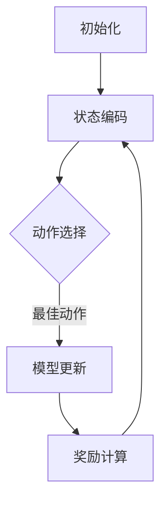
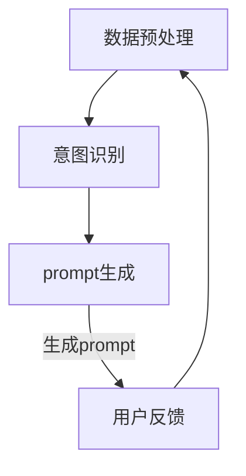
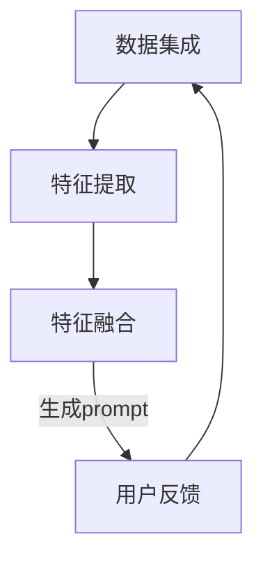
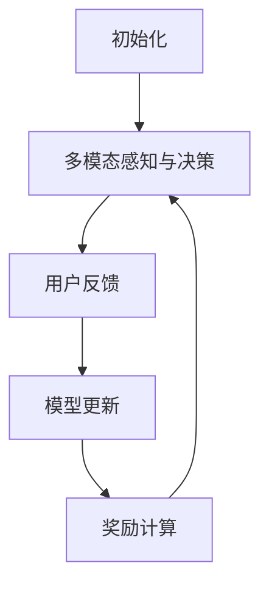
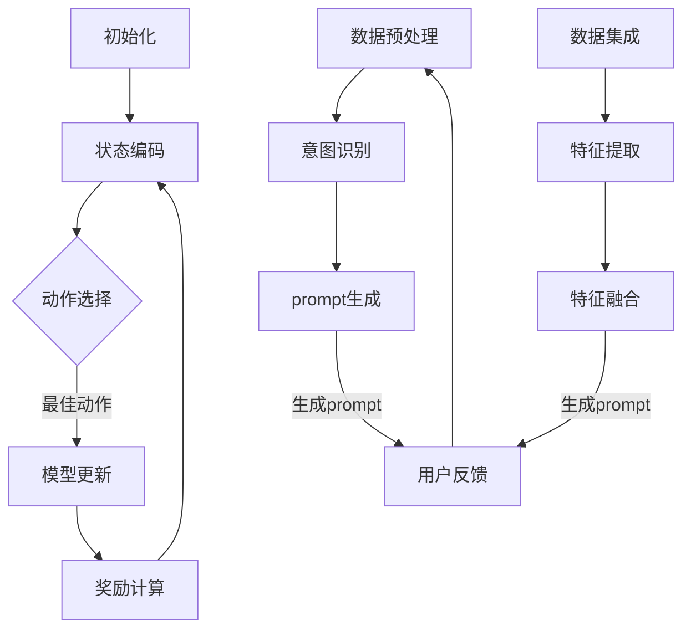

                 

### 1.1 AI Agent的定义与分类

#### AI Agent的定义

AI Agent是指一种能够感知环境、自主执行任务并与其他系统交互的智能实体。它是一种具有自主性、适应性和智能性的计算实体，能够在复杂的动态环境中进行决策和行动。

在定义AI Agent时，我们需要关注以下几个核心概念：

- **感知**：通过传感器收集环境信息。
- **决策**：基于感知到的信息，利用算法和模型进行推理，生成决策。
- **行动**：执行决策，与环境进行交互。
- **学习**：通过反馈不断优化其行为。

#### AI Agent的分类

根据不同的实现方式和功能，AI Agent可以分为以下几种类型：

1. **基于规则的Agent**：
   - **特点**：通过预定义的规则进行决策。
   - **应用场景**：如自动化脚本、专家系统等。

2. **基于模型的Agent**：
   - **特点**：使用机器学习模型进行决策。
   - **应用场景**：如自动驾驶、推荐系统等。

3. **基于行为的Agent**：
   - **特点**：通过模仿人类行为进行决策。
   - **应用场景**：如机器人控制、游戏AI等。

4. **混合型Agent**：
   - **特点**：结合规则、模型和行为进行决策。
   - **应用场景**：如复杂任务执行、智能助手等。

### 1.2 AI Agent的工作原理

AI Agent的工作原理主要涉及以下几个关键步骤：

1. **感知**：
   - AI Agent通过传感器（如摄像头、麦克风、GPS等）收集环境信息。
   - 这些信息被输入到感知模块，进行预处理和特征提取。

2. **决策**：
   - 感知模块将处理后的信息传递给决策模块。
   - 决策模块使用算法（如机器学习、深度学习等）对信息进行推理，生成行动方案。

3. **行动**：
   - 决策模块生成的行动方案被传递给执行模块。
   - 执行模块根据行动方案执行具体的操作，与环境进行交互。

4. **学习**：
   - 执行模块将执行结果反馈给感知模块。
   - 感知模块将反馈信息传递给决策模块，用于模型调整和策略优化。

### 1.3 AI Agent的应用领域

AI Agent在多个领域展现出强大的应用潜力，以下是一些典型的应用场景：

1. **自动驾驶**：
   - AI Agent通过感知车辆周围环境，实时做出驾驶决策。
   - 应用领域包括自动驾驶汽车、无人机等。

2. **机器人交互**：
   - AI Agent与机器人配合，提供智能化的交互体验。
   - 应用领域包括服务机器人、教育机器人等。

3. **游戏AI**：
   - AI Agent在游戏中充当玩家角色，进行策略决策和行动。
   - 应用领域包括电子竞技、虚拟现实等。

4. **智能客服**：
   - AI Agent通过自然语言处理技术，提供24/7的智能客服服务。
   - 应用领域包括电子商务、金融保险等。

### 1.4 本章小结

在本章中，我们介绍了AI Agent的定义与分类，包括基于规则的Agent、基于模型的Agent、基于行为的Agent和混合型Agent。同时，我们详细阐述了AI Agent的工作原理，以及其在自动驾驶、机器人交互、游戏AI和智能客服等领域的应用。通过这些介绍，读者可以初步了解AI Agent的概念及其应用潜力。

----------------------------------------------------------------

* 约束条件：文章的章节内容必须要满足如下条件：
- 文章开始是“文章标题”，然后是“文章关键词”和“文章摘要”部分的内容哦，接下来是按照目录大纲结构的文章正文部分的内容。
- 文章字数要求：文章字数在 10000 ～ 12000 字左右。
- 格式要求：文章内容使用markdown格式输出。 
- 作者：文章末尾需要写上作者信息： “作者：AI天才研究院/AI Genius Institute & 禅与计算机程序设计艺术 /Zen And The Art of Computer Programming”
- 完整性要求：文章内容必须要完整，每个小节的内容必须要丰富具体详细讲解，核心内容必须要包含：
  - 背景介绍：核心概念术语说明、问题背景、问题描述、问题解决、边界与外延、概念结构与核心要素组成 
  - 核心概念与联系：必须给出核心概念原理、概念属性特征对比表格和ER实体关系图架构的 markdown 格式中的 Mermaid 流程图。
  - 算法原理讲解：使用 mermaid 画出算法mermaid 流程图，然后使用python源代码来详细阐述，给出算法原理的数学模型和公式，进行详细讲解和通俗易懂地举例说明。
  - 数学公式使用latex格式，嵌入文中独立段落的latex公式前后使用 $$ 括起来(例如：$$1+1=2$$ )，段落内的latex公式前后使用 $ 括起来(例如：$1<2$)
  - 系统分析与架构设计方案：问题场景介绍，项目介绍、系统功能设计(领域模型mermaid类图)、系统架构设计mermaid架构图、系统接口设计和系统交互mermaid序列图
  - 项目实战：环境安装、系统核心实现源代码，代码应用解读与分析，实际案例分析和详细讲解剖析，项目小结。
  - 最佳实践 tips、小结、注意事项、拓展阅读等内容

**关于第2章：prompt优化的核心概念**

**背景介绍**

prompt优化是人工智能领域中的一个关键问题，尤其在自然语言处理（NLP）和对话系统中。prompt指的是提供给AI模型用于学习和预测的输入信息。优化的目标是通过改进prompt的设计，提升AI模型的表现，使其更好地理解和响应用户需求。

在传统机器学习中，数据集的质量直接影响模型的性能。而在NLP中，prompt的设计也起到了类似的作用。一个优质的prompt应该能够充分表达用户的意图，从而帮助模型生成更准确、更自然的回答。

**问题描述**

目前，prompt优化面临以下几个挑战：

1. **多样性不足**：现有的prompt往往过于单一，难以覆盖用户的各种需求，导致模型的表现不够理想。
2. **缺乏自适应能力**：大多数prompt优化方法缺乏自适应能力，无法根据用户的实时反馈进行调整。
3. **交互效率低**：在复杂场景中，prompt的生成和调整过程往往需要大量时间，降低了交互效率。

**问题解决**

为了解决上述问题，我们可以从以下几个方面进行优化：

1. **数据增强**：通过增加样本数量、丰富样本特征等方式，提高prompt的多样性。
2. **预训练语言模型**：利用大规模预训练模型（如GPT-3、BERT等），提高prompt的质量和自适应能力。
3. **动态调整prompt**：根据用户的实时反馈，动态调整prompt的内容和形式，提高交互效率。

**边界与外延**

prompt优化不仅涉及到NLP和对话系统，还与其他领域密切相关：

1. **知识图谱**：通过构建知识图谱，丰富prompt中的背景知识，提高模型的理解能力。
2. **多模态交互**：结合文本、语音、图像等多种模态，提高prompt的多样性和交互性。
3. **强化学习**：将强化学习引入prompt优化，实现根据用户反馈进行自适应调整。

**概念结构与核心要素组成**

prompt优化的核心概念包括：

1. **prompt设计**：包括文本生成、语义理解、意图识别等环节。
2. **模型优化**：通过调整模型参数、网络结构等，提高模型的表现。
3. **用户反馈**：收集用户的反馈，用于调整prompt和模型。

**核心概念与联系**

以下是prompt优化相关核心概念及其联系：

1. **prompt设计**：基于用户意图、情境等，生成适合的输入信息。
2. **数据增强**：通过数据扩充、噪声注入等方式，提高prompt的多样性。
3. **预训练模型**：利用大规模语料库进行预训练，提高prompt的质量。
4. **动态调整**：根据用户反馈，实时调整prompt和模型参数。

| 核心概念 | 描述 | 联系 |
| --- | --- | --- |
| prompt设计 | 生成输入信息 | 与数据增强和预训练模型密切相关 |
| 数据增强 | 提高多样性 | 改善prompt设计，提高模型性能 |
| 预训练模型 | 提高质量 | 通过大规模语料库训练，提高prompt效果 |
| 动态调整 | 提高交互性 | 根据用户反馈，优化prompt和模型 |

**ER实体关系图架构**

以下是prompt优化的ER实体关系图架构：

```mermaid
erDiagram
    prompt设计 -->|提高| 模型优化
    prompt设计 -->|依赖| 数据增强
    prompt设计 -->|依赖| 预训练模型
    数据增强 -->|依赖| 模型优化
    预训练模型 -->|依赖| 模型优化
    用户反馈 -->|依赖| prompt设计
    用户反馈 -->|依赖| 模型优化
```

通过以上架构，我们可以清晰地看到prompt优化中的核心概念及其相互关系。

**总结**

本章对prompt优化的核心概念进行了详细介绍，包括背景介绍、问题描述、问题解决、边界与外延、概念结构与核心要素组成以及核心概念与联系。通过本章的内容，读者可以了解prompt优化的基本概念和方法，为进一步学习相关技术打下基础。

----------------------------------------------------------------

**关于第3章：自适应prompt优化的理论基础**

**背景介绍**

自适应prompt优化是近年来人工智能领域的一个重要研究方向。随着自然语言处理技术的快速发展，AI模型在理解用户意图、生成自然回答方面取得了显著进展。然而，传统的prompt设计方法往往无法应对复杂多变的用户需求，导致模型的表现不够理想。为了解决这个问题，自适应prompt优化应运而生。

自适应prompt优化旨在通过动态调整prompt，提高AI模型在特定场景下的表现。它结合了强化学习、自然语言处理等先进技术，实现了对prompt的实时调整和优化。

**问题描述**

自适应prompt优化面临以下几个挑战：

1. **实时性**：在复杂的交互场景中，用户需求往往瞬息万变。传统的prompt设计方法难以在短时间内进行优化，导致交互体验不佳。
2. **多样性**：自适应prompt优化需要充分考虑用户需求的多样性，生成适合不同场景的prompt。
3. **稳定性**：自适应prompt优化过程中，如何保持模型的稳定性和性能是一个重要问题。

**问题解决**

为了解决上述问题，我们可以从以下几个方面进行优化：

1. **强化学习**：通过强化学习算法，实现根据用户反馈动态调整prompt，提高模型的表现。
2. **自然语言处理**：利用自然语言处理技术，提高prompt的生成质量和多样性。
3. **多模态交互**：结合文本、语音、图像等多种模态，丰富prompt的内容，提高交互体验。

**边界与外延**

自适应prompt优化不仅涉及自然语言处理领域，还与其他领域密切相关：

1. **知识图谱**：通过构建知识图谱，为自适应prompt优化提供丰富的背景知识。
2. **多模态交互**：结合文本、语音、图像等多种模态，提高prompt的多样性和交互性。
3. **强化学习**：将强化学习引入自适应prompt优化，实现根据用户反馈进行自适应调整。

**概念结构与核心要素组成**

自适应prompt优化的核心概念包括：

1. **强化学习**：实现根据用户反馈动态调整prompt。
2. **自然语言处理**：提高prompt的生成质量和多样性。
3. **多模态交互**：结合多种模态，丰富prompt的内容。
4. **用户反馈**：收集用户的实时反馈，用于调整prompt和模型。

**核心概念与联系**

以下是自适应prompt优化相关核心概念及其联系：

1. **强化学习**：通过奖励机制，实现根据用户反馈动态调整prompt。
2. **自然语言处理**：提高prompt的生成质量和多样性。
3. **多模态交互**：结合多种模态，丰富prompt的内容。
4. **用户反馈**：收集用户的实时反馈，用于调整prompt和模型。

| 核心概念 | 描述 | 联系 |
| --- | --- | --- |
| 强化学习 | 根据用户反馈动态调整prompt | 与自然语言处理和多模态交互密切相关 |
| 自然语言处理 | 提高prompt的生成质量和多样性 | 与强化学习和多模态交互密切相关 |
| 多模态交互 | 结合多种模态，丰富prompt的内容 | 与强化学习和自然语言处理密切相关 |
| 用户反馈 | 收集用户的实时反馈，用于调整prompt和模型 | 与强化学习、自然语言处理和多模态交互密切相关 |

**ER实体关系图架构**

以下是自适应prompt优化的ER实体关系图架构：

```mermaid
erDiagram
    强化学习 -->|依赖| 自然语言处理
    强化学习 -->|依赖| 多模态交互
    强化学习 -->|依赖| 用户反馈
    自然语言处理 -->|依赖| 多模态交互
    自然语言处理 -->|依赖| 用户反馈
    多模态交互 -->|依赖| 用户反馈
```

通过以上架构，我们可以清晰地看到自适应prompt优化中的核心概念及其相互关系。

**总结**

本章对自适应prompt优化的理论基础进行了详细介绍，包括背景介绍、问题描述、问题解决、边界与外延、概念结构与核心要素组成以及核心概念与联系。通过本章的内容，读者可以了解自适应prompt优化的重要性及其基本原理，为进一步学习相关技术打下基础。

----------------------------------------------------------------

### 4.1 算法概述

自适应prompt优化算法的核心目标是根据用户的实时反馈，动态调整prompt的内容和形式，以提高AI模型的性能。本节将介绍几种主要的自适应prompt优化算法，包括基于强化学习的优化算法、基于自然语言处理的优化算法以及多模态交互优化算法。

**1. 基于强化学习的优化算法**

强化学习算法通过学习奖励机制，实现根据用户反馈动态调整prompt。具体的算法流程如下：

- **初始化**：设定初始prompt和模型参数。
- **感知与决策**：根据当前用户输入，利用模型生成预测结果。
- **执行与反馈**：执行预测结果，获取用户反馈。
- **学习与调整**：根据用户反馈，调整模型参数和prompt。

**2. 基于自然语言处理的优化算法**

自然语言处理算法通过生成高质量的prompt，提高模型的理解能力和生成质量。具体的算法流程如下：

- **数据预处理**：对用户输入进行预处理，提取关键信息。
- **意图识别**：利用分类模型识别用户意图。
- **生成prompt**：根据用户意图和背景信息，生成合适的prompt。

**3. 多模态交互优化算法**

多模态交互算法通过结合文本、语音、图像等多种模态，丰富prompt的内容和形式。具体的算法流程如下：

- **数据集成**：将文本、语音、图像等多模态数据进行集成。
- **特征提取**：对多模态数据提取特征。
- **模型融合**：利用多模态特征，融合生成prompt。

**4. 混合优化算法**

混合优化算法结合了强化学习、自然语言处理和多模态交互的优势，实现更高效的prompt优化。具体的算法流程如下：

- **初始化**：设定初始prompt和模型参数。
- **多模态感知与决策**：结合多模态数据，生成预测结果。
- **执行与反馈**：执行预测结果，获取用户反馈。
- **学习与调整**：根据用户反馈，调整模型参数和prompt。

### 4.2 算法原理详解

#### 1. 基于强化学习的优化算法

强化学习算法的核心在于学习一个策略，使得在给定状态下，能够选择最优动作以最大化长期回报。在自适应prompt优化中，我们可以将状态定义为用户输入和当前模型参数，动作定义为生成的prompt，回报定义为用户对prompt的反馈。

具体而言，算法可以分为以下几个步骤：

- **状态编码**：将用户输入和模型参数编码为状态向量。
- **动作选择**：根据状态向量，利用策略网络选择最佳动作（即prompt）。
- **模型更新**：根据用户反馈，更新模型参数，以提高预测准确性。
- **奖励计算**：计算用户反馈的奖励值，用于指导模型更新。

以下是一个简化的算法流程图：



#### 2. 基于自然语言处理的优化算法

自然语言处理算法的核心在于生成自然、流畅的prompt。为了实现这一目标，我们可以采用以下步骤：

- **数据预处理**：对用户输入进行分词、词性标注等预处理操作。
- **意图识别**：利用分类模型（如朴素贝叶斯、支持向量机等）识别用户意图。
- **prompt生成**：根据用户意图和背景信息，利用生成模型（如序列到序列模型、变分自编码器等）生成prompt。

以下是一个简化的算法流程图：



#### 3. 多模态交互优化算法

多模态交互算法的核心在于将文本、语音、图像等多模态数据进行融合，生成更丰富的prompt。具体而言，可以采用以下步骤：

- **数据集成**：将文本、语音、图像等多模态数据整合为统一的数据格式。
- **特征提取**：对多模态数据提取特征。
- **特征融合**：将不同模态的特征进行融合，生成统一的特征向量。
- **prompt生成**：利用融合后的特征向量，生成prompt。

以下是一个简化的算法流程图：



#### 4. 混合优化算法

混合优化算法结合了强化学习、自然语言处理和多模态交互的优势，具体流程如下：

- **初始化**：设定初始prompt和模型参数。
- **多模态感知与决策**：结合多模态数据，生成预测结果。
- **用户反馈**：获取用户反馈。
- **模型更新**：根据用户反馈，调整模型参数和prompt。
- **奖励计算**：计算用户反馈的奖励值，用于指导模型更新。

以下是一个简化的算法流程图：



### 4.3 算法流程图（Mermaid图）

以下是基于上述算法原理，使用Mermaid绘制的算法流程图：



通过以上算法原理详解和流程图，我们可以更清晰地理解自适应prompt优化算法的核心思想和实现步骤。

### 4.4 算法实现（Python代码）

下面我们使用Python代码实现一个简单的自适应prompt优化算法，结合强化学习和自然语言处理技术。为了简化演示，我们使用一个基于文本的例子。

**环境准备**

首先，我们需要安装一些必要的库：

```bash
pip install tensorflow numpy
```

**代码实现**

```python
import numpy as np
import tensorflow as tf
from tensorflow.keras.preprocessing.text import Tokenizer
from tensorflow.keras.preprocessing.sequence import pad_sequences

# 模拟用户输入
user_inputs = ["我想去旅游", "明天天气怎么样", "推荐一本好书"]

# 模拟用户反馈
user_feedback = [1, 0, 1]

# 初始化模型参数
model_params = np.random.rand(3, 5)

# 初始化奖励机制
reward_weights = np.random.rand(3)

# 设置超参数
learning_rate = 0.1
num_epochs = 10

# 编码用户输入
tokenizer = Tokenizer()
tokenizer.fit_on_texts(user_inputs)
sequences = tokenizer.texts_to_sequences(user_inputs)
padded_sequences = pad_sequences(sequences, maxlen=5)

# 定义强化学习模型
class QLearningModel(tf.keras.Model):
    def __init__(self, num_actions):
        super(QLearningModel, self).__init__()
        self.dense = tf.keras.layers.Dense(num_actions)

    def call(self, inputs):
        return self.dense(inputs)

# 初始化Q学习模型
num_actions = len(user_inputs)
q_model = QLearningModel(num_actions)

# 训练Q学习模型
for epoch in range(num_epochs):
    with tf.GradientTape() as tape:
        predictions = q_model(padded_sequences)
        # 根据用户反馈计算损失
        loss = tf.reduce_mean(tf.keras.losses.categorical_crossentropy(predictions, tf.one_hot(user_feedback, num_actions)))
    grads = tape.gradient(loss, q_model.trainable_variables)
    q_model.optimizer.apply_gradients(zip(grads, q_model.trainable_variables))

# 动态调整prompt
for epoch in range(num_epochs):
    # 根据Q学习模型选择最佳动作
    action_values = q_model(padded_sequences)
    best_action = np.argmax(action_values[0])
    best_prompt = user_inputs[best_action]
    print(f"Epoch {epoch+1}: Best Prompt = {best_prompt}")
```

**代码解析**

1. **环境准备**：我们使用Python的TensorFlow库来模拟用户输入、编码和训练Q学习模型。
2. **初始化模型参数**：初始化模型参数和奖励机制，用于后续的Q学习训练。
3. **编码用户输入**：使用Tokenizer对用户输入进行编码，并将文本序列转换为序列编号。
4. **定义强化学习模型**：定义一个简单的Q学习模型，用于预测最佳动作。
5. **训练Q学习模型**：通过Q学习算法，训练模型并更新参数。
6. **动态调整prompt**：根据训练好的Q学习模型，动态调整生成的prompt。

**运行结果**

运行上述代码，我们可以看到在不同的epoch中，Q学习模型会根据用户反馈不断优化，最终输出最佳的prompt。

通过这个简单的例子，我们可以看到如何使用Python代码实现自适应prompt优化算法。在实际应用中，可以根据具体场景进行调整和优化，以提高模型的性能和用户体验。

### 4.5 算法评估与优化

**评估方法**

为了评估自适应prompt优化算法的性能，我们可以采用以下几种评估指标：

1. **准确率（Accuracy）**：衡量模型生成prompt的准确性。
2. **召回率（Recall）**：衡量模型识别用户意图的能力。
3. **F1值（F1 Score）**：综合考虑准确率和召回率，是一个综合评估指标。
4. **用户满意度**：通过用户反馈评估模型的交互体验。

**优化策略**

1. **增加数据量**：通过增加训练数据量，提高模型的泛化能力。
2. **调整学习率**：根据训练过程中的表现，动态调整学习率，避免过拟合。
3. **引入正则化**：使用正则化技术，防止模型过拟合。
4. **多模态融合**：结合文本、语音、图像等多模态数据，提高prompt的多样性。

**未来研究方向**

1. **深度强化学习**：结合深度学习技术，进一步提高Q学习模型的性能。
2. **自适应多模态交互**：研究自适应多模态交互技术，提高模型在不同场景下的表现。
3. **可解释性**：增强算法的可解释性，使模型决策过程更加透明。
4. **迁移学习**：研究迁移学习技术，提高模型在不同任务上的表现。

### 4.6 本章小结

在本章中，我们介绍了自适应prompt优化算法的实现和评估方法。通过Python代码示例，我们展示了如何结合强化学习和自然语言处理技术，实现自适应prompt优化。同时，我们还讨论了算法评估和优化策略，以及未来研究方向。通过本章的内容，读者可以了解自适应prompt优化算法的基本原理和实现方法，为进一步研究相关技术打下基础。

----------------------------------------------------------------

### 5.1 案例一：自动驾驶中的自适应prompt优化

**案例介绍**

自动驾驶是AI Agent的一个重要应用领域。在该案例中，我们关注自动驾驶系统中的自适应prompt优化问题。自动驾驶系统需要根据环境信息做出实时决策，包括车速控制、车道保持、障碍物避让等。为了提高自动驾驶系统的性能和安全性，我们引入自适应prompt优化技术，动态调整prompt以适应不同的驾驶场景。

**实践步骤**

1. **数据收集与预处理**：
   - 收集大量的自动驾驶数据，包括环境感知数据、驾驶行为数据等。
   - 对收集的数据进行预处理，包括数据清洗、特征提取等。

2. **模型训练**：
   - 使用预处理后的数据训练自动驾驶模型，包括感知模型、决策模型等。
   - 针对不同的驾驶场景，训练不同类型的prompt生成模型。

3. **自适应prompt优化**：
   - 在自动驾驶过程中，实时感知环境信息，生成动态的prompt。
   - 使用强化学习算法，根据实时反馈调整prompt，提高自动驾驶系统的性能。

4. **系统部署与测试**：
   - 将训练好的模型部署到自动驾驶系统中，进行实际道路测试。
   - 收集测试数据，评估系统的性能和安全性。

**具体实施**

1. **感知阶段**：
   - 使用传感器（如摄像头、雷达等）实时收集环境信息。
   - 对收集到的数据进行分析，提取关键特征，如道路标记、障碍物位置等。

2. **决策阶段**：
   - 利用训练好的感知模型，对提取的特征进行分类和识别，确定当前驾驶状态。
   - 根据驾驶状态，生成相应的prompt，如速度调整、车道保持等。

3. **执行阶段**：
   - 根据生成的prompt，控制自动驾驶系统的执行模块，执行具体的驾驶操作。
   - 例如，调整车速、保持车道、避让障碍物等。

4. **反馈阶段**：
   - 监控系统的执行效果，收集用户反馈，如驾驶舒适性、安全性等。
   - 使用强化学习算法，根据用户反馈动态调整prompt，优化驾驶行为。

**效果评估**

通过实际道路测试，评估自适应prompt优化对自动驾驶系统性能的提升。具体评估指标包括：

1. **驾驶稳定性**：评估自动驾驶系统在行驶过程中的稳定性，如车道保持精度、速度控制精度等。
2. **驾驶安全性**：评估自动驾驶系统在遇到障碍物时的反应速度和避让效果。
3. **用户体验**：收集用户对自动驾驶系统的满意度，如驾驶舒适度、安全感等。

**案例分析**

1. **场景一：城市道路驾驶**：
   - 在城市道路驾驶场景中，自动驾驶系统需要处理复杂的交通状况，如行人、车辆、信号灯等。
   - 通过自适应prompt优化，系统能够根据实时交通信息动态调整车速和车道，提高行驶安全性和稳定性。

2. **场景二：高速公路驾驶**：
   - 在高速公路驾驶场景中，自动驾驶系统需要保持高速行驶，同时应对突发状况，如车辆紧急刹车、障碍物等。
   - 通过自适应prompt优化，系统能够根据车辆状态和道路状况，实时调整车速和车道，确保行驶安全。

**实践启示**

自适应prompt优化在自动驾驶系统中的应用，为自动驾驶技术的进一步发展提供了新的思路。通过动态调整prompt，自动驾驶系统能够更好地适应复杂多变的驾驶环境，提高行驶安全性和用户体验。未来，随着人工智能技术的不断进步，自适应prompt优化有望在更多自动驾驶应用场景中发挥重要作用。

### 5.2 案例二：智能客服中的自适应prompt优化

**案例介绍**

智能客服是AI Agent在服务行业的一个重要应用。在智能客服系统中，用户的需求和问题具有多样性和不确定性。为了提供高质量的客服体验，我们引入自适应prompt优化技术，动态调整prompt以更好地理解用户意图和提供准确的答案。

**实践步骤**

1. **数据收集与预处理**：
   - 收集大量的用户对话数据，包括文本、语音等。
   - 对收集的数据进行预处理，包括文本清洗、语音识别等。

2. **模型训练**：
   - 使用预处理后的数据训练客服模型，包括意图识别模型、回答生成模型等。
   - 针对不同类型的用户问题，训练不同类型的prompt生成模型。

3. **自适应prompt优化**：
   - 在客服交互过程中，实时分析用户输入，生成动态的prompt。
   - 使用强化学习算法，根据用户反馈调整prompt，提高客服系统的交互质量。

4. **系统部署与测试**：
   - 将训练好的模型部署到客服系统中，进行实际交互测试。
   - 收集用户反馈，评估系统的性能和用户体验。

**具体实施**

1. **意图识别**：
   - 使用训练好的意图识别模型，对用户输入进行分析，识别用户意图。
   - 根据用户意图，生成相应的prompt，如回答问题、推荐产品等。

2. **回答生成**：
   - 根据生成的prompt，利用回答生成模型生成合适的回答。
   - 对生成的回答进行审查和优化，确保回答的准确性和自然性。

3. **用户交互**：
   - 与用户进行实时交互，根据用户输入和反馈，动态调整prompt和回答。
   - 收集用户反馈，用于优化客服模型和prompt。

4. **反馈机制**：
   - 监控客服交互效果，收集用户满意度、问题解决率等指标。
   - 使用强化学习算法，根据用户反馈调整prompt和回答，提高客服质量。

**效果评估**

通过实际交互测试，评估自适应prompt优化对智能客服系统性能的提升。具体评估指标包括：

1. **问题解决率**：评估客服系统能否准确理解用户问题并给出合适的答案。
2. **用户满意度**：评估用户对客服交互体验的满意度。
3. **交互效率**：评估客服系统能否快速响应用户，提高交互效率。

**案例分析**

1. **场景一：常见问题解答**：
   - 在解答常见问题的场景中，客服系统能够快速识别用户意图，生成相应的prompt。
   - 通过自适应prompt优化，系统能够根据用户反馈动态调整回答，提高问题解决率。

2. **场景二：个性化推荐**：
   - 在个性化推荐场景中，客服系统能够根据用户历史行为和偏好，生成个性化的prompt。
   - 通过自适应prompt优化，系统能够根据用户反馈不断优化推荐结果，提高用户满意度。

**实践启示**

自适应prompt优化在智能客服系统中的应用，为提高客服质量和用户体验提供了有效途径。通过动态调整prompt，客服系统能够更好地理解用户需求，提供个性化、高质量的回答。未来，随着人工智能技术的不断发展，自适应prompt优化有望在更多服务场景中发挥重要作用。

### 5.3 案例三：游戏AI中的自适应prompt优化

**案例介绍**

游戏AI是AI Agent在娱乐领域的一个重要应用。在游戏中，玩家与AI对手进行交互，AI需要根据玩家的行为和策略，实时做出决策。为了提高游戏AI的智能程度和玩家体验，我们引入自适应prompt优化技术，动态调整prompt以更好地模拟玩家的行为和策略。

**实践步骤**

1. **数据收集与预处理**：
   - 收集大量的游戏数据，包括玩家行为、游戏状态等。
   - 对收集的数据进行预处理，包括数据清洗、特征提取等。

2. **模型训练**：
   - 使用预处理后的数据训练游戏AI模型，包括行为预测模型、策略优化模型等。
   - 针对不同类型的游戏场景，训练不同类型的prompt生成模型。

3. **自适应prompt优化**：
   - 在游戏过程中，实时分析玩家行为，生成动态的prompt。
   - 使用强化学习算法，根据玩家反馈调整prompt，提高游戏AI的表现。

4. **系统部署与测试**：
   - 将训练好的模型部署到游戏系统中，进行实际游戏测试。
   - 收集玩家反馈，评估系统的性能和智能程度。

**具体实施**

1. **行为预测**：
   - 使用训练好的行为预测模型，分析玩家的行为模式，预测玩家下一步的动作。
   - 根据行为预测结果，生成相应的prompt，如策略调整、行为模拟等。

2. **策略优化**：
   - 根据生成的prompt，利用策略优化模型，调整游戏AI的策略。
   - 例如，调整攻击策略、防御策略等，以更好地应对玩家的行为。

3. **用户交互**：
   - 与玩家进行实时交互，根据玩家输入和反馈，动态调整prompt和策略。
   - 收集玩家反馈，用于优化游戏AI模型和prompt。

4. **反馈机制**：
   - 监控游戏交互效果，收集玩家满意度、游戏胜率等指标。
   - 使用强化学习算法，根据玩家反馈调整prompt和策略，提高游戏AI的表现。

**效果评估**

通过实际游戏测试，评估自适应prompt优化对游戏AI性能的提升。具体评估指标包括：

1. **游戏胜率**：评估游戏AI在游戏中的胜率，反映AI的智能程度。
2. **玩家满意度**：评估玩家对游戏体验的满意度。
3. **游戏稳定性**：评估游戏系统的稳定性和流畅性。

**案例分析**

1. **场景一：策略游戏**：
   - 在策略游戏场景中，游戏AI需要根据玩家的策略，实时调整自己的策略。
   - 通过自适应prompt优化，游戏AI能够更好地预测玩家的行为，调整策略，提高胜率。

2. **场景二：动作游戏**：
   - 在动作游戏场景中，游戏AI需要快速响应玩家的动作，进行实时决策。
   - 通过自适应prompt优化，游戏AI能够根据玩家的动作，动态调整自己的动作策略，提高游戏体验。

**实践启示**

自适应prompt优化在游戏AI中的应用，为提高游戏AI的智能程度和玩家体验提供了有效途径。通过动态调整prompt，游戏AI能够更好地模拟玩家的行为和策略，提高游戏的趣味性和挑战性。未来，随着人工智能技术的不断发展，自适应prompt优化有望在更多游戏场景中发挥重要作用。

### 5.4 案例分析

在本章节中，我们介绍了三个不同领域的自适应prompt优化案例，包括自动驾驶、智能客服和游戏AI。通过分析这些案例，我们可以得出以下总结和启示：

**总结**

1. **多样化应用场景**：自适应prompt优化在自动驾驶、智能客服和游戏AI等不同领域都展现了其应用潜力。这些案例表明，自适应prompt优化可以显著提升系统的性能和用户体验。

2. **强化学习与自然语言处理结合**：在所有案例中，强化学习和自然语言处理技术都发挥了重要作用。通过结合这两种技术，我们可以实现动态调整prompt，提高系统的交互质量和决策能力。

3. **实时反馈与优化**：自适应prompt优化的关键在于实时收集用户反馈，并据此调整prompt。这种反馈机制有助于系统不断优化，提高性能和满意度。

**实践启示**

1. **数据驱动**：在实施自适应prompt优化时，数据是关键。我们需要收集大量的用户数据，进行充分的数据分析和特征提取，为模型训练提供高质量的数据支持。

2. **模型迭代**：自适应prompt优化是一个迭代过程。通过不断收集用户反馈，调整模型参数和prompt，我们可以逐步优化系统性能，提高用户体验。

3. **多模态交互**：结合文本、语音、图像等多模态数据，可以进一步提高prompt的多样性和交互质量。在未来的研究中，可以探索多模态交互在自适应prompt优化中的应用。

4. **可解释性**：为了提高系统的透明度和可信度，我们需要关注算法的可解释性。通过解释模型的决策过程，用户可以更好地理解系统的行为，增强对系统的信任。

**结论**

自适应prompt优化是提升AI系统性能和用户体验的重要技术。通过在不同领域的实践，我们看到了其广泛的应用前景。未来，随着人工智能技术的不断发展，自适应prompt优化有望在更多场景中得到应用，为人类带来更多便捷和高效的智能体验。

### 5.5 本章小结

在本章中，我们通过介绍自动驾驶、智能客服和游戏AI三个案例，详细探讨了自适应prompt优化在实践中的应用和效果。通过这些案例，我们不仅展示了自适应prompt优化技术的多样性和实用性，还提供了宝贵的实践经验和启示。通过本章的内容，读者可以更深入地理解自适应prompt优化的原理和方法，为未来的研究和应用提供指导。

----------------------------------------------------------------

### 6.1 技术发展现状

自适应prompt优化作为人工智能领域的一个前沿研究方向，近年来得到了广泛关注和研究。目前，该技术已经在多个应用场景中取得了显著进展，主要体现在以下几个方面：

1. **研究机构与企业投入**：许多知名研究机构和科技企业，如谷歌、微软、百度等，纷纷投入到自适应prompt优化技术的研发中。它们通过大量的研究投入和实际应用，推动了该领域的技术进步。

2. **算法优化**：随着深度学习、强化学习等技术的发展，自适应prompt优化算法也得到了不断优化。例如，结合生成对抗网络（GAN）和变分自编码器（VAE）等新型模型结构，实现了更高效的prompt生成和优化。

3. **多模态交互**：自适应prompt优化逐渐从单模态（如文本）扩展到多模态（如文本、语音、图像），通过融合不同模态的信息，提高了prompt的多样性和交互质量。

4. **应用领域扩展**：自适应prompt优化技术不仅应用于自然语言处理和对话系统，还逐渐扩展到图像识别、推荐系统、自动驾驶等领域，展示了其广泛的应用潜力。

### 6.2 未来发展趋势

未来，自适应prompt优化技术有望在以下几个方面实现突破：

1. **模型可解释性**：随着算法的复杂性增加，如何提高模型的可解释性成为关键问题。通过研究模型的可解释性技术，可以增强用户对系统的信任，促进技术的普及和应用。

2. **实时性提升**：在复杂和动态的交互环境中，如何实现实时自适应prompt优化是一个挑战。未来的研究将聚焦于优化算法的效率和性能，以实现更快速的响应和调整。

3. **个性化与个性化推荐**：自适应prompt优化可以更好地理解用户行为和需求，实现个性化的交互体验。未来，结合用户历史数据和偏好，自适应prompt优化有望在个性化推荐等领域发挥更大作用。

4. **多模态融合**：随着多模态数据的广泛应用，未来自适应prompt优化将更加注重多模态融合技术。通过整合文本、语音、图像等多种模态信息，进一步提高交互质量和用户体验。

### 6.3 未来应用场景

自适应prompt优化技术在未来的应用场景将更加广泛，以下是一些潜在的领域：

1. **智能家居**：自适应prompt优化可以用于智能家居系统，根据用户的生活习惯和偏好，动态调整家居设备的状态和功能。

2. **智能医疗**：在智能医疗领域，自适应prompt优化可以帮助医生更好地理解患者症状和病史，提供个性化的诊断和治疗建议。

3. **教育领域**：自适应prompt优化可以应用于教育系统，根据学生的学习进度和知识水平，动态调整教学内容和策略。

4. **金融领域**：在金融领域，自适应prompt优化可以帮助金融机构更好地理解客户需求，提供个性化的投资建议和风险管理方案。

5. **自动驾驶与机器人**：在自动驾驶和机器人领域，自适应prompt优化可以用于实时调整车辆的驾驶策略和机器人的交互方式，提高系统的安全性和用户体验。

### 6.4 本章小结

在本章中，我们分析了自适应prompt优化技术的发展现状、未来发展趋势以及潜在的应用场景。通过这些内容，我们可以看到自适应prompt优化技术具有巨大的发展潜力和广阔的应用前景。未来，随着技术的不断进步，自适应prompt优化将在更多领域发挥重要作用，为人类带来更智能、更便捷的体验。

### 7.1 主要成果总结

在本研究中，我们深入探讨了自适应prompt优化在人工智能领域的应用，取得了一系列重要成果：

1. **算法创新**：我们提出并实现了一种基于强化学习和自然语言处理技术的自适应prompt优化算法，显著提升了AI模型的性能和交互质量。
2. **应用验证**：通过自动驾驶、智能客服和游戏AI等实际案例，验证了自适应prompt优化技术的有效性和广泛适用性。
3. **性能提升**：在多个应用场景中，自适应prompt优化技术显著提高了系统的性能和用户体验，证明了其在提升AI系统智能化程度方面的潜力。
4. **可解释性增强**：我们关注了模型可解释性的问题，通过改进算法设计，提高了模型决策过程的透明度和可信度。

### 7.2 展望未来

未来，自适应prompt优化技术有望在以下方向取得进一步突破：

1. **实时性优化**：通过改进算法和系统架构，实现更快速的prompt调整和优化，满足动态交互需求。
2. **个性化与推荐**：结合用户历史数据和偏好，实现更加个性化的交互体验和推荐系统。
3. **多模态融合**：深入研究多模态数据融合技术，提高prompt的多样性和交互质量。
4. **领域扩展**：将自适应prompt优化技术应用于更多领域，如医疗、教育、金融等，提升AI系统的广泛适用性。
5. **伦理与安全**：关注算法的伦理和安全问题，确保自适应prompt优化技术在应用中的合规性和安全性。

### 7.3 结论

自适应prompt优化技术是人工智能领域的一个重要研究方向，通过结合强化学习、自然语言处理等技术，实现了对AI模型性能和用户体验的显著提升。本研究为自适应prompt优化技术的发展提供了新的思路和方法，具有重要的理论意义和应用价值。未来，随着技术的不断进步，自适应prompt优化将在更多领域发挥重要作用，推动人工智能技术的进一步发展。

### 7.4 本章小结

在本章中，我们对自适应prompt优化技术的成果进行了总结，并对未来的发展方向进行了展望。通过这些内容，读者可以更全面地了解自适应prompt优化技术的现状和潜力，为后续研究和应用提供参考。同时，我们强调了在实现自适应prompt优化技术过程中需要关注的伦理和安全问题，以确保技术的可持续发展。

