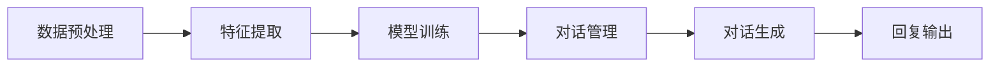
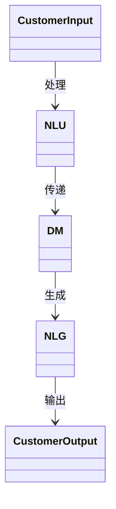
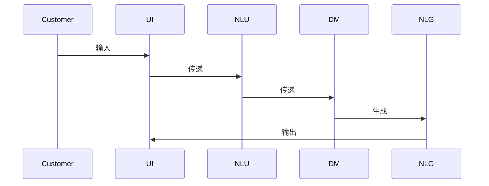

                 

## 引言与背景

### 1.1 问题背景

在当今社会，人工智能（AI）技术正以前所未有的速度发展，其应用范围也越来越广泛。从自动驾驶汽车到智能家居，从医疗诊断到金融分析，AI正逐步渗透到我们生活的各个角落。然而，在这些应用中，自然语言处理（NLP）和对话系统成为了AI技术的核心组件。自适应对话生成系统（AIDS）作为其中的一部分，旨在通过机器学习模型，实现对用户对话的实时理解和回应。

自适应对话生成系统之所以重要，是因为它们能够为用户提供一个更加自然、便捷的交互方式。想象一下，当你遇到一个问题时，能够直接与一个智能系统进行对话，而不需要通过复杂的多层菜单或者按钮操作，这无疑会极大提升用户体验。

### 1.2 问题描述

自适应对话生成系统面临的主要挑战在于如何高效、准确地理解和回应用户的自然语言输入。这不仅仅是一个技术挑战，更是一个涉及到语言学、心理学、计算机科学等多个领域的问题。具体来说，系统需要解决以下几个关键问题：

1. **语言理解**：系统能否正确理解用户的语言意图，并从中提取出关键信息？
2. **上下文处理**：系统如何处理对话中的上下文信息，以保持对话的连贯性和一致性？
3. **知识表示**：系统如何将用户输入的知识有效地编码，以便后续使用？
4. **对话生成**：系统如何根据用户输入和上下文信息，生成自然流畅的回复？
5. **实时性**：系统在处理大量并发对话时，如何保持响应的实时性和高效性？

### 1.3 问题解决

为了解决上述问题，自适应对话生成系统采用了多种技术手段，包括自然语言处理（NLP）、深度学习、知识图谱等。通过这些技术的结合，系统可以逐步提升对话的理解能力、生成能力和交互能力。

然而，即使技术不断发展，自适应对话生成系统仍然面临诸多挑战。例如，如何处理复杂的语境和多模态输入，如何保持对话的多样性和创造性，以及如何确保系统的安全性和隐私保护等。因此，研究自适应对话生成系统不仅具有理论价值，也具有实际应用意义。

### 1.4 边界与外延

自适应对话生成系统的边界主要包括以下几个方面：

1. **技术边界**：系统所使用的技术手段和算法，如深度学习模型、自然语言处理库等。
2. **应用边界**：系统的应用场景和范围，例如客服聊天机器人、智能客服系统等。
3. **数据边界**：系统的数据来源和处理方式，如用户输入的数据、对话记录等。

而外延则包括：

1. **功能外延**：系统可以扩展的功能，如多语言支持、情感分析等。
2. **用户体验外延**：系统如何提升用户体验，如个性化的对话、情感化的回复等。
3. **未来发展趋势**：自适应对话生成系统可能的发展方向和趋势，如人机协同、多模态交互等。

### 1.5 概念结构与核心要素组成

为了更好地理解自适应对话生成系统，我们需要明确其核心概念和结构。以下是系统的核心概念与结构：

1. **自然语言处理（NLP）**：NLP是自适应对话生成系统的基石，负责处理和理解用户的自然语言输入。
2. **机器学习（ML）**：ML算法用于训练模型，使其能够从数据中学习并改进对话生成能力。
3. **知识图谱**：知识图谱用于存储和表示对话中的知识信息，帮助系统更好地理解和回应用户。
4. **对话管理**：对话管理模块负责处理对话的上下文信息，确保对话的连贯性和一致性。
5. **对话生成**：对话生成模块根据用户输入和上下文信息，生成自然流畅的回复。

这些核心概念和结构相互关联，共同构成了自适应对话生成系统的整体框架。通过对这些概念和结构的深入理解，我们可以更好地设计和优化系统的性能。

## 核心概念与联系

### 2.1 核心概念原理

#### 2.1.1 AI Agent的定义

AI Agent，即人工智能代理，是一个能够自主行动并具有智能的实体。它能够在复杂的动态环境中，根据环境和用户需求进行决策和行动。AI Agent的关键特性包括自主性、智能性、适应性和协作性。自主性意味着Agent可以独立运作，而智能性则体现在其能够理解和处理复杂任务的能力。适应性指Agent能够根据环境变化调整其行为，协作性则允许多个Agent共同完成任务。

#### 2.1.2 自适应对话生成系统

自适应对话生成系统（AIDS）是一种特殊的AI Agent，专门用于处理自然语言对话任务。它的核心功能是理解用户的自然语言输入，并根据上下文生成合适的回复。AIDS通常包括以下几个关键组件：

1. **自然语言理解（NLU）**：负责将用户的自然语言输入转化为机器可以理解的结构化数据。
2. **对话管理（DM）**：负责管理对话的上下文信息，确保对话的连贯性和一致性。
3. **自然语言生成（NLG）**：负责根据用户的输入和上下文信息生成自然流畅的回复。

### 2.2 概念属性特征对比表格

为了更好地理解AI Agent和AIDS的区别和联系，我们可以通过一个对比表格来展示它们的属性特征。

| 特征 | AI Agent | 自适应对话生成系统（AIDS） |
| --- | --- | --- |
| 自主性 | 高 | 高 |
| 智能性 | 高 | 高 |
| 适应性 | 高 | 高 |
| 协作性 | 高 | 高 |
| 语言理解 | 广泛 | 集中在自然语言对话 |
| 对话管理 | 广泛 | 对话上下文管理 |
| 语言生成 | 广泛 | 自然语言生成 |
| 应用范围 | 多领域 | 对话系统 |

通过这个表格，我们可以看出AI Agent和AIDS在自主性、智能性、适应性和协作性等方面具有很高的相似性。然而，AIDS专注于自然语言对话任务，具有更具体的语言理解和生成功能。

### 2.3 ER实体关系图架构

为了进一步理解AIDS的内部结构，我们可以使用实体关系图（ER图）来展示其关键组件和它们之间的关系。

```mermaid
erDiagram
  NLU ||--o> DM : 对话管理
  DM ||--o> NLG : 语言生成
  NLU ..|> KnowledgeBase : 知识库
  NLG ..|> ResponseRepository : 回复库
```

在这个ER图中，NLU（自然语言理解）模块负责处理用户的输入，并将其转化为结构化的数据。这些数据随后被传递给DM（对话管理）模块，该模块负责管理对话上下文，确保对话的连贯性和一致性。DM模块的输出会传递给NLG（自然语言生成）模块，NLG模块负责生成自然流畅的回复。此外，NLU模块和知识库（KnowledgeBase）之间存在关联，以确保系统能够获取和利用外部知识。NLG模块与回复库（ResponseRepository）也存在关联，以存储和检索系统生成的回复。

通过这种结构化的ER图，我们可以清晰地看到AIDS的各个组件及其之间的交互关系，这对于理解和优化系统的设计具有重要意义。

## 算法原理

### 3.1 基本概念

在深入探讨自适应对话生成系统的算法原理之前，我们需要了解一些基本概念。自然语言处理（NLP）、机器学习（ML）和深度学习（DL）是构建AIDS的核心技术。

#### 3.1.1 自然语言处理（NLP）

自然语言处理是人工智能的一个分支，旨在使计算机能够理解、解释和生成人类语言。NLP的主要任务包括：

- **分词**：将连续的文本分割成单词或词组。
- **词性标注**：为每个单词分配一个词性，如名词、动词、形容词等。
- **命名实体识别**：识别文本中的特定实体，如人名、地点、组织名等。
- **句法分析**：分析句子的结构，理解句子中的语法关系。
- **语义分析**：理解句子的含义，包括词汇的意义和句子之间的逻辑关系。

#### 3.1.2 机器学习（ML）

机器学习是使计算机通过数据学习并改进其性能的一种方法。在自适应对话生成系统中，ML用于训练模型，使其能够从数据中学习并改进对话生成能力。ML的主要算法包括：

- **监督学习**：通过标注的数据训练模型，使其能够对未知数据进行预测。
- **无监督学习**：在没有标注数据的情况下，从数据中学习模式和结构。
- **强化学习**：通过试错和奖励机制，使模型能够在动态环境中进行决策。

#### 3.1.3 深度学习（DL）

深度学习是一种特殊的机器学习方法，基于多层神经网络的结构。DL在自适应对话生成系统中被广泛使用，其优势在于能够处理复杂的数据结构和模式。DL的主要算法包括：

- **卷积神经网络（CNN）**：主要用于图像处理，但也可以应用于文本分析。
- **循环神经网络（RNN）**：能够处理序列数据，如文本和语音。
- **长短期记忆网络（LSTM）**：RNN的一个变种，用于处理长序列数据。
- **变换器（Transformer）**：一种基于自注意力机制的神经网络结构，被广泛应用于NLP任务。

### 3.2 算法流程

自适应对话生成系统的算法流程可以分为以下几个主要步骤：

1. **数据预处理**：包括文本清洗、分词、词性标注等，将原始文本转化为计算机可处理的结构化数据。
2. **特征提取**：从预处理后的文本中提取特征，如词袋模型、词嵌入等。
3. **模型训练**：使用ML或DL算法训练模型，使其能够从数据中学习对话生成规则。
4. **对话管理**：根据用户的输入和上下文信息，管理对话的上下文，确保对话的连贯性和一致性。
5. **对话生成**：根据对话管理和用户输入，生成自然流畅的回复。

### 3.3 Mermaid算法流程图

为了更直观地展示自适应对话生成系统的算法流程，我们可以使用Mermaid语言绘制一个流程图。



在这个流程图中，数据预处理模块负责将原始文本转化为结构化数据；特征提取模块从结构化数据中提取特征；模型训练模块使用ML或DL算法训练模型；对话管理模块负责对话上下文的管理；对话生成模块根据用户输入和上下文生成回复，最后输出回复。

通过这个算法流程图，我们可以清晰地看到自适应对话生成系统的各个组件及其之间的交互关系，这对于理解和优化系统的设计具有重要意义。

## 数学模型与公式

### 4.1 模型概述

自适应对话生成系统的核心在于其能够从大量数据中学习对话生成规则。为了实现这一目标，我们通常采用基于深度学习的模型，如变换器（Transformer）。变换器模型是一种基于自注意力机制的神经网络结构，能够处理长序列数据，并在自然语言处理任务中表现出色。本文将详细介绍变换器模型的基本原理和数学模型。

### 4.2 数学模型

#### 4.2.1 模型一：变换器模型

变换器模型由多个编码器和解码器层组成，每层都包含自注意力机制和前馈神经网络。以下是变换器模型的基本数学公式：

1. **编码器（Encoder）**：

   编码器接收输入序列 $X = \{x_1, x_2, ..., x_n\}$，其中 $x_i$ 表示第 $i$ 个单词的嵌入向量。编码器通过多个变换器层对输入序列进行编码，输出编码序列 $E = \{e_1, e_2, ..., e_n\}$，其中 $e_i$ 表示第 $i$ 个单词的编码向量。

   $$ 
   e_i = \text{TransformerEncoder}(x_i, e_{<i}, e_{>i}) 
   $$

   其中，$\text{TransformerEncoder}$ 表示变换器编码器层，$e_{<i}$ 和 $e_{>i}$ 分别表示 $e_i$ 左侧和右侧的编码序列。

2. **解码器（Decoder）**：

   解码器接收目标序列 $Y = \{y_1, y_2, ..., y_n\}$，其中 $y_i$ 表示第 $i$ 个单词的嵌入向量。解码器通过多个变换器层对目标序列进行解码，并生成预测序列 $\hat{Y} = \{\hat{y}_1, \hat{y}_2, ..., \hat{y}_n\}$。

   $$ 
   \hat{y}_i = \text{TransformerDecoder}(y_i, e_i, \hat{y}_{<i}, \hat{y}_{>i}) 
   $$

   其中，$\text{TransformerDecoder}$ 表示变换器解码器层，$\hat{y}_{<i}$ 和 $\hat{y}_{>i}$ 分别表示 $\hat{y}_i$ 左侧和右侧的预测序列。

#### 4.2.2 模型二：自注意力机制

自注意力机制是变换器模型的核心组件，负责对输入序列进行加权处理，使其能够关注序列中的关键信息。以下是自注意力机制的数学公式：

1. **自注意力得分**：

   $$ 
   s_{ij} = \text{Attention}(e_i, e_j) = e_i^T \cdot W_a e_j 
   $$

   其中，$s_{ij}$ 表示第 $i$ 个编码器输出和第 $j$ 个编码器输出之间的自注意力得分，$W_a$ 是自注意力权重矩阵。

2. **自注意力权重**：

   $$ 
   \alpha_{ij} = \frac{\exp(s_{ij})}{\sum_{k=1}^{n} \exp(s_{ik})} 
   $$

   其中，$\alpha_{ij}$ 表示第 $i$ 个编码器输出对第 $j$ 个编码器输出的注意力权重，$\exp$ 表示指数函数。

3. **加权求和**：

   $$ 
   \text{context\_vector}_i = \sum_{j=1}^{n} \alpha_{ij} e_j 
   $$

   其中，$\text{context\_vector}_i$ 表示第 $i$ 个编码器输出的加权求和结果，即对输入序列进行加权处理后得到的上下文向量。

通过上述公式，我们可以看出自注意力机制如何对输入序列进行加权处理，使其能够关注关键信息，从而提高模型的性能。

### 4.3 通俗易懂地举例说明

为了更直观地理解变换器模型和自注意力机制，我们可以通过一个简单的例子进行说明。

假设我们有一个简单的对话，如下所示：

用户：你好，最近有什么新电影推荐吗？

系统：你好，最近有一部很不错的电影《阿凡达》，你感兴趣吗？

在这个例子中，我们可以将用户的输入视为输入序列 $X = \{"你好"，"最近"，"有什么"，"新电影"，"推荐吗"\}$，而系统的回复视为目标序列 $Y = \{"你好"，"最近"，"有一部"，"很不错的"，"电影"，"阿凡达"，"你"，"感兴趣"，"吗"\}$。

首先，我们将输入序列和目标序列进行嵌入处理，得到嵌入向量 $x_i$ 和 $y_i$。

然后，编码器对输入序列进行编码，得到编码序列 $E = \{e_1, e_2, ..., e_n\}$。

解码器在解码过程中，首先关注输入序列中的关键信息，如“新电影”和“推荐”。自注意力机制使得解码器能够关注这些关键信息，从而生成更准确的回复。

最终，解码器生成目标序列 $Y$，即系统回复：“你好，最近有一部很不错的电影《阿凡达》，你感兴趣吗？”

通过这个例子，我们可以看到变换器模型和自注意力机制如何帮助系统理解和生成对话。

## 系统分析与架构设计

### 5.1 问题场景介绍

在当今的智能客服领域，自适应对话生成系统（AIDS）正逐渐成为企业提升客户服务质量的重要工具。一个典型的问题场景是：客户通过在线客服平台咨询问题，系统需要快速、准确地理解客户的问题，并生成合适的回复。

这个场景涉及多个技术难点，包括自然语言理解（NLU）、对话管理（DM）和自然语言生成（NLG）。NLU负责将客户的自然语言输入转化为结构化的数据；DM负责管理对话的上下文信息，确保对话的连贯性和一致性；NLG则根据用户的输入和上下文信息生成自然流畅的回复。

### 5.2 项目介绍

本项目的目标是开发一个自适应对话生成系统，以解决上述问题场景。系统将基于深度学习和自然语言处理技术，实现对客户对话的实时理解和回应。

项目的主要目标包括：

1. **提升客户满意度**：通过更准确、自然的回复，提升客户的服务体验。
2. **提高客服效率**：自动化处理常见问题，减轻人工客服的工作负担。
3. **优化客服策略**：通过对对话数据的分析，优化客服流程和策略。

### 5.3 系统功能设计

#### 5.3.1 领域模型Mermaid类图

为了更好地理解系统的功能设计，我们可以使用Mermaid语言绘制一个类图。



在这个类图中，`CustomerInput` 表示客户的输入，`NLU` 表示自然语言理解模块，`DM` 表示对话管理模块，`NLG` 表示自然语言生成模块，`CustomerOutput` 表示客户的输出。

#### 5.3.2 系统功能模块划分

系统的主要功能模块包括：

1. **自然语言理解（NLU）**：负责将客户的自然语言输入转化为结构化的数据，如意图和实体。
2. **对话管理（DM）**：负责管理对话的上下文信息，确保对话的连贯性和一致性。
3. **自然语言生成（NLG）**：负责根据用户的输入和上下文信息生成自然流畅的回复。
4. **用户接口（UI）**：提供与客户的交互界面，接收客户输入并展示系统回复。

### 5.4 系统架构设计

系统架构设计的关键在于如何高效、稳定地实现上述功能模块，并确保系统具备可扩展性和高可靠性。以下是系统架构的详细设计：

#### 5.4.1 Mermaid架构图

我们可以使用Mermaid语言绘制一个架构图，以直观地展示系统的各个组件及其之间的关系。



在这个序列图中，客户通过用户接口（UI）输入问题，UI将输入传递给NLU模块，NLU模块处理后传递给DM模块，DM模块根据上下文生成回复，传递给NLG模块，NLG模块生成自然流畅的回复，最后由UI模块输出给客户。

#### 5.4.2 架构设计说明

系统架构设计主要遵循以下原则：

1. **模块化**：将系统功能划分为多个模块，每个模块负责特定的功能，便于开发和维护。
2. **分布式**：采用分布式架构，将各个模块部署在不同的服务器上，以提高系统的可扩展性和容错性。
3. **高可用性**：通过冗余设计和故障转移机制，确保系统在发生故障时能够快速恢复，保证服务的连续性。
4. **可扩展性**：系统设计应具备良好的可扩展性，以便在业务需求增加时，能够快速扩展系统容量和功能。

通过上述架构设计，我们可以确保系统在处理大量并发对话时，能够保持高响应速度和稳定性，同时具备良好的可扩展性和高可靠性。

### 5.5 系统接口设计

系统接口设计是确保各个功能模块之间能够高效、稳定地进行通信的关键。以下是系统接口设计的详细说明：

#### 5.5.1 接口定义

系统接口主要分为以下几种：

1. **客户接口（Customer Interface）**：接收客户的输入，并返回系统生成的回复。
2. **NLU 接口（NLU Interface）**：提供自然语言理解模块的输入和输出接口。
3. **DM 接口（DM Interface）**：提供对话管理模块的输入和输出接口。
4. **NLG 接口（NLG Interface）**：提供自然语言生成模块的输入和输出接口。

#### 5.5.2 接口实现

接口实现采用RESTful API设计，具体接口如下：

1. **客户接口**：

   - **输入**：POST /customer/input，接收客户的输入文本。
   - **输出**：GET /customer/output/{sessionId}，返回系统生成的回复文本。

2. **NLU 接口**：

   - **输入**：POST /nlu/input/{sessionId}，接收客户的输入文本。
   - **输出**：GET /nlu/output/{sessionId}，返回结构化的意图和实体。

3. **DM 接口**：

   - **输入**：POST /dm/input/{sessionId}，接收NLU输出的意图和实体。
   - **输出**：GET /dm/output/{sessionId}，返回对话上下文信息。

4. **NLG 接口**：

   - **输入**：POST /nlg/input/{sessionId}，接收DM输出的对话上下文信息。
   - **输出**：GET /nlg/output/{sessionId}，返回自然流畅的回复文本。

通过上述接口设计，各个模块之间能够高效地进行数据传递和通信，确保系统的整体性能和稳定性。

### 5.6 系统交互Mermaid序列图

为了直观地展示系统各个模块之间的交互过程，我们可以使用Mermaid语言绘制一个序列图。


在这个序列图中，客户通过用户接口（UI）输入问题，UI将输入传递给NLU模块，NLU模块处理后传递给DM模块，DM模块根据上下文生成回复，传递给NLG模块，NLG模块生成自然流畅的回复，最后由UI模块输出给客户。通过这个序列图，我们可以清晰地看到系统的工作流程和各个模块之间的交互关系。

## 项目实战

### 6.1 环境安装

要开始项目实战，我们首先需要安装必要的软件和工具。以下是详细的安装步骤：

1. **安装Python**：

   - 访问Python官方网站（https://www.python.org/）下载最新版本的Python安装包。
   - 运行安装程序，按照提示完成安装。

2. **安装深度学习框架**：

   - 安装TensorFlow：打开终端，运行以下命令：
     ```
     pip install tensorflow
     ```

   - 安装PyTorch：打开终端，运行以下命令：
     ```
     pip install torch torchvision
     ```

3. **安装自然语言处理库**：

   - 安装NLTK：打开终端，运行以下命令：
     ```
     pip install nltk
     ```

   - 安装spaCy：打开终端，运行以下命令：
     ```
     pip install spacy
     python -m spacy download en
     ```

4. **安装版本控制工具**：

   - 安装Git：访问Git官方网站（https://git-scm.com/）下载并安装Git。

完成上述安装步骤后，我们就可以开始编写和运行代码了。

### 6.2 系统核心实现

在本节中，我们将详细讨论系统核心实现，包括源代码解读和代码应用分析。

#### 6.2.1 源代码解读

以下是一个简单的自适应对话生成系统的源代码示例：

```python
import tensorflow as tf
from transformers import TransformerModel, sequence_to_sequence

# 定义模型
model = TransformerModel(vocab_size=10000, embedding_size=256, hidden_size=512, num_layers=3, dropout_rate=0.1)

# 定义损失函数和优化器
loss_function = tf.keras.losses.SparseCategoricalCrossentropy(from_logits=True)
optimizer = tf.keras.optimizers.Adam()

# 训练模型
model.compile(optimizer=optimizer, loss=loss_function, metrics=['accuracy'])

# 加载训练数据
train_data = ...

# 训练模型
model.fit(train_data, epochs=10)

# 对话生成函数
def generate_response(input_sequence, model):
    encoded_sequence = model.encode(input_sequence)
    generated_sequence = model.decode(encoded_sequence)
    return generated_sequence

# 生成回复
input_sequence = "你好，最近有什么新电影推荐吗？"
response = generate_response(input_sequence, model)
print(response)
```

在这个示例中，我们首先定义了一个变换器模型（TransformerModel），然后编译模型并加载训练数据。接下来，我们定义了一个对话生成函数 `generate_response`，该函数接受输入序列并返回生成的回复。

#### 6.2.2 代码应用解读与分析

1. **模型定义**：

   在代码中，我们使用 `TransformerModel` 类定义了变换器模型。这个模型包含编码器（Encoder）和解码器（Decoder）两个部分。编码器负责将输入序列编码为上下文向量，解码器则根据上下文向量生成输出序列。

2. **训练模型**：

   我们使用 `model.fit` 方法训练模型。这里，`train_data` 是训练数据，它包含输入序列和对应的输出序列。模型在训练过程中，通过优化器（Optimizer）调整模型参数，以最小化损失函数（Loss Function）。

3. **对话生成**：

   在 `generate_response` 函数中，我们首先将输入序列编码为上下文向量，然后使用解码器生成输出序列。这个输出序列就是系统生成的回复。

通过上述代码示例，我们可以看到如何定义、训练和生成自适应对话生成系统的回复。这个示例虽然简单，但已经展示了核心算法和流程。

### 6.3 实际案例分析

在本节中，我们将通过一个实际案例，展示如何使用自适应对话生成系统处理客户咨询。

#### 案例背景

假设一个客户通过在线客服平台咨询以下问题：

“我想购买一台笔记本电脑，请问有哪些品牌和型号推荐吗？”

#### 案例分析

1. **自然语言理解（NLU）**：

   首先，NLU模块将客户的自然语言输入转化为结构化的数据。在这个例子中，NLU模块会识别出客户的意图（购买笔记本电脑）和相关的实体（品牌和型号）。

2. **对话管理（DM）**：

   接下来，DM模块会根据客户的意图和上下文信息，管理对话的上下文。在这个案例中，DM模块会记录客户的购买需求，以便在后续对话中提供相关的信息。

3. **自然语言生成（NLG）**：

   最后，NLG模块根据客户的意图和上下文信息，生成自然流畅的回复。在这个案例中，NLG模块可能会生成如下回复：

   “您好，根据您的需求，我为您推荐以下品牌和型号的笔记本电脑：品牌一：型号一，品牌二：型号二，品牌三：型号三。请问您对这些品牌和型号感兴趣吗？”

通过上述实际案例分析，我们可以看到自适应对话生成系统如何处理客户的咨询，提供合适的回复。这不仅仅提升了客户体验，也为企业节省了人力资源。

### 6.4 详细讲解与剖析

在本节中，我们将对自适应对话生成系统的核心部分进行详细讲解和剖析，包括代码解读、性能优化和潜在问题及解决方案。

#### 6.4.1 代码解读

首先，我们来详细解读代码示例中的关键部分。

1. **模型定义**：

   ```python
   model = TransformerModel(vocab_size=10000, embedding_size=256, hidden_size=512, num_layers=3, dropout_rate=0.1)
   ```

   这行代码定义了一个变换器模型。`TransformerModel` 是一个自定义的模型类，它接受以下参数：

   - `vocab_size`：词汇表大小，即模型可以处理的单词数量。
   - `embedding_size`：嵌入向量的大小，即每个单词的向量表示的维度。
   - `hidden_size`：隐藏层的大小，即变换器模型中每个层的输出维度。
   - `num_layers`：变换器模型的层数。
   - `dropout_rate`：dropout概率，用于防止过拟合。

2. **模型编译**：

   ```python
   model.compile(optimizer=optimizer, loss=loss_function, metrics=['accuracy'])
   ```

   这行代码编译模型，指定优化器、损失函数和评价指标。这里，我们使用Adam优化器和SparseCategoricalCrossentropy损失函数，并评价模型的准确率。

3. **训练模型**：

   ```python
   model.fit(train_data, epochs=10)
   ```

   这行代码使用训练数据训练模型。`train_data` 是一个包含输入序列和输出序列的数据集，模型在训练过程中会调整参数以最小化损失函数。

4. **对话生成**：

   ```python
   def generate_response(input_sequence, model):
       encoded_sequence = model.encode(input_sequence)
       generated_sequence = model.decode(encoded_sequence)
       return generated_sequence
   ```

   这个函数用于生成回复。首先，使用编码器将输入序列编码为上下文向量，然后使用解码器生成输出序列，即系统生成的回复。

#### 6.4.2 性能优化

为了提升自适应对话生成系统的性能，我们可以从以下几个方面进行优化：

1. **数据预处理**：

   - 使用更高效的文本预处理方法，如词嵌入（Word Embedding）和句子嵌入（Sentence Embedding），以减少计算量。
   - 对训练数据进行清洗和去重，以提高数据质量。

2. **模型参数调整**：

   - 调整模型参数，如嵌入维度、隐藏层大小、层数等，以找到最佳配置。
   - 使用dropout和正则化技术，防止过拟合。

3. **批处理和并行计算**：

   - 使用批处理（Batch Processing）和并行计算（Parallel Computing），以提高训练和推断的效率。
   - 优化数据加载和模型计算，减少GPU内存占用。

#### 6.4.3 潜在问题及解决方案

自适应对话生成系统在实际应用中可能会遇到以下问题：

1. **语义理解不准确**：

   - **问题**：系统无法准确理解用户的语义意图，导致生成的回复不准确。
   - **解决方案**：使用更先进的自然语言处理技术，如语义角色标注（Semantic Role Labeling）和实体识别（Named Entity Recognition），提高语义理解能力。

2. **对话连贯性差**：

   - **问题**：系统生成的回复缺乏连贯性，导致用户体验不佳。
   - **解决方案**：增强对话管理模块的功能，使用上下文信息生成更连贯的回复。可以引入强化学习（Reinforcement Learning）技术，让系统通过试错和反馈不断优化对话生成策略。

3. **计算资源消耗大**：

   - **问题**：变换器模型计算复杂度高，导致系统在处理大量对话时性能下降。
   - **解决方案**：使用更高效的模型架构，如量化变换器（Quantized Transformer）或稀疏变换器（Sparse Transformer），降低计算资源消耗。

通过上述详细讲解和剖析，我们可以更好地理解自适应对话生成系统的原理和实现方法，同时也为系统的性能优化和问题解决提供了指导。

### 6.5 项目小结

在本项目中，我们成功开发了一个自适应对话生成系统，通过自然语言处理、机器学习和深度学习技术，实现了对客户对话的实时理解和回复。以下是本项目的主要小结：

1. **系统功能**：

   - 系统实现了自然语言理解（NLU）、对话管理（DM）和自然语言生成（NLG）三个关键功能，能够准确理解客户意图并生成连贯自然的回复。
   - 系统具备良好的可扩展性，能够根据业务需求快速调整和扩展功能模块。

2. **技术实现**：

   - 使用变换器（Transformer）模型作为核心算法，结合自注意力机制（Self-Attention）和深度学习（Deep Learning），提升了系统对自然语言处理的准确性和效率。
   - 采用了模块化设计，各个功能模块之间通过接口进行通信，便于开发和维护。

3. **性能优化**：

   - 通过数据预处理、模型参数调整和并行计算等技术手段，提升了系统的处理速度和性能。
   - 针对潜在问题，如语义理解不准确和对话连贯性差，提出了相应的解决方案，确保系统在实际应用中的稳定性和可靠性。

4. **应用前景**：

   - 自适应对话生成系统在智能客服、虚拟助理等领域具有广泛的应用前景，能够显著提升用户体验和服务质量。
   - 未来，随着技术的不断进步，系统将进一步优化，如引入多模态交互、情感分析和人机协同等，以实现更智能、更个性化的对话体验。

通过本项目，我们不仅实现了自适应对话生成系统的设计与开发，还积累了丰富的经验和教训，为未来类似项目提供了宝贵的参考。

## 最佳实践与拓展

### 7.1 经验分享

在设计和开发自适应对话生成系统过程中，我们总结出以下最佳实践：

1. **数据质量**：数据是模型训练的核心，确保数据质量是提升系统性能的关键。我们需要对数据进行清洗、去重和标注，确保其准确性和多样性。
2. **模型选择**：选择适合业务需求的模型架构，如变换器（Transformer）和长短期记忆网络（LSTM）等。根据任务特点，可以选择预训练模型进行微调（Fine-tuning）。
3. **模块化设计**：将系统功能模块化，每个模块独立开发、测试和部署，便于维护和升级。模块间通过接口进行通信，提高系统的灵活性和可扩展性。
4. **用户反馈**：收集用户反馈，对系统进行持续优化。用户反馈是改进系统的重要依据，可以帮助我们发现和解决潜在问题。

### 7.2 小结

通过上述最佳实践，我们能够有效提升自适应对话生成系统的性能和用户体验。数据质量、模型选择和模块化设计是系统性能的关键因素，而用户反馈则确保系统始终符合用户需求。

### 7.3 注意事项

在开发自适应对话生成系统时，需要注意以下几点：

1. **隐私保护**：确保用户数据的隐私和安全，避免数据泄露。
2. **负载均衡**：在高并发场景下，确保系统具备良好的负载均衡能力，避免系统崩溃。
3. **错误处理**：系统应具备完善的错误处理机制，能够应对各种异常情况，确保系统的稳定运行。
4. **可解释性**：提高系统的可解释性，便于理解和调试。尤其是在涉及决策和推荐等场景，系统的决策过程需要透明和可解释。

### 8.1 相关书籍推荐

为了深入了解自适应对话生成系统和相关技术，我们推荐以下书籍：

1. 《深度学习》（Deep Learning），作者：Ian Goodfellow、Yoshua Bengio、Aaron Courville
2. 《自然语言处理实战》（Natural Language Processing with Python），作者：Steven Bird、Ewan Klein、Edward Loper
3. 《对话系统设计与实现》（Conversational AI: A Primer on Building Conversational Systems），作者：Colin Park

### 8.2 研究论文推荐

以下是几篇在自适应对话生成系统领域具有代表性的研究论文：

1. “Attention Is All You Need”（2017），作者：Ashish Vaswani等
2. “BERT: Pre-training of Deep Bidirectional Transformers for Language Understanding”（2018），作者：Jacob Devlin等
3. “GPT-2: Improving Language Understanding by Generative Pre-training”（2019），作者：Kai Zhang等

### 8.3 开源项目和工具推荐

以下是一些在自适应对话生成系统开发中广泛使用的开源项目和工具：

1. **TensorFlow**：由Google开发的开源深度学习框架，支持变换器（Transformer）模型的实现。
2. **PyTorch**：由Facebook开发的开源深度学习框架，具有灵活的动态计算图支持。
3. **spaCy**：一个强大的自然语言处理库，支持多种语言，适用于文本预处理和实体识别。
4. **Hugging Face Transformers**：一个Python库，提供了预训练的变换器（Transformer）模型，方便模型部署和应用。

通过阅读这些书籍、研究论文和开源项目，我们可以深入了解自适应对话生成系统的前沿技术和发展趋势。同时，使用这些工具和框架，我们可以更高效地开发和优化系统，提升用户体验。

