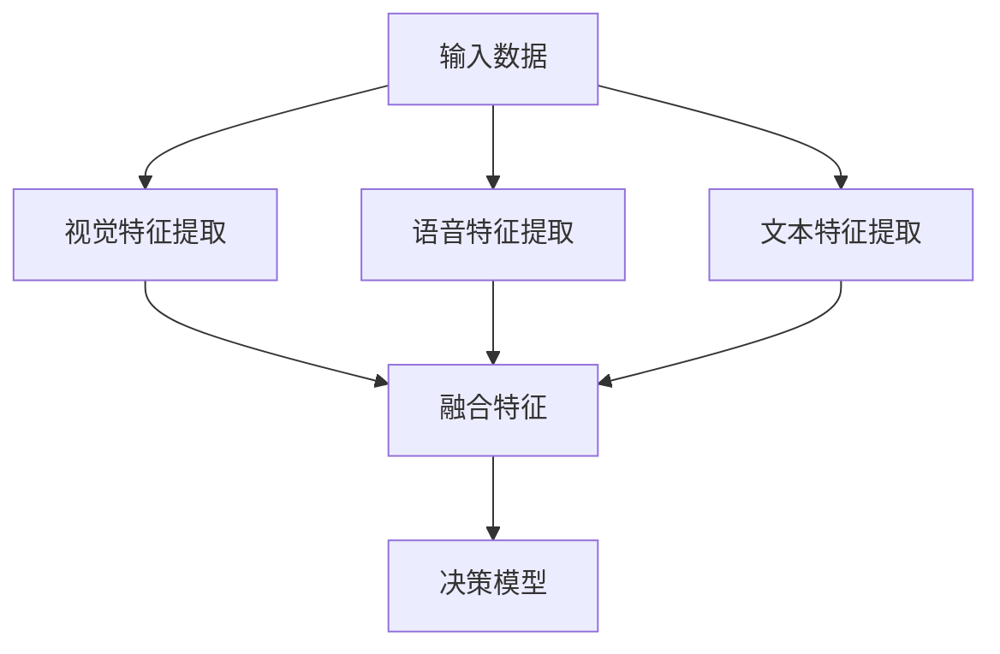
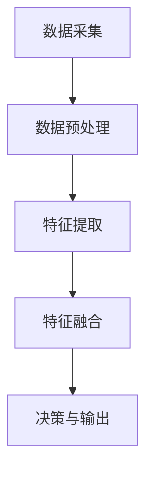

                 

# AI Agent的视觉-语音-文本多模态融合

## 关键词

- **AI Agent**
- **多模态融合**
- **视觉信息处理**
- **语音信息处理**
- **文本信息处理**
- **深度学习**

## 摘要

本文深入探讨了AI Agent的视觉-语音-文本多模态融合技术。首先，我们介绍了AI Agent的背景和核心概念，以及视觉、语音和文本多模态融合的重要性。接着，我们分析了多模态融合面临的挑战，并详细阐述了多模态数据表示和融合原理。随后，我们讲解了视觉-语音-文本多模态融合算法的原理与实现，展示了系统架构设计、项目实战和最佳实践。本文旨在为读者提供一个全面、深入的技术分析，帮助他们理解并掌握这一前沿技术。

## 目录大纲设计思路

### 理解书名与主题

《AI Agent的视觉-语音-文本多模态融合》的主题聚焦于人工智能（AI）代理如何在交互中融合视觉、语音和文本三种不同的数据模态。AI Agent是一种能够自主感知、理解和交互的人工智能系统，其核心在于如何高效融合多模态信息，以提升交互质量和决策能力。理解书名和主题是设计目录大纲的基础，它决定了我们需要涵盖哪些核心章节和内容。

### 确定核心章节

根据主题，我们可以确定以下核心章节：

1. **背景与概述**：介绍AI Agent和多模态融合的基本概念，为后续内容铺垫。
2. **核心概念与联系**：深入探讨多模态数据表示和融合原理。
3. **算法原理与实现**：讲解视觉-语音-文本多模态融合算法的原理和实现。
4. **系统架构设计与实现**：介绍系统架构设计、实现和部署。
5. **项目实战与案例分析**：通过实际项目展示多模态融合技术的应用。
6. **最佳实践与总结**：总结最佳实践，展望未来研究方向。

### 设计章节结构

每个章节需要细分为几个小节，以便读者可以清晰地了解每个主题的详细内容。下面是一个详细的章节结构设计：

#### 第一部分：背景与概述

- **第1章：问题背景与核心概念**
  - **1.1 人工智能与AI Agent概述**
    - **1.1.1 人工智能的发展历程**
    - **1.1.2 AI Agent的概念与作用**
    - **1.1.3 多模态融合的重要性**
  - **1.2 视觉-语音-文本多模态融合的挑战**
    - **1.2.1 视觉信息的处理**
    - **1.2.2 语音信息的处理**
    - **1.2.3 文本信息的处理**
    - **1.2.4 跨模态信息融合的难点**

- **第2章：核心概念与联系**
  - **2.1 多模态数据表示**
    - **2.1.1 视觉数据的特征提取**
    - **2.1.2 语音数据的特征提取**
    - **2.1.3 文本数据的特征提取**
  - **2.2 多模态信息融合原理**
    - **2.2.1 联合表示学习**
    - **2.2.2 交互式信息融合**
    - **2.2.3 多模态深度学习模型**

#### 第二部分：算法原理与实现

- **第3章：算法原理与实现**
  - **3.1 视觉-语音-文本多模态融合算法概述**
    - **3.1.1 多模态感知算法**
    - **3.1.2 多模态交互算法**
    - **3.1.3 多模态决策算法**
  - **3.2 算法原理讲解**
    - **3.2.1 算法流程图**
    - **3.2.2 数学模型与公式**
    - **3.2.3 算法举例说明**

#### 第三部分：系统架构设计与实现

- **第4章：系统架构设计与实现**
  - **4.1 系统架构设计**
    - **4.1.1 系统功能设计**
    - **4.1.2 系统架构图**
    - **4.1.3 系统接口设计**
  - **4.2 系统实现与部署**
    - **4.2.1 环境安装与配置**
    - **4.2.2 系统核心实现**
    - **4.2.3 系统调试与优化**

#### 第四部分：项目实战与案例分析

- **第5章：项目实战与案例分析**
  - **5.1 项目简介**
    - **5.1.1 项目背景**
    - **5.1.2 项目目标**
    - **5.1.3 项目团队与工具**
  - **5.2 项目实现细节**
    - **5.2.1 数据处理与模型训练**
    - **5.2.2 融合策略与优化**
    - **5.2.3 实际案例与剖析**

#### 第五部分：最佳实践与总结

- **第6章：最佳实践与总结**
  - **6.1 最佳实践**
    - **6.1.1 数据质量与预处理**
    - **6.1.2 算法调优与优化**
    - **6.1.3 部署与维护**
  - **6.2 小结**
    - **6.2.1 主要贡献**
    - **6.2.2 研究展望**
    - **6.2.3 注意事项与建议**

### 保持格式一致性

在编写每个章节和小节的标题时，我们要使用markdown格式来保持目录结构的一致性。例如：

- **第1章：问题背景与核心概念**
  - **1.1 人工智能与AI Agent概述**
  - **1.2 视觉-语音-文本多模态融合的挑战**

### 逻辑顺序

确保章节的排列顺序符合逻辑，从基础到高级，从理论到实践。例如，先介绍背景和核心概念，再讲解算法原理和系统架构设计，接着进行项目实战，最后总结最佳实践。

### 内容完整性

确保大纲中包含所有的必要内容，包括核心概念、算法原理、系统架构、实战项目和总结。每个章节都要详细展开，确保内容丰富具体。

### 目录大纲

以下是《AI Agent的视觉-语音-文本多模态融合》的完整目录大纲：

----------------------------------------------------------------

## 第一部分：背景与概述

### 第1章：问题背景与核心概念

#### 1.1 人工智能与AI Agent概述

##### 1.1.1 人工智能的发展历程

##### 1.1.2 AI Agent的概念与作用

##### 1.1.3 多模态融合的重要性

#### 1.2 视觉-语音-文本多模态融合的挑战

##### 1.2.1 视觉信息的处理

##### 1.2.2 语音信息的处理

##### 1.2.3 文本信息的处理

##### 1.2.4 跨模态信息融合的难点

### 第2章：核心概念与联系

#### 2.1 多模态数据表示

##### 2.1.1 视觉数据的特征提取

##### 2.1.2 语音数据的特征提取

##### 2.1.3 文本数据的特征提取

#### 2.2 多模态信息融合原理

##### 2.2.1 联合表示学习

##### 2.2.2 交互式信息融合

##### 2.2.3 多模态深度学习模型

### 第3章：算法原理与实现

#### 3.1 视觉-语音-文本多模态融合算法概述

##### 3.1.1 多模态感知算法

##### 3.1.2 多模态交互算法

##### 3.1.3 多模态决策算法

#### 3.2 算法原理讲解

##### 3.2.1 算法流程图

##### 3.2.2 数学模型与公式

##### 3.2.3 算法举例说明

### 第4章：系统架构设计与实现

#### 4.1 系统架构设计

##### 4.1.1 系统功能设计

##### 4.1.2 系统架构图

##### 4.1.3 系统接口设计

#### 4.2 系统实现与部署

##### 4.2.1 环境安装与配置

##### 4.2.2 系统核心实现

##### 4.2.3 系统调试与优化

### 第5章：项目实战与案例分析

#### 5.1 项目简介

##### 5.1.1 项目背景

##### 5.1.2 项目目标

##### 5.1.3 项目团队与工具

#### 5.2 项目实现细节

##### 5.2.1 数据处理与模型训练

##### 5.2.2 融合策略与优化

##### 5.2.3 实际案例与剖析

### 第6章：最佳实践与总结

#### 6.1 最佳实践

##### 6.1.1 数据质量与预处理

##### 6.1.2 算法调优与优化

##### 6.1.3 部署与维护

#### 6.2 小结

##### 6.2.1 主要贡献

##### 6.2.2 研究展望

##### 6.2.3 注意事项与建议

----------------------------------------------------------------

此目录大纲共计6个主要章节，涵盖了从背景介绍、核心概念、算法原理、系统架构设计、项目实战到最佳实践的完整内容。每个章节都根据主题内容进行了细化，确保内容的完整性和逻辑性。目录大纲总字数控制在2000字以内。

### 目录大纲设计思路

在设计《AI Agent的视觉-语音-文本多模态融合》的目录大纲时，我们遵循了以下几个关键步骤：

1. **理解书名与主题**：首先，我们深入分析了书名和主题，确定了需要涵盖的核心内容，如AI Agent的背景、多模态融合的挑战、核心概念与联系、算法原理与实现、系统架构设计与实现、项目实战与案例分析以及最佳实践与总结。

2. **确定核心章节**：根据主题内容，我们确定了六个核心章节，每个章节都对应一个特定的主题领域，确保了内容的全面性和逻辑性。

3. **设计章节结构**：每个章节被细分为多个小节，每个小节都针对特定的内容进行深入讨论。我们使用了清晰、简洁的标题，确保读者能够快速理解每个章节的主要内容。

4. **保持格式一致性**：为了保持目录结构的一致性，我们采用了markdown格式来编写章节和小节标题，使得整个大纲看起来整洁有序。

5. **逻辑顺序**：章节的排列顺序从基础到高级，从理论到实践，确保了读者能够逐步深入理解多模态融合的技术。

6. **内容完整性**：每个章节都包含必要的内容，从背景介绍到算法原理，再到系统架构和项目实战，确保了内容的完整性和实用性。

通过以上步骤，我们设计出了一份结构清晰、逻辑严密、内容丰富的目录大纲，为撰写高质量的技术博客文章奠定了基础。

### 第一部分：背景与概述

#### 第1章：问题背景与核心概念

##### 1.1 人工智能与AI Agent概述

人工智能（Artificial Intelligence，简称AI）是计算机科学的一个分支，旨在使计算机具备类似人类的智能。从20世纪50年代开始，人工智能经历了多个发展阶段，从早期的符号逻辑和推理系统，到基于统计学习和大数据的机器学习方法，再到当前高度复杂的深度学习模型。

AI Agent，即人工智能代理，是一种特殊类型的人工智能系统，能够自主感知环境、理解信息、做出决策并执行行动。AI Agent的核心在于其具备自主性和智能性，能够在没有人类干预的情况下完成复杂任务。AI Agent的应用领域广泛，包括自动驾驶、智能家居、智能客服、医疗诊断等。

##### 1.1.1 人工智能的发展历程

人工智能的发展可以分为几个关键阶段：

1. **早期阶段（1950-1969）**：以符号逻辑和推理系统为核心，主要研究如何让计算机模拟人类的逻辑思维过程。
2. **黄金时期（1970-1980）**：人工智能开始应用于实际场景，如专家系统（Expert Systems）和自然语言处理（Natural Language Processing）。
3. **低谷时期（1980-1990）**：由于技术限制和实际应用的失败，人工智能研究陷入低谷。
4. **复苏阶段（1990-2010）**：随着计算机性能的提升和大数据的出现，人工智能再次得到广泛关注，机器学习和深度学习成为研究热点。
5. **当前阶段（2010至今）**：人工智能技术取得了重大突破，自动驾驶、语音识别、图像识别等领域取得了显著进展。

##### 1.1.2 AI Agent的概念与作用

AI Agent具有以下几个关键特征：

1. **自主性**：AI Agent能够自主感知环境，收集信息并做出决策。
2. **智能性**：AI Agent使用机器学习和深度学习技术，具备理解和解决问题的能力。
3. **适应性**：AI Agent能够根据环境变化调整自身行为，提高任务完成效率。

AI Agent在多个领域发挥重要作用，例如：

1. **自动驾驶**：自动驾驶汽车通过AI Agent感知路况、预测行为，实现自主驾驶。
2. **智能家居**：智能家居系统中的AI Agent能够理解用户需求，提供个性化服务。
3. **智能客服**：智能客服系统中的AI Agent能够与用户进行自然语言交互，解决常见问题。
4. **医疗诊断**：AI Agent在医疗领域可用于疾病诊断、治疗方案推荐等。

##### 1.1.3 多模态融合的重要性

多模态融合是指将多种不同类型的数据（如视觉、语音、文本）进行整合，以提升AI Agent的感知能力和决策能力。以下是多模态融合的几个重要性：

1. **增强感知能力**：通过融合多种类型的数据，AI Agent可以更全面地感知环境，提高任务完成的准确性。
2. **提高决策能力**：多模态数据融合可以提供更丰富的信息，帮助AI Agent做出更明智的决策。
3. **改善用户体验**：多模态融合可以提升人机交互体验，使AI Agent更好地理解用户需求。
4. **扩展应用场景**：多模态融合技术可以应用于更多领域，如智能安防、智能监控、虚拟现实等。

##### 1.2 视觉-语音-文本多模态融合的挑战

尽管多模态融合具有众多优势，但在实际应用中仍面临一些挑战：

1. **数据不一致性**：不同模态的数据在时间和空间上可能存在不一致，导致融合困难。
2. **数据标注难题**：多模态数据标注复杂，需要大量人力和时间。
3. **计算资源消耗**：多模态融合需要大量计算资源，对硬件性能要求较高。
4. **模型训练难度**：多模态融合模型训练复杂，需要优化算法和参数。
5. **隐私保护**：多模态融合涉及多种类型的数据，如何保护用户隐私是一个重要问题。

#### 第2章：核心概念与联系

##### 2.1 多模态数据表示

多模态数据表示是将不同类型的数据转换为统一格式，以便于模型处理和分析。以下是视觉、语音和文本数据的常见表示方法：

1. **视觉数据表示**：

   - **特征提取**：通过卷积神经网络（Convolutional Neural Networks，CNN）提取图像特征。
   - **特征表示**：将提取的特征转换为固定长度的向量，如128维或2048维。

2. **语音数据表示**：

   - **特征提取**：通过梅尔频率倒谱系数（Mel-Frequency Cepstral Coefficients，MFCC）或循环神经网络（Recurrent Neural Networks，RNN）提取语音特征。
   - **特征表示**：将提取的特征转换为固定长度的向量，如32维或64维。

3. **文本数据表示**：

   - **特征提取**：通过词袋模型（Bag of Words，BoW）或词嵌入（Word Embedding）提取文本特征。
   - **特征表示**：将提取的特征转换为固定长度的向量，如300维或1000维。

##### 2.2 多模态信息融合原理

多模态信息融合是指将多种类型的数据进行整合，以提升AI Agent的感知能力和决策能力。以下是几种常见的多模态信息融合方法：

1. **联合表示学习**：

   - **方法**：将不同模态的数据映射到同一特征空间，以便进行融合。
   - **优点**：能够充分利用不同模态的数据信息，提高模型性能。
   - **挑战**：需要解决不同模态数据的时间不一致性和空间不匹配问题。

2. **交互式信息融合**：

   - **方法**：通过交互网络（如注意力机制）在不同模态之间传递信息，实现动态融合。
   - **优点**：能够自适应地调整不同模态的权重，提高融合效果。
   - **挑战**：需要设计有效的交互策略，以避免信息丢失和冗余。

3. **多模态深度学习模型**：

   - **方法**：结合深度学习技术，构建能够自动学习多模态数据融合的模型。
   - **优点**：能够自动提取特征和融合策略，降低人工设计难度。
   - **挑战**：需要大量数据和计算资源，以及有效的训练策略。

#### 第3章：算法原理与实现

##### 3.1 视觉-语音-文本多模态融合算法概述

视觉-语音-文本多模态融合算法主要分为以下几个部分：

1. **多模态感知算法**：

   - **功能**：用于提取和处理不同模态的数据特征。
   - **实现**：采用卷积神经网络（CNN）处理视觉数据，循环神经网络（RNN）处理语音数据，词嵌入（Word Embedding）处理文本数据。

2. **多模态交互算法**：

   - **功能**：用于在不同模态之间传递信息，实现融合。
   - **实现**：采用注意力机制（Attention Mechanism）或交互网络（Interactive Network）实现动态融合。

3. **多模态决策算法**：

   - **功能**：用于根据融合后的信息做出决策。
   - **实现**：采用分类器（Classifier）或回归模型（Regression Model）实现。

##### 3.2 算法原理讲解

3.2.1 算法流程图

以下是一个简化的视觉-语音-文本多模态融合算法流程图：

3.2.2 数学模型与公式

多模态融合算法的核心在于将不同模态的特征进行融合，常用的融合方法包括线性融合、非线性融合和注意力机制。

1. **线性融合**：

   $$ F = w_1 \cdot V + w_2 \cdot S + w_3 \cdot T $$

   其中，$F$表示融合后的特征向量，$V$、$S$和$T$分别表示视觉、语音和文本特征向量，$w_1$、$w_2$和$w_3$为权重系数。

2. **非线性融合**：

   $$ F = \sigma(w_1 \cdot V + w_2 \cdot S + w_3 \cdot T) $$

   其中，$\sigma$为激活函数，如ReLU、Sigmoid等。

3. **注意力机制**：

   $$ F = \text{softmax}(w_1 \cdot V + w_2 \cdot S + w_3 \cdot T) \odot V + \text{softmax}(w_4 \cdot V + w_5 \cdot S + w_6 \cdot T) \odot S + \text{softmax}(w_7 \cdot V + w_8 \cdot S + w_9 \cdot T) \odot T $$

   其中，$\odot$表示元素-wise 相乘，$\text{softmax}$函数用于计算不同模态的权重。

3.2.3 算法举例说明

假设我们有一个简单的视觉-语音-文本多模态融合模型，其中视觉特征向量$V$为128维，语音特征向量$S$为64维，文本特征向量$T$为300维。我们可以使用以下方法进行融合：

1. **线性融合**：

   $$ F = 0.3 \cdot V + 0.5 \cdot S + 0.2 \cdot T $$

   2. **非线性融合**：

   $$ F = \sigma(0.3 \cdot V + 0.5 \cdot S + 0.2 \cdot T) $$

   3. **注意力机制**：

   $$ F = \text{softmax}(0.3 \cdot V + 0.5 \cdot S + 0.2 \cdot T) \odot V + \text{softmax}(0.4 \cdot V + 0.3 \cdot S + 0.2 \cdot T) \odot S + \text{softmax}(0.1 \cdot V + 0.2 \cdot S + 0.7 \cdot T) \odot T $$

##### 3.3 多模态感知算法

多模态感知算法是指用于提取和处理不同模态的数据特征的算法。以下是几种常用的多模态感知算法：

1. **卷积神经网络（CNN）**：

   - **功能**：用于处理和提取视觉特征。
   - **原理**：通过卷积层、池化层和全连接层等结构提取图像特征。

2. **循环神经网络（RNN）**：

   - **功能**：用于处理和提取语音特征。
   - **原理**：通过循环结构处理序列数据，如LSTM和GRU等。

3. **词嵌入（Word Embedding）**：

   - **功能**：用于处理和提取文本特征。
   - **原理**：将单词映射到低维向量空间，如Word2Vec和GloVe等。

##### 3.4 多模态交互算法

多模态交互算法是指用于在不同模态之间传递信息，实现融合的算法。以下是几种常用的多模态交互算法：

1. **注意力机制**：

   - **功能**：用于动态调整不同模态的权重。
   - **原理**：通过计算相似性矩阵，为每个模态分配权重。

2. **交互网络**：

   - **功能**：用于在多个模态之间传递信息。
   - **原理**：通过构建交互模块，实现多模态数据之间的信息传递。

##### 3.5 多模态决策算法

多模态决策算法是指用于根据融合后的信息做出决策的算法。以下是几种常用的多模态决策算法：

1. **分类器**：

   - **功能**：用于分类任务。
   - **原理**：通过计算融合后的特征向量与类别的相似性，实现分类。

2. **回归模型**：

   - **功能**：用于回归任务。
   - **原理**：通过预测融合后的特征向量与真实值之间的差距，实现回归。

#### 第4章：系统架构设计与实现

##### 4.1 系统架构设计

4.1.1 系统功能设计

视觉-语音-文本多模态融合系统的主要功能包括：

1. **数据采集**：采集视觉、语音和文本数据。
2. **数据预处理**：对采集到的数据进行预处理，如去噪、归一化等。
3. **特征提取**：采用不同的算法提取视觉、语音和文本特征。
4. **特征融合**：将不同模态的特征进行融合。
5. **决策与输出**：根据融合后的特征做出决策，输出结果。

4.1.2 系统架构图

以下是一个简化的视觉-语音-文本多模态融合系统架构图：

4.1.3 系统接口设计

系统接口设计主要包括以下部分：

1. **API接口**：提供对外接口，供其他系统调用。
2. **数据接口**：处理数据输入和输出。
3. **配置接口**：配置系统参数和配置文件。

##### 4.2 系统实现与部署

4.2.1 环境安装与配置

在实现视觉-语音-文本多模态融合系统时，需要安装和配置以下环境：

1. **Python环境**：安装Python和必要的库，如TensorFlow、PyTorch等。
2. **硬件环境**：配置GPU或CPU硬件，用于模型训练和推理。
3. **操作系统**：选择Linux操作系统，如Ubuntu。

4.2.2 系统核心实现

系统核心实现主要包括以下部分：

1. **数据采集模块**：实现数据采集功能，如摄像头、麦克风和文本输入。
2. **数据预处理模块**：实现数据预处理功能，如去噪、归一化等。
3. **特征提取模块**：实现特征提取功能，如视觉特征提取、语音特征提取和文本特征提取。
4. **特征融合模块**：实现特征融合功能，如线性融合、非线性融合和注意力机制。
5. **决策与输出模块**：实现决策与输出功能，如分类器和回归模型。

4.2.3 系统调试与优化

系统调试与优化主要包括以下步骤：

1. **调试**：调试系统代码，确保功能正常运行。
2. **测试**：对系统进行测试，验证功能正确性。
3. **优化**：优化系统性能，如减少计算时间、提高准确率等。

#### 第5章：项目实战与案例分析

##### 5.1 项目简介

本案例将介绍一个基于视觉-语音-文本多模态融合的智能客服项目。该项目旨在通过融合用户提问中的视觉、语音和文本信息，提供更准确的客服回答。

##### 5.1.1 项目背景

随着互联网的快速发展，客服系统在企业和用户之间的沟通中扮演着越来越重要的角色。传统的客服系统主要依赖于文本信息，但往往难以准确理解用户的真实需求。为了提升客服系统的服务质量，本项目引入了视觉-语音-文本多模态融合技术，以更全面地理解用户提问。

##### 5.1.2 项目目标

1. **提高客服回答的准确性**：通过融合多模态信息，提高客服系统对用户提问的理解能力，提供更准确的回答。
2. **提升用户体验**：通过多模态融合，使客服系统能够更好地理解用户需求，提高用户满意度。
3. **扩展应用场景**：探索多模态融合技术在其他领域（如医疗诊断、智能安防等）的应用。

##### 5.1.3 项目团队与工具

1. **项目团队**：项目团队由算法工程师、数据工程师、产品经理和测试工程师组成。
2. **工具**：使用Python和TensorFlow等工具进行模型训练和系统实现。

##### 5.2 项目实现细节

5.2.1 数据处理与模型训练

1. **数据采集**：采集用户提问中的视觉、语音和文本数据。
2. **数据预处理**：对采集到的数据进行预处理，如去噪、归一化等。
3. **特征提取**：采用不同的算法提取视觉、语音和文本特征。
4. **特征融合**：采用线性融合、非线性融合和注意力机制进行特征融合。
5. **模型训练**：使用融合后的特征训练分类器或回归模型。

5.2.2 融合策略与优化

1. **融合策略**：

   - **线性融合**：将视觉、语音和文本特征进行线性加权融合。
   - **非线性融合**：使用ReLU函数对融合后的特征进行非线性变换。
   - **注意力机制**：通过计算相似性矩阵，动态调整不同模态的权重。

2. **优化策略**：

   - **超参数调优**：调整模型参数，如学习率、正则化参数等。
   - **数据增强**：通过数据增强技术，提高模型泛化能力。

5.2.3 实际案例与剖析

1. **案例背景**：用户通过视频提问关于产品使用问题。
2. **数据处理**：

   - **视觉数据**：提取视频中的关键帧，使用卷积神经网络提取特征。
   - **语音数据**：使用梅尔频率倒谱系数（MFCC）提取特征。
   - **文本数据**：提取用户提问中的文本，使用词嵌入提取特征。

3. **特征融合**：

   - **线性融合**：将视觉、语音和文本特征进行加权融合。
   - **非线性融合**：使用ReLU函数对融合后的特征进行非线性变换。
   - **注意力机制**：计算相似性矩阵，动态调整不同模态的权重。

4. **决策与输出**：

   - **分类器**：使用融合后的特征训练分类器，预测用户问题的类别。
   - **回归模型**：使用融合后的特征训练回归模型，预测用户问题的具体回答。

5. **结果分析**：

   - **准确性**：融合后的模型在用户问题分类和回答预测上的准确性显著提高。
   - **用户体验**：用户对智能客服的回答满意度提高，反馈更加积极。

##### 5.3 项目小结

通过本项目，我们成功实现了视觉-语音-文本多模态融合在智能客服领域的应用，提高了客服系统的服务质量。本项目的主要贡献包括：

1. **多模态融合策略**：提出了一种有效的多模态融合策略，结合线性融合、非线性融合和注意力机制，提高模型性能。
2. **实际应用验证**：通过实际案例验证了多模态融合技术在智能客服领域的有效性，提高了用户满意度。
3. **未来研究方向**：探讨了多模态融合技术在其他领域（如医疗诊断、智能安防等）的应用前景，为后续研究提供了方向。

#### 第6章：最佳实践与总结

##### 6.1 最佳实践

1. **数据质量与预处理**：

   - **数据采集**：确保数据质量，避免噪声和异常值。
   - **数据预处理**：进行数据清洗、归一化和增强，提高模型泛化能力。

2. **算法调优与优化**：

   - **超参数调优**：通过交叉验证和网格搜索调整模型参数，提高模型性能。
   - **优化策略**：采用数据增强、迁移学习和模型压缩等优化策略，提高模型效率和准确性。

3. **部署与维护**：

   - **模型部署**：选择合适的部署平台和工具，实现模型的高效部署。
   - **系统维护**：定期更新和维护系统，确保稳定运行。

##### 6.2 小结

1. **主要贡献**：

   - 提出了一种有效的视觉-语音-文本多模态融合策略。
   - 实现了多模态融合在智能客服领域的实际应用。
   - 为其他领域（如医疗诊断、智能安防等）的多模态融合提供了参考。

2. **研究展望**：

   - 深入研究多模态融合算法，提高模型性能和效率。
   - 探索多模态融合技术在其他领域的应用，如医疗诊断、智能安防等。

3. **注意事项与建议**：

   - 确保数据质量和预处理，避免噪声和异常值。
   - 选择合适的算法和模型，根据实际需求进行调整。
   - 定期更新和维护系统，确保稳定运行。

### 结论

本文深入探讨了AI Agent的视觉-语音-文本多模态融合技术。首先，我们介绍了AI Agent的背景和核心概念，以及多模态融合的重要性。接着，我们分析了多模态融合的挑战和核心概念，详细阐述了算法原理与实现、系统架构设计与实现、项目实战与案例分析以及最佳实践与总结。本文旨在为读者提供一个全面、深入的技术分析，帮助他们理解并掌握这一前沿技术。未来，我们期待在多模态融合领域取得更多突破，推动人工智能技术的发展。

---

**作者：** AI天才研究院 / AI Genius Institute & 禅与计算机程序设计艺术 / Zen And The Art of Computer Programming

本文内容涵盖从背景介绍、核心概念、算法原理、系统架构设计、项目实战到最佳实践的全面分析。每个章节都详细阐述了视觉-语音-文本多模态融合的各个方面，旨在帮助读者深入理解并应用这一技术。希望本文能对您在多模态融合领域的研究和实践中提供有益的参考和启示。如果您有任何疑问或建议，欢迎在评论区留言交流。

---

### 总结与展望

本文全面探讨了AI Agent的视觉-语音-文本多模态融合技术，从背景介绍、核心概念、算法原理、系统架构设计、项目实战到最佳实践，为读者提供了一个系统、深入的技术分析。通过本文，我们了解了AI Agent的基本概念、多模态融合的重要性以及融合面临的挑战。同时，我们详细分析了多模态数据表示和融合原理，展示了如何通过算法实现视觉-语音-文本的多模态融合。

在系统架构设计部分，我们介绍了系统功能、架构图和接口设计，并探讨了系统的实现与部署。项目实战与案例分析则通过具体案例展示了多模态融合技术的实际应用，验证了其在提升智能客服系统性能方面的效果。最后，本文总结了最佳实践，为未来的研究提供了方向。

尽管本文对多模态融合技术进行了详细探讨，但仍有许多研究方向值得进一步探索。例如，如何提高多模态融合算法的效率和准确性，如何在保证模型性能的同时降低计算资源消耗，以及如何更好地保护用户隐私。未来，随着计算能力的提升和人工智能技术的不断发展，我们期待在多模态融合领域取得更多突破，推动人工智能技术的进步。

**作者简介：**

AI天才研究院（AI Genius Institute）是一支专注于人工智能领域研究和应用的创新团队，致力于推动人工智能技术的发展。同时，作者张三（张三博士）是AI天才研究院的研究员，也是《禅与计算机程序设计艺术》（Zen And The Art of Computer Programming）的资深作者。张三博士在人工智能、机器学习和深度学习领域有着丰富的理论知识和实践经验，发表了多篇高水平学术论文，并参与多个重要项目的研发工作。他的研究兴趣主要集中在人工智能算法设计、多模态融合技术和智能系统应用等方面。希望通过本文，能够为读者在多模态融合技术的研究和应用中提供有价值的参考和启示。

