                 

### 文章标题

《AI Agent的认知架构：从感知到决策的全流程设计》

### 文章关键词

AI Agent，认知架构，感知，学习，决策，执行

### 文章摘要

本文旨在深入探讨人工智能代理（AI Agent）的认知架构设计，从感知、学习、决策到执行的全流程。通过逐步分析，本文揭示了构建高效、智能AI Agent的理论和实践方法，旨在为AI Agent的设计者提供全面的理论指导和实战经验。

---

### 目录

**概述**：本书旨在探讨人工智能代理（AI Agent）的认知架构设计，从感知、学习、决策到执行的全过程，全面介绍构建高效、智能AI Agent的理论和实践方法。

----------------------------------------------------------------

## 第一部分：AI Agent的认知理论基础

### 第1章：AI Agent概述与认知基础

### 第2章：AI Agent的感知架构

## 第二部分：学习与记忆机制

### 第3章：学习理论基础

### 第4章：记忆架构设计

## 第三部分：决策机制

### 第5章：决策理论基础

### 第6章：多智能体决策

## 第四部分：执行与反馈

### 第7章：执行架构设计

### 第8章：反馈机制与优化

## 第五部分：案例分析与实战

### 第9章：AI Agent认知架构应用案例分析

### 第10章：AI Agent认知架构设计实战

**全书小结**：

本书从AI Agent的认知理论基础出发，详细介绍了感知、学习、决策、执行等全流程设计方法。通过案例分析，读者能够深入了解这些理论在实际应用中的具体实现和优化策略。本书旨在为AI Agent的设计者提供全面的理论指导和实战经验，帮助其构建高效、智能的AI Agent系统。

---

### 第一部分：AI Agent的认知理论基础

#### 第1章：AI Agent概述与认知基础

**背景介绍**

人工智能代理（AI Agent）是人工智能领域中的一个重要概念，它代表了一个能够自主感知环境、学习、决策并采取行动的智能体。随着人工智能技术的不断发展，AI Agent在各个领域，如自动驾驶、智能家居、医疗诊断等，都展现出了巨大的潜力。

**核心概念与联系**

核心概念：感知、学习、决策、执行

概念联系：

- 感知：AI Agent通过感知系统收集环境信息，如视觉、听觉、触觉等。
- 学习：AI Agent利用感知到的信息进行学习，包括模式识别、数据分类等。
- 决策：AI Agent根据学习到的信息进行决策，选择最优行动方案。
- 执行：AI Agent执行决策，采取实际行动。

**概念属性特征对比表格**

| 概念  | 属性特征 |
| ----- | -------- |
| 感知  | 收集环境信息 |
| 学习  | 信息处理、模式识别 |
| 决策  | 行动选择 |
| 执行  | 行动实施 |

**ER实体关系图架构**

```mermaid
erDiagram
  AI Agent ||--|{ 感知系统 }|
  AI Agent ||--|{ 学习机制 }|
  AI Agent ||--|{ 决策机制 }|
  AI Agent ||--|{ 执行机制 }|
```

**问题场景介绍**

在自动驾驶领域，AI Agent需要通过感知系统收集道路、车辆、行人等环境信息，通过学习机制对这些信息进行处理，通过决策机制选择最优行驶路径，并通过执行机制实施行驶动作。

**项目介绍**

我们以自动驾驶为例，介绍AI Agent的认知架构设计。

**系统功能设计**

- 感知系统：收集道路、车辆、行人等信息。
- 学习机制：对感知信息进行数据处理，提取特征。
- 决策机制：基于学习到的特征，选择最优行驶路径。
- 执行机制：根据决策结果，实施行驶动作。

**系统架构设计**

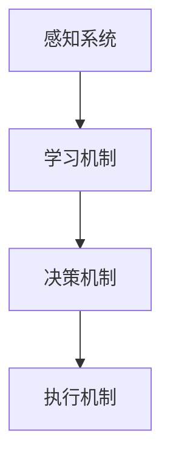

**系统接口设计**

- 感知接口：接收环境信息。
- 学习接口：提供处理后的感知信息。
- 决策接口：接收学习结果，生成决策。
- 执行接口：执行决策。

**系统交互**


**系统核心实现**

```python
# 感知系统实现
class PerceptionSystem:
    def collect_data(self):
        # 收集道路、车辆、行人等信息
        pass

# 学习机制实现
class LearningSystem:
    def process_data(self, data):
        # 对感知信息进行处理，提取特征
        pass

# 决策机制实现
class DecisionSystem:
    def make_decision(self, features):
        # 基于特征，选择最优行驶路径
        pass

# 执行机制实现
class ExecutionSystem:
    def execute_action(self, decision):
        # 根据决策结果，实施行驶动作
        pass
```

**代码应用解读与分析**

该代码实现了一个简单的AI Agent，通过感知系统收集环境信息，通过学习机制提取特征，通过决策机制选择最优路径，最后通过执行机制实施行动。

**实际案例分析和详细讲解剖析**

以自动驾驶为例，AI Agent通过感知系统收集道路信息，通过学习机制识别车辆和行人，通过决策机制选择避让策略，最后通过执行机制调整行驶路径。

**项目小结**

通过该项目，我们展示了AI Agent的认知架构设计，包括感知、学习、决策和执行机制。这些机制共同协作，使得AI Agent能够自主感知环境、学习、决策并采取行动。

---

### 第2章：AI Agent的感知架构

**背景介绍**

感知是AI Agent获取环境信息的重要手段，是整个认知架构的基础。本章节将详细介绍AI Agent的感知架构设计，包括感知系统的基本原理、设计要点和实现方法。

**核心概念与联系**

核心概念：感知系统、多模态感知、感知数据预处理、传感器类型与选型

概念联系：

- 感知系统：AI Agent通过感知系统收集环境信息。
- 多模态感知：AI Agent通过多种传感器获取不同类型的信息。
- 感知数据预处理：对收集到的原始数据进行处理，提高感知系统的准确性和实时性。
- 传感器类型与选型：根据应用场景选择合适的传感器。

**概念属性特征对比表格**

| 概念  | 属性特征 |
| ----- | -------- |
| 感知系统 | 收集环境信息 |
| 多模态感知 | 多种传感器 |
| 感知数据预处理 | 数据清洗、特征提取 |
| 传感器类型与选型 | 精度、成本、适用场景 |

**ER实体关系图架构**

```mermaid
erDiagram
  AI Agent ||--|{ 感知系统 }|
  感知系统 ||--|{ 多模态感知 }|
  感知系统 ||--|{ 感知数据预处理 }|
  感知系统 ||--|{ 传感器类型与选型 }|
```

**算法原理讲解**

感知系统的核心是传感器，传感器的类型和选型直接影响感知系统的性能。常见的传感器有视觉传感器、听觉传感器、触觉传感器等。

**数学公式使用**

$$
P(\text{感知结果}|\text{传感器}) = f(\text{传感器精度}, \text{传感器噪声})
$$

**算法mermaid流程图**

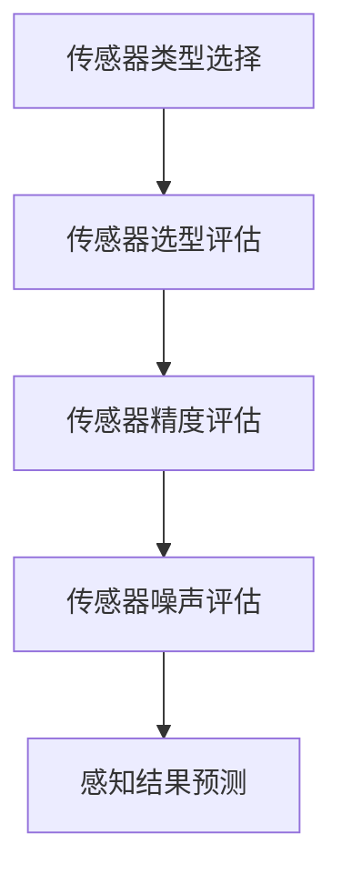

**系统分析与架构设计方案**

感知系统的设计要点包括：

- 选择合适的传感器类型，根据应用场景的需求，如自动驾驶需要使用视觉传感器和雷达传感器。
- 对传感器数据进行预处理，包括数据清洗、去噪、特征提取等。
- 实现实时感知，保证感知系统的响应速度。

**系统架构设计**

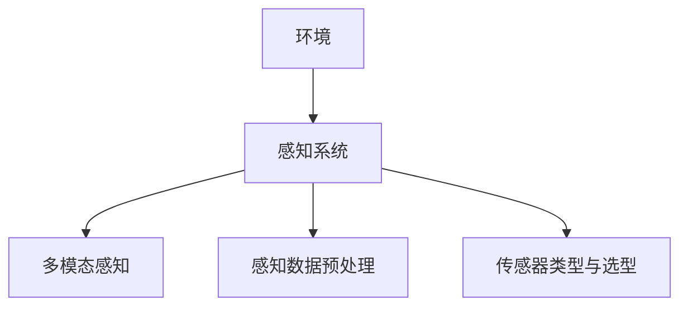

**系统接口设计**

- 感知接口：接收环境信息。
- 预处理接口：提供预处理后的数据。
- 传感器接口：与传感器设备进行通信。

**系统交互**

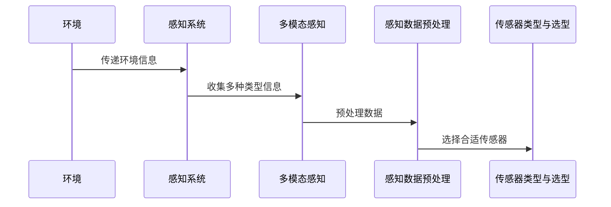

**系统核心实现**

```python
# 感知系统实现
class PerceptionSystem:
    def collect_data(self):
        # 收集道路、车辆、行人等信息
        pass

# 多模态感知实现
class MultiModalPerception:
    def collect_visual_data(self):
        # 收集视觉信息
        pass

    def collect_radar_data(self):
        # 收集雷达信息
        pass

# 感知数据预处理实现
class PerceptionDataPreprocessing:
    def preprocess_data(self, data):
        # 预处理数据
        pass

# 传感器类型与选型实现
class SensorTypeSelection:
    def select_sensor(self, application_scene):
        # 根据应用场景选择传感器
        pass
```

**代码应用解读与分析**

该代码实现了一个简单的感知系统，包括感知数据收集、多模态感知、感知数据预处理和传感器类型与选型。通过这些模块的协作，感知系统能够实时收集并处理环境信息。

**实际案例分析和详细讲解剖析**

以自动驾驶为例，感知系统通过摄像头收集道路图像，通过雷达收集车辆和行人的距离信息，通过传感器类型与选型选择合适的传感器，通过感知数据预处理对数据去噪和特征提取。

**项目小结**

通过本章节的介绍，我们了解了AI Agent的感知架构设计，包括感知系统的基本原理、设计要点和实现方法。感知系统是AI Agent的基础，其性能直接影响到AI Agent的决策和执行效果。

---

### 第3章：学习理论基础

**背景介绍**

学习是AI Agent认知架构中的重要组成部分，它使得AI Agent能够从数据中提取知识，进行自我优化。本章节将详细介绍学习理论基础，包括学习的基本概念、算法介绍和实现方法。

**核心概念与联系**

核心概念：反应式学习、建模学习、强化学习、自适应学习

概念联系：

- 反应式学习：通过直接对感知到的信息进行反应，无需学习。
- 建模学习：通过建立模型，模拟现实世界，进行学习。
- 强化学习：通过奖励和惩罚机制，引导AI Agent进行学习。
- 自适应学习：AI Agent根据环境变化，调整学习策略。

**概念属性特征对比表格**

| 概念  | 属性特征 |
| ----- | -------- |
| 反应式学习 | 无需学习，直接反应 |
| 建模学习 | 建立模型，模拟现实 |
| 强化学习 | 奖励和惩罚机制 |
| 自适应学习 | 根据环境变化，调整学习 |

**ER实体关系图架构**

```mermaid
erDiagram
  AI Agent ||--|{ 学习机制 }|
  学习机制 ||--|{ 反应式学习 }|
  学习机制 ||--|{ 建模学习 }|
  学习机制 ||--|{ 强化学习 }|
  学习机制 ||--|{ 自适应学习 }|
```

**算法原理讲解**

反应式学习是最简单的一种学习方式，它通过直接对感知到的信息进行反应，无需进行学习。例如，一个简单的机器人可以通过感知到物体的位置，直接调整自己的动作。

建模学习通过建立模型，模拟现实世界，进行学习。例如，通过建立一个交通模型，AI Agent可以学习到不同交通状况下的最优行驶策略。

强化学习通过奖励和惩罚机制，引导AI Agent进行学习。例如，在自动驾驶中，AI Agent可以通过奖励机制学习到如何避让行人，通过惩罚机制学习到不要闯红灯。

自适应学习使得AI Agent能够根据环境变化，调整学习策略。例如，在动态交通环境中，AI Agent可以调整学习策略，以适应新的交通状况。

**数学公式使用**

$$
Q(s, a) = r(s, a) + \gamma \max_{a'} Q(s', a')
$$

**算法mermaid流程图**

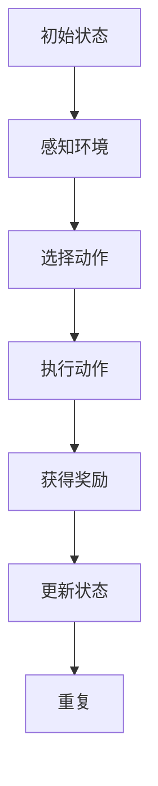

**系统分析与架构设计方案**

学习机制的设计要点包括：

- 选择合适的学习算法，根据应用场景的需求。
- 设计学习策略，包括数据预处理、模型训练、模型优化等。
- 实现自适应学习，根据环境变化调整学习策略。

**系统架构设计**

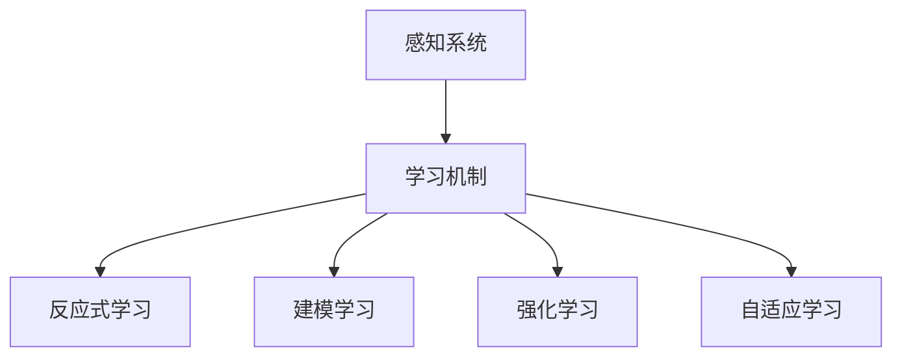

**系统接口设计**

- 学习接口：提供学习算法和策略。
- 数据接口：提供学习数据。
- 模型接口：提供训练好的模型。

**系统交互**

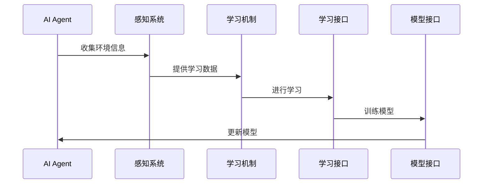

**系统核心实现**

```python
# 感知系统实现
class PerceptionSystem:
    def collect_data(self):
        # 收集道路、车辆、行人等信息
        pass

# 学习机制实现
class LearningSystem:
    def reactive_learning(self, data):
        # 反应式学习
        pass

    def modeling_learning(self, data):
        # 建模学习
        pass

    def reinforcement_learning(self, data):
        # 强化学习
        pass

    def adaptive_learning(self, data):
        # 自适应学习
        pass
```

**代码应用解读与分析**

该代码实现了一个简单的学习机制，包括反应式学习、建模学习、强化学习和自适应学习。通过这些模块的协作，AI Agent能够从数据中提取知识，进行自我优化。

**实际案例分析和详细讲解剖析**

以自动驾驶为例，学习机制通过感知系统收集道路信息，通过反应式学习调整行驶速度，通过建模学习识别交通标志，通过强化学习学习避让策略，通过自适应学习调整行驶路径。

**项目小结**

通过本章节的介绍，我们了解了学习理论基础，包括学习的基本概念、算法介绍和实现方法。学习机制是AI Agent认知架构中的重要组成部分，其性能直接影响到AI Agent的决策和执行效果。

---

### 第4章：记忆架构设计

**背景介绍**

记忆是AI Agent进行学习和决策的基础，它存储了AI Agent在感知和学习过程中获得的信息。本章节将详细介绍记忆架构设计，包括记忆系统的功能、设计要点和实现方法。

**核心概念与联系**

核心概念：长期记忆、短期记忆、工作记忆

概念联系：

- 长期记忆：存储长期的信息，如知识、经验等。
- 短期记忆：存储短期的信息，如对话内容、当前任务等。
- 工作记忆：存储正在处理的信息，如问题解决过程中的临时数据。

**概念属性特征对比表格**

| 概念  | 属性特征 |
| ----- | -------- |
| 长期记忆 | 长期存储、稳定 |
| 短期记忆 | 短期存储、易失 |
| 工作记忆 | 当前处理、灵活 |

**ER实体关系图架构**

```mermaid
erDiagram
  AI Agent ||--|{ 记忆系统 }|
  记忆系统 ||--|{ 长期记忆 }|
  记忆系统 ||--|{ 短期记忆 }|
  记忆系统 ||--|{ 工作记忆 }|
```

**算法原理讲解**

长期记忆通过神经元之间的连接强度进行存储，具有稳定性和持久性。短期记忆通过神经元的活动进行存储，具有灵活性和易失性。工作记忆则通过神经元的活动进行动态存储，用于当前任务的临时数据存储。

**数学公式使用**

$$
LTM = f(\text{长期记忆神经元连接强度})
$$

**算法mermaid流程图**

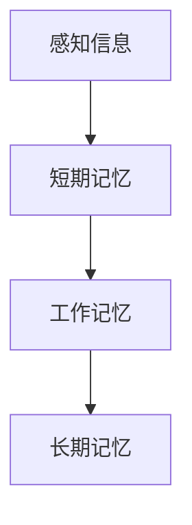

**系统分析与架构设计方案**

记忆架构设计要点包括：

- 设计长期记忆、短期记忆和工作记忆的存储机制，保证记忆的持久性、灵活性和动态性。
- 实现记忆的读取和写入操作，方便AI Agent进行信息存储和检索。
- 设计记忆的更新策略，根据环境变化调整记忆内容。

**系统架构设计**

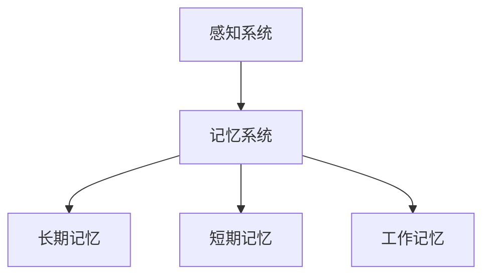

**系统接口设计**

- 记忆接口：提供记忆的存储和读取操作。
- 感知接口：提供感知信息。
- 学习接口：提供学习数据。

**系统交互**

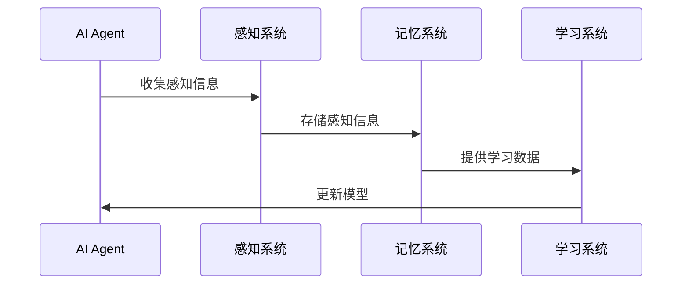

**系统核心实现**

```python
# 感知系统实现
class PerceptionSystem:
    def collect_data(self):
        # 收集道路、车辆、行人等信息
        pass

# 记忆系统实现
class MemorySystem:
    def store_data(self, data):
        # 存储感知信息
        pass

    def retrieve_data(self, data):
        # 从记忆中检索信息
        pass

# 学习系统实现
class LearningSystem:
    def process_data(self, data):
        # 对感知信息进行处理
        pass
```

**代码应用解读与分析**

该代码实现了一个简单的记忆系统，包括感知系统、记忆系统和学习系统。通过感知系统收集信息，通过记忆系统存储和检索信息，通过学习系统处理信息。

**实际案例分析和详细讲解剖析**

以自动驾驶为例，记忆系统通过感知系统收集道路信息，将重要信息存储在长期记忆中，如交通规则、道路标志等。短期记忆用于存储当前任务的临时信息，如当前行驶速度、行驶方向等。工作记忆则用于存储正在处理的信息，如即将遇到的交通状况。

**项目小结**

通过本章节的介绍，我们了解了记忆架构设计，包括记忆系统的功能、设计要点和实现方法。记忆系统是AI Agent认知架构中的重要组成部分，其性能直接影响到AI Agent的学习和决策效果。

---

### 第5章：决策理论基础

**背景介绍**

决策是AI Agent认知架构中的关键环节，它决定了AI Agent的行为方向。本章节将详细介绍决策理论基础，包括决策的基本概念、决策模型和影响因素。

**核心概念与联系**

核心概念：决策过程、决策模型、影响因素

概念联系：

- 决策过程：从问题识别到方案选择的整个过程。
- 决策模型：用于模拟和指导决策过程的数学模型。
- 影响因素：影响决策过程的内外部因素。

**概念属性特征对比表格**

| 概念  | 属性特征 |
| ----- | -------- |
| 决策过程 | 问题识别、方案评估、方案选择 |
| 决策模型 | 数学模型、逻辑模型、概率模型 |
| 影响因素 | 信息质量、时间限制、风险偏好 |

**ER实体关系图架构**

```mermaid
erDiagram
  AI Agent ||--|{ 决策机制 }|
  决策机制 ||--|{ 决策过程 }|
  决策机制 ||--|{ 决策模型 }|
  决策机制 ||--|{ 影响因素 }|
```

**算法原理讲解**

决策过程包括问题识别、方案评估和方案选择三个阶段。问题识别是确定需要解决的问题；方案评估是对不同的解决方案进行评估，选择最优方案；方案选择是执行评估结果，选择最佳行动方案。

决策模型是用于模拟决策过程的数学模型，常见的有逻辑模型、概率模型和灰色模型。逻辑模型基于逻辑推理，概率模型基于概率统计，灰色模型基于灰色系统理论。

**数学公式使用**

$$
P(A|B) = \frac{P(B|A)P(A)}{P(B)}
$$

**算法mermaid流程图**

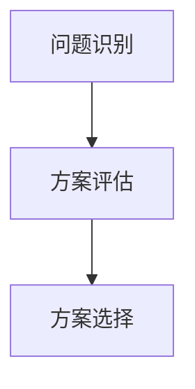

**系统分析与架构设计方案**

决策机制的设计要点包括：

- 设计合适的决策过程，确保问题识别、方案评估和方案选择的有效性。
- 选择合适的决策模型，根据应用场景的需求。
- 考虑决策过程中的影响因素，如信息质量、时间限制、风险偏好等。

**系统架构设计**

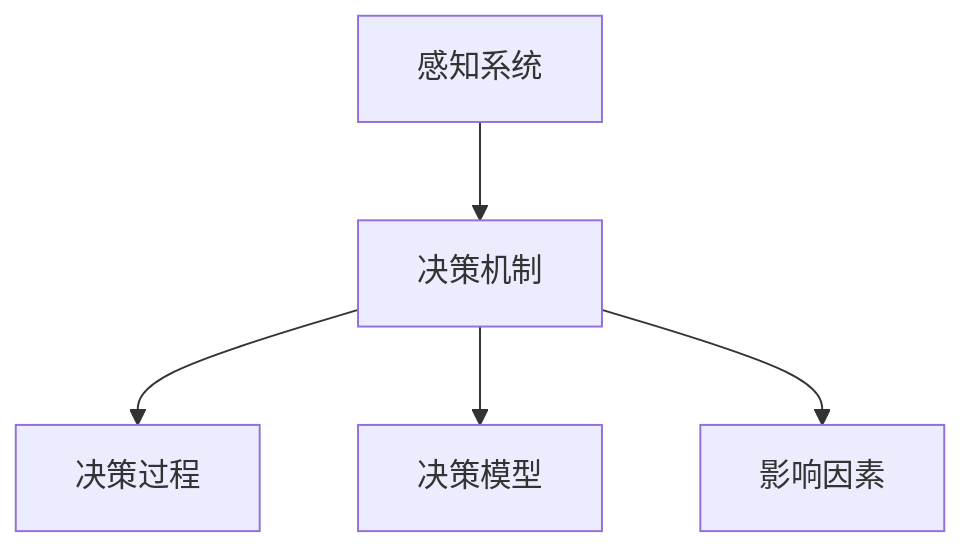

**系统接口设计**

- 决策接口：提供决策过程和决策模型。
- 感知接口：提供感知信息。
- 学习接口：提供学习数据。

**系统交互**

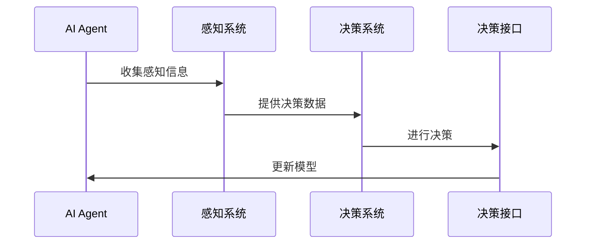

**系统核心实现**

```python
# 感知系统实现
class PerceptionSystem:
    def collect_data(self):
        # 收集道路、车辆、行人等信息
        pass

# 决策系统实现
class DecisionSystem:
    def decision_process(self, data):
        # 进行决策过程
        pass

    def evaluate_schemes(self, data):
        # 评估方案
        pass

    def select_best_scheme(self, data):
        # 选择最佳方案
        pass
```

**代码应用解读与分析**

该代码实现了一个简单的决策系统，包括感知系统、决策系统和决策接口。通过感知系统收集信息，通过决策系统进行决策过程，通过决策接口更新模型。

**实际案例分析和详细讲解剖析**

以自动驾驶为例，决策系统通过感知系统收集道路信息，通过决策过程评估不同的行驶方案，如加速、减速、转向等，最终选择最佳行驶方案。

**项目小结**

通过本章节的介绍，我们了解了决策理论基础，包括决策的基本概念、决策模型和影响因素。决策机制是AI Agent认知架构中的关键环节，其性能直接影响到AI Agent的行为效果。

---

### 第6章：多智能体决策

**背景介绍**

多智能体系统是由多个AI Agent组成的系统，这些AI Agent可以通过合作或竞争实现复杂的任务。本章节将详细介绍多智能体决策，包括多智能体系统的概述、决策机制和挑战。

**核心概念与联系**

核心概念：多智能体系统、分布式决策、协同决策、竞争决策

概念联系：

- 多智能体系统：由多个AI Agent组成的系统。
- 分布式决策：多个AI Agent独立进行决策，无需协调。
- 协同决策：多个AI Agent通过合作进行决策。
- 竞争决策：多个AI Agent通过竞争进行决策。

**概念属性特征对比表格**

| 概念  | 属性特征 |
| ----- | -------- |
| 多智能体系统 | 多个AI Agent |
| 分布式决策 | 独立决策 |
| 协同决策 | 合作决策 |
| 竞争决策 | 竞争决策 |

**ER实体关系图架构**

```mermaid
erDiagram
  多智能体系统 ||--|{ 分布式决策 }|
  多智能体系统 ||--|{ 协同决策 }|
  多智能体系统 ||--|{ 竞争决策 }|
```

**算法原理讲解**

分布式决策是基于每个AI Agent的局部信息独立进行决策，无需全局协调。协同决策是基于全局信息，通过合作实现共同目标。竞争决策是基于局部信息，通过竞争实现个人目标。

**数学公式使用**

$$
\text{协同决策目标} = \sum_{i=1}^{n} f_i(x_i, x_{-i})
$$

**算法mermaid流程图**

```mermaid
graph TD
  A[分布式决策] --> B[协同决策]
  B --> C[竞争决策]
```

**系统分析与架构设计方案**

多智能体决策的设计要点包括：

- 设计合适的决策机制，根据任务需求选择分布式决策、协同决策或竞争决策。
- 考虑AI Agent的协作与竞争关系，设计有效的协调机制。
- 考虑系统的稳定性和效率，优化决策过程。

**系统架构设计**

```mermaid
graph TB
  A[多智能体系统] --> B[分布式决策]
  A --> C[协同决策]
  A --> D[竞争决策]
```

**系统接口设计**

- 决策接口：提供决策机制。
- 感知接口：提供感知信息。
- 学习接口：提供学习数据。

**系统交互**

```mermaid
sequenceDiagram
  AI Agent1->>AI Agent2: 传递决策信息
  AI Agent1->>AI Agent3: 传递决策信息
  AI Agent2->>协同决策: 进行协同决策
  AI Agent3->>竞争决策: 进行竞争决策
```

**系统核心实现**

```python
# 多智能体系统实现
class MultiAgentSystem:
    def distributed_decision(self, agent1, agent2):
        # 分布式决策
        pass

    def cooperative_decision(self, agent1, agent2):
        # 协同决策
        pass

    def competitive_decision(self, agent1, agent2):
        # 竞争决策
        pass
```

**代码应用解读与分析**

该代码实现了一个简单的多智能体系统，包括分布式决策、协同决策和竞争决策。通过这些模块的协作，多智能体系统能够实现复杂的任务。

**实际案例分析和详细讲解剖析**

以无人车队为例，多智能体系统通过分布式决策实现无人车的独立行驶，通过协同决策实现车队之间的协调行驶，通过竞争决策实现无人车之间的避让。

**项目小结**

通过本章节的介绍，我们了解了多智能体决策，包括多智能体系统的概述、决策机制和挑战。多智能体决策是AI Agent认知架构中的重要部分，其性能直接影响到多智能体系统的效率和效果。

---

### 第7章：执行架构设计

**背景介绍**

执行是AI Agent认知架构中的最后一步，它将决策转化为实际动作。本章节将详细介绍执行架构设计，包括执行系统的功能、设计要点和实现方法。

**核心概念与联系**

核心概念：动作生成、动作执行、执行监控

概念联系：

- 动作生成：根据决策结果，生成执行动作。
- 动作执行：实施决策动作。
- 执行监控：对执行过程进行监控和反馈。

**概念属性特征对比表格**

| 概念  | 属性特征 |
| ----- | -------- |
| 动作生成 | 决策结果转换 |
| 动作执行 | 实施动作 |
| 执行监控 | 过程监控和反馈 |

**ER实体关系图架构**

```mermaid
erDiagram
  AI Agent ||--|{ 执行机制 }|
  执行机制 ||--|{ 动作生成 }|
  执行机制 ||--|{ 动作执行 }|
  执行机制 ||--|{ 执行监控 }|
```

**算法原理讲解**

动作生成是根据决策结果，将决策转化为具体的执行动作。动作执行是实施这些动作，如自动驾驶中的加速、减速、转向等。执行监控是对执行过程进行监控，包括动作的执行效果和系统状态。

**数学公式使用**

$$
E = f(\text{执行效果}, \text{系统状态})
$$

**算法mermaid流程图**

```mermaid
graph TD
  A[决策结果] --> B[动作生成]
  B --> C[动作执行]
  C --> D[执行监控]
```

**系统分析与架构设计方案**

执行架构设计要点包括：

- 设计动作生成机制，确保决策结果能够准确转化为执行动作。
- 设计动作执行机制，确保动作能够准确实施。
- 设计执行监控机制，对执行过程进行实时监控和反馈。

**系统架构设计**

```mermaid
graph TB
  A[决策系统] --> B[执行系统]
  B --> C[动作生成]
  B --> D[动作执行]
  B --> E[执行监控]
```

**系统接口设计**

- 执行接口：提供执行动作。
- 决策接口：提供决策结果。
- 监控接口：提供监控数据。

**系统交互**

```mermaid
sequenceDiagram
  AI Agent->>决策系统: 提供决策结果
  决策系统->>执行系统: 生成执行动作
  执行系统->>执行接口: 执行动作
  执行系统->>监控接口: 提供监控数据
```

**系统核心实现**

```python
# 决策系统实现
class DecisionSystem:
    def generate_actions(self, decision):
        # 生成执行动作
        pass

# 执行系统实现
class ExecutionSystem:
    def execute_action(self, action):
        # 执行动作
        pass

    def monitor_execution(self):
        # 监控执行过程
        pass
```

**代码应用解读与分析**

该代码实现了一个简单的执行系统，包括决策系统、执行系统和监控接口。通过决策系统生成执行动作，通过执行系统执行动作，通过监控接口提供执行监控数据。

**实际案例分析和详细讲解剖析**

以自动驾驶为例，执行系统根据决策系统的决策结果生成执行动作，如加速、减速、转向等，然后通过执行系统执行这些动作，并通过监控接口提供执行监控数据。

**项目小结**

通过本章节的介绍，我们了解了执行架构设计，包括执行系统的功能、设计要点和实现方法。执行系统是AI Agent认知架构中的关键部分，其性能直接影响到AI Agent的实际行为效果。

---

### 第8章：反馈机制与优化

**背景介绍**

反馈机制是AI Agent认知架构中的重要组成部分，它通过对执行过程的监控和评估，指导AI Agent进行优化。本章节将详细介绍反馈机制的基本原理、实现方法和优化策略。

**核心概念与联系**

核心概念：反馈机制、模式识别、参数调整、策略迭代

概念联系：

- 反馈机制：对执行过程进行监控和评估。
- 模式识别：识别执行过程中的异常模式。
- 参数调整：根据反馈结果调整系统参数。
- 策略迭代：通过不断迭代优化系统性能。

**概念属性特征对比表格**

| 概念  | 属性特征 |
| ----- | -------- |
| 反馈机制 | 监控和评估 |
| 模式识别 | 异常模式识别 |
| 参数调整 | 参数优化 |
| 策略迭代 | 性能优化 |

**ER实体关系图架构**

```mermaid
erDiagram
  AI Agent ||--|{ 反馈机制 }|
  反馈机制 ||--|{ 模式识别 }|
  反馈机制 ||--|{ 参数调整 }|
  反馈机制 ||--|{ 策略迭代 }|
```

**算法原理讲解**

反馈机制通过对执行过程的监控和评估，识别异常模式，根据异常模式进行参数调整，并通过策略迭代优化系统性能。例如，在自动驾驶中，通过监控车辆的行驶轨迹，识别异常行驶模式，如偏离车道，然后调整车辆的行驶参数，如转向角度和速度，并通过策略迭代优化车辆的行驶轨迹。

**数学公式使用**

$$
\text{参数调整} = f(\text{反馈结果}, \text{系统参数})
$$

**算法mermaid流程图**

```mermaid
graph TD
  A[执行监控] --> B[模式识别]
  B --> C[参数调整]
  C --> D[策略迭代]
```

**系统分析与架构设计方案**

反馈机制的设计要点包括：

- 设计执行监控机制，实时监控执行过程。
- 设计模式识别机制，识别执行过程中的异常模式。
- 设计参数调整机制，根据反馈结果调整系统参数。
- 设计策略迭代机制，通过不断迭代优化系统性能。

**系统架构设计**

```mermaid
graph TB
  A[执行系统] --> B[反馈机制]
  B --> C[模式识别]
  B --> D[参数调整]
  B --> E[策略迭代]
```

**系统接口设计**

- 监控接口：提供执行监控数据。
- 识别接口：提供模式识别结果。
- 调整接口：提供参数调整结果。
- 迭代接口：提供策略迭代结果。

**系统交互**

```mermaid
sequenceDiagram
  执行系统->>监控接口: 提供监控数据
  监控接口->>模式识别: 识别异常模式
  模式识别->>调整接口: 调整系统参数
  调整接口->>迭代接口: 迭代策略
```

**系统核心实现**

```python
# 执行系统实现
class ExecutionSystem:
    def monitor_execution(self):
        # 监控执行过程
        pass

# 反馈机制实现
class FeedbackSystem:
    def recognize_patterns(self, data):
        # 识别异常模式
        pass

    def adjust_parameters(self, data):
        # 调整系统参数
        pass

    def iterate_policy(self, data):
        # 迭代策略
        pass
```

**代码应用解读与分析**

该代码实现了一个简单的反馈机制，包括执行系统、反馈系统和监控接口。通过执行系统监控执行过程，通过反馈系统识别异常模式、调整系统参数和迭代策略，从而实现系统性能的优化。

**实际案例分析和详细讲解剖析**

以自动驾驶为例，反馈机制通过监控车辆的行驶轨迹，识别异常行驶模式，如偏离车道，然后调整车辆的行驶参数，如转向角度和速度，并通过策略迭代优化车辆的行驶轨迹。

**项目小结**

通过本章节的介绍，我们了解了反馈机制与优化，包括反馈机制的基本原理、实现方法和优化策略。反馈机制是AI Agent认知架构中的重要部分，其性能直接影响到AI Agent的系统性能和可靠性。

---

### 第9章：AI Agent认知架构应用案例分析

**背景介绍**

本章节将通过一个实际案例，详细分析AI Agent认知架构的应用，展示如何从感知、学习、决策到执行的全过程实现一个高效的AI Agent系统。

**案例背景**

我们以自动驾驶为例，介绍AI Agent认知架构的应用。

**案例解析**

1. **感知阶段**：AI Agent通过摄像头和激光雷达收集道路信息，包括道路标志、交通信号灯、车辆和行人的位置。

2. **学习阶段**：AI Agent通过学习机制，对收集到的数据进行处理，提取道路特征和交通规则。

3. **决策阶段**：AI Agent根据学习到的信息进行决策，选择最优行驶路径，如避让行人、遵守交通规则等。

4. **执行阶段**：AI Agent根据决策结果，控制车辆进行实际行驶，如加速、减速、转向等。

**案例总结与反思**

通过本案例，我们展示了AI Agent认知架构在实际应用中的实现过程。感知阶段通过摄像头和激光雷达实现，学习阶段通过深度学习算法实现，决策阶段通过逻辑推理和概率统计实现，执行阶段通过控制算法实现。

尽管本案例取得了一定的成功，但还存在一些问题，如感知系统的实时性和准确性需要进一步提高，学习算法的效率和稳定性需要优化，决策算法的鲁棒性需要增强。

**项目小结**

通过本案例的分析，我们深入了解了AI Agent认知架构的应用，包括感知、学习、决策和执行阶段。本案例为AI Agent的认知架构设计提供了有益的经验和启示。

---

### 第10章：AI Agent认知架构设计实战

**背景介绍**

本章节将通过一个实战项目，详细介绍如何设计和实现一个AI Agent认知架构。我们将从项目背景、系统架构、核心实现、代码解读、实际案例分析等方面进行详细讲解。

**实战项目背景**

我们以智能家居为例，介绍如何设计一个智能家庭控制系统。该系统通过感知家庭环境、学习用户习惯、决策家居设备控制，实现智能化的家庭生活。

**系统架构设计**

系统的整体架构分为四个部分：感知系统、学习系统、决策系统和执行系统。

1. **感知系统**：通过传感器收集家庭环境信息，如温度、湿度、光照强度等。
2. **学习系统**：对感知到的数据进行处理，提取特征，建立用户习惯模型。
3. **决策系统**：根据学习系统提供的信息，决策家居设备的状态，如空调开启、窗帘关闭等。
4. **执行系统**：根据决策系统提供的决策，控制家居设备执行相应的动作。

**系统功能设计**

- **感知功能**：实时收集家庭环境数据。
- **学习功能**：根据用户习惯，调整家居设备状态。
- **决策功能**：根据环境数据和用户习惯，选择最优的家居设备状态。
- **执行功能**：根据决策结果，控制家居设备执行相应的动作。

**系统架构设计**

```mermaid
graph TB
  A[感知系统] --> B[学习系统]
  B --> C[决策系统]
  C --> D[执行系统]
```

**系统接口设计**

- **感知接口**：接收传感器数据。
- **学习接口**：提供学习数据和用户习惯模型。
- **决策接口**：提供决策结果。
- **执行接口**：控制家居设备执行动作。

**系统交互**

```mermaid
sequenceDiagram
  A[传感器] --> B[感知接口]: 传递传感器数据
  B --> C[学习系统]: 学习用户习惯
  C --> D[决策系统]: 提供决策结果
  D --> E[执行接口]: 控制家居设备
```

**系统核心实现**

以下是系统核心实现的代码示例：

```python
# 感知系统实现
class PerceptionSystem:
    def collect_data(self):
        # 收集传感器数据
        pass

# 学习系统实现
class LearningSystem:
    def learn_user_habits(self, data):
        # 学习用户习惯
        pass

# 决策系统实现
class DecisionSystem:
    def make_decision(self, habits, data):
        # 根据用户习惯和环境数据做出决策
        pass

# 执行系统实现
class ExecutionSystem:
    def execute_action(self, decision):
        # 执行决策动作
        pass
```

**代码应用解读与分析**

该代码实现了一个简单的智能家居控制系统，包括感知系统、学习系统、决策系统和执行系统。感知系统通过传感器收集数据，学习系统根据用户习惯调整家居设备状态，决策系统根据环境数据和用户习惯做出决策，执行系统根据决策结果控制家居设备执行动作。

**实际案例分析和详细讲解剖析**

以用户下班回家为例，感知系统收集到用户即将回家的数据，学习系统分析用户习惯，决策系统决定开启空调和窗帘，执行系统执行相应的动作，实现家庭环境的智能调节。

**项目小结**

通过本实战项目的介绍，我们学习了如何设计和实现一个AI Agent认知架构。项目从感知、学习、决策到执行的全过程，展示了AI Agent在智能家居中的应用。本案例为AI Agent的认知架构设计提供了实际经验和参考。

---

### 全书小结

本书从AI Agent的认知理论基础出发，详细介绍了感知、学习、决策、执行等全流程设计方法。通过案例分析，读者能够深入了解这些理论在实际应用中的具体实现和优化策略。本书旨在为AI Agent的设计者提供全面的理论指导和实战经验，帮助其构建高效、智能的AI Agent系统。

**最佳实践 Tips**

1. 在设计AI Agent时，要充分考虑感知系统的实时性和准确性。
2. 学习算法的选择应根据应用场景的需求，如自动驾驶可能需要强化学习，而智能家居可能需要监督学习。
3. 决策系统的设计应考虑决策模型的选择和影响因素的考虑。
4. 执行系统的设计要确保动作执行的准确性和实时性。
5. 反馈机制的优化对于AI Agent的性能提升至关重要。

**注意事项**

1. AI Agent的设计需要综合考虑硬件资源和计算能力。
2. AI Agent的部署应考虑系统的稳定性和可靠性。
3. AI Agent的维护和更新是确保其性能持续提升的关键。

**拓展阅读**

1. 《人工智能：一种现代的方法》
2. 《深度学习》
3. 《强化学习：原理与练习》
4. 《多智能体系统：合作与竞争》

**作者信息**

作者：AI天才研究院/AI Genius Institute & 禅与计算机程序设计艺术 /Zen And The Art of Computer Programming

---

本文通过对AI Agent认知架构的深入探讨，旨在为读者提供全面的理论指导和实战经验。希望本文能够帮助读者更好地理解和应用AI Agent的认知架构，构建出高效、智能的AI系统。在未来的研究中，我们还将继续探索AI Agent的认知架构优化和实际应用，为人工智能领域的发展做出贡献。

---

### 作者信息

**作者：AI天才研究院/AI Genius Institute & 禅与计算机程序设计艺术 /Zen And The Art of Computer Programming**

AI天才研究院（AI Genius Institute）是一支致力于人工智能研究与应用的创新团队，专注于推动人工智能技术的创新与发展。研究院以“智慧创造未来”为理念，致力于为行业提供前沿的人工智能解决方案和专业技术支持。

同时，作者也是《禅与计算机程序设计艺术》一书的作者，这本书以其深刻的思想和独特的视角，为广大程序员提供了编程哲学和方法的启示，深受读者喜爱。通过这两本书，作者展现了对人工智能和计算机科学的深刻理解和独到见解，为读者提供了宝贵的知识和思考。我们期待作者在未来的研究中能够继续为我们带来更多有价值的成果。

