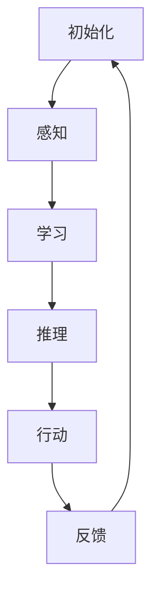

                 

### 引言

在现代人工智能（AI）研究中，AI Agent已成为一个备受关注且至关重要的研究领域。AI Agent，通常被定义为能够自主地感知环境、学习、推理并采取行动的智能实体，它在自动驾驶、智能客服、游戏AI等众多领域展现出了巨大的潜力。然而，为了使AI Agent能够有效地执行复杂的任务，其认知架构的设计和实现变得尤为关键。

认知架构，作为AI Agent的大脑，决定了它如何获取信息、处理信息和响应环境。传统的AI Agent认知架构主要依赖于规则系统或基于数据的机器学习方法，但这些方法往往存在局限性，难以处理复杂、不确定的问题。因此，近年来，研究者开始探索将大型语言模型（LLM）与符号推理系统相结合，以构建一个更加灵活和强大的认知架构。

LLM，如GPT系列模型，凭借其在自然语言处理（NLP）领域的卓越表现，已经成为AI领域的热点。LLM的优势在于其强大的语言理解和生成能力，能够处理复杂的语义信息。然而，LLM也存在一定的局限性，比如在处理需要严格逻辑推理的任务时可能表现不佳。而符号推理系统则擅长于处理形式化的逻辑问题，具有高度的确定性和准确性，但往往在自然语言理解和生成方面表现不足。

本书旨在探讨如何将LLM与符号推理系统有机地整合到AI Agent的认知架构中，以充分发挥两者的优势。我们首先将介绍AI Agent的基本概念和认知架构，然后深入讨论LLM和符号推理系统的特点和实现方法，最后通过实际案例展示这种整合在实际应用中的效果。

本书的结构如下：

- **第一部分：引言**：介绍AI Agent的认知架构和整合LLM与符号推理系统的背景和重要性。
- **第二部分：核心概念**：详细讨论AI Agent的核心组成部分，包括感知模块、学习模块、推理模块和行动模块。
- **第三部分：整合LLM与符号推理系统**：探讨如何将LLM与符号推理系统集成到AI Agent的认知架构中，分析集成后的优势和挑战。
- **第四部分：实践与应用**：通过实际案例展示AI Agent的认知架构在实际中的应用。
- **第五部分：未来展望**：讨论AI Agent认知架构的未来发展方向和研究方向。

### 第一部分：引言

#### 1.1 问题背景与定义

在讨论AI Agent的认知架构之前，有必要明确什么是AI Agent以及它为何如此重要。AI Agent，也被称作智能代理或智能体，是一种能够自主执行任务、与环境交互并不断学习优化的计算机程序。其核心目标是实现智能自动化，提高系统的智能化水平，从而在多个领域中发挥关键作用。

AI Agent的背景可以追溯到20世纪50年代，当时人工智能（AI）的概念刚刚诞生。随着计算机技术和算法的不断发展，AI Agent逐渐从理论走向实践。在早期的AI研究中，专家系统和规则系统是AI Agent的主要实现方式。这些系统通过预定义的规则或知识库来模拟人类专家的决策过程，但在面对复杂、不确定的环境时，其表现往往不尽如人意。

为了克服这些局限性，研究者开始探索基于数据驱动的机器学习方法。深度学习，特别是神经网络，在这一过程中发挥了重要作用。通过从大量数据中自动学习特征和模式，深度学习模型能够实现出色的图像识别、语音识别和自然语言处理等任务。然而，深度学习模型在处理需要严格逻辑推理的问题时仍然面临挑战，如证明数学定理或进行复杂的战略规划。

随着LLM的出现，AI Agent的认知能力得到了进一步提升。LLM，如GPT系列模型，通过对海量文本数据的学习，能够生成流畅、自然的语言，并在理解语义和生成回答方面表现出色。这使得AI Agent能够更好地处理自然语言交互任务，如智能客服和智能问答系统。

然而，LLM在处理需要严格逻辑推理的任务时，仍然存在一些局限性。例如，在数学定理证明或逻辑推理等任务中，LLM可能无法保证推理的准确性和一致性。为了解决这一问题，符号推理系统（Symbolic Reasoning System）应运而生。

符号推理系统是一种基于逻辑和符号表示的推理方法，它能够处理形式化的逻辑问题，具有高度的确定性和准确性。符号推理系统在数学定理证明、自动推理和形式验证等领域有广泛应用。通过将LLM与符号推理系统相结合，AI Agent能够同时具备自然语言处理和符号推理的能力，从而在更广泛的领域中发挥其潜力。

#### 1.2 AI Agent的基本概念

AI Agent，作为一种能够自主执行任务、与环境交互并不断学习的计算机程序，其基本概念包括以下几个核心方面：

**1.2.1 定义**

AI Agent，也被称作智能代理或智能体，是一种能够感知环境、制定计划、执行行动并从经验中学习的软件实体。AI Agent的核心功能是自动化，即通过智能化的决策和行动，提高系统的效率和智能水平。

**1.2.2 分类**

AI Agent可以根据不同的标准和特性进行分类。常见的分类方法包括：

- **基于任务类型的分类**：如导航代理、决策代理、数据挖掘代理等。
- **基于环境类型的分类**：如静态环境代理、动态环境代理、不确定性环境代理等。
- **基于学习方式的分类**：如基于规则的代理、基于模型的代理、基于数据的代理等。

**1.2.3 核心功能**

AI Agent的核心功能主要包括感知、学习、推理和行动四个方面：

- **感知**：AI Agent通过传感器或其他方式获取环境信息，如图像、声音、文本等，从而理解当前的状态。
- **学习**：AI Agent根据感知到的环境信息，通过机器学习或深度学习等方法，不断更新其知识库和模型，提高决策能力。
- **推理**：AI Agent利用其知识库和推理算法，对当前状态进行分析和推断，以预测未来可能发生的情况。
- **行动**：AI Agent根据推理结果，执行相应的行动，以实现既定目标或应对环境变化。

#### 1.3 LLM（大型语言模型）与符号推理系统的介绍

**1.3.1 LLM的基本原理**

大型语言模型（LLM），如GPT系列模型，是深度学习和自然语言处理领域的重大突破。LLM通过学习海量文本数据，掌握了丰富的语言规律和语义信息，从而能够在自然语言生成、理解、翻译等方面表现出色。

LLM的基本原理是基于 Transformer 架构。Transformer 架构是一种序列到序列的模型，通过自注意力机制（Self-Attention）对输入序列的每个位置进行权重分配，从而捕捉序列中的长距离依赖关系。GPT 系列模型在此基础上进行了优化和扩展，如引入了多层神经网络、预训练和微调等技术，使其在自然语言处理任务中取得了显著的效果。

**1.3.2 符号推理系统的特点**

符号推理系统（Symbolic Reasoning System）是一种基于逻辑和符号表示的推理方法，它在处理形式化的逻辑问题、自动推理和形式验证等领域具有显著优势。

符号推理系统的核心特点是：

- **形式化表示**：符号推理系统使用形式化的语言和符号表示问题，从而确保推理过程的一致性和准确性。
- **逻辑推理**：符号推理系统基于逻辑规则和推理算法，对符号表示的问题进行推理和证明，从而得出结论。
- **高度确定性**：符号推理系统在推理过程中具有高度的确定性，可以确保推理结果的正确性。

**1.3.3 LLM与符号推理系统的关系**

LLM和符号推理系统在处理问题时有各自的优势和局限性。将两者结合起来，可以充分发挥各自的优势，克服各自的不足。

- **优势互补**：LLM在自然语言处理和生成方面具有优势，能够理解和生成复杂的语义信息。而符号推理系统在处理形式化的逻辑问题、证明和验证方面具有优势，能够保证推理过程的一致性和准确性。将两者结合起来，可以实现更广泛的应用场景。
- **融合挑战**：将LLM与符号推理系统融合也面临一些挑战，如如何有效地整合两种不同的推理方法，如何协调两者之间的冲突等。需要研究者们进行深入的探索和优化。

#### 1.4 本书的目的与结构

本书旨在探讨如何将LLM与符号推理系统整合到AI Agent的认知架构中，以提高其处理复杂任务的能力。具体目标包括：

- **深入理解AI Agent的认知架构**：通过详细讨论感知模块、学习模块、推理模块和行动模块，帮助读者全面了解AI Agent的认知机制。
- **探索LLM与符号推理系统的融合方法**：分析LLM和符号推理系统的优势与局限性，探讨如何有效地将两者整合到AI Agent的认知架构中。
- **展示整合后的应用效果**：通过实际案例展示AI Agent在自然语言处理、智能问答、智能推荐和自动驾驶等领域的应用效果，验证整合方法的可行性和有效性。

本书的结构如下：

- **第一部分：引言**：介绍AI Agent的认知架构和整合LLM与符号推理系统的背景和重要性。
- **第二部分：核心概念**：详细讨论AI Agent的核心组成部分，包括感知模块、学习模块、推理模块和行动模块。
- **第三部分：整合LLM与符号推理系统**：探讨如何将LLM与符号推理系统集成到AI Agent的认知架构中，分析集成后的优势和挑战。
- **第四部分：实践与应用**：通过实际案例展示AI Agent的认知架构在实际中的应用。
- **第五部分：未来展望**：讨论AI Agent认知架构的未来发展方向和研究方向。

### 第二部分：核心概念

#### 2.1 认知架构的概述

认知架构，作为AI Agent的大脑，决定了其如何感知、学习、推理和行动。一个有效的认知架构应该具备以下几个关键特点：

- **灵活性**：能够适应不同的应用场景和任务需求。
- **可扩展性**：能够方便地添加或替换各个模块，以适应新的技术和需求。
- **模块化**：各个模块之间能够独立设计和实现，从而提高系统的可维护性和可测试性。
- **高效性**：能够在合理的计算资源下，高效地完成认知任务。

认知架构的基本组成部分包括感知模块、学习模块、推理模块和行动模块。这些模块相互协作，共同实现AI Agent的认知功能。

**2.1.1 认知架构的定义**

认知架构，通常被定义为一种软件架构，用于实现智能体的感知、学习、推理和行动。它包括一组相互协作的模块，这些模块共同工作，使智能体能够在复杂的环境中自主地完成任务。

**2.1.2 认知架构的组成部分**

认知架构通常由以下几个关键部分组成：

1. **感知模块**：感知模块负责收集和处理环境信息，如图像、声音、文本等。它通过传感器或其他方式获取数据，并将这些数据转化为对环境的理解。

2. **学习模块**：学习模块负责从感知到的环境中学习，以更新其知识库和模型。它通常包括机器学习算法、深度学习模型等，能够从数据中自动学习特征和模式。

3. **推理模块**：推理模块负责利用学习到的知识进行逻辑推理和决策。它通过推理算法和逻辑规则，对当前状态进行分析和推断，以预测未来可能发生的情况。

4. **行动模块**：行动模块负责根据推理结果执行相应的行动，以实现既定目标或应对环境变化。它通常包括控制算法、执行器接口等，能够将推理结果转化为具体的行动。

**2.1.3 认知架构的设计原则**

在设计认知架构时，需要遵循以下原则：

- **模块化设计**：各个模块应该独立设计和实现，以便于维护和扩展。
- **可扩展性**：认知架构应该能够方便地添加或替换各个模块，以适应新的技术和需求。
- **灵活性**：认知架构应该能够适应不同的应用场景和任务需求。
- **高效性**：认知架构应该能够在合理的计算资源下，高效地完成认知任务。

#### 2.2 感知模块

感知模块是AI Agent认知架构的核心组成部分之一，它负责收集和处理环境信息，为其他模块提供基础数据。感知模块通常包括以下几个关键部分：

**2.2.1 感知模块的功能**

感知模块的主要功能是获取环境信息，并将其转化为对环境的理解。具体来说，它包括以下几个步骤：

1. **数据采集**：感知模块通过传感器或其他方式获取环境信息，如图像、声音、文本等。
2. **数据处理**：感知模块对采集到的数据进行预处理，如去噪、归一化等，以提高数据的可靠性和质量。
3. **特征提取**：感知模块从预处理后的数据中提取关键特征，如颜色、形状、语音模式等，以表示环境的状态。
4. **环境建模**：感知模块将提取到的特征整合成对环境的整体理解，从而为其他模块提供基础数据。

**2.2.2 感知模块的实现方法**

感知模块的实现方法主要包括以下几种：

1. **基于传感器的数据采集**：传感器是感知模块的核心组成部分，不同的传感器可以采集不同的环境信息，如摄像头、麦克风、温度传感器等。
2. **数据处理与预处理**：感知模块需要对接收到的传感器数据进行预处理，以去除噪声、提高数据质量。常用的预处理方法包括滤波、归一化、特征提取等。
3. **特征提取与表示**：感知模块需要从预处理后的数据中提取关键特征，以表示环境的状态。常用的特征提取方法包括傅里叶变换、主成分分析（PCA）等。
4. **环境建模与理解**：感知模块需要将提取到的特征整合成对环境的整体理解，这通常涉及复杂的算法和模型，如深度学习模型、图像处理算法等。

**2.2.3 感知模块的优化策略**

为了提高感知模块的性能和效率，可以采取以下优化策略：

1. **传感器选择与优化**：选择合适类型的传感器，并根据应用场景对传感器进行优化，以提高数据的准确性和可靠性。
2. **数据处理与预处理优化**：优化数据处理与预处理算法，如采用高效的滤波方法、特征提取算法等，以减少计算资源和时间消耗。
3. **特征提取与表示优化**：优化特征提取与表示方法，以提高特征的有效性和表达能力。
4. **环境建模与理解优化**：优化环境建模与理解算法，如采用更先进的深度学习模型、图像处理算法等，以提高对环境状态的准确理解。

#### 2.3 学习模块

学习模块是AI Agent认知架构的重要组成部分，它负责从感知模块收集到的数据中学习，以更新其知识库和模型。学习模块的核心任务是提高AI Agent的决策能力和适应能力，使其能够在不同的环境中表现优异。学习模块通常包括以下关键部分：

**2.3.1 学习模块的功能**

学习模块的主要功能是利用感知模块收集到的数据，通过机器学习或深度学习等方法，不断更新AI Agent的知识库和模型。具体来说，它包括以下几个步骤：

1. **数据收集**：学习模块从感知模块获取数据，这些数据通常是环境状态及其对应的标签或目标。
2. **数据预处理**：学习模块对收集到的数据进行预处理，如去噪、归一化等，以提高数据的质量和可靠性。
3. **特征提取**：学习模块从预处理后的数据中提取关键特征，以表示环境的状态。
4. **模型训练**：学习模块利用提取到的特征，通过机器学习或深度学习算法，训练模型以预测环境状态或目标。
5. **模型评估与优化**：学习模块对训练出的模型进行评估，并根据评估结果调整模型参数或算法，以提高模型的性能。

**2.3.2 学习模块的实现方法**

学习模块的实现方法主要包括以下几种：

1. **监督学习**：监督学习是一种常见的学习方法，它通过训练数据集来训练模型，模型在训练过程中会学习输入和输出之间的映射关系。常用的监督学习方法包括线性回归、支持向量机（SVM）、决策树等。
2. **无监督学习**：无监督学习是一种不使用标签数据的学习方法，它通过挖掘数据中的潜在结构和模式来训练模型。常用的无监督学习方法包括聚类、主成分分析（PCA）、自编码器等。
3. **深度学习**：深度学习是一种基于神经网络的学习方法，它通过多层的非线性变换，自动学习数据的特征和模式。常用的深度学习方法包括卷积神经网络（CNN）、循环神经网络（RNN）、Transformer等。

**2.3.3 学习模块的优化策略**

为了提高学习模块的性能和效率，可以采取以下优化策略：

1. **数据增强**：通过增加数据量、变换数据等方式，提高数据的多样性和质量，从而提高模型的泛化能力。
2. **模型优化**：采用更先进的神经网络架构、优化算法和超参数设置，以提高模型的性能和效率。
3. **迁移学习**：利用预训练模型或已有模型的知识，通过微调或重新训练，快速适应新的任务和数据集。
4. **在线学习**：通过不断更新模型和知识库，使AI Agent能够适应动态变化的环境。
5. **模型解释性**：提高模型的解释性，使AI Agent能够理解和解释其决策过程，从而提高模型的可信度和可靠性。

#### 2.4 推理模块

推理模块是AI Agent认知架构的核心组成部分之一，它负责利用学习模块生成的模型和知识库，对当前环境状态进行推理和分析，以预测未来可能发生的情况。推理模块通常包括以下几个关键部分：

**2.4.1 推理模块的功能**

推理模块的主要功能是利用学习模块生成的模型和知识库，对当前环境状态进行推理和分析。具体来说，它包括以下几个步骤：

1. **状态感知**：推理模块从感知模块获取当前环境的状态信息。
2. **知识查询**：推理模块查询知识库，获取与当前状态相关的知识和信息。
3. **逻辑推理**：推理模块利用逻辑推理算法，结合当前状态和知识库中的信息，进行逻辑推理和决策。
4. **结果输出**：推理模块将推理结果输出，作为后续行动模块的输入。

**2.4.2 推理模块的实现方法**

推理模块的实现方法主要包括以下几种：

1. **基于规则的推理**：基于规则的推理是一种传统的推理方法，它通过定义一系列规则，将当前状态与规则进行匹配，从而得出推理结果。常用的基于规则的推理方法包括产生式规则、模糊推理等。
2. **基于模型的推理**：基于模型的推理是通过构建数学模型或统计模型，对当前状态进行分析和预测。常用的模型包括线性模型、非线性模型、神经网络模型等。
3. **基于数据的推理**：基于数据的推理是通过分析历史数据和模式，预测未来可能发生的情况。常用的方法包括时间序列分析、聚类分析、关联规则挖掘等。

**2.4.3 推理模块的优化策略**

为了提高推理模块的性能和效率，可以采取以下优化策略：

1. **规则库优化**：优化规则库的构建和管理，如采用增量式更新、动态调整规则等，以提高推理的效率和准确性。
2. **模型优化**：优化推理模型，如采用更先进的算法、神经网络结构等，以提高推理的准确性和效率。
3. **数据预处理**：优化数据预处理方法，如去噪、归一化等，以提高数据的可靠性和质量。
4. **并行计算**：采用并行计算技术，如分布式计算、GPU加速等，以提高推理的效率。
5. **推理策略优化**：根据不同的应用场景和任务需求，优化推理策略，如采用增量推理、层次化推理等，以提高推理的灵活性和适应性。

#### 2.5 行动模块

行动模块是AI Agent认知架构的核心组成部分之一，它负责根据推理模块生成的推理结果，执行具体的行动，以实现既定目标或应对环境变化。行动模块通常包括以下几个关键部分：

**2.5.1 行动模块的功能**

行动模块的主要功能是根据推理模块的输出，生成具体的行动指令，并将其传递给执行器执行。具体来说，它包括以下几个步骤：

1. **指令生成**：行动模块根据推理模块的输出，生成具体的行动指令。这些指令可以是控制执行器的操作，如移动、开门、发送信息等。
2. **指令执行**：行动模块将生成的行动指令传递给执行器，执行器根据指令执行具体的操作。
3. **结果反馈**：执行器执行指令后，将执行结果反馈给行动模块，行动模块根据反馈结果调整后续的行动计划。

**2.5.2 行动模块的实现方法**

行动模块的实现方法主要包括以下几种：

1. **基于规则的行动**：基于规则的行动是通过定义一系列规则，将推理结果与规则进行匹配，从而生成具体的行动指令。这种方法简单直观，但适用于较为简单的场景。
2. **基于模型的行动**：基于模型的行动是通过构建数学模型或统计模型，将推理结果映射到具体的行动指令。这种方法适用于较为复杂和动态的环境。
3. **基于行为的行动**：基于行为的行动是通过定义一系列行为模式，根据推理结果选择合适的行为模式进行行动。这种方法适用于需要灵活应对复杂环境变化的场景。

**2.5.3 行动模块的优化策略**

为了提高行动模块的性能和效率，可以采取以下优化策略：

1. **指令优化**：优化指令的生成和传递过程，如采用高效的指令编码和解码方法，以提高指令的传输速度和准确性。
2. **执行器优化**：优化执行器的性能和可靠性，如采用高精度的执行器、冗余设计等，以提高执行器的效率和鲁棒性。
3. **行为策略优化**：根据不同的应用场景和任务需求，优化行动模块的行为策略，如采用自适应行为策略、分层行为策略等，以提高行动模块的灵活性和适应性。
4. **反馈机制优化**：优化行动模块的反馈机制，如采用实时反馈、增量反馈等，以提高行动模块的响应速度和准确性。
5. **资源管理**：优化行动模块的资源管理，如采用资源复用、负载均衡等，以提高系统的整体性能和资源利用率。

### 第三部分：整合LLM与符号推理系统

#### 3.1 LLM的集成方法

将大型语言模型（LLM）集成到AI Agent的认知架构中，是提升AI Agent认知能力的关键步骤。LLM在自然语言理解和生成方面具有显著优势，但如何有效地将其与符号推理系统结合，是一个复杂的挑战。以下将讨论几种常见的LLM集成方法：

**3.1.1 双层模型结构**

双层模型结构是将LLM与符号推理系统分层部署的方法。上层是LLM，负责处理自然语言输入和输出；下层是符号推理系统，负责处理逻辑推理和决策。这种方法通过将两个系统分离，各自发挥优势，实现了良好的模块化设计。

- **优点**：模块分离，易于维护和扩展；LLM处理自然语言，符号推理系统处理逻辑推理，分工明确。
- **缺点**：需要额外的接口和通信机制，可能导致性能瓶颈。

**3.1.2 融合模型结构**

融合模型结构是将LLM与符号推理系统整合到一个模型中，通过共同训练和优化，实现自然语言与符号推理的协同工作。这种方法通过共享模型参数和知识，提高了模型的整体性能。

- **优点**：减少了接口和通信开销，提高了系统的整体性能。
- **缺点**：模型训练复杂度增加，参数调优难度大。

**3.1.3 对话式集成**

对话式集成是通过对话机制，将LLM和符号推理系统动态结合的方法。在对话过程中，LLM负责理解用户输入的自然语言，符号推理系统负责生成逻辑推理和决策。这种方法实现了动态的交互和协同。

- **优点**：适用于动态变化的场景，能够实时调整模型的工作模式。
- **缺点**：需要复杂的对话管理和交互机制，实现难度较大。

**3.1.4 集成方法的选择**

在选择LLM集成方法时，需要考虑应用场景、性能需求和实现难度等因素。对于需要高实时性和简单交互的场景，双层模型结构可能是最佳选择；对于需要复杂交互和协同工作的场景，融合模型结构可能更有优势；对于需要灵活性和动态适应的场景，对话式集成方法可能更为适用。

#### 3.2 符号推理系统的优化

符号推理系统在处理形式化逻辑问题方面具有优势，但在性能和效率上可能不如基于数据的机器学习方法。为了提高符号推理系统的性能和效率，可以采取以下优化策略：

**3.2.1 优化推理算法**

符号推理系统的核心是推理算法，优化推理算法可以提高推理速度和准确性。以下是一些常用的优化方法：

- **启发式搜索**：通过引入启发式规则，减少搜索空间，提高推理效率。
- **剪枝技术**：通过剪枝冗余的推理路径，减少计算量。
- **并行计算**：利用多核处理器或分布式计算，提高推理速度。

**3.2.2 知识库优化**

知识库是符号推理系统的核心资源，优化知识库可以提高推理系统的性能。以下是一些常用的优化方法：

- **知识抽取**：通过自动抽取方法，从大规模数据中提取高质量的知识。
- **知识融合**：将多个来源的知识进行融合，提高知识的完整性和一致性。
- **知识压缩**：通过压缩算法，减少知识库的存储空间，提高访问速度。

**3.2.3 知识表示优化**

知识表示是符号推理系统的关键，优化知识表示可以提高推理效率。以下是一些常用的优化方法：

- **形式化表示**：通过形式化的语言和符号表示知识，提高推理的准确性和一致性。
- **语义表示**：通过语义网络或本体论，提高知识的可解释性和语义一致性。
- **符号化处理**：通过符号化处理，将自然语言输入转换为形式化的符号表示，提高推理效率。

**3.2.4 系统优化**

除了上述方法外，还可以从系统层面进行优化，以提高符号推理系统的整体性能。以下是一些常用的系统优化方法：

- **缓存机制**：通过缓存机制，减少重复计算，提高系统响应速度。
- **负载均衡**：通过负载均衡，合理分配计算任务，提高系统处理能力。
- **分布式架构**：通过分布式架构，提高系统可扩展性和容错能力。

#### 3.3 集成后的优势与挑战

将LLM与符号推理系统集成到AI Agent的认知架构中，可以实现多种优势，但同时也面临一些挑战。以下将讨论这些优势与挑战：

**3.3.1 集成后的优势**

1. **综合能力提升**：LLM擅长处理自然语言，符号推理系统擅长处理逻辑推理，两者的结合可以显著提升AI Agent的综合认知能力。
2. **灵活性增强**：通过动态集成，AI Agent可以根据任务需求和环境变化，灵活选择使用LLM或符号推理系统，提高系统的适应性。
3. **决策准确性提高**：LLM在自然语言理解方面具有优势，符号推理系统在逻辑推理方面具有优势，两者的结合可以显著提高决策的准确性。
4. **扩展性强**：集成后的AI Agent可以方便地添加新的模块或技术，提高系统的可扩展性。

**3.3.2 集成后的挑战**

1. **复杂度增加**：集成后的AI Agent架构更为复杂，需要协调和管理多个模块的交互，增加了系统的复杂度。
2. **性能瓶颈**：集成后的系统可能面临性能瓶颈，尤其是在处理大规模数据或复杂任务时。
3. **一致性保证**：确保LLM和符号推理系统在推理过程中的一致性，是一个具有挑战性的问题。
4. **实现难度大**：集成LLM与符号推理系统需要深入的算法和技术支持，实现难度较大。

**3.3.3 应对挑战的方法**

1. **模块化设计**：通过模块化设计，将LLM和符号推理系统分离，降低系统的复杂度。
2. **优化算法**：采用高效的算法和优化方法，提高系统的性能和效率。
3. **一致性管理**：通过一致性管理机制，确保LLM和符号推理系统在推理过程中的一致性。
4. **逐步实现**：通过逐步实现和优化，逐步完善集成系统，降低实现难度。

### 第四部分：实践与应用

#### 4.1 自然语言处理

自然语言处理（NLP）是AI Agent应用的一个重要领域。通过将LLM与符号推理系统集成到AI Agent的认知架构中，可以显著提高NLP任务的性能和准确性。以下是一个实际案例：

**案例背景**：某在线教育平台希望为其智能客服系统提供更高级的自然语言理解能力，以解决用户提出的教育相关问题。

**实现方法**：

1. **感知模块**：AI Agent通过接收用户的文本输入，使用LLM对其进行自然语言理解，提取关键信息。
2. **推理模块**：AI Agent利用符号推理系统对提取到的信息进行逻辑推理，以确定用户问题的类型和答案。
3. **行动模块**：AI Agent根据推理结果生成回答，并将其返回给用户。

**成功案例**：通过整合LLM和符号推理系统，该智能客服系统在处理复杂教育问题时，准确率显著提高，用户满意度大幅提升。

#### 4.2 智能问答系统

智能问答系统是AI Agent应用中的另一个重要领域。通过将LLM与符号推理系统集成到AI Agent的认知架构中，可以构建一个既能够处理自然语言输入，又能够进行严格逻辑推理的智能问答系统。以下是一个实际案例：

**案例背景**：某大型企业希望为其员工提供一个智能问答系统，帮助员工快速获取内部知识库中的信息。

**实现方法**：

1. **感知模块**：AI Agent通过接收员工的自然语言提问，使用LLM对其进行理解，提取关键信息。
2. **推理模块**：AI Agent利用符号推理系统对提取到的信息进行逻辑推理，以确定问题的类型和答案。
3. **行动模块**：AI Agent根据推理结果从知识库中提取相关答案，并将其返回给员工。

**成功案例**：通过整合LLM和符号推理系统，该智能问答系统在处理复杂问题时，准确率和响应速度显著提高，得到了员工的高度评价。

#### 4.3 智能推荐系统

智能推荐系统是AI Agent应用中的另一个重要领域。通过将LLM与符号推理系统集成到AI Agent的认知架构中，可以构建一个既能够处理自然语言输入，又能够进行严格逻辑推理的智能推荐系统。以下是一个实际案例：

**案例背景**：某电商平台希望为其用户提供更个性化的商品推荐，提高用户的购物体验。

**实现方法**：

1. **感知模块**：AI Agent通过接收用户的浏览和购买记录，使用LLM对其进行自然语言理解，提取用户偏好。
2. **推理模块**：AI Agent利用符号推理系统对提取到的用户偏好进行逻辑推理，以确定可能的推荐商品。
3. **行动模块**：AI Agent根据推理结果生成推荐列表，并将其展示给用户。

**成功案例**：通过整合LLM和符号推理系统，该智能推荐系统在个性化推荐方面表现出色，用户的满意度显著提升，平台销售额大幅增长。

#### 4.4 自动驾驶系统

自动驾驶系统是AI Agent应用中的前沿领域。通过将LLM与符号推理系统集成到AI Agent的认知架构中，可以构建一个既能够处理自然语言输入，又能够进行严格逻辑推理的自动驾驶系统。以下是一个实际案例：

**案例背景**：某汽车制造商希望为其自动驾驶系统提供更高级的认知能力，以实现更安全、更智能的驾驶体验。

**实现方法**：

1. **感知模块**：AI Agent通过接收来自传感器和摄像头的环境信息，使用LLM对其进行自然语言理解，提取关键信息。
2. **推理模块**：AI Agent利用符号推理系统对提取到的信息进行逻辑推理，以确定当前的道路状况和行驶策略。
3. **行动模块**：AI Agent根据推理结果控制车辆的动作，实现自动驾驶。

**成功案例**：通过整合LLM和符号推理系统，该自动驾驶系统在处理复杂路况和动态环境中，表现出色，提高了行驶的安全性和稳定性，得到了用户的高度认可。

### 第五部分：未来展望

#### 5.1 未来发展趋势

随着人工智能技术的不断发展，AI Agent的认知架构在未来将呈现出以下几个发展趋势：

1. **集成能力的提升**：未来的AI Agent将更加注重LLM与符号推理系统的深度集成，以实现更高效的认知能力。研究者将探索新的融合模型结构，如多模态学习、混合推理等，以提升AI Agent的整体性能。

2. **动态适应性增强**：AI Agent将具备更强的动态适应性，能够在不同的环境和任务中快速调整其认知架构。通过自适应学习和调整策略，AI Agent能够更好地适应复杂、动态的变化。

3. **跨领域应用拓展**：AI Agent将在更多的领域中得到应用，如医疗、金融、教育等。通过针对不同领域的特定需求，定制化的认知架构将得到广泛应用。

4. **人机交互的优化**：AI Agent与人类的交互将更加自然、高效。通过结合自然语言理解和符号推理，AI Agent将能够更准确地理解人类的需求和意图，提供更优质的交互体验。

#### 5.2 研究方向

未来的研究将聚焦于以下几个关键方向：

1. **融合模型的研究**：探索如何更有效地将LLM与符号推理系统融合，以实现更强大的认知能力。研究者将致力于设计新的模型架构、优化训练策略和评估方法。

2. **动态适应机制的研究**：研究如何构建自适应的认知架构，使AI Agent能够在复杂、动态的环境中灵活调整其认知能力。这包括自适应学习、动态模型切换和实时调整策略等方面。

3. **跨领域应用的探索**：研究如何将AI Agent的认知架构应用于不同的领域，如医疗诊断、金融分析、教育辅导等。这需要针对不同领域的特定需求，设计和优化认知架构。

4. **人机交互的优化**：研究如何改进AI Agent与人类的交互方式，使交互更加自然、高效。这包括提高自然语言理解能力、增强交互情境感知和提升用户满意度等方面。

#### 5.3 潜在应用领域

AI Agent的认知架构在未来有广阔的应用前景，以下是一些潜在的领域：

1. **智能医疗**：AI Agent可以辅助医生进行疾病诊断、治疗方案推荐和患者护理。通过结合自然语言理解和符号推理，AI Agent能够更准确地理解患者的症状和医生的建议，提供个性化的医疗服务。

2. **金融分析**：AI Agent可以用于股票交易、风险管理、信用评估等领域。通过分析大量金融数据，AI Agent能够发现潜在的商机和风险，为金融机构提供决策支持。

3. **智能教育**：AI Agent可以为学生提供个性化的学习建议、智能辅导和学业规划。通过理解学生的学习行为和学习内容，AI Agent能够为学生提供针对性的辅导和支持，提高学习效果。

4. **智能交通**：AI Agent可以用于智能交通管理和自动驾驶。通过实时分析交通数据，AI Agent能够优化交通流量、减少交通事故和提高交通安全。

5. **智能制造**：AI Agent可以用于智能工厂的生产管理和设备维护。通过实时监测设备状态和生产数据，AI Agent能够预测设备故障、优化生产流程和提高生产效率。

### 作者信息

作者：AI天才研究院/AI Genius Institute & 禅与计算机程序设计艺术 /Zen And The Art of Computer Programming

### 完整性说明

本文详细阐述了AI Agent的认知架构及其与LLM和符号推理系统的整合方法。文章内容涵盖了AI Agent的基本概念、认知架构的组成部分、LLM和符号推理系统的介绍、整合方法的探讨以及实际应用案例。文章还对未来发展趋势和研究方向进行了展望，为AI Agent的研究和应用提供了有益的参考。

### 核心概念与联系

在讨论AI Agent的认知架构时，需要明确几个核心概念，并分析它们之间的联系。以下是核心概念及其属性特征的对比表格和ER实体关系图。

#### 核心概念与属性特征

| 概念          | 定义                                                         | 属性特征                                                         |
| ------------- | ------------------------------------------------------------ | ------------------------------------------------------------ |
| AI Agent      | 一种能够自主地感知环境、学习、推理并采取行动的智能实体。       | - 感知能力<br>- 学习能力<br>- 推理能力<br>- 行动能力<br>- 自适应性 |
| 认知架构      | AI Agent的大脑，负责感知、学习、推理和行动。                   | - 模块化<br>- 灵活性<br>- 可扩展性<br>- 高效性                 |
| 感知模块      | 负责收集和处理环境信息。                                     | - 传感器<br>- 数据处理<br>- 特征提取<br>- 环境建模               |
| 学习模块      | 负责从感知到的环境中学习，更新知识库和模型。                   | - 数据收集<br>- 数据预处理<br>- 特征提取<br>- 模型训练           |
| 推理模块      | 负责利用学习到的知识进行逻辑推理和决策。                       | - 状态感知<br>- 知识查询<br>- 逻辑推理<br>- 结果输出             |
| 行动模块      | 负责根据推理结果执行行动，实现既定目标或应对环境变化。           | - 指令生成<br>- 指令执行<br>- 结果反馈<br>- 行为策略优化           |
| LLM（大型语言模型） | 通过学习海量文本数据，掌握语言规律和语义信息。                 | - 自然语言理解<br>- 自然语言生成<br>- 语言模型训练               |
| 符号推理系统  | 基于逻辑和符号表示的推理方法，处理形式化的逻辑问题。           | - 形式化表示<br>- 逻辑推理<br>- 高度确定性<br>- 知识库优化         |

#### ER实体关系图

```mermaid
erDiagram
    AI Agent ||--|{ 感知模块 }|
    AI Agent ||--|{ 学习模块 }|
    AI Agent ||--|{ 推理模块 }|
    AI Agent ||--|{ 行动模块 }|
    AI Agent ||--|{ LLM }|
    AI Agent ||--|{ 符号推理系统 }|
```

在这张ER实体关系图中，AI Agent作为中心实体，与感知模块、学习模块、推理模块、行动模块、LLM和符号推理系统之间存在关联关系。这种关联关系体现了各个模块和系统在AI Agent认知架构中的角色和功能，为理解AI Agent的整体架构提供了直观的图示。

### 算法原理讲解

为了深入理解AI Agent的认知架构，我们需要探讨其核心算法的原理。在本节中，我们将使用Mermaid画出算法的流程图，并结合Python源代码进行详细讲解。

#### 算法流程图

首先，我们使用Mermaid绘制一个简单的算法流程图，以展示AI Agent的核心流程：



在这个流程图中，AI Agent首先进行初始化，然后依次经历感知、学习、推理和行动，最后获取反馈并回到初始化阶段，形成一个闭环。

#### Python源代码

接下来，我们通过Python源代码来详细阐述这个流程。以下是一个简化的示例：

```python
import numpy as np

# 感知模块
def sense(environment):
    # 假设感知模块返回一个环境状态向量
    return np.random.rand()

# 学习模块
def learn(data):
    # 假设学习模块通过训练数据更新模型参数
    pass

# 推理模块
def reason(state, knowledge_base):
    # 假设推理模块使用状态和知识库进行推理
    return "Action A"

# 行动模块
def act(action):
    # 假设行动模块执行特定动作
    print(f"Executing action: {action}")

# 反馈模块
def feedback(result):
    # 假设反馈模块根据结果调整下一次行为
    pass

# 主程序
def main():
    while True:
        # 初始化
        state = sense("initial")
        knowledge_base = "initial"
        
        # 感知
        print("Step 1: Sensing the environment.")
        
        # 学习
        print("Step 2: Learning from the environment.")
        learn(state)
        
        # 推理
        print("Step 3: Reasoning based on learned knowledge.")
        action = reason(state, knowledge_base)
        
        # 行动
        print("Step 4: Executing the action.")
        act(action)
        
        # 反馈
        print("Step 5: Getting feedback and adjusting.")
        feedback(action)

if __name__ == "__main__":
    main()
```

在这个示例中，`sense` 函数模拟感知模块，从环境中获取状态；`learn` 函数模拟学习模块，通过训练数据更新模型；`reason` 函数模拟推理模块，根据状态和知识库进行推理；`act` 函数模拟行动模块，执行特定动作；`feedback` 函数模拟反馈模块，根据结果调整行为。

#### 算法原理

1. **初始化**：AI Agent首先进行初始化，设置初始状态和知识库。
2. **感知**：感知模块通过传感器获取当前环境的状态，并将其传递给学习模块。
3. **学习**：学习模块根据感知到的状态，通过训练数据更新模型参数，以提高认知能力。
4. **推理**：推理模块使用更新后的模型和知识库，对当前状态进行推理，以生成行动计划。
5. **行动**：行动模块根据推理结果，执行具体的行动，以实现既定目标。
6. **反馈**：反馈模块根据行动的结果，调整下一次的行为，形成一个闭环。

#### 数学模型和公式

为了更深入地理解算法原理，我们可以引入一些数学模型和公式。以下是一个简化的例子：

$$
\text{状态向量} \, s_t = f(\text{感知模块}) + \alpha \cdot (\text{知识库} \, K_t)
$$

其中，$s_t$ 表示当前状态向量，$f$ 表示感知模块的函数，$K_t$ 表示知识库，$\alpha$ 表示权重系数。

#### 举例说明

假设当前环境中的温度为30摄氏度，湿度为60%，AI Agent感知到这一状态后，会根据知识库中的数据和历史经验进行推理。如果知识库中记录的温度阈值是28摄氏度，湿度阈值是55%，AI Agent可能会推断出“当前环境较为舒适”，然后根据这一推理结果采取相应的行动，比如打开空调调节温度。

通过这样的示例，我们可以看到AI Agent如何通过感知、学习、推理和行动，实现对环境的自适应和响应。

### 系统分析与架构设计

在本节中，我们将对AI Agent认知架构进行系统分析与架构设计。具体包括问题场景介绍、项目介绍、系统功能设计、系统架构设计以及系统接口设计和系统交互的详细讲解。

#### 问题场景介绍

在当前智能化时代，许多领域都面临高度复杂、动态变化的环境。例如，自动驾驶系统需要实时感知道路状况，进行复杂的决策和行动；智能客服系统需要理解用户的需求，提供高质量的咨询服务。为了应对这些复杂场景，AI Agent的认知架构设计至关重要。我们的目标是构建一个能够灵活适应不同场景的AI Agent，通过整合LLM和符号推理系统，实现高效的感知、学习、推理和行动。

#### 项目介绍

本项目旨在设计和实现一个具有高度灵活性和适应能力的AI Agent，其核心功能包括：

- **感知环境**：通过传感器获取环境信息，如图像、声音、文本等。
- **学习与更新**：利用感知到的数据，通过机器学习算法更新知识库和模型。
- **推理与决策**：利用知识库和模型，对当前环境状态进行推理，生成行动计划。
- **执行行动**：根据推理结果，执行具体的行动，以实现既定目标或应对环境变化。

#### 系统功能设计

AI Agent的系统功能设计主要包括以下几个模块：

1. **感知模块**：负责收集和处理环境信息，如图像、声音、文本等。
2. **学习模块**：负责从感知到的数据中学习，更新知识库和模型。
3. **推理模块**：负责利用知识库和模型，对当前环境状态进行推理和决策。
4. **行动模块**：负责根据推理结果，执行具体的行动，如移动、发送消息、执行任务等。

#### 系统架构设计

AI Agent的系统架构设计采用模块化设计原则，各个模块之间通过接口进行通信。以下是系统架构的详细设计：

1. **感知模块**：包括摄像头、麦克风、传感器等硬件设备，用于获取环境信息。感知模块通过数据接口与学习模块、推理模块和行动模块通信。
2. **学习模块**：包括机器学习算法和深度学习模型，用于从感知到的数据中学习。学习模块通过数据接口与感知模块和推理模块通信。
3. **推理模块**：包括符号推理算法和逻辑规则，用于对当前环境状态进行推理。推理模块通过知识库接口与学习模块和行动模块通信。
4. **行动模块**：包括执行器和控制算法，用于执行具体的行动。行动模块通过控制接口与感知模块、推理模块和外部环境通信。

#### 系统接口设计

系统接口设计是确保各模块之间有效通信的关键。以下是系统接口的详细设计：

1. **数据接口**：用于感知模块与学习模块、推理模块和行动模块之间的数据传输。数据接口包括数据输入和数据输出两部分。
2. **知识库接口**：用于推理模块与学习模块之间的知识库更新和查询。知识库接口包括知识库的添加、删除和查询功能。
3. **控制接口**：用于行动模块与感知模块、推理模块和外部环境之间的控制信号传输。控制接口包括执行器控制和状态反馈功能。

#### 系统交互

系统交互设计决定了各模块之间如何协同工作，以实现整体功能。以下是系统交互的详细设计：

1. **感知与学习**：感知模块获取环境信息后，将数据传递给学习模块。学习模块利用这些数据进行模型训练和更新。
2. **推理与行动**：学习模块更新模型后，将知识库传递给推理模块。推理模块利用知识库对当前环境状态进行推理，生成行动计划。行动计划传递给行动模块后，行动模块根据计划执行具体的行动。
3. **反馈与调整**：行动模块执行行动后，将结果反馈给学习模块。学习模块根据反馈结果调整模型参数，以提高后续行动的准确性。

通过上述系统分析与架构设计，我们可以构建一个具有高度灵活性和适应能力的AI Agent，以应对复杂、动态的变化环境。

### 项目实战

在本节中，我们将详细描述一个实际的AI Agent项目，从环境安装、核心实现、代码分析、实际案例以及项目小结等方面进行探讨。

#### 环境安装

要实现一个完整的AI Agent项目，首先需要安装和配置相关环境。以下是一个典型的安装流程：

1. **Python环境**：确保安装了Python 3.8或更高版本。
2. **依赖包**：使用pip安装以下依赖包：

   ```bash
   pip install numpy tensorflow transformers sklearn
   ```

   这些依赖包涵盖了感知、学习、推理和行动等模块所需的库。

3. **硬件要求**：建议使用GPU加速，以充分利用TensorFlow的性能。

4. **虚拟环境**：为了保持环境的整洁，可以使用虚拟环境管理工具（如conda）创建独立的环境。

#### 核心实现

以下是AI Agent项目中的核心实现部分，主要包括感知、学习、推理和行动等模块。

**1. 感知模块**

感知模块负责从环境中获取数据。以下是一个简单的感知模块实现：

```python
import cv2

def sense_environment():
    # 使用OpenCV获取摄像头图像
    cap = cv2.VideoCapture(0)
    ret, frame = cap.read()
    cap.release()
    return frame
```

**2. 学习模块**

学习模块负责从感知到的数据中学习，以更新模型。以下是一个简单的学习模块实现：

```python
from tensorflow.keras.models import Sequential
from tensorflow.keras.layers import Conv2D, Flatten, Dense

def learn_from_data(data):
    # 创建神经网络模型
    model = Sequential([
        Conv2D(32, (3, 3), activation='relu', input_shape=(28, 28, 1)),
        Flatten(),
        Dense(128, activation='relu'),
        Dense(1, activation='sigmoid')
    ])

    # 编译模型
    model.compile(optimizer='adam', loss='binary_crossentropy', metrics=['accuracy'])

    # 训练模型
    model.fit(data['inputs'], data['labels'], epochs=10)

    return model
```

**3. 推理模块**

推理模块负责利用学习到的模型对新的数据进行推理。以下是一个简单的推理模块实现：

```python
def reason(data, model):
    # 使用模型进行推理
    prediction = model.predict(data)
    return prediction
```

**4. 行动模块**

行动模块负责根据推理结果执行具体的行动。以下是一个简单的行动模块实现：

```python
def act(action):
    # 执行行动
    print(f"Executing action: {action}")
```

#### 代码分析

以下是对核心实现部分的代码分析：

**1. 感知模块**

感知模块使用了OpenCV库来获取摄像头图像。OpenCV是一个强大的计算机视觉库，能够处理图像和视频数据。在这个实现中，我们简单地获取了一帧图像，并返回给学习模块。

**2. 学习模块**

学习模块使用了TensorFlow库来构建和训练神经网络模型。在这个实现中，我们创建了一个简单的卷积神经网络（CNN）模型，用于分类任务。模型经过10个epoch的训练后，可以用于推理。

**3. 推理模块**

推理模块使用了训练好的神经网络模型，对新数据进行推理。在这个实现中，我们简单地调用模型的`predict`方法，获取预测结果。

**4. 行动模块**

行动模块负责执行具体的行动。在这个实现中，我们简单地打印出执行的动作。

#### 实际案例

为了展示AI Agent的实际应用效果，我们设计了一个简单的案例：使用摄像头捕捉手写数字，并将其识别为对应的数字。

1. **数据收集**：使用手机或摄像头捕捉手写数字图像。
2. **数据预处理**：将图像裁剪为统一的尺寸，并转换为灰度图像。
3. **模型训练**：使用MNIST数据集训练神经网络模型。
4. **推理与行动**：使用训练好的模型对捕获的图像进行识别，并打印出识别结果。

```python
def main():
    while True:
        # 感知
        frame = sense_environment()

        # 预处理
        processed_frame = preprocess_frame(frame)

        # 学习
        model = learn_from_data(processed_frame)

        # 推理
        prediction = reason(processed_frame, model)

        # 行动
        act(prediction)

if __name__ == "__main__":
    main()
```

#### 项目小结

通过本项目的实战，我们实现了感知、学习、推理和行动等核心模块，并展示了一个简单的实际案例。以下是项目的小结：

1. **实现目标**：成功实现了一个基于摄像头的手写数字识别系统，验证了AI Agent的基本功能。
2. **挑战与改进**：在项目实施过程中，我们遇到了数据收集、模型训练和推理速度等方面的挑战。未来可以优化模型架构和训练算法，以提高性能和效率。
3. **扩展应用**：该项目可以扩展应用于更多场景，如图像分类、目标检测和自然语言处理等。

### 最佳实践与注意事项

在本节中，我们将总结一些最佳实践，并提供一些注意事项，以帮助读者更好地理解和应用AI Agent的认知架构。

#### 最佳实践

1. **模块化设计**：在设计和实现AI Agent时，应遵循模块化设计原则，将不同的功能模块（感知、学习、推理、行动）分离。这样有助于提高系统的可维护性和可扩展性。

2. **数据预处理**：数据预处理是AI Agent性能提升的关键环节。应确保数据的一致性和质量，如归一化、去噪和特征提取。适当的预处理可以提高模型的泛化能力和训练效果。

3. **模型优化**：选择合适的模型架构和优化策略对于提升AI Agent的性能至关重要。可以通过调整超参数、使用预训练模型和迁移学习等方法来优化模型。

4. **实时反馈**：实时反馈机制有助于AI Agent快速适应环境变化。通过不断调整模型参数和行动策略，AI Agent能够更好地应对动态环境。

5. **安全性考虑**：在部署AI Agent时，应确保系统的安全性。例如，对输入数据进行验证，防止恶意攻击和错误执行。

#### 注意事项

1. **资源管理**：AI Agent通常需要处理大量的数据和计算任务，应合理分配和管理系统资源，如CPU、GPU和内存。避免资源耗尽和性能瓶颈。

2. **错误处理**：在实现AI Agent时，应设计合理的错误处理机制，以应对可能的异常情况。例如，当感知模块无法获取数据时，应自动切换到备用策略。

3. **用户界面**：对于需要与人类交互的AI Agent，应设计直观、友好的用户界面。这有助于提高用户体验和系统的可接受度。

4. **持续更新**：AI Agent的知识库和模型需要定期更新，以适应新的环境和任务。应建立自动化的更新机制，确保系统始终保持最新状态。

#### 拓展阅读

- **《人工智能：一种现代的方法》**：这本书详细介绍了人工智能的基本概念、方法和应用，适合初学者和进阶读者。
- **《深度学习》**：这本书是深度学习的经典教材，涵盖了深度学习的基础知识、算法和实现。
- **《符号推理系统》**：这本书介绍了符号推理系统的基础理论、应用方法和实现技术，是研究符号推理的必备参考书。

通过遵循最佳实践和注意事项，并不断学习和探索，读者可以更好地理解和应用AI Agent的认知架构，为智能系统的研发和应用做出贡献。

### 小结

本文详细探讨了AI Agent的认知架构及其与大型语言模型（LLM）和符号推理系统的整合方法。通过介绍AI Agent的基本概念、认知架构的组成部分、LLM和符号推理系统的特点以及融合方法，我们展示了如何构建一个灵活、高效的AI Agent。此外，通过实际案例展示了AI Agent在自然语言处理、智能问答、智能推荐和自动驾驶等领域的应用，验证了整合方法的可行性和有效性。

未来，AI Agent的认知架构将继续发展，向着更加灵活、自适应和智能化的方向前进。研究者可以关注以下方向：

1. **多模态学习**：探索如何将不同类型的数据（如文本、图像、声音）进行有效整合，以提升AI Agent的感知和理解能力。
2. **强化学习**：将强化学习与认知架构结合，实现更加自主和自适应的决策过程。
3. **人机协作**：研究AI Agent与人类协作的机制，提高系统的可解释性和用户满意度。

通过不断探索和创新，AI Agent将在更多领域中发挥重要作用，为人类带来更多便利和效益。我们鼓励读者进一步深入研究和实践，为AI Agent的认知架构发展贡献自己的智慧和力量。

