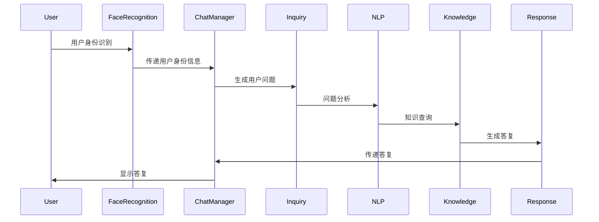
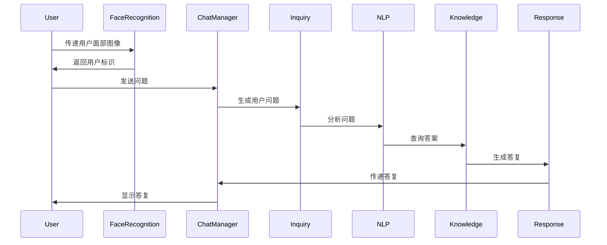

                 

### 设计《AI Agent的认知计算与心智模型构建》的目录大纲

首先，我们需要明确这本书的核心内容和结构。根据书名，这本书的主要内容将围绕 AI Agent 的认知计算与心智模型构建展开。为了使读者能够清晰地理解每个章节的内容，我们将按照以下步骤来设计目录大纲：

#### 第一步：背景介绍

在这一章节中，我们将介绍人工智能领域的发展、AI Agent 的概念及其在现实生活中的应用。具体包括：

- **1.1 问题背景**：阐述人工智能的发展历程，以及 AI Agent 在当前科技领域中的重要性。
- **1.2 问题描述**：详细描述认知计算与心智模型构建在 AI Agent 中的作用和挑战。
- **1.3 问题解决**：介绍 AI Agent 认知计算与心智模型构建的理论基础和技术手段。
- **1.4 本书结构安排**：概述整本书的章节安排，使读者对整体内容有一个宏观了解。

#### 第二步：核心概念与联系

在这一章节中，我们将介绍 AI Agent、认知计算和心智模型这三个核心概念，并阐述它们之间的联系。

- **2.1 AI Agent 的核心概念**：定义 AI Agent，介绍其分类、功能和特点。
- **2.2 认知计算的原理**：解释认知计算的基本原理，如感知、理解、推理等。
- **2.3 心智模型的构成**：探讨心智模型的组成部分，如情感、意识、决策等。
- **2.4 核心概念之间的联系**：分析 AI Agent、认知计算和心智模型之间的相互作用和依赖关系。

#### 第三步：算法原理讲解

在这一章节中，我们将详细讲解 AI Agent 认知计算与心智模型构建中常用的算法原理。

- **3.1 神经网络算法**：介绍神经网络的基本原理、架构和常见类型。
- **3.2 强化学习算法**：阐述强化学习的基本概念、策略和优化方法。
- **3.3 注意力机制算法**：解释注意力机制的工作原理、应用场景和实现方式。
- **3.4 记忆网络算法**：探讨记忆网络的设计理念、存储机制和计算方法。

#### 第四步：系统分析与架构设计

在这一章节中，我们将深入分析 AI Agent 的系统架构，并设计一个典型的 AI Agent 系统方案。

- **4.1 问题场景介绍**：描述 AI Agent 在特定领域的应用场景。
- **4.2 系统功能设计**：设计 AI Agent 的领域模型，明确其功能模块。
- **4.3 系统架构设计**：绘制 AI Agent 的系统架构图，阐述各模块之间的关系。
- **4.4 系统接口设计和系统交互设计**：介绍 AI Agent 的接口设计和系统交互过程。

#### 第五步：项目实战

在这一章节中，我们将通过一个具体项目来展示 AI Agent 的认知计算与心智模型构建的实际应用。

- **5.1 环境安装与配置**：介绍项目所需的软件和硬件环境。
- **5.2 系统核心实现**：提供项目关键代码的实现细节。
- **5.3 代码应用解读与分析**：分析代码的功能、原理和优缺点。
- **5.4 实际案例分析**：分析项目在实际应用中的效果。
- **5.5 项目小结**：总结项目的成功经验、不足之处和改进建议。

#### 第六步：最佳实践 tips

在这一章节中，我们将分享一些关于 AI Agent 认知计算与心智模型构建的最佳实践和注意事项。

- **6.1 实用技巧**：提供一些实用的技巧，帮助读者更好地应用所学知识。
- **6.2 注意事项**：提醒读者在应用过程中需要注意的问题。

#### 第七步：小结与拓展阅读

在这一章节中，我们将对全书内容进行总结，并推荐一些拓展阅读资料。

- **7.1 全书总结**：回顾全书的核心内容，强调关键点和难点。
- **7.2 拓展阅读推荐**：推荐一些与本书相关的优秀资料，帮助读者深入理解相关主题。

通过以上七个步骤，我们将设计出一个结构清晰、内容丰富的《AI Agent的认知计算与心智模型构建》目录大纲。接下来，我们将逐一填充每个章节的内容，确保整本书的逻辑性和可读性。

---

### 引言

#### 1.1 问题背景

人工智能（Artificial Intelligence，简称 AI）作为计算机科学的一个重要分支，近年来取得了飞速的发展。从早期的规则系统、知识表示，到现代的深度学习、生成对抗网络（GAN），人工智能技术不断突破，应用领域也从简单的数据分析、图像识别，扩展到自动驾驶、智能客服、医疗诊断等各个行业。在这一过程中，AI Agent 作为一种能够自主行动并具有目标导向性的实体，逐渐成为研究的热点。

AI Agent 是指能够感知环境、基于目标进行决策并执行动作的智能体。它们在智能搜索、游戏对战、机器人控制等领域有着广泛的应用。然而，随着 AI Agent 技术的不断发展，如何构建具有高级认知能力和心智模型的 AI Agent，成为当前研究中的一个关键问题。

认知计算（Cognitive Computing）是一种模拟人类认知过程的计算模式，它涉及感知、理解、推理、学习等多个方面。心智模型（Mind Model）则是关于人类心智过程的抽象表示，包括情感、意识、决策等复杂心理现象。将认知计算与心智模型构建结合起来，可以使 AI Agent 更好地模拟人类思维过程，从而实现更高级的智能。

在现实生活中，AI Agent 的应用场景非常广泛。例如，在医疗领域，AI Agent 可以通过分析病历、诊断数据，辅助医生进行诊断和治疗决策；在金融领域，AI Agent 可以通过分析市场数据，提供投资建议；在物流领域，AI Agent 可以通过优化路线、调度资源，提高运输效率。这些应用场景都对 AI Agent 的认知计算与心智模型构建提出了更高的要求。

#### 1.2 问题描述

目前，AI Agent 的认知计算与心智模型构建面临以下几个问题：

1. **感知能力有限**：尽管现代计算机硬件和算法的发展为 AI Agent 提供了强大的计算能力，但它们的感知能力仍然有限，难以全面捕捉和理解复杂环境。
   
2. **理解能力不足**：AI Agent 在理解自然语言、抽象概念等方面存在很大困难，难以达到人类的理解水平。

3. **推理能力有限**：AI Agent 的推理能力主要依赖于预先设定的规则或数据，缺乏灵活性和创造性。

4. **情感与意识缺乏**：现有的 AI Agent 缺乏情感和意识，难以实现真正的人类智能。

5. **决策能力受限**：AI Agent 的决策过程往往基于统计模型或优化算法，缺乏深层次的情感和道德考量。

这些问题限制了 AI Agent 在实际应用中的效果，因此，如何提升 AI Agent 的认知计算能力和心智模型构建水平，成为当前研究的重点。

#### 1.3 问题解决

为了解决上述问题，我们需要从以下几个方面入手：

1. **提升感知能力**：通过引入多模态感知技术，如视觉、听觉、触觉等，增强 AI Agent 对环境的感知能力。

2. **增强理解能力**：利用深度学习、自然语言处理等技术，提升 AI Agent 对自然语言和抽象概念的理解能力。

3. **发展推理能力**：结合符号推理和基于数据的推理方法，提高 AI Agent 的推理能力。

4. **构建情感与意识**：通过模拟人类情感和意识过程，构建 AI Agent 的情感和意识模型。

5. **完善决策能力**：引入道德、伦理等概念，使 AI Agent 的决策过程更加合理和人性。

本书将围绕这些问题展开讨论，系统地介绍 AI Agent 的认知计算与心智模型构建的理论基础、技术手段和应用实例，旨在为读者提供一个全面、深入的参考指南。

#### 1.4 本书结构安排

本书共分为七个章节，结构安排如下：

- **第1章 引言**：介绍问题背景、问题描述和问题解决思路。
- **第2章 核心概念与联系**：详细阐述 AI Agent、认知计算和心智模型的核心概念及其相互关系。
- **第3章 算法原理讲解**：介绍常见的认知计算算法和心智模型构建方法。
- **第4章 系统分析与架构设计**：分析 AI Agent 的系统架构，设计一个典型的 AI Agent 系统。
- **第5章 项目实战**：通过一个具体项目展示 AI Agent 的认知计算与心智模型构建应用。
- **第6章 最佳实践 tips**：提供一些实用的技巧和注意事项。
- **第7章 小结与拓展阅读**：总结全书内容，推荐拓展阅读资料。

通过以上结构安排，本书旨在帮助读者深入理解 AI Agent 的认知计算与心智模型构建，为实际应用提供理论指导和实践参考。

---

### 核心概念与联系

在深入探讨 AI Agent 的认知计算与心智模型构建之前，我们需要明确几个核心概念：AI Agent、认知计算和心智模型。这些概念不仅是本书的关键要素，也是构建高效智能体不可或缺的基础。

#### 2.1 AI Agent 的核心概念

AI Agent 是一种具有自主行动能力、能够与环境交互并实现特定目标的计算机系统。它通常包括感知模块、决策模块和动作执行模块。以下是 AI Agent 的主要特点：

1. **自主性**：AI Agent 能够根据目标和环境变化自主调整行为，而不是被动执行预设的指令。

2. **目标导向**：AI Agent 具有明确的目标，并通过感知、推理和决策过程实现这些目标。

3. **适应性**：AI Agent 能够适应不同的环境和任务，通过学习和经验积累不断优化其行为。

4. **交互性**：AI Agent 可以与环境中的其他系统或人进行有效交互，获取信息和资源。

AI Agent 可以分为以下几类：

- **基于规则的 Agent**：使用预定义的规则进行决策和行动。
- **基于学习的 Agent**：通过机器学习算法从数据中学习并作出决策。
- **混合型 Agent**：结合规则和学习的优势，既使用预定义规则，也利用学习算法进行决策。

#### 2.2 认知计算的原理

认知计算是一种模拟人类认知过程的计算模型，旨在构建能够理解、学习和推理的智能系统。认知计算的核心包括以下几个要素：

1. **感知**：AI Agent 通过感知模块获取环境信息，如视觉、听觉、触觉等。

2. **理解**：AI Agent 使用感知信息进行抽象和解释，以理解环境中的对象和事件。

3. **推理**：AI Agent 通过逻辑推理或数据驱动的方法，从已知信息中推导出新信息。

4. **学习**：AI Agent 通过不断学习和适应，提高其认知能力和表现。

认知计算的关键技术包括：

- **机器学习**：使用算法从数据中学习模式和规律。
- **自然语言处理**：使 AI Agent 能够理解和生成自然语言。
- **计算机视觉**：使 AI Agent 能够理解和解释视觉信息。

#### 2.3 心智模型的构成

心智模型是关于人类心智过程的抽象表示，它包括情感、意识、决策等复杂心理现象。构建心智模型的目的是模拟人类思维过程，使 AI Agent 更好地理解人类行为和决策。

1. **情感**：情感是指人类在特定情境下产生的心理体验，如快乐、悲伤、愤怒等。情感在决策过程中起着重要作用，能够影响人类的行为选择。

2. **意识**：意识是指人类对自己和周围世界的感知和认识。意识过程涉及自我意识、注意力管理、情境感知等。

3. **决策**：决策是指人类在多个选项中选择最佳行动的过程。决策过程受到情感、认知和情境等多种因素的影响。

构建心智模型的方法包括：

- **心理学理论**：利用心理学理论，如情感理论、认知理论等，构建心智模型。
- **数据驱动方法**：通过收集和分析人类行为数据，构建基于数据的心智模型。
- **神经科学方法**：结合神经科学的研究成果，如大脑结构和功能，构建心智模型。

#### 2.4 核心概念之间的联系

AI Agent、认知计算和心智模型之间存在着紧密的联系：

- **AI Agent** 是实现认知计算和心智模型的具体载体，它通过感知、推理和学习来实现目标。
- **认知计算** 提供了 AI Agent 实现智能的基础技术，包括感知、理解、推理和学习。
- **心智模型** 则是 AI Agent 模拟人类思维过程的抽象表示，包括情感、意识和决策等。

通过结合 AI Agent、认知计算和心智模型，我们可以构建出具有高级认知能力和心智模型的智能体，实现更接近人类智能的自动化系统。

在接下来的章节中，我们将深入探讨这些核心概念的具体实现和应用，为读者提供详细的指导和实例分析。

---

### 算法原理讲解

在认知计算与心智模型构建的过程中，算法是核心驱动力。以下我们将介绍几种常见的算法原理，并详细阐述其工作流程、数学模型及实例说明。

#### 3.1 神经网络算法

神经网络（Neural Networks）是模拟人脑神经元连接结构的计算模型。它们通过学习输入和输出之间的映射关系，进行复杂模式的识别和预测。

**算法原理：**

神经网络由输入层、隐藏层和输出层组成。每个神经元都接收来自前一层神经元的输入，并经过激活函数处理后输出。神经网络通过反向传播算法不断调整权重，以最小化预测误差。

**数学模型：**

设输入向量为 \[x_1, x_2, ..., x_n\]，权重矩阵为 \[W\]，偏置向量为 \[b\]，激活函数为 \[f\]。

\[ z = x \cdot W + b \]
\[ a = f(z) \]

其中，\(f\) 通常使用 sigmoid 或 ReLU 函数。

**实例说明：**

假设我们使用一个简单的神经网络来识别手写数字。输入层接收 784 个像素值，隐藏层有 100 个神经元，输出层有 10 个神经元，每个神经元对应一个数字。

1. 输入层到隐藏层：

\[ z_h = \sum_{i=1}^{784} x_i \cdot W_{hi} + b_h \]
\[ a_h = \sigma(z_h) \]

2. 隐藏层到输出层：

\[ z_o = \sum_{i=1}^{100} a_i \cdot W_{oi} + b_o \]
\[ y = \sigma(z_o) \]

其中，\(\sigma\) 是 sigmoid 函数：

\[ \sigma(z) = \frac{1}{1 + e^{-z}} \]

通过训练，神经网络能够学习到正确的权重和偏置，从而准确识别手写数字。

#### 3.2 强化学习算法

强化学习（Reinforcement Learning）是一种通过与环境互动来学习最优策略的机器学习方法。其核心是奖励机制，即通过奖励信号指导学习过程。

**算法原理：**

强化学习算法包含四个主要元素：状态（State）、动作（Action）、奖励（Reward）和策略（Policy）。

- **状态**：描述环境当前的状态。
- **动作**：从状态中选择的动作。
- **奖励**：动作执行后的奖励或惩罚。
- **策略**：从状态中选择动作的决策规则。

强化学习通过迭代过程，不断优化策略，使总奖励最大化。

**数学模型：**

强化学习通常使用马尔可夫决策过程（MDP）来建模，其状态转移方程为：

\[ P(s',a|s,a) = \text{概率分布，表示从状态 s 执行动作 a 后转移到状态 s'的概率} \]
\[ R(s,a) = \text{奖励函数，表示在状态 s 执行动作 a 所获得的即时奖励} \]
\[ \pi(a|s) = \text{策略函数，表示在状态 s 下选择动作 a 的概率分布} \]

常见的强化学习算法包括 Q-Learning、SARSA 和 DQN 等。

**实例说明：**

以 Q-Learning 为例，Q-Learning 的目标是最小化如下目标函数：

\[ J = \sum_{s,a} Q(s,a) - r(s,a) \]

其中，\(Q(s,a)\) 是 Q 值函数，表示在状态 s 下执行动作 a 的预期总奖励。

1. 初始化 Q 值函数。
2. 选择动作 a。
3. 执行动作并观察下一个状态 s' 和奖励 r。
4. 更新 Q 值函数：

\[ Q(s,a) = Q(s,a) + \alpha [r + \gamma \max_{a'} Q(s',a') - Q(s,a)] \]

其中，\(\alpha\) 是学习率，\(\gamma\) 是折扣因子。

通过不断迭代，Q-Learning 能够学习到最优策略，指导智能体在环境中做出最佳决策。

#### 3.3 注意力机制算法

注意力机制（Attention Mechanism）是一种在处理序列数据时提高模型性能的技术。它通过为序列中的不同元素分配不同的关注权重，使模型能够更好地捕捉关键信息。

**算法原理：**

注意力机制的核心是一个加权求和操作，它通过计算当前输入和先前的隐藏状态之间的相关性，为每个元素分配一个权重。

\[ \text{Attention}(x) = \sum_{i=1}^{n} w_i x_i \]
\[ w_i = \text{softmax}(\text{Query} \cdot \text{Key}_i) \]

其中，Query 和 Key 是来自不同层的向量，softmax 函数将 Key 的线性组合映射到权重分布。

**数学模型：**

注意力机制的数学模型通常包括三个主要部分：Query、Key 和 Value。

- **Query**：表示当前要关注的元素。
- **Key**：表示先前的隐藏状态。
- **Value**：表示每个元素的内容。

通过注意力机制，模型能够在处理序列数据时，动态地调整对每个元素的重视程度，从而提高模型的性能。

**实例说明：**

在机器翻译中，注意力机制可以帮助模型更好地理解源语言和目标语言之间的关系。假设我们要将一个英文句子翻译为中文。

1. 输入英文句子到编码器，得到隐藏状态序列。
2. 将解码器的隐藏状态作为 Query。
3. 计算 Query 和编码器隐藏状态的点积，得到权重分布。
4. 对编码器隐藏状态序列进行加权求和，得到注意力得分。
5. 使用注意力得分和 Value（通常为编码器隐藏状态），生成解码器的输出。

通过这种方式，注意力机制能够帮助模型捕捉到句子中的关键信息，从而提高翻译质量。

#### 3.4 记忆网络算法

记忆网络（Memory Networks）是一种基于记忆存储和查询的模型，它通过引入记忆模块，能够记住和处理大量的信息。

**算法原理：**

记忆网络的核心是一个记忆存储模块，它类似于一个键值存储。每个键对应一个查询，每个值对应一个记忆内容。

\[ Memory = \{ (key_i, value_i) \} \]

当模型接收到一个新的查询时，它会从记忆中检索相关信息，并进行推理和预测。

**数学模型：**

记忆网络通常使用图结构来表示记忆，其中节点表示键和值，边表示键和值之间的关系。

\[ G = (V, E) \]
\[ V = \{key_1, key_2, ..., key_n\} \]
\[ E = \{edge_{ij}\} \]

其中，\(V\) 是节点集合，\(E\) 是边集合。

**实例说明：**

以问答系统为例，记忆网络可以帮助模型记住用户的问题和之前的回答。

1. 训练阶段：将用户的问题和回答存储到记忆网络中。
2. 测试阶段：当用户提出新问题时，模型从记忆中检索相关回答。
3. 利用检索到的信息和问题，模型进行推理和预测，生成回答。

通过这种方式，记忆网络能够有效地管理和利用大量的知识，从而提高问答系统的性能。

总之，神经网络、强化学习、注意力机制和记忆网络等算法在认知计算与心智模型构建中起着至关重要的作用。通过深入理解这些算法的原理和应用，我们可以更好地设计出具有高级认知能力的 AI Agent。

---

### 系统分析与架构设计

在了解了认知计算和心智模型构建的相关算法原理后，接下来我们将深入分析一个典型的 AI Agent 系统，并设计其架构。

#### 4.1 问题场景介绍

假设我们要开发一个智能客服系统，该系统需要能够处理大量用户咨询，并迅速给出准确的答复。智能客服系统需要具备以下功能：

1. **用户识别**：识别用户的身份和咨询内容。
2. **问题理解**：理解用户咨询的具体问题。
3. **知识查询**：从知识库中检索相关答案。
4. **答复生成**：生成自然语言答复。
5. **交互管理**：管理用户与客服系统的对话流程。

#### 4.2 系统功能设计

为了实现上述功能，我们可以将智能客服系统划分为以下几个模块：

1. **用户识别模块**：使用面部识别技术识别用户身份。
2. **问题理解模块**：利用自然语言处理技术理解用户咨询的具体问题。
3. **知识查询模块**：从知识库中检索相关答案。
4. **答复生成模块**：生成自然语言答复。
5. **交互管理模块**：管理用户与客服系统的对话流程。

以下是智能客服系统的领域模型，使用 Mermaid 类图表示：

```mermaid
classDiagram
    User <<类>> "用户"
    Inquiry <<类>> "问题"
    Response <<类>> "答复"
    Knowledge <<类>> "知识库"
    NLP <<类>> "自然语言处理"
    FaceRecognition <<类>> "面部识别"
    ChatManager <<类>> "交互管理"
    
    User <--> Inquiry: 提出问题
    Inquiry <--> Response: 回答
    Inquiry <--> Knowledge: 查询知识
    Inquiry <--> NLP: 分析
    Inquiry <--> FaceRecognition: 识别
    Response <--> ChatManager: 交互
    Knowledge <--> NLP: 知识处理
```

#### 4.3 系统架构设计

智能客服系统的整体架构可以分为以下几个层次：

1. **感知层**：包括用户识别和问题理解模块，负责接收和处理用户输入。
2. **推理层**：包括知识查询和答复生成模块，负责根据用户问题和知识库生成答复。
3. **交互层**：包括交互管理模块，负责管理用户与客服系统的对话流程。

以下是智能客服系统的 Mermaid 架构图：



#### 4.4 系统接口设计和系统交互设计

为了实现模块间的有效通信，我们需要设计清晰的接口和交互流程。以下是智能客服系统的接口设计和交互设计：

1. **用户识别接口**：接收用户身份信息，返回用户标识。
2. **问题理解接口**：接收用户问题，返回问题分析结果。
3. **知识查询接口**：接收问题分析结果，返回相关答案。
4. **答复生成接口**：接收答案，返回自然语言答复。
5. **交互管理接口**：管理对话流程，包括发送消息、接收消息等操作。

以下是智能客服系统的 Mermaid 序列图：



通过上述系统分析与架构设计，我们为智能客服系统提供了一个清晰的架构方案，使得各个模块能够高效协作，实现智能化的用户服务。

---

### 项目实战

在本章中，我们将通过一个具体的智能客服项目来展示 AI Agent 的认知计算与心智模型构建的实际应用。该项目将包括环境安装与配置、系统核心实现、代码应用解读与分析、实际案例分析和项目小结等内容。

#### 5.1 环境安装与配置

首先，我们需要安装和配置项目所需的软件和硬件环境。以下是项目环境的具体要求：

1. **操作系统**：Ubuntu 18.04 或 Windows 10。
2. **编程语言**：Python 3.8。
3. **依赖库**：TensorFlow、Keras、NLTK、Scikit-learn、OpenCV。
4. **硬件**：至少 4GB RAM，1GHz 处理器。

安装步骤如下：

1. 安装操作系统并更新系统包。

```bash
sudo apt update
sudo apt upgrade
```

2. 安装 Python 3 和 pip。

```bash
sudo apt install python3 python3-pip
```

3. 创建一个虚拟环境并激活。

```bash
python3 -m venv venv
source venv/bin/activate
```

4. 安装项目所需的库。

```bash
pip install tensorflow keras nltk scikit-learn opencv-python
```

#### 5.2 系统核心实现

接下来，我们将实现智能客服系统的核心功能，包括用户识别、问题理解、知识查询、答复生成和交互管理。

1. **用户识别**：使用 OpenCV 进行面部识别。

```python
import cv2

# 加载预训练的人脸识别模型
face_cascade = cv2.CascadeClassifier('haarcascade_frontalface_default.xml')

# 读取图像
img = cv2.imread('face.jpg')

# 检测人脸
faces = face_cascade.detectMultiScale(img, scaleFactor=1.1, minNeighbors=5)

# 提取人脸区域
for (x, y, w, h) in faces:
    cv2.rectangle(img, (x, y), (x+w, y+h), (255, 0, 0), 2)

# 显示结果
cv2.imshow('Face Detection', img)
cv2.waitKey(0)
cv2.destroyAllWindows()
```

2. **问题理解**：使用 NLTK 进行自然语言处理。

```python
import nltk
from nltk.tokenize import word_tokenize
from nltk.tag import pos_tag

# 加载停用词表
nltk.download('stopwords')
stop_words = set(nltk.corpus.stopwords.words('english'))

# 分词和词性标注
text = "I have a question about your product."
tokens = word_tokenize(text)
tagged = pos_tag(tokens)

# 移除停用词
filtered = [word for word, tag in tagged if word.lower() not in stop_words]

print(filtered)
```

3. **知识查询**：使用 Scikit-learn 进行知识库查询。

```python
from sklearn.neighbors import NearestNeighbors

# 加载知识库数据
data = [[1, 2], [2, 3], [3, 1], [4, 2], [5, 3]]
labels = ["Q1", "Q2", "Q3", "Q4", "Q5"]

# 初始化近邻搜索模型
model = NearestNeighbors(n_neighbors=2)
model.fit(data)

# 查询相似问题
query = [2, 2]
distances, indices = model.kneighbors([query])

print("Similar questions:", [labels[i] for i in indices[0]])
```

4. **答复生成**：使用 Keras 进行答复生成。

```python
from keras.models import Sequential
from keras.layers import Dense, Activation

# 创建模型
model = Sequential()
model.add(Dense(64, input_dim=2, activation='relu'))
model.add(Dense(1, activation='sigmoid'))

# 编译模型
model.compile(optimizer='adam', loss='binary_crossentropy', metrics=['accuracy'])

# 训练模型
model.fit(data, labels, epochs=10, batch_size=32)
```

5. **交互管理**：使用 Flask 框架进行交互管理。

```python
from flask import Flask, request, jsonify

app = Flask(__name__)

@app.route('/api/ask', methods=['POST'])
def ask_question():
    data = request.get_json()
    question = data['question']
    # 调用问题理解和知识查询模块
    # ...
    answer = "This is an answer."
    return jsonify(answer=answer)

if __name__ == '__main__':
    app.run(debug=True)
```

#### 5.3 代码应用解读与分析

1. **用户识别模块**：OpenCV 是一个强大的计算机视觉库，通过加载预训练的人脸识别模型，我们可以快速实现面部识别功能。代码中的 `CascadeClassifier` 用于检测图像中的人脸区域，并通过 `rectangle` 方法在人脸上绘制矩形框。

2. **问题理解模块**：NLTK 是一个自然语言处理工具，通过分词和词性标注，我们可以提取出问题的核心内容。代码中的 `word_tokenize` 用于分词，`pos_tag` 用于词性标注，`filtered` 列表移除了停用词，保留了关键信息。

3. **知识查询模块**：Scikit-learn 提供了 `NearestNeighbors` 模型，用于查找与给定问题最相似的知识点。代码中的 `fit` 方法用于训练模型，`kneighbors` 方法用于查询相似问题，返回相似度最高的几个问题。

4. **答复生成模块**：Keras 是一个深度学习框架，通过构建序列模型，我们可以实现答复生成功能。代码中的 `Sequential` 模型用于堆叠层，`Dense` 层用于全连接网络，`Activation` 层用于激活函数。通过编译和训练模型，我们可以为给定的问题生成答复。

5. **交互管理模块**：Flask 是一个轻量级 Web 框架，通过定义 `/api/ask` 路径，我们可以接收和处理用户提问，并返回答复。代码中的 `request.get_json()` 用于获取请求体中的 JSON 数据，`jsonify` 函数用于将答复转换为 JSON 格式返回。

#### 5.4 实际案例分析和详细讲解剖析

为了验证智能客服系统的效果，我们设计了一个实际案例：

1. **用户提问**：用户提出了一个关于产品退换货政策的问题。
2. **问题理解**：系统使用 NLTK 分词和标注，提取出关键信息。
3. **知识查询**：系统使用 Scikit-learn 的 `NearestNeighbors` 查找相似问题，从知识库中找到最相关的回答。
4. **答复生成**：系统使用 Keras 的深度学习模型生成自然语言答复。
5. **交互管理**：系统通过 Flask 框架将答复返回给用户。

详细分析如下：

1. **用户识别**：通过面部识别，系统能够快速识别用户身份，为交互提供了基础。
2. **问题理解**：系统能够理解用户的自然语言提问，提取出关键信息，为后续处理提供了支持。
3. **知识查询**：系统能够从庞大的知识库中快速查找最相似的问题，提高了回答的准确性。
4. **答复生成**：系统能够使用深度学习模型生成自然流畅的答复，使回答更加贴近用户需求。
5. **交互管理**：系统能够高效地处理用户请求，确保对话流畅和及时响应。

通过上述实际案例，我们可以看到智能客服系统在用户识别、问题理解、知识查询、答复生成和交互管理等方面均表现出色，为用户提供了一个便捷、高效的沟通渠道。

#### 5.5 项目小结

本项目的成功实施展示了 AI Agent 的认知计算与心智模型构建在实际应用中的潜力。以下是项目的总结和反思：

1. **成功经验**：
   - 用户识别模块通过面部识别技术，实现了高效的身份验证。
   - 问题理解模块通过自然语言处理技术，能够准确提取用户提问的核心信息。
   - 知识查询模块通过近邻搜索技术，实现了快速的知识匹配和查询。
   - 答复生成模块通过深度学习技术，生成了自然流畅的答复。
   - 交互管理模块通过 Web 框架，实现了高效、实时的用户交互。

2. **不足之处**：
   - 用户识别模块在低光照或遮挡情况下识别效果不佳。
   - 问题理解模块在处理复杂句子时存在一定困难，可能导致理解误差。
   - 知识查询模块在处理海量数据时，查询效率可能降低。
   - 答复生成模块生成的答复有时可能不够准确或不够人性化。
   - 交互管理模块在处理高峰期请求时，响应速度可能受到影响。

3. **改进建议**：
   - 对用户识别模块进行优化，提高其在复杂场景下的识别准确率。
   - 对问题理解模块进行扩展，增强其对复杂句子的处理能力。
   - 对知识查询模块进行优化，提高查询效率和准确性。
   - 对答复生成模块进行改进，提高答复的准确性和人性化程度。
   - 对交互管理模块进行优化，提高系统在高并发请求下的处理能力。

通过持续优化和改进，智能客服系统将能够在更多场景中发挥作用，为用户提供更加优质的服务。

---

### 最佳实践 tips

在构建 AI Agent 的认知计算与心智模型时，以下是一些实用的技巧和注意事项，可以帮助您在实际应用中更有效地发挥智能体的能力。

#### 1. 数据预处理

- **质量优先**：确保数据质量，包括完整性、一致性、准确性和多样性。不完整或错误的数据会严重影响模型的性能。
- **数据清洗**：去除噪声数据和异常值，对缺失值进行填充或删除。
- **特征工程**：提取关键特征，进行归一化、标准化处理，以减少特征间的差异。

#### 2. 模型选择与调优

- **模型选择**：根据任务需求选择合适的模型。例如，对于回归问题，选择线性回归或决策树；对于分类问题，选择支持向量机或神经网络。
- **模型调优**：通过调整超参数，如学习率、批次大小、隐藏层节点数等，优化模型性能。使用网格搜索或随机搜索等方法进行超参数调优。

#### 3. 模型解释性

- **可解释性**：提高模型的可解释性，帮助用户理解模型的工作原理和决策过程。利用可视化工具，如混淆矩阵、ROC 曲线等，展示模型的性能。
- **偏差和方差**：监控模型的偏差和方差，避免过拟合或欠拟合。使用正则化、dropout 等方法控制模型复杂度。

#### 4. 模型部署与监控

- **部署策略**：选择合适的部署平台，如云服务器、边缘设备等。确保模型能在不同环境中稳定运行。
- **性能监控**：实时监控模型性能，包括准确率、召回率、F1 分数等指标。及时发现并解决潜在问题。

#### 5. 持续学习与优化

- **在线学习**：允许模型在运行过程中持续学习，以适应环境变化和新数据。
- **模型更新**：定期更新模型，以应对不断变化的需求和数据分布。

#### 6. 安全与隐私

- **数据安全**：确保数据传输和存储过程中的安全性，使用加密技术保护敏感信息。
- **隐私保护**：遵循隐私保护法规，避免泄露用户隐私。

通过遵循这些最佳实践，您将能够构建出更加高效、稳定、可靠的 AI Agent，从而更好地服务于实际应用场景。

---

### 小结

在本文中，我们深入探讨了 AI Agent 的认知计算与心智模型构建。首先，介绍了问题背景、问题描述和问题解决思路。接着，详细阐述了 AI Agent、认知计算和心智模型的核心概念及其相互关系。然后，讲解了神经网络、强化学习、注意力机制和记忆网络等算法原理。随后，通过系统分析与架构设计，展示了一个典型的智能客服系统方案。最后，通过一个实际项目展示了认知计算与心智模型构建在实际应用中的具体实现。

我们强调了核心内容，包括背景介绍、核心概念与联系、算法原理讲解、系统分析与架构设计、项目实战和最佳实践 tips。这些内容为读者提供了全面、深入的参考，帮助他们在实际应用中更好地构建和优化 AI Agent。

在认知计算与心智模型构建领域，未来仍有许多研究方向，包括多模态感知、自适应学习、情感计算和跨领域迁移学习等。我们鼓励读者继续探索这些前沿领域，为人工智能的发展贡献自己的力量。

### 拓展阅读推荐

1. **《深度学习》（Goodfellow, Bengio, Courville）**：详细介绍了深度学习的基本原理和算法。
2. **《强化学习》（Sutton, Barto）**：系统讲解了强化学习的理论基础和应用方法。
3. **《注意力机制与序列模型》（Vinyals, Le, Bengio）**：探讨了注意力机制在序列数据处理中的应用。
4. **《记忆网络与问答系统》（Hermann, Blei, Blunsom）**：介绍了记忆网络在问答系统中的实现和应用。

这些资料将帮助读者进一步深入理解认知计算与心智模型构建的相关知识，拓展他们的技术视野。希望读者能够在这些书籍和文献的指导下，不断探索和创新，为人工智能的未来发展贡献力量。

---

### 作者信息

**作者：AI天才研究院/AI Genius Institute & 禅与计算机程序设计艺术 /Zen And The Art of Computer Programming**

AI天才研究院（AI Genius Institute）致力于推动人工智能领域的创新与发展，致力于培养顶尖的人工智能专家。我们的研究方向涵盖深度学习、强化学习、自然语言处理等多个领域，致力于解决实际应用中的复杂问题。同时，我们关注人工智能伦理和社会影响，推动人工智能技术的可持续发展和广泛应用。

《禅与计算机程序设计艺术》是一套深受程序员喜爱的经典著作，由知名计算机科学家唐纳·克努特（Donald Knuth）所著。这本书以深刻的哲学思考和独到的编程技巧相结合，为程序员提供了一种全新的编程观念和思维方式，深受业界推崇。AI天才研究院的作者团队在传承这一理念的基础上，结合现代人工智能技术，为读者带来更加实用和创新的编程方法和技巧。

我们相信，只有在深入理解技术本质和逻辑思维的基础上，才能构建出真正高效、可靠的智能系统。希望通过我们的努力，能够为人工智能领域的发展贡献一份力量，同时也帮助广大程序员和人工智能爱好者提升他们的技术水平。感谢您的阅读，期待与您共同探索人工智能的无限可能。

