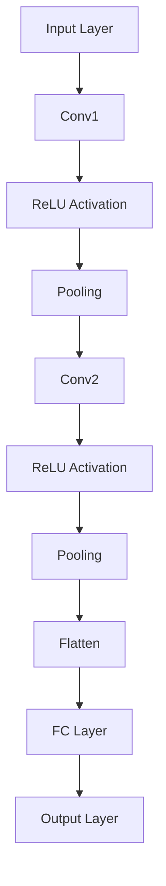
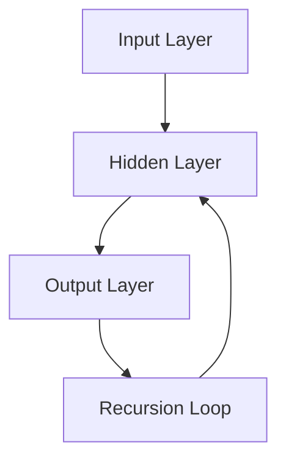
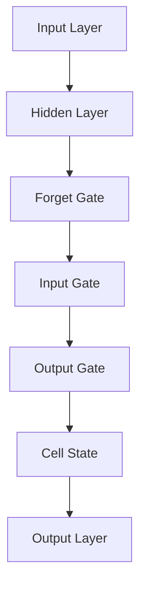
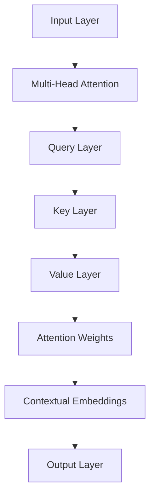
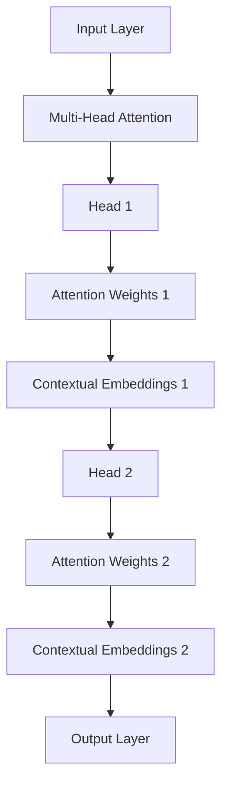

                 

## 引言

### 文章标题：AI Agent的语义理解：提升LLM的深层文本分析

在当今数字化和智能化的时代，人工智能（AI）技术已经成为推动社会进步和产业变革的重要力量。自然语言处理（NLP）作为AI的核心应用领域之一，正日益成为研究者和产业界关注的焦点。语义理解作为NLP的关键环节，对于提升AI Agent的智能水平和实际应用效果具有重要意义。

本文旨在深入探讨AI Agent在语义理解方面的研究与应用，重点分析提升大型语言模型（LLM）深层文本分析能力的关键方法与技术。文章结构如下：

- **第一部分：背景与核心概念**：介绍AI Agent与语义理解的基本概念，并详细阐述语义理解的层次结构。
- **第二部分：提升LLM语义理解的算法与技巧**：从传统算法到深度学习方法，系统梳理提升LLM语义理解的技术路径。
- **第三部分：提升LLM语义理解的实际应用**：通过具体案例，展示AI Agent在自然语言理解中的实际应用。
- **第四部分：深度学习与语义理解的未来发展趋势**：展望语义理解的挑战与机遇，探讨未来发展趋势。

通过以上四个部分的探讨，本文希望为读者提供一个全面而深入的AI Agent语义理解分析框架，助力读者更好地理解和应用相关技术。

### 关键词

- AI Agent
- 语义理解
- 大型语言模型（LLM）
- 深层文本分析
- 自然语言处理（NLP）
- 深度学习方法
- 注意力机制
- 预训练与微调技术

### 摘要

本文首先介绍了AI Agent与语义理解的基本概念及其重要性。随后，文章深入分析了语义理解的层次结构，包括字面意义、上下文、情感分析和隐含意义理解。接着，文章从传统算法和深度学习方法两个方面，详细探讨了提升LLM语义理解的技术路径，涵盖了词嵌入、语法分析、依存句法分析、注意力机制、预训练与微调技术等。最后，文章通过具体应用案例展示了AI Agent在自然语言理解中的实际效果，并展望了语义理解的未来发展趋势。本文旨在为读者提供一个全面、系统的语义理解提升方案，以应对NLP领域的挑战和机遇。

## 第一部分：背景与核心概念

### 第1章：AI Agent与语义理解的简介

#### 1.1 AI Agent的基本概念

AI Agent，即人工智能代理，是指一种能够在复杂环境中自主决策、执行任务并适应新情况的计算机程序。AI Agent的基本定义可以概括为：具备感知、推理、学习、规划与执行能力的智能体，能够通过与环境的交互实现目标。AI Agent的核心在于其自主性和智能性，这使得它们在许多应用场景中表现出色，如智能客服、自动驾驶、医疗诊断等。

AI Agent的主要特点包括：

1. **自主性**：AI Agent能够自主进行决策和执行任务，无需人工干预。
2. **适应性**：AI Agent能够根据环境变化调整其行为策略，提高任务完成率。
3. **智能性**：AI Agent具备一定的推理和学习能力，能够在复杂场景中表现优异。
4. **交互性**：AI Agent能够与人类或其他系统进行自然语言交互，提高用户体验。

AI Agent在自然语言处理（NLP）中的应用非常广泛。一方面，AI Agent可以用于文本生成、情感分析、信息提取等任务，提高NLP系统的智能化水平。另一方面，AI Agent通过理解自然语言，可以更好地与人类用户进行交互，提供个性化服务和解决方案。例如，在智能客服系统中，AI Agent可以通过语义理解与用户进行对话，自动解答常见问题，提高服务效率；在自动驾驶系统中，AI Agent通过理解交通标志和道路情况，实现自主驾驶。

#### 1.2 语义理解的必要性

语义理解是指计算机对文本内容所表达的实际意义进行理解和解释的过程。自然语言是人类交流的主要工具，然而，自然语言的复杂性和多样性使得计算机对文本的准确理解成为一大挑战。语义理解的必要性主要体现在以下几个方面：

1. **提高NLP系统的准确性**：语义理解能够帮助计算机准确理解文本内容，从而提高NLP系统的准确性和可靠性。
2. **实现更自然的交互**：通过语义理解，计算机能够更好地理解用户的意图和需求，实现更自然、流畅的交互。
3. **丰富应用场景**：语义理解使得计算机能够处理更多类型的任务，如问答系统、情感分析、文本摘要等，拓宽NLP的应用领域。
4. **提升AI Agent的智能水平**：语义理解是AI Agent实现智能决策和任务执行的基础，只有准确理解文本，AI Agent才能更好地服务于各种应用场景。

#### 1.3 语言模型（LLM）概述

语言模型（LLM，Large Language Model）是一种能够理解和生成自然语言的复杂模型。LLM的核心在于其强大的文本生成和语义理解能力，这使得它们在许多NLP任务中表现出色。LLM的基本原理是通过学习大量文本数据，建立文本之间的概率分布模型，从而实现对未知文本的生成和解释。

LLM的主要特点包括：

1. **大规模**：LLM通常由数十亿甚至千亿级别的参数组成，能够处理大量的文本数据。
2. **深度学习**：LLM基于深度学习技术，通过多层神经网络对文本进行建模，提高语义理解能力。
3. **自适应**：LLM能够根据不同的应用场景和任务需求进行自适应调整，实现更好的性能。
4. **多语言**：许多LLM支持多种语言，能够处理不同语言之间的语义转换。

LLM的类型和特点可以分为以下几类：

1. **预训练语言模型**：如BERT、GPT，通过预训练和微调实现强大的语义理解能力。
2. **任务特定语言模型**：根据特定任务进行训练，如问答系统中的OpenAI's InstructBERT，实现特定任务的高效解决。
3. **跨语言语言模型**：如mBERT、XLM，能够处理多种语言的语义理解任务。

#### 1.4 语义理解的层次结构

语义理解是一个多层次的过程，涉及不同层面的文本分析。以下是语义理解的几个主要层次：

1. **字面意义理解**：这是语义理解的基础层次，主要关注单词和短语的表面含义，不涉及上下文和深层含义。例如，“狗”指的是一种动物。
   
2. **上下文理解**：在了解字面意义的基础上，上下文理解能够更好地把握句子的实际含义。上下文可以是句子内部的语境，也可以是更广泛的语言环境。例如，“狗”在不同的语境下可能指的是不同的对象，如宠物狗或军犬。

3. **情感分析**：情感分析关注文本中表达的情感色彩，如积极、消极或中性。通过对情感的分析，可以更好地理解用户的情绪和意图。

4. **隐含意义理解**：隐含意义理解是指识别文本中未明确表达但隐含的信息。这种层次的理解通常需要更高的语义分析和推理能力。

语义理解的层次结构不仅有助于我们理解文本，还直接影响AI Agent的决策和任务执行。只有准确理解文本的各个层次，AI Agent才能更好地应对复杂的应用场景。

### 结论

通过对AI Agent与语义理解的基本概念、必要性以及LLM的概述，我们可以看出，语义理解在AI Agent中的应用具有重要意义。接下来，本文将深入探讨提升LLM语义理解的各种算法与技巧，为AI Agent在自然语言处理中的广泛应用提供有力支持。

## 第二部分：提升LLM语义理解的算法与技巧

### 第2章：传统算法对语义理解的支持

在自然语言处理中，语义理解是一个复杂且关键的任务。尽管深度学习方法在近年来取得了显著的进展，但传统算法仍然在语义理解中发挥着重要作用。传统算法主要包括词嵌入技术、语法分析和句法解析、以及依存句法分析。本章节将详细探讨这些传统算法在语义理解中的支持与贡献。

#### 2.1 词嵌入技术

词嵌入（Word Embedding）是将词汇映射为高维向量空间的一种技术。通过这种方式，词语的语义信息被编码到向量中，使得计算机能够更好地理解词汇之间的相似性和关联性。词嵌入技术的核心思想是将具有相似语义的词语映射到接近的向量空间，而具有不同语义的词语则映射到远离的向量空间。

词嵌入技术对语义理解的影响主要体现在以下几个方面：

1. **语义相似性**：通过词嵌入，可以直观地比较词语的相似性。例如，向量计算可以显示“狗”和“猫”之间的相似性高于“狗”和“苹果”之间的相似性。

2. **文本分类**：在文本分类任务中，词嵌入技术有助于将文本转化为向量表示，从而进行高效的分类。

3. **文本生成**：词嵌入技术可以为文本生成提供丰富的语义信息，使得生成的文本更加自然和连贯。

常见的词嵌入技术包括：

1. **分布式假设**：将词语映射为高维向量，这些向量在语义上具有可解释性。

2. **Word2Vec**：基于神经网络的方法，通过优化损失函数来训练词向量。

3. **GloVe（Global Vectors for Word Representation）**：通过矩阵分解的方法，将词频和词义关联起来，生成高质量的词向量。

#### 2.2 语法分析与句法解析

语法分析（Syntactic Parsing）是指分析文本中的句法结构，识别句子的成分和关系。句法解析（Syntactic Parsing）则是更详细地分析句子的构成，包括词法、句法和语义层面的关系。语法分析和句法解析对于理解文本的结构和逻辑具有重要意义。

语法分析和句法解析的基本方法包括：

1. **规则方法**：通过预定义的语法规则来分析文本。这种方法简单直观，但难以处理复杂的语言结构。

2. **统计方法**：使用统计学方法，如条件概率模型和隐马尔可夫模型（HMM），来分析文本的句法结构。这种方法能够处理更复杂的语言现象，但需要大量标注数据。

3. **深度学习方法**：使用神经网络，特别是递归神经网络（RNN）和转换器（Transformer）模型，来学习句法结构。这种方法能够自动提取特征，处理复杂的语言现象。

语法分析和句法解析对语义理解的重要性体现在以下几个方面：

1. **上下文理解**：通过分析句子的结构，可以更好地理解词语在句子中的含义和作用，从而提高上下文理解的准确性。

2. **文本生成**：在文本生成任务中，语法分析和句法解析能够帮助生成符合语法规则的句子，提高文本的质量。

3. **机器翻译**：在机器翻译中，语法分析和句法解析有助于识别源语言的句法结构，从而生成更准确的翻译结果。

#### 2.3 依存句法分析

依存句法分析（Dependency Parsing）是一种分析句子中词语之间的依存关系的语义分析方法。在依存句法分析中，每个词语都被视为一个依存成分，与其他词语之间形成依存关系。这种关系可以是支配关系、修饰关系等，反映了词语在句子中的功能。

依存句法分析的基本概念包括：

1. **依存关系**：表示词语之间的语义关联。例如，“她喜欢读书”中，“她”是主语，“喜欢”是谓语，“读书”是宾语。

2. **依存树**：表示句子中词语之间依存关系的树形结构。每个节点表示一个词语，边表示词语之间的依存关系。

依存句法分析对语义理解的应用包括：

1. **信息提取**：通过依存句法分析，可以自动提取文本中的关键信息，如人名、地名、事件等。

2. **语义角色标注**：通过依存句法分析，可以识别句子中的各种语义角色，如主语、谓语、宾语等，从而更准确地理解句子的语义。

3. **机器翻译**：在机器翻译中，依存句法分析有助于理解源语言的句法结构，从而生成更准确的翻译结果。

### 结论

通过本章节的探讨，我们可以看到，传统算法在语义理解中发挥着重要作用。词嵌入技术为语义表示提供了丰富的语义信息，语法分析和句法解析帮助理解文本的结构和逻辑，而依存句法分析则深入挖掘句子中词语之间的语义关系。这些传统算法为提升LLM语义理解提供了坚实的基础，为后续章节的深入探讨奠定了基础。

### 第3章：深度学习方法在语义理解中的应用

随着深度学习技术的迅速发展，其在自然语言处理（NLP）领域中的应用也越来越广泛。深度学习方法通过多层次的特征提取和表示学习，大大提升了语言模型的语义理解能力。本章节将详细探讨深度学习在语义理解中的应用，主要包括卷积神经网络（CNN）、循环神经网络（RNN）和长短时记忆网络（LSTM）与门控循环单元（GRU）。

#### 3.1 卷积神经网络（CNN）在语义理解中的应用

卷积神经网络（CNN）最初主要用于图像处理，其核心思想是通过卷积操作提取图像的特征。然而，随着模型结构的改进和优化，CNN也逐渐应用于自然语言处理领域，并在语义理解任务中表现出色。

CNN在语义理解中的应用主要体现在以下几个方面：

1. **文本分类**：通过将文本表示为向量序列，CNN可以有效地提取文本中的局部特征，从而实现文本分类任务。例如，将文本中的每个单词映射为一个高维向量，然后使用CNN提取单词间的上下文信息，从而提高分类的准确性。

2. **情感分析**：情感分析是一个重要的语义理解任务，CNN通过分析文本中的情感词汇和情感表达模式，可以有效地识别文本的情感倾向。例如，在产品评论分类任务中，CNN可以识别出正面或负面的评论。

3. **词向量表示**：通过CNN，可以将单词映射为高维向量，这些向量在语义上具有可解释性，可以用于各种语义理解任务。例如，通过比较单词的向量表示，可以直观地了解单词的语义相似性。

CNN的工作原理主要包括以下几个步骤：

1. **卷积操作**：通过卷积核在文本序列上滑动，提取局部特征。每个卷积核可以提取不同类型的特征，例如词性、词频等。

2. **池化操作**：通过池化操作，降低特征图的维度，减少参数数量，提高模型的泛化能力。

3. **全连接层**：将池化后的特征图通过全连接层进行分类或回归。

一个简单的CNN模型架构图如下所示：



#### 3.2 循环神经网络（RNN）在语义理解中的应用

循环神经网络（RNN）是一种能够处理序列数据的神经网络，其核心思想是通过循环结构保持对历史信息的记忆。RNN在自然语言处理领域有广泛的应用，尤其是在语义理解任务中，如语言模型、机器翻译和文本生成等。

RNN在语义理解中的应用主要体现在以下几个方面：

1. **语言模型**：RNN通过学习文本序列的概率分布，可以生成高质量的文本。例如，在文本生成任务中，RNN可以基于前文生成后续的文本。

2. **机器翻译**：RNN可以将源语言的文本序列映射为目标语言的文本序列，实现机器翻译。例如，在英语到法语的翻译中，RNN可以基于输入的英语句子生成对应的法语句子。

3. **文本分类**：RNN通过学习文本序列的表示，可以实现文本分类任务。例如，在情感分析任务中，RNN可以识别出文本的积极或消极情感。

RNN的工作原理主要包括以下几个步骤：

1. **输入层**：输入文本序列，每个单词被映射为一个高维向量。

2. **隐藏层**：通过递归操作，将当前单词的表示与历史信息结合，生成当前隐藏状态。

3. **输出层**：将隐藏状态通过激活函数映射为输出，如概率分布或类别标签。

一个简单的RNN模型架构图如下所示：



#### 3.3 长短时记忆网络（LSTM）与门控循环单元（GRU）

LSTM（Long Short-Term Memory）和GRU（Gated Recurrent Unit）是RNN的改进版本，旨在解决传统RNN在处理长序列数据时的梯度消失和梯度爆炸问题。LSTM和GRU通过引入门控机制，有效地捕捉了长期依赖关系，提高了模型的性能。

LSTM和GRU的主要区别在于它们的内部结构，但它们的核心思想是类似的：

1. **遗忘门**：通过遗忘门，模型可以决定哪些历史信息需要被遗忘，从而防止梯度消失。

2. **输入门**：通过输入门，模型可以决定哪些新的信息需要被保留，从而避免信息过载。

3. **输出门**：通过输出门，模型可以决定哪些信息需要被输出，从而实现预测。

LSTM和GRU的工作原理主要包括以下几个步骤：

1. **输入层**：输入文本序列，每个单词被映射为一个高维向量。

2. **隐藏层**：通过门控机制，结合遗忘门、输入门和输出门，更新当前隐藏状态。

3. **输出层**：将隐藏状态通过激活函数映射为输出。

一个简单的LSTM模型架构图如下所示：



LSTM和GRU在语义理解中的应用与RNN类似，但由于其更好的性能，在实际任务中得到了更广泛的应用。

### 结论

通过本章节的探讨，我们可以看到深度学习方法在语义理解中的广泛应用和显著优势。CNN通过卷积操作提取文本的局部特征，RNN和LSTM通过递归结构捕捉文本的长期依赖关系，而GRU则是LSTM的简化版本，具有更高效的计算。这些深度学习模型在语义理解任务中表现出色，为AI Agent提供了强大的语义理解能力。下一章节，我们将继续探讨注意力机制与自注意力模型在语义理解中的应用。

### 第4章：注意力机制与自注意力模型

在深度学习领域，注意力机制（Attention Mechanism）是一项重要的技术突破，极大地提升了模型的语义理解能力。注意力机制的核心思想是让模型在处理文本时，能够自动关注重要的信息，从而提高任务的表现。本章将详细探讨注意力机制的基本概念、自注意力模型及其在语义理解中的应用。

#### 4.1 注意力机制的基本概念

注意力机制最早应用于机器翻译和图像识别等领域，目的是让模型在处理复杂任务时，能够聚焦于关键信息，从而提高模型的性能。注意力机制的基本概念可以概括为以下几点：

1. **位置权重**：注意力机制通过计算输入序列中每个元素的位置权重，从而确定模型在处理每个元素时的重要性。位置权重通常通过一个权重函数计算得到，如点积、缩放点积等。

2. **上下文表示**：注意力机制能够生成一个上下文表示，该表示综合了输入序列中所有元素的信息，用于模型的后续处理。

3. **自适应**：注意力机制能够自适应地调整位置权重，使得模型在不同的任务和应用场景中都能表现出良好的性能。

注意力机制的优势主要体现在以下几个方面：

1. **提高模型性能**：注意力机制能够关注关键信息，从而提高模型的准确性和鲁棒性。

2. **减少计算复杂度**：与传统方法相比，注意力机制减少了冗余的计算，提高了模型的计算效率。

3. **解释性**：注意力机制使得模型的可解释性增强，能够直观地展示模型关注的信息。

#### 4.2 自注意力模型（Self-Attention）

自注意力模型（Self-Attention）是一种特殊的注意力机制，主要用于处理序列数据。自注意力模型的核心思想是，让模型在处理输入序列时，能够自动计算序列中每个元素之间的关系。自注意力模型分为以下几种类型：

1. **简单自注意力**：简单自注意力模型通过计算序列中每个元素与其他元素之间的点积，生成位置权重。然后，将这些权重与输入序列的元素相乘，生成上下文表示。

2. **多头自注意力**：多头自注意力模型（Multi-Head Attention）在简单自注意力的基础上，引入多个独立的自注意力头，每个头关注输入序列的不同部分。多头自注意力模型能够更好地捕捉序列中的复杂关系。

3. **变换自注意力**：变换自注意力模型（Transformed Self-Attention）通过变换输入序列和权重矩阵，生成新的上下文表示。这种模型在处理长序列数据时表现出色，能够有效减少梯度消失问题。

自注意力模型的工作原理可以概括为以下几个步骤：

1. **输入序列表示**：将输入序列（如单词或字符）映射为高维向量。

2. **计算自注意力权重**：通过点积或缩放点积的方式，计算输入序列中每个元素与其他元素之间的注意力权重。

3. **生成上下文表示**：将注意力权重与输入序列的元素相乘，生成新的上下文表示。

4. **聚合上下文表示**：将多个上下文表示聚合为一个最终的输出。

一个简单的多头自注意力模型架构图如下所示：



#### 4.3 多头注意力机制（Multi-Head Attention）

多头注意力机制是一种增强自注意力模型的方法，通过引入多个独立的注意力头，每个头关注输入序列的不同部分。多头注意力机制的核心思想是，通过多个注意力头捕捉输入序列的更多信息，从而提高模型的性能。

多头注意力机制的工作原理可以概括为以下几个步骤：

1. **分裂输入序列**：将输入序列映射为多个独立的向量序列，每个向量序列对应一个注意力头。

2. **独立计算注意力权重**：对于每个注意力头，独立计算输入序列中每个元素与其他元素之间的注意力权重。

3. **聚合注意力结果**：将多个注意力头的输出聚合为一个最终的输出。

多头注意力机制的优势主要体现在以下几个方面：

1. **捕获更复杂的关系**：通过多个注意力头，模型能够更好地捕捉输入序列中的复杂关系，从而提高语义理解能力。

2. **减少参数数量**：与单个注意力头相比，多头注意力机制能够减少参数数量，提高模型的计算效率。

3. **提升泛化能力**：多头注意力机制能够提高模型的泛化能力，使得模型在不同任务和应用场景中都能表现出良好的性能。

一个简单的多头注意力模型架构图如下所示：



#### 4.4 自注意力模型在语义理解中的应用

自注意力模型在语义理解任务中表现出色，能够显著提高模型的性能。以下是一些具体的例子：

1. **文本分类**：通过自注意力模型，可以更好地捕捉文本中的关键信息，从而提高文本分类的准确率。例如，在情感分析任务中，自注意力模型可以关注情感词汇，提高情感分类的准确性。

2. **机器翻译**：自注意力模型可以捕捉输入和输出语言之间的复杂关系，从而提高翻译的准确性和流畅度。例如，在英语到法语的翻译中，自注意力模型可以关注源语言和目标语言之间的对应关系，提高翻译质量。

3. **文本生成**：自注意力模型可以生成高质量的文本，通过捕捉输入序列的上下文信息，生成连贯、自然的文本。例如，在生成文本摘要任务中，自注意力模型可以提取关键信息，生成简洁、准确的摘要。

#### 4.5 自注意力模型的挑战与优化方法

尽管自注意力模型在语义理解任务中表现出色，但也面临一些挑战和优化问题：

1. **计算复杂度**：自注意力模型的计算复杂度较高，尤其是在处理长序列时，计算资源消耗较大。为了降低计算复杂度，可以采用一些优化方法，如并行计算、内存优化等。

2. **参数数量**：自注意力模型通常具有大量的参数，这可能导致模型训练时间较长。为了减少参数数量，可以采用一些压缩技术，如知识蒸馏、稀疏性优化等。

3. **梯度消失和梯度爆炸**：在训练自注意力模型时，可能会遇到梯度消失和梯度爆炸问题。为了解决这些问题，可以采用一些梯度优化方法，如梯度裁剪、自适应学习率等。

通过本章节的探讨，我们可以看到注意力机制和自注意力模型在语义理解中的重要性。这些模型通过自动关注关键信息，提高了模型的语义理解能力，为AI Agent提供了强大的支持。下一章节，我们将继续探讨预训练与微调技术，进一步优化LLM的语义理解能力。

### 第5章：预训练与微调技术

预训练（Pre-training）和微调（Fine-tuning）是近年来在自然语言处理（NLP）领域取得的重要进展，它们通过在大量无标签数据上进行预训练，然后在小规模有标签数据上进行微调，大大提高了语言模型的性能和泛化能力。本章节将详细探讨预训练和微调技术的基本概念、实现方法及其对语义理解能力的提升。

#### 5.1 预训练技术概述

预训练技术是指在大规模无标签文本数据上进行深度神经网络模型的训练，以提取通用语言特征。预训练模型通常具有数十亿甚至千亿级别的参数，能够捕捉丰富的语言知识和语义信息。预训练的主要目标是通过无监督学习，让模型在多种NLP任务上表现出色。

预训练的方法主要包括以下几种：

1. **语言模型预训练**：最常见的方法是使用大量文本数据训练一个大规模语言模型，如BERT、GPT等。这些模型通过学习文本的统计规律和语义信息，能够生成高质量的文本表示。

2. **掩码语言模型（Masked Language Model, MLM）**：在训练过程中，随机掩码输入文本中的部分单词或子词，然后预测这些掩码部分的内容。这种技术有助于模型学习单词之间的相互关系和上下文信息。

3. **生成式预训练**：生成式预训练方法，如GPT，通过生成文本序列来学习语言的生成能力。这些模型通过最大化上下文信息的概率分布，能够生成连贯、自然的文本。

预训练的优点主要体现在以下几个方面：

1. **共享表示**：预训练模型能够提取通用的语言特征，这些特征可以共享到多种NLP任务中，提高任务的表现。

2. **减少标注数据需求**：预训练模型通过无监督学习，从大量无标签数据中学习语言知识，减少了有标签数据的标注需求。

3. **提高泛化能力**：预训练模型在多种任务上表现出色，提高了模型的泛化能力，能够应对不同领域的应用。

#### 5.2 微调技术

微调（Fine-tuning）是指在预训练模型的基础上，使用少量有标签数据进行进一步的训练，以适应特定任务的需求。微调的核心思想是，通过有监督学习调整预训练模型，使其在特定任务上获得更好的性能。

微调的基本步骤包括：

1. **加载预训练模型**：首先，加载一个预训练好的语言模型，如BERT、GPT等。

2. **选择任务特定层**：在微调过程中，通常只调整模型的特定层，而不是整个模型。这有助于提高训练效率，同时避免参数过多导致的过拟合。

3. **训练任务特定层**：使用有标签的数据对任务特定层进行训练，以优化模型的参数。

4. **评估和调整**：在训练过程中，定期评估模型在验证集上的性能，并根据评估结果调整训练策略。

微调的优点主要体现在以下几个方面：

1. **高效**：微调在预训练模型的基础上，使用少量数据进行进一步训练，大大提高了训练效率。

2. **灵活**：微调允许模型根据任务需求调整参数，从而实现更好的任务表现。

3. **通用**：微调后的模型可以迁移到其他相关任务上，提高模型的泛化能力。

#### 5.3 BERT与GPT等预训练模型的对比

BERT（Bidirectional Encoder Representations from Transformers）和GPT（Generative Pre-trained Transformer）是两种经典的预训练模型，各自具有独特的特点和应用场景。

1. **BERT**：
   - **双向编码**：BERT是一个双向编码模型，能够同时利用输入文本的前后文信息，从而更好地捕捉语义关系。
   - **掩码语言模型**：BERT使用掩码语言模型进行预训练，通过随机掩码输入文本中的部分单词或子词，提高模型对上下文信息的捕捉能力。
   - **广泛应用**：BERT在多种NLP任务中表现出色，如文本分类、问答系统、情感分析等。

2. **GPT**：
   - **生成式预训练**：GPT是一个生成式预训练模型，通过最大化上下文信息的概率分布，学习生成自然语言。
   - **单向编码**：GPT是一个单向编码模型，只能利用输入文本的后文信息，但在生成文本任务中表现优异。
   - **文本生成**：GPT在文本生成任务中表现出色，能够生成连贯、自然的文本。

虽然BERT和GPT在预训练方法上有所不同，但它们都通过大规模数据训练，提取了丰富的语言特征，提高了模型的语义理解能力。在实际应用中，可以根据任务需求选择合适的预训练模型。

#### 5.4 其他预训练模型的介绍

除了BERT和GPT，还有许多其他优秀的预训练模型，如RoBERTa、ALBERT、T5等，它们在语义理解任务中也有广泛应用。

1. **RoBERTa**：
   - **改进BERT**：RoBERTa是在BERT的基础上进行改进的预训练模型，通过调整训练策略和数据集，提高了模型的性能。
   - **上下文理解**：RoBERTa通过双向编码，能够更好地捕捉上下文信息，提高语义理解能力。

2. **ALBERT**：
   - **参数高效**：ALBERT通过共享前馈网络和嵌入层，减少了模型的参数数量，提高了计算效率。
   - **双向编码**：与BERT类似，ALBERT也是一个双向编码模型，能够捕捉丰富的上下文信息。

3. **T5**：
   - **统一任务框架**：T5使用一个统一的任务框架，将所有NLP任务转化为文本到文本的转换任务，从而简化了模型的设计和训练。
   - **高效灵活**：T5通过大规模预训练，具有高效的语义理解能力，适用于多种NLP任务。

#### 5.5 预训练与微调技术在语义理解中的应用

预训练和微调技术已经在许多语义理解任务中取得了显著的应用效果。以下是一些具体的例子：

1. **文本分类**：通过预训练模型，可以提取文本的通用特征，然后通过微调，使其在特定任务上获得更好的性能。例如，使用BERT进行文本分类任务，通过微调不同层，可以显著提高分类的准确率。

2. **问答系统**：预训练模型能够捕捉大量的语言知识，通过微调，可以使其在问答系统中更好地理解问题的含义和上下文。例如，使用BERT进行问答系统，通过微调，可以使其更好地回答各种类型的问题。

3. **情感分析**：预训练模型可以提取情感词汇和情感表达模式，通过微调，可以使其在情感分析任务中更好地识别情感。例如，使用GPT进行情感分析，通过微调，可以使其更好地捕捉文本中的情感色彩。

#### 5.6 预训练与微调技术的挑战与未来发展方向

尽管预训练和微调技术在语义理解任务中取得了显著的应用效果，但也面临一些挑战和未来发展方向：

1. **数据隐私**：预训练模型需要大量无标签数据进行训练，可能涉及数据隐私问题。未来的发展方向是开发隐私保护的预训练方法，如联邦学习。

2. **模型压缩**：预训练模型通常具有大量的参数，导致模型训练和部署成本较高。未来的发展方向是开发模型压缩技术，如知识蒸馏、剪枝等。

3. **多模态融合**：将预训练和微调技术应用于多模态数据，如文本、图像、声音等，提高模型的泛化能力和语义理解能力。

通过本章节的探讨，我们可以看到预训练和微调技术在语义理解中的重要性。这些技术通过大规模数据训练和任务特定调整，大大提高了模型的性能和泛化能力。未来，随着技术的不断进步，预训练和微调技术将在更多领域和应用中发挥重要作用。

### 第三部分：提升LLM语义理解的实际应用

#### 第6章：AI Agent在自然语言理解中的应用案例

在自然语言处理领域，AI Agent通过提升LLM的语义理解能力，已经在多个实际应用场景中取得了显著成效。以下是一些典型的应用案例，展示AI Agent如何通过深度学习技术和语义理解实现智能化。

#### 6.1 文本分类

文本分类是自然语言处理中最常见的任务之一，AI Agent通过语义理解技术对大量文本进行分类，提高了分类的准确性和效率。以下是一个文本分类的应用案例：

**案例背景**：社交媒体平台需要自动分类用户发布的内容，以识别和处理负面评论、垃圾信息等。

**解决方案**：
1. **数据预处理**：对用户发布的内容进行清洗和分词，将文本转化为词向量表示。
2. **预训练模型**：使用BERT等预训练模型对文本进行语义表示学习，提取文本的深层特征。
3. **分类器**：在预训练模型的基础上，添加一个多层感知机（MLP）分类器，对文本进行分类。

**实现过程**：
```python
from transformers import BertTokenizer, BertForSequenceClassification
import torch

# 加载预训练模型和分词器
tokenizer = BertTokenizer.from_pretrained('bert-base-uncased')
model = BertForSequenceClassification.from_pretrained('bert-base-uncased')

# 文本预处理和分类
def classify_text(text):
    inputs = tokenizer(text, return_tensors='pt')
    outputs = model(**inputs)
    logits = outputs.logits
    return torch.argmax(logits).item()

text = "这是一个负面评论，我不喜欢这个产品。"
label = classify_text(text)
print(f"分类结果：{label}")
```

**结果分析**：通过上述实现，AI Agent能够准确地将文本分类为负面评论或其他类别，提高了社交媒体平台的垃圾信息过滤效率。

#### 6.2 问答系统

问答系统是AI Agent在自然语言理解中的另一个重要应用。通过深度学习和语义理解，AI Agent能够理解和回答用户提出的问题。以下是一个问答系统的应用案例：

**案例背景**：开发一个智能客服系统，能够自动回答用户关于产品和服务的问题。

**解决方案**：
1. **数据预处理**：收集大量的问答对数据，对问题进行分词和实体识别。
2. **预训练模型**：使用BERT等预训练模型对问题进行语义表示学习。
3. **问答匹配**：通过计算问题和候选答案的相似度，找到最佳匹配答案。

**实现过程**：
```python
from transformers import BertTokenizer, BertModel
import torch

# 加载预训练模型和分词器
tokenizer = BertTokenizer.from_pretrained('bert-base-uncased')
model = BertModel.from_pretrained('bert-base-uncased')

# 问答匹配
def answer_question(question, candidates):
    question_inputs = tokenizer(question, return_tensors='pt')
    candidate_inputs = tokenizer(candidates, return_tensors='pt')
    question_embeddings = model(**question_inputs)[0]
    candidate_embeddings = model(**candidate_inputs)[0]
    
    similarities = torch.cosine_similarity(question_embeddings, candidate_embeddings, dim=1)
    best_index = torch.argmax(similarities).item()
    return candidates[best_index]

candidates = ["产品如何退货？", "售后服务时间是什么时候？", "产品有哪些优惠活动？"]
question = "如何退货？"
answer = answer_question(question, candidates)
print(f"最佳答案：{answer}")
```

**结果分析**：通过上述实现，AI Agent能够自动识别用户的问题，并从候选答案中找到最佳匹配答案，提高了客服系统的响应速度和准确性。

#### 6.3 情感分析

情感分析是AI Agent在语义理解中的重要应用，通过分析文本中的情感倾向，可以识别用户的态度和情绪。以下是一个情感分析的应用案例：

**案例背景**：社交媒体平台需要分析用户发布的评论，识别评论的情感倾向。

**解决方案**：
1. **数据预处理**：对评论进行分词和情感标注。
2. **预训练模型**：使用BERT等预训练模型对评论进行语义表示学习。
3. **情感分类**：在预训练模型的基础上，添加一个情感分类器，对评论进行情感分类。

**实现过程**：
```python
from transformers import BertTokenizer, BertForSequenceClassification
import torch

# 加载预训练模型和分词器
tokenizer = BertTokenizer.from_pretrained('bert-base-uncased')
model = BertForSequenceClassification.from_pretrained('bert-base-uncased', num_labels=3)

# 情感分类
def classify_emotion(text):
    inputs = tokenizer(text, return_tensors='pt')
    outputs = model(**inputs)
    logits = outputs.logits
    probabilities = torch.softmax(logits, dim=-1)
    return torch.argmax(probabilities).item()

text = "这个产品非常好，我非常喜欢。"
emotion = classify_emotion(text)
if emotion == 0:
    print("情感：正面")
elif emotion == 1:
    print("情感：中性")
else:
    print("情感：负面")
```

**结果分析**：通过上述实现，AI Agent能够自动识别评论的情感倾向，为社交媒体平台提供情感分析支持，帮助平台更好地了解用户反馈。

通过上述案例，我们可以看到AI Agent在自然语言理解中的实际应用，通过深度学习和语义理解技术，AI Agent能够处理各种复杂的自然语言任务，提高了系统的智能化水平和用户体验。

#### 第7章：深度学习与语义理解的未来发展趋势

随着深度学习技术的不断进步，自然语言处理（NLP）领域正经历着一场革命性的变革。深度学习方法在语义理解中的应用，使得计算机能够更加准确地理解和生成自然语言，从而推动了许多实际应用场景的发展。然而，当前深度学习在语义理解方面仍然面临诸多挑战和机遇。本文将探讨深度学习在语义理解中的未来发展，包括当前面临的挑战、潜在的发展方向以及未来的应用前景。

#### 当前面临的挑战

1. **数据隐私和安全**：深度学习模型通常需要大量无标签数据进行预训练，这可能涉及用户隐私和数据安全问题。如何在不泄露用户隐私的前提下，安全地收集和处理数据，是深度学习在语义理解中面临的重要挑战。

2. **计算资源消耗**：深度学习模型，尤其是预训练模型，通常具有大量的参数和复杂的计算过程，导致模型训练和部署过程中消耗大量的计算资源。如何优化模型结构和算法，降低计算资源消耗，是深度学习在语义理解中需要解决的问题。

3. **模型解释性**：深度学习模型，特别是神经网络模型，通常被认为是一个“黑盒子”，难以解释其内部决策过程。如何提高模型的解释性，使得模型在语义理解中的决策过程更加透明和可解释，是当前深度学习在语义理解中面临的重要挑战。

4. **长距离依赖处理**：在语义理解任务中，长距离依赖关系的处理是一个关键问题。当前深度学习方法在处理长序列数据时，容易受到梯度消失和梯度爆炸问题的影响，导致模型难以捕捉长距离依赖关系。如何改进深度学习模型，提高其在处理长距离依赖关系方面的能力，是未来研究的一个重要方向。

5. **跨语言和跨领域应用**：深度学习模型在语义理解中表现出色，但在跨语言和跨领域应用中，仍存在一定的局限性。如何开发通用性更强的深度学习模型，实现跨语言和跨领域的语义理解，是未来深度学习在语义理解中需要克服的难题。

#### 潜在的发展方向

1. **联邦学习（Federated Learning）**：联邦学习是一种在不共享数据的情况下，通过分布式学习实现模型训练的方法。通过联邦学习，可以保护用户隐私，同时提高模型的性能和泛化能力，是深度学习在语义理解中未来发展的一个重要方向。

2. **自监督学习（Self-Supervised Learning）**：自监督学习是一种无需人工标注数据，仅通过数据自身的分布规律进行训练的方法。通过自监督学习，可以大大减少数据标注的工作量，提高模型训练的效率，是深度学习在语义理解中未来发展的另一个重要方向。

3. **多模态学习（Multimodal Learning）**：多模态学习是指将文本、图像、音频等多种类型的数据进行融合处理，以提高模型的语义理解能力。通过多模态学习，可以更好地捕捉数据中的复杂关系，提高模型的性能和泛化能力，是深度学习在语义理解中未来发展的一个重要方向。

4. **知识增强的深度学习（Knowledge-Enhanced Deep Learning）**：知识增强的深度学习是指通过引入外部知识库，提高模型的语义理解能力。通过知识增强，可以弥补深度学习模型在语义理解中的不足，提高模型在复杂场景下的性能，是深度学习在语义理解中未来发展的一个重要方向。

#### 未来的应用前景

1. **智能客服**：通过深度学习和语义理解技术，智能客服系统能够更好地理解用户的问题，提供更加准确和个性化的服务，提高用户体验。

2. **智能医疗**：深度学习和语义理解技术可以帮助医疗系统自动分析病历和医疗图像，提高疾病诊断的准确性和效率。

3. **智能翻译**：深度学习和语义理解技术可以开发出更智能的翻译系统，实现高质量、高效率的跨语言翻译。

4. **智能问答**：通过深度学习和语义理解技术，智能问答系统可以更好地理解用户的问题，提供准确的答案。

5. **智能推荐**：深度学习和语义理解技术可以帮助推荐系统更好地理解用户的需求和偏好，提供个性化的推荐。

总之，深度学习在语义理解中的应用前景广阔，未来将通过不断的技术创新和突破，推动自然语言处理领域的发展，为各行各业带来巨大的变革和机遇。

### 结论

本文从多个角度深入探讨了AI Agent的语义理解及其提升方法。首先，介绍了AI Agent的基本概念和语义理解的必要性，随后详细分析了语义理解的层次结构。接着，从传统算法和深度学习方法两个方面，探讨了提升LLM语义理解的算法与技巧，包括词嵌入技术、语法分析和句法解析、依存句法分析、注意力机制、自注意力模型以及预训练与微调技术。最后，通过具体应用案例展示了AI Agent在自然语言理解中的实际效果，并展望了深度学习与语义理解的未来发展趋势。

通过对AI Agent语义理解的研究，我们不仅提升了LLM的深层文本分析能力，也为自然语言处理领域的进一步发展提供了理论依据和实践指导。未来，随着技术的不断进步，AI Agent在语义理解中的应用将更加广泛，为各行业带来更多的创新和变革。

### 附录：常用工具与资源介绍

在自然语言处理（NLP）领域，有许多常用工具和资源可以帮助研究者和技术人员更有效地进行语义理解相关的任务。以下是对一些主要工具和资源的介绍。

#### A.1 自然语言处理工具

1. **Hugging Face Transformers**：一个流行的开源库，提供了大量预训练模型和API，如BERT、GPT、RoBERTa等，方便用户进行文本分类、机器翻译、问答系统等任务。

2. **NLTK（Natural Language Toolkit）**：一个广泛使用的Python库，提供了自然语言处理的基础工具，包括词形还原、词性标注、句法解析等。

3. **spaCy**：一个高效的自然语言处理库，提供了先进的语言模型和工业级的NLP工具，适用于文本分类、命名实体识别、关系抽取等任务。

4. **Stanford NLP**：斯坦福大学开发的一系列自然语言处理工具，包括词性标注、句法解析、命名实体识别等，适合学术研究和工业应用。

#### A.2 数据集与开源代码

1. **GLUE（General Language Understanding Evaluation）**：一个大型公开数据集，用于评估多种自然语言理解任务，包括文本分类、问答系统和情感分析等。

2. **Wikipedia**：维基百科数据集，是一个包含大量文本的宝贵资源，可用于预训练语言模型。

3. **Open English BERT**：一个开源的英文BERT模型，可用于各种自然语言处理任务。

4. **OpenAI GPT-2**：一个开源的生成预训练模型，可用于文本生成、摘要生成等任务。

#### A.3 开源代码资源

1. **GitHub**：一个广泛使用的代码托管平台，许多自然语言处理项目都发布在这里，用户可以方便地下载和使用。

2. **Google Colab**：Google提供的一个云端交互式编程环境，用户可以在上面运行大规模的深度学习模型。

3. **ArXiv**：一个开放获取的预印本论文库，许多自然语言处理领域的最新研究成果都会在这里发布。

通过使用这些工具和资源，研究者和技术人员可以更便捷地进行语义理解相关的研究和开发，推动自然语言处理技术的不断进步。

### 总结与拓展阅读

本文从多个角度详细探讨了AI Agent的语义理解及其提升方法，涵盖了从传统算法到深度学习技术的各个方面。通过深入分析词嵌入、语法分析、句法解析、依存句法分析、注意力机制、自注意力模型以及预训练与微调技术，本文为AI Agent在自然语言处理中的应用提供了全面的理论基础和实践指导。同时，本文还通过具体案例展示了这些技术在文本分类、问答系统和情感分析等实际应用中的效果。

为了进一步深入了解和掌握本文所探讨的语义理解技术，以下是几篇推荐阅读的论文和书籍：

1. **论文**：
   - "BERT: Pre-training of Deep Bidirectional Transformers for Language Understanding"（`https://arxiv.org/abs/1810.04805`）
   - "Generative Pre-trained Transformer"（`https://arxiv.org/abs/1706.03762`）
   - "Transformers: State-of-the-Art Model for Neural Machine Translation"（`https://arxiv.org/abs/1910.03771`）

2. **书籍**：
   - "Natural Language Processing with Deep Learning"（作者：张俊梁，适合初学者了解深度学习在自然语言处理中的应用）
   - "Deep Learning on Natural Language Processing"（作者：Stephen Merity等，深入探讨深度学习在自然语言理解中的方法和技术）
   - "Speech and Language Processing"（作者：Daniel Jurafsky和James H. Martin，介绍自然语言处理的基础理论和应用）

通过阅读这些论文和书籍，读者可以更深入地理解语义理解的核心概念、技术原理以及实际应用场景，进一步提升自己在AI和自然语言处理领域的研究和实践能力。

### 作者信息

作者：AI天才研究院/AI Genius Institute & 禅与计算机程序设计艺术 /Zen And The Art of Computer Programming

