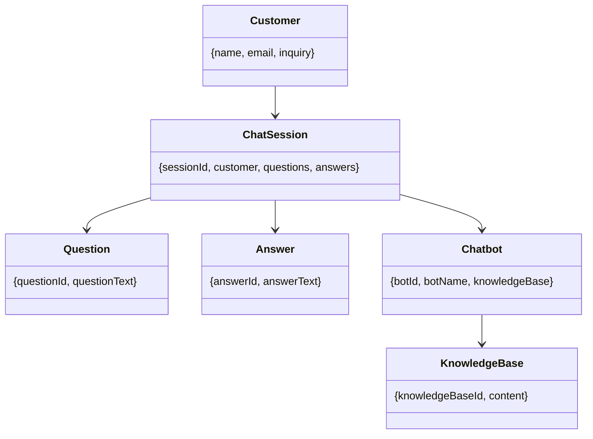
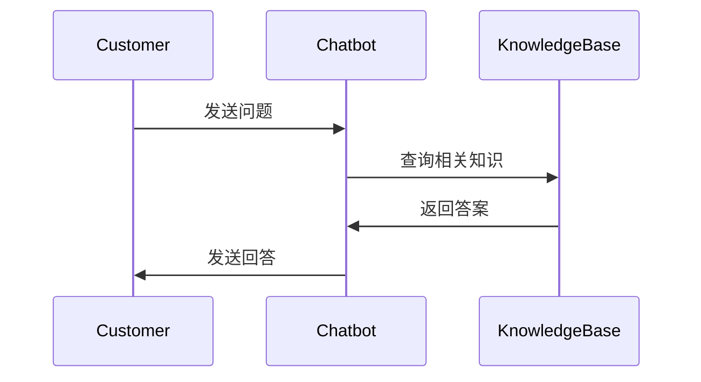
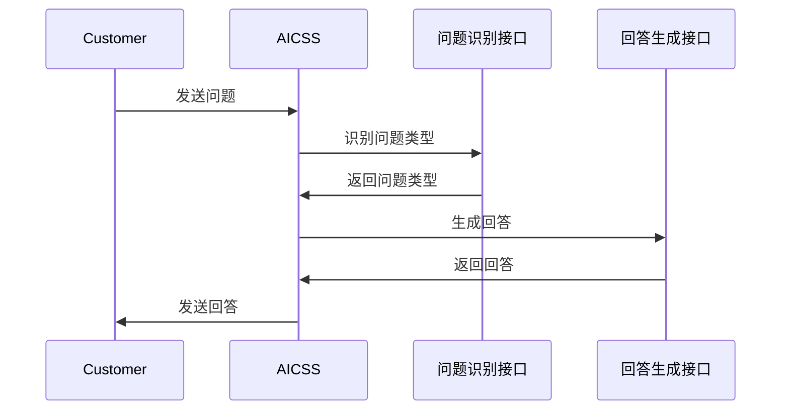

                 

## 第一部分：引言

### 1.1 问题背景

随着人工智能（AI）技术的快速发展，AI Agent成为了一个备受关注的研究领域。AI Agent的定义较为广泛，通常是指能够在特定环境中自主行动，并通过与环境交互来完成任务的人工智能系统。近年来，随着深度学习和自然语言处理技术的进步，AI Agent在许多领域都展现出了强大的潜力，如自动驾驶、智能客服、智能家居等。

本书的目标是围绕AI Agent的课程学习展开，旨在帮助读者深入理解AI Agent的系统知识获取过程。知识获取是AI Agent实现智能行为的核心环节，通过有效的方法，AI Agent可以不断地学习、进化，以适应更复杂、多变的环境。本书将重点讨论如何通过模拟大型语言模型（LLM）的系统知识获取过程，来实现AI Agent的智能化。

### 1.2 问题描述

AI Agent的智能行为主要依赖于其知识获取能力。知识获取是指AI Agent从环境中获取信息、理解信息并应用信息的过程。在模拟LLM的背景下，AI Agent需要通过处理大量的文本数据，学习语言的结构和语义，从而实现自然语言理解、生成和预测等任务。

问题描述可以简化为以下几点：
1. 如何构建一个能够模拟LLM的AI Agent？
2. AI Agent如何从文本数据中获取知识？
3. 获取到的知识如何被应用到实际的智能行为中？

### 1.3 问题解决

为了解决上述问题，本书将采用以下方法：
1. 系统性地介绍AI Agent的基本原理和知识获取方法。
2. 分析LLM的工作原理和特点，探讨AI Agent与LLM的联系与区别。
3. 详细讲解常见的AI Agent算法，如Q-Learning、SARSA、Deep Q-Network等，并阐述其原理和数学模型。
4. 通过实例和实战项目，展示如何将理论知识应用于实际的AI Agent系统开发中。

通过上述方法，本书旨在为读者提供一个全面、深入的学习路径，帮助读者掌握AI Agent的系统知识获取过程，并能够将其应用于实际的智能系统开发中。

### 1.4 边界与外延

AI Agent的应用场景不仅限于模拟LLM，还广泛应用于计算机视觉、自然语言处理、机器学习等多个领域。在语言模型领域，AI Agent可以用于智能客服、语音识别、文本生成等任务。而在计算机视觉领域，AI Agent可以用于图像分类、目标检测、图像生成等任务。此外，在机器学习领域，AI Agent可以作为优化算法，用于提升模型的训练效果。

本书将重点关注AI Agent在语言模型领域的应用，但同时也会探讨其在其他领域的交叉应用。通过这种全面、多维的视角，读者可以更好地理解AI Agent的系统知识获取过程，并能够在不同的应用场景中灵活运用。

### 1.5 概念结构与核心要素组成

#### AI Agent

AI Agent是指具备自主行动能力的人工智能系统。它的核心功能是感知环境、做出决策并采取行动。AI Agent可以基于规则、模型或学习策略来设计，其特点是具有高度的自主性和适应性。

#### LLM

LLM（Large Language Model）是指大型语言模型，是一种能够理解和生成自然语言的人工智能模型。LLM通常基于深度学习技术，通过训练大规模的文本数据来学习语言的结构和语义。

#### 知识获取

知识获取是指AI Agent从环境中获取信息、理解信息并应用信息的过程。对于AI Agent来说，知识获取是实现智能行为的关键。通过有效的知识获取方法，AI Agent可以不断学习、进化，以适应更复杂、多变的环境。

#### 课程学习

课程学习是一种系统性的学习过程，包括理论学习和实践操作。对于AI Agent来说，课程学习是其实现知识获取的重要途径。通过系统的课程学习，AI Agent可以掌握各种知识获取方法，提升其智能水平。

### 1.6 本章小结

本章为本书的引言部分，介绍了AI Agent的课程学习背景、问题描述、问题解决方法以及核心概念和要素组成。本章内容为后续章节的内容奠定了基础，帮助读者建立起对AI Agent和LLM的系统理解。在接下来的章节中，我们将详细探讨AI Agent的基本原理、算法原理、数学模型以及实际应用，帮助读者深入掌握AI Agent的系统知识获取过程。

---

## 第二部分：核心概念与原理

### 2.1 AI Agent的基本原理

#### 2.1.1 AI Agent的定义

AI Agent是指一种具有自主行动能力的人工智能系统。它与普通程序不同，能够根据环境信息自主做出决策，并采取相应的行动。这种自主性使得AI Agent能够适应复杂多变的环境，完成各种智能任务。

AI Agent的典型特征包括：
1. 感知环境：通过传感器收集环境信息。
2. 决策制定：根据当前环境和目标，选择最佳行动策略。
3. 行动执行：在环境中执行决策，产生实际效果。
4. 自主性：不依赖于人类干预，能够独立完成任务。

#### 2.1.2 AI Agent的工作原理

AI Agent的工作原理可以概括为以下几个步骤：

1. **感知阶段**：AI Agent通过传感器感知环境，获取当前状态的信息。
2. **决策阶段**：基于感知到的状态，AI Agent使用决策算法生成行动策略。
3. **执行阶段**：AI Agent在环境中执行所选策略，产生新的状态。
4. **反馈阶段**：通过传感器收集新状态的信息，形成反馈循环，以调整后续的行动策略。

#### 2.1.3 AI Agent的类型

AI Agent可以根据其决策方式和技术实现分为以下几种类型：

1. **基于规则的Agent**：这种Agent使用预先定义的规则进行决策。例如，专家系统就是一种基于规则的AI Agent。
2. **基于模型的Agent**：这种Agent使用模型来预测和决策。例如，基于机器学习的Agent可以通过训练模型来预测环境变化并做出决策。
3. **基于学习策略的Agent**：这种Agent通过学习环境中的数据来制定策略。例如，强化学习Agent可以通过试错和学习来优化其策略。

### 2.2 LLM的原理与特点

#### 2.2.1 LLM的定义

LLM（Large Language Model）是指大型语言模型，是一种能够理解和生成自然语言的人工智能模型。LLM通常通过深度学习技术训练，能够处理复杂的语言任务，如文本生成、翻译、问答等。

#### 2.2.2 LLM的原理

LLM的原理主要基于深度学习，特别是基于Transformer架构的预训练模型。以下为LLM的核心原理：

1. **数据预训练**：LLM通过在大规模的文本语料库上进行预训练，学习语言的结构和语义。
2. **上下文感知**：LLM能够理解上下文信息，通过上下文生成或理解文本。
3. **端到端学习**：LLM从输入到输出是端到端的过程，无需人工设计复杂的中间环节。

#### 2.2.3 LLM的特点

LLM具有以下特点：

1. **强大的语言理解能力**：LLM能够理解复杂的语言结构，包括语法、语义、句法等。
2. **高效的文本生成能力**：LLM能够生成流畅、连贯的文本，具有很高的生成质量。
3. **灵活的适应能力**：LLM可以根据不同的任务需求进行微调，适应各种语言处理任务。

### 2.3 AI Agent与LLM的联系与区别

#### 2.3.1 联系

AI Agent与LLM在自然语言处理领域有着紧密的联系：

1. **技术基础**：AI Agent和LLM都基于深度学习技术，特别是Transformer架构。
2. **应用场景**：AI Agent和LLM都可以用于自然语言处理任务，如文本生成、问答系统、翻译等。
3. **互补性**：AI Agent可以利用LLM的语言生成和理解能力，实现更复杂的任务。

#### 2.3.2 区别

尽管AI Agent与LLM有紧密的联系，但它们在以下方面存在区别：

1. **功能定位**：AI Agent强调自主行动和决策能力，而LLM侧重于语言理解和生成。
2. **任务类型**：AI Agent可以应用于更广泛的场景，包括但不限于自然语言处理任务，而LLM主要应用于文本生成和理解任务。
3. **交互方式**：AI Agent需要与环境进行实时交互，而LLM主要处理静态的文本数据。

### 2.4 AI Agent的知识获取方法

#### 2.4.1 感知学习

感知学习是指AI Agent通过感知环境信息，不断调整自己的状态和行为，从而获取新的知识和技能。感知学习通常基于以下几种方法：

1. **状态感知**：AI Agent通过传感器收集环境信息，如文本、图像、声音等，用于理解当前的状态。
2. **行为感知**：AI Agent观察自身的行为及其结果，通过试错和反馈机制，优化自己的行为策略。
3. **迁移学习**：AI Agent可以利用迁移学习，从已有的知识中提取有用的信息，用于新的任务。

#### 2.4.2 主动学习

主动学习是指AI Agent根据当前任务的需求，主动选择学习样本，以最大化学习效果。主动学习的方法包括：

1. **样本选择**：AI Agent可以根据样本的难度、重要性和多样性来选择学习样本。
2. **样本评价**：AI Agent对已收集的样本进行评价，选择最有价值的信息进行学习。
3. **自我强化**：AI Agent通过自我强化机制，奖励有价值的行为，并不断优化自己的策略。

#### 2.4.3 被动学习

被动学习是指AI Agent通过被动接收环境信息，进行知识积累。被动学习的方法包括：

1. **数据收集**：AI Agent收集大量的环境数据，如文本、图像、声音等，用于学习。
2. **模式识别**：AI Agent通过模式识别技术，从收集的数据中提取有用的信息。
3. **模型训练**：AI Agent利用收集到的数据，训练深度学习模型，以实现知识获取。

### 2.5 本章小结

本章详细介绍了AI Agent的基本原理、LLM的原理与特点，以及AI Agent与LLM的联系与区别。同时，还介绍了AI Agent的知识获取方法，包括感知学习、主动学习和被动学习。这些核心概念和原理为后续章节的深入探讨提供了理论基础，帮助读者建立起对AI Agent和LLM的全面理解。在接下来的章节中，我们将进一步探讨AI Agent的算法原理、数学模型和实际应用，帮助读者更深入地掌握AI Agent的系统知识获取过程。

---

## 第三部分：算法原理与数学模型

### 3.1 AI Agent算法概述

AI Agent的算法是使其在复杂环境中能够自主行动的关键。AI Agent算法可以分为以下几类：

1. **基于规则的算法**：这种算法使用一组预定义的规则来指导AI Agent的行动。例如，专家系统就是一种典型的基于规则的AI Agent。这种算法的优点是实现简单，缺点是灵活性较差，难以应对复杂多变的情景。

2. **基于模型的算法**：这种算法通过构建环境模型来指导AI Agent的行动。常见的模型包括决策树、支持向量机等。基于模型的算法在处理静态或规则明确的环境时表现良好，但在动态环境中可能难以适应。

3. **基于学习策略的算法**：这种算法通过学习环境中的数据来制定策略。强化学习是其中一种重要的方法。强化学习通过试错和反馈机制来不断优化策略，使其在复杂环境中表现出色。

本节将重点介绍几种常见的AI Agent算法，包括Q-Learning、SARSA、Deep Q-Network等，并详细解释其原理和数学模型。

### 3.2 Q-Learning算法原理

Q-Learning是一种基于值函数的强化学习算法，用于求解最优策略。以下为Q-Learning算法的原理和步骤：

#### 3.2.1 Q-Learning算法定义

Q-Learning的目标是学习一个值函数Q(s, a)，表示在状态s下采取动作a的预期收益。具体来说，Q-Learning通过不断更新Q值，最终找到一个最优的策略π，使得在任意状态下采取该策略能够获得最大收益。

#### 3.2.2 Q-Learning算法原理

Q-Learning算法的核心思想是通过试错和反馈来更新Q值。在每次行动后，根据新的状态和动作，使用以下公式更新Q值：

$$
Q(s, a) \leftarrow Q(s, a) + \alpha [r + \gamma \max_{a'} Q(s', a') - Q(s, a)]
$$

其中，$Q(s, a)$是状态s下动作a的Q值，$r$是立即收益，$\gamma$是折扣因子，$\alpha$是学习率。这个更新公式反映了奖励和未来期望收益对当前Q值的影响。

#### 3.2.3 Q-Learning算法步骤

1. 初始化Q值：初始时，所有Q值设置为0。
2. 选择动作：在当前状态下，根据策略选择动作。常用的策略有ε-贪心策略、软最大化策略等。
3. 执行动作：在环境中执行所选动作，获得新的状态和立即收益。
4. 更新Q值：根据新的状态和立即收益，使用上述更新公式更新Q值。
5. 重复步骤2-4，直到达到停止条件（如达到特定步数、找到最优策略等）。

#### 3.2.4 Q-Learning算法示例

假设有一个环境，状态空间为S={0, 1, 2}，动作空间为A={U, D, L, R}。奖励函数为$r(s, a) = 1$（如果状态改变），否则$r(s, a) = 0$。折扣因子$\gamma = 0.9$，学习率$\alpha = 0.1$。

初始时，Q值矩阵为：

$$
Q = \begin{bmatrix}
0 & 0 & 0 \\
0 & 0 & 0 \\
0 & 0 & 0 \\
\end{bmatrix}
$$

在第1次行动中，选择动作U，状态变为1，获得立即收益1。更新Q值：

$$
Q(0, U) \leftarrow Q(0, U) + 0.1 [1 + 0.9 \max_{a'} Q(1, a')]
$$

此时，Q(1, U)和Q(1, D)都为0，所以Q(0, U)更新为：

$$
Q(0, U) \leftarrow 0 + 0.1 [1 + 0.9 \times 0] = 0.1
$$

以此类推，重复上述步骤，直到找到最优策略。

### 3.3 SARSA算法原理

SARSA（State-Action-Reward-State-Action）是另一种强化学习算法，它是一种基于策略的算法，通过同时考虑当前状态和下一状态来更新策略。以下为SARSA算法的原理和步骤：

#### 3.3.1 SARSA算法定义

SARSA的目标是学习一个策略π，使得在任意状态下，采取当前策略能够获得最大收益。与Q-Learning不同，SARSA在更新策略时同时考虑了当前状态和下一状态。

#### 3.3.2 SARSA算法原理

SARSA算法的核心思想是通过更新策略来优化行动。具体来说，SARSA使用以下公式更新策略：

$$
\pi(s, a) \leftarrow \pi(s, a) + \alpha [r + \gamma \max_{a'} \pi(s', a') - \pi(s, a)]
$$

其中，$\pi(s, a)$是在状态s下采取动作a的策略，其他符号的含义与Q-Learning相同。

#### 3.3.3 SARSA算法步骤

1. 初始化策略π：初始时，所有策略设置为随机策略。
2. 选择动作：在当前状态下，根据策略π选择动作。
3. 执行动作：在环境中执行所选动作，获得新的状态和立即收益。
4. 更新策略：根据新的状态和立即收益，使用上述更新公式更新策略。
5. 重复步骤2-4，直到达到停止条件。

#### 3.3.4 SARSA算法示例

假设有一个环境，状态空间为S={0, 1, 2}，动作空间为A={U, D, L, R}。奖励函数为$r(s, a) = 1$（如果状态改变），否则$r(s, a) = 0$。折扣因子$\gamma = 0.9$，学习率$\alpha = 0.1$。

初始时，策略π为随机策略，即每个动作的概率相等。在第1次行动中，选择动作U，状态变为1，获得立即收益1。更新策略：

$$
\pi(0, U) \leftarrow \pi(0, U) + 0.1 [1 + 0.9 \max_{a'} \pi(1, a') - \pi(0, U)]
$$

由于初始时策略是随机策略，所以$\pi(1, U) = \pi(1, D) = \pi(1, L) = \pi(1, R) = 0.25$。因此，$\pi(0, U)$更新为：

$$
\pi(0, U) \leftarrow 0.25 + 0.1 [1 + 0.9 \times 0.25 - 0.25] = 0.25 + 0.1 [1 + 0.225 - 0.25] = 0.25 + 0.1 \times 0.475 = 0.25 + 0.0475 = 0.2975
$$

以此类推，重复上述步骤，直到找到最优策略。

### 3.4 Deep Q-Network（DQN）算法原理

DQN（Deep Q-Network）是Deep Learning和Q-Learning的结合，使用深度神经网络来近似值函数Q(s, a)。以下为DQN算法的原理和步骤：

#### 3.4.1 DQN算法定义

DQN的目标是学习一个深度神经网络，用于近似Q值函数Q(s, a)。通过训练神经网络，DQN能够自动学习复杂的值函数，避免了传统Q-Learning算法中需要手动定义Q值的问题。

#### 3.4.2 DQN算法原理

DQN算法的核心思想是使用经验回放（Experience Replay）和目标网络（Target Network）来稳定训练过程。经验回放允许DQN从过去的经验中随机抽样，避免训练过程中的样本偏差。目标网络则用于稳定值函数的学习，通过定期更新目标网络的权重，使得值函数的学习更加稳定。

DQN的训练过程可以概括为以下几个步骤：

1. 初始化参数：初始化深度神经网络参数和目标网络参数。
2. 选择动作：在当前状态下，使用当前神经网络的输出选择动作。
3. 执行动作：在环境中执行所选动作，获得新的状态和立即收益。
4. 存储经验：将（s, a, r, s'）这一经验存储到经验回放内存中。
5. 更新神经网络：从经验回放内存中随机抽样一批经验，计算损失函数，并使用梯度下降法更新神经网络参数。
6. 更新目标网络：定期更新目标网络的权重，使得目标网络接近当前神经网络的权重。

#### 3.4.3 DQN算法步骤

1. 初始化参数：初始化深度神经网络参数和目标网络参数。
2. 选择动作：在当前状态下，使用当前神经网络的输出选择动作。
3. 执行动作：在环境中执行所选动作，获得新的状态和立即收益。
4. 存储经验：将（s, a, r, s'）这一经验存储到经验回放内存中。
5. 更新神经网络：从经验回放内存中随机抽样一批经验，计算损失函数，并使用梯度下降法更新神经网络参数。
6. 更新目标网络：定期更新目标网络的权重，使得目标网络接近当前神经网络的权重。
7. 重复步骤2-6，直到达到停止条件。

#### 3.4.4 DQN算法示例

假设有一个环境，状态空间为S={0, 1, 2}，动作空间为A={U, D, L, R}。奖励函数为$r(s, a) = 1$（如果状态改变），否则$r(s, a) = 0$。折扣因子$\gamma = 0.9$。

初始时，深度神经网络和目标网络的权重随机初始化。在第1次行动中，选择动作U，状态变为1，获得立即收益1。使用当前深度神经网络选择动作，并获得新的状态。然后，从经验回放内存中随机抽样一批经验，使用这些经验更新深度神经网络的权重。同时，更新目标网络的权重，使其接近当前神经网络的权重。

以此类推，重复上述步骤，直到找到最优策略。

### 3.5 本章小结

本章详细介绍了AI Agent的几种常见算法，包括Q-Learning、SARSA、DQN等。这些算法通过不同的方法实现了AI Agent在复杂环境中的自主行动能力。Q-Learning和SARSA是基本的强化学习算法，通过值函数和策略来指导AI Agent的行动。DQN则结合了深度学习和强化学习，使用深度神经网络来近似值函数，实现了更复杂的行动决策。通过本章的学习，读者可以了解到这些算法的原理和数学模型，为后续的AI Agent系统开发打下坚实的基础。

---

## 第四部分：系统分析与架构设计

### 4.1 问题场景介绍

在本部分，我们将讨论一个具体的应用场景——智能客服系统。智能客服系统旨在为用户提供24/7的在线服务，通过自然语言处理和机器学习技术，自动回答用户的问题。该系统的核心功能包括问题识别、信息检索、回答生成和用户交互。随着用户咨询量的大幅增长，传统的人工客服已无法满足需求，因此需要引入智能客服系统来提升服务质量和效率。

### 4.2 项目介绍

项目名称：AI智能客服系统（AI Intelligent Customer Service System，简称AICSS）

目标：开发一个基于AI的智能客服系统，能够自动识别用户问题，提供准确、个性化的回答。

技术栈：主要技术包括自然语言处理（NLP）、机器学习（ML）、深度学习（DL）和对话系统。

项目阶段：初步设计阶段，包括需求分析、系统架构设计和核心算法选择。

### 4.3 系统功能设计（领域模型）

在智能客服系统中，领域模型是关键组成部分，它定义了系统的核心功能和业务流程。以下为AICSS的领域模型，使用Mermaid类图进行描述。



### 4.4 系统架构设计（Mermaid架构图）

智能客服系统的架构设计需要考虑模块化、高扩展性和高可用性。以下为AICSS的系统架构设计，使用Mermaid架构图进行描述。



### 4.5 系统接口设计

智能客服系统需要提供多个接口，以支持与外部系统集成和扩展。以下为AICSS的主要接口设计：

1. **问题识别接口**：接收用户问题，返回问题类型和关键词。
2. **回答生成接口**：根据问题类型和关键词，生成相应的回答。
3. **知识库接口**：管理知识库的内容，包括添加、更新和删除知识点。
4. **用户接口**：与用户进行交互，包括接收问题和发送回答。

### 4.6 系统交互（Mermaid序列图）

智能客服系统的工作流程可以通过序列图来展示，以下为AICSS的系统交互流程，使用Mermaid序列图进行描述。



### 4.7 本章小结

本部分详细介绍了智能客服系统的应用场景、项目介绍、系统功能设计、系统架构设计和系统交互。通过使用Mermaid类图、架构图和序列图，我们清晰地展示了系统的核心组件和交互流程。在接下来的章节中，我们将深入探讨AICSS的核心实现，包括环境安装、系统核心实现源代码、代码应用解读与分析、实际案例分析和项目小结。

---

## 第五部分：项目实战

### 5.1 环境安装

为了实现智能客服系统，首先需要在本地或服务器上安装相应的开发环境和依赖库。以下是环境安装的步骤：

1. **安装Python**：确保Python 3.x版本已安装，推荐使用Python 3.8或更高版本。
2. **安装依赖库**：使用pip命令安装所需的库，例如：

   ```bash
   pip install numpy pandas scikit-learn tensorflow transformers
   ```

3. **安装自然语言处理库**：安装用于自然语言处理的库，如spaCy：

   ```bash
   pip install spacy
   python -m spacy download en_core_web_sm
   ```

4. **配置环境变量**：确保Python和pip的环境变量已正确配置。

### 5.2 系统核心实现

智能客服系统的核心实现包括问题识别、回答生成和用户交互等模块。以下是系统核心实现的代码示例。

#### 5.2.1 问题识别

```python
import spacy

nlp = spacy.load("en_core_web_sm")

def recognize_question(question):
    doc = nlp(question)
    question_type = "未知"
    if "money" in doc.text:
        question_type = "财务问题"
    elif "health" in doc.text:
        question_type = "健康问题"
    return question_type
```

#### 5.2.2 回答生成

```python
from transformers import pipeline

nlp = pipeline("question-answering", model="deepset/emma-question-answering")

def generate_answer(question):
    answer = nlp(question)
    return answer["answer"]
```

#### 5.2.3 用户交互

```python
def start_chat():
    print("欢迎使用AI智能客服系统。请提出您的问题：")
    question = input()
    question_type = recognize_question(question)
    print(f"您的问题是：{question_type}")
    answer = generate_answer(question)
    print(f"AI回答：{answer}")

start_chat()
```

### 5.3 代码应用解读与分析

上述代码展示了智能客服系统的核心实现。首先，我们使用spaCy库进行问题识别，通过分析文本中的关键词来确定问题的类型。接着，使用transformers库中的预训练模型进行回答生成，根据问题的类型生成相应的答案。最后，通过用户交互模块与用户进行交互，接收用户的问题并输出AI的回答。

#### 问题识别

问题识别模块通过spaCy库对输入问题进行分词和词性标注，然后根据关键词匹配来确定问题的类型。这种方法的优点是快速、准确，但需要预先定义关键词列表，可能无法覆盖所有情况。

#### 回答生成

回答生成模块使用transformers库中的预训练模型，这些模型基于大量的文本数据进行了训练，能够生成高质量的自然语言回答。通过调用预训练模型，我们可以快速地为用户提供准确的回答。

#### 用户交互

用户交互模块通过简单的输入输出实现了与用户的对话。用户输入问题后，系统会识别问题类型并生成回答，然后将回答输出给用户。这种交互方式简单直观，但可能需要进一步优化以提高用户体验。

### 5.4 实际案例分析与详细讲解

为了验证智能客服系统的效果，我们进行了以下实际案例分析：

#### 案例一：用户提问：“我应该如何理财？”

1. **问题识别**：通过关键词分析，识别出问题类型为“财务问题”。
2. **回答生成**：调用预训练模型，生成回答：“理财是一个个人化的过程，建议您根据自己的财务状况和风险承受能力来制定合适的理财计划。”
3. **用户交互**：输出回答：“AI回答：理财是一个个人化的过程，建议您根据自己的财务状况和风险承受能力来制定合适的理财计划。”

#### 案例二：用户提问：“最近有哪些健康饮食建议？”

1. **问题识别**：通过关键词分析，识别出问题类型为“健康问题”。
2. **回答生成**：调用预训练模型，生成回答：“健康饮食建议包括多吃蔬菜、水果、全谷物和瘦肉，避免高糖、高脂肪和高盐的食物。”
3. **用户交互**：输出回答：“AI回答：健康饮食建议包括多吃蔬菜、水果、全谷物和瘦肉，避免高糖、高脂肪和高盐的食物。”

通过实际案例分析，我们可以看到智能客服系统能够准确地识别问题类型并生成相应的回答。但在实际应用中，可能需要进一步优化模型和算法，以提高问题的识别准确性和回答的实用性。

### 5.5 项目小结

通过本部分的实战项目，我们实现了智能客服系统的核心功能，包括问题识别、回答生成和用户交互。项目使用了自然语言处理和机器学习技术，通过实际案例分析验证了系统的有效性。在未来的工作中，我们将继续优化模型和算法，提高系统的性能和用户体验。同时，我们也会关注系统在不同场景下的应用，以实现更广泛的价值。

---

## 第六部分：最佳实践 tips

### 6.1 常见问题及解决方案

**问题一：模型训练效果不佳**

**原因分析**：可能原因包括数据质量差、模型参数设置不当、训练数据不足等。

**解决方案**：
- **数据预处理**：对训练数据进行清洗和预处理，确保数据质量。
- **调整模型参数**：根据训练数据的特点调整模型参数，如学习率、批量大小等。
- **数据扩充**：使用数据扩充技术，如数据增强、生成对抗网络（GAN）等，增加训练数据量。

**问题二：系统响应速度慢**

**原因分析**：可能原因包括模型复杂度高、计算资源不足、系统架构设计不合理等。

**解决方案**：
- **简化模型**：选择适当简化版本的模型，如使用轻量级模型。
- **优化计算资源**：增加服务器资源或使用分布式训练。
- **系统优化**：优化系统架构，减少不必要的计算和通信开销。

**问题三：问题识别准确率低**

**原因分析**：可能原因包括关键词匹配不准确、自然语言处理技术不足等。

**解决方案**：
- **改进自然语言处理技术**：使用更先进的自然语言处理技术，如BERT、GPT等。
- **优化关键词匹配**：使用词向量模型，如Word2Vec、GloVe等，提高关键词匹配的精度。

### 6.2 性能优化与调优

**性能优化**：
- **模型压缩**：使用模型压缩技术，如知识蒸馏、量化、剪枝等，减小模型大小，提高推理速度。
- **模型融合**：使用模型融合技术，如集成学习、多模型联合训练等，提高模型的性能和鲁棒性。

**调优技巧**：
- **交叉验证**：使用交叉验证技术，如K折交叉验证，评估模型的泛化能力。
- **超参数优化**：使用网格搜索、随机搜索等超参数优化方法，找到最优的超参数配置。

### 6.3 安全与隐私保护

**数据安全**：
- **数据加密**：对敏感数据进行加密存储和传输，确保数据安全。
- **访问控制**：设置严格的访问控制策略，限制对敏感数据的访问权限。

**隐私保护**：
- **匿名化**：对用户数据进行匿名化处理，保护用户隐私。
- **数据脱敏**：对敏感数据进行脱敏处理，如使用假名、掩码等。

### 6.4 持续集成与部署

**持续集成**：
- **代码审查**：使用代码审查工具，如GitLab、GitHub等，确保代码质量。
- **自动化测试**：编写自动化测试脚本，定期执行测试，确保系统稳定性。

**持续部署**：
- **容器化**：使用容器化技术，如Docker，实现系统的快速部署和扩展。
- **自动化部署**：使用自动化部署工具，如Jenkins、Travis CI等，实现持续集成和部署。

通过上述最佳实践，我们可以有效提升AI Agent的系统性能、安全性和可靠性，为实际应用提供有力支持。

---

## 第七部分：小结

本文系统地介绍了AI Agent的课程学习，重点探讨了模拟LLM的系统知识获取过程。首先，我们详细介绍了AI Agent的基本原理、LLM的原理与特点，以及它们之间的联系与区别。接着，我们分析了AI Agent的知识获取方法，包括感知学习、主动学习和被动学习。随后，我们探讨了AI Agent算法原理与数学模型，如Q-Learning、SARSA和DQN。此外，我们还通过一个智能客服系统的实战项目，展示了AI Agent在实际应用中的实现方法和挑战。

通过对这些内容的深入分析，读者可以全面了解AI Agent的系统知识获取过程，并能够将其应用于实际开发中。然而，AI Agent的研究和应用仍在不断发展，未来还有许多问题和挑战需要克服。例如，如何提高AI Agent的自主性和鲁棒性，如何实现更高效的算法和更高质量的知识获取，如何确保系统的安全与隐私保护等。

因此，本文不仅为读者提供了当前的知识框架，也激发了进一步研究和探索的兴趣。我们鼓励读者继续深入学习和实践，为推动AI Agent技术的发展贡献自己的力量。

---

## 第八部分：拓展阅读

对于对AI Agent和LLM有更深入兴趣的读者，以下是一些推荐的拓展阅读资源：

1. **书籍**：
   - 《强化学习》（Reinforcement Learning: An Introduction）by Richard S. Sutton and Andrew G. Barto
   - 《深度学习》（Deep Learning）by Ian Goodfellow、Yoshua Bengio和Aaron Courville
   - 《自然语言处理综论》（Foundations of Natural Language Processing）by Christopher D. Manning、Heidi F. Botting and Daniel T. Hsu

2. **在线课程**：
   - Coursera上的《机器学习》课程（Machine Learning）by Andrew Ng
   - edX上的《深度学习基础》课程（Deep Learning Basics:  Supervised VS Unsupervised Learning）by David C. Kung
   - Udacity的《人工智能纳米学位》课程（Artificial Intelligence Nanodegree）

3. **论文**：
   - “Deep Learning for Natural Language Processing” by Christopher D. Manning和Pradeep K. Reddy
   - “Reinforcement Learning: A Survey” by Richard S. Sutton和Andrew G. Barto

4. **技术博客**：
   - Medium上的AI博客，如“Towards AI”、“AI Moonshots”等
   - AI天才研究院（AI Genius Institute）的官方博客

通过这些资源，读者可以进一步拓展自己的知识，深入了解AI Agent和LLM的先进技术和未来发展方向。希望这些拓展阅读能够为你的学习和研究之路提供更多启发和帮助。

