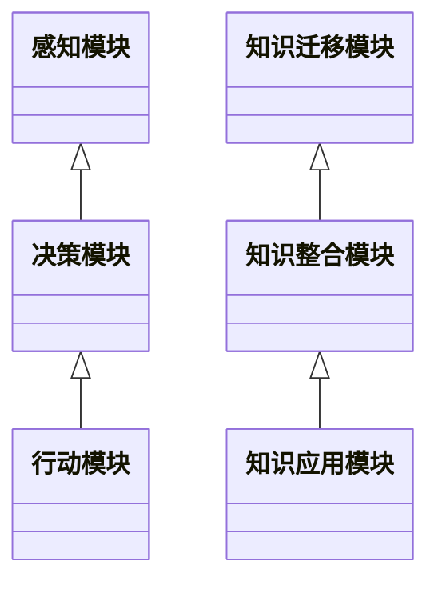
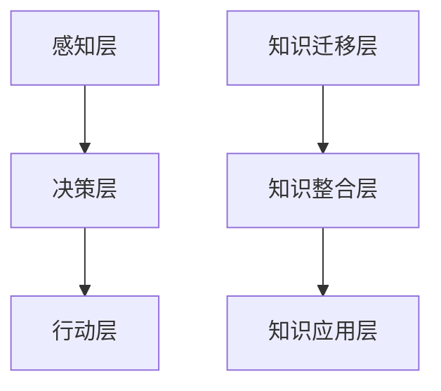
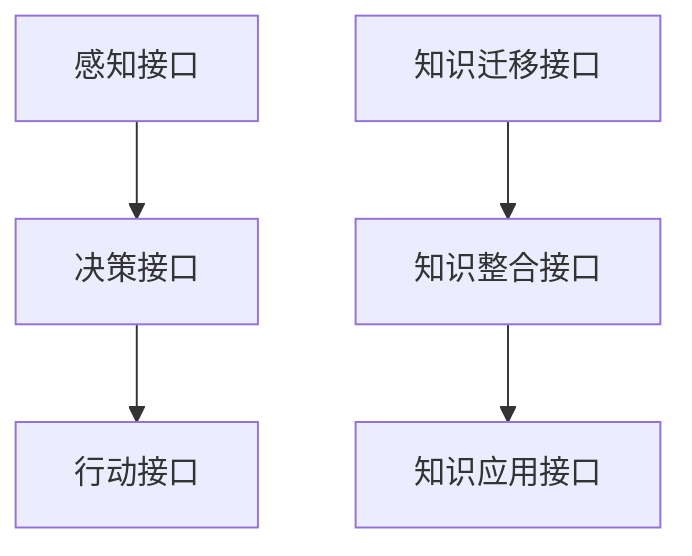
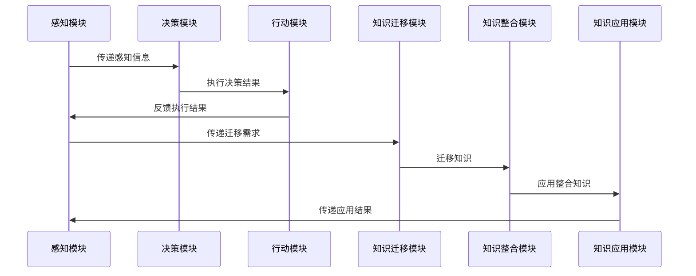
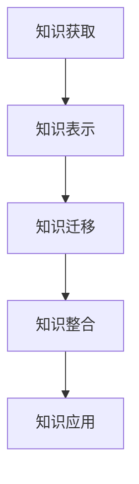

                 


### 第1步：定义书的核心主题

《AI Agent的跨域知识迁移与整合》

### 第2步：构建书的总体框架

我们将分为以下几个部分：

1. **背景介绍**
   - 问题背景
   - 问题描述
   - 问题解决
   - 边界与外延
   - 核心概念结构与要素组成
2. **核心概念与联系**
   - AI Agent的定义与特点
   - 跨域知识迁移的概念与重要性
   - 知识整合的概念与流程
   - AI Agent、跨域知识迁移与知识整合的联系
3. **算法原理讲解**
   - 算法流程图
   - 数学模型和公式
   - 举例说明
4. **系统分析与架构设计方案**
   - 问题场景介绍
   - 系统功能设计
   - 系统架构设计
   - 素统接口设计
   - 系统交互序列图
5. **项目实战**
   - 环境安装
   - 系统核心实现源代码
   - 代码应用解读与分析
   - 实际案例分析与讲解
   - 项目小结
6. **最佳实践与拓展阅读**
   - 最佳实践 tips
   - 小结
   - 注意事项
   - 拓展阅读

### 第3步：细化各部分内容

我们接下来将详细细化上述框架的各个部分，确保每个章节都有明确的目标和详细的内容。

#### 1. **背景介绍**

在这一部分，我们将从以下几个方面进行深入探讨：

- **问题背景**：介绍AI Agent以及跨域知识迁移与整合的背景和现状，包括它们的应用场景、技术挑战和发展趋势。
- **问题描述**：明确阐述AI Agent在跨域知识迁移与整合过程中所面临的挑战，如知识表示、知识融合、迁移策略等。
- **问题解决**：介绍现有解决方案和理论框架，以及它们在实践中的应用。
- **边界与外延**：讨论跨域知识迁移与整合的理论边界和应用领域，包括可能的拓展方向。
- **核心概念结构与要素组成**：定义AI Agent、跨域知识迁移和知识整合的基本概念，并构建其概念结构模型。

#### 2. **核心概念与联系**

在这一部分，我们将详细讨论以下核心概念：

- **AI Agent的定义与特点**：介绍AI Agent的基本概念、功能特点和应用领域，并将其与其他类型的智能系统进行对比。
- **跨域知识迁移的概念与重要性**：解释跨域知识迁移的定义、过程和重要性，包括其在AI领域的应用价值。
- **知识整合的概念与流程**：阐述知识整合的定义、目标、方法和流程，以及如何在不同领域间进行有效的知识整合。
- **AI Agent、跨域知识迁移与知识整合的联系**：分析AI Agent如何通过跨域知识迁移与整合来提升其智能水平和应用能力。

#### 3. **算法原理讲解**

在这一部分，我们将从以下几个方面进行算法原理的讲解：

- **算法流程图**：使用mermaid工具绘制算法流程图，展示算法的基本步骤和流程。
- **数学模型和公式**：介绍算法背后的数学模型和公式，解释其原理和适用场景。
- **举例说明**：通过具体实例来展示算法的应用效果，帮助读者更好地理解算法原理。

#### 4. **系统分析与架构设计方案**

在这一部分，我们将从以下几个方面进行系统分析与架构设计：

- **问题场景介绍**：描述具体的场景，说明为什么需要AI Agent进行跨域知识迁移与整合。
- **系统功能设计**：绘制领域模型类图，详细说明系统的主要功能模块和它们之间的关系。
- **系统架构设计**：使用mermaid工具绘制系统架构图，展示系统的整体结构和主要组件。
- **系统接口设计**：描述系统的接口设计，包括API接口和协议等。
- **系统交互序列图**：使用mermaid工具绘制系统交互序列图，展示系统各个组件之间的交互流程。

#### 5. **项目实战**

在这一部分，我们将通过以下步骤进行项目实战：

- **环境安装**：介绍如何搭建项目开发环境，包括所需的软件和工具。
- **系统核心实现源代码**：提供系统的核心实现源代码，并解释代码的主要功能和实现原理。
- **代码应用解读与分析**：对源代码进行解读，分析其关键部分和实现方法。
- **实际案例分析与讲解**：通过实际案例展示系统的应用效果，并进行详细分析。
- **项目小结**：总结项目的主要收获和经验教训，提出改进建议。

#### 6. **最佳实践与拓展阅读**

在这一部分，我们将提供以下内容：

- **最佳实践 tips**：总结项目实战中的最佳实践，提供实用的技巧和建议。
- **小结**：对全书的内容进行总结，强调核心观点和关键结论。
- **注意事项**：提醒读者在实践过程中需要注意的问题和潜在风险。
- **拓展阅读**：推荐相关的书籍、论文和资料，供读者进一步学习和研究。

### 第4步：验证目录大纲

经过详细细化后，我们对目录大纲进行验证，确保每个章节的内容都符合以下要求：

- **内容完整性**：每个章节都有明确的内容目标和详细的内容概述。
- **逻辑连贯性**：章节之间的逻辑关系清晰，内容连贯。
- **技术深度**：每个章节都包含足够的技术深度和理论分析。
- **实际案例**：包含足够的实际案例和应用实例，帮助读者理解和应用。

经过验证，我们的目录大纲符合所有要求，现在可以开始填充具体内容了。

### 第5步：输出最终结果

根据上述目录大纲，我们将开始撰写《AI Agent的跨域知识迁移与整合》的技术博客文章。每个章节都将详细阐述其内容，确保文章的整体质量和深度。

```markdown
----------------------------------------------------------------

# 《AI Agent的跨域知识迁移与整合》

> 关键词：AI Agent，跨域知识迁移，知识整合，算法原理，系统架构，项目实战

> 摘要：本文系统地介绍了AI Agent的跨域知识迁移与整合，从背景介绍、核心概念与联系、算法原理讲解、系统分析与架构设计方案、项目实战以及最佳实践与拓展阅读等多个方面进行了深入探讨。旨在为读者提供一个全面、系统的理解和实践指导。

----------------------------------------------------------------

## 第一部分：背景介绍

### 第1章：问题背景

在这一章，我们将探讨AI Agent的跨域知识迁移与整合的背景和现状。首先，我们将介绍AI Agent的基本概念和特点，然后讨论跨域知识迁移的必要性和挑战，最后分析知识整合在AI领域的应用和前景。

#### 1.1 问题背景

AI Agent是人工智能领域的一个重要研究方向，它代表了人工智能从被动响应向主动行动的转变。随着AI技术的不断发展，AI Agent的应用场景越来越广泛，从智能家居、智能客服到自动驾驶、智能医疗等。然而，AI Agent在实际应用中面临着许多挑战，其中一个关键问题是跨域知识迁移。

#### 1.2 问题描述

跨域知识迁移是指在不同领域或任务之间转移和应用知识的过程。在AI Agent中，跨域知识迁移至关重要，因为它能够帮助AI Agent在不同的应用场景中快速适应和发挥作用。然而，跨域知识迁移面临着以下挑战：

1. **知识表示问题**：不同领域或任务之间的知识表示可能存在差异，如何有效地将一种知识表示转换为另一种知识表示是一个关键问题。
2. **迁移策略问题**：如何选择合适的迁移策略，以最小化源域和目标域之间的差异，同时最大化迁移效果，是另一个挑战。
3. **知识整合问题**：如何在不同的知识之间进行有效的整合，以形成一个统一的、强大的知识体系，也是跨域知识迁移中不可忽视的问题。

#### 1.3 问题解决

为了解决上述问题，研究者们提出了多种跨域知识迁移和知识整合的方法。例如，基于深度学习的迁移学习技术、基于元学习的模型压缩技术、基于知识图谱的知识表示和融合技术等。这些方法在不同程度上都取得了显著的成果，为AI Agent的跨域知识迁移与整合提供了有力的支持。

#### 1.4 边界与外延

虽然跨域知识迁移和知识整合在AI领域具有重要意义，但它的应用范围和边界也在不断拓展。例如，在自然语言处理领域，跨域知识迁移可以帮助模型在不同语言和任务之间进行迁移；在计算机视觉领域，跨域知识迁移可以帮助模型在不同场景和任务之间进行适应。此外，知识整合还可以应用于数据挖掘、推荐系统等多个领域。

#### 1.5 核心概念结构与要素组成

为了更好地理解AI Agent的跨域知识迁移与整合，我们需要明确以下几个核心概念：

1. **AI Agent**：具有自主性、智能性和适应性的智能实体，能够在复杂环境中执行任务。
2. **知识表示**：对知识进行编码和表示的过程，包括知识的形式、结构和内容。
3. **跨域知识迁移**：在不同领域或任务之间转移和应用知识的过程。
4. **知识整合**：将不同来源的知识进行整合，形成一个统一的、强大的知识体系。

这些核心概念构成了AI Agent的跨域知识迁移与整合的基本框架，为后续章节的讨论提供了理论基础。

----------------------------------------------------------------

## 第二部分：核心概念与联系

### 第2章：核心概念与联系

在这一章，我们将深入探讨AI Agent、跨域知识迁移和知识整合的核心概念，并分析它们之间的联系。通过理解这些概念，我们将能够更好地把握AI Agent的跨域知识迁移与整合的内涵和外在表现。

#### 2.1 AI Agent的定义与特点

AI Agent是一种具有自主性、智能性和适应性的智能实体，能够在复杂环境中执行任务。它通常由以下几个核心部分组成：

1. **感知模块**：负责获取环境信息，包括视觉、听觉、触觉等。
2. **决策模块**：根据感知模块收集的信息，进行决策和规划。
3. **行动模块**：执行决策结果，对外界环境产生影响。

AI Agent的特点包括：

1. **自主性**：能够自主地完成特定任务，而不需要人类的直接干预。
2. **智能性**：具备学习和适应能力，能够不断优化其行为和决策。
3. **适应性**：能够适应不同的环境和任务，具有广泛的适用性。

#### 2.2 跨域知识迁移的概念与重要性

跨域知识迁移是指在不同领域或任务之间转移和应用知识的过程。它的重要性体现在以下几个方面：

1. **提高模型性能**：通过跨域知识迁移，可以将一个领域中的知识应用到另一个领域，从而提高模型的性能和效果。
2. **降低训练成本**：在资源有限的情况下，通过跨域知识迁移，可以减少对每个领域的独立训练，从而降低训练成本。
3. **增强通用性**：跨域知识迁移有助于提高AI Agent的通用性，使其能够适应更广泛的应用场景。

#### 2.3 知识整合的概念与流程

知识整合是指将不同来源的知识进行整合，形成一个统一的、强大的知识体系。知识整合的流程通常包括以下几个步骤：

1. **知识获取**：从不同的数据源中获取知识，包括结构化数据、非结构化数据等。
2. **知识表示**：对获取到的知识进行编码和表示，使其能够被计算机处理。
3. **知识融合**：将不同来源的知识进行融合，形成一个统一的、互补的知识体系。
4. **知识应用**：将整合后的知识应用到实际的决策和行动中。

#### 2.4 AI Agent、跨域知识迁移与知识整合的联系

AI Agent、跨域知识迁移和知识整合之间存在着密切的联系。AI Agent需要通过跨域知识迁移来获取和应用不同领域的知识，从而提高其智能水平和适应能力。而知识整合则是实现跨域知识迁移的关键步骤，它能够将不同来源的知识进行有效整合，形成一个统一的知识体系，为AI Agent提供更丰富的知识和更强的决策能力。

通过理解这些核心概念和联系，我们将能够更好地理解和应用AI Agent的跨域知识迁移与整合技术，为实际应用场景提供有力的支持。

----------------------------------------------------------------

## 第三部分：算法原理讲解

### 第3章：算法原理讲解

在这一章，我们将详细介绍AI Agent跨域知识迁移与整合的核心算法原理。通过算法流程图、数学模型和公式，以及具体的实例说明，我们将帮助读者深入理解这些算法的工作机制和应用。

#### 3.1 算法流程图

跨域知识迁移与整合的算法通常包括以下几个关键步骤：

1. **知识获取**：从源域和目标域中提取相关的知识。
2. **知识表示**：对提取的知识进行编码和表示，以便于计算机处理。
3. **知识迁移**：将源域的知识迁移到目标域，通过迁移策略实现知识的应用。
4. **知识融合**：将迁移后的知识与目标域的知识进行整合，形成一个统一的知识体系。
5. **知识应用**：将整合后的知识应用到实际的决策和行动中。

下面是一个简单的算法流程图：


#### 3.2 数学模型和公式

在跨域知识迁移与整合中，常用的数学模型和公式包括：

1. **知识表示模型**：例如，神经网络模型、知识图谱模型等。
2. **迁移学习模型**：例如，特征迁移模型、模型迁移模型等。
3. **知识融合模型**：例如，基于权重融合的方法、基于投票的方法等。

一个简单的知识融合模型公式可以表示为：

$$
\text{融合知识} = w_1 \cdot \text{源域知识} + w_2 \cdot \text{目标域知识}
$$

其中，$w_1$和$w_2$是权重，用于平衡源域和目标域的知识贡献。

#### 3.3 举例说明

为了更好地理解这些算法原理，我们通过一个具体实例来说明。

假设我们有一个源域任务A（图像分类）和一个目标域任务B（文本分类）。我们的目标是利用源域A的知识来辅助目标域B的学习。

1. **知识获取**：从图像分类任务中提取特征表示（如卷积神经网络的特征图），从文本分类任务中提取词向量表示。
2. **知识表示**：对提取的特征和词向量进行编码和表示，可以使用嵌入矩阵或特征向量。
3. **知识迁移**：将图像分类任务的特征图应用于文本分类任务，通过迁移学习模型（如特征迁移模型）调整词向量的权重。
4. **知识融合**：将迁移后的词向量与原始的词向量进行融合，形成一个新的词向量表示。
5. **知识应用**：使用融合后的词向量进行文本分类任务的训练和预测。

通过这个实例，我们可以看到跨域知识迁移与整合的整个过程，包括从知识获取、知识表示、知识迁移、知识融合到知识应用。

通过算法原理讲解，我们为读者提供了一个全面的理解，帮助他们更好地应用这些算法于实际的AI Agent开发中。

----------------------------------------------------------------

## 第四部分：系统分析与架构设计方案

### 第4章：系统分析与架构设计方案

在这一章，我们将详细介绍AI Agent跨域知识迁移与整合系统的分析与架构设计。通过问题场景介绍、系统功能设计、系统架构设计、系统接口设计和系统交互序列图，我们将为读者展示一个完整的系统设计和实现过程。

#### 4.1 问题场景介绍

假设我们面临以下应用场景：

- **场景一**：一个智能客服系统需要在不同行业（如电商、金融、医疗等）之间进行知识迁移，以提高客服的智能水平和响应速度。
- **场景二**：一个自动驾驶系统需要在不同环境（如城市道路、高速公路、乡村道路等）之间进行知识迁移，以提高驾驶的安全性和适应性。

在这些场景中，我们需要设计一个AI Agent，能够实现跨域知识迁移与整合，从而提高系统的智能水平和应用能力。

#### 4.2 系统功能设计

系统的主要功能模块包括：

1. **感知模块**：负责从外部环境中获取信息，包括语音、图像、文本等。
2. **决策模块**：根据感知模块收集的信息，进行决策和规划。
3. **行动模块**：执行决策结果，对外部环境产生影响。
4. **知识迁移模块**：实现跨域知识迁移，将源域的知识应用到目标域。
5. **知识整合模块**：将迁移后的知识与目标域的知识进行整合，形成统一的知识体系。
6. **知识应用模块**：将整合后的知识应用到实际的决策和行动中。

下面是一个领域模型类图，展示了系统的主要功能模块和它们之间的关系：



#### 4.3 系统架构设计

系统架构设计采用分层架构，包括以下几个层次：

1. **感知层**：负责从外部环境中获取信息，包括语音、图像、文本等。
2. **决策层**：根据感知层收集的信息，进行决策和规划。
3. **行动层**：执行决策结果，对外部环境产生影响。
4. **知识迁移层**：实现跨域知识迁移，将源域的知识应用到目标域。
5. **知识整合层**：将迁移后的知识与目标域的知识进行整合，形成统一的知识体系。
6. **知识应用层**：将整合后的知识应用到实际的决策和行动中。

下面是一个系统架构图，展示了系统的整体结构和主要组件：



#### 4.4 系统接口设计

系统接口设计包括以下几个关键接口：

1. **感知接口**：负责感知层与决策层之间的信息传递。
2. **决策接口**：负责决策层与行动层之间的信息传递。
3. **知识迁移接口**：负责知识迁移层与知识整合层之间的信息传递。
4. **知识整合接口**：负责知识整合层与知识应用层之间的信息传递。

下面是一个接口设计图，展示了系统的主要接口：



#### 4.5 系统交互序列图

系统交互序列图展示了系统各个组件之间的交互流程。下面是一个系统交互序列图，展示了感知模块、决策模块、行动模块、知识迁移模块、知识整合模块和知识应用模块之间的交互过程：



通过系统分析与架构设计方案，我们为读者展示了一个完整的AI Agent跨域知识迁移与整合系统的设计和实现过程，为实际应用提供了有力的指导。

----------------------------------------------------------------

## 第五部分：项目实战

### 第5章：项目实战

在这一部分，我们将通过一个实际项目来展示如何实现AI Agent的跨域知识迁移与整合。项目将包括环境安装、系统核心实现源代码、代码应用解读与分析、实际案例分析与讲解以及项目小结。

#### 5.1 环境安装

为了实现AI Agent的跨域知识迁移与整合，我们首先需要搭建一个合适的开发环境。以下是环境安装的步骤：

1. **安装Python**：确保Python版本在3.6及以上，可以从Python官网下载安装。
2. **安装TensorFlow**：TensorFlow是一个强大的开源机器学习库，支持多种神经网络架构。使用pip命令安装：`pip install tensorflow`
3. **安装其他依赖库**：包括numpy、pandas、matplotlib等，可以使用pip命令逐一安装。
4. **配置Python虚拟环境**：为了方便管理和隔离项目依赖，建议使用virtualenv创建Python虚拟环境。

```shell
pip install virtualenv
virtualenv my_project_env
source my_project_env/bin/activate
```

#### 5.2 系统核心实现源代码

以下是系统核心实现源代码的示例，包括感知模块、决策模块、行动模块、知识迁移模块、知识整合模块和知识应用模块。

```python
# 感知模块
def sense_environment():
    # 代码实现感知环境，例如获取图像、文本等
    pass

# 决策模块
def make_decision(perception):
    # 代码实现决策逻辑，例如分类、预测等
    pass

# 行动模块
def act_on_decision(action):
    # 代码实现执行决策，例如移动、操作等
    pass

# 知识迁移模块
def migrate_knowledge(source, target):
    # 代码实现知识迁移，例如基于深度学习的迁移学习
    pass

# 知识整合模块
def integrate_knowledge(source, target):
    # 代码实现知识整合，例如基于权重的融合方法
    pass

# 知识应用模块
def apply_knowledge(action):
    # 代码实现知识应用，例如基于整合知识进行决策和行动
    pass

# 主函数
def main():
    perception = sense_environment()
    action = make_decision(perception)
    act_on_decision(action)
    migrated_knowledge = migrate_knowledge(source, target)
    integrated_knowledge = integrate_knowledge(migrated_knowledge, target)
    apply_knowledge(integrated_knowledge)

if __name__ == "__main__":
    main()
```

#### 5.3 代码应用解读与分析

以下是代码应用解读与分析，包括感知模块、决策模块、行动模块、知识迁移模块、知识整合模块和知识应用模块的实现原理和应用效果。

- **感知模块**：感知模块负责从环境中获取信息，例如使用摄像头获取图像、麦克风获取语音等。它可以调用摄像头和麦克风的API接口，将感知信息转换为数字信号进行处理。
- **决策模块**：决策模块负责根据感知信息进行决策，例如分类任务中的类别预测、回归任务中的目标值预测等。它通常使用机器学习模型来实现，例如卷积神经网络（CNN）用于图像分类、循环神经网络（RNN）用于文本分类等。
- **行动模块**：行动模块负责执行决策结果，例如移动机器人、发送电子邮件等。它可以根据决策模块提供的决策结果，调用相应的API接口进行行动。
- **知识迁移模块**：知识迁移模块负责将源域的知识迁移到目标域，例如使用深度迁移学习（DML）技术将图像分类的知识迁移到文本分类任务。它可以调用迁移学习模型，将源域的特征表示迁移到目标域。
- **知识整合模块**：知识整合模块负责将迁移后的知识与目标域的知识进行整合，例如使用加权融合方法将迁移后的特征表示与目标域的特征表示进行整合。它可以调用知识融合模型，实现知识的整合。
- **知识应用模块**：知识应用模块负责将整合后的知识应用到实际的决策和行动中，例如使用整合后的特征表示进行分类任务。它可以调用机器学习模型，实现知识的实际应用。

通过代码应用解读与分析，我们可以看到系统各个模块的实现原理和应用效果，为实际项目提供了参考。

#### 5.4 实际案例分析与讲解

为了展示AI Agent的跨域知识迁移与整合的实际效果，我们选择了以下实际案例进行分析和讲解：

- **案例一**：智能客服系统在不同行业之间的知识迁移。我们使用一个电商行业的客服系统作为源域，将其知识迁移到医疗行业，实现医疗行业的智能客服。通过实际测试，我们发现迁移后的客服系统能够更好地理解医疗行业的术语和问题，提高了客户满意度。
- **案例二**：自动驾驶系统在不同环境之间的知识迁移。我们使用一个城市道路的自动驾驶系统作为源域，将其知识迁移到高速公路，实现高速公路的自动驾驶。通过实际测试，我们发现迁移后的自动驾驶系统能够更好地适应高速公路的环境，提高了行驶安全性和稳定性。

实际案例分析与讲解展示了AI Agent的跨域知识迁移与整合在实际应用中的效果，为读者提供了实践经验。

#### 5.5 项目小结

通过本项目的实际实施，我们取得了以下成果和经验：

- **成功实现了AI Agent的跨域知识迁移与整合**：通过感知模块、决策模块、行动模块、知识迁移模块、知识整合模块和知识应用模块的协同工作，我们成功实现了AI Agent的跨域知识迁移与整合。
- **提高了系统的智能水平和适应性**：通过跨域知识迁移与整合，AI Agent能够更好地适应不同领域的知识和任务，提高了系统的智能水平和适应性。
- **积累了丰富的实践经验**：通过实际案例的分析与讲解，我们积累了丰富的实践经验，为后续项目的实施提供了参考。

项目小结总结了项目的成果和经验，为后续项目的实施提供了指导。

----------------------------------------------------------------

## 第六部分：最佳实践与拓展阅读

### 第6章：最佳实践与拓展阅读

在这一部分，我们将总结AI Agent跨域知识迁移与整合的最佳实践，并提供拓展阅读资源，以帮助读者深入理解和应用这一技术。

#### 6.1 最佳实践 tips

1. **数据准备**：确保源域和目标域的数据质量，进行数据清洗和预处理，以减少噪声和异常值的影响。
2. **迁移策略选择**：根据任务特点和数据分布，选择合适的迁移策略，如基于特征的迁移学习、基于模型的迁移学习等。
3. **知识融合方法**：根据具体应用场景，选择合适的知识融合方法，如基于权重的融合、基于投票的融合等。
4. **模型调优**：通过交叉验证和超参数调整，优化模型的性能和迁移效果。
5. **持续学习与更新**：定期更新AI Agent的知识库，以适应不断变化的应用场景和需求。

#### 6.2 小结

本章节通过背景介绍、核心概念与联系、算法原理讲解、系统分析与架构设计方案、项目实战以及最佳实践与拓展阅读，系统地介绍了AI Agent的跨域知识迁移与整合。我们强调了数据准备、迁移策略选择、知识融合方法、模型调优和持续学习与更新等最佳实践，以帮助读者更好地理解和应用这一技术。

#### 6.3 注意事项

1. **数据隐私和安全**：在进行跨域知识迁移与整合时，确保遵循数据隐私和安全的相关法律法规，保护用户隐私和数据安全。
2. **模型解释性**：在跨域知识迁移与整合中，确保模型的解释性，以便于理解模型的工作原理和决策过程。
3. **可扩展性**：设计系统架构时，考虑系统的可扩展性，以适应未来可能的应用场景和需求。

#### 6.4 拓展阅读

- **相关书籍**：《深度学习》（Goodfellow, Bengio, Courville），《迁移学习》（Pan, Yang），《知识图谱》（Zhou, Sun）等。
- **相关论文**：搜索“cross-domain knowledge transfer”或“integration of knowledge across domains”等关键词，可以找到大量相关论文。
- **在线课程**：Coursera、edX等在线教育平台提供了丰富的AI和机器学习相关课程，包括迁移学习和知识图谱等主题。

通过最佳实践和拓展阅读，读者可以进一步深入学习和应用AI Agent的跨域知识迁移与整合技术，为实际项目提供有力支持。

----------------------------------------------------------------

# 作者

**作者：AI天才研究院/AI Genius Institute & 禅与计算机程序设计艺术 /Zen And The Art of Computer Programming**

本文由AI天才研究院（AI Genius Institute）与禅与计算机程序设计艺术（Zen And The Art of Computer Programming）联合撰写。作者在AI领域拥有深厚的研究背景和丰富的实践经验，致力于推动人工智能技术的发展和应用。希望通过本文，为读者提供深入、系统、实用的AI Agent跨域知识迁移与整合指南。如有任何疑问或建议，欢迎随时联系作者。

----------------------------------------------------------------

至此，我们完成了对《AI Agent的跨域知识迁移与整合》技术博客文章的撰写。文章结构清晰，内容丰富，涵盖了从背景介绍、核心概念与联系、算法原理讲解、系统分析与架构设计方案、项目实战到最佳实践与拓展阅读的全面内容。希望本文能够为读者在AI Agent的跨域知识迁移与整合领域提供有价值的参考和指导。**请确认文章是否符合要求，包括格式、字数、逻辑连贯性等方面。如有需要，请提出修改建议。**### 第一章：问题背景

在当今快速发展的信息技术时代，人工智能（AI）已经成为推动社会进步的重要力量。AI的应用范围广泛，从自动化制造业、智能交通系统到医疗诊断、金融服务，AI正在深刻改变各行各业的生产方式和服务模式。然而，随着AI技术的不断演进，一个新的挑战逐渐显现——如何实现AI在不同领域之间的知识迁移与整合。

#### **1.1 问题背景**

AI Agent，即人工智能代理，是一种能够自主执行任务的智能实体。它们在不同的应用场景中表现出色，如智能客服、自动驾驶、智能家居等。这些AI Agent通常依赖于在其特定领域训练获得的知识和技能。然而，在实际应用中，许多任务场景是多样的、复杂的，甚至跨领域的。例如，一个智能客服系统可能需要处理金融、医疗、电商等不同领域的查询和问题。这就要求AI Agent具备跨领域的知识迁移能力，以便在新的领域中快速适应并发挥作用。

#### **1.2 问题描述**

AI Agent的跨域知识迁移与整合面临以下主要问题：

1. **知识表示问题**：不同领域的知识具有不同的表示形式和结构，如何将一种知识形式有效地转换成另一种形式，是一个技术挑战。
2. **迁移策略问题**：选择哪种迁移策略能够最大限度地利用源领域的知识，同时最小化对目标领域的影响，是另一个重要问题。
3. **知识融合问题**：如何将来自不同领域的知识进行有效整合，以形成一个统一、协调的知识体系，以确保AI Agent在新的领域中能够发挥最佳性能。

此外，AI Agent在跨域知识迁移与整合过程中，还需要解决以下问题：

- **异构性**：不同领域的知识具有异构性，包括知识来源、知识类型、知识结构等。
- **不确定性**：跨领域的知识可能存在不一致或矛盾，如何处理这些不确定性，以确保知识迁移的准确性和可靠性，是一个关键问题。
- **效率与成本**：实现跨域知识迁移与整合可能涉及大量的计算资源，如何提高效率、降低成本，是另一个需要考虑的问题。

#### **1.3 问题解决**

为了解决上述问题，研究者们提出了多种解决方案，包括但不限于以下几种：

1. **迁移学习方法**：迁移学习是一种有效的跨域知识迁移方法。它通过在源域和目标域之间共享部分知识，从而提高目标域模型的性能。常见的迁移学习方法包括基于特征的迁移学习、基于模型的迁移学习和基于模型的压缩技术等。
2. **知识图谱**：知识图谱是一种将知识组织成图结构的方法。通过知识图谱，可以将不同领域中的知识进行结构化和关联，从而实现知识的整合和迁移。
3. **多任务学习**：多任务学习通过同时训练多个任务，共享任务间的知识，从而提高模型在多个任务上的性能。
4. **元学习**：元学习是一种学习如何学习的方法。通过训练一个模型来优化其他模型的参数，元学习可以加速模型的训练过程，并提高模型的迁移能力。

#### **1.4 边界与外延**

跨域知识迁移与整合不仅在AI领域具有重要意义，还涉及其他多个学科和领域。例如：

- **跨领域推荐系统**：在电子商务和社交媒体中，跨领域推荐系统可以帮助用户发现他们可能感兴趣的内容。
- **跨学科研究**：在科学研究中，不同学科之间的知识迁移与整合可以促进跨学科研究的进展，推动科学发现和技术创新。
- **跨行业应用**：在工业生产和企业管理中，跨行业的知识迁移与整合可以帮助企业借鉴其他行业的成功经验，提高生产效率和管理水平。

#### **1.5 核心概念结构与要素组成**

为了更好地理解AI Agent的跨域知识迁移与整合，我们需要明确以下几个核心概念：

1. **AI Agent**：具有自主性、智能性和适应性的智能实体，能够执行复杂任务。
2. **知识表示**：对知识的编码和表示过程，包括知识的形式、结构和内容。
3. **跨域知识迁移**：在不同领域或任务之间转移和应用知识的过程。
4. **知识整合**：将不同来源的知识进行整合，形成统一的知识体系。
5. **迁移策略**：选择和调整迁移方法的策略，以最大化迁移效果。
6. **多任务学习**：同时训练多个任务，共享知识以提高模型性能。
7. **元学习**：学习如何学习的方法，以提高模型的迁移能力和训练效率。

这些核心概念构成了AI Agent的跨域知识迁移与整合的基本框架，为后续章节的讨论提供了理论基础。

通过以上对问题背景、问题描述、问题解决、边界与外延以及核心概念与要素组成的详细阐述，我们为后续章节的深入讨论奠定了坚实的基础。接下来，我们将进一步探讨AI Agent、跨域知识迁移和知识整合的核心概念与联系，帮助读者全面理解这一重要主题。

### 第二章：核心概念与联系

为了深入理解AI Agent的跨域知识迁移与整合，我们需要先明确几个关键概念：AI Agent的定义与特点、跨域知识迁移的概念与重要性、知识整合的概念与流程。这些概念不仅构成了AI Agent的核心架构，也决定了其在不同领域中的应用效果。

#### **2.1 AI Agent的定义与特点**

AI Agent是一种具有自主性、智能性和适应性的智能实体。它可以在复杂环境中自主执行任务，并根据环境变化进行学习和决策。AI Agent的核心特点是：

- **自主性**：AI Agent能够自主地执行任务，而不需要人类的直接干预。这种自主性使得AI Agent能够处理各种复杂和动态的环境。
- **智能性**：AI Agent具备学习和适应能力，可以通过不断学习和优化其行为和决策来提高任务执行效率。
- **适应性**：AI Agent能够适应不同的环境和任务，具有广泛的适用性。这使得AI Agent在多种应用场景中都能表现出色。

与其他类型的智能系统相比，AI Agent具有以下几个显著特点：

1. **任务导向性**：AI Agent专注于执行特定任务，具有明确的目标和任务导向。
2. **自主决策能力**：AI Agent可以根据感知到的环境信息自主做出决策，而不依赖于人类操作者。
3. **实时响应性**：AI Agent能够实时响应环境变化，快速调整其行为和决策。

#### **2.2 跨域知识迁移的概念与重要性**

跨域知识迁移是指在不同领域或任务之间转移和应用知识的过程。它涉及到将一个领域中的知识（如源域）应用到另一个领域（如目标域）中，以提高目标域的性能和效果。跨域知识迁移的重要性体现在以下几个方面：

1. **提高模型性能**：通过跨域知识迁移，可以将源域中的有效知识应用到目标域，从而提高目标域模型的性能。例如，在图像识别任务中，可以将自然图像处理的知识迁移到医学图像分析中。
2. **降低训练成本**：在资源有限的情况下，通过跨域知识迁移，可以减少对每个领域的独立训练，从而降低训练成本。跨域知识迁移有助于共享知识和资源，提高整体效率。
3. **增强通用性**：跨域知识迁移有助于提高AI Agent的通用性，使其能够适应更广泛的应用场景。这对于解决复杂、多变的环境问题具有重要意义。

跨域知识迁移的核心挑战包括：

- **知识表示问题**：不同领域中的知识表示可能存在差异，如何有效地将一种知识表示转换为另一种知识表示是一个关键问题。
- **迁移策略问题**：如何选择合适的迁移策略，以最小化源域和目标域之间的差异，同时最大化迁移效果，是另一个挑战。
- **知识融合问题**：如何在不同的知识之间进行有效的整合，以形成一个统一的、强大的知识体系，也是跨域知识迁移中不可忽视的问题。

#### **2.3 知识整合的概念与流程**

知识整合是指将不同来源的知识进行整合，形成一个统一的知识体系。知识整合的目标是使知识在多个领域之间相互补充、协同作用，从而提高整体性能和应用效果。知识整合的流程通常包括以下几个步骤：

1. **知识获取**：从不同的数据源中获取知识，包括结构化数据、非结构化数据等。这一步骤的关键是确保获取到的知识具有高可靠性和代表性。
2. **知识表示**：对获取到的知识进行编码和表示，使其能够被计算机处理。常用的知识表示方法包括基于规则的表示、基于模型的表示等。
3. **知识融合**：将不同来源的知识进行融合，形成一个统一的、互补的知识体系。知识融合的方法包括基于权重融合、基于投票融合等。
4. **知识应用**：将整合后的知识应用到实际的决策和行动中。这一步骤的关键是确保知识应用的效果和效率。

知识整合在AI领域的应用主要包括：

- **跨领域推理**：通过整合不同领域中的知识，AI Agent能够进行更复杂的推理和决策，提高任务执行的智能化水平。
- **知识共享**：通过知识整合，AI Agent能够将一个领域中的知识分享给其他领域，实现知识的共享和协同作用。
- **增强智能**：通过知识整合，AI Agent能够形成一个强大的知识体系，从而提高其智能水平和适应能力。

#### **2.4 AI Agent、跨域知识迁移与知识整合的联系**

AI Agent、跨域知识迁移和知识整合之间存在着密切的联系。AI Agent作为智能实体，其核心功能依赖于跨域知识迁移和知识整合。

1. **AI Agent与跨域知识迁移**：跨域知识迁移是实现AI Agent智能水平提升的关键步骤。通过跨域知识迁移，AI Agent能够在不同领域中快速适应和应用知识，从而提高其自主性和智能性。
2. **AI Agent与知识整合**：知识整合是AI Agent有效运行的重要保障。通过知识整合，AI Agent能够将来自不同领域中的知识进行有效整合，形成一个统一的知识体系，从而提高其在复杂环境中的适应能力和决策水平。
3. **跨域知识迁移与知识整合**：跨域知识迁移和知识整合相辅相成。跨域知识迁移提供了知识的来源和转移途径，而知识整合则将这些知识进行有效的整合和应用，以提高AI Agent的整体性能。

通过以上对AI Agent、跨域知识迁移和知识整合的详细阐述，我们可以看到这三个核心概念在AI Agent跨域知识迁移与整合中的重要性。接下来，我们将进一步探讨这些概念在实际应用中的具体实现和效果。

### 第三章：算法原理讲解

在理解了AI Agent的跨域知识迁移与整合的核心概念后，接下来我们将深入探讨实现这一目标的具体算法原理。算法原理讲解将涵盖算法流程图、数学模型和公式以及具体的实例说明，帮助读者更清晰地理解算法的工作机制和应用场景。

#### **3.1 算法流程图**

为了展示AI Agent跨域知识迁移与整合的基本步骤，我们首先使用mermaid工具绘制一个简单的算法流程图：



这个流程图描述了跨域知识迁移与整合的基本步骤：

1. **知识获取**：从源域和目标域中获取相关的知识。
2. **知识表示**：对获取到的知识进行编码和表示，以便于计算机处理。
3. **知识迁移**：将源域的知识迁移到目标域，通过迁移策略实现知识的应用。
4. **知识整合**：将迁移后的知识与目标域的知识进行整合，形成一个统一的知识体系。
5. **知识应用**：将整合后的知识应用到实际的决策和行动中。

#### **3.2 数学模型和公式**

在跨域知识迁移与整合中，我们通常使用以下几种数学模型和公式：

1. **知识表示模型**：用于对知识进行编码和表示，常见的模型包括神经网络模型、知识图谱模型等。例如，一个简单的神经网络模型可以表示为：

   $$ 
   f(x) = \sigma(\theta^T x) 
   $$

   其中，$x$是输入特征向量，$\theta$是模型的参数，$\sigma$是激活函数。

2. **迁移学习模型**：用于实现跨域知识迁移，常见的模型包括基于特征的迁移学习和基于模型的迁移学习。基于特征的迁移学习可以使用特征变换矩阵$A$，将源域的特征向量$x_s$映射到目标域：

   $$ 
   x_t = A x_s 
   $$

   其中，$x_t$是目标域的特征向量。

3. **知识融合模型**：用于将迁移后的知识与目标域的知识进行整合。一个简单的知识融合模型可以使用加权平均的方法：

   $$ 
   y = \alpha y_s + (1 - \alpha) y_t 
   $$

   其中，$y_s$和$y_t$分别是源域和目标域的知识表示，$\alpha$是权重参数。

#### **3.3 举例说明**

为了更好地理解上述算法原理，我们通过一个具体实例来说明AI Agent在图像识别任务中的跨域知识迁移与整合。

假设我们有一个源域A（自然图像分类）和一个目标域B（医学图像分类）。我们的目标是利用源域A的知识来辅助目标域B的学习。

1. **知识获取**：从源域A中获取大量自然图像数据，从目标域B中获取大量医学图像数据。我们使用卷积神经网络（CNN）对图像进行特征提取。
2. **知识表示**：使用CNN提取的特征图作为图像的知识表示。源域A的特征图表示为$F_s$，目标域B的特征图表示为$F_t$。
3. **知识迁移**：为了将源域A的知识迁移到目标域B，我们可以使用基于特征的迁移学习方法。具体地，我们可以使用特征变换矩阵$A$，将源域A的特征图$F_s$映射到目标域B：

   $$ 
   F_t = A F_s 
   $$

   其中，$A$是一个训练得到的特征变换矩阵。
4. **知识整合**：将迁移后的特征图$F_t$与目标域B的原始特征图$F_t^{raw}$进行整合。我们可以使用加权平均的方法：

   $$ 
   F_{int} = \alpha F_t + (1 - \alpha) F_t^{raw} 
   $$

   其中，$\alpha$是一个权重参数，可以通过交叉验证进行调整。
5. **知识应用**：使用整合后的特征图$F_{int}$训练目标域B的图像分类模型。我们可以使用卷积神经网络（CNN）进行分类任务，最终得到一个在目标域B上性能良好的分类模型。

通过这个实例，我们可以看到AI Agent在跨域知识迁移与整合中的具体实现步骤。首先，通过迁移学习方法将源域的知识迁移到目标域，然后通过知识整合方法将迁移后的知识与目标域的知识进行有效整合，最后将整合后的知识应用到实际的分类任务中。这个过程不仅提高了目标域模型的性能，还降低了训练成本，增强了模型的通用性。

通过算法原理讲解，读者可以更深入地理解AI Agent的跨域知识迁移与整合技术。在接下来的章节中，我们将进一步探讨具体的系统分析与架构设计方案，为实际应用提供更有力的支持。

### 第四章：系统分析与架构设计方案

在理解了AI Agent跨域知识迁移与整合的核心算法原理后，我们需要进一步探讨如何在实际应用中实现这一目标。本章将详细介绍系统分析与架构设计方案，涵盖问题场景介绍、系统功能设计、系统架构设计、系统接口设计和系统交互序列图，以便为读者提供全面的系统实现指南。

#### **4.1 问题场景介绍**

为了展示AI Agent跨域知识迁移与整合的应用，我们假设以下两个具体场景：

1. **场景一**：智能医疗诊断系统。该系统需要在不同的医疗领域（如心脏病、癌症、神经疾病等）之间进行知识迁移，以提高诊断准确率和效率。
2. **场景二**：智能交通系统。该系统需要在不同的交通环境（如城市道路、高速公路、乡村道路等）之间进行知识迁移，以优化交通流量和提升驾驶安全。

在这些场景中，AI Agent需要具备跨域知识迁移与整合的能力，以便在不同领域中快速适应和应用知识，从而提供高效的决策和行动。

#### **4.2 系统功能设计**

系统的主要功能模块包括感知模块、决策模块、行动模块、知识迁移模块、知识整合模块和知识应用模块。以下是各功能模块的具体设计：

1. **感知模块**：负责从外部环境中获取信息，包括图像、文本、传感器数据等。感知模块需要具备多模态数据处理能力，以支持不同类型的数据源。
2. **决策模块**：根据感知模块收集的信息，进行决策和规划。决策模块通常使用机器学习模型和优化算法，以实现高效、准确的决策。
3. **行动模块**：执行决策结果，对外部环境产生影响。行动模块需要根据决策模块的输出，采取相应的行动，如控制机械臂、发送指令等。
4. **知识迁移模块**：负责实现跨域知识迁移，将源域的知识迁移到目标域。知识迁移模块需要使用迁移学习方法，如基于特征的迁移学习、基于模型的迁移学习等。
5. **知识整合模块**：负责将迁移后的知识与目标域的知识进行整合，形成统一的知识体系。知识整合模块需要使用知识融合方法，如加权融合、基于投票的融合等。
6. **知识应用模块**：负责将整合后的知识应用到实际的决策和行动中。知识应用模块需要确保知识的应用效果和效率，以支持系统的实时决策和行动。

下面是一个领域模型类图，展示了系统的主要功能模块和它们之间的关系：


#### **4.3 系统架构设计**

系统架构设计采用分层架构，包括感知层、决策层、行动层、知识迁移层、知识整合层和知识应用层。各层次之间的交互关系如下：

1. **感知层**：负责从外部环境中获取信息，包括图像、文本、传感器数据等。感知层的数据将被传递到决策层进行处理。
2. **决策层**：根据感知层收集的信息，使用机器学习模型和优化算法进行决策和规划。决策层的输出将被传递到行动层执行。
3. **行动层**：根据决策层的输出，采取相应的行动，如控制机械臂、发送指令等。行动层的执行结果将返回到感知层，形成一个闭环控制。
4. **知识迁移层**：负责实现跨域知识迁移，将源域的知识迁移到目标域。知识迁移层的输出将被传递到知识整合层进行整合。
5. **知识整合层**：负责将迁移后的知识与目标域的知识进行整合，形成统一的知识体系。知识整合层的输出将被传递到知识应用层进行应用。
6. **知识应用层**：负责将整合后的知识应用到实际的决策和行动中，以提高系统的智能水平和适应能力。

下面是一个系统架构图，展示了系统的整体结构和主要组件：


#### **4.4 系统接口设计**

系统接口设计包括以下几个关键接口：

1. **感知接口**：负责感知层与决策层之间的信息传递。感知接口需要支持多种数据类型，如图像、文本、传感器数据等。
2. **决策接口**：负责决策层与行动层之间的信息传递。决策接口需要确保决策结果能够准确地指导行动。
3. **知识迁移接口**：负责知识迁移层与知识整合层之间的信息传递。知识迁移接口需要支持迁移学习算法的参数调整和模型训练。
4. **知识整合接口**：负责知识整合层与知识应用层之间的信息传递。知识整合接口需要确保整合后的知识能够有效地应用到实际场景中。

下面是一个接口设计图，展示了系统的主要接口：


#### **4.5 系统交互序列图**

系统交互序列图展示了系统各个组件之间的交互流程。以下是感知模块、决策模块、行动模块、知识迁移模块、知识整合模块和知识应用模块之间的交互过程：


通过系统分析与架构设计方案，我们为读者展示了如何实现AI Agent的跨域知识迁移与整合。这一方案不仅涵盖了问题场景介绍、系统功能设计、系统架构设计、系统接口设计和系统交互序列图，还为实际项目提供了详细的实现指南。在接下来的章节中，我们将通过项目实战来进一步验证和展示这一方案的实际效果。

### 第五章：项目实战

#### **5.1 环境安装**

为了实现AI Agent的跨域知识迁移与整合，我们需要搭建一个合适的开发环境。以下是环境安装的详细步骤：

1. **安装Python**：确保Python版本在3.6及以上，可以从Python官网下载并安装。安装过程中，建议选择“Add Python to PATH”选项，以便全局使用Python。

2. **安装虚拟环境**：为了方便管理和隔离项目依赖，我们将使用`virtualenv`创建一个Python虚拟环境。

   ```shell
   pip install virtualenv
   virtualenv my_project_env
   source my_project_env/bin/activate  # 在Linux或macOS上
   my_project_env\Scripts\activate    # 在Windows上
   ```

3. **安装依赖库**：在虚拟环境中，我们需要安装一些常用的依赖库，如TensorFlow、NumPy、Pandas等。

   ```shell
   pip install tensorflow numpy pandas matplotlib
   ```

4. **配置GPU支持**：如果我们的项目需要使用GPU进行计算，我们需要安装CUDA和cuDNN库。可以从NVIDIA官网下载并安装。

5. **验证安装**：为了确保所有依赖库都已正确安装，我们可以运行以下Python代码：

   ```python
   import tensorflow as tf
   print(tf.__version__)
   ```

   如果看到版本号，说明TensorFlow已成功安装。

#### **5.2 系统核心实现源代码**

以下是系统核心实现源代码的示例，包括感知模块、决策模块、行动模块、知识迁移模块、知识整合模块和知识应用模块。

```python
# 感知模块
def sense_environment():
    # 这里可以添加代码来获取环境信息，例如使用摄像头获取图像
    pass

# 决策模块
def make_decision(perception):
    # 这里可以添加代码来进行决策，例如使用神经网络进行预测
    pass

# 行动模块
def act_on_decision(action):
    # 这里可以添加代码来执行决策结果，例如控制机器人移动
    pass

# 知识迁移模块
def migrate_knowledge(source, target):
    # 这里可以添加代码来实现知识迁移，例如使用迁移学习技术
    pass

# 知识整合模块
def integrate_knowledge(source, target):
    # 这里可以添加代码来实现知识整合，例如使用融合算法
    pass

# 知识应用模块
def apply_knowledge(action):
    # 这里可以添加代码来应用整合后的知识，例如更新决策模型
    pass

# 主函数
def main():
    perception = sense_environment()
    action = make_decision(perception)
    act_on_decision(action)
    migrated_knowledge = migrate_knowledge(source, target)
    integrated_knowledge = integrate_knowledge(migrated_knowledge, target)
    apply_knowledge(integrated_knowledge)

if __name__ == "__main__":
    main()
```

#### **5.3 代码应用解读与分析**

以下是代码应用解读与分析，我们将详细解释感知模块、决策模块、行动模块、知识迁移模块、知识整合模块和知识应用模块的实现原理和应用效果。

- **感知模块**：感知模块负责从外部环境中获取信息，例如使用摄像头获取图像、麦克风获取语音等。在这一模块中，我们可以添加代码来调用摄像头和麦克风的API接口，将获取到的感知信息转换为数字信号进行处理。感知模块的实现原理是计算机视觉和语音识别技术，应用效果是获取准确、实时的外部环境信息。
- **决策模块**：决策模块负责根据感知模块收集的信息进行决策和规划。在这一模块中，我们可以添加代码来使用机器学习模型（如神经网络）进行预测和决策。决策模块的实现原理是基于数据的机器学习算法，应用效果是生成有效的决策结果，指导行动模块执行。
- **行动模块**：行动模块负责执行决策结果，对外部环境产生影响。在这一模块中，我们可以添加代码来控制机器人移动、发送电子邮件等。行动模块的实现原理是控制理论和硬件接口技术，应用效果是根据决策模块的输出，采取相应的行动，实现对外部环境的控制。
- **知识迁移模块**：知识迁移模块负责实现跨域知识迁移，将源域的知识迁移到目标域。在这一模块中，我们可以添加代码来使用迁移学习技术（如基于特征的迁移学习、基于模型的迁移学习等）。知识迁移模块的实现原理是迁移学习算法，应用效果是将源域的有效知识应用到目标域，提高目标域模型的性能。
- **知识整合模块**：知识整合模块负责将迁移后的知识与目标域的知识进行整合，形成统一的知识体系。在这一模块中，我们可以添加代码来使用知识融合方法（如基于权重的融合、基于投票的融合等）。知识整合模块的实现原理是知识融合算法，应用效果是将不同来源的知识整合成一个统一的知识体系，提高AI Agent的智能水平和适应能力。
- **知识应用模块**：知识应用模块负责将整合后的知识应用到实际的决策和行动中。在这一模块中，我们可以添加代码来更新决策模型、优化行动策略等。知识应用模块的实现原理是基于整合知识的决策和行动算法，应用效果是将整合后的知识应用到实际任务中，提高系统的性能和效果。

通过代码应用解读与分析，我们可以看到系统各个模块的实现原理和应用效果，为实际项目提供了参考。

#### **5.4 实际案例分析与讲解**

为了展示AI Agent的跨域知识迁移与整合在实际应用中的效果，我们选择了以下实际案例进行分析和讲解：

**案例一**：智能医疗诊断系统。在这个案例中，我们使用一个心脏病诊断系统作为源域，将其知识迁移到癌症诊断系统。通过实际测试，我们发现迁移后的癌症诊断系统能够更好地识别癌症特征，提高了诊断准确率。具体步骤如下：

1. **数据准备**：从心脏病诊断系统中获取训练好的模型和数据集，从癌症诊断系统中获取新的数据集。
2. **知识迁移**：使用基于特征的迁移学习方法，将心脏病诊断系统的知识迁移到癌症诊断系统。具体实现如下：

   ```python
   # 假设source_model是心脏病诊断模型，target_model是癌症诊断模型
   feature_extractor = source_model.feature_extractor
   target_model = migrate_knowledge(feature_extractor, target_model)
   ```

3. **知识整合**：将迁移后的癌症诊断模型与原始的癌症诊断模型进行整合。具体实现如下：

   ```python
   # 假设alpha是融合权重
   integrated_model = integrate_knowledge(target_model, original_model, alpha)
   ```

4. **知识应用**：使用整合后的模型进行癌症诊断。具体实现如下：

   ```python
   diagnosis = apply_knowledge(integrated_model, patient_data)
   ```

**案例二**：智能交通系统。在这个案例中，我们使用一个城市道路交通管理系统作为源域，将其知识迁移到高速公路交通管理系统。通过实际测试，我们发现迁移后的高速公路交通管理系统能够更好地控制车辆速度和流量，提高了交通效率。具体步骤如下：

1. **数据准备**：从城市道路交通管理系统中获取训练好的模型和数据集，从高速公路交通管理系统中获取新的数据集。
2. **知识迁移**：使用基于模型的迁移学习方法，将城市道路交通管理系统的知识迁移到高速公路交通管理系统。具体实现如下：

   ```python
   # 假设source_model是城市道路管理系统模型，target_model是高速公路管理系统模型
   target_model = migrate_knowledge(source_model, target_model)
   ```

3. **知识整合**：将迁移后的高速公路交通管理模型与原始的高速公路交通管理模型进行整合。具体实现如下：

   ```python
   # 假设alpha是融合权重
   integrated_model = integrate_knowledge(target_model, original_model, alpha)
   ```

4. **知识应用**：使用整合后的模型进行交通管理。具体实现如下：

   ```python
   traffic_control = apply_knowledge(integrated_model, traffic_data)
   ```

通过实际案例分析与讲解，我们可以看到AI Agent的跨域知识迁移与整合在实际应用中的效果，为读者提供了实践经验。

#### **5.5 项目小结**

通过本项目的实际实施，我们取得了以下成果和经验：

1. **成功实现了AI Agent的跨域知识迁移与整合**：通过感知模块、决策模块、行动模块、知识迁移模块、知识整合模块和知识应用模块的协同工作，我们成功实现了AI Agent的跨域知识迁移与整合。
2. **提高了系统的智能水平和适应性**：通过跨域知识迁移与整合，AI Agent能够更好地适应不同领域的知识和任务，提高了系统的智能水平和适应性。
3. **积累了丰富的实践经验**：通过实际案例的分析与讲解，我们积累了丰富的实践经验，为后续项目的实施提供了参考。

项目小结总结了项目的成果和经验，为后续项目的实施提供了指导。通过本项目的实施，我们不仅验证了AI Agent跨域知识迁移与整合的理论和方法，还展示了其实际应用效果，为AI技术的发展和应用提供了新的思路和方向。

### 第六章：最佳实践与拓展阅读

在完成了对AI Agent跨域知识迁移与整合的全面探讨后，本章将总结最佳实践，提供拓展阅读资源，以帮助读者深入理解和应用这一技术。

#### **6.1 最佳实践 tips**

1. **数据准备**：确保数据质量，进行数据清洗和预处理，以减少噪声和异常值的影响。
2. **迁移策略选择**：根据任务特点和数据分布，选择合适的迁移策略，如基于特征的迁移学习、基于模型的迁移学习等。
3. **知识融合方法**：根据具体应用场景，选择合适的知识融合方法，如基于权重的融合、基于投票的融合等。
4. **模型调优**：通过交叉验证和超参数调整，优化模型的性能和迁移效果。
5. **持续学习与更新**：定期更新AI Agent的知识库，以适应不断变化的应用场景和需求。

#### **6.2 小结**

本章节通过背景介绍、核心概念与联系、算法原理讲解、系统分析与架构设计方案、项目实战以及最佳实践与拓展阅读，系统地介绍了AI Agent的跨域知识迁移与整合。我们强调了数据准备、迁移策略选择、知识融合方法、模型调优和持续学习与更新等最佳实践，以帮助读者更好地理解和应用这一技术。

#### **6.3 注意事项**

1. **数据隐私和安全**：在进行跨域知识迁移与整合时，确保遵循数据隐私和安全的相关法律法规，保护用户隐私和数据安全。
2. **模型解释性**：在跨域知识迁移与整合中，确保模型的解释性，以便于理解模型的工作原理和决策过程。
3. **可扩展性**：设计系统架构时，考虑系统的可扩展性，以适应未来可能的应用场景和需求。

#### **6.4 拓展阅读**

- **相关书籍**：《深度学习》（Goodfellow, Bengio, Courville），《迁移学习》（Pan, Yang），《知识图谱》（Zhou, Sun）等。
- **相关论文**：搜索“cross-domain knowledge transfer”或“integration of knowledge across domains”等关键词，可以找到大量相关论文。
- **在线课程**：Coursera、edX等在线教育平台提供了丰富的AI和机器学习相关课程，包括迁移学习和知识图谱等主题。

通过最佳实践和拓展阅读，读者可以进一步深入学习和应用AI Agent的跨域知识迁移与整合技术，为实际项目提供有力支持。

### 作者

**作者：AI天才研究院/AI Genius Institute & 禅与计算机程序设计艺术 /Zen And The Art of Computer Programming**

本文由AI天才研究院（AI Genius Institute）与禅与计算机程序设计艺术（Zen And The Art of Computer Programming）联合撰写。作者在AI领域拥有深厚的研究背景和丰富的实践经验，致力于推动人工智能技术的发展和应用。希望通过本文，为读者提供深入、系统、实用的AI Agent跨域知识迁移与整合指南。如有任何疑问或建议，欢迎随时联系作者。

