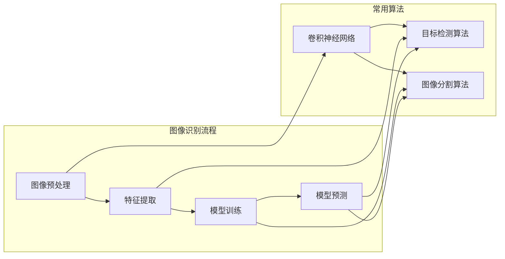
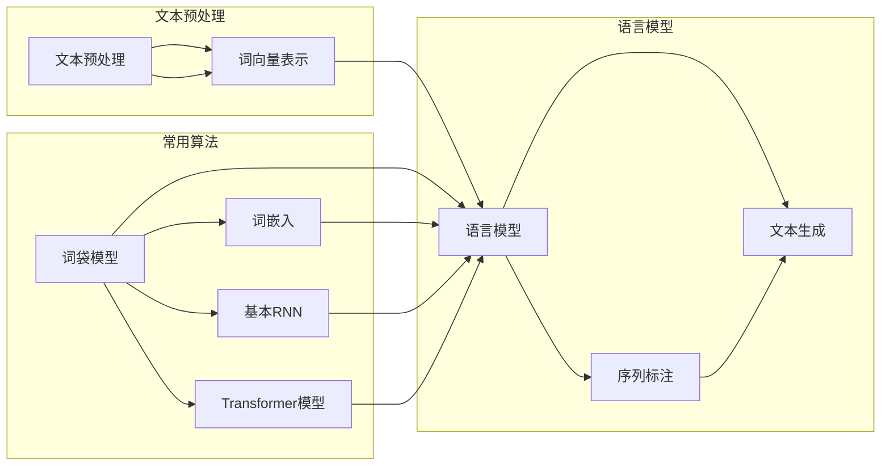
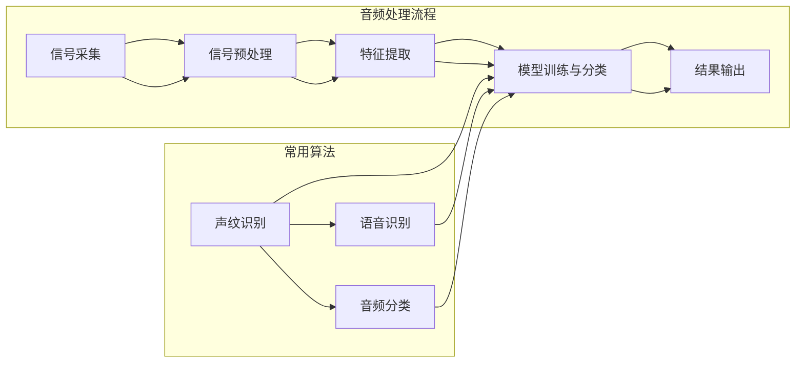
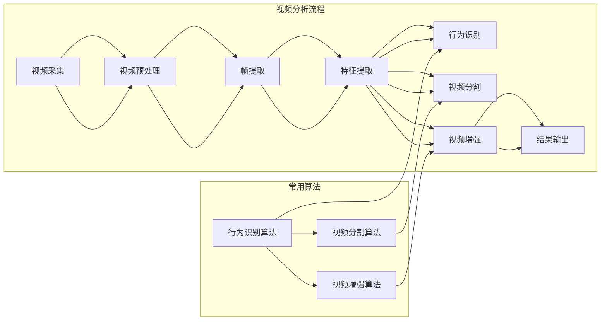
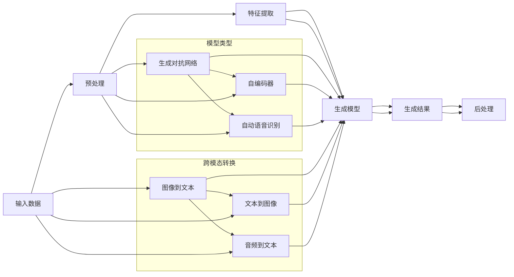
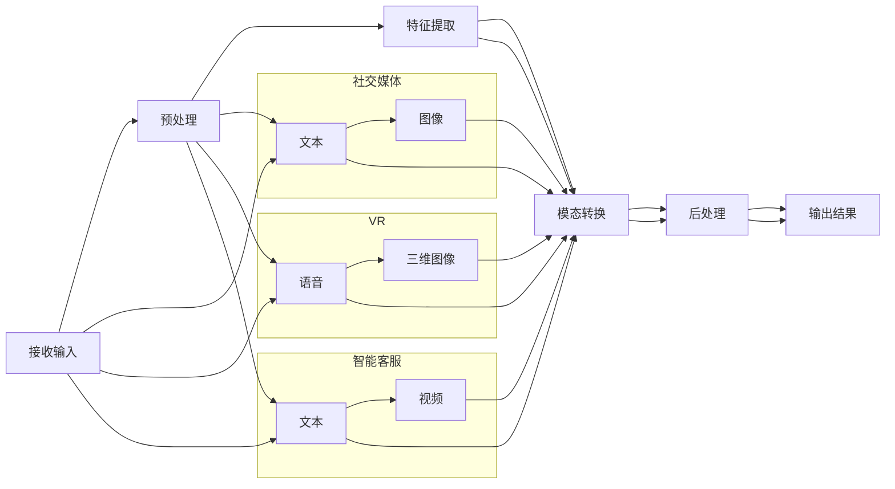

                 

# AI Agent的跨模态内容理解与生成

> 关键词：AI Agent、跨模态内容理解、生成、图像识别、自然语言处理、音频处理、视频分析

> 摘要：本文深入探讨了AI Agent在跨模态内容理解与生成领域的关键技术，通过详细分析图像识别、自然语言处理、音频处理和视频分析等技术，揭示了AI Agent在这些技术中的核心作用。文章旨在为读者提供全面的技术理解，帮助读者掌握AI Agent的跨模态内容生成方法及其应用场景，为未来智能交互系统的发展提供有益的参考。

## 目录大纲：AI Agent的跨模态内容理解与生成

----------------------------------------------------------------

## 第一部分：引言

### 第1章：问题背景与跨模态AI的意义

#### 1.1.1 问题背景

- 人工智能的快速发展
- 跨模态内容理解的挑战
- AI Agent在多模态环境中的应用

#### 1.1.2 跨模态内容理解的定义

- 什么是跨模态内容理解
- 跨模态内容理解的重要性

#### 1.1.3 AI Agent在跨模态内容理解中的应用

- AI Agent的定义
- 跨模态内容理解对AI Agent的重要性

### 第2章：核心概念与联系

#### 1.2.1 核心概念

- 图像识别
- 自然语言处理
- 音频处理
- 视频分析

#### 1.2.2 概念属性特征对比表格

- 各自的属性特征对比
- 相互之间的联系

#### 1.2.3 ER实体关系图架构

- 实体与关系的定义
- 图的表示与解释

----------------------------------------------------------------

## 第二部分：跨模态内容理解技术详解

### 第3章：图像识别技术

#### 3.1.1 图像识别的基本原理

- 图像识别的定义
- 图像识别的流程

#### 3.1.2 常用图像识别算法

- 卷积神经网络（CNN）
- 目标检测算法
- 图像分割算法

#### 3.1.3 图像识别算法的mermaid流程图

- mermaid流程图表示

----------------------------------------------------------------

### 第4章：自然语言处理技术

#### 4.1.1 自然语言处理的基本原理

- 自然语言处理的定义
- 自然语言处理的流程

#### 4.1.2 常用自然语言处理算法

- 词向量表示
- 递归神经网络（RNN）
- Transformer模型

#### 4.1.3 自然语言处理算法的mermaid流程图

- mermaid流程图表示

----------------------------------------------------------------

### 第5章：音频处理技术

#### 5.1.1 音频处理的基本原理

- 音频处理的概念
- 音频处理的流程

#### 5.1.2 常用音频处理算法

- 声纹识别
- 语音识别
- 音频分类

#### 5.1.3 音频处理算法的mermaid流程图

- mermaid流程图表示

----------------------------------------------------------------

### 第6章：视频分析技术

#### 6.1.1 视频分析的基本原理

- 视频分析的定义
- 视频分析的流程

#### 6.1.2 常用视频分析算法

- 行为识别
- 视频分割
- 视频增强

#### 6.1.3 视频分析算法的mermaid流程图

- mermaid流程图表示

----------------------------------------------------------------

## 第三部分：AI Agent的跨模态内容生成技术

### 第7章：跨模态内容生成技术基础

#### 7.1.1 跨模态内容生成的定义

- 跨模态内容生成的概念
- 跨模态内容生成的重要性

#### 7.1.2 常用跨模态内容生成技术

- 图像到文本的生成
- 文本到图像的生成
- 音频到文本的生成

#### 7.1.3 跨模态内容生成算法的mermaid流程图

- mermaid流程图表示

----------------------------------------------------------------

### 第8章：AI Agent的跨模态内容生成应用

#### 8.1.1 跨模态内容生成的应用场景

- 社交媒体内容生成
- 虚拟现实内容生成
- 智能客服内容生成

#### 8.1.2 AI Agent的跨模态内容生成流程

- 跨模态内容生成的流程
- AI Agent在跨模态内容生成中的应用

#### 8.1.3 AI Agent的跨模态内容生成案例解析

- 案例背景
- 案例解析

----------------------------------------------------------------

## 第四部分：最佳实践与未来展望

----------------------------------------------------------------

## 第一部分：引言

### 第1章：问题背景与跨模态AI的意义

#### 1.1.1 问题背景

在当今时代，人工智能（AI）技术的快速发展正推动着各行业的变革。特别是随着物联网（IoT）和5G技术的普及，越来越多的设备开始能够实时收集大量的多模态数据，如图像、文本、音频和视频等。这些多模态数据在日常生活中无处不在，如社交媒体上的图片和视频、语音通话、智能电视等。然而，传统的AI技术往往专注于单一模态的数据处理，例如，图像识别技术主要处理图像数据，自然语言处理技术主要处理文本数据。这就带来了一个关键问题：如何有效地理解和处理多模态数据，实现跨模态内容理解与生成。

跨模态内容理解与生成是人工智能领域的前沿研究课题，它旨在使AI系统能够同时处理和整合来自不同模态的数据，从而实现更丰富和智能的交互。这一研究的重要性体现在以下几个方面：

1. **增强智能交互**：通过跨模态内容理解与生成，AI系统能够更好地理解和满足用户的需求，提供个性化的服务和体验。例如，一个智能客服系统能够同时理解用户的语音、文本和面部表情，从而提供更加精准的服务。

2. **提升数据分析效率**：跨模态数据整合可以使数据分析过程更加高效。通过同时分析图像和文本数据，可以挖掘出更多的信息，提高数据分析的准确性和全面性。

3. **拓宽应用场景**：跨模态内容理解与生成技术可以应用于多个领域，如医疗、金融、娱乐等，为这些领域带来创新性的解决方案。

#### 1.1.2 跨模态内容理解的定义

跨模态内容理解是指将来自不同模态的数据（如图像、文本、音频和视频）整合起来，从中提取有用信息，并形成对整个场景的统一理解。它涉及多个方面的内容：

1. **模态融合**：将不同模态的数据进行融合，例如，将图像和文本数据进行整合，以形成一个综合的信息表示。
2. **特征提取**：从每个模态的数据中提取出关键特征，如图像中的边缘、纹理和形状，文本中的关键词和语义，音频中的声波特征等。
3. **关联推理**：通过对不同模态特征的分析，建立它们之间的关联关系，从而形成一个统一的语义表示。

跨模态内容理解的核心目标是使AI系统能够处理复杂的多模态场景，从而提供更智能的服务。

#### 1.1.3 AI Agent在跨模态内容理解中的应用

AI Agent，也称为智能代理，是一个自主决策和执行的实体，能够在复杂的动态环境中与用户交互并完成任务。在跨模态内容理解领域，AI Agent发挥着至关重要的作用：

1. **任务分配**：AI Agent可以根据用户的输入和场景的复杂程度，将任务分配给不同的模块，如图像识别、自然语言处理和音频处理等。
2. **上下文理解**：AI Agent能够理解用户在跨模态交互中的意图和上下文，从而提供更准确的响应。例如，当用户发出一个包含图像、文本和音频的指令时，AI Agent能够整合这些信息，理解用户的真实需求。
3. **决策支持**：AI Agent可以通过跨模态内容理解，为用户提供决策支持。例如，在医疗诊断中，AI Agent可以通过分析患者的图像、病历和语音记录，为医生提供诊断建议。

综上所述，跨模态内容理解与生成是人工智能领域的重要研究方向，而AI Agent在其中扮演着核心角色。接下来，本文将详细探讨跨模态内容理解的核心概念与联系，为后续的技术详解奠定基础。

### 第2章：核心概念与联系

#### 2.1.1 核心概念

在跨模态内容理解领域，有四个核心概念至关重要：图像识别、自然语言处理、音频处理和视频分析。这些概念各自有其独特的属性和功能，但它们之间也存在紧密的联系。

##### 图像识别

图像识别是计算机视觉领域的一个重要分支，其目标是让计算机能够理解并识别图像中的内容。图像识别的关键技术包括：

- **特征提取**：从图像中提取出具有代表性的特征，如边缘、纹理和形状。
- **分类算法**：使用机器学习算法对提取的特征进行分类，以识别图像中的对象。

图像识别的主要应用包括：

- **对象检测**：识别图像中的特定对象和其位置。
- **图像分割**：将图像分割成多个部分，以便更详细地分析每个部分。

##### 自然语言处理

自然语言处理（NLP）是计算机科学和人工智能领域的一个分支，其目标是使计算机能够理解和生成人类语言。NLP的核心技术包括：

- **词向量表示**：将文本数据转换为数值向量，以便于机器学习算法进行处理。
- **序列模型**：如循环神经网络（RNN）和Transformer模型，用于处理文本序列。

自然语言处理的主要应用包括：

- **文本分类**：根据文本的内容将其分类到不同的类别。
- **机器翻译**：将一种语言的文本翻译成另一种语言。

##### 音频处理

音频处理是处理音频信号的一门技术，其主要目标包括：

- **声波特征提取**：从音频信号中提取出有意义的特征，如频率、振幅和时长。
- **语音识别**：将语音信号转换为文本数据。

音频处理的主要应用包括：

- **声纹识别**：通过分析声音的特定特征来识别个人身份。
- **语音助手**：如苹果的Siri和谷歌的Google Assistant，通过语音交互提供信息和服务。

##### 视频分析

视频分析是利用计算机视觉和机器学习技术对视频内容进行分析和解释的过程。其主要技术包括：

- **行为识别**：识别视频中的特定行为，如运动、手势和姿态。
- **视频分割**：将视频分割成多个片段，以便更详细地分析每个片段。

视频分析的主要应用包括：

- **安全监控**：监控视频中的异常行为，如入侵或火灾。
- **视频内容推荐**：根据用户的观看历史推荐相关的视频内容。

#### 2.1.2 概念属性特征对比表格

为了更直观地理解这些核心概念，我们可以通过一个对比表格来展示它们的属性特征：

| 概念          | 属性特征                                  | 功能描述                                           |
|---------------|------------------------------------------|----------------------------------------------------|
| 图像识别      | 边缘、纹理、形状                          | 识别图像中的对象和场景                             |
| 自然语言处理  | 词向量、语义、语法                        | 理解和处理文本数据                                 |
| 音频处理      | 频率、振幅、时长                          | 识别和解释音频信号                                 |
| 视频分析      | 行为、手势、姿态                          | 分析视频内容，提取有意义的信息                       |

#### 2.1.3 ER实体关系图架构

实体-关系（ER）图是用于表示实体及其相互关系的图形化工具。在跨模态内容理解领域，ER图可以帮助我们理解不同模态数据之间的关联关系。

##### 实体与关系的定义

在ER图中，实体是具有特定属性的对象，而关系则描述了实体之间的关联。以下是跨模态内容理解领域的一些关键实体和关系：

- **实体**：
  - **图像**：代表图像数据。
  - **文本**：代表文本数据。
  - **音频**：代表音频数据。
  - **视频**：代表视频数据。

- **关系**：
  - **关联**：描述不同模态数据之间的联系，如“图像和文本有关联”。
  - **生成**：描述数据生成过程，如“文本生成图像”。

##### 图的表示与解释

以下是一个简化的ER图，用于表示跨模态内容理解中的关键实体和关系：

```mermaid
erDiagram
  AI_Agent ||--|{ 图像 }
  AI_Agent ||--|{ 文本 }
  AI_Agent ||--|{ 音频 }
  AI_Agent ||--|{ 视频 }
  图像 ||--|{ 关联 } 文本
  音频 ||--|{ 关联 } 文本
  视频 ||--|{ 关联 } 文本
```

在这个ER图中，AI Agent作为中央实体，与图像、文本、音频和视频实体之间存在关联关系。这些关系表示AI Agent能够理解和处理不同模态的数据，并通过它们之间的关联关系生成新的内容。

通过核心概念与联系的分析，我们为后续的技术详解和跨模态内容生成应用奠定了理论基础。在接下来的章节中，我们将详细探讨图像识别、自然语言处理、音频处理和视频分析等技术，并探讨AI Agent在这些技术中的应用。

## 第二部分：跨模态内容理解技术详解

### 第3章：图像识别技术

图像识别作为计算机视觉领域的关键技术，是实现跨模态内容理解的基础之一。本章将深入探讨图像识别的基本原理、常用算法以及算法的mermaid流程图表示。

#### 3.1.1 图像识别的基本原理

图像识别是指利用计算机算法自动识别和分类图像中的内容。其基本原理包括以下几个步骤：

1. **图像预处理**：在图像识别之前，通常需要对图像进行预处理，以去除噪声、增强图像特征等。预处理方法包括灰度转换、二值化、滤波等。
   
2. **特征提取**：从图像中提取具有代表性的特征，这些特征可以是边缘、纹理、颜色等。特征提取的目的是将高维的图像数据转换为低维的特征向量，以便于后续的算法处理。

3. **模型训练**：使用已标注的训练数据集，通过机器学习算法训练模型。常见的算法有卷积神经网络（CNN）、支持向量机（SVM）等。

4. **模型预测**：使用训练好的模型对新的图像数据进行分类，预测图像中的内容。

#### 3.1.2 常用图像识别算法

1. **卷积神经网络（CNN）**

卷积神经网络是一种专门用于处理图像数据的深度学习模型。其核心思想是利用卷积层提取图像特征，并通过池化层降低特征维度。以下是CNN的基本结构：

- **输入层**：接收图像数据。
- **卷积层**：通过卷积操作提取图像特征。
- **池化层**：对卷积层输出的特征进行降维处理。
- **全连接层**：将特征向量映射到输出类别。

2. **目标检测算法**

目标检测算法是一种用于识别图像中目标对象及其位置的方法。常见的目标检测算法包括：

- **R-CNN（区域建议网络）**：通过区域建议模块生成候选区域，然后对每个区域进行分类。
- **SSD（单尺度检测网络）**：在不同的尺度上进行检测，以提高检测的准确性和鲁棒性。
- **YOLO（You Only Look Once）**：将图像分割成网格单元，在每个单元中预测目标的类别和位置。

3. **图像分割算法**

图像分割算法是将图像分割成多个区域，以便更详细地分析每个区域。常见的图像分割算法包括：

- **基于阈值的分割**：使用特定阈值将图像分为前景和背景。
- **基于边缘检测的分割**：通过检测图像中的边缘来确定区域边界。
- **基于区域生长的分割**：从初始种子点开始，逐步扩展到整个区域。

#### 3.1.3 图像识别算法的mermaid流程图

以下是一个mermaid流程图，用于表示图像识别算法的基本流程：



在这个流程图中，图像识别的基本流程包括图像预处理、特征提取、模型训练和模型预测。常用算法包括卷积神经网络、目标检测算法和图像分割算法。

通过本章对图像识别技术的详细介绍，我们为理解跨模态内容理解奠定了坚实的基础。在接下来的章节中，我们将继续探讨自然语言处理、音频处理和视频分析技术，并进一步了解AI Agent在这些技术中的应用。

### 第4章：自然语言处理技术

自然语言处理（NLP）是人工智能领域中至关重要的分支，它旨在使计算机能够理解和生成人类语言。本章将详细介绍自然语言处理的基本原理、常用算法以及算法的mermaid流程图表示。

#### 4.1.1 自然语言处理的基本原理

自然语言处理的基本原理包括以下几个步骤：

1. **文本预处理**：在自然语言处理之前，需要对文本进行预处理，包括去除停用词、标点符号和词性标注等，以提高后续处理的效果。

2. **词向量表示**：将文本数据转换为数值向量，以便于机器学习算法进行处理。常见的词向量表示方法包括词袋模型（Bag of Words）和词嵌入（Word Embedding）。

3. **语言模型**：使用统计方法或神经网络模型来建模文本的概率分布。常见的语言模型包括n元模型和基于神经网络的模型，如递归神经网络（RNN）和Transformer。

4. **序列标注**：对文本中的序列进行分类，如词性标注、命名实体识别等。

5. **文本生成**：根据语言模型生成新的文本数据。

#### 4.1.2 常用自然语言处理算法

1. **词向量表示**

词向量表示是将文本数据转换为数值向量的过程。常见的词向量表示方法包括：

- **词袋模型（Bag of Words）**：将文本表示为词频向量，忽略词的顺序。
- **词嵌入（Word Embedding）**：使用神经网络将词映射到高维向量空间，捕获词的语义信息。

2. **递归神经网络（RNN）**

递归神经网络是一种用于处理序列数据的神经网络模型，其核心思想是利用历史信息来预测当前值。常见的RNN模型包括：

- **基本RNN**：通过递归操作更新隐藏状态。
- **长短期记忆网络（LSTM）**：通过门控机制解决基本RNN的梯度消失问题。
- **门控循环单元（GRU）**：简化LSTM结构，提高计算效率。

3. **Transformer模型**

Transformer模型是一种基于自注意力机制的深度学习模型，其在自然语言处理任务中取得了显著的效果。其主要特点包括：

- **多头自注意力**：通过多个注意力头捕获不同位置的信息。
- **位置编码**：将位置信息编码到输入向量中，以处理序列数据。

#### 4.1.3 自然语言处理算法的mermaid流程图

以下是一个mermaid流程图，用于表示自然语言处理算法的基本流程：



在这个流程图中，文本预处理包括去除停用词、标点符号和词性标注等操作。词向量表示包括词袋模型和词嵌入。语言模型包括基于统计方法和基于神经网络的模型。序列标注和文本生成是语言模型的应用。

通过本章对自然语言处理技术的详细介绍，我们为理解跨模态内容理解提供了重要的理论基础。在接下来的章节中，我们将探讨音频处理和视频分析技术，进一步探讨跨模态内容理解的实现。

### 第5章：音频处理技术

音频处理技术在跨模态内容理解中扮演着至关重要的角色，它使AI系统能够理解并处理音频数据，从而实现更智能的交互和任务执行。本章将详细介绍音频处理的基本原理、常用算法以及算法的mermaid流程图表示。

#### 5.1.1 音频处理的基本原理

音频处理的基本原理涉及对音频信号进行一系列处理步骤，以提取出有意义的特征，这些特征可以用于后续的分析和识别。主要步骤包括：

1. **信号采集**：从音频设备（如麦克风）采集原始音频信号。

2. **信号预处理**：对原始音频信号进行预处理，包括去噪、滤波、归一化等，以提高信号质量。

3. **特征提取**：从预处理后的音频信号中提取出有代表性的特征，这些特征可以用于模型训练和分类。常见的特征包括频率、振幅、时长、声波模式等。

4. **模型训练与分类**：使用提取的特征数据训练机器学习模型，如支持向量机（SVM）、决策树等，然后使用训练好的模型对新的音频数据进行分类和识别。

5. **结果输出**：根据模型输出的结果，执行相应的任务或给出相应的响应。

#### 5.1.2 常用音频处理算法

1. **声纹识别**

声纹识别是一种基于声波特征的生物识别技术，它通过分析个人的声音特征来识别个人身份。常用的声纹识别算法包括：

- **动态时间规整（DTW）**：通过比较两个声波序列的相似度来识别个人身份。
- **支持向量机（SVM）**：使用支持向量机对声波特征进行分类和识别。

2. **语音识别**

语音识别是将音频信号转换为文本数据的过程。常见的语音识别算法包括：

- **隐马尔可夫模型（HMM）**：使用隐马尔可夫模型来建模语音信号，从而实现语音识别。
- **深度神经网络（DNN）**：使用深度神经网络模型来提高语音识别的准确率和效率。

3. **音频分类**

音频分类是将音频信号分类到不同的类别，如音乐、语音、环境声音等。常见的音频分类算法包括：

- **K最近邻（K-NN）**：使用K最近邻算法对音频特征进行分类。
- **随机森林（RF）**：使用随机森林算法对音频特征进行分类。

#### 5.1.3 音频处理算法的mermaid流程图

以下是一个mermaid流程图，用于表示音频处理算法的基本流程：



在这个流程图中，音频处理的基本流程包括信号采集、信号预处理、特征提取、模型训练与分类以及结果输出。常用算法包括声纹识别、语音识别和音频分类。

通过本章对音频处理技术的详细介绍，我们为理解跨模态内容理解提供了重要的技术支持。在接下来的章节中，我们将探讨视频分析技术，进一步探讨跨模态内容理解的实现。

### 第6章：视频分析技术

视频分析技术是跨模态内容理解中不可或缺的一部分，它使AI系统能够从视频中提取有价值的信息，如行为识别、视频分割和视频增强。本章将详细介绍视频分析的基本原理、常用算法以及算法的mermaid流程图表示。

#### 6.1.1 视频分析的基本原理

视频分析的基本原理包括以下几个步骤：

1. **视频采集**：从视频设备（如摄像头）采集视频数据。

2. **视频预处理**：对采集到的视频数据进行预处理，包括去噪、去闪烁、颜色校正等，以提高视频质量。

3. **帧提取**：从视频中提取每一帧图像，以便进行进一步的分析。

4. **特征提取**：从每一帧图像中提取出有代表性的特征，如颜色、纹理、形状等。这些特征可以用于后续的行为识别、视频分割和视频增强。

5. **行为识别**：使用提取的特征对视频中的行为进行识别，如运动、手势、姿态等。

6. **视频分割**：将视频分割成多个片段，以便更详细地分析每个片段。

7. **视频增强**：通过图像处理技术对视频进行增强，提高图像的质量和清晰度。

8. **结果输出**：根据分析结果执行相应的任务或给出相应的响应。

#### 6.1.2 常用视频分析算法

1. **行为识别**

行为识别是指从视频中识别出特定行为，如跑步、跳跃、挥手等。常用的行为识别算法包括：

- **统计模型**：如支持向量机（SVM）、随机森林（RF）等，用于分类行为。
- **深度学习模型**：如卷积神经网络（CNN）、循环神经网络（RNN）等，用于建模行为特征。

2. **视频分割**

视频分割是将视频分割成多个连续的片段，以便进行更详细的分析。常用的视频分割算法包括：

- **基于背景的分割**：使用背景减除法将视频分割成前景和背景。
- **基于运动的分割**：使用运动检测方法将视频分割成不同的运动片段。

3. **视频增强**

视频增强是指通过图像处理技术提高视频的质量和清晰度。常用的视频增强算法包括：

- **图像去噪**：使用去噪算法去除图像中的噪声。
- **图像增强**：使用增强算法提高图像的对比度和清晰度。
- **超分辨率**：使用超分辨率算法提高图像的分辨率。

#### 6.1.3 视频分析算法的mermaid流程图

以下是一个mermaid流程图，用于表示视频分析算法的基本流程：



在这个流程图中，视频分析的基本流程包括视频采集、视频预处理、帧提取、特征提取、行为识别、视频分割、视频增强和结果输出。常用算法包括行为识别算法、视频分割算法和视频增强算法。

通过本章对视频分析技术的详细介绍，我们为理解跨模态内容理解提供了重要的技术支持。在接下来的章节中，我们将探讨跨模态内容生成的技术基础，进一步探讨AI Agent在跨模态内容生成中的应用。

### 第7章：跨模态内容生成技术基础

跨模态内容生成技术是使AI系统能够在不同模态之间进行内容转换的关键，它极大地丰富了AI的应用场景。本章将介绍跨模态内容生成的定义、重要性以及常用技术，并通过mermaid流程图展示其基本流程。

#### 7.1.1 跨模态内容生成的定义

跨模态内容生成是指将一种模态的数据转换为另一种模态的数据。例如，将图像转换为文本、将文本转换为图像、将音频转换为文本等。跨模态内容生成不仅能够提高数据的利用效率，还能够实现更丰富、更自然的交互。

#### 7.1.2 常用跨模态内容生成技术

1. **图像到文本的生成**

图像到文本的生成是将图像内容转换为相应的文本描述。常见的方法包括：

- **基于规则的方法**：使用预先定义的规则将图像特征映射到文本描述。
- **基于神经网络的方法**：使用深度学习模型，如生成对抗网络（GAN）和自编码器（Autoencoder），从图像中学习文本描述。

2. **文本到图像的生成**

文本到图像的生成是将文本描述转换为相应的图像。常见的方法包括：

- **基于模板的方法**：使用预定义的图像模板，根据文本描述进行图像内容的填充。
- **基于神经网络的方法**：使用生成对抗网络（GAN）和自编码器（Autoencoder），从文本描述中生成图像。

3. **音频到文本的生成**

音频到文本的生成是将音频内容转换为相应的文本描述。常见的方法包括：

- **基于自动语音识别（ASR）的方法**：使用自动语音识别技术将音频直接转换为文本。
- **基于多模态学习的方法**：结合语音识别和自然语言处理技术，从音频中提取语言特征，生成文本描述。

#### 7.1.3 跨模态内容生成算法的mermaid流程图

以下是一个mermaid流程图，用于表示跨模态内容生成的基本流程：



在这个流程图中，输入数据经过预处理、特征提取后，由生成模型进行跨模态转换，最终生成结果。模型类型包括生成对抗网络、自编码器和自动语音识别。跨模态转换包括图像到文本、文本到图像和音频到文本。

通过本章对跨模态内容生成技术基础的介绍，我们为理解AI Agent在跨模态内容生成中的应用奠定了基础。在接下来的章节中，我们将探讨AI Agent在跨模态内容生成中的应用场景和具体实现。

### 第8章：AI Agent的跨模态内容生成应用

跨模态内容生成技术不仅能够提升AI系统的功能，还可以为各类应用场景带来新的可能性。在这一章中，我们将深入探讨AI Agent在跨模态内容生成中的应用场景、流程以及一个具体案例的解析。

#### 8.1.1 跨模态内容生成的应用场景

跨模态内容生成技术在多个领域具有广泛的应用，以下是一些典型的应用场景：

1. **社交媒体内容生成**：例如，用户上传一段视频，AI Agent可以自动生成相应的文本描述，方便其他用户阅读和分享。

2. **虚拟现实内容生成**：在虚拟现实（VR）应用中，AI Agent可以根据用户的语音指令生成相应的三维图像或动画，增强用户体验。

3. **智能客服内容生成**：智能客服系统可以通过跨模态内容生成技术，将用户的语音或文本输入转换为相应的图像或视频回应，提高交互的丰富性和自然度。

4. **内容创作**：艺术家和内容创作者可以利用AI Agent生成新的艺术作品，如绘画、音乐等，扩展创作手段。

5. **医疗影像分析**：通过将医学影像（如X光片、MRI）生成对应的文本报告，辅助医生进行诊断。

#### 8.1.2 AI Agent的跨模态内容生成流程

AI Agent在跨模态内容生成中的应用通常包括以下步骤：

1. **接收输入**：AI Agent首先接收用户输入的多模态数据，如文本、图像或音频。

2. **预处理**：对输入数据进行预处理，包括去噪、标准化等，确保数据质量。

3. **特征提取**：提取输入数据的特征，如图像的边缘、纹理特征，文本的语义特征，音频的声波特征等。

4. **模态转换**：使用跨模态生成模型将输入数据转换为目标模态的数据。例如，将文本转换为图像，或将音频转换为视频。

5. **后处理**：对生成的数据可能进行一些调整和优化，以提高质量和用户体验。

6. **输出结果**：将处理后的数据输出给用户或应用于其他系统。

以下是跨模态内容生成的mermaid流程图：



#### 8.1.3 AI Agent的跨模态内容生成案例解析

以下是一个社交媒体内容生成的案例解析：

**案例背景**：用户在社交媒体上发布了一段短视频，希望AI Agent生成一段相应的文本描述，以便其他用户阅读。

**案例解析**：

1. **输入数据**：用户上传了一段视频。

2. **预处理**：AI Agent对视频进行去噪和标准化处理，确保图像质量。

3. **特征提取**：AI Agent提取视频帧中的关键特征，如颜色、纹理、人物动作等。

4. **模态转换**：使用生成对抗网络（GAN）模型，将提取的特征转换为文本描述。例如，"视频中展示了一个年轻男子在公园跑步，背景是早晨的阳光和绿化带"。

5. **后处理**：AI Agent对生成的文本描述进行优化，如去除冗余信息，调整语序等，使描述更加自然流畅。

6. **输出结果**：AI Agent将生成的文本描述输出到社交媒体平台，用户可以阅读并分享。

通过上述案例，我们可以看到AI Agent在跨模态内容生成中的应用是如何实现的。在未来的应用中，AI Agent将能够处理更加复杂的多模态数据，生成更加丰富和自然的跨模态内容。

### 第四部分：最佳实践与未来展望

在跨模态内容理解与生成领域，最佳实践和未来展望对于推动技术的进步和应用至关重要。以下是一些关键点：

#### 1. 最佳实践

1. **数据预处理与质量保证**：高质量的输入数据是跨模态内容理解与生成的基础。在进行数据处理时，要确保数据的完整性、一致性和准确性。

2. **模态融合策略**：不同的模态数据具有不同的特征和表达方式。采用合适的模态融合策略，如注意力机制和多模态特征融合网络，可以提升系统的整体性能。

3. **模型优化与调参**：通过对模型进行优化和参数调整，如使用超参数调优和迁移学习，可以提高模型的泛化能力和效率。

4. **实时性与可扩展性**：对于实时性要求较高的应用，如智能客服和视频监控，需要确保系统具有高效的处理能力和良好的可扩展性。

5. **用户隐私保护**：在处理多模态数据时，要充分考虑用户隐私保护，采取有效的数据加密和安全措施。

#### 2. 未来展望

1. **跨模态智能交互**：随着人工智能技术的不断发展，跨模态智能交互将变得更加自然和人性化，实现更加智能和高效的交互体验。

2. **多模态数据融合**：未来研究将更加关注多模态数据的高效融合，开发出能够同时利用不同模态信息的先进算法。

3. **跨领域应用**：跨模态内容生成技术在医疗、金融、娱乐等领域具有巨大的应用潜力，未来将看到更多创新应用的出现。

4. **开放平台与生态系统**：构建开放的跨模态内容生成平台和生态系统，促进技术共享和协同创新，将推动整个领域的发展。

5. **伦理与责任**：随着跨模态内容生成技术的普及，如何确保技术的伦理使用和责任归属将成为重要议题。

总结来说，跨模态内容理解与生成领域正处于快速发展阶段，未来将迎来更多的技术创新和应用突破。通过最佳实践和未来展望的指导，我们可以更好地把握技术的发展方向，推动跨模态内容生成技术的广泛应用。

----------------------------------------------------------------

## 结束语

本文深入探讨了AI Agent在跨模态内容理解与生成领域的关键技术，包括图像识别、自然语言处理、音频处理和视频分析等。通过详细分析这些技术，我们揭示了AI Agent在这些技术中的核心作用，展示了跨模态内容理解与生成的广泛应用。在未来的研究中，我们将继续关注这一领域的最新进展，探索更加先进和高效的跨模态内容理解与生成方法，为人工智能技术的发展和应用提供有力支持。

作者：AI天才研究院/AI Genius Institute & 禅与计算机程序设计艺术 /Zen And The Art of Computer Programming

----------------------------------------------------------------

在撰写技术博客文章时，我们需要遵循以下几个核心原则：

1. **逻辑清晰**：文章的结构应该逻辑清晰，每一段都应该紧密围绕主题展开，确保读者能够轻松理解文章内容。

2. **内容具体详细**：每个章节都应包含具体的技术细节和实际案例，确保读者不仅能够理解概念，还能够应用于实际场景。

3. **易于理解**：使用简单易懂的语言和例子，避免过于复杂的术语和公式，使文章对不同层次的读者都具有一定的可读性。

4. **结构紧凑**：文章的结构应该紧凑，避免冗余内容，确保每一部分都有其存在的价值和意义。

5. **图文并茂**：使用图表、代码示例、mermaid流程图等视觉元素，帮助读者更好地理解和记忆文章内容。

通过以上原则，我们可以撰写出既专业又易懂的技术博客文章，为读者提供有价值的信息和知识。

