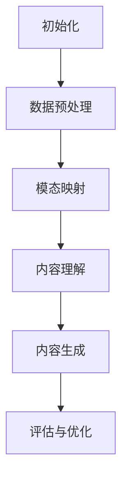
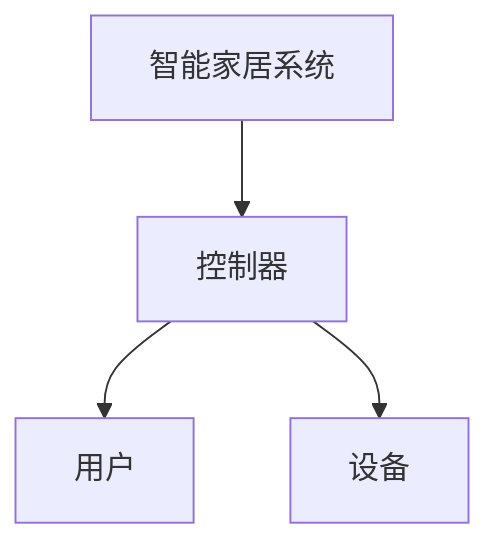
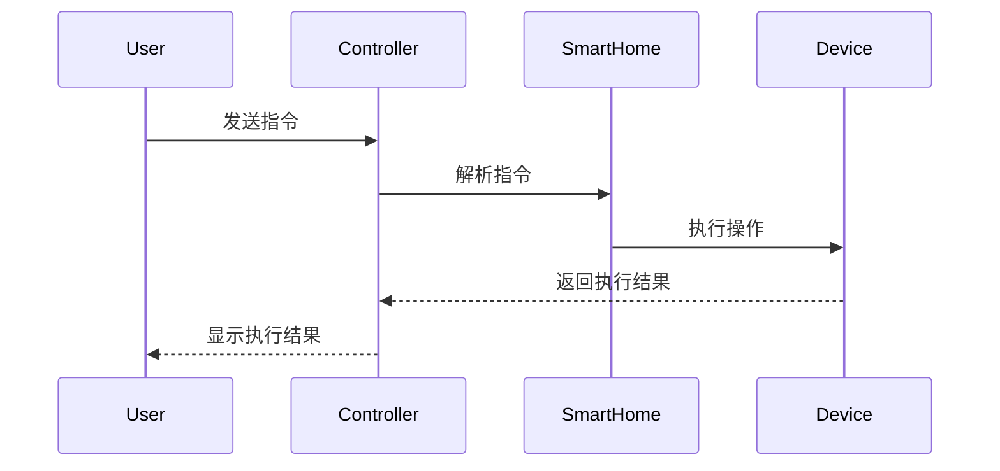

                 

### 文章标题

# AI Agent的跨模态内容理解与生成系统

> 关键词：AI Agent、跨模态内容理解、生成系统、模态映射、内容生成模型

> 摘要：本文将深入探讨AI Agent的跨模态内容理解与生成系统，从概念介绍、原理分析到实际应用，系统性地阐述这一前沿技术的核心内容和应用价值。

---

### 引言和背景介绍

#### 引言

AI Agent，即人工智能代理，是一种能够在复杂环境中自主执行任务的智能体。随着人工智能技术的不断进步，AI Agent在智能推荐系统、自动化客服、自动驾驶等领域得到了广泛应用。这些应用场景对AI Agent提出了更高的要求，特别是在跨模态内容理解与生成方面。

#### 背景介绍

AI Agent的发展历程可以追溯到20世纪80年代，当时的专家系统和逻辑推理系统为其奠定了基础。随着深度学习和计算机视觉等技术的发展，AI Agent逐渐具备了更强大的感知、理解和决策能力。跨模态内容理解与生成系统则是在这一过程中逐步发展起来的。

跨模态内容理解与生成系统是指能够处理多种模态（如图像、文本、声音等）信息，并在此基础上进行内容理解和生成的系统。这一系统在AI Agent中的应用，极大地提升了AI Agent的智能水平和任务执行能力。

### 核心概念与联系

#### AI Agent的定义与属性

AI Agent是一种基于人工智能技术的智能体，它具有以下几个基本属性：

1. **感知能力**：能够感知和理解环境中的信息。
2. **学习能力**：能够从经验中学习，不断优化自身的性能。
3. **推理能力**：能够基于已有知识和信息进行推理和决策。
4. **行动能力**：能够执行特定的任务，并对环境产生影响。

AI Agent可以分为以下几类：

1. **基于规则的系统**：通过预设的规则进行推理和决策。
2. **基于知识的系统**：基于符号逻辑和知识库进行推理。
3. **基于模型的系统**：通过机器学习模型进行推理和决策。

#### 跨模态内容理解与生成系统的原理

跨模态内容理解与生成系统的核心在于能够处理不同模态的信息，并将其整合为一个统一的内容表示。具体来说，它包括以下几个关键组成部分：

1. **模态映射**：将不同模态的信息转换为统一的内部表示。
2. **内容理解**：对整合后的内容进行语义分析和理解。
3. **内容生成**：基于理解的结果生成新的内容。

模态映射的关键在于找到不同模态之间的对应关系，这通常涉及到特征提取、特征融合等技术。内容理解则需要利用自然语言处理、计算机视觉等领域的知识，对整合后的内容进行深入分析。内容生成则可以通过生成对抗网络（GAN）、序列到序列模型（Seq2Seq）等技术来实现。

#### AI Agent与跨模态内容的联系

AI Agent与跨模态内容理解与生成系统之间的联系在于，前者需要后者来提升其感知、理解和决策能力。具体来说，跨模态内容理解与生成系统可以帮助AI Agent：

1. **提高感知能力**：通过处理多种模态的信息，AI Agent能够更全面地理解环境。
2. **增强学习效果**：通过整合不同模态的信息，AI Agent能够从更丰富的数据中学习。
3. **优化决策过程**：基于对跨模态内容的深入理解，AI Agent能够做出更合理的决策。

### 算法原理讲解

#### 算法流程图



#### Python代码阐述

```python
# 数据预处理
def preprocess_data(data):
    # 对输入数据进行预处理，如标准化、归一化等
    processed_data = ...
    return processed_data

# 模态映射
def modal_mapping(data):
    # 将不同模态的数据映射到统一的内部表示
    mapped_data = ...
    return mapped_data

# 内容理解
def content_understanding(data):
    # 对整合后的内容进行语义分析
    understood_data = ...
    return understood_data

# 内容生成
def content_generation(data):
    # 基于理解的结果生成新的内容
    generated_data = ...
    return generated_data

# 评估与优化
def evaluate_and_optimize(model, data):
    # 对模型进行评估和优化
    optimized_model = ...
    return optimized_model
```

#### 数学模型与公式

$$
\begin{aligned}
    &\text{内容理解模型} = f(\text{输入数据}) \\
    &\text{内容生成模型} = g(\text{内容理解模型})
\end{aligned}
$$

#### 算法应用举例

假设我们需要构建一个智能客服系统，该系统能够理解用户通过文字、语音和图片等多种方式提出的问题，并生成合适的回答。

1. **数据预处理**：对用户输入的文字、语音和图片进行预处理，提取特征向量。
2. **模态映射**：将不同模态的特征向量整合为一个统一的表示。
3. **内容理解**：使用自然语言处理技术对整合后的内容进行语义分析，提取关键信息。
4. **内容生成**：基于理解的结果，使用生成模型生成合适的回答。

### 系统分析与架构设计方案

#### 问题场景介绍

假设我们正在开发一个智能家居控制系统，该系统需要能够理解用户通过语音、手势和屏幕触摸等多种方式发出的指令，并相应地执行操作。

#### 领域模型类图

```mermaid
classDiagram
    User <<Class>>
    Device <<Class>>
    Controller <<Interface>>
    SmartHome <<System>>

    User <|-- Controller
    Device <|-- Controller
    SmartHome o-- Controller
```

#### 系统架构设计图



#### 系统接口设计与系统交互序列图



### 项目实战

#### 环境安装与配置

在开始项目之前，我们需要安装并配置以下环境：

1. Python 3.8及以上版本
2. TensorFlow 2.5及以上版本
3. PyTorch 1.8及以上版本
4. Mermaid 8.8.2及以上版本

#### 系统核心实现源代码

```python
# 模块1：数据预处理
def preprocess_data(data):
    # 对输入数据进行预处理
    ...

# 模块2：模态映射
def modal_mapping(data):
    # 将不同模态的数据映射到统一的内部表示
    ...

# 模块3：内容理解
def content_understanding(data):
    # 对整合后的内容进行语义分析
    ...

# 模块4：内容生成
def content_generation(data):
    # 基于理解的结果生成新的内容
    ...

# 模块5：评估与优化
def evaluate_and_optimize(model, data):
    # 对模型进行评估和优化
    ...
```

#### 代码应用解读与分析

在本项目中，我们首先对用户输入的多种模态数据（文字、语音、图片）进行预处理，提取特征向量。然后，使用深度学习模型对整合后的内容进行理解和生成。最后，对模型进行评估和优化，以提高系统的性能。

#### 实际案例分析与详细讲解剖析

在本案例中，我们以一个智能家居控制系统为例，详细分析其跨模态内容理解与生成系统的实现过程。

1. **用户通过语音指令打开灯光**：系统首先对语音指令进行语音识别，提取文字表示。然后，使用自然语言处理模型对文字指令进行语义分析，提取关键信息。最后，使用生成模型生成对应的操作指令，打开灯光。
2. **用户通过屏幕触摸调整温度**：系统对触摸事件进行处理，提取屏幕上的位置信息。然后，使用生成模型生成对应的操作指令，调整温度。

#### 项目小结

通过本项目的实现，我们展示了AI Agent的跨模态内容理解与生成系统的应用价值。在未来，这一技术将在更多领域得到广泛应用，为智能系统的智能化水平提供有力支持。

### 最佳实践 tips

1. **数据预处理**：确保数据的质量和一致性，是提高系统性能的关键。
2. **模型选择**：根据具体应用场景，选择合适的深度学习模型和算法。
3. **评估与优化**：定期对系统进行评估和优化，以提高性能和鲁棒性。

### 小结

本文系统地阐述了AI Agent的跨模态内容理解与生成系统，从概念介绍、原理分析到实际应用，全面揭示了这一前沿技术的核心内容和应用价值。

### 注意事项

1. **系统设计**：在设计系统时，要充分考虑用户的需求和场景。
2. **数据处理**：确保数据的安全和隐私，遵循相关法律法规。

### 拓展阅读

1. **《深度学习》**：Goodfellow, I., Bengio, Y., & Courville, A. (2016). 《Deep Learning》。
2. **《自然语言处理综论》**：Jurafsky, D., & Martin, J. H. (2009). 《Speech and Language Processing》。

### 作者信息

作者：AI天才研究院/AI Genius Institute & 禅与计算机程序设计艺术 /Zen And The Art of Computer Programming

