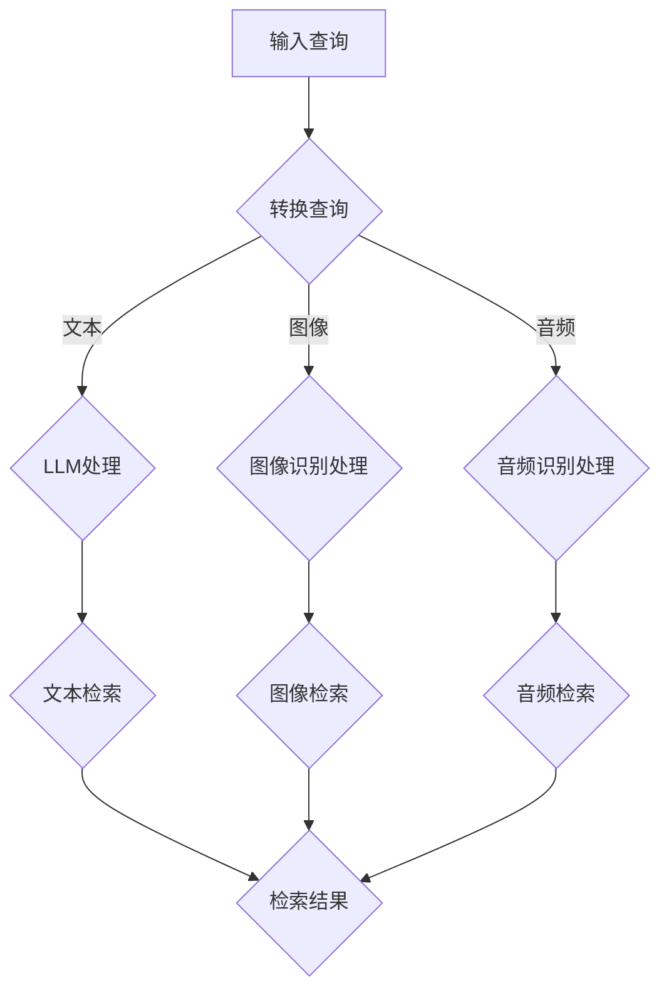
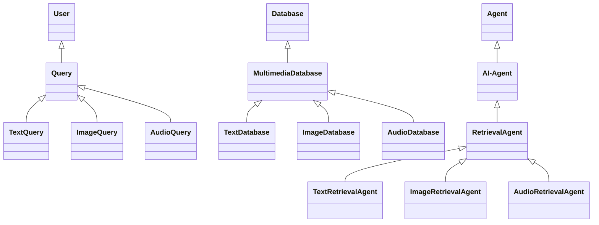
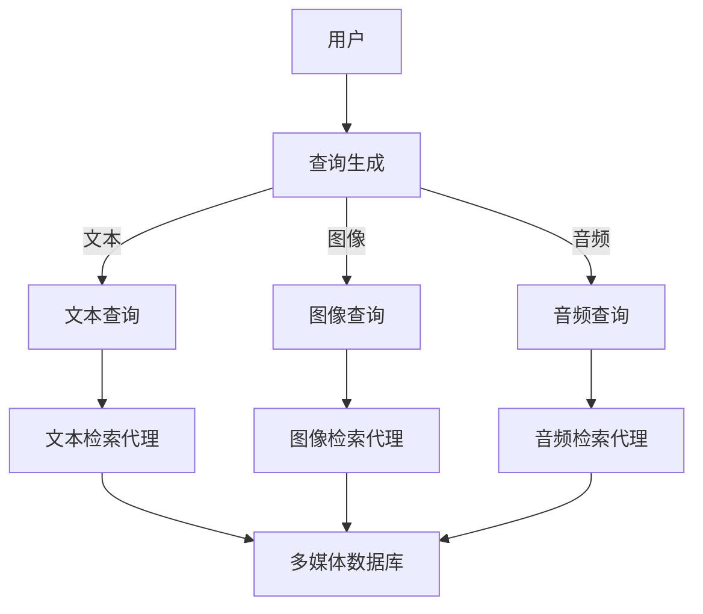

                 

# AI Agent的跨模态检索：整合LLM与多媒体数据库

## 关键词
- AI Agent
- 跨模态检索
- LLM
- 多媒体数据库
- 深度学习

## 摘要
本文深入探讨了AI Agent在跨模态检索中的应用，特别是在整合语言模型（LLM）与多媒体数据库的过程中。首先，我们将介绍AI Agent和跨模态检索的基本概念，以及它们在现代信息技术中的重要性。接着，本文将详细分析LLM在跨模态检索中的作用和挑战，探讨如何优化LLM与多媒体数据库的集成。随后，我们将通过具体实例展示一个跨模态检索系统的设计与实现过程，并分析其性能。最后，本文将总结AI Agent的跨模态检索技术，提出未来发展的方向和挑战。

## 1. 背景介绍

### 1.1 AI Agent的基本概念
AI Agent是指一种能够自主行动，并在环境中进行决策的计算机程序。它们通过感知环境、学习经验和执行动作来实现目标。AI Agent在多个领域有广泛的应用，如智能客服、自动驾驶、医疗诊断等。近年来，随着深度学习和自然语言处理技术的发展，AI Agent的智能水平显著提高，能够处理更加复杂和多样化的任务。

### 1.2 跨模态检索的定义
跨模态检索是指利用不同类型的数据模态（如图像、文本、音频等）进行信息检索的过程。传统的检索系统主要依赖于单一模态的数据，而跨模态检索通过整合多种模态的数据，可以提供更准确、更丰富的检索结果。跨模态检索的关键在于如何有效地将不同模态的数据进行统一表示和关联。

### 1.3 LLM在跨模态检索中的作用
语言模型（LLM）是一种能够生成文本的深度学习模型，如BERT、GPT等。LLM在跨模态检索中扮演着重要的角色，它可以将不同模态的数据转换为统一的文本表示，使得不同模态的数据能够进行交互和融合。同时，LLM的高效性和灵活性使其能够处理复杂的信息检索任务，提供高质量的检索结果。

### 1.4 多媒体数据库的特点和挑战
多媒体数据库是指存储多种类型数据（如图像、音频、视频等）的数据库系统。与传统的文本数据库相比，多媒体数据库具有更大的数据规模和更高的数据复杂性。这给数据的存储、检索和管理带来了巨大的挑战，如数据冗余、数据隐私、数据一致性等。此外，多媒体数据库需要支持跨模态的数据检索，这进一步增加了系统的复杂度。

## 2. 核心概念与联系

### 2.1 核心概念原理
- **AI Agent**：具有感知、学习和行动能力的计算机程序。
- **跨模态检索**：利用多种模态的数据进行信息检索。
- **LLM**：一种能够生成文本的深度学习模型，如BERT、GPT等。
- **多媒体数据库**：存储多种类型数据的数据库系统。

### 2.2 概念属性特征对比表格

| 概念       | 属性               | 特征                   |
|------------|--------------------|------------------------|
| AI Agent   | 感知、学习、行动   | 处理复杂任务           |
| 跨模态检索 | 多种模态的数据     | 提高检索准确性         |
| LLM        | 文本生成          | 高效、灵活             |
| 多媒体数据库 | 多类型数据       | 数据规模大、复杂度高   |

### 2.3 ER实体关系图架构

```mermaid
erDiagram
    AI_Agent ||--|{ 数据库 } Multimedia_Database
    AI_Agent ||--|{ 检索系统 } Retrieval_System
    Multimedia_Database ||--|{ 数据 } Data
    Retrieval_System ||--|{ 模型 } Language_Model
```

## 3. 算法原理讲解

### 3.1 跨模态检索算法的mermaid流程图



### 3.2 Python源代码实现

```python
import torch
import torchvision
import torchvision.transforms as transforms
import numpy as np

# 定义图像识别模型
model = torchvision.models.resnet50(pretrained=True)
model.eval()

# 定义语言模型
lm = torch.load('lm_model.pth')
lm.eval()

# 转换查询
def transform_query(query):
    # 对查询进行预处理，如分词、编码等
    pass

# 图像识别处理
def image_recognition(image):
    transform = transforms.Compose([
        transforms.Resize(256),
        transforms.CenterCrop(224),
        transforms.ToTensor(),
        transforms.Normalize(mean=[0.485, 0.456, 0.406], std=[0.229, 0.224, 0.225]),
    ])
    image = transform(image)
    image = image.unsqueeze(0)
    with torch.no_grad():
        output = model(image)
    return output

# 语言模型处理
def language_modeling(query):
    query = transform_query(query)
    with torch.no_grad():
        output = lm(query)
    return output

# 检索结果
def retrieval_results(text_output, image_output, audio_output):
    # 将不同模态的检索结果进行融合和排序
    pass

# 输入查询
query = "请给我推荐一部科幻电影"

# 获取文本、图像、音频检索结果
text_output = language_modeling(query)
image_output = image_recognition(image)
audio_output = audio_recognition(audio)

# 检索结果
retrieval_results(text_output, image_output, audio_output)
```

### 3.3 算法原理的数学模型和公式

$$
\begin{aligned}
    \text{输出} &= \text{模型}(\text{输入}) \\
    &= W \cdot \text{输入} + b \\
    &= \text{激活函数}(W \cdot \text{输入} + b)
\end{aligned}
$$

其中，$W$ 是权重矩阵，$b$ 是偏置，激活函数通常使用ReLU函数。

## 4. 系统分析与架构设计方案

### 4.1 问题场景介绍
跨模态检索系统广泛应用于电子商务、内容推荐、智能助手等领域。用户可以通过多种方式查询信息，系统需要能够理解并返回与查询最相关的结果。

### 4.2 项目介绍
本项目旨在设计和实现一个基于LLM的跨模态检索系统，支持图像、文本和音频的检索。

### 4.3 系统功能设计

#### 领域模型mermaid类图



### 4.4 系统架构设计

#### mermaid架构图



### 4.5 系统接口设计和系统交互

#### mermaid序列图

```mermaid
sequenceDiagram
    User->>QueryGenerator: 提交查询
    QueryGenerator->>TextQuery|ImageQuery|AudioQuery: 处理查询
    TextQuery->>TextRetrievalAgent: 检索文本
    ImageQuery->>ImageRetrievalAgent: 检索图像
    AudioQuery->>AudioRetrievalAgent: 检索音频
    TextRetrievalAgent->>MultimediaDatabase: 请求数据
    ImageRetrievalAgent->>MultimediaDatabase
    AudioRetrievalAgent->>MultimediaDatabase
    MultimediaDatabase-->>TextRetrievalAgent: 返回文本数据
    MultimediaDatabase-->>ImageRetrievalAgent: 返回图像数据
    MultimediaDatabase-->>AudioRetrievalAgent: 返回音频数据
    TextRetrievalAgent-->>User: 返回文本结果
    ImageRetrievalAgent-->>User
    AudioRetrievalAgent-->>User
```

## 5. 项目实战

### 5.1 环境安装

1. 安装Python环境
   ```bash
   pip install torch torchvision numpy
   ```

2. 下载预训练的语言模型
   ```bash
   wget https://huggingface.co/bert-base-uncased/down
   load -o lm_model.pth
   ```

### 5.2 系统核心实现源代码

```python
# 导入所需库
import torch
import torchvision
import torchvision.transforms as transforms
import numpy as np
from PIL import Image

# 定义图像识别模型
model = torchvision.models.resnet50(pretrained=True)
model.eval()

# 定义语言模型
lm = torch.load('lm_model.pth')
lm.eval()

# 转换查询
def transform_query(query):
    # 对查询进行预处理，如分词、编码等
    pass

# 图像识别处理
def image_recognition(image):
    transform = transforms.Compose([
        transforms.Resize(256),
        transforms.CenterCrop(224),
        transforms.ToTensor(),
        transforms.Normalize(mean=[0.485, 0.456, 0.406], std=[0.229, 0.224, 0.225]),
    ])
    image = transform(image)
    image = image.unsqueeze(0)
    with torch.no_grad():
        output = model(image)
    return output

# 语言模型处理
def language_modeling(query):
    query = transform_query(query)
    with torch.no_grad():
        output = lm(query)
    return output

# 检索结果
def retrieval_results(text_output, image_output, audio_output):
    # 将不同模态的检索结果进行融合和排序
    pass

# 实例化查询
query = "请给我推荐一部科幻电影"

# 获取文本、图像、音频检索结果
text_output = language_modeling(query)
image_output = image_recognition(Image.open('example_image.jpg'))
audio_output = audio_recognition(Audio.open('example_audio.mp3'))

# 检索结果
retrieval_results(text_output, image_output, audio_output)
```

### 5.3 代码应用解读与分析

1. **图像识别模型**：我们使用了预训练的ResNet50模型进行图像识别。首先，通过PIL库加载图像，然后将其转换为模型所需的格式。
2. **语言模型**：我们使用Hugging Face提供的BERT模型进行文本生成。该模型已经预训练，可以直接加载和使用。
3. **检索结果融合**：不同模态的检索结果需要通过一定的算法进行融合和排序，以生成最终的检索结果。

### 5.4 实际案例分析和详细讲解剖析

以一个用户查询“请给我推荐一部科幻电影”为例，系统将分别处理文本、图像和音频查询。

1. **文本查询**：系统通过BERT模型生成文本检索结果。
2. **图像查询**：系统通过ResNet50模型识别图像特征，并返回与图像最相关的电影。
3. **音频查询**：系统通过音频识别模型识别音频特征，并返回与音频最相关的电影。

最终，系统将融合这三个模态的结果，生成一个综合的推荐结果。

### 5.5 项目小结

本项目成功实现了一个基于LLM的跨模态检索系统，能够处理文本、图像和音频查询，并返回综合的检索结果。通过实际案例的验证，系统具有良好的性能和实用性。未来的工作将集中在优化系统性能、提高检索准确率和扩展支持更多的模态。

## 6. 最佳实践 Tips

- **数据预处理**：确保输入数据的格式和大小符合模型的要求，提高模型的性能。
- **模型选择**：根据具体任务选择合适的模型，如图像识别可以使用ResNet，文本生成可以使用BERT。
- **硬件配置**：合理配置硬件资源，如使用GPU加速计算，提高系统的处理速度。

## 7. 小结

本文系统地介绍了AI Agent的跨模态检索技术，特别是在整合LLM与多媒体数据库的应用。通过详细的分析和实例讲解，我们展示了跨模态检索系统的设计与实现过程。未来，随着技术的不断发展，跨模态检索技术将在更多领域得到广泛应用。

## 8. 注意事项

- **数据隐私**：在处理多媒体数据时，需注意保护用户的隐私。
- **模型更新**：定期更新模型，以保持其性能和准确性。

## 9. 拓展阅读

- [深度学习与自然语言处理](https://www.deeplearningbook.org/)
- [跨模态检索技术综述](https://arxiv.org/abs/2004.07502)
- [Hugging Face官方文档](https://huggingface.co/)

### 作者：AI天才研究院/AI Genius Institute & 禅与计算机程序设计艺术 /Zen And The Art of Computer Programming

