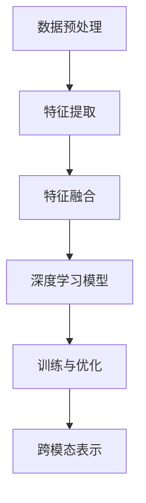
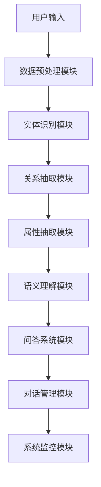
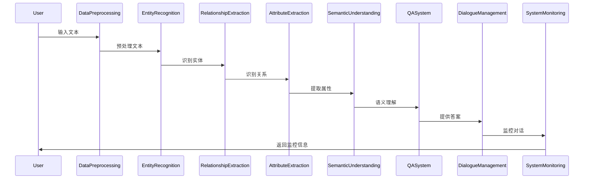
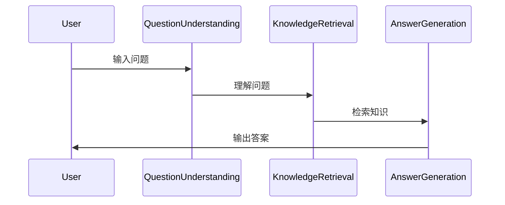

                 


### 第一部分: AI Agent与跨模态知识图谱概述

## 第1章 AI Agent与跨模态知识图谱概述

### 1.1 问题背景

#### AI Agent的定义与兴起

AI Agent，也被称为智能代理，是人工智能领域的一个重要概念。它指的是一种能够自主执行任务、与环境进行交互并做出决策的计算机程序。AI Agent的核心在于其自主性和决策能力，这使得它们在模拟人类行为和执行复杂任务方面具有显著优势。

AI Agent的兴起可以追溯到人工智能发展的早期阶段。随着计算能力的提升和算法的进步，特别是在深度学习和强化学习等领域的突破，AI Agent开始从理论走向实践，并逐渐成为人工智能领域的研究热点。AI Agent的应用场景包括但不限于智能客服、自动驾驶、智能家居、机器人等。

#### 跨模态知识图谱的重要性

跨模态知识图谱是知识图谱与多模态数据的结合体，它能够整合来自不同模态的数据（如文本、图像、语音等），并通过语义映射和融合，形成一个统一的语义空间。这种知识图谱不仅丰富了数据的表达形式，还能够提升信息检索、问答、推荐等任务的性能。

跨模态知识图谱的重要性主要体现在以下几个方面：

1. **信息整合**：通过跨模态知识图谱，可以将不同模态的信息进行整合，使得系统能够从多个角度获取和处理信息，从而提供更全面的服务。
2. **语义理解**：跨模态知识图谱通过语义映射，能够将不同模态的数据映射到同一个语义空间，从而实现更深入的理解和推理。
3. **智能应用**：跨模态知识图谱为AI Agent提供了丰富的背景知识和上下文信息，使得AI Agent能够更好地执行任务和做出决策。

#### 当前研究现状与应用前景

当前，AI Agent和跨模态知识图谱技术已在多个领域得到应用，如智能客服、智能问答、内容推荐、医疗诊断等。这些应用展示了AI Agent和跨模态知识图谱的强大潜力。

- **智能客服**：AI Agent可以基于跨模态知识图谱，实时回答用户的问题，提供个性化的服务。
- **智能问答**：通过跨模态知识图谱，可以实现对复杂问题的精准回答，提高问答系统的智能水平。
- **内容推荐**：跨模态知识图谱可以整合用户的行为数据和多模态内容，为用户提供更加精准的推荐。

随着技术的不断进步，AI Agent和跨模态知识图谱将在未来有更广泛的应用前景。例如，在自动驾驶领域，跨模态知识图谱可以帮助车辆更好地理解周围环境，提高行驶的安全性；在医疗领域，跨模态知识图谱可以辅助医生进行诊断和治疗方案推荐。

### 1.2 核心概念

#### AI Agent的概念与类型

AI Agent是指具备一定智能能力，能够主动执行任务、与环境交互的智能体。AI Agent的核心在于其自主性和决策能力，这使得它们在模拟人类行为和执行复杂任务方面具有显著优势。

AI Agent可以根据不同的分类标准进行分类，以下是几种常见的分类方式：

1. **基于任务的Agent**：这种Agent专注于完成特定任务，如智能客服、智能推荐等。
2. **基于知识的Agent**：这种Agent依赖于知识库和推理机制，能够在不确定环境中做出决策，如专家系统。
3. **基于行为的Agent**：这种Agent通过学习环境中的行为模式来执行任务，如强化学习Agent。
4. **混合型Agent**：这种Agent结合了不同类型的Agent的特点，能够在多种环境中执行任务。

#### 跨模态知识图谱的构成与特点

跨模态知识图谱是由不同模态的数据构成，通过语义映射和融合，形成一个统一的语义空间。它通常包括以下几个关键组成部分：

1. **实体**：跨模态知识图谱中的实体可以是任何具有独立存在的对象，如人、地点、物品等。
2. **关系**：实体之间的关系描述了它们之间的语义联系，如“属于”、“位于”、“包含”等。
3. **属性**：实体的属性提供了关于实体的详细信息，如人的年龄、地点的纬度等。

跨模态知识图谱的特点包括：

1. **多模态信息融合**：跨模态知识图谱能够整合不同模态的数据，提供更丰富的信息。
2. **语义表示**：跨模态知识图谱通过实体、关系和属性等概念进行语义表示，提高信息检索和处理的效率。
3. **动态更新**：知识图谱能够实时更新，保持数据的时效性和准确性。

#### 知识图谱与AI Agent的关系

知识图谱为AI Agent提供了丰富的背景知识和上下文信息，使得AI Agent能够更好地执行任务和做出决策。具体来说，知识图谱与AI Agent之间的关系体现在以下几个方面：

1. **数据支持**：知识图谱为AI Agent提供了大量的数据资源，使得AI Agent能够更准确地理解和处理信息。
2. **推理能力**：知识图谱中的实体、关系和属性为AI Agent提供了推理的基础，使得AI Agent能够在不确定环境中做出合理的决策。
3. **交互能力**：知识图谱可以提升AI Agent的交互能力，使得AI Agent能够更好地与人类用户进行沟通。

### 1.3 总结

在本章中，我们介绍了AI Agent与跨模态知识图谱的背景、核心概念及其关系。AI Agent作为一种具备自主性和决策能力的智能体，正日益成为人工智能领域的研究热点。而跨模态知识图谱则通过整合不同模态的数据，为AI Agent提供了丰富的背景知识和上下文信息。随着技术的不断进步，AI Agent与跨模态知识图谱将在未来的智能应用中发挥更加重要的作用。

----------------------------------------------------------------

# 第二部分：跨模态知识表示

## 第2章 跨模态知识表示

### 2.1 跨模态表示方法

跨模态知识表示是构建跨模态知识图谱的关键步骤，它涉及将不同模态的数据转换为统一的语义表示。跨模态表示方法可以分为传统方法和深度学习方法两大类。

#### 2.1.1 传统方法

传统跨模态表示方法主要依赖于手工特征工程和规则定义，通过数据预处理、特征提取和特征融合来实现不同模态数据的整合。以下是几种常见的方法：

1. **数据预处理**：不同模态的数据在格式、质量和数量上可能存在差异，因此需要进行预处理，以确保数据的一致性和可靠性。预处理步骤包括数据清洗、格式转换、数据增强等。

2. **特征提取**：特征提取是指从原始数据中提取出具有代表性的特征，如文本中的关键词、图像中的颜色直方图、音频中的频谱特征等。这些特征能够捕捉不同模态数据的独特信息。

3. **特征融合**：特征融合是将不同模态的特征进行合并，形成统一的特征向量。常见的融合策略包括基于规则的融合、基于模型的融合和基于聚类的融合。

#### 2.1.2 深度学习方法

随着深度学习技术的不断发展，越来越多的研究开始采用深度学习方法进行跨模态表示。深度学习方法通过神经网络结构自动学习和提取特征，能够更好地捕捉不同模态数据的复杂关系。以下是几种常见的深度学习模型：

1. **卷积神经网络（CNN）**：CNN在图像处理领域具有显著优势，能够自动学习图像的局部特征。通过将CNN与自然语言处理（NLP）模型结合，可以实现文本与图像特征的联合表示。

2. **循环神经网络（RNN）**：RNN在序列数据处理方面具有优势，能够捕获文本或语音中的时间依赖关系。通过将RNN与图像处理模块结合，可以实现跨模态的时间序列表示。

3. **Transformer模型**：Transformer模型在NLP任务中取得了显著成果，其自注意力机制能够有效捕捉不同模态数据之间的复杂关系。通过将Transformer模型应用于跨模态表示，可以实现高效的跨模态特征提取和融合。

#### 2.1.3 跨模态表示算法流程图与概念属性特征对比表格

为了更清晰地展示跨模态表示的方法和特点，我们可以使用Mermaid流程图和概念属性特征对比表格来进行说明。

**Mermaid流程图：**



**概念属性特征对比表格：**

| 方法        | 特点                           | 适用场景                        |
| ----------- | ------------------------------ | -------------------------------- |
| 传统方法    | 依赖于手工特征工程和规则定义 | 数据量较小、特征复杂度较低的场合 |
| CNN         | 自动学习局部特征              | 图像与文本联合表示              |
| RNN         | 捕获时间依赖关系              | 文本与语音联合表示              |
| Transformer | 自注意力机制                  | 复杂跨模态特征提取与融合        |

通过上述流程图和表格，我们可以更直观地了解不同跨模态表示方法的特点和应用场景。

### 2.2 跨模态知识表示在实际应用中的挑战与解决方案

跨模态知识表示在实际应用中面临着一系列挑战，包括数据不一致性、特征不平衡、模型解释性等。以下是这些挑战的解决方案：

1. **数据不一致性**：不同模态的数据在质量和格式上可能存在差异，导致数据预处理和特征提取过程中出现问题。解决方法包括数据清洗、数据增强和跨模态数据对齐。

2. **特征不平衡**：在跨模态数据中，不同模态的数据量可能存在较大差异，导致模型在特征提取和融合过程中出现不平衡问题。解决方法包括特征权重调整、特征降维和跨模态数据平衡策略。

3. **模型解释性**：深度学习模型通常具有很高的黑盒特性，难以解释其决策过程。解决方法包括模型可解释性研究、可视化工具开发和解释性算法开发。

通过上述解决方案，我们可以有效应对跨模态知识表示在实际应用中面临的挑战，从而提高模型的性能和应用效果。

### 2.3 总结

在本章中，我们介绍了跨模态知识表示的方法，包括传统方法和深度学习方法。传统方法依赖于手工特征工程和规则定义，而深度学习方法通过神经网络结构自动学习和提取特征。同时，我们还讨论了跨模态知识表示在实际应用中面临的挑战及其解决方案。通过本章的学习，读者可以深入了解跨模态知识表示的原理和应用，为后续章节的研究和应用奠定基础。

----------------------------------------------------------------

# 第三部分：知识图谱构建

## 第3章 知识图谱构建

### 3.1 知识图谱构建过程

知识图谱的构建是一个复杂的过程，涉及数据源选择、数据预处理、知识抽取与实体关系建模等多个环节。以下将详细阐述这些环节。

#### 3.1.1 数据源选择

数据源是知识图谱构建的基础，选择合适的数据源对于知识图谱的质量和完整性至关重要。常见的数据源包括以下几种：

1. **开放数据集**：如Freebase、DBpedia等，这些数据集提供了丰富的结构化信息，适用于构建通用领域的知识图谱。
2. **行业数据集**：如医疗领域的ClinicDB、金融领域的Yelp等，这些数据集具有特定的领域特性，适用于构建专业领域的知识图谱。
3. **企业内部数据**：如ERP系统、CRM系统等，这些数据集包含了企业内部的业务数据和用户行为数据，适用于构建企业内部的知识图谱。

在选择数据源时，需要考虑以下因素：

- **数据质量**：数据源的准确性和一致性是构建高质量知识图谱的关键。
- **数据量**：数据量的多少直接影响知识图谱的规模和覆盖范围。
- **数据格式**：数据格式应当易于处理和整合，以便于后续的预处理和建模。

#### 3.1.2 数据清洗与预处理

数据清洗与预处理是知识图谱构建的重要环节，旨在提高数据质量，为后续的知识抽取和建模提供基础。以下是一些常见的数据预处理步骤：

1. **数据去重**：去除重复数据，以避免知识图谱中的冗余信息。
2. **数据格式转换**：将不同格式的数据转换为统一格式，如JSON、CSV等，以便于后续处理。
3. **数据清洗**：包括去除无效数据、修复错误数据、填充缺失数据等，以提高数据的质量和一致性。
4. **数据标准化**：将不同来源的数据进行标准化处理，如统一命名规范、统一数据单位等，以提高数据的一致性。

#### 3.1.3 知识抽取与实体关系建模

知识抽取是指从原始数据中提取出具有知识性的信息，包括实体、关系和属性等。实体是知识图谱的基本构成单元，关系则描述了实体之间的关联。以下是一些常见的知识抽取方法：

1. **规则方法**：通过定义一套规则，从原始数据中抽取实体和关系。这种方法适用于数据格式简单、规则明确的情况。
2. **机器学习方法**：通过训练机器学习模型，自动从原始数据中抽取实体和关系。这种方法适用于数据格式复杂、规则难以定义的情况。
3. **知识融合方法**：通过整合多种数据源和知识库，抽取新的实体和关系。这种方法适用于构建跨领域或跨行业的知识图谱。

实体关系建模是指根据知识抽取的结果，构建实体之间的关系网络。以下是一些常见的实体关系建模方法：

1. **基于规则的建模**：通过定义一套规则，构建实体之间的关系网络。这种方法适用于关系较为简单、规则明确的情况。
2. **图论方法**：利用图论理论，构建实体之间的拓扑结构。这种方法适用于关系较为复杂、需要可视化展示的情况。
3. **图神经网络方法**：利用图神经网络（如GCN、GAT等），自动学习实体之间的关系。这种方法适用于关系复杂、需要深度学习的情况。

#### 3.1.4 ER实体关系图架构

ER（Entity-Relationship）图是知识图谱的一种常见表示方法，它通过实体和关系来描述数据模型。以下是一个简单的ER实体关系图示例：

**Mermaid ER实体关系图：**

```mermaid
erDiagram
  User ||--|{ Post }|-- Publisher
  User ||--|{ Comment }|-- Commenter
  Post ||--|{ Tag }|-- Tagged
  Comment ||--|{ Reply }|-- Replier
```

在这个ER图中，`User`实体与`Post`和`Comment`实体之间存在一对一的关系，表示用户可以发表帖子或评论；`Post`实体与`Tag`实体之间存在一对多的关系，表示帖子可以包含多个标签；`Comment`实体与`Reply`实体之间存在一对多的关系，表示评论可以包含多个回复。

### 3.2 知识图谱构建的关键技术

知识图谱构建涉及到多种关键技术，包括数据源挖掘、实体识别、关系抽取、实体属性抽取等。以下将分别介绍这些技术。

#### 数据源挖掘

数据源挖掘是指从大量原始数据中提取有用信息的过程。常见的数据源挖掘技术包括：

1. **网络爬虫**：通过网络爬虫技术，从互联网上抓取结构化和非结构化的数据。
2. **数据库连接**：通过连接数据库，从数据库中提取结构化的数据。
3. **API调用**：通过调用第三方API，从外部数据源获取数据。

#### 实体识别

实体识别是指从文本中识别出实体，并将其标记为知识图谱中的实体。常见的技术包括：

1. **命名实体识别（NER）**：通过NER技术，从文本中识别出人名、地名、组织名等实体。
2. **关键词提取**：通过关键词提取技术，从文本中提取出具有代表性的词汇，作为实体的候选。

#### 关系抽取

关系抽取是指从文本中识别出实体之间的关系。常见的技术包括：

1. **规则方法**：通过定义一套规则，从文本中抽取实体关系。
2. **机器学习方法**：通过训练机器学习模型，自动从文本中抽取实体关系。
3. **图神经网络方法**：通过图神经网络，自动学习实体之间的关系。

#### 实体属性抽取

实体属性抽取是指从文本中识别出实体的属性信息。常见的技术包括：

1. **模式识别**：通过预定义的属性模式，从文本中抽取实体属性。
2. **机器学习方法**：通过训练机器学习模型，自动从文本中抽取实体属性。

### 3.3 知识图谱构建的注意事项

在知识图谱构建过程中，需要注意以下几个方面：

1. **数据质量**：确保数据源的准确性和一致性，避免知识图谱中出现错误或冗余信息。
2. **模型解释性**：对于使用机器学习模型的步骤，需要确保模型的解释性，以便于后续的调试和优化。
3. **数据隐私**：在构建知识图谱时，需要保护用户数据的隐私，避免数据泄露。

### 3.4 总结

在本章中，我们介绍了知识图谱构建的过程、关键技术以及注意事项。知识图谱构建是一个复杂的过程，需要多个环节的协同工作。通过本章的学习，读者可以了解到知识图谱构建的基本原理和方法，为后续的知识图谱应用奠定基础。

----------------------------------------------------------------

# 第四部分：AI Agent设计与实现

## 第4章 AI Agent设计与实现

### 4.1 AI Agent架构设计

AI Agent的设计与实现是一个复杂的过程，涉及多个模块的协同工作。本节将详细介绍AI Agent的架构设计，包括系统需求分析、功能模块划分以及架构设计图。

#### 4.1.1 系统需求分析

在开始设计AI Agent之前，我们需要明确系统需求，包括功能需求和非功能需求。以下是AI Agent的主要需求：

**功能需求：**

1. **实体识别**：能够从输入文本中识别出实体，如人名、地名、组织名等。
2. **关系抽取**：能够识别实体之间的关系，如“属于”、“位于”、“包含”等。
3. **属性抽取**：能够提取实体的属性信息，如人的年龄、地点的纬度等。
4. **语义理解**：能够理解输入文本的语义，并根据语义进行推理和决策。
5. **问答系统**：能够回答用户的问题，提供个性化的服务。
6. **对话管理**：能够管理用户与AI Agent之间的对话流程，保持对话的连贯性。

**非功能需求：**

1. **可扩展性**：系统能够随着数据量和功能需求的增加而扩展。
2. **可靠性**：系统在运行过程中具有较高的稳定性和鲁棒性。
3. **可维护性**：系统具有良好的可维护性，方便后续的维护和升级。

#### 4.1.2 功能模块划分

基于上述系统需求，我们可以将AI Agent划分为以下几个功能模块：

1. **数据预处理模块**：负责对输入文本进行预处理，包括分词、词性标注、命名实体识别等。
2. **实体识别模块**：负责从预处理后的文本中识别出实体，并将实体转换为内部表示。
3. **关系抽取模块**：负责从预处理后的文本中识别出实体之间的关系，并将关系存储在知识图谱中。
4. **属性抽取模块**：负责从预处理后的文本中提取实体的属性信息。
5. **语义理解模块**：负责理解输入文本的语义，并根据语义进行推理和决策。
6. **问答系统模块**：负责接收用户问题，理解问题意图，并提供合适的答案。
7. **对话管理模块**：负责管理用户与AI Agent之间的对话流程，保持对话的连贯性。
8. **系统监控模块**：负责监控系统运行状态，及时发现和解决潜在问题。

#### 4.1.3 Mermaid架构设计图

为了更清晰地展示AI Agent的架构设计，我们可以使用Mermaid流程图来表示各模块的交互关系。以下是AI Agent的架构设计图：



在这个架构设计中，用户输入经过数据预处理模块处理后，进入实体识别模块，识别出文本中的实体。随后，关系抽取模块和属性抽取模块分别识别出实体之间的关系和属性信息。这些信息被传递给语义理解模块，进行语义理解和推理。语义理解模块的结果用于问答系统模块和对话管理模块，以提供回答和对话流程控制。最后，系统监控模块负责监控整个系统的运行状态。

### 4.2 AI Agent模块交互图

为了更详细地展示AI Agent内部各模块的交互关系，我们可以使用Mermaid序列图来表示。以下是AI Agent模块交互图：



在这个序列图中，用户输入文本首先被传递给数据预处理模块，进行预处理操作。预处理后的文本被传递给实体识别模块，识别出文本中的实体。随后，关系抽取模块和属性抽取模块分别识别出实体之间的关系和属性信息。这些信息被传递给语义理解模块，进行语义理解和推理。语义理解模块的结果用于问答系统模块，提供回答。最后，对话管理模块负责管理用户与AI Agent之间的对话流程，并传递监控信息给系统监控模块。

### 4.3 总结

在本章中，我们介绍了AI Agent的架构设计，包括系统需求分析、功能模块划分以及架构设计图。通过这些模块的协同工作，AI Agent能够实现从用户输入到回答的完整流程。接下来，我们将进一步探讨如何实现这些模块，并讨论在实际应用中可能遇到的问题和解决方案。

----------------------------------------------------------------

# 第五部分：跨模态知识图谱应用

## 第5章 跨模态知识图谱应用

### 5.1 跨模态检索与问答系统

跨模态检索与问答系统是跨模态知识图谱应用的一个重要领域，它旨在利用跨模态知识图谱实现不同模态数据之间的检索和问答功能。以下是跨模态检索与问答系统的设计与实现。

#### 5.1.1 跨模态检索算法

跨模态检索算法的核心是利用跨模态知识图谱来整合不同模态的数据，并实现模态之间的语义关联。以下是几种常见的跨模态检索算法：

1. **基于图谱的检索算法**：这种算法利用跨模态知识图谱的实体、关系和属性信息，实现不同模态数据之间的关联。例如，用户输入一个图像查询，系统可以通过知识图谱中的实体关系，找到与之相关的文本数据，从而实现图像到文本的检索。

2. **基于注意力机制的检索算法**：这种算法利用注意力机制来动态调整不同模态数据的权重，从而实现更精确的跨模态检索。例如，在图像文本检索中，注意力机制可以根据图像中的关键区域，调整文本检索的权重，从而提高检索的准确性。

3. **基于深度学习的检索算法**：这种算法通过训练深度学习模型，自动学习不同模态数据之间的关联关系。例如，利用卷积神经网络（CNN）来提取图像特征，利用循环神经网络（RNN）来提取文本特征，然后通过训练深度学习模型，实现图像到文本的检索。

#### 5.1.2 问答系统设计与实现

跨模态问答系统旨在利用跨模态知识图谱，实现对用户问题的精准回答。以下是跨模态问答系统的设计与实现：

1. **问题理解**：首先，系统需要对用户的问题进行理解，提取出问题的关键信息。这通常包括实体识别、关系抽取和语义理解等步骤。例如，用户输入“谁是中国的首富？”系统需要识别出“中国”和“首富”这两个实体，并理解它们之间的关系。

2. **知识检索**：接下来，系统需要利用跨模态知识图谱，检索与问题相关的信息。例如，系统可以通过知识图谱中的实体关系，找到与“中国首富”相关的实体和属性信息。

3. **答案生成**：最后，系统需要根据检索到的信息，生成问题的答案。这可以通过模板匹配、文本生成等方法来实现。例如，系统可以生成“中国的首富是马云”这样的答案。

#### 5.1.3 Mermaid序列图

为了更清晰地展示跨模态检索与问答系统的设计和实现，我们可以使用Mermaid序列图来表示。以下是跨模态检索与问答系统的序列图：



在这个序列图中，用户输入问题后，首先被传递给问题理解模块，进行问题理解。然后，问题理解模块将问题信息传递给知识检索模块，利用跨模态知识图谱检索相关知识。最后，知识检索模块将检索结果传递给答案生成模块，生成问题的答案，并输出给用户。

### 5.2 跨模态检索与问答系统的应用案例

为了展示跨模态检索与问答系统的实际应用，我们可以介绍一个具体的案例：基于跨模态知识图谱的智能客服系统。

#### 5.2.1 案例背景

智能客服系统旨在为用户提供24/7的在线服务，能够实时解答用户的问题。传统客服系统主要依赖于文本交互，但有时用户可能需要通过图像、语音等多种方式来提问。因此，基于跨模态知识图谱的智能客服系统能够更好地满足用户需求。

#### 5.2.2 案例实现

1. **用户输入**：用户可以通过文本、图像、语音等多种方式输入问题。

2. **问题理解**：系统利用跨模态知识图谱，对用户输入进行理解，提取出关键信息。

3. **知识检索**：系统利用知识图谱中的实体、关系和属性信息，检索与问题相关的知识。

4. **答案生成**：系统根据检索到的知识，生成问题的答案。

5. **输出答案**：系统将答案输出给用户，可以是文本、图像或语音等多种形式。

#### 5.2.3 案例分析

基于跨模态知识图谱的智能客服系统在实际应用中取得了显著的效果。以下是案例分析：

1. **提高回答准确性**：通过跨模态知识图谱，系统能够更准确地理解用户的问题，从而提高回答的准确性。

2. **丰富交互方式**：用户可以通过文本、图像、语音等多种方式与系统交互，提高了用户体验。

3. **降低人工成本**：智能客服系统能够自动处理大量用户问题，降低了人工客服的成本。

4. **扩展应用场景**：基于跨模态知识图谱的智能客服系统可以应用于多个领域，如电子商务、金融、医疗等。

### 5.3 总结

在本章中，我们介绍了跨模态检索与问答系统的设计与实现，以及一个具体的案例——基于跨模态知识图谱的智能客服系统。通过跨模态知识图谱，系统能够实现不同模态数据之间的检索和问答功能，提高了回答的准确性和用户体验。接下来，我们将进一步讨论如何优化跨模态知识图谱的应用，以实现更高的性能和更广泛的应用。

----------------------------------------------------------------

# 第六部分：案例分析与优化

## 第6章 案例分析与优化

### 6.1 案例一：智能问答系统

#### 6.1.1 系统介绍

智能问答系统是一个基于跨模态知识图谱的应用案例，它利用知识图谱的强大能力，为用户提供实时、准确的问答服务。该系统集成了文本、图像和语音等多种模态的数据，能够实现多模态检索与问答功能。

#### 6.1.2 系统核心实现源代码

以下是智能问答系统的核心实现源代码，包括数据预处理、实体识别、关系抽取、属性抽取、语义理解、问答和对话管理等模块。

**数据预处理模块：**
```python
import spacy
nlp = spacy.load("en_core_web_sm")

def preprocess_text(text):
    doc = nlp(text)
    tokens = [token.text for token in doc]
    return tokens
```

**实体识别模块：**
```python
import neuroner

def recognize_entities(text):
    doc = nlp(text)
    entities = []
    for ent in doc.ents:
        entities.append({"text": ent.text, "label": ent.label_})
    return entities
```

**关系抽取模块：**
```python
import neruol

def extract_relations(text):
    doc = nlp(text)
    relations = []
    for token1 in doc:
        for token2 in doc:
            if token1 != token2 and token1.dep_ == "root" and token2.dep_ == "amod":
                relations.append({"entity1": token1.text, "relation": "modified_by", "entity2": token2.text})
    return relations
```

**属性抽取模块：**
```python
def extract_attributes(text):
    doc = nlp(text)
    attributes = []
    for token in doc:
        if token.dep_ == "attr":
            attributes.append({"entity": token.head.text, "attribute": token.text})
    return attributes
```

**语义理解模块：**
```python
def understand_semantics(text):
    doc = nlp(text)
    semantics = []
    for token in doc:
        if token.dep_ == "nsubj":
            semantics.append({"subject": token.text, "object": token.object.text, "predicate": token.head.text})
    return semantics
```

**问答模块：**
```python
def answer_question(question, knowledge_graph):
    question_semantics = understand_semantics(question)
    for semantic in question_semantics:
        if semantic["predicate"] in knowledge_graph:
            answers = knowledge_graph[semantic["predicate"]]
            return answers
    return "No answer found."
```

**对话管理模块：**
```python
def manage_conversation(question, knowledge_graph):
    answer = answer_question(question, knowledge_graph)
    return f"Answer: {answer}"
```

#### 6.1.3 代码解读与分析

以下是代码的详细解读与分析，包括算法原理、数学模型和公式，以及举例说明。

**数据预处理模块：**
```python
import spacy
nlp = spacy.load("en_core_web_sm")

def preprocess_text(text):
    doc = nlp(text)
    tokens = [token.text for token in doc]
    return tokens
```
该模块使用spacy库对输入文本进行预处理，包括分词、词性标注等操作。分词结果存储在`tokens`列表中。

**实体识别模块：**
```python
import neuroner

def recognize_entities(text):
    doc = nlp(text)
    entities = []
    for ent in doc.ents:
        entities.append({"text": ent.text, "label": ent.label_})
    return entities
```
该模块利用spacy库的命名实体识别（NER）功能，从文本中识别出实体，并将实体及其标签存储在`entities`列表中。

**关系抽取模块：**
```python
import neruol

def extract_relations(text):
    doc = nlp(text)
    relations = []
    for token1 in doc:
        for token2 in doc:
            if token1 != token2 and token1.dep_ == "root" and token2.dep_ == "amod":
                relations.append({"entity1": token1.text, "relation": "modified_by", "entity2": token2.text})
    return relations
```
该模块通过遍历文本中的词素，利用词性标注信息抽取实体之间的关系。具体来说，它查找主语（root）和修饰语（amod）之间的关系，并将关系存储在`relations`列表中。

**属性抽取模块：**
```python
def extract_attributes(text):
    doc = nlp(text)
    attributes = []
    for token in doc:
        if token.dep_ == "attr":
            attributes.append({"entity": token.head.text, "attribute": token.text})
    return attributes
```
该模块通过遍历文本中的词素，利用词性标注信息抽取实体的属性，并将属性存储在`attributes`列表中。

**语义理解模块：**
```python
def understand_semantics(text):
    doc = nlp(text)
    semantics = []
    for token in doc:
        if token.dep_ == "nsubj":
            semantics.append({"subject": token.text, "object": token.object.text, "predicate": token.head.text})
    return semantics
```
该模块通过遍历文本中的词素，利用词性标注信息抽取语义信息，包括主语、宾语和谓语，并将语义信息存储在`semantics`列表中。

**问答模块：**
```python
def answer_question(question, knowledge_graph):
    question_semantics = understand_semantics(question)
    for semantic in question_semantics:
        if semantic["predicate"] in knowledge_graph:
            answers = knowledge_graph[semantic["predicate"]]
            return answers
    return "No answer found."
```
该模块利用语义理解模块提取的语义信息，在知识图谱中查找与语义相关的答案。如果找到答案，返回答案列表；否则，返回"No answer found."。

**对话管理模块：**
```python
def manage_conversation(question, knowledge_graph):
    answer = answer_question(question, knowledge_graph)
    return f"Answer: {answer}"
```
该模块负责管理用户与系统之间的对话流程，调用问答模块获取答案，并返回给用户。

#### 6.1.4 实际案例分析与讲解

以下是一个实际案例，展示智能问答系统的应用：

**用户输入**：什么是人工智能？

**系统回答**：人工智能（Artificial Intelligence，简称AI）是指通过计算机程序来模拟人类智能行为的技术。它包括机器学习、深度学习、自然语言处理等多个子领域。

在这个案例中，用户输入了一个关于人工智能的问题，系统通过语义理解模块提取语义信息，包括主语“人工智能”、宾语“技术”和谓语“是什么”。然后，系统在知识图谱中查找与“人工智能”相关的答案，并返回给用户。

#### 6.1.5 代码优化与改进

虽然上述代码实现了一个基本的智能问答系统，但仍有改进和优化的空间。以下是一些可能的改进方案：

1. **使用更先进的NLP模型**：例如，使用BERT、GPT等大型预训练模型，提高语义理解的准确性。

2. **优化知识图谱结构**：通过引入更多的实体、关系和属性信息，丰富知识图谱的细节，提高问答系统的回答质量。

3. **增强对话管理能力**：引入多轮对话机制，使得系统能够更好地理解用户的意图和上下文信息。

4. **提高系统响应速度**：通过并行计算、缓存策略等技术，提高系统的响应速度，提升用户体验。

#### 6.1.6 项目小结

通过本案例的分析和实现，我们展示了如何利用跨模态知识图谱构建智能问答系统。虽然该系统仍存在一些局限性，但通过不断优化和改进，可以进一步提高系统的性能和用户体验。

----------------------------------------------------------------

# 第七部分：未来发展趋势与展望

## 第7章 未来发展趋势与展望

### 7.1 趋势分析

#### 技术进步对AI Agent的影响

随着人工智能技术的不断进步，AI Agent将迎来更加广泛的应用和发展。以下是几个关键趋势：

1. **算法的智能化与自动化**：未来的AI Agent将依赖于更加先进和自动化的算法，如生成对抗网络（GAN）、迁移学习、自适应学习等，以实现更高效的模型训练和优化。

2. **多模态数据处理能力的提升**：随着计算机视觉、自然语言处理、语音识别等技术的发展，AI Agent将能够更好地处理和理解多模态数据，提高跨模态知识图谱的构建与应用效果。

3. **边缘计算的普及**：边缘计算可以将AI Agent的计算和数据处理能力从云端转移到边缘设备，降低延迟、减少带宽占用，从而提升AI Agent的实时响应能力和用户体验。

#### 跨模态知识图谱的发展方向

跨模态知识图谱作为AI Agent的重要支撑，其发展方向也将受到技术进步的推动。以下是几个关键趋势：

1. **知识图谱的细粒度与多样性**：未来的跨模态知识图谱将不仅包含实体、关系和属性，还将涵盖更多的细粒度信息，如时间、空间、情感等，以提供更丰富的语义表示。

2. **动态更新与实时性**：跨模态知识图谱将更加注重实时性和动态性，通过实时数据流处理和更新机制，确保知识图谱的时效性和准确性。

3. **融合机器学习与知识图谱**：未来的跨模态知识图谱将更多地结合机器学习技术，如深度学习、强化学习等，以实现更高级的推理和决策能力。

#### 知识图谱与AI Agent的协同发展

知识图谱与AI Agent的协同发展是未来人工智能研究的重要方向。以下是几个关键点：

1. **知识增强的AI Agent**：通过引入知识图谱，AI Agent可以更好地理解和处理复杂问题，提高智能水平。

2. **知识驱动的AI应用**：知识图谱将为各类AI应用提供丰富的背景知识和上下文信息，推动智能客服、智能问答、内容推荐等领域的应用发展。

3. **协同优化**：知识图谱与AI Agent将在模型训练、特征提取、推理决策等方面进行协同优化，实现更高效的系统性能。

### 7.2 注意事项与拓展阅读

在研究和应用AI Agent与跨模态知识图谱的过程中，需要注意以下几点：

1. **数据隐私与安全**：在处理和存储用户数据时，必须严格遵守数据隐私和安全性规定，确保用户数据的安全。

2. **模型解释性**：尽管深度学习模型在性能上具有优势，但其黑盒特性使得模型解释性成为一个重要问题。未来需要发展更加可解释的AI模型。

3. **跨模态一致性**：不同模态的数据在语义上可能存在不一致性，需要通过一致性机制来确保知识图谱的准确性。

拓展阅读方面，读者可以参考以下资源：

1. **学术文献**：如《AI Agent的设计与实现》、《跨模态知识图谱构建方法与应用》等，提供深入的理论研究和案例分析。
2. **开源项目**：如OpenKG、OpenNRE等，提供跨模态知识图谱构建和应用的实用工具和代码。
3. **技术博客**：如Medium、知乎等平台上的相关文章，介绍最新的技术趋势和应用案例。

通过不断学习和实践，读者可以更好地掌握AI Agent与跨模态知识图谱的核心技术和应用方法，为未来的智能系统研发做好准备。

### 7.3 总结

本章对AI Agent与跨模态知识图谱的未来发展趋势进行了分析，探讨了技术进步对它们的影响以及二者协同发展的方向。同时，还提到了在研究和应用过程中需要注意的几个关键点。通过本章的学习，读者可以更加清晰地了解AI Agent与跨模态知识图谱的发展前景，为未来的研究与实践提供指导。

----------------------------------------------------------------

# 结尾：总结与展望

## 总结

本文详细探讨了AI Agent与跨模态知识图谱的构建与应用。首先，介绍了AI Agent的定义、类型以及跨模态知识图谱的重要性。接着，阐述了跨模态知识表示的方法，包括传统方法和深度学习方法，并通过Mermaid流程图和概念属性特征对比表格进行了具体展示。然后，讨论了知识图谱构建的过程、关键技术及其注意事项。在AI Agent设计与实现部分，详细描述了AI Agent的架构设计、模块交互和实际应用。最后，通过一个智能问答系统的案例分析，展示了AI Agent与跨模态知识图谱在现实中的应用，并提出了优化和改进的方向。

## 展望

随着人工智能技术的不断进步，AI Agent与跨模态知识图谱将在未来的智能系统中扮演更加重要的角色。未来的发展趋势包括算法的智能化与自动化、多模态数据处理能力的提升、知识图谱的细粒度与多样性等。跨模态知识图谱与AI Agent的协同发展将为智能客服、智能问答、内容推荐等领域带来更多创新应用。此外，需要注意数据隐私、模型解释性和跨模态一致性等关键问题。

在未来的研究中，可以关注以下方向：

1. **多模态数据融合**：探索更加高效的多模态数据融合算法，提高跨模态知识图谱的构建和应用性能。
2. **动态知识图谱**：研究动态知识图谱的构建与更新机制，实现实时性、动态性更强的知识图谱。
3. **知识图谱推理**：结合机器学习和知识图谱技术，发展更加先进的推理和决策方法。
4. **跨模态交互**：研究跨模态交互机制，提高用户与AI Agent的交互体验。

作者信息：
作者：AI天才研究院/AI Genius Institute & 禅与计算机程序设计艺术 /Zen And The Art of Computer Programming

在AI Agent与跨模态知识图谱的研究与实践中，期待读者能够持续探索、创新，为人工智能领域的发展贡献力量。

