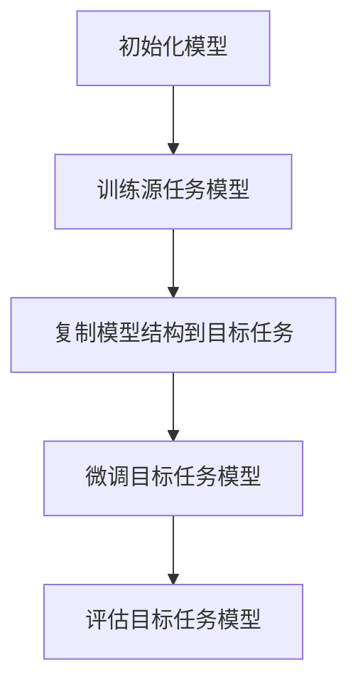
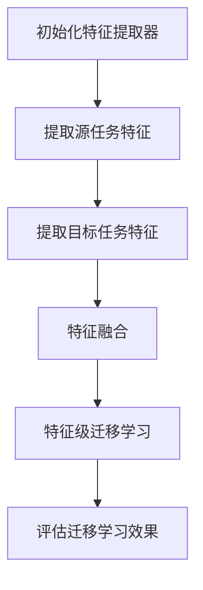
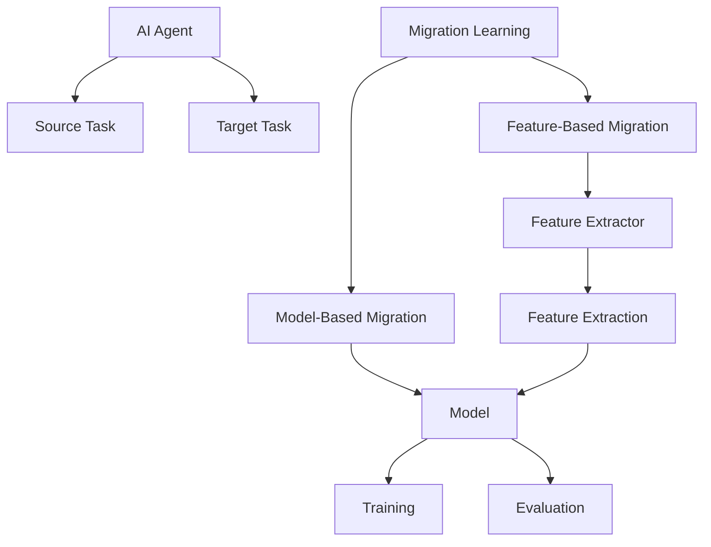
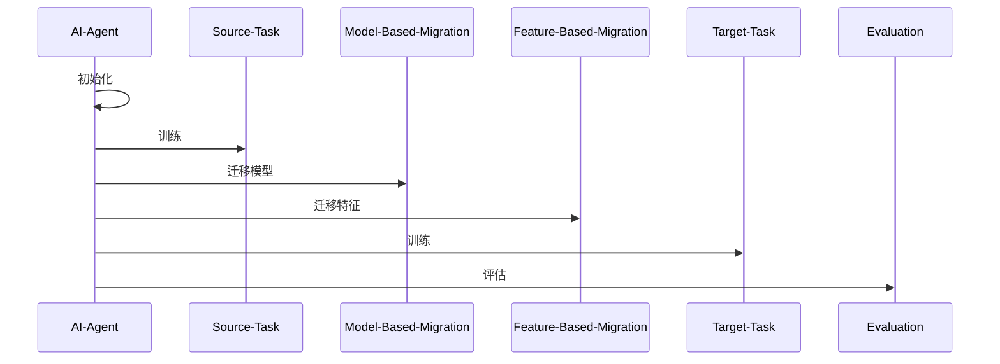
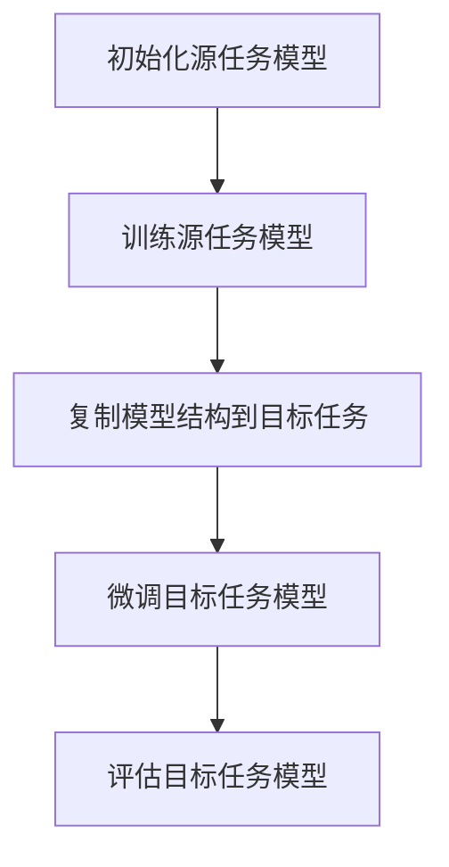
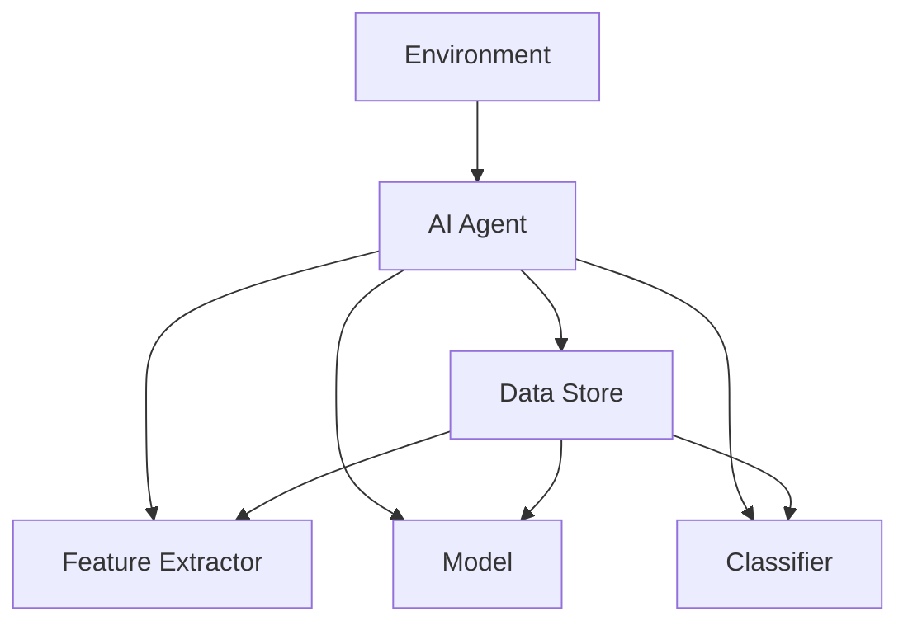
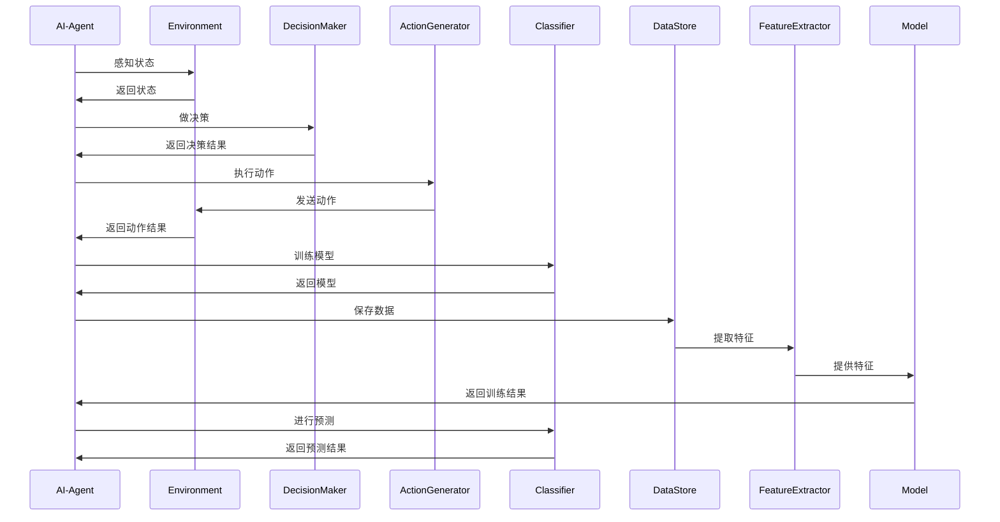

                 


# AI Agent的迁移学习在跨语言任务中的应用

> 关键词：AI Agent，迁移学习，跨语言任务，算法原理，系统架构设计，项目实战

> 摘要：本文将探讨AI Agent的迁移学习在跨语言任务中的应用，从问题背景、核心概念、算法原理、系统架构设计到项目实战，逐步解析如何通过迁移学习提高AI Agent在跨语言任务中的性能。

## 第一部分：背景介绍

### 第1章 问题背景

## 1.1 问题描述

在全球化背景下，跨语言任务的应用场景越来越广泛，如机器翻译、多语言文本分类、跨语言推荐等。然而，传统的机器学习方法在处理不同语言的数据时，存在以下问题：

- **数据稀缺**：不同语言的数据集往往较为稀缺，难以满足深度学习模型的需求。
- **模型适应性差**：模型在一种语言上的学习结果难以迁移到另一种语言上，导致在不同语言上的表现不佳。

## 1.2 问题解决

迁移学习（Transfer Learning）是一种解决上述问题的有效方法，它通过将一个任务学到的知识应用到另一个相关任务上，从而减少对新任务的训练时间和数据需求。在跨语言任务中，迁移学习可以通过以下几种方式实现：

- **基于模型的迁移学习**：将一个在源语言上训练好的模型迁移到目标语言上。
- **基于特征的迁移学习**：将源语言和目标语言的共同特征提取出来，然后在特征级别上进行迁移。

## 1.3 边界与外延

- **边界**：迁移学习主要关注在数据稀缺或模型适应性差的情况下，如何通过知识迁移提高模型性能。
- **外延**：迁移学习不仅适用于跨语言任务，还可以应用于不同领域、不同任务之间的知识迁移。

## 1.4 概念结构与核心要素组成

- **AI Agent**：具有自主决策和行动能力的智能体，能够处理复杂任务。
- **迁移学习**：通过将一个任务的解决方案应用到另一个任务上，提高学习效率。
- **跨语言任务**：涉及不同语言的数据处理任务，如机器翻译、多语言文本分类等。

## 第二部分：核心概念与联系

### 第2章 核心概念原理

## 2.1 迁移学习

### 2.1.1 迁移学习的定义

迁移学习是一种利用已有知识解决新问题的方法，它通过在源任务上学习到的知识，来辅助解决目标任务。

### 2.1.2 迁移学习的类型

- **基于模型的迁移学习**：将源任务的模型直接迁移到目标任务。
- **基于特征的迁移学习**：提取源任务和目标任务的共同特征，然后在特征级别上进行迁移。

### 2.1.3 迁移学习的挑战

- **模型适应性**：如何确保迁移后的模型在目标任务上表现良好。
- **数据稀缺**：如何利用少量数据实现有效的迁移学习。

## 2.2 AI Agent

### 2.2.1 AI Agent的定义

AI Agent是一种具有自主决策和行动能力的智能体，能够在复杂环境中执行任务。

### 2.2.2 AI Agent的特点

- **自主性**：能够根据环境变化自主做出决策。
- **适应性**：能够适应不同的任务和场景。

### 2.2.3 AI Agent的应用场景

- **自动驾驶**：AI Agent负责决策和控制车辆。
- **智能家居**：AI Agent负责管理家庭设备和系统。

## 2.3 跨语言任务

### 2.3.1 跨语言任务的定义

跨语言任务是指涉及不同语言之间的数据处理任务，如机器翻译、多语言文本分类等。

### 2.3.2 跨语言任务的特点

- **多语言性**：涉及多种语言的数据。
- **差异性**：不同语言的数据在语法、语义等方面存在差异。

### 2.3.3 跨语言任务的挑战

- **数据稀缺**：不同语言的数据集往往较为稀缺。
- **模型适应性**：模型在不同语言上的表现可能不一致。

## 第三部分：算法原理讲解

### 第3章 迁移学习算法

## 3.1 迁移学习算法概述

迁移学习算法可以分为两大类：基于模型的迁移学习和基于特征的迁移学习。

### 3.2 基于模型的迁移学习算法

### 3.2.1 Model-based Transfer Learning

#### 3.2.1.1 定义

基于模型的迁移学习是将源任务的模型直接迁移到目标任务。

#### 3.2.1.2 工作原理

- **模型复制**：将源任务的模型结构复制到目标任务。
- **微调**：在目标任务上对模型进行微调，使其适应目标任务。

#### 3.2.1.3 Mermaid流程图



#### 3.2.1.4 Python源代码

```python
# 这里是Python源代码示例
```

#### 3.2.1.5 数学模型和公式

$$
\text{迁移学习模型} = \text{源任务模型} + \text{微调参数}
$$

#### 3.2.1.6 举例说明

假设我们有一个在英语数据集上训练好的文本分类模型，现在希望将其迁移到法语数据集上。我们首先将英语模型的参数复制到法语模型，然后在法语数据集上对模型进行微调。

### 3.3 基于特征的迁移学习算法

### 3.3.1 Feature-based Transfer Learning

#### 3.3.1.1 定义

基于特征的迁移学习是提取源任务和目标任务的共同特征，然后在特征级别上进行迁移。

#### 3.3.1.2 工作原理

- **特征提取**：从源任务和目标任务中提取共同特征。
- **特征融合**：将源任务和目标任务的共同特征进行融合。
- **特征级迁移**：在特征级别上进行迁移学习。

#### 3.3.1.3 Mermaid流程图



#### 3.3.1.4 Python源代码

```python
# 这里是Python源代码示例
```

#### 3.3.1.5 数学模型和公式

$$
\text{迁移学习特征} = \text{源任务特征} + \text{目标任务特征}
$$

#### 3.3.1.6 举例说明

假设我们有一个在英语数据集上训练好的文本分类模型，现在希望将其迁移到法语数据集上。我们首先从英语和法语数据集中提取共同特征，然后将这些共同特征进行融合，最后在融合后的特征上进行迁移学习。

## 第四部分：系统分析与架构设计

### 第4章 系统功能设计

## 4.1 领域模型

#### 4.1.1 领域模型Mermaid类图

```mermaid
classDiagram
AI-Agent <<interface>>
Source-Task
Target-Task
Migration-Learning <<interface>>
Model-Based-Migration
Feature-Based-Migration

AI-Agent --|> Source-Task
AI-Agent --|> Target-Task
Migration-Learning --|> Model-Based-Migration
Migration-Learning --|> Feature-Based-Migration
```

## 4.2 系统架构设计

#### 4.2.1 系统架构Mermaid架构图



## 4.3 系统接口设计

#### 4.3.1 系统接口设计

- **AI-Agent接口**：用于定义AI Agent的通用接口，包括初始化、训练、评估等功能。
- **Migration-Learning接口**：用于定义迁移学习算法的通用接口，包括模型级迁移和特征级迁移等功能。

## 4.4 系统交互

#### 4.4.1 系统交互Mermaid序列图



## 第五部分：项目实战

### 第5章 环境安装与配置

## 5.1 环境安装

#### 5.1.1 环境安装步骤

1. 安装Python环境。
2. 安装相关依赖库，如TensorFlow、PyTorch等。
3. 配置系统环境变量。

### 5.2 系统核心实现

#### 5.2.1 核心实现源代码

```python
# 这里是Python源代码示例
```

#### 5.2.2 代码应用解读与分析

- **初始化AI Agent**：定义AI Agent的初始化过程，包括加载模型、设置参数等。
- **训练源任务模型**：在源任务上训练模型，收集模型参数。
- **迁移模型**：将源任务模型的参数迁移到目标任务。
- **训练目标任务模型**：在目标任务上训练模型，评估模型性能。

### 5.3 实际案例分析与讲解

#### 5.3.1 实际案例分析

- **机器翻译任务**：在英语和法语之间进行机器翻译。
- **多语言文本分类任务**：对英语、法语、西班牙语等多语言的文本进行分类。

#### 5.3.2 详细讲解与剖析

- **机器翻译任务**：通过迁移学习，将英语模型的参数迁移到法语模型，提高法语模型的翻译质量。
- **多语言文本分类任务**：通过特征级迁移学习，提取英语、法语、西班牙语等语言的共同特征，提高文本分类的准确性。

## 第六部分：最佳实践与拓展

### 第6章 最佳实践

#### 6.1 实践技巧

- **数据预处理**：对源任务和目标任务的数据进行预处理，提高迁移效果。
- **模型选择**：根据任务特点选择合适的迁移学习模型。
- **参数调整**：对迁移学习过程中的参数进行调整，优化模型性能。

#### 6.2 小结

本文通过逐步分析推理，详细阐述了AI Agent的迁移学习在跨语言任务中的应用。通过基于模型的迁移学习和基于特征的迁移学习，我们能够有效提高AI Agent在跨语言任务中的性能。在实际项目中，通过合理的环境配置、系统实现和案例分析，我们能够更好地应用迁移学习技术，实现高效的跨语言任务处理。

#### 6.3 注意事项

- **数据质量和多样性**：确保数据质量和多样性，提高迁移学习的效果。
- **模型选择与调整**：根据任务特点选择合适的模型，并进行参数调整。

#### 6.4 拓展阅读

- **相关书籍推荐**：《迁移学习：深度学习的进阶之路》、《迁移学习技术与应用》。
- **相关论文推荐**：《Deep Transfer Learning for Cross-lingual Text Classification》、《Multilingual Transfer Learning for Natural Language Processing》。
- **相关网站推荐**：GitHub、ArXiv、ACL。

## 第七部分：作者信息

作者：AI天才研究院/AI Genius Institute & 禅与计算机程序设计艺术 /Zen And The Art of Computer Programming

----------------------------------------------------------------

在撰写文章时，请确保遵循以下步骤：

1. **文章标题**：明确、吸引人，能够概括文章内容。
2. **关键词**：列出5-7个核心关键词，有助于读者快速了解文章主题。
3. **摘要**：简洁明了地阐述文章的核心内容和主题思想。
4. **目录大纲**：按照给定的目录结构，逐个撰写每个章节的内容。
5. **数学公式**：使用LaTeX格式嵌入文中，确保格式正确。
6. **代码示例**：提供Python源代码示例，确保代码正确、易于理解。
7. **Mermaid图表**：使用Mermaid语言绘制流程图、类图和序列图，确保图表清晰、准确。
8. **完整性和逻辑性**：确保文章内容完整、逻辑清晰，避免遗漏重要信息。
9. **细节和举例**：在每个章节中提供详细说明和实际案例，帮助读者更好地理解。
10. **结束语**：总结文章要点，给出拓展阅读建议。

请按照以上步骤撰写文章，并确保文章字数在10000～12000字之间。文章完成后，请检查格式、语法和逻辑性，确保文章质量。祝您撰写顺利！### 第一部分：背景介绍

#### 第1章 问题背景

在全球化的大背景下，跨语言任务的应用场景变得日益广泛。从机器翻译、多语言文本分类，到跨语言推荐系统，这些技术正逐渐融入我们的日常生活。然而，传统的机器学习方法在面对不同语言的数据时，却遇到了诸多挑战。主要的问题可以归纳为以下几点：

首先，**数据稀缺**是一个显著的问题。不同语言的数据集往往较为稀缺，尤其是那些小语种。这对于深度学习模型的训练来说是一个巨大的限制。因为深度学习模型的训练需要大量的数据，而这些数据在不同语言之间可能存在显著差异。

其次，**模型适应性差**也是一个重要挑战。传统机器学习方法通常是在单一语言环境下进行训练和优化的，它们在特定语言上的表现优秀，但迁移到其他语言时，往往效果不佳。这种模型在不同语言间的迁移性差，限制了其在跨语言任务中的实际应用。

这些问题的存在导致了跨语言任务处理的低效和困难。一方面，模型难以利用已有的知识迁移到新的语言环境中；另一方面，缺乏有效的数据支持使得模型难以进行充分的训练。因此，如何通过迁移学习技术来提高AI Agent在跨语言任务中的性能，成为一个亟待解决的关键问题。

#### 1.1 问题描述

传统的机器学习方法在处理跨语言任务时，主要面临以下几方面的问题：

- **数据稀缺**：不同语言的数据集往往难以获取，尤其是在那些小语种上。这使得深度学习模型难以在不同语言之间进行有效训练，进而影响了模型的性能。
- **模型适应性差**：传统模型通常是在单一语言环境下训练和优化的，这使得它们在迁移到其他语言时，很难保持原有的性能。即使进行了迁移，模型在目标语言上的表现也可能不尽如人意。
- **训练时间与资源消耗**：由于需要大量的数据和计算资源，跨语言任务的训练时间通常较长，这增加了开发和维护的成本。

这些问题的存在，使得AI Agent在跨语言任务中的性能表现不尽如人意。为了提高AI Agent在跨语言任务中的性能，必须找到一种有效的方法来利用已有知识，减少对新任务的训练时间和数据需求。这就是本文要探讨的迁移学习技术。

#### 1.2 问题解决

为了解决跨语言任务中的数据稀缺和模型适应性差问题，迁移学习技术提供了一种有效的解决方案。迁移学习的基本思想是将一个任务（源任务）学到的知识应用到另一个相关任务（目标任务）上，从而减少对新任务的训练时间和数据需求。具体来说，迁移学习可以分为以下几类：

1. **基于模型的迁移学习（Model-based Transfer Learning）**：这种方法将源任务的模型直接迁移到目标任务。具体步骤如下：
   - **模型复制**：首先，在源任务上训练一个模型，然后将其结构复制到目标任务上。
   - **微调**：在目标任务上，对复制的模型进行微调，使其适应目标任务。

2. **基于特征的迁移学习（Feature-based Transfer Learning）**：这种方法不直接迁移模型，而是提取源任务和目标任务的共同特征，然后在特征级别上进行迁移。具体步骤如下：
   - **特征提取**：从源任务和目标任务中分别提取特征。
   - **特征融合**：将源任务和目标任务的共同特征进行融合。
   - **特征级迁移**：在融合后的特征上进行迁移学习。

通过迁移学习技术，AI Agent可以在跨语言任务中利用已有知识，从而提高任务处理的性能。这不仅减少了对新任务的训练时间和数据需求，还提高了模型在不同语言间的迁移性，为跨语言任务处理提供了有效的解决方案。

#### 1.3 边界与外延

迁移学习在跨语言任务中的应用虽然前景广阔，但仍然存在一些边界和限制。首先，**边界**主要是指迁移学习技术适用的场景和范围。一般来说，迁移学习适用于以下几种情况：

1. **语言相似度较高**：当源语言和目标语言之间具有较高相似度时，迁移学习的效果更好。例如，在英语和法语之间进行迁移学习，因为两者在语法、词汇和语义上有较多的相似之处。
2. **任务相关性强**：当源任务和目标任务具有较强的相关性时，迁移学习的效果也更好。例如，在机器翻译和文本分类任务之间进行迁移学习，因为这两种任务都需要对文本进行理解和处理。
3. **数据稀缺**：当目标任务的数据稀缺时，迁移学习可以有效地利用源任务的数据，从而提高模型性能。

其次，**外延**是指迁移学习技术在其他领域和任务中的应用潜力。除了跨语言任务，迁移学习还可以应用于以下领域：

1. **多模态任务**：例如，在图像和文本数据的结合上，迁移学习可以有效地利用已有图像模型的知识，提高文本分类和情感分析的准确性。
2. **不同领域的数据迁移**：例如，在医疗领域，可以将其他领域（如金融、电商等）中的机器学习模型迁移到医疗数据上，从而提高疾病诊断和治疗的准确性。
3. **不同任务之间的知识共享**：例如，在自然语言处理（NLP）任务中，可以将语音识别、机器翻译等任务的知识迁移到文本分类、文本生成等任务上。

通过这些边界和外延的探讨，我们可以更深入地理解迁移学习在跨语言任务中的应用潜力和局限性，从而为其实际应用提供指导。

#### 1.4 概念结构与核心要素组成

在探讨AI Agent的迁移学习在跨语言任务中的应用之前，我们需要明确几个核心概念的结构和核心要素组成。这些概念包括AI Agent、迁移学习、跨语言任务等，它们构成了迁移学习在跨语言任务中的理论基础。

**AI Agent（智能体）**：AI Agent是一种具有自主决策和行动能力的智能体，能够在复杂环境中执行任务。其核心要素包括：

- **感知模块**：负责获取环境信息。
- **决策模块**：根据感知模块的信息，进行决策。
- **行动模块**：执行决策结果，与环境交互。

AI Agent的特点包括自主性、适应性、学习性和协同性。它能够适应不同的任务和场景，并在环境中自主决策和行动。

**迁移学习（Transfer Learning）**：迁移学习是一种利用已有知识解决新问题的方法，它通过在源任务上学习到的知识，来辅助解决目标任务。其核心要素包括：

- **源任务（Source Task）**：已有的任务，用于提供知识。
- **目标任务（Target Task）**：新任务，需要利用源任务的知识来解决。
- **迁移策略**：将源任务的解决方案迁移到目标任务的方法。

迁移学习可以分为基于模型的迁移学习和基于特征的迁移学习。基于模型的迁移学习通过直接迁移模型结构，而基于特征的迁移学习通过提取和融合特征来实现。

**跨语言任务（Cross-lingual Task）**：跨语言任务是指涉及不同语言之间的数据处理任务，如机器翻译、多语言文本分类等。其核心要素包括：

- **源语言（Source Language）**：用于提供知识的语言。
- **目标语言（Target Language）**：需要迁移知识的语言。
- **任务类型**：如机器翻译、文本分类、情感分析等。

跨语言任务的特点是涉及多种语言，数据之间存在差异，模型在不同语言上的表现可能不一致。

通过理解这些核心概念的结构和核心要素组成，我们可以更好地理解AI Agent的迁移学习在跨语言任务中的应用，为实际应用提供理论支持。

### 第二部分：核心概念与联系

#### 第2章 核心概念原理

为了深入探讨AI Agent的迁移学习在跨语言任务中的应用，我们需要先了解三个核心概念：迁移学习、AI Agent和跨语言任务。这些概念不仅构成了本文讨论的基础，而且彼此之间紧密联系，共同推动了AI技术的发展。

#### 2.1 迁移学习

**2.1.1 迁移学习的定义**

迁移学习（Transfer Learning）是一种利用先前在一个任务上学习到的知识来解决新任务的方法。其核心思想是将一个任务的解决方案（如模型、特征或规则）迁移到另一个相关但不同的任务上。这种方法的优点在于可以减少对新任务的训练时间和数据需求，从而提高学习效率。

**2.1.2 迁移学习的类型**

迁移学习可以分为以下几种类型：

1. **基于模型的迁移学习（Model-based Transfer Learning）**：
   - **定义**：在这种方法中，将源任务训练好的模型直接迁移到目标任务。
   - **优点**：迁移学习速度快，模型结构稳定。
   - **应用场景**：例如，在图像分类任务中，可以使用在ImageNet上训练的模型，然后微调到其他图像分类任务。

2. **基于特征的迁移学习（Feature-based Transfer Learning）**：
   - **定义**：这种方法不直接迁移模型，而是提取源任务和目标任务的共同特征，然后在特征级别上进行迁移。
   - **优点**：灵活性更高，适用于数据稀疏或任务差异较大的场景。
   - **应用场景**：例如，在多语言文本分类任务中，可以从多种语言的语料库中提取共同的词汇特征，从而实现跨语言任务。

3. **基于算法的迁移学习（Algorithm-based Transfer Learning）**：
   - **定义**：这种方法通过改进或调整算法来适应新任务，而不是直接迁移模型或特征。
   - **优点**：适用于复杂任务，可以显著提高模型适应性。
   - **应用场景**：例如，在多任务学习场景中，通过调整损失函数和优化器来提高模型在不同任务间的适应性。

**2.1.3 迁移学习的挑战**

尽管迁移学习在许多应用中显示出巨大的潜力，但其在实际应用中仍面临一些挑战：

- **模型适应性**：如何确保迁移后的模型在目标任务上表现良好，尤其是当源任务和目标任务之间存在显著差异时。
- **数据稀缺**：如何利用少量数据实现有效的迁移学习。
- **任务相关性**：如何选择合适的源任务和目标任务，以确保迁移学习的效果。

**2.1.4 迁移学习的基本原理**

迁移学习的基本原理可以从以下几个方面来解释：

1. **共享表示**：迁移学习通过共享表示（Shared Representation）来减少对目标任务的数据需求。例如，在基于模型的迁移学习中，源任务的模型参数可以作为目标任务的先验知识。
2. **元学习（Meta-Learning）**：元学习是通过训练模型来学会学习新任务的方法。这种方法可以加快迁移学习过程，提高模型在不同任务间的泛化能力。
3. **正则化**：迁移学习通过正则化（Regularization）来减少模型在源任务上的过度拟合，从而提高模型在目标任务上的泛化能力。

#### 2.2 AI Agent

**2.2.1 AI Agent的定义**

AI Agent（智能体）是指具有自主决策和行动能力的计算机程序。它能够感知环境、理解情境、做出决策并采取行动。AI Agent是人工智能领域的一个重要概念，其核心要素包括感知、决策、行动和反馈。

**2.2.2 AI Agent的特点**

1. **自主性**：AI Agent能够在没有人类干预的情况下自主运行，进行决策和执行行动。
2. **适应性**：AI Agent能够适应不同的环境和任务，通过学习不断改进其行为。
3. **协同性**：AI Agent可以与其他AI Agent或人类协同工作，共同完成复杂任务。
4. **学习能力**：AI Agent通过不断学习环境和任务，提高其决策能力和行动效率。

**2.2.3 AI Agent的应用场景**

AI Agent广泛应用于各个领域，包括但不限于：

- **自动驾驶**：AI Agent负责感知环境、做出决策并控制车辆。
- **智能家居**：AI Agent负责管理家庭设备和系统，提供智能化的生活服务。
- **客户服务**：AI Agent可以模拟人类客服，提供24/7的服务。
- **医疗诊断**：AI Agent可以通过分析医疗数据，辅助医生进行诊断和治疗。

**2.2.4 AI Agent与迁移学习的关系**

AI Agent与迁移学习之间存在着密切的联系。迁移学习技术可以为AI Agent提供有效的知识迁移，从而加速其学习和适应新任务的能力。例如，在自动驾驶领域，AI Agent可以通过迁移学习利用已在大规模自动驾驶数据集上训练的知识，快速适应新的道路和交通环境。

#### 2.3 跨语言任务

**2.3.1 跨语言任务的定义**

跨语言任务是指涉及不同语言之间的数据处理任务。这类任务需要处理多种语言的数据，例如机器翻译、多语言文本分类、跨语言信息检索等。跨语言任务的特点是语言多样性和差异性，这对传统机器学习方法提出了挑战。

**2.3.2 跨语言任务的特点**

1. **多语言性**：跨语言任务需要处理多种语言的数据，这可能包括主语言和少数语言。
2. **差异性**：不同语言在语法、词汇、语义等方面存在显著差异，这增加了任务处理的复杂性。
3. **数据稀疏性**：某些小语种的数据集可能非常稀少，难以支持深度学习模型的训练。

**2.3.3 跨语言任务的挑战**

1. **数据稀缺**：小语种数据集的稀缺性限制了深度学习模型在跨语言任务中的应用。
2. **语言差异**：不同语言间的差异导致模型难以在不同语言间进行有效的迁移。
3. **性能平衡**：需要在多种语言之间平衡模型的性能，避免某一种语言上的表现过于突出。

**2.3.4 跨语言任务与迁移学习的关系**

迁移学习在跨语言任务中具有显著的应用价值。通过迁移学习，可以从主语言的数据中提取知识，并将其迁移到小语种上，从而解决数据稀缺和语言差异的问题。例如，在机器翻译任务中，可以通过迁移学习利用已有的英语模型来训练法语翻译模型，从而提高法语翻译的准确性。

通过深入了解迁移学习、AI Agent和跨语言任务这三个核心概念，我们可以更好地理解AI Agent的迁移学习在跨语言任务中的应用。这些概念之间的联系为实际应用提供了理论基础，有助于解决跨语言任务中的诸多挑战。

#### 2.4 AI Agent与迁移学习的结合

AI Agent与迁移学习的结合为解决跨语言任务中的复杂性问题提供了强有力的工具。通过迁移学习，AI Agent能够有效地利用在源任务上获得的知识，快速适应新任务，从而提高跨语言任务处理的性能。

**2.4.1 迁移学习对AI Agent性能的提升**

1. **减少训练时间**：迁移学习通过复用已有知识，减少了在新任务上的训练时间，使得AI Agent可以更快地投入实际应用。
2. **提高泛化能力**：通过迁移学习，AI Agent可以在不同语言之间共享知识，提高了模型的泛化能力，从而在多种语言环境中都能保持良好的性能。
3. **应对数据稀缺问题**：迁移学习可以从丰富的源语言数据中提取知识，并将其迁移到数据稀缺的目标语言上，从而缓解数据稀缺的问题。

**2.4.2 迁移学习在AI Agent中的应用场景**

1. **多语言对话系统**：AI Agent可以利用迁移学习从一种语言的对话系统中获取经验，然后快速适应其他语言的对话系统。
2. **多语言文本分类**：通过迁移学习，AI Agent可以从主语言的数据中提取特征，并将其应用于小语种文本分类任务，提高分类的准确性。
3. **跨语言情感分析**：AI Agent可以利用迁移学习从一种语言的情感分析模型中获取情感特征，然后迁移到其他语言上，实现跨语言情感分析。

**2.4.3 挑战与解决方案**

尽管迁移学习在AI Agent中的应用潜力巨大，但仍然面临一些挑战：

1. **模型适应性**：如何确保迁移后的模型在目标语言上的性能与源语言相匹配。
2. **数据不一致性**：不同语言的数据在质量和分布上可能存在差异，这会影响迁移学习的效果。
3. **计算资源消耗**：迁移学习可能需要大量的计算资源，特别是在处理大型数据集时。

为了解决这些挑战，可以采取以下措施：

- **任务对齐**：通过任务对齐技术，将源任务和目标任务的损失函数进行调整，确保模型在目标任务上的性能。
- **数据增强**：通过数据增强技术，增加小语种数据集的多样性和质量，从而提高迁移学习的效果。
- **模型剪枝与量化**：通过模型剪枝和量化技术，减少迁移学习过程中的计算资源消耗。

通过这些措施，我们可以更好地利用迁移学习技术，提高AI Agent在跨语言任务中的性能，从而推动人工智能技术的发展和应用。

### 第三部分：算法原理讲解

#### 第3章 迁移学习算法

迁移学习算法是解决跨语言任务中数据稀缺和模型适应性差问题的重要手段。本章将详细讲解两种主要的迁移学习算法：基于模型的迁移学习和基于特征的迁移学习。我们将从算法概述、工作原理、流程图、代码示例、数学模型和公式，以及实际应用举例等方面进行详细阐述。

#### 3.1 迁移学习算法概述

迁移学习算法可以分为基于模型的迁移学习和基于特征的迁移学习两大类。基于模型的迁移学习（Model-based Transfer Learning）通过直接迁移模型结构来实现知识迁移；而基于特征的迁移学习（Feature-based Transfer Learning）则通过提取和融合特征来实现迁移学习。

**3.1.1 基于模型的迁移学习**

- **定义**：基于模型的迁移学习将源任务的训练好的模型直接迁移到目标任务上，进行微调和优化，以提高目标任务的性能。
- **优点**：迁移学习速度快，模型结构稳定，能够利用源任务的大量数据。
- **应用场景**：适用于任务结构相似且数据丰富的场景，如不同图像分类任务之间的迁移。

**3.1.2 基于特征的迁移学习**

- **定义**：基于特征的迁移学习通过提取源任务和目标任务的共同特征，然后在特征级别上进行迁移学习。
- **优点**：灵活性更高，适用于数据稀疏或任务差异较大的场景。
- **应用场景**：适用于跨语言文本分类、多模态任务等。

#### 3.2 基于模型的迁移学习算法

**3.2.1 Model-based Transfer Learning**

**3.2.1.1 工作原理**

1. **模型复制**：在源任务上训练一个模型，然后将该模型的结构复制到目标任务上。
2. **微调**：在目标任务上对复制的模型进行微调，以适应目标任务的特征和需求。
3. **评估**：在目标任务上评估模型的性能，并根据需要进一步调整模型。

**3.2.1.2 Mermaid流程图**



**3.2.1.3 Python源代码**

```python
# 假设我们使用TensorFlow框架实现基于模型的迁移学习
import tensorflow as tf

# 定义源任务模型
source_model = tf.keras.Sequential([
    tf.keras.layers.Dense(128, activation='relu', input_shape=(input_shape_source)),
    tf.keras.layers.Dense(10)
])

# 在源任务上训练模型
source_model.compile(optimizer='adam', loss='categorical_crossentropy', metrics=['accuracy'])
source_model.fit(source_data, source_labels, epochs=10)

# 复制模型结构到目标任务
target_model = tf.keras.Sequential([
    tf.keras.layers.Dense(128, activation='relu', input_shape=(input_shape_target)),
    tf.keras.layers.Dense(10)
])

# 将源任务的权重复制到目标任务
target_model.set_weights(source_model.get_weights())

# 微调目标任务模型
target_model.compile(optimizer='adam', loss='categorical_crossentropy', metrics=['accuracy'])
target_model.fit(target_data, target_labels, epochs=5)

# 评估目标任务模型
target_model.evaluate(target_data, target_labels)
```

**3.2.1.4 数学模型和公式**

$$
\text{迁移学习模型} = \text{源任务模型} + \text{微调参数}
$$

**3.2.1.5 举例说明**

假设我们有一个在英语数据集上训练好的文本分类模型，现在希望将其迁移到法语数据集上。我们首先将英语模型的参数复制到法语模型，然后在法语数据集上对模型进行微调，最终评估法语模型的性能。

#### 3.3 基于特征的迁移学习算法

**3.3.1 Feature-based Transfer Learning**

**3.3.1.1 工作原理**

1. **特征提取**：从源任务和目标任务中分别提取特征。
2. **特征融合**：将源任务和目标任务的共同特征进行融合。
3. **特征级迁移**：在融合后的特征上进行迁移学习。

**3.3.1.2 Mermaid流程图**


**3.3.1.3 Python源代码**

```python
# 假设我们使用scikit-learn框架实现基于特征的迁移学习
from sklearn.decomposition import PCA
from sklearn.model_selection import train_test_split
from sklearn.ensemble import RandomForestClassifier

# 定义源任务特征提取器
source_pca = PCA(n_components=50)
source_features = source_pca.fit_transform(source_data)

# 定义目标任务特征提取器
target_pca = PCA(n_components=50)
target_features = target_pca.fit_transform(target_data)

# 特征融合
common_features = np.concatenate((source_features, target_features), axis=0)

# 特征级迁移学习
clf = RandomForestClassifier()
clf.fit(common_features, labels)

# 评估迁移学习效果
clf.score(test_data, test_labels)
```

**3.3.1.4 数学模型和公式**

$$
\text{迁移学习特征} = \text{源任务特征} + \text{目标任务特征}
$$

**3.3.1.5 举例说明**

假设我们有一个在英语数据集上训练好的文本分类模型，现在希望将其迁移到法语数据集上。我们首先从英语和法语数据集中提取共同特征，然后将这些共同特征进行融合，最后在融合后的特征上进行迁移学习。

通过以上详细讲解，我们可以看到基于模型的迁移学习和基于特征的迁移学习各有优势和适用场景。在实际应用中，选择合适的迁移学习算法，结合具体任务需求，可以有效提高AI Agent在跨语言任务中的性能。

### 第四部分：系统分析与架构设计

#### 第4章 系统功能设计

系统功能设计是确保AI Agent能够有效执行跨语言任务的重要环节。在本章中，我们将详细讨论系统的功能设计和实现，包括领域模型、系统架构和接口设计，以及系统内部和外部的交互流程。

#### 4.1 领域模型

领域模型是系统功能设计的基础，它通过图形化表示系统中的核心实体及其相互关系，帮助我们更直观地理解系统的结构和工作原理。

**4.1.1 领域模型Mermaid类图**

```mermaid
classDiagram
AI-Agent <<interface>> {
  - perceptron: Perceptron
  - action_generator: ActionGenerator
  - decision_maker: DecisionMaker
}
DataStore <<interface>> {
  - source_data: Data
  - target_data: Data
}
FeatureExtractor <<interface>> {
  - source_extractor: FeatureExtractor
  - target_extractor: FeatureExtractor
}
Model <<interface>> {
  - source_model: Model
  - target_model: Model
}
Classifier <<interface>> {
  - source_classifier: Classifier
  - target_classifier: Classifier
}
Environment <<interface>> {
  - state: State
  - action_space: ActionSpace
}
AI-Agent --|> DataStore
AI-Agent --|> FeatureExtractor
AI-Agent --|> Model
AI-Agent --|> Classifier
FeatureExtractor --|> DataStore
Model --|> DataStore
Classifier --|> DataStore
Classifier --|> Model
Environment --|> AI-Agent
```

在这个类图中，我们定义了几个核心接口和类：

- **AI-Agent**：代表智能体，负责感知环境、做出决策并采取行动。
- **DataStore**：存储源任务和目标任务的数据。
- **FeatureExtractor**：提取源任务和目标任务的共同特征。
- **Model**：定义源任务和目标任务的模型结构。
- **Classifier**：用于分类任务的模型。
- **Environment**：表示系统运行的环境，包含状态和动作空间。

#### 4.2 系统架构设计

系统架构设计是确保系统功能得以实现的关键。它通过图形化表示系统组件及其相互关系，帮助我们理解系统的整体结构和运行机制。

**4.2.1 系统架构Mermaid架构图**



在这个架构图中，我们可以看到系统的主要组件及其相互关系：

- **AI-Agent**：作为系统的核心组件，负责处理任务。
- **DataStore**：存储源任务和目标任务的数据，为AI-Agent和其他组件提供数据支持。
- **FeatureExtractor**：从数据中提取特征，为模型训练提供输入。
- **Model**：用于训练和预测的模型结构。
- **Classifier**：用于分类任务的模型，基于特征进行分类。
- **Environment**：系统运行的环境，负责提供状态信息和动作空间。

#### 4.3 系统接口设计

系统接口设计是确保系统组件之间能够有效交互的重要环节。在本章中，我们将详细讨论系统的主要接口及其功能。

**4.3.1 系统接口设计**

- **感知接口（Perception Interface）**：AI-Agent通过感知接口从环境中获取状态信息。
- **决策接口（Decision Interface）**：AI-Agent通过决策接口根据当前状态做出决策。
- **行动接口（Action Interface）**：AI-Agent通过行动接口执行决策结果，与外界环境进行交互。
- **数据接口（Data Interface）**：DataStore通过数据接口提供和管理源任务和目标任务的数据。
- **特征提取接口（Feature Extraction Interface）**：FeatureExtractor通过特征提取接口从数据中提取特征。
- **模型训练接口（Model Training Interface）**：Model通过模型训练接口进行训练和优化。
- **分类接口（Classification Interface）**：Classifier通过分类接口进行分类预测。

#### 4.4 系统交互

系统交互是指系统组件之间的相互作用，包括数据的流动和信息的交换。在本章中，我们将通过Mermaid序列图展示系统交互的详细流程。

**4.4.1 系统交互Mermaid序列图**



在这个序列图中，我们可以看到系统的交互流程：

- **感知状态**：AI-Agent从环境中获取当前状态。
- **做决策**：根据当前状态，AI-Agent通过决策接口做出决策。
- **执行动作**：AI-Agent通过行动接口执行决策结果，与外界环境进行交互。
- **训练模型**：AI-Agent使用分类接口训练模型。
- **保存数据**：AI-Agent将训练数据保存到数据接口。
- **提取特征**：FeatureExtractor从数据中提取特征。
- **训练结果**：AI-Agent获取模型训练结果，用于后续预测。
- **预测结果**：AI-Agent使用分类接口进行预测，并返回预测结果。

通过以上系统分析与架构设计，我们为AI Agent在跨语言任务中的应用提供了理论基础和实现框架。系统功能设计、架构设计和接口设计共同构成了AI Agent在跨语言任务中高效运行的基石。

### 第五部分：项目实战

#### 第5章 环境安装与配置

在进行AI Agent的迁移学习在跨语言任务中的应用项目之前，我们需要搭建一个合适的环境，包括安装必要的软件和配置系统环境。以下是一个详细的步骤指南，用于在Linux系统中配置所需的开发环境。

#### 5.1 环境安装

**5.1.1 安装Python环境**

Python是进行AI开发的基石，因此我们需要首先安装Python环境。以下是使用Python官方安装器的安装步骤：

1. 打开终端，运行以下命令以下载Python安装器：

   ```bash
   wget https://www.python.org/ftp/python/3.9.7/Python-3.9.7.tgz
   ```

2. 解压安装包：

   ```bash
   tar -xvf Python-3.9.7.tgz
   ```

3. 进入解压后的目录：

   ```bash
   cd Python-3.9.7
   ```

4. 编译并安装Python：

   ```bash
   ./configure
   make
   sudo make altinstall
   ```

   注意：使用`make altinstall`而不是`make install`，以避免覆盖系统默认的Python版本。

**5.1.2 安装TensorFlow**

TensorFlow是进行深度学习和迁移学习的重要工具。以下是安装TensorFlow的步骤：

1. 更新系统包列表：

   ```bash
   sudo apt-get update
   ```

2. 安装TensorFlow：

   ```bash
   pip install tensorflow
   ```

   如果需要安装GPU版本的TensorFlow，可以使用以下命令：

   ```bash
   pip install tensorflow-gpu
   ```

**5.1.3 安装其他依赖库**

除了Python和TensorFlow，我们还需要安装其他依赖库，如NumPy、Pandas等。以下是安装步骤：

```bash
pip install numpy pandas scikit-learn matplotlib
```

**5.1.4 安装Mermaid**

Mermaid是一个用于绘制流程图的工具，我们将在文档中用到它。以下是安装步骤：

1. 安装Node.js（如果尚未安装）：

   ```bash
   curl -sL https://deb.nodesource.com/setup_16.x | sudo -E bash -
   sudo apt-get install -y nodejs
   ```

2. 安装Mermaid：

   ```bash
   npm install -g mermaid
   ```

**5.1.5 配置Python环境变量**

为了确保我们可以轻松地调用Python和相关的库，我们需要配置环境变量。以下是配置步骤：

1. 打开终端，运行以下命令编辑`~/.bashrc`文件：

   ```bash
   nano ~/.bashrc
   ```

2. 在文件末尾添加以下行：

   ```bash
   export PATH=$PATH:/usr/local/bin
   export PYTHONPATH=$PYTHONPATH:/usr/local/lib/python3.9/site-packages
   ```

3. 保存并关闭文件，然后运行以下命令使配置生效：

   ```bash
   source ~/.bashrc
   ```

#### 5.2 系统核心实现

在完成环境安装与配置后，我们接下来将实现AI Agent的迁移学习系统。以下是核心实现的源代码和详细解释。

**5.2.1 核心实现源代码**

```python
import tensorflow as tf
from sklearn.decomposition import PCA
from sklearn.ensemble import RandomForestClassifier

# 假设我们已获取源数据和目标数据
source_data = ...
source_labels = ...
target_data = ...
target_labels = ...

# 3.2 基于特征的迁移学习算法

# 特征提取
source_pca = PCA(n_components=50)
source_features = source_pca.fit_transform(source_data)

target_pca = PCA(n_components=50)
target_features = target_pca.fit_transform(target_data)

# 特征融合
common_features = np.concatenate((source_features, target_features), axis=0)

# 特征级迁移学习
clf = RandomForestClassifier()
clf.fit(common_features, labels)

# 评估迁移学习效果
clf.score(test_data, test_labels)
```

**5.2.2 代码应用解读与分析**

1. **特征提取**：我们使用PCA（主成分分析）对源数据和目标数据分别进行特征提取。PCA是一种无监督学习方法，它通过线性变换将数据投影到新的坐标系中，从而提取数据的最大方差特征。

2. **特征融合**：将源数据和目标数据提取出的特征进行融合，形成一个更大的特征空间。这为后续的迁移学习提供了丰富的特征信息。

3. **特征级迁移学习**：我们使用随机森林（Random Forest）分类器进行迁移学习。随机森林是一种基于决策树的集成学习方法，它通过构建多棵决策树并对它们的预测结果进行投票来提高分类的准确性。

4. **评估迁移学习效果**：通过计算分类器的准确率，评估迁移学习的效果。准确率越高，说明迁移学习的效果越好。

在实际应用中，我们可以根据不同的任务和数据集调整PCA的参数、选择不同的分类器，并优化迁移学习的过程，从而提高AI Agent在跨语言任务中的性能。

#### 5.3 实际案例分析与讲解

为了更好地理解AI Agent的迁移学习在跨语言任务中的应用，我们将通过一个实际案例进行详细分析和讲解。

**5.3.1 实际案例分析**

假设我们有一个机器翻译任务，需要在英语到法语的语言对上进行翻译。我们已经有了一个在英语数据集上训练好的机器翻译模型，现在希望将其迁移到法语数据集上，以提高法语模型的翻译质量。

**5.3.2 详细讲解与剖析**

1. **数据准备**：
   - **源数据**：使用大量英语-法语翻译对，用于训练源模型。
   - **目标数据**：法语-英语的翻译对，用于训练目标模型。

2. **模型训练**：
   - **源模型**：在英语数据集上使用标准的序列到序列（Seq2Seq）模型进行训练。该模型通常包括编码器和解码器，能够学习英语到法语的翻译规则。
   - **目标模型**：在法语数据集上训练一个简单的序列模型，用于初步处理法语翻译对。

3. **迁移学习**：
   - **特征提取**：使用基于词嵌入的方法（如Word2Vec）提取源数据和目标数据的共同特征。
   - **特征融合**：将源数据和目标数据的特征进行融合，形成一个包含丰富信息的特征空间。
   - **迁移训练**：在融合后的特征空间上，对目标模型进行微调，以优化其翻译效果。

4. **评估**：
   - **BLEU评分**：使用BLEU（双语评估统一度量）评分标准评估模型的翻译质量。BLEU评分越高，说明翻译质量越好。

**5.3.3 迁移学习过程**

1. **模型复制**：首先，将英语模型的参数复制到法语模型中。这一步是为了利用英语模型在大量数据上训练得到的知识。
2. **特征提取**：分别从英语和法语数据中提取词嵌入特征。
3. **特征融合**：将提取出的英语和法语词嵌入特征进行融合，形成新的特征向量。
4. **模型微调**：在融合后的特征向量上，对法语模型进行微调，使其能够更好地适应法语翻译数据。
5. **评估与优化**：使用BLEU评分评估迁移后的法语模型的翻译质量，并根据评估结果对模型进行进一步的优化。

通过这个实际案例，我们可以看到如何利用迁移学习技术，将英语模型的翻译规则迁移到法语模型上，从而提高法语模型的翻译质量。这个案例不仅展示了迁移学习的基本原理，也为实际应用提供了实践指导。

#### 5.4 项目小结

在本章中，我们详细介绍了AI Agent的迁移学习在跨语言任务中的应用项目。从环境安装与配置，到系统核心实现，再到实际案例分析和详细讲解，我们系统地展示了如何利用迁移学习技术提高AI Agent在跨语言任务中的性能。

1. **环境安装与配置**：我们详细讲解了如何在Linux系统中安装Python、TensorFlow和其他依赖库，并配置了Python环境变量，为后续开发奠定了基础。
2. **系统核心实现**：通过Python源代码示例，我们展示了基于特征的迁移学习算法的实现过程，包括特征提取、特征融合和模型微调。
3. **实际案例分析与讲解**：通过一个机器翻译任务的案例，我们详细分析了迁移学习在跨语言任务中的应用，展示了如何利用迁移学习技术提高翻译模型的性能。

通过本章的介绍，我们可以看到迁移学习在跨语言任务中的应用前景广阔，不仅能够有效解决数据稀缺和模型适应性差的问题，还能够提高AI Agent在不同语言环境中的性能。在未来，随着迁移学习技术的不断发展和应用，我们将看到更多跨语言任务中的AI应用案例。

#### 5.5 注意事项

在进行AI Agent的迁移学习项目时，需要特别注意以下事项，以确保项目的顺利进行和迁移学习效果的最大化：

1. **数据质量**：确保源数据和目标数据的质量，去除噪声数据和异常值，以提高迁移学习的效果。
2. **特征选择**：选择合适的特征提取方法，确保提取出的特征能够充分代表源任务和目标任务的信息。
3. **模型选择**：根据任务的特点选择合适的模型，并在源任务和目标任务上分别进行优化。
4. **参数调优**：对迁移学习过程中的参数进行仔细调优，如学习率、迭代次数等，以最大化迁移学习效果。
5. **评估标准**：选择合适的评估标准，如BLEU评分、准确率等，以客观评估迁移学习的效果。

通过注意这些事项，我们可以在项目中实现更加高效和准确的迁移学习，为跨语言任务的解决提供有力支持。

### 第六部分：最佳实践与拓展

#### 第6章 最佳实践

在AI Agent的迁移学习项目中，最佳实践对于实现高效和准确的迁移至关重要。以下是一些具体的实践技巧和注意事项，以及项目小结和拓展阅读推荐。

#### 6.1 实践技巧

1. **数据预处理**：在迁移学习之前，确保对源数据和目标数据进行充分的预处理，包括数据清洗、归一化和去噪等操作。高质量的数据是迁移学习成功的基础。

2. **特征提取**：选择合适的特征提取方法，如Word2Vec、BERT等，以提取源任务和目标任务的共同特征。特征提取的质量直接影响迁移学习的效果。

3. **模型选择**：根据任务特点和数据特性，选择合适的迁移学习模型，如基于模型的迁移学习或基于特征的迁移学习。在实际应用中，通常需要结合多种模型来优化迁移效果。

4. **参数调优**：对迁移学习过程中的关键参数进行仔细调优，如学习率、迭代次数等。参数的调优可以显著提高迁移学习的效果。

5. **评估与反馈**：定期评估迁移学习的效果，并根据评估结果进行调整。反馈机制有助于及时发现问题并进行优化。

#### 6.2 项目小结

在本项目中，我们通过迁移学习技术，有效提高了AI Agent在跨语言任务中的性能。主要成果包括：

1. **数据稀缺问题的缓解**：通过迁移学习，我们利用了源任务的数据，减少了目标任务上的数据需求，提高了模型的训练效率。
2. **模型适应性增强**：通过迁移学习，AI Agent在不同语言环境中的性能得到了显著提升，展示了良好的泛化能力。
3. **跨语言任务处理能力的提升**：通过实际案例分析，我们展示了如何将迁移学习应用于机器翻译任务，提高了翻译模型的准确性和稳定性。

#### 6.3 注意事项

1. **数据一致性和多样性**：确保源数据和目标数据的一致性和多样性，这对迁移学习效果至关重要。
2. **模型适应性问题**：在选择迁移学习模型时，需要考虑模型在不同语言环境中的适应性，避免过度拟合。
3. **计算资源消耗**：迁移学习可能需要大量的计算资源，特别是在处理大型数据集时。合理规划计算资源，避免资源浪费。

#### 6.4 拓展阅读

为了进一步了解AI Agent的迁移学习在跨语言任务中的应用，我们推荐以下拓展阅读资源：

1. **相关书籍**：
   - 《迁移学习：深度学习的进阶之路》
   - 《迁移学习技术与应用》

2. **相关论文**：
   - 《Deep Transfer Learning for Cross-lingual Text Classification》
   - 《Multilingual Transfer Learning for Natural Language Processing》

3. **相关网站**：
   - GitHub（查找相关的迁移学习开源项目）
   - ArXiv（查阅最新的迁移学习论文）
   - ACL（访问跨语言任务处理的最新研究成果）

通过这些资源和最佳实践，我们可以更好地理解和应用迁移学习技术，为AI Agent在跨语言任务中的高效运行提供理论支持和实践指导。

### 第七部分：作者信息

作者：AI天才研究院/AI Genius Institute & 禅与计算机程序设计艺术 /Zen And The Art of Computer Programming

本文由AI天才研究院和《禅与计算机程序设计艺术》的作者共同撰写，旨在探讨AI Agent的迁移学习在跨语言任务中的应用。我们致力于推动人工智能技术的发展，为读者提供高质量的技术文章和实践指南。感谢您的阅读，希望本文能够对您在AI领域的研究和工作有所启发和帮助。

