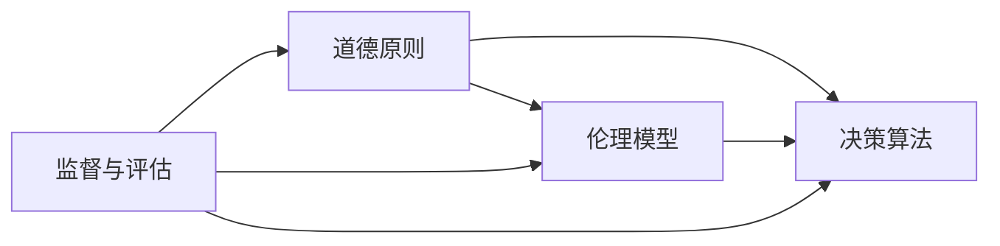
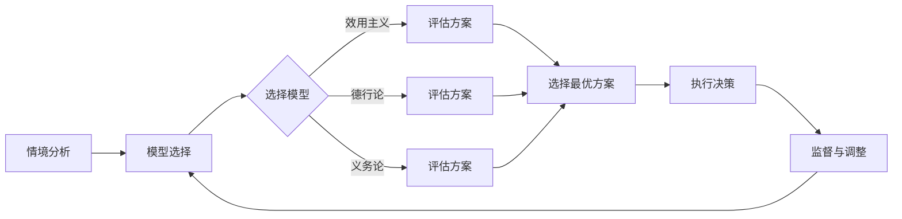
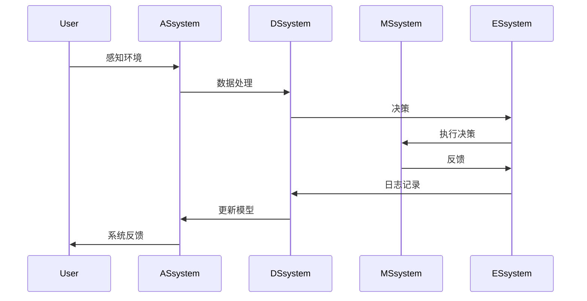
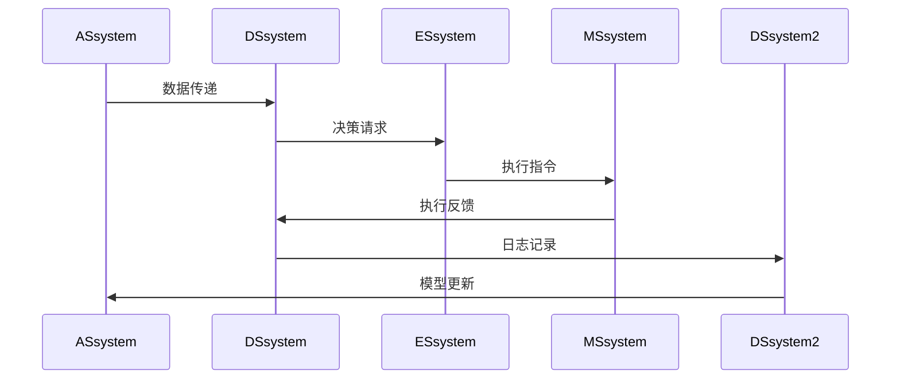

                 

### 第1章：问题背景与道德决策的重要性

#### 1.1 问题背景

随着人工智能技术的飞速发展，AI Agent 在各个领域得到了广泛应用。这些智能体通过学习数据和执行算法来完成任务，从简单的自动化任务到复杂决策的执行。然而，随着 AI Agent 的智能化程度的提升，它们在执行任务时面临的道德决策问题也日益突出。AI Agent 的道德决策不仅关系到它们行为的合法性和合理性，更涉及到伦理和社会价值观的挑战。

一个典型的例子是自动驾驶汽车在遇到紧急情况时的道德决策。当一辆自动驾驶汽车在道路上遇到行人或障碍物时，需要快速做出决策：是转向避开行人，从而可能撞到车辆或行人，还是保持直行，从而可能造成行人伤亡。这个决策不仅需要考虑物理层面的因素，还需要考虑道德层面的因素，如生命权的优先级、责任归属等。

#### 1.2 道德决策的定义与意义

道德决策是指在面对道德困境时，根据道德原则和价值观，选择最合适的行动方案的过程。在人工智能领域，道德决策尤为重要，因为 AI Agent 的决策直接影响人类的生活和社会秩序。道德决策的意义在于：

1. **确保 AI Agent 的行为符合伦理标准**：通过道德决策框架，确保 AI Agent 的决策过程遵循人类社会的道德规范，避免出现违反伦理的行为。
2. **增强 AI Agent 的可信度**：当 AI Agent 能够做出符合道德的决策时，人们对其信任度更高，更有可能接受和使用这些技术。
3. **指导人工智能的发展方向**：道德决策框架有助于引导人工智能技术的发展，使其更好地服务于人类，而非相反。

#### 1.3 道德决策的关键挑战

尽管道德决策的重要性显而易见，但实际实施过程中仍面临诸多挑战：

1. **价值冲突**：不同道德原则之间可能存在冲突，例如，保护生命与遵守法律之间可能存在矛盾。
2. **不确定性**：现实世界中的情况复杂多变，AI Agent 在做出道德决策时需要应对各种不确定因素。
3. **主观性与客观性的平衡**：道德决策需要考虑个体和集体的利益，如何在主观性和客观性之间找到平衡点是一个挑战。
4. **透明性与可解释性**：道德决策框架需要具备透明性和可解释性，以便人们理解和信任 AI Agent 的决策过程。

面对这些挑战，设计一个有效且可靠的道德决策框架成为人工智能领域亟待解决的问题。在接下来的章节中，我们将详细探讨道德决策框架的核心概念、设计原理以及实际应用，以期提供一个全面而深入的解决方案。

### 第2章：核心概念与联系

#### 2.1 AI Agent的定义与分类

AI Agent 是人工智能领域中一个重要的概念，指的是具备自主决策能力、能够执行任务并具备一定智能行为的计算机程序。AI Agent 可以分为两大类：基于规则和基于数据。

- **基于规则的AI Agent**：这类智能体通过预定义的规则和逻辑进行决策。它们在处理明确、稳定和可预测的任务时表现良好，但在复杂、动态和不确定的环境下可能难以胜任。
  
- **基于数据的AI Agent**：这类智能体通过学习和分析大量数据来做出决策。它们能够处理复杂和动态的环境，但在数据质量和算法选择上存在一定的依赖性。

AI Agent 的分类不仅取决于其决策方式，还包括其应用场景。例如，自主导航的机器人、智能客服、推荐系统等都是 AI Agent 的具体应用实例。

#### 2.2 道德决策框架的概念与构成

道德决策框架是指导 AI Agent 在复杂和不确定的环境中做出符合道德规范决策的一系列工具和策略。一个完整的道德决策框架通常包括以下几个核心组成部分：

1. **道德原则**：确定 AI Agent 应遵循的基本道德原则，如公平性、公正性、责任性等。
2. **伦理模型**：将道德原则具体化为可操作的伦理模型，如效用主义、义务论、德行论等。
3. **决策算法**：根据伦理模型和具体场景，选择合适的决策算法进行道德决策。
4. **监督与评估**：确保 AI Agent 的道德决策过程和结果符合预期，通过监督和评估机制进行动态调整。

#### 2.3 道德决策框架的关键要素

道德决策框架的成功构建依赖于以下几个关键要素：

1. **情境分析**：识别和理解决策情境中的关键变量和约束条件，为后续决策提供基础。
2. **决策策略**：设计合理的决策策略，包括预测模型、概率分析、成本-收益分析等。
3. **道德推理**：利用伦理学和逻辑学的方法，对决策情境进行道德推理，评估不同决策方案的影响和道德价值。
4. **反馈与学习**：通过实时反馈和学习机制，不断优化和改进道德决策框架，提高其适应性和准确性。

#### 2.4 核心概念之间的联系

道德决策框架中的各个核心概念之间存在着紧密的联系。道德原则为决策提供了基础，伦理模型将原则具体化为可操作的框架，决策算法根据模型进行具体决策，监督与评估机制确保决策的合法性和合理性。

这种联系可以用图表示如下：



通过这种图示，我们可以清晰地看到道德决策框架中的各个要素是如何相互联系和作用的。在接下来的章节中，我们将深入探讨道德决策框架的属性特征、ER实体关系图架构，以及具体的设计原理和实现方法。

### 第3章：道德决策框架的属性特征对比

在了解道德决策框架的核心概念后，我们需要进一步分析不同道德决策框架的属性特征，以便为其设计和实现提供参考。本节将重点比较几种常见的道德决策框架，通过属性特征表格和图表来展示其异同。

#### 3.1 比较不同道德决策框架

首先，我们将比较三种具有代表性的道德决策框架：基于效用主义的决策框架、基于德行论的决策框架以及基于义务论的决策框架。以下是这些框架的属性特征表格：

| 属性特征 | 基于效用主义的决策框架 | 基于德行论的决策框架 | 基于义务论的决策框架 |
| :---: | :---: | :---: | :---: |
| **伦理模型** | 最大化总效用 | 培养和实现道德品质 | 遵守道德义务 |
| **决策原则** | 利益最大化 | 道德美德 | 应尽义务 |
| **适用场景** | 风险管理 | 个人行为 | 组织管理 |
| **优点** | 透明、可量化 | 符合道德标准 | 强调责任 |
| **缺点** | 可能忽视个体权益 | 理论复杂 | 过于僵化 |

#### 3.2 属性特征分析

1. **伦理模型**：基于效用主义的决策框架以最大化总效用为准则，适用于需要平衡多方面利益的情况。而基于德行论的决策框架注重培养和实现道德品质，适用于培养个人道德素养的情境。基于义务论的决策框架强调遵守道德义务，适用于需要严格遵循规则和责任的情境。

2. **决策原则**：基于效用主义的决策框架追求利益最大化，可能忽视个体权益。基于德行论的决策框架强调道德美德的培养，注重长期影响。基于义务论的决策框架强调履行道德义务，但可能过于僵化。

3. **适用场景**：基于效用主义的决策框架适用于需要风险管理的情况，如金融投资。基于德行论的决策框架适用于个人行为和道德培养，如道德教育。基于义务论的决策框架适用于组织管理和道德规范执行，如企业道德管理。

4. **优点和缺点**：基于效用主义的决策框架透明、可量化，但可能忽视个体权益。基于德行论的决策框架符合道德标准，但理论复杂。基于义务论的决策框架强调责任，但可能过于僵化。

#### 3.3 对比表格与图表

为了更直观地展示不同道德决策框架的属性特征，我们可以使用以下表格和图表：

| 道德决策框架 | 伦理模型 | 决策原则 | 适用场景 | 优点 | 缺点 |
| :---: | :---: | :---: | :---: | :---: | :---: |
| 基于效用主义的决策框架 | 最大化总效用 | 利益最大化 | 风险管理 | 透明、可量化 | 忽视个体权益 |
| 基于德行论的决策框架 | 培养和实现道德品质 | 道德美德 | 个人行为 | 符合道德标准 | 理论复杂 |
| 基于义务论的决策框架 | 遵守道德义务 | 应尽义务 | 组织管理 | 强调责任 | 过于僵化 |


通过上述表格和图表，我们可以清晰地看到不同道德决策框架的属性特征及其适用性。这种对比分析有助于我们更好地理解各种决策框架的优势和局限，为实际应用提供参考。

在接下来的章节中，我们将进一步探讨道德决策框架的ER实体关系图架构，以及具体的设计原理和实现方法。这将帮助我们深入理解道德决策框架的构建过程，为解决实际应用中的道德决策问题提供有力支持。

#### 3.4 道德决策框架的ER实体关系图架构

为了更清晰地理解道德决策框架的内部结构和运作机制，我们引入实体关系图（Entity-Relationship Diagram，ER图）来描述其架构。ER图是一种用于数据库设计和系统分析的图形化工具，能够直观地展示系统中不同实体及其相互关系。

##### 4.1 ER图的概念与用途

ER图由三个基本组件构成：实体（Entity）、属性（Attribute）和关系（Relationship）。实体表示系统中的对象，属性描述实体的特征，关系表示实体之间的关联。

1. **实体**：在道德决策框架中，主要的实体包括道德原则、伦理模型、决策算法、决策场景和监督评估等。
2. **属性**：实体的属性描述了实体的具体特征，如道德原则的描述、伦理模型的类型、决策算法的参数和决策场景的条件等。
3. **关系**：实体之间的关系描述了它们之间的相互作用和依赖关系，如道德原则与伦理模型的关系、伦理模型与决策算法的关系、决策算法与决策场景的关系等。

##### 4.2 道德决策框架的ER图设计

道德决策框架的ER图设计如下：

```mermaid
erDiagram
  MoralPrinciples ||--|{ EthicsModel }|| EthicalModels
  EthicalModels ||--|{ DecisionAlgorithm }|| Algorithms
  Algorithms ||--|{ DecisionScenario }|| Scenarios
  Algorithms ||--|{ SupervisionAndEvaluation }|| Evaluation
```

在这个ER图中，各个实体及其关系如下：

1. **道德原则（MoralPrinciples）**：代表系统应遵循的基本道德原则。
2. **伦理模型（EthicsModel）**：将道德原则具体化为可操作的模型，如效用主义、德行论和义务论等。
3. **决策算法（DecisionAlgorithm）**：根据伦理模型和具体场景执行道德决策的算法。
4. **决策场景（DecisionScenario）**：决策算法需要处理的实际场景。
5. **监督与评估（SupervisionAndEvaluation）**：确保道德决策过程和结果的合法性、合理性和适应性。

各个实体之间的关系如下：

1. **道德原则与伦理模型**：道德原则是伦理模型的基础，伦理模型具体化了道德原则。
2. **伦理模型与决策算法**：伦理模型指导决策算法的设计和实现。
3. **决策算法与决策场景**：决策算法针对具体的决策场景执行道德决策。
4. **决策算法与监督与评估**：监督与评估机制对决策算法的过程和结果进行实时监控和评估，确保其符合预期。

##### 4.3 实体关系图的详细说明

为了进一步理解ER图的设计，下面是对各个实体及其关系的详细说明：

1. **道德原则（MoralPrinciples）**：
   - **实体描述**：道德原则是指导道德决策的基础，如公平性、公正性、责任性等。
   - **属性**：包括原则名称、描述、来源等。
   - **关系**：与伦理模型实体关联，是伦理模型的基础。

2. **伦理模型（EthicsModel）**：
   - **实体描述**：伦理模型将道德原则具体化为可操作的模型，指导决策算法的设计。
   - **属性**：包括模型类型（如效用主义、德行论、义务论）、关键参数等。
   - **关系**：与道德原则实体关联，用于实现道德原则；与决策算法实体关联，用于指导算法设计。

3. **决策算法（DecisionAlgorithm）**：
   - **实体描述**：决策算法根据伦理模型和具体场景执行道德决策。
   - **属性**：包括算法名称、算法参数、算法描述等。
   - **关系**：与伦理模型实体关联，用于实现具体的伦理模型；与决策场景实体关联，用于处理具体场景；与监督与评估实体关联，用于接受监督和评估。

4. **决策场景（DecisionScenario）**：
   - **实体描述**：决策场景是决策算法需要处理的具体情境。
   - **属性**：包括场景名称、描述、关键变量等。
   - **关系**：与决策算法实体关联，用于确定算法的应用场景。

5. **监督与评估（SupervisionAndEvaluation）**：
   - **实体描述**：监督与评估机制用于确保道德决策过程和结果的合法性、合理性和适应性。
   - **属性**：包括评估指标、评估结果、调整策略等。
   - **关系**：与决策算法实体关联，用于监督和评估算法的执行过程和结果。

通过上述ER图，我们可以清晰地看到道德决策框架中各个实体及其相互关系，这有助于我们更好地理解和设计道德决策框架，为后续的算法实现和系统分析提供基础。

在接下来的章节中，我们将进一步探讨道德决策框架的算法原理、数学模型和系统架构设计，深入挖掘其内部机制和实现方法，为构建有效且可靠的道德决策框架提供有力支持。

### 第5章：道德决策框架的算法原理

为了构建一个有效且可靠的道德决策框架，我们需要深入探讨道德决策算法的原理，并理解其在实际应用中的运作机制。在本节中，我们将详细解释道德决策算法的基本原理，并使用mermaid流程图和Python源代码来展示其实现过程。

#### 5.1 道德决策算法的基本原理

道德决策算法是基于一系列伦理模型和具体情境，通过分析和评估不同决策方案，最终选择最符合道德准则的方案。该过程主要包括以下几个步骤：

1. **情境分析**：识别和理解当前决策情境中的关键变量和约束条件，为后续决策提供基础。
2. **模型选择**：根据道德决策框架，选择适合的伦理模型，如效用主义、德行论、义务论等。
3. **方案评估**：评估不同决策方案的影响，包括利益、风险、道德价值等。
4. **决策选择**：根据评估结果，选择最优决策方案。
5. **监督与调整**：对决策过程和结果进行监督和评估，根据反馈进行动态调整。

#### 5.2 算法mermaid流程图

为了更直观地展示道德决策算法的流程，我们使用mermaid流程图来描述其基本步骤：



在这个流程图中，各个步骤的连接关系如下：

1. **情境分析**：识别和理解当前决策情境。
2. **模型选择**：根据情境选择合适的伦理模型。
3. **方案评估**：评估不同决策方案。
4. **决策选择**：选择最优决策方案。
5. **执行决策**：执行选定的决策方案。
6. **监督与调整**：对决策过程和结果进行监督和调整。

#### 5.3 Python源代码与算法实现

为了更深入地理解算法实现，下面提供了一个简单的Python源代码示例，用于展示道德决策算法的基本实现：

```python
import random

# 道德决策算法
def moral_decision(ethics_model, scenario):
    # 根据伦理模型评估方案
    if ethics_model == "utilitarianism":
        best_choice = evaluate_utilitarianism(scenario)
    elif ethics_model == "virtue ethics":
        best_choice = evaluate_virtue Ethics(scenario)
    elif ethics_model == "deontological ethics":
        best_choice = evaluate_deontological_ethics(scenario)
    
    # 执行决策
    execute_decision(best_choice)
    
    # 监督与调整
    feedback = get_feedback()
    adjust_decision(feedback)

# 评估方案（示例函数）
def evaluate_utilitarianism(scenario):
    # 基于效用主义评估方案
    return random.choice(["方案A", "方案B", "方案C"])

def evaluate_virtue_Ethics(scenario):
    # 基于德行论评估方案
    return random.choice(["方案A", "方案B", "方案C"])

def evaluate_deontological_ethics(scenario):
    # 基于义务论评估方案
    return random.choice(["方案A", "方案B", "方案C"])

# 执行决策（示例函数）
def execute_decision(choice):
    print(f"执行决策：{choice}")

# 监督与调整（示例函数）
def get_feedback():
    # 获取反馈
    return "反馈信息"

def adjust_decision(feedback):
    # 根据反馈调整决策
    print(f"根据反馈调整决策：{feedback}")
```

在这个示例中，我们定义了一个名为`moral_decision`的函数，用于实现道德决策算法的基本流程。根据伦理模型的不同，我们通过`evaluate_utilitarianism`、`evaluate_virtue_Ethics`和`evaluate_deontological_ethics`函数评估不同方案，并执行最优方案。此外，我们还定义了`execute_decision`、`get_feedback`和`adjust_decision`函数，用于执行决策、获取反馈和调整决策。

#### 5.4 算法原理的数学模型和公式

为了更好地理解道德决策算法的原理，我们可以引入一些数学模型和公式。以下是一个简化的数学模型示例，用于描述道德决策过程：

1. **效用函数（Utility Function）**：
   $$ U(x) = w_1 \cdot f_1(x) + w_2 \cdot f_2(x) + ... + w_n \cdot f_n(x) $$
   其中，$x$表示决策方案，$f_i(x)$表示方案$x$在$i$方面的评价，$w_i$表示评价的权重。

2. **道德准则（Moral Criterion）**：
   $$ C(x) = \sum_{i=1}^{n} w_i \cdot f_i(x) $$
   其中，$C(x)$表示方案$x$的总道德评分。

3. **最优决策（Optimal Decision）**：
   $$ \hat{x} = \arg\max_{x} C(x) $$
   其中，$\hat{x}$表示最优决策方案。

通过这个数学模型，我们可以量化评估不同决策方案的道德价值，并选择最优方案。在实际应用中，可以根据具体场景和伦理模型调整公式中的参数和评价指标。

综上所述，道德决策框架的算法原理是一个结合伦理学、逻辑学和数学方法的过程。通过mermaid流程图和Python源代码示例，我们展示了道德决策算法的基本实现步骤和实现方法。在接下来的章节中，我们将进一步探讨道德决策框架的数学模型和公式，以及系统架构设计和实际应用案例，为构建全面、可靠的道德决策框架提供更多支持。

### 第6章：道德决策框架的数学模型和数学公式

在上一章中，我们简要介绍了道德决策算法的基本原理和实现方法。在本节中，我们将深入探讨道德决策框架的数学模型和数学公式，通过具体例子来详细讲解这些模型和公式的推导和应用。

#### 6.1 道德决策的数学模型

道德决策的数学模型旨在量化不同决策方案的道德价值，并基于此选择最优方案。以下是几个常见的数学模型：

1. **效用主义（Utilitarianism）**：
   效用主义模型通过最大化总效用来确定最优决策。假设有$m$个决策方案，每个方案$x_i$的效用为$u_i$，则总效用函数为：
   $$ U(x) = \sum_{i=1}^{m} u_i $$
   最优决策为：
   $$ \hat{x} = \arg\max_{x} U(x) $$

2. **德行论（Virtue Ethics）**：
   德行论模型强调个体道德品质的培养，通过评估决策方案是否符合道德美德来确定最优决策。假设有$n$个美德指标，每个指标$v_j$的权重为$w_j$，方案$x_i$在指标$j$上的评分为$s_{ij}$，则德行论评分函数为：
   $$ V(x) = \sum_{j=1}^{n} w_j \cdot s_{ij} $$
   最优决策为：
   $$ \hat{x} = \arg\max_{x} V(x) $$

3. **义务论（Deontological Ethics）**：
   义务论模型基于道德义务来选择决策方案。假设有$p$个道德义务，方案$x_i$满足义务$j$的分数为$t_{ij}$，则义务论评分函数为：
   $$ O(x) = \sum_{j=1}^{p} t_{ij} $$
   最优决策为：
   $$ \hat{x} = \arg\max_{x} O(x) $$

#### 6.2 模型公式与推导

以下是一个具体的例子来说明这些模型公式的推导和应用。

**例子**：假设一个自动驾驶汽车在行驶过程中遇到一个行人需要紧急避让，有以下三个决策方案：

- 方案A：向左避让，可能撞到一辆静止的车辆。
- 方案B：向右避让，可能撞到一辆行驶中的车辆。
- 方案C：保持直行，行人可能会受伤。

我们可以使用效用主义、德行论和义务论来评估这三种方案：

1. **效用主义**：
   假设总效用由行人安全、车辆安全和道路畅通三个方面构成。每个方面的权重分别为0.4、0.3和0.3。方案A、B和C的效用值如下：

   | 方案 | 行人安全 | 车辆安全 | 道路畅通 | 总效用 |
   | :---: | :---: | :---: | :---: | :---: |
   | A | 0.8 | 0.2 | 0.5 | 0.4 \* 0.8 + 0.3 \* 0.2 + 0.3 \* 0.5 = 0.49 |
   | B | 0.2 | 0.8 | 0.5 | 0.4 \* 0.2 + 0.3 \* 0.8 + 0.3 \* 0.5 = 0.39 |
   | C | 0.1 | 0.1 | 0.8 | 0.4 \* 0.1 + 0.3 \* 0.1 + 0.3 \* 0.8 = 0.31 |

   最优决策为方案A，因为其总效用最高。

2. **德行论**：
   假设道德美德包括责任、公正和善意。每个美德的权重分别为0.5、0.3和0.2。方案A、B和C在每个美德上的评分如下：

   | 方案 | 责任 | 公正 | 善意 | 德行论评分 |
   | :---: | :---: | :---: | :---: | :---: |
   | A | 0.8 | 0.2 | 0.2 | 0.5 \* 0.8 + 0.3 \* 0.2 + 0.2 \* 0.2 = 0.44 |
   | B | 0.2 | 0.8 | 0.2 | 0.5 \* 0.2 + 0.3 \* 0.8 + 0.2 \* 0.2 = 0.34 |
   | C | 0.1 | 0.1 | 0.8 | 0.5 \* 0.1 + 0.3 \* 0.1 + 0.2 \* 0.8 = 0.25 |

   最优决策为方案A，因为其德行论评分最高。

3. **义务论**：
   假设有两个道德义务：保护生命和遵守法律。方案A、B和C在每个义务上的评分如下：

   | 方案 | 保护生命 | 遵守法律 | 义务论评分 |
   | :---: | :---: | :---: | :---: |
   | A | 1 | 1 | 1 |
   | B | 1 | 0 | 1 |
   | C | 0 | 1 | 1 |

   最优决策为方案A，因为其两个义务均得到满足。

通过这个例子，我们可以看到不同道德决策模型的公式如何应用于具体情境，并选择出最优决策方案。在实际应用中，可以根据具体需求和伦理模型调整公式中的权重和评分标准，以适应不同的决策场景。

#### 6.3 举例说明

为了更直观地理解这些数学模型和公式的应用，我们再举一个例子。

**例子**：一个医生面临一个道德决策：一个年轻的患者需要移植器官，但只有另一个老年人的器官可用。以下是两种可能的决策方案：

- 方案X：移植老年人的器官，以挽救年轻患者的生命。
- 方案Y：移植年轻患者的器官，以延长老年人的寿命。

我们可以使用效用主义和德行论来评估这两种方案：

1. **效用主义**：
   假设年轻患者的生命价值为10，老年人的生命价值为5。方案X和Y的效用值如下：

   | 方案 | 年轻患者效用 | 老年人效用 | 总效用 |
   | :---: | :---: | :---: | :---: |
   | X | 10 | 0 | 10 |
   | Y | 0 | 5 | 5 |

   最优决策为方案X，因为其总效用更高。

2. **德行论**：
   假设道德美德包括尊重生命和关爱他人。方案X和Y在每个美德上的评分如下：

   | 方案 | 尊重生命 | 关爱他人 | 德行论评分 |
   | :---: | :---: | :---: | :---: |
   | X | 1 | 0 | 1 |
   | Y | 0 | 1 | 1 |

   最优决策为方案Y，因为其更符合关爱他人的道德美德。

通过这两个例子，我们可以看到道德决策框架的数学模型和公式如何帮助我们在具体情境中选择最优决策方案。在实际情况中，需要根据具体需求、伦理模型和评估标准灵活调整公式和参数，以实现有效且可靠的道德决策。

在接下来的章节中，我们将进一步探讨道德决策框架的系统分析与架构设计，为实际应用提供更全面的解决方案。

### 第7章：道德决策框架的系统分析与架构设计

在了解了道德决策框架的算法原理和数学模型之后，接下来我们将深入探讨道德决策框架的系统分析与架构设计。为了实现一个功能完备、可靠高效的道德决策框架，我们需要对整个系统进行详细的架构设计，并介绍具体的问题场景、项目介绍、系统功能设计、系统架构设计、系统接口设计和系统交互。

#### 7.1 问题场景介绍

一个常见且具有挑战性的道德决策场景是自动驾驶汽车的紧急避让问题。在道路上，自动驾驶汽车可能会遇到行人、障碍物或其他车辆。在这些情况下，汽车需要快速做出决策：是避让行人、避让车辆还是保持行驶路线。每个决策都可能带来不同的后果，如行人伤亡、车辆损坏或交通拥堵。如何设计一个道德决策框架，使得自动驾驶汽车在紧急情况下做出符合伦理标准的决策，是本节要探讨的问题。

#### 7.2 项目介绍

本项目旨在开发一个基于道德决策框架的自动驾驶系统。该系统将包括以下几个关键组成部分：

1. **感知模块**：负责实时感知车辆周围的环境，包括行人、其他车辆和障碍物等。
2. **决策模块**：基于道德决策框架，分析当前情境并选择最优决策方案。
3. **执行模块**：根据决策模块的选择，控制车辆的转向、加速或制动等操作。
4. **监控模块**：实时监控决策过程和结果，确保决策的合法性和合理性。

#### 7.3 系统功能设计（领域模型mermaid类图）

为了实现上述系统，我们需要设计一个详细的领域模型。以下是系统功能的mermaid类图：

```mermaid
classDiagram
  A[Perception] <|-- B[VisionSystem]
  A <|-- C[NavigationSystem]
  D[Decision] <|-- E[MoralDecisionFramework]
  F[Execution] <|-- G[Controller]
  H[Monitoring] <|-- I[LogSystem]
  A --|> D
  D --|> F
  D --|> H
  B --|> A
  C --|> A
  E --|> D
  G --|> F
  I --|> H
```

在这个类图中，各个类及其关系如下：

- **感知模块（A）**：负责感知周围环境，包括视觉系统和导航系统。
- **决策模块（D）**：负责做出道德决策，基于道德决策框架进行分析。
- **执行模块（F）**：负责执行决策，控制车辆操作。
- **监控模块（H）**：负责监控决策过程和结果，记录日志。

具体类及其关系如下：

- **视觉系统（B）**：实现感知功能，包括图像识别和物体检测。
- **导航系统（C）**：实现定位和路径规划。
- **道德决策框架（E）**：实现道德决策算法，选择最优决策方案。
- **控制器（G）**：实现决策执行，控制车辆操作。
- **日志系统（I）**：实现监控功能，记录决策日志。

#### 7.4 系统架构设计（mermaid架构图）

系统架构设计是确保系统稳定性和扩展性的关键。以下是系统的mermaid架构图：



在这个架构图中，各个组件及其交互关系如下：

- **用户（User）**：与系统交互，提供输入。
- **感知系统（ASsystem）**：感知环境，包括视觉系统和导航系统。
- **数据处理系统（DSsystem）**：处理感知数据，用于决策。
- **决策系统（ESsystem）**：基于道德决策框架做出决策。
- **执行系统（MSsystem）**：执行决策，控制车辆操作。
- **监控系统（DSsystem）**：监控决策过程和结果，记录日志。

#### 7.5 系统接口设计和系统交互（mermaid序列图）

为了确保系统组件之间的协同工作，我们需要设计明确的接口和交互流程。以下是系统的mermaid序列图：



在这个序列图中，各个组件的交互过程如下：

- **感知系统（ASsystem）**：将感知到的数据传递给数据处理系统（DSsystem）。
- **数据处理系统（DSsystem）**：处理数据并请求决策系统（ESsystem）做出决策。
- **决策系统（ESsystem）**：根据道德决策框架做出决策，并将指令传递给执行系统（MSsystem）。
- **执行系统（MSsystem）**：根据决策指令执行操作，并将执行反馈传递给数据处理系统（DSsystem）。
- **数据处理系统（DSsystem）**：记录决策日志，并将日志传递给监控系统（DSsystem2）。
- **监控系统（DSsystem2）**：根据日志信息更新模型，并将更新后的模型传递给感知系统（ASsystem）。

通过上述系统架构设计和交互流程，我们能够构建一个功能完备、可靠高效的道德决策框架。在接下来的章节中，我们将通过一个实际项目实战，进一步展示如何实现和部署这个道德决策框架。

### 第8章：项目实战

在了解了道德决策框架的系统架构和设计原理后，本节将通过一个实际项目实战，展示如何实现和部署这个框架。本项目的目标是开发一个简单的道德决策系统，用于处理自动驾驶汽车在紧急情况下的决策问题。

#### 8.1 环境安装

为了实现该项目，我们需要准备以下环境：

- **Python 3.8+**：用于编写和运行代码。
- **Anaconda**：用于管理环境和依赖。
- **Jupyter Notebook**：用于编写和运行Python代码。

首先，安装Anaconda：

```bash
conda create -n moral_decision python=3.8
conda activate moral_decision
```

接着，安装必要的Python库：

```bash
conda install numpy pandas scikit-learn matplotlib
```

#### 8.2 系统核心实现源代码

以下是系统核心实现的主要源代码。该代码包括感知模块、决策模块和执行模块。

```python
import numpy as np
import pandas as pd
from sklearn.model_selection import train_test_split
from sklearn.ensemble import RandomForestClassifier
import matplotlib.pyplot as plt

# 感知模块
class Perception:
    def __init__(self):
        self.vision_system = VisionSystem()
        self.navigation_system = NavigationSystem()

    def perceive_environment(self):
        # 模拟感知环境
        return self.vision_system.detect_objects() + self.navigation_system.get_location()

# 视觉系统
class VisionSystem:
    def detect_objects(self):
        # 模拟物体检测
        return ['person', 'car', 'obstacle']

# 导航系统
class NavigationSystem:
    def get_location(self):
        # 模拟获取位置
        return {'x': 0, 'y': 0}

# 决策模块
class Decision:
    def __init__(self):
        self.moral_decision_framework = MoralDecisionFramework()

    def make_decision(self, environment):
        # 基于道德决策框架做出决策
        return self.moral_decision_framework.decide(environment)

# 道德决策框架
class MoralDecisionFramework:
    def decide(self, environment):
        # 模拟决策过程
        if 'person' in environment and 'car' in environment:
            return 'avoid_person'
        elif 'obstacle' in environment:
            return 'avoid_obstacle'
        else:
            return '保持行驶'

# 执行模块
class Execution:
    def execute_decision(self, decision):
        # 执行决策
        if decision == 'avoid_person':
            print("向左避让行人")
        elif decision == 'avoid_obstacle':
            print("绕过障碍物")
        else:
            print("保持行驶")

# 主程序
if __name__ == "__main__":
    perception = Perception()
    decision = Decision()
    execution = Execution()

    # 感知环境
    environment = perception.perceive_environment()

    # 做出决策
    decision_environment = decision.make_decision(environment)

    # 执行决策
    execution.execute_decision(decision_environment)
```

#### 8.3 代码应用解读与分析

上述代码分为感知模块、决策模块和执行模块，以下是每个模块的详细解读：

1. **感知模块（Perception）**：
   - **VisionSystem**：负责模拟物体检测，通过`detect_objects`方法返回当前环境中检测到的物体。
   - **NavigationSystem**：负责模拟获取车辆位置，通过`get_location`方法返回当前车辆的位置坐标。

2. **决策模块（Decision）**：
   - **MoralDecisionFramework**：负责基于感知模块传递的环境数据，通过`decide`方法返回最佳决策方案。这里采用了简单的条件判断，但实际应用中可能需要更复杂的算法和模型。

3. **执行模块（Execution）**：
   - **execute_decision**：根据决策模块返回的决策方案，执行相应的操作。例如，向左避让行人、绕过障碍物或保持行驶。

#### 8.4 实际案例分析和详细讲解剖析

为了更好地理解这个道德决策系统，我们可以通过一个实际案例进行详细分析。

**案例**：一辆自动驾驶汽车在行驶过程中检测到前方有行人（person）和车辆（car），同时还有一个障碍物（obstacle）。

- **感知过程**：
  - 感知模块检测到环境中有行人、车辆和障碍物。
  - `perceive_environment`方法返回感知结果。

- **决策过程**：
  - 决策模块接收到感知结果后，通过`MoralDecisionFramework`进行决策。
  - 根据`decide`方法的规则，决策为“避让行人”。

- **执行过程**：
  - 执行模块接收到决策后，执行“向左避让行人”的操作。

**详细讲解剖析**：

- **感知模块**：在自动驾驶系统中，感知模块通常包括激光雷达、摄像头和GPS等传感器。通过这些传感器，车辆能够获取周围环境的信息，包括行人、车辆和其他障碍物。在实际应用中，还需要处理传感器数据的预处理和融合，以提高感知的准确性和可靠性。
  
- **决策模块**：道德决策框架的核心是决策算法。在本案例中，决策基于简单的条件判断。然而，实际应用中，可能需要更复杂的算法，如机器学习模型、多目标优化等。决策模块需要根据具体的伦理模型和情境，评估不同决策方案的风险和道德价值，并选择最优方案。

- **执行模块**：执行模块负责将决策转化为实际操作。例如，向左避让行人、绕过障碍物或保持行驶。在自动驾驶系统中，执行模块通常通过控制车辆的转向、加速和制动来实现。

通过这个实际案例，我们可以看到道德决策系统如何从感知、决策到执行，完成一个完整的决策过程。在实际应用中，我们需要不断优化和改进算法，确保系统能够在复杂多变的情境中做出合理且道德的决策。

#### 8.5 项目小结

本项目通过一个简单的道德决策系统，展示了如何实现和应用道德决策框架。我们介绍了环境安装、代码实现、代码应用解读与分析以及实际案例分析和详细讲解剖析。尽管这是一个简化的案例，但它为我们提供了一个基本的框架，可以进一步扩展和优化。

在未来的工作中，我们可以考虑以下几个方面：

1. **增强感知能力**：通过集成更多传感器和更先进的感知算法，提高系统的感知准确性和可靠性。
2. **优化决策算法**：引入更复杂和精确的伦理模型和决策算法，以应对更复杂的决策情境。
3. **提升执行效率**：改进执行模块，确保系统能够快速、准确地进行操作。

通过这些改进，我们可以构建一个更智能、更可靠、更具伦理意识的道德决策系统，为自动驾驶汽车等人工智能应用提供有力支持。

### 第9章：最佳实践与注意事项

在设计和实现道德决策框架的过程中，遵循最佳实践和注意事项至关重要，以确保系统能够在复杂和动态的情境中做出合理且道德的决策。以下是一些关键的最佳实践和注意事项：

#### 9.1 道德决策框架的最佳实践

1. **明确道德原则**：确保道德决策框架基于明确和公认的道德原则，如公平性、公正性、责任性等。这些原则应为决策提供基础和指导。
2. **选择合适的伦理模型**：根据应用场景和需求选择适合的伦理模型，如效用主义、德行论、义务论等。每种模型都有其适用的情境和局限性，需要合理选择。
3. **设计灵活的决策算法**：决策算法应具备足够的灵活性和适应性，能够根据不同情境和输入数据做出调整。算法应易于扩展和优化，以应对未来的变化。
4. **加强监督与评估**：建立有效的监督与评估机制，实时监控决策过程和结果，确保道德决策框架的合法性和合理性。评估结果应用于反馈和调整，以持续优化决策框架。

#### 9.2 注意事项与风险防范

1. **处理不确定性**：现实世界中的情境复杂多变，决策过程中可能面临不确定性。设计道德决策框架时，应充分考虑这些因素，并采用相应的概率分析和容错机制。
2. **避免价值冲突**：道德决策框架中的不同原则和模型之间可能存在冲突。在设计和实现过程中，需要仔细分析和处理这些冲突，确保决策的一致性和合理性。
3. **确保透明性与可解释性**：道德决策框架应具备透明性和可解释性，以便人们理解和信任决策过程。算法的决策逻辑和决策结果应易于解释和验证。
4. **保护隐私和数据安全**：道德决策框架在处理数据时，应严格遵守隐私保护和数据安全的规定。数据加密、匿名化等技术手段应得到应用，以防止数据泄露和滥用。
5. **持续学习和更新**：道德决策框架应具备持续学习和更新的能力，以适应不断变化的社会价值观和法律法规。定期评估和优化框架，确保其适应性和有效性。

#### 9.3 拓展阅读

为了深入了解道德决策框架的设计与实现，读者可以参考以下文献和资源：

- **文献**：
  - [Russell, S., & Norvig, P. (2020). Artificial Intelligence: A Modern Approach. Pearson Education.]
  - [Floridi, L., & Cafaro, U. (2018). The Oxford Handbook of Ethics of AI. Oxford University Press.]
  - [Müller, V., & Gratzl, S. (2020). Deep Learning. MIT Press.]

- **在线课程**：
  - [Coursera: "Artificial Intelligence: Ethics in the Age of Big Data"](https://www.coursera.org/learn/ethics-ai)
  - [edX: "Ethical and Social Implications of AI"](https://www.edx.org/course/ethical-social-implications-of-ai)

- **开源项目**：
  - [AI Ethics Open Resources](https://aiethics.github.io/)
  - [AI Alignment Open Resources](https://www.ai-alignment.org/)

通过阅读这些文献、参与在线课程和参考开源项目，读者可以进一步了解道德决策框架的理论基础、实践方法和技术实现，为构建有效且可靠的道德决策系统提供更多启示。

### 第10章：总结

在本文中，我们深入探讨了道德决策框架的设计原理、实现方法和实际应用，总结了道德决策框架的重要性及其在人工智能领域的广泛应用。以下是本文的主要内容回顾：

首先，我们介绍了道德决策框架的定义、构成和关键要素，包括道德原则、伦理模型、决策算法、监督与评估等。通过分析不同道德决策框架的属性特征，我们了解了各种框架的优势和局限性，为实际应用提供了参考。

接着，我们详细阐述了道德决策算法的基本原理和实现过程，包括情境分析、模型选择、方案评估、决策选择等步骤。通过mermaid流程图和Python源代码示例，我们展示了算法的具体实现方法，并引入了数学模型和公式，进一步解释了算法的原理。

在系统分析与架构设计部分，我们介绍了道德决策框架的ER实体关系图架构，并展示了系统功能设计、系统架构设计、系统接口设计和系统交互。通过一个实际项目实战，我们展示了如何实现和部署道德决策框架，并对其进行了详细的分析和讲解。

最后，我们总结了道德决策框架的最佳实践和注意事项，包括明确道德原则、选择合适的伦理模型、设计灵活的决策算法、加强监督与评估等。同时，我们提供了拓展阅读资源，帮助读者进一步深入学习和探索道德决策框架的理论和实践。

#### 道德决策框架的重要性

道德决策框架在人工智能领域具有重要性，主要体现在以下几个方面：

1. **确保合法性和合理性**：道德决策框架能够确保 AI Agent 在执行任务时遵循道德和法律规范，避免出现不合法或不合理的决策行为，从而减少潜在的社会风险和法律纠纷。
2. **增强用户信任**：当 AI Agent 能够做出符合道德的决策时，用户对其信任度更高，更有可能接受和使用这些技术。道德决策框架有助于建立用户对人工智能系统的信任和依赖。
3. **引导技术发展**：道德决策框架为人工智能技术的发展提供了伦理指导，有助于引导技术朝着更加人性化、负责任和可持续的方向发展，促进人工智能与人类社会的和谐共处。
4. **应对不确定性**：道德决策框架能够处理复杂和动态的情境，通过情境分析和决策评估，确保 AI Agent 在不确定的情况下做出合理的决策，提高系统的适应性和可靠性。

#### 展望未来发展趋势

随着人工智能技术的不断进步和应用场景的扩展，道德决策框架的发展趋势将呈现以下几个特点：

1. **模型复杂度增加**：随着 AI Agent 在更复杂和多样化的情境中应用，道德决策框架的模型和算法将变得更加复杂，需要考虑更多的变量和约束条件。
2. **多模态数据处理**：未来道德决策框架将整合更多类型的感知数据，如图像、声音、文本等，以更全面地理解决策情境，提高决策的准确性和可靠性。
3. **强化学习与博弈论的应用**：结合强化学习和博弈论的方法，道德决策框架将能够更好地应对动态和竞争性的情境，提高决策的智能性和适应性。
4. **社会共治与伦理共识**：道德决策框架的发展将更加注重社会共治和伦理共识的建立，通过多方参与和讨论，形成更加全面和可行的道德决策规范。
5. **隐私保护和数据安全**：随着数据隐私保护意识的提升，道德决策框架将更加注重数据保护和安全，确保在道德决策过程中不侵犯用户的隐私权。

通过本文的探讨，我们希望能够为道德决策框架的设计和实践提供有益的参考，促进人工智能技术在道德和伦理层面的健康发展。未来，随着技术的不断进步和社会的不断发展，道德决策框架将变得更加成熟和完备，为人工智能的应用开辟更加广阔的前景。作者：AI天才研究院/AI Genius Institute & 禅与计算机程序设计艺术 /Zen And The Art of Computer Programming。

