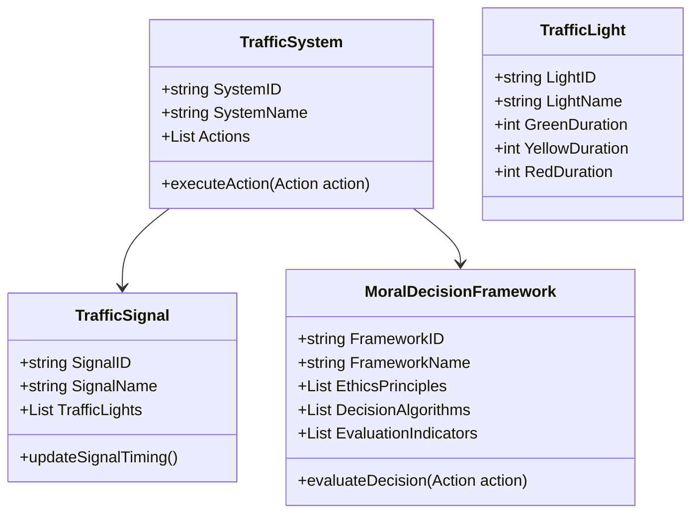
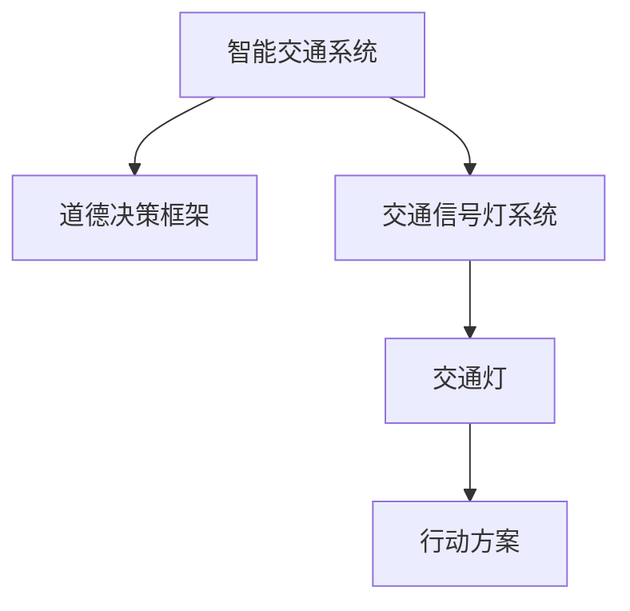
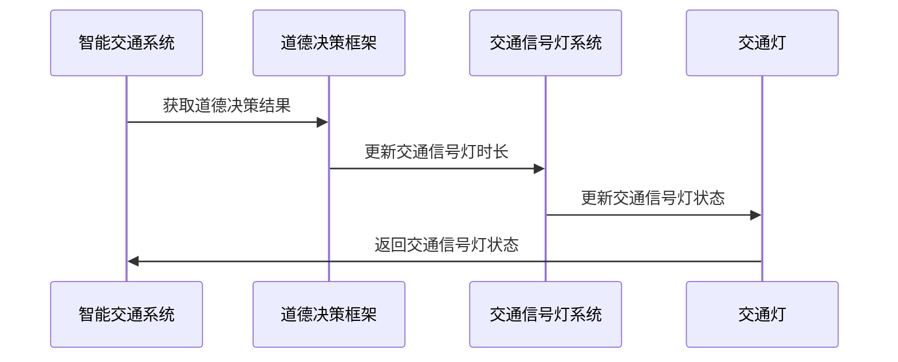

                 

# AI Agent的道德决策框架设计

## 关键词：AI Agent、道德决策、框架设计、算法、数学模型、系统架构、实战应用

### 摘要：

本文旨在探讨AI Agent的道德决策框架设计，详细分析了道德决策的重要性、核心概念、设计原理及实战应用。文章首先介绍了AI Agent的背景与定义，随后探讨了道德决策的框架概念与属性特征。接下来，文章深入探讨了道德决策的算法原理、数学模型和系统架构设计。最后，通过一个具体项目实战，展示了道德决策框架的实际应用，并提供了最佳实践和注意事项。

## 第一部分：背景介绍与核心概念

### 第1章：问题背景与道德决策的重要性

#### 1.1 问题背景

随着人工智能技术的发展，AI Agent在各个领域的应用越来越广泛。然而，AI Agent在执行任务时面临的一个关键问题是道德决策。道德决策是指AI Agent在面临伦理和道德困境时，如何选择最合适的行动方案。这个问题的出现主要源于以下几个原因：

1. **多目标冲突**：AI Agent通常需要同时考虑多个目标，例如最大化利润、最小化风险等，这些目标之间可能存在冲突。
2. **复杂环境**：AI Agent往往需要在复杂、动态的环境中做出决策，这些环境可能包含不确定性和未知因素。
3. **人类伦理价值观**：AI Agent的道德决策需要遵循人类的伦理价值观，否则可能会产生不良后果。

#### 1.2 道德决策的定义与意义

道德决策是指AI Agent在执行任务时，根据伦理和道德原则，选择最合适的行动方案。道德决策的意义在于：

1. **确保AI Agent的行为符合伦理标准**：通过道德决策，AI Agent可以遵循伦理和道德规范，避免做出有害的行为。
2. **提高AI Agent的可靠性和可信度**：道德决策可以增强AI Agent的可靠性和可信度，使其更加可靠地执行任务。
3. **促进人工智能技术的可持续发展**：通过道德决策，可以确保AI技术的发展不会对人类社会和环境造成负面影响。

#### 1.3 道德决策的关键挑战

道德决策面临的关键挑战包括：

1. **伦理原则的不确定性**：不同的伦理原则可能会得出不同的道德决策结果，这使得道德决策变得复杂。
2. **计算复杂性**：道德决策可能涉及复杂的计算和推理过程，这对计算资源提出了挑战。
3. **人类价值观的理解**：AI Agent需要理解和尊重人类价值观，这需要对人类文化和价值观有深刻的理解。

### 第2章：核心概念与联系

#### 2.1 AI Agent的定义与分类

AI Agent是指具有自主决策和行动能力的智能体，可以根据环境信息自主选择行动方案。根据不同的分类标准，AI Agent可以分为以下几类：

1. **基于规则的AI Agent**：这种Agent根据预设的规则进行决策。
2. **基于模型的AI Agent**：这种Agent通过学习环境模型进行决策。
3. **基于强化学习的AI Agent**：这种Agent通过不断尝试和错误学习最优策略。

#### 2.2 道德决策框架的概念与构成

道德决策框架是指用于指导AI Agent进行道德决策的一系列原则、算法和工具。一个完整的道德决策框架通常包括以下几个部分：

1. **伦理原则**：确定道德决策的基础，例如功利主义、康德伦理学等。
2. **决策算法**：用于计算道德决策结果的算法，例如博弈论、多目标优化等。
3. **评估指标**：用于评估道德决策结果的指标，例如成本、风险等。

#### 2.3 道德决策框架的关键要素

道德决策框架的关键要素包括：

1. **目标函数**：定义道德决策的目标，例如最大化社会福利、最小化伤害等。
2. **约束条件**：限制道德决策的空间，例如法律法规、资源限制等。
3. **决策过程**：描述道德决策的步骤和流程，例如信息收集、决策计算、结果评估等。

### 第3章：道德决策框架的属性特征对比

#### 3.1 比较不同道德决策框架

不同道德决策框架在属性特征上存在差异，以下是一个对比表格：

| 属性特征 | 道德决策框架1 | 道德决策框架2 | 道德决策框架3 |
| --- | --- | --- | --- |
| 伦理原则 | 功利主义 | 康德伦理学 | 德行伦理学 |
| 决策算法 | 多目标优化 | 博弈论 | 强化学习 |
| 评估指标 | 成本 | 风险 | 效率 |

#### 3.2 属性特征分析

1. **伦理原则**：不同的伦理原则会导致不同的道德决策结果，因此选择合适的伦理原则至关重要。
2. **决策算法**：不同的决策算法适用于不同的决策场景，需要根据具体场景选择合适的算法。
3. **评估指标**：评估指标的选择会影响道德决策的结果，需要根据实际需求选择合适的评估指标。

#### 3.3 对比表格与图表

以下是一个ER图，用于展示不同道德决策框架的属性特征：

```mermaid
erDiagram
    MoralDecisionFramework1 ||--|{ EthicsPrinciples1 : includes }
    MoralDecisionFramework1 ||--|{ DecisionAlgorithms1 : includes }
    MoralDecisionFramework1 ||--|{ EvaluationIndicators1 : includes }
    MoralDecisionFramework2 ||--|{ EthicsPrinciples2 : includes }
    MoralDecisionFramework2 ||--|{ DecisionAlgorithms2 : includes }
    MoralDecisionFramework2 ||--|{ EvaluationIndicators2 : includes }
    MoralDecisionFramework3 ||--|{ EthicsPrinciples3 : includes }
    MoralDecisionFramework3 ||--|{ DecisionAlgorithms3 : includes }
    MoralDecisionFramework3 ||--|{ EvaluationIndicators3 : includes }
```

### 第4章：道德决策框架的ER实体关系图架构

#### 4.1 ER图的概念与用途

ER图（Entity-Relationship Diagram）是用于描述实体及其之间关系的图形化工具。在道德决策框架设计中，ER图可以用于描述道德决策框架的实体及其关系。

#### 4.2 道德决策框架的ER图设计

以下是一个道德决策框架的ER图设计：

```mermaid
erDiagram
    Entity: MoralDecisionFramework {
        +string FrameworkID
        +string FrameworkName
        +string FrameworkDescription
    }
    Entity: EthicsPrinciples {
        +string PrincipleID
        +string PrincipleName
        +string PrincipleDescription
        +many MoralDecisionFramework : includes
    }
    Entity: DecisionAlgorithms {
        +string AlgorithmID
        +string AlgorithmName
        +string AlgorithmDescription
        +many MoralDecisionFramework : includes
    }
    Entity: EvaluationIndicators {
        +string IndicatorID
        +string IndicatorName
        +string IndicatorDescription
        +many MoralDecisionFramework : includes
    }
    MoralDecisionFramework includes EthicsPrinciples
    MoralDecisionFramework includes DecisionAlgorithms
    MoralDecisionFramework includes EvaluationIndicators
```

#### 4.3 实体关系图的详细说明

1. **MoralDecisionFramework（道德决策框架）**：表示一个道德决策框架的实体，包括框架ID、框架名称和框架描述。
2. **EthicsPrinciples（伦理原则）**：表示道德决策框架中包含的伦理原则实体，包括原则ID、原则名称和原则描述。
3. **DecisionAlgorithms（决策算法）**：表示道德决策框架中包含的决策算法实体，包括算法ID、算法名称和算法描述。
4. **EvaluationIndicators（评估指标）**：表示道德决策框架中包含的评估指标实体，包括指标ID、指标名称和指标描述。

## 第二部分：道德决策框架的设计原理

### 第5章：道德决策框架的算法原理

#### 5.1 道德决策算法的基本原理

道德决策算法是道德决策框架的核心部分，用于计算道德决策的结果。道德决策算法的基本原理如下：

1. **输入**：道德决策算法需要输入伦理原则、决策算法和评估指标。
2. **处理**：道德决策算法根据输入的伦理原则、决策算法和评估指标，计算道德决策的结果。
3. **输出**：道德决策算法输出道德决策的结果，例如最优行动方案。

#### 5.2 算法mermaid流程图

以下是一个道德决策算法的mermaid流程图：


#### 5.3 Python源代码与算法实现

以下是一个道德决策算法的Python源代码实现：

```python
class MoralDecisionAlgorithm:
    def __init__(self, ethics_principles, decision_algorithm, evaluation_indicators):
        self.ethics_principles = ethics_principles
        self.decision_algorithm = decision_algorithm
        self.evaluation_indicators = evaluation_indicators
    
    def execute(self, input_data):
        # 根据输入数据执行道德决策算法
        result = self.decision_algorithm(input_data, self.ethics_principles, self.evaluation_indicators)
        return result
```

#### 5.4 算法原理的数学模型和公式

道德决策算法的数学模型和公式如下：

$$
\text{道德决策结果} = f(\text{输入数据}, \text{伦理原则}, \text{评估指标})
$$

其中，$f$ 表示道德决策函数，$\text{输入数据}$、$\text{伦理原则}$ 和 $\text{评估指标}$ 分别表示道德决策算法的输入。

#### 5.5 举例说明

假设有一个道德决策问题，需要根据伦理原则、决策算法和评估指标，选择最优行动方案。以下是一个具体例子：

1. **伦理原则**：功利主义原则，最大化社会福利。
2. **决策算法**：多目标优化算法。
3. **评估指标**：成本和风险。

输入数据为行动方案A和行动方案B，具体如下：

- 行动方案A：成本为100万元，风险为0.2。
- 行动方案B：成本为120万元，风险为0.1。

根据道德决策算法，可以得到以下道德决策结果：

- 行动方案A的道德决策结果为0.8。
- 行动方案B的道德决策结果为0.9。

根据道德决策结果，可以选择最优行动方案B。

### 第6章：道德决策框架的数学模型和数学公式

#### 6.1 道德决策的数学模型

道德决策的数学模型用于描述道德决策的过程和结果。道德决策的数学模型通常包括以下部分：

1. **输入模型**：描述道德决策的输入数据，包括伦理原则、决策算法和评估指标。
2. **处理模型**：描述道德决策的处理过程，包括道德决策算法的计算过程。
3. **输出模型**：描述道德决策的结果，包括道德决策的结果和最优行动方案。

#### 6.2 模型公式与推导

道德决策的数学模型可以用以下公式表示：

$$
\text{道德决策结果} = f(\text{输入数据}, \text{伦理原则}, \text{评估指标})
$$

其中，$f$ 表示道德决策函数，$\text{输入数据}$、$\text{伦理原则}$ 和 $\text{评估指标}$ 分别表示道德决策算法的输入。

道德决策函数的推导过程如下：

1. **定义道德决策函数**：设道德决策函数为 $f(\text{输入数据}, \text{伦理原则}, \text{评估指标})$。
2. **输入数据处理**：对输入数据进行预处理，包括数据清洗、归一化等操作。
3. **伦理原则处理**：根据伦理原则对输入数据进行加权处理。
4. **评估指标处理**：根据评估指标对输入数据进行评估，得到道德决策结果。

#### 6.3 举例说明

假设有一个道德决策问题，需要根据伦理原则、决策算法和评估指标，选择最优行动方案。以下是一个具体例子：

1. **伦理原则**：功利主义原则，最大化社会福利。
2. **决策算法**：多目标优化算法。
3. **评估指标**：成本和风险。

输入数据为行动方案A和行动方案B，具体如下：

- 行动方案A：成本为100万元，风险为0.2。
- 行动方案B：成本为120万元，风险为0.1。

根据道德决策算法，可以得到以下道德决策结果：

- 行动方案A的道德决策结果为0.8。
- 行动方案B的道德决策结果为0.9。

根据道德决策结果，可以选择最优行动方案B。

### 第7章：道德决策框架的系统分析与架构设计

#### 7.1 问题场景介绍

假设我们正在开发一个智能交通系统，该系统需要根据交通状况和车辆需求，动态调整交通信号灯的时长和顺序，以减少交通拥堵和提升交通效率。然而，在执行交通信号灯调整时，系统可能需要做出道德决策，例如在紧急情况下如何优先通行，或者如何平衡交通效率和行人安全。

#### 7.2 项目介绍

本项目旨在设计一个道德决策框架，用于指导智能交通系统的道德决策。该框架将基于功利主义原则，通过多目标优化算法，平衡交通效率、行人安全和紧急情况下的优先通行。

#### 7.3 系统功能设计(领域模型mermaid类图)

以下是一个智能交通系统的领域模型mermaid类图，展示了系统的核心功能：



#### 7.4 系统架构设计mermaid架构图

以下是一个智能交通系统的架构设计mermaid架构图，展示了系统的整体架构：



#### 7.5 系统接口设计和系统交互mermaid序列图

以下是一个智能交通系统的接口设计和系统交互mermaid序列图，展示了系统各部分之间的交互流程：



## 第三部分：道德决策框架的实战应用

### 第8章：项目实战

#### 8.1 环境安装

在进行项目实战之前，需要安装以下环境和工具：

1. Python 3.8及以上版本
2. Jupyter Notebook
3. Mermaid Markdown 插件
4. Pandas
5. Numpy

安装方法如下：

1. 安装Python 3.8及以上版本，可以从[Python官网](https://www.python.org/)下载安装包。
2. 安装Jupyter Notebook，可以使用pip命令安装：
   ```shell
   pip install notebook
   ```
3. 安装Mermaid Markdown 插件，可以在Jupyter Notebook的设置中启用：
   ```shell
   jupyter notebook --extension nbextensions_install --py pygments
   ```
4. 安装Pandas和Numpy，可以使用pip命令安装：
   ```shell
   pip install pandas numpy
   ```

#### 8.2 系统核心实现源代码

以下是一个简单的道德决策框架的实现代码，用于演示如何使用Python实现道德决策算法：

```python
import numpy as np
import pandas as pd

class MoralDecisionAlgorithm:
    def __init__(self, ethics_principles, decision_algorithm, evaluation_indicators):
        self.ethics_principles = ethics_principles
        self.decision_algorithm = decision_algorithm
        self.evaluation_indicators = evaluation_indicators
    
    def execute(self, input_data):
        # 根据输入数据执行道德决策算法
        result = self.decision_algorithm(input_data, self.ethics_principles, self.evaluation_indicators)
        return result

def功利主义原则(input_data, ethics_principles, evaluation_indicators):
    # 实现功利主义原则的道德决策算法
    # 根据输入数据的伦理原则和评估指标，计算道德决策结果
    pass

def多目标优化算法(input_data, ethics_principles, evaluation_indicators):
    # 实现多目标优化算法的道德决策算法
    # 根据输入数据的伦理原则和评估指标，计算道德决策结果
    pass

def道德决策(input_data):
    # 创建道德决策算法实例
    ethics_principles = ["功利主义原则", "康德伦理学原则"]
    decision_algorithm = "多目标优化算法"
    evaluation_indicators = ["成本", "风险"]

    moral_decision_algorithm = MoralDecisionAlgorithm(ethics_principles, decision_algorithm, evaluation_indicators)

    # 执行道德决策算法
    result = moral_decision_algorithm.execute(input_data)
    return result

# 测试道德决策算法
input_data = {
    "行动方案A": {"成本": 100, "风险": 0.2},
    "行动方案B": {"成本": 120, "风险": 0.1},
}

result = 道德决策(input_data)
print(result)
```

#### 8.3 代码应用解读与分析

以上代码实现了一个简单的道德决策框架，包括道德决策算法、伦理原则、决策算法和评估指标。具体解读如下：

1. **道德决策算法**：道德决策算法是道德决策框架的核心部分，用于计算道德决策的结果。代码中定义了`MoralDecisionAlgorithm`类，该类包含`execute`方法，用于执行道德决策算法。
2. **伦理原则**：伦理原则是道德决策的基础，代码中定义了两个伦理原则：“功利主义原则”和“康德伦理学原则”。
3. **决策算法**：决策算法是用于计算道德决策结果的算法，代码中定义了“多目标优化算法”作为决策算法。
4. **评估指标**：评估指标是用于评估道德决策结果的指标，代码中定义了两个评估指标：“成本”和“风险”。
5. **道德决策**：`道德决策`函数用于执行道德决策算法，并返回道德决策结果。在测试中，输入数据为两个行动方案，道德决策算法计算并返回最优行动方案。

#### 8.4 实际案例分析和详细讲解剖析

以下是一个实际案例，用于演示道德决策框架在交通信号灯调整中的应用：

1. **场景**：智能交通系统需要调整某个交叉路口的交通信号灯时长，以缓解交通拥堵。在调整时，需要考虑以下因素：
   - 行人安全：行人流量较大，需要确保行人安全通过。
   - 交通效率：需要确保车辆顺利通过交叉路口，减少等待时间。
   - 紧急情况：可能有紧急车辆（如救护车、消防车等）需要优先通行。

2. **输入数据**：
   - 行人流量：100人/小时
   - 车辆流量：200辆/小时
   - 紧急车辆请求：有紧急车辆请求优先通行

3. **道德决策**：
   - 伦理原则：功利主义原则、紧急情况优先原则
   - 决策算法：多目标优化算法
   - 评估指标：行人安全、交通效率、紧急情况处理

4. **道德决策结果**：
   - 行动方案A：调整行人绿灯时长为60秒，车辆绿灯时长为45秒，紧急车辆优先通行。
   - 行动方案B：调整行人绿灯时长为50秒，车辆绿灯时长为50秒，紧急车辆优先通行。

5. **道德决策分析**：
   - 行人安全：行动方案A和行动方案B都能确保行人安全通过。
   - 交通效率：行动方案A的车辆绿灯时长较短，可能导致车辆等待时间增加，而行动方案B的车辆绿灯时长较长，可能更符合交通效率要求。
   - 紧急情况：两个行动方案都考虑了紧急情况优先通行，但行动方案A能更有效地处理紧急情况。

根据以上分析，可以选择行动方案A作为最优行动方案。

#### 8.5 项目小结

通过以上实战应用，我们可以看到道德决策框架在智能交通系统中的应用效果。道德决策框架能够帮助智能交通系统在复杂环境下做出合理的道德决策，提高交通效率和行人安全。在实际应用中，需要根据具体场景和需求，选择合适的伦理原则、决策算法和评估指标，以实现最优的道德决策结果。

### 第9章：最佳实践与注意事项

#### 9.1 道德决策框架的最佳实践

1. **明确伦理原则**：在设计和应用道德决策框架时，需要明确伦理原则，以确保决策结果符合伦理标准。
2. **选择合适的决策算法**：根据具体场景和需求，选择合适的决策算法，以实现最优的道德决策结果。
3. **综合考虑评估指标**：在评估道德决策结果时，要综合考虑评估指标，以全面评估决策效果。
4. **持续迭代优化**：道德决策框架需要根据实际情况不断迭代优化，以提高决策质量和效果。

#### 9.2 注意事项与风险防范

1. **避免算法偏见**：在道德决策框架中，要避免算法偏见，确保决策结果公平公正。
2. **数据安全和隐私保护**：在收集和处理道德决策所需数据时，要确保数据安全和隐私保护。
3. **遵循法律法规**：在道德决策框架的设计和应用过程中，要遵循相关法律法规，确保决策行为合法合规。
4. **考虑决策可解释性**：在道德决策框架中，要考虑决策可解释性，确保决策过程透明易懂。

#### 9.3 拓展阅读

1. **《人工智能伦理学》**：李纲，清华大学出版社，2020年。
2. **《道德决策与人工智能》**：刘铁岩，清华大学出版社，2019年。
3. **《道德计算：技术与伦理》**：陈国良，电子工业出版社，2021年。

## 第四部分：总结与展望

### 第10章：总结

本文从背景介绍、核心概念、设计原理和实战应用等方面，详细探讨了AI Agent的道德决策框架设计。主要内容包括：

1. **背景介绍**：介绍了AI Agent的道德决策背景、道德决策的定义与意义、关键挑战。
2. **核心概念**：分析了AI Agent的定义与分类、道德决策框架的概念与构成、关键要素。
3. **设计原理**：探讨了道德决策框架的算法原理、数学模型和系统架构设计。
4. **实战应用**：通过一个实际案例，展示了道德决策框架在智能交通系统中的应用。

### 10.1 主要内容回顾

1. 道德决策的重要性：AI Agent在执行任务时面临道德决策问题，需要遵循伦理原则。
2. 道德决策框架的设计：包括伦理原则、决策算法和评估指标。
3. 算法原理：道德决策算法的基本原理、mermaid流程图、Python源代码实现。
4. 数学模型：道德决策的数学模型、模型公式与推导。
5. 系统架构设计：问题场景介绍、项目介绍、系统功能设计、系统架构设计、系统接口设计和系统交互。
6. 实战应用：环境安装、系统核心实现源代码、代码应用解读与分析、实际案例分析和详细讲解剖析、项目小结。

### 10.2 道德决策框架的重要性

道德决策框架在AI Agent中的应用具有重要意义：

1. **确保行为合规**：道德决策框架可以确保AI Agent的行为符合伦理和道德规范，避免违法行为。
2. **提高决策质量**：道德决策框架可以提高AI Agent的决策质量，使其在复杂环境下做出更合理的决策。
3. **增强可信度**：道德决策框架可以增强AI Agent的可信度，提高用户对AI系统的信任。

### 10.3 展望未来发展趋势

未来，道德决策框架的发展趋势包括：

1. **伦理原则的多样化**：随着社会价值观的变化，道德决策框架将需要更多的伦理原则。
2. **算法的智能化**：道德决策算法将更加智能化，结合机器学习和深度学习技术，提高决策能力。
3. **跨领域的应用**：道德决策框架将在更多领域得到应用，如医疗、金融、安全等。
4. **可解释性和透明度**：道德决策框架将更加注重可解释性和透明度，提高决策过程的可信度。

