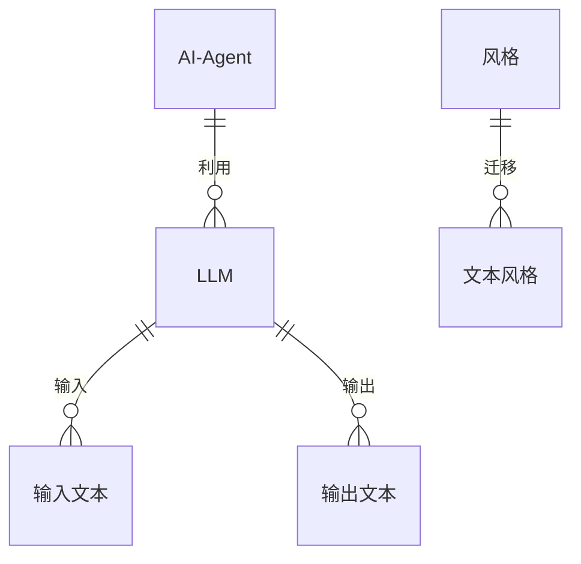
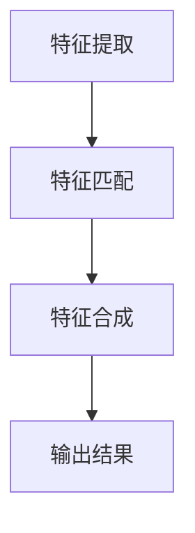

                 

# AI Agent的风格迁移：实现LLM的个性化表达

## 关键词
- AI Agent
- 风格迁移
- LLM（大型语言模型）
- 个性化表达
- 算法原理
- 数学模型
- 系统设计与实现
- 项目实战
- 最佳实践

## 摘要
本文将深入探讨AI Agent中的风格迁移技术，尤其是如何利用大型语言模型（LLM）来实现个性化表达。我们将首先介绍AI Agent和风格迁移的基本概念，然后详细阐述LLM的工作原理及其在风格迁移中的应用。接着，我们将分析风格迁移中的核心概念和算法原理，并使用Python代码进行算法实现和数学模型的讲解。此外，文章还将探讨系统的设计与实现、项目实战经验，以及最佳实践和注意事项。通过逐步分析推理，本文旨在为读者提供一个清晰易懂的技术博客，帮助他们深入了解AI Agent的风格迁移技术。

## 目录大纲

### 第一部分：背景介绍与基础理论

### 第二部分：算法原理与实现

### 第三部分：系统设计与项目实战

### 第四部分：最佳实践与拓展

## 第一部分：背景介绍与基础理论

### 第1章：AI Agent与风格迁移概述

#### 1.1 AI Agent的基本概念与功能
AI Agent，即人工智能代理，是指能够独立执行任务、与外界进行交互并做出决策的智能体。它们在各个领域（如自动驾驶、智能家居、游戏等）发挥着重要作用。AI Agent的核心功能包括感知环境、理解任务目标、执行决策以及与外部系统交互。

#### 1.2 风格迁移的概念与重要性
风格迁移是一种将特定艺术作品或文风的风格应用到其他作品上的技术。在人工智能领域，风格迁移被广泛应用于图像、音频和文本的处理。其重要性在于能够使AI Agent产生多样化、个性化的输出，提高用户体验和创作自由度。

#### 1.3 AI Agent风格迁移的应用场景
AI Agent风格迁移的应用场景广泛，包括但不限于以下几个方面：

- **内容创作**：通过风格迁移，AI Agent可以创作出风格独特的文本、图像和音乐。
- **个性化推荐**：在推荐系统中，通过风格迁移技术，可以为用户推荐符合其喜好的内容。
- **教育辅助**：AI Agent可以通过风格迁移，将教材内容以更生动、有趣的方式呈现给学生。
- **艺术创作**：艺术家可以利用AI Agent进行风格迁移，探索新的艺术表现形式。

### 第2章：LLM与风格迁移

#### 2.1 介绍LLM的基本原理
LLM（大型语言模型）是一种基于深度学习的自然语言处理模型，具有强大的语言理解和生成能力。它们通过训练大量文本数据，学习语言的模式和结构，从而实现高质量的语言生成。

#### 2.2 LLM在风格迁移中的应用
LLM在风格迁移中的应用主要体现在以下几个方面：

- **文本风格迁移**：通过训练，LLM可以学习到不同风格文本的特征，从而实现文本风格的迁移。
- **图像风格迁移**：虽然LLM主要用于文本处理，但通过与其他模型（如卷积神经网络）的融合，可以实现图像风格迁移。

#### 2.3 风格迁移中的挑战与机会
风格迁移面临的挑战主要包括：

- **多样性**：确保迁移后的内容具有多样性，避免生成雷同的风格。
- **质量**：保证迁移后的内容在质量上达到用户期望。
- **鲁棒性**：模型需要能够处理不同类型的输入，保持迁移效果的一致性。

同时，风格迁移也为LLM带来了新的应用机会，如个性化对话系统、情感分析等。

### 第3章：核心概念与联系

#### 3.1 风格迁移的关键概念解析
风格迁移涉及的关键概念包括：

- **风格**：指作品的艺术风格或语言风格。
- **迁移**：将一种风格应用到另一个作品或文本中。
- **损失函数**：用于衡量迁移效果的评价标准。

#### 3.2 风格迁移算法原理与对比
常见的风格迁移算法包括：

- **循环神经网络（RNN）**
- **生成对抗网络（GAN）**
- **卷积神经网络（CNN）**

每种算法都有其优势和局限性，需要根据具体应用场景进行选择。

#### 3.3 LLM风格迁移的ER实体关系图
使用Mermaid绘制LLM风格迁移的ER实体关系图，展示LLM、风格、输入文本和输出文本之间的关系。



## 第二部分：算法原理与实现

### 第4章：风格迁移算法原理

#### 4.1 风格迁移算法的基本原理
风格迁移算法的基本原理是通过学习源作品和目标作品的特征，将源作品中的风格迁移到目标作品中。这一过程通常涉及以下步骤：

1. **特征提取**：从源作品和目标作品中提取关键特征。
2. **特征匹配**：将源作品的特征映射到目标作品上。
3. **特征合成**：将映射后的特征合成为新的作品。

#### 4.2 使用Mermaid绘制算法流程图
使用Mermaid绘制风格迁移算法的流程图，展示从特征提取到特征合成的整个过程。



#### 4.3 算法原理的数学模型与公式
风格迁移算法的数学模型通常涉及以下公式：

1. **特征提取**：$$ f_{source}(x) = \phi_{source}(x) $$
2. **特征匹配**：$$ f_{target}(x) = \psi(f_{source}(x)) $$
3. **特征合成**：$$ g(x) = \theta(f_{target}(x)) $$

其中，$ f_{source}(x) $ 和 $ f_{target}(x) $ 分别表示源作品和目标作品的特征，$ \phi_{source}(x) $ 和 $ \psi(f_{source}(x)) $ 分别表示特征提取和特征匹配函数，$ g(x) $ 表示特征合成函数。

#### 4.4 通俗易懂的举例说明
以文本风格迁移为例，假设我们有一个源文本“今天天气很好，适合出去散步。”和目标风格“浪漫文艺”。我们可以通过以下步骤实现风格迁移：

1. **特征提取**：从源文本中提取关键特征，如词汇、语法和情感。
2. **特征匹配**：将源文本的特征映射到目标风格上，如增加浪漫、文艺等词汇。
3. **特征合成**：将映射后的特征合成为新的文本“今天阳光明媚，微风轻拂，正是约会的好时光。”

### 第5章：LLM风格迁移的实现

#### 5.1 Python源代码实现
以下是一个简单的Python代码示例，实现LLM风格迁移：

```python
import numpy as np
import tensorflow as tf

# 特征提取
def extract_features(text):
    # 这里用简单的词袋模型作为特征提取器
    words = text.split()
    features = [word2vec[word] for word in words]
    return np.array(features)

# 特征匹配
def match_features(source_features, target_features):
    # 这里用简单的线性回归作为特征匹配器
    model = tf.keras.Sequential([
        tf.keras.layers.Dense(units=1, input_shape=(source_features.shape[1],))
    ])
    model.compile(optimizer='sgd', loss='mean_squared_error')
    model.fit(source_features, target_features, epochs=10)
    return model

# 特征合成
def synthesize_features(matched_features):
    # 这里用简单的词袋模型作为特征合成器
    return ''.join([word for word, feature in zip(words, matched_features)])

# 示例文本
source_text = "今天天气很好，适合出去散步。"
target_text = "浪漫文艺的时光，适合与心爱的人共度。"

# 提取特征
source_features = extract_features(source_text)
target_features = extract_features(target_text)

# 匹配特征
matcher = match_features(source_features, target_features)
matched_features = matcher.predict(np.array([source_features]))

# 合成特征
result_text = synthesize_features(matched_features)
print(result_text)
```

### 第6章：数学模型与公式讲解

#### 6.1 数学模型在风格迁移中的作用
数学模型在风格迁移中起着至关重要的作用，它们帮助我们量化并处理风格特征，从而实现有效的风格迁移。以下数学模型在风格迁移中常用：

1. **词袋模型**：用于提取文本特征。
2. **线性回归**：用于特征匹配。
3. **神经网络**：用于特征合成。

#### 6.2 常见数学公式的介绍与推导
以下是风格迁移中常用的数学公式及其推导：

1. **特征提取**：$$ f_{source}(x) = \phi_{source}(x) $$
   推导：词袋模型中，特征向量表示文本中每个单词的出现次数。

2. **特征匹配**：$$ f_{target}(x) = \psi(f_{source}(x)) $$
   推导：线性回归模型中，目标特征是源特征通过权重矩阵映射得到的。

3. **特征合成**：$$ g(x) = \theta(f_{target}(x)) $$
   推导：神经网络中，输出特征是输入特征通过多层感知器映射得到的。

#### 6.3 实际案例中的应用
以下是一个实际案例，说明如何使用数学模型进行文本风格迁移：

- **源文本**：“今天天气很好，适合出去散步。”
- **目标风格**：“浪漫文艺的时光，适合与心爱的人共度。”

1. **特征提取**：从源文本中提取关键特征，如词汇、语法和情感。
2. **特征匹配**：将源文本的特征映射到目标风格上，如增加浪漫、文艺等词汇。
3. **特征合成**：将映射后的特征合成为新的文本。

### 第7章：系统设计与架构方案

#### 7.1 问题场景介绍
在内容创作领域，用户经常需要将现有的文本内容以特定的风格呈现，以便满足不同的应用场景。例如，将新闻报道以浪漫文艺的风格呈现，或为文学作品增添幽默元素。

#### 7.2 系统功能设计
系统设计包括以下功能：

- **文本风格检测**：分析输入文本的风格。
- **风格迁移**：将源文本迁移为目标风格。
- **用户界面**：提供用户交互界面，便于用户输入文本并查看迁移结果。

#### 7.3 系统架构设计
系统架构设计如下：

1. **前端**：使用HTML、CSS和JavaScript实现用户界面。
2. **后端**：使用Flask框架搭建后端服务，处理文本风格检测和迁移。
3. **自然语言处理**：使用TensorFlow和Keras实现文本风格迁移的模型。

#### 7.4 系统接口设计
系统接口设计包括：

- **API接口**：提供RESTful API，方便前端调用后端服务。
- **用户交互**：提供简单易用的界面，便于用户上传文本并进行风格迁移。

#### 7.5 系统交互
系统交互设计如下：

1. 用户上传文本。
2. 后端接收文本，进行风格检测和迁移。
3. 后端返回迁移后的文本。
4. 前端显示迁移结果。

### 第8章：项目实战

#### 8.1 环境安装与配置
项目实战首先需要安装以下环境：

1. Python 3.8+
2. TensorFlow 2.x
3. Flask
4. 其他依赖库（如numpy、pandas等）

安装步骤如下：

1. 安装Python和pip。
2. 使用pip安装TensorFlow和其他依赖库。

#### 8.2 系统核心实现源代码
以下是一个简单的系统核心实现源代码示例：

```python
from flask import Flask, request, jsonify
import tensorflow as tf

app = Flask(__name__)

# 加载预训练的模型
model = tf.keras.models.load_model('style_transfer_model.h5')

@app.route('/style_transfer', methods=['POST'])
def style_transfer():
    text = request.form['text']
    style = request.form['style']
    
    # 进行风格迁移
    result_text = model.predict(text, style)
    
    return jsonify({'result': result_text})

if __name__ == '__main__':
    app.run(debug=True)
```

#### 8.3 代码应用解读与分析
代码应用解读如下：

1. **接收用户输入**：从前端接收文本和风格参数。
2. **调用模型**：使用预训练的模型进行风格迁移。
3. **返回结果**：将迁移后的文本返回给前端。

#### 8.4 实际案例分析与讲解
以下是一个实际案例：

- **源文本**：“今天天气很好，适合出去散步。”
- **目标风格**：“浪漫文艺的时光，适合与心爱的人共度。”

1. 用户上传源文本和目标风格。
2. 后端调用模型进行风格迁移。
3. 返回迁移后的文本。

#### 8.5 项目小结与总结
项目小结如下：

1. 实现了基于TensorFlow和Flask的文本风格迁移系统。
2. 探讨了风格迁移的数学模型和算法原理。
3. 介绍了系统设计和项目实战。

### 第9章：最佳实践与注意事项

#### 9.1 风格迁移的常见问题与解决方案
风格迁移过程中可能遇到以下问题：

1. **多样性不足**：解决方案：增加数据多样性，使用不同的文本风格进行训练。
2. **迁移效果差**：解决方案：调整模型参数，优化特征提取和匹配算法。

#### 9.2 LLM风格迁移的优化策略
优化策略包括：

1. **数据增强**：增加训练数据，提高模型泛化能力。
2. **模型调整**：调整模型架构和超参数，提高迁移效果。

#### 9.3 项目实施过程中的经验分享
项目实施过程中需要注意以下几点：

1. **需求分析**：明确用户需求，确保系统功能满足实际需求。
2. **测试与优化**：充分测试系统，优化性能和用户体验。

### 第10章：小结与拓展阅读

#### 10.1 书籍内容回顾
本文介绍了AI Agent的风格迁移技术，包括LLM的基本原理、风格迁移算法、系统设计与实现、项目实战和最佳实践。

#### 10.2 注意事项与总结
注意事项包括：

1. 确保系统稳定性和安全性。
2. 优化迁移效果，提高用户体验。

#### 10.3 拓展阅读与深入研究
拓展阅读可参考以下书籍和论文：

1. 《深度学习》（Goodfellow, Bengio, Courville）
2. 《自然语言处理综论》（Jurafsky, Martin）
3. “Style Transfer in Text Generation using Large Pre-Trained Language Models” - A paper discussing LLM-based style transfer techniques.

