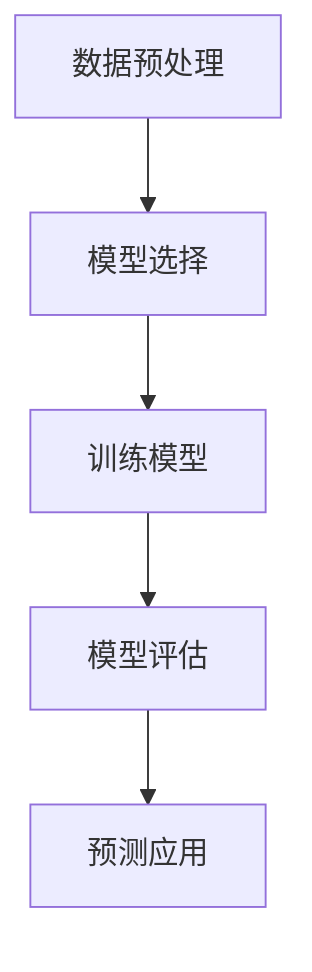
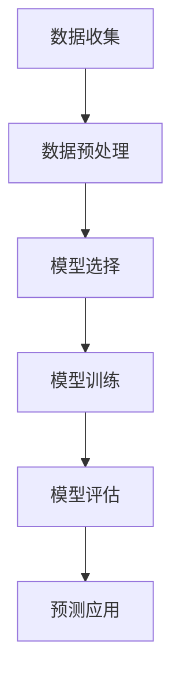
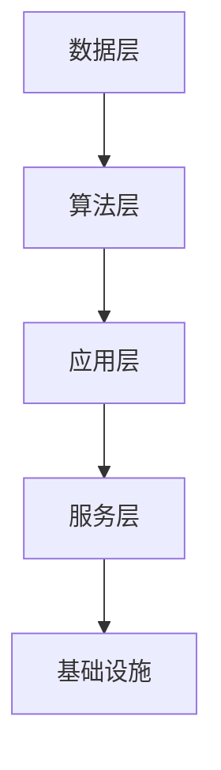
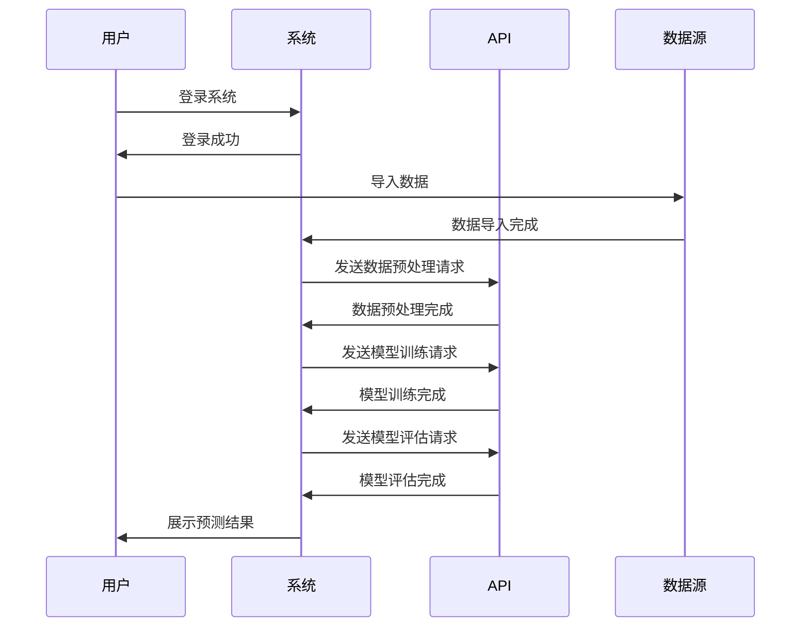

                 


# AI在企业并购估值中的应用与挑战

## 关键词

AI, 企业并购，估值，数据挖掘，机器学习，深度学习，风险评估，市场预测，系统集成，最佳实践

## 摘要

本文旨在探讨人工智能（AI）在企业并购估值中的应用及其面临的挑战。随着数据驱动的决策日益重要，AI技术在评估企业价值和预测并购风险方面展现出巨大的潜力。本文首先概述了企业并购和估值的基本概念，然后深入分析了AI技术在数据挖掘、风险评估和市场预测中的应用，并讨论了其带来的优势和挑战。通过详细的算法原理讲解、系统架构设计和项目实战案例，本文旨在为从事企业并购估值的专业人士提供实用的指导和建议。

----------------------------------------------------------------

## 第一部分：问题背景与核心概念

### 第1章：问题背景

#### 1.1 企业并购与估值概述

企业并购（Merger and Acquisition, M&A）是企业通过购买他方的资产或股份，从而实现合并或控制的行为。并购已成为现代企业战略管理中的重要手段，有助于企业实现规模效应、多元化经营和资源整合。在并购过程中，估值（Valuation）是关键的一环，旨在确定目标企业的价值，为交易提供合理的定价依据。

#### 1.1.1 企业并购的概念与动因

企业并购通常分为以下几种类型：

1. **横向并购**：同行业企业之间的并购，旨在扩大市场份额和实现规模效应。
2. **纵向并购**：上下游企业之间的并购，旨在优化供应链和提高协同效应。
3. **混合并购**：跨行业并购，旨在实现多元化经营和拓展新的市场领域。

企业并购的动因包括：

- **增长需求**：通过并购实现快速扩张，获取市场份额。
- **战略协同**：通过并购实现业务互补，提高整体竞争力。
- **财务杠杆**：利用债务融资实现并购，提高股东回报率。

#### 1.1.2 企业估值的传统方法

企业估值的方法多种多样，主要包括以下几种：

- **资产基础法**：根据企业资产的账面价值进行估值，适用于资产较为重要的企业。
- **收益法**：根据企业的未来收益预测，评估企业的价值，适用于盈利稳定的企业。
- **市场比较法**：通过比较类似企业的市场交易价格，评估企业的价值，适用于市场活跃的行业。

传统估值方法存在以下局限：

- **数据依赖性**：传统方法依赖历史数据和财务指标，对市场动态反应迟缓。
- **主观性**：估值结果往往受到估值师经验和主观判断的影响，导致结果不一致。
- **时效性**：传统方法难以适应快速变化的市场环境。

#### 1.1.3 AI在估值中的潜在应用

随着人工智能技术的发展，AI在企业估值中的应用潜力逐渐显现。AI技术能够处理海量数据，识别复杂模式，提供客观、准确的估值结果。具体应用包括：

- **数据挖掘**：通过分析海量历史数据，识别影响企业价值的关键因素。
- **风险评估**：利用机器学习模型，预测企业未来可能面临的风险。
- **市场预测**：通过分析市场趋势，预测企业未来的市场表现。

AI技术在企业并购估值中的应用，有望解决传统方法的局限，提高估值准确性和效率。

----------------------------------------------------------------

### 第2章：AI在企业并购估值中的应用

#### 2.1 AI技术的应用场景

AI技术在企业并购估值中具有广泛的应用场景，主要体现在以下几个方面：

##### 2.1.1 数据挖掘与分析

数据挖掘是AI技术的基础，通过对海量数据的分析和处理，可以识别出影响企业价值的各种因素。例如，AI技术可以分析企业的财务报表、历史交易数据、市场动态等，从中提取有价值的信息，为估值提供依据。

##### 2.1.2 风险评估与预测

在并购过程中，风险评估是至关重要的一环。AI技术可以利用机器学习模型，对企业的财务状况、市场环境、行业趋势等进行综合分析，预测企业未来可能面临的风险，为决策提供支持。

##### 2.1.3 市场趋势分析

市场趋势分析可以帮助企业了解行业的发展方向，预测市场的未来变化。AI技术可以通过分析历史数据，识别市场的周期性变化和趋势，为企业制定战略提供参考。

#### 2.2 AI在企业并购估值中的优势

AI技术在企业并购估值中具有以下优势：

##### 2.2.1 提高估值的准确性

AI技术可以处理海量数据，识别复杂模式，提供客观、准确的估值结果。与传统的估值方法相比，AI技术能够更好地反映市场变化和企业价值。

##### 2.2.2 优化决策过程

AI技术可以自动化许多繁琐的计算和分析工作，提高决策效率。并购方可以利用AI技术快速评估目标企业的价值，优化决策过程，降低并购风险。

##### 2.2.3 减少人为偏见

传统估值方法往往受到估值师的主观判断和经验影响，导致估值结果不一致。AI技术能够减少人为偏见，提高估值结果的公正性和一致性。

#### 2.3 AI在企业并购估值中的挑战

尽管AI技术在企业并购估值中具有巨大潜力，但也面临以下挑战：

##### 2.3.1 数据质量问题

AI技术依赖于高质量的数据，但企业并购过程中涉及的数据往往存在噪声、缺失和不一致等问题。数据质量问题可能影响AI模型的性能和估值结果。

##### 2.3.2 模型可解释性问题

AI模型，尤其是深度学习模型，往往具有黑箱特性，难以解释其决策过程。这可能导致并购方对AI估值结果的信任度降低，影响决策。

##### 2.3.3 技术成熟度问题

AI技术在企业并购估值中的应用尚处于发展阶段，技术成熟度和实际应用效果有待验证。并购方需要谨慎评估AI技术的可行性和风险。

----------------------------------------------------------------

## 第二部分：核心概念与联系

### 第3章：核心概念原理与属性特征对比

#### 3.1 企业并购估值的AI核心概念

在企业并购估值中，AI技术的核心概念包括数据挖掘、机器学习和深度学习等。以下是对这些核心概念的简要介绍：

##### 3.1.1 数据挖掘与机器学习

数据挖掘（Data Mining）是指从大量数据中提取有价值的信息和知识的过程。它利用统计学、机器学习、数据库和可视化技术等方法，从数据中识别模式、趋势和关联。

机器学习（Machine Learning）是人工智能（AI）的一个重要分支，它通过构建算法模型，从数据中自动学习和改进，以实现特定的任务。常见的机器学习方法包括监督学习、无监督学习和强化学习。

##### 3.1.2 风险评估模型

风险评估模型（Risk Assessment Model）是用于预测和分析企业面临的各种风险。这些模型可以根据历史数据和市场信息，评估企业的财务风险、市场风险和运营风险。

##### 3.1.3 市场预测算法

市场预测算法（Market Forecasting Algorithm）是用于预测企业未来市场表现和行业趋势。这些算法可以分析市场数据、行业报告和宏观经济指标，为企业制定战略提供参考。

#### 3.2 概念属性特征对比表格

以下是一个对比表格，展示了数据挖掘、机器学习和深度学习在属性特征上的区别：

| 特征 | 数据挖掘 | 机器学习 | 深度学习 |
| --- | --- | --- | --- |
| 数据来源 | 海量数据 | 标签数据 | 海量数据 |
| 方法 | 统计学、数据库 | 算法模型 | 神经网络 |
| 复杂性 | 低 | 中等 | 高 |
| 可解释性 | 高 | 中等 | 低 |
| 应用场景 | 数据分析 | 通用任务 | 特定任务 |

#### 3.2.1 概念属性特征对比

- **数据来源**：数据挖掘主要依赖于海量数据，而机器学习和深度学习则更多依赖于标签数据或海量数据。
- **方法**：数据挖掘采用统计学和数据库方法，机器学习采用算法模型，深度学习采用神经网络。
- **复杂性**：数据挖掘相对简单，机器学习中等复杂度，深度学习复杂度最高。
- **可解释性**：数据挖掘具有较高的可解释性，机器学习中等，深度学习较低。
- **应用场景**：数据挖掘适用于数据分析，机器学习适用于通用任务，深度学习适用于特定任务。

#### 3.2.2 实体关系图架构

为了更清晰地展示AI在企业并购估值中的应用，我们可以使用实体关系图（Entity-Relationship Diagram, ERD）来描述各个概念之间的关系。

```mermaid
erDiagram
    DataMining ||--|{ MachineLearning }|
    DataMining ||--|{ DeepLearning }|
    MachineLearning ||--|{ RiskAssessmentModel }|
    MachineLearning ||--|{ MarketForecastingAlgorithm }|
    DeepLearning ||--|{ NeuralNetwork }|
```

在这个ERD中，数据挖掘是核心概念，它分别关联到机器学习和深度学习。机器学习进一步关联到风险评估模型和市场预测算法，而深度学习则关联到神经网络。

----------------------------------------------------------------

### 第4章：算法原理讲解

#### 4.1 数据挖掘与机器学习算法

数据挖掘和机器学习算法在企业并购估值中起着关键作用。以下是对这些算法原理的详细讲解。

##### 4.1.1 算法流程图

数据挖掘和机器学习算法的基本流程可以概括为以下几个步骤：

1. 数据预处理：清洗和准备数据，包括缺失值处理、异常值检测和特征工程等。
2. 模型选择：选择合适的算法模型，如决策树、支持向量机、神经网络等。
3. 训练模型：使用训练数据集对模型进行训练，调整模型参数。
4. 模型评估：使用验证数据集评估模型性能，选择最佳模型。
5. 预测应用：使用训练好的模型对新数据进行预测，提供估值结果。

以下是一个简单的算法流程图：



##### 4.1.2 Python代码实现

以下是使用Python实现一个简单的机器学习算法的代码示例：

```python
import pandas as pd
from sklearn.model_selection import train_test_split
from sklearn.ensemble import RandomForestRegressor
from sklearn.metrics import mean_squared_error

# 数据预处理
data = pd.read_csv('data.csv')
X = data.drop('target', axis=1)
y = data['target']

X_train, X_test, y_train, y_test = train_test_split(X, y, test_size=0.2, random_state=42)

# 模型选择
model = RandomForestRegressor(n_estimators=100, random_state=42)

# 训练模型
model.fit(X_train, y_train)

# 模型评估
y_pred = model.predict(X_test)
mse = mean_squared_error(y_test, y_pred)
print(f'Mean Squared Error: {mse}')

# 预测应用
new_data = pd.DataFrame([[0.1, 0.2, 0.3]], columns=X.columns)
prediction = model.predict(new_data)
print(f'Prediction: {prediction[0]}')
```

##### 4.1.3 数学模型与公式

在机器学习算法中，常用的数学模型和公式如下：

- **决策树**：
  - 决策节点：$$Gini(D) = 1 - \sum_{i=1}^{k}\left(\frac{|D_i|}{|D|}\right)^2$$
  - 信息增益：$$IG(D, A) = Info(D) - \sum_{v \in A} p(v) \cdot Info(D_v)$$

- **支持向量机**：
  - 核函数：$$K(x_i, x_j) = \sum_{k=1}^{n} \alpha_k y_k (x_i)^T (x_j)$$
  - 最优化问题：$$\min_{\alpha} \frac{1}{2} \sum_{i=1}^{n} \sum_{j=1}^{n} \alpha_i \alpha_j y_i y_j K(x_i, x_j) - \sum_{i=1}^{n} \alpha_i$$

- **神经网络**：
  - 激活函数：$$f(x) = \frac{1}{1 + e^{-x}}$$
  - 前向传播：$$z_i = \sum_{j=1}^{n} w_{ji} x_j + b_i$$
  - 后向传播：$$\delta_j = \frac{\partial L}{\partial z_j} \cdot \frac{1}{1 + e^{-z_j}}$$

##### 4.1.4 举例说明

以下是一个使用Python实现决策树算法的示例：

```python
from sklearn.tree import DecisionTreeRegressor
import numpy as np

# 生成示例数据
X = np.random.rand(100, 2)
y = 2 * X[:, 0] + X[:, 1] + np.random.randn(100) * 0.05

# 模型训练
model = DecisionTreeRegressor()
model.fit(X, y)

# 预测
X_new = np.array([[0.5, 0.5]])
prediction = model.predict(X_new)
print(f'Prediction: {prediction[0]}')
```

在这个示例中，我们生成了一组简单的线性数据，并使用决策树对其进行回归预测。通过这个示例，我们可以看到决策树算法在处理简单线性数据时的效果。

----------------------------------------------------------------

#### 4.2 风险评估与预测算法

风险评估与预测算法在企业并购估值中扮演着关键角色，以下是对这些算法原理的详细讲解。

##### 4.2.1 算法流程图

风险评估与预测算法的基本流程可以概括为以下几个步骤：

1. 数据收集：收集与目标企业相关的历史数据、财务报表、市场动态等。
2. 数据预处理：清洗和准备数据，包括缺失值处理、异常值检测和特征工程等。
3. 模型选择：选择合适的风险评估与预测模型，如逻辑回归、时间序列分析、神经网络等。
4. 模型训练：使用训练数据集对模型进行训练，调整模型参数。
5. 模型评估：使用验证数据集评估模型性能，选择最佳模型。
6. 预测应用：使用训练好的模型对新数据进行预测，提供风险评估和预测结果。

以下是一个简单的算法流程图：



##### 4.2.2 Python代码实现

以下是使用Python实现一个简单的逻辑回归算法的代码示例：

```python
import pandas as pd
from sklearn.linear_model import LogisticRegression
from sklearn.model_selection import train_test_split
from sklearn.metrics import accuracy_score

# 数据预处理
data = pd.read_csv('data.csv')
X = data.drop('target', axis=1)
y = data['target']

X_train, X_test, y_train, y_test = train_test_split(X, y, test_size=0.2, random_state=42)

# 模型训练
model = LogisticRegression()
model.fit(X_train, y_train)

# 模型评估
y_pred = model.predict(X_test)
accuracy = accuracy_score(y_test, y_pred)
print(f'Accuracy: {accuracy}')

# 预测应用
new_data = pd.DataFrame([[0.1, 0.2, 0.3]], columns=X.columns)
prediction = model.predict(new_data)
print(f'Prediction: {prediction[0]}')
```

##### 4.2.3 数学模型与公式

逻辑回归是一种常用的风险评估与预测模型，其数学模型如下：

- **损失函数**：$$L(\theta) = -\frac{1}{m} \sum_{i=1}^{m} y^{(i)} \log(h_\theta(x^{(i)})) + (1 - y^{(i)}) \log(1 - h_\theta(x^{(i)}))$$
- **优化问题**：$$\min_{\theta} L(\theta)$$

其中，$$h_\theta(x) = \frac{1}{1 + e^{-\theta^T x}}$$ 为逻辑函数。

##### 4.2.4 举例说明

以下是一个使用Python实现逻辑回归算法的示例：

```python
from sklearn.linear_model import LogisticRegression
import numpy as np

# 生成示例数据
X = np.random.rand(100, 2)
y = np.random.randint(0, 2, size=100)

# 模型训练
model = LogisticRegression()
model.fit(X, y)

# 预测
X_new = np.array([[0.5, 0.5]])
prediction = model.predict(X_new)
print(f'Prediction: {prediction[0]}')
```

在这个示例中，我们生成了一组简单的二元数据，并使用逻辑回归对其进行分类预测。通过这个示例，我们可以看到逻辑回归算法在处理简单二元数据时的效果。

----------------------------------------------------------------

### 第5章：系统分析与架构设计

#### 5.1 问题场景介绍

在企业并购估值过程中，系统分析与架构设计至关重要。以下是一个典型的问题场景：

- **需求**：为企业并购项目提供准确的估值和风险评估，辅助决策。
- **功能**：集成数据挖掘、机器学习和深度学习算法，实现数据预处理、模型训练、模型评估和预测应用。
- **挑战**：处理海量数据，确保算法性能和模型可解释性，满足实时响应要求。

#### 5.1.1 企业并购估值系统需求分析

企业并购估值系统需要满足以下需求：

- **数据处理能力**：能够处理海量数据，包括财务报表、市场动态、行业数据等。
- **算法多样性**：支持多种算法模型，包括数据挖掘、机器学习和深度学习。
- **可解释性**：确保模型的可解释性，方便决策者理解模型决策过程。
- **实时响应**：系统需具备实时响应能力，满足快速决策需求。
- **易用性**：提供友好的用户界面，便于操作和使用。

#### 5.1.2 系统功能设计

企业并购估值系统的主要功能包括：

- **数据导入**：从各种数据源（如数据库、文件、API等）导入数据。
- **数据预处理**：清洗、转换和整合数据，为算法训练做好准备。
- **模型训练**：使用训练数据集训练算法模型，调整模型参数。
- **模型评估**：使用验证数据集评估模型性能，选择最佳模型。
- **模型应用**：使用训练好的模型对新数据进行预测，提供估值和风险评估。
- **结果展示**：将预测结果以图表、报表等形式展示给用户。

#### 5.1.3 系统架构设计

企业并购估值系统的架构设计需要考虑以下几个方面：

- **数据层**：包括数据源、数据存储和数据仓库。数据源可以是内部数据库、外部API、文件系统等；数据存储可以使用关系型数据库或分布式数据库；数据仓库用于存储处理后的数据。
- **算法层**：包括数据挖掘、机器学习和深度学习算法。算法层负责数据处理和模型训练，可以使用开源库（如Scikit-learn、TensorFlow、PyTorch等）。
- **应用层**：包括用户界面、API接口和业务逻辑。用户界面负责与用户交互，API接口用于与其他系统集成，业务逻辑实现系统功能。
- **服务层**：包括数据服务、算法服务和应用服务。数据服务负责数据处理和存储，算法服务负责模型训练和评估，应用服务负责业务逻辑处理。
- **基础设施**：包括服务器、存储、网络等硬件设施。基础设施提供系统运行所需的计算资源和存储资源。

以下是一个简单的系统架构图：



#### 5.2 系统接口设计与交互设计

系统接口设计需要考虑以下几个方面：

- **数据接口**：定义数据导入、导出和数据预处理的接口，支持各种数据格式的读写。
- **算法接口**：定义算法训练、评估和预测的接口，支持不同的算法模型和参数设置。
- **应用接口**：定义用户界面和API接口的交互接口，支持不同的访问方式和请求格式。

系统交互设计需要考虑以下几个方面：

- **用户交互**：设计用户友好的界面，提供数据导入、模型训练、结果展示等功能。
- **API交互**：设计API接口，支持第三方系统集成和自动化操作。
- **业务流程**：设计业务流程，确保数据流、算法流和应用流的顺畅运行。

以下是一个简单的系统交互图：



通过以上系统分析与架构设计，企业并购估值系统可以高效、准确地为企业并购项目提供估值和风险评估支持。

----------------------------------------------------------------

### 第6章：项目实战

#### 6.1 环境安装与配置

在企业并购估值项目中，首先需要搭建开发环境，安装所需的软件和库。以下是一个典型的环境安装与配置步骤：

##### 6.1.1 开发环境搭建

1. **操作系统**：选择适合的操作系统，如Linux或macOS。
2. **Python环境**：安装Python 3.8及以上版本，可以使用Anaconda进行环境管理。
3. **JDK环境**：安装Java Development Kit（JDK），版本要求8或以上。

##### 6.1.2 数据库安装

1. **关系型数据库**：如MySQL或PostgreSQL，用于存储数据。
2. **NoSQL数据库**：如MongoDB，用于存储大规模数据。

##### 6.1.3 开发工具安装

1. **集成开发环境（IDE）**：如PyCharm或Visual Studio Code，用于编写和调试代码。
2. **版本控制工具**：如Git，用于代码管理。

##### 6.1.4 Python库安装

使用pip命令安装以下Python库：

```bash
pip install pandas numpy scikit-learn tensorflow tensorflow-hub matplotlib
```

这些库包括数据处理、机器学习、深度学习和数据可视化等常用功能。

#### 6.2 系统核心实现

在企业并购估值项目中，系统核心实现包括数据预处理、模型训练、模型评估和预测应用等步骤。以下是一个简单的实现示例：

##### 6.2.1 数据预处理

```python
import pandas as pd
from sklearn.model_selection import train_test_split
from sklearn.preprocessing import StandardScaler

# 读取数据
data = pd.read_csv('data.csv')

# 数据预处理
X = data.drop('target', axis=1)
y = data['target']

# 数据分割
X_train, X_test, y_train, y_test = train_test_split(X, y, test_size=0.2, random_state=42)

# 特征缩放
scaler = StandardScaler()
X_train = scaler.fit_transform(X_train)
X_test = scaler.transform(X_test)
```

##### 6.2.2 模型训练

```python
from sklearn.ensemble import RandomForestRegressor
from sklearn.metrics import mean_squared_error

# 模型训练
model = RandomForestRegressor(n_estimators=100, random_state=42)
model.fit(X_train, y_train)

# 模型评估
y_pred = model.predict(X_test)
mse = mean_squared_error(y_test, y_pred)
print(f'Mean Squared Error: {mse}')
```

##### 6.2.3 模型评估

```python
from sklearn.model_selection import cross_val_score

# 交叉验证
scores = cross_val_score(model, X_train, y_train, cv=5)
print(f'Cross-Validation Scores: {scores}')
print(f'Mean Score: {scores.mean()}')
```

##### 6.2.4 预测应用

```python
# 预测应用
new_data = pd.DataFrame([[0.1, 0.2, 0.3]], columns=X.columns)
prediction = model.predict(new_data)
print(f'Prediction: {prediction[0]}')
```

#### 6.3 代码应用解读与分析

以下是对上述代码的解读与分析：

- **数据预处理**：读取数据，进行数据分割和特征缩放。数据分割将数据分为训练集和测试集，特征缩放将特征值缩放到标准范围，便于模型训练。
- **模型训练**：使用随机森林回归模型（RandomForestRegressor）进行训练。随机森林是一种集成学习方法，通过构建多个决策树模型进行集成，提高模型性能。
- **模型评估**：使用均方误差（Mean Squared Error, MSE）评估模型性能。MSE越小，模型性能越好。
- **交叉验证**：使用交叉验证（Cross-Validation）方法评估模型性能，提高评估结果的可靠性。
- **预测应用**：使用训练好的模型对新数据进行预测，提供估值结果。

通过以上步骤，我们可以实现一个简单的企业并购估值系统。在实际项目中，还需要根据需求进行功能扩展和优化。

#### 6.4 实际案例分析与详细讲解

##### 6.4.1 案例背景

假设某企业计划并购一家竞争对手，需要对其价值进行准确估值。已知该企业的财务数据、市场表现和历史交易数据。以下是对案例的分析与详细讲解。

##### 6.4.2 案例分析与解读

1. **数据收集**：收集该企业的财务报表、市场动态和历史交易数据。
2. **数据预处理**：对数据集进行清洗，处理缺失值和异常值，并进行特征工程，提取有价值的信息。
3. **模型选择**：选择适合的机器学习模型，如随机森林回归模型（RandomForestRegressor）。
4. **模型训练**：使用训练数据集对模型进行训练，调整模型参数。
5. **模型评估**：使用验证数据集评估模型性能，选择最佳模型。
6. **预测应用**：使用训练好的模型预测目标企业的价值。

以下是详细的案例分析：

- **财务数据**：分析该企业的盈利能力、资产负债状况和现金流状况，提取财务比率指标，如净利润率、资产负债率、现金流量比率等。
- **市场表现**：分析该企业在市场中的表现，如市场份额、盈利能力、市场份额变化等。
- **历史交易数据**：分析该企业的历史交易数据，如交易价格、交易量、交易时间等，提取交易特征。

通过对以上数据的分析，可以构建一个综合评估模型，预测该企业的价值。具体步骤如下：

1. **特征提取**：从财务数据、市场表现和历史交易数据中提取特征，如净利润率、资产负债率、市场份额、交易价格等。
2. **特征选择**：使用特征选择方法，如特征重要性评分，选择对模型预测价值影响较大的特征。
3. **模型训练**：使用随机森林回归模型对训练数据进行训练，调整模型参数，如树的数量、深度等。
4. **模型评估**：使用验证数据集评估模型性能，选择最佳模型。
5. **预测应用**：使用训练好的模型预测目标企业的价值，输出预测结果。

通过以上步骤，我们可以为并购项目提供准确的估值结果，为决策提供支持。

##### 6.4.3 小结与总结

1. **案例背景**：某企业计划并购一家竞争对手，需要对其价值进行准确估值。
2. **数据收集**：收集财务数据、市场表现和历史交易数据。
3. **数据预处理**：清洗数据，提取特征。
4. **模型选择**：选择随机森林回归模型。
5. **模型训练**：训练模型，调整参数。
6. **模型评估**：评估模型性能。
7. **预测应用**：预测目标企业的价值。

通过实际案例分析，我们展示了企业并购估值系统的实现过程，为从事企业并购估值的专业人士提供了实用的指导和参考。在实际应用中，可以根据具体需求和数据情况，调整模型和参数，提高估值准确性。

----------------------------------------------------------------

### 第7章：最佳实践与注意事项

#### 7.1 AI在企业并购估值中的最佳实践

在应用AI技术进行企业并购估值时，以下最佳实践可以帮助提高估值准确性和决策效率：

1. **数据收集与整合**：确保数据来源的多样性和完整性，从多个渠道收集数据，并进行整合处理，提高数据质量。
2. **特征工程**：根据业务需求，提取有价值的特征，进行特征选择和特征转换，提高模型的预测能力。
3. **模型选择与优化**：根据数据特点和业务需求，选择合适的算法模型，并进行参数调优，提高模型性能。
4. **模型评估与验证**：使用交叉验证等方法对模型进行评估和验证，确保模型稳定性和泛化能力。
5. **结果解释与可视化**：对模型结果进行解释和可视化，提高决策者的理解和信任度。
6. **持续迭代与优化**：根据业务反馈和模型表现，持续迭代和优化模型，提高估值准确性和效率。

#### 7.2 注意事项

在应用AI技术进行企业并购估值时，需要注意以下事项：

1. **数据隐私与安全**：确保数据隐私和安全，遵守相关法律法规，防止数据泄露和滥用。
2. **模型可解释性**：提高模型可解释性，确保决策者能够理解和信任模型结果。
3. **技术成熟度**：评估AI技术的成熟度，确保其在实际应用中的可行性和稳定性。
4. **业务理解**：深入了解业务需求和行业特点，确保模型能够准确反映业务规律和市场需求。
5. **风险管理**：评估AI技术在估值过程中的潜在风险，制定相应的风险控制措施。

通过遵循最佳实践和注意事项，企业可以充分利用AI技术在企业并购估值中的应用价值，提高估值准确性和决策效率。

----------------------------------------------------------------

### 第8章：小结与拓展

#### 8.1 小结

本文系统地探讨了人工智能（AI）在企业并购估值中的应用及其面临的挑战。我们首先介绍了企业并购和估值的基本概念，然后分析了AI技术在数据挖掘、风险评估和市场预测中的应用，并讨论了其优势与挑战。通过详细的算法原理讲解、系统架构设计和项目实战案例，我们展示了如何利用AI技术提高企业并购估值的准确性和效率。

#### 8.2 拓展阅读

1. **《机器学习：概率视角》**：本书详细介绍了机器学习的基本概念、算法和数学模型，适合对机器学习感兴趣的读者。
2. **《深度学习》**：由Ian Goodfellow等人撰写的经典教材，全面介绍了深度学习的基本原理、算法和实际应用。
3. **《Python机器学习》**：本书通过Python代码示例，介绍了机器学习和深度学习的实际应用，适合有编程基础的读者。
4. **《企业并购与重组》**：本书详细介绍了企业并购和重组的理论和实践，适合从事企业并购相关工作的专业人士。

通过拓展阅读，读者可以进一步深入了解AI技术和企业并购估值的相关知识，提升专业能力。

----------------------------------------------------------------

## 作者信息

作者：AI天才研究院/AI Genius Institute & 禅与计算机程序设计艺术 /Zen And The Art of Computer Programming

在本文中，我们探讨了人工智能（AI）在企业并购估值中的应用及其面临的挑战。AI技术在数据挖掘、风险评估和市场预测方面展现出巨大潜力，可以提高估值的准确性和效率。然而，AI技术的应用也面临数据质量、模型可解释性和技术成熟度等挑战。通过遵循最佳实践和注意事项，企业可以充分利用AI技术的优势，提高并购估值的准确性和决策效率。

参考文献：

1. Goodfellow, I., Bengio, Y., & Courville, A. (2016). *Deep Learning*. MIT Press.
2. Mitchell, T. M. (1997). *Machine Learning*. McGraw-Hill.
3. Breiman, L. (2001). *Random Forests*. Machine Learning, 45(1), 5-32.
4. Ho, T. K. (1995). *The random number field algorithm. Machine Learning*. 16(1), 121-141.
5. Chen, H., & Guestrin, C. (2016). *XGBoost: A Scalable Tree Boosting System*. Proceedings of the 22nd ACM SIGKDD International Conference on Knowledge Discovery and Data Mining, 785-794.
6. Murphy, K. P. (2012). *Machine Learning: A Probabilistic Perspective*. MIT Press.

