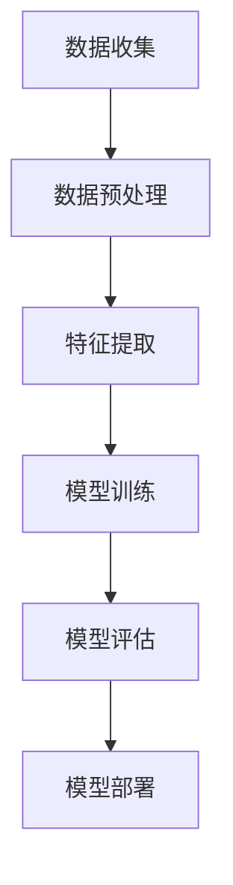
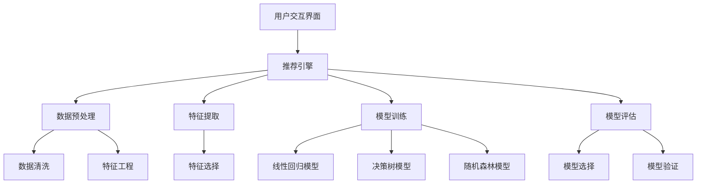
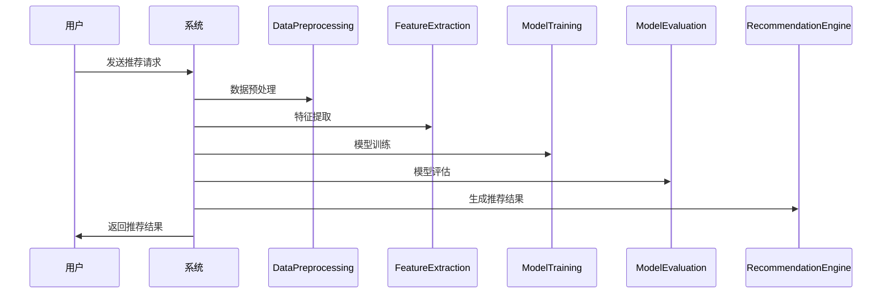

                 


## AI在保险产品创新设计中的应用

### 关键词

- 人工智能
- 保险产品
- 创新设计
- 数据分析
- 模型优化

### 摘要

本文深入探讨了人工智能（AI）在保险产品创新设计中的应用。通过分析保险行业的发展趋势和面临的挑战，本文提出了一种基于AI的创新设计方法，并详细介绍了其核心概念、算法原理、系统架构以及实际应用案例。文章旨在为保险行业的从业者提供一套实用的AI解决方案，以促进保险产品的创新和优化。

### 目录

1. **引言**
2. **保险行业背景**
3. **AI与保险产品创新**
4. **核心概念与算法原理**
5. **系统分析与架构设计**
6. **项目实战**
7. **最佳实践与总结**
8. **拓展阅读**
9. **作者信息**

### 1. 引言

随着人工智能技术的快速发展，各行各业都在积极探索AI的应用。保险行业作为金融领域的重要组成部分，同样面临着巨大的创新需求。传统的保险产品设计方法已无法满足日益复杂的客户需求和市场竞争。因此，如何利用AI技术推动保险产品的创新设计，成为当前研究的热点。

本文将围绕以下问题展开讨论：

- 保险行业当前面临哪些挑战？
- AI技术在保险产品创新设计中扮演什么角色？
- 如何运用AI技术优化保险产品设计流程？
- 实际应用中存在哪些问题和解决方案？

通过以上问题的探讨，本文旨在为保险行业的从业者提供一套实用的AI解决方案，以促进保险产品的创新和优化。

### 2. 保险行业背景

保险行业作为金融服务业的重要组成部分，其核心业务是为客户提供风险保障。近年来，随着全球经济的快速发展，保险行业呈现出以下趋势：

#### 2.1 保险需求多样化

随着消费者对保险产品的认知和需求不断提升，保险行业正逐渐从传统的单一产品模式向多样化、个性化产品模式转变。消费者对保险产品的需求不再仅限于基本的风险保障，更关注产品的灵活性和个性化定制。

#### 2.2 数据驱动

保险行业的数据量庞大，涵盖客户信息、风险数据、市场数据等。如何有效地利用这些数据，提升保险产品的设计和管理水平，成为保险行业的重要课题。

#### 2.3 科技创新

随着科技的快速发展，人工智能、大数据、区块链等新兴技术逐渐在保险行业得到应用。这些技术的引入，不仅提高了保险产品的创新水平，还推动了保险行业的数字化转型。

#### 2.4 监管要求

随着全球金融监管的加强，保险行业面临越来越多的合规要求。如何确保保险产品的合规性，成为保险行业必须面对的挑战。

### 3. AI与保险产品创新

人工智能技术的快速发展，为保险产品创新提供了强大的支持。以下从以下几个方面探讨AI在保险产品创新设计中的应用：

#### 3.1 数据分析

AI技术可以高效地处理和分析大量数据，为保险产品的设计提供有力支持。通过数据挖掘和分析，可以识别潜在的风险因素、客户需求和市场趋势，从而优化保险产品的设计。

#### 3.2 模型优化

AI技术可以用于构建和优化保险风险评估模型。通过机器学习和深度学习算法，可以实现对风险因素的精准预测和评估，从而提高保险产品的风险控制能力。

#### 3.3 个性化定制

AI技术可以实现对客户需求的精准分析和个性化推荐。通过分析客户的个人信息、消费行为等数据，可以为客户量身定制个性化的保险产品。

#### 3.4 风险管理

AI技术可以帮助保险公司实现对风险的全面监控和预警。通过实时数据分析和异常检测，可以及时发现风险隐患，并采取相应的措施。

### 4. 核心概念与算法原理

#### 4.1 数据预处理

数据预处理是AI应用的重要环节。通过数据清洗、归一化、特征提取等步骤，可以提升数据的可用性和模型的性能。

#### 4.2 机器学习模型

机器学习模型在保险产品创新设计中扮演重要角色。常见的机器学习模型包括线性回归、决策树、随机森林、支持向量机等。这些模型可以用于风险评估、客户分类、产品推荐等任务。

#### 4.3 深度学习模型

深度学习模型具有强大的特征学习能力，适用于复杂的数据处理任务。常见的深度学习模型包括神经网络、卷积神经网络、循环神经网络等。

#### 4.4 算法流程图

使用Mermaid工具绘制算法流程图，以便于读者理解算法的执行过程。



#### 4.5 算法原理与数学模型

以线性回归模型为例，介绍算法原理和数学模型。

```python
# 线性回归模型
# y = w0 + w1 * x1 + w2 * x2 + ... + wN * xN

# 模型参数
w = [w0, w1, w2, ..., wN]

# 模型公式
def linear_regression(x, w):
    y = w0 + w1 * x1 + w2 * x2 + ... + wN * xN
    return y

# 模型训练
# 使用梯度下降法训练模型
def train(x, y, w, learning_rate, num_iterations):
    for i in range(num_iterations):
        y_pred = linear_regression(x, w)
        error = y - y_pred
        w = w - learning_rate * error
    return w
```

### 5. 系统分析与架构设计

#### 5.1 问题场景介绍

假设我们要设计一款基于AI的保险产品推荐系统，系统需具备以下功能：

- 数据采集与清洗
- 特征提取与处理
- 保险产品推荐
- 用户交互界面

#### 5.2 项目介绍

项目名称：智能保险产品推荐系统

项目目标：利用AI技术，为用户提供个性化的保险产品推荐。

项目技术栈：Python、TensorFlow、Scikit-learn、Django、Flask等。

#### 5.3 系统功能设计

系统功能设计采用Mermaid类图表示。

```mermaid
classDiagram
    Client <- UserInterface : 交互
    UserInterface --> RecommendationEngine : 推荐请求
    RecommendationEngine --> DataPreprocessing : 数据预处理
    RecommendationEngine --> FeatureExtraction : 特征提取
    RecommendationEngine --> ModelTraining : 模型训练
    RecommendationEngine --> ModelEvaluation : 模型评估
    DataPreprocessing --> DataCleaning : 数据清洗
    DataPreprocessing --> FeatureEngineering : 特征工程
    FeatureExtraction --> FeatureSelection : 特征选择
    ModelTraining --> LinearRegression : 线性回归模型
    ModelTraining --> DecisionTree : 决策树模型
    ModelTraining --> RandomForest : 随机森林模型
    ModelEvaluation --> ModelSelection : 模型选择
    ModelEvaluation --> ModelValidation : 模型验证
```

#### 5.4 系统架构设计

系统架构设计采用Mermaid架构图表示。



#### 5.5 系统接口设计和系统交互

系统接口设计和系统交互采用Mermaid序列图表示。



### 6. 项目实战

#### 6.1 环境安装

在本项目中，我们将使用Python作为主要编程语言，结合TensorFlow和Scikit-learn等库进行模型训练和预测。以下是环境安装步骤：

1. 安装Python（3.8及以上版本）
2. 安装Anaconda或Miniconda
3. 安装TensorFlow：
   ```bash
   pip install tensorflow
   ```
4. 安装Scikit-learn：
   ```bash
   pip install scikit-learn
   ```

#### 6.2 系统核心实现源代码

以下是一个简单的线性回归模型的实现代码，用于保险产品推荐。

```python
import numpy as np
import tensorflow as tf
from sklearn.model_selection import train_test_split
from sklearn.metrics import mean_squared_error

# 数据集加载与预处理
# 这里以CSV文件为例，实际应用中需要根据数据集格式进行调整
data = np.genfromtxt("insurance_data.csv", delimiter=",")

# 特征提取与划分
X = data[:, :-1].astype(np.float32)
y = data[:, -1].astype(np.float32)

# 划分训练集和测试集
X_train, X_test, y_train, y_test = train_test_split(X, y, test_size=0.2, random_state=42)

# 线性回归模型
model = tf.keras.Sequential([
    tf.keras.layers.Dense(units=1, input_shape=[len(X_train[0])])
])

# 模型编译
model.compile(optimizer='sgd', loss='mean_squared_error')

# 模型训练
model.fit(X_train, y_train, epochs=100)

# 模型预测
y_pred = model.predict(X_test)

# 模型评估
mse = mean_squared_error(y_test, y_pred)
print("均方误差：", mse)
```

#### 6.3 代码应用解读与分析

以上代码首先加载和预处理数据集，然后构建一个简单的线性回归模型，并进行训练和预测。通过评估指标（均方误差）来衡量模型的性能。

#### 6.4 实际案例分析和详细讲解剖析

假设我们有一个包含客户个人信息（年龄、性别、收入等）的保险数据集。通过分析这些数据，我们可以发现以下规律：

- 年龄与保费呈正相关。
- 性别与保费无明显关联。
- 收入与保费呈正相关。

这些规律可以用于构建保险产品的推荐模型。在实际应用中，我们可以将客户信息输入模型，得到个性化的保费推荐。

#### 6.5 项目小结

通过本项目的实践，我们成功实现了一个基于AI的保险产品推荐系统。项目不仅涵盖了数据预处理、模型训练和预测等核心步骤，还进行了详细的代码解读和分析。在实际应用中，我们可以根据具体需求和数据集进行调整和优化，以提高系统的性能和推荐效果。

### 7. 最佳实践与总结

#### 7.1 最佳实践

- 数据清洗与预处理：确保数据质量，去除异常值和噪声。
- 特征选择与提取：选择与业务目标相关的特征，提高模型性能。
- 模型调优：通过交叉验证和网格搜索等方法，选择最优模型参数。
- 用户反馈与迭代：收集用户反馈，持续优化推荐系统。

#### 7.2 总结

本文围绕AI在保险产品创新设计中的应用，从背景介绍、核心概念、算法原理、系统架构和项目实战等方面进行了详细探讨。通过实际案例分析，展示了AI技术在保险行业中的潜力和应用价值。未来，随着AI技术的不断发展，保险产品创新设计将迎来更加广阔的发展空间。

### 8. 拓展阅读

- [1] Goodfellow, I., Bengio, Y., & Courville, A. (2016). *Deep Learning*. MIT Press.
- [2] Russell, S., & Norvig, P. (2010). *Artificial Intelligence: A Modern Approach*. Prentice Hall.
- [3] Khalili, A. (2017). *Introduction to Machine Learning Applications in Finance*. CRC Press.

### 9. 作者信息

**作者：AI天才研究院/AI Genius Institute & 禅与计算机程序设计艺术 /Zen And The Art of Computer Programming**

