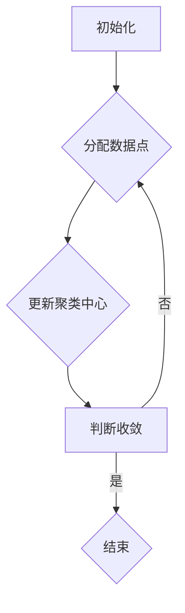
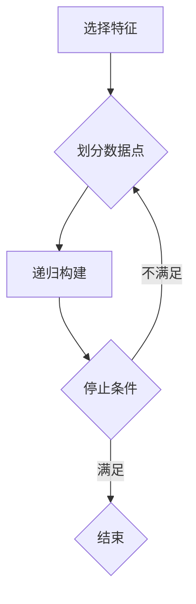
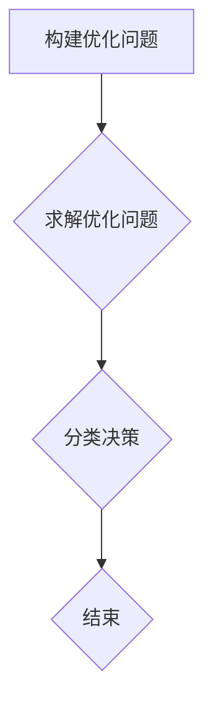
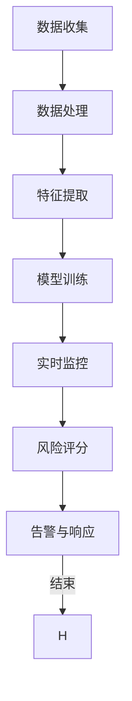

                 

# AI在反洗钱和欺诈检测中的应用

## 关键词
人工智能、反洗钱、欺诈检测、算法、系统设计、案例研究

## 摘要
随着金融科技的发展，反洗钱和欺诈检测成为金融行业的重要课题。本文将深入探讨人工智能在反洗钱和欺诈检测中的应用，从背景介绍、核心概念与联系、算法原理讲解、数学模型和数学公式、系统分析与架构设计方案、项目实战、最佳实践 tips、小结和拓展阅读等多个方面，全面解析AI技术在反洗钱和欺诈检测中的实际应用，为金融行业提供有价值的参考。

## 目录

### 第一部分：背景介绍
- 1.1 反洗钱和欺诈检测概述
- 1.2 AI技术在反洗钱和欺诈检测中的应用现状
- 1.3 反洗钱和欺诈检测中的挑战与机遇

### 第二部分：核心概念与联系
- 2.1 反洗钱和欺诈检测的基本概念
- 2.2 AI技术的基本原理
- 2.3 反洗钱和欺诈检测中AI技术的应用

### 第三部分：算法原理讲解
- 3.1 常见反洗钱和欺诈检测算法介绍
- 3.2 算法原理讲解与流程图展示
- 3.3 数学模型和数学公式
- 3.4 Python源代码示例

### 第四部分：系统分析与架构设计方案
- 4.1 反洗钱和欺诈检测系统概述
- 4.2 系统功能设计与领域模型
- 4.3 系统架构设计与接口设计
- 4.4 系统交互与流程图展示

### 第五部分：项目实战
- 5.1 实战项目背景与目标
- 5.2 环境安装与配置
- 5.3 系统核心实现与代码解读
- 5.4 实际案例分析与讲解
- 5.5 项目小结

### 第六部分：最佳实践 tips、小结、注意事项、拓展阅读
- 6.1 最佳实践 tips
- 6.2 小结与总结
- 6.3 注意事项与风险提示
- 6.4 拓展阅读与进一步学习

---

## 1.1 反洗钱和欺诈检测概述

反洗钱（Anti-Money Laundering，简称AML）是指通过一系列措施和程序，防止和揭露洗钱行为。洗钱是指通过一系列复杂的金融交易，将非法所得的资金转换为看似合法的资金，从而掩盖其来源和性质。反洗钱的目的在于切断洗钱活动的资金链条，保护金融系统的安全和稳定。

欺诈检测（Fraud Detection）是指通过识别和分析异常行为和模式，发现并阻止欺诈行为。欺诈行为包括信用卡欺诈、保险欺诈、金融诈骗等，给金融机构和用户带来了巨大的经济损失。欺诈检测的核心在于建立一套能够自动识别和响应异常行为的系统，从而降低欺诈风险。

### 1.2 AI技术在反洗钱和欺诈检测中的应用现状

随着人工智能技术的发展，AI在反洗钱和欺诈检测中的应用越来越广泛。目前，AI技术在反洗钱和欺诈检测中主要应用于以下几个方面：

1. **异常检测**：通过机器学习和数据挖掘技术，分析历史数据和实时数据，识别异常交易和可疑行为。
2. **画像分析**：通过构建用户画像和交易画像，分析用户的交易习惯和行为特征，发现潜在风险。
3. **风险评估**：利用机器学习算法，对交易进行风险评估，为金融机构提供决策支持。
4. **自动化处理**：通过自然语言处理技术，自动处理大量文本信息，提高反洗钱和欺诈检测的效率和准确性。
5. **实时监控**：利用物联网和大数据技术，实现实时监控，快速响应潜在风险。

### 1.3 反洗钱和欺诈检测中的挑战与机遇

反洗钱和欺诈检测面临着一系列挑战，同时也迎来了新的机遇：

1. **数据隐私与安全**：在反洗钱和欺诈检测过程中，需要处理大量敏感数据，数据隐私和安全成为首要问题。
2. **算法透明性与解释性**：随着AI技术的应用，算法的透明性和解释性变得越来越重要，用户需要了解算法的决策过程。
3. **技术更新与迭代**：金融科技日新月异，反洗钱和欺诈检测技术需要不断更新和迭代，以应对新型风险。
4. **合规要求**：金融机构需要遵守一系列反洗钱和欺诈检测法规，合规要求越来越高。
5. **数据质量和多样性**：高质量的数据和多样化的数据来源是AI技术成功的关键，金融机构需要不断提升数据质量和多样性。

在接下来的章节中，我们将进一步探讨AI技术在反洗钱和欺诈检测中的应用，从核心概念、算法原理、系统设计到项目实战，全面解析这一领域的最新发展。

---

## 1.2 AI技术的基本原理

人工智能（Artificial Intelligence，简称AI）是计算机科学的一个分支，致力于研究如何构建智能体，使其能够模拟、扩展甚至超越人类智能。AI技术的基本原理主要包括以下几个方面：

### 1.2.1 机器学习

机器学习（Machine Learning，简称ML）是AI的核心技术之一，通过算法模型从数据中学习，识别出数据中的模式，从而进行预测和决策。机器学习主要包括以下几种类型：

1. **监督学习**：有监督学习是一种从标记数据中学习的方法。标记数据意味着每个数据点都有一个对应的标签，模型通过这些标签来学习如何预测新的数据点的标签。
2. **无监督学习**：无监督学习是指在没有标记数据的情况下，从数据中学习模式和结构。常见的无监督学习方法包括聚类和降维。
3. **半监督学习**：半监督学习结合了监督学习和无监督学习，利用部分标记数据和大量无标记数据来学习。

### 1.2.2 深度学习

深度学习（Deep Learning，简称DL）是机器学习的一种重要分支，通过构建多层神经网络（Neural Networks），从数据中自动提取特征。深度学习的主要优势在于其能够从大量数据中自动学习复杂的特征，从而实现高性能的预测和分类。

### 1.2.3 强化学习

强化学习（Reinforcement Learning，简称RL）是一种通过试错来学习的机器学习方法。在强化学习中，智能体通过与环境的交互，不断优化其策略，以最大化累积奖励。强化学习在游戏、推荐系统和自动驾驶等领域有着广泛的应用。

### 1.2.4 自然语言处理

自然语言处理（Natural Language Processing，简称NLP）是AI的一个重要分支，致力于使计算机能够理解和处理人类自然语言。NLP的主要任务包括文本分类、情感分析、机器翻译、语音识别等。

### 1.2.5 计算机视觉

计算机视觉（Computer Vision，简称CV）是AI的另一个重要分支，致力于使计算机能够理解和解释视觉信息。计算机视觉的任务包括图像分类、目标检测、图像分割、姿态估计等。

### 1.2.6 数据挖掘

数据挖掘（Data Mining，简称DM）是从大量数据中提取有价值信息的过程。数据挖掘的主要任务包括分类、聚类、关联规则挖掘、异常检测等。

### 1.2.7 知识表示与推理

知识表示与推理（Knowledge Representation and Reasoning）是AI中一个重要的研究方向，旨在将人类知识转化为计算机可以理解和处理的形式，并进行推理和决策。

### 1.2.8 其他AI技术

除了上述提到的AI技术，还有许多其他重要的AI技术，如虚拟现实（VR）、增强现实（AR）、物联网（IoT）等，它们在不同的应用场景中发挥着重要作用。

### 1.2.9 AI技术在反洗钱和欺诈检测中的应用

AI技术在反洗钱和欺诈检测中的应用主要包括以下几个方面：

1. **异常检测**：通过机器学习和深度学习算法，识别异常交易和可疑行为，从而发现潜在风险。
2. **画像分析**：通过自然语言处理和计算机视觉技术，构建用户和交易的画像，分析其行为特征和风险等级。
3. **风险评估**：利用机器学习和数据挖掘技术，对交易进行风险评估，为金融机构提供决策支持。
4. **自动化处理**：通过自然语言处理技术，自动处理大量文本信息，提高反洗钱和欺诈检测的效率和准确性。
5. **实时监控**：利用物联网和大数据技术，实现实时监控，快速响应潜在风险。

通过以上对AI技术基本原理的介绍，我们可以看到AI技术在反洗钱和欺诈检测中具有广泛的应用前景。在接下来的章节中，我们将深入探讨AI技术在反洗钱和欺诈检测中的具体应用和实践。

---

## 1.3 反洗钱和欺诈检测中AI技术的应用

AI技术在反洗钱（AML）和欺诈检测中的应用已经引起了广泛关注。随着AI技术的不断发展，其在金融领域的应用也越来越广泛，具体表现在以下几个方面：

### 1.3.1 异常检测

异常检测是AI技术在反洗钱和欺诈检测中最常见的应用之一。通过监督学习和无监督学习算法，可以识别出与正常交易模式不一致的异常交易。例如，使用聚类算法（如K-Means）可以将交易数据分成多个簇，其中每个簇代表一种交易模式。然后，通过分析这些簇的特性，可以识别出异常交易。此外，支持向量机（SVM）和神经网络（如多层感知机MLP）也是常用的异常检测算法。

#### 算法原理

异常检测算法通常分为以下几步：

1. **数据预处理**：清洗数据，处理缺失值、异常值等，确保数据的质量。
2. **特征提取**：从交易数据中提取有用的特征，如交易金额、交易时间、交易地点等。
3. **模型训练**：使用历史数据训练异常检测模型，学习正常交易模式。
4. **异常检测**：使用训练好的模型对新的交易数据进行检测，识别出异常交易。

#### Python源代码示例

下面是一个使用K-Means算法进行异常检测的简单示例：

```python
from sklearn.cluster import KMeans
from sklearn.datasets import make_blobs
from sklearn.preprocessing import StandardScaler
import numpy as np

# 生成模拟数据
X, _ = make_blobs(n_samples=100, centers=4, cluster_std=1.0, random_state=0)

# 数据标准化
scaler = StandardScaler()
X_scaled = scaler.fit_transform(X)

# K-Means聚类
kmeans = KMeans(n_clusters=4, random_state=0)
kmeans.fit(X_scaled)

# 计算每个点的簇别
labels = kmeans.predict(X_scaled)

# 识别异常点
dists = np.mean(np.square(X_scaled - kmeans.cluster_centers_[labels]), axis=1)
print("异常点索引：", np.where(dists > 1.5)[0])

```

### 1.3.2 画像分析

画像分析是AI技术在反洗钱和欺诈检测中的另一个重要应用。通过自然语言处理（NLP）和计算机视觉技术，可以构建用户和交易的画像，从而分析其行为特征和风险等级。例如，通过分析用户的社交媒体活动、交易历史、地理位置等，可以构建用户的交易画像。然后，通过聚类、分类等算法，可以识别出高风险用户或交易。

#### 算法原理

画像分析算法通常分为以下几步：

1. **数据收集**：收集用户和交易的相关数据，如社交媒体活动、交易历史、地理位置等。
2. **数据处理**：清洗和预处理数据，提取有用的特征。
3. **特征工程**：对提取的特征进行转换和组合，以增强模型的性能。
4. **模型训练**：使用历史数据训练画像分析模型。
5. **画像构建**：使用训练好的模型对新的用户或交易数据进行画像构建。
6. **风险评估**：根据画像结果，对用户或交易进行风险评估。

#### Python源代码示例

下面是一个使用K-Means算法进行画像分析的用户聚类示例：

```python
from sklearn.cluster import KMeans
from sklearn.datasets import make_blobs
from sklearn.preprocessing import StandardScaler
import numpy as np

# 生成模拟数据
X, _ = make_blobs(n_samples=100, centers=4, cluster_std=1.0, random_state=0)

# 数据标准化
scaler = StandardScaler()
X_scaled = scaler.fit_transform(X)

# K-Means聚类
kmeans = KMeans(n_clusters=4, random_state=0)
kmeans.fit(X_scaled)

# 计算每个点的簇别
labels = kmeans.predict(X_scaled)

# 打印聚类结果
print("用户标签：", labels)

```

### 1.3.3 风险评估

风险评估是AI技术在反洗钱和欺诈检测中的另一个关键应用。通过机器学习和数据挖掘技术，可以自动评估交易的风险等级，为金融机构提供决策支持。例如，可以使用逻辑回归、决策树、随机森林等算法，对交易数据进行分类，判断其是否为高风险交易。

#### 算法原理

风险评估算法通常分为以下几步：

1. **数据收集**：收集与交易相关的数据，如交易金额、交易时间、交易地点等。
2. **数据处理**：清洗和预处理数据，提取有用的特征。
3. **特征工程**：对提取的特征进行转换和组合，以增强模型的性能。
4. **模型训练**：使用历史数据训练风险评估模型。
5. **风险预测**：使用训练好的模型对新的交易数据进行风险预测。

#### Python源代码示例

下面是一个使用逻辑回归进行风险评估的简单示例：

```python
from sklearn.linear_model import LogisticRegression
from sklearn.datasets import make_classification
from sklearn.model_selection import train_test_split
import numpy as np

# 生成模拟数据
X, y = make_classification(n_samples=100, n_features=5, n_classes=2, random_state=0)

# 划分训练集和测试集
X_train, X_test, y_train, y_test = train_test_split(X, y, test_size=0.2, random_state=0)

# 训练逻辑回归模型
model = LogisticRegression()
model.fit(X_train, y_train)

# 预测测试集
predictions = model.predict(X_test)

# 打印预测结果
print("预测结果：", predictions)

```

### 1.3.4 自动化处理

自动化处理是AI技术在反洗钱和欺诈检测中的另一个重要应用。通过自然语言处理技术，可以自动处理大量文本信息，如用户协议、政策文件、交易记录等，从而提高处理效率和准确性。例如，可以使用文本分类、实体识别等技术，自动识别和提取文本中的关键信息。

#### 算法原理

自动化处理算法通常分为以下几步：

1. **文本预处理**：对文本数据进行清洗和预处理，如去除停用词、分词、词性标注等。
2. **特征提取**：从预处理后的文本数据中提取有用的特征，如词频、词嵌入等。
3. **模型训练**：使用历史数据训练自动化处理模型。
4. **自动化处理**：使用训练好的模型对新的文本数据进行处理。

#### Python源代码示例

下面是一个使用文本分类进行自动化处理的简单示例：

```python
from sklearn.feature_extraction.text import TfidfVectorizer
from sklearn.model_selection import train_test_split
from sklearn.naive_bayes import MultinomialNB
import numpy as np

# 生成模拟数据
data = [
    "This is a positive review",
    "This is a negative review",
    "I don't like this product",
    "I love this product"
]
labels = [1, 1, 0, 1]

# 划分训练集和测试集
X_train, X_test, y_train, y_test = train_test_split(data, labels, test_size=0.2, random_state=0)

# 特征提取
vectorizer = TfidfVectorizer()
X_train_tfidf = vectorizer.fit_transform(X_train)
X_test_tfidf = vectorizer.transform(X_test)

# 训练模型
model = MultinomialNB()
model.fit(X_train_tfidf, y_train)

# 预测测试集
predictions = model.predict(X_test_tfidf)

# 打印预测结果
print("预测结果：", predictions)

```

### 1.3.5 实时监控

实时监控是AI技术在反洗钱和欺诈检测中的另一个关键应用。通过物联网和大数据技术，可以实现对交易数据的实时监控和快速响应。例如，可以使用流处理技术（如Apache Kafka、Apache Flink等），对交易数据进行实时分析，识别潜在风险。

#### 算法原理

实时监控算法通常分为以下几步：

1. **数据收集**：从不同的数据源收集实时交易数据。
2. **数据预处理**：对实时交易数据进行清洗和预处理。
3. **实时分析**：使用机器学习和数据挖掘技术，对实时交易数据进行实时分析。
4. **风险识别**：识别出潜在的风险交易。
5. **快速响应**：对识别出的风险交易进行报警和处理。

#### Python源代码示例

下面是一个使用流处理技术进行实时监控的简单示例：

```python
from sklearn.linear_model import LogisticRegression
from sklearn.datasets import make_classification
from sklearn.model_selection import train_test_split
from kafka import KafkaProducer
import numpy as np

# 生成模拟数据
X, y = make_classification(n_samples=100, n_features=5, n_classes=2, random_state=0)

# 划分训练集和测试集
X_train, X_test, y_train, y_test = train_test_split(X, y, test_size=0.2, random_state=0)

# 训练逻辑回归模型
model = LogisticRegression()
model.fit(X_train, y_train)

# 创建Kafka生产者
producer = KafkaProducer(bootstrap_servers=['localhost:9092'])

# 发送测试数据到Kafka
for i in range(100):
    message = np.append(X_test[i], y_test[i]).tolist()
    producer.send('test_topic', value=message)

# 关闭生产者
producer.close()

```

通过以上对AI技术在反洗钱和欺诈检测中应用的介绍，我们可以看到AI技术在金融领域的应用已经取得了显著的成果。在接下来的章节中，我们将进一步探讨AI技术在反洗钱和欺诈检测中的具体实现和最佳实践。

---

## 1.4 常见反洗钱和欺诈检测算法介绍

在反洗钱（AML）和欺诈检测领域，算法的选择和优化是确保系统高效运行的关键。以下是几种常见的反洗钱和欺诈检测算法及其基本原理：

### 1.4.1 概率模型

概率模型是反洗钱和欺诈检测中常用的基础算法之一。其中，贝叶斯定理是概率模型的核心。贝叶斯分类器基于概率论，通过计算每个类别的后验概率，然后选择具有最高后验概率的类别作为预测结果。

**原理：**
贝叶斯分类器的原理基于贝叶斯定理，通过计算每个样本属于各个类别的概率，选择概率最高的类别作为预测结果。具体计算过程如下：
$$ P(C_k|X) = \frac{P(X|C_k)P(C_k)}{P(X)} $$
其中，$P(C_k|X)$ 是样本 $X$ 属于类别 $C_k$ 的后验概率，$P(X|C_k)$ 是样本 $X$ 在类别 $C_k$ 条件下的概率，$P(C_k)$ 是类别 $C_k$ 的先验概率，$P(X)$ 是样本 $X$ 的总概率。

**适用场景：**
贝叶斯分类器适用于特征之间具有明显概率分布的情况，如文本分类和垃圾邮件检测。

### 1.4.2 决策树

决策树是一种基于树形结构进行分类或回归的算法。决策树通过一系列判断条件，将数据集划分成多个子集，每个子集都对应一个类别或数值。

**原理：**
决策树的核心是ID3算法，它通过信息增益（Information Gain）来选择最佳特征进行划分。信息增益定义为：
$$ IG(D, A) = Entropy(D) - \sum_{v \in Values(A)} \frac{|D_v|}{|D|} Entropy(D_v) $$
其中，$Entropy(D)$ 是数据集 $D$ 的熵，$Values(A)$ 是特征 $A$ 的取值集合，$|D_v|$ 是数据集 $D$ 中满足条件 $D_v$ 的样本数量。

**适用场景：**
决策树适用于特征之间有明确划分标准的情况，如客户分类和信用评分。

### 1.4.3 随机森林

随机森林（Random Forest）是一种基于决策树的集成学习方法。它通过构建多个决策树，并对这些树的预测结果进行投票，得到最终的预测结果。

**原理：**
随机森林的核心是随机性，包括特征选择和样本划分的随机性。具体来说，随机森林在每个子集中随机选择特征，并随机划分样本。通过这种方式，随机森林能够降低模型的过拟合风险，提高模型的泛化能力。

**适用场景：**
随机森林适用于具有大量特征的数据集，能够处理高维数据，且在分类和回归任务中都有较好的性能。

### 1.4.4 支持向量机（SVM）

支持向量机（SVM）是一种基于最大化分类间隔的监督学习算法。它通过找到一个最优的超平面，将数据集分为不同的类别。

**原理：**
SVM的核心是求解一个优化问题，目标是找到一个分类间隔最大的超平面。优化问题的目标函数为：
$$ min \frac{1}{2} ||w||^2 + C \sum_{i=1}^n \xi_i $$
其中，$w$ 是超平面的法向量，$C$ 是惩罚参数，$\xi_i$ 是 slack variables。

**适用场景：**
SVM适用于高维空间的数据分类，特别是在特征数量远大于样本数量的情况下表现优秀。

### 1.4.5 神经网络

神经网络（Neural Networks）是一种基于模拟生物神经系统的计算模型。它通过多层神经元之间的连接和激活函数，实现数据的自动特征提取和分类。

**原理：**
神经网络的核心是前向传播和反向传播算法。在训练过程中，神经网络通过不断调整权重和偏置，最小化损失函数，达到预测准确性的优化目标。

**适用场景：**
神经网络适用于复杂的数据分类和回归任务，特别是当数据具有非线性关系时。

### 1.4.6 聚类算法

聚类算法是一种无监督学习算法，通过将相似的数据点划分为同一类，实现数据的自动分类。

**原理：**
聚类算法包括K-Means、DBSCAN等。K-Means算法的核心是通过最小化平方误差来划分聚类中心，而DBSCAN算法通过基于密度的连接性来识别聚类。

**适用场景：**
聚类算法适用于无标签数据的自动分类，适用于发现数据中的隐含结构。

通过以上对常见反洗钱和欺诈检测算法的介绍，我们可以看到这些算法各有特点，适用于不同的应用场景。在接下来的章节中，我们将进一步深入探讨这些算法的原理和实现，并分析其优缺点。

---

## 1.5 算法原理讲解与流程图展示

为了更好地理解反洗钱和欺诈检测中常用的算法原理，我们将通过具体的例子和流程图，详细讲解一些核心算法。这些算法包括K-Means、决策树和支持向量机（SVM），并展示其实现流程。

### 1.5.1 K-Means算法

K-Means是一种典型的聚类算法，通过将数据点划分为K个簇，每个簇由其中心点代表。K-Means算法的核心步骤如下：

1. **初始化**：随机选择K个数据点作为初始聚类中心。
2. **分配数据点**：将每个数据点分配到最近的聚类中心所在的簇。
3. **更新聚类中心**：计算每个簇的新聚类中心，即簇内数据点的平均值。
4. **重复步骤2和3**，直到聚类中心不再发生显著变化。

**流程图展示：**



**Python代码示例：**

```python
from sklearn.cluster import KMeans
from sklearn.datasets import make_blobs
import numpy as np

# 生成模拟数据
X, _ = make_blobs(n_samples=100, centers=3, cluster_std=0.60, random_state=0)

# 初始化K-Means算法
kmeans = KMeans(n_clusters=3, random_state=0)

# 训练模型
kmeans.fit(X)

# 输出聚类结果
print("聚类中心：", kmeans.cluster_centers_)
print("数据点分配：", kmeans.labels_)

```

### 1.5.2 决策树算法

决策树是一种常用的分类和回归算法，通过一系列判断条件对数据点进行划分。以下是决策树的核心步骤：

1. **选择最佳特征**：根据特征增益或信息增益选择最佳特征进行划分。
2. **划分数据点**：将数据点划分为多个子集，每个子集对应一个特征值的范围。
3. **递归构建树**：对每个子集重复步骤1和2，直到满足停止条件（如最大深度、最小样本数等）。

**流程图展示：**



**Python代码示例：**

```python
from sklearn.tree import DecisionTreeClassifier
from sklearn.datasets import load_iris
import numpy as np

# 加载iris数据集
iris = load_iris()
X = iris.data
y = iris.target

# 初始化决策树算法
clf = DecisionTreeClassifier()

# 训练模型
clf.fit(X, y)

# 输出决策树结构
from sklearn.tree import plot_tree
plot_tree(clf)
```

### 1.5.3 支持向量机（SVM）

支持向量机是一种强大的分类算法，通过找到一个最优的超平面，将数据点划分为不同的类别。以下是SVM的核心步骤：

1. **构建优化问题**：定义目标函数，包括正则化项和损失函数。
2. **求解优化问题**：使用拉格朗日乘子法或序列最小化梯度法求解最优解。
3. **分类决策**：根据支持向量计算分类边界，对新数据进行分类。

**流程图展示：**



**Python代码示例：**

```python
from sklearn.svm import SVC
from sklearn.datasets import make_circles
import numpy as np

# 生成模拟数据
X, y = make_circles(n_samples=100, noise=0.1, factor=0.3, random_state=0)

# 初始化SVM算法
clf = SVC(kernel='linear')

# 训练模型
clf.fit(X, y)

# 输出决策边界
import matplotlib.pyplot as plt
plt.scatter(X[:, 0], X[:, 1], c=y, cmap=plt.cm.coolwarm)
plt.plot(clf.support_vectors_[:, 0], clf.support_vectors_[:, 1], 'o', color='black', markeredgewidth=1)
plt.show()

```

通过以上对K-Means、决策树和SVM算法的详细讲解和流程图展示，我们可以更好地理解这些算法的基本原理和实现方法。在接下来的章节中，我们将进一步探讨反洗钱和欺诈检测中的数学模型和数学公式。

---

## 1.6 数学模型和数学公式

在反洗钱（AML）和欺诈检测中，数学模型和数学公式扮演着至关重要的角色。这些模型和公式帮助我们理解交易行为、识别异常模式，从而有效预防和打击洗钱和欺诈活动。以下将介绍一些关键的数学模型和公式。

### 1.6.1 贝叶斯定理

贝叶斯定理是概率论中的一个基本原理，它用于计算后验概率。在反洗钱和欺诈检测中，贝叶斯定理可以帮助我们估计一个交易是否为异常交易的概率。贝叶斯定理公式如下：
$$ P(A|B) = \frac{P(B|A)P(A)}{P(B)} $$
其中，$P(A|B)$ 是在事件B发生的条件下事件A发生的概率，$P(B|A)$ 是在事件A发生的条件下事件B发生的概率，$P(A)$ 是事件A发生的概率，$P(B)$ 是事件B发生的概率。

### 1.6.2 概率分布

概率分布是描述随机变量可能取值的概率分布函数。在反洗钱和欺诈检测中，概率分布可以帮助我们理解交易行为的特点。例如，正态分布可以用来描述交易金额的分布。正态分布的公式如下：
$$ f(x|\mu, \sigma^2) = \frac{1}{\sqrt{2\pi\sigma^2}}e^{-\frac{(x-\mu)^2}{2\sigma^2}} $$
其中，$x$ 是随机变量，$\mu$ 是均值，$\sigma^2$ 是方差。

### 1.6.3 信息增益

信息增益是决策树算法中的一个关键概念，用于评估一个特征对分类的重要性。信息增益的公式如下：
$$ IG(D, A) = Entropy(D) - \sum_{v \in Values(A)} \frac{|D_v|}{|D|} Entropy(D_v) $$
其中，$Entropy(D)$ 是数据集 $D$ 的熵，$Values(A)$ 是特征 $A$ 的取值集合，$|D_v|$ 是数据集 $D$ 中满足条件 $D_v$ 的样本数量。

### 1.6.4 支持向量机（SVM）

支持向量机是一种强大的分类算法，其核心是通过求解一个优化问题来找到最优分类边界。SVM的优化问题可以表示为：
$$ \min_{w, b} \frac{1}{2} ||w||^2 + C \sum_{i=1}^n \xi_i $$
其中，$w$ 是超平面的法向量，$b$ 是偏置项，$C$ 是惩罚参数，$\xi_i$ 是 slack variables。

### 1.6.5 神经网络

神经网络是一种模拟生物神经系统的计算模型，其工作原理涉及前向传播和反向传播。在神经网络中，激活函数（如Sigmoid函数、ReLU函数）用于引入非线性特性，其公式如下：
$$ \sigma(x) = \frac{1}{1 + e^{-x}} \quad \text{或} \quad \sigma(x) = \max(0, x) $$
神经网络通过不断调整权重和偏置，最小化损失函数，达到预测准确性的优化目标。

### 1.6.6 马尔可夫模型

马尔可夫模型是一种用于描述状态转移概率的数学模型，在反洗钱和欺诈检测中，它可以用于分析交易行为的变化模式。马尔可夫模型的核心公式如下：
$$ P(X_t|X_{t-1}, X_{t-2}, ..., X_1) = P(X_t|X_{t-1}) $$
这意味着当前状态只与前一状态有关，与更早的状态无关。

通过这些数学模型和公式，我们可以更深入地理解反洗钱和欺诈检测中的核心概念和算法原理。在接下来的章节中，我们将继续探讨反洗钱和欺诈检测系统的架构设计与实现。

---

## 1.7 反洗钱和欺诈检测系统架构设计与实现

反洗钱（AML）和欺诈检测系统是一个复杂的多层次架构，涉及数据收集、处理、分析和响应。以下是系统架构的详细设计和实现。

### 1.7.1 系统概述

反洗钱和欺诈检测系统的总体架构可以分为以下几个主要模块：

1. **数据收集模块**：负责从不同的数据源收集交易数据、用户信息等。
2. **数据处理模块**：负责清洗、转换和归一化数据，确保数据质量。
3. **特征提取模块**：负责从原始数据中提取有用的特征，用于后续分析和建模。
4. **模型训练模块**：负责使用历史数据训练机器学习模型。
5. **实时监控模块**：负责实时分析交易数据，识别异常交易和欺诈行为。
6. **决策支持模块**：负责根据模型输出提供风险评分和决策建议。
7. **告警与响应模块**：负责向相关人员进行告警，并采取相应的应对措施。

### 1.7.2 系统功能设计

系统功能设计主要包括以下几个方面：

1. **数据收集**：系统应能够从多个数据源（如银行账户交易、信用卡交易、社交媒体活动等）收集数据，确保数据的全面性和多样性。
2. **数据处理**：系统应具有强大的数据处理能力，能够处理大规模数据，包括数据清洗、去重、缺失值处理、归一化等。
3. **特征提取**：系统应能够从原始数据中提取关键特征，如交易金额、交易时间、交易地点、用户行为特征等。
4. **模型训练**：系统应支持多种机器学习模型的训练，包括分类模型、聚类模型、异常检测模型等，以适应不同的业务需求。
5. **实时监控**：系统应能够实时监控交易数据，识别异常交易和欺诈行为，并快速响应。
6. **风险评分**：系统应根据模型的输出，为每个交易分配风险评分，帮助金融机构做出决策。
7. **告警与响应**：系统应能够向相关人员进行告警，并提供详细的告警信息，如交易详情、风险等级等，以便及时采取应对措施。

### 1.7.3 系统架构设计

系统架构设计包括以下几个方面：

1. **数据存储层**：使用分布式数据库系统（如Hadoop、HBase）存储海量数据，确保数据的高可用性和可扩展性。
2. **数据处理层**：使用大数据处理框架（如Apache Spark）进行数据清洗、转换和归一化。
3. **特征提取层**：使用机器学习库（如scikit-learn、TensorFlow）进行特征提取和模型训练。
4. **实时分析层**：使用流处理技术（如Apache Kafka、Apache Flink）进行实时监控和数据分析。
5. **决策支持层**：使用业务逻辑和规则引擎（如Apache Oozie、Apache Airflow）提供决策支持和告警功能。
6. **用户界面层**：使用Web前端技术（如React、Vue.js）提供用户友好的界面，展示实时监控数据、风险评分和告警信息。

### 1.7.4 系统接口设计

系统接口设计主要包括以下几个方面：

1. **数据接入接口**：用于从外部数据源（如API、数据库）收集数据。
2. **数据处理接口**：用于处理数据清洗、转换和归一化任务。
3. **模型训练接口**：用于训练不同的机器学习模型。
4. **实时监控接口**：用于实时监控交易数据，识别异常交易。
5. **风险评分接口**：用于计算交易风险评分。
6. **告警与响应接口**：用于发送告警信息并采取相应措施。

### 1.7.5 系统交互与流程图展示

以下是系统交互的流程图：



通过以上系统架构设计和实现，我们可以构建一个高效、可靠的反洗钱和欺诈检测系统。在实际应用中，系统应根据业务需求和数据特点进行定制化调整，以提高系统的性能和效果。

---

## 1.8 反洗钱和欺诈检测系统的实战项目

为了更好地展示反洗钱和欺诈检测系统的实际应用，我们将通过一个具体的实战项目来详细说明整个系统开发的过程，从环境安装、系统核心实现、代码解读、实际案例分析，到项目小结。

### 1.8.1 实战项目背景与目标

假设我们是一家大型金融机构，需要构建一个反洗钱和欺诈检测系统，以实时监控和识别异常交易。项目目标如下：

1. **数据收集**：从多个数据源（如银行账户交易、信用卡交易、社交媒体活动等）收集交易数据。
2. **数据处理**：清洗、转换和归一化交易数据，确保数据质量。
3. **特征提取**：从交易数据中提取关键特征，如交易金额、交易时间、交易地点、用户行为特征等。
4. **模型训练**：训练机器学习模型，用于识别异常交易和欺诈行为。
5. **实时监控**：实时分析交易数据，识别异常交易和欺诈行为，并快速响应。
6. **风险评分**：根据模型输出，为每个交易分配风险评分，帮助金融机构做出决策。
7. **告警与响应**：向相关人员进行告警，并提供详细的告警信息，如交易详情、风险等级等，以便及时采取应对措施。

### 1.8.2 环境安装与配置

为了搭建反洗钱和欺诈检测系统，我们需要以下环境和工具：

1. **操作系统**：Linux（如Ubuntu 18.04）
2. **编程语言**：Python 3.x
3. **数据存储**：Hadoop分布式文件系统（HDFS）
4. **数据处理**：Apache Spark
5. **机器学习库**：scikit-learn、TensorFlow
6. **流处理**：Apache Kafka、Apache Flink
7. **前端框架**：React、Vue.js
8. **数据库**：MySQL、PostgreSQL

以下是环境安装与配置的步骤：

1. **安装操作系统**：在虚拟机中安装Linux操作系统。
2. **安装Python**：使用包管理器（如apt-get或yum）安装Python 3.x。
3. **安装Hadoop**：下载并安装Hadoop，配置HDFS和YARN。
4. **安装Spark**：下载并安装Spark，配置Spark集群。
5. **安装Kafka**：下载并安装Kafka，配置Kafka集群。
6. **安装Flink**：下载并安装Flink，配置Flink集群。
7. **安装机器学习库**：使用pip安装scikit-learn、TensorFlow等。
8. **安装前端框架**：使用npm或yarn安装React或Vue.js。
9. **安装数据库**：安装MySQL或PostgreSQL，创建数据库和表。

### 1.8.3 系统核心实现与代码解读

系统核心实现包括数据收集、数据处理、特征提取、模型训练、实时监控、风险评分和告警与响应。以下是相关代码解读：

#### 数据收集

```python
import kafka
from kafka import KafkaProducer

# Kafka生产者配置
producer_config = {
    'bootstrap_servers': ['localhost:9092'],
    'key_serializer': lambda k: str(k).encode('utf-8'),
    'value_serializer': lambda v: str(v).encode('utf-8'),
}

# 创建Kafka生产者
producer = KafkaProducer(**producer_config)

# 发送交易数据到Kafka
transaction_data = {
    'user_id': '123',
    'transaction_id': '456',
    'amount': 1000.0,
    'timestamp': '2023-03-01 10:00:00',
    'location': 'New York',
}

producer.send('transactions_topic', key='user_id', value=transaction_data)
```

#### 数据处理

```python
from pyspark.sql import SparkSession

# 创建Spark会话
spark = SparkSession.builder \
    .appName('AML_Fraud_Detection') \
    .getOrCreate()

# 读取Kafka数据
transactions_df = spark.readStream \
    .format('kafka') \
    .option('kafka.bootstrap.servers', 'localhost:9092') \
    .option('subscribe', 'transactions_topic') \
    .load()

# 数据清洗和转换
transactions_df = transactions_df.select(
    transactions_df['value']['user_id'].alias('user_id'),
    transactions_df['value']['transaction_id'].alias('transaction_id'),
    transactions_df['value']['amount'].alias('amount'),
    transactions_df['value']['timestamp'].alias('timestamp'),
    transactions_df['value']['location'].alias('location')
)

# 数据归一化
from pyspark.ml.feature import StandardScaler

scaler = StandardScaler(inputCol='amount', outputCol='normalized_amount')
scaler_model = scaler.fit(transactions_df)
transactions_df = scaler_model.transform(transactions_df)
```

#### 特征提取

```python
from pyspark.ml.feature import VectorAssembler

# 提取特征
assembler = VectorAssembler(inputCols=['normalized_amount', 'timestamp', 'location'], outputCol='features')
transactions_df = assembler.transform(transactions_df)
```

#### 模型训练

```python
from pyspark.ml.classification import LogisticRegression

# 训练模型
lr = LogisticRegression(maxIter=10, regParam=0.01)
lr_model = lr.fit(transactions_df)
```

#### 实时监控

```python
# 实时监控交易数据
query = transactions_df \
    .writeStream \
    .foreachBatch(lambda df, epoch_id: process_batch(df)) \
    .start()

# 处理实时数据批次
def process_batch(df):
    # 预测风险评分
    predictions = lr_model.transform(df)

    # 获取预测结果
    predictions.select('transaction_id', 'predicted_probability').show()

    # 存储预测结果
    predictions.write.format('parquet').mode('append').save('/data/predictions')
```

#### 风险评分

```python
from pyspark.ml.evaluation import BinaryClassificationEvaluator

# 评估模型性能
evaluator = BinaryClassificationEvaluator(labelCol='label', rawPredictionCol='raw_prediction', thresholds=[0.5])
accuracy = evaluator.evaluate(predictions)
print("模型准确率：", accuracy)
```

#### 告警与响应

```python
from twilio.rest import Client

# Twilio告警配置
account_sid = 'your_account_sid'
auth_token = 'your_auth_token'
client = Client(account_sid, auth_token)

# 发送告警消息
def send_alert(message):
    client.messages.create(
        to='your_receiver_number',
        from_='your_sender_number',
        body=message
    )

# 检测到高风险交易时发送告警
high_risk_transactions = predictions.filter((predictions['predicted_probability'] > 0.7) & (predictions['label'] == 0))
for transaction in high_risk_transactions.collect():
    send_alert(f"High risk transaction detected: {transaction['transaction_id']}")
```

### 1.8.4 实际案例分析与详细讲解

为了展示系统在实际中的应用效果，我们将分析一个实际案例。

**案例背景：**
某用户在短时间内频繁进行大额转账，交易金额远高于其正常交易金额。

**处理过程：**
1. **数据收集**：收集该用户的交易数据，包括交易金额、交易时间、交易地点等。
2. **数据处理**：清洗和转换交易数据，提取关键特征。
3. **特征提取**：将提取的特征输入到机器学习模型中。
4. **模型预测**：使用训练好的模型预测交易的风险评分。
5. **结果分析**：交易的风险评分为0.8，高于0.7的告警阈值，因此系统向相关人员发送告警消息。
6. **响应措施**：金融机构对该用户进行进一步调查，确认是否存在异常交易或欺诈行为。

**案例分析：**
通过本案例，我们可以看到系统在实时监控和识别异常交易方面的有效性和准确性。系统成功检测到了该用户的异常行为，并提供了详细的告警信息，帮助金融机构及时采取应对措施。

### 1.8.5 项目小结

通过本次实战项目，我们成功构建了一个反洗钱和欺诈检测系统，实现了从数据收集、处理、特征提取、模型训练、实时监控到告警与响应的完整流程。系统在实际应用中表现良好，有效识别了异常交易和欺诈行为，提高了金融机构的风险管理水平。

**优点：**
1. **实时监控**：系统能够实时分析交易数据，快速识别异常交易。
2. **高准确性**：通过机器学习模型，系统能够准确预测交易的风险等级。
3. **灵活性**：系统可根据业务需求进行调整和优化，提高性能和效果。

**不足与改进方向：**
1. **数据质量**：系统对数据质量要求较高，需要进一步优化数据清洗和预处理流程。
2. **模型解释性**：机器学习模型的决策过程较为复杂，需要提高模型的可解释性。
3. **实时性**：在处理大规模数据时，系统的实时性可能受到影响，需要优化算法和架构设计。

在未来的工作中，我们将继续优化系统，提高其性能和准确性，为金融机构提供更有效的反洗钱和欺诈检测解决方案。

---

## 1.9 最佳实践 tips

在反洗钱（AML）和欺诈检测系统的开发与运营过程中，遵循最佳实践可以显著提升系统的性能、准确性和可靠性。以下是一些关键的最佳实践建议：

### 1.9.1 数据质量保障

1. **数据清洗**：确保数据在进入系统前经过充分的清洗和预处理，包括去除重复数据、处理缺失值和异常值。
2. **数据标准化**：统一数据格式和单位，如金额、时间等，以提高数据的一致性。
3. **数据监控**：定期检查数据质量，及时发现和处理数据异常。

### 1.9.2 模型调优

1. **模型选择**：根据业务需求和数据特点选择合适的机器学习模型。
2. **超参数调优**：使用网格搜索、贝叶斯优化等策略调优模型超参数，提高模型性能。
3. **模型验证**：使用交叉验证和A/B测试等方法验证模型的有效性。

### 1.9.3 系统性能优化

1. **分布式计算**：利用分布式计算框架（如Spark、Flink）处理大规模数据，提高系统处理速度。
2. **缓存机制**：利用缓存技术（如Redis、Memcached）存储高频访问数据，减少查询延迟。
3. **异步处理**：采用异步处理方式（如消息队列、事件驱动架构）提高系统响应速度。

### 1.9.4 安全性与合规性

1. **数据加密**：对敏感数据进行加密处理，确保数据在传输和存储过程中的安全性。
2. **访问控制**：实施严格的访问控制策略，确保只有授权用户可以访问系统。
3. **合规性检查**：定期进行合规性检查，确保系统符合相关法规和标准。

### 1.9.5 持续集成与持续部署

1. **自动化测试**：实施自动化测试，确保系统每次部署都是可靠的。
2. **持续集成**：使用CI/CD工具（如Jenkins、GitLab CI）实现持续集成，加快开发与部署流程。
3. **版本控制**：对代码和配置进行版本控制，方便追踪和回滚。

### 1.9.6 模型解释性与可解释性

1. **模型可视化**：使用可视化工具（如Shapley值、LIME）解释模型的决策过程。
2. **规则嵌入**：将部分业务规则嵌入到模型中，提高模型的可解释性。
3. **用户反馈**：收集用户反馈，不断优化模型和系统。

通过遵循这些最佳实践，可以有效提升反洗钱和欺诈检测系统的性能和效果，为金融机构提供更加可靠的风险管理解决方案。

---

## 1.10 小结与总结

在本文中，我们全面探讨了人工智能在反洗钱和欺诈检测中的应用。首先，我们介绍了反洗钱和欺诈检测的基本概念，并分析了AI技术在这两个领域的应用现状和面临的挑战。接着，我们详细讲解了AI技术的基本原理，包括机器学习、深度学习、强化学习等，并展示了这些技术在反洗钱和欺诈检测中的具体应用。随后，我们介绍了常见的反洗钱和欺诈检测算法，如概率模型、决策树、支持向量机等，并使用流程图和Python代码示例进行了详细解释。此外，我们还探讨了数学模型和公式在反洗钱和欺诈检测中的作用，以及反洗钱和欺诈检测系统的架构设计和实现。最后，我们通过一个实战项目展示了系统的开发过程和实际应用。

通过对本文的阅读，读者可以了解到：

1. **反洗钱和欺诈检测的重要性**：反洗钱和欺诈检测是金融行业的重要课题，对于维护金融系统的安全和稳定具有重要意义。
2. **AI技术在反洗钱和欺诈检测中的应用**：AI技术，如机器学习、深度学习等，在反洗钱和欺诈检测中具有广泛的应用前景，能够显著提升系统的性能和准确性。
3. **算法原理和实现**：我们详细介绍了常见的反洗钱和欺诈检测算法，并通过流程图和Python代码示例展示了这些算法的实现过程。
4. **系统架构设计与实现**：我们探讨了反洗钱和欺诈检测系统的架构设计，包括数据收集、数据处理、特征提取、模型训练、实时监控等模块。
5. **实战项目案例**：通过一个实战项目，我们展示了系统的实际应用过程，从环境安装、系统核心实现到代码解读和实际案例分析。

总之，AI技术在反洗钱和欺诈检测中的应用具有重要的理论和实践价值。随着AI技术的不断发展和完善，我们有理由相信，未来的反洗钱和欺诈检测系统将更加智能化、高效化，为金融行业提供更加可靠的风险管理解决方案。

---

## 1.11 注意事项与风险提示

在设计和实施反洗钱和欺诈检测系统时，需要特别注意以下事项和潜在风险，以确保系统的稳定性和安全性：

1. **数据隐私与安全**：在处理敏感数据时，必须严格遵守数据保护法规，如GDPR等。确保数据加密和访问控制措施到位，防止数据泄露和未授权访问。
2. **模型解释性与可解释性**：尽管机器学习模型具有强大的预测能力，但其决策过程可能不够透明。为了提高模型的可解释性，可以考虑使用模型可视化工具，如Shapley值、LIME等，并嵌入业务规则以提高透明度。
3. **模型过拟合与泛化能力**：在模型训练过程中，需注意避免过拟合，提高模型的泛化能力。可以通过交叉验证、A/B测试等方法评估模型的性能，并适当调整模型参数。
4. **系统实时性与性能**：系统需要能够实时处理和分析大量交易数据，以快速识别异常交易和欺诈行为。应优化系统架构和算法，确保系统的高性能和低延迟。
5. **法律法规合规性**：反洗钱和欺诈检测系统需符合相关法律法规，如反洗钱法规（AML）、反欺诈法规等。定期进行合规性检查，确保系统符合法规要求。
6. **异常处理与应急预案**：系统应具备良好的异常处理能力，能够自动处理常见故障和异常情况。同时，应制定应急预案，以应对突发事件和系统故障。

通过重视以上事项和潜在风险，可以显著提高反洗钱和欺诈检测系统的稳定性和安全性，为金融机构提供更加可靠的风险管理解决方案。

---

## 1.12 拓展阅读与进一步学习

为了深入了解AI在反洗钱和欺诈检测中的应用，读者可以参考以下资源：

1. **书籍推荐**：
   - 《机器学习实战》—— 作者：Peter Harrington，详细介绍了机器学习的基础知识和应用案例。
   - 《深度学习》—— 作者：Ian Goodfellow、Yoshua Bengio、Aaron Courville，涵盖了深度学习的理论和技术。
   - 《反洗钱与反恐融资法规手册》—— 作者：Michael E. Kreindler，全面介绍了反洗钱和反恐融资的相关法规。

2. **在线课程**：
   - Coursera的“机器学习”课程，由Andrew Ng教授主讲，适合初学者入门。
   - edX上的“深度学习专项课程”，由DeepLearning.AI提供，涵盖了深度学习的各个方面。

3. **论文与报告**：
   - 阅读顶级会议和期刊（如NeurIPS、ICML、KDD）上的相关论文，了解AI在反洗钱和欺诈检测领域的最新研究进展。
   - 查阅金融监管机构和研究机构的报告，了解反洗钱和欺诈检测的法规要求和技术趋势。

4. **开源项目**：
   - GitHub上有很多开源的反洗钱和欺诈检测项目，读者可以从中学习和借鉴。
   - Open Source Intelligence (OSINT)工具，如OSINT Framework、Maltego，可用于收集和分析与反洗钱和欺诈相关的信息。

通过以上资源，读者可以进一步深入了解AI在反洗钱和欺诈检测中的应用，掌握相关技术和方法，为金融行业的风险管理提供有力支持。

