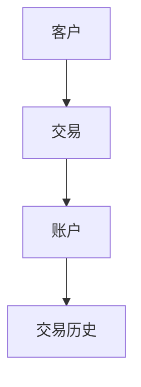

                 

# AI在反洗钱模式进化检测中的深度应用研究

## 关键词

- 反洗钱（AML）
- 深度学习
- 数据挖掘
- 模式识别
- 金融监管

## 摘要

本文旨在探讨人工智能（AI）在反洗钱（AML）模式进化检测中的应用。通过深入分析AI的核心概念和深度学习算法原理，我们揭示了AI在AML领域中的潜在优势。文章首先介绍了反洗钱的问题背景和传统方法的局限性，然后详细阐述了AI在AML中的应用场景和优势。通过具体的案例研究和实际应用分析，本文展示了深度学习在反洗钱模式进化检测中的强大能力，并提出了未来发展的方向。

## 目录大纲

**《AI在反洗钱模式进化检测中的深度应用研究》**

### 第一部分：背景与概念

- **第1章：问题背景与反洗钱模式**
  - **1.1.1 问题背景**
  - **1.1.2 反洗钱模式概述**
  - **1.1.3 AI在反洗钱中的作用**

- **第2章：核心概念与联系**
  - **2.1.1 核心概念介绍**
  - **2.1.2 概念属性特征对比表格**
  - **2.1.3 ER实体关系图架构**

### 第二部分：AI在反洗钱模式进化检测中的应用

- **第3章：深度学习算法原理与应用**
  - **3.1.1 深度学习算法概述**
  - **3.1.2 算法原理讲解**
  - **3.1.3 Python源代码实现**

- **第4章：数学模型与公式解析**
  - **4.1.1 数学模型介绍**
  - **4.1.2 数学模型公式**
  - **4.1.3 公式详细讲解**

### 第三部分：系统分析与架构设计

- **第5章：系统功能设计与架构设计**
  - **5.1.1 问题场景介绍**
  - **5.1.2 系统功能设计**
  - **5.1.3 系统架构设计**
  - **5.1.4 系统接口设计和系统交互**

### 第四部分：项目实战

- **第6章：项目环境安装与核心实现**
  - **6.1.1 环境安装**
  - **6.1.2 系统核心实现源代码**
  - **6.1.3 代码应用解读与分析**

- **第7章：实际案例分析与详细讲解**
  - **7.1.1 实际案例介绍**
  - **7.1.2 案例分析与详细讲解**

### 第五部分：最佳实践与拓展

- **第8章：最佳实践与注意事项**
  - **8.1.1 最佳实践**
  - **8.1.2 注意事项**
  - **8.1.3 拓展阅读**

---

### 第一部分：背景与概念

#### 第1章：问题背景与反洗钱模式

##### 1.1.1 问题背景

反洗钱（Anti-Money Laundering，简称AML）是指一系列为防止洗钱行为而采取的监管、控制及预防措施。洗钱是一种将非法所得转换为合法资金或财产的过程，通常涉及复杂的交易转移。洗钱活动不仅损害了金融系统的完整性，还助长了犯罪活动，如毒品交易、恐怖主义融资等。

在全球范围内，洗钱活动日益猖獗，传统反洗钱方法如客户身份识别（KYC）、交易监控、报告可疑活动等，虽取得了一定成效，但面对不断进化的洗钱模式，仍显得力不从心。例如，洗钱者可能通过匿名公司、多层次金融交易等方式掩盖资金来源，使得检测变得更加困难。

##### 1.1.2 反洗钱模式概述

反洗钱模式包括以下几个方面：

1. **客户身份识别（KYC）**：金融机构在开展业务前，需要核实客户身份，了解其背景信息。
2. **交易监控**：实时监控客户的交易行为，对异常交易进行预警和报告。
3. **可疑活动报告**：发现可疑交易后，及时向监管机构报告。
4. **客户和账户管理**：定期审查客户和账户的合法性，确保业务符合反洗钱法规。

传统反洗钱方法的局限性主要体现在以下几个方面：

- **人工成本高**：需要大量人力资源进行客户身份识别、交易监控等工作。
- **效率低**：对于大规模数据，传统方法难以快速处理和分析。
- **灵活性不足**：难以应对复杂和不断变化的洗钱模式。
- **技术落后**：缺乏高效的数据分析和模式识别工具。

##### 1.1.3 AI在反洗钱中的作用

人工智能（AI）在反洗钱中的应用具有巨大的潜力。AI技术可以自动化复杂的分析任务，提高反洗钱的效率和准确性。具体来说，AI在反洗钱中的作用主要体现在以下几个方面：

1. **客户身份识别**：利用人脸识别、生物识别等技术，快速准确地进行客户身份验证。
2. **交易监控**：通过机器学习算法，对大量交易数据进行分析，识别异常交易模式。
3. **模式识别**：利用深度学习算法，从海量数据中挖掘潜在的洗钱模式。
4. **风险评估**：基于历史数据和实时分析，为金融机构提供个性化的风险评级。
5. **自动化报告**：自动生成可疑活动报告，提高报告效率和准确性。

随着AI技术的不断发展，其在反洗钱中的应用前景将更加广阔。通过引入AI，金融机构可以更有效地应对不断变化的洗钱威胁，保障金融系统的安全与稳定。

---

#### 第2章：核心概念与联系

##### 2.1.1 核心概念介绍

在探讨AI在反洗钱中的应用之前，我们需要了解一些核心概念，包括人工智能（AI）、深度学习、数据挖掘和特征工程。

1. **人工智能（AI）**：人工智能是计算机科学的一个分支，旨在创建智能机器，使它们能够执行通常需要人类智能的任务，如视觉识别、语言理解和决策制定。

2. **深度学习**：深度学习是机器学习的一个子领域，主要使用多层神经网络来模拟人类大脑的学习和决策过程。深度学习在图像识别、语音识别和自然语言处理等领域取得了显著成果。

3. **数据挖掘**：数据挖掘是从大量数据中提取有价值信息和知识的过程。它涉及多种技术，如统计分析、机器学习和可视化，以发现数据中的模式和关系。

4. **特征工程**：特征工程是数据预处理的重要部分，旨在从原始数据中提取有助于机器学习模型训练的特征。特征工程的质量直接影响模型的性能和可解释性。

##### 2.1.2 概念属性特征对比表格

| 概念     | 定义                                       | 特点                                       |
|----------|--------------------------------------------|--------------------------------------------|
| AI       | 人工智能，模拟人类智能行为的计算机系统       | 自学习、自推理、自适应                       |
| 深度学习 | 基于多层神经网络的学习方法                 | 自动化特征提取、高精度预测                   |
| 数据挖掘 | 从大量数据中提取有价值的信息和模式          | 数据预处理、模式识别、预测建模               |
| 特征工程 | 提取和选择对目标问题有重要影响的数据特征   | 提高模型性能、减少数据噪声                   |

##### 2.1.3 ER实体关系图架构

在反洗钱系统中，常见的实体关系包括客户、交易、账户和交易历史。以下是使用Mermaid绘制的ER实体关系图：

该图展示了客户发起交易，交易关联到账户，而账户又记录了交易历史。这种实体关系对于反洗钱模式进化检测具有重要意义。

---

在接下来的部分中，我们将深入探讨AI，特别是深度学习算法在反洗钱模式进化检测中的应用。通过分析算法原理、数学模型和具体实现，我们将展示AI如何为反洗钱领域带来革命性的变革。敬请期待。

