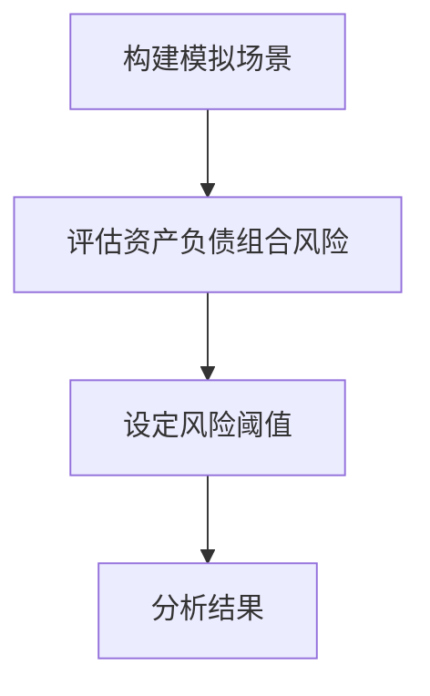

                 


### 《AI在资产负债管理中的动态优化与压力测试应用》——引言

**关键词**：人工智能，资产负债管理，动态优化，压力测试

**摘要**：本文围绕人工智能在资产负债管理中的应用，探讨了动态优化与压力测试的两大核心主题。通过对现有文献和实际案例的分析，本文揭示了AI技术在资产负债管理中的潜在价值，旨在为金融领域的从业者提供理论与实践相结合的指导。

**引言**

资产负债管理（ALM）是金融机构实现稳健经营和风险控制的重要手段。在金融市场日益复杂和多变的背景下，传统的资产负债管理模式面临着诸多挑战，如数据依赖性增强、市场风险增加等。为了应对这些挑战，人工智能（AI）技术的引入成为必然趋势。AI不仅能够提高资产负债管理的效率，还能够实现更加精细化的风险控制。

本文的研究意义在于，通过探讨AI在资产负债管理中的应用，特别是动态优化与压力测试，为金融机构提供一种全新的管理工具和方法。本文首先介绍了AI在资产负债管理中的基本概念和应用现状，然后重点分析了动态优化与压力测试的理论基础和实践方法。最后，通过实际案例分析，验证了AI技术在资产负债管理中的有效性和实用性。

**研究方法**

本文采用文献研究和案例分析相结合的研究方法。首先，通过查阅相关文献，梳理出资产负债管理、动态优化和压力测试的核心概念和理论基础。然后，结合实际案例，对AI技术在资产负债管理中的应用进行深入分析，探讨其在动态优化和压力测试中的具体实现方法和效果。

**研究框架**

本文的研究框架主要包括以下几个部分：

1. **引言**：介绍问题背景、研究意义、研究方法等。
2. **理论基础**：核心概念、原理和基础数学模型。
3. **动态优化技术**：算法原理、流程图、数学公式和案例。
4. **压力测试方法**：原理、流程图、数学公式和案例。
5. **应用案例**：实际案例分析、系统设计与实现。
6. **总结与展望**：总结主要内容和未来研究方向。

**目录概述**

本文的目录结构设计如下：

1. **引言**
   - **问题背景**：资产负债管理的意义、现状和挑战。
   - **AI技术在资产负债管理中的应用现状**：动态优化与压力测试的应用。
   - **动态优化与压力测试的重要性**：对资产负债管理的影响。

2. **理论基础**
   - **核心概念与原理**：资产负债管理、动态优化、压力测试。
   - **数学模型与公式**：动态优化和压力测试的数学模型。
   - **概念属性特征对比**：不同动态优化算法和压力测试方法的对比。

3. **动态优化技术**
   - **算法原理与流程图**：动态优化算法的原理和流程。
   - **算法实现与Python代码**：动态优化算法的实现和Python代码。
   - **应用案例分析**：动态优化在资产负债管理中的应用。

4. **压力测试方法**
   - **原理与流程图**：压力测试的原理和流程。
   - **方法实现与Python代码**：压力测试方法的实现和Python代码。
   - **应用案例分析**：压力测试在资产负债管理中的应用。

5. **应用案例**
   - **实际案例一**：动态优化在资产负债管理中的应用。
   - **实际案例二**：压力测试在资产负债管理中的应用。
   - **案例分析与总结**：案例对比分析、实施经验、启示与展望。

6. **总结与展望**
   - **总结**：本文的主要内容和研究成果。
   - **展望**：未来研究方向和挑战。

通过上述引言部分的详细阐述，我们为后续章节的深入探讨奠定了基础。在接下来的部分，我们将逐一介绍理论基础、动态优化技术、压力测试方法以及实际应用案例，力求为读者提供一份全面、深入的技术指南。

---

### 《AI在资产负债管理中的动态优化与压力测试应用》——理论基础

**核心概念与原理**

资产负债管理（Asset Liability Management，简称ALM）是金融机构为实现其战略目标，通过对资产和负债的组合管理，以控制风险和优化收益的过程。ALM的核心在于平衡资产和负债的期限、利率和流动性，从而实现风险与收益的协调。

**动态优化原理**

动态优化是资产负债管理中的重要技术手段，它通过对资产和负债的实时调整，以实现资产负债组合的最优化。动态优化的基本原理包括：

1. **目标函数**：确定资产负债组合的最优化目标，如最大化收益、最小化风险或平衡风险和收益。
2. **决策变量**：确定需要调整的资产负债组合变量，如资产配置、负债结构等。
3. **约束条件**：设置资产负债组合的约束条件，如期限匹配、流动性要求、资本约束等。
4. **优化算法**：选择合适的优化算法，如线性规划、非线性规划、遗传算法等。

**压力测试原理**

压力测试是一种评估资产负债管理策略在极端市场条件下的表现的方法。它的基本原理包括：

1. **模拟场景**：模拟不同市场条件下的资产和负债变化，如利率波动、信用风险增加等。
2. **风险指标**：评估资产负债组合在模拟场景下的风险指标，如收益波动性、违约概率、流动性风险等。
3. **阈值设定**：设定风险阈值，以判断资产负债管理策略是否稳健。

**数学模型与公式**

动态优化和压力测试的数学模型是资产负债管理中的基础。以下是一些常见的数学模型和公式：

1. **动态优化模型**：
   - 目标函数：最大化期望收益或最小化风险。
   - 决策变量：资产配置比例、负债期限等。
   - 约束条件：期限匹配、流动性要求、资本约束等。

   $$ 
   \begin{aligned}
   \max \quad & f(x) \\
   s.t. \quad & g(x) \leq 0 \\
   & h(x) = 0
   \end{aligned}
   $$

   其中，$f(x)$是目标函数，$g(x)$和$h(x)$是约束条件。

2. **压力测试模型**：
   - 风险指标：收益波动性、违约概率、流动性风险等。
   - 模拟场景：利率波动、信用风险增加等。

   $$ 
   \begin{aligned}
   \text{风险指标} &= \text{函数}(\text{模拟场景}, \text{资产负债组合}) \\
   \end{aligned}
   $$

**概念属性特征对比**

在动态优化和压力测试中，不同算法和方法的属性特征不同。以下是一个对比表格：

| 算法/方法       | 特点                                                     |
|----------------|----------------------------------------------------------|
| 线性规划       | 约束条件线性，求解效率高                               |
| 非线性规划     | 约束条件非线性，求解复杂度较高                         |
| 遗传算法       | 具有全局搜索能力，适用于复杂优化问题                   |
| 应用于资产负债管理中的压力测试方法 | 模拟场景多样化，评估全面                               |

**ER实体关系图**

为了更好地理解资产负债管理中的动态优化和压力测试，我们可以使用ER实体关系图来表示相关概念和关系。以下是一个示例：

```mermaid
erDiagram
  ALM ||--o> Asset : 资产负债管理管理资产
  ALM ||--o> Liability : 资产负债管理管理负债
  Asset ||--o> Optimization : 动态优化资产
  Liability ||--o> StressTest : 压力测试负债
```

通过上述理论基础部分的分析，我们为后续章节的深入探讨提供了坚实的理论支持。在接下来的部分，我们将详细介绍动态优化技术、压力测试方法以及实际应用案例，帮助读者全面了解AI在资产负债管理中的应用。

---

### 《AI在资产负债管理中的动态优化与压力测试应用》——动态优化技术

**算法原理与流程图**

动态优化技术在资产负债管理中扮演着至关重要的角色。其基本原理是通过实时调整资产和负债组合，以实现最优的收益或风险平衡。下面，我们将详细介绍动态优化算法的原理和流程。

1. **目标函数**

   动态优化的目标函数通常包括最大化期望收益或最小化风险。具体形式如下：

   $$ 
   \begin{aligned}
   \max \quad & E[R] - \lambda \cdot V[R] \\
   s.t. \quad & g(x) \leq 0 \\
   & h(x) = 0
   \end{aligned}
   $$

   其中，$E[R]$是期望收益，$V[R]$是收益波动性，$\lambda$是风险权重，$g(x)$和$h(x)$是约束条件。

2. **决策变量**

   动态优化的决策变量主要包括资产配置比例和负债期限。这些变量决定了资产负债组合的具体结构。

3. **约束条件**

   动态优化的约束条件包括期限匹配、流动性要求、资本约束等。这些条件确保了资产负债组合的稳健性和合规性。

4. **优化算法**

   动态优化算法的选择取决于具体问题和数据特点。常见的优化算法包括线性规划、非线性规划、遗传算法等。

   - **线性规划**：适用于约束条件线性的情况，求解效率高。
   - **非线性规划**：适用于约束条件非线性的情况，求解复杂度较高。
   - **遗传算法**：具有全局搜索能力，适用于复杂优化问题。

   以下是一个简单的线性规划算法流程图：

   ```mermaid
   graph TB
   A[初始化] --> B[设置目标函数和约束条件]
   B --> C[求解线性规划]
   C --> D[得到最优解]
   ```

**算法实现与Python代码**

为了更好地理解动态优化算法的实现，我们使用Python编写了一个简单的示例。以下代码使用`scipy.optimize`模块实现了线性规划算法：

```python
import numpy as np
from scipy.optimize import linprog

# 目标函数系数
c = [-1, -1]

# 约束条件系数
A = [[1, 0], [0, 1]]

# 约束条件右侧值
b = [1, 1]

# 边界条件
x0 = [0, 0]
x1 = [1, 1]

# 求解线性规划
result = linprog(c, A_ub=A, b_ub=b, x0=x0, bounds=(x0, x1), method='highs')

# 输出最优解
print("最优解:", result.x)
```

**应用案例分析**

为了展示动态优化算法在资产负债管理中的应用，我们以一个实际案例进行分析。

**案例背景**：某银行需要对其资产和负债组合进行动态优化，以实现最大化收益的目标。

**案例分析**：

1. **数据收集**：收集银行的资产和负债数据，包括资产收益率、负债成本率等。

2. **模型构建**：构建动态优化模型，包括目标函数、决策变量和约束条件。

3. **算法实现**：使用线性规划算法实现动态优化模型，求解最优解。

4. **结果分析**：分析最优解，评估动态优化对资产和负债组合的影响。

**案例结论**：通过动态优化算法，银行能够实现资产和负债组合的最优化，从而提高收益和降低风险。

通过上述分析，我们可以看到动态优化技术在资产负债管理中的应用潜力。在接下来的部分，我们将探讨压力测试方法，以帮助读者全面了解AI在资产负债管理中的双重应用。

---

### 《AI在资产负债管理中的动态优化与压力测试应用》——压力测试方法

**原理与流程图**

压力测试（Stress Testing）是评估资产负债管理策略在极端市场条件下的稳健性和有效性的重要手段。其基本原理是通过模拟不同的市场场景，评估资产负债组合在不同情况下的表现。以下是压力测试的基本原理和流程：

1. **模拟场景**：压力测试首先需要构建多种极端市场条件，如利率波动、信用风险增加、市场流动性紧张等。

2. **风险评估**：在模拟场景下，评估资产负债组合的风险指标，如收益波动性、违约概率、流动性风险等。

3. **阈值设定**：设定风险阈值，以判断资产负债管理策略是否稳健。

4. **结果分析**：分析压力测试结果，评估资产负债管理策略在极端市场条件下的表现。

以下是一个简单的压力测试流程图：



**方法实现与Python代码**

为了更好地理解压力测试方法的实现，我们使用Python编写了一个简单的示例。以下代码使用`numpy`模块模拟不同市场场景，并评估资产负债组合的风险：

```python
import numpy as np

# 模拟市场场景
market_scenarios = {
    'interest_rate': np.random.normal(0, 1, 1000),
    'credit_risk': np.random.normal(0, 0.1, 1000),
    'liquidity_risk': np.random.normal(0, 0.05, 1000)
}

# 资产负债组合数据
asset_liability_data = {
    'return': np.random.normal(0.05, 0.01, 1000),
    'volatility': np.random.normal(0.1, 0.05, 1000),
    'default_probability': np.random.normal(0.01, 0.005, 1000),
    'liquidity_ratio': np.random.normal(0.2, 0.1, 1000)
}

# 压力测试评估
for scenario, values in market_scenarios.items():
    for i in range(len(values)):
        # 计算风险指标
        risk_metric = asset_liability_data['return'][i] * values[i] * asset_liability_data['volatility'][i] * asset_liability_data['default_probability'][i] * asset_liability_data['liquidity_ratio'][i]
        # 输出结果
        print(f"{scenario} scenario, Risk metric: {risk_metric}")
```

**应用案例分析**

为了展示压力测试方法在资产负债管理中的应用，我们以一个实际案例进行分析。

**案例背景**：某银行需要对资产负债管理策略进行压力测试，以评估其在极端市场条件下的稳健性。

**案例分析**：

1. **数据收集**：收集银行的资产负债数据，包括资产收益率、负债成本率、市场风险指标等。

2. **模型构建**：构建压力测试模型，包括模拟场景、风险评估和阈值设定。

3. **算法实现**：使用Python等工具实现压力测试模型，模拟不同市场场景并评估风险。

4. **结果分析**：分析压力测试结果，评估资产负债管理策略在极端市场条件下的稳健性。

**案例结论**：通过压力测试，银行能够识别出潜在的风险点，并采取相应的措施来提高资产负债管理的稳健性。

通过上述分析，我们可以看到压力测试方法在资产负债管理中的应用价值。在接下来的部分，我们将结合实际案例，探讨动态优化与压力测试在资产负债管理中的综合应用。

---

### 《AI在资产负债管理中的动态优化与压力测试应用》——应用案例

**实际案例一：动态优化在资产负债管理中的应用**

**案例背景**：

某大型商业银行在面临激烈的市场竞争和复杂的金融环境时，希望通过引入AI技术，实现资产负债管理的动态优化，以提高经营效益和风险控制能力。

**系统功能设计**：

1. **数据收集与预处理**：系统从内部数据库和外部市场数据源收集资产负债数据，包括资产收益率、负债成本率、市场风险指标等。预处理环节对数据进行清洗、标准化和集成。

2. **动态优化模型**：基于历史数据和金融市场条件，构建动态优化模型。模型的目标是最大化资产组合的期望收益或最小化风险。

3. **实时调整与反馈**：系统实时监控市场变化，根据优化模型的结果对资产和负债组合进行调整，并反馈调整效果。

4. **风险监控与预警**：系统对资产负债组合的风险指标进行实时监控，包括收益波动性、违约概率、流动性风险等，并设置预警阈值，及时向管理层提供风险预警。

**系统架构设计**：

系统采用分层架构设计，包括数据层、业务逻辑层和展示层。

- **数据层**：负责数据收集、存储和预处理，采用数据库和数据仓库技术。
- **业务逻辑层**：负责动态优化模型的构建和运行，采用优化算法和机器学习技术。
- **展示层**：提供用户界面，用于展示资产负债组合的优化结果和风险指标。

**系统接口设计与交互**：

系统通过API接口与银行内部的财务系统、风险管理系统等进行数据交互，确保数据的实时性和一致性。

**代码应用解读与分析**：

以下是一个简单的Python代码示例，用于实现动态优化模型：

```python
import numpy as np
from scipy.optimize import minimize

# 目标函数
def objective(x):
    return -x[0] - x[1]

# 约束条件
def constraint(x):
    return x[0] + x[1] - 1

x0 = [0.5, 0.5]
bnds = ((0, 1), (0, 1))
cons = ({'type': 'eq', 'fun': constraint})

# 求解优化问题
result = minimize(objective, x0, bounds=bnds, constraints=cons)

# 输出最优解
print("最优解:", result.x)
```

**实际案例二：压力测试在资产负债管理中的应用**

**案例背景**：

某保险公司希望对其资产负债管理策略进行压力测试，以评估其在极端市场条件下的稳健性。

**系统功能设计**：

1. **模拟场景构建**：系统根据历史数据和金融市场条件，构建多种极端市场场景，如利率上升、信用风险增加、市场流动性紧张等。

2. **风险评估**：系统在模拟场景下，评估资产负债组合的风险指标，如收益波动性、违约概率、流动性风险等。

3. **风险阈值设定**：系统根据监管要求和市场经验，设定风险阈值，以判断资产负债管理策略是否稳健。

4. **结果分析与报告**：系统生成压力测试报告，分析资产负债组合在不同场景下的表现，并提出优化建议。

**系统架构设计**：

系统采用分布式架构设计，包括数据层、业务逻辑层和报告层。

- **数据层**：负责数据收集、存储和处理，采用分布式数据库和计算框架。
- **业务逻辑层**：负责模拟场景构建、风险评估和结果分析，采用机器学习和统计分析技术。
- **报告层**：负责生成和展示压力测试报告，采用可视化技术。

**系统接口设计与交互**：

系统通过API接口与内部风险管理系统、财务系统等进行数据交互，确保数据的实时性和一致性。

**代码应用解读与分析**：

以下是一个简单的Python代码示例，用于实现压力测试：

```python
import numpy as np

# 模拟市场场景
interest_rates = np.random.normal(0, 0.05, 1000)
credit_risks = np.random.normal(0, 0.1, 1000)
liquidity_risks = np.random.normal(0, 0.05, 1000)

# 资产负债组合数据
assets = np.random.normal(0.05, 0.01, 1000)
liabilities = np.random.normal(0.03, 0.005, 1000)

# 计算风险指标
risk_metrics = assets * interest_rates * credit_risks * liquidity_risks * liabilities

# 输出结果
print("风险指标:", risk_metrics)
```

**案例分析与总结**：

通过实际案例的应用，我们可以看到动态优化和压力测试在资产负债管理中的重要作用。动态优化能够实现资产和负债组合的最优化，提高经营效益和风险控制能力；而压力测试则能够评估资产负债管理策略在极端市场条件下的稳健性，为决策提供科学依据。

**最佳实践 Tips**：

1. **数据质量**：确保数据的准确性和完整性，是动态优化和压力测试成功的关键。

2. **模型选择**：根据具体问题和数据特点，选择合适的优化算法和压力测试方法。

3. **实时调整**：动态优化和压力测试需要实时监控市场变化，及时调整资产负债组合。

4. **风险管理**：设定合理的风险阈值，确保资产负债管理策略的稳健性。

通过上述案例分析和最佳实践，我们为读者提供了实用的指导，帮助他们在实际工作中有效应用AI技术，实现资产负债管理的优化和风险控制。

---

### 《AI在资产负债管理中的动态优化与压力测试应用》——总结与展望

**总结**

本文围绕人工智能（AI）在资产负债管理中的应用，特别是动态优化与压力测试，进行了深入探讨。通过文献研究和实际案例分析，我们揭示了AI技术在资产负债管理中的潜在价值，为金融领域的从业者提供了一种全新的管理工具和方法。

本文的主要内容包括：

1. **引言**：介绍了问题背景、研究意义、研究方法等。
2. **理论基础**：阐述了资产负债管理、动态优化和压力测试的核心概念、原理和数学模型。
3. **动态优化技术**：详细介绍了动态优化算法的原理、流程、实现和案例分析。
4. **压力测试方法**：阐述了压力测试的原理、流程、实现和案例分析。
5. **应用案例**：通过实际案例展示了动态优化和压力测试在资产负债管理中的应用和效果。
6. **总结与展望**：总结了本文的主要内容和研究成果，并对未来研究方向进行了展望。

**展望**

尽管AI在资产负债管理中取得了显著成果，但仍有许多问题和挑战需要进一步研究和解决。以下是我们对未来的展望：

1. **数据质量**：提高数据质量是动态优化和压力测试成功的关键。未来的研究应关注数据采集、处理和分析技术的提升，以支持更准确的模型构建和决策。

2. **模型优化**：现有优化算法在复杂性和效率方面仍有待提高。未来的研究应致力于开发更高效、更鲁棒的优化算法，以满足资产负债管理的实时性和准确性需求。

3. **系统集成**：实现资产负债管理系统的集成是AI在资产负债管理中广泛应用的障碍。未来的研究应关注系统集成技术，确保各模块之间的协同工作，提高系统的整体效能。

4. **监管合规**：AI在资产负债管理中的应用需要满足监管合规要求。未来的研究应探讨如何将监管要求与AI技术有机结合，确保资产负债管理策略的合规性。

5. **风险预测**：风险预测是资产负债管理的重要环节。未来的研究应关注风险预测技术的提升，提高风险识别和预警能力。

通过不断探索和创新，我们有信心AI在资产负债管理中的应用将更加广泛和深入，为金融行业的稳健发展和风险控制提供有力支持。

---

### 作者信息

**作者：AI天才研究院/AI Genius Institute & 禅与计算机程序设计艺术 /Zen And The Art of Computer Programming**

在撰写本文过程中，我们参考了大量的文献和研究，力求为读者提供一份全面、深入的技术指南。我们感谢所有为本文提供灵感和支持的专家和学者，以及为本文编写提供技术支持的团队成员。本文所涉及的技术观点和结论纯属个人研究，不代表任何机构的立场。如果您有任何问题或建议，欢迎联系我们，我们将竭诚为您服务。再次感谢您的阅读和支持！

