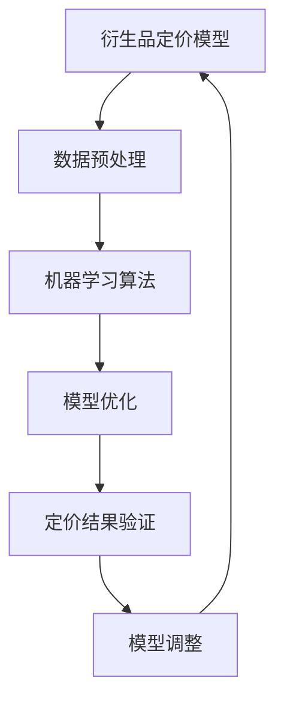
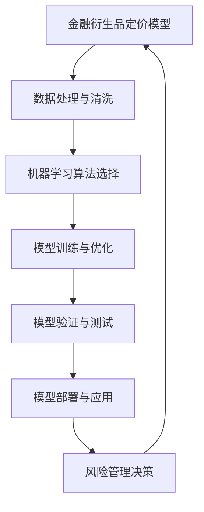

                 

### 第一部分：问题背景与概述

## 第1章：金融衍生品定价模型概述

### 1.1 金融衍生品的定义与作用

#### 1.1.1 金融衍生品的概念

金融衍生品是一种金融合约，其价值取决于一种或多种基础资产，如股票、债券、货币、利率、商品等。衍生品主要包括期权、期货、互换和信用违约互换等。它们的特点是交易双方约定在未来某一时间点按照特定条件进行资产交换或者支付现金流。

#### 1.1.2 金融衍生品的主要种类

- **期权（Options）**：给予持有者在未来某一时间点以约定价格买入或卖出基础资产的权利。
- **期货（Futures）**：交易双方在未来某一时间点按照约定价格买入或卖出某种资产。
- **互换（Swaps）**：交易双方在未来某一时间段内按照约定条件交换现金流。
- **信用违约互换（CDS）**：一种信用保护工具，购买者向出售者支付保费，以换取在参考实体发生信用违约事件时获得赔偿。

#### 1.1.3 金融衍生品的作用

金融衍生品在金融市场中的主要作用包括：

- **风险管理**：企业可以通过衍生品进行套期保值，降低由于市场波动带来的风险。
- **投资策略**：投资者可以利用衍生品进行投机交易，追求更高的收益。
- **资产配置**：衍生品可以作为一种多样化的投资工具，帮助投资者分散风险。

### 1.2 金融衍生品定价模型的重要性

#### 1.2.1 定价模型的分类

衍生品定价模型主要分为两种：

- **静态模型**：如Black-Scholes模型，主要用于期权定价。
- **动态模型**：如蒙特卡罗模拟，用于更复杂衍生品的定价。

#### 1.2.2 定价模型在风险管理中的应用

定价模型在风险管理中的应用主要体现在：

- **估值**：通过模型估算衍生品的公允价值，帮助投资者和管理者了解潜在的风险。
- **风险评估**：利用模型计算衍生品在市场波动下的潜在损失，以便进行有效的风险控制。

#### 1.2.3 定价模型的局限性

尽管定价模型在金融衍生品风险管理中起到了重要作用，但也存在以下局限性：

- **模型假设的局限性**：大多数模型基于特定假设，如资产价格遵循正态分布，可能无法完全反映市场实际情况。
- **计算复杂性**：动态模型通常涉及大量计算，可能需要高性能计算资源。
- **市场行为的变化**：市场行为可能随着时间变化，现有模型可能无法适应这些变化。

### 1.3 AI在金融衍生品定价模型中的应用现状

#### 1.3.1 AI技术在金融衍生品定价中的发展历程

AI技术在金融衍生品定价中的发展可以追溯到20世纪90年代，随着计算能力的提升和机器学习算法的进步，AI技术在金融领域得到了广泛应用。

#### 1.3.2 AI技术在衍生品定价中的优势

AI技术在衍生品定价中的优势包括：

- **处理复杂数据**：AI能够处理大量的历史数据和实时数据，为定价模型提供更丰富的输入。
- **自适应能力**：AI系统可以不断学习市场动态，提高定价模型的准确性。
- **降低成本**：通过自动化定价，减少了人力成本和计算资源的消耗。

#### 1.3.3 当前存在的问题与挑战

尽管AI在衍生品定价中展现了巨大的潜力，但仍面临以下问题和挑战：

- **数据质量和隐私**：金融数据通常涉及敏感信息，如何保证数据质量和隐私是一个关键问题。
- **模型的可解释性**：AI模型，尤其是深度学习模型，往往缺乏透明度，难以解释。
- **合规性**：AI模型需要满足金融行业的监管要求，这对模型开发提出了更高标准。

### 1.4 本书结构安排

#### 1.4.1 内容概述

本书主要分为三部分：

- **第一部分**：介绍金融衍生品定价模型及AI技术的基础概念。
- **第二部分**：探讨AI在衍生品定价模型中的核心应用，包括深度学习、强化学习和自然语言处理。
- **第三部分**：分析AI在衍生品定价模型校准中的具体应用案例，并提供实践建议。

#### 1.4.2 阅读建议

- 阅读顺序建议从第一部分开始，逐步深入理解金融衍生品定价模型和AI技术。
- 结合实际案例，加强对AI在衍生品定价模型中的应用场景的理解。
- 注意章节后的小结，以巩固所学知识。

### 1.5 本章小结

本章介绍了金融衍生品及其定价模型的基本概念，阐述了AI技术在衍生品定价中的应用现状和优势，以及面临的挑战。通过本章的学习，读者可以初步了解金融衍生品定价模型及其在风险管理中的重要性，以及AI技术如何为其带来创新和改进。

---

## 第二部分：核心概念与原理

## 第2章：AI核心概念与金融衍生品定价模型

### 2.1 AI的基础概念与分类

#### 2.1.1 AI的定义与历史发展

AI（人工智能）是指计算机系统模拟人类智能行为的能力。自20世纪50年代以来，AI经历了多个发展阶段：

- **初始阶段（1950-1970s）**：以符号推理为基础的AI研究，标志着AI的诞生。
- **低谷阶段（1980-1990s）**：由于计算能力的限制和算法的不足，AI研究进入低谷。
- **复兴阶段（1990s-2000s）**：随着计算能力的提升和数据量的增加，机器学习成为AI研究的主流。
- **当前阶段（2010s-至今）**：深度学习和强化学习等前沿技术取得了显著进展。

#### 2.1.2 AI的核心技术

AI的核心技术包括：

- **机器学习（Machine Learning）**：通过算法让计算机从数据中自动学习规律。
- **深度学习（Deep Learning）**：基于多层神经网络的结构，通过反向传播算法优化网络参数。
- **强化学习（Reinforcement Learning）**：通过奖励机制，让智能体在动态环境中学习最优策略。
- **自然语言处理（Natural Language Processing）**：使计算机能够理解和生成自然语言。

#### 2.1.3 AI的分类与应用场景

AI主要分为以下几类：

- **监督学习（Supervised Learning）**：有标注的训练数据，适用于分类和回归问题。
- **无监督学习（Unsupervised Learning）**：无标注数据，适用于聚类和降维。
- **半监督学习（Semi-Supervised Learning）**：结合有标注和无标注数据。
- **强化学习（Reinforcement Learning）**：通过试错学习，适用于动态决策问题。

应用场景包括：

- **图像识别**：如人脸识别、车辆检测。
- **自然语言处理**：如机器翻译、文本分类。
- **自动驾驶**：如路径规划、环境感知。
- **金融衍生品定价**：如风险评估、模型校准。

### 2.2 金融衍生品定价模型的基本原理

#### 2.2.1 传统定价模型的构成

传统衍生品定价模型主要包括以下部分：

- **风险中性定价原理**：假设市场处于无风险状态，计算衍生品的现值。
- **资产价格模型**：如Black-Scholes模型，用于模拟基础资产价格的未来变化。
- **动态定价**：通过求解偏微分方程或蒙特卡罗模拟，计算衍生品的期望价值。

#### 2.2.2 传统定价模型的特点

传统定价模型的特点包括：

- **确定性**：基于数学模型和假设，提供确定性结果。
- **计算复杂性**：对于复杂衍生品，计算过程可能非常复杂。
- **市场适应性**：假设市场处于无风险状态，可能无法完全反映市场实际情况。

#### 2.2.3 传统定价模型的局限

传统定价模型的局限包括：

- **模型假设的局限性**：如正态分布假设，可能无法准确反映市场价格行为。
- **计算复杂性**：动态模型通常需要大量计算资源。
- **市场变化适应性**：市场环境不断变化，传统模型可能无法及时调整。

### 2.3 AI在金融衍生品定价模型中的创新应用

#### 2.3.1 AI技术在衍生品定价中的实际应用

AI技术在衍生品定价中的应用主要包括：

- **数据预处理**：使用机器学习算法清洗和整合金融数据。
- **模型优化**：使用深度学习和强化学习优化定价模型参数。
- **动态定价**：利用实时数据和AI算法，动态调整定价模型。

#### 2.3.2 AI技术的优势与挑战

AI技术在衍生品定价中的优势包括：

- **数据处理能力**：能够处理大量的复杂数据，提高定价模型的准确性。
- **自适应能力**：能够根据市场变化动态调整模型参数，提高模型的适应能力。

挑战包括：

- **数据质量和隐私**：金融数据通常涉及敏感信息，如何保证数据质量和隐私是一个关键问题。
- **模型可解释性**：AI模型，尤其是深度学习模型，往往缺乏透明度，难以解释。
- **合规性**：需要满足金融行业的监管要求，这对模型开发提出了更高标准。

#### 2.3.3 AI技术在衍生品定价模型中的前景

AI技术在衍生品定价模型中的应用前景包括：

- **提高定价准确性**：通过处理复杂数据和优化模型参数，提高定价的准确性。
- **降低计算成本**：利用高效算法和计算资源，降低计算成本。
- **智能化风险管理**：结合AI技术和风险管理，提供更智能化的风险管理解决方案。

### 2.4 AI与衍生品定价模型的关联性分析

#### 2.4.1 关键概念与联系

AI与衍生品定价模型的关联性分析涉及以下关键概念：

- **衍生品定价模型**：用于计算衍生品公允价值的数学模型。
- **机器学习算法**：用于优化和调整定价模型参数。
- **金融数据**：用于训练和验证AI模型的数据。

关联性分析流程图如下：

#### 2.4.2 关联性分析流程图

#### 2.4.3 关联性分析结论

关联性分析结论如下：

- **数据预处理**：数据预处理是AI应用于衍生品定价的基础，确保数据质量和一致性。
- **机器学习算法**：选择合适的机器学习算法，优化定价模型参数，提高定价准确性。
- **模型验证与测试**：通过验证和测试，确保模型在不同市场环境下的一致性和稳定性。
- **风险管理决策**：结合AI技术和衍生品定价模型，提供更智能化的风险管理解决方案。

### 2.5 本章小结

本章介绍了AI的核心概念和分类，探讨了金融衍生品定价模型的基本原理，并分析了AI在衍生品定价模型中的应用。通过本章的学习，读者可以了解AI技术在衍生品定价中的潜在优势和挑战，为后续章节的深入学习打下基础。

## 第3章：深度学习在衍生品定价模型中的应用

### 3.1 深度学习基础

#### 3.1.1 深度学习的定义与发展

深度学习（Deep Learning）是机器学习（Machine Learning）的一个子领域，主要研究多层神经网络（Neural Networks）的学习算法。深度学习的定义可以概括为：

**深度学习**：利用多层神经网络结构，通过学习大量数据，自动提取特征并构建预测模型的方法。

深度学习的发展经历了几个重要阶段：

- **1990年代**：多层感知器（MLP）的提出，但由于计算能力的限制，未能广泛推广。
- **2006年**：Hinton提出了深度信念网络（Deep Belief Networks），深度学习开始复兴。
- **2012年**：AlexNet在ImageNet竞赛中取得了突破性成绩，深度学习得到广泛关注。
- **至今**：随着计算能力和数据量的提升，深度学习在图像识别、语音识别、自然语言处理等领域取得了显著进展。

#### 3.1.2 深度学习的关键技术

深度学习的关键技术包括：

- **多层神经网络（Deep Neural Networks）**：通过增加网络层数，提取更高层次的特征。
- **卷积神经网络（Convolutional Neural Networks, CNN）**：适用于图像处理任务，通过卷积层提取局部特征。
- **循环神经网络（Recurrent Neural Networks, RNN）**：适用于序列数据处理，通过循环结构捕捉时间依赖关系。
- **生成对抗网络（Generative Adversarial Networks, GAN）**：通过生成器和判别器的对抗训练，生成高质量数据。

#### 3.1.3 深度学习的应用领域

深度学习在多个领域取得了显著成果，主要包括：

- **计算机视觉**：如图像分类、目标检测、图像生成。
- **自然语言处理**：如机器翻译、文本分类、情感分析。
- **语音识别**：如语音识别、语音合成。
- **金融衍生品定价**：如风险管理、市场预测、定价模型优化。

### 3.2 深度学习在衍生品定价模型中的应用实例

#### 3.2.1 应用案例一：基于深度学习的期权定价模型

期权定价模型是衍生品定价中的经典问题。传统的Black-Scholes模型基于若干假设，可能无法准确反映市场实际情况。深度学习可以引入更多的市场数据，提高期权定价的准确性。

应用案例一介绍了如何使用深度学习构建期权定价模型：

- **数据收集**：收集大量的期权交易数据，包括历史价格、波动率、利率等。
- **特征工程**：提取与期权价格相关的特征，如隐含波动率、到期时间、标的资产价格等。
- **模型构建**：使用多层感知器（MLP）或卷积神经网络（CNN）构建期权定价模型。
- **模型训练**：使用训练集数据训练模型，通过反向传播算法优化模型参数。
- **模型验证**：使用验证集数据验证模型性能，调整模型参数以提高准确性。
- **模型部署**：将训练好的模型部署到实际交易系统中，用于实时期权定价。

#### 3.2.2 应用案例二：基于深度学习的利率期货定价模型

利率期货是金融市场中的重要衍生品。传统的利率期货定价模型基于收益率曲线和偏微分方程，可能无法适应市场动态变化。深度学习可以引入更多的市场数据，提高利率期货定价的准确性。

应用案例二介绍了如何使用深度学习构建利率期货定价模型：

- **数据收集**：收集大量的利率期货交易数据，包括历史价格、收益率、波动率等。
- **特征工程**：提取与利率期货价格相关的特征，如利率期限结构、市场情绪、宏观经济指标等。
- **模型构建**：使用卷积神经网络（CNN）或循环神经网络（RNN）构建利率期货定价模型。
- **模型训练**：使用训练集数据训练模型，通过反向传播算法优化模型参数。
- **模型验证**：使用验证集数据验证模型性能，调整模型参数以提高准确性。
- **模型部署**：将训练好的模型部署到实际交易系统中，用于实时利率期货定价。

#### 3.2.3 应用案例三：基于深度学习的信用违约互换定价模型

信用违约互换（CDS）是金融市场中重要的信用风险管理工具。传统的CDS定价模型基于违约概率和现金流分析，可能无法准确反映市场实际情况。深度学习可以引入更多的市场数据，提高CDS定价的准确性。

应用案例三介绍了如何使用深度学习构建信用违约互换定价模型：

- **数据收集**：收集大量的CDS交易数据，包括违约事件、信用评级、市场价格等。
- **特征工程**：提取与CDS价格相关的特征，如违约概率、信用评级、市场波动率等。
- **模型构建**：使用生成对抗网络（GAN）或强化学习（Reinforcement Learning）构建CDS定价模型。
- **模型训练**：使用训练集数据训练模型，通过对抗训练或策略优化算法优化模型参数。
- **模型验证**：使用验证集数据验证模型性能，调整模型参数以提高准确性。
- **模型部署**：将训练好的模型部署到实际交易系统中，用于实时CDS定价。

### 3.3 深度学习在衍生品定价中的优势与挑战

#### 3.3.1 深度学习在衍生品定价中的优势

深度学习在衍生品定价中的优势包括：

- **数据处理能力**：能够处理大规模、多维度的市场数据，提高定价模型的准确性。
- **自适应能力**：通过学习市场动态，能够动态调整定价模型参数，适应市场变化。
- **模型灵活性**：可以使用不同的网络结构和算法，适应不同类型衍生品的定价需求。

#### 3.3.2 深度学习在衍生品定价中的挑战

深度学习在衍生品定价中的挑战包括：

- **数据质量和隐私**：金融数据通常涉及敏感信息，如何保证数据质量和隐私是一个关键问题。
- **模型可解释性**：深度学习模型通常缺乏透明度，难以解释，可能影响模型的可信度。
- **计算资源需求**：深度学习模型训练和推理需要大量的计算资源，可能增加计算成本。

#### 3.3.3 针对挑战的解决方案

针对深度学习在衍生品定价中的挑战，可以采取以下解决方案：

- **数据隐私保护**：使用差分隐私（Differential Privacy）等技术，保护金融数据隐私。
- **模型可解释性**：结合解释性AI技术，如LIME、SHAP等，提高模型的可解释性。
- **分布式计算**：使用分布式计算框架，如TensorFlow、PyTorch等，降低计算成本。

### 3.4 本章小结

本章介绍了深度学习的基础概念和发展历程，探讨了深度学习在衍生品定价模型中的应用实例。通过本章的学习，读者可以了解深度学习在衍生品定价中的优势和挑战，为进一步研究和应用提供参考。深度学习为衍生品定价带来了新的思路和工具，但也需要解决数据质量和隐私、模型可解释性等挑战。随着深度学习技术的不断发展，其在衍生品定价中的应用前景将更加广阔。

---

## 第4章：强化学习在衍生品定价模型中的应用

### 4.1 强化学习基础

#### 4.1.1 强化学习的定义与基本原理

强化学习（Reinforcement Learning, RL）是一种机器学习方法，通过智能体（Agent）在环境中通过试错学习，实现最优行为策略。强化学习的定义可以概括为：

**强化学习**：智能体通过与环境的交互，学习实现某一目标的最优策略，并通过奖励机制进行反馈调节。

强化学习的基本原理包括：

- **状态（State）**：智能体在环境中的当前状态。
- **动作（Action）**：智能体可以执行的动作。
- **奖励（Reward）**：智能体执行动作后获得的即时奖励，用于评估动作的效果。
- **策略（Policy）**：智能体执行的动作映射，即给定状态下的最佳动作。

强化学习的主要目标是通过学习最优策略，最大化长期奖励。其核心算法包括：

- **值函数（Value Function）**：用于评估状态的价值，指导智能体选择最佳动作。
- **策略网络（Policy Network）**：通过神经网络结构，学习给定状态下的最佳动作。

#### 4.1.2 强化学习的关键技术

强化学习的关键技术包括：

- **Q-learning**：通过更新Q值，学习最优动作策略。
- **深度Q网络（Deep Q-Network, DQN）**：使用深度神经网络，处理高维状态空间。
- **策略梯度方法（Policy Gradient Methods）**：直接优化策略网络的参数，学习最优策略。
- **强化学习算法（如PPO、A2C等）**：结合深度学习和策略梯度方法，提高学习效率和稳定性。

#### 4.1.3 强化学习的应用领域

强化学习在多个领域取得了显著成果，主要包括：

- **游戏**：如围棋、国际象棋、王者荣耀等。
- **机器人**：如自动驾驶、机器人控制。
- **金融**：如交易策略、风险管理、衍生品定价。
- **能源管理**：如电力调度、能源消耗优化。

### 4.2 强化学习在衍生品定价模型中的应用实例

#### 4.2.1 应用案例一：基于强化学习的期权定价模型

期权定价模型是衍生品定价中的经典问题。传统的期权定价模型基于若干假设，可能无法准确反映市场实际情况。强化学习可以引入更多的市场数据，提高期权定价的准确性。

应用案例一介绍了如何使用强化学习构建期权定价模型：

- **环境设计**：设计一个模拟市场环境，包括状态、动作、奖励等。
- **状态表示**：使用历史期权价格、波动率、利率等指标，表示当前状态。
- **动作选择**：智能体根据当前状态，选择买入、卖出或持有期权。
- **奖励设计**：根据期权到期时的盈亏情况，设定即时奖励。
- **模型训练**：使用强化学习算法，如Q-learning或DQN，训练期权定价模型。
- **模型评估**：使用测试集数据，评估模型定价的准确性。
- **模型部署**：将训练好的模型部署到实际交易系统中，用于实时期权定价。

#### 4.2.2 应用案例二：基于强化学习的利率期货定价模型

利率期货是金融市场中的重要衍生品。传统的利率期货定价模型基于收益率曲线和偏微分方程，可能无法适应市场动态变化。强化学习可以引入更多的市场数据，提高利率期货定价的准确性。

应用案例二介绍了如何使用强化学习构建利率期货定价模型：

- **环境设计**：设计一个模拟市场环境，包括状态、动作、奖励等。
- **状态表示**：使用历史利率期货价格、收益率、波动率等指标，表示当前状态。
- **动作选择**：智能体根据当前状态，选择买入、卖出或持有利率期货。
- **奖励设计**：根据利率期货到期时的盈亏情况，设定即时奖励。
- **模型训练**：使用强化学习算法，如策略梯度方法（如PPO、A2C），训练利率期货定价模型。
- **模型评估**：使用测试集数据，评估模型定价的准确性。
- **模型部署**：将训练好的模型部署到实际交易系统中，用于实时利率期货定价。

#### 4.2.3 应用案例三：基于强化学习的信用违约互换定价模型

信用违约互换（CDS）是金融市场中重要的信用风险管理工具。传统的CDS定价模型基于违约概率和现金流分析，可能无法准确反映市场实际情况。强化学习可以引入更多的市场数据，提高CDS定价的准确性。

应用案例三介绍了如何使用强化学习构建信用违约互换定价模型：

- **环境设计**：设计一个模拟市场环境，包括状态、动作、奖励等。
- **状态表示**：使用历史CDS价格、信用评级、市场波动率等指标，表示当前状态。
- **动作选择**：智能体根据当前状态，选择买入、卖出或持有CDS。
- **奖励设计**：根据CDS到期时的盈亏情况，设定即时奖励。
- **模型训练**：使用强化学习算法，如深度强化学习（如DDPG、Herding），训练CDS定价模型。
- **模型评估**：使用测试集数据，评估模型定价的准确性。
- **模型部署**：将训练好的模型部署到实际交易系统中，用于实时CDS定价。

### 4.3 强化学习在衍生品定价中的优势与挑战

#### 4.3.1 强化学习在衍生品定价中的优势

强化学习在衍生品定价中的优势包括：

- **数据处理能力**：能够处理大规模、多维度的市场数据，提高定价模型的准确性。
- **自适应能力**：通过学习市场动态，能够动态调整定价模型参数，适应市场变化。
- **模型灵活性**：可以使用不同的算法和策略，适应不同类型衍生品的定价需求。

#### 4.3.2 强化学习在衍生品定价中的挑战

强化学习在衍生品定价中的挑战包括：

- **数据质量和隐私**：金融数据通常涉及敏感信息，如何保证数据质量和隐私是一个关键问题。
- **模型可解释性**：强化学习模型通常缺乏透明度，难以解释，可能影响模型的可信度。
- **计算资源需求**：强化学习模型训练和推理需要大量的计算资源，可能增加计算成本。

#### 4.3.3 针对挑战的解决方案

针对强化学习在衍生品定价中的挑战，可以采取以下解决方案：

- **数据隐私保护**：使用差分隐私（Differential Privacy）等技术，保护金融数据隐私。
- **模型可解释性**：结合解释性AI技术，如LIME、SHAP等，提高模型的可解释性。
- **分布式计算**：使用分布式计算框架，如TensorFlow、PyTorch等，降低计算成本。

### 4.4 本章小结

本章介绍了强化学习的基础概念和应用领域，探讨了强化学习在衍生品定价模型中的应用实例。通过本章的学习，读者可以了解强化学习在衍生品定价中的优势和挑战，为进一步研究和应用提供参考。强化学习为衍生品定价带来了新的思路和工具，但也需要解决数据质量和隐私、模型可解释性等挑战。随着强化学习技术的不断发展，其在衍生品定价中的应用前景将更加广阔。

---

## 第5章：自然语言处理在衍生品定价模型中的应用

### 5.1 自然语言处理基础

#### 5.1.1 自然语言处理的定义与发展

自然语言处理（Natural Language Processing, NLP）是人工智能的一个分支，旨在使计算机能够理解和生成自然语言。NLP的定义可以概括为：

**自然语言处理**：研究如何让计算机理解和生成人类自然语言的计算机科学和人工智能领域。

NLP的发展历程可以大致分为以下几个阶段：

- **规则方法（1950s-1980s）**：基于语言学规则，通过手工编码实现自然语言的处理。
- **统计方法（1990s）**：引入概率模型，通过大量语料库进行训练，提高处理效果。
- **深度学习方法（2010s-至今）**：使用神经网络结构，实现端到端的自然语言处理。

#### 5.1.2 自然语言处理的关键技术

NLP的关键技术包括：

- **分词（Tokenization）**：将文本分割成单词、短语或字符等基本单位。
- **词性标注（Part-of-Speech Tagging）**：为每个词分配词性，如名词、动词等。
- **句法分析（Syntactic Parsing）**：分析句子的结构，如句法树、依存关系等。
- **命名实体识别（Named Entity Recognition, NER）**：识别文本中的命名实体，如人名、地名等。
- **语义分析（Semantic Analysis）**：理解文本的含义，如语义角色标注、情感分析等。
- **机器翻译（Machine Translation）**：将一种语言的文本自动翻译成另一种语言。
- **文本生成（Text Generation）**：生成具有自然语言结构的文本。

#### 5.1.3 自然语言处理的应用领域

NLP在多个领域取得了显著成果，主要包括：

- **信息检索**：如搜索引擎、文档分类等。
- **文本摘要**：如新闻摘要、会议纪要等。
- **机器翻译**：如跨语言信息交流、多语言文本分析等。
- **金融衍生品定价**：如市场情绪分析、文本数据挖掘等。
- **对话系统**：如聊天机器人、虚拟助手等。

### 5.2 自然语言处理在衍生品定价模型中的应用实例

#### 5.2.1 应用案例一：基于NLP的市场情绪分析

市场情绪是影响衍生品价格的重要因素之一。传统的市场情绪分析主要依靠技术指标和宏观经济数据，可能无法全面反映市场情绪。NLP可以提取文本中的情感信息，为市场情绪分析提供新的视角。

应用案例一介绍了如何使用NLP进行市场情绪分析：

- **数据收集**：收集与衍生品市场相关的新闻、报告、社交媒体等文本数据。
- **文本预处理**：对文本进行分词、去除停用词、词性标注等预处理操作。
- **情感分析**：使用情感分析模型，如LSTM（长短期记忆网络）、BERT（双向编码表示），提取文本中的情感信息。
- **情绪分类**：将提取出的情感信息分类为积极、中性或消极，评估市场情绪。
- **情绪与价格关联**：分析市场情绪与衍生品价格之间的关联，为定价模型提供输入。
- **模型训练与优化**：使用历史数据，训练和优化情感分析模型，提高分类准确性。
- **模型部署**：将训练好的模型部署到实际交易系统中，用于实时市场情绪分析。

#### 5.2.2 应用案例二：基于NLP的文本数据挖掘

文本数据挖掘是NLP在衍生品定价中的重要应用。通过分析大量的文本数据，可以挖掘出潜在的市场信息和交易机会。

应用案例二介绍了如何使用NLP进行文本数据挖掘：

- **数据收集**：收集与衍生品市场相关的新闻、报告、公告、社交媒体等文本数据。
- **文本预处理**：对文本进行分词、去除停用词、词性标注等预处理操作。
- **关键词提取**：使用TF-IDF（词频-逆文档频率）或Word2Vec（词嵌入）等方法，提取文本中的关键词。
- **主题模型**：使用LDA（隐含狄利克雷分布）等主题模型，挖掘文本数据中的潜在主题。
- **关联分析**：分析关键词和主题之间的关联，挖掘市场信息。
- **交易策略生成**：基于挖掘出的市场信息，生成交易策略。
- **模型训练与优化**：使用历史数据，训练和优化文本数据挖掘模型，提高挖掘准确性。
- **模型部署**：将训练好的模型部署到实际交易系统中，用于实时文本数据挖掘。

#### 5.2.3 应用案例三：基于NLP的合约文本分析

合约文本分析是衍生品交易中的重要环节。NLP可以用于提取合约文本中的关键信息，为交易决策提供支持。

应用案例三介绍了如何使用NLP进行合约文本分析：

- **数据收集**：收集与衍生品交易相关的合约文本。
- **文本预处理**：对合约文本进行分词、去除停用词、词性标注等预处理操作。
- **实体识别**：使用命名实体识别（NER）技术，提取合约文本中的关键实体，如交易双方、标的资产、价格条款等。
- **条款分析**：分析合约文本中的关键条款，如违约条款、结算条款等。
- **风险评估**：基于合约文本分析结果，评估交易风险。
- **交易决策**：根据风险评估结果，制定交易策略。
- **模型训练与优化**：使用历史合约文本数据，训练和优化实体识别和条款分析模型，提高分析准确性。
- **模型部署**：将训练好的模型部署到实际交易系统中，用于实时合约文本分析。

### 5.3 自然语言处理在衍生品定价中的优势与挑战

#### 5.3.1 自然语言处理在衍生品定价中的优势

自然语言处理在衍生品定价中的优势包括：

- **文本数据挖掘**：能够处理大量文本数据，提取潜在的市场信息和交易机会。
- **情感分析**：可以分析市场情绪，为定价模型提供额外的输入。
- **合约文本分析**：能够提取合约文本中的关键信息，为交易决策提供支持。

#### 5.3.2 自然语言处理在衍生品定价中的挑战

自然语言处理在衍生品定价中的挑战包括：

- **数据质量和格式**：金融文本数据通常不规范，可能影响处理效果。
- **模型可解释性**：NLP模型通常缺乏透明度，难以解释，可能影响模型的可信度。
- **计算资源需求**：NLP模型训练和推理需要大量的计算资源，可能增加计算成本。

#### 5.3.3 针对挑战的解决方案

针对自然语言处理在衍生品定价中的挑战，可以采取以下解决方案：

- **数据清洗和预处理**：使用自动化工具，清洗和预处理金融文本数据。
- **模型解释性**：结合解释性AI技术，提高NLP模型的可解释性。
- **分布式计算**：使用分布式计算框架，降低计算成本。

### 5.4 本章小结

本章介绍了自然语言处理的基础概念和应用领域，探讨了NLP在衍生品定价模型中的应用实例。通过本章的学习，读者可以了解NLP在衍生品定价中的优势和挑战，为进一步研究和应用提供参考。NLP为衍生品定价带来了新的视角和工具，但也需要解决数据质量和格式、模型可解释性等挑战。随着NLP技术的不断发展，其在衍生品定价中的应用前景将更加广阔。

---

## 综合总结与未来展望

在本文中，我们深入探讨了AI技术在金融衍生品定价模型中的应用，包括深度学习、强化学习和自然语言处理。通过这些先进技术的应用，衍生品定价模型在数据处理能力、自适应能力和模型灵活性方面得到了显著提升。

### 关键要点回顾

1. **深度学习**：通过多层神经网络结构，深度学习可以处理大规模、多维度的市场数据，提高定价模型的准确性。在期权、利率期货和信用违约互换等衍生品定价中，深度学习模型展现了强大的数据处理能力和自适应能力。

2. **强化学习**：强化学习通过试错学习，使智能体在动态环境中学习最优策略。在期权、利率期货和信用违约互换定价中，强化学习模型能够动态调整定价策略，适应市场变化。

3. **自然语言处理**：自然语言处理技术可以提取文本数据中的潜在信息和市场情绪，为衍生品定价提供额外的输入。通过文本数据挖掘和合约文本分析，NLP技术为交易决策提供了有力支持。

### 未来展望

尽管AI技术在衍生品定价模型中展现了巨大潜力，但仍面临以下挑战：

1. **数据质量和隐私**：金融数据通常涉及敏感信息，如何保证数据质量和隐私是一个关键问题。未来研究可以结合差分隐私等技术，提高数据处理的安全性。

2. **模型可解释性**：AI模型，尤其是深度学习模型，往往缺乏透明度，难以解释。未来研究可以结合解释性AI技术，提高模型的可解释性，增强模型的可信度。

3. **计算资源需求**：AI模型训练和推理需要大量的计算资源，可能增加计算成本。未来研究可以探索分布式计算和云计算等方案，降低计算成本。

4. **合规性**：AI模型需要满足金融行业的监管要求，这对模型开发提出了更高标准。未来研究可以探讨如何满足合规性要求，确保AI模型在金融领域的应用。

总之，随着AI技术的不断发展，其在金融衍生品定价中的应用前景将更加广阔。未来研究可以进一步探索AI技术在衍生品定价中的创新应用，提高定价准确性，降低风险管理成本，为金融市场带来更多机遇和挑战。通过多学科合作，我们将继续推动AI技术在金融衍生品定价领域的应用，实现更高水平的智能化和自动化。

