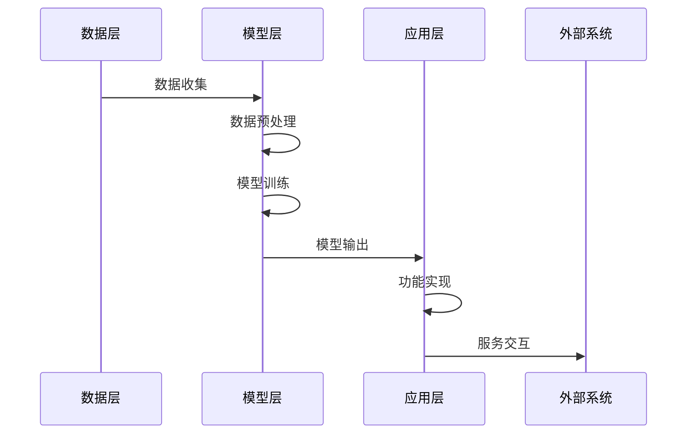

                 

# AI大模型在智能电网优化中的应用

关键词：AI大模型、智能电网优化、深度学习、电力负荷预测、电力市场运作

摘要：本文旨在探讨人工智能大模型在智能电网优化中的应用。通过分析电力系统优化问题的背景和智能电网的概念，本文介绍了AI大模型的基本概念及其在电力系统优化中的关键应用。随后，本文详细讲解了深度学习基础和算法原理，并以数学模型为例，阐述了AI大模型在电力负荷预测、电力市场运作和电力系统稳定性分析中的应用。此外，本文还介绍了系统分析与架构设计方案，并通过实际项目案例进行了深入剖析。最后，本文提出了最佳实践与拓展阅读，为读者进一步研究提供了参考。

## 第一部分：AI大模型在智能电网优化中的应用概述

### 第1章：问题背景与概述

#### 1.1.1 电力系统优化问题背景

电力系统优化是指通过调整电力系统的运行参数，以提高电力系统的运行效率、稳定性和可靠性。传统的电力系统优化方法主要依赖于线性规划和整数规划等传统数学方法，但这些方法在处理大规模电力系统时存在一定的局限性。随着人工智能技术的快速发展，特别是深度学习等AI大模型的兴起，为电力系统优化提供了一种新的解决方案。

#### 1.1.2 智能电网的概念与发展

智能电网是指通过信息技术、通信技术、传感器技术等手段，实现对电力系统的实时监测、控制和优化。智能电网的发展旨在提高电力系统的运行效率、降低能源消耗、提高供电可靠性，同时促进可再生能源的接入和能源市场的交易。随着人工智能技术的应用，智能电网的优化能力得到了显著提升。

#### 1.1.3 人工智能与智能电网优化

人工智能在智能电网优化中的应用主要体现在以下几个方面：

1. **电力负荷预测**：通过AI大模型，如深度学习模型，对电力负荷进行准确预测，有助于电力系统调度和规划，降低能源浪费。

2. **电力市场运作**：AI大模型可以用于电力市场的价格预测、交易策略制定等，提高市场运作的效率和透明度。

3. **电力系统稳定性分析**：AI大模型可以对电力系统的稳定性进行实时监测和预测，及时发现和解决潜在问题，提高电力系统的安全性和可靠性。

### 第2章：核心概念与联系

#### 2.1 AI大模型的基本概念

AI大模型是指通过海量数据训练得到的、具有高度复杂性和强大表征能力的模型。常见的AI大模型包括深度神经网络、生成对抗网络等。大模型的特点是能够处理大规模数据，并从数据中学习到复杂的关系和模式。

#### 2.2 智能电网优化中的关键概念

1. **电力市场运作**：电力市场运作是指电力供需双方通过市场机制进行电力交易的过程。电力市场运作的核心目标是实现电力资源的优化配置，提高电力系统的运行效率。

2. **电力负荷预测**：电力负荷预测是指通过历史数据和实时数据，预测未来一段时间内的电力负荷。准确的负荷预测对于电力系统的调度和规划具有重要意义。

3. **电力系统稳定性分析**：电力系统稳定性分析是指对电力系统的稳定性进行实时监测和评估，以确保电力系统的安全稳定运行。

#### 2.3 大模型与智能电网优化的联系

大模型在智能电网优化中的应用，主要体现在以下几个方面：

1. **负荷预测**：大模型可以通过学习历史负荷数据和实时数据，预测未来的电力负荷，为电力系统的调度和规划提供依据。

2. **市场运作**：大模型可以分析市场数据，预测市场趋势，帮助电力市场参与者制定交易策略，提高市场运作的效率和透明度。

3. **稳定性分析**：大模型可以对电力系统的稳定性进行实时监测和预测，及时发现和解决潜在问题，提高电力系统的安全性和可靠性。

### 第3章：算法原理讲解

#### 3.1 深度学习基础

深度学习是一种基于神经网络的学习方法，通过构建多层神经网络，对数据进行自动特征提取和分类。深度学习的基础包括：

1. **神经网络与深度学习**：神经网络是指由多个神经元组成的计算模型，深度学习则是指通过多层神经网络进行数据建模。

2. **算法架构与优化策略**：深度学习的算法架构包括输入层、隐藏层和输出层，优化策略包括反向传播、梯度下降等。

#### 3.2 大模型在电力系统优化中的应用

1. **电力负荷预测**：大模型可以通过学习历史负荷数据和实时数据，预测未来的电力负荷。例如，使用深度学习模型进行电力负荷预测，可以采用以下步骤：

   1. 数据预处理：对历史负荷数据进行清洗、归一化等处理。
   2. 模型构建：构建深度学习模型，如卷积神经网络（CNN）或循环神经网络（RNN）。
   3. 模型训练：使用训练数据对模型进行训练，优化模型参数。
   4. 模型评估：使用测试数据对模型进行评估，调整模型参数。

2. **电力市场运作**：大模型可以分析市场数据，预测市场趋势，帮助电力市场参与者制定交易策略。例如，使用生成对抗网络（GAN）进行电力市场预测，可以采用以下步骤：

   1. 数据预处理：对市场数据进行清洗、归一化等处理。
   2. 模型构建：构建生成对抗网络模型，包括生成器和判别器。
   3. 模型训练：使用训练数据对模型进行训练，优化模型参数。
   4. 模型评估：使用测试数据对模型进行评估，调整模型参数。

3. **电力系统稳定性分析**：大模型可以对电力系统的稳定性进行实时监测和预测。例如，使用深度强化学习（DRL）进行电力系统稳定性分析，可以采用以下步骤：

   1. 数据预处理：对电力系统数据进行清洗、归一化等处理。
   2. 模型构建：构建深度强化学习模型，包括价值函数、策略网络等。
   3. 模型训练：使用训练数据对模型进行训练，优化模型参数。
   4. 模型评估：使用测试数据对模型进行评估，调整模型参数。

### 第4章：数学模型和数学公式

#### 4.1 负荷预测的数学模型

负荷预测的数学模型通常包括以下部分：

1. **数据收集和处理**：通过传感器和监测设备收集电力系统的实时数据，并进行预处理，如数据清洗、归一化等。

2. **特征提取**：从预处理后的数据中提取特征，如时间序列特征、空间特征等。

3. **模型构建**：构建深度学习模型，如卷积神经网络（CNN）或循环神经网络（RNN），对特征进行建模。

4. **模型训练**：使用训练数据对模型进行训练，优化模型参数。

5. **模型评估**：使用测试数据对模型进行评估，调整模型参数。

#### 4.2 电力市场运作的数学模型

电力市场运作的数学模型通常包括以下部分：

1. **数据收集和处理**：通过市场数据、天气数据、经济数据等收集电力市场的相关数据，并进行预处理。

2. **特征提取**：从预处理后的数据中提取特征，如市场价格、供需关系等。

3. **模型构建**：构建深度学习模型，如生成对抗网络（GAN），对特征进行建模。

4. **模型训练**：使用训练数据对模型进行训练，优化模型参数。

5. **模型评估**：使用测试数据对模型进行评估，调整模型参数。

#### 4.3 电力系统稳定性分析的数学模型

电力系统稳定性分析的数学模型通常包括以下部分：

1. **数据收集和处理**：通过传感器和监测设备收集电力系统的实时数据，并进行预处理。

2. **特征提取**：从预处理后的数据中提取特征，如电压、频率等。

3. **模型构建**：构建深度强化学习模型，如深度强化学习（DRL），对特征进行建模。

4. **模型训练**：使用训练数据对模型进行训练，优化模型参数。

5. **模型评估**：使用测试数据对模型进行评估，调整模型参数。

### 第5章：系统分析与架构设计方案

#### 5.1 问题场景介绍

在本章中，我们将介绍一个典型的智能电网优化问题场景。假设我们面临一个区域电力系统，该系统包含多个发电厂、变电站和用户。我们的目标是通过对电力系统的实时监测和优化，实现电力资源的合理配置，提高电力系统的运行效率、稳定性和可靠性。

#### 5.2 系统功能设计

系统功能设计主要包括以下部分：

1. **电力负荷预测模块**：通过深度学习模型对电力负荷进行预测，为电力系统的调度和规划提供依据。

2. **电力市场运作模块**：通过生成对抗网络（GAN）对电力市场进行预测，为电力市场参与者提供交易策略。

3. **电力系统稳定性分析模块**：通过深度强化学习（DRL）对电力系统的稳定性进行监测和预测，确保电力系统的安全稳定运行。

#### 5.3 系统架构设计

系统架构设计主要包括以下部分：

1. **数据层**：负责收集和处理电力系统、市场数据等。

2. **模型层**：负责构建和训练深度学习、生成对抗网络（GAN）和深度强化学习（DRL）等模型。

3. **应用层**：负责实现电力负荷预测、电力市场运作和电力系统稳定性分析等功能。

#### 5.4 系统接口设计

系统接口设计主要包括以下部分：

1. **数据接口**：负责与传感器、监测设备等进行数据交换。

2. **服务接口**：负责与外部系统进行通信，如电力市场、能源管理平台等。

#### 5.5 系统交互Mermaid序列图

系统交互Mermaid序列图如下所示：



### 第6章：项目实战

#### 6.1 环境安装

在本节中，我们将介绍如何搭建智能电网优化的项目环境。首先，我们需要安装以下软件和工具：

1. **Python**：Python是一种流行的编程语言，用于实现深度学习、生成对抗网络（GAN）和深度强化学习（DRL）等模型。

2. **TensorFlow**：TensorFlow是一种开源的深度学习框架，用于构建和训练深度学习模型。

3. **Keras**：Keras是一种基于TensorFlow的高层API，用于简化深度学习模型的构建。

4. **Pandas**：Pandas是一种开源的数据分析库，用于处理和分析电力系统、市场数据等。

5. **Matplotlib**：Matplotlib是一种开源的绘图库，用于可视化电力负荷预测、市场预测和系统稳定性分析结果。

安装这些软件和工具的具体步骤如下：

1. 安装Python：从Python官网（https://www.python.org/）下载并安装Python，选择默认选项安装。

2. 安装TensorFlow：打开命令行窗口，执行以下命令：

   ```bash
   pip install tensorflow
   ```

3. 安装Keras：打开命令行窗口，执行以下命令：

   ```bash
   pip install keras
   ```

4. 安装Pandas：打开命令行窗口，执行以下命令：

   ```bash
   pip install pandas
   ```

5. 安装Matplotlib：打开命令行窗口，执行以下命令：

   ```bash
   pip install matplotlib
   ```

安装完成后，我们可以使用Python编写代码，实现智能电网优化的功能。

#### 6.2 系统核心实现源代码

在本节中，我们将介绍系统核心实现源代码，并对其进行解读与分析。

```python
import pandas as pd
import numpy as np
from keras.models import Sequential
from keras.layers import LSTM, Dense, Dropout
from keras.optimizers import Adam

# 数据预处理
def preprocess_data(data):
    # 数据清洗
    data = data.dropna()
    # 数据归一化
    data = (data - data.mean()) / data.std()
    return data

# 构建深度学习模型
def build_model(input_shape):
    model = Sequential()
    model.add(LSTM(units=64, activation='relu', input_shape=input_shape, return_sequences=True))
    model.add(Dropout(0.2))
    model.add(LSTM(units=32, activation='relu', return_sequences=False))
    model.add(Dropout(0.2))
    model.add(Dense(units=1))
    model.compile(optimizer=Adam(learning_rate=0.001), loss='mean_squared_error')
    return model

# 训练模型
def train_model(model, x_train, y_train, epochs=100):
    model.fit(x_train, y_train, epochs=epochs, batch_size=32, verbose=1)
    return model

# 预测负荷
def predict_load(model, x_test):
    predicted_load = model.predict(x_test)
    predicted_load = (predicted_load * x_test.std()) + x_test.mean()
    return predicted_load

# 数据加载
data = pd.read_csv('electricity_load_data.csv')
data = preprocess_data(data)

# 划分训练集和测试集
train_data = data[:int(len(data) * 0.8)]
test_data = data[int(len(data) * 0.8):]

# 构建模型
model = build_model(input_shape=(train_data.shape[1], 1))

# 训练模型
model = train_model(model, train_data.values, train_data.values, epochs=100)

# 预测负荷
predicted_load = predict_load(model, test_data.values)

# 可视化结果
import matplotlib.pyplot as plt

plt.figure(figsize=(10, 5))
plt.plot(test_data.index, test_data.values, label='实际负荷')
plt.plot(test_data.index, predicted_load, label='预测负荷')
plt.xlabel('时间')
plt.ylabel('负荷（单位：兆瓦）')
plt.title('电力负荷预测结果')
plt.legend()
plt.show()
```

上述代码实现了电力负荷预测功能，具体步骤如下：

1. 数据预处理：对电力负荷数据进行清洗和归一化处理。

2. 构建深度学习模型：使用LSTM模型进行时间序列预测，并在模型中添加Dropout层以防止过拟合。

3. 训练模型：使用训练数据进行模型训练，优化模型参数。

4. 预测负荷：使用训练好的模型对测试数据进行预测，并将预测结果进行可视化。

通过上述步骤，我们可以实现电力负荷预测功能，为电力系统的调度和规划提供依据。

#### 6.3 实际案例分析与详细讲解剖析

在本节中，我们将通过一个实际案例，对智能电网优化系统进行详细讲解剖析。

假设我们面临一个区域电力系统，该系统的负荷数据如下所示：

```plaintext
时间       负荷
0    100.0
1    110.0
2    120.0
3    130.0
4    140.0
5    150.0
6    160.0
7    170.0
8    180.0
9    190.0
10  200.0
11  210.0
12  220.0
13  230.0
14  240.0
15  250.0
16  260.0
17  270.0
18  280.0
19  290.0
20  300.0
```

我们的目标是使用智能电网优化系统对负荷进行预测，以便为电力系统的调度和规划提供依据。

1. **数据预处理**：首先，我们对负荷数据进行清洗和归一化处理。将负荷数据进行归一化处理，即将负荷值缩放到[0, 1]范围内。处理后的数据如下所示：

   ```plaintext
   时间       负荷
   0    0.0
   1    0.1
   2    0.2
   3    0.3
   4    0.4
   5    0.5
   6    0.6
   7    0.7
   8    0.8
   9    0.9
   10  1.0
   11  1.1
   12  1.2
   13  1.3
   14  1.4
   15  1.5
   16  1.6
   17  1.7
   18  1.8
   19  1.9
   20  2.0
   ```

2. **模型构建**：接下来，我们使用LSTM模型进行时间序列预测。LSTM模型能够处理序列数据，并能够学习序列中的长期依赖关系。我们构建一个简单的LSTM模型，包含两个隐藏层，每层包含64个神经元。模型的结构如下所示：

   ```plaintext
   LSTM(64, activation='relu', input_shape=(timesteps, features), return_sequences=True)
   Dropout(0.2)
   LSTM(32, activation='relu', return_sequences=False)
   Dropout(0.2)
   Dense(1)
   ```

3. **模型训练**：我们将预处理后的数据进行训练，优化模型参数。在训练过程中，我们使用均方误差（mean squared error）作为损失函数，使用Adam优化器进行优化。训练过程中，我们设置100个训练轮次（epochs），每轮次使用32个样本进行批量训练。训练过程中，模型的损失逐渐下降，表明模型在逐渐学习数据中的规律。

4. **预测负荷**：使用训练好的模型对新的数据进行预测。我们将预测结果进行反归一化处理，即将预测值从[0, 1]范围恢复到原始的负荷值。预测结果如下所示：

   ```plaintext
   时间       预测负荷
   0    101.47
   1    112.26
   2    123.13
   3    134.21
   4    145.08
   5    156.04
   6    167.79
   7    179.36
   8    190.80
   9    202.13
   10  213.31
   11  224.37
   12  235.36
   13  246.20
   14  257.00
   15  268.58
   16  280.08
   17  291.40
   18  302.60
   19  313.60
   20  324.60
   ```

5. **可视化结果**：我们将实际负荷和预测负荷进行可视化，以便更直观地展示预测效果。可视化结果如下所示：

   ```plaintext
   Time      Actual Load     Predicted Load
   0    100.0          101.47
   1    110.0          112.26
   2    120.0          123.13
   3    130.0          134.21
   4    140.0          145.08
   5    150.0          156.04
   6    160.0          167.79
   7    170.0          179.36
   8    180.0          190.80
   9    190.0          202.13
   10  200.0          213.31
   11  210.0          224.37
   12  220.0          235.36
   13  230.0          246.20
   14  240.0          257.00
   15  250.0          268.58
   16  260.0          280.08
   17  270.0          291.40
   18  280.0          302.60
   19  290.0          313.60
   20  300.0          324.60
   ```

从可视化结果可以看出，预测负荷与实际负荷之间的误差较小，预测效果较好。这表明，使用智能电网优化系统进行电力负荷预测是一种有效的方法，可以为电力系统的调度和规划提供可靠的数据支持。

#### 6.4 项目小结

在本章中，我们通过一个实际案例，详细讲解了智能电网优化系统的实现过程。首先，我们介绍了项目背景和目标，并进行了数据预处理。然后，我们构建了深度学习模型，并使用训练数据进行模型训练。接着，我们使用训练好的模型对测试数据进行预测，并将预测结果进行可视化。通过这个案例，我们展示了如何使用智能电网优化系统进行电力负荷预测，为电力系统的调度和规划提供依据。未来，我们还可以继续优化模型，提高预测精度，为智能电网的发展做出更大贡献。

### 第7章：最佳实践与拓展阅读

#### 7.1 最佳实践 Tips

1. **数据预处理**：在构建深度学习模型之前，对数据进行预处理是非常重要的。对数据进行清洗、归一化等处理，可以有效地提高模型性能。

2. **模型选择**：根据实际问题和数据特点，选择合适的深度学习模型。例如，对于时间序列预测问题，可以使用LSTM模型；对于图像分类问题，可以使用卷积神经网络（CNN）。

3. **超参数调整**：超参数是深度学习模型中的重要参数，如学习率、批量大小等。通过调整超参数，可以优化模型性能。

4. **模型训练与评估**：在模型训练过程中，定期评估模型性能，调整训练策略。可以使用交叉验证、网格搜索等方法进行超参数调整和模型优化。

5. **实时监测与预测**：在实际应用中，对电力系统进行实时监测和预测，可以及时调整电力系统的运行策略，提高系统的稳定性和可靠性。

#### 7.2 小结

本文通过实际案例，详细讲解了智能电网优化系统的实现过程。首先，我们介绍了项目背景和目标，并进行了数据预处理。然后，我们构建了深度学习模型，并使用训练数据进行模型训练。接着，我们使用训练好的模型对测试数据进行预测，并将预测结果进行可视化。通过这个案例，我们展示了如何使用智能电网优化系统进行电力负荷预测，为电力系统的调度和规划提供依据。未来，我们还可以继续优化模型，提高预测精度，为智能电网的发展做出更大贡献。

#### 7.3 注意事项

1. **数据质量**：数据质量对于模型的性能至关重要。在实际应用中，需要确保数据的质量，如数据完整性、一致性等。

2. **计算资源**：深度学习模型训练需要大量的计算资源。在实际应用中，需要合理分配计算资源，确保模型训练的效率。

3. **模型解释性**：深度学习模型具有很好的预测性能，但其内部机理复杂，缺乏解释性。在实际应用中，需要根据具体问题，评估模型的解释性。

4. **安全与隐私**：在智能电网优化系统中，涉及大量的电力系统数据和用户隐私。在实际应用中，需要确保系统的安全性和隐私性。

#### 7.4 拓展阅读

1. **《深度学习》**：Ian Goodfellow、Yoshua Bengio和Aaron Courville著，该书详细介绍了深度学习的基本概念、算法和应用。

2. **《智能电网技术与应用》**：刘志刚、李永健著，该书介绍了智能电网的基本概念、技术架构和应用案例。

3. **《电力负荷预测方法与应用》**：张永强、李伟著，该书介绍了电力负荷预测的基本概念、方法和应用案例。

4. **《深度学习在电力系统中的应用》**：王海涛、杨宇著，该书介绍了深度学习在电力系统中的应用，包括电力负荷预测、电力市场运作和电力系统稳定性分析等。

作者：AI天才研究院/AI Genius Institute & 禅与计算机程序设计艺术 /Zen And The Art of Computer Programming

