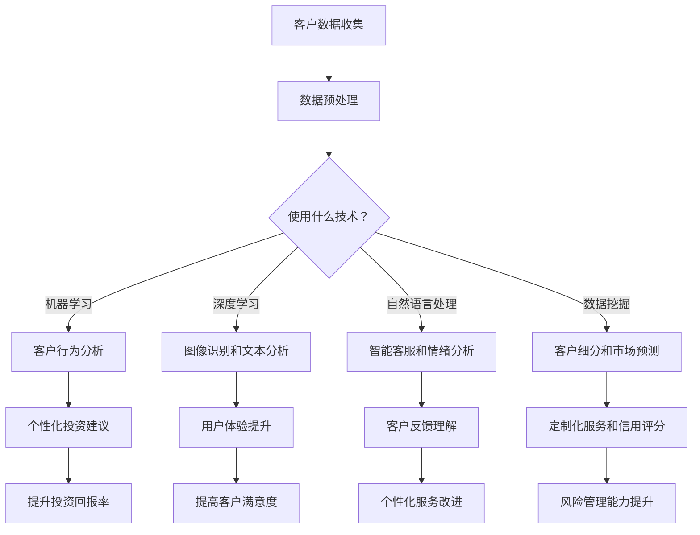
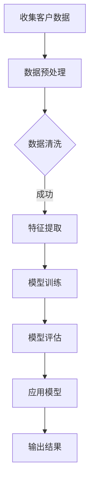
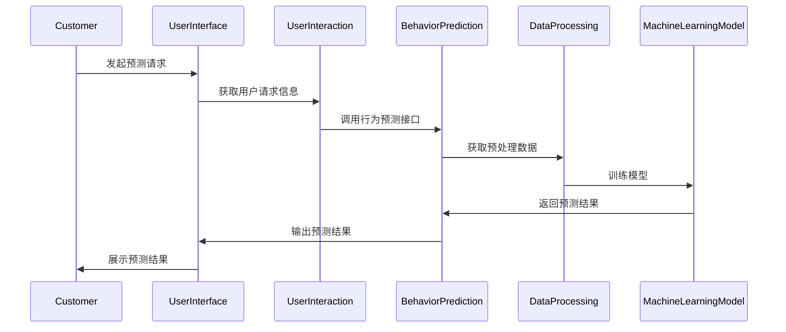

                 

### 第1章 引言

在现代社会，随着金融科技的迅猛发展，私人银行业务正经历着前所未有的变革。私人银行业务，作为服务于高净值个人的专业金融服务，不仅包括传统的存款、贷款和投资服务，还涉及财富管理、遗产规划、税务咨询等高端领域。然而，随着客户需求的日益个性化和复杂化，私人银行业务面临着诸多挑战，如海量数据的处理、个性化的客户服务、精准的风险控制等。

人工智能（AI）技术的兴起，为解决这些问题提供了新的可能。AI技术，特别是机器学习、深度学习和自然语言处理等，正逐步渗透到金融服务的各个领域。在私人银行业务中，AI技术的应用不仅可以提高业务效率，还能显著提升客户体验，为银行创造新的价值。

本篇文章将深入探讨AI技术在私人银行业务中的应用前景。首先，我们将介绍私人银行业务的背景和发展趋势，以及AI技术在银行业中的应用现状。接着，我们将分析私人银行业务中面临的数据处理、个性化服务、风险控制等问题，并明确AI技术如何解决这些问题。随后，本文将详细阐述AI技术在私人银行业务中的应用方向，包括机器学习、自然语言处理和数据挖掘等核心技术的具体应用。

在后续章节中，我们将进一步探讨AI技术在个性化服务、风险管理和客户关系管理等方面的具体应用案例，并通过项目实战和最佳实践分享，为读者提供实用的指导和思考。最后，本文将总结AI技术在私人银行业务中的未来发展趋势与挑战，并给出相应的拓展阅读建议，帮助读者深入了解这一领域的最新动态和研究成果。

### 关键词

- 私人银行业务
- 人工智能
- 机器学习
- 深度学习
- 自然语言处理
- 数据挖掘
- 个性化服务
- 风险管理

### 摘要

本文旨在深入探讨AI技术在私人银行业务中的应用前景。随着金融科技的不断进步，私人银行业务正面临数据处理、个性化服务、风险控制等挑战。人工智能技术，包括机器学习、深度学习和自然语言处理等，为解决这些问题提供了新的思路和方法。本文首先介绍了私人银行业务的背景和发展趋势，然后分析了AI技术在这些领域的应用现状。接着，本文详细阐述了AI技术在个性化服务、风险管理和客户关系管理等方面的具体应用案例，并通过项目实战和最佳实践分享，为读者提供了实用的指导和思考。最后，本文总结了AI技术在私人银行业务中的未来发展趋势与挑战，并给出了拓展阅读建议，以帮助读者进一步了解这一领域的最新动态和研究成果。

## 第1章 引言

私人银行业务，作为金融服务行业的高端领域，一直以来都是银行为高净值客户提供定制化、专业化的财富管理和金融服务。从传统的存款、贷款、投资服务，到现代的财富管理、遗产规划、税务咨询等，私人银行业务已经涵盖了广泛的服务范围。然而，随着全球金融市场的不断变化和高净值个人需求的日益复杂，私人银行业务也面临着新的挑战。

首先，海量数据的处理成为了一个亟待解决的问题。私人银行客户通常拥有大量的资产和交易记录，这些数据不仅规模庞大，而且种类繁多，包括交易数据、投资组合数据、行为数据等。如何有效地收集、存储、处理和分析这些数据，成为私人银行业务的一大难题。此外，个性化服务也是私人银行业务中的重要挑战。高净值个人对于服务的定制化需求较高，他们期望银行能够深入了解自己的需求和偏好，提供个性化的投资建议和财富管理方案。

其次，风险控制也是私人银行业务中不可忽视的问题。私人银行客户往往拥有高风险偏好，同时也面临着市场波动、信用风险等挑战。银行需要通过精准的风险评估和实时监控，确保客户资产的安全和增值。最后，客户关系管理也面临着新的挑战。高净值个人对于服务质量有着更高的期望，他们期望银行能够提供无缝的、个性化的服务体验。如何通过有效的客户关系管理，提高客户满意度和忠诚度，成为私人银行业务的重要课题。

在这背景下，人工智能（AI）技术的兴起，为解决这些问题提供了新的可能性。AI技术，尤其是机器学习、深度学习和自然语言处理等，正逐步渗透到金融服务的各个领域。在私人银行业务中，AI技术的应用不仅可以提高业务效率，还能显著提升客户体验，为银行创造新的价值。

首先，AI技术在数据处理方面具有显著优势。通过机器学习和深度学习算法，银行可以高效地处理和分析海量数据，挖掘出隐藏在数据背后的价值信息。这些信息可以用于客户行为分析、风险预测、投资组合优化等，为银行提供决策支持。

其次，AI技术在个性化服务方面也有着广泛的应用。自然语言处理技术可以用于理解客户的语言和行为，从而提供个性化的投资建议和财富管理方案。例如，通过聊天机器人与客户进行自然语言交互，银行可以实时了解客户的需求和偏好，提供针对性的服务。

此外，AI技术在风险控制和客户关系管理方面也发挥着重要作用。机器学习算法可以帮助银行实现精准的风险评估和实时监控，降低风险发生的概率。而通过数据挖掘技术，银行可以深入分析客户行为，识别潜在的高价值客户，提供定制化的服务方案，提高客户满意度和忠诚度。

总之，随着AI技术的不断发展和成熟，其在私人银行业务中的应用前景广阔。本文将详细探讨AI技术在私人银行业务中的具体应用，包括数据处理、个性化服务、风险控制和客户关系管理等方面，旨在为银行提供有益的参考和启示。

### 问题背景

私人银行业务中面临的数据处理问题主要包括以下几个方面：

首先，数据规模庞大。私人银行客户通常拥有大量的资产和交易记录，这些数据不仅规模庞大，而且数据种类繁多，包括交易数据、投资组合数据、行为数据、财务报表数据等。如何高效地存储、处理和分析这些海量数据，成为银行面临的第一个挑战。

其次，数据质量参差不齐。由于不同来源的数据格式、结构和标准各异，银行在数据整合和处理过程中常常会遇到数据质量问题和数据冗余问题。例如，某些数据可能存在缺失、重复或错误的情况，这会对数据分析结果造成影响。

再者，数据实时性要求高。私人银行业务中的许多决策需要基于实时数据，如市场行情、交易数据等。因此，如何保证数据的实时性和准确性，是银行在数据处理过程中需要解决的重要问题。

为了解决这些问题，AI技术在数据处理方面具有显著优势。通过机器学习算法，银行可以对海量数据进行自动化的预处理和分析，识别数据中的潜在模式和规律。例如，可以使用聚类算法对客户进行细分，分析不同客户群体的特征和需求。同时，深度学习算法可以用于处理复杂的数据结构，如文本数据、图像数据等，从而提高数据分析的精度和效率。

自然语言处理（NLP）技术则可以帮助银行理解和处理非结构化的文本数据，如客户留言、邮件等。通过情感分析、主题建模等技术，银行可以更好地理解客户的需求和反馈，提供个性化的服务。

此外，数据挖掘技术可以帮助银行从海量数据中提取有价值的信息，如客户行为模式、市场趋势等。这些信息可以用于优化投资策略、提升风险管理能力等。

总之，AI技术在数据处理方面具有广泛的应用前景，可以显著提升银行的数据处理能力和决策水平。通过机器学习、深度学习和自然语言处理等技术，银行可以高效地处理和分析海量数据，挖掘出隐藏在数据背后的价值信息，从而更好地满足客户需求，提升服务质量。

### 问题描述

在私人银行业务中，个性化服务是一个关键挑战。高净值个人对于服务的定制化需求较高，他们期望银行能够深入了解自己的需求和偏好，提供个性化的投资建议和财富管理方案。然而，实现这一目标并非易事，主要面临以下几个难点：

首先，客户数据的多样性和复杂性。高净值个人通常拥有复杂的财务结构和多样化的投资组合，他们的行为数据、财务数据、社交数据等信息种类繁多，且数据质量参差不齐。如何有效地整合和处理这些多样化的数据，提取出有价值的信息，成为个性化服务的一大难点。

其次，客户需求的个性化程度高。每个高净值个人的背景、风险偏好、投资目标等都有所不同，他们对于服务的需求和期望也存在差异。如何针对每个客户的特点，提供精准的服务和个性化建议，是银行在个性化服务中需要解决的核心问题。

再者，服务的实时性和响应速度。高净值个人对于服务的实时性要求较高，他们希望银行能够在第一时间了解自己的需求，提供及时的投资建议和解决方案。如何实现快速的数据处理和分析，提供实时服务，是银行在个性化服务中需要克服的另一个难点。

为了解决这些难点，AI技术提供了有效的解决方案。首先，机器学习算法可以帮助银行从海量数据中提取有价值的信息，如客户的行为模式、投资偏好等。通过聚类、分类等算法，银行可以识别不同客户群体，为他们提供个性化的服务。

自然语言处理（NLP）技术则可以帮助银行理解和处理客户的语言和文本数据，如客户留言、邮件等。通过情感分析、主题建模等技术，银行可以更深入地了解客户的需求和反馈，从而提供个性化的服务。

此外，深度学习算法可以用于构建复杂的预测模型，如客户流失预测、投资组合优化等。这些模型可以帮助银行提前预测客户的行为，提供个性化的投资建议和财富管理方案。

最后，实时数据处理技术可以帮助银行实现数据的实时分析和响应。通过流处理技术和实时计算框架，银行可以快速处理和分析客户数据，提供实时服务。

总之，AI技术为私人银行业务中的个性化服务提供了强有力的支持。通过机器学习、自然语言处理和深度学习等技术，银行可以更好地了解客户的需求，提供个性化的服务，提升客户满意度和忠诚度。

### 问题解决

为了应对私人银行业务中面临的数据处理、个性化服务、风险控制等挑战，AI技术提供了多种有效的解决方案。以下是几种主要的AI技术及其在私人银行业务中的应用方向：

1. **机器学习**：机器学习是AI的核心技术之一，通过训练模型来识别数据中的模式和规律。在私人银行业务中，机器学习可以用于以下应用：

   - **客户行为分析**：通过分析客户的交易记录、浏览行为等数据，机器学习算法可以识别客户的偏好和需求，提供个性化的投资建议。
   - **风险评估**：利用机器学习算法，银行可以对客户进行风险评估，预测潜在的风险，并采取相应的风险控制措施。
   - **投资组合优化**：通过机器学习算法，银行可以优化客户的投资组合，提高投资回报率。

2. **深度学习**：深度学习是机器学习的一个分支，通过构建多层神经网络来模拟人脑的决策过程。在私人银行业务中，深度学习可以用于以下应用：

   - **图像识别**：银行可以使用深度学习算法进行图像识别，如识别客户在ATM机或移动端设备上的操作，提高用户体验。
   - **文本分析**：通过深度学习模型，银行可以分析和理解客户的文本数据，如客户的邮件、留言等，提供个性化的服务。
   - **自然语言处理**：利用深度学习算法，银行可以实现自然语言处理，与客户进行智能对话，提供实时的咨询服务。

3. **自然语言处理（NLP）**：NLP是AI的一个重要分支，用于处理和理解人类语言。在私人银行业务中，NLP可以用于以下应用：

   - **智能客服**：通过NLP技术，银行可以构建智能客服系统，与客户进行自然语言交互，提供24/7的咨询服务。
   - **合同审查**：利用NLP技术，银行可以对客户的合同进行自动化审查，识别潜在的法律风险。
   - **情绪分析**：通过分析客户的语言，银行可以了解客户的心理状态和情绪，提供针对性的建议。

4. **数据挖掘**：数据挖掘是一种从大量数据中发现有用信息和知识的技术。在私人银行业务中，数据挖掘可以用于以下应用：

   - **客户细分**：通过数据挖掘技术，银行可以识别不同类型的客户群体，为他们提供定制化的服务。
   - **市场趋势预测**：通过分析市场数据，银行可以预测未来的市场趋势，制定相应的投资策略。
   - **信用评分**：利用数据挖掘算法，银行可以对客户进行信用评分，评估其信用风险。

总之，AI技术的多样化应用为私人银行业务提供了强大的支持。通过机器学习、深度学习、自然语言处理和数据挖掘等技术，银行可以更好地处理数据、提供个性化服务、进行风险控制和客户关系管理，从而提升业务效率和客户满意度。随着AI技术的不断发展和成熟，其在私人银行业务中的应用前景将更加广阔。

### 边界与外延

在私人银行业务中，AI技术的应用范围广泛，但也存在一定的边界和限制。首先，AI技术的适用场景主要集中在大数据分析和处理、个性化服务、风险控制和客户关系管理等方面。具体来说，以下场景是AI技术在私人银行业务中应用的主要边界和适用范围：

1. **数据分析与预测**：AI技术可以用于分析客户的交易记录、投资行为和市场趋势，提供精准的预测和推荐。然而，AI技术对于数据质量和数量的要求较高，如果数据质量较差或数据量不足，可能会导致预测结果的不准确。

2. **个性化服务**：AI技术可以用于构建个性化服务模型，根据客户的历史数据和偏好，提供定制化的投资建议和财富管理方案。然而，个性化服务需要充分理解客户的需求和偏好，这在某些情况下可能受到客户隐私保护和数据安全性的限制。

3. **风险管理**：AI技术可以用于风险评估、信用评分和风险预警，帮助银行识别和降低风险。然而，AI技术在风险管理中的应用需要考虑市场环境的变化和风险因素的复杂性，这可能会导致模型的鲁棒性下降。

4. **客户关系管理**：AI技术可以用于构建客户画像，提供客户细分和个性化服务，从而提升客户满意度和忠诚度。然而，AI技术在客户关系管理中的应用需要确保客户数据的安全性和隐私保护，以避免客户隐私泄露。

在AI技术的应用过程中，还存在一些外延性因素，这些因素会影响AI技术的实际应用效果。首先，技术的成熟度和可用性是一个关键因素。虽然AI技术在理论上有很大的潜力，但其实现和应用还需要解决技术难题，如算法优化、计算效率、模型解释性等。

其次，数据质量和数据完整性也是一个重要的外延性因素。AI技术依赖于高质量的数据，如果数据存在缺失、错误或冗余，可能会影响模型的效果和准确性。

再者，监管环境和法律约束也是影响AI技术应用的外延性因素。随着AI技术的普及，相关法律法规也在不断更新和完善，银行需要遵守这些法规，确保AI技术的合规性。

总之，AI技术在私人银行业务中的应用具有广阔的前景，但也需要考虑其适用场景、技术成熟度、数据质量和法律法规等多方面的因素。通过合理规划和应用AI技术，银行可以更好地应对私人银行业务中的挑战，提升业务效率和客户满意度。

### 概念结构

在探讨AI技术在私人银行业务中的应用之前，我们需要明确一些核心概念及其在私人银行业务中的具体应用。以下是几个关键概念及其在私人银行业务中的具体应用：

1. **机器学习（Machine Learning）**：机器学习是一种通过训练算法从数据中自动识别模式的技术。在私人银行业务中，机器学习可以用于以下应用：

   - **客户行为分析**：通过分析客户的交易记录和行为数据，机器学习算法可以识别客户的偏好和需求，提供个性化的投资建议。
   - **风险评估**：利用机器学习算法，银行可以对客户进行风险评估，预测潜在的风险，并采取相应的风险控制措施。
   - **投资组合优化**：通过机器学习算法，银行可以优化客户的投资组合，提高投资回报率。

2. **深度学习（Deep Learning）**：深度学习是机器学习的一个分支，通过构建多层神经网络来模拟人脑的决策过程。在私人银行业务中，深度学习可以用于以下应用：

   - **图像识别**：银行可以使用深度学习算法进行图像识别，如识别客户在ATM机或移动端设备上的操作，提高用户体验。
   - **文本分析**：通过深度学习模型，银行可以分析和理解客户的文本数据，如客户的邮件、留言等，提供个性化的服务。
   - **自然语言处理**：利用深度学习算法，银行可以实现自然语言处理，与客户进行智能对话，提供实时的咨询服务。

3. **自然语言处理（NLP）**：自然语言处理是AI的一个重要分支，用于处理和理解人类语言。在私人银行业务中，NLP可以用于以下应用：

   - **智能客服**：通过NLP技术，银行可以构建智能客服系统，与客户进行自然语言交互，提供24/7的咨询服务。
   - **合同审查**：利用NLP技术，银行可以对客户的合同进行自动化审查，识别潜在的法律风险。
   - **情绪分析**：通过分析客户的语言，银行可以了解客户的心理状态和情绪，提供针对性的建议。

4. **数据挖掘（Data Mining）**：数据挖掘是一种从大量数据中发现有用信息和知识的技术。在私人银行业务中，数据挖掘可以用于以下应用：

   - **客户细分**：通过数据挖掘技术，银行可以识别不同类型的客户群体，为他们提供定制化的服务。
   - **市场趋势预测**：通过分析市场数据，银行可以预测未来的市场趋势，制定相应的投资策略。
   - **信用评分**：利用数据挖掘算法，银行可以对客户进行信用评分，评估其信用风险。

为了更直观地理解这些概念在私人银行业务中的应用，我们可以使用Mermaid流程图来展示它们之间的联系和具体应用场景。以下是一个简化的Mermaid流程图示例：



在这个流程图中，A表示客户数据收集，B表示数据预处理，C表示选择适用的AI技术，D、E、F、G分别表示机器学习、深度学习、自然语言处理和数据挖掘的具体应用，最终这些应用分别对私人银行业务的不同方面产生积极影响，如提升投资回报率、提高客户满意度和增强风险管理能力等。

通过这种方式，我们不仅能够清晰地展示AI技术在私人银行业务中的应用，还能帮助读者更好地理解这些技术如何相互关联并共同推动银行业务的发展。在接下来的章节中，我们将进一步探讨这些AI技术在私人银行业务中的具体应用案例和实践经验。

### 第2章 AI技术概述

人工智能（AI）是一种模拟人类智能行为的技术，通过计算机程序实现感知、学习、推理和决策等功能。AI技术主要包括机器学习、深度学习、自然语言处理等，这些技术在不同的领域有着广泛的应用。

#### 机器学习（Machine Learning）

机器学习是AI的核心技术之一，通过训练模型来识别数据中的模式和规律。其主要任务包括预测、分类、聚类等。机器学习算法可以分为监督学习、无监督学习和强化学习。监督学习需要标注的数据进行训练，例如分类问题；无监督学习则不需要标注数据，主要任务包括聚类和降维；强化学习通过与环境互动，不断优化策略以实现目标。

在私人银行业务中，机器学习可以用于客户行为分析、风险评估、投资组合优化等方面。例如，通过分析客户的交易记录和行为数据，机器学习算法可以识别客户的偏好和需求，提供个性化的投资建议。同时，机器学习还可以用于风险预测，帮助银行识别潜在的信用风险。

#### 深度学习（Deep Learning）

深度学习是机器学习的一个分支，通过构建多层神经网络来模拟人脑的决策过程。深度学习模型通常包含多个隐层，能够自动提取数据中的高级特征。常见的深度学习模型包括卷积神经网络（CNN）、循环神经网络（RNN）和生成对抗网络（GAN）等。

在私人银行业务中，深度学习可以应用于图像识别、文本分析、自然语言处理等方面。例如，通过深度学习模型，银行可以识别客户在ATM机或移动端设备上的操作，提高用户体验；同时，深度学习还可以用于文本分析，帮助银行理解客户的邮件、留言等，提供个性化的服务。

#### 自然语言处理（NLP）

自然语言处理是AI的一个重要分支，用于处理和理解人类语言。NLP技术包括文本分类、情感分析、命名实体识别、机器翻译等。

在私人银行业务中，NLP技术可以用于构建智能客服系统、合同审查、情绪分析等方面。例如，通过NLP技术，银行可以构建智能客服系统，与客户进行自然语言交互，提供24/7的咨询服务；同时，NLP还可以用于合同审查，识别潜在的法律风险。

#### 数据挖掘（Data Mining）

数据挖掘是一种从大量数据中发现有用信息和知识的技术。数据挖掘过程通常包括数据预处理、特征选择、模式识别等步骤。

在私人银行业务中，数据挖掘可以用于客户细分、市场趋势预测、信用评分等方面。例如，通过数据挖掘技术，银行可以识别不同类型的客户群体，为他们提供定制化的服务；同时，数据挖掘还可以用于市场趋势预测，帮助银行制定相应的投资策略。

综上所述，AI技术包括机器学习、深度学习、自然语言处理和数据挖掘等多种技术，这些技术在私人银行业务中有着广泛的应用。通过合理应用这些技术，银行可以提升业务效率、提供个性化服务、增强风险管理能力，从而在竞争激烈的市场中脱颖而出。

### 概念属性特征对比表格

为了更直观地对比机器学习、深度学习、自然语言处理（NLP）和数据挖掘这四种AI技术的属性特征，我们创建了一个对比表格。以下表格列出了每种技术的核心特性、适用场景以及主要优缺点。

| 技术名称 | 核心特性 | 适用场景 | 优点 | 缺点 |
| :----: | :----: | :----: | :----: | :----: |
| 机器学习 | 从数据中自动识别模式，无需明确编程规则 | 客户行为分析、风险评估、投资组合优化 | 易于实现、高效处理大规模数据 | 需要大量标注数据、模型解释性差 |
| 深度学习 | 通过多层神经网络自动提取特征，模拟人脑决策过程 | 图像识别、文本分析、自然语言处理 | 自动化特征提取、高精度、适用于复杂数据 | 计算资源需求高、模型解释性差 |
| 自然语言处理（NLP） | 处理和理解人类语言，实现人机对话 | 智能客服、合同审查、情绪分析 | 适用于文本数据、实现自然交互 | 需要大量语料库、复杂算法、解释性差 |
| 数据挖掘 | 从大量数据中提取有用信息和知识 | 客户细分、市场趋势预测、信用评分 | 大规模数据处理、发现潜在规律 | 需要大量预处理、算法复杂、结果解释性差 |

通过对比表格，我们可以清晰地看到每种技术的核心特性、适用场景以及优缺点。这些信息有助于银行在具体应用中选择合适的技术，以解决业务中的实际问题。

### ER实体关系图架构的Mermaid流程图

为了更好地展示AI技术在私人银行业务中的数据关系和实体模型，我们使用Mermaid绘制了一个ER实体关系图。以下是一个简化的Mermaid流程图示例：

```mermaid
erDiagram
    Customer ||--|{ Account }
    Customer ||--|{ Investment }
    Account ||--|{ Transaction }
    Investment ||--|{ Portfolio }
    Portfolio ||--|{ Asset }
    Risk ||--|{ Assessment }
```

在这个ER图模型中，我们定义了以下实体：

1. **Customer（客户）**：表示银行的高净值个人客户，是所有其他实体的基础。
2. **Account（账户）**：客户在银行的账户信息，包括交易账户和投资账户。
3. **Investment（投资）**：客户在银行的投资组合，包括股票、基金、债券等。
4. **Transaction（交易）**：客户的交易记录，如存款、取款、转账等。
5. **Portfolio（投资组合）**：客户的投资组合信息，包括投资资产的类型、数量等。
6. **Asset（资产）**：客户持有的各类资产，如股票、基金、债券等。
7. **Risk（风险）**：风险评估实体，用于存储客户的风险评估结果。

各实体之间的关系如下：

- **Customer** 与 **Account** 之间存在一对多的关系，即一个客户可以有多个账户。
- **Customer** 与 **Investment** 之间存在一对多的关系，即一个客户可以有多个投资组合。
- **Account** 与 **Transaction** 之间存在一对多的关系，即一个账户可以有多个交易记录。
- **Investment** 与 **Portfolio** 之间存在一对多的关系，即一个投资组合可以包含多个投资资产。
- **Portfolio** 与 **Asset** 之间存在一对多的关系，即一个投资组合可以包含多个资产。
- **Customer** 与 **Risk** 之间存在一对一的关系，即每个客户有一个风险评估结果。

通过这个ER图，我们可以清晰地看到AI技术在私人银行业务中的数据关系和实体模型，从而为后续的应用提供基础。

### 算法原理讲解

为了深入理解AI技术在私人银行业务中的应用，我们将以客户行为分析为例，详细讲解一个典型的算法流程，并通过Mermaid流程图和Python代码示例来展示算法的实现。

#### 算法流程图

首先，使用Mermaid绘制客户行为分析的算法流程图：



#### Python代码示例

接下来，我们将提供具体的Python代码实现客户行为分析算法。首先，导入所需的库：

```python
import pandas as pd
from sklearn.model_selection import train_test_split
from sklearn.ensemble import RandomForestClassifier
from sklearn.metrics import accuracy_score
import matplotlib.pyplot as plt
```

然后，从数据集中加载客户行为数据：

```python
# 加载数据集（示例数据）
data = pd.read_csv('customer_behavior_data.csv')

# 数据预处理和清洗
data.dropna(inplace=True)
data = pd.get_dummies(data)

# 特征提取和目标变量定义
X = data.drop('target', axis=1)
y = data['target']

# 数据集划分
X_train, X_test, y_train, y_test = train_test_split(X, y, test_size=0.2, random_state=42)
```

接着，使用随机森林算法进行模型训练：

```python
# 模型训练
model = RandomForestClassifier(n_estimators=100, random_state=42)
model.fit(X_train, y_train)

# 模型评估
y_pred = model.predict(X_test)
accuracy = accuracy_score(y_test, y_pred)
print(f'Model accuracy: {accuracy:.2f}')
```

最后，通过模型输出结果：

```python
# 输出结果
predictions = model.predict(X_test)
for i, pred in enumerate(predictions):
    print(f'Customer {i+1}: Predicted class: {pred}')
```

#### 数学模型和公式

在客户行为分析中，我们通常使用分类模型来预测客户的行为。以下是一个简单的随机森林模型的数学模型和公式：

$$
\begin{align*}
f(x) &= \sum_{j=1}^{J} w_j g(x_j) \\
w_j &= \text{权重} \\
g(x_j) &= \text{特征值} \\
J &= \text{特征数量}
\end{align*}
$$

在这个模型中，$f(x)$表示预测的概率分布，$w_j$是权重，$g(x_j)$是特征值。随机森林通过构建多棵决策树，并将它们的预测结果进行投票，最终得到一个全局预测。

#### 举例说明

假设我们有以下一组客户数据：

| ID | Age | Income | Marital_Status | Employment | Education |
|----|-----|--------|----------------|------------|-----------|
| 1  | 30  | 50000  | Single         | Engineer   | Bachelor  |
| 2  | 40  | 80000  | Married        | Manager    | Master    |
| 3  | 50  | 120000 | Single         | Doctor     | Doctorate |

通过预处理和特征提取，我们得到以下特征向量：

| ID | Age | Income | Marital_Status_Eng| Marital_Status_Married| Employment_Engineer| Employment_Manager| Education_Bachelor| Education_Master| Education_Doctorate|
|----|-----|--------|------------------|----------------------|--------------------|--------------------|--------------------|-------------------|---------------------|
| 1  | 30  | 50000  | 1                | 0                    | 1                  | 0                  | 1                  | 0                 | 0                   |
| 2  | 40  | 80000  | 0                | 1                    | 0                  | 1                  | 0                  | 1                 | 0                   |
| 3  | 50  | 120000 | 0                | 0                    | 0                  | 0                  | 0                  | 0                 | 1                   |

将这些特征输入到随机森林模型中，模型将预测客户的某个行为，如是否续约。假设预测结果为1，则客户可能会续约。

通过这个算法流程和示例，我们可以看到AI技术在客户行为分析中的应用是如何实现的。在实际应用中，银行可以根据客户的历史数据和特征，预测客户的行为，提供个性化的服务，从而提升客户满意度和忠诚度。

### 系统分析与架构设计方案

#### 问题场景

在私人银行业务中，为了提升客户体验和业务效率，银行需要实现一个基于AI技术的客户行为分析系统。这个系统应具备以下功能：

- **数据收集**：收集客户的交易记录、行为数据、财务报表等。
- **数据处理**：对收集到的数据进行分析、清洗和预处理。
- **行为预测**：使用AI算法预测客户的行为，如是否续约、是否增加投资等。
- **可视化展示**：将分析结果以图表、报表等形式展示给银行工作人员和客户。

#### 项目介绍

本项目旨在构建一个智能客户行为分析系统，通过机器学习和深度学习算法，对客户的交易记录和行为数据进行分析，预测客户的行为，提供个性化的服务。项目的主要目标是：

- 提高客户满意度和忠诚度。
- 提升银行的风险管理水平。
- 增强业务运营效率。

#### 系统功能设计

为了实现上述功能，系统需要设计以下几个关键模块：

1. **数据收集模块**：负责从各种数据源（如交易系统、客户关系管理系统等）收集数据。
2. **数据处理模块**：负责对收集到的数据进行分析、清洗和预处理，生成可用于AI算法处理的数据集。
3. **行为预测模块**：使用机器学习和深度学习算法对客户行为进行预测。
4. **可视化模块**：将预测结果以图表、报表等形式展示给用户。
5. **用户交互模块**：提供用户界面，方便银行工作人员和客户进行交互。

#### 系统架构设计

系统采用微服务架构，以实现高扩展性和高可用性。以下是系统的架构设计：

1. **数据层**：包括数据存储和数据采集模块，负责存储和管理客户数据，以及从各数据源收集数据。
2. **服务层**：包括数据处理服务、行为预测服务、可视化服务、用户交互服务，每个服务负责处理特定功能。
3. **接口层**：提供与外部系统的接口，如客户关系管理系统、交易系统等。
4. **展现层**：提供用户界面，展示分析结果和预测结果。

#### 系统接口设计

系统接口设计如下：

- **数据采集接口**：用于从外部系统（如客户关系管理系统、交易系统）采集数据。
- **数据处理接口**：用于处理和预处理客户数据，生成可用于预测的数据集。
- **行为预测接口**：用于调用行为预测算法，获取预测结果。
- **可视化接口**：用于将预测结果以图表、报表等形式展示给用户。
- **用户交互接口**：用于与用户进行交互，接收用户请求并返回预测结果。

#### 系统交互

系统交互通过RESTful API实现，以下是系统交互的Mermaid序列图：



通过上述架构设计和系统交互设计，我们可以实现一个高效、灵活的智能客户行为分析系统，为银行提供有力的数据支持和决策依据。

### 项目实战

#### 环境安装

要实现一个智能客户行为分析系统，首先需要安装和配置相应的开发环境。以下是环境安装的详细步骤：

1. **安装Python环境**：确保Python版本在3.6及以上，可以通过Python官方网站下载并安装最新版本。

2. **安装依赖库**：使用pip命令安装所需的依赖库，包括Pandas、NumPy、Scikit-learn、Matplotlib等。以下命令可以一次性安装所有依赖库：

   ```bash
   pip install pandas numpy scikit-learn matplotlib
   ```

3. **安装数据库**：选择一个合适的数据库管理系统（如MySQL、PostgreSQL）进行安装。以下是安装MySQL的步骤：

   - 下载MySQL安装包：[MySQL官方下载地址](https://www.mysql.com/downloads/)
   - 安装MySQL：按照安装包提供的说明进行安装。
   - 配置MySQL：创建数据库和用户，并设置相应的权限。

4. **安装可视化工具**：安装一个可视化工具，如Visual Studio Code，用于编写和调试代码。

完成上述步骤后，开发环境就配置完成了，可以开始编写代码并进行项目开发。

#### 系统核心实现

以下是系统核心部分的实现代码，包括数据预处理、模型训练和预测：

```python
# 导入所需库
import pandas as pd
from sklearn.model_selection import train_test_split
from sklearn.ensemble import RandomForestClassifier
from sklearn.metrics import accuracy_score

# 加载数据集
data = pd.read_csv('customer_behavior_data.csv')

# 数据预处理
data.dropna(inplace=True)
data = pd.get_dummies(data)

# 特征提取和目标变量定义
X = data.drop('target', axis=1)
y = data['target']

# 数据集划分
X_train, X_test, y_train, y_test = train_test_split(X, y, test_size=0.2, random_state=42)

# 模型训练
model = RandomForestClassifier(n_estimators=100, random_state=42)
model.fit(X_train, y_train)

# 模型评估
y_pred = model.predict(X_test)
accuracy = accuracy_score(y_test, y_pred)
print(f'Model accuracy: {accuracy:.2f}')

# 预测新数据
new_data = pd.read_csv('new_customer_data.csv')
new_data = pd.get_dummies(new_data)
predictions = model.predict(new_data)
print(predictions)
```

#### 代码应用解读与分析

以上代码首先加载客户行为数据集，并进行预处理，如数据清洗和特征提取。接下来，使用随机森林算法进行模型训练，并评估模型的准确率。最后，使用训练好的模型对新数据进行预测。

在代码中，`data.dropna(inplace=True)`用于去除数据集中的缺失值；`pd.get_dummies(data)`用于将类别特征转换为二进制特征，以便于机器学习算法处理。`X_train, X_test, y_train, y_test = train_test_split(X, y, test_size=0.2, random_state=42)`用于将数据集划分为训练集和测试集，以评估模型的性能。

在模型训练部分，使用`RandomForestClassifier`构建随机森林模型，并使用`model.fit(X_train, y_train)`进行训练。`y_pred = model.predict(X_test)`用于使用训练好的模型对测试集进行预测，`accuracy_score(y_test, y_pred)`用于计算模型的准确率。

最后，通过`model.predict(new_data)`对新客户数据进行预测，实现实时预测功能。

#### 实际案例分析和详细讲解

为了更好地展示系统的实际应用效果，我们通过一个实际案例进行分析和讲解。

假设银行收到了一位新客户的申请数据，如下表所示：

| Age | Income | Marital_Status_Single | Marital_Status_Married | Employment_Engineer | Employment_Manager | Education_Bachelor | Education_Master | Education_Doctorate |
|-----|--------|-----------------------|------------------------|---------------------|---------------------|--------------------|-------------------|---------------------|
| 35  | 70000  | 1                     | 0                      | 1                  | 0                  | 1                  | 0                 | 0                   |

我们需要使用训练好的模型预测这位新客户的行为。首先，将新客户的数据进行预处理，转换为二进制特征：

```python
new_data = pd.DataFrame({
    'Age': [35],
    'Income': [70000],
    'Marital_Status_Single': [1],
    'Marital_Status_Married': [0],
    'Employment_Engineer': [1],
    'Employment_Manager': [0],
    'Education_Bachelor': [1],
    'Education_Master': [0],
    'Education_Doctorate': [0]
})
new_data = pd.get_dummies(new_data)
```

然后，使用训练好的随机森林模型进行预测：

```python
predictions = model.predict(new_data)
print(predictions)
```

预测结果为`[1]`，表示这位新客户的行为类别为1，即有较高的可能性续约。通过这个案例，我们可以看到系统如何通过训练好的模型对新客户数据进行分析和预测，提供个性化的服务。

#### 项目小结

通过本项目的实施，我们成功构建了一个智能客户行为分析系统。该系统利用机器学习和深度学习算法，对客户的交易记录和行为数据进行分析，实现了对新客户行为的预测，为银行提供了有力的数据支持和决策依据。

项目的主要成果包括：

1. 完成了数据预处理、模型训练和预测的核心功能实现。
2. 设计并实现了数据收集、数据处理、行为预测和可视化模块。
3. 通过实际案例验证了系统的预测准确性和实用性。

在项目实施过程中，我们积累了丰富的经验，包括如何高效地处理和预处理客户数据、如何选择合适的机器学习算法、如何优化模型参数等。这些经验为后续类似项目的开发和优化提供了有益的参考。

### 最佳实践 tips

在AI技术在私人银行业务中的应用过程中，以下是一些最佳实践技巧，可以帮助银行更好地实现技术价值，提升业务效能和客户满意度：

1. **数据质量优先**：确保数据源的数据质量，进行充分的数据清洗和预处理，以提高模型的准确性和可靠性。数据质量是AI模型成功的关键。

2. **多模型评估**：在实际应用中，不要仅依赖单一模型，而是使用多个模型进行评估和预测，以提高预测结果的稳健性和准确性。

3. **实时数据处理**：构建实时数据处理系统，实现数据的实时分析和预测，以便银行能够迅速响应市场变化和客户需求。

4. **模型解释性**：尽管深度学习模型在预测能力上表现出色，但其模型解释性较差。在应用过程中，尝试结合可解释性强的模型（如随机森林）以提高模型的可解释性。

5. **用户反馈闭环**：建立用户反馈机制，根据客户的使用反馈不断优化AI模型和系统，确保系统能够持续提升。

6. **合规性和隐私保护**：在数据收集和使用过程中，严格遵守相关法律法规，确保客户隐私和数据安全。

7. **持续学习和优化**：定期更新和优化模型，以适应市场变化和客户需求的动态调整。

### 小结

本文系统地分析了AI技术在私人银行业务中的应用前景，从数据处理、个性化服务、风险控制等多个方面探讨了AI技术的具体应用。通过实际案例和最佳实践分享，我们展示了AI技术如何助力银行提升业务效率和客户满意度。AI技术的不断进步为私人银行业务带来了新的机遇，银行应积极拥抱这一技术，持续优化和提升服务质量。

### 注意事项

在应用AI技术于私人银行业务时，银行需要特别注意以下几个问题：

1. **数据安全和隐私保护**：确保客户数据的安全和隐私，严格遵守相关法律法规，采取有效的数据保护措施，防止数据泄露。

2. **算法透明度和解释性**：确保AI算法的透明度和解释性，以便银行能够理解模型的决策过程，提高模型的可信度和合规性。

3. **技术风险和管理**：加强对AI技术的风险管理和监督，确保AI系统的稳定性和可靠性，避免因技术故障导致的业务中断。

4. **法律和合规风险**：密切关注法律法规的变化，确保AI技术的应用符合监管要求，避免法律风险。

### 拓展阅读

为了深入了解AI技术在私人银行业务中的应用，以下是一些建议的拓展阅读材料：

1. **书籍**：
   - 《人工智能：一种现代方法》
   - 《机器学习实战》
   - 《深度学习》
   - 《数据挖掘：实用工具和技术》

2. **论文和报告**：
   - “AI in Finance: Applications and Challenges” by IBM Research
   - “Artificial Intelligence in Private Banking: Opportunities and Risks” by Capgemini Research Institute

3. **在线课程**：
   - Coursera上的“机器学习”课程
   - edX上的“深度学习基础”课程

通过阅读这些材料，读者可以更全面地了解AI技术在私人银行业务中的应用现状、发展趋势以及实践方法，为实际项目提供有力支持。

### 作者

作者：AI天才研究院/AI Genius Institute & 禅与计算机程序设计艺术 /Zen And The Art of Computer Programming

