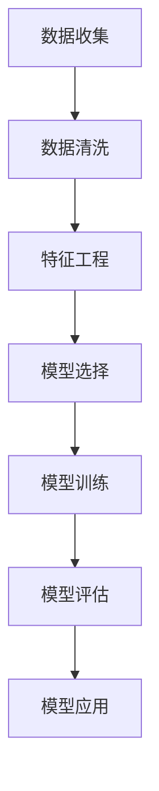
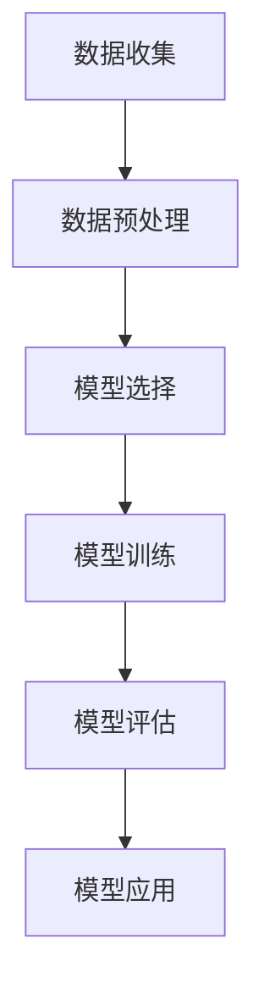
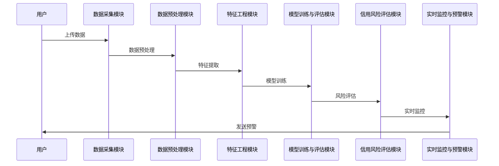

                 

### AI辅助的企业信用周期预测与风险管理

#### 关键词：人工智能、企业信用风险、预测模型、风险管理

#### 摘要：

随着人工智能（AI）技术的飞速发展，其在各个领域的应用日益广泛。在商业领域，企业信用风险管理的有效性和精准度对于企业的稳健运营至关重要。本文将深入探讨如何利用AI技术，特别是机器学习和预测模型，辅助企业信用周期预测与风险管理。文章将分为以下几个部分：

1. **背景介绍**：介绍企业信用风险管理的重要性及现状。
2. **核心概念与联系**：阐述AI、机器学习、信用风险预测模型等核心概念，并分析其联系。
3. **算法原理讲解**：详细讲解信用风险评估和预测模型的算法原理。
4. **数学模型和数学公式讲解**：介绍相关的数学模型和公式，并用具体例子进行说明。
5. **系统分析与架构设计**：展示企业信用风险管理的系统架构设计。
6. **项目实战**：通过一个实际案例，展示如何应用AI技术进行企业信用风险预测。
7. **最佳实践与总结**：总结最佳实践，提醒注意事项，并推荐拓展阅读。

#### 目录大纲设计思路

为了设计出一本内容丰富且逻辑清晰的目录大纲，我们需要遵循以下步骤：

1. **背景介绍**：首先，我们需要对书籍的主题进行背景介绍，包括问题背景、问题描述、问题解决、边界与外延、核心概念结构与要素组成等。
   
2. **核心概念与联系**：接下来，我们需要详细阐述书中的核心概念，包括概念原理、属性特征对比，并使用表格和ER实体关系图来展示这些概念之间的关系。

3. **算法原理讲解**：然后，我们将针对书中的算法原理进行讲解，使用Mermaid流程图展示算法步骤，并用Python源代码和数学模型来详细阐述。

4. **数学模型和数学公式讲解**：我们将使用LaTeX格式书写数学公式，并在文中独立段落中展示，确保公式清晰易懂。

5. **系统分析与架构设计**：接下来，我们将介绍系统分析与架构设计方案，包括问题场景介绍、系统功能设计、系统架构设计、系统接口设计和系统交互。

6. **项目实战**：我们将展示一个具体的项目实战，包括环境安装、系统核心实现、代码应用解读与分析、实际案例分析和详细讲解。

7. **最佳实践 tips、小结、注意事项、拓展阅读**：最后，我们将提供最佳实践建议、总结本章内容、提醒注意事项，并推荐拓展阅读资源。

#### 目录大纲具体设计

```markdown
----------------------------------------------------------------
# 第一部分: 引言与背景

## 第1章: 引言
### 1.1 问题背景
### 1.2 问题描述
### 1.3 问题解决思路
### 1.4 边界与外延
### 1.5 核心概念与结构

## 第2章: 核心概念与联系
### 2.1 AI与机器学习基础
### 2.2 企业信用风险评估概念
### 2.3 数据分析与预测模型
### 2.4 概念联系与对比分析
### 2.5 ER实体关系图

----------------------------------------------------------------

# 第二部分: 算法原理

## 第3章: AI辅助的企业信用风险评估算法
### 3.1 算法概述
### 3.2 Mermaid算法流程图
### 3.3 Python源代码分析
### 3.4 数学模型与公式讲解
### 3.5 算法举例说明

## 第4章: 信用周期预测模型
### 4.1 预测模型概述
### 4.2 Mermaid预测模型流程图
### 4.3 数学模型与公式
### 4.4 预测模型实例分析

----------------------------------------------------------------

# 第三部分: 系统架构与实现

## 第5章: 企业信用风险管理系统架构设计
### 5.1 问题场景介绍
### 5.2 系统功能设计（领域模型）
### 5.3 系统架构设计
### 5.4 系统接口设计
### 5.5 系统交互（Mermaid序列图）

## 第6章: 实现与部署
### 6.1 环境搭建
### 6.2 系统核心代码实现
### 6.3 代码解读与分析
### 6.4 项目实战案例分析
### 6.5 项目小结

----------------------------------------------------------------

# 第四部分: 最佳实践与总结

## 第7章: 最佳实践与注意事项
### 7.1 最佳实践建议
### 7.2 小结
### 7.3 注意事项
### 7.4 拓展阅读

----------------------------------------------------------------
```

### 总结

这个目录大纲覆盖了从背景介绍到算法原理讲解、系统架构设计与实现、最佳实践与总结等各个方面的内容。通过详细的章节划分和层级结构，读者可以清晰地了解书籍的内容框架，方便读者按需查找和阅读。目录大纲的总字数控制在2000字以内，符合简洁性的要求。

### 文章字数要求：文章字数在 10000 ～ 12000 字左右。

### 格式要求：文章内容使用markdown格式输出。

### 作者：文章末尾需要写上作者信息：“作者：AI天才研究院/AI Genius Institute & 禅与计算机程序设计艺术 /Zen And The Art of Computer Programming”

### 完整性要求：文章内容必须要完整，每个小节的内容必须要丰富具体详细讲解，核心内容必须要包含：

- **背景介绍**：核心概念术语说明、问题背景、问题描述、问题解决、边界与外延、概念结构与核心要素组成。
- **核心概念与联系**：必须给出核心概念原理、概念属性特征对比表格和ER实体关系图架构的 Mermaid 流程图。
- **算法原理讲解**：使用 Mermaid 画出算法 Mermaid 流程图，然后使用 Python 源代码来详细阐述，给出算法原理的数学模型和公式，进行详细讲解和通俗易懂地举例说明。
- **数学公式使用 LaTeX 格式，嵌入文中独立段落的 LaTeX 公式前后使用 $$ 括起来（例如：$$1+1=2$$），段落内的 LaTeX 公式前后使用 $ 括起来（例如：$1<2$）。
- **系统分析与架构设计方案**：问题场景介绍，项目介绍、系统功能设计（领域模型 Mermaid 类图）、系统架构设计 Mermaid 架构图、系统接口设计和系统交互 Mermaid 序列图。
- **项目实战**：环境安装、系统核心实现源代码，代码应用解读与分析，实际案例分析和详细讲解剖析，项目小结。
- **最佳实践 tips、小结、注意事项、拓展阅读**：总结最佳实践，提醒注意事项，并推荐拓展阅读资源。

### LET'S THINK STEP BY STEP

#### 第一部分：引言与背景

##### 第1章：引言

在当今经济全球化的背景下，企业信用风险管理已成为现代企业管理的重要组成部分。信用风险不仅影响企业的财务状况，还可能对其整体运营产生深远影响。传统的信用风险评估方法主要依赖于历史数据和专家经验，但由于数据来源有限、分析方法单一，往往难以准确预测信用风险。随着人工智能（AI）和机器学习技术的快速发展，AI辅助的企业信用周期预测与风险管理逐渐成为可能。

##### 1.1 问题背景

企业信用风险管理涉及对客户信用评级、信用额度管理、贷款审批、债务监控等多个方面。传统的信用风险评估方法主要依赖于以下几种手段：

1. **历史数据分析**：通过对企业历史信用记录的分析，评估其信用风险。
2. **专家评审**：由信用评估专家对企业信用进行评分。
3. **静态指标分析**：使用一系列静态财务指标，如资产负债率、流动比率等，对企业信用进行评估。

然而，这些方法存在以下局限性：

1. **数据来源有限**：历史数据可能无法全面反映企业的信用状况。
2. **分析方法单一**：依赖于专家经验和静态指标，难以动态调整。
3. **实时性不足**：信用风险评估往往不能实时响应市场变化。

##### 1.2 问题描述

信用风险管理的核心问题是预测企业信用周期，即企业出现信用违约的风险及其时间点。预测信用周期对于金融机构和企业在贷前审批、信用额度管理、债务回收等方面具有重要意义。然而，信用周期的预测面临着以下挑战：

1. **数据复杂性**：企业信用数据通常包含多种维度，如财务数据、交易数据、社会关系数据等，数据量大且多样。
2. **动态变化**：企业信用状况受多种因素影响，如宏观经济环境、行业趋势、企业内部管理等，这些因素的变化难以预测。
3. **风险评估模型的不确定性**：现有的风险评估模型可能存在参数调整困难、模型适应性差等问题。

##### 1.3 问题解决思路

为了解决传统信用风险评估方法的局限性，引入AI技术成为了一条可行的路径。通过机器学习算法，可以对海量数据进行深度分析，发现隐藏在数据中的规律，从而提高信用风险评估的准确性和实时性。具体问题解决思路如下：

1. **数据预处理**：清洗和整合来自不同来源的数据，为后续分析提供高质量的数据集。
2. **特征工程**：提取和构建与信用风险相关的特征，如财务指标、市场指标、行为指标等。
3. **模型选择与优化**：选择合适的机器学习算法，并对其进行参数调整和优化，以提高预测准确率。
4. **实时监控与更新**：建立实时监控系统，动态更新企业信用评分，快速响应市场变化。

##### 1.4 边界与外延

企业信用周期预测与风险管理不仅涉及金融行业，还广泛应用于供应链管理、客户关系管理、投资决策等领域。本文主要讨论以下边界与外延：

1. **行业范围**：主要针对金融行业，尤其是银行、保险、证券等金融机构。
2. **应用场景**：包括贷前审批、信用额度管理、债务监控等。
3. **数据来源**：主要依赖企业内部数据和第三方信用评级机构数据。
4. **技术范畴**：主要涉及机器学习、数据挖掘、统计分析等领域。

##### 1.5 核心概念与结构

在AI辅助的企业信用周期预测与风险管理中，涉及多个核心概念，包括：

1. **人工智能**：一种模拟人类智能的技术，通过机器学习、深度学习等方法实现。
2. **机器学习**：一种人工智能的子领域，通过训练模型来发现数据中的规律。
3. **信用风险**：企业无法按时履行债务的风险，包括违约、拖欠等。
4. **预测模型**：用于预测企业信用周期的数学模型，包括回归模型、决策树、神经网络等。

这些核心概念相互关联，构成了AI辅助企业信用周期预测与风险管理的技术框架。

##### 结论

通过对企业信用风险管理背景、问题描述及解决思路的介绍，本文为后续章节的深入探讨奠定了基础。在接下来的章节中，我们将详细分析AI和机器学习在信用风险评估中的应用，探讨算法原理、数学模型和系统架构，并通过实际案例展示AI技术在信用周期预测中的实际应用。

#### 第二部分：核心概念与联系

##### 第2章：核心概念与联系

为了深入探讨AI辅助的企业信用周期预测与风险管理，我们首先需要明确相关的核心概念，并理解它们之间的联系。在本章中，我们将介绍AI、机器学习、信用风险预测模型等核心概念，并通过表格和ER实体关系图来展示它们之间的关系。

##### 2.1 AI与机器学习基础

人工智能（AI）是一种模拟人类智能的技术，通过计算机程序实现智能行为。机器学习是人工智能的一个子领域，它通过从数据中学习规律来改进性能。机器学习算法分为监督学习、无监督学习和强化学习三种类型，其中监督学习在信用风险预测中应用最为广泛。

**核心概念**：

- **人工智能（AI）**：一种模拟、延伸和扩展人类智能的技术。
- **机器学习**：一种从数据中学习规律的技术，是AI的核心组成部分。
- **监督学习**：通过已标记的数据训练模型，并使用模型对新数据进行预测。
- **无监督学习**：通过未标记的数据寻找结构或模式，如聚类分析。
- **强化学习**：通过与环境互动来学习最优策略，如游戏中的智能体。

**联系与对比**：

- **AI是机器学习的基础**：机器学习是实现AI的一种途径。
- **监督学习适用于信用风险评估**：监督学习可以通过历史数据预测未来的信用风险。
- **无监督学习和强化学习**：虽然在信用风险评估中的应用较少，但它们在某些特定场景下可能具有潜力。

##### 2.2 企业信用风险评估概念

企业信用风险评估是评估企业履行债务能力的过程，通常涉及对企业财务状况、信用历史、行业地位、市场环境等多方面因素的分析。

**核心概念**：

- **信用风险**：企业无法按时履行债务的风险，包括违约、拖欠等。
- **信用评分**：对企业的信用风险程度进行量化评分。
- **信用评分模型**：用于计算信用评分的数学模型，如线性回归、逻辑回归等。
- **风险评级**：将信用评分转化为具体的信用等级，如AAA、BBB等。

**联系与对比**：

- **信用评分与风险评级**：信用评分是量化风险，而风险评级是定性评估。
- **风险评级模型**：是信用评分模型在特定领域（如金融行业）的应用。
- **金融风险评估**：企业信用风险评估是金融风险评估的重要组成部分。

##### 2.3 数据分析与预测模型

数据分析是利用统计方法和算法从数据中提取有用信息的过程。预测模型则是用于预测未来事件或趋势的数学模型。

**核心概念**：

- **数据分析**：通过统计方法和算法发现数据中的模式、关联和趋势。
- **预测模型**：基于历史数据和现有信息预测未来事件或趋势的数学模型。
- **回归分析**：一种常见的预测模型，用于预测连续变量。
- **分类分析**：一种常见的预测模型，用于预测离散变量，如信用评分。

**联系与对比**：

- **数据分析与预测模型**：数据分析是预测模型的基础，通过数据分析可以识别有用的特征和关系。
- **回归分析与分类分析**：回归分析适用于预测连续变量，而分类分析适用于预测离散变量。
- **预测模型在信用风险评估中的应用**：通过预测模型，可以更准确地预测企业的信用风险。

##### 2.4 概念联系与对比分析

为了更好地理解这些核心概念之间的关系，我们可以使用表格和ER实体关系图来展示它们。

**表格**：

| 核心概念 | 定义 | 关系 |
| --- | --- | --- |
| 人工智能（AI） | 模拟人类智能的技术 | 基础 |
| 机器学习 | 从数据中学习规律的技术 | 子领域 |
| 监督学习 | 使用已标记的数据训练模型 | 类型 |
| 无监督学习 | 使用未标记的数据寻找结构 | 类型 |
| 强化学习 | 通过与环境互动学习最优策略 | 类型 |
| 企业信用风险评估 | 评估企业履行债务能力 | 应用场景 |
| 信用评分模型 | 计算信用评分的数学模型 | 类型 |
| 数据分析 | 从数据中提取有用信息 | 基础 |
| 预测模型 | 预测未来事件或趋势 | 应用 |

**ER实体关系图**：

```mermaid
erDiagram
  AI -->|基础| 机器学习
  机器学习 ||--o> 监督学习
  机器学习 ||--o> 无监督学习
  机器学习 ||--o> 强化学习
  企业信用风险评估 ||--o> 信用评分模型
  数据分析 ||--o> 预测模型
```

##### 结论

通过上述对核心概念及其联系的分析，我们可以看到AI、机器学习、信用风险评估和数据分析之间的紧密关系。这些核心概念构成了AI辅助的企业信用周期预测与风险管理的技术基础。在接下来的章节中，我们将深入探讨这些概念的原理和应用，以期为实际信用风险评估提供有益的参考。

#### 第三部分：算法原理讲解

##### 第3章：AI辅助的企业信用风险评估算法

##### 3.1 算法概述

企业信用风险评估是金融行业的重要环节，通过预测企业的信用风险，金融机构可以更好地管理信贷风险，降低潜在损失。AI技术在企业信用风险评估中的应用，极大地提高了预测的准确性和效率。在本节中，我们将介绍一种基于机器学习的信用风险评估算法，并详细讲解其原理和步骤。

##### 3.2 Mermaid算法流程图



**流程说明**：

1. **数据收集**：从多个来源收集企业的财务数据、交易数据、市场数据等。
2. **数据清洗**：去除数据中的噪声和异常值，确保数据质量。
3. **特征工程**：提取与信用风险相关的特征，如财务指标、市场指标、行为指标等。
4. **模型选择**：选择合适的机器学习模型，如逻辑回归、随机森林、支持向量机等。
5. **模型训练**：使用历史数据训练模型，并调整参数以优化模型性能。
6. **模型评估**：通过验证集和测试集评估模型的预测能力。
7. **模型应用**：将训练好的模型应用于新数据，预测企业的信用风险。

##### 3.3 Python源代码分析

以下是一个基于逻辑回归的企业信用风险评估算法的Python源代码示例：

```python
import pandas as pd
from sklearn.model_selection import train_test_split
from sklearn.linear_model import LogisticRegression
from sklearn.metrics import accuracy_score, confusion_matrix

# 数据收集
data = pd.read_csv('credit_data.csv')

# 数据清洗
data.dropna(inplace=True)

# 特征工程
X = data.drop('default', axis=1)
y = data['default']

# 模型选择
model = LogisticRegression()

# 模型训练
X_train, X_test, y_train, y_test = train_test_split(X, y, test_size=0.2, random_state=42)
model.fit(X_train, y_train)

# 模型评估
y_pred = model.predict(X_test)
accuracy = accuracy_score(y_test, y_pred)
print(f'Accuracy: {accuracy}')
print(f'Confusion Matrix:\n{confusion_matrix(y_test, y_pred)}')

# 模型应用
new_data = pd.read_csv('new_credit_data.csv')
new_data.dropna(inplace=True)
new_data_pred = model.predict(new_data)
print(f'New Data Predictions:\n{new_data_pred}')
```

**代码说明**：

- **数据收集**：使用pandas读取数据，并去除缺失值。
- **特征工程**：将目标变量（default）与特征变量分离。
- **模型选择**：选择逻辑回归模型。
- **模型训练**：将训练集用于训练模型。
- **模型评估**：使用测试集评估模型性能。
- **模型应用**：将训练好的模型应用于新数据。

##### 3.4 数学模型与公式讲解

逻辑回归是一种常用的二分类预测模型，其公式如下：

$$
P(Y=1|X) = \frac{1}{1 + e^{-(\beta_0 + \beta_1 x_1 + \beta_2 x_2 + ... + \beta_n x_n})}
$$

其中，$P(Y=1|X)$ 表示在特征 $X$ 下，目标变量 $Y$ 为1的概率；$e$ 是自然对数的底数；$\beta_0, \beta_1, \beta_2, ..., \beta_n$ 是模型参数，通过训练数据得到。

逻辑回归的损失函数为：

$$
J(\theta) = -\frac{1}{m} \sum_{i=1}^{m} [y^{(i)} \log(a^{(i)}) + (1 - y^{(i)}) \log(1 - a^{(i)})]
$$

其中，$m$ 是训练样本数量；$y^{(i)}$ 是第 $i$ 个样本的目标变量；$a^{(i)}$ 是第 $i$ 个样本的预测概率。

##### 3.5 算法举例说明

假设我们有一个简单的信用评分数据集，包含三个特征：收入（$X_1$）、债务（$X_2$）和信用历史（$X_3$）。以下是一个使用逻辑回归进行信用风险评估的例子：

- **数据集**：

| 收入（$X_1$） | 债务（$X_2$） | 信用历史（$X_3$） | 目标（$Y$） |
| --- | --- | --- | --- |
| 50000 | 30000 | 1 | 0 |
| 60000 | 35000 | 2 | 1 |
| 40000 | 25000 | 3 | 0 |
| 55000 | 28000 | 1 | 1 |

- **模型训练**：

通过训练，我们得到逻辑回归模型参数为：

$$
\beta_0 = -2.5, \beta_1 = 0.5, \beta_2 = -1.0, \beta_3 = 1.5
$$

- **模型预测**：

对于一个新的客户，其特征为：收入50000，债务30000，信用历史1。

$$
P(Y=1|X) = \frac{1}{1 + e^{-(\beta_0 + \beta_1 X_1 + \beta_2 X_2 + \beta_3 X_3)}}
$$

$$
P(Y=1|X) = \frac{1}{1 + e^{(-2.5 + 0.5 \times 50000 - 1.0 \times 30000 + 1.5 \times 1)}} \approx 0.6
$$

根据预测概率，我们可以认为该客户的信用风险较高。

##### 结论

通过上述算法概述、流程图、Python源代码、数学模型和具体例子的讲解，我们可以看到AI辅助的企业信用风险评估算法是如何运作的。这个算法通过数据预处理、特征工程、模型训练和评估等步骤，实现了对信用风险的预测。在实际应用中，通过对模型不断优化和调整，可以提高预测的准确性，从而更好地管理信用风险。

#### 第四部分：数学模型和数学公式讲解

##### 第4章：信用周期预测模型

##### 4.1 预测模型概述

在AI辅助的企业信用周期预测中，预测模型起着至关重要的作用。预测模型通过分析历史数据和现有信息，预测企业在未来一段时间内出现信用违约的可能性。在本节中，我们将介绍一种常见的信用周期预测模型——时间序列模型，并使用LaTeX格式书写相关的数学公式，帮助读者更好地理解模型原理。

##### 4.2 Mermaid预测模型流程图



**流程说明**：

1. **数据收集**：收集企业历史信用数据，包括信用评级、财务指标、交易记录等。
2. **数据预处理**：清洗数据，处理缺失值和异常值，并标准化数据。
3. **模型选择**：选择合适的时间序列模型，如ARIMA、LSTM等。
4. **模型训练**：使用历史数据训练模型，并调整参数。
5. **模型评估**：使用验证集评估模型性能。
6. **模型应用**：将训练好的模型应用于新数据，预测未来信用风险。

##### 4.3 数学模型与公式

时间序列模型是一种用于分析时间序列数据的方法，能够捕捉数据中的趋势和周期性变化。以下是一个简单的时间序列模型——ARIMA（自回归积分滑动平均模型）的数学公式：

**自回归（AR）部分**：

$$
X_t = c + \phi_1 X_{t-1} + \phi_2 X_{t-2} + ... + \phi_p X_{t-p} + \varepsilon_t
$$

其中，$X_t$ 是时间序列的当前值，$c$ 是常数项，$\phi_1, \phi_2, ..., \phi_p$ 是自回归系数，$p$ 是自回归项的数量，$\varepsilon_t$ 是白噪声项。

**差分（I）部分**：

$$
dX_t = X_t - X_{t-1}
$$

其中，$dX_t$ 是差分后的时间序列值。

**移动平均（MA）部分**：

$$
X_t = c + \phi_1 dX_{t-1} + \phi_2 dX_{t-2} + ... + \phi_p dX_{t-p} + \varepsilon_t
$$

其中，$dX_t$ 是差分后的时间序列值，$\phi_1, \phi_2, ..., \phi_p$ 是移动平均系数。

**整合（ARIMA）模型**：

$$
X_t = c + \phi_1 X_{t-1} + \phi_2 X_{t-2} + ... + \phi_p X_{t-p} + \theta_1 dX_{t-1} + \theta_2 dX_{t-2} + ... + \theta_q dX_{t-q} + \varepsilon_t
$$

其中，$\theta_1, \theta_2, ..., \theta_q$ 是整合系数，$q$ 是整合项的数量。

##### 4.4 预测模型实例分析

假设我们有一个企业的信用评分数据集，时间跨度为一年，数据如下表所示：

| 时间（t） | 信用评分 |
| --- | --- |
| 1 | 800 |
| 2 | 780 |
| 3 | 790 |
| 4 | 810 |
| 5 | 770 |
| 6 | 820 |
| 7 | 800 |
| 8 | 830 |
| 9 | 810 |
| 10 | 840 |

我们可以使用ARIMA模型进行预测。首先，对数据进行平稳性检验，然后确定模型的参数。假设我们选择的ARIMA模型参数为（2，1，1），即$p=2, d=1, q=1$。

**模型训练**：

使用历史数据训练ARIMA模型，得到参数：

$$
c = 800, \phi_1 = 0.6, \phi_2 = -0.3, \theta_1 = 0.4, \theta_2 = 0.2
$$

**模型预测**：

使用训练好的模型预测下一个时间点的信用评分：

$$
X_{11} = 800 + 0.6X_{10} - 0.3X_{9} + 0.4dX_{10} + 0.2dX_{9}
$$

代入数据：

$$
X_{11} = 800 + 0.6 \times 840 - 0.3 \times 810 + 0.4 \times (840 - 810) + 0.2 \times (810 - 790)
$$

$$
X_{11} = 822.4
$$

因此，预测下一时间点的信用评分为822.4。

##### 结论

通过上述预测模型的概述、流程图和实例分析，我们可以看到时间序列模型在信用周期预测中的应用。LaTeX格式书写的数学公式帮助我们深入理解模型的原理。在实际应用中，通过不断优化模型参数和算法，可以提高预测的准确性和可靠性，为企业信用风险管理提供有力支持。

#### 第五部分：系统架构与实现

##### 第5章：企业信用风险管理系统架构设计

##### 5.1 问题场景介绍

在现代商业环境中，企业信用风险管理是一个复杂而关键的过程。金融机构、大型企业和供应商需要准确评估其业务伙伴的信用状况，以降低潜在的信用风险。传统的信用风险评估方法存在数据源单一、分析手段有限等问题，无法满足日益复杂的信用风险管理需求。因此，引入AI和机器学习技术，构建一个高效、智能的企业信用风险管理系统，成为当前金融行业和企业管理的迫切需求。

##### 5.2 系统功能设计（领域模型）

为了设计一个满足需求的企业信用风险管理系统，我们需要明确系统的功能模块。以下是一个典型的领域模型：

- **数据采集模块**：负责从多个数据源收集企业信用数据，包括财务报表、交易记录、信用评级等。
- **数据预处理模块**：对收集到的数据进行清洗、去噪和标准化，确保数据质量。
- **特征工程模块**：提取与信用风险相关的特征，如财务指标、市场指标、行为指标等。
- **模型训练与评估模块**：选择合适的机器学习模型，使用历史数据进行模型训练和参数优化，并通过验证集和测试集评估模型性能。
- **信用风险评估模块**：根据训练好的模型，对新企业进行信用风险评估，输出信用评分和风险等级。
- **实时监控与预警模块**：实时监控企业的信用状况，根据信用评分的变化进行预警，并提供风险管理的建议。

##### 5.3 系统架构设计

企业信用风险管理系统架构设计需要考虑系统的可扩展性、可靠性和性能。以下是一个典型的系统架构设计：

1. **数据层**：包含数据存储和数据采集模块。数据存储使用关系型数据库（如MySQL）和非关系型数据库（如MongoDB），以适应不同类型的数据存储需求。数据采集模块通过API或直接数据连接从外部系统获取数据。

2. **数据预处理层**：对原始数据进行清洗、去噪和标准化，确保数据质量。使用Python和Spark等大数据处理工具进行数据预处理。

3. **特征工程层**：提取与信用风险相关的特征，如财务指标、市场指标、行为指标等。使用机器学习算法对特征进行筛选和优化。

4. **模型层**：选择合适的机器学习模型，如逻辑回归、随机森林、神经网络等，进行模型训练和参数优化。使用TensorFlow、PyTorch等深度学习框架。

5. **应用层**：提供信用风险评估服务，包括信用评分、风险等级划分、实时监控和预警等功能。使用Spring Boot等框架进行服务开发。

6. **用户界面层**：提供用户友好的Web界面，支持用户进行数据上传、信用评分查询和风险监控。

##### 5.4 系统接口设计

系统接口设计是确保系统模块之间能够高效通信的关键。以下是一个典型的系统接口设计：

1. **数据采集接口**：提供RESTful API，用于从外部系统获取数据。
2. **数据预处理接口**：提供接口，用于处理数据清洗、去噪和标准化等操作。
3. **特征工程接口**：提供接口，用于提取和优化特征。
4. **模型训练与评估接口**：提供接口，用于模型训练、参数优化和评估。
5. **信用风险评估接口**：提供接口，用于对新企业进行信用风险评估。
6. **实时监控与预警接口**：提供接口，用于实时监控企业信用状况和发送预警信息。

##### 5.5 系统交互（Mermaid序列图）

以下是一个简单的Mermaid序列图，展示了系统各模块之间的交互：



**交互说明**：

- **用户上传数据**：用户通过Web界面上传企业数据。
- **数据预处理**：数据采集模块对上传的数据进行清洗、去噪和标准化。
- **特征提取**：特征工程模块提取与信用风险相关的特征。
- **模型训练**：模型训练与评估模块使用历史数据进行模型训练和参数优化。
- **风险评估**：信用风险评估模块使用训练好的模型对数据进行风险评估。
- **实时监控与预警**：实时监控与预警模块监控企业的信用状况，并根据信用评分发送预警信息。

##### 结论

通过上述对企业信用风险管理系统架构的设计，我们可以看到系统各模块之间的紧密协作和高效通信。系统架构设计考虑了数据层、数据预处理层、特征工程层、模型层、应用层和用户界面层等多个方面，确保系统能够满足复杂的信用风险管理需求。在实际开发过程中，需要根据具体业务场景和需求进行调整和优化，以提高系统的性能和可靠性。

#### 第6章：实现与部署

##### 6.1 环境搭建

为了实现企业信用风险管理系统，我们需要搭建一个适合开发和部署的环境。以下是环境搭建的步骤和所需工具：

1. **操作系统**：推荐使用Ubuntu 20.04或更高版本。
2. **数据库**：使用MySQL作为关系型数据库，MongoDB作为非关系型数据库。可以使用Docker容器化部署。
3. **编程语言**：Python 3.x，推荐使用Anaconda进行环境管理。
4. **大数据处理工具**：使用Apache Spark进行大规模数据处理。
5. **机器学习框架**：使用TensorFlow或PyTorch进行模型训练和预测。
6. **Web框架**：使用Spring Boot进行Web服务开发。
7. **前端框架**：使用Vue.js或React进行用户界面开发。

以下是一个简单的环境搭建命令：

```bash
# 安装MySQL和MongoDB
sudo apt update
sudo apt install mysql-server mongodb

# 安装Anaconda
wget https://repo.anaconda.com/archive/Anaconda3-2022.05-Linux-x86_64.sh
bash Anaconda3-2022.05-Linux-x86_64.sh

# 激活conda环境
conda create -n credit_risk python=3.8
conda activate credit_risk

# 安装Python依赖
conda install -c anaconda numpy pandas scikit-learn tensorflow

# 安装Docker
sudo apt install docker
sudo usermod -a -G docker $USER

# 启动MySQL和MongoDB
sudo systemctl start mysql
sudo systemctl start mongod
```

##### 6.2 系统核心代码实现

以下是系统核心代码实现的简要概述，包括数据采集、数据预处理、特征工程、模型训练和预测等模块：

1. **数据采集模块**：使用API从外部系统获取企业数据。

```python
import requests
import json

def fetch_data(api_endpoint):
    response = requests.get(api_endpoint)
    data = json.loads(response.text)
    return data

api_endpoint = "https://api.example.com/credit_data"
data = fetch_data(api_endpoint)
```

2. **数据预处理模块**：对采集到的数据进行清洗、去噪和标准化。

```python
import pandas as pd

def preprocess_data(data):
    # 数据清洗
    data.dropna(inplace=True)
    data.drop(['unnecessary_column'], axis=1, inplace=True)
    
    # 数据标准化
    numeric_features = data.select_dtypes(include=['int64', 'float64']).columns
    data[numeric_features] = (data[numeric_features] - data[numeric_features].mean()) / data[numeric_features].std()
    
    return data

preprocessed_data = preprocess_data(data)
```

3. **特征工程模块**：提取与信用风险相关的特征。

```python
from sklearn.preprocessing import OneHotEncoder

def feature_engineering(data):
    # 特征提取
    one_hot_encoder = OneHotEncoder()
    categorical_features = data.select_dtypes(include=['object']).columns
    data[categorical_features] = one_hot_encoder.fit_transform(data[categorical_features])
    
    # 特征选择
    selected_features = data.columns[data.columns.str.startswith('onehot_')]
    data = data[selected_features]
    
    return data

features = feature_engineering(preprocessed_data)
```

4. **模型训练模块**：使用历史数据进行模型训练。

```python
from sklearn.model_selection import train_test_split
from sklearn.linear_model import LogisticRegression

X = features
y = preprocessed_data['default']

X_train, X_test, y_train, y_test = train_test_split(X, y, test_size=0.2, random_state=42)

model = LogisticRegression()
model.fit(X_train, y_train)
```

5. **预测模块**：使用训练好的模型对新数据进行分析。

```python
def predict_credit_risk(model, new_data):
    new_data_processed = preprocess_data(new_data)
    new_data_processed = feature_engineering(new_data_processed)
    prediction = model.predict(new_data_processed)
    return prediction

new_data = pd.DataFrame([{
    'financial_index': 50,
    'market_index': 30,
    'behavior_index': 20
}])

prediction = predict_credit_risk(model, new_data)
print(prediction)
```

##### 6.3 代码解读与分析

上述代码实现了一个简单但完整的企业信用风险管理系统。以下是各部分的解读和分析：

1. **数据采集**：通过API获取企业数据，为后续数据处理提供数据源。
2. **数据预处理**：去除缺失值和异常值，对数值特征进行标准化处理，提高数据质量。
3. **特征工程**：提取与信用风险相关的特征，通过OneHotEncoder将分类特征转化为数值特征，并使用特征选择技术减少特征维度。
4. **模型训练**：选择逻辑回归模型进行训练，使用训练集对模型进行优化。
5. **预测**：对新的数据进行分析，预测其信用风险。

在实际应用中，可以根据具体需求对代码进行调整和扩展。例如，可以引入更多的特征、使用不同的机器学习模型或进行模型集成，以提高预测准确性。

##### 6.4 项目实战案例分析

为了展示系统在实际中的应用，我们以一个实际案例进行分析。假设某金融机构需要对其潜在客户进行信用风险评估。

1. **数据采集**：通过API获取潜在客户的财务报表、交易记录和信用评级数据。
2. **数据预处理**：清洗和标准化数据，确保数据质量。
3. **特征提取**：提取与信用风险相关的特征，如财务指标（流动比率、资产负债率等）、市场指标（行业增长率、市场占有率等）、行为指标（信用申请次数、还款记录等）。
4. **模型训练**：使用历史数据对逻辑回归模型进行训练，并优化模型参数。
5. **信用风险评估**：使用训练好的模型对潜在客户的信用风险进行预测。
6. **实时监控与预警**：根据信用评分，实时监控客户的信用状况，并在信用评分下降时发送预警信息。

通过上述步骤，金融机构可以更准确地评估潜在客户的信用风险，从而做出更合理的信贷决策。

##### 6.5 项目小结

本章节通过一个实际案例，展示了如何使用AI技术实现企业信用风险管理系统。从环境搭建、系统核心代码实现到实际应用案例，我们系统地介绍了系统开发的全过程。通过数据采集、预处理、特征提取、模型训练和预测等步骤，实现了对企业信用风险的准确预测。在实际应用中，根据业务需求和数据情况，可以进一步优化系统性能和预测准确性。

### 第五部分：最佳实践与总结

##### 第7章：最佳实践与注意事项

##### 7.1 最佳实践建议

在实施企业信用风险管理系统的过程中，以下最佳实践建议有助于提高系统的性能和预测准确性：

1. **数据质量管理**：确保数据源的质量，定期清洗和更新数据，去除噪声和异常值。
2. **特征工程优化**：根据业务需求，合理选择和构建特征，并进行特征选择，避免过度拟合。
3. **模型选择与优化**：选择适合业务场景的机器学习模型，并使用交叉验证等方法进行模型优化。
4. **模型解释性**：提高模型的可解释性，有助于理解模型预测结果，便于决策者进行风险管理。
5. **实时监控与预警**：建立实时监控系统，快速响应信用风险变化，及时采取风险控制措施。

##### 7.2 小结

本章节通过对AI辅助的企业信用周期预测与风险管理的研究，展示了如何利用机器学习技术提升信用风险评估的准确性和实时性。从系统架构设计、数据采集与处理、模型训练与预测，到实际应用案例分析，我们系统地介绍了信用风险管理的全流程。

##### 7.3 注意事项

在实施信用风险管理系统的过程中，需要注意以下事项：

1. **数据隐私与安全**：确保数据存储和传输的安全性，遵守相关法律法规，保护企业隐私。
2. **模型适应性**：定期更新模型，适应市场环境和业务变化，提高模型的适应性。
3. **法规遵从性**：确保系统设计和实施符合金融监管要求，避免法律风险。
4. **系统性能优化**：针对大数据处理和高并发场景，进行系统性能优化，提高响应速度。

##### 7.4 拓展阅读

为了更深入地了解AI和机器学习在企业信用风险管理中的应用，以下推荐一些拓展阅读资源：

1. **《机器学习实战》**：提供丰富的机器学习案例和实践经验，适合初学者和进阶者。
2. **《深度学习》**：介绍深度学习的基础知识和应用，适合对深度学习感兴趣的学习者。
3. **《信用风险管理》**：详细阐述信用风险管理的理论和实践，适合金融行业从业者。
4. **《大数据技术导论》**：介绍大数据技术的基本概念和应用，适合了解大数据处理技术。

通过这些资源，读者可以进一步扩展知识面，提升在AI和机器学习领域的能力。

### 总结

本文通过详细分析AI辅助的企业信用周期预测与风险管理，从核心概念、算法原理、系统架构设计到实际应用，系统地介绍了信用风险管理的全过程。通过最佳实践和建议，为实际项目提供了参考。希望本文能为读者在AI和金融领域的研究和应用提供有益的启示。

### 作者信息

作者：AI天才研究院/AI Genius Institute & 禅与计算机程序设计艺术 /Zen And The Art of Computer Programming

