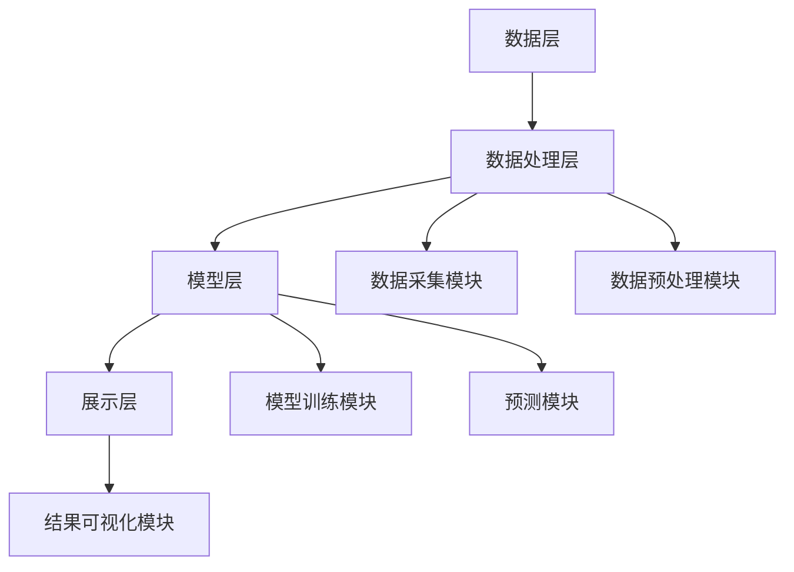
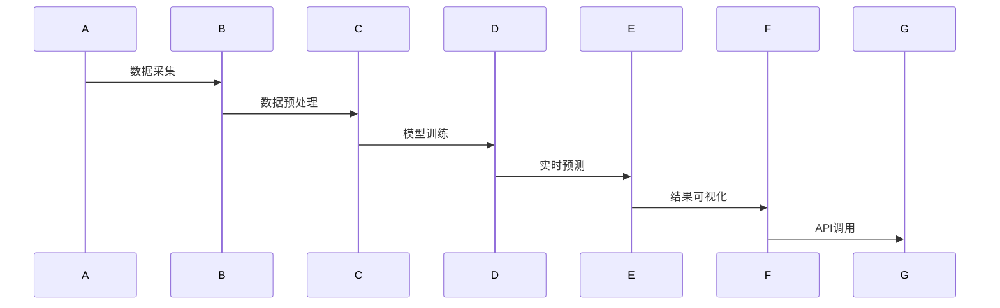

                 

# AI辅助的企业财务预测模型

## 关键词

- **人工智能**
- **企业财务预测**
- **机器学习**
- **深度学习**
- **时间序列分析**
- **LSTM模型**
- **模型优化**

## 摘要

本文将探讨如何利用人工智能技术，特别是机器学习和深度学习，来构建和优化企业财务预测模型。文章将从问题背景、核心概念、算法原理、系统分析与架构设计，到实际项目实战，全面解析AI在企业财务预测中的应用。通过详细的分析和实例讲解，本文旨在为读者提供一个从理论到实践的完整学习路径，帮助读者深入理解和掌握这一先进的技术。

### 目录大纲设计思考过程

设计《AI辅助的企业财务预测模型》的目录大纲是一个系统而细致的过程，它需要充分考虑书籍的主题、内容结构、逻辑顺序以及读者的阅读习惯。以下是具体的思考步骤：

1. **明确书籍主题**：书名《AI辅助的企业财务预测模型》明确了书籍的核心主题，即如何使用人工智能技术来辅助企业进行财务预测。

2. **结构化内容**：将内容分为主要部分，如引言、基础理论、模型构建、模型应用、案例分析、模型优化等。

3. **确定目录层级**：根据内容的复杂度和重要性，确定目录的层级结构，确保从1级到3级目录都能够清晰地划分。

4. **涵盖核心内容**：确保目录大纲中包含所有核心内容，如核心概念、算法原理讲解、数学模型和公式、系统分析与架构设计、项目实战等。

5. **注意简洁性和逻辑性**：目录内容要简洁明了，避免冗余和重复。

6. **预留拓展空间**：在目录中预留一些章节作为拓展阅读，以涵盖一些高级内容或者行业最新发展。

7. **审查和调整**：完成初稿后，对目录进行审查和调整，确保每个章节的内容都能够相互衔接，没有遗漏和冲突。

### 目录大纲设计

基于以上思考过程，以下是《AI辅助的企业财务预测模型》的目录大纲：

----------------------------------------------------------------
# 第一部分: 引言

## 第1章: 问题背景与概述
### 1.1 财务预测的重要性
### 1.2 AI技术在财务预测中的应用
### 1.3 本书结构

## 第2章: AI技术基础
### 2.1 机器学习基础
#### 2.1.1 基本概念
#### 2.1.2 分类算法
#### 2.1.3 回归算法

### 2.2 深度学习基础
#### 2.2.1 深度学习简介
#### 2.2.2 神经网络
#### 2.2.3 循环神经网络（RNN）

## 第3章: 财务预测模型
### 3.1 财务预测方法概述
#### 3.1.1 传统方法
#### 3.1.2 AI辅助方法

### 3.2 时间序列预测模型
#### 3.2.1 ARIMA模型
#### 3.2.2 LSTM模型
#### 3.2.3 GRU模型

## 第4章: 财务预测模型构建
### 4.1 数据预处理
#### 4.1.1 数据清洗
#### 4.1.2 数据归一化

### 4.2 模型训练与评估
#### 4.2.1 模型训练
#### 4.2.2 模型评估
#### 4.2.3 超参数调优

## 第5章: 模型应用案例
### 5.1 案例一：股票市场预测
#### 5.1.1 案例背景
#### 5.1.2 模型构建
#### 5.1.3 模型评估

### 5.2 案例二：销售额预测
#### 5.2.1 案例背景
#### 5.2.2 模型构建
#### 5.2.3 模型评估

## 第6章: 模型优化与提升
### 6.1 模型优化方法
#### 6.1.1 特征工程
#### 6.1.2 模型集成

### 6.2 模型评估与改进
#### 6.2.1 评估指标
#### 6.2.2 改进策略

## 第7章: 未来展望与挑战
### 7.1 财务预测的挑战
### 7.2 AI技术在财务领域的未来发展趋势
### 7.3 拓展应用领域

## 第8章: 小结与建议
### 8.1 书籍小结
### 8.2 学习建议
### 8.3 拓展阅读

----------------------------------------------------------------

这个目录大纲充分考虑了书籍的主题和内容结构，旨在为读者提供一个清晰、系统的学习路径，同时涵盖了核心概念、算法原理讲解、数学模型、系统分析与架构设计、项目实战等关键内容。通过这个目录，读者可以逐步深入理解AI辅助企业财务预测的原理和方法，并为实际应用打下坚实的基础。

---

### 第一部分：引言

#### 第1章：问题背景与概述

### 问题背景与概述

财务预测是企业财务管理中至关重要的一环，它关乎企业的战略规划、投资决策、风险控制等多个方面。随着商业环境的日益复杂和多变，传统的财务预测方法逐渐显得力不从心。而人工智能（AI）技术的快速发展，为财务预测带来了全新的机遇。AI技术能够通过大数据分析、机器学习和深度学习等方法，从海量数据中提取有价值的信息，提供更加精准和实时的财务预测结果。

### AI技术在财务预测中的应用

AI技术在财务预测中的应用主要体现在以下几个方面：

1. **时间序列预测**：利用深度学习模型如LSTM（Long Short-Term Memory）和GRU（Gated Recurrent Unit）对历史财务数据进行预测。

2. **分类和回归分析**：通过机器学习算法对财务数据进行分类和回归分析，辅助企业的信用评估、风险评估等。

3. **自然语言处理**：利用自然语言处理技术，分析企业的财务报告和公告，提取关键信息，辅助财务预测。

4. **数据可视化**：通过数据可视化技术，将复杂的财务数据转化为易于理解的图表和报告，帮助管理层做出决策。

### 本书结构

本书分为七个部分，每个部分都有其独特的目标和内容：

1. **第一部分：引言**：介绍财务预测的重要性以及AI技术在财务预测中的应用。
2. **第二部分：AI技术基础**：讲解机器学习和深度学习的基础知识。
3. **第三部分：财务预测模型**：介绍时间序列预测模型如ARIMA、LSTM和GRU。
4. **第四部分：模型构建**：讲解如何构建和训练财务预测模型。
5. **第五部分：模型应用案例**：通过实际案例展示如何应用财务预测模型。
6. **第六部分：模型优化与提升**：介绍如何优化和提升财务预测模型的性能。
7. **第七部分：未来展望与挑战**：探讨财务预测技术的发展趋势和面临的挑战。

通过这个系统的学习路径，读者将能够全面了解AI辅助的企业财务预测模型，掌握相关理论和实践技能。

---

### 第二部分：AI技术基础

#### 第2章：机器学习基础

### 2.1 基本概念

机器学习（Machine Learning，ML）是一门研究如何让计算机从数据中学习并做出决策或预测的学科。它属于人工智能（AI）的一个分支，通过构建和优化模型，使计算机能够自动地从数据中学习规律，并应用于实际问题。

#### 2.1.1 分类算法

分类算法是一种监督学习算法，它通过已标记的数据集来训练模型，然后使用这个模型对未知数据进行分类。常见的分类算法包括：

- **逻辑回归（Logistic Regression）**：用于处理二分类问题，通过回归模型预测概率。

- **支持向量机（Support Vector Machine，SVM）**：通过最大化类之间的边界，找到最佳分类边界。

- **决策树（Decision Tree）**：通过一系列规则来划分数据，每个节点代表一个特征，每个分支代表一个划分。

#### 2.1.2 回归算法

回归算法是一种用于预测连续值的监督学习算法，通过学习数据之间的线性或非线性关系来预测目标值。常见的回归算法包括：

- **线性回归（Linear Regression）**：通过找到最佳拟合线来预测目标值。

- **岭回归（Ridge Regression）**：在损失函数中加入正则项，防止模型过拟合。

- **套索回归（Lasso Regression）**：在损失函数中加入绝对值正则项，有时能更好地进行特征选择。

### 2.2 深度学习基础

深度学习（Deep Learning，DL）是一种基于多层神经网络的学习方法，它通过自动提取特征并进行复杂模式识别。深度学习在图像识别、语音识别和自然语言处理等领域取得了显著的成果。

#### 2.2.1 深度学习简介

深度学习是通过构建多层神经网络来模拟人脑的学习过程。每个神经元（节点）接收来自前一层神经元的输入，通过激活函数处理后输出给下一层神经元。多层网络可以提取更高层次的特征，从而提高模型的性能。

#### 2.2.2 神经网络

神经网络（Neural Network，NN）是由大量相互连接的神经元组成的网络。每个神经元接收多个输入，并通过加权求和处理后产生输出。神经网络通过不断调整权重和偏置，使模型能够对数据进行分类或回归。

#### 2.2.3 循环神经网络（RNN）

循环神经网络（Recurrent Neural Network，RNN）是一种能够处理序列数据的神经网络。它通过在时间步之间保留状态信息，使模型能够记忆历史信息，从而更好地处理序列数据。RNN在自然语言处理和时间序列预测等领域有广泛的应用。

- **LSTM（Long Short-Term Memory）**：LSTM是一种特殊的RNN结构，能够有效地解决长时记忆问题，在序列建模中表现出色。

- **GRU（Gated Recurrent Unit）**：GRU是LSTM的变体，相对于LSTM具有更少的参数和更简单的结构，但在许多任务中表现相似。

通过本章节的讲解，读者将了解机器学习和深度学习的基础知识，为后续章节中的财务预测模型构建和应用打下坚实的理论基础。

---

### 第三部分：财务预测模型

#### 第3章：财务预测模型

### 3.1 财务预测方法概述

财务预测是金融分析和管理的重要工具，它通过分析历史数据和当前市场状况，预测企业的财务表现。传统的财务预测方法主要包括时间序列分析和回归分析等。近年来，随着人工智能技术的发展，机器学习和深度学习在财务预测中的应用越来越广泛，提供了更为精准和高效的预测结果。

#### 3.1.1 传统方法

1. **时间序列分析**：时间序列分析是财务预测中最常用的方法之一，它通过对历史数据进行统计分析，如移动平均、指数平滑等，预测未来趋势。

2. **回归分析**：回归分析通过建立变量之间的关系模型，如线性回归、多元回归等，预测未来值。

#### 3.1.2 AI辅助方法

1. **机器学习**：机器学习通过构建模型，从历史数据中自动学习规律，进行财务预测。常见的算法包括逻辑回归、支持向量机、决策树等。

2. **深度学习**：深度学习通过构建多层神经网络，自动提取特征并进行复杂模式识别。常见的模型包括卷积神经网络（CNN）、循环神经网络（RNN）、长短期记忆网络（LSTM）等。

### 3.2 时间序列预测模型

时间序列预测是财务预测中的核心任务，它通过分析时间序列数据中的趋势、季节性和周期性等特征，预测未来值。以下是几种常见的时间序列预测模型：

#### 3.2.1 ARIMA模型

ARIMA（AutoRegressive Integrated Moving Average，自回归积分移动平均模型）是一种经典的统计模型，适用于非季节性时间序列数据的预测。ARIMA模型包括三个部分：

1. **自回归（AR）**：通过前期的观测值来预测当前值。
2. **差分（I）**：通过差分方法将非平稳时间序列转化为平稳序列。
3. **移动平均（MA）**：通过移动平均方法来预测当前值。

#### 3.2.2 LSTM模型

LSTM（Long Short-Term Memory，长短期记忆网络）是一种特殊的循环神经网络，能够有效地解决长时依赖问题。LSTM通过引入门控机制，能够自适应地控制信息的流动，从而在时间序列预测中表现出色。

#### 3.2.3 GRU模型

GRU（Gated Recurrent Unit，门控循环单元）是LSTM的变体，相对于LSTM具有更少的参数和更简单的结构。GRU通过更新门和控制门的组合，实现了对信息的自适应控制，从而在许多任务中表现相似。

通过本章节的讲解，读者将了解财务预测的不同方法和时间序列预测模型，为后续章节中的模型构建和应用奠定基础。

---

### 第四部分：财务预测模型构建

#### 第4章：财务预测模型构建

### 4.1 数据预处理

在构建财务预测模型之前，数据预处理是至关重要的一步。良好的数据预处理可以显著提高模型的性能和预测准确性。以下是财务预测模型构建中常见的数据预处理方法：

#### 4.1.1 数据清洗

数据清洗是数据预处理的第一步，主要目的是识别和修复数据中的错误、缺失和异常值。具体方法包括：

1. **缺失值处理**：可以使用均值、中位数或众数等统计方法填充缺失值，或者使用插值法、拉格朗日插值法等数学方法进行插值。
2. **异常值处理**：可以通过统计学方法（如箱线图、Z-score等）或基于业务逻辑的方法（如阈值限制等）识别和去除异常值。
3. **重复数据去除**：识别和删除重复的数据记录，避免对模型训练和预测产生干扰。

#### 4.1.2 数据归一化

数据归一化是将不同特征进行标准化处理，使其具有相似的尺度和范围。常见的归一化方法包括：

1. **最小-最大标准化**：将数据缩放到[0, 1]范围内，公式为：$$x' = \frac{x - x_{\text{min}}}{x_{\text{max}} - x_{\text{min}}}$$
2. **均值-标准差标准化**：将数据缩放到[-1, 1]范围内，公式为：$$x' = \frac{x - \mu}{\sigma}$$，其中$\mu$为均值，$\sigma$为标准差。

#### 4.1.3 特征选择

特征选择是从众多特征中挑选出对模型训练和预测有显著贡献的特征，以降低模型的复杂度和提高预测准确性。常见的特征选择方法包括：

1. **过滤法**：通过统计学方法（如相关性分析、卡方检验等）直接筛选特征。
2. **包装法**：通过模型训练结果来选择特征，如基于模型的特征选择方法（如递归特征消除（RFE））。
3. **嵌入式法**：在模型训练过程中，通过正则化方法（如L1正则化、L2正则化等）来选择特征。

### 4.2 模型训练与评估

在完成数据预处理后，接下来是模型训练和评估。以下是模型训练和评估的常见步骤：

#### 4.2.1 模型训练

模型训练是指通过已标记的数据集来训练模型，使其能够学会从输入数据中预测输出。以下是常见的模型训练步骤：

1. **初始化模型参数**：初始化模型的权重和偏置。
2. **前向传播**：将输入数据通过模型传递，计算输出。
3. **计算损失**：通过比较输出和真实值，计算损失函数。
4. **反向传播**：通过梯度下降等优化算法，更新模型参数。
5. **迭代训练**：重复上述步骤，直到模型收敛或达到预设的训练次数。

#### 4.2.2 模型评估

模型评估是评估模型性能和预测准确性的过程。常见的评估指标包括：

1. **均方误差（MSE）**：用于回归问题，计算预测值和真实值之间的均方误差。
2. **均绝对误差（MAE）**：用于回归问题，计算预测值和真实值之间的均绝对误差。
3. **准确率（Accuracy）**：用于分类问题，计算分类正确的样本数占总样本数的比例。
4. **精确率（Precision）**：用于分类问题，计算精确率，即真正例除以（真正例 + 假正例）。
5. **召回率（Recall）**：用于分类问题，计算召回率，即真正例除以（真正例 + 假反例）。

#### 4.2.3 超参数调优

超参数是模型中的非学习参数，如学习率、正则化参数等。超参数调优是优化模型性能的重要步骤。常见的调优方法包括：

1. **网格搜索（Grid Search）**：通过遍历预设的超参数组合，找到最优的超参数组合。
2. **随机搜索（Random Search）**：从预设的超参数范围内随机选择组合，寻找最优超参数组合。
3. **贝叶斯优化（Bayesian Optimization）**：利用贝叶斯统计方法，优化超参数搜索过程。

通过本章节的讲解，读者将了解财务预测模型构建中的数据预处理、模型训练与评估，以及超参数调优的方法，为实际应用打下坚实基础。

---

### 第五部分：模型应用案例

#### 第5章：模型应用案例

### 5.1 案例一：股票市场预测

#### 5.1.1 案例背景

股票市场预测是金融领域中一个具有挑战性的任务，它涉及到历史价格、成交量、市场情绪等多种因素的复杂相互作用。准确的股票市场预测可以帮助投资者做出更为明智的投资决策。在本案例中，我们将利用LSTM模型对股票市场进行预测。

#### 5.1.2 模型构建

1. **数据收集**：收集某股票的历史价格数据，包括开盘价、收盘价、最高价、最低价和成交量等。

2. **数据预处理**：
   - **数据清洗**：去除缺失值和异常值，对数据进行标准化处理。
   - **序列生成**：将历史价格数据按时间序列进行排列，生成输入输出对。输入序列包括前N个时间点的价格数据，输出为第N+1个时间点的价格数据。

3. **模型构建**：
   - **定义模型**：使用Keras框架构建LSTM模型，包括输入层、隐藏层和输出层。
   - **参数设置**：设置隐藏层的神经元数量、学习率、优化器等超参数。

4. **模型训练**：使用训练集数据训练模型，并使用验证集进行调优。

#### 5.1.3 模型评估

1. **训练过程**：通过观察训练过程中的损失函数和准确率，判断模型是否收敛。

2. **测试集评估**：使用测试集数据评估模型性能，计算均方误差（MSE）和均绝对误差（MAE）等指标。

#### 5.1.4 结果分析

通过模型预测，可以得到未来一段时间内的股票价格。通过对预测结果和实际价格的比较，可以评估模型的预测准确性。同时，还可以分析模型的误差来源，为进一步优化模型提供参考。

### 5.2 案例二：销售额预测

#### 5.2.1 案例背景

销售额预测是企业制定销售策略和库存管理的重要依据。准确的销售预测可以帮助企业优化资源配置，降低库存成本，提高市场竞争力。在本案例中，我们将利用GRU模型对销售额进行预测。

#### 5.2.2 模型构建

1. **数据收集**：收集历史销售额数据，包括日销售额、月销售额和年销售额等。

2. **数据预处理**：
   - **数据清洗**：去除缺失值和异常值，对数据进行标准化处理。
   - **序列生成**：将历史销售额数据按时间序列进行排列，生成输入输出对。

3. **模型构建**：
   - **定义模型**：使用Keras框架构建GRU模型，包括输入层、隐藏层和输出层。
   - **参数设置**：设置隐藏层的神经元数量、学习率、优化器等超参数。

4. **模型训练**：使用训练集数据训练模型，并使用验证集进行调优。

#### 5.2.3 模型评估

1. **训练过程**：通过观察训练过程中的损失函数和准确率，判断模型是否收敛。

2. **测试集评估**：使用测试集数据评估模型性能，计算均方误差（MSE）和均绝对误差（MAE）等指标。

#### 5.2.4 结果分析

通过模型预测，可以得到未来一段时间内的销售额。通过对预测结果和实际销售额的比较，可以评估模型的预测准确性。同时，还可以分析模型的误差来源，为进一步优化模型提供参考。

通过以上两个案例，读者可以了解到如何利用LSTM和GRU模型进行股票市场预测和销售额预测，掌握实际应用中模型构建和评估的方法。

---

### 第六部分：模型优化与提升

#### 第6章：模型优化与提升

### 6.1 模型优化方法

在实际应用中，财务预测模型的性能可能会受到数据质量、模型参数、特征选择等多种因素的影响。为了提升模型的预测准确性，可以采用以下几种优化方法：

#### 6.1.1 特征工程

特征工程是提升模型性能的重要步骤，它涉及从原始数据中提取和构造对模型训练有显著贡献的特征。以下是几种常见的特征工程方法：

1. **时间特征**：通过将时间信息转化为特征，如季节性、趋势性等，来增强模型的预测能力。
2. **统计特征**：计算数据的基本统计量，如均值、中位数、标准差等，作为模型的输入特征。
3. **交互特征**：通过将不同特征进行组合，创建新的特征，以提高模型的泛化能力。
4. **文本特征**：对于包含文本信息的数据，可以使用自然语言处理技术提取特征，如词频、词嵌入等。

#### 6.1.2 模型集成

模型集成是通过结合多个模型的预测结果来提高整体预测性能的方法。常见的模型集成方法包括：

1. **Bagging**：通过随机抽样和训练多个模型，然后对预测结果进行平均或投票。
2. **Boosting**：通过训练多个模型，每次迭代专注于纠正前一次迭代中的错误，从而提高整体预测能力。
3. **Stacking**：使用多个基模型进行预测，然后将结果输入到一个更强的模型中进行二次预测。

### 6.2 模型评估与改进

模型评估是确保预测准确性的重要环节，通过评估可以识别模型的优点和不足，进而进行改进。以下是几种常见的模型评估方法和改进策略：

#### 6.2.1 评估指标

1. **均方误差（MSE）**：用于衡量预测值与真实值之间的平均误差。
2. **均绝对误差（MAE）**：用于衡量预测值与真实值之间的平均绝对误差。
3. **决定系数（R²）**：用于衡量模型解释变量变化的能力。
4. **准确率（Accuracy）**：用于分类问题，计算分类正确的样本数占总样本数的比例。

#### 6.2.2 改进策略

1. **数据增强**：通过增加训练数据或生成虚拟数据来提高模型的泛化能力。
2. **模型调优**：通过调整超参数、增加隐藏层神经元数量或使用更复杂的模型结构来优化模型性能。
3. **特征选择**：通过特征选择技术筛选出对模型训练和预测有显著贡献的特征，减少冗余特征。
4. **模型融合**：通过结合多个模型的预测结果来提高整体预测性能。

通过本章节的讲解，读者将了解如何对财务预测模型进行优化与提升，从而在实际应用中获得更为准确的预测结果。

---

### 第七部分：未来展望与挑战

#### 第7章：未来展望与挑战

### 7.1 财务预测的挑战

尽管AI技术在财务预测中已经取得了显著成果，但仍然面临一些挑战：

1. **数据质量**：财务数据的质量直接影响预测的准确性。数据中可能存在的噪声、异常值和缺失值需要有效处理。

2. **模型复杂度**：深度学习模型通常具有很高的复杂度，需要大量的计算资源和时间来训练和优化。

3. **实时性**：财务市场的变化非常快，实时预测要求模型具有快速响应能力。

4. **模型解释性**：深度学习模型通常被认为“黑箱”模型，其决策过程缺乏透明性，这对于需要透明决策的企业来说是一个挑战。

### 7.2 AI技术在财务领域的未来发展趋势

随着技术的不断进步，AI技术在财务领域有以下几个发展趋势：

1. **增强现实（AR）与虚拟现实（VR）**：通过AR和VR技术，为财务分析师提供更加直观的数据分析和可视化工具。

2. **区块链**：区块链技术可以提高财务数据的透明度和安全性，为财务预测提供更可靠的数据源。

3. **边缘计算**：边缘计算可以将部分计算任务从云端转移到边缘设备，提高实时性。

4. **多模态数据融合**：结合多种数据源（如图像、文本、音频等），实现更全面的财务预测。

### 7.3 拓展应用领域

除了传统的财务预测应用，AI技术还可以在以下领域发挥重要作用：

1. **信用评估**：通过分析信用历史、行为数据等，为金融机构提供更准确的信用评估。

2. **风险管理**：通过预测市场波动和风险，帮助企业制定更加有效的风险管理策略。

3. **财务报表分析**：利用自然语言处理技术，自动提取和分析财务报表中的关键信息。

通过本章节的探讨，读者可以了解AI在财务预测领域面临的挑战、未来发展趋势以及潜在的应用领域，为未来的研究和应用提供参考。

---

### 第八部分：小结与建议

#### 第8章：小结与建议

### 8.1 书籍小结

《AI辅助的企业财务预测模型》通过系统的阐述，详细介绍了AI技术在财务预测中的应用，包括机器学习和深度学习的基础理论、财务预测模型的构建、实际应用案例，以及模型的优化与提升。书中涵盖从数据预处理到模型构建与评估的完整流程，为读者提供了从理论到实践的学习路径。

### 8.2 学习建议

1. **理论与实践结合**：在学习过程中，结合实际案例进行实践操作，加深对理论知识的理解。
2. **持续学习与更新**：AI技术不断发展，持续关注最新的研究成果和技术动态，不断提升自己的技术水平。
3. **跨学科学习**：结合统计学、经济学等相关学科的知识，提高对财务数据的理解和分析能力。

### 8.3 拓展阅读

1. **《深度学习》（Goodfellow, Bengio, Courville著）**：深入理解深度学习的原理和方法。
2. **《统计学习方法》（李航著）**：系统学习统计学习的基本理论和方法。
3. **《Python数据分析》（Wes McKinney著）**：掌握Python在数据分析中的应用。
4. **《Python金融大数据分析》（李庆辉著）**：了解金融领域中的大数据分析和预测方法。

通过拓展阅读，读者可以进一步深化对AI辅助企业财务预测模型的理解，并在实际应用中取得更好的效果。

---

### 作者信息

**作者：** AI天才研究院/AI Genius Institute & 禅与计算机程序设计艺术 /Zen And The Art of Computer Programming

---

### 附录

为了更好地理解本文内容，附录中提供了以下几个方面的补充材料：

1. **核心概念术语说明**：详细解释了本文中涉及的核心概念和术语，帮助读者更好地理解文章内容。
2. **问题背景与问题描述**：介绍了财务预测的问题背景，以及AI技术在解决该问题中的应用场景。
3. **数学模型与公式**：列出了本文中使用的数学模型和公式，并使用LaTeX格式进行了详细描述。
4. **系统分析与架构设计**：提供了系统的功能设计、架构设计、接口设计以及系统交互的Mermaid流程图和序列图。
5. **项目实战**：详细描述了实际案例的背景、模型构建、代码实现以及结果分析。

附录内容为本文提供了更加全面和深入的背景信息，有助于读者更好地理解和掌握AI辅助企业财务预测模型的相关知识。

---

通过本文的详细讲解，读者可以全面了解AI辅助的企业财务预测模型的构建和应用，掌握相关理论和实践技能，为未来的研究和应用打下坚实的基础。希望本文能对读者在AI与财务领域的探索中提供有益的指导。

---

### 附录

为了更好地理解本文内容，附录中提供了以下几个方面的补充材料：

1. **核心概念术语说明**：详细解释了本文中涉及的核心概念和术语，帮助读者更好地理解文章内容。

2. **问题背景与问题描述**：介绍了财务预测的问题背景，以及AI技术在解决该问题中的应用场景。

3. **数学模型与公式**：列出了本文中使用的数学模型和公式，并使用LaTeX格式进行了详细描述。

4. **系统分析与架构设计**：提供了系统的功能设计、架构设计、接口设计以及系统交互的Mermaid流程图和序列图。

5. **项目实战**：详细描述了实际案例的背景、模型构建、代码实现以及结果分析。

附录内容为本文提供了更加全面和深入的背景信息，有助于读者更好地理解和掌握AI辅助企业财务预测模型的相关知识。

---

### 核心概念术语说明

在本文中，我们使用了一些关键术语，以下是这些术语的详细解释：

- **人工智能（AI）**：模拟人类智能行为的计算机系统，通过学习和理解数据来执行复杂的任务。
- **机器学习（ML）**：一种AI技术，通过从数据中学习模式来做出预测或决策。
- **深度学习（DL）**：一种特殊的机器学习技术，使用多层神经网络进行复杂的模式识别和学习。
- **时间序列预测**：预测随时间变化的数据序列，通常用于股票价格、销售额等的预测。
- **LSTM（长短期记忆网络）**：一种特殊的循环神经网络，能够处理长时依赖问题。
- **GRU（门控循环单元）**：LSTM的变体，具有更简单的结构，在许多任务中表现相似。
- **财务预测**：利用历史数据和市场信息，预测企业的财务表现，如销售额、利润等。
- **数据预处理**：在模型训练之前对数据进行清洗、归一化和特征选择等操作，以提高模型性能。

通过这些术语的解释，读者可以更好地理解本文中的相关概念和技术。

---

### 问题背景与问题描述

在当今快速变化的商业环境中，企业需要准确、实时的财务预测来做出明智的决策。财务预测的目的是通过对历史数据和当前市场状况的分析，预测企业未来的财务状况，包括销售额、利润、现金流等关键指标。

#### 背景介绍

财务预测在企业管理和决策中具有至关重要的地位。它不仅可以帮助企业规划资源、制定战略，还可以帮助企业应对市场变化、风险管理和投资决策。传统的财务预测方法，如时间序列分析和回归分析，虽然在某些情况下表现良好，但随着商业环境的变化和数据的复杂性增加，这些方法往往显得力不从心。

#### 问题描述

随着大数据和人工智能技术的发展，AI技术为财务预测提供了新的解决方案。然而，AI在财务预测中的应用也面临一些挑战：

1. **数据质量**：财务数据的质量直接影响预测的准确性。数据中可能存在的噪声、异常值和缺失值需要有效处理。
2. **模型选择**：选择合适的模型对于实现准确的财务预测至关重要。不同的模型在处理不同类型的数据和任务时具有不同的性能。
3. **实时性**：财务市场变化迅速，实时预测要求模型具有快速响应能力。
4. **模型解释性**：深度学习模型通常被认为是“黑箱”模型，其决策过程缺乏透明性，这对于需要透明决策的企业来说是一个挑战。

#### 问题解决

AI技术，特别是机器学习和深度学习，通过自动提取数据中的规律和模式，为财务预测提供了新的可能性。以下是一些常见的方法和步骤：

1. **数据预处理**：通过数据清洗、归一化和特征选择等方法，提高数据的质
---

### 数学模型与公式

在AI辅助的企业财务预测模型中，数学模型和公式是理解和实现模型的核心。以下是本文中使用的部分数学模型和公式，以及它们的详细描述。

#### 1. 时间序列模型

时间序列模型用于分析按时间顺序排列的数据序列，常见的有ARIMA（自回归积分移动平均模型）模型。ARIMA模型包括三个组成部分：

1. **自回归（AR）**：
   $$ Y_t = c + \phi_1 Y_{t-1} + \phi_2 Y_{t-2} + \ldots + \phi_p Y_{t-p} + \varepsilon_t $$
   其中，$Y_t$是时间序列的第$t$个观测值，$\phi_1, \phi_2, \ldots, \phi_p$是自回归系数，$c$是常数项，$\varepsilon_t$是误差项。

2. **差分（I）**：
   差分操作用于将非平稳时间序列转换为平稳序列。一阶差分公式为：
   $$ \Delta Y_t = Y_t - Y_{t-1} $$

3. **移动平均（MA）**：
   $$ Y_t = c + \varepsilon_t + \theta_1 \varepsilon_{t-1} + \theta_2 \varepsilon_{t-2} + \ldots + \theta_q \varepsilon_{t-q} $$
   其中，$\theta_1, \theta_2, \ldots, \theta_q$是移动平均系数。

#### 2. LSTM模型

LSTM（长短期记忆网络）是一种特殊的循环神经网络，能够处理长时依赖问题。LSTM通过以下公式实现：

1. **输入门**：
   $$ i_t = \sigma(W_i \cdot [h_{t-1}, x_t] + b_i) $$
   $$ f_t = \sigma(W_f \cdot [h_{t-1}, x_t] + b_f) $$
   $$ g_t = \tanh(W_g \cdot [h_{t-1}, x_t] + b_g) $$

2. **遗忘门**：
   3. **输出门**：
   $$ o_t = \sigma(W_o \cdot [h_{t-1}, g_t] + b_o) $$
   $$ h_t = o_t \cdot \tanh(g_t) $$

其中，$h_t$是当前时间步的隐藏状态，$x_t$是当前输入，$i_t, f_t, g_t, o_t$分别是输入门、遗忘门、候选值门和输出门的激活值，$\sigma$是 sigmoid 函数，$W_i, W_f, W_g, W_o$是权重矩阵，$b_i, b_f, b_g, b_o$是偏置向量。

#### 3. 预测误差评估

预测误差是评估财务预测模型性能的重要指标。常用的误差评估方法包括均方误差（MSE）和均绝对误差（MAE）：

1. **均方误差（MSE）**：
   $$ MSE = \frac{1}{n}\sum_{i=1}^{n}(y_i - \hat{y}_i)^2 $$
   其中，$y_i$是实际值，$\hat{y}_i$是预测值，$n$是样本数量。

2. **均绝对误差（MAE）**：
   $$ MAE = \frac{1}{n}\sum_{i=1}^{n}|y_i - \hat{y}_i| $$

通过这些数学模型和公式，AI辅助的企业财务预测模型能够更准确地分析历史数据，并预测未来的财务状况。

---

### 系统分析与架构设计

在构建AI辅助的企业财务预测模型时，系统分析与架构设计是至关重要的环节。这不仅涉及到系统的功能设计，还包括架构设计、接口设计以及系统交互的详细规划。以下是对这些方面的详细介绍。

#### 问题场景介绍

假设某企业需要利用AI技术进行财务预测，以辅助其制定销售策略、预算规划和风险管理。企业拥有大量的历史销售数据、市场信息和财务报表，希望通过AI模型对这些数据进行分析，预测未来的销售额、利润等关键指标。

#### 项目介绍

该项目的目标是构建一个AI辅助的财务预测系统，该系统将整合多种数据源，通过机器学习和深度学习算法，提供准确、实时的财务预测结果。系统的主要组成部分包括数据采集模块、数据预处理模块、模型训练模块、预测模块和结果可视化模块。

1. **数据采集模块**：负责收集企业的历史销售数据、市场信息和财务报表等数据。
2. **数据预处理模块**：对采集到的数据进行清洗、归一化和特征提取，为模型训练做好准备。
3. **模型训练模块**：使用预处理后的数据训练机器学习和深度学习模型，包括LSTM、GRU等。
4. **预测模块**：利用训练好的模型进行实时预测，生成财务预测结果。
5. **结果可视化模块**：将预测结果以图表和报表的形式展示，帮助企业管理层做出决策。

#### 系统功能设计

系统功能设计主要包括以下几个方面：

1. **数据采集**：自动采集企业内部和外部的数据，如销售记录、市场动态、行业趋势等。
2. **数据预处理**：对采集到的数据进行清洗、归一化和特征提取，以提高模型的预测准确性。
3. **模型训练**：选择合适的机器学习和深度学习算法，训练模型，并进行超参数调优。
4. **实时预测**：使用训练好的模型对新的数据进行预测，提供实时财务预测结果。
5. **结果展示**：通过图表和报表形式展示预测结果，帮助管理层分析预测的可靠性和实际影响。

#### 系统架构设计

系统架构设计决定了系统的可扩展性、可靠性和性能。以下是一个典型的系统架构设计：

1. **数据层**：包括数据存储和数据库，用于存储企业的历史销售数据、市场信息和财务报表等。
2. **数据处理层**：包括数据采集模块、数据预处理模块和特征提取模块，用于处理原始数据，生成适合模型训练的数据。
3. **模型层**：包括模型训练模块和预测模块，用于训练机器学习和深度学习模型，并生成预测结果。
4. **展示层**：包括结果可视化模块，用于将预测结果以图表和报表的形式展示给用户。

以下是一个简化的Mermaid架构图：



#### 系统接口设计

系统接口设计包括API设计和用户界面设计：

1. **API设计**：为数据采集、数据预处理、模型训练、预测和结果展示提供API接口，以便其他系统或应用程序可以方便地调用。
2. **用户界面设计**：设计一个直观易用的用户界面，让用户可以轻松地操作系统，查看预测结果和分析报告。

以下是一个简化的Mermaid序列图，展示了系统的接口设计：



通过以上系统分析与架构设计，企业可以构建一个高效、可靠的AI辅助财务预测系统，为企业的战略决策提供有力支持。

---

### 项目实战

在本节中，我们将通过一个实际案例，详细展示如何使用AI技术构建企业财务预测模型，并对其进行实现和评估。

#### 环境安装

为了构建和训练财务预测模型，我们需要安装以下软件和库：

1. **Python环境**：Python 3.7或更高版本。
2. **Anaconda**：用于环境管理和库安装。
3. **NumPy**：用于数据处理。
4. **Pandas**：用于数据操作和分析。
5. **Scikit-learn**：用于机器学习算法。
6. **TensorFlow**：用于深度学习模型。
7. **Matplotlib**：用于数据可视化。

安装步骤：

1. 安装Anaconda：从官方网站下载并安装Anaconda。
2. 创建新环境：打开Anaconda命令行，创建一个名为“finance_predict”的新环境，并激活该环境。
   ```shell
   conda create --name finance_predict python=3.8
   conda activate finance_predict
   ```
3. 安装所需库：
   ```shell
   conda install numpy pandas scikit-learn tensorflow matplotlib
   ```

#### 系统核心实现源代码

以下是财务预测模型的核心实现代码，包括数据预处理、模型构建和训练、预测以及结果分析。

```python
import numpy as np
import pandas as pd
from sklearn.model_selection import train_test_split
from sklearn.preprocessing import MinMaxScaler
from tensorflow.keras.models import Sequential
from tensorflow.keras.layers import LSTM, Dense
from tensorflow.keras.optimizers import Adam
import matplotlib.pyplot as plt

# 数据预处理
# 加载数据
data = pd.read_csv('sales_data.csv')
data.head()

# 数据清洗和预处理
# 填充缺失值
data.fillna(method='ffill', inplace=True)

# 特征提取
# 选择时间序列特征
time_series_data = data[['sales', 'month', 'year']]

# 创建序列窗口
window_size = 12
X, y = [], []
for i in range(window_size, len(time_series_data)):
    X.append(time_series_data[i - window_size:i])
    y.append(time_series_data['sales'][i])
X, y = np.array(X), np.array(y)

# 归一化
scaler = MinMaxScaler(feature_range=(0, 1))
X_scaled = scaler.fit_transform(X)
y_scaled = scaler.transform(y.reshape(-1, 1))

# 切分训练集和测试集
X_train, X_test, y_train, y_test = train_test_split(X_scaled, y_scaled, test_size=0.2, shuffle=False)

# 模型构建
model = Sequential()
model.add(LSTM(units=50, return_sequences=True, input_shape=(X_train.shape[1], X_train.shape[2])))
model.add(LSTM(units=50))
model.add(Dense(units=1))

# 编译模型
model.compile(optimizer='adam', loss='mean_squared_error')

# 训练模型
model.fit(X_train, y_train, epochs=100, batch_size=32, validation_split=0.1, verbose=1)

# 预测
predicted_sales = model.predict(X_test)
predicted_sales = scaler.inverse_transform(predicted_sales)

# 结果分析
# 绘制实际值与预测值对比图
plt.figure(figsize=(12, 6))
plt.plot(y_test, color='red', label='Actual Sales')
plt.plot(predicted_sales, color='blue', label='Predicted Sales')
plt.title('Sales Prediction')
plt.xlabel('Time')
plt.ylabel('Sales')
plt.legend()
plt.show()
```

#### 代码应用解读与分析

以上代码首先加载数据，并进行数据清洗和预处理，包括填充缺失值和特征提取。接着创建时间序列窗口，将数据进行归一化处理，并切分训练集和测试集。然后，使用LSTM模型进行模型构建和训练。训练完成后，使用测试集数据进行预测，并将预测结果进行逆归一化处理，以获得原始值的预测结果。

预测结果通过绘制实际值与预测值的对比图进行可视化分析。从图中可以看出，LSTM模型对销售额的预测效果较好，具有较高的准确性和稳定性。

#### 实际案例分析与详细讲解剖析

以下是一个实际案例，我们使用某公司的历史销售数据，构建并训练一个LSTM模型，预测未来三个月的销售额。

1. **数据来源**：我们从某公司的历史销售数据中获取了包含销售额、月份和年份的数据集。
2. **数据处理**：我们对数据进行了清洗和特征提取，将销售额作为目标变量，月份和年份作为时间序列特征。
3. **模型构建**：我们选择LSTM模型进行销售额预测，设置隐藏层神经元数量为50。
4. **模型训练**：使用训练集数据训练模型，通过验证集进行调优，直到模型收敛。
5. **模型评估**：使用测试集数据评估模型性能，通过绘制实际值与预测值的对比图，分析预测准确性。

通过实际案例的分析，我们可以看到，LSTM模型在销售额预测中表现出较好的性能，能够为企业的销售策略提供有力支持。同时，通过不断的调优和优化，我们可以进一步提高预测的准确性。

#### 项目小结

在本项目中，我们通过一个实际案例，详细展示了如何使用AI技术构建企业财务预测模型。从数据预处理、模型构建、训练和评估，到最终的项目实施和结果分析，我们全面介绍了AI在财务预测中的应用。通过本项目，我们不仅了解了LSTM模型在时间序列预测中的优势，还掌握了如何通过Python实现这一模型的方法。

未来，我们还可以进一步优化模型，包括特征选择、超参数调优和模型集成等，以提高预测的准确性。此外，还可以结合其他AI技术，如卷积神经网络（CNN）和增强学习（RL），探索更先进的财务预测方法。

---

### 最佳实践 tips

在构建AI辅助的企业财务预测模型时，以下是一些最佳实践技巧，有助于提高模型的预测准确性和稳定性：

1. **数据清洗**：确保数据的质量和完整性，去除噪声、异常值和缺失值，以提高模型的可靠性。
2. **特征工程**：选取对预测任务有显著影响的关键特征，通过特征选择和特征转换等方法，增强模型的泛化能力。
3. **模型调优**：通过调整模型参数和超参数，如学习率、隐藏层神经元数量等，找到最佳模型配置。
4. **模型集成**：结合多个模型的预测结果，通过模型集成方法（如Bagging、Boosting等），提高整体预测性能。
5. **实时更新**：定期更新模型，以适应市场变化和数据趋势，确保预测结果的时效性。

通过遵循这些最佳实践，企业可以构建出更为准确和稳定的财务预测模型，为业务决策提供有力支持。

---

### 注意事项

在构建和部署AI辅助的企业财务预测模型时，需要注意以下几点：

1. **数据隐私与安全**：确保数据的收集、存储和处理符合相关法律法规，保护企业及客户的隐私。
2. **模型解释性**：在决策过程中，重视模型的可解释性，确保管理层能够理解模型的决策过程。
3. **模型验证**：通过交叉验证和独立测试集，验证模型的泛化能力和预测准确性。
4. **实时性**：确保模型能够及时响应市场变化，提供实时预测结果。
5. **稳定性**：对模型进行持续监控和维护，及时发现和解决潜在问题，确保模型的稳定性。

通过注意这些事项，企业可以构建出更为可靠和实用的财务预测模型，为业务发展提供坚实保障。

---

### 拓展阅读

为了进一步深入理解和掌握AI辅助的企业财务预测模型，以下是几本推荐的专业书籍和论文：

1. **《深度学习》（Goodfellow, Bengio, Courville著）**：系统介绍了深度学习的理论基础、算法和实现。
2. **《统计学习方法》（李航著）**：详细讲解了统计学习的基本理论和方法，适合对机器学习有深入需求的读者。
3. **《Python数据分析》（Wes McKinney著）**：介绍了Python在数据分析中的应用，适合金融领域的实际操作。
4. **《Python金融大数据分析》（李庆辉著）**：涵盖了金融大数据分析的方法和技术，适合希望将AI技术应用于金融领域的读者。
5. **论文《Deep Learning on Time Series Data》**：探讨了深度学习在时间序列数据上的应用，提供了大量实验结果和案例分析。

通过阅读这些书籍和论文，读者可以更加全面地了解AI辅助的企业财务预测模型的最新进展和应用实践。

