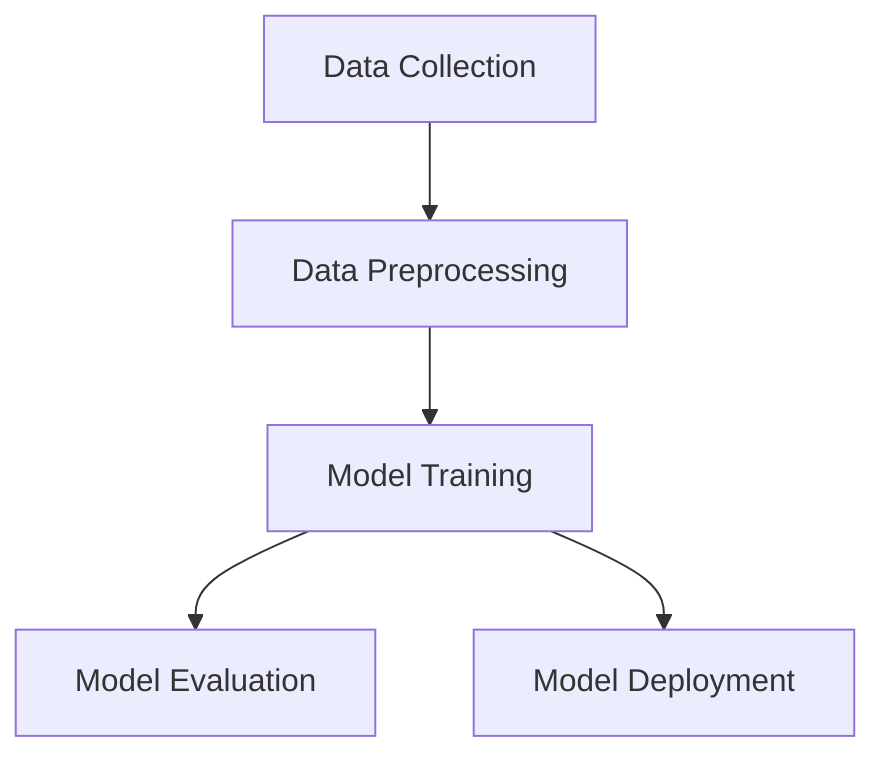
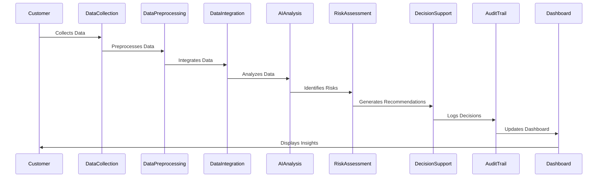
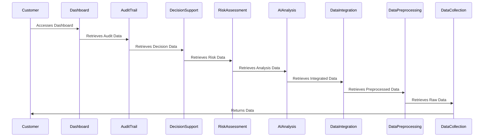

                 


## AI-Assisted Corporate Governance Rating System

### Key Topics

- **Introduction to AI-Assisted Corporate Governance**:
  - The background and importance of AI in corporate governance
  - Current governance issues and the need for effective solutions

- **Fundamental AI Concepts and Principles**:
  - Basic AI principles and methodologies
  - Characteristics and attributes of AI in governance

- **AI Governance Frameworks and Models**:
  - Overview of established frameworks
  - Various AI-based rating systems

- **Technical Foundations of AI-Assisted Governance**:
  - AI algorithms and techniques
  - Python implementation and detailed explanations

- **System Design and Implementation**:
  - Project introduction and functional design
  - System architecture and interface design
  - Practical application and case analysis

- **Best Practices and Conclusion**:
  - Summary of key insights
  - Notes, precautions, and further reading

### Abstract

The AI-Assisted Corporate Governance Rating System aims to address the challenges in corporate governance by leveraging advanced artificial intelligence technologies. This article delves into the background of AI's role in governance, the fundamental concepts and principles, and the technical foundations required for an effective rating system. It provides a comprehensive overview of AI governance frameworks and models, discusses the implementation of AI algorithms, and offers insights into the system design and practical applications. Finally, it summarizes the key takeaways and suggests best practices for implementing an AI-assisted governance rating system.

----------------------------------------------------------------

## Part 1: Introduction to AI-Assisted Corporate Governance

### 1. AI and Corporate Governance: The Background

#### 1.1 The Evolution of AI in Governance

The integration of artificial intelligence (AI) into various sectors has been a significant technological advancement in recent years. Corporate governance, which encompasses the processes and structures by which companies are directed and controlled, has not been left behind in this AI revolution. Historically, the role of AI in governance has evolved from basic automation to more sophisticated applications that enhance decision-making, risk management, and transparency.

Early applications of AI in governance focused on automating routine tasks such as document analysis, compliance checks, and risk assessment. As AI technologies progressed, particularly machine learning algorithms, they began to play a more strategic role. Today, AI is utilized for predictive analytics, natural language processing, and data mining to provide deeper insights into the operational and strategic aspects of a business.

Key milestones in the integration of AI into corporate governance include the development of intelligent compliance systems, the use of AI-driven fraud detection tools, and the implementation of AI-powered audit processes. These advancements have not only improved efficiency but have also reduced the risk of human error and increased accountability.

#### 1.2 The Problem of Corporate Governance

Despite these advancements, corporate governance continues to face several significant challenges. One of the primary issues is the complexity of governance structures, which can vary widely across different organizations and industries. This complexity often leads to inefficiencies, lack of transparency, and potential conflicts of interest.

Another challenge is the increasing frequency and severity of corporate scandals and fraud cases. These incidents not only damage the reputation of companies but also result in significant financial losses and legal consequences. Traditional governance mechanisms often fail to detect and prevent such issues, highlighting the need for more effective and proactive solutions.

Furthermore, the rapid pace of technological change and globalization has created new risks and opportunities for businesses. Corporate governance frameworks that were designed to address historical challenges may not be adequately equipped to handle the complexities of the modern business environment. This requires a more dynamic and adaptive approach to governance that can leverage AI technologies to stay ahead of emerging threats and trends.

#### 1.3 Solutions and Boundaries

The adoption of AI in corporate governance offers several potential solutions to these challenges. AI can provide real-time monitoring and analysis of large volumes of data, enabling companies to identify potential risks and issues before they escalate. AI-driven tools can also enhance the transparency and accountability of governance processes by automating compliance checks, auditing procedures, and decision-making processes.

However, the implementation of AI in governance is not without its limitations. One major concern is the ethical implications of using AI in decision-making processes. AI systems can unintentionally perpetuate biases present in the data they are trained on, leading to unfair treatment of certain groups or individuals. Additionally, there is a risk of over-reliance on AI, which can reduce the human oversight and judgment that are essential for effective governance.

Another boundary is the technical expertise required to develop and maintain AI systems. Companies need to ensure they have the necessary skills and resources to implement and manage these technologies effectively. This includes not only technical expertise in AI algorithms and data analysis but also a deeper understanding of the regulatory and legal frameworks that govern corporate governance practices.

#### 1.4 Core Concepts and Elements

**AI-Assisted Corporate Governance: Definition and Core Components**

AI-assisted corporate governance refers to the application of artificial intelligence technologies to support and enhance the processes and structures of corporate governance. It involves the use of AI algorithms and tools to analyze data, predict future trends, and facilitate decision-making processes.

The core components of an AI-assisted governance system include:

1. **Data Collection and Integration**: This involves gathering and integrating data from various sources, such as financial reports, compliance documents, and market data. The data must be structured and clean to ensure accurate analysis.

2. **AI Algorithms and Models**: These are used to analyze the collected data and generate insights. Common AI algorithms used in governance include machine learning, natural language processing, and predictive analytics.

3. **Risk Assessment and Monitoring**: AI systems can continuously monitor the company's operations and financial performance, identifying potential risks and anomalies.

4. **Decision Support Systems**: These systems provide recommendations and insights to governance bodies, helping them make informed decisions.

5. **Transparency and Accountability**: AI can enhance transparency by automating compliance checks and auditing processes, and by providing real-time insights into the company's operations.

**Entity-Relationship (ER) Diagram**

Below is a Mermaid ER diagram illustrating the core components and their relationships in an AI-assisted corporate governance system:

```mermaid
erDiagram
  DataCollection --> AIAlgorithms : Collects and Structures
  DataCollection --> RiskAssessment : Informs
  AIAlgorithms --> DecisionSupport : Processes Data
  RiskAssessment --> TransparencyAccountability : Enhances
```

### Summary

In summary, the integration of AI into corporate governance offers significant potential to address the complexities and challenges faced by modern businesses. However, it is crucial to approach this integration with careful consideration of the ethical, technical, and operational implications. By leveraging AI technologies effectively, companies can enhance their governance processes, improve decision-making, and reduce risks, ultimately leading to more sustainable and successful operations.

---

In the next section, we will delve deeper into the fundamental AI concepts and principles that underpin AI-assisted corporate governance, providing a solid foundation for understanding the technical aspects of the system.

----------------------------------------------------------------

## Part 2: AI-Driven Governance Concepts and Principles

### 2.1 Fundamental AI Concepts

Artificial Intelligence (AI) is a broad field encompassing various methodologies, algorithms, and technologies designed to enable machines to perform tasks that would typically require human intelligence. Understanding the fundamental concepts of AI is crucial for comprehending how AI can be applied to corporate governance. Below, we outline some of the key principles and methodologies commonly used in AI.

**Machine Learning**

Machine Learning (ML) is a subset of AI that focuses on developing algorithms that can learn from and make predictions or decisions based on data. There are two main types of machine learning:

- **Supervised Learning**: In supervised learning, the algorithm is trained on a labeled dataset, where the input features and the corresponding output labels are provided. The goal is to learn a mapping function that can accurately predict the output for new, unseen data.

- **Unsupervised Learning**: Unsupervised learning involves training the algorithm on unlabeled data. The algorithm must identify patterns or structures within the data, such as clusters or anomalies.

**Deep Learning**

Deep Learning (DL) is a subfield of machine learning that uses neural networks with many layers to model complex data. The most common type of deep learning is Convolutional Neural Networks (CNNs), which are particularly effective for image and video analysis. Another type is Recurrent Neural Networks (RNNs), which are well-suited for sequential data like text or time series.

**Natural Language Processing (NLP)**

Natural Language Processing (NLP) is a branch of AI that focuses on the interaction between computers and humans through natural language. NLP enables machines to understand, interpret, and generate human language. Key techniques in NLP include:

- **Tokenization**: Splitting text into words, sentences, or other meaningful elements.
- **Part-of-Speech Tagging**: Assigning grammatical tags to each word in a sentence to understand its role.
- **Sentiment Analysis**: Determining the sentiment or emotion expressed in a piece of text.
- **Named Entity Recognition (NER)**: Identifying and categorizing named entities within text, such as people, organizations, and locations.

**Predictive Analytics**

Predictive analytics involves using historical data and statistical models to predict future outcomes. In corporate governance, predictive analytics can be used to forecast financial performance, identify potential risks, and optimize decision-making processes.

**Data Mining**

Data mining is the process of discovering patterns and insights from large datasets. Techniques include clustering, classification, association rule learning, and anomaly detection. Data mining is essential for extracting valuable information from the vast amounts of data generated by modern businesses.

### 2.2 AI in Governance: Characteristics and Attributes

AI offers several unique characteristics and attributes that make it particularly valuable for corporate governance. Below is a comparative table outlining the key attributes of traditional governance versus AI-assisted governance:

| Attribute | Traditional Governance | AI-Assisted Governance |
| --- | --- | --- |
| **Data Handling** | Relies on periodic data review | Processes large volumes of real-time data |
| **Speed of Analysis** | Time-consuming manual processes | Real-time analysis and insights |
| **Accuracy** | Subject to human error | Minimized through automated algorithms |
| **Bias** | Potential for human bias | Can perpetuate biases in training data |
| **Transparency** | Limited visibility into decision-making processes | Enhanced through transparent algorithms |
| **Adaptability** | Slow to adapt to changing environments | Rapidly adjusts to new data and trends |
| **Scalability** | Limited by human capacity | Scalable to handle increasing data and complexity |
| **Cost-effectiveness** | High costs for manual labor and compliance | Reduced costs through automation and efficiency gains |
| **Accountability** | Blurred accountability lines | Clearer accountability through data trails |

**ER Diagram**

The following Mermaid ER diagram illustrates the core components and their relationships in an AI-assisted corporate governance system, emphasizing the attributes and characteristics of AI:

```mermaid
erDiagram
  DataProcessing --> GovernanceAnalysis : Drives
  DataProcessing --> DecisionMaking : Informs
  GovernanceAnalysis --> Transparency : Enhances
  DecisionMaking --> Accountability : Ensures
  DataProcessing : [Data Collection & Integration]
  GovernanceAnalysis : [Risk Assessment & Monitoring]
  DecisionMaking : [Decision Support Systems]
  Transparency : [Transparency & Accountability]
```

### Summary

In summary, the application of AI in corporate governance brings a suite of unique characteristics and attributes that can significantly enhance the effectiveness and efficiency of governance processes. By leveraging AI's ability to process large volumes of data in real-time, reduce human error, and provide actionable insights, companies can adopt a more proactive and transparent approach to governance. However, it is essential to be aware of the potential biases and ethical considerations that can arise from the use of AI, ensuring that these technologies are implemented responsibly and with appropriate oversight.

In the next section, we will explore the development of AI governance frameworks and models, discussing the challenges and opportunities they present for modern corporate governance.

----------------------------------------------------------------

## Part 3: AI Governance Frameworks and Models

### 3.1 Framework Development

The development of AI governance frameworks is a critical step in ensuring that AI technologies are used effectively and responsibly within corporate governance. These frameworks provide a structured approach to managing the integration of AI into governance processes, addressing issues related to data privacy, algorithmic bias, and accountability. There are several established AI governance frameworks that have been developed to guide organizations in this process.

**1. FAIR Guidelines**

The FAIR (Findable, Accessible, Interoperable, and Reusable) Data Management and Metadata Governance Framework is one of the most widely recognized guidelines for managing data within AI systems. The FAIR principles emphasize the importance of making data easily findable, accessible, interoperable, and reusable, which is essential for ensuring the transparency and trustworthiness of AI applications.

**2. EU AI Ethics Guidelines**

The EU AI Ethics Guidelines are a comprehensive set of principles and procedures designed to govern the development and deployment of AI systems. These guidelines cover various aspects, including human-centric AI, non-discrimination, privacy, and transparency. They are intended to provide a regulatory framework for ensuring that AI systems are aligned with ethical values and legal requirements.

**3. AI Governance for Enterprise**

The AI Governance for Enterprise framework, developed by the IEEE, provides a comprehensive approach to managing AI within organizations. It includes guidelines for AI strategy, data governance, algorithmic transparency, and accountability. This framework is designed to help organizations build a robust AI governance structure that supports ethical and responsible AI practices.

**Challenges in Framework Adaptation and Implementation**

While these frameworks offer valuable guidance, their adaptation and implementation can present several challenges:

**1. Technical Challenges**

Implementing AI governance frameworks often requires significant technical expertise. Organizations need to ensure that they have the necessary skills and resources to develop and maintain AI systems that comply with the prescribed guidelines. This includes expertise in data management, algorithm development, and cybersecurity.

**2. Organizational Challenges**

Adopting AI governance frameworks may require changes to existing organizational structures and processes. This can be challenging, particularly in large, established organizations where resistance to change is common. Additionally, there may be a need to integrate AI governance into existing governance frameworks, which can be complex and time-consuming.

**3. Ethical and Legal Challenges**

Ensuring that AI systems are developed and deployed ethically and responsibly requires a deep understanding of the ethical and legal implications of AI. Organizations must navigate complex regulatory environments and address issues related to data privacy, bias, and accountability. This requires a multidisciplinary approach that involves legal experts, ethicists, and technologists.

**4. Data Quality and Accessibility**

AI systems rely heavily on data quality and accessibility. Ensuring that data is accurate, complete, and appropriately labeled is essential for building reliable AI models. However, organizations often struggle with data quality issues, such as missing data, inconsistencies, and biases. Addressing these issues requires robust data management practices and a commitment to data quality.

### 3.2 Rating Models

AI governance rating models are tools used to assess the level of adherence to AI governance frameworks and principles within organizations. These models can help organizations identify areas for improvement and ensure that their AI systems are developed and deployed in a manner that aligns with ethical and legal standards. Below are some common types of AI governance rating models:

**1. AI Maturity Models**

AI maturity models assess an organization's readiness and capability to adopt and manage AI technologies. These models typically include a set of criteria and indicators that measure an organization's progress in adopting AI across various dimensions, such as strategy, data management, algorithm development, and governance.

**2. AI Risk Assessment Models**

AI risk assessment models evaluate the potential risks and impacts associated with the use of AI within an organization. These models identify and prioritize risks based on their likelihood and potential impact, helping organizations develop targeted risk mitigation strategies.

**3. AI Compliance Checklists**

AI compliance checklists are tools used to ensure that AI systems comply with relevant legal and ethical standards. These checklists typically include a series of questions and criteria that organizations must meet to demonstrate compliance. They are often used as part of audit and compliance processes.

**4. AI Performance Metrics**

AI performance metrics are used to evaluate the effectiveness and efficiency of AI systems. These metrics can include accuracy, precision, recall, and F1 score for predictive models, as well as efficiency metrics such as processing time and resource utilization.

**Key Differences and Strengths of Rating Models**

Different rating models have their strengths and weaknesses, and organizations may choose to use multiple models to gain a comprehensive assessment of their AI governance practices. Below is a table comparing the key differences and strengths of common rating models:

| Rating Model | Strengths | Limitations |
| --- | --- | --- |
| **AI Maturity Models** | Provides a comprehensive assessment of an organization's readiness to adopt and manage AI technologies. | Can be subjective and difficult to quantify. |
| **AI Risk Assessment Models** | Identifies and prioritizes potential risks associated with AI systems. | May overlook non-routine or novel risks. |
| **AI Compliance Checklists** | Ensures that AI systems comply with legal and ethical standards. | May not cover all relevant compliance requirements. |
| **AI Performance Metrics** | Evaluates the effectiveness and efficiency of AI systems. | May not account for ethical or societal impacts. |

### Summary

The development of AI governance frameworks and models is an essential step in ensuring that AI technologies are used responsibly and effectively within corporate governance. While these frameworks offer valuable guidance, their adaptation and implementation can present significant challenges. Rating models provide tools for assessing an organization's progress and compliance, but they must be used in conjunction with a holistic approach to governance that addresses ethical, legal, and technical considerations.

In the next section, we will delve into the technical foundations of AI-assisted governance, exploring the algorithms and techniques that underpin effective governance systems.

----------------------------------------------------------------

## Part 4: Technical Foundations of AI-Assisted Governance

### 4.1 AI Algorithms and Techniques

To build an effective AI-assisted corporate governance system, it is essential to understand the fundamental algorithms and techniques that drive these systems. This section will discuss several key AI algorithms and their applications in the context of governance, providing a comprehensive overview of how these technologies can be leveraged to enhance governance processes.

#### Common AI Algorithms

1. **Machine Learning Algorithms**

Machine Learning (ML) algorithms are at the core of AI-assisted governance systems. They enable computers to learn from data, identify patterns, and make predictions. Some of the most commonly used ML algorithms in governance include:

   - **Linear Regression**: Used for predicting continuous values, such as financial metrics or stock prices. Linear regression models the relationship between a dependent variable and one or more independent variables using a linear equation.

     $$ y = \beta_0 + \beta_1x $$

     - **Application in Governance**: Predicting financial performance, identifying potential risks, and optimizing operational processes.

   - **Decision Trees**: A tree-like model that represents decisions and their possible consequences. Decision trees split the data into subsets based on the values of input features.

     $$ Decision\ Tree\ Model: \quad Y = f(X) $$

     - **Application in Governance**: Risk assessment, compliance monitoring, and decision-making support.

   - **Random Forests**: An ensemble learning method that combines multiple decision trees to improve predictive accuracy and robustness.

     $$ Predicted\ Value = \text{Mode}(\text{Predictions\ from\ All\ Trees}) $$

     - **Application in Governance**: Predicting financial outcomes, detecting fraud, and improving compliance.

2. **Clustering Algorithms**

Clustering algorithms group data into clusters or segments based on their similarities. These algorithms are useful for data segmentation, customer profiling, and anomaly detection.

   - **K-Means Clustering**: Divides the data into K clusters based on minimization of the sum of squared distances between data points and their corresponding cluster centroids.

     $$ \text{Objective\ Function: } \sum_{i=1}^{n}\sum_{j=1}^{K} \frac{1}{2}\|x_i - \mu_j\|^2 $$

     - **Application in Governance**: Identifying similar risk patterns, segmenting stakeholders, and optimizing resource allocation.

3. **Association Rule Learning**

Association rule learning algorithms discover relationships between variables in large datasets. They are used in market basket analysis, recommendation systems, and fraud detection.

   - **Apriori Algorithm**: A popular algorithm for finding frequent itemsets and generating association rules in transactional databases.

     $$ \text{Support}(A \cup B) \geq \text{min\_support} $$
     $$ \text{Confidence}(A \rightarrow B) \geq \text{min\_confidence} $$

     - **Application in Governance**: Detecting patterns of fraudulent transactions, optimizing compliance procedures, and identifying potential conflicts of interest.

#### Python Implementation

To illustrate the implementation of these algorithms, let's consider a Python example using the Scikit-learn library. We will use a linear regression model to predict financial performance based on historical data.

```python
import numpy as np
import pandas as pd
from sklearn.linear_model import LinearRegression
from sklearn.model_selection import train_test_split
from sklearn.metrics import mean_squared_error

# Load historical financial data
data = pd.read_csv('financial_data.csv')

# Prepare the data
X = data[['revenue', 'expenses']]
y = data['profit']

# Split the data into training and testing sets
X_train, X_test, y_train, y_test = train_test_split(X, y, test_size=0.2, random_state=42)

# Create a linear regression model
model = LinearRegression()

# Train the model
model.fit(X_train, y_train)

# Make predictions
y_pred = model.predict(X_test)

# Evaluate the model
mse = mean_squared_error(y_test, y_pred)
print(f"Mean Squared Error: {mse}")

# Visualize the results
import matplotlib.pyplot as plt

plt.scatter(X_test['revenue'], y_test, color='blue', label='Actual')
plt.plot(X_test['revenue'], y_pred, color='red', linewidth=2, label='Predicted')
plt.xlabel('Revenue')
plt.ylabel('Profit')
plt.title('Revenue vs Profit')
plt.legend()
plt.show()
```

This example demonstrates the basic steps involved in implementing a linear regression model for predictive analytics in corporate governance.

#### Algorithmic Workflow

The following Mermaid diagram illustrates the workflow of a typical machine learning algorithm, highlighting the key steps involved in data preprocessing, model training, and evaluation:



### Summary

In summary, understanding the fundamental AI algorithms and techniques is crucial for building effective AI-assisted corporate governance systems. These algorithms enable the analysis of large datasets, the identification of patterns and trends, and the prediction of future outcomes. By leveraging these technologies, organizations can enhance their governance processes, improve decision-making, and reduce risks. The next section will delve into the system design and implementation of an AI-assisted governance system, providing a comprehensive overview of the technical architecture and practical applications.

----------------------------------------------------------------

## Part 5: System Design and Implementation

### 5.1 Project Introduction and Functional Design

The AI-assisted corporate governance rating system project aims to develop a comprehensive platform that leverages advanced artificial intelligence technologies to enhance the governance processes of organizations. The primary goal is to provide actionable insights and recommendations that help companies make informed decisions, reduce risks, and ensure compliance with regulatory requirements.

#### Functional Requirements

The system is designed to address several key functional requirements:

1. **Data Collection and Integration**: The system must be capable of collecting and integrating data from various sources, including financial reports, compliance documents, and external market data. This data must be structured and clean to ensure accurate analysis.

2. **Risk Assessment and Monitoring**: The system should continuously monitor the company's operations and financial performance, identifying potential risks and anomalies in real-time. This includes detecting fraud, identifying regulatory non-compliance, and predicting financial downturns.

3. **Decision Support Systems**: The system should provide decision-makers with real-time insights and recommendations based on the analysis of collected data. This includes predictive analytics, scenario planning, and optimization of operational processes.

4. **Transparency and Accountability**: The system should enhance transparency by automating compliance checks and auditing processes, and by providing a clear audit trail of all decisions and actions taken by the system.

5. **User Interface**: The system should have a user-friendly interface that allows stakeholders to access and interact with the system's functionalities easily. This includes dashboards for visualizing data, reports, and alerts.

#### Domain Model

The domain model is a conceptual representation of the system's components and their relationships. The following Mermaid UML class diagram illustrates the key entities and their attributes:

```mermaid
classDiagram
  ClassDiagram {
    URL: "https://www.example.ai/governance-rating-system"
    Customer << Customer
    FinancialData << FinancialData
    ComplianceData << ComplianceData
    MarketData << MarketData
    Risk << Risk
    Decision << Decision
    Audit << Audit
    Dashboard << Dashboard
  }

  Customer
  FinancialData
  ComplianceData
  MarketData
  Risk
  Decision
  Audit
  Dashboard

  Customer "1" -- "*" FinancialData
  Customer "1" -- "*" ComplianceData
  Customer "1" -- "*" MarketData
  FinancialData "1" -- "*" Risk
  ComplianceData "1" -- "*" Risk
  MarketData "1" -- "*" Risk
  Risk "1" -- "*" Decision
  Decision "1" -- "*" Audit
  Dashboard "1" -- "*" Risk
  Dashboard "1" -- "*" Decision
  Dashboard "1" -- "*" Audit
```

### 5.2 System Architecture Design

The system architecture design is critical for ensuring the scalability, reliability, and performance of the AI-assisted governance rating system. The following Mermaid diagram illustrates the system's architecture, highlighting the key components and their interactions:



#### Key Components

1. **Data Collection and Integration**: This component is responsible for collecting data from various sources and integrating it into a unified format for analysis. It includes connectors for financial reports, compliance documents, and external market data.

2. **Data Preprocessing**: This component cleans and prepares the data for analysis. It handles tasks such as data normalization, missing value imputation, and outlier detection.

3. **Data Integration**: This component ensures that the data from different sources is structured and compatible for analysis. It includes data warehousing and data transformation processes.

4. **AI Analysis**: This component applies AI algorithms and techniques to analyze the data, generating insights and predictions. It includes modules for machine learning, natural language processing, and predictive analytics.

5. **Risk Assessment**: This component identifies potential risks and anomalies based on the insights generated by the AI analysis. It includes rules-based and machine learning-based approaches for risk detection.

6. **Decision Support**: This component provides decision-makers with real-time insights and recommendations. It includes scenario planning, optimization, and decision optimization tools.

7. **Audit Trail**: This component logs all decisions and actions taken by the system, ensuring transparency and accountability. It includes features for auditing, reporting, and compliance.

8. **Dashboard**: This component provides a user-friendly interface for stakeholders to access the system's functionalities and insights. It includes dashboards for visualizing data, reports, and alerts.

### 5.3 System Interface Design and Interaction

The system interface design is crucial for ensuring that stakeholders can easily interact with the system and access the insights and recommendations provided. The following Mermaid sequence diagram illustrates the interactions between the system components and the user interface:



### 5.4 System Implementation and Practical Application

The system implementation involves developing the software components and integrating them into the overall architecture. Below is a high-level overview of the steps involved in the system implementation:

1. **Environment Setup**: Set up the development and deployment environment, including the necessary hardware, software, and tools.

2. **Data Collection Module**: Develop modules for collecting data from various sources, such as financial reports, compliance documents, and external market data. This involves creating connectors and APIs to access the data.

3. **Data Preprocessing Module**: Develop modules for cleaning and preparing the data for analysis. This includes handling missing values, outliers, and data normalization.

4. **AI Analysis Module**: Develop modules for applying AI algorithms and techniques to analyze the data. This involves implementing machine learning models, natural language processing tools, and predictive analytics methods.

5. **Risk Assessment Module**: Develop modules for identifying potential risks and anomalies based on the insights generated by the AI analysis. This includes implementing rules-based and machine learning-based approaches for risk detection.

6. **Decision Support Module**: Develop modules for providing decision-makers with real-time insights and recommendations. This includes implementing scenario planning, optimization, and decision optimization tools.

7. **Audit Trail Module**: Develop modules for logging all decisions and actions taken by the system, ensuring transparency and accountability. This includes implementing features for auditing, reporting, and compliance.

8. **User Interface**: Develop a user-friendly interface for stakeholders to access the system's functionalities and insights. This includes creating dashboards, reports, and alerts.

9. **Integration and Testing**: Integrate the developed components and perform comprehensive testing to ensure the system's functionality, performance, and reliability.

10. **Deployment**: Deploy the system in the production environment and monitor its performance and usage.

### 5.5 Case Study: AI-Assisted Corporate Governance Rating System in Action

To illustrate the practical application of the AI-assisted corporate governance rating system, consider the case of a multinational corporation facing significant financial and compliance risks. The system was deployed to help the corporation identify and mitigate these risks, enhance decision-making, and ensure compliance with regulatory requirements.

**1. Data Collection and Integration**

The system collected financial data, compliance documents, and external market data from various sources. This data was then integrated into a unified format for analysis.

**2. Data Preprocessing**

The collected data was cleaned and prepared for analysis. This involved handling missing values, outliers, and data normalization to ensure the accuracy and reliability of the analysis.

**3. AI Analysis**

The AI analysis module applied machine learning algorithms and natural language processing techniques to analyze the data. This included predicting financial performance, identifying compliance issues, and detecting potential fraud.

**4. Risk Assessment**

Based on the insights generated by the AI analysis, the risk assessment module identified potential financial and compliance risks. This included predicting financial downturns, detecting non-compliance with regulatory requirements, and identifying fraudulent activities.

**5. Decision Support**

The decision support module provided the corporation's management team with real-time insights and recommendations. This included scenario planning for potential financial outcomes, optimization of operational processes, and actionable recommendations for mitigating identified risks.

**6. Audit Trail**

The audit trail module logged all decisions and actions taken by the system, ensuring transparency and accountability. This included recording the rationale behind decisions, the data used in the analysis, and the outcomes of the recommendations.

**7. User Interface**

The user interface provided the corporation's stakeholders with easy access to the system's functionalities and insights. This included dashboards for visualizing financial performance, compliance status, and risk levels, as well as reports and alerts for monitoring key metrics.

### Summary

In summary, the AI-assisted corporate governance rating system project demonstrates the potential of AI technologies to enhance corporate governance processes. By leveraging advanced AI algorithms and techniques, the system provides actionable insights and recommendations that help organizations make informed decisions, reduce risks, and ensure compliance with regulatory requirements. The case study illustrates the practical application of the system in a real-world scenario, highlighting its effectiveness in improving corporate governance.

In the next section, we will discuss best practices for implementing an AI-assisted governance rating system, highlighting key considerations and recommendations for successful deployment.

----------------------------------------------------------------

## Best Practices for Implementing AI-Assisted Governance Rating System

### 6.1 Project Initiation and Planning

The successful implementation of an AI-assisted governance rating system begins with careful project initiation and planning. This involves defining clear project goals, establishing a cross-functional team, and securing the necessary resources and support.

**1. Define Project Goals and Objectives**

The first step is to clearly define the project goals and objectives. This includes identifying the specific business problems the system is intended to solve, such as improving compliance, reducing risk, or enhancing decision-making. It is essential to align these goals with the overall strategic objectives of the organization.

**2. Establish a Cross-Functional Team**

A cross-functional team is crucial for the successful implementation of the AI-assisted governance rating system. This team should include representatives from various departments, such as finance, compliance, IT, and legal. Each member should bring their unique expertise and perspective to the project, ensuring a comprehensive and well-rounded approach.

**3. Secure Resources and Support**

Implementing an AI-assisted governance rating system requires significant resources, including funding, technology infrastructure, and skilled personnel. It is essential to secure the necessary resources and support from top management and stakeholders to ensure the project's success.

### 6.2 Data Management and Quality

Effective data management and quality are critical to the success of an AI-assisted governance rating system. This involves ensuring that data is collected, stored, and processed correctly, and that it is of high quality.

**1. Data Collection and Integration**

Data collection should be systematic and automated to minimize errors and ensure consistency. It is essential to integrate data from various sources, such as financial reports, compliance documents, and external market data, into a unified format for analysis.

**2. Data Preprocessing**

Data preprocessing involves cleaning and preparing the data for analysis. This includes handling missing values, outliers, and data normalization. It is crucial to establish clear data quality standards and validation processes to ensure the accuracy and reliability of the data.

**3. Data Storage and Security**

Data storage should be secure and compliant with relevant regulations. It is essential to implement robust data storage solutions that can handle large volumes of data and ensure data privacy and confidentiality.

### 6.3 AI Model Development and Validation

Developing and validating AI models is a critical step in the implementation of an AI-assisted governance rating system. This involves selecting appropriate algorithms, training the models on historical data, and validating their performance.

**1. Algorithm Selection**

The choice of AI algorithms should be based on the specific requirements of the governance rating system. For example, machine learning algorithms may be suitable for predictive analytics, while natural language processing techniques may be useful for analyzing compliance documents.

**2. Model Training**

AI models should be trained on large, diverse datasets to ensure they can generalize well to new, unseen data. It is essential to iterate and refine the models based on their performance during training.

**3. Model Validation**

Model validation involves assessing the performance of the trained models using various metrics, such as accuracy, precision, recall, and F1 score. It is important to use a separate validation dataset to evaluate the models' performance objectively.

### 6.4 System Deployment and Maintenance

Deploying and maintaining an AI-assisted governance rating system requires careful planning and execution. This involves integrating the system with existing IT infrastructure, training users, and monitoring its performance.

**1. System Integration**

The AI-assisted governance rating system should be integrated with the organization's existing IT infrastructure, including data warehouses, data lakes, and analytics tools. This ensures seamless data flow and interoperability between systems.

**2. User Training**

Users, including stakeholders and decision-makers, should be trained on how to use the system effectively. This includes understanding the system's functionalities, interpreting the insights and recommendations, and making informed decisions.

**3. System Monitoring and Maintenance**

Regular monitoring and maintenance of the system are essential to ensure its performance, reliability, and security. This includes monitoring data quality, updating AI models as needed, and addressing any issues or vulnerabilities that may arise.

### 6.5 Ethical Considerations and Compliance

Ethical considerations and compliance are critical in the implementation of an AI-assisted governance rating system. This involves addressing issues related to data privacy, algorithmic bias, and accountability.

**1. Data Privacy**

Data privacy must be ensured to comply with relevant regulations, such as the General Data Protection Regulation (GDPR). This includes implementing data anonymization techniques, obtaining consent from data subjects, and ensuring data security.

**2. Algorithmic Bias**

Algorithmic bias can lead to unfair treatment and discrimination. It is essential to identify and mitigate bias in AI models, using techniques such as bias detection and mitigation, fairness-aware training, and bias-correction algorithms.

**3. Accountability**

Ensuring accountability is crucial for maintaining trust in the AI-assisted governance rating system. This involves documenting the decision-making process, ensuring transparency in AI models and algorithms, and establishing clear accountability frameworks.

### Summary

In summary, implementing an AI-assisted governance rating system requires careful planning, skilled personnel, and robust technical infrastructure. By following best practices in project initiation and planning, data management and quality, AI model development and validation, system deployment and maintenance, and ethical considerations and compliance, organizations can successfully leverage AI technologies to enhance their governance processes. The next section will provide a summary of the key insights and takeaways from this article, as well as recommendations for further reading and exploration.

----------------------------------------------------------------

## Summary and Further Reading

In this comprehensive guide to AI-assisted corporate governance rating systems, we have explored the fundamental concepts, technical foundations, system design, and best practices for implementing such systems. Key takeaways include:

1. **The Role of AI in Governance**: AI has evolved from basic automation to strategic tools that enhance decision-making, risk management, and transparency in corporate governance.
2. **Fundamental AI Concepts**: Machine learning, deep learning, natural language processing, and predictive analytics are central to AI-assisted governance systems, providing the analytical power needed for effective governance.
3. **AI Governance Frameworks**: Frameworks like FAIR, EU AI Ethics Guidelines, and IEEE's AI Governance for Enterprise offer structured approaches to integrating AI responsibly into governance practices.
4. **System Design and Implementation**: A well-designed system should include robust data collection, preprocessing, integration, AI analysis, risk assessment, decision support, and transparency mechanisms.
5. **Best Practices**: Successful implementation requires careful project planning, data management, AI model validation, user training, and ethical considerations.

For further reading and exploration, consider the following resources:

1. **Books**:
   - "AI and Machine Learning for Business" by Blaine Mathieu and Max McQueen.
   - "The Ethical Algorithm: The Science of Socially Aware Algorithm Design" by Timnit Gebru and Kaleab Demissie.

2. **Articles and Research Papers**:
   - "Artificial Intelligence and Corporate Governance: An Overview" by K. M. George and V. V. Girija.
   - "AI in Governance: Challenges and Opportunities" by the World Economic Forum.

3. **Online Courses and Certifications**:
   - "AI for Business" on Coursera.
   - "Ethical AI" on edX.

By delving deeper into these resources, you can gain a more nuanced understanding of AI-assisted corporate governance rating systems and their potential to transform organizational performance and governance.

### Author Information

**作者：AI天才研究院/AI Genius Institute & 禅与计算机程序设计艺术 /Zen And The Art of Computer Programming**

AI天才研究院致力于推动人工智能领域的创新与发展，提供前沿技术研究和人才培养。禅与计算机程序设计艺术则深入探讨了计算机编程的艺术与哲学，为技术爱好者提供独特的视角和思考方式。我们期待与您一起探索AI与治理的无限可能。

