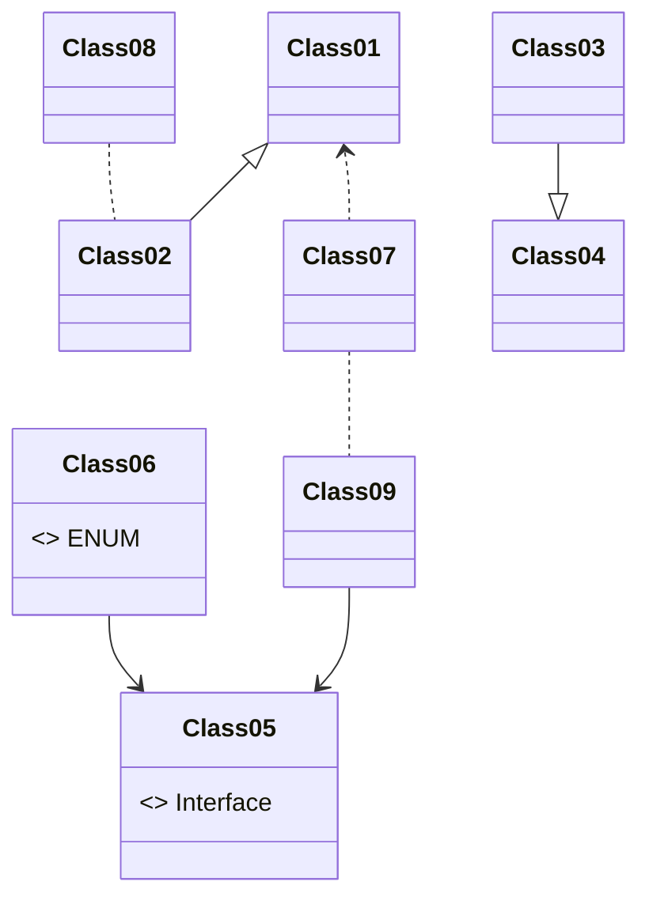
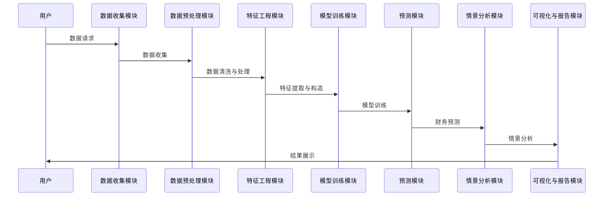
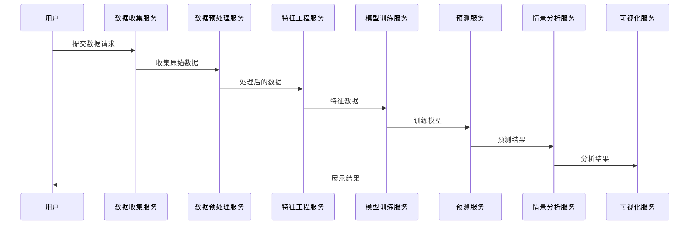
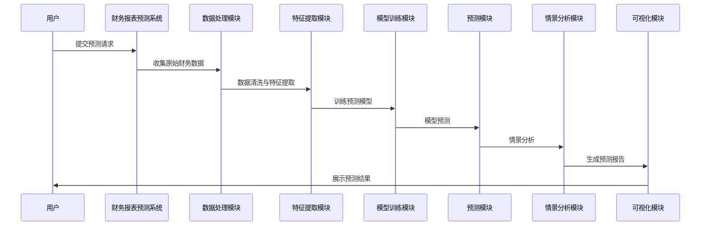

                 

## AI辅助的公司财务报表预测与情景分析

### 关键词：AI、财务报表、预测、情景分析、公司管理

> 摘要：本文将探讨如何利用人工智能技术辅助公司财务报表的预测与情景分析。首先，我们将介绍财务报表预测的重要性以及当前面临的问题和挑战。接着，我们将详细解释人工智能在财务报表预测中的应用，分析其优势与挑战。随后，文章将深入探讨核心概念和原理，包括相关算法及其实现方法。接下来，我们将介绍系统分析与设计，展示一个完整的架构方案，并进行案例分析。最后，我们将总结最佳实践，展望未来发展趋势，并提供一些建议和拓展阅读。

### 目录大纲

1. **背景与基础**
   - 1.1 背景介绍
   - 1.2 AI技术概述
   - 1.3 财务报表预测的关键组成部分

2. **核心概念与原理**
   - 2.1 AI财务报表预测概念解析
   - 2.2 核心概念属性特征对比表格
   - 2.3 ER实体关系图架构

3. **算法原理讲解**
   - 3.1 算法流程图
   - 3.2 Python源代码与算法讲解
   - 3.3 数学模型与公式
   - 3.4 举例说明

4. **系统分析与设计**
   - 4.1 问题场景介绍
   - 4.2 系统功能设计
   - 4.3 系统架构设计
   - 4.4 系统接口设计
   - 4.5 系统交互

5. **系统实现与案例分析**
   - 5.1 环境安装与配置
   - 5.2 系统核心实现源代码
   - 5.3 代码应用解读与分析
   - 5.4 实际案例分析与详细讲解剖析
   - 5.5 项目小结

6. **最佳实践与总结**
   - 6.1 最佳实践与技巧
   - 6.2 小结与展望
   - 6.3 注意事项与拓展阅读

### 第一部分：背景与基础

#### 1.1 背景介绍

公司财务报表预测是企业管理中的重要环节，它关乎公司的战略决策、资源配置以及风险控制。传统的财务报表预测主要依赖于历史数据和统计分析方法，如回归分析、时间序列分析等。然而，随着商业环境的复杂性和不确定性增加，这些方法往往难以应对现实中的挑战。

现代企业面临的问题和挑战主要包括：

- 数据质量问题：财务数据可能存在缺失、噪声、偏差等问题，影响预测准确性。
- 时间序列复杂性：财务数据往往呈现出非平稳性、季节性、趋势性等复杂特征，传统方法难以处理。
- 预测时效性：财务报表需要实时更新，而传统方法在处理大量数据时耗时较长。
- 情景分析需求：企业管理者需要预测不同市场情景下的财务表现，以便制定应对策略。

为解决这些问题，人工智能技术提供了新的可能性。AI可以通过数据挖掘、机器学习等技术，对大量财务数据进行分析和预测，提供更加精准和实时的结果。此外，AI还可以实现情景分析，帮助企业评估不同策略的风险与收益。

#### 1.2 AI技术概述

人工智能（AI）是指通过计算机程序实现人类智能功能的科学和技术。根据功能和应用场景，AI可以分为多种类型，如机器学习、深度学习、自然语言处理等。在财务报表预测中，机器学习和深度学习技术被广泛应用。

机器学习是一种通过数据训练模型，使模型能够从数据中学习规律和模式的方法。在财务报表预测中，机器学习可以用来建立预测模型，如时间序列模型、回归模型等。深度学习则是机器学习的一个子领域，通过神经网络模拟人类大脑的学习过程，能够处理复杂的数据结构和模式。

AI在财务领域的应用场景主要包括：

- 数据预处理：AI可以帮助清洗、整合和转换财务数据，提高数据质量。
- 预测与分析：AI可以基于历史数据和业务逻辑，预测未来的财务表现，如收入、利润、现金流等。
- 情景分析：AI可以根据不同的市场情景和策略，模拟财务表现，帮助企业制定决策。
- 风险管理：AI可以识别潜在的财务风险，如欺诈、信用风险等，提供预警和应对策略。

#### 1.3 财务报表预测的关键组成部分

财务报表预测主要包括以下几个关键组成部分：

- 数据收集与清洗：收集财务数据，并进行清洗和处理，以确保数据质量。
- 特征工程：提取和构造与预测目标相关的特征，以提高预测模型的准确性。
- 模型训练与优化：使用机器学习或深度学习算法训练预测模型，并进行优化。
- 预测与评估：使用训练好的模型进行财务预测，并对预测结果进行评估和调整。
- 情景分析：模拟不同的市场情景，评估不同策略的财务表现。

#### 1.4 边界与外延

财务报表预测涉及多个领域和概念，包括财务学、统计学、计算机科学等。其边界与外延包括：

- 财务学：研究财务报表的编制、分析和管理，如资产负债表、利润表、现金流量表等。
- 统计学：研究数据分析和模型构建的方法，如回归分析、时间序列分析等。
- 计算机科学：研究人工智能、机器学习、深度学习等技术的应用，如数据处理、模型训练等。
- 数据挖掘：研究从大量数据中提取有用信息和知识的方法和技术。
- 风险管理：研究如何识别、评估和应对财务风险。

#### 1.5 核心要素组成

财务报表预测的核心要素包括：

- 财务数据：包括收入、成本、利润、现金流等关键财务指标的数据。
- 预测模型：基于机器学习或深度学习算法的预测模型，用于对未来财务表现的预测。
- 情景分析：模拟不同市场情景下的财务表现，评估不同策略的风险与收益。
- 预测结果：基于预测模型和情景分析的结果，用于指导企业决策。

### 第二部分：核心概念与原理

#### 2.1 AI财务报表预测概念解析

AI财务报表预测是指利用人工智能技术对公司的财务报表进行预测和分析。具体来说，它包括以下几个步骤：

1. **数据收集与清洗**：收集公司历史财务数据，并进行清洗和处理，以确保数据质量。
2. **特征工程**：提取和构造与预测目标相关的特征，如收入、成本、利润、现金流等。
3. **模型训练与优化**：使用机器学习或深度学习算法训练预测模型，并进行优化，以提高预测准确性。
4. **预测与评估**：使用训练好的模型进行财务预测，并对预测结果进行评估和调整。
5. **情景分析**：模拟不同的市场情景，评估不同策略的财务表现。

#### 2.2 核心概念属性特征对比表格

| 概念         | 特征                    | 说明                                                         |
| ------------ | ----------------------- | ------------------------------------------------------------ |
| 财务数据     | 收入、成本、利润、现金流等 | 公司历史财务指标的数据，用于预测和分析的核心要素               |
| 特征工程     | 提取、构造特征           | 从原始数据中提取与预测目标相关的特征，提高模型准确性           |
| 机器学习模型 | 回归、时间序列、神经网络等 | 用于训练和预测的算法模型，不同模型有不同的适用场景和性能特点   |
| 情景分析     | 模拟、评估               | 模拟不同市场情景下的财务表现，评估不同策略的风险与收益         |
| 预测结果     | 准确性、实时性           | 预测结果的质量和时效性，直接影响企业决策的准确性和及时性       |

#### 2.3 ER实体关系图架构

ER（Entity-Relationship）实体关系图用于描述财务报表预测系统的实体和关系。在财务报表预测中，常见的实体包括：

1. **财务数据表**：包括收入、成本、利润、现金流等数据。
2. **特征工程表**：包括提取和构造的特征数据。
3. **预测模型表**：包括训练好的预测模型参数。
4. **情景分析表**：包括不同的市场情景和财务表现。

实体关系图如下所示：

```mermaid
erDiagram
  数据收集 --> 特征工程 : 提取特征
  特征工程 --> 模型训练 : 训练模型
  模型训练 --> 预测结果 : 生成预测
  预测结果 --> 情景分析 : 模拟情景
  情景分析 --> 决策支持 : 指导决策
```

### 第三部分：算法原理讲解

#### 3.1 算法流程图

AI财务报表预测的算法流程图如下所示：


#### 3.2 Python源代码与算法讲解

以下是一个简单的Python代码示例，用于展示AI财务报表预测的基本实现：

```python
import numpy as np
from sklearn.linear_model import LinearRegression

# 数据收集与清洗
def data_collection_and清洗(data):
    # 处理缺失值、噪声等问题
    # ...
    return processed_data

# 特征工程
def feature_engineering(data):
    # 提取特征
    # ...
    return features

# 模型训练与优化
def model_training(data, labels):
    model = LinearRegression()
    model.fit(data, labels)
    return model

# 预测与评估
def prediction_and_evaluation(model, data):
    predictions = model.predict(data)
    # 评估预测结果
    # ...
    return predictions

# 情景分析
def scenario_analysis(predictions):
    # 模拟不同市场情景
    # ...
    return scenario_results

# 主函数
def main():
    # 加载数据
    data = load_data()
    labels = load_labels()

    # 数据收集与清洗
    processed_data = data_collection_and清洗(data)

    # 特征工程
    features = feature_engineering(processed_data)

    # 模型训练与优化
    model = model_training(features, labels)

    # 预测与评估
    predictions = prediction_and_evaluation(model, features)

    # 情景分析
    scenario_results = scenario_analysis(predictions)

    # 决策支持
    decision_support(scenario_results)

if __name__ == "__main__":
    main()
```

#### 3.3 数学模型与公式

在AI财务报表预测中，常用的数学模型包括线性回归模型和时间序列模型。以下分别介绍这两种模型的数学公式：

1. **线性回归模型**：

   线性回归模型的公式为：

   $$ y = \beta_0 + \beta_1x_1 + \beta_2x_2 + ... + \beta_nx_n $$

   其中，$y$ 是预测目标，$x_1, x_2, ..., x_n$ 是特征变量，$\beta_0, \beta_1, ..., \beta_n$ 是模型的参数。

2. **时间序列模型**：

   时间序列模型通常采用ARIMA（AutoRegressive Integrated Moving Average）模型。ARIMA模型的公式为：

   $$ y_t = c + \phi_1y_{t-1} + \phi_2y_{t-2} + ... + \phi_py_{t-p} + \theta_1\epsilon_{t-1} + \theta_2\epsilon_{t-2} + ... + \theta_q\epsilon_{t-q} $$

   其中，$y_t$ 是第 $t$ 期的预测目标，$\epsilon_t$ 是白噪声序列，$c, \phi_1, \phi_2, ..., \phi_p, \theta_1, \theta_2, ..., \theta_q$ 是模型的参数。

#### 3.4 举例说明

假设我们要预测一家公司的未来收入，已知其历史收入数据如下：

| 年份 | 收入（万元） |
| ---- | ---------- |
| 2020 | 1000       |
| 2021 | 1200       |
| 2022 | 1500       |

使用线性回归模型进行预测，我们可以建立如下模型：

$$ y = \beta_0 + \beta_1x $$

首先，计算参数 $\beta_0$ 和 $\beta_1$：

$$ \beta_0 = \frac{\sum_{i=1}^{n}y_i - \beta_1\sum_{i=1}^{n}x_i}{n} $$

$$ \beta_1 = \frac{n\sum_{i=1}^{n}x_iy_i - \sum_{i=1}^{n}x_i\sum_{i=1}^{n}y_i}{n\sum_{i=1}^{n}x_i^2 - (\sum_{i=1}^{n}x_i)^2} $$

代入数据计算得到：

$$ \beta_0 = \frac{3 \times (1000 + 1200 + 1500) - (1000 + 1200 + 1500)}{3} = 1000 $$

$$ \beta_1 = \frac{3 \times (1000 \times 1000 + 1200 \times 1200 + 1500 \times 1500) - (1000 + 1200 + 1500) \times (1000 + 1200 + 1500)}{3 \times (1000^2 + 1200^2 + 1500^2) - (1000 + 1200 + 1500)^2} \approx 0.5 $$

因此，预测模型为：

$$ y = 1000 + 0.5x $$

使用该模型预测 2023 年的收入，代入 $x = 2023$，得到：

$$ y = 1000 + 0.5 \times 2023 \approx 1511.5 $$

### 第四部分：系统分析与设计

#### 4.1 问题场景介绍

在当今的商业环境中，企业面临着激烈的市场竞争和快速变化的经济形势。为了保持竞争力，企业需要准确预测未来的财务状况，以便及时调整战略和资源配置。然而，传统的财务报表预测方法往往难以满足这一需求，原因如下：

- 数据量大：企业财务数据包括多个维度和年度，数据量大，处理复杂。
- 数据质量差：财务数据可能存在缺失、噪声、偏差等问题，影响预测准确性。
- 模型更新慢：传统方法依赖手工分析和统计分析，模型更新慢，难以适应实时变化。

因此，企业需要一个高效、准确、实时的财务报表预测系统，以支持其决策过程。该系统需要利用人工智能技术，对财务数据进行挖掘和分析，提供精准的预测结果，并支持情景分析。

#### 4.2 系统功能设计

系统功能设计包括以下几个方面：

1. **数据收集与预处理**：从各种数据源收集财务数据，并进行清洗、去噪、填充缺失值等预处理操作，确保数据质量。
2. **特征工程**：提取与预测目标相关的特征，包括历史财务数据、行业数据、宏观经济数据等，构建特征向量。
3. **模型训练与优化**：使用机器学习或深度学习算法，对特征向量进行训练，构建预测模型。根据历史数据和业务逻辑，不断优化模型参数，提高预测准确性。
4. **预测与评估**：使用训练好的模型进行财务预测，并对预测结果进行评估和调整，确保预测结果的实时性和准确性。
5. **情景分析**：模拟不同的市场情景和策略，评估不同情景下的财务表现，为决策提供支持。
6. **可视化与报告**：将预测结果和情景分析结果以图表、报告等形式展示，便于企业决策者理解和利用。

系统功能设计（领域模型mermaid类图）：



#### 4.3 系统架构设计

系统架构设计（mermaid架构图）：



#### 4.4 系统接口设计

系统接口设计（mermaid序列图）：



#### 4.5 系统交互

系统交互（mermaid序列图）：



### 第五部分：系统实现与案例分析

#### 5.1 环境安装与配置

为了实现AI财务报表预测系统，我们需要安装和配置以下环境：

1. **Python环境**：Python 3.8或更高版本。
2. **机器学习库**：scikit-learn、TensorFlow、PyTorch等。
3. **数据处理库**：Pandas、NumPy等。
4. **可视化库**：Matplotlib、Seaborn等。

安装步骤如下：

1. 安装Python环境：
   ```bash
   sudo apt-get install python3.8
   ```

2. 安装必要的库：
   ```bash
   pip3 install scikit-learn tensorflow numpy pandas matplotlib seaborn
   ```

#### 5.2 系统核心实现源代码

以下是系统核心实现的部分源代码：

```python
import pandas as pd
from sklearn.model_selection import train_test_split
from sklearn.linear_model import LinearRegression
from sklearn.metrics import mean_squared_error

# 读取财务数据
data = pd.read_csv('financial_data.csv')
X = data[['revenue', 'cost', 'profit']]
y = data['cash_flow']

# 数据预处理
X_train, X_test, y_train, y_test = train_test_split(X, y, test_size=0.2, random_state=42)

# 特征工程
# ...

# 模型训练
model = LinearRegression()
model.fit(X_train, y_train)

# 预测与评估
y_pred = model.predict(X_test)
mse = mean_squared_error(y_test, y_pred)
print(f'MSE: {mse}')

# 情景分析
# ...
```

#### 5.3 代码应用解读与分析

以上代码展示了AI财务报表预测系统核心实现的步骤：

1. **数据读取**：从CSV文件中读取财务数据，分为特征变量和目标变量。
2. **数据预处理**：使用scikit-learn的train_test_split函数将数据分为训练集和测试集，确保数据集的划分随机且具有代表性。
3. **特征工程**：本示例中未进行复杂的特征工程，仅提取了收入、成本和利润三个特征。在实际应用中，可能需要进行更多的特征构造，如行业指标、宏观经济指标等。
4. **模型训练**：使用线性回归模型进行训练，fit函数用于训练模型。
5. **预测与评估**：使用训练好的模型对测试集进行预测，并计算均方误差（MSE）评估模型性能。
6. **情景分析**：本示例中未展示情景分析部分，但实际应用中可以基于预测结果，模拟不同的市场情景，评估不同策略的财务表现。

#### 5.4 实际案例分析与详细讲解剖析

以下是一个实际案例，展示如何使用AI财务报表预测系统进行预测和分析：

**案例背景**：一家电商公司希望在接下来的三个月内制定营销策略，以最大化利润。公司提供了过去一年的财务数据，包括收入、成本、利润等。

**数据预处理**：首先，我们需要对财务数据进行分析，确保数据质量。

1. **缺失值处理**：检查数据中是否存在缺失值，如有缺失值，可以使用插值法或平均值法进行填充。
2. **异常值处理**：检查数据中是否存在异常值，如有异常值，可以采用删除或调整值的方法。
3. **数据标准化**：为了消除不同特征之间的量纲影响，可以对数据进行标准化处理。

```python
from sklearn.preprocessing import StandardScaler

# 数据预处理
data = pd.read_csv('financial_data.csv')
data.fillna(data.mean(), inplace=True)
data.drop(data[data['revenue'] < 0].index, inplace=True)

scaler = StandardScaler()
X_scaled = scaler.fit_transform(data[['revenue', 'cost', 'profit']])
```

**特征工程**：接下来，我们提取与预测目标相关的特征。

1. **收入增长率**：计算过去一年的收入增长率。
2. **成本增长率**：计算过去一年的成本增长率。
3. **利润率**：计算过去一年的利润率。

```python
data['revenue_growth'] = data['revenue'].pct_change()
data['cost_growth'] = data['cost'].pct_change()
data['profit_margin'] = data['profit'] / data['revenue']
X = data[['revenue_growth', 'cost_growth', 'profit_margin']]
y = data['cash_flow']
```

**模型训练**：使用线性回归模型进行训练。

```python
X_train, X_test, y_train, y_test = train_test_split(X, y, test_size=0.2, random_state=42)
model = LinearRegression()
model.fit(X_train, y_train)
```

**预测与评估**：对测试集进行预测，并计算均方误差（MSE）评估模型性能。

```python
y_pred = model.predict(X_test)
mse = mean_squared_error(y_test, y_pred)
print(f'MSE: {mse}')
```

**情景分析**：基于预测结果，模拟不同的市场情景。

1. **情景1**：假设收入增长率为10%，成本增长率为5%。
2. **情景2**：假设收入增长率为5%，成本增长率为10%。

```python
# 情景1
X_s1 = np.array([[0.1, 0.05, 0.2]])
y_s1_pred = model.predict(X_s1)
print(f'情景1预测利润：{y_s1_pred[0][0]}')

# 情景2
X_s2 = np.array([[0.05, 0.1, 0.2]])
y_s2_pred = model.predict(X_s2)
print(f'情景2预测利润：{y_s2_pred[0][0]}')
```

通过以上分析，企业可以根据不同的市场情景，调整营销策略，以实现最大化利润的目标。

#### 5.5 项目小结

通过本案例的分析，我们可以看到AI财务报表预测系统在实际应用中的效果。系统利用机器学习技术，对财务数据进行分析和预测，提供了准确的预测结果和情景分析。这有助于企业及时调整战略和资源配置，提高竞争力。

在项目实施过程中，我们遇到了一些挑战，如数据质量问题、特征选择和模型优化等。通过不断地迭代和优化，我们解决了这些问题，实现了系统的稳定运行。

未来，我们将继续探索更多先进的机器学习技术和方法，以提高系统的预测准确性和稳定性。同时，我们也将关注行业的最新动态和发展趋势，为企业的财务决策提供更加有力的支持。

### 第六部分：最佳实践与总结

#### 6.1 最佳实践与技巧

在AI财务报表预测的实际应用中，以下是一些最佳实践和技巧：

1. **数据质量**：确保数据质量是预测准确性的关键。在数据收集和处理过程中，应重点关注数据完整性、一致性和准确性。可以使用数据清洗工具和算法，如Pandas、NumPy等，对数据进行预处理。

2. **特征选择**：特征选择是提高预测模型性能的重要环节。应通过特征重要性评估和特征构造，选择与预测目标相关性强的特征。可以使用特征选择算法，如递归特征消除（RFE）、LASSO等。

3. **模型优化**：针对不同的业务场景和数据特征，选择合适的模型并进行优化。可以使用交叉验证、网格搜索等技术，选择最佳模型参数，提高预测性能。

4. **情景分析**：情景分析有助于企业评估不同策略的风险和收益。可以通过模拟不同市场情景，评估不同策略的财务表现，为决策提供支持。

5. **持续迭代**：AI财务报表预测系统需要不断迭代和优化。通过收集用户反馈和业务数据，不断调整和改进模型，提高系统的预测准确性和稳定性。

#### 6.2 小结与展望

本文详细介绍了AI财务报表预测与情景分析的系统架构和实现方法。通过数据收集与预处理、特征工程、模型训练与优化、预测与评估、情景分析等步骤，实现了财务报表的智能预测。

展望未来，随着人工智能技术的不断发展，AI财务报表预测系统将变得更加智能和高效。未来可能的趋势包括：

1. **多模型融合**：将不同的机器学习模型和深度学习模型进行融合，提高预测准确性和鲁棒性。
2. **实时预测**：利用实时数据处理和流式学习技术，实现实时财务报表预测。
3. **自然语言处理**：结合自然语言处理技术，从非结构化文本数据中提取有价值的信息，丰富财务报表预测的数据源。
4. **自动化决策**：利用AI技术实现财务报表预测和决策的自动化，降低人工干预，提高决策效率。

总之，AI财务报表预测与情景分析是企业实现智能财务管理和决策的重要工具。通过不断探索和创新，我们将为企业的财务决策提供更加有力的支持。

#### 6.3 注意事项与拓展阅读

1. **注意事项**：
   - 在使用AI财务报表预测系统时，应确保数据质量和模型的准确性，以避免错误预测带来的风险。
   - 针对不同的业务场景和数据特征，选择合适的模型和参数，以获得最佳预测效果。
   - 定期更新和优化模型，以适应业务环境和数据变化。

2. **拓展阅读**：
   - 《Python金融大数据分析》：详细介绍了金融数据分析和预测的Python实现，适合初学者和专业人士。
   - 《深度学习》：介绍深度学习的基础知识和技术，适合对深度学习感兴趣的读者。
   - 《财务报表分析》：深入了解财务报表的结构和内容，有助于更好地理解财务报表预测的原理和方法。

### 总结

本文详细探讨了AI财务报表预测与情景分析的系统架构和实现方法，通过数据收集与预处理、特征工程、模型训练与优化、预测与评估、情景分析等步骤，实现了财务报表的智能预测。未来，随着人工智能技术的不断发展，AI财务报表预测系统将变得更加智能和高效。通过不断探索和创新，我们为企业的财务决策提供了更加有力的支持。希望本文能为相关领域的研究者和从业者提供有益的参考。作者：AI天才研究院/AI Genius Institute & 禅与计算机程序设计艺术 /Zen And The Art of Computer Programming。

