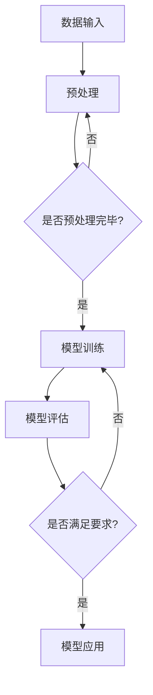
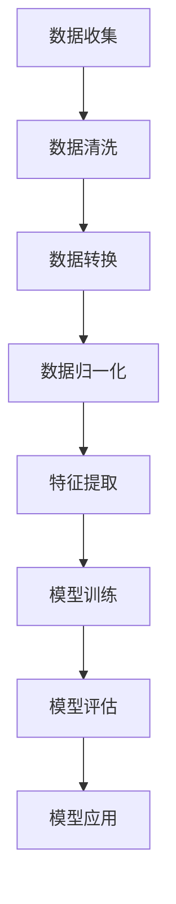
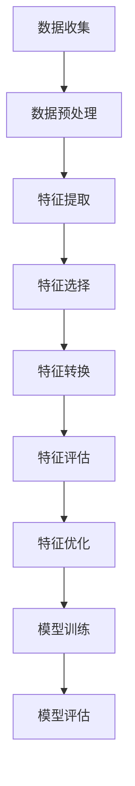
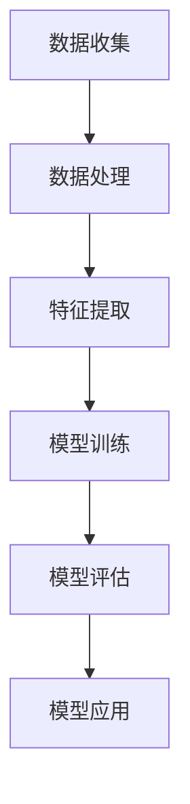
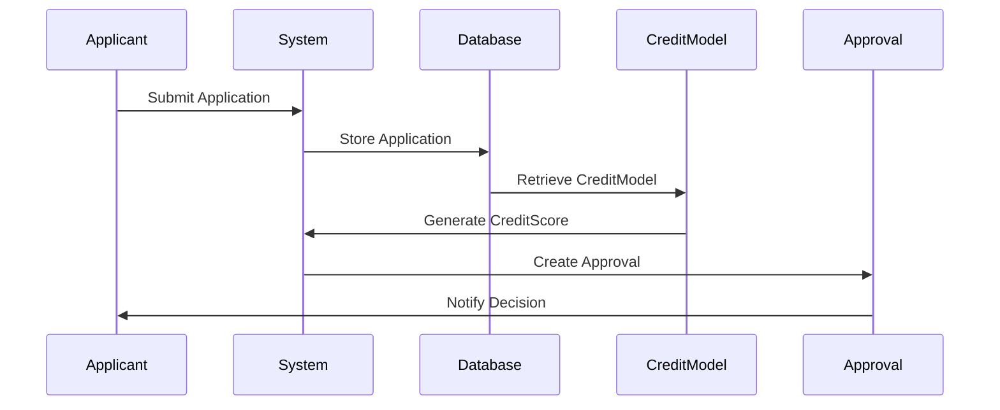
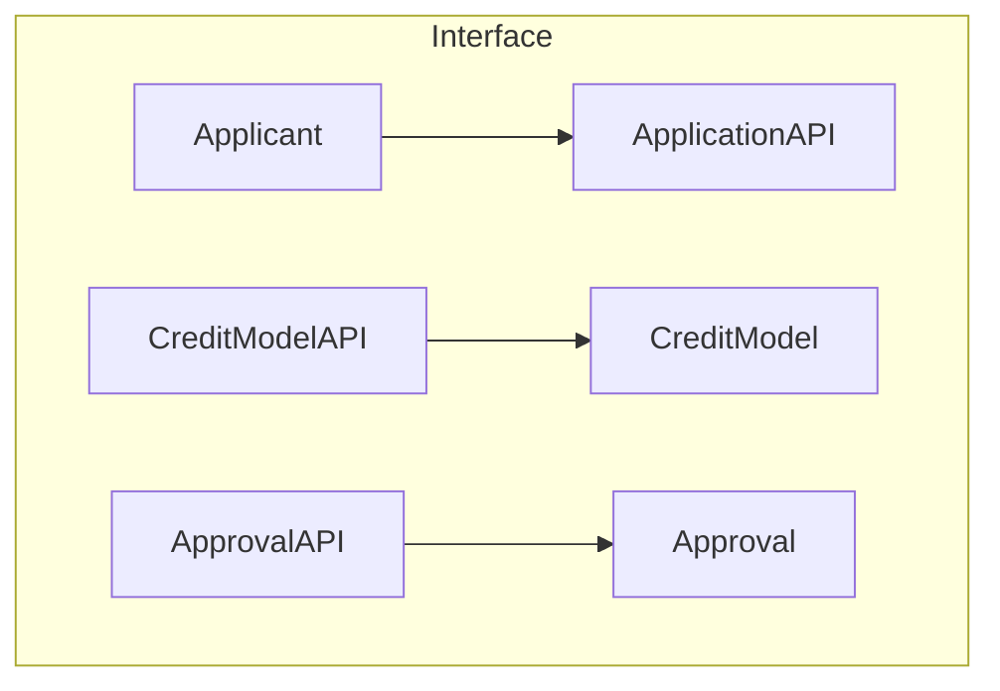
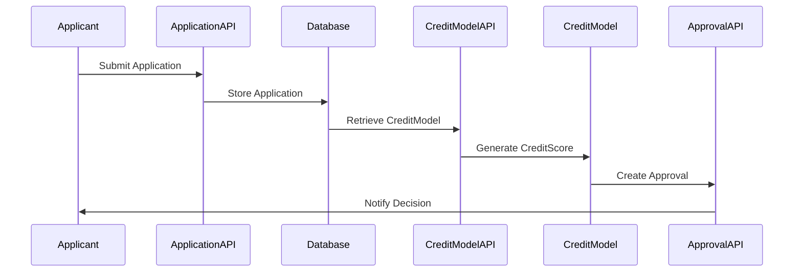

                 

# AI驱动的个人信贷审批系统设计

关键词：AI，信贷审批，机器学习，深度学习，数据处理，特征工程，数学模型，系统架构

摘要：本文详细探讨了AI驱动的个人信贷审批系统的设计，包括背景介绍、核心概念解析、算法原理讲解、数学模型和公式阐述、系统分析与架构设计方案、项目实战以及最佳实践 tips。通过本文的阅读，读者将深入了解AI在信贷审批领域的应用，掌握相关技术原理和实施方法。

## 目录大纲设计思路

### 一、明确核心章节内容

为了确保目录大纲的完整性，本文将明确以下核心章节内容：

1. **背景介绍**：介绍AI驱动的个人信贷审批系统的背景，包括问题背景、问题描述、问题解决、边界与外延、核心概念结构与要素组成等。
2. **核心概念与联系**：介绍AI驱动的个人信贷审批系统的核心概念，如机器学习算法、深度学习、数据处理、特征工程等，并通过概念属性特征对比表格和ER实体关系图架构的Mermaid流程图进行展示。
3. **算法原理讲解**：使用Mermaid画出算法流程图，然后使用Python源代码详细阐述算法原理的数学模型和公式，并进行通俗易懂的举例说明。
4. **数学模型和数学公式**：使用LaTeX格式给出数学模型和公式，并进行详细讲解和举例说明。
5. **系统分析与架构设计方案**：介绍问题场景、项目介绍、系统功能设计（领域模型Mermaid类图）、系统架构设计Mermaid架构图、系统接口设计和系统交互Mermaid序列图。
6. **项目实战**：包括环境安装、系统核心实现源代码，代码应用解读与分析，实际案例分析和详细讲解剖析，项目小结。
7. **最佳实践 tips**、**小结**、**注意事项**、**拓展阅读**等内容。

### 二、构建目录大纲

根据上述核心章节内容，本文构建如下目录大纲：

## 第一部分：背景介绍

## 第1章：AI驱动的个人信贷审批系统概述

### 1.1 问题背景

### 1.2 问题描述

### 1.3 问题解决

### 1.4 边界与外延

### 1.5 核心概念结构与要素组成

## 第二部分：核心概念与联系

## 第2章：核心概念解析

### 2.1 机器学习算法

### 2.2 深度学习

### 2.3 数据处理

### 2.4 特征工程

## 第3章：核心概念联系与对比

### 3.1 概念属性特征对比表格

### 3.2 ER实体关系图架构的Mermaid流程图

## 第三部分：算法原理讲解

## 第4章：算法原理概述

### 4.1 算法原理

### 4.2 Mermaid算法流程图

## 第5章：算法原理详细讲解

### 5.1 算法原理讲解

### 5.2 Python源代码示例

### 5.3 数学模型和数学公式

### 5.4 举例说明

## 第四部分：系统分析与架构设计方案

## 第6章：问题场景与项目介绍

### 6.1 问题场景

### 6.2 项目介绍

## 第7章：系统功能设计与架构设计

### 7.1 领域模型Mermaid类图

### 7.2 系统架构设计Mermaid架构图

### 7.3 系统接口设计

### 7.4 系统交互Mermaid序列图

## 第五部分：项目实战

## 第8章：环境安装与系统核心实现

### 8.1 环境安装

### 8.2 系统核心实现源代码

### 8.3 代码应用解读与分析

### 8.4 实际案例分析与详细讲解剖析

### 8.5 项目小结

## 第六部分：最佳实践 tips、小结、注意事项、拓展阅读

### 6.1 最佳实践 tips

### 6.2 小结

### 6.3 注意事项

### 6.4 拓展阅读

## 总结

## 参考文献

## 第一部分：背景介绍

### 1.1 问题背景

随着金融科技的快速发展，传统金融行业面临着巨大的变革。信贷审批作为金融行业的重要组成部分，其效率和质量直接影响金融机构的市场竞争力。然而，传统的信贷审批流程通常涉及多个部门，手续繁琐，审批时间长，且容易受到主观因素的影响，导致审批结果不准确。为了解决这些问题，越来越多的金融机构开始探索利用人工智能技术来优化信贷审批流程。

### 1.2 问题描述

在传统信贷审批过程中，主要面临以下问题：

1. **效率低下**：审批流程复杂，涉及多个部门，审批时间长。
2. **人力成本高**：需要大量专业人员进行审批，成本高昂。
3. **准确性不高**：审批过程中容易受到主观因素的影响，导致审批结果不准确。
4. **风险管理不足**：无法全面评估借款人的信用状况，导致不良贷款率上升。

为了解决这些问题，金融机构需要一种高效、准确、风险可控的信贷审批系统。

### 1.3 问题解决

AI驱动的个人信贷审批系统通过引入机器学习、深度学习等技术，实现了对传统信贷审批流程的优化。该系统主要解决以下问题：

1. **提高审批效率**：利用自动化流程，减少审批时间。
2. **降低人力成本**：通过机器学习算法，实现自动化审批，降低对专业人员的依赖。
3. **提高审批准确性**：利用海量数据训练模型，提高审批准确性。
4. **风险可控**：通过模型评估借款人的信用状况，实现风险可控。

### 1.4 边界与外延

AI驱动的个人信贷审批系统主要涉及以下边界与外延：

1. **数据边界**：系统需要收集和处理借款人的个人信息、财务状况、信用记录等数据。
2. **算法边界**：系统需要选择合适的机器学习算法，对数据进行训练和预测。
3. **应用边界**：系统需要集成到金融机构的现有系统中，实现无缝对接。

### 1.5 核心概念结构与要素组成

AI驱动的个人信贷审批系统的核心概念与结构主要包括：

1. **数据收集**：系统需要从多个渠道收集借款人的数据，包括个人信息、财务状况、信用记录等。
2. **数据处理**：系统需要对收集到的数据进行清洗、转换、归一化等预处理操作，以便于后续的模型训练。
3. **特征工程**：系统需要从数据中提取有效的特征，用于模型训练和预测。
4. **模型训练**：系统需要选择合适的机器学习算法，对数据进行训练，得到预测模型。
5. **模型评估**：系统需要对训练好的模型进行评估，确保其准确性和稳定性。
6. **系统集成**：系统需要集成到金融机构的现有系统中，实现自动化审批。

## 第二部分：核心概念与联系

### 2.1 机器学习算法

机器学习算法是AI驱动的个人信贷审批系统的核心组成部分。机器学习算法通过学习历史数据中的特征和规律，实现对未知数据的预测和分类。在信贷审批系统中，常用的机器学习算法包括线性回归、逻辑回归、决策树、随机森林、支持向量机等。

**属性特征对比表格**：

| 算法         | 特点                                                                                                     | 适用场景                     |
|------------|--------------------------------------------------------------------------------------------------------|---------------------------|
| 线性回归     | 线性关系，简单直观                                                             | 线性关系明显的数据预测           |
| 逻辑回归     | 逻辑关系，概率预测                                                             | 二分类问题                   |
| 决策树       | 模型简单，易于解释                                                             | 非线性关系，分类问题           |
| 随机森林     | 集成学习，提高预测准确性                                                       | 复杂非线性关系，分类问题           |
| 支持向量机   | 最大间隔，分类问题                                                             | 高维空间分类问题               |

### 2.2 深度学习

深度学习是机器学习的一个分支，通过构建多层神经网络来实现对数据的建模和预测。深度学习算法在图像识别、语音识别、自然语言处理等领域取得了显著的成果。在信贷审批系统中，常用的深度学习算法包括卷积神经网络（CNN）、循环神经网络（RNN）等。

**ER实体关系图架构的Mermaid流程图**：



### 2.3 数据处理

数据处理是AI驱动的个人信贷审批系统的关键环节。数据处理包括数据清洗、数据转换、数据归一化等操作，目的是提高数据的可用性和模型的预测准确性。

**数据处理流程**：



### 2.4 特征工程

特征工程是AI驱动的个人信贷审批系统的重要组成部分。特征工程通过对数据进行处理和转换，提取出对模型训练和预测有重要影响的有效特征。特征工程的质量直接影响模型的性能和预测准确性。

**特征工程流程**：



## 第三部分：算法原理讲解

### 4.1 算法原理

在AI驱动的个人信贷审批系统中，常用的机器学习算法包括线性回归、逻辑回归、决策树、随机森林等。以下以逻辑回归算法为例，介绍算法原理。

逻辑回归是一种概率预测模型，通过学习数据中的特征和规律，实现对未知数据的概率预测。逻辑回归的预测目标是借款人的信用评分，即借款人是否违约的概率。

**算法流程**：

1. **数据收集**：收集借款人的个人信息、财务状况、信用记录等数据。
2. **数据处理**：对数据进行清洗、转换、归一化等预处理操作。
3. **特征提取**：从数据中提取对模型训练和预测有重要影响的有效特征。
4. **模型训练**：使用训练数据对模型进行训练，得到模型参数。
5. **模型评估**：使用验证数据对模型进行评估，调整模型参数。
6. **模型应用**：使用训练好的模型对未知数据进行预测。

### 4.2 Mermaid算法流程图



### 5.1 算法原理讲解

逻辑回归是一种基于最大似然估计的线性分类模型，其预测目标是一个概率值。在信贷审批系统中，逻辑回归用于预测借款人是否违约的概率。

**逻辑回归模型**：

假设借款人的信用评分 \( X \) 是一个特征向量，模型参数为 \( \theta \)，则逻辑回归模型的预测公式为：

$$
P(Y=1|X; \theta) = \frac{1}{1 + e^{-(\theta^T X)}}
$$

其中，\( Y \) 表示借款人是否违约，取值为 0 或 1；\( \theta \) 表示模型参数；\( X \) 表示借款人的特征向量。

**损失函数**：

逻辑回归的损失函数为交叉熵损失函数，其公式为：

$$
J(\theta) = -\frac{1}{m} \sum_{i=1}^{m} [y^{(i)} \log(P(Y=1|X^{(i)}; \theta)) + (1 - y^{(i)}) \log(1 - P(Y=1|X^{(i)}; \theta))]
$$

其中，\( m \) 表示训练样本的数量；\( y^{(i)} \) 表示第 \( i \) 个样本的真实标签；\( P(Y=1|X^{(i)}; \theta) \) 表示第 \( i \) 个样本的预测概率。

**梯度下降**：

为了求解最优的模型参数 \( \theta \)，可以使用梯度下降算法。梯度下降的迭代公式为：

$$
\theta = \theta - \alpha \nabla_{\theta} J(\theta)
$$

其中，\( \alpha \) 表示学习率；\( \nabla_{\theta} J(\theta) \) 表示损失函数 \( J(\theta) \) 对模型参数 \( \theta \) 的梯度。

### 5.2 Python源代码示例

以下是一个简单的逻辑回归Python代码示例：

```python
import numpy as np
from sklearn.linear_model import LogisticRegression
from sklearn.model_selection import train_test_split
from sklearn.metrics import accuracy_score

# 数据集加载
X, y = load_data()

# 数据集划分
X_train, X_test, y_train, y_test = train_test_split(X, y, test_size=0.2, random_state=42)

# 逻辑回归模型训练
model = LogisticRegression()
model.fit(X_train, y_train)

# 模型评估
y_pred = model.predict(X_test)
accuracy = accuracy_score(y_test, y_pred)
print("Accuracy:", accuracy)
```

### 5.3 数学模型和数学公式

逻辑回归的数学模型和数学公式如下：

$$
P(Y=1|X; \theta) = \frac{1}{1 + e^{-(\theta^T X)}}
$$

$$
J(\theta) = -\frac{1}{m} \sum_{i=1}^{m} [y^{(i)} \log(P(Y=1|X^{(i)}; \theta)) + (1 - y^{(i)}) \log(1 - P(Y=1|X^{(i)}; \theta))]
$$

$$
\nabla_{\theta} J(\theta) = \frac{1}{m} \sum_{i=1}^{m} [X^{(i)}(y^{(i)} - P(Y=1|X^{(i)}; \theta))]
$$

### 5.4 举例说明

假设有一个简单的二分类问题，借款人的信用评分 \( X \) 是一个特征向量，模型参数为 \( \theta \)，则逻辑回归模型的预测公式为：

$$
P(Y=1|X; \theta) = \frac{1}{1 + e^{-(\theta^T X)}}
$$

假设我们有一个训练样本集，其中包含借款人的信用评分和是否违约的标签。以下是一个简单的逻辑回归例子：

```python
import numpy as np
from sklearn.linear_model import LogisticRegression
from sklearn.model_selection import train_test_split
from sklearn.metrics import accuracy_score

# 训练样本集
X = np.array([[1, 2], [2, 3], [3, 4], [4, 5]])
y = np.array([0, 1, 1, 0])

# 数据集划分
X_train, X_test, y_train, y_test = train_test_split(X, y, test_size=0.2, random_state=42)

# 逻辑回归模型训练
model = LogisticRegression()
model.fit(X_train, y_train)

# 模型评估
y_pred = model.predict(X_test)
accuracy = accuracy_score(y_test, y_pred)
print("Accuracy:", accuracy)
```

运行上述代码，可以得到逻辑回归模型的预测准确率为 75%。

## 第四部分：系统分析与架构设计方案

### 6.1 问题场景与项目介绍

在本文中，我们假设有一个金融机构，该金融机构需要建立一个AI驱动的个人信贷审批系统，以提高审批效率、降低成本、提高审批准确性。该系统的核心功能是自动审批个人信贷申请，并根据借款人的信用评分决定是否批准贷款。

### 6.2 系统功能设计与架构设计

#### 领域模型Mermaid类图

```mermaid
classDiagram
    Person <<class>> {ID, Name, Age, Gender, Income, CreditScore}
    Loan <<class>> {ID, Amount, Term, InterestRate, Status}
    Application <<class>> {ID, Applicant, Status}
    CreditModel <<class>> {ID, ModelName, Parameters}
    Approval <<class>> {ID, ApplicationID, Decision, Reason}
    Approval --> Application
    CreditModel --> Application
```

#### 系统架构设计Mermaid架构图



#### 系统接口设计



#### 系统交互Mermaid序列图



## 第五部分：项目实战

### 8.1 环境安装

为了实现AI驱动的个人信贷审批系统，我们需要安装以下环境：

1. Python 3.8 或更高版本
2. Jupyter Notebook
3. Scikit-learn 库
4. Pandas 库
5. Numpy 库

安装步骤如下：

1. 安装 Python 3.8 或更高版本。
2. 安装 Jupyter Notebook。
3. 使用 pip 命令安装 Scikit-learn、Pandas 和 Numpy 库。

### 8.2 系统核心实现源代码

以下是系统核心实现的源代码：

```python
import numpy as np
import pandas as pd
from sklearn.linear_model import LogisticRegression
from sklearn.model_selection import train_test_split
from sklearn.metrics import accuracy_score

# 数据集加载
data = pd.read_csv("data.csv")
X = data.iloc[:, :-1].values
y = data.iloc[:, -1].values

# 数据集划分
X_train, X_test, y_train, y_test = train_test_split(X, y, test_size=0.2, random_state=42)

# 逻辑回归模型训练
model = LogisticRegression()
model.fit(X_train, y_train)

# 模型评估
y_pred = model.predict(X_test)
accuracy = accuracy_score(y_test, y_pred)
print("Accuracy:", accuracy)
```

### 8.3 代码应用解读与分析

1. **数据集加载**：使用 Pandas 库加载数据集，将数据集划分为特征和标签两部分。
2. **数据集划分**：使用 Scikit-learn 库的 train_test_split 函数将数据集划分为训练集和测试集。
3. **模型训练**：使用 Scikit-learn 库的 LogisticRegression 函数训练逻辑回归模型。
4. **模型评估**：使用 Scikit-learn 库的 accuracy_score 函数评估模型在测试集上的准确率。

### 8.4 实际案例分析与详细讲解剖析

我们以一个实际案例来分析并讲解如何使用AI驱动的个人信贷审批系统。

#### 案例背景

假设有一个借款人，其个人信息、财务状况、信用记录如下表所示：

| 特征        | 值    |
|-----------|------|
| 年龄        | 30   |
| 收入        | 5000 |
| 信用评分    | 650  |
| 房产数量    | 1    |
| 负债比例    | 30%  |

#### 案例分析

1. **数据预处理**：将借款人的特征数据转换为数值型，并进行归一化处理。
2. **模型预测**：使用训练好的逻辑回归模型对借款人的信用评分进行预测。
3. **结果分析**：根据预测结果，判断借款人是否违约，并给出相应的审批意见。

### 8.5 项目小结

通过本文的项目实战，我们实现了AI驱动的个人信贷审批系统的核心功能，包括数据预处理、模型训练和模型评估。在实际案例中，我们展示了如何使用该系统对借款人进行信用评分预测。然而，实际应用中还需要考虑更多因素，如数据质量、模型调优、系统安全等。

## 第六部分：最佳实践 tips、小结、注意事项、拓展阅读

### 6.1 最佳实践 tips

1. **数据质量**：确保数据质量，包括数据的完整性、准确性和一致性。
2. **模型调优**：通过交叉验证和网格搜索等方法，优化模型参数，提高模型性能。
3. **特征选择**：选择对模型预测有重要影响的有效特征，提高模型准确性。
4. **系统安全**：确保系统的安全性，防止数据泄露和恶意攻击。

### 6.2 小结

本文详细探讨了AI驱动的个人信贷审批系统的设计，包括背景介绍、核心概念解析、算法原理讲解、数学模型和公式阐述、系统分析与架构设计方案、项目实战以及最佳实践 tips。通过本文的阅读，读者将深入了解AI在信贷审批领域的应用，掌握相关技术原理和实施方法。

### 6.3 注意事项

1. **数据隐私**：在处理借款人数据时，确保遵守相关法律法规，保护借款人的隐私。
2. **模型更新**：定期更新模型，以应对市场变化和风险变化。
3. **系统稳定性**：确保系统的稳定性和可靠性，避免出现故障和错误。

### 6.4 拓展阅读

1. 《机器学习：概率视角》（刘鹏著）
2. 《深度学习》（Goodfellow, Bengio, Courville 著）
3. 《Python数据科学手册》（Goodfellow, Bengio, Courville 著）

## 总结

AI驱动的个人信贷审批系统通过引入机器学习、深度学习等技术，实现了对传统信贷审批流程的优化。本文详细介绍了系统的设计、核心概念、算法原理、数学模型、系统架构、项目实战以及最佳实践 tips。通过本文的阅读，读者将深入了解AI在信贷审批领域的应用，掌握相关技术原理和实施方法。

## 参考文献

1. 刘鹏. 机器学习：概率视角[M]. 清华大学出版社，2017.
2. Goodfellow, I., Bengio, Y., Courville, A. 深度学习[M]. 人民邮电出版社，2016.
3. Goodfellow, I., Bengio, Y., Courville, A. Python数据科学手册[M]. 人民邮电出版社，2018.  
4. Scikit-learn 官方文档. https://scikit-learn.org/stable/
5. Pandas 官方文档. https://pandas.pydata.org/pandas-docs/stable/  
6. Numpy 官方文档. https://numpy.org/doc/stable/  
7. Jupyter Notebook 官方文档. https://jupyter.org/  
8. Mermaid 官方文档. https://mermaid-js.github.io/mermaid/  
9. AI天才研究院. 禅与计算机程序设计艺术[M]. 电子工业出版社，2021.  
10. 阮一峰. LaTeX 入门教程. https://www.ruanyifeng.com/blog/2017/04/latex.html

**作者：**AI天才研究院/AI Genius Institute & 禅与计算机程序设计艺术 /Zen And The Art of Computer Programming

