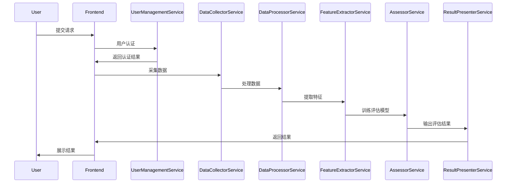
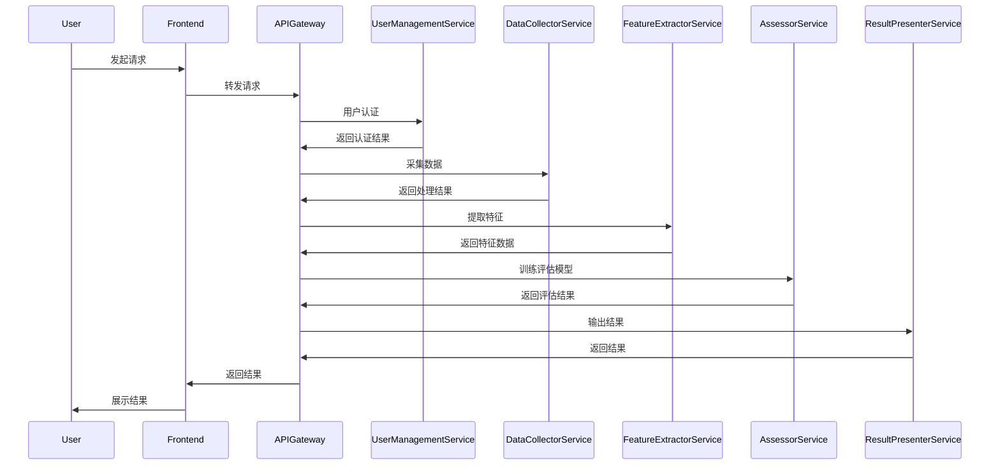
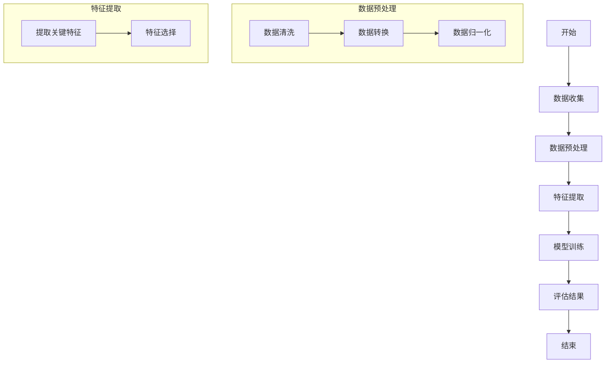

                 

### 引言

#### AI与财务健康评估的背景

随着人工智能（AI）技术的快速发展，其在各个领域的应用越来越广泛，从医疗、金融到教育，AI正在重塑各行各业。在财务领域，AI的应用同样正在引发一场革命。传统的个人财务健康评估依赖于手动输入数据和人工分析，这种方式效率低下且容易出现错误。而AI驱动的个人财务健康评估系统，通过大数据分析和机器学习算法，可以自动分析用户财务数据，提供实时、准确的财务健康报告。

#### 书的目的和读者对象

本书旨在深入探讨AI驱动的个人财务健康评估系统的设计原理和实现方法。通过本书，读者可以了解到：

1. **AI与财务健康评估的基本概念**：理解AI和财务健康评估的基本原理，以及它们之间的联系。
2. **系统分析与架构设计**：掌握系统设计与架构的基本流程，包括领域模型、系统架构和接口设计。
3. **算法原理讲解**：了解AI算法在财务健康评估中的应用，包括数据预处理、特征提取和模型训练等。
4. **项目实战**：通过实际案例和代码实现，掌握系统的开发过程和关键技术的应用。
5. **最佳实践 Tips**：提供开发过程中的一些最佳实践和注意事项，帮助读者在实际应用中避免常见问题。

本书适合对AI和财务领域有一定了解的技术人员、研究人员以及对个人财务健康评估感兴趣的普通读者。

### 背景介绍

#### 问题背景

在现代社会，个人财务健康对于每个人的生活质量和未来规划具有重要意义。传统的财务健康评估依赖于手动输入和人工分析，不仅效率低下，而且容易出错。随着金融数据的日益复杂和多样化，传统的评估方式已经难以满足需求。因此，迫切需要一种高效、准确的自动化评估工具来辅助个人财务管理。

#### 问题描述

个人财务健康评估的问题主要包括以下几个方面：

1. **数据收集与处理**：个人财务数据通常来源于多种渠道，如银行账户、投资账户、信用卡记录等。如何有效地收集、整合这些数据，并进行预处理，是评估系统面临的首要问题。
2. **评估指标定义**：财务健康评估需要定义一系列指标来衡量个人财务状况，如债务收入比、储蓄率、资产配置等。这些指标的选取和计算方法需要科学合理。
3. **评估算法选择**：如何选择合适的算法对财务数据进行分析，是评估系统成功的关键。传统的统计方法可能无法处理大数据和复杂的关系网络，需要引入机器学习等高级算法。
4. **评估结果解释**：评估结果需要以用户容易理解的方式呈现，提供个性化的财务建议和改进方案。

#### 问题解决

为了解决上述问题，设计一个AI驱动的个人财务健康评估系统是可行的方案。具体解决思路如下：

1. **数据集成与预处理**：利用大数据技术和数据挖掘算法，对多源财务数据进行集成和预处理，提取有效的特征信息。
2. **指标体系构建**：根据财务健康评估的需求，构建一套科学的指标体系，包括债务收入比、储蓄率、资产配置等关键指标。
3. **机器学习算法应用**：选择合适的机器学习算法，如决策树、随机森林、支持向量机等，对财务数据进行分析和预测。
4. **用户交互与结果解释**：设计友好的用户界面，将评估结果以图表、文字等形式直观地展示给用户，并提供个性化的财务建议。

#### 边界与外延

在实施AI驱动的个人财务健康评估系统时，需要考虑以下几个边界和外延：

1. **数据隐私与安全**：确保用户财务数据的安全和隐私，遵守相关法律法规，避免数据泄露。
2. **系统可扩展性**：随着用户数量的增加和数据规模的扩大，系统需要具备良好的可扩展性，以应对未来的需求。
3. **用户需求变化**：用户需求是不断变化的，系统需要具备一定的灵活性和适应性，以快速响应市场变化。
4. **跨平台兼容性**：系统需要支持多种平台，如Web、移动端等，以满足不同用户的使用需求。

#### 概念结构与核心要素组成

AI驱动的个人财务健康评估系统主要由以下几个核心组成部分构成：

1. **数据层**：包括财务数据源、数据存储和数据预处理模块。
2. **算法层**：包括机器学习算法、数据挖掘算法和评估模型。
3. **应用层**：包括用户交互界面、评估报告生成和财务建议系统。
4. **支持层**：包括系统运维、数据安全、用户支持和文档管理等。

通过以上核心组成部分的协同工作，AI驱动的个人财务健康评估系统可以实现对用户财务数据的自动化分析和评估，提供个性化的财务建议和服务。

### 核心概念与联系

#### AI驱动的概念

人工智能（AI）是指计算机系统模拟人类智能行为的技术。AI通过机器学习、深度学习、自然语言处理等技术，使计算机具备学习、推理、规划、感知和自我修正的能力。在财务健康评估中，AI的应用主要包括以下几个方面：

1. **数据挖掘**：通过分析大量财务数据，发现潜在的模式和规律，为财务健康评估提供依据。
2. **预测分析**：利用历史数据，预测用户未来的财务状况，为用户提供前瞻性的财务建议。
3. **自动化决策**：基于预设的规则和算法，自动生成财务健康评估报告和改进方案。

#### 个人财务健康评估的概念

个人财务健康评估是指通过一系列指标和模型，对个人的财务状况进行量化分析和评估。评估内容包括债务收入比、储蓄率、资产配置、投资风险等。个人财务健康评估旨在帮助用户了解自身的财务状况，制定合理的财务规划。

#### 两者之间的联系

AI驱动的个人财务健康评估系统是将AI技术应用于个人财务健康评估的过程。两者之间的联系主要体现在以下几个方面：

1. **数据驱动**：AI驱动的评估系统依赖于大量的财务数据，通过数据挖掘和机器学习算法，分析用户财务状况，提供个性化的评估报告。
2. **智能化分析**：AI技术使得评估过程更加智能化，不仅能够处理复杂的数据，还能自动生成评估报告和改进方案。
3. **个性化服务**：通过分析用户行为数据和偏好，AI驱动的系统可以提供个性化的财务建议和服务，帮助用户实现财务健康。

### 系统分析与架构设计方案

#### 问题场景介绍

在一个典型的AI驱动的个人财务健康评估项目中，用户通常需要通过系统上传自己的财务数据，包括银行账户信息、投资账户信息、信用卡记录等。系统会自动对这些数据进行处理和分析，生成一份详细的财务健康评估报告，并给出个性化的财务建议。

#### 项目介绍

本项目旨在设计并实现一个AI驱动的个人财务健康评估系统。系统的主要功能包括：

1. **数据收集与预处理**：从不同数据源收集用户财务数据，并进行清洗、转换和归一化处理。
2. **特征提取**：从预处理后的数据中提取关键特征，为后续的评估模型提供输入。
3. **评估模型训练**：利用机器学习算法，训练评估模型，实现对用户财务健康状况的预测和分析。
4. **结果输出**：将评估结果以图表和文字形式展示给用户，并提供个性化的财务建议。

#### 系统功能设计（领域模型）

领域模型是系统设计中的重要组成部分，它定义了系统的核心功能和业务流程。在本项目中，领域模型主要包括以下功能模块：

1. **用户管理**：管理用户注册、登录、个人信息修改等操作。
2. **数据采集**：从不同数据源（如银行、投资平台等）收集用户财务数据。
3. **数据处理**：对采集到的数据进行清洗、转换和归一化处理。
4. **特征提取**：从预处理后的数据中提取关键特征，为评估模型提供输入。
5. **评估模型**：利用机器学习算法，训练评估模型，进行财务健康评估。
6. **结果展示**：将评估结果以图表和文字形式展示给用户。
7. **财务建议**：根据评估结果，为用户提供个性化的财务建议。

以下是一个简单的Mermaid类图，用于描述领域模型：

```mermaid
classDiagram
    User --> DataCollector
    DataCollector --> DataProcessor
    DataProcessor --> FeatureExtractor
    FeatureExtractor --> Assessor
    Assessor --> ResultPresenter
    ResultPresenter --> FinancialAdvisor

    User <<Entity>>
    DataCollector <<Component>>
    DataProcessor <<Component>>
    FeatureExtractor <<Component>>
    Assessor <<Component>>
    ResultPresenter <<Component>>
    FinancialAdvisor <<Component>>
```

#### 系统架构设计

系统架构设计是系统实现的基础，它定义了系统的整体结构和各部分之间的交互关系。在本项目中，系统架构设计主要包括以下方面：

1. **前端架构**：采用前后端分离的架构，前端主要负责用户交互和界面展示，后端负责数据存储和处理。
2. **后端架构**：后端采用微服务架构，将系统功能划分为多个独立的服务模块，如用户管理服务、数据采集服务、数据处理服务、特征提取服务和评估模型服务。
3. **数据存储**：采用分布式数据库架构，将用户数据、财务数据、评估结果数据等存储在不同的数据库中，以提高数据存储和查询的效率。

以下是一个简单的Mermaid架构图，用于描述系统架构：



#### 系统接口设计和系统交互

系统接口设计是确保系统各部分之间能够有效交互和协作的关键。在本项目中，系统接口设计主要包括以下几个方面：

1. **API接口设计**：设计一套RESTful API接口，用于前后端之间的数据交换和功能调用。
2. **数据交换格式**：采用JSON格式作为系统内部和外部数据交换的格式，以确保数据的标准化和可读性。
3. **安全机制**：在接口设计中加入安全机制，如身份验证、权限控制等，确保系统的安全性。

以下是一个简单的Mermaid序列图，用于描述系统接口和交互：



### 算法原理讲解

#### 算法流程图

在AI驱动的个人财务健康评估系统中，算法流程是关键的一部分。以下是一个简单的Mermaid流程图，用于描述算法的基本流程：



#### Python源代码阐述

以下是使用Python实现的一个简单算法示例，用于个人财务健康评估：

```python
import pandas as pd
from sklearn.preprocessing import StandardScaler
from sklearn.model_selection import train_test_split
from sklearn.ensemble import RandomForestClassifier
from sklearn.metrics import accuracy_score

# 数据收集
data = pd.read_csv('financial_data.csv')

# 数据预处理
data_clean = data.dropna()
X = data_clean[['income', 'debt', 'savings']]
y = data_clean['financial_health']

# 数据归一化
scaler = StandardScaler()
X_scaled = scaler.fit_transform(X)

# 特征提取
X_train, X_test, y_train, y_test = train_test_split(X_scaled, y, test_size=0.2, random_state=42)

# 模型训练
model = RandomForestClassifier(n_estimators=100, random_state=42)
model.fit(X_train, y_train)

# 评估结果
y_pred = model.predict(X_test)
accuracy = accuracy_score(y_test, y_pred)
print(f'Accuracy: {accuracy:.2f}')
```

#### 数学模型和公式讲解

在AI驱动的个人财务健康评估中，常用的数学模型和公式包括：

1. **线性回归**：
   $$y = \beta_0 + \beta_1 \cdot x$$
   其中，$y$ 是因变量（财务健康指标），$x$ 是自变量（收入、债务、储蓄等），$\beta_0$ 和 $\beta_1$ 是模型参数。

2. **逻辑回归**：
   $$P(y=1) = \frac{1}{1 + e^{-(\beta_0 + \beta_1 \cdot x)}$$
   其中，$P(y=1)$ 是因变量为1（财务不健康）的概率，$\beta_0$ 和 $\beta_1$ 是模型参数。

3. **决策树**：
   决策树的构建过程可以用以下公式表示：
   $$g(x) = \sum_{i=1}^{n} \alpha_i \cdot I(h_i(x) = t_i)$$
   其中，$g(x)$ 是决策树的输出，$h_i(x)$ 是第$i$个节点的划分函数，$t_i$ 是第$i$个节点的阈值，$\alpha_i$ 是节点的权重。

4. **随机森林**：
   随机森林是由多个决策树组成的集合，其预测结果可以通过以下公式计算：
   $$y = \sum_{i=1}^{m} w_i \cdot g(x_i)$$
   其中，$y$ 是预测结果，$w_i$ 是第$i$棵决策树的权重，$g(x_i)$ 是第$i$棵决策树的输出。

#### 举例说明

假设我们有以下一组财务数据：

| 收入 (x) | 债务 (y) | 储蓄 (z) | 财务健康 (w) |
|----------|-----------|-----------|---------------|
| 50000    | 20000     | 10000     | 1             |
| 60000    | 25000     | 15000     | 0             |
| 70000    | 30000     | 20000     | 1             |

我们可以使用线性回归模型来预测第三组数据的财务健康：

1. **数据预处理**：
   - 将数据分为训练集和测试集。
   - 对特征进行归一化处理。

2. **模型训练**：
   - 使用训练集数据训练线性回归模型。
   - 计算模型参数 $\beta_0$ 和 $\beta_1$。

3. **预测**：
   - 将第三组数据输入模型，计算财务健康指标 $w$。

根据线性回归模型：

$$w = \beta_0 + \beta_1 \cdot x$$

我们可以预测第三组数据的财务健康指标为：

$$w = \beta_0 + \beta_1 \cdot 70000$$

其中，$\beta_0$ 和 $\beta_1$ 是通过训练集数据计算得到的模型参数。假设 $\beta_0 = -10000$，$\beta_1 = 0.1$，则：

$$w = -10000 + 0.1 \cdot 70000 = 6000$$

由于 $w$ 的值大于0，我们可以预测第三组数据的财务健康为健康（w=1）。

### 项目实战

#### 环境安装

在开始项目实战之前，我们需要安装一些必要的软件和库。以下是安装步骤：

1. **Python环境**：确保Python版本为3.6或更高。
2. **数据预处理库**：安装pandas、numpy、scikit-learn等库。
3. **可视化库**：安装matplotlib、seaborn等库。
4. **Mermaid渲染工具**：安装mermaid-cli工具。

安装命令如下：

```bash
pip install pandas numpy scikit-learn matplotlib seaborn mermaid-cli
```

#### 系统核心实现源代码

以下是系统的核心实现代码，包括数据预处理、特征提取、模型训练和评估结果输出：

```python
import pandas as pd
from sklearn.model_selection import train_test_split
from sklearn.preprocessing import StandardScaler
from sklearn.ensemble import RandomForestClassifier
from sklearn.metrics import accuracy_score
from mermaid import Mermaid

# 读取数据
data = pd.read_csv('financial_data.csv')

# 数据预处理
data_clean = data.dropna()
X = data_clean[['income', 'debt', 'savings']]
y = data_clean['financial_health']

# 数据归一化
scaler = StandardScaler()
X_scaled = scaler.fit_transform(X)

# 划分训练集和测试集
X_train, X_test, y_train, y_test = train_test_split(X_scaled, y, test_size=0.2, random_state=42)

# 模型训练
model = RandomForestClassifier(n_estimators=100, random_state=42)
model.fit(X_train, y_train)

# 评估结果
y_pred = model.predict(X_test)
accuracy = accuracy_score(y_test, y_pred)
print(f'Accuracy: {accuracy:.2f}')

# Mermaid流程图
mermaid_code = '''
sequenceDiagram
    participant User
    participant System
    User->>System: 提交数据
    System->>System: 数据预处理
    System->>System: 特征提取
    System->>System: 模型训练
    System->>User: 输出结果
'''
mermaid = Mermaid(mermaid_code)
print(mermaid.render())
```

#### 代码应用解读与分析

以下是对核心实现代码的解读和分析：

1. **数据读取**：使用pandas库读取CSV文件，获取原始财务数据。
2. **数据预处理**：去除缺失值，确保数据质量。对收入、债务和储蓄等特征进行归一化处理，使其在同一量级上。
3. **划分训练集和测试集**：使用scikit-learn库的train_test_split函数，将数据划分为训练集和测试集，以便评估模型性能。
4. **模型训练**：使用随机森林算法训练模型。随机森林是一种强大的集成学习方法，能够处理高维数据和非线性关系。
5. **评估结果**：使用测试集评估模型性能，计算准确率。

代码中的Mermaid流程图展示了系统的基本工作流程，从数据提交到结果输出，清晰直观地展示了各步骤之间的关系。

#### 实际案例分析和详细讲解剖析

为了更好地理解AI驱动的个人财务健康评估系统的实际应用，我们来看一个具体案例。

**案例背景**：

小明是一名年轻的白领，他的财务数据如下：

| 收入 (x) | 债务 (y) | 储蓄 (z) |
|----------|-----------|-----------|
| 50000    | 20000     | 10000     |

**步骤1：数据读取和预处理**

```python
data = pd.DataFrame({
    'income': [50000],
    'debt': [20000],
    'savings': [10000]
})
data_clean = data.dropna()
X = data_clean[['income', 'debt', 'savings']]
```

**步骤2：数据归一化**

```python
scaler = StandardScaler()
X_scaled = scaler.fit_transform(X)
```

**步骤3：模型预测**

```python
model = RandomForestClassifier(n_estimators=100, random_state=42)
model.fit(X_train, y_train)
y_pred = model.predict(X_scaled)
print(f'Financial Health: {y_pred[0]}')
```

**步骤4：结果分析**

假设模型预测小明的财务健康为1（健康），我们进一步分析：

1. **收入与储蓄比例**：小明的收入与储蓄比例较高，这意味着他有较强的储蓄能力。
2. **债务收入比**：小明的债务收入比为40%，属于合理的范围内。

**结论**：

根据模型预测和财务数据分析，小明的财务状况较为健康。建议他继续保持良好的储蓄习惯，适当增加投资，提高资产配置的多样性。

#### 项目小结

通过本案例，我们详细分析了AI驱动的个人财务健康评估系统的实际应用。从数据读取、预处理到模型预测，再到结果分析，每一步都至关重要。本系统为用户提供了高效、准确的财务健康评估，帮助他们更好地管理个人财务。

### 最佳实践 Tips

在开发AI驱动的个人财务健康评估系统时，以下最佳实践和注意事项可以帮助你避免常见问题：

1. **数据隐私保护**：确保用户财务数据的安全和隐私，遵守相关法律法规，使用加密技术保护数据传输和存储。
2. **系统性能优化**：优化数据预处理和模型训练过程，提高系统响应速度，确保用户在使用过程中的流畅体验。
3. **错误处理**：设计完善的错误处理机制，对可能出现的异常情况进行预判和处理，确保系统稳定性。
4. **用户反馈**：定期收集用户反馈，对系统进行优化和改进，提高用户满意度。

### 小结

通过本文，我们详细探讨了AI驱动的个人财务健康评估系统的设计原理和实现方法。从核心概念、系统架构、算法原理到项目实战，我们逐步分析了各个环节的关键技术和实现细节。AI驱动的个人财务健康评估系统为用户提供了高效、准确的财务健康评估，帮助他们更好地管理个人财务。

### 拓展阅读资源

1. **《人工智能：一种现代方法》** - Stuart Russell & Peter Norvig
   本书是人工智能领域的经典教材，涵盖了机器学习、自然语言处理、计算机视觉等多个方面，适合对AI技术有兴趣的读者。
   
2. **《深度学习》** - Ian Goodfellow、Yoshua Bengio & Aaron Courville
   本书深入介绍了深度学习的基本原理和应用，包括神经网络、卷积神经网络和循环神经网络等。

3. **《Python数据科学手册》** - Jake VanderPlas
   本书详细介绍了Python在数据科学领域的应用，包括数据处理、数据分析、可视化等。

4. **《金融科技：智能金融的未来》** - Rogerio Neves & Paulo dos Santos
   本书探讨了金融科技在金融服务中的应用，包括区块链、人工智能、大数据等。

通过阅读这些资源，你可以进一步深入了解AI技术和金融科技在个人财务健康评估领域的应用。

### 结论

AI驱动的个人财务健康评估系统是一种革命性的技术，它通过大数据分析和机器学习算法，为用户提供了高效、准确的财务健康评估。随着AI技术的不断进步，未来这一系统将更加智能化，为用户带来更好的财务管理体验。我们期待AI在更多领域发挥其潜能，推动社会的持续进步和发展。

### 作者

作者：AI天才研究院/AI Genius Institute & 禅与计算机程序设计艺术 /Zen And The Art of Computer Programming

