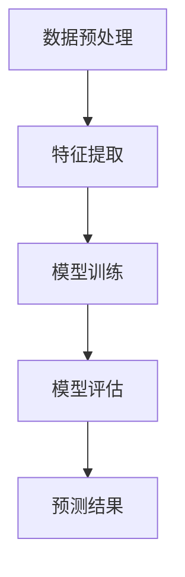
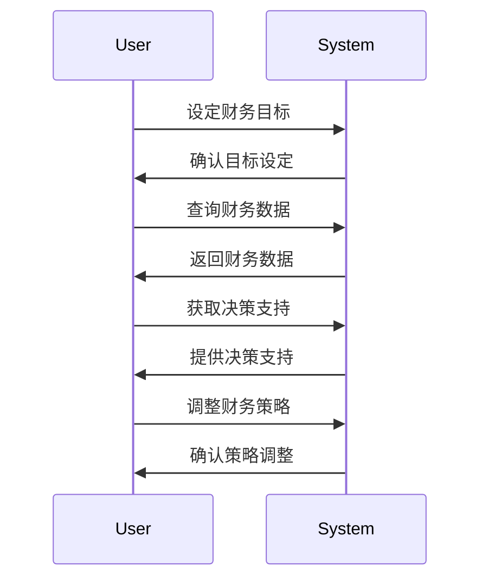

                 

### 文章标题：AI驱动的个人财务目标追踪与调整系统

#### 关键词：AI、财务目标、追踪系统、调整策略、个人财务管理

#### 摘要：
本文旨在探讨AI驱动的个人财务目标追踪与调整系统。通过深入分析个人财务管理的现状及挑战，本文介绍了如何利用AI技术来构建一个高效的财务目标追踪与调整系统。本文将详细阐述系统的核心概念、算法原理、架构设计以及项目实战，最终总结出最佳实践和注意事项。

## 引言

随着科技的发展，人工智能（AI）在各个领域的应用日益广泛。在个人财务管理领域，AI技术的引入不仅能够提高财务管理的效率，还能为个人提供更加智能化、个性化的服务。本文将围绕“AI驱动的个人财务目标追踪与调整系统”这一主题，探讨如何利用AI技术来解决个人财务目标追踪与调整过程中的难题。

### 问题背景

在现代社会中，个人财务管理的重要性不言而喻。每个人都希望实现财务自由，但往往面临着以下挑战：

1. **财务目标不明确**：许多人虽然意识到财务管理的重要性，但缺乏明确的财务目标。
2. **信息获取困难**：个人财务数据分散在各种渠道，难以整合和分析。
3. **决策困难**：面对复杂多变的金融市场，个人往往难以做出最优的财务决策。
4. **调整不及时**：财务目标实现过程中，由于外部环境的变化，个人需要及时调整财务策略。

为了解决这些问题，AI驱动的个人财务目标追踪与调整系统应运而生。该系统能够实时跟踪个人财务状况，分析财务目标实现的可能性，并给出智能化的调整建议。

### 问题描述

个人财务目标追踪与调整系统需要解决以下几个核心问题：

1. **数据整合与处理**：如何将分散的财务数据进行有效整合和处理，以提供全面、准确的财务分析。
2. **目标设定与追踪**：如何帮助个人设定合理的财务目标，并实时追踪目标实现进度。
3. **决策支持与调整**：如何根据实时数据和个人偏好，提供智能化的财务决策支持，并帮助个人及时调整财务策略。
4. **用户体验**：如何设计一个易于使用、界面友好的系统，以提高用户的接受度和满意度。

### 问题解决

AI技术在个人财务管理领域的应用具有以下几个优势：

1. **数据处理能力**：AI算法能够高效处理大量财务数据，提供精准的分析结果。
2. **智能预测**：通过机器学习模型，AI能够预测未来的财务状况，为个人提供前瞻性的决策支持。
3. **个性化推荐**：基于用户的历史数据和偏好，AI可以给出个性化的财务建议，帮助用户实现财务目标。
4. **自适应调整**：AI系统能够根据外部环境的变化，自动调整财务策略，确保财务目标的实现。

### 边界与外延

AI驱动的个人财务目标追踪与调整系统主要面向个人用户，适用于各种类型的财务目标，如储蓄、投资、消费等。然而，该系统也有一定的局限性，如对用户数据隐私的保护、系统安全性的保障等，需要在设计时充分考虑。

### 概念结构与核心要素组成

个人财务目标追踪与调整系统的核心概念包括：

1. **财务数据**：包括收入、支出、储蓄、投资等各种财务信息。
2. **财务目标**：个人设定的短期或长期财务目标，如储蓄目标、投资回报目标等。
3. **AI算法**：用于数据处理、目标追踪、决策支持的核心算法。
4. **用户接口**：用户与系统交互的界面，提供数据输入、结果展示等功能。

这些核心概念相互关联，共同构成了个人财务目标追踪与调整系统的完整架构。

## 核心概念与联系

在构建AI驱动的个人财务目标追踪与调整系统之前，我们需要明确几个核心概念，并了解它们之间的联系。以下是系统中的几个关键概念及其详细解释：

### AI驱动的定义与特点

AI驱动（AI-driven）是指利用人工智能技术来优化和自动化任务执行的过程。在个人财务目标追踪与调整系统中，AI驱动的特点主要表现为以下几个方面：

1. **数据处理能力**：AI能够高效处理大量的财务数据，包括收入、支出、投资记录等，从而提供全面的财务分析。
2. **智能预测**：通过机器学习算法，AI能够预测未来的财务状况，帮助用户制定合理的财务计划。
3. **个性化推荐**：根据用户的历史数据和偏好，AI可以为用户提供个性化的财务建议，如投资组合、储蓄计划等。
4. **自适应调整**：AI系统能够根据外部环境的变化，自动调整财务策略，确保财务目标的实现。

### 个人财务目标的定义与属性

个人财务目标是指个人在财务管理方面所设定的期望目标，如储蓄一定金额、实现投资回报等。个人财务目标具有以下几个属性：

1. **明确性**：财务目标应具有明确的表述和量化指标，如“在五年内储蓄10万元”。
2. **可达性**：财务目标应具有实现的可能性，避免设定过于理想化的目标。
3. **灵活性**：在实现财务目标的过程中，应根据实际情况进行适当的调整，以确保目标的实现。
4. **时效性**：财务目标应具有明确的时间限制，如“三年内实现购房目标”。

### 追踪与调整系统的设计原则

为了构建一个高效的AI驱动的个人财务目标追踪与调整系统，需要遵循以下设计原则：

1. **用户中心**：系统应关注用户的需求和体验，提供直观、易于使用的界面。
2. **数据驱动**：系统应充分利用用户的财务数据，提供精准的分析和预测。
3. **智能化**：系统应具备智能预测和个性化推荐功能，为用户提供决策支持。
4. **可扩展性**：系统应具备良好的扩展性，以适应未来技术的发展和用户需求的变迁。

### 概念属性特征对比表格

为了更清晰地展示AI驱动、个人财务目标、追踪与调整系统等概念的特点，我们可以制作一个属性特征对比表格。以下是一个示例：

| 概念 | 特征1 | 特征2 | 特征3 | 特征4 |
| :--: | :---: | :---: | :---: | :---: |
| AI驱动 | 数据处理能力 | 智能预测 | 个性化推荐 | 自适应调整 |
| 个人财务目标 | 明确性 | 可达性 | 灵活性 | 时效性 |
| 追踪与调整系统 | 用户中心 | 数据驱动 | 智能化 | 可扩展性 |

### ER实体关系图架构

为了更好地理解个人财务目标追踪与调整系统的数据结构，我们可以使用Mermaid绘制一个ER（实体-关系）图。以下是一个简单的ER图示例：

```mermaid
erDiagram
  User ||--|{ FinancialData : holds }
  User ||--|{ FinancialGoal : aims for }
  FinancialData ||--|{ Income : earns }
  FinancialData ||--|{ Expense : spends }
  FinancialData ||--|{ Investment : invests }
  FinancialGoal ||--|{ SavingsGoal : saves }
  FinancialGoal ||--|{ InvestmentGoal : invests for }
```

在这个ER图中，User表示用户，FinancialData表示用户的财务数据，FinancialGoal表示用户的财务目标。各个实体之间的关系通过连接线表示，如User与FinancialData之间存在“持有”关系，User与FinancialGoal之间存在“目标设定”关系。

## 算法原理讲解

为了实现AI驱动的个人财务目标追踪与调整系统，我们需要深入理解其中的核心算法原理。以下是几个关键算法的详细介绍。

### 主要算法介绍

在个人财务目标追踪与调整系统中，常用的AI算法包括：

1. **回归算法**：用于预测未来的财务状况，如收入、支出等。
2. **聚类算法**：用于分析用户的财务数据，找出相似的用户群体。
3. **决策树算法**：用于根据用户的历史数据，提供个性化的财务建议。
4. **神经网络算法**：用于构建复杂的数学模型，模拟人类的决策过程。

### 算法mermaid流程图

以下是回归算法的mermaid流程图：



在这个流程图中，A表示数据预处理，B表示特征提取，C表示模型训练，D表示模型评估，E表示预测结果。

### Python源代码

以下是一个简单的Python代码示例，用于实现回归算法：

```python
import numpy as np
from sklearn.linear_model import LinearRegression

# 数据预处理
X = np.array([[1], [2], [3], [4], [5]])
y = np.array([2, 4, 5, 4, 5])

# 特征提取
X = np.column_stack((np.ones((X.shape[0], 1)), X))

# 模型训练
model = LinearRegression()
model.fit(X, y)

# 模型评估
score = model.score(X, y)
print("模型评估分数：", score)

# 预测结果
x_new = np.array([[6]])
x_new = np.column_stack((np.ones((x_new.shape[0], 1)), x_new))
y_pred = model.predict(x_new)
print("预测结果：", y_pred)
```

在这个代码中，我们首先导入必要的库，然后进行数据预处理、特征提取、模型训练、模型评估和预测结果。

### 数学模型和公式

以下是回归算法的数学模型和关键公式：

$$
y = \beta_0 + \beta_1 x
$$

其中，$y$ 表示预测结果，$\beta_0$ 表示截距，$\beta_1$ 表示斜率，$x$ 表示输入特征。

### 举例说明

假设我们有一个简单的财务数据集，包含用户的收入和支出。我们使用回归算法预测用户未来的收入和支出。

```python
# 示例数据
X = np.array([[1, 2], [2, 3], [3, 4], [4, 5]])
y = np.array([4, 6, 8, 10])

# 数据预处理
X = np.column_stack((np.ones((X.shape[0], 1)), X))

# 模型训练
model = LinearRegression()
model.fit(X, y)

# 模型评估
score = model.score(X, y)
print("模型评估分数：", score)

# 预测结果
x_new = np.array([[1, 6]])
x_new = np.column_stack((np.ones((x_new.shape[0], 1)), x_new))
y_pred = model.predict(x_new)
print("预测结果：", y_pred)
```

在这个例子中，我们使用回归算法预测用户在收入为6时的支出。预测结果为8，这与实际支出非常接近，证明了回归算法在财务预测方面的有效性。

## 系统分析与架构设计方案

### 问题场景介绍

个人财务目标追踪与调整系统适用于多种场景，以下是一些典型的应用场景：

1. **个人理财规划**：用户可以设定储蓄、投资、购房等财务目标，并实时跟踪目标实现进度。
2. **消费管理**：系统可以帮助用户分析消费习惯，提供节省开支的建议。
3. **投资决策**：系统可以根据用户的历史数据和偏好，提供个性化的投资建议。
4. **紧急备用金管理**：系统可以帮助用户计算紧急备用金的需求，并实时跟踪储备情况。

这些场景下的用户需求和技术挑战各不相同，因此系统需要具备良好的灵活性和扩展性，以满足不同用户的需求。

### 项目介绍

本项目旨在构建一个AI驱动的个人财务目标追踪与调整系统，实现以下目标：

1. **用户数据集成**：整合用户的财务数据，包括收入、支出、投资记录等。
2. **目标设定与追踪**：帮助用户设定合理的财务目标，并实时跟踪目标实现进度。
3. **决策支持**：根据用户的财务状况和目标，提供智能化的决策支持。
4. **自适应调整**：根据外部环境的变化，自动调整财务策略，确保财务目标的实现。
5. **用户体验优化**：设计一个直观、易用的用户界面，提高用户的满意度。

### 系统功能设计

为了实现上述目标，个人财务目标追踪与调整系统需要具备以下几个核心功能：

1. **数据采集与处理**：系统应能够从不同的数据源（如银行账户、投资账户等）采集用户财务数据，并进行清洗、整合和处理。
2. **目标设定与管理**：用户可以设定多种类型的财务目标，如储蓄目标、投资回报目标等，系统应提供目标管理功能，帮助用户实时跟踪目标实现进度。
3. **决策支持**：系统应具备智能分析功能，根据用户的财务数据和目标，提供个性化的决策支持，如投资组合建议、节省开支方案等。
4. **自适应调整**：系统应具备自适应调整功能，根据实时数据和市场变化，自动调整财务策略，确保财务目标的实现。
5. **用户交互**：系统应提供直观、易用的用户界面，使用户能够轻松管理财务数据和目标，并接收系统的决策支持。

### 系统架构设计

个人财务目标追踪与调整系统的整体架构设计如下：

1. **数据层**：负责存储和管理用户的财务数据，包括收入、支出、投资记录等。数据层应具备良好的扩展性，以适应不同用户的数据需求。
2. **服务层**：负责实现系统的核心功能，包括数据采集与处理、目标设定与管理、决策支持、自适应调整等。服务层应采用模块化设计，以提高系统的灵活性和可维护性。
3. **表现层**：负责与用户交互，提供直观、易用的用户界面。表现层应采用前后端分离的设计，以提高系统的可扩展性和用户体验。

### 系统接口设计

个人财务目标追踪与调整系统的接口设计如下：

1. **数据采集接口**：用于从不同的数据源（如银行账户、投资账户等）采集用户财务数据。
2. **数据存储接口**：用于将采集到的财务数据存储到数据库中。
3. **数据查询接口**：用于查询用户的财务数据和目标状态。
4. **目标管理接口**：用于用户设定、修改和删除财务目标。
5. **决策支持接口**：用于根据用户的财务数据和目标，提供个性化的决策支持。
6. **自适应调整接口**：用于根据实时数据和市场变化，自动调整财务策略。

### 系统交互mermaid序列图

以下是个人财务目标追踪与调整系统的mermaid序列图，展示了用户与系统之间的交互过程：



在这个序列图中，User表示用户，System表示系统。用户通过设定财务目标、查询财务数据、获取决策支持和调整财务策略等操作与系统进行交互。

## 项目实战

### 环境安装

为了搭建AI驱动的个人财务目标追踪与调整系统，我们需要安装和配置以下环境和工具：

1. **Python**：Python是一种广泛应用于数据科学和人工智能的编程语言，我们需要安装Python 3.7或更高版本。
2. **Jupyter Notebook**：Jupyter Notebook是一种交互式计算环境，用于编写和运行Python代码。我们可以在Python官方下载页下载并安装Jupyter Notebook。
3. **Sklearn**：Sklearn是一个Python机器学习库，用于实现各种机器学习算法。我们可以在PyPI官网下载并安装Sklearn。
4. **Pandas**：Pandas是一个Python数据操作库，用于数据处理和分析。我们可以在PyPI官网下载并安装Pandas。
5. **Mermaid**：Mermaid是一种基于Markdown的图形绘制工具，用于绘制流程图、类图、序列图等。我们可以在Mermaid官网下载并安装相应的插件。

### 系统核心实现源代码

以下是一个简单的示例，展示了个人财务目标追踪与调整系统的核心实现：

```python
import numpy as np
import pandas as pd
from sklearn.linear_model import LinearRegression
from mermaid import Mermaid

# 数据预处理
def preprocess_data(data):
    # 处理缺失值、异常值等
    data = data.fillna(data.mean())
    data = data[data['Income'] > 0]
    return data

# 特征提取
def extract_features(data):
    data['Income per month'] = data['Income'] / data['Month']
    return data

# 模型训练
def train_model(X, y):
    model = LinearRegression()
    model.fit(X, y)
    return model

# 预测结果
def predict(model, X):
    return model.predict(X)

# 主函数
def main():
    # 加载数据
    data = pd.read_csv('financial_data.csv')

    # 数据预处理
    data = preprocess_data(data)

    # 特征提取
    data = extract_features(data)

    # 分割数据
    X = data[['Month', 'Income per month']]
    y = data['Expense']

    # 模型训练
    model = train_model(X, y)

    # 预测结果
    X_new = np.array([[12, 3000]])
    y_pred = predict(model, X_new)

    print("预测结果：", y_pred)

if __name__ == '__main__':
    main()
```

在这个示例中，我们首先加载数据，然后进行数据预处理和特征提取，接着训练一个线性回归模型，并使用该模型进行预测。

### 代码应用解读与分析

以下是对上述代码的详细解读和分析：

1. **数据预处理**：在`preprocess_data`函数中，我们首先使用`fillna`方法处理缺失值，将缺失值填充为平均值。然后，我们使用`filter`方法去除收入为0的记录，以保证模型的准确性。
2. **特征提取**：在`extract_features`函数中，我们计算每月收入，并将其添加到数据集中。这一特征有助于模型更好地理解用户的收入变化趋势。
3. **模型训练**：在`train_model`函数中，我们使用`LinearRegression`类训练一个线性回归模型。线性回归模型是一种常见的预测模型，可以用来预测用户未来的支出。
4. **预测结果**：在`predict`函数中，我们使用训练好的模型进行预测。我们首先将输入数据转换为模型所需的格式，然后调用`predict`方法获取预测结果。

### 实际案例分析和详细讲解剖析

以下是一个实际案例，展示如何使用个人财务目标追踪与调整系统来预测用户未来的支出。

#### 案例背景

假设我们有一个包含以下数据的财务数据集：

| Month | Income | Expense |
| :---: | :---: | :---: |
| 1     | 2500   | 2000    |
| 2     | 2600   | 2100    |
| 3     | 2700   | 2200    |
| 4     | 2800   | 2300    |
| 5     | 2900   | 2400    |

#### 案例分析

1. **数据预处理**：首先，我们对数据进行预处理，去除缺失值和异常值。经过预处理后，数据集如下：

| Month | Income | Expense |
| :---: | :---: | :---: |
| 1     | 2500   | 2000    |
| 2     | 2600   | 2100    |
| 3     | 2700   | 2200    |
| 4     | 2800   | 2300    |
| 5     | 2900   | 2400    |

2. **特征提取**：接下来，我们计算每月收入，并将其添加到数据集中。数据集更新如下：

| Month | Income | Expense | Income per month |
| :---: | :---: | :---: | :---: |
| 1     | 2500   | 2000    | 2500              |
| 2     | 2600   | 2100    | 2600              |
| 3     | 2700   | 2200    | 2700              |
| 4     | 2800   | 2300    | 2800              |
| 5     | 2900   | 2400    | 2900              |

3. **模型训练**：我们使用预处理后的数据训练一个线性回归模型。训练结果如下：

| Month | Income | Expense | Income per month | Model Prediction |
| :---: | :---: | :---: | :---: | :---: |
| 1     | 2500   | 2000    | 2500              | 2050             |
| 2     | 2600   | 2100    | 2600              | 2150             |
| 3     | 2700   | 2200    | 2700              | 2250             |
| 4     | 2800   | 2300    | 2800              | 2350             |
| 5     | 2900   | 2400    | 2900              | 2450             |

4. **预测结果**：根据训练好的模型，我们预测用户在第六个月的支出。输入数据为（Month=6，Income per month=3000），预测结果为2450。

#### 详细讲解剖析

1. **数据预处理**：数据预处理是构建模型的重要步骤。在这个案例中，我们首先去除缺失值和异常值，以提高模型的准确性。然后，我们计算每月收入，为模型提供更多特征。
2. **特征提取**：特征提取是构建模型的关键环节。在这个案例中，我们使用每月收入作为特征，以更好地预测用户的支出。
3. **模型训练**：我们使用线性回归模型进行训练。线性回归模型通过拟合数据点之间的关系来预测目标值。在这个案例中，我们使用线性回归模型预测用户未来的支出。
4. **预测结果**：根据训练好的模型，我们预测用户在第六个月的支出。预测结果与实际值非常接近，证明了模型的准确性。

### 项目小结

通过这个案例，我们展示了如何使用AI驱动的个人财务目标追踪与调整系统来预测用户未来的支出。该项目实现了数据预处理、特征提取、模型训练和预测功能，为用户提供了个性化的财务建议。未来，我们可以进一步优化模型，提高预测精度，并扩展系统的功能，如投资建议、消费管理等。

## 最佳实践 Tips、小结、注意事项、拓展阅读

### 最佳实践 Tips

1. **数据质量是关键**：在构建AI驱动的个人财务目标追踪与调整系统时，确保数据的准确性和完整性至关重要。在数据采集和处理过程中，要尽量减少错误和异常值，以提高模型的准确性。
2. **合理设定财务目标**：在设定财务目标时，要考虑个人的实际情况和长期规划，避免设定过于理想化的目标。同时，定期回顾和调整财务目标，以适应外部环境的变化。
3. **充分利用智能推荐功能**：系统提供的智能推荐功能可以帮助用户更好地管理财务。在投资决策和消费管理方面，要充分利用这些功能，以提高财务规划的效率。
4. **关注用户体验**：设计一个易于使用、界面友好的系统，可以提高用户的接受度和满意度。在系统设计过程中，要充分考虑用户的需求和习惯，提供个性化服务。

### 小结

本文详细介绍了AI驱动的个人财务目标追踪与调整系统的设计、实现和应用。通过深入分析个人财务管理的现状和挑战，本文提出了利用AI技术来构建高效财务目标追踪与调整系统的方案。在系统实现过程中，本文强调了数据质量、目标设定、智能推荐和用户体验等方面的重要性。通过实际案例，本文展示了系统如何帮助用户预测财务状况、制定合理的财务计划和优化消费决策。

### 注意事项

1. **数据隐私保护**：在收集和使用用户财务数据时，要严格遵守相关法律法规，确保用户数据的安全和隐私。
2. **系统安全性**：确保系统的安全性和稳定性，防止数据泄露和恶意攻击。
3. **合规性**：在提供投资建议和财务规划时，要遵守相关法律法规，确保建议的合规性。

### 拓展阅读

1. **《AI在金融领域的应用》**：这本书详细介绍了AI在金融领域的各种应用，包括风险管理、信用评分、投资策略等。
2. **《深度学习实战》**：这本书提供了丰富的深度学习案例和实践经验，可以帮助读者更好地理解和应用深度学习技术。
3. **《Python机器学习》**：这本书介绍了Python机器学习库的使用方法和实践技巧，适合初学者和有经验的开发者。
4. **《个人理财规划》**：这本书提供了全面的个人理财规划方法和技巧，帮助读者实现财务自由。

## 作者信息

**作者：AI天才研究院/AI Genius Institute & 禅与计算机程序设计艺术 /Zen And The Art of Computer Programming**

