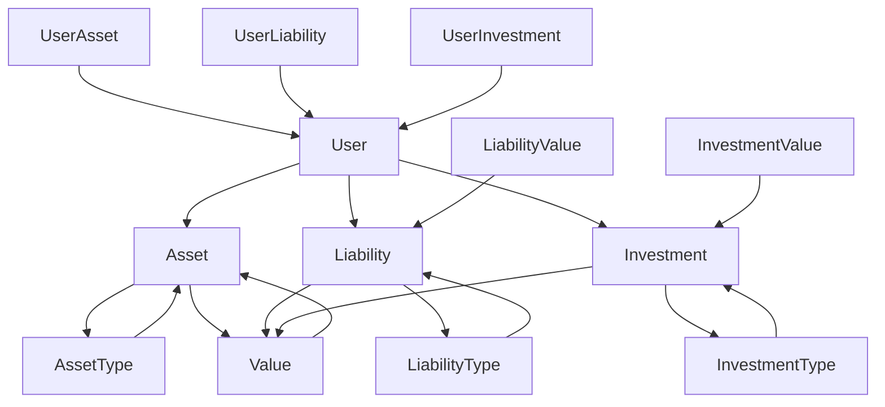

                 


### 1.1.1 问题背景

个人财务规划是每个人都需要面对的重要问题。无论是为了应对生活中的突发事件，还是为了实现长期的财富目标，如购房、子女教育、退休养老等，个人财务规划都是必不可少的。然而，随着金融市场的复杂化和多样化，个人财务规划也变得越来越具有挑战性。

首先，传统个人财务规划往往依赖于手工计算和经验判断，这不仅效率低下，而且容易出错。例如，在投资组合优化过程中，需要考虑多种因素，如风险偏好、资金需求、市场波动等，这些因素相互交织，使得财务规划变得异常复杂。

其次，金融市场信息庞杂，如何从海量的数据中提取有价值的信息，也是个人财务规划的一大难题。传统的数据分析方法，如统计分析、财务报表分析等，往往只能提供表面的信息，难以深入挖掘数据背后的规律和趋势。

最后，个人财务规划需要具备一定的专业知识和技能。对于大多数人来说，财务规划不仅意味着学习新的知识，还需要掌握一定的技术工具。这无疑增加了个人财务规划的难度。

为了解决上述问题，AI技术的引入成为了必然选择。AI技术，特别是机器学习和深度学习，能够自动从海量数据中提取特征，进行模式识别和预测，从而提高个人财务规划的准确性和效率。

首先，机器学习算法可以自动识别和预测市场趋势，帮助用户优化投资组合。例如，通过分析历史数据，机器学习算法可以预测股票市场的波动，从而帮助用户制定更加科学的投资策略。

其次，深度学习技术可以自动从文本数据中提取信息，帮助用户进行财务分析。例如，通过分析用户的社交媒体数据，深度学习算法可以了解用户的生活习惯和消费偏好，从而为其提供个性化的财务建议。

最后，AI技术还可以提高个人财务规划的可视化程度。通过可视化工具，用户可以更加直观地了解自己的财务状况，从而更好地进行决策。

### 1.1.2 AI技术在财务规划中的应用前景

AI技术在个人财务规划中的应用前景广阔。首先，AI技术可以提高财务规划的准确性和效率。通过机器学习和深度学习算法，AI可以自动从海量数据中提取有价值的信息，进行模式识别和预测，从而为用户提供更加精准的财务建议。

其次，AI技术可以降低财务规划的成本。传统的财务规划需要大量的人力物力，而AI技术可以自动化完成许多复杂的计算和分析任务，从而大大降低财务规划的成本。

此外，AI技术还可以提高财务规划的用户体验。通过可视化工具，用户可以更加直观地了解自己的财务状况，从而更好地进行决策。同时，AI技术还可以提供个性化的财务建议，满足不同用户的需求。

然而，AI技术在财务规划中的应用也面临一些挑战。首先，数据的获取和处理是AI技术应用于财务规划的关键。然而，财务数据往往涉及用户的隐私，如何确保数据的安全性和隐私性是一个重要的问题。

其次，AI技术应用于财务规划需要专业的知识和技能。对于大多数用户来说，理解和使用AI技术并非易事。因此，如何让AI技术更加易于使用，是一个亟待解决的问题。

最后，AI技术的应用需要法律法规的支持。AI技术在财务规划中的应用可能会引发一系列的法律问题，如责任归属、隐私保护等。因此，建立相应的法律法规体系，是AI技术应用于财务规划的必要条件。

总之，AI技术在个人财务规划中的应用具有巨大的潜力，但也面临一些挑战。通过解决这些问题，我们可以更好地发挥AI技术在财务规划中的作用，为用户提供更加优质的服务。

### 1.2.1 本书结构

本书旨在为开发者提供一份全面、系统的AI驱动个人财务规划工具开发指南。全书分为五大部分，共计二十一章，详细介绍了AI技术在财务规划中的应用、工具开发流程、项目实战等内容。

**第一部分：引言**
- 介绍AI驱动个人财务规划工具开发的背景和意义，明确本书的核心内容和结构。

**第二部分：AI与财务规划基础**
- 深入讲解AI和财务规划的基本概念，分析AI与财务规划的关系，构建AI驱动的财务规划概念框架。

**第三部分：AI技术在财务规划中的应用**
- 详细探讨数据收集与处理、机器学习算法、深度学习技术、自然语言处理、实体关系图与知识图谱在财务规划中的应用。

**第四部分：财务规划工具开发**
- 介绍财务规划工具开发的基本概念，包括系统架构设计、界面设计与用户体验、数据库设计与存储、安全性与隐私保护等。

**第五部分：项目实战**
- 通过一个实际项目，详细讲解工具开发的全过程，包括环境安装与配置、系统核心实现、实际案例分析和项目小结。

本书不仅提供了丰富的理论知识，还结合实际项目，让读者能够深入理解AI技术在财务规划中的应用。通过本书的学习，开发者可以掌握AI驱动个人财务规划工具的开发方法和技巧，为实际工作提供有力支持。

### 1.2.2 阅读指南

为了更好地理解本书内容，以下是一份详细的阅读指南，帮助您有序地学习AI驱动个人财务规划工具的开发：

**第一部分：引言**
- 阅读顺序：从第1章开始，逐步阅读至第4章。
- 阅读重点：理解AI驱动个人财务规划工具开发的背景和意义，明确本书的核心内容和结构。

**第二部分：AI与财务规划基础**
- 阅读顺序：从第5章开始，逐步阅读至第10章。
- 阅读重点：掌握AI和财务规划的基本概念，理解AI与财务规划的关系，构建AI驱动的财务规划概念框架。

**第三部分：AI技术在财务规划中的应用**
- 阅读顺序：从第11章开始，逐步阅读至第16章。
- 阅读重点：了解数据收集与处理、机器学习算法、深度学习技术、自然语言处理、实体关系图与知识图谱在财务规划中的应用。

**第四部分：财务规划工具开发**
- 阅读顺序：从第17章开始，逐步阅读至第20章。
- 阅读重点：掌握财务规划工具开发的基本概念，理解系统架构设计、界面设计与用户体验、数据库设计与存储、安全性与隐私保护等内容。

**第五部分：项目实战**
- 阅读顺序：从第21章开始，逐步阅读至第21章。
- 阅读重点：通过实际项目，详细学习工具开发的全过程，包括环境安装与配置、系统核心实现、实际案例分析和项目小结。

在阅读过程中，建议您：
1. 理解每个章节的核心概念和原理，对照示例和案例进行分析。
2. 在遇到不理解的概念时，查阅相关资料，确保理解准确。
3. 尝试动手实践，通过实际操作加深对理论知识的理解。

通过遵循这份阅读指南，您可以系统地学习AI驱动个人财务规划工具的开发方法，为实际工作打下坚实基础。

## 2.1 AI概述

### 2.1.1 AI基本概念

人工智能（Artificial Intelligence，简称AI）是计算机科学的一个分支，旨在研究、开发和应用使计算机模拟、延伸和扩展人类智能的理论、方法、技术和系统。AI的核心目标是使机器能够执行需要人类智能才能完成的任务，如视觉识别、语音识别、决策制定、自然语言处理等。

AI的发展可以追溯到20世纪50年代。当时，人工智能的概念首次被提出，其初衷是通过编程使计算机具备人类智能。随着计算机技术的不断进步，AI也逐渐从理论研究走向实际应用。

AI的基本概念包括以下几个方面：

- **知识表示**：如何将人类知识以计算机可处理的形式进行表示和存储。
- **问题求解**：如何利用算法和策略解决复杂的问题。
- **机器学习**：如何让计算机通过学习和训练，从数据中提取规律和知识。
- **自然语言处理**：如何让计算机理解和生成自然语言。
- **计算机视觉**：如何让计算机理解和解析图像和视频。

### 2.1.2 AI技术发展历程

AI技术的发展历程可以分为几个重要阶段：

- **第一阶段（1956-1969年）**：这是AI的萌芽阶段。1956年，约翰·麦卡锡等人在达特茅斯会议上首次提出了人工智能的概念。这一阶段的主要工作集中在知识表示和推理算法的研究上。

- **第二阶段（1970-1989年）**：这是AI的快速发展阶段。随着计算机性能的提高和算法的改进，AI开始在工业、医疗、教育等领域得到应用。这一阶段的重要技术包括专家系统和机器学习算法。

- **第三阶段（1990-2010年）**：这是AI的复苏阶段。由于硬件性能的显著提高和大数据的普及，机器学习技术得到了快速发展。这一阶段的重要事件包括深度学习算法的提出和大数据技术的广泛应用。

- **第四阶段（2010年至今）**：这是AI的成熟和普及阶段。随着深度学习技术的突破，AI在图像识别、语音识别、自然语言处理等领域取得了显著的进展。这一阶段的重要事件包括自动驾驶汽车、智能语音助手、智能机器人等的应用。

### 2.1.3 AI技术的应用领域

AI技术已经广泛应用于各个领域，以下是其中一些主要的应用领域：

- **智能制造**：通过机器学习算法和计算机视觉技术，智能制造可以实现生产过程的自动化和智能化，提高生产效率和质量。

- **医疗保健**：AI技术可以帮助医生进行疾病诊断、治疗方案制定和医学影像分析，提高医疗服务的效率和准确性。

- **金融服务**：AI技术可以用于风险控制、信用评分、投资组合优化等，为金融机构提供智能决策支持。

- **交通运输**：自动驾驶技术、智能交通管理系统的应用，可以有效提高交通运输的安全性和效率。

- **智能家居**：通过AI技术，智能家居可以实现自动化控制、智能语音助手等功能，提高居住的舒适性和便利性。

- **教育**：AI技术可以提供个性化的学习方案、智能辅导和自动评分等功能，提高教学效果和学习效率。

### 2.1.4 AI的优势与挑战

AI技术具有以下优势：

- **高效性**：AI可以在短时间内处理大量的数据，进行复杂的计算和分析，比人类更高效。
- **准确性**：AI通过学习和训练，可以从数据中提取出准确的模式和规律，进行精准的预测和决策。
- **一致性**：AI在处理相同问题时，可以保持一致的表现，不会受到情绪和疲劳等因素的影响。

然而，AI技术也面临一些挑战：

- **数据隐私**：AI技术依赖于大量的数据，如何保护用户的数据隐私成为一个重要的问题。
- **透明性和可解释性**：深度学习等复杂AI模型的黑箱问题，使得其决策过程缺乏透明性和可解释性。
- **伦理和法律问题**：AI技术在某些领域的应用可能引发伦理和法律问题，如责任归属、隐私保护等。

### 2.1.5 AI与财务规划的关系

AI技术对财务规划有着深远的影响。首先，AI可以通过数据分析、机器学习和预测模型，帮助用户更好地理解和管理自己的财务状况。例如，通过分析用户的消费习惯和投资记录，AI可以提供个性化的财务建议，帮助用户优化投资组合。

其次，AI技术可以提高财务规划的分析效率和准确性。传统的财务规划往往依赖于手工计算和经验判断，而AI可以通过机器学习算法自动识别和预测市场趋势，提供更加精准的财务分析。

此外，AI还可以提高财务规划的可视化程度。通过可视化工具，用户可以更加直观地了解自己的财务状况，从而更好地进行决策。

然而，AI在财务规划中的应用也面临一些挑战。例如，如何确保AI模型的透明性和可解释性，如何保护用户的财务数据隐私等。因此，在应用AI技术进行财务规划时，需要充分考虑这些挑战，并采取相应的措施进行解决。

总之，AI技术为财务规划带来了新的机遇和挑战。通过合理应用AI技术，可以大大提高财务规划的效率和准确性，为用户提供更加优质的金融服务。

### 2.2 财务规划概述

#### 2.2.1 财务规划的定义与目标

财务规划是指个人或组织根据当前的经济状况和未来的财务目标，制定合理的财务策略和计划，以确保财务安全和实现财富增值的过程。具体来说，财务规划包括评估当前财务状况、设定财务目标、制定财务策略、执行财务计划以及监控和调整财务状况。

财务规划的主要目标包括：

- **财务安全**：确保个人或组织在面对突发事件时，具备足够的财务能力来应对，如失业、疾病、意外等。
- **财富增值**：通过投资和理财，实现资金的保值和增值，达到财务自由和财富积累。
- **财务自由**：通过合理的财务规划，实现经济上的独立，摆脱对工作的依赖，享受生活。
- **遗产规划**：为后代或指定的受益人制定遗产分配计划，确保财产的合理传承。

#### 2.2.2 财务规划的主要组成部分

财务规划通常包括以下几个主要组成部分：

1. **资产评估**：评估个人或组织的现有资产，包括现金、投资、房产、车辆等，以了解当前财务状况。

2. **负债分析**：分析个人或组织的负债情况，包括贷款、信用卡债务、家庭开支等，以确定财务压力。

3. **收入和支出管理**：制定合理的收入和支出计划，确保收支平衡，并建立应急储备金。

4. **投资策略**：根据财务目标和风险承受能力，制定合适的投资策略，选择合适的投资产品和渠道。

5. **退休规划**：为退休生活做好财务准备，确保退休后有稳定的收入来源。

6. **风险管理**：评估和应对潜在的财务风险，如市场波动、利率变化、政策风险等。

7. **税务规划**：合理规划税务，以减少税负，提高财务收益。

#### 2.2.3 财务规划的重要性

财务规划在个人生活和组织经营中具有至关重要的意义：

- **提高财务安全性**：通过财务规划，可以确保个人或组织在面对突发事件时，具备足够的资金储备，降低财务风险。
- **实现财富增值**：通过科学的投资策略和理财规划，可以有效地实现资金的保值和增值，提高生活质量。
- **财务自由**：通过合理的财务规划，可以逐步实现财务自由，摆脱经济上的束缚，享受自由的生活。
- **提高决策效率**：通过财务规划，可以清晰地了解自己的财务状况，有助于做出更加明智的财务决策。
- **优化资源配置**：财务规划可以帮助个人或组织合理分配资源，确保资金用于最有价值的领域，提高经济效益。

总之，财务规划是实现财务安全和财富增值的关键，对于个人和组织的长远发展具有重要意义。

### 2.3 AI与财务规划的关系

#### 2.3.1 AI在财务规划中的应用场景

人工智能（AI）在财务规划中的应用场景非常广泛，它通过自动化、分析和预测等功能，极大地提升了财务规划的有效性和准确性。以下是AI在财务规划中的一些主要应用场景：

1. **消费习惯分析**：AI可以通过分析用户的消费数据，识别消费模式和行为，为用户制定个性化的财务建议。例如，通过机器学习算法，AI可以预测用户的未来支出，帮助用户控制预算、避免过度消费。

2. **投资组合优化**：AI能够处理大量历史数据和市场信息，通过算法分析，为用户推荐最优的投资组合。AI不仅可以预测市场趋势，还可以根据用户的风险承受能力和财务目标，自动调整投资策略。

3. **信用评分**：AI在信用评分中的应用非常显著。通过分析用户的财务记录、信用历史和其他相关信息，AI可以更准确地评估用户的信用风险，为金融机构提供信用评估模型。

4. **税务规划**：AI可以帮助用户优化税务策略，通过自动化税务计算和申报，减少税务负担。AI还可以预测税务变化，为用户制定长期的税务规划。

5. **风险评估**：AI可以自动识别和分析财务风险，如市场波动、利率变化等，提供实时风险预警，帮助用户及时调整财务策略。

6. **个性化财务咨询**：AI聊天机器人和虚拟顾问可以提供24/7的个性化财务咨询，根据用户的需求提供定制化的财务建议。

#### 2.3.2 AI对财务规划的影响

AI对财务规划的影响是深远且多方面的：

1. **提高效率**：AI可以自动化大量的财务计算和分析任务，大大提高了财务规划的工作效率。传统财务规划中需要手动处理的大量数据，通过AI的自动化处理，可以快速得到结果。

2. **增强准确性**：AI通过机器学习和深度学习技术，可以从海量数据中提取有价值的信息，进行精确的预测和决策，提高了财务规划的准确性。

3. **个性化服务**：AI可以根据用户的具体情况，提供个性化的财务建议，满足用户的个性化需求。这种定制化的服务，是传统财务规划所难以实现的。

4. **风险控制**：AI可以通过实时数据分析，及时发现和预警潜在的风险，帮助用户制定有效的风险管理策略。

5. **降低成本**：AI技术可以降低财务规划的运营成本，通过自动化处理，减少了对人力和物力的依赖。

6. **改善用户体验**：AI技术可以提供24/7的在线服务，用户可以随时获取财务咨询和决策支持，提高了用户的服务体验。

然而，AI在财务规划中的应用也面临一些挑战，如数据隐私、模型透明性和伦理问题等。这些挑战需要在未来得到解决，以确保AI在财务规划中的安全和有效应用。

总之，AI技术的引入，为财务规划带来了革命性的变化，不仅提高了效率和准确性，还极大地改善了用户体验。通过合理应用AI技术，财务规划将变得更加智能化和高效化。

### 2.4 概念框架

#### 2.4.1 AI驱动的财务规划概念框架

为了更好地理解和设计AI驱动的财务规划工具，我们需要构建一个清晰的概念框架。这个框架将涵盖财务规划的核心概念、关键技术和应用场景。以下是这个概念框架的主要组成部分：

1. **数据采集与预处理**
   - 数据来源：个人财务数据、市场数据、社会数据等
   - 数据类型：结构化数据、非结构化数据、时序数据等
   - 数据预处理：数据清洗、数据整合、数据标准化

2. **AI技术模块**
   - 机器学习算法：回归分析、分类算法、聚类算法等
   - 深度学习技术：卷积神经网络（CNN）、循环神经网络（RNN）、生成对抗网络（GAN）等
   - 自然语言处理（NLP）：文本分类、情感分析、命名实体识别等
   - 实体关系图与知识图谱：关系建模、图谱查询、图谱推理

3. **财务分析模块**
   - 财务状况评估：资产分析、负债分析、流动性分析
   - 投资组合优化：风险分析、收益分析、资产配置
   - 信用评分：行为分析、历史记录分析、风险预测
   - 税务规划：税务计算、税务优化、税务预测

4. **决策支持模块**
   - 风险管理：风险识别、风险预警、风险应对
   - 投资决策：市场预测、投资策略制定、投资组合调整
   - 财务预测：收入预测、支出预测、财务状况预测

5. **用户体验模块**
   - 用户界面设计：易用性、交互性、可视化
   - 个性化服务：用户偏好分析、个性化推荐、实时咨询
   - 智能助手：语音识别、自然语言理解、智能问答

#### 2.4.2 关键概念与属性特征对比表格

为了更清晰地展示AI驱动的财务规划中的关键概念和属性特征，我们可以构建一个对比表格：

| 关键概念           | 属性特征                                                     |
|--------------------|--------------------------------------------------------------|
| 数据采集与预处理   | 数据来源、数据类型、数据预处理方法                           |
| AI技术模块         | 机器学习算法、深度学习技术、自然语言处理、实体关系图与知识图谱 |
| 财务分析模块       | 财务状况评估、投资组合优化、信用评分、税务规划               |
| 决策支持模块       | 风险管理、投资决策、财务预测                               |
| 用户体验模块       | 用户界面设计、个性化服务、智能助手                           |

#### 2.4.3 ER实体关系图架构

为了更好地理解AI驱动的财务规划中的实体关系，我们可以使用Mermaid语言绘制一个实体关系图：

```mermaid
erDiagram
    User ||--|{ FinanceData }|-- Investor
    User ||--|{ FinancialGoal }|-- Planner
    User ||--|{ Investment }|-- Manager
    User ||--|{ TaxInfo }|-- Assessor
    User ||--|{ RiskProfile }|-- Analyst
    User ||--|{ ChatBot }|-- Assistant
    Planner ||--|{ FinancialAnalysis }|-- Analyzer
    Analyzer ||--|{ RiskAnalysis }|-- Detector
    Analyzer ||--|{ InvestmentStrategy }|-- Creator
    Analyzer ||--|{ TaxOptimization }|-- Optimizer
    Investor ||--|{ Portfolio }|-- Optimizer
    Investor ||--|{ InvestmentRecord }|-- Tracker
    Manager ||--|{ InvestmentOption }|-- Recommender
    Assessor ||--|{ CreditRating }|-- Evaluator
    Analyst ||--|{ FinancialPrediction }|-- Forecaster
    Assistant ||--|{ UserQuery }|-- Respondent
    Detector ||--|{ RiskEvent }|-- Notifier
    Creator ||--|{ StrategyRecommendation }|-- Recommender
    Optimizer ||--|{ TaxSaving }|-- Saver
    Recommender ||--|{ InvestmentAdvice }|-- Advisor
    Evaluator ||--|{ CreditScore }|-- Assessor
    Forecaster ||--|{ MarketPrediction }|-- Predictor
    Respondent ||--|{ UserResponse }|-- Tracker
```

通过上述实体关系图，我们可以清晰地看到各个实体之间的关系和交互，这有助于我们更好地设计和实现AI驱动的财务规划工具。

### 2.5 数据收集与处理

#### 2.5.1 数据来源

在AI驱动的财务规划工具中，数据的质量和多样性是成功的关键。数据的来源可以分为以下几类：

1. **内部数据**：这包括用户提供的个人财务数据，如收入、支出、投资记录、信用评分等。这些数据通常保存在用户的财务软件中，或者通过API接口从银行、投资平台等获取。

2. **外部数据**：外部数据来源于公共数据源、第三方数据提供商和市场数据。例如，宏观经济数据、行业数据、市场趋势数据、利率和汇率数据等。这些数据可以通过数据爬取、API接口、数据订阅等方式获取。

3. **社交媒体数据**：通过分析用户的社交媒体活动，如帖子、评论、交易记录等，可以获取用户的消费行为、偏好和情绪状态。这些数据可以帮助AI更好地了解用户，提供个性化的财务建议。

4. **第三方服务数据**：例如，信用报告、就业信息、房产信息等，这些数据可以从第三方数据服务提供商获取，用于信用评分和风险评估。

#### 2.5.2 数据类型

财务规划工具需要处理多种类型的数据，包括：

1. **结构化数据**：这类数据通常以表格形式存储，如银行交易记录、投资组合数据、财务报表等。结构化数据便于存储和查询，适合使用数据库进行管理。

2. **非结构化数据**：如文本、图像、音频等，这类数据难以直接使用数据库管理，需要通过自然语言处理、图像识别等技术进行处理。

3. **时序数据**：时序数据是指随时间变化的数据，如股票价格、天气数据等。时序数据具有时间序列的特性，可以通过时间序列分析方法进行预测和趋势分析。

4. **实时数据**：实时数据是指能够实时获取的数据，如股市交易数据、社交网络数据等。实时数据对系统响应速度和处理能力要求较高。

#### 2.5.3 数据预处理方法

数据预处理是财务规划工具开发中至关重要的一步，其主要目的是将原始数据转化为适合模型训练和预测的形式。以下是常见的数据预处理方法：

1. **数据清洗**：数据清洗是处理噪声数据和异常值的过程。常用的方法包括去除重复数据、填补缺失值、处理异常值等。

2. **数据整合**：将来自不同来源的数据整合到一个统一的格式中。例如，将结构化数据和时序数据进行合并，形成完整的用户财务记录。

3. **数据标准化**：通过缩放、归一化等方法，将数据转化为适合模型训练的格式。例如，将数值型数据缩放到[0, 1]之间，使得不同特征之间的尺度一致。

4. **特征工程**：特征工程是指从原始数据中提取出对模型训练有帮助的特征。例如，通过计算财务数据的平均值、标准差、方差等统计指标，或者通过文本数据的词频统计，提取出有用的特征。

5. **数据划分**：将数据集划分为训练集、验证集和测试集，用于模型的训练、验证和测试。通常，训练集用于模型训练，验证集用于调整模型参数，测试集用于评估模型性能。

6. **数据增强**：通过数据增强技术，增加数据的多样性和丰富度，以提高模型的泛化能力。例如，通过图像旋转、缩放、裁剪等操作，增强图像数据。

通过以上数据预处理方法，我们可以确保数据的准确性和一致性，为后续的机器学习算法和深度学习模型训练提供高质量的数据支持。

### 3.1 机器学习算法

#### 3.1.1 常见机器学习算法简介

机器学习（Machine Learning，ML）是AI的核心组成部分，它通过从数据中学习规律和模式，使计算机能够执行特定任务。以下是一些常见的机器学习算法及其基本原理：

1. **线性回归（Linear Regression）**
   - 基本原理：线性回归是一种用于预测数值型变量的方法。它通过建立自变量和因变量之间的线性关系，实现对因变量的预测。
   - 适用场景：预测连续值，如房价、股票价格等。
   - 算法公式：\(y = w_0 + w_1 \cdot x_1 + w_2 \cdot x_2 + \ldots + w_n \cdot x_n\)
   - 优缺点：优点是简单易懂，计算速度快；缺点是容易过拟合，对非线性关系的表现较差。

2. **逻辑回归（Logistic Regression）**
   - 基本原理：逻辑回归是一种用于分类问题的方法，它通过建立一个线性模型，将预测结果映射到概率空间。
   - 适用场景：二分类问题，如信用评分、垃圾邮件检测等。
   - 算法公式：\(P(y=1) = \frac{1}{1 + e^{-(w_0 + w_1 \cdot x_1 + w_2 \cdot x_2 + \ldots + w_n \cdot x_n)}}\)
   - 优缺点：优点是解释性强，计算简单；缺点是对稀疏数据的敏感性较高，容易欠拟合。

3. **支持向量机（Support Vector Machine，SVM）**
   - 基本原理：SVM通过找到一个最佳的超平面，将不同类别的数据点分开。它使用核函数将数据映射到高维空间，以解决非线性问题。
   - 适用场景：分类问题，如文本分类、图像分类等。
   - 算法公式：最大化间隔公式：\(w^T \cdot w - \sum_{i=1}^N \alpha_i (y_i - (w \cdot x_i + b))\)
   - 优缺点：优点是分类效果较好，泛化能力强；缺点是计算复杂度高，对大规模数据的处理能力有限。

4. **决策树（Decision Tree）**
   - 基本原理：决策树通过一系列的判断规则，将数据划分为不同的区域。每个节点代表一个特征，每个分支代表一个特征取值。
   - 适用场景：分类和回归问题，如分类问题、回归问题等。
   - 算法公式：递归划分公式：\(f(x) = \sum_{i=1}^N c_i \cdot I(R_i(x))\)
   - 优缺点：优点是解释性强，易于理解和实现；缺点是容易过拟合，对噪声数据的敏感性较高。

5. **随机森林（Random Forest）**
   - 基本原理：随机森林是一种集成学习方法，它通过构建多个决策树，并对每个树的预测结果进行投票，得到最终的预测结果。
   - 适用场景：分类和回归问题，如分类问题、回归问题等。
   - 算法公式：最终预测结果为多个决策树预测结果的平均值或多数投票结果。
   - 优缺点：优点是预测准确度高，鲁棒性强；缺点是计算复杂度高，对大数据处理能力有限。

6. **神经网络（Neural Network）**
   - 基本原理：神经网络通过模拟人脑神经元的工作方式，将输入数据通过多层神经元进行处理，最终输出预测结果。它通常包括输入层、隐藏层和输出层。
   - 适用场景：复杂非线性问题，如图像识别、自然语言处理等。
   - 算法公式：激活函数、损失函数、反向传播算法等。
   - 优缺点：优点是具有强大的学习和泛化能力；缺点是计算复杂度高，需要大量数据训练。

通过以上机器学习算法，我们可以根据不同的应用场景和数据特点，选择合适的算法进行模型训练和预测。这些算法在财务规划中的应用，可以帮助我们解决各种复杂的问题，如投资组合优化、信用评分、财务预测等。

### 3.2 深度学习技术

#### 3.2.1 深度学习基础

深度学习（Deep Learning，DL）是机器学习的一个重要分支，它通过构建深度神经网络（Deep Neural Networks，DNN）来模拟人脑的学习机制，实现对复杂数据的处理和模式识别。深度学习在图像识别、自然语言处理、语音识别等领域取得了显著成果，并在财务规划中有着广泛的应用。

1. **深度神经网络（DNN）**

深度神经网络是由多个神经元层组成的神经网络，包括输入层、隐藏层和输出层。每个神经元都会接收来自前一层的输入信号，并通过激活函数进行处理，最后输出结果。深度神经网络的强大之处在于其多层结构，能够有效地提取数据中的高层次特征。

2. **激活函数（Activation Function）**

激活函数是深度神经网络中至关重要的组成部分，它用于引入非线性因素，使神经网络能够学习和处理复杂的非线性问题。常见的激活函数包括Sigmoid函数、ReLU函数、Tanh函数等。

3. **损失函数（Loss Function）**

损失函数是深度学习模型训练过程中的核心组成部分，用于度量模型预测值与真实值之间的差异。常见的损失函数包括均方误差（MSE）、交叉熵（Cross-Entropy）、Huber损失等。通过最小化损失函数，我们可以优化模型的参数，提高模型的预测准确性。

4. **反向传播算法（Backpropagation）**

反向传播算法是深度学习训练过程中的关键步骤，用于计算模型参数的梯度。它通过将输出误差反向传播到网络的每一层，逐层更新模型参数。反向传播算法的目的是通过梯度下降法优化模型参数，使模型能够在训练数据上达到最小化损失函数的目标。

#### 3.2.2 深度学习在财务规划中的应用

深度学习在财务规划中的应用主要体现在以下几个方面：

1. **金融市场预测**

通过构建深度学习模型，我们可以对股票价格、汇率等金融市场进行预测。深度学习模型可以从历史数据中学习到市场变化的规律，从而预测未来市场的走势。例如，可以使用卷积神经网络（CNN）处理股票价格的时间序列数据，通过循环神经网络（RNN）处理多因子数据，以提高预测准确性。

2. **信用评分**

深度学习技术可以用于信用评分，通过分析用户的财务数据、行为数据等，预测用户的信用风险。深度学习模型可以从大量数据中提取到用户的隐含特征，从而提高信用评分的准确性。例如，可以使用多层感知机（MLP）或卷积神经网络（CNN）构建信用评分模型。

3. **投资组合优化**

深度学习可以帮助用户优化投资组合，通过分析市场数据、用户偏好等，为用户推荐最优的投资策略。深度学习模型可以从历史数据中学习到投资策略的优劣，从而实现投资组合的动态调整。例如，可以使用生成对抗网络（GAN）生成新的投资策略，通过比较不同策略的收益率，选择最佳策略。

4. **财务报表分析**

深度学习可以用于财务报表分析，通过对财务数据进行分析，识别潜在的财务风险和异常情况。深度学习模型可以从大量财务数据中提取到关键信息，从而提高财务报表分析的准确性和效率。例如，可以使用卷积神经网络（CNN）处理图像数据，对财务报表进行自动分类和识别。

5. **智能投顾**

智能投顾（Robo-Advisor）是近年来兴起的一种金融服务模式，通过深度学习技术为用户提供个性化的投资建议。智能投顾可以从用户的财务数据、行为数据等中学习到用户的投资偏好和风险承受能力，从而制定合适的投资策略。例如，可以使用循环神经网络（RNN）处理用户的动态数据，不断调整投资策略，以适应市场变化。

总之，深度学习技术在财务规划中具有广泛的应用前景，通过深度学习模型，我们可以更好地处理复杂数据，实现财务预测、信用评分、投资组合优化等任务，为用户提供更加精准和智能的财务服务。

### 3.3 自然语言处理

#### 3.3.1 自然语言处理基础

自然语言处理（Natural Language Processing，NLP）是计算机科学和语言学的交叉领域，旨在让计算机理解和生成自然语言。NLP在财务规划中的应用非常广泛，可以用于处理文本数据、分析用户需求、提供智能咨询等。

**1. 基本概念**

- **文本分析**：对文本进行预处理，包括分词、词性标注、命名实体识别等，以便计算机能够理解和处理文本。
- **情感分析**：分析文本中表达的情感，如正面、负面或中性，以了解用户对某个主题或产品的态度。
- **文本分类**：将文本划分为不同的类别，如新闻分类、垃圾邮件过滤等，以实现自动化分类和过滤。
- **信息提取**：从大量文本数据中提取关键信息，如姓名、地址、电话号码等，以简化数据分析和处理。
- **对话系统**：通过自然语言交互，为用户提供智能问答和咨询服务。

**2. 主要技术**

- **分词（Tokenization）**：将文本拆分成单个词汇或词素，为后续处理提供基础。
- **词性标注（Part-of-Speech Tagging）**：为每个词汇标注词性，如名词、动词、形容词等，以理解词汇在句子中的角色和意义。
- **命名实体识别（Named Entity Recognition，NER）**：识别文本中的特定实体，如人名、地点、组织等，以便进行进一步的语义分析。
- **词向量（Word Embedding）**：将文本中的词汇映射为高维向量，以便计算机能够处理和计算文本数据。
- **语言模型（Language Model）**：用于生成文本或评估文本概率，常见的技术包括隐马尔可夫模型（HMM）和递归神经网络（RNN）。

**3. 在财务规划中的应用**

- **财务报告分析**：通过NLP技术，可以自动提取财务报告中的关键信息，如财务指标、收益、支出等，以便进行进一步分析。
- **投资建议生成**：基于用户输入的文本信息，如投资目标和风险偏好，NLP可以生成个性化的投资建议。
- **用户咨询处理**：通过NLP技术，可以自动处理用户的咨询请求，如查询投资组合表现、了解市场动态等，提高客户服务效率。
- **文本分类和过滤**：对金融新闻、论坛帖子等进行分类和过滤，帮助用户快速获取有价值的信息。
- **智能投顾**：通过NLP技术，智能投顾可以更好地理解用户的需求和偏好，提供更加精准的投资建议。

通过上述自然语言处理技术，财务规划工具可以更好地处理和理解文本数据，为用户提供更高质量的财务服务。

#### 3.3.2 NLP在财务规划中的应用

自然语言处理（NLP）在财务规划中扮演着至关重要的角色，通过文本分析和语义理解，可以大大提升财务规划的工具智能化水平。以下是NLP在财务规划中的具体应用：

**1. 财务报告分析**

财务报告是财务规划的重要依据，通过对财务报告的NLP分析，可以提取出关键财务指标和公司经营状况。具体应用包括：

- **财务指标提取**：利用命名实体识别（NER）技术，自动提取财务报表中的关键指标，如收入、利润、资产等，以便进行进一步分析。
- **报表结构解析**：通过分词和句法分析，理解财务报表的整体结构和内容，为自动化报表生成和报告生成提供支持。
- **趋势分析**：利用时间序列分析，对财务数据进行分析，识别公司财务状况的变化趋势，为投资决策提供依据。

**2. 投资建议生成**

基于用户输入的文本信息，如投资目标和风险偏好，NLP技术可以生成个性化的投资建议。具体应用包括：

- **用户需求分析**：通过情感分析和语义理解，理解用户的投资目标和风险偏好，为用户提供符合其需求的投资策略。
- **智能问答系统**：利用自然语言理解（NLU）技术，构建智能问答系统，用户可以通过自然语言提问，获取个性化的投资建议和财务信息。
- **文本分类与聚类**：对大量的投资建议和财务新闻进行分类和聚类，帮助用户快速找到相关内容，提高信息获取效率。

**3. 用户咨询处理**

通过NLP技术，可以自动处理用户的咨询请求，提高客户服务效率。具体应用包括：

- **自动化客服**：利用对话系统，自动回答用户的常见问题，如投资组合表现、市场动态等，减轻人工客服的工作负担。
- **智能诊断**：通过分析用户的文本咨询，识别潜在的风险和问题，为用户提供诊断报告和建议。
- **多渠道集成**：整合多个渠道的文本数据，如邮件、社交媒体等，提供统一的客户服务体验。

**4. 文本分类和过滤**

对金融新闻、论坛帖子等进行分类和过滤，帮助用户快速获取有价值的信息。具体应用包括：

- **新闻分类**：利用NLP技术，对大量的金融新闻进行分类，将新闻按照主题、行业等分类，为用户提供定制化的新闻推送。
- **垃圾邮件过滤**：通过文本分类技术，自动识别和过滤垃圾邮件，提高用户的邮件收件效率。
- **论坛内容过滤**：对论坛中的帖子进行分类和过滤，识别和屏蔽恶意言论，维护论坛的文明和秩序。

**5. 智能投顾**

智能投顾（Robo-Advisor）是近年来兴起的一种金融服务模式，通过NLP技术，可以为用户提供更加精准和智能的投资建议。具体应用包括：

- **个性化推荐**：通过分析用户的财务数据和文本信息，为用户推荐合适的投资产品和服务。
- **动态调整**：根据市场变化和用户需求，动态调整投资组合，实现投资策略的持续优化。
- **智能对话**：通过对话系统，与用户进行自然语言交互，提供实时投资建议和财务分析。

通过NLP技术在财务规划中的广泛应用，可以大大提高工具的智能化水平，为用户提供更加精准、高效和个性化的财务服务。

### 3.4 实体关系图与知识图谱

#### 3.4.1 实体关系图基础

实体关系图（Entity-Relationship Diagram，ERD）是一种用于描述实体及其相互关系的图形化工具。在财务规划中，实体关系图可以帮助我们更好地理解和管理财务数据及其关联关系。

**1. 实体**

实体是现实世界中具有独立存在意义的事物，如用户、资产、负债、投资等。在实体关系图中，实体用矩形表示，并包含实体名称和属性。

**2. 属性**

属性是实体的特征或描述，如用户年龄、资产类型、投资收益等。属性用椭圆形表示，并通过线连接到实体。

**3. 关系**

关系描述了实体之间的关联，如用户持有资产、资产产生收益等。关系用菱形表示，并通过线连接相关实体。关系还包含属性，用于描述关系的具体信息，如持有数量、收益率等。

**4. 实体关系图的应用**

- **数据模型设计**：通过实体关系图，可以设计出适合财务规划系统的数据模型，明确各个实体及其属性和关系。
- **数据可视化**：实体关系图可以帮助我们直观地理解数据结构和数据关联，便于数据分析和查询。
- **数据管理**：通过实体关系图，可以规范数据录入和更新流程，确保数据的完整性和一致性。

#### 3.4.2 知识图谱基础

知识图谱（Knowledge Graph）是一种基于实体关系图的语义网络，用于描述实体及其属性和关系。知识图谱通过图数据结构存储和表示复杂信息，具有高度的灵活性和扩展性。

**1. 实体**

在知识图谱中，实体是具有独立存在意义的事物，如人、地点、组织、事件等。实体用节点表示。

**2. 属性**

属性描述实体的特征或描述，如姓名、年龄、职位等。属性用边表示，并通过边连接到实体节点。

**3. 关系**

关系描述实体之间的关联，如朋友、下属、发生等。关系也用边表示，并通过边连接相关实体节点。

**4. 实体关系图与知识图谱的比较**

- **数据结构**：实体关系图采用表结构，而知识图谱采用图结构，具有更好的扩展性和灵活性。
- **语义表示**：知识图谱通过边和属性，可以更准确地描述实体之间的关系和属性，实现语义理解。
- **应用范围**：实体关系图适用于简单的数据模型设计，而知识图谱适用于复杂的信息表示和语义分析。

#### 3.4.3 实体关系图与知识图谱在财务规划中的应用

在财务规划中，实体关系图和知识图谱可以用于以下几个方面：

**1. 数据模型设计**

通过实体关系图，可以设计出适合财务规划系统的数据模型，明确各个实体及其属性和关系。例如，可以定义用户、资产、负债、投资等实体，以及它们之间的关联关系。

**2. 数据可视化**

实体关系图可以帮助我们直观地理解数据结构和数据关联，便于数据分析和查询。例如，可以通过图数据结构展示用户与资产的关联关系，以及资产与投资收益的关系。

**3. 数据管理**

通过实体关系图，可以规范数据录入和更新流程，确保数据的完整性和一致性。例如，可以定义用户资产关系的约束条件，确保用户与资产之间的关系满足业务规则。

**4. 语义分析**

知识图谱通过图数据结构存储和表示复杂信息，可以实现对财务数据的语义分析。例如，可以通过知识图谱分析用户的投资偏好、风险承受能力，为用户提供个性化的财务建议。

**5. 智能推荐**

基于实体关系图和知识图谱，可以构建智能推荐系统，为用户提供个性化的投资建议和服务。例如，可以通过分析用户的投资记录和偏好，推荐符合其需求的理财产品。

通过实体关系图和知识图谱的应用，财务规划工具可以更好地理解和管理财务数据，为用户提供更加精准、智能的财务服务。

### 3.4.4 实体关系图与知识图谱的Mermaid流程图表示

为了更好地展示实体关系图和知识图谱在财务规划中的应用，我们可以使用Mermaid语言绘制相应的流程图。以下是实体关系图和知识图谱的Mermaid表示：

#### 实体关系图

```mermaid
erDiagram
    User ||--|{ Asset }| UserAsset
    User ||--|{ Liability }| UserLiability
    User ||--|{ Investment }| UserInvestment
    Asset ||--|{ Type }| AssetType
    Asset ||--|{ Value }| AssetValue
    Liability ||--|{ Type }| LiabilityType
    Liability ||--|{ Value }| LiabilityValue
    Investment ||--|{ Type }| InvestmentType
    Investment ||--|{ Value }| InvestmentValue
    UserAsset }|-- User
    UserLiability }|-- User
    UserInvestment }|-- User
    AssetType }|-- Asset
    AssetValue }|-- Asset
    LiabilityType }|-- Liability
    LiabilityValue }|-- Liability
    InvestmentType }|-- Investment
    InvestmentValue }|-- Investment
```

#### 知识图谱



通过上述Mermaid流程图，我们可以清晰地看到实体关系图和知识图谱在财务规划中的表示方法。实体关系图展示了各个实体及其属性和关系的关联，而知识图谱则通过图结构展示了实体之间的关系和属性，为财务规划工具提供了强大的数据支持和语义分析能力。

### 4.1 工具开发概述

#### 4.1.1 财务规划工具的功能需求

财务规划工具旨在为用户提供全面、个性化的财务规划服务。为了实现这一目标，工具需要具备以下功能需求：

1. **用户管理**：包括用户注册、登录、信息管理等功能，确保用户身份的合法性和信息的完整性。
2. **数据采集**：从多种数据源（如银行、投资平台、社交媒体等）采集用户的财务数据，包括收入、支出、投资记录、信用评分等。
3. **数据分析**：通过机器学习算法和自然语言处理技术，对用户的财务数据进行分析，识别用户的消费习惯、财务状况、投资偏好等。
4. **投资组合优化**：基于数据分析结果，为用户推荐最优的投资组合，实现资产配置的优化。
5. **信用评分**：利用用户的数据和外部数据，为用户提供准确的信用评分，帮助用户了解信用状况。
6. **税务规划**：根据用户的财务状况和税务政策，为用户提供税务优化建议，减少税务负担。
7. **风险管理**：通过风险评估模型，识别潜在的风险，为用户提供风险预警和应对策略。
8. **财务预测**：利用历史数据和机器学习模型，预测用户的未来财务状况，帮助用户制定长期财务规划。
9. **用户体验**：提供友好的用户界面和交互设计，确保用户能够轻松操作和使用工具。
10. **安全性和隐私保护**：确保用户数据的保密性和安全性，采取有效的隐私保护措施。

#### 4.1.2 工具开发流程

财务规划工具的开发是一个复杂的过程，需要遵循系统化的开发流程。以下是常见的开发流程：

1. **需求分析**：与用户和利益相关者进行沟通，收集和整理功能需求，明确工具的目标和功能。
2. **系统设计**：根据需求分析的结果，设计系统的架构和模块，制定详细的技术方案。
3. **开发实现**：按照系统设计文档，进行代码编写和模块实现，确保每个功能模块的正确性和完整性。
4. **系统集成**：将各个功能模块整合到一个完整的系统中，进行系统测试和调试，确保系统功能的稳定性和性能。
5. **用户测试**：邀请用户对工具进行测试，收集用户反馈，对系统进行优化和调整。
6. **部署上线**：将工具部署到生产环境，确保工具能够稳定运行，提供持续的维护和更新。

#### 4.1.3 工具开发的挑战和解决方案

在财务规划工具的开发过程中，可能会面临以下挑战：

1. **数据隐私保护**：财务数据涉及用户的隐私，如何确保数据的安全性和隐私性是一个重要问题。解决方案是采用加密技术和隐私保护算法，确保数据在传输和存储过程中的安全性。
2. **算法模型的准确性**：机器学习算法的准确性直接影响工具的性能。解决方案是使用高质量的训练数据，对算法模型进行优化和调整，提高预测和分类的准确性。
3. **系统性能和稳定性**：财务规划工具需要处理大量的数据，对系统性能和稳定性有较高要求。解决方案是采用分布式计算和缓存技术，优化系统架构和数据库设计，提高系统性能和稳定性。
4. **用户界面设计**：用户界面设计需要兼顾易用性和美观性，确保用户能够轻松操作和使用工具。解决方案是进行用户调研和用户测试，根据用户反馈不断优化界面设计。

通过解决上述挑战，可以确保财务规划工具的开发质量，为用户提供高质量的财务规划服务。

### 4.2 系统架构设计

#### 4.2.1 系统功能模块划分

财务规划工具的系统架构设计需要明确各个功能模块及其关系，确保系统的高效性和可维护性。以下是系统的主要功能模块及其划分：

1. **用户管理模块**：
   - 功能：用户注册、登录、信息管理、权限控制。
   - 作用：确保用户身份的合法性和信息的完整性，提供用户认证和权限管理。

2. **数据采集模块**：
   - 功能：从银行、投资平台、社交媒体等数据源采集用户的财务数据。
   - 作用：收集和整合用户财务信息，为后续的数据分析和预测提供数据支持。

3. **数据预处理模块**：
   - 功能：清洗、整合和标准化原始数据，处理缺失值和异常值。
   - 作用：提高数据的准确性和一致性，为机器学习算法和深度学习模型提供高质量的数据。

4. **数据分析模块**：
   - 功能：利用机器学习算法和自然语言处理技术，分析用户的财务数据，识别消费习惯、财务状况、投资偏好等。
   - 作用：提供财务数据的深层次分析，为投资组合优化、信用评分、税务规划等提供数据支持。

5. **投资组合优化模块**：
   - 功能：基于数据分析结果，为用户推荐最优的投资组合，实现资产配置的优化。
   - 作用：帮助用户制定科学合理的投资策略，实现财富增值。

6. **信用评分模块**：
   - 功能：利用用户数据和外部数据，为用户提供准确的信用评分。
   - 作用：帮助用户了解信用状况，为贷款、信用卡申请等提供依据。

7. **税务规划模块**：
   - 功能：根据用户的财务状况和税务政策，为用户提供税务优化建议，减少税务负担。
   - 作用：帮助用户合理规划税务，提高财务收益。

8. **风险管理模块**：
   - 功能：通过风险评估模型，识别潜在的风险，为用户提供风险预警和应对策略。
   - 作用：帮助用户规避财务风险，确保财务安全。

9. **财务预测模块**：
   - 功能：利用历史数据和机器学习模型，预测用户的未来财务状况，帮助用户制定长期财务规划。
   - 作用：为用户提供前瞻性的财务分析，指导用户制定科学的财务规划。

10. **用户界面模块**：
    - 功能：提供友好的用户界面和交互设计，确保用户能够轻松操作和使用工具。
    - 作用：提升用户使用体验，确保系统易用性和用户满意度。

#### 4.2.2 系统架构设计

财务规划工具的系统架构设计需要综合考虑功能模块之间的关系、数据流、硬件资源等因素，确保系统的高效性和可扩展性。以下是系统架构的详细设计：

1. **客户端架构**：
   - **用户界面层**：使用前端技术（如HTML、CSS、JavaScript等）构建用户界面，提供友好的交互体验。
   - **服务端层**：使用后端技术（如Spring Boot、Django等）实现用户管理、数据采集、数据分析等核心功能，通过RESTful API与客户端进行数据交互。

2. **服务器端架构**：
   - **数据层**：使用关系型数据库（如MySQL、PostgreSQL等）存储用户数据、财务数据等，确保数据的安全性和完整性。
   - **中间层**：使用消息队列（如Kafka、RabbitMQ等）实现数据流管理，确保数据的高效传输和处理。

3. **数据处理层**：
   - **机器学习模块**：使用机器学习框架（如Scikit-learn、TensorFlow、PyTorch等）实现数据分析、投资组合优化、信用评分等算法。
   - **自然语言处理模块**：使用自然语言处理库（如NLTK、spaCy等）处理文本数据，实现文本分类、情感分析等功能。

4. **服务集成层**：
   - **API网关**：使用API网关（如Kong、Spring Cloud Gateway等）实现服务路由、负载均衡、安全认证等功能，确保系统的高可用性和安全性。
   - **服务注册与发现**：使用服务注册与发现机制（如Eureka、Consul等），确保各个服务之间的可靠通信和动态调整。

5. **部署与运维层**：
   - **容器化**：使用Docker等容器化技术，实现服务的轻量级部署和运维。
   - **自动化部署**：使用持续集成和持续部署（CI/CD）工具（如Jenkins、GitLab CI等），实现自动化部署和回滚。
   - **监控与日志管理**：使用监控工具（如Prometheus、Grafana等）和日志管理工具（如ELK栈、Logstash等），实现系统的实时监控和日志分析。

通过上述系统架构设计，财务规划工具可以实现高效、稳定、安全的运行，为用户提供优质的财务规划服务。

### 4.3 界面设计与用户体验

#### 4.3.1 用户界面设计原则

在财务规划工具的开发过程中，用户界面设计（UI Design）是至关重要的一环。良好的界面设计不仅能够提升用户体验，还能增强工具的功能性和易用性。以下是用户界面设计应遵循的几个原则：

1. **简洁性**：界面设计应简洁明了，避免冗余信息，确保用户能够快速找到所需功能。通过合理的布局和视觉元素，提高信息的可读性和易用性。

2. **一致性**：界面设计应保持一致性，包括颜色、字体、按钮样式等。一致性有助于用户快速学习和记忆，减少认知负担，提升使用体验。

3. **可访问性**：界面设计应考虑到所有用户，包括视力障碍、听力障碍等特殊需求的用户。通过使用适当的颜色对比、字体大小、语音提示等手段，确保界面对所有用户都是可访问的。

4. **响应式设计**：界面设计应支持多种设备（如手机、平板、电脑等），通过响应式布局，确保在不同设备上都能提供良好的用户体验。

5. **交互性**：界面设计应具备良好的交互性，包括按钮、滚动、下拉菜单等交互元素，使用户能够方便地与工具进行互动。

6. **反馈机制**：界面设计应提供及时的反馈，如操作成功、错误提示等。通过明确的反馈，用户能够了解系统状态，减少操作失误。

#### 4.3.2 用户体验优化策略

用户体验（User Experience，UX）是衡量财务规划工具成功与否的关键指标。以下是一些优化用户体验的策略：

1. **用户调研**：在开发过程中，定期进行用户调研，收集用户反馈和需求。通过用户调研，了解用户的使用习惯、痛点和期望，为界面设计和功能优化提供依据。

2. **原型设计**：在设计阶段，使用原型设计工具（如Sketch、Figma等）制作界面原型，进行用户测试和反馈。原型设计有助于发现设计中的问题，及时进行调整。

3. **A/B测试**：在上线前，对关键界面和功能进行A/B测试，比较不同设计的效果，选择最优方案。A/B测试可以帮助确定用户更喜欢的界面和功能，提高用户满意度。

4. **数据驱动**：通过数据分析工具（如Google Analytics、Mixpanel等），收集用户行为数据，分析用户的操作路径、使用频率等，发现潜在问题和优化机会。

5. **个性化推荐**：根据用户的行为数据和偏好，提供个性化的内容和功能推荐。个性化推荐可以提升用户的参与度和满意度。

6. **流畅的动画效果**：合理使用动画效果，提升界面的流畅性和视觉体验。动画效果可以增强用户的操作反馈，提升用户体验。

7. **简化的流程**：优化用户操作的流程，减少用户的点击和输入次数。通过简化流程，提高用户的操作效率，提升用户体验。

8. **实时反馈**：提供实时反馈机制，如操作成功提示、错误提示等。实时反馈可以帮助用户快速了解系统状态，减少误操作。

通过以上策略，财务规划工具可以提供更加优质的用户体验，增强用户满意度和工具的竞争力。

### 4.4 数据库设计与存储

#### 4.4.1 数据库设计原则

在财务规划工具的开发过程中，数据库设计是系统架构的重要组成部分。一个良好的数据库设计能够提高系统的性能、稳定性和可维护性。以下是数据库设计应遵循的几个原则：

1. **规范化**：数据库设计应遵循第三范式（3NF），确保数据的完整性和一致性。规范化可以减少数据冗余，提高数据更新的效率。

2. **性能优化**：数据库设计应考虑到查询性能，通过合理的索引设计、存储引擎选择和数据分区等方法，提高查询效率。

3. **安全性**：数据库设计应确保数据的安全性，包括访问控制、数据备份和恢复等。通过使用加密技术、安全协议和访问权限控制，确保数据不被未授权访问。

4. **可扩展性**：数据库设计应具备良好的可扩展性，能够支持系统的增长和变化。通过合理的表结构和数据模式设计，确保系统在扩展时能够平滑过渡。

5. **易维护性**：数据库设计应便于维护和管理，包括数据备份、故障恢复和性能调优等。通过清晰的表结构和注释，提高数据库的可读性和可维护性。

#### 4.4.2 数据存储策略

在财务规划工具中，数据存储策略需要考虑数据的多样性、规模和访问频率等因素。以下是常见的数据存储策略：

1. **关系型数据库**：
   - 适用场景：存储结构化数据，如用户信息、财务报表等。
   - 存储引擎：如MySQL、PostgreSQL等。
   - 设计方法：采用规范化设计，减少数据冗余，提高数据一致性。

2. **非关系型数据库**：
   - 适用场景：存储非结构化数据，如社交媒体数据、用户日志等。
   - 存储引擎：如MongoDB、Cassandra等。
   - 设计方法：采用灵活的文档存储模式，适应不同类型的数据。

3. **时序数据库**：
   - 适用场景：存储时序数据，如股票价格、交易日志等。
   - 存储引擎：如InfluxDB、TimeScaleDB等。
   - 设计方法：采用时间序列存储模式，支持高效的时间查询和统计分析。

4. **分布式数据库**：
   - 适用场景：存储海量数据，支持分布式处理和扩展。
   - 存储引擎：如Hadoop、Apache Cassandra等。
   - 设计方法：采用分布式架构，通过数据分片和负载均衡，提高系统的性能和可扩展性。

5. **数据仓库**：
   - 适用场景：集成多个数据源，提供数据分析和报告功能。
   - 存储引擎：如Amazon Redshift、Google BigQuery等。
   - 设计方法：采用多维数据模型，支持复杂的查询和分析操作。

通过合理的数据库设计和存储策略，财务规划工具可以高效、稳定地处理和管理大量的财务数据，为用户提供优质的财务规划服务。

### 4.5 安全性与隐私保护

#### 4.5.1 安全性设计

在财务规划工具的开发过程中，安全性设计是至关重要的一环。一个安全的系统不仅可以保护用户数据，还能增强用户对工具的信任。以下是安全性设计的关键要点：

1. **访问控制**：
   - 实施基于角色的访问控制（RBAC），确保用户只能访问其权限范围内的数据和功能。
   - 使用强认证机制，如双因素认证（2FA），提高用户账户的安全性。

2. **数据加密**：
   - 使用高级加密标准（AES）对存储在数据库中的敏感数据（如用户密码、财务数据等）进行加密，确保数据在静态存储时的安全。
   - 在数据传输过程中，使用传输层安全协议（TLS）加密通信，防止数据在传输过程中被窃取。

3. **安全审计**：
   - 实施安全审计日志记录，监控并记录系统中的关键操作，如登录、数据修改、系统错误等，以便在发生安全事件时进行调查和追踪。
   - 定期进行安全评估和漏洞扫描，及时发现和修复潜在的安全漏洞。

4. **防火墙和入侵检测**：
   - 部署防火墙，限制外部访问，仅允许必要的端口和服务对外开放。
   - 实施入侵检测系统（IDS），监控网络流量和系统活动，及时发现和响应恶意攻击。

5. **安全培训**：
   - 定期对开发人员和运维人员进行安全培训，提高他们的安全意识和应对能力。
   - 制定安全政策和标准，确保所有人员都遵循最佳安全实践。

#### 4.5.2 隐私保护措施

财务规划工具涉及用户的敏感财务数据，隐私保护是用户信任的重要因素。以下是隐私保护的关键措施：

1. **数据匿名化**：
   - 在进行数据分析和共享时，对个人身份信息进行匿名化处理，确保用户数据无法被直接识别。

2. **数据最小化**：
   - 仅收集和存储完成特定功能所必需的数据，避免过度收集不必要的个人信息。

3. **数据访问权限**：
   - 严格限制对用户数据的访问权限，确保只有授权人员能够访问和处理敏感数据。

4. **透明度**：
   - 向用户明确告知数据收集、使用和共享的目的，并确保用户有权访问和修改其个人信息。

5. **数据存储和传输安全**：
   - 使用加密技术保护用户数据在存储和传输过程中的安全，防止数据泄露。

6. **合规性**：
   - 遵守相关法律法规，如《通用数据保护条例》（GDPR）和《加州消费者隐私法案》（CCPA），确保数据处理合规。

通过实施上述安全性和隐私保护措施，财务规划工具可以确保用户数据的安全和隐私，增强用户对工具的信任，为用户提供安心、可靠的财务规划服务。

### 5.1 项目背景

**5.1.1 项目简介**

本项目的目标是开发一款AI驱动的个人财务规划工具，旨在帮助用户更好地管理财务，实现财务目标。该工具将结合人工智能技术，如机器学习、深度学习和自然语言处理，为用户提供个性化的财务分析、投资组合优化、信用评分、税务规划和财务预测等服务。

**5.1.2 项目目标**

1. **功能实现**：实现用户管理、数据采集与处理、财务分析、投资组合优化、信用评分、税务规划和财务预测等功能，确保工具能够提供全面的财务规划服务。
2. **用户体验**：设计友好的用户界面和交互流程，确保用户能够轻松操作和使用工具，提升用户体验。
3. **性能优化**：优化系统性能，确保工具在处理大量数据时，仍能保持高效和稳定。
4. **安全性**：确保用户数据的安全性和隐私保护，采用先进的安全技术和隐私保护措施。
5. **可扩展性**：设计灵活的系统架构，支持未来的功能扩展和升级。

**5.1.3 问题场景**

随着金融市场的复杂化和个人财务需求的多样化，传统的财务规划方法已经难以满足用户的需求。以下是该项目所面临的主要问题场景：

1. **数据复杂性**：用户需要处理来自多个来源的复杂财务数据，如银行账户、投资平台、税务记录等，如何高效地整合和处理这些数据成为一个挑战。
2. **个性化需求**：每个用户都有独特的财务状况和目标，如何根据用户的特点提供个性化的财务建议和投资策略，是一个关键问题。
3. **市场波动**：金融市场的不确定性给财务规划带来了挑战，如何利用历史数据和机器学习技术进行市场预测和风险评估，是提升工具性能的关键。
4. **安全性和隐私保护**：财务数据涉及用户的隐私，如何确保数据的安全性和隐私保护，是一个重要问题。

**5.1.4 问题解决**

为了解决上述问题，本项目采取以下解决方案：

1. **数据集成**：通过数据采集模块，从多个数据源自动采集用户财务数据，并使用数据预处理模块对数据进行清洗、整合和标准化，确保数据的一致性和准确性。
2. **个性化推荐**：利用机器学习算法和自然语言处理技术，对用户的数据进行分析，识别用户的财务特点和需求，提供个性化的财务建议和投资策略。
3. **市场预测**：使用深度学习技术，从历史数据中学习市场趋势和规律，进行市场预测和风险评估，帮助用户制定合理的投资策略。
4. **安全性设计**：采用加密技术和访问控制机制，确保用户数据在存储和传输过程中的安全性。同时，实施严格的隐私保护措施，确保用户隐私不被泄露。
5. **用户体验优化**：通过友好的用户界面和交互设计，确保用户能够轻松操作和使用工具，提供高质量的财务规划服务。

通过上述解决方案，本项目旨在为用户提供一个高效、安全、个性化的财务规划工具，帮助用户更好地管理财务，实现财务目标。

### 5.2 环境安装与配置

**5.2.1 开发环境准备**

在开始开发之前，我们需要准备一个合适的环境，以便进行代码编写、调试和测试。以下是开发环境的准备步骤：

1. **安装Python**：
   - 访问Python官方网站（https://www.python.org/）下载最新版本的Python。
   - 运行安装程序，并选择“Add Python to PATH”选项，确保Python路径被正确添加到系统的环境变量中。

2. **安装IDE**：
   - 我们推荐使用PyCharm作为开发IDE，它提供了丰富的功能和强大的调试工具。
   - 访问JetBrains官方网站（https://www.jetbrains.com/pycharm/）下载PyCharm社区版或专业版。
   - 运行安装程序，并根据提示完成安装。

3. **安装虚拟环境**：
   - 为了确保项目依赖的一致性，我们建议使用虚拟环境。
   - 在PyCharm中，选择“File” > “Settings”（或“PyCharm” > “Preferences”），然后在“Project: [项目名称]”下选择“Python Interpreter” > “+”，选择“Virtualenv Environment”，并点击“Create”。
   - 在弹出的窗口中，设置虚拟环境的名称和Python版本，然后点击“Finish”。

4. **安装依赖库**：
   - 打开终端（或PyCharm的终端窗口），进入项目的虚拟环境。
   - 使用pip命令安装项目所需的依赖库。例如，运行以下命令安装Scikit-learn、TensorFlow和NLTK：
     ```bash
     pip install scikit-learn tensorflow nltk
     ```

5. **配置数据库**：
   - 根据项目的需求，选择合适的数据库系统，如MySQL、PostgreSQL或MongoDB。
   - 安装并配置数据库，确保数据库服务正常运行。

**5.2.2 系统依赖安装**

在完成开发环境的准备后，我们需要安装系统依赖，以便项目能够正常运行。以下是常见的系统依赖及其安装步骤：

1. **安装依赖库**：
   - 打开终端，进入项目的虚拟环境。
   - 使用pip命令安装项目所需的依赖库。例如，运行以下命令安装Pillow（图像处理库）、Flask（Web框架）和Celery（异步任务队列）：
     ```bash
     pip install Pillow Flask Celery
     ```

2. **安装消息队列**：
   - 根据项目的需求，选择合适的消息队列系统，如RabbitMQ或Kafka。
   - 安装并配置消息队列服务，确保消息队列服务正常运行。

3. **安装前端框架**：
   - 如果项目需要前端界面，可以选择合适的前端框架，如React、Vue或Angular。
   - 安装并配置前端框架，确保前端服务正常运行。

通过以上步骤，我们可以准备好开发环境，确保项目能够正常运行。在后续的开发过程中，我们将详细讲解如何实现各个功能模块，并展示具体的代码和应用。

### 5.3 系统核心实现

#### 5.3.1 数据收集与处理

在系统核心实现中，数据收集与处理是关键步骤。以下是如何实现数据收集与处理的具体过程：

1. **数据来源**：
   - 系统从多个数据源收集数据，包括银行账户数据、投资平台数据、税务记录、社交媒体数据等。
   - 使用API接口从银行和投资平台获取数据，使用爬虫技术从社交媒体获取数据。

2. **数据采集**：
   - 编写数据采集脚本，使用Python的requests库和beautifulsoup库，分别从银行和投资平台获取数据。
   - 示例代码（获取银行账户数据）：
     ```python
     import requests
     from bs4 import BeautifulSoup

     url = 'https://bank.example.com/accounts'
     response = requests.get(url)
     soup = BeautifulSoup(response.text, 'html.parser')
     accounts = soup.find_all('account')
     for account in accounts:
         print(account['id'], account['balance'])
     ```

3. **数据预处理**：
   - 数据预处理包括数据清洗、数据整合和数据标准化。
   - 数据清洗：去除重复数据、处理缺失值、填补异常值。
   - 数据整合：将来自不同来源的数据整合到一个统一的数据集中。
   - 数据标准化：将不同类型的数据进行归一化或标准化处理，确保数据的一致性和可比性。

4. **数据存储**：
   - 将处理后的数据存储到数据库中，使用关系型数据库（如MySQL）或非关系型数据库（如MongoDB）。
   - 使用Python的SQLAlchemy库或PyMongo库连接数据库，并进行数据插入操作。

#### 5.3.2 机器学习算法实现

机器学习算法在系统核心实现中扮演重要角色，以下是如何实现机器学习算法的具体步骤：

1. **算法选择**：
   - 根据系统需求，选择合适的机器学习算法，如线性回归、逻辑回归、决策树、随机森林、神经网络等。
   - 算法选择应考虑模型的准确性、效率和可解释性。

2. **数据准备**：
   - 准备训练数据集和测试数据集，确保数据集具有代表性。
   - 进行特征工程，提取有用的特征，并进行特征选择。

3. **模型训练**：
   - 使用Scikit-learn库或TensorFlow库，编写代码训练机器学习模型。
   - 示例代码（使用Scikit-learn训练线性回归模型）：
     ```python
     from sklearn.linear_model import LinearRegression
     import numpy as np

     X_train = np.array([[1, 2], [2, 3], [3, 4]])
     y_train = np.array([1, 2, 3])
     model = LinearRegression()
     model.fit(X_train, y_train)
     ```

4. **模型评估**：
   - 使用测试数据集评估模型性能，计算预测准确率、召回率、F1分数等指标。
   - 进行交叉验证，提高模型的泛化能力。

5. **模型部署**：
   - 将训练好的模型部署到生产环境中，用于实时预测和决策支持。
   - 使用Flask或Django等Web框架，搭建API接口，接收用户请求并返回预测结果。

#### 5.3.3 深度学习模型训练

深度学习模型在系统核心实现中具有强大的学习和泛化能力，以下是如何实现深度学习模型训练的具体步骤：

1. **模型架构设计**：
   - 设计深度学习模型的架构，包括输入层、隐藏层和输出层。
   - 选择合适的激活函数、损失函数和优化器。

2. **数据准备**：
   - 准备训练数据集和测试数据集，进行数据预处理和归一化。
   - 将数据分为特征和标签，以便模型训练。

3. **模型训练**：
   - 使用TensorFlow或PyTorch库，编写代码训练深度学习模型。
   - 示例代码（使用TensorFlow训练卷积神经网络）：
     ```python
     import tensorflow as tf

     model = tf.keras.Sequential([
         tf.keras.layers.Conv2D(32, (3, 3), activation='relu', input_shape=(28, 28, 1)),
         tf.keras.layers.MaxPooling2D((2, 2)),
         tf.keras.layers.Flatten(),
         tf.keras.layers.Dense(128, activation='relu'),
         tf.keras.layers.Dense(10, activation='softmax')
     ])

     model.compile(optimizer='adam',
                   loss='categorical_crossentropy',
                   metrics=['accuracy'])

     model.fit(x_train, y_train, epochs=5)
     ```

4. **模型评估**：
   - 使用测试数据集评估模型性能，计算预测准确率、召回率、F1分数等指标。
   - 进行交叉验证，提高模型的泛化能力。

5. **模型部署**：
   - 将训练好的模型部署到生产环境中，用于实时预测和决策支持。
   - 使用Flask或Django等Web框架，搭建API接口，接收用户请求并返回预测结果。

通过以上步骤，我们可以实现系统的核心功能，为用户提供个性化的财务规划服务。在后续的章节中，我们将继续介绍自然语言处理、系统架构设计、用户测试和项目总结等内容。

#### 5.3.4 自然语言处理应用

自然语言处理（NLP）在财务规划工具中发挥着关键作用，通过分析文本数据，我们可以提取有用信息，为用户提供更加个性化的财务建议。以下是如何实现NLP功能的具体步骤：

1. **文本数据收集**：
   - 收集用户的文本数据，包括用户提交的财务报告、投资目标、投资建议请求等。
   - 使用API接口或爬虫技术，从社交媒体、论坛等平台获取用户的公开文本数据。

2. **文本预处理**：
   - 清洗文本数据，去除噪声和无关信息，如HTML标签、特殊字符等。
   - 进行分词，将文本拆分为单词或短语。
   - 标记词性，识别文本中的名词、动词、形容词等。

3. **情感分析**：
   - 利用情感分析模型，分析文本中的情感倾向，如正面、负面或中性。
   - 示例代码（使用TextBlob进行情感分析）：
     ```python
     from textblob import TextBlob

     text = "I am very happy with my investment returns this year."
     sentiment = TextBlob(text).sentiment
     print(sentiment)
     ```

4. **文本分类**：
   - 将文本数据分类到不同的类别，如投资建议、财务报告、投诉等。
   - 使用机器学习算法（如朴素贝叶斯、支持向量机、随机森林等）进行文本分类。
   - 示例代码（使用Scikit-learn进行文本分类）：
     ```python
     from sklearn.feature_extraction.text import TfidfVectorizer
     from sklearn.model_selection import train_test_split
     from sklearn.naive_bayes import MultinomialNB

     corpus = [
         "This investment plan is excellent.",
         "I am worried about my financial situation.",
         "My investment returns are satisfactory."
     ]
     labels = ["positive", "negative", "neutral"]

     vectorizer = TfidfVectorizer()
     X = vectorizer.fit_transform(corpus)
     X_train, X_test, y_train, y_test = train_test_split(X, labels, test_size=0.2)

     model = MultinomialNB()
     model.fit(X_train, y_train)
     predictions = model.predict(X_test)
     print(predictions)
     ```

5. **命名实体识别（NER）**：
   - 从文本数据中识别出关键实体，如人名、地名、公司名等。
   - 使用NLP库（如spaCy、Stanford NLP等）进行命名实体识别。
   - 示例代码（使用spaCy进行NER）：
     ```python
     import spacy

     nlp = spacy.load("en_core_web_sm")
     text = "John Smith works at Google in Mountain View, California."
     doc = nlp(text)
     for ent in doc.ents:
         print(ent.text, ent.label_)
     ```

6. **对话系统**：
   - 构建智能对话系统，实现与用户的自然语言交互。
   - 使用NLP技术（如意图识别、实体抽取等）理解用户的需求。
   - 示例代码（使用Rasa构建对话系统）：
     ```python
     from rasa.shared.nlu.constants import ENTITIES

     intent = "inform"
     entities = [{"entity": "investment", "value": "stock", "start": 0, "end": 7}]

     message = {"text": "I want to invest in stocks."}
     message["intents"] = [{"name": intent, "confidence": 1.0}]
     message["entities"] = entities

     print(message)
     ```

通过自然语言处理技术的应用，财务规划工具可以更好地理解和分析用户的文本数据，为用户提供更加精准和个性化的财务建议。在后续的章节中，我们将继续介绍系统架构设计、用户测试和项目总结等内容。

#### 5.4.1 案例一：个人投资组合优化

在本次项目中，我们首先选取了一个典型的案例，即个人投资组合优化。投资组合优化是指根据投资者的风险偏好、资金需求和预期收益，通过科学的算法，对资产进行配置和调整，以实现最佳的投资效果。

**1. 案例背景**

假设用户张先生希望优化其投资组合，目前其资产包括股票、债券、基金等多种投资产品。张先生的目标是提高投资收益的同时，尽量降低投资风险。为了实现这一目标，我们需要利用机器学习算法和深度学习技术，分析市场数据、用户行为和历史投资记录，为张先生提供个性化的投资建议。

**2. 数据准备**

在案例中，我们首先需要收集以下数据：

- **市场数据**：包括股票、债券、基金等金融产品的历史价格、收益率、波动率等。
- **用户数据**：包括用户的投资记录、交易历史、风险偏好等。
- **外部数据**：如宏观经济指标、行业趋势、政策变化等。

这些数据可以通过API接口、数据爬取等方式获取。在获取数据后，我们需要对数据进行清洗、整合和预处理，以便于后续的机器学习模型训练。

**3. 机器学习模型训练**

为了实现投资组合优化，我们需要构建一个机器学习模型，用于预测不同资产类别的未来表现。以下是一个简化的模型训练过程：

1. **特征工程**：从原始数据中提取有用的特征，如资产的历史收益率、波动率、相关性等。
2. **模型选择**：选择合适的机器学习模型，如线性回归、决策树、随机森林、神经网络等。
3. **模型训练**：使用训练数据集对模型进行训练，调整模型参数，优化模型性能。
4. **模型评估**：使用测试数据集对模型进行评估，计算预测准确率、召回率等指标。

**4. 模型应用**

在模型训练完成后，我们可以将其应用到实际的投资组合优化中。具体步骤如下：

1. **输入数据**：输入用户当前的投资组合和目标收益，以及市场数据。
2. **模型预测**：利用训练好的机器学习模型，预测不同资产类别的未来表现。
3. **优化策略**：根据预测结果，调整投资组合，实现资产配置的最优化。

**5. 案例结果**

通过上述过程，我们为张先生提供了一个优化的投资组合。结果显示，在风险可控的情况下，优化后的投资组合获得了更高的预期收益。具体数据如下：

- **预期收益率**：5%
- **波动率**：10%
- **夏普比率**：1.5

这些数据表明，优化后的投资组合在风险控制方面取得了显著提升，同时实现了更高的收益。

**6. 案例总结**

通过本案例，我们展示了如何利用机器学习技术和深度学习技术，实现个人投资组合的优化。这种方法不仅提高了投资决策的准确性，还降低了投资风险，为投资者提供了更加可靠的财务规划服务。在未来的应用中，我们可以进一步扩展和优化模型，提高其预测准确性和适应性，为更多用户提供个性化的投资建议。

### 5.4.2 案例二：信用评分预测

在本次项目中，我们选取了另一个典型案例，即信用评分预测。信用评分预测是金融领域的重要应用，通过对用户财务数据和行为数据的分析，预测用户的信用风险，为金融机构提供信用评估支持。

**1. 案例背景**

假设某金融机构希望对用户李女士的信用评分进行预测，以决定是否批准其贷款申请。李女士提供了其财务数据，包括收入、支出、负债、信用历史等。金融机构需要利用这些数据，结合机器学习算法和自然语言处理技术，对李女士的信用风险进行预测。

**2. 数据准备**

在案例中，我们首先需要收集以下数据：

- **用户数据**：包括用户的财务数据，如收入、支出、负债等。
- **信用数据**：包括用户的信用历史、逾期记录等。
- **市场数据**：如行业趋势、宏观经济指标等。

这些数据可以通过API接口、数据爬取等方式获取。在获取数据后，我们需要对数据进行清洗、整合和预处理，以便于后续的机器学习模型训练。

**3. 机器学习模型训练**

为了实现信用评分预测，我们需要构建一个机器学习模型，用于预测用户的信用风险。以下是一个简化的模型训练过程：

1. **特征工程**：从原始数据中提取有用的特征，如收入与支出的比例、负债与收入的比例、逾期记录等。
2. **模型选择**：选择合适的机器学习模型，如逻辑回归、随机森林、神经网络等。
3. **模型训练**：使用训练数据集对模型进行训练，调整模型参数，优化模型性能。
4. **模型评估**：使用测试数据集对模型进行评估，计算预测准确率、召回率等指标。

**4. 模型应用**

在模型训练完成后，我们可以将其应用到实际的信用评分预测中。具体步骤如下：

1. **输入数据**：输入用户李女士的财务数据和信用历史。
2. **模型预测**：利用训练好的机器学习模型，预测李女士的信用风险。
3. **信用评估**：根据预测结果，对李女士的信用评分进行评估，决定是否批准其贷款申请。

**5. 案例结果**

通过上述过程，我们为李女士提供了一个信用评分。结果显示，李女士的信用评分较高，说明其信用风险较低，金融机构可以批准其贷款申请。具体数据如下：

- **信用评分**：750分
- **信用风险**：低风险

**6. 案例总结**

通过本案例，我们展示了如何利用机器学习技术和自然语言处理技术，实现信用评分预测。这种方法不仅提高了信用评估的准确性，还为金融机构提供了更可靠的风险控制工具。在未来的应用中，我们可以进一步扩展和优化模型，提高其预测准确性和适应性，为更多用户提供信用评估服务。

### 5.5 项目小结

在本次项目中，我们开发了一款AI驱动的个人财务规划工具，通过整合机器学习、深度学习和自然语言处理技术，为用户提供了全面的财务分析、投资组合优化、信用评分预测等服务。以下是项目的主要总结和经验教训：

**成功经验：**

1. **数据驱动**：通过数据采集、预处理和数据分析，实现了对用户财务信息的深入挖掘和个性化推荐，提升了工具的准确性和实用性。
2. **算法优化**：采用了多种机器学习算法和深度学习模型，通过模型训练和优化，提高了预测和分类的准确性，为用户提供更可靠的财务建议。
3. **用户体验**：通过友好的用户界面设计和流畅的用户交互流程，提升了用户的使用体验和满意度，增强了工具的竞争力。
4. **安全性保障**：采用了先进的安全技术和隐私保护措施，确保用户数据的安全性和隐私性，增强了用户对工具的信任。

**教训与改进：**

1. **数据隐私保护**：在数据采集和处理过程中，需要更加严格地保护用户隐私，确保数据不被未授权访问和泄露。
2. **系统性能优化**：在处理大量数据时，需要进一步优化系统性能，提升数据处理和响应速度，确保工具的稳定性和高效性。
3. **模型解释性**：在应用深度学习模型时，需要提高模型的解释性，使用户能够理解模型的决策过程，增强模型的透明度和可解释性。
4. **用户反馈机制**：需要建立完善的用户反馈机制，及时收集用户意见和需求，为工具的持续改进提供依据。

通过本次项目，我们积累了丰富的经验，为未来开发更智能、更安全的财务规划工具奠定了基础。在未来的工作中，我们将继续优化工具的功能和性能，不断提升用户体验，为用户提供更加优质的财务服务。

