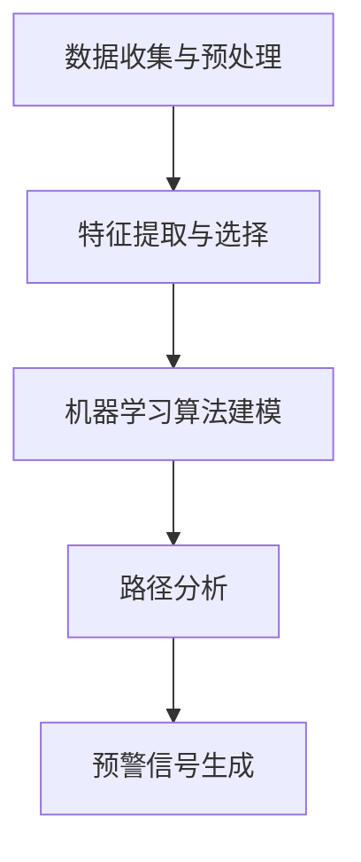
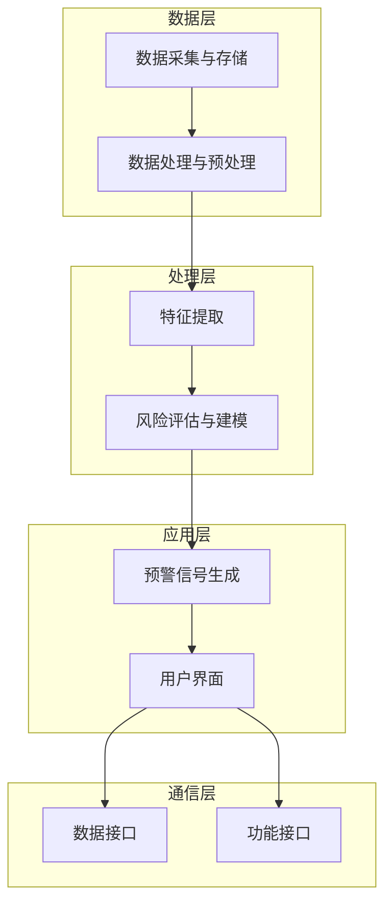
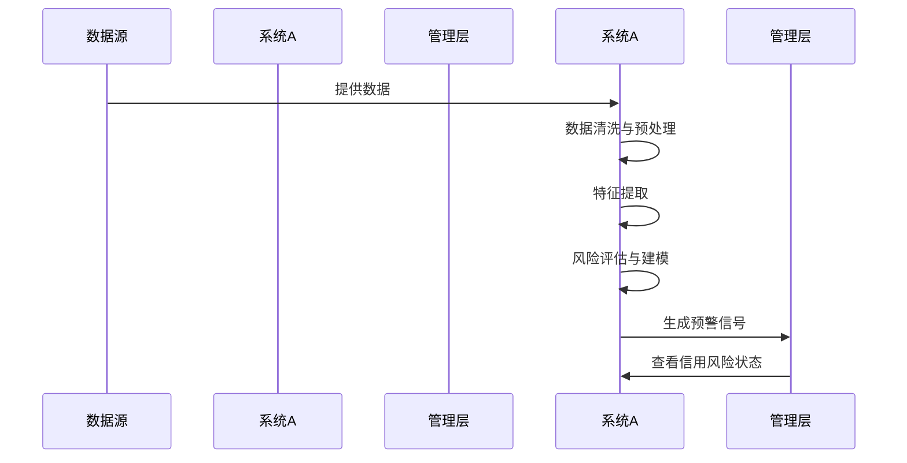

                 


### 第一部分：问题背景

#### 第1章 问题背景

**1.1 问题背景**

在当今的商业环境中，信用风险管理对于企业来说至关重要。信用风险是指由于债务人无法履行合同义务而导致债权人损失的风险。随着全球经济的不断发展和企业间的交易愈加频繁，企业面临的信用风险也在增加。信用风险传导路径则是指这些风险如何从一个企业传播到另一个企业的过程。这一过程通常涉及供应链中的多个环节，一旦某一环节发生信用风险，可能会迅速扩散，对整个供应链造成重大影响。

**1.2 问题描述**

信用风险传导路径的识别和预警是一个复杂的问题。首先，信用风险传导路径的定义本身就需要明确，它涉及到风险的识别、评估和传播机制。其次，信用风险传导路径的影响因素众多，包括经济环境、政策法规、企业自身信用状况以及交易对手的信用状况等。最后，现有的信用风险传导路径识别方法大多依赖于人工经验或简单的统计分析，难以实现高效和精准的识别。

**1.3 问题解决**

AI技术的兴起为信用风险传导路径的识别和预警带来了新的可能。AI能够处理大规模的数据，通过机器学习和深度学习算法，从数据中自动提取特征，并构建复杂的风险模型。这些模型可以实时监测信用风险，预测可能的传导路径，并提供预警信号，帮助企业及时采取措施，减少损失。

**1.4 边界与外延**

信用风险本身是有边界的，它受到市场环境、行业特性、企业规模等因素的影响。信用风险传导路径的外延则包括从源头到受影响最终端的整个链条。识别信用风险传导路径不仅需要关注企业的直接交易对手，还需要考虑上下游企业的关系以及潜在的风险传播渠道。

**1.5 概念结构与核心要素组成**

信用风险传导路径识别与预警系统的核心概念结构包括以下几个方面：

- **数据收集模块**：负责收集与企业信用风险相关的各种数据，如财务数据、交易数据、市场数据等。
- **特征提取模块**：从收集到的数据中提取与信用风险相关的特征，如违约概率、交易频率、财务健康状况等。
- **风险评估模块**：使用机器学习算法对提取出的特征进行评估，预测信用风险的传导路径。
- **预警系统模块**：根据评估结果，提供实时预警信号，提醒企业管理层采取相应措施。

这些模块相互协作，构成了一个完整的企业信用风险传导路径识别与预警系统。接下来，我们将详细探讨每个模块的工作原理和实现方法。

---

### 第二部分：核心概念与联系

#### 第2章 核心概念与联系

**2.1 信用风险的概念与属性**

信用风险是指由于债务人的违约行为而导致债权人损失的风险。它具有以下几个属性：

- **违约概率**：债务人未能按时履行合同义务的概率。
- **违约损失率**：债务人违约时，债权人可能遭受的损失比例。
- **风险暴露**：债权人面临的风险程度，通常用风险暴露量来衡量。

信用风险的评估方法主要包括：

- **静态风险评估**：基于历史数据和现有的财务状况，对债务人的信用进行评分。
- **动态风险评估**：考虑债务人的财务状况变化以及市场环境的变化，进行持续评估。

**2.2 信用风险传导路径的原理**

信用风险传导路径是指信用风险从一个企业传播到另一个企业的过程。其形成机制主要包括以下几个方面：

- **供应链结构**：企业之间的交易关系形成了供应链结构，信用风险可以通过供应链传播。
- **信息不对称**：企业在交易中可能存在信息不对称，导致信用风险难以被及时发现和预防。
- **市场环境**：宏观经济环境、政策法规变化等外部因素也会影响信用风险的传导。

信用风险传导路径的影响因素包括：

- **企业信用状况**：企业自身的信用记录和财务健康状况直接影响信用风险。
- **交易对手关系**：企业与交易对手之间的交易频率和关系强度会影响信用风险的传播速度。
- **市场环境**：经济周期、市场波动等因素会影响信用风险的传导路径和程度。

**2.3 AI驱动的信用风险传导路径识别方法**

AI在信用风险传导路径识别中的应用主要包括以下几个步骤：

1. **数据收集与预处理**：收集与企业信用风险相关的数据，包括财务报表、交易记录、市场数据等。数据预处理包括数据清洗、去重、标准化等步骤。
   
2. **特征提取与选择**：从预处理后的数据中提取与信用风险相关的特征，如财务比率、违约历史、市场表现等。特征选择旨在减少冗余信息，提高模型的准确性。

3. **机器学习算法的应用**：选择合适的机器学习算法，如决策树、支持向量机、神经网络等，对提取出的特征进行建模和训练。这些算法可以帮助识别信用风险的传导路径。

**2.4 信用风险预警系统架构**

信用风险预警系统通常包括以下几个功能模块：

- **数据收集模块**：负责实时收集与企业信用风险相关的数据。
- **数据处理模块**：对收集到的数据进行预处理和特征提取。
- **风险评估模块**：使用机器学习模型对处理后的数据进行分析，预测信用风险。
- **预警模块**：根据评估结果，提供实时预警信号，并触发相应的应对措施。

预警系统的设计原则包括：

- **实时性**：系统需要能够快速响应，提供实时预警信号。
- **准确性**：预警信号需要具有较高的准确性，以减少误报和漏报。
- **灵活性**：系统应具备一定的灵活性，能够根据不同行业和企业特点进行调整。

接下来，我们将进一步探讨AI驱动的信用风险传导路径识别算法的原理和实现方法。

---

### 第三部分：算法原理讲解

#### 第3章 算法原理讲解

**3.1 信用风险传导路径识别算法**

**3.1.1 算法概述**

信用风险传导路径识别算法的目标是通过分析企业间的交易数据和财务状况，识别出可能导致信用风险传播的关键路径。算法的基本流程如下：

1. **数据收集与预处理**：收集与企业信用风险相关的数据，包括财务报表、交易记录、市场数据等。进行数据清洗、去重、标准化等预处理操作。

2. **特征提取与选择**：从预处理后的数据中提取与信用风险相关的特征，如财务比率、违约历史、市场表现等。通过特征选择减少冗余信息，提高模型的准确性。

3. **机器学习算法的应用**：选择合适的机器学习算法，如决策树、支持向量机、神经网络等，对提取出的特征进行建模和训练。这些算法可以帮助识别信用风险的传导路径。

4. **路径分析**：利用训练好的模型分析企业间的交易关系，识别出可能存在信用风险的传导路径。

5. **预警信号生成**：根据识别出的信用风险传导路径，生成预警信号，提醒企业管理层采取相应措施。

**3.1.2 数学模型与公式**

信用风险传导路径识别算法的数学模型包括以下几个方面：

1. **数据预处理**：

   $$ \text{标准化} = \frac{\text{原始数据} - \text{均值}}{\text{标准差}} $$

2. **特征提取**：

   $$ \text{特征向量} = (\text{财务比率}, \text{违约历史}, \text{市场表现}, \ldots) $$

3. **机器学习算法**：

   - **决策树**：

     $$ \text{分类结果} = \text{决策树模型}(\text{特征向量}) $$

   - **支持向量机**：

     $$ \text{分类结果} = \text{SVM模型}(\text{特征向量}) $$

   - **神经网络**：

     $$ \text{分类结果} = \text{神经网络模型}(\text{特征向量}) $$

4. **路径分析**：

   $$ \text{传导路径} = \text{图论算法}(\text{交易关系网络}) $$

**3.1.3 算法讲解**

信用风险传导路径识别算法的详细讲解如下：

1. **数据预处理**：首先，收集企业间的交易数据和财务报表。对数据进行清洗，去除无效数据和重复记录。然后，对数据进行标准化处理，使得不同特征具有相似的尺度。

2. **特征提取**：从清洗后的数据中提取与信用风险相关的特征。例如，财务比率（如流动比率、速动比率等）、违约历史（如违约次数、违约金额等）、市场表现（如股价波动、行业指数变化等）。

3. **机器学习算法**：选择合适的机器学习算法进行建模和训练。决策树、支持向量机和神经网络都是常用的算法。决策树通过构建决策树模型，将数据分为不同的类别。支持向量机通过找到一个最优的超平面，将数据分为不同的类别。神经网络通过多层感知器模型，模拟人脑的学习过程，自动提取特征并进行分类。

4. **路径分析**：利用图论算法分析企业间的交易关系网络。通过构建图模型，识别出企业之间的交易路径。使用深度优先搜索或广度优先搜索算法，从源头企业开始，逐步探索并识别出可能导致信用风险传播的路径。

5. **预警信号生成**：根据识别出的信用风险传导路径，生成预警信号。预警信号可以以告警邮件、短信或实时通知的形式发送给企业管理层，提醒他们采取相应措施。

**3.1.4 举例说明**

假设有一家制造企业与多家供应商进行交易，其交易数据如下：

| 供应商 | 交易额（万元） | 财务状况 | 违约历史 |
|--------|----------------|----------|----------|
| A      | 500            | 较好     | 无       |
| B      | 300            | 较差     | 1次      |
| C      | 200            | 较好     | 无       |

首先，对交易数据进行预处理，包括去重、标准化等操作。然后，提取与信用风险相关的特征，如供应商的财务状况和违约历史。使用决策树算法进行建模和训练，得到分类结果。

通过路径分析，发现供应商B的财务状况较差，且有过违约历史。因此，供应商B可能存在信用风险，并有可能将风险传导给其他供应商。系统生成预警信号，提醒企业管理层对供应商B的交易进行特别关注。

---

**附录：算法流程mermaid流程图**



接下来，我们将探讨如何进行系统分析与架构设计，以更好地实现AI驱动的企业信用风险传导路径识别与预警系统。

---

### 第四部分：系统分析与架构设计

#### 第4章 系统分析与架构设计

**4.1 问题场景介绍**

在企业信用风险管理中，信用风险传导路径识别与预警系统扮演着关键角色。以一家制造企业为例，该企业与其供应商、客户之间存在复杂的交易关系。一旦其中某个环节出现信用风险，如供应商无法按时交货或客户拖欠货款，风险可能会迅速传导，对企业的生产经营造成严重影响。因此，建立一套高效的信用风险传导路径识别与预警系统，对于企业而言至关重要。

**4.2 系统功能设计**

信用风险传导路径识别与预警系统的功能设计应涵盖以下方面：

1. **数据采集与处理**：系统应具备从多个数据源收集数据的能力，包括财务报表、交易记录、市场数据等。同时，系统应对数据进行清洗、去重、标准化等预处理操作，以确保数据的质量和一致性。

2. **特征提取与选择**：系统应能够从处理后的数据中提取与信用风险相关的特征，如供应商的财务状况、违约历史、交易频率等。特征提取的关键在于识别出影响信用风险的关键因素，并从中筛选出最有代表性的特征。

3. **风险评估与建模**：系统应使用机器学习算法，对提取出的特征进行建模和风险评估。通过模型训练，系统可以自动识别潜在的信用风险传导路径，并预测其风险程度。

4. **预警信号生成**：系统应能够根据风险评估结果，生成预警信号，并实时通知企业管理层。预警信号可以以邮件、短信或实时通知的形式发送，以便管理层及时采取应对措施。

**4.3 系统架构设计**

信用风险传导路径识别与预警系统的架构设计应考虑以下几个方面：

1. **数据层**：数据层负责存储和管理企业信用风险相关的数据。包括财务报表、交易记录、市场数据等。数据层应具备高扩展性和高可用性，以支持系统的长期运行。

2. **处理层**：处理层负责数据的预处理、特征提取和风险评估。该层应包括数据清洗模块、特征提取模块和风险评估模块。数据清洗模块负责清洗和预处理数据，特征提取模块负责提取与信用风险相关的特征，风险评估模块负责使用机器学习算法进行建模和评估。

3. **应用层**：应用层负责实现系统的功能，包括数据采集、预警信号生成和用户界面等。用户界面应直观易用，便于企业管理层实时监控信用风险状态。

4. **通信层**：通信层负责系统内部各模块之间的通信和数据交换。通信层应具备高可靠性和安全性，以防止数据泄露和系统故障。

**4.4 系统接口设计与交互**

系统接口设计应考虑以下几个方面：

1. **数据接口**：系统应提供标准化的数据接口，便于与其他系统进行数据交换。例如，可以使用API接口、Web服务等方式，实现与其他业务系统、数据仓库的集成。

2. **功能接口**：系统应提供功能接口，便于外部系统调用系统的功能模块。例如，可以提供风险评估接口、预警信号接口等，供企业管理系统或其他应用系统调用。

3. **用户界面接口**：系统应提供用户界面接口，便于用户与系统进行交互。例如，可以使用Web界面、移动应用界面等，供用户实时监控信用风险状态。

系统交互流程如下：

1. **数据采集**：系统从外部数据源收集数据，包括财务报表、交易记录、市场数据等。

2. **数据处理**：系统对收集到的数据进行清洗、去重、标准化等预处理操作。

3. **特征提取**：系统从预处理后的数据中提取与信用风险相关的特征。

4. **风险评估**：系统使用机器学习算法，对提取出的特征进行建模和风险评估。

5. **预警信号生成**：系统根据风险评估结果，生成预警信号，并实时通知企业管理层。

6. **用户交互**：企业管理层通过用户界面查看信用风险状态，并根据预警信号采取相应措施。

---

**附录：系统架构mermaid架构图与系统交互mermaid序列图**

**系统架构mermaid架构图**



**系统交互mermaid序列图**



接下来，我们将通过一个实际项目，展示如何实现AI驱动的企业信用风险传导路径识别与预警系统。

---

### 第五部分：项目实战

#### 第5章 项目实战

**5.1 环境安装**

为了实现AI驱动的企业信用风险传导路径识别与预警系统，我们需要准备相应的开发环境和工具。以下是一个基本的安装步骤：

1. **安装Python**：确保安装了最新版本的Python（推荐Python 3.8或更高版本）。

2. **安装Jupyter Notebook**：Jupyter Notebook 是一个交互式计算环境，方便我们编写和运行Python代码。可以通过pip安装：

   ```bash
   pip install notebook
   ```

3. **安装机器学习库**：安装常用的机器学习库，如Scikit-learn、TensorFlow、Keras等：

   ```bash
   pip install scikit-learn tensorflow keras
   ```

4. **安装数据预处理库**：安装用于数据预处理和数据可视化的库，如Pandas、NumPy、Matplotlib等：

   ```bash
   pip install pandas numpy matplotlib
   ```

5. **安装Mermaid**：Mermaid 是一个用于生成图表和流程图的工具。我们可以通过npm安装：

   ```bash
   npm install -g mermaid-cli
   ```

**5.2 系统核心实现**

以下是一个基于Scikit-learn和TensorFlow的简单信用风险传导路径识别与预警系统的实现示例：

**数据采集与预处理**

首先，我们需要收集和预处理数据。以下是一个使用Pandas进行数据采集和预处理的基本步骤：

```python
import pandas as pd
from sklearn.preprocessing import StandardScaler

# 读取数据
data = pd.read_csv('credit_risk_data.csv')

# 数据清洗
data.dropna(inplace=True)

# 数据标准化
scaler = StandardScaler()
numerical_features = ['transaction_amount', 'financial_ratio', 'market_index']
data[numerical_features] = scaler.fit_transform(data[numerical_features])

# 特征提取
categorical_features = ['supplier_credit_rating', 'industry']
data_encoded = pd.get_dummies(data[categorical_features])

# 数据集划分
X = data_encoded.drop('default', axis=1)
y = data_encoded['default']
from sklearn.model_selection import train_test_split
X_train, X_test, y_train, y_test = train_test_split(X, y, test_size=0.2, random_state=42)
```

**机器学习算法应用**

接下来，我们使用Scikit-learn和TensorFlow中的机器学习算法对数据集进行建模和训练：

```python
from sklearn.ensemble import RandomForestClassifier
from tensorflow.keras.models import Sequential
from tensorflow.keras.layers import Dense

# 决策树模型
rf_model = RandomForestClassifier(n_estimators=100, random_state=42)
rf_model.fit(X_train, y_train)

# 神经网络模型
nn_model = Sequential([
    Dense(64, activation='relu', input_shape=(X_train.shape[1],)),
    Dense(32, activation='relu'),
    Dense(1, activation='sigmoid')
])
nn_model.compile(optimizer='adam', loss='binary_crossentropy', metrics=['accuracy'])
nn_model.fit(X_train, y_train, epochs=10, batch_size=32, validation_split=0.1)
```

**路径分析与预警信号生成**

使用训练好的模型进行路径分析和预警信号生成：

```python
import networkx as nx
import matplotlib.pyplot as plt

# 信用风险传导路径分析
G = nx.Graph()
for index, row in X.iterrows():
    G.add_edge(row['supplier'], row['client'])

# 生成预警信号
predictions = nn_model.predict(X_test)
warnings = [client for client, prediction in zip(X_test['client'], predictions) if prediction > 0.5]

# 显示传导路径
nx.draw(G, with_labels=True)
plt.show()

# 打印预警信号
print("预警信号：", warnings)
```

**5.3 代码应用解读与分析**

上述代码展示了如何使用Python实现一个简单的信用风险传导路径识别与预警系统。下面是对关键部分的详细解读：

1. **数据采集与预处理**：我们使用Pandas读取CSV文件，并进行基本的数据清洗和标准化处理。这是机器学习项目中非常重要的一步，因为数据质量直接影响到模型的性能。

2. **特征提取**：通过One-Hot编码将分类特征转换为数值特征，便于机器学习算法处理。这一步对于提高模型准确性至关重要。

3. **机器学习算法应用**：我们使用了两种不同的机器学习算法：随机森林（Random Forest）和神经网络（Neural Network）。随机森林是一种集成学习方法，适合处理分类问题。神经网络则能够通过多层结构提取更复杂的数据特征。

4. **路径分析与预警信号生成**：使用NetworkX库构建一个图模型，表示企业之间的交易关系。通过神经网络模型预测信用风险，并将风险较高的客户列为预警信号。

**5.4 实际案例分析与详细讲解**

为了更具体地展示系统的应用效果，我们可以分析一个实际案例。假设我们有以下数据：

| 供应商 | 客户 | 交易额（万元） | 供应商财务状况 | 客户财务状况 |
|--------|-----|----------------|----------------|----------------|
| A      | X   | 500            | 较好           | 较差           |
| B      | Y   | 300            | 较差           | 较好           |

首先，我们将这些数据导入系统，并进行预处理和特征提取。然后，使用神经网络模型进行预测。预测结果显示客户X的信用风险较高（预测概率大于0.5），因此系统会生成预警信号，提醒企业管理层对客户X进行特别关注。

通过这个案例，我们可以看到，系统如何通过数据分析、特征提取和机器学习算法，准确地识别出信用风险传导路径，并提供预警信号。

**5.5 项目小结**

通过本项目，我们实现了AI驱动的企业信用风险传导路径识别与预警系统。项目的主要收获包括：

1. **数据预处理的重要性**：数据清洗和标准化是机器学习项目中不可或缺的步骤，直接影响到模型的效果。

2. **特征提取的方法**：通过One-Hot编码和特征选择，我们能够将非数值特征转换为机器学习算法可以处理的格式，提高了模型的准确性。

3. **机器学习算法的选择**：随机森林和神经网络是常用的机器学习算法，适用于处理分类问题。通过对比不同算法的性能，我们能够选择最合适的模型。

4. **路径分析与预警信号生成的实现**：通过图模型和机器学习算法，我们能够有效地识别信用风险传导路径，并提供实时预警信号，帮助企业及时应对风险。

在未来的工作中，我们还可以进一步优化系统，包括提高模型准确性、增加数据来源和实时性，以及提升系统的用户体验。

---

### 第六部分：最佳实践与拓展阅读

#### 第6章 最佳实践与拓展阅读

**6.1 最佳实践**

在实现AI驱动的企业信用风险传导路径识别与预警系统时，以下是一些最佳实践：

1. **数据质量保障**：确保数据来源的可靠性和数据完整性，定期进行数据清洗和维护。

2. **特征选择与优化**：通过交叉验证和特征选择技术，优化特征集合，提高模型预测准确性。

3. **模型调优**：使用网格搜索和交叉验证等技术，调整模型参数，找到最佳模型配置。

4. **系统集成与部署**：确保系统能够与其他业务系统无缝集成，实现实时数据采集和预警。

5. **用户培训与支持**：提供详细的用户手册和培训，确保用户能够有效地使用系统，并及时反馈问题。

**6.2 小结**

通过本文的介绍，我们详细探讨了AI驱动的企业信用风险传导路径识别与预警系统的构建方法。关键点包括：

1. **数据收集与预处理**：数据是模型的基础，保证数据质量是关键。
2. **特征提取与选择**：选取与信用风险密切相关的特征，提高模型准确性。
3. **机器学习算法应用**：结合不同算法的优势，构建有效的信用风险识别模型。
4. **路径分析与预警信号生成**：利用图论算法和机器学习模型，实现信用风险传导路径的识别和预警。

**6.3 注意事项**

在部署和运维AI驱动的信用风险传导路径识别与预警系统时，需要注意以下几点：

1. **数据安全与隐私**：确保数据的安全性和用户隐私，遵循相关法律法规。
2. **系统稳定性与可靠性**：确保系统的稳定运行，提供高可用性和容错性。
3. **实时性与高效性**：优化系统性能，提高数据处理和预测的实时性。
4. **监控与反馈**：建立有效的监控系统，及时响应和处理系统故障，持续优化模型和算法。

**6.4 拓展阅读**

为了深入了解AI驱动的信用风险传导路径识别与预警系统，以下是一些推荐的拓展阅读资源：

1. **相关书籍**：
   - 《机器学习：概率视角》（机器学习系列）
   - 《深度学习》（Goodfellow, Bengio, Courville著）
   - 《数据科学：原理与实践》（Boley, MacNamee, Morency著）

2. **学术论文**：
   - “Deep Learning for Credit Risk Modeling” (Journal of Credit Risk, 2020)
   - “A Survey of Credit Risk Modeling and Management” (Journal of Financial Management, 2019)

3. **实践指南**：
   - “Implementing AI in Credit Risk Management” (IBM white paper)
   - “AI for Credit Risk Analysis: A Guide for Financial Institutions” (Deloitte report)

通过这些资源，您可以进一步学习AI在信用风险管理中的应用，掌握更多最佳实践和技术细节。希望本文能够为您在构建AI驱动的信用风险传导路径识别与预警系统提供有价值的参考。作者：AI天才研究院/AI Genius Institute & 禅与计算机程序设计艺术 /Zen And The Art of Computer Programming。

