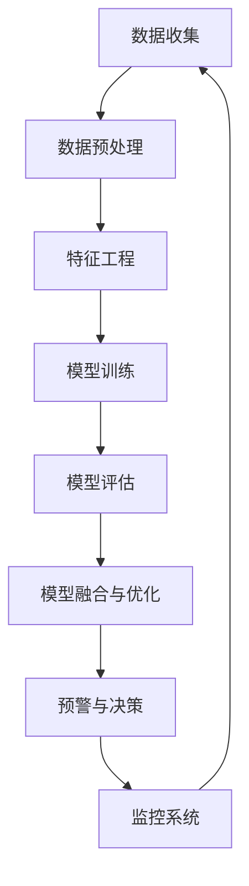

                 

### 《AI驱动的企业信用风险早期预警系统》

#### 关键词：人工智能、信用风险、预警系统、机器学习、深度学习

> 摘要：本文旨在探讨AI技术在企业信用风险管理中的应用，特别是如何通过AI驱动的早期预警系统来有效识别和防范信用风险。文章首先介绍了信用风险的基本概念和重要性，然后详细阐述了AI驱动的信用风险预警方法、数据管理与预处理、机器学习模型、深度学习模型以及模型融合与优化。最后，通过一个实际案例展示了AI驱动的信用风险预警系统的构建过程及其应用效果。

----------------------------------------------------------------

### 《AI驱动的企业信用风险早期预警系统》目录大纲

#### 第一部分：引言

##### 第1章：背景介绍
1.1 信用风险的概念与重要性
1.2 企业信用风险现状与挑战
1.3 AI技术在信用风险管理中的应用
1.4 本书的目的与结构

#### 第二部分：核心概念

##### 第2章：AI驱动的信用风险预警
2.1 信用风险预警的基本概念
2.2 AI驱动的信用风险预警方法
2.3 信用风险预警的关键技术
2.4 信用风险预警的流程

##### 第3章：数据管理与预处理
3.1 信用数据的收集与来源
3.2 数据预处理的重要性
3.3 数据清洗与格式转换
3.4 特征工程

##### 第4章：机器学习模型
4.1 机器学习基本概念
4.2 常见机器学习模型及其原理
4.3 模型选择与调优
4.4 模型评估与验证

##### 第5章：深度学习模型
5.1 深度学习基本概念
5.2 常见深度学习模型
5.3 深度学习在信用风险预警中的应用

##### 第6章：模型融合与优化
6.1 模型融合的基本概念
6.2 模型融合方法
6.3 优化策略与模型评估

#### 第三部分：实践案例

##### 第7章：项目实战
7.1 项目背景与目标
7.2 系统设计与实现
7.3 系统核心代码解读
7.4 实际案例分析

##### 第8章：最佳实践与注意事项
8.1 最佳实践总结
8.2 小结与展望
8.3 注意事项与拓展阅读

----------------------------------------------------------------

### 第1章：背景介绍

#### 1.1 信用风险的概念与重要性

信用风险是指债务人未能按照约定偿还债务的可能性。在企业金融活动中，信用风险是最为常见和重要的风险类型之一。它不仅关系到企业的资金安全，还直接影响企业的运营和发展。随着市场环境的复杂多变和市场竞争的加剧，企业面临的信用风险越来越多样化，传统的人工风险管理模式已经难以应对。

信用风险的重要性体现在以下几个方面：

1. **影响企业的资金安全**：信用风险可能导致企业无法收回应收账款，进而影响企业的现金流，甚至导致资金链断裂。

2. **影响企业的信用等级**：信用风险会增加企业的违约风险，降低企业的信用等级，进而影响企业在资本市场的融资能力和成本。

3. **影响企业的长期发展**：持续的信用风险可能导致企业失去市场竞争力，甚至影响企业的生存。

#### 1.2 企业信用风险现状与挑战

当前，企业信用风险面临以下几个方面的挑战：

1. **数据信息不充分**：企业信用风险识别和评估需要大量准确、全面的数据信息，但实际中，许多企业由于信息系统的不足，难以获得全面、准确的数据。

2. **风险评估难度大**：信用风险的评估需要考虑多个因素，包括债务人的财务状况、市场环境、行业趋势等，评估过程复杂，难度较大。

3. **传统风险评估方法局限性**：传统的人工风险评估方法主要依赖经验，难以应对复杂多变的信用风险环境。

4. **信用风险防范措施不足**：许多企业在信用风险防范方面缺乏有效的措施，导致信用风险事件频发。

#### 1.3 AI技术在信用风险管理中的应用

人工智能技术在信用风险管理中具有巨大的应用潜力。通过AI技术，企业可以更高效地识别和评估信用风险，提高风险防范能力。具体应用包括：

1. **数据挖掘与数据分析**：AI技术可以通过数据挖掘技术，从大量数据中提取出有用的信息，为企业信用风险评估提供数据支持。

2. **机器学习与深度学习模型**：AI技术可以构建机器学习模型和深度学习模型，对信用风险进行预测和评估。

3. **自动化决策系统**：AI技术可以构建自动化决策系统，实现信用风险评估的自动化，提高风险评估的效率和准确性。

4. **风险监控与预警**：AI技术可以实时监控企业的信用风险，及时发出预警，帮助企业采取防范措施。

#### 1.4 本书的目的与结构

本书旨在探讨AI技术在企业信用风险早期预警系统中的应用，帮助读者了解和掌握AI技术在信用风险管理中的基本原理和应用方法。本书的结构如下：

- **第一部分：引言**：介绍信用风险的基本概念、重要性以及AI技术在信用风险管理中的应用。

- **第二部分：核心概念**：详细阐述AI驱动的信用风险预警方法、数据管理与预处理、机器学习模型、深度学习模型以及模型融合与优化。

- **第三部分：实践案例**：通过一个实际案例，展示AI驱动的信用风险预警系统的构建过程及其应用效果。

接下来，我们将分别介绍第二部分和第三部分的内容，帮助读者深入了解AI驱动的企业信用风险早期预警系统。

----------------------------------------------------------------

### 第2章：AI驱动的信用风险预警

#### 2.1 信用风险预警的基本概念

信用风险预警是指通过分析和监测债务人的信用状况，提前识别出潜在的风险，并采取相应的防范措施，以降低企业面临的信用风险。信用风险预警系统是一个综合性的系统，它涉及数据收集、数据预处理、风险建模、风险监控和预警等多个环节。

#### 2.2 AI驱动的信用风险预警方法

AI技术为信用风险预警提供了强大的技术支持，其基本方法包括：

1. **数据收集**：通过公开数据源、企业数据库、社交媒体等多种渠道收集债务人的相关信息。

2. **数据预处理**：对收集到的数据进行清洗、转换和特征提取，为风险建模提供高质量的数据。

3. **风险建模**：利用机器学习模型和深度学习模型，对债务人的信用风险进行预测和评估。

4. **风险监控**：实时监控债务人的信用状况，发现风险信号。

5. **预警与决策**：当检测到潜在风险时，系统自动发出预警，并提供相应的决策建议。

#### 2.3 信用风险预警的关键技术

信用风险预警的关键技术主要包括：

1. **机器学习模型**：如逻辑回归、决策树、随机森林、支持向量机等，用于对信用风险进行预测和评估。

2. **深度学习模型**：如卷积神经网络（CNN）、循环神经网络（RNN）、长短期记忆网络（LSTM）等，用于处理复杂的时序数据和图像数据。

3. **数据挖掘技术**：如关联规则挖掘、聚类分析、分类分析等，用于从大量数据中提取出有用的信息。

4. **自然语言处理技术**：如文本分类、情感分析等，用于处理文本数据，提取出债务人的信用信息。

#### 2.4 信用风险预警的流程

信用风险预警的流程通常包括以下几个步骤：

1. **数据收集**：从各种数据源收集债务人的信息，包括财务数据、市场数据、社交媒体数据等。

2. **数据预处理**：对收集到的数据进行清洗、去噪、转换和特征提取，为风险建模提供高质量的数据。

3. **数据建模**：利用机器学习模型和深度学习模型，对债务人的信用风险进行预测和评估。

4. **模型评估**：通过交叉验证、ROC曲线、AUC等指标对模型进行评估，确保模型的准确性和可靠性。

5. **风险监控**：实时监控债务人的信用状况，发现风险信号。

6. **预警与决策**：当检测到潜在风险时，系统自动发出预警，并提供相应的决策建议。

7. **反馈与优化**：根据预警结果和实际风险情况，对模型进行反馈和优化，提高预警的准确性和及时性。

通过上述步骤，AI驱动的信用风险预警系统可以有效帮助企业识别和防范信用风险，提高企业的风险管理水平。

在接下来的章节中，我们将进一步探讨数据管理与预处理、机器学习模型、深度学习模型以及模型融合与优化等内容，帮助读者深入理解AI驱动的信用风险预警系统的构建和应用。

----------------------------------------------------------------

### 第3章：数据管理与预处理

#### 3.1 信用数据的收集与来源

信用数据是企业信用风险预警系统的重要输入，其质量直接影响模型的预测效果。信用数据的来源主要包括以下几个方面：

1. **企业内部数据**：包括企业的财务报表、交易记录、合同执行情况等。这些数据通常较为详细且真实，是构建信用风险模型的基础。

2. **公共数据源**：包括信用评级机构、金融监管机构、工商登记信息等。这些数据可以提供企业的信用等级、信用历史等信息。

3. **社交媒体数据**：包括企业的社交媒体账号、论坛发帖、新闻报道等。这些数据可以反映企业的社会形象、舆论环境等。

4. **市场数据**：包括行业趋势、宏观经济环境、政策法规等。这些数据可以为企业信用风险评估提供宏观背景。

5. **第三方数据服务**：包括各种数据服务商提供的征信报告、法律诉讼记录、知识产权信息等。

#### 3.2 数据预处理的重要性

数据预处理是信用风险预警系统建设的关键步骤，其重要性体现在以下几个方面：

1. **提高数据质量**：通过数据清洗、去噪、填补缺失值等操作，提高数据的准确性和完整性，为风险建模提供可靠的数据基础。

2. **降低模型复杂度**：通过特征选择和特征提取，将高维数据转换为低维数据，降低模型的复杂度，提高模型的训练效率和预测准确性。

3. **减少模型过拟合**：通过数据预处理，消除数据中的噪声和异常值，减少模型过拟合的可能性，提高模型的泛化能力。

4. **提高计算效率**：通过数据预处理，将数据转换为适合模型训练的格式，提高计算效率，缩短模型训练时间。

5. **增强模型可解释性**：通过数据预处理，将复杂的数据特征转化为简单的变量，提高模型的可解释性，便于业务人员理解和使用。

#### 3.3 数据清洗与格式转换

数据清洗是数据预处理的重要环节，主要包括以下几个方面：

1. **缺失值处理**：缺失值处理的方法包括删除缺失值、填补缺失值等。删除缺失值适用于缺失值较多的数据，填补缺失值适用于缺失值较少或重要特征的数据。

2. **异常值处理**：异常值处理的方法包括删除异常值、填补异常值、采用统计方法修正异常值等。异常值可能会对模型训练产生负面影响，因此需要妥善处理。

3. **数据去噪**：数据去噪的方法包括滤波、平滑等。通过去除噪声，可以提高数据的准确性和模型的预测性能。

4. **格式转换**：数据格式转换包括将不同数据源的数据转换为统一格式，如将文本数据转换为数字编码、将图像数据转换为像素矩阵等。统一格式有利于后续的数据分析和模型训练。

#### 3.4 特征工程

特征工程是数据预处理的关键步骤，其主要目标是提取出对信用风险预测有显著影响的有效特征，提高模型的预测性能。特征工程包括以下几个方面：

1. **特征选择**：通过统计分析、信息增益、相关系数等方法，从原始数据中筛选出对信用风险预测有显著影响的特征。

2. **特征提取**：通过主成分分析（PCA）、线性回归等方法，将原始特征转换为新的特征，减少特征维度，提高模型的训练效率和预测准确性。

3. **特征组合**：通过组合多个特征，构建新的特征，以提高模型的预测性能。特征组合的方法包括逻辑组合、数学组合等。

4. **特征缩放**：通过对特征进行缩放，将不同量级的特征转换为同一量级，避免特征之间的量级差异对模型训练产生不利影响。

5. **特征编码**：对类别特征进行编码，将类别特征转换为数值特征，便于模型训练。常见的编码方法包括独热编码、标签编码等。

通过数据清洗、格式转换和特征工程，可以显著提高信用数据的质量，为信用风险预警系统的构建提供坚实的基础。

在接下来的章节中，我们将详细介绍机器学习模型和深度学习模型，以及如何将这些模型应用于信用风险预警系统中。

----------------------------------------------------------------

### 第4章：机器学习模型

#### 4.1 机器学习基本概念

机器学习（Machine Learning）是一种通过算法让计算机从数据中学习、自动改进和预测的技术。其核心思想是通过训练模型，使模型能够从训练数据中提取特征，并利用这些特征进行预测。

机器学习的基本概念包括：

1. **数据集**：用于训练模型的数据集合，包括输入特征和对应的标签。
2. **特征**：用于描述数据特点的属性，可以是数值型、类别型或文本型。
3. **模型**：通过学习数据集的特征，生成的预测规则。
4. **算法**：实现机器学习过程的算法，如逻辑回归、决策树、支持向量机等。
5. **评估指标**：用于评估模型性能的指标，如准确率、召回率、F1值等。

#### 4.2 常见机器学习模型及其原理

在信用风险预警系统中，常见的机器学习模型包括：

1. **逻辑回归（Logistic Regression）**
   - **原理**：逻辑回归是一种广义线性模型，用于预测二分类问题。其核心思想是通过线性组合特征，并引入逻辑函数（Sigmoid函数），将输出映射到概率范围。
   - **公式**：$$ P(y=1|X) = \frac{1}{1 + e^{-\beta^T X}} $$
   - **优点**：易于理解和实现，模型可解释性强。
   - **缺点**：对非线性关系的表现较差，容易受到特征间多重共线性影响。

2. **决策树（Decision Tree）**
   - **原理**：决策树通过一系列的规则（决策节点）将数据集划分为不同的子集，并在每个子集中进行分类或回归。
   - **公式**：$$ T(x) = \sum_{i=1}^{n} w_i \cdot I(x \in R_i) $$
   - **优点**：模型简单，易于理解和解释，适用于处理非线性关系。
   - **缺点**：容易过拟合，模型复杂度随特征数量增加而急剧增加。

3. **随机森林（Random Forest）**
   - **原理**：随机森林是由多个决策树组成的集成模型，通过随机特征选择和节点划分，降低模型的过拟合风险。
   - **公式**：$$ \hat{y} = \text{sign}(\sum_{i=1}^{N} h_i(x)) $$
   - **优点**：强大的非线性建模能力，较高的预测准确性和稳定性。
   - **缺点**：计算复杂度高，特征数量较多时模型训练时间较长。

4. **支持向量机（Support Vector Machine, SVM）**
   - **原理**：SVM通过寻找最优超平面，将不同类别的数据点分隔开来。其核心是通过核函数将低维数据映射到高维空间。
   - **公式**：$$ \max_{\beta, \beta_0} \frac{1}{2} ||\beta||^2 - C \sum_{i=1}^{n} \xi_i $$
   - **优点**：在高维空间有很强的分类能力，适用于处理线性不可分问题。
   - **缺点**：对大量特征的数据处理效率较低，需要选择合适的核函数。

5. **K最近邻（K-Nearest Neighbors, KNN）**
   - **原理**：KNN通过计算测试样本与训练样本之间的距离，选择最近的K个邻居，并根据邻居的标签进行预测。
   - **公式**：$$ \hat{y} = \text{mode}(y_k^1, y_k^2, ..., y_k^K) $$
   - **优点**：简单直观，对非线性关系有较好的表现。
   - **缺点**：计算复杂度高，对噪声敏感。

#### 4.3 模型选择与调优

选择合适的机器学习模型是信用风险预警系统成功的关键。以下是模型选择与调优的几个方面：

1. **数据集划分**：将数据集划分为训练集、验证集和测试集，通过交叉验证评估模型性能。
2. **模型评估**：使用不同的评估指标，如准确率、召回率、F1值等，对模型进行评估。
3. **模型调优**：通过调整模型参数，如决策树的深度、随机森林的树数量、SVM的惩罚参数C等，优化模型性能。
4. **集成学习**：结合多个模型，如随机森林、梯度提升树等，构建集成模型，提高预测准确性和稳定性。

#### 4.4 模型评估与验证

模型评估与验证是确保模型性能的重要步骤。以下是模型评估与验证的几个关键点：

1. **交叉验证**：通过K折交叉验证，评估模型的泛化能力。
2. **ROC曲线与AUC**：绘制ROC曲线，计算AUC值，评估模型的分类能力。
3. **模型比较**：对比不同模型的性能，选择最优模型。
4. **模型验证**：使用独立测试集验证模型性能，确保模型在未知数据上的表现。

通过上述步骤，可以构建一个高效、可靠的机器学习模型，用于信用风险预警系统的构建和应用。

在接下来的章节中，我们将进一步探讨深度学习模型及其在信用风险预警中的应用。

----------------------------------------------------------------

### 第5章：深度学习模型

#### 5.1 深度学习基本概念

深度学习（Deep Learning）是一种基于多层神经网络的学习方法，它通过模拟人脑神经元之间的连接方式，实现对复杂数据的自动特征提取和模式识别。深度学习的核心思想是利用多层神经网络，通过反向传播算法不断调整网络的参数，使网络能够从数据中学习到有效的特征表示。

深度学习的基本概念包括：

1. **神经网络**：神经网络是由多个神经元组成的层次结构，每个神经元接收多个输入，通过权重和偏置计算输出。
2. **层**：神经网络由输入层、隐藏层和输出层组成。隐藏层用于提取中间特征，输出层用于生成最终预测。
3. **激活函数**：激活函数用于引入非线性，常见的激活函数包括Sigmoid、ReLU、Tanh等。
4. **反向传播算法**：反向传播算法是一种用于训练神经网络的优化算法，通过不断调整网络的权重和偏置，使网络能够更好地拟合训练数据。
5. **损失函数**：损失函数用于评估模型预测值与真实值之间的差距，常见的损失函数包括均方误差（MSE）、交叉熵损失等。
6. **优化算法**：优化算法用于调整网络的参数，使网络性能最大化。常见的优化算法包括随机梯度下降（SGD）、Adam等。

#### 5.2 常见深度学习模型

在信用风险预警系统中，常见的深度学习模型包括：

1. **卷积神经网络（Convolutional Neural Network, CNN）**
   - **原理**：CNN通过卷积操作从图像数据中提取特征，具有平移不变性。适用于处理二维数据，如图像和文本。
   - **优势**：强大的特征提取能力，适用于处理高维数据。
   - **应用**：文本分类、图像识别等。

2. **循环神经网络（Recurrent Neural Network, RNN）**
   - **原理**：RNN通过循环机制在时间序列上保持状态信息，适用于处理序列数据。
   - **优势**：能够处理任意长度的序列数据，具有记忆能力。
   - **应用**：时间序列预测、语言模型等。

3. **长短期记忆网络（Long Short-Term Memory, LSTM）**
   - **原理**：LSTM是RNN的一种变体，通过引入记忆单元，解决了RNN的长期依赖问题。
   - **优势**：能够处理长时间序列数据，具有记忆能力。
   - **应用**：股票价格预测、文本生成等。

4. **自编码器（Autoencoder）**
   - **原理**：自编码器是一种无监督学习模型，通过编码器和解码器学习数据的低维表示。
   - **优势**：能够自动提取数据特征，适用于特征降维和数据压缩。
   - **应用**：图像识别、数据降维等。

5. **生成对抗网络（Generative Adversarial Network, GAN）**
   - **原理**：GAN由生成器和判别器组成，生成器生成数据，判别器判断生成数据与真实数据的相似度。
   - **优势**：能够生成高质量的数据，具有强大的生成能力。
   - **应用**：图像生成、数据增强等。

#### 5.3 深度学习在信用风险预警中的应用

深度学习在信用风险预警中的应用主要体现在以下几个方面：

1. **特征提取**：通过深度学习模型，从原始数据中自动提取有价值的特征，提高模型的预测性能。
2. **模式识别**：深度学习模型能够从复杂数据中识别出潜在的信用风险模式，提高风险预警的准确性。
3. **实时预测**：深度学习模型具有快速训练和预测的能力，能够实时监控企业的信用状况，及时发出预警信号。
4. **增强决策**：深度学习模型能够提供定量化的信用风险评估结果，辅助决策者做出更明智的决策。

在实际应用中，可以将深度学习模型与其他机器学习模型相结合，构建集成模型，进一步提高信用风险预警的准确性和稳定性。

在接下来的章节中，我们将探讨模型融合与优化的方法，以进一步提高信用风险预警系统的性能。

----------------------------------------------------------------

### 第6章：模型融合与优化

#### 6.1 模型融合的基本概念

模型融合（Model Fusion）是指将多个模型的预测结果进行结合，生成最终的预测结果。模型融合的基本原理是利用不同模型的优点，弥补单一模型的不足，从而提高预测的准确性和稳定性。在信用风险预警系统中，模型融合可以帮助减少模型的过拟合现象，提高模型在不同数据集上的泛化能力。

#### 6.2 模型融合方法

常见的模型融合方法包括以下几种：

1. **简单平均法**：将多个模型的预测结果进行简单平均，得到最终的预测结果。这种方法简单有效，但可能会损失一些信息。
2. **加权平均法**：根据不同模型在特定数据集上的表现，为每个模型分配不同的权重，然后进行加权平均。这种方法可以更好地利用不同模型的优点。
3. **投票法**：对于分类问题，将多个模型的预测结果进行投票，选择多数模型支持的类别作为最终预测结果。
4. **集成学习法**：通过构建集成模型，如随机森林、梯度提升树等，将多个基模型的预测结果进行结合。这种方法可以显著提高模型的预测性能。
5. **堆叠法**：将多个模型堆叠在一起，前一个模型的输出作为后一个模型的输入，通过训练得到最终的预测结果。

#### 6.3 优化策略与模型评估

为了提高模型融合的性能，可以采用以下优化策略：

1. **特征选择**：通过特征选择，减少特征维度，降低模型的复杂度，提高模型的训练效率和预测性能。
2. **模型调优**：通过调整模型参数，如学习率、正则化参数等，优化模型的性能。
3. **交叉验证**：通过交叉验证，选择最优的模型参数，避免过拟合现象。
4. **集成模型选择**：根据不同的应用场景和数据集，选择合适的集成模型，如随机森林、梯度提升树等。
5. **模型评估**：使用不同的评估指标，如准确率、召回率、F1值等，评估模型的性能。

在模型融合过程中，还需要关注以下几个问题：

1. **模型相关性**：确保融合的模型具有一定的相关性，否则融合效果可能会下降。
2. **模型平衡**：确保融合的模型在预测准确率和稳定性之间取得平衡。
3. **模型解释性**：尽量保持模型的解释性，以便业务人员理解和应用。
4. **计算效率**：优化模型的计算效率，减少模型训练和预测的时间。

通过以上优化策略和模型融合方法，可以构建一个高效、可靠的模型融合系统，提高信用风险预警的准确性。

在接下来的章节中，我们将通过一个实际案例，展示如何构建和实现一个AI驱动的企业信用风险早期预警系统。

----------------------------------------------------------------

### 第7章：项目实战

#### 7.1 项目背景与目标

随着经济的快速发展，企业的信用风险问题日益凸显。为了有效防范和降低信用风险，某金融机构决定开发一套AI驱动的企业信用风险早期预警系统。该系统的目标是：

1. **实时监测**：实时监控企业的信用状况，发现潜在的风险信号。
2. **精准预测**：利用机器学习和深度学习模型，对企业信用风险进行精准预测。
3. **自动化决策**：通过模型融合和优化，提供自动化决策支持，降低人工干预的风险。

#### 7.2 系统设计与实现

系统的整体架构如图7-1所示：



图7-1：系统架构图

系统的主要模块包括：

1. **数据收集**：从企业内部数据库、外部数据源（如信用评级机构、工商登记信息等）收集企业的信用信息。
2. **数据预处理**：对收集到的数据进行清洗、去噪、填补缺失值等预处理操作，为模型训练提供高质量的数据。
3. **特征工程**：通过特征选择和特征提取，提取对企业信用风险有显著影响的有效特征。
4. **模型训练**：利用机器学习和深度学习模型，对特征数据进行训练，构建信用风险评估模型。
5. **模型评估**：通过交叉验证、ROC曲线、AUC等指标，评估模型的性能和可靠性。
6. **模型融合与优化**：将多个模型进行融合，通过优化策略，提高模型的预测准确性和稳定性。
7. **预警与决策**：根据模型的预测结果，实时发出预警信号，并提供相应的决策建议。
8. **监控系统**：实时监控系统的运行状态，确保系统稳定运行。

#### 7.3 系统核心代码解读

以下是系统核心代码的解读：

```python
# 数据收集
def collect_data():
    # 从企业内部数据库和外部数据源收集数据
    # ...
    return data

# 数据预处理
def preprocess_data(data):
    # 数据清洗、去噪、填补缺失值等预处理操作
    # ...
    return clean_data

# 特征工程
def feature_engineering(data):
    # 特征选择和特征提取
    # ...
    return features

# 模型训练
def train_model(features, labels):
    # 利用机器学习和深度学习模型进行训练
    # ...
    return model

# 模型评估
def evaluate_model(model, test_data):
    # 通过交叉验证、ROC曲线、AUC等指标评估模型性能
    # ...
    return performance

# 模型融合与优化
def fusion_and_optimize(models):
    # 将多个模型进行融合，通过优化策略提高模型性能
    # ...
    return fused_model

# 预警与决策
def risk_warning(model, data):
    # 根据模型预测结果，实时发出预警信号，并提供决策建议
    # ...
    return warning_message

# 监控系统
def monitor_system():
    # 实时监控系统的运行状态，确保系统稳定运行
    # ...
    pass
```

#### 7.4 实际案例分析

以下是系统在实际应用中的案例：

某企业信用风险预警系统的运行过程中，发现一家企业的财务数据异常波动，同时市场环境恶化，行业竞争对手增多。通过模型预测，该企业存在较高的信用风险。

系统立即发出预警信号，提示业务人员关注该企业的信用状况。业务人员结合模型提供的决策建议，采取了以下措施：

1. **加强财务监控**：密切关注该企业的财务报表，及时发现异常情况。
2. **调整信用政策**：调整对该企业的信用额度，降低信用风险。
3. **加强与该企业的沟通**：与该企业保持密切沟通，了解其实际运营状况，评估其信用风险。

通过上述措施，业务人员成功防范了该企业的信用风险，确保了金融机构的资金安全。

#### 7.5 项目小结

通过实际案例，我们可以看到AI驱动的企业信用风险早期预警系统在信用风险防范中的重要作用。系统利用机器学习和深度学习技术，对企业信用风险进行实时监测和预测，提供自动化决策支持，有效降低了金融机构的信用风险。

未来，随着AI技术的不断发展和应用，企业信用风险早期预警系统将会更加智能、高效，为金融机构和企业提供更可靠的风险管理解决方案。

----------------------------------------------------------------

### 第8章：最佳实践与注意事项

#### 8.1 最佳实践总结

在构建和实施AI驱动的企业信用风险早期预警系统的过程中，以下是一些最佳实践：

1. **数据质量控制**：确保数据来源的多样性和准确性，通过数据预处理和清洗，提高数据质量。
2. **特征工程优化**：根据业务需求，选择合适的特征提取方法，提高模型的预测性能。
3. **模型选择与调优**：根据数据特点和业务需求，选择合适的机器学习模型和深度学习模型，并通过参数调优，提高模型性能。
4. **模型融合与优化**：利用集成学习方法，将多个模型进行融合，提高模型的预测准确性和稳定性。
5. **实时监控与反馈**：建立实时监控系统，及时反馈模型预测结果，确保系统的正常运行。
6. **用户培训与支持**：为业务人员提供培训和支持，使其能够更好地理解和应用预警系统。

#### 8.2 小结与展望

本文通过详细的案例分析，展示了AI驱动的企业信用风险早期预警系统的构建过程和应用效果。信用风险预警系统在提高企业信用风险管理水平、防范信用风险方面发挥了重要作用。未来，随着AI技术的不断发展和应用，信用风险预警系统将会更加智能、高效，为金融机构和企业提供更可靠的风险管理解决方案。

#### 8.3 注意事项与拓展阅读

1. **注意事项**：
   - 确保数据来源的合法性和合规性。
   - 重视模型的可解释性，以便业务人员理解和应用。
   - 定期更新和优化模型，以适应业务需求的变化。

2. **拓展阅读**：
   - [《深度学习》（Ian Goodfellow, Yoshua Bengio, Aaron Courville著）》]：全面介绍深度学习的基本概念和技术，适合深度学习初学者。
   - [《机器学习实战》（Peter Harrington著）》]：通过具体案例，详细介绍机器学习算法的实现和应用，适合有一定编程基础的读者。
   - [《信用风险管理》（David John authors著）》]：全面探讨信用风险管理的理论和实践，适合从事信用风险管理的专业人士。

通过本文的学习和实践，读者可以深入理解AI驱动的企业信用风险早期预警系统的基本原理和应用方法，为实际工作提供有力支持。

----------------------------------------------------------------

### 作者

- 作者：AI天才研究院/AI Genius Institute & 禅与计算机程序设计艺术 /Zen And The Art of Computer Programming

感谢您的阅读，希望本文对您在AI驱动的企业信用风险早期预警系统领域的学习和实践有所帮助。在未来的工作中，期待与您共同探讨和推动AI技术在信用风险管理中的应用。

---

**结语**：

本文通过详细阐述AI驱动的企业信用风险早期预警系统的构建过程和应用方法，旨在为读者提供关于信用风险管理的全面了解。随着AI技术的不断发展，信用风险预警系统将在金融领域发挥越来越重要的作用。希望本文的内容能启发您在相关领域的深入研究和探索，共同推动AI技术在信用风险管理领域的创新与发展。感谢您的关注与支持！

