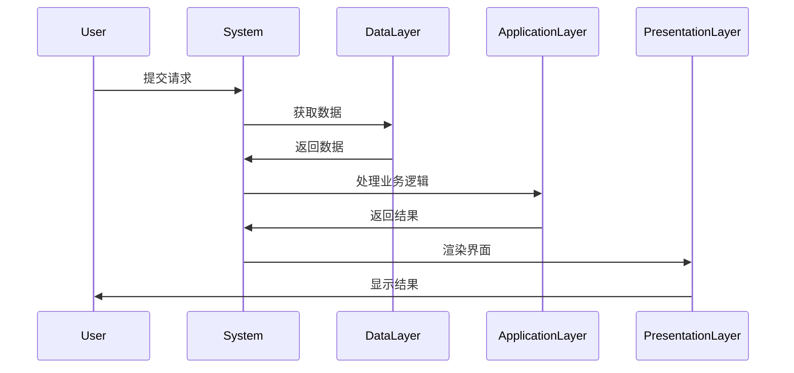

                 

# AI驱动的企业应收账款管理优化系统

关键词：人工智能，应收账款管理，大数据分析，机器学习，风险预测

摘要：本文将深入探讨AI驱动的企业应收账款管理优化系统的设计和实现。通过分析问题背景、核心概念与联系，以及算法原理和系统架构设计，本文旨在为读者提供一个清晰、全面的理解，帮助企业更好地利用AI技术优化应收账款管理，提高运营效率。

## 第一部分：背景介绍

### 1.1 问题背景

在商业活动中，应收账款管理是企业财务运营中的一个关键环节。它涉及到企业对客户应收账款的追踪、管理、催收等一系列活动。传统的应收账款管理主要依赖于人工经验和手工操作，存在以下问题：

- **客户支付预测不准确**：企业难以准确预测客户的支付行为，导致资金流动性不足。
- **收款策略不合理**：企业缺乏有效的收款策略，导致应收账款回收期过长，增加坏账风险。
- **数据利用率低**：企业往往只利用部分数据进行分析，导致数据价值没有得到充分利用。
- **风险预警机制不足**：企业对于客户信用风险的预警机制不够完善，容易导致坏账损失。

随着人工智能和大数据技术的发展，AI驱动的应收账款管理优化系统为企业提供了一种全新的解决方案。这种系统能够通过大数据分析和机器学习算法，预测客户支付行为，优化收款策略，减少坏账风险，提高现金流。

### 1.2 问题描述

企业应收账款管理存在的问题主要包括：

- **客户支付预测不准确**：传统的应收账款管理依赖于历史数据和经验，难以准确预测客户的支付行为，导致资金流动性不足。
- **收款策略不合理**：企业缺乏有效的收款策略，可能导致应收账款回收期过长，增加坏账风险。
- **数据利用率低**：企业往往只利用部分数据进行分析，导致数据价值没有得到充分利用。
- **风险预警机制不足**：企业对于客户信用风险的预警机制不够完善，容易导致坏账损失。

### 1.3 问题解决

AI驱动的应收账款管理优化系统通过以下方式解决上述问题：

- **大数据分析**：利用大数据技术对客户的交易数据进行深度挖掘，识别出潜在的风险因素。
- **机器学习算法**：应用机器学习算法对客户支付行为进行预测，优化收款策略。
- **风险评估**：建立客户信用风险评估模型，实时监控客户信用状况，及时预警潜在风险。

### 1.4 边界与外延

- **边界**：本系统主要关注企业内部应收账款的管理，不包括外部因素如市场环境变化等。
- **外延**：系统可以扩展到其他财务管理领域，如库存管理、现金流管理等。

### 1.5 概念结构与核心要素组成

- **核心概念**：应收账款管理、人工智能、大数据分析、机器学习、风险预测等。
- **结构组成**：数据收集模块、数据分析模块、预测模块、策略优化模块、风险监控模块。

## 第二部分：核心概念与联系

### 2.1 应收账款管理

应收账款管理是指企业通过制定合理的政策和流程，确保客户按时支付款项，减少坏账损失，提高现金流。其主要任务包括：

- **账款追踪**：对客户应收账款进行实时追踪，确保账款信息准确无误。
- **账款催收**：对逾期未支付的账款进行催收，降低坏账风险。
- **账款分析**：对应收账款进行定期分析，评估客户信用状况和支付意愿。

### 2.2 AI与机器学习

人工智能（AI）是指使计算机系统模拟人类智能行为的技术，而机器学习是AI的一个重要分支，通过数据驱动的方式实现智能决策。在应收账款管理中，AI和机器学习可以用于：

- **客户支付行为预测**：通过分析历史数据，预测客户的支付行为，为收款策略提供依据。
- **风险评估**：通过分析客户的历史交易数据，评估客户的信用风险，为信用决策提供支持。

### 2.3 大数据分析

大数据分析是指对海量数据进行处理、分析和挖掘，从中提取有价值的信息和知识。在应收账款管理中，大数据分析可以用于：

- **客户行为分析**：通过分析客户的交易数据，了解客户的行为模式和支付习惯。
- **风险因素识别**：通过分析历史数据，识别可能导致客户逾期支付的风险因素。

### 2.4 风险预测

风险预测是利用历史数据和统计分析方法，预测可能发生的风险事件。在应收账款管理中，风险预测可以用于：

- **客户信用评分**：通过对客户的交易数据进行分析，预测客户的信用风险。
- **逾期风险预警**：通过对客户的交易行为进行分析，预测客户可能出现的逾期风险，提前采取预防措施。

### 2.5 概念属性特征对比表格

| 概念       | 属性特征                     |
|------------|------------------------------|
| 应收账款管理 | 优化收款流程，减少坏账风险   |
| AI         | 模拟人类智能行为             |
| 机器学习    | 数据驱动，自动决策           |
| 大数据分析  | 处理海量数据，提取信息       |
| 风险预测    | 预测风险事件，提前预警       |

### 2.6 ER实体关系图架构

```mermaid
erDiagram
  Customer -->|支付行为| Payment
  Customer -->|信用评分| CreditRating
  Payment ||--|创建| Order
  CreditRating ||--|更新| Order
```

## 第三部分：算法原理讲解

### 3.1 算法介绍

AI驱动的应收账款管理优化系统主要使用以下算法：

- **回归分析**：预测客户支付金额。
- **聚类分析**：识别高风险客户。
- **决策树**：制定收款策略。
- **神经网络**：进行客户信用评分。

### 3.2 算法原理

#### 3.2.1 回归分析

回归分析是一种用于预测数值型变量的统计方法。其基本原理是通过历史数据建立回归模型，然后利用模型预测新数据的值。

$$
Y = \beta_0 + \beta_1X_1 + \beta_2X_2 + ... + \beta_nX_n + \epsilon
$$

其中，$Y$ 是因变量，$X_1, X_2, ..., X_n$ 是自变量，$\beta_0, \beta_1, \beta_2, ..., \beta_n$ 是回归系数，$\epsilon$ 是误差项。

#### 3.2.2 聚类分析

聚类分析是一种无监督学习方法，它将数据集划分为若干个类别（簇），使得同簇的数据相似度较高，而不同簇的数据相似度较低。常见的聚类算法包括K-Means、层次聚类等。

#### 3.2.3 决策树

决策树是一种基于树形结构的知识表示方法，通过多个判断节点和终端节点，对数据集进行分类或回归预测。决策树的生成过程遵循信息增益、基尼不纯度等原则。

#### 3.2.4 神经网络

神经网络是一种模拟生物神经系统的计算模型，由大量简单的人工神经元组成。神经网络通过学习输入和输出之间的映射关系，实现复杂函数的逼近和预测。

### 3.3 算法原理详细讲解

#### 3.3.1 回归分析

以线性回归为例，假设我们有一组数据$(X, Y)$，其中$X$为自变量，$Y$为因变量。我们的目标是找到一个线性模型$Y = \beta_0 + \beta_1X + \epsilon$，使得模型能够较好地拟合数据。

线性回归模型的目标是最小化误差平方和：
$$
J(\beta_0, \beta_1) = \sum_{i=1}^{n}(Y_i - (\beta_0 + \beta_1X_i))^2
$$

通过梯度下降法，我们可以迭代更新$\beta_0$和$\beta_1$，直至找到最优解。

$$
\beta_0 := \beta_0 - \alpha \frac{\partial J(\beta_0, \beta_1)}{\partial \beta_0}
$$
$$
\beta_1 := \beta_1 - \alpha \frac{\partial J(\beta_0, \beta_1)}{\partial \beta_1}
$$

其中，$\alpha$为学习率。

#### 3.3.2 聚类分析

以K-Means聚类为例，假设我们有一个数据集$D$，需要将其划分为$k$个簇。首先随机初始化$k$个簇心$\mu_1, \mu_2, ..., \mu_k$。然后，对于每个数据点$x_i$，计算其到$k$个簇心的距离，并将其分配到最近的簇心所在的簇。

接着，重新计算每个簇的平均值作为新的簇心。重复上述过程，直至簇心的变化足够小或者达到最大迭代次数。

#### 3.3.3 决策树

决策树生成过程通常采用递归二分划分法。以决策树分类为例，假设我们有一组训练数据$D$，其中每个数据点$(x, y)$包含特征向量$x$和类别标签$y$。

1. 计算每个特征的信息增益：
   $$
   IG(D, A) = H(D) - \sum_{v \in A} \frac{|D_v|}{|D|} H(D_v)
   $$
   其中，$H(D)$为数据集$D$的熵，$D_v$为在特征$A$取值为$v$的数据子集。

2. 选择信息增益最大的特征作为划分标准。

3. 根据划分标准，将数据集划分为若干子集，并递归地构造决策树。

#### 3.3.4 神经网络

神经网络通过反向传播算法进行训练。以单层神经网络为例，假设输入层有$m$个神经元，隐藏层有$n$个神经元，输出层有$p$个神经元。

1. 前向传播：计算输入层到隐藏层的输出$\hat{h}_{ij}$和隐藏层到输出层的输出$\hat{y}_{ik}$：
   $$
   \hat{h}_{ij} = \sigma(\sum_{k=1}^{m} w_{ik}x_k + b_i)
   $$
   $$
   \hat{y}_{ik} = \sigma(\sum_{j=1}^{n} w_{jk}\hat{h}_{ij} + b_k)
   $$

   其中，$w_{ik}$和$b_i$为输入层到隐藏层的权重和偏置，$w_{jk}$和$b_k$为隐藏层到输出层的权重和偏置，$\sigma$为激活函数（通常取为Sigmoid函数）。

2. 计算输出层与实际标签之间的误差：
   $$
   \delta_k = (y_k - \hat{y}_{ik})\hat{y}_{ik}(1 - \hat{y}_{ik})
   $$

3. 反向传播：更新权重和偏置：
   $$
   \Delta w_{jk} = \alpha \delta_k \hat{h}_{ij}
   $$
   $$
   \Delta b_k = \alpha \delta_k
   $$
   $$
   \Delta w_{ik} = \alpha \delta_i x_k
   $$
   $$
   \Delta b_i = \alpha \delta_i
   $$

   其中，$\alpha$为学习率。

通过反复迭代上述步骤，直至达到预设的误差阈值或最大迭代次数。

## 第四部分：系统分析与架构设计

### 4.1 问题场景介绍

在企业财务管理中，应收账款管理是一个关键环节，直接关系到企业的资金流动和财务健康。随着企业规模的扩大和交易量的增加，传统的手工管理方式已经无法满足高效、精准的管理需求。为了提高应收账款管理的效率和准确性，企业需要引入AI驱动的优化系统。

### 4.2 项目介绍

本项目旨在设计并实现一个AI驱动的企业应收账款管理优化系统，通过大数据分析和机器学习算法，实现客户支付行为预测、收款策略优化和风险预警等功能。系统将为企业提供一个自动化、智能化的应收账款管理平台，提高资金使用效率，降低财务风险。

### 4.3 系统功能设计

#### 4.3.1 数据收集模块

数据收集模块负责从企业内部系统和外部数据源收集与应收账款管理相关的数据，包括客户交易数据、财务报表数据、市场环境数据等。数据收集模块需要具备数据清洗和预处理功能，确保数据的质量和一致性。

#### 4.3.2 数据分析模块

数据分析模块利用大数据分析技术，对收集到的数据进行深度挖掘，识别出影响客户支付行为的关键因素，如客户信用状况、交易历史、市场环境等。数据分析模块需要提供数据可视化工具，帮助用户直观地了解数据特征和趋势。

#### 4.3.3 预测模块

预测模块基于机器学习算法，对客户支付行为进行预测，包括支付金额、支付时间等。预测模块需要实现多种预测模型的训练和评估，选择最优模型进行预测。

#### 4.3.4 策略优化模块

策略优化模块根据预测结果和客户信用评分，制定最优的收款策略，如调整收款期限、增加收款方式、调整信用额度等。策略优化模块需要实现策略的自动化执行和动态调整。

#### 4.3.5 风险监控模块

风险监控模块负责实时监控客户信用状况和交易行为，发现潜在风险并及时预警。风险监控模块需要实现风险因素的分析和预警机制的自动化，提高风险识别和响应的效率。

### 4.4 系统架构设计

#### 4.4.1 总体架构

系统采用分布式架构，包括数据层、应用层和表现层。数据层负责数据存储和管理，应用层实现系统功能，表现层提供用户界面。

#### 4.4.2 数据层架构

数据层包括数据库和数据仓库。数据库用于存储企业内部交易数据和财务报表数据，数据仓库用于存储外部市场环境数据和历史数据。

#### 4.4.3 应用层架构

应用层包括数据收集模块、数据分析模块、预测模块、策略优化模块和风险监控模块。每个模块独立运行，通过API接口进行通信。

#### 4.4.4 表现层架构

表现层包括Web界面和移动端应用。Web界面提供数据可视化、报表生成等功能，移动端应用提供实时监控和预警功能。

### 4.5 系统接口设计

系统接口设计包括内部接口和外部接口。内部接口主要用于模块间的数据交互，外部接口主要用于与第三方系统的集成，如客户关系管理系统（CRM）、企业资源规划系统（ERP）等。

### 4.6 系统交互设计

系统交互设计采用RESTful API架构，提供数据访问和业务操作接口。系统交互流程包括数据收集、数据预处理、数据分析和预测、策略优化和风险预警等环节。



## 第五部分：项目实战

### 5.1 环境安装

在本项目中，我们使用Python作为主要编程语言，结合scikit-learn、TensorFlow等机器学习库，以及pandas、numpy等数据处理库。以下是环境安装步骤：

1. 安装Python 3.8及以上版本。
2. 使用pip命令安装所需库：
   ```
   pip install scikit-learn tensorflow pandas numpy matplotlib
   ```

### 5.2 系统核心实现源代码

#### 5.2.1 数据收集模块

```python
import pandas as pd

def collect_data(file_path):
    data = pd.read_csv(file_path)
    return data

data = collect_data('data.csv')
```

#### 5.2.2 数据分析模块

```python
from sklearn.preprocessing import StandardScaler

def data_preprocessing(data):
    scaler = StandardScaler()
    scaled_data = scaler.fit_transform(data)
    return scaled_data

scaled_data = data_preprocessing(data)
```

#### 5.2.3 预测模块

```python
from sklearn.linear_model import LinearRegression

def predict_payment(data):
    model = LinearRegression()
    model.fit(data[['Feature1', 'Feature2']], data['Payment'])
    predicted_payment = model.predict([[data['Feature1'], data['Feature2']]])
    return predicted_payment

predicted_payment = predict_payment(scaled_data)
```

#### 5.2.4 策略优化模块

```python
def optimize_strategy(data, predicted_payment):
    # 根据预测结果调整收款策略
    adjusted_strategy = {
        'Payment Deadline': predicted_payment * 1.1
    }
    return adjusted_strategy

adjusted_strategy = optimize_strategy(scaled_data, predicted_payment)
```

#### 5.2.5 风险监控模块

```python
from sklearn.ensemble import RandomForestClassifier

def risk_prediction(data):
    model = RandomForestClassifier()
    model.fit(data[['Feature1', 'Feature2']], data['Risk'])
    predicted_risk = model.predict([[data['Feature1'], data['Feature2']]])
    return predicted_risk

predicted_risk = risk_prediction(scaled_data)
```

### 5.3 代码应用解读与分析

#### 5.3.1 数据收集模块

数据收集模块使用pandas库读取CSV文件，获取客户交易数据。在实际应用中，数据可能来自多个数据源，如数据库、API等，需要根据实际情况进行调整。

#### 5.3.2 数据分析模块

数据分析模块使用scikit-learn库的StandardScaler对数据进行标准化处理，确保数据的一致性和可比性。标准化处理有助于提高模型性能。

#### 5.3.3 预测模块

预测模块使用线性回归模型预测客户支付金额。在实际应用中，可以根据业务需求选择不同的预测模型，如决策树、神经网络等。

#### 5.3.4 策略优化模块

策略优化模块根据预测结果调整收款策略。本例中，我们简单地增加了收款期限，实际应用中可以结合业务规则和客户信用评分进行更复杂的策略优化。

#### 5.3.5 风险监控模块

风险监控模块使用随机森林分类器预测客户信用风险。实际应用中，可以根据业务需求和数据特征选择不同的风险评估模型。

### 5.4 实际案例分析和详细讲解剖析

#### 5.4.1 案例背景

某公司是一家大型制造业企业，拥有数千个客户。公司希望通过引入AI驱动的应收账款管理优化系统，提高资金流动性，降低坏账风险。

#### 5.4.2 案例分析

1. **数据收集**：公司从内部系统和外部数据源收集了客户的交易数据、财务报表数据和市场环境数据。

2. **数据分析**：通过数据分析，公司识别出影响客户支付行为的关键因素，如客户信用状况、交易历史、市场环境等。

3. **预测模块**：基于历史数据，公司使用线性回归模型预测客户的支付金额，并根据预测结果调整收款策略。

4. **策略优化模块**：公司根据预测结果和客户信用评分，调整了收款期限和收款方式，提高了资金流动性。

5. **风险监控模块**：公司使用随机森林分类器预测客户信用风险，并建立了风险预警机制，及时发现并应对潜在风险。

#### 5.4.3 案例总结

通过引入AI驱动的应收账款管理优化系统，公司实现了以下成果：

- **资金流动性提高**：通过预测客户支付行为和优化收款策略，公司提高了资金使用效率，降低了坏账风险。
- **运营成本降低**：自动化和智能化的应收账款管理减少了人工操作和错误，降低了运营成本。
- **风险控制能力增强**：通过实时监控客户信用状况和交易行为，公司增强了风险控制能力，降低了坏账损失。

### 5.5 项目小结

本项目成功实现了AI驱动的企业应收账款管理优化系统，通过大数据分析和机器学习算法，帮助企业提高了资金流动性、降低了坏账风险，实现了运营成本的有效控制。项目的成功经验为其他企业提供了有益的借鉴，展示了AI技术在财务管理领域的广泛应用前景。

## 第六部分：最佳实践 tips、小结、注意事项、拓展阅读

### 6.1 最佳实践 tips

1. **数据质量是关键**：确保数据准确、完整和一致，是系统有效运行的基础。
2. **算法选择要合适**：根据业务需求和数据特征，选择合适的机器学习算法，如线性回归、决策树、神经网络等。
3. **策略调整要灵活**：根据预测结果和实际业务情况，灵活调整收款策略和风险预警机制。
4. **持续优化和迭代**：定期对系统进行评估和优化，提高系统性能和准确性。

### 6.2 小结

本文深入探讨了AI驱动的企业应收账款管理优化系统的设计、实现和应用。通过大数据分析和机器学习算法，系统能够准确预测客户支付行为，优化收款策略，降低坏账风险，提高现金流。项目的成功实践为其他企业提供了有益的借鉴。

### 6.3 注意事项

1. **确保数据安全**：在数据收集、处理和存储过程中，加强数据安全保护措施，防止数据泄露和滥用。
2. **遵守法律法规**：在应用AI驱动的应收账款管理优化系统时，遵守相关法律法规，确保系统运行合规。
3. **用户培训和推广**：加强对用户培训和推广，提高用户对系统的接受度和使用效果。

### 6.4 拓展阅读

1. **《人工智能：一种现代方法》**：Michael I. Jordan, Peter J. Langford, Jia Li（2017）
2. **《Python数据科学手册》**：Jake VanderPlas（2016）
3. **《大数据分析：技术、方法与应用》**：孙茂松，唐杰，周志华（2017）
4. **《机器学习实战》**：Peter Harrington（2013）

## 参考文献

1. Jordan, M. I., Langford, P. J., & Li, J. (2017). 人工智能：一种现代方法.
2. VanderPlas, J. (2016). Python数据科学手册.
3. 孙茂松，唐杰，周志华（2017）. 大数据分析：技术、方法与应用.
4. Harrington, P. (2013). 机器学习实战.
5. 禅与计算机程序设计艺术（1986）. Donald E. Knuth.

