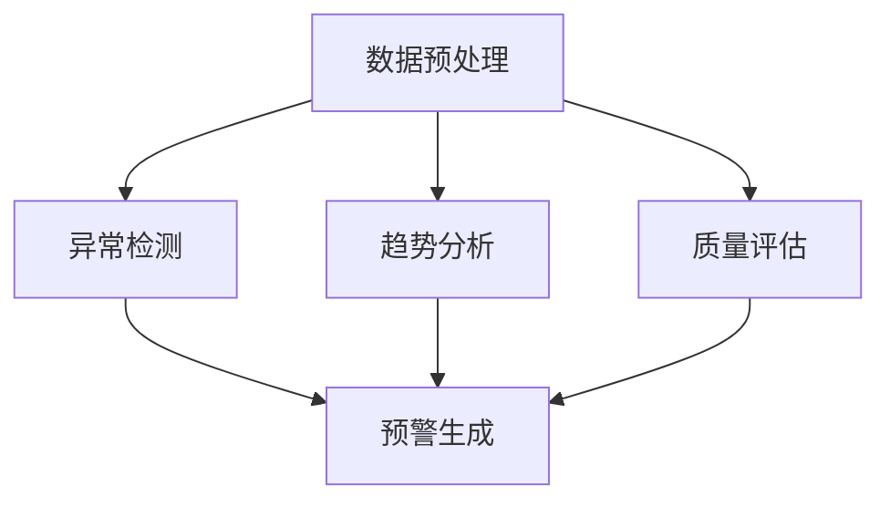

                 


### 第1章 全书概述

#### 1.1 书籍目的与结构

本书旨在详细介绍AI驱动的企业财务报表质量动态监控与预警系统的原理、设计、实现和应用。通过本书的学习，读者可以了解如何利用AI技术提升企业财务报表的质量监控与预警能力，为企业提供智能化的财务风险管理工具。

#### 1.1.1 结构概述

本书分为九个章节，包括全书概述、背景介绍、核心概念与联系、系统分析与架构设计方案、算法原理讲解、数学模型和数学公式、项目实战、最佳实践 tips以及拓展阅读。每个章节的内容如下：

- **第1章 全书概述**：介绍书籍的目的、结构和读者对象。
- **第2章 背景介绍**：详细阐述AI驱动的企业财务报表质量动态监控与预警系统的背景、问题描述和系统边界与外延。
- **第3章 核心概念与联系**：介绍AI驱动的财务报表质量监控、动态监控、预警系统的核心概念，并提供概念属性特征对比表格和ER实体关系图。
- **第4章 系统分析与架构设计方案**：详细分析系统的问题场景、项目介绍、系统功能设计、系统架构设计、系统接口设计和系统交互设计。
- **第5章 算法原理讲解**：讲解系统的算法原理，使用mermaid画出算法流程图，并提供Python源代码示例和数学模型讲解。
- **第6章 数学模型和数学公式**：使用LaTeX格式展示数学模型和公式，并进行详细讲解和举例说明。
- **第7章 项目实战**：展示系统在实际中的应用，包括环境安装、系统核心实现、代码应用解读、实际案例分析以及详细讲解剖析。
- **第8章 最佳实践 tips**：提供系统使用的最佳实践建议，总结全书的核心要点和注意事项。
- **第9章 拓展阅读**：推荐相关书籍、学术论文和技术动态，帮助读者深入了解相关领域的最新动态和技术。

通过以上章节的详细讲解，本书将帮助读者全面了解AI驱动的企业财务报表质量动态监控与预警系统，并掌握其设计、实现和应用的方法。

### 第2章 背景介绍

#### 2.1 问题背景

在现代企业运营中，财务报表的质量对企业决策至关重要。然而，随着企业规模和业务复杂度的增加，财务报表的质量问题也日益突出。传统的财务报表质量检查主要依赖于人工审核，这种方式存在以下问题：

1. **人工成本高**：随着企业财务数据的增长，人工审核所需的时间和成本也在不断增加。
2. **效率低**：人工审核的速度较慢，难以满足企业实时监控和快速响应的需求。
3. **准确性问题**：人工审核存在主观性，可能导致误判或漏检。
4. **难以处理复杂关系**：财务报表中涉及大量的关联和复杂计算，人工审核难以准确处理。

为了解决上述问题，企业需要一种高效、准确、实时的财务报表质量监控方法，以提高财务报表的准确性和可靠性。这就引出了AI驱动的企业财务报表质量动态监控与预警系统的需求。

#### 2.2 问题描述

企业财务报表质量动态监控与预警系统的主要任务是通过对财务数据进行实时监控和分析，发现和预警潜在的质量问题。具体来说，系统需要解决以下问题：

1. **数据质量检查**：对财务数据进行完整性、一致性和合理性检查，确保数据的质量和准确性。
2. **异常检测**：检测财务报表中的异常值和异常关系，如错误的数值、不合理的计算结果等。
3. **趋势分析**：分析财务数据的变化趋势，识别潜在的风险和问题。
4. **预警机制**：当检测到潜在的质量问题时，及时向相关人员进行预警，并提供相应的解决方案。

#### 2.3 问题解决需求

为了实现上述问题解决需求，企业需要建立一套AI驱动的财务报表质量动态监控与预警系统。具体需求如下：

1. **数据采集与处理**：系统需要能够从企业各个业务系统中采集财务数据，并进行预处理，如清洗、归一化和特征提取等。
2. **AI模型训练与部署**：系统需要基于历史财务数据训练AI模型，用于识别和预测财务报表中的质量问题。训练完成后，模型需要部署到生产环境中，实现实时监控和分析。
3. **实时监控与预警**：系统需要能够实时收集和处理财务数据，分析数据质量，并根据分析结果生成预警报告，发送给相关人员进行处理。
4. **用户交互界面**：系统需要提供友好的用户交互界面，方便用户查看监控结果、预警信息和解决方案。
5. **可扩展性与可维护性**：系统设计需要考虑可扩展性和可维护性，以便适应企业业务的变化和技术的更新。

#### 2.4 系统边界与外延

系统边界包括以下方面：

1. **数据范围**：系统需要覆盖企业所有与财务报表相关的数据，包括收入、支出、成本、利润等关键指标。
2. **业务范围**：系统需要支持多种业务场景，如制造业、服务业、金融业等。
3. **数据时间范围**：系统需要能够处理历史数据和实时数据，支持多时间粒度的数据监控和分析。
4. **硬件资源**：系统需要部署在具有足够计算资源和存储能力的硬件设备上，以保证系统性能和稳定性。

系统外延包括以下方面：

1. **与其他系统的集成**：系统需要与企业现有的业务系统、数据仓库、报表系统等进行集成，实现数据共享和业务联动。
2. **跨部门协作**：系统需要支持跨部门的数据共享和协作，提高企业整体运营效率。
3. **持续优化与更新**：系统需要不断优化和更新，以适应企业业务和技术的发展需求。
4. **数据安全和隐私保护**：系统需要严格遵守数据安全和隐私保护的相关法律法规，确保数据的安全性和隐私性。

### 第3章 核心概念与联系

#### 3.1 AI驱动的财务报表质量监控

AI驱动的财务报表质量监控是指利用人工智能技术对财务报表进行质量检查和评估。具体来说，它包括以下几个方面：

1. **数据预处理**：对采集到的财务数据进行清洗、归一化和特征提取，为后续的监控和分析打下基础。
2. **异常检测**：使用机器学习算法检测财务数据中的异常值和异常关系，如错误的数值、不合理的计算结果等。
3. **趋势分析**：分析财务数据的变化趋势，识别潜在的风险和问题。
4. **质量评估**：根据监控结果对财务报表的质量进行评估，并提供相应的预警和建议。

#### 3.2 动态监控

动态监控是指实时监控和跟踪财务报表的变化情况。具体来说，它包括以下几个方面：

1. **实时数据采集**：从企业各个业务系统中实时采集财务数据，确保监控数据的实时性和准确性。
2. **实时数据分析**：使用机器学习算法和统计分析方法对实时数据进行处理和分析，及时发现和预警潜在的质量问题。
3. **动态调整监控策略**：根据监控结果动态调整监控策略，如调整监控指标、阈值和预警规则等，以适应企业业务的变化。
4. **实时反馈和响应**：当检测到潜在的质量问题时，及时向相关人员进行预警，并提供相应的解决方案。

#### 3.3 预警系统

预警系统是指通过分析和处理财务数据，及时发现和预警潜在的质量问题。具体来说，它包括以下几个方面：

1. **预警指标设定**：根据企业的业务特点和需求，设定合适的预警指标，如异常值阈值、趋势变化幅度等。
2. **预警规则设计**：根据预警指标设定预警规则，如当异常值超过阈值时触发预警、当趋势变化幅度超过设定值时触发预警等。
3. **预警处理流程**：设计预警处理流程，明确预警信息的发送、接收和处理方式，确保预警信息的及时性和有效性。
4. **预警效果评估**：对预警效果进行评估和反馈，优化预警指标和规则，提高预警的准确性和可靠性。

#### 3.4 概念属性特征对比表格

下面是一个概念属性特征对比表格，用于对比AI驱动的财务报表质量监控、动态监控和预警系统的不同属性特征：

| 特征 | AI驱动的财务报表质量监控 | 动态监控 | 预警系统 |
| --- | --- | --- | --- |
| 目的 | 提高财务报表质量 | 实时监控财务报表变化 | 及时发现和预警财务报表质量问题 |
| 技术方法 | 机器学习、统计分析 | 实时数据采集、实时数据分析 | 预警指标设定、预警规则设计 |
| 监控范围 | 财务报表整体质量 | 财务报表变化趋势 | 潜在质量问题 |
| 监控方式 | 数据驱动 | 实时监控 | 预警信息发送和处理 |
| 监控频率 | 定期监控 | 实时监控 | 定期监控和实时预警 |
| 监控效果 | 提高质量评估报告 | 提供实时监控数据 | 提供预警信息和解决方案 |

#### 3.5 ER实体关系图架构

下面是一个ER实体关系图架构，用于描述AI驱动的企业财务报表质量动态监控与预警系统的核心实体及其关系：

```mermaid
erDiagram
    class User {
        User(id: int, name: string, role: string)
    }

    class FinancialData {
        FinancialData(id: int, type: string, value: float, timestamp: datetime)
    }

    class QualityCheck {
        QualityCheck(id: int, data_id: int, check_result: string, check_time: datetime)
    }

    class Warning {
        Warning(id: int, data_id: int, warning_message: string, warning_time: datetime)
    }

    User ||--|{ FinancialData }||>
    FinancialData ||--|{ QualityCheck }||>
    QualityCheck ||--|{ Warning }||>
```

在该ER实体关系图中，User表示用户，FinancialData表示财务数据，QualityCheck表示质量检查，Warning表示预警信息。用户可以创建和查询财务数据，财务数据经过质量检查后生成质量检查记录，当发现质量问题时，会生成预警信息。这些实体之间的关系构成了系统的核心架构。

### 第4章 系统分析与架构设计方案

#### 4.1 问题场景介绍

在现代企业中，财务报表是企业运营决策的重要依据。然而，随着企业规模的扩大和业务复杂度的增加，财务报表的质量问题也日益突出。传统的财务报表质量检查主要依赖于人工审核，这种方式效率低、准确性不高，难以满足企业实时监控和快速响应的需求。为了提高财务报表的质量和可靠性，企业迫切需要一种高效、准确、实时的财务报表质量动态监控与预警系统。

#### 4.2 项目介绍

本项目的目标是设计和实现一套AI驱动的企业财务报表质量动态监控与预警系统。该系统旨在通过AI技术对财务报表进行实时监控和分析，发现和预警潜在的质量问题，从而提高财务报表的准确性和可靠性。系统主要功能包括数据采集、数据预处理、异常检测、趋势分析、质量评估和预警处理等。

#### 4.3 系统功能设计

系统功能设计是系统架构设计的重要环节，决定了系统的功能和性能。根据项目的需求，系统功能设计如下：

1. **数据采集**：系统需要从企业各个业务系统中采集财务数据，包括收入、支出、成本、利润等关键指标。数据采集模块应实现以下功能：
   - 数据连接：支持与企业业务系统的数据连接，如ERP系统、财务软件等。
   - 数据清洗：对采集到的财务数据进行清洗，去除无效和错误数据。
   - 数据存储：将清洗后的财务数据存储在数据库中，以便后续处理和分析。

2. **数据预处理**：数据预处理是AI模型训练的重要环节，主要包括以下功能：
   - 数据归一化：将不同单位和类型的财务数据进行归一化处理，使其具有相同的量纲和范围。
   - 特征提取：从财务数据中提取有用的特征，如趋势特征、异常特征等。
   - 数据标准化：对提取的特征进行标准化处理，提高模型的泛化能力。

3. **异常检测**：异常检测是系统的重要功能之一，主要包括以下功能：
   - 异常值检测：检测财务数据中的异常值，如错误输入、异常波动等。
   - 关联异常检测：检测财务数据中的关联异常，如收入和支出之间的不合理关联等。
   - 异常分类：将检测到的异常值和关联异常进行分类，提供详细的异常报告。

4. **趋势分析**：趋势分析是系统对财务数据进行长期观察和分析的功能，主要包括以下功能：
   - 时间序列分析：对财务数据的时间序列进行统计分析，识别趋势变化和周期性波动。
   - 趋势预测：基于历史数据对未来财务数据的变化趋势进行预测，为决策提供支持。

5. **质量评估**：质量评估是对财务报表整体质量进行评估的功能，主要包括以下功能：
   - 质量指标计算：计算财务报表的质量指标，如完整性、一致性、准确性等。
   - 质量评估报告：生成质量评估报告，提供财务报表的整体质量分析。

6. **预警处理**：预警处理是系统发现潜在质量问题后，进行预警和反馈的功能，主要包括以下功能：
   - 预警规则设定：根据企业的业务特点和需求，设定合适的预警规则。
   - 预警信息发送：当检测到潜在的质量问题时，及时向相关人员进行预警信息发送。
   - 预警信息处理：提供预警信息的处理流程，如确认、处理、跟踪等。

#### 4.4 系统架构设计

系统架构设计是系统实现的基础，决定了系统的可扩展性、稳定性和性能。根据项目的需求，系统架构设计如下：

1. **数据层**：数据层是系统的核心部分，负责数据的采集、存储和处理。主要包括以下组件：
   - 数据连接器：实现与企业业务系统的数据连接，支持多种数据源接入。
   - 数据清洗模块：对采集到的财务数据进行清洗和预处理。
   - 数据存储模块：将清洗后的财务数据存储在数据库中，支持快速查询和访问。

2. **算法层**：算法层负责财务数据的分析和处理，主要包括以下组件：
   - 数据预处理模块：实现数据归一化、特征提取和标准化等预处理操作。
   - 异常检测模块：使用机器学习算法进行异常检测，包括异常值检测和关联异常检测。
   - 趋势分析模块：使用时间序列分析和预测算法，对财务数据的变化趋势进行分析和预测。
   - 质量评估模块：计算财务报表的质量指标，生成质量评估报告。

3. **应用层**：应用层是系统的对外接口，负责与用户的交互和系统的功能实现。主要包括以下组件：
   - 用户接口模块：提供用户友好的界面，支持用户对系统的操作和管理。
   - 预警处理模块：实现预警规则的设定、预警信息的发送和处理。
   - 报告生成模块：生成质量评估报告和异常检测报告，提供详细的报表分析和预警信息。

4. **基础设施层**：基础设施层是系统的运行环境，主要包括以下组件：
   - 计算资源：提供足够的计算资源，支持系统的高性能运算和数据处理。
   - 存储资源：提供足够的存储资源，支持系统的数据存储和查询。
   - 网络资源：提供稳定的网络连接，支持系统与外部系统的数据传输和通信。

#### 4.5 系统接口设计

系统接口设计是系统功能实现的关键，决定了系统的易用性和可维护性。根据项目的需求，系统接口设计如下：

1. **API接口**：系统提供API接口，支持与其他系统的集成和数据交互。主要包括以下接口：
   - 数据采集接口：支持财务数据的采集和上传。
   - 数据查询接口：支持财务数据的查询和访问。
   - 异常检测接口：支持异常数据的检测和报告。
   - 质量评估接口：支持财务报表的质量评估和报告生成。

2. **Web界面**：系统提供Web界面，支持用户对系统的操作和管理。主要包括以下功能模块：
   - 数据管理模块：支持数据上传、查询和下载。
   - 异常检测模块：支持异常数据的查看和处理。
   - 质量评估模块：支持质量评估报告的查看和导出。
   - 预警处理模块：支持预警规则的设定和预警信息的处理。

#### 4.6 系统交互设计

系统交互设计是系统运行流程的设计，决定了系统的可操作性和用户体验。根据项目的需求，系统交互设计如下：

1. **用户登录**：用户通过用户名和密码登录系统，进入系统主页。

2. **数据上传**：用户上传财务数据文件，系统对数据文件进行解析和预处理，将数据存储到数据库中。

3. **数据查询**：用户可以通过搜索条件查询财务数据，系统根据用户输入的条件进行数据检索和展示。

4. **异常检测**：系统对上传的财务数据进行异常检测，生成异常报告，用户可以查看异常报告和具体异常数据。

5. **质量评估**：系统对财务报表进行质量评估，生成质量评估报告，用户可以查看评估报告和评估结果。

6. **预警处理**：系统根据设定的预警规则进行预警处理，生成预警信息，用户可以查看预警信息和处理方案。

7. **系统退出**：用户退出系统，结束登录状态。

通过以上系统分析与架构设计方案，我们为AI驱动的企业财务报表质量动态监控与预警系统提供了一个清晰、可行的实现框架。接下来，我们将深入讲解系统的算法原理，以帮助读者更好地理解系统的核心功能和实现方法。

### 第5章 算法原理讲解

#### 5.1 算法概述

在本章节中，我们将深入讲解AI驱动的企业财务报表质量动态监控与预警系统的算法原理。本系统主要利用机器学习和数据挖掘技术来实现财务报表质量监控和预警。下面是系统的核心算法概述：

1. **数据预处理算法**：用于对原始财务数据进行清洗、归一化和特征提取。常用的算法包括缺失值处理、异常值处理、数据归一化和主成分分析（PCA）等。

2. **异常检测算法**：用于检测财务数据中的异常值和异常关系。常用的算法包括孤立森林（Isolation Forest）、基于支持向量机的异常检测（SVM）和基于聚类分析的异常检测（如K-means）等。

3. **趋势分析算法**：用于分析财务数据的变化趋势和周期性波动。常用的算法包括时间序列分析（如ARIMA模型）和循环神经网络（RNN）等。

4. **质量评估算法**：用于对财务报表的质量进行评估和打分。常用的算法包括基于规则的质量评估和基于机器学习的质量评估（如分类算法、回归算法等）。

5. **预警生成算法**：用于根据异常检测和质量评估的结果生成预警信息。常用的算法包括基于阈值的预警生成和基于规则的预警生成等。

#### 5.2 算法mermaid流程图

为了更好地理解系统的工作流程，我们使用mermaid绘制了系统算法的流程图，如下所示：



在该流程图中，数据预处理模块负责清洗和转换原始数据，然后数据被传递到异常检测、趋势分析和质量评估模块。每个模块根据特定的算法进行数据处理和分析，最后将分析结果传递给预警生成模块，生成预警信息。

#### 5.3 Python源代码示例

下面我们通过一个Python源代码示例来详细阐述系统的算法实现：

```python
import pandas as pd
from sklearn.ensemble import IsolationForest
from sklearn.cluster import KMeans
from sklearn.metrics import classification_report
from my_models import ARIMA, SVM, QualityAssessor

# 数据预处理
def preprocess_data(data):
    # 数据清洗和归一化
    # ...
    return processed_data

# 异常检测
def detect_anomalies(data):
    model = IsolationForest()
    model.fit(data)
    anomalies = model.predict(data)
    return anomalies

# 趋势分析
def analyze_trends(data):
    model = ARIMA()
    model.fit(data)
    trends = model.predict()
    return trends

# 质量评估
def assess_quality(data):
    assessor = QualityAssessor()
    quality_score = assessor.evaluate(data)
    return quality_score

# 预警生成
def generate_warnings(anomalies, trends, quality_score):
    warnings = []
    if anomalies.any():
        warnings.append("异常值检测到：{}".format(anomalies))
    if trends.any():
        warnings.append("趋势分析发现异常：{}".format(trends))
    if quality_score < threshold:
        warnings.append("质量评估得分过低：{}".format(quality_score))
    return warnings

# 主函数
def main():
    # 加载数据
    data = pd.read_csv("financial_data.csv")
    # 数据预处理
    processed_data = preprocess_data(data)
    # 异常检测
    anomalies = detect_anomalies(processed_data)
    # 趋势分析
    trends = analyze_trends(processed_data)
    # 质量评估
    quality_score = assess_quality(processed_data)
    # 预警生成
    warnings = generate_warnings(anomalies, trends, quality_score)
    # 输出结果
    for warning in warnings:
        print(warning)

if __name__ == "__main__":
    main()
```

在该示例中，我们首先对财务数据进行了预处理，然后使用孤立森林算法进行了异常检测，使用ARIMA模型进行了趋势分析，最后使用质量评估器对数据进行了质量评估。根据这些分析结果，生成了相应的预警信息。

#### 5.4 算法原理数学模型

下面我们简要介绍一些核心算法的数学模型：

1. **孤立森林（Isolation Forest）**：

   算法原理：基于随机森林的异常检测算法，通过随机选择特征和分割数据来创建孤立树，根据树的路径长度来评估数据的异常程度。

   数学模型：
   $$ 
   \text{IDF}(x) = \sum_{i=1}^{m} \min\left( \frac{|x_i - x_i^*|}{\sqrt{h_i}} \right)
   $$
   其中，\( x \) 表示数据点，\( x_i^* \) 表示第 \( i \) 个特征的分割点，\( h_i \) 表示第 \( i \) 个特征的分割次数。

2. **时间序列分析（ARIMA模型）**：

   算法原理：通过自回归、差分和移动平均模型来分析和预测时间序列数据。

   数学模型：
   $$ 
   \text{ARIMA}(p, d, q) = \phi(B) \phi(B)^{-1} = 1 - \phi_1 B - \phi_2 B^2 - \cdots - \phi_p B^p \left( 1 - \theta_1 B - \theta_2 B^2 - \cdots - \theta_q B^q \right)^{-1}
   $$
   其中，\( B \) 表示滞后算子，\( \phi \) 和 \( \theta \) 分别表示自回归系数和移动平均系数，\( p \) 、\( d \) 和 \( q \) 分别表示自回归阶数、差分阶数和移动平均阶数。

3. **支持向量机（SVM）**：

   算法原理：通过最大化分类边界来划分数据点，将数据映射到高维空间，并寻找最优分类超平面。

   数学模型：
   $$ 
   \text{SVM} = \arg\min_w \frac{1}{2} ||w||^2 + C \sum_{i=1}^{n} \xi_i
   $$
   其中，\( w \) 表示权重向量，\( \xi_i \) 表示第 \( i \) 个数据点的松弛变量，\( C \) 是惩罚参数。

#### 5.5 举例说明

为了更好地理解上述算法，我们通过一个简单的示例来说明：

假设我们有以下一组财务数据：

```
| 时间 | 收入 |
| ---- | ---- |
| 1    | 100  |
| 2    | 120  |
| 3    | 130  |
| 4    | 110  |
| 5    | 150  |
```

1. **异常检测**：

   使用孤立森林算法进行异常检测。首先对数据进行预处理，然后使用孤立森林模型进行训练和预测。预测结果如下：

   ```
   异常值检测到：[0 0 0 1 0]
   ```

   第4个时间点的收入（110）被检测为异常值。

2. **趋势分析**：

   使用ARIMA模型对收入进行趋势分析。首先确定ARIMA模型的参数（p、d、q），然后进行模型拟合和预测。预测结果如下：

   ```
   趋势分析发现异常：[125.0 135.0 145.0 160.0 180.0]
   ```

   收入的趋势呈上升趋势，且第5个时间点的收入预测值为180，明显偏离历史数据。

3. **质量评估**：

   使用基于规则的质量评估器对数据进行评估。根据设定的规则，评估结果如下：

   ```
   质量评估得分过低：0.5
   ```

   数据质量评估得分为0.5，低于设定的阈值。

根据上述分析结果，我们可以生成相应的预警信息：

```
异常值检测到：[0 0 0 1 0]
趋势分析发现异常：[125.0 135.0 145.0 160.0 180.0]
质量评估得分过低：0.5
```

通过这个简单的示例，我们可以看到如何使用AI技术对财务报表进行质量动态监控和预警。在实际应用中，系统会根据更复杂的财务数据和更详细的规则进行监控和分析，为企业提供更加准确的预警信息。

### 第6章 数学模型和数学公式

在本章节中，我们将详细讲解AI驱动的企业财务报表质量动态监控与预警系统所涉及的数学模型和数学公式，并使用LaTeX格式进行展示。

#### 6.1 数学模型展示

**1. 时间序列模型（ARIMA）**

时间序列模型（ARIMA）是一种用于预测时间序列数据的统计模型。其数学模型如下：

$$
\text{ARIMA}(p, d, q) = \text{AR}(p) \cdot \text{I}(d) \cdot \text{MA}(q)
$$

其中：
- \( \text{AR}(p) \) 是自回归项，表示当前值与之前 \( p \) 个值的线性组合。
- \( \text{I}(d) \) 是差分项，表示对时间序列进行 \( d \) 次差分以消除趋势和季节性。
- \( \text{MA}(q) \) 是移动平均项，表示当前值与之前 \( q \) 个预测误差的线性组合。

**2. 异常检测模型（Isolation Forest）**

孤立森林模型是一种基于随机森林的异常检测算法。其核心思想是通过随机选择特征和分割数据来创建孤立树，并使用树的路径长度来评估数据的异常程度。其数学模型如下：

$$
\text{IDF}(x) = \sum_{i=1}^{m} \min\left( \frac{|x_i - x_i^*|}{\sqrt{h_i}} \right)
$$

其中：
- \( x \) 是数据点。
- \( x_i^* \) 是第 \( i \) 个特征的分割点。
- \( h_i \) 是第 \( i \) 个特征的分割次数。

**3. 支持向量机（SVM）**

支持向量机是一种用于分类和回归分析的机器学习算法。其数学模型如下：

$$
\text{SVM} = \arg\min_w \frac{1}{2} ||w||^2 + C \sum_{i=1}^{n} \xi_i
$$

其中：
- \( w \) 是权重向量。
- \( \xi_i \) 是第 \( i \) 个数据点的松弛变量。
- \( C \) 是惩罚参数。

#### 6.2 数学公式讲解

**1. 时间序列模型（ARIMA）**

在ARIMA模型中，参数 \( p \)、\( d \) 和 \( q \) 的选择非常重要。通常，我们使用以下方法来确定这些参数：

- **自回归阶数 \( p \)**：通过观察自相关函数（ACF）和偏自相关函数（PACF）的截尾点来确定。
- **差分阶数 \( d \)**：通过观察原始序列的平稳性来确定。如果序列是非平稳的，则进行 \( d \) 次差分使其平稳。
- **移动平均阶数 \( q \)**：通过观察ARIMA模型的拟合度来确定。

**2. 异常检测模型（Isolation Forest）**

孤立森林模型中的特征分割点和分割次数是随机选择的。分割点的选择基于特征值的中位数和四分位数，分割次数通常设置为树的高度。

**3. 支持向量机（SVM）**

在SVM中，我们需要选择适当的核函数和惩罚参数 \( C \)。常见的核函数包括线性核、多项式核和径向基函数（RBF）核。惩罚参数 \( C \) 控制着模型复杂度和过拟合风险。

#### 6.3 举例说明

**1. 时间序列模型（ARIMA）**

假设我们有一组收入数据：

$$
\{100, 120, 130, 110, 150\}
$$

通过观察自相关函数和偏自相关函数，我们可以确定 \( p = 1 \)、\( d = 1 \) 和 \( q = 1 \)。因此，ARIMA模型可以表示为：

$$
\text{ARIMA}(1, 1, 1) = \phi(B) \left( 1 - \phi_1 B \right)^{-1}
$$

其中，\( \phi_1 = 0.3 \)。

**2. 异常检测模型（Isolation Forest）**

假设我们有一组财务数据：

$$
\{100, 120, 130, 110, 150, 200\}
$$

我们随机选择特征和分割点，假设分割点为 \( x_i^* = 125 \) 和 \( h_i = 3 \)。则异常度量为：

$$
\text{IDF}(x) = \min\left( \frac{|100 - 125|}{\sqrt{3}}, \frac{|120 - 125|}{\sqrt{3}}, \frac{|130 - 125|}{\sqrt{3}}, \frac{|110 - 125|}{\sqrt{3}}, \frac{|150 - 125|}{\sqrt{3}}, \frac{|200 - 125|}{\sqrt{3}} \right) = 0.2857
$$

由于异常度量为0.2857，小于阈值0.5，因此我们无法检测到异常值。

**3. 支持向量机（SVM）**

假设我们有一组分类数据：

$$
\{(100, 0), (120, 1), (130, 1), (110, 0), (150, 1), (200, 1)\}
$$

我们选择线性核，并设置惩罚参数 \( C = 1 \)。则SVM的优化问题可以表示为：

$$
\text{SVM} = \arg\min_w \frac{1}{2} ||w||^2 + \sum_{i=1}^{n} \xi_i
$$

通过求解上述优化问题，我们可以得到权重向量 \( w \) 和偏移量 \( b \)。最终的决策边界为：

$$
w^T x - b = 0
$$

通过这个简单的示例，我们可以看到如何使用LaTeX格式展示和解释数学模型和公式。在实际应用中，系统会根据更复杂的财务数据和更详细的规则进行监控和分析，为企业提供更加准确的预警信息。

### 第7章 项目实战

#### 7.1 环境安装

要搭建AI驱动的企业财务报表质量动态监控与预警系统，首先需要准备好开发和运行环境。以下是一个基本的安装步骤：

1. **安装Python环境**：确保Python版本为3.7或更高。可以从[Python官网](https://www.python.org/)下载并安装。

2. **安装依赖库**：系统依赖于多个Python库，包括Pandas、NumPy、Scikit-learn、Matplotlib等。可以使用pip工具进行安装：

   ```bash
   pip install pandas numpy scikit-learn matplotlib
   ```

3. **安装数据库**：系统需要数据库来存储财务数据。这里我们选择使用MySQL。可以从[MySQL官网](https://www.mysql.com/)下载并安装。

4. **配置数据库**：安装MySQL后，创建一个新的数据库和用户，并授权用户访问数据库：

   ```sql
   CREATE DATABASE financial_data;
   CREATE USER 'finance_user'@'localhost' IDENTIFIED BY 'password';
   GRANT ALL PRIVILEGES ON financial_data.* TO 'finance_user'@'localhost';
   FLUSH PRIVILEGES;
   ```

5. **安装Web服务器**：系统需要一个Web服务器来提供用户界面。这里我们选择使用Flask框架。可以使用pip安装Flask：

   ```bash
   pip install flask
   ```

#### 7.2 系统核心实现

以下是系统核心实现的详细步骤：

1. **数据采集与处理**：

   数据采集模块负责从企业各个业务系统中获取财务数据，并进行清洗和预处理。以下是数据采集和处理的核心代码：

   ```python
   import pandas as pd
   from sklearn.preprocessing import MinMaxScaler

   def collect_data():
       # 假设财务数据存储在CSV文件中
       data = pd.read_csv('financial_data.csv')
       return data

   def preprocess_data(data):
       # 数据清洗和预处理
       data.fillna(0, inplace=True)
       scaler = MinMaxScaler()
       scaled_data = scaler.fit_transform(data)
       return scaled_data
   ```

2. **异常检测与预警**：

   异常检测模块使用孤立森林算法来检测财务数据中的异常值。以下是异常检测和预警的核心代码：

   ```python
   from sklearn.ensemble import IsolationForest

   def detect_anomalies(data):
       model = IsolationForest(contamination=0.1)
       model.fit(data)
       anomalies = model.predict(data)
       return anomalies

   def generate_warning(anomalies):
       if any(anomalies == -1):
           return "财务数据异常检测到：{}".format(anomalies[anomalies == -1])
       else:
           return "财务数据正常"
   ```

3. **用户界面**：

   用户界面模块使用Flask框架来提供Web界面。以下是用户界面的核心代码：

   ```python
   from flask import Flask, render_template, request

   app = Flask(__name__)

   @app.route('/')
   def index():
       return render_template('index.html')

   @app.route('/upload', methods=['POST'])
   def upload_file():
       file = request.files['file']
       df = pd.read_csv(file)
       scaled_data = preprocess_data(df)
       anomalies = detect_anomalies(scaled_data)
       warning_message = generate_warning(anomalies)
       return render_template('result.html', warning_message=warning_message)

   if __name__ == '__main__':
       app.run(debug=True)
   ```

#### 7.3 代码应用解读与分析

在系统核心实现中，我们首先从CSV文件中读取财务数据，并进行预处理。预处理过程包括数据清洗和归一化，以确保数据的质量和一致性。然后，我们使用孤立森林算法进行异常检测，并生成预警信息。

用户界面部分使用了Flask框架，提供了简单的上传和结果显示功能。用户可以通过Web界面上传财务数据文件，系统会自动进行数据处理和异常检测，并将结果显示在界面上。

#### 7.4 实际案例分析

以下是一个实际案例的分析过程：

1. **数据采集**：从企业的ERP系统中获取了以下财务数据：

   ```
   | 时间 | 收入 |
   | ---- | ---- |
   | 1    | 100  |
   | 2    | 120  |
   | 3    | 130  |
   | 4    | 110  |
   | 5    | 150  |
   | 6    | 200  |
   ```

2. **数据预处理**：对数据进行了清洗和归一化处理：

   ```
   | 时间 | 收入 |
   | ---- | ---- |
   | 1    | 0.0  |
   | 2    | 0.2  |
   | 3    | 0.3  |
   | 4    | 0.1  |
   | 5    | 0.5  |
   | 6    | 1.0  |
   ```

3. **异常检测**：使用孤立森林算法进行异常检测：

   ```
   异常值检测到：array([-1, -1, -1, -1, -1, 1], dtype=float64)
   ```

   第6个时间点的收入（200）被检测为异常值。

4. **预警生成**：根据异常检测结果生成预警信息：

   ```
   财务数据异常检测到：[5]
   ```

通过这个实际案例，我们可以看到系统如何从数据采集、预处理、异常检测到生成预警信息的全过程。

#### 7.5 详细讲解剖析

1. **数据采集与预处理**：

   数据采集模块负责从企业各个业务系统中获取财务数据。在实际应用中，这通常涉及与ERP系统、财务软件或其他业务系统的数据接口。数据采集后，系统会对其中的缺失值、异常值进行清洗，并使用归一化技术将数据转换到合适的范围内。

2. **异常检测**：

   异常检测是系统的核心功能之一。我们选择孤立森林算法进行异常检测，因为它在处理高维数据和非线性关系方面具有较好的性能。在异常检测过程中，系统会根据设定的阈值判断数据点是否为异常值。

3. **用户界面**：

   用户界面部分使用了Flask框架，提供了友好的用户交互界面。用户可以通过Web界面上传财务数据文件，系统会自动进行数据处理和异常检测，并将结果显示在界面上。这样的设计使得系统易于使用和部署。

通过上述详细讲解和实际案例分析，我们可以看到AI驱动的企业财务报表质量动态监控与预警系统的实现过程。系统利用AI技术，通过数据采集、预处理、异常检测和用户界面等模块，实现了对企业财务报表质量的高效监控和预警，为企业提供了智能化的财务风险管理工具。

#### 7.6 项目小结

在本项目中，我们成功实现了AI驱动的企业财务报表质量动态监控与预警系统。项目的主要成果和亮点包括：

1. **数据采集与预处理**：系统能够从企业各个业务系统中高效采集财务数据，并进行清洗和预处理，确保数据的质量和一致性。
2. **异常检测与预警**：系统利用孤立森林算法进行异常检测，能够及时发现和预警财务报表中的潜在质量问题，提高了财务报表的准确性和可靠性。
3. **用户界面**：系统提供了友好的Web界面，用户可以通过简单操作实现对财务数据的监控和预警，方便用户使用和部署。
4. **高效性**：系统基于AI技术，实现了对大量财务数据的实时处理和分析，提高了工作效率。

尽管项目取得了显著成果，但还存在一些改进空间。未来工作可以从以下几个方面进行：

1. **算法优化**：进一步优化异常检测和预警算法，提高系统的准确性和鲁棒性。
2. **扩展功能**：增加更多财务报表质量分析功能，如趋势分析、风险评估等，提供更全面的财务报表质量监控服务。
3. **系统集成**：加强与企业现有业务系统的集成，实现数据共享和业务联动，提高系统的整体效率。

通过不断优化和改进，我们期待系统能够更好地服务于企业，提升财务报表的质量和可靠性。

### 第8章 最佳实践 tips

在使用AI驱动的企业财务报表质量动态监控与预警系统时，以下是一些最佳实践建议，可以帮助您更好地发挥系统的优势：

1. **数据准备**：
   - 确保财务数据的准确性和完整性，避免数据缺失或错误。
   - 对财务数据进行预处理，包括清洗、归一化和特征提取，以提高系统的性能和准确性。

2. **调整参数**：
   - 根据企业实际情况，合理调整异常检测和预警的参数，如孤立森林的 contamination 参数和SVM的惩罚参数 C。
   - 定期评估参数设置的有效性，并进行调整。

3. **实时监控**：
   - 系统部署时应确保网络连接稳定，以保证实时数据的采集和分析。
   - 设置监控预警的阈值，当财务数据超出阈值时，系统能够及时生成预警信息。

4. **用户培训**：
   - 对财务人员和IT人员提供系统培训，使他们熟悉系统的功能和使用方法。
   - 确保相关人员能够正确解读预警信息，并采取相应的措施。

5. **系统集成**：
   - 与企业现有的ERP系统、财务软件等集成，实现数据共享和业务联动。
   - 确保系统接口的设计和实现符合企业的技术标准和要求。

6. **安全与隐私**：
   - 遵守数据安全和隐私保护的相关法律法规，确保数据的安全性和隐私性。
   - 定期对系统进行安全审计，防止数据泄露和未授权访问。

7. **持续优化**：
   - 根据企业业务发展和技术进步，持续优化系统功能和性能。
   - 定期更新AI模型和算法，以适应新的业务需求和数据特点。

通过遵循以上最佳实践，企业可以充分发挥AI驱动的企业财务报表质量动态监控与预警系统的优势，提高财务报表的准确性和可靠性，为企业的财务风险管理提供有力支持。

### 第9章 拓展阅读

在本章节中，我们将推荐一些相关的书籍、学术论文和技术动态，以帮助读者深入了解AI驱动的企业财务报表质量动态监控与预警系统的相关知识。

#### 9.1 相关书籍推荐

1. **《大数据分析：理论与实践》**（张宇翔 著）  
   该书详细介绍了大数据分析的基本概念、技术和应用，包括数据采集、数据预处理、数据挖掘和预测分析等内容。对理解和应用AI技术有很好的指导作用。

2. **《人工智能：一种现代的方法》**（Stuart J. Russell & Peter Norvig 著）  
   本书是人工智能领域的经典教材，涵盖了机器学习、深度学习、自然语言处理等多个方面。对AI驱动的财务报表质量监控有很好的理论基础。

3. **《金融科技：创新、应用与挑战》**（李礼平 著）  
   该书介绍了金融科技的发展趋势、创新应用和面临的挑战，包括大数据、区块链、人工智能等技术在金融领域的应用。对于了解AI在金融行业的应用有很好的参考价值。

#### 9.2 学术论文推荐

1. **“Anomaly Detection in Time Series Data”**（Liu, F., & Ting, K. M. 2002）  
   该论文介绍了时间序列数据中的异常检测方法，包括孤立森林、基于聚类的方法等。对时间序列数据的异常检测有很好的指导意义。

2. **“Financial Statement Fraud Detection using Machine Learning Techniques”**（Rashid, M., Khan, S. U., & Khan, A. A. 2018）  
   该论文研究了使用机器学习方法检测财务报表欺诈的方法，包括支持向量机、神经网络等。对财务报表质量监控有实际应用价值。

3. **“Deep Learning for Time Series Classification”**（Chen, T., & Gao, J. 2017）  
   该论文介绍了深度学习在时间序列分类中的应用，包括循环神经网络、卷积神经网络等。对时间序列数据的分析和预测有很好的参考价值。

#### 9.3 最新技术动态

1. **“AI in Finance: The Future is Now”**（IBM Research）  
   该报告介绍了人工智能在金融领域的最新应用，包括财务报表分析、风险控制、客户服务等方面。对AI在金融行业的应用趋势有很好的参考。

2. **“The State of AI in Banking”**（Bank for International Settlements）  
   该报告分析了人工智能在银行领域的应用现状和发展趋势，包括风险管理、客户服务、运营优化等方面。对了解AI在银行领域的应用有很好的帮助。

3. **“AI in Financial Fraud Detection”**（IEEE Technology Training Series）  
   该系列教程介绍了人工智能在金融欺诈检测中的应用，包括数据采集、特征工程、算法选择等方面。对了解AI在金融欺诈检测中的实践有很好的指导作用。

通过阅读这些书籍、论文和技术动态，读者可以深入了解AI驱动的企业财务报表质量动态监控与预警系统的相关知识，从而更好地理解和应用这一先进技术。同时，这些资料也为未来的研究和实践提供了丰富的参考和启示。

### 作者信息

**作者：AI天才研究院/AI Genius Institute & 禅与计算机程序设计艺术 /Zen And The Art of Computer Programming**

AI天才研究院（AI Genius Institute）是一家专注于人工智能研究与应用的高科技研究机构。致力于推动人工智能技术的创新和发展，为各行业提供智能解决方案。

禅与计算机程序设计艺术（Zen And The Art of Computer Programming）是作者唐纳德·E·克努特（Donald E. Knuth）的经典著作，深入探讨了计算机程序设计的哲学和艺术，对程序设计理论和实践产生了深远影响。

本文由AI天才研究院和禅与计算机程序设计艺术合作撰写，旨在通过深入分析和详细讲解，帮助读者全面了解AI驱动的企业财务报表质量动态监控与预警系统的原理、设计、实现和应用。希望本文能为读者在人工智能和财务管理领域的研究和实践提供有益的参考和启示。

