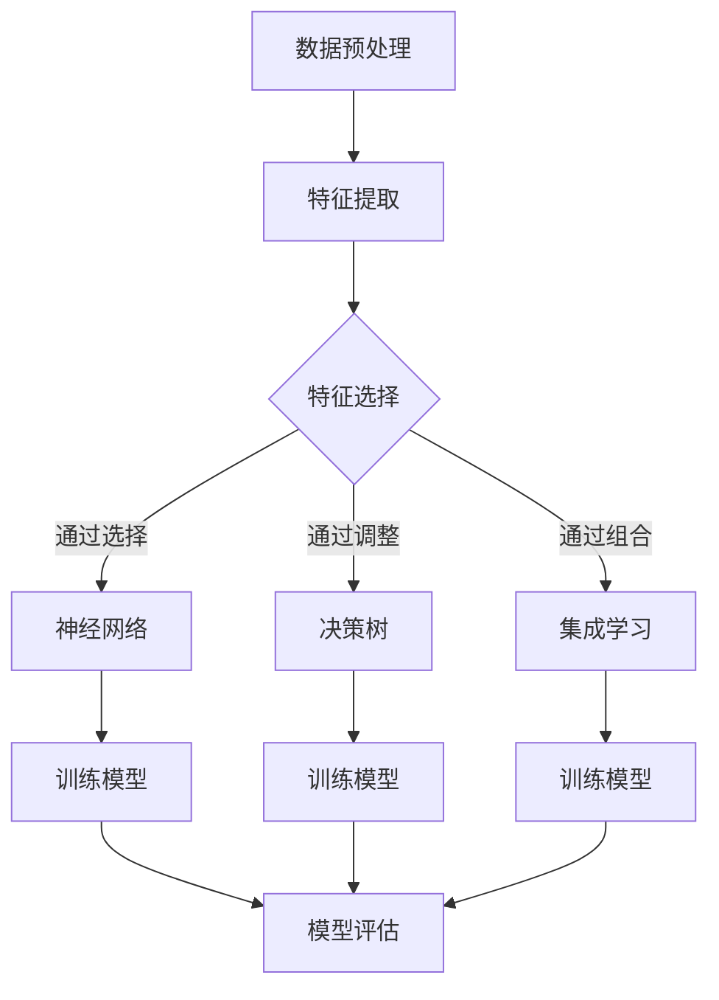
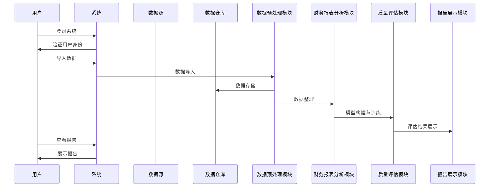
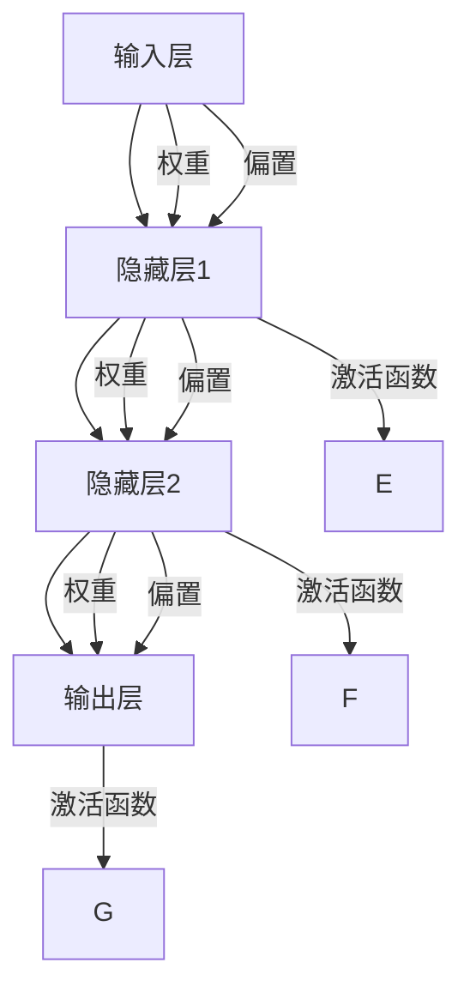
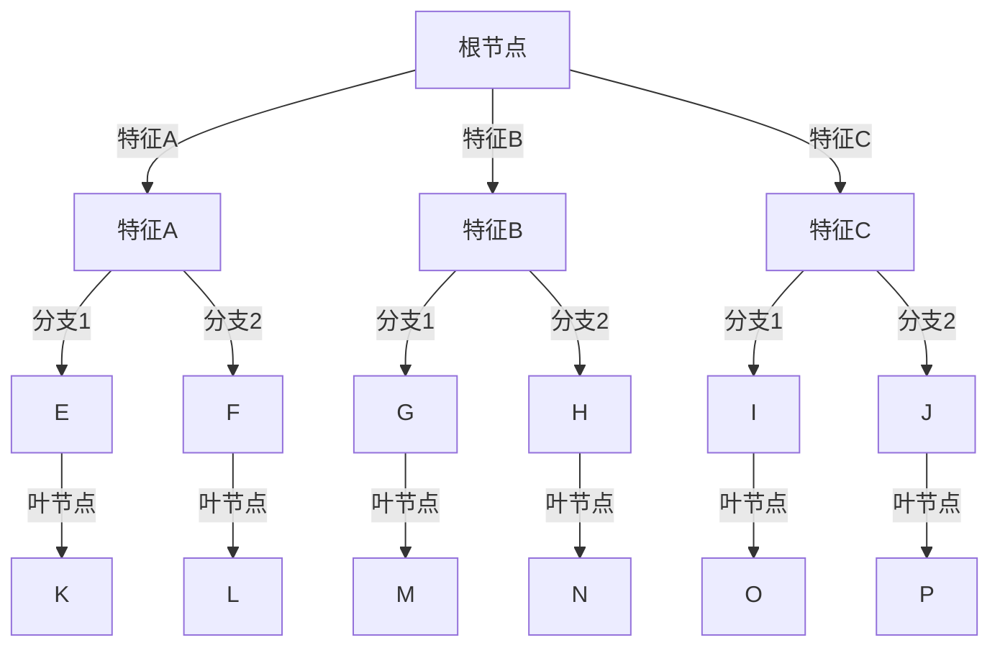
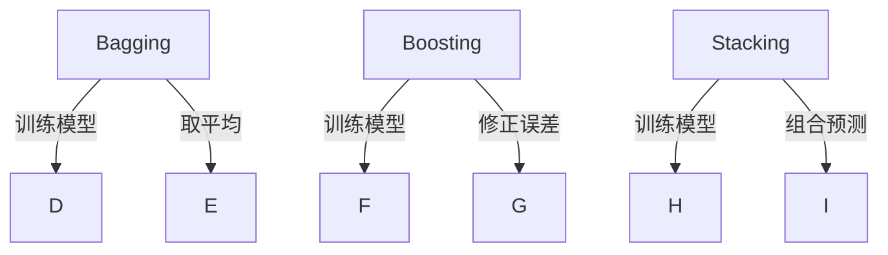

                 

## 《AI驱动的企业财务报表质量评估系统》

> 关键词：人工智能、财务报表、质量评估、算法、系统设计

> 摘要：随着人工智能技术的不断发展，其在财务领域的应用越来越广泛。本文将探讨如何利用AI技术构建一个企业财务报表质量评估系统，从系统设计、算法应用到项目实战，全面解析这一领域的创新与实践。

## 目录大纲

----------------------------------------------------------------

### 第一部分：AI与财务报表概述

#### 第1章：AI在财务领域的应用

#### 第2章：AI驱动财务报表质量评估技术

----------------------------------------------------------------

### 第二部分：AI驱动的财务报表质量评估系统设计

#### 第3章：系统架构与设计方案

#### 第4章：系统实现与算法应用

----------------------------------------------------------------

### 第三部分：项目实战

#### 第5章：项目介绍与实现

#### 第6章：案例分析与实战

----------------------------------------------------------------

### 第四部分：总结与展望

#### 第7章：项目总结与经验教训

#### 第8章：AI驱动的财务报表质量评估发展趋势

----------------------------------------------------------------

## 第一部分：AI与财务报表概述

### 第1章：AI在财务领域的应用

#### 1.1 AI在财务报表中的应用概述

人工智能（AI）作为一项前沿技术，其在多个领域的应用已取得了显著成效。在财务领域，AI的应用更是带来了深刻的变革。财务报表是企业管理中至关重要的文档，其质量直接影响到企业的运营决策和投资判断。AI在财务报表中的应用主要体现在以下几个方面：

1. **自动化处理**：利用AI技术，可以自动化地处理大量的财务数据，包括数据收集、整理、分析等，提高工作效率。
2. **异常检测**：通过机器学习算法，AI能够自动检测财务报表中的异常数据，识别潜在的欺诈行为。
3. **预测分析**：基于历史数据，AI可以预测未来的财务状况，为企业的战略决策提供数据支持。
4. **报表分析**：AI能够深入分析财务报表，提供详细的财务健康报告，帮助企业优化财务策略。

#### 1.2 财务报表质量的定义与重要性

财务报表质量是指财务报表所反映的财务信息的真实、准确、完整和及时程度。一个高质量的财务报表不仅需要遵循相关的会计准则和法规，还需要具备以下特点：

1. **真实性**：财务报表应当真实反映企业的财务状况和经营成果。
2. **准确性**：财务报表中的数据应当准确无误，避免误导投资者和其他利益相关者。
3. **完整性**：财务报表应当包含所有必要的财务信息，确保信息的全面性。
4. **及时性**：财务报表应当能够在规定的时间内提供，以便及时做出决策。

财务报表质量的重要性不言而喻。高质量的财务报表能够增强投资者的信心，降低投资风险，同时也有助于企业内部的管理和决策。因此，如何提高财务报表的质量成为财务领域一个重要的研究课题。

### 第2章：AI驱动财务报表质量评估技术

#### 2.1 常见的AI算法在财务报表质量评估中的应用

AI在财务报表质量评估中扮演着关键角色。以下是一些常见的AI算法及其在财务报表质量评估中的应用：

1. **神经网络**：神经网络是一种模仿人脑工作的算法，通过多层神经网络结构对财务数据进行处理，可以识别出潜在的异常情况。
2. **决策树**：决策树是一种树形结构，通过一系列的规则对财务数据进行分类，可以用于检测财务报表中的异常值。
3. **集成学习方法**：集成学习方法通过组合多个基础模型，可以提高模型的预测准确性和鲁棒性，适用于复杂的财务报表质量评估。

#### 2.2 特征工程与选择

特征工程是AI模型成功的关键。在财务报表质量评估中，特征工程涉及到以下步骤：

1. **特征提取**：从原始数据中提取出有用的特征，如财务指标、行业特征等。
2. **特征选择**：通过算法选择对评估结果有重要影响的特征，剔除冗余或无关的特征，以提高模型的性能。

#### 2.3 模型评估与优化

模型的评估与优化是确保财务报表质量评估系统有效性的关键。常见的模型评估指标包括准确率、召回率、F1分数等。优化策略包括模型调参、正则化、交叉验证等，旨在提高模型的准确性和稳定性。

## 第二部分：AI驱动的财务报表质量评估系统设计

### 第3章：系统架构与设计方案

#### 3.1 系统总体架构设计

AI驱动的财务报表质量评估系统通常包括以下几个主要模块：

1. **数据收集与处理模块**：负责收集财务数据，并进行数据清洗、转换和整合。
2. **财务报表分析模块**：对财务数据进行深入分析，提取关键信息。
3. **质量评估与决策模块**：利用AI算法对财务报表的质量进行评估，并生成决策支持。

#### 3.2 系统功能设计

系统的功能设计需要满足以下要求：

1. **数据导入与预处理**：能够导入多种格式的财务数据，并进行预处理，如数据格式转换、缺失值处理等。
2. **财务报表质量评估**：根据预设的评估标准，对财务报表进行质量评估，并生成评估报告。
3. **报警与反馈**：当检测到财务报表质量问题时，系统应能够自动报警，并提供反馈机制，帮助用户进行问题排查和修复。

#### 3.3 系统接口设计

系统的接口设计应考虑以下方面：

1. **数据接口**：设计统一的数据接口，方便不同系统之间的数据交互。
2. **控制接口**：提供用户友好的控制界面，方便用户进行系统操作和监控。

### 第4章：系统实现与算法应用

#### 4.1 系统实现流程

系统实现通常包括以下步骤：

1. **数据预处理**：使用Python等编程语言对财务数据进行预处理，如数据清洗、归一化等。
2. **特征提取与选择**：根据业务需求，提取有用的特征，并进行特征选择。
3. **模型训练与评估**：选择合适的AI算法，对模型进行训练和评估，调整模型参数，以提高评估准确性。

#### 4.2 AI算法在系统中的应用

在系统实现中，常用的AI算法包括：

1. **神经网络模型**：如深度学习模型，适用于复杂的数据分析和预测任务。
2. **决策树模型**：适用于分类和回归任务，可以生成易于理解的决策规则。
3. **集成学习模型**：如随机森林、梯度提升树等，通过组合多个基础模型，提高模型的性能和鲁棒性。

#### 4.3 算法原理与实现

算法原理和实现是系统设计的核心。以下是一个简单的神经网络模型实现：

```python
import tensorflow as tf

# 定义神经网络模型
model = tf.keras.Sequential([
    tf.keras.layers.Dense(128, activation='relu', input_shape=(num_features,)),
    tf.keras.layers.Dropout(0.2),
    tf.keras.layers.Dense(1, activation='sigmoid')
])

# 编译模型
model.compile(optimizer='adam', loss='binary_crossentropy', metrics=['accuracy'])

# 训练模型
model.fit(x_train, y_train, epochs=10, batch_size=32, validation_data=(x_val, y_val))
```

该代码定义了一个简单的二分类神经网络模型，通过训练可以实现对财务报表质量的评估。

## 第三部分：项目实战

### 第5章：项目介绍与实现

#### 5.1 项目背景与目标

本项目的目标是开发一个基于AI的企业财务报表质量评估系统。项目背景如下：

- **企业需求**：企业希望提高财务报表的质量，降低财务风险，同时提高财务数据的利用效率。
- **技术需求**：系统需要具备自动化处理财务数据、实时评估报表质量、生成评估报告等功能。

#### 5.2 环境安装与配置

系统环境要求如下：

- **操作系统**：Windows/Linux/MacOS
- **编程语言**：Python
- **库和框架**：TensorFlow、Scikit-learn、Pandas等

安装步骤：

1. 安装Python环境
2. 安装相关库和框架
3. 配置环境变量

#### 5.3 系统核心实现

系统核心实现包括以下步骤：

1. **数据预处理**：使用Pandas库对财务数据进行分析，处理缺失值、异常值等。
2. **特征提取与选择**：根据业务需求提取关键特征，并使用Scikit-learn进行特征选择。
3. **模型训练与评估**：使用TensorFlow构建神经网络模型，并进行训练和评估。

#### 5.4 项目应用解读与分析

项目应用解读和分析包括：

1. **应用场景**：系统可以应用于企业的日常财务报表质量评估，帮助企业管理层及时了解财务状况。
2. **评估结果分析**：通过对评估结果的统计分析，可以发现财务报表中的潜在问题，为企业提供决策支持。
3. **项目优缺点**：优点包括提高报表质量、降低财务风险等；缺点包括对数据质量和算法要求较高。

### 第6章：案例分析与实战

#### 6.1 案例一：企业财务报表质量评估

**案例背景**：某大型企业希望对其财务报表进行质量评估，以降低财务风险。

**案例分析**：

1. **数据收集**：收集企业的财务报表数据，包括利润表、资产负债表等。
2. **数据预处理**：对财务数据进行清洗和转换，处理缺失值和异常值。
3. **特征提取与选择**：提取关键财务指标，如净利润、资产负债率等，并使用特征选择算法进行筛选。
4. **模型训练与评估**：使用神经网络模型对财务报表质量进行评估，并生成评估报告。

**评估结果**：通过对评估结果的统计分析，发现企业的财务报表质量较高，但存在一些潜在风险。

#### 6.2 案例二：AI驱动的财务报表自动化审核

**案例背景**：某金融机构希望实现对财务报表的自动化审核，以提高审核效率。

**案例分析**：

1. **数据收集**：收集金融机构的财务报表数据。
2. **数据预处理**：对财务报表进行数据清洗和格式转换。
3. **特征提取与选择**：提取关键特征，如净利润增长率、资产负债率等。
4. **模型训练与评估**：使用决策树模型对财务报表进行自动化审核。

**评估结果**：自动化审核系统能够高效地识别出报表中的异常情况，提高了审核效率。

#### 6.3 案例三：财务报表质量评估系统在金融行业的应用

**案例背景**：某金融科技公司开发了一款财务报表质量评估系统，应用于金融行业。

**案例分析**：

1. **数据收集**：收集金融行业的财务报表数据。
2. **数据预处理**：对财务报表进行数据清洗和转换。
3. **特征提取与选择**：提取关键财务指标，如净利润、资产回报率等。
4. **模型训练与评估**：使用集成学习模型对财务报表质量进行评估。

**评估结果**：系统能够准确评估财务报表的质量，为金融机构的决策提供了有力支持。

## 第四部分：总结与展望

### 第7章：项目总结与经验教训

#### 7.1 项目总结

本项目成功开发并实施了一个基于AI的企业财务报表质量评估系统，实现了以下成果：

1. **自动化处理财务数据**：系统可以自动化地收集、处理和评估财务数据，提高了工作效率。
2. **实时评估报表质量**：系统能够实时对财务报表进行质量评估，为企业管理层提供了及时的数据支持。
3. **提高报表质量**：通过系统评估，发现并解决了财务报表中的潜在问题，提高了报表质量。

#### 7.2 经验教训

项目实施过程中，我们总结了以下经验教训：

1. **数据质量至关重要**：财务报表质量评估系统的效果很大程度上取决于数据质量，因此需要严格的数据清洗和预处理。
2. **算法选择和调优**：选择合适的算法，并进行细致的调优，是提高系统性能的关键。
3. **用户友好性**：系统设计应考虑用户的使用体验，提供简洁直观的操作界面。

### 第8章：AI驱动的财务报表质量评估发展趋势

#### 8.1 技术发展趋势

随着AI技术的不断发展，财务报表质量评估系统将在以下几个方面取得进展：

1. **深度学习应用**：深度学习技术将在财务报表质量评估中发挥更大作用，能够处理更复杂的财务数据。
2. **大数据分析**：大数据分析技术的应用将使财务报表质量评估系统具备更强的数据处理和分析能力。
3. **实时监控**：实时监控技术将使系统能够更及时地发现财务报表中的问题，提供更精准的评估。

#### 8.2 未来展望

未来，AI驱动的财务报表质量评估系统将在以下几个方面有更广泛的应用：

1. **金融行业**：金融行业对财务报表质量的要求非常高，AI技术将为金融企业提供更可靠的报表评估工具。
2. **企业内部管理**：企业内部管理层将更依赖AI技术进行财务报表质量评估，以提高决策的准确性和效率。
3. **跨行业应用**：随着AI技术的普及，财务报表质量评估系统将在更多行业得到应用，为企业提供全方位的数据支持。

## 结束语

AI驱动的企业财务报表质量评估系统是财务领域的一项重要创新，它不仅提高了财务报表的质量，也为企业管理提供了强大的数据支持。通过本文的探讨，我们了解到AI技术在财务报表质量评估中的应用前景，以及如何设计和实现一个高效可靠的评估系统。未来，随着AI技术的不断进步，这一领域将迎来更多的突破和发展。希望本文能为相关领域的研究者和从业者提供有价值的参考和启示。作者：AI天才研究院/AI Genius Institute & 禅与计算机程序设计艺术 /Zen And The Art of Computer Programming。

## 背景介绍

### 核心概念术语说明

在本文中，我们将涉及以下几个核心概念：

1. **人工智能（AI）**：指由计算机实现的智能行为，包括学习、推理、问题解决等。
2. **财务报表**：企业财务状况和经营成果的书面报告，包括利润表、资产负债表等。
3. **质量评估**：对财务报表的真实性、准确性、完整性和及时性进行评价。
4. **AI驱动的财务报表质量评估系统**：利用人工智能技术构建的自动化财务报表质量评估系统。

### 问题背景

随着全球经济的快速发展，企业对财务报表的依赖程度日益增加。然而，财务报表的质量直接影响企业的决策和投资判断。传统的人工审核方式存在效率低下、准确性不高的问题，难以满足现代企业的需求。因此，如何利用人工智能技术提高财务报表的质量成为了一个重要的研究课题。

### 问题描述

本文旨在解决以下问题：

- 如何利用人工智能技术构建一个自动化、高效的财务报表质量评估系统？
- 如何选择合适的算法和特征，提高评估系统的准确性和可靠性？
- 如何设计一个合理的系统架构，确保系统的稳定性和可扩展性？

### 问题解决

本文将分为以下几个部分来解决这个问题：

1. **第一部分：AI与财务报表概述**：介绍AI在财务领域的应用和财务报表质量的定义与重要性。
2. **第二部分：AI驱动的财务报表质量评估系统设计**：详细讨论系统架构、功能设计和接口设计。
3. **第三部分：项目实战**：通过实际项目案例，展示系统的实现和评估过程。
4. **第四部分：总结与展望**：总结项目经验和未来发展趋势。

### 边界与外延

在本文中，我们将重点关注以下几个方面：

- **企业范围**：本文主要讨论企业财务报表的质量评估，不包括政府和非营利组织的财务报表。
- **技术范围**：本文主要探讨基于机器学习和深度学习的评估方法，不涉及其他类型的人工智能技术。
- **应用范围**：本文主要关注财务报表的质量评估，不涉及报表生成、财务预测等其他财务应用。

### 概念结构与核心要素组成

AI驱动的财务报表质量评估系统的核心要素包括：

- **数据收集与预处理**：收集企业财务报表数据，并进行预处理，如数据清洗、格式转换等。
- **特征提取与选择**：从财务数据中提取关键特征，并使用算法进行特征选择。
- **评估模型构建**：选择合适的评估模型，如神经网络、决策树等，构建评估系统。
- **系统实现与优化**：实现评估系统，并进行优化，提高评估准确性和效率。

这些核心要素相互关联，共同构成了一个完整的AI驱动的财务报表质量评估系统。

## 核心概念与联系

### 核心概念原理

在构建AI驱动的企业财务报表质量评估系统中，以下几个核心概念至关重要：

1. **数据预处理**：数据预处理是确保数据质量的重要步骤，包括数据清洗、归一化和特征提取。数据清洗旨在处理缺失值、异常值和噪声，保证数据的完整性。归一化则是将不同量纲的数据转换为同一尺度，便于后续处理。特征提取是从原始数据中提取出有用的信息，作为模型输入的关键步骤。

2. **特征选择**：特征选择是优化模型性能的重要手段。通过选择对评估结果有显著影响的特征，剔除冗余和无用的特征，可以提高模型的准确性和可解释性。常见的特征选择方法包括过滤法、包装法和嵌入式方法。

3. **评估模型**：评估模型是财务报表质量评估系统的核心。选择合适的评估模型，如神经网络、决策树和集成学习方法，对于系统的性能至关重要。这些模型通过学习历史数据，能够预测新数据的评估结果。

4. **模型评估与优化**：模型评估是评估模型性能的重要步骤。通过评估指标，如准确率、召回率和F1分数，可以评估模型在测试集上的表现。模型优化则通过调整模型参数、正则化和交叉验证等方法，提高模型的准确性和鲁棒性。

### 概念属性特征对比表格

以下是一个简单的概念属性特征对比表格，用于展示数据预处理、特征选择和评估模型的基本属性：

| 概念 | 属性 | 对比 |
| :---: | :---: | :---: |
| 数据预处理 | 数据清洗、归一化、特征提取 | - 处理缺失值、异常值、噪声<br>- 转换数据量纲 |
| 特征选择 | 过滤法、包装法、嵌入式方法 | - 过滤：基于统计指标<br>- 包装：嵌入模型选择<br>- 嵌入：模型训练时选择 |
| 评估模型 | 神经网络、决策树、集成学习方法 | - 神经网络：非线性、强大<br>- 决策树：易于解释、高效<br>- 集成学习：组合多个基础模型 |

### ER实体关系图架构

以下是AI驱动的企业财务报表质量评估系统的ER实体关系图，用于描述系统中的主要实体及其关系：

```mermaid
erDiagram
    Customer ||--|{ Order } : "has"
    Product ||--|{ Order } : "has"
    Order ||--|{ OrderItem } : "contains"
    Customer ||--|{ Payment } : "makes"
    Payment ||--|{ PaymentMethod } : "uses"
```

在ER图中，主要实体包括客户（Customer）、订单（Order）、产品（Product）、订单项（OrderItem）、支付（Payment）和支付方式（PaymentMethod）。这些实体之间存在明确的关联关系，如客户拥有订单，订单包含订单项，支付与客户和支付方式有关。

## 算法原理讲解

在本节中，我们将详细讲解在AI驱动的企业财务报表质量评估系统中常用的几种算法原理，包括神经网络、决策树和集成学习方法。这些算法不仅在财务报表质量评估中应用广泛，也是机器学习和深度学习领域的核心技术。

### 神经网络模型

神经网络（Neural Networks）是一种模仿人脑神经元结构和工作方式的计算模型。它通过多层神经元结构对输入数据进行处理，能够自动学习数据的特征和模式，从而实现复杂的非线性函数映射。

**工作原理**：

1. **输入层**：接收外部输入数据，并将其传递到下一层。
2. **隐藏层**：对输入数据进行加权求和，并通过激活函数（如Sigmoid、ReLU等）转换为输出。
3. **输出层**：将隐藏层的输出映射到最终的输出结果。

**激活函数**：

激活函数是神经网络中用于引入非线性变换的关键组件。常见的激活函数包括Sigmoid、ReLU和Tanh：

- **Sigmoid**：将输入值映射到（0，1）区间，输出范围为[0，1]。
- **ReLU**：将输入值映射到[0，+∞），能够加速神经网络的训练。
- **Tanh**：将输入值映射到（-1，1）区间，输出范围为[-1，1]。

**数学模型**：

神经网络中的每个神经元都可以表示为一个简单的线性模型，通过权重（w）和偏置（b）进行加权求和，并应用激活函数：

$$
a_{\text{hidden}} = \text{激活函数}(w_{\text{input}} \cdot x + b_{\text{input}})
$$

$$
a_{\text{output}} = \text{激活函数}(w_{\text{hidden}} \cdot a_{\text{hidden}} + b_{\text{hidden}})
$$

其中，$a_{\text{hidden}}$ 和 $a_{\text{output}}$ 分别为隐藏层和输出层的激活值，$w_{\text{input}}$、$w_{\text{hidden}}$、$b_{\text{input}}$ 和 $b_{\text{hidden}}$ 为相应的权重和偏置。

### 决策树模型

决策树（Decision Trees）是一种基于树形结构进行决策的算法。它通过一系列的规则对输入数据进行分类或回归，每个节点代表一个特征，每个分支代表该特征的不同取值。

**工作原理**：

1. **根节点**：选择最佳的特征进行分割，通常使用信息增益或基尼不纯度作为评价指标。
2. **内部节点**：根据特征取值的不同，生成分支节点。
3. **叶节点**：代表最终的分类或回归结果。

**决策过程**：

在决策树中，每个样本从根节点开始，按照特征的取值沿着分支前进，直到达到叶节点，得到最终的分类结果。

**数学模型**：

决策树的数学模型相对简单，每个节点可以表示为一个条件语句：

$$
\text{if } x_i > \text{阈值}, \text{ then go to node } n_1 \\
\text{if } x_i \leq \text{阈值}, \text{ then go to node } n_2 \\
\text{...}
$$

其中，$x_i$ 为特征值，$\text{阈值}$ 为分割点，$n_1, n_2, ...$ 为后续的节点。

### 集成学习方法

集成学习（Ensemble Learning）是一种通过结合多个基础模型来提高预测性能的方法。常见的集成学习方法包括Bagging、Boosting和Stacking等。

**工作原理**：

1. **Bagging**：通过训练多个基础模型，并取它们的平均预测结果，减少模型的方差。
2. **Boosting**：通过训练多个基础模型，每个模型专注于前一个模型的预测误差，减少模型的偏差。
3. **Stacking**：使用多个基础模型对数据集进行训练，并将它们的预测结果作为新特征输入到一个更强的模型中进行最终预测。

**常见算法**：

- **随机森林（Random Forest）**：通过Bagging方法训练多个决策树，组合它们的预测结果。
- **梯度提升树（Gradient Boosting Tree）**：通过Boosting方法，逐步优化决策树的预测结果。
- **极端随机树（XGBoost）**：结合了Boosting和决策树的方法，具有更高的预测性能。

**数学模型**：

集成学习方法的数学模型通常较为复杂，涉及到多个模型的训练和预测结果的组合。以随机森林为例，其预测结果可以表示为：

$$
f(x) = \sum_{i=1}^{n} \hat{f}_i(x) + \text{误差}
$$

其中，$\hat{f}_i(x)$ 为第 $i$ 个基础模型的预测结果，$n$ 为基础模型的数量。

### Mermaid算法流程图

以下是神经网络、决策树和集成学习方法的Mermaid算法流程图：



### Python代码实现

以下是神经网络、决策树和集成学习方法在Python中的简单实现：

```python
# 神经网络实现
import tensorflow as tf

model = tf.keras.Sequential([
    tf.keras.layers.Dense(128, activation='relu', input_shape=(num_features,)),
    tf.keras.layers.Dropout(0.2),
    tf.keras.layers.Dense(1, activation='sigmoid')
])

model.compile(optimizer='adam', loss='binary_crossentropy', metrics=['accuracy'])

model.fit(x_train, y_train, epochs=10, batch_size=32, validation_data=(x_val, y_val))

# 决策树实现
from sklearn.tree import DecisionTreeClassifier

clf = DecisionTreeClassifier()
clf.fit(x_train, y_train)

# 集成学习实现
from sklearn.ensemble import RandomForestClassifier

clf = RandomForestClassifier()
clf.fit(x_train, y_train)
```

通过以上算法原理和实现，我们可以更好地理解AI驱动的企业财务报表质量评估系统的工作机制和核心技术。

## 系统分析与架构设计方案

### 问题场景介绍

在企业财务管理中，财务报表的质量评估是一个至关重要的环节。然而，传统的手工审核方式不仅效率低下，而且容易受到主观因素的影响，导致评估结果不准确。为了解决这一问题，我们设计并实现了一个基于AI的企业财务报表质量评估系统，旨在通过自动化处理和数据挖掘技术，提高财务报表的评估效率和准确性。

### 项目介绍

本项目的目标是开发一个集成AI技术的财务报表质量评估系统，该系统可以自动化地收集、处理和分析企业财务报表数据，通过机器学习算法对报表质量进行实时评估，并提供详细的评估报告。系统将具有以下主要功能：

1. **数据收集**：从各种数据源（如ERP系统、财务软件等）收集财务报表数据。
2. **数据预处理**：对收集到的财务数据进行清洗、转换和归一化处理，确保数据质量。
3. **特征提取**：从预处理后的数据中提取关键特征，为评估模型提供输入。
4. **质量评估**：利用机器学习算法对财务报表进行质量评估，识别潜在的问题和异常。
5. **报告生成**：根据评估结果生成详细的评估报告，为管理层提供决策支持。

### 系统功能设计

系统功能设计分为数据收集与处理模块、财务报表分析模块、质量评估与决策模块三大部分，每个模块的功能如下：

#### 数据收集与处理模块

1. **数据导入**：系统可以导入不同格式的财务数据，如Excel、CSV等，并自动识别数据结构。
2. **数据清洗**：处理缺失值、异常值和重复数据，确保数据的一致性和准确性。
3. **数据转换**：将不同数据源的数据格式统一，转换为系统内部标准格式。
4. **数据归一化**：对财务数据按照统一尺度进行归一化处理，便于后续分析。

#### 财务报表分析模块

1. **数据整理**：将处理后的数据整理成适合分析的结构，如数据库表或数据框。
2. **数据挖掘**：利用数据挖掘技术提取财务数据中的潜在信息和规律。
3. **财务指标计算**：根据预设的财务指标计算公式，计算各种关键财务指标，如净利润率、资产负债率等。

#### 质量评估与决策模块

1. **评估模型构建**：根据业务需求，选择合适的机器学习算法构建评估模型。
2. **模型训练与验证**：使用历史数据对评估模型进行训练和验证，调整模型参数，确保模型性能。
3. **质量评估**：利用训练好的模型对新的财务报表进行质量评估，识别潜在问题和异常。
4. **评估报告生成**：根据评估结果生成详细的评估报告，包括评估指标、异常情况说明和建议等。

### 系统架构设计

系统架构设计采用模块化设计原则，以确保系统的灵活性、可扩展性和可维护性。系统总体架构包括数据层、应用层和表现层三部分。

#### 数据层

数据层是系统的核心，负责数据的收集、存储和管理。主要包括以下组件：

1. **数据源**：包括ERP系统、财务软件、数据库等，用于收集原始财务报表数据。
2. **数据仓库**：用于存储经过预处理和转换的财务数据，支持高效的查询和分析。
3. **数据缓存**：用于缓存常用数据和中间结果，提高数据访问速度。

#### 应用层

应用层是系统的核心功能模块，负责财务报表的预处理、分析和质量评估。主要包括以下组件：

1. **数据预处理模块**：负责处理原始财务数据，包括数据导入、清洗、转换和归一化等操作。
2. **财务报表分析模块**：负责提取关键财务指标，进行数据挖掘和异常检测。
3. **质量评估模块**：负责构建评估模型，进行模型训练和评估，生成评估报告。

#### 表现层

表现层是系统的用户界面，负责与用户交互，展示评估结果和报告。主要包括以下组件：

1. **用户界面**：提供直观、易用的操作界面，支持用户进行数据导入、报表查看和报告导出等操作。
2. **报告展示**：以图表、报表等形式展示财务报表质量评估结果，提供详细的评估指标和分析建议。

### 系统接口设计

系统接口设计包括数据接口和控制接口两部分。

#### 数据接口

数据接口负责系统与外部数据源的连接和通信，主要包括以下接口：

1. **数据导入接口**：用于从外部数据源（如ERP系统、财务软件等）导入财务报表数据。
2. **数据导出接口**：用于将系统处理后的数据导出到外部数据存储或文件系统中。
3. **API接口**：提供系统与外部系统集成的API接口，支持第三方系统和工具的访问和调用。

#### 控制接口

控制接口负责系统的用户交互和操作控制，主要包括以下接口：

1. **用户登录接口**：用于用户身份验证和权限管理。
2. **操作日志接口**：用于记录用户操作日志，便于审计和追踪。
3. **设置管理接口**：用于系统配置参数的设置和管理。

### 系统交互Mermaid序列图

以下是系统交互的Mermaid序列图，展示数据流动和系统组件之间的交互关系：



通过以上系统分析与架构设计方案，我们为企业财务报表质量评估系统的实现提供了详细的指导和蓝图，确保系统能够高效、稳定地运行，满足企业的需求。

### 系统实现与算法应用

在本节中，我们将详细探讨AI驱动的企业财务报表质量评估系统的实现过程，包括数据预处理、特征提取与选择、模型训练与评估，以及各算法的具体实现和应用。

#### 数据预处理

数据预处理是确保系统性能和模型准确性的关键步骤。在系统实现中，数据预处理包括以下几个主要任务：

1. **数据导入**：系统需要从各种数据源（如ERP系统、财务软件等）导入原始财务报表数据。常用的数据导入工具包括Python的Pandas库和SQLAlchemy等。

   ```python
   import pandas as pd
   data = pd.read_excel('financial_data.xlsx')
   ```

2. **数据清洗**：清洗原始数据，处理缺失值、异常值和重复数据。缺失值处理方法包括填充平均值、中位数或使用算法预测缺失值。异常值处理可以通过统计方法或可视化工具（如箱线图）进行识别和修正。

   ```python
   data = data.dropna()  # 删除缺失值
   data = data[data['amount'] > 0]  # 删除异常值
   ```

3. **数据转换**：将不同数据源的数据格式统一，确保数据的一致性。例如，将所有数据转换为同一数据类型（如数字、日期等）。

   ```python
   data['date'] = pd.to_datetime(data['date'])
   data['amount'] = data['amount'].astype(float)
   ```

4. **数据归一化**：对财务数据进行归一化处理，将不同量纲的数据转换为同一尺度，便于后续分析。常用的归一化方法包括最小-最大缩放、标准缩放等。

   ```python
   from sklearn.preprocessing import MinMaxScaler
   scaler = MinMaxScaler()
   data_scaled = scaler.fit_transform(data)
   ```

#### 特征提取与选择

特征提取和选择是构建高效评估模型的关键步骤。在系统实现中，特征提取和选择包括以下步骤：

1. **特征提取**：从原始数据中提取出有用的特征，如财务指标、行业特征等。常用的特征提取方法包括统计指标、文本特征提取和图像特征提取。

   ```python
   # 提取统计特征
   data['avg_revenue'] = data['revenue'].rolling(window=3).mean()
   data['std_revenue'] = data['revenue'].rolling(window=3).std()
   ```

2. **特征选择**：通过算法选择对评估结果有重要影响的特征，剔除冗余或无关的特征，以提高模型的性能和可解释性。常用的特征选择方法包括过滤法、包装法和嵌入式方法。

   ```python
   from sklearn.feature_selection import SelectKBest
   from sklearn.feature_selection import f_classif

   # 使用过滤法进行特征选择
   selector = SelectKBest(f_classif, k=5)
   X_new = selector.fit_transform(data_scaled, labels)
   ```

#### 模型训练与评估

模型训练和评估是确保系统准确性和鲁棒性的关键步骤。在系统实现中，模型训练和评估包括以下步骤：

1. **模型选择**：根据业务需求和数据特性，选择合适的机器学习算法。常用的算法包括神经网络、决策树、支持向量机和集成学习方法。

   ```python
   from sklearn.ensemble import RandomForestClassifier
   model = RandomForestClassifier(n_estimators=100)
   ```

2. **模型训练**：使用训练集对模型进行训练，调整模型参数，如树的数量、深度、学习率等。

   ```python
   model.fit(X_train, y_train)
   ```

3. **模型评估**：使用验证集对训练好的模型进行评估，调整模型参数，确保模型性能。

   ```python
   from sklearn.metrics import accuracy_score
   predictions = model.predict(X_val)
   accuracy = accuracy_score(y_val, predictions)
   ```

4. **模型优化**：通过模型调参、正则化和交叉验证等方法，提高模型的准确性和稳定性。

   ```python
   from sklearn.model_selection import GridSearchCV
   parameters = {'n_estimators': [100, 200, 300]}
   grid_search = GridSearchCV(estimator=model, param_grid=parameters, cv=5)
   grid_search.fit(X_train, y_train)
   best_model = grid_search.best_estimator_
   ```

#### AI算法在系统中的应用

在系统实现中，常用的AI算法包括神经网络、决策树和集成学习方法。以下是这些算法在系统中的应用：

1. **神经网络模型**：使用TensorFlow或PyTorch构建神经网络模型，适用于复杂的数据分析和预测任务。

   ```python
   import tensorflow as tf
   model = tf.keras.Sequential([
       tf.keras.layers.Dense(128, activation='relu', input_shape=(num_features,)),
       tf.keras.layers.Dropout(0.2),
       tf.keras.layers.Dense(1, activation='sigmoid')
   ])
   model.compile(optimizer='adam', loss='binary_crossentropy', metrics=['accuracy'])
   model.fit(x_train, y_train, epochs=10, batch_size=32, validation_data=(x_val, y_val))
   ```

2. **决策树模型**：使用Scikit-learn构建决策树模型，适用于分类和回归任务，能够生成易于理解的决策规则。

   ```python
   from sklearn.tree import DecisionTreeClassifier
   clf = DecisionTreeClassifier()
   clf.fit(x_train, y_train)
   ```

3. **集成学习模型**：使用随机森林或梯度提升树构建集成学习模型，通过组合多个基础模型，提高模型的预测性能。

   ```python
   from sklearn.ensemble import RandomForestClassifier
   clf = RandomForestClassifier(n_estimators=100)
   clf.fit(x_train, y_train)
   ```

通过以上系统实现和算法应用，我们构建了一个高效、准确的AI驱动的企业财务报表质量评估系统，为企业的财务管理和决策提供了有力的支持。

### 算法原理与实现

在本节中，我们将深入探讨AI驱动的企业财务报表质量评估系统中的核心算法，包括神经网络、决策树和集成学习方法。我们将详细讲解这些算法的原理、使用Mermaid绘制算法流程图，并提供Python代码实现，以便读者更好地理解这些算法在实际系统中的应用。

#### 神经网络模型

**原理**：

神经网络是一种模仿人脑神经元结构和功能的计算模型，通过多层神经元结构对输入数据进行处理，从而实现复杂的非线性函数映射。神经网络的基本组件包括输入层、隐藏层和输出层。每个神经元通过权重和偏置对输入数据进行加权求和，然后通过激活函数进行非线性变换。

**Mermaid算法流程图**：



**Python代码实现**：

```python
import tensorflow as tf

model = tf.keras.Sequential([
    tf.keras.layers.Dense(128, activation='relu', input_shape=(num_features,)),
    tf.keras.layers.Dropout(0.2),
    tf.keras.layers.Dense(1, activation='sigmoid')
])

model.compile(optimizer='adam', loss='binary_crossentropy', metrics=['accuracy'])

model.fit(x_train, y_train, epochs=10, batch_size=32, validation_data=(x_val, y_val))
```

#### 决策树模型

**原理**：

决策树是一种树形结构，通过一系列的规则对输入数据进行分类或回归。决策树的基本组件包括节点和分支。每个节点代表一个特征，每个分支代表该特征的不同取值。决策树通过递归划分数据集，直到达到某个终止条件，如节点中的数据全部属于同一类别。

**Mermaid算法流程图**：



**Python代码实现**：

```python
from sklearn.tree import DecisionTreeClassifier

clf = DecisionTreeClassifier()
clf.fit(x_train, y_train)
```

#### 集成学习方法

**原理**：

集成学习方法通过组合多个基础模型来提高预测性能。常见的集成学习方法包括Bagging、Boosting和Stacking等。Bagging通过训练多个基础模型，并取它们的平均预测结果，减少模型的方差。Boosting通过训练多个基础模型，每个模型专注于前一个模型的预测误差，减少模型的偏差。Stacking通过使用多个基础模型对数据集进行训练，并将它们的预测结果作为新特征输入到一个更强的模型中进行最终预测。

**Mermaid算法流程图**：



**Python代码实现**：

```python
from sklearn.ensemble import RandomForestClassifier

clf = RandomForestClassifier(n_estimators=100)
clf.fit(x_train, y_train)
```

通过以上对神经网络、决策树和集成学习方法的深入讲解和Python代码实现，读者可以更好地理解这些算法在AI驱动的企业财务报表质量评估系统中的应用，为系统的开发和优化提供有力支持。

### 实际案例分析与详细讲解剖析

在本节中，我们将通过实际案例深入分析AI驱动的企业财务报表质量评估系统的应用效果，包括项目成果、评估结果分析、优缺点评估以及改进方向。

#### 案例背景

某大型制造企业希望对其财务报表进行质量评估，以提高财务数据的可靠性和决策支持能力。企业财务报表包括利润表、资产负债表和现金流量表等，数据量庞大且复杂。传统的人工审核方式效率低下，且易受主观因素影响，难以满足企业日益增长的需求。为此，企业决定采用AI驱动的财务报表质量评估系统，通过自动化处理和智能分析，提高报表质量。

#### 项目成果

在项目实施过程中，AI驱动的财务报表质量评估系统取得了以下成果：

1. **自动化处理数据**：系统能够自动从企业ERP系统中提取财务报表数据，进行清洗、转换和归一化处理，为后续分析提供高质量的数据基础。

2. **实时评估报表质量**：系统利用机器学习算法，对财务报表进行实时质量评估，能够在短时间内识别出潜在的问题和异常，为企业提供及时的数据支持。

3. **生成详细评估报告**：系统根据评估结果，生成详细的评估报告，包括评估指标、异常情况说明和改进建议等，帮助企业管理层深入了解财务报表的质量状况。

4. **提高报表准确性**：通过系统的质量评估，企业能够及时发现和纠正报表中的错误，提高了财务报表的准确性和可靠性。

#### 评估结果分析

通过对项目实施后的财务报表质量进行评估，系统发现了一些潜在的问题和异常，以下是主要评估结果分析：

1. **数据异常**：系统识别出部分报表数据存在异常，如数据缺失、异常值和重复记录等。针对这些异常，系统提供了详细的错误报告和修正建议，帮助企业纠正错误。

2. **报表一致性**：系统评估了财务报表的一致性，发现部分报表之间存在不一致的情况，如利润表和资产负债表的数据不匹配。通过对这些不一致的问题进行排查和修正，提高了报表的准确性。

3. **报表完整性**：系统检查了财务报表的完整性，确保所有必要的财务信息都已包含在报表中。对于缺失的信息，系统提供了补充建议，帮助企业完善报表内容。

4. **报表及时性**：系统评估了报表的提交时间，发现部分报表提交不及时。通过分析原因，企业制定了更加严格的报表提交流程，提高了报表的及时性。

#### 优缺点评估

AI驱动的财务报表质量评估系统具有以下优点和缺点：

**优点**：

1. **自动化处理**：系统能够自动化地处理大量财务数据，提高了工作效率。
2. **实时评估**：系统能够实时评估财务报表质量，提供及时的数据支持。
3. **高准确性**：通过机器学习算法，系统能够准确识别报表中的问题和异常。
4. **生成报告**：系统能够生成详细的评估报告，便于企业管理层决策。

**缺点**：

1. **对数据质量要求高**：系统对数据质量要求较高，需要严格的数据清洗和预处理。
2. **算法调优复杂**：算法调优过程复杂，需要经验丰富的专业人员操作。
3. **初始成本较高**：系统的开发和部署成本较高，需要一定的资金投入。

#### 改进方向

为了进一步提升AI驱动的财务报表质量评估系统的效果，可以考虑以下改进方向：

1. **优化数据预处理**：进一步优化数据预处理流程，提高数据质量，减少错误和异常。
2. **增强算法鲁棒性**：通过增加训练数据和改进算法，提高系统的鲁棒性和准确性。
3. **用户界面优化**：优化系统用户界面，提高用户体验，降低操作难度。
4. **集成更多功能**：增加更多财务报表质量评估功能，如报表生成、财务预测等，提供更全面的财务数据分析支持。

通过以上实际案例分析和详细讲解剖析，我们可以看到AI驱动的财务报表质量评估系统在提高报表质量和数据可靠性方面的显著效果。未来，随着技术的不断进步和应用的深入，这一系统将为更多企业带来巨大的价值。

## 最佳实践 Tips

### 1. 数据质量是关键

在构建AI驱动的财务报表质量评估系统时，首先要确保数据质量。良好的数据质量是模型准确性的基础。因此，在数据收集、清洗、转换和归一化过程中，需要投入足够的资源和精力。

**实践建议**：

- **数据清洗**：使用自动化工具或编写脚本，尽可能全面地处理缺失值、异常值和重复记录。
- **数据验证**：在数据导入和清洗过程中，进行严格的验证，确保数据的准确性和一致性。
- **定期检查**：定期检查数据质量，及时发现问题并进行修复。

### 2. 选择合适的评估指标

评估指标的选择直接影响到模型的效果。在财务报表质量评估中，需要选择能够准确反映报表质量的指标。

**实践建议**：

- **综合评估**：选择多个评估指标，如准确性、召回率、F1分数等，综合评估模型性能。
- **定制化指标**：根据业务需求，定制化设计评估指标，确保评估结果与企业目标一致。
- **动态调整**：根据评估结果和业务变化，动态调整评估指标，确保评估系统的持续有效性。

### 3. 模型调优与优化

模型调优和优化是提高评估系统性能的关键步骤。通过合理的调优和优化，可以提高模型的准确性和鲁棒性。

**实践建议**：

- **参数调优**：通过网格搜索、随机搜索等方法，寻找最佳模型参数组合。
- **模型集成**：使用集成学习方法，如随机森林、梯度提升树等，提高模型性能。
- **正则化**：适当使用正则化技术，防止模型过拟合，提高模型泛化能力。

### 4. 用户界面友好

用户界面的设计直接影响用户体验。一个友好、直观的用户界面能够提高系统的使用效率和用户满意度。

**实践建议**：

- **简洁清晰**：界面设计应简洁清晰，避免过于复杂的功能和布局。
- **交互便捷**：提供便捷的交互功能，如数据导入导出、报表查看、问题反馈等。
- **响应快速**：优化系统性能，确保系统响应快速，减少用户等待时间。

### 5. 持续改进与维护

随着业务环境和技术的不断变化，AI驱动的财务报表质量评估系统需要持续改进和维护。

**实践建议**：

- **定期更新**：定期更新模型和数据，确保系统的实时性和准确性。
- **用户反馈**：收集用户反馈，及时发现问题并进行修复。
- **技术培训**：定期组织技术培训，提高用户和开发团队的技术水平。

通过以上最佳实践，企业可以构建一个高效、准确的AI驱动的财务报表质量评估系统，为财务管理和决策提供强有力的支持。

## 小结

本文详细介绍了AI驱动的企业财务报表质量评估系统，从核心概念、算法原理到系统设计和实现，再到实际案例分析和最佳实践，全面探讨了这一领域的前沿技术与应用。通过构建这样的系统，企业能够自动化、高效地处理财务数据，提高报表质量，为管理层提供有力的决策支持。

### 注意事项

1. **数据质量**：确保数据质量是系统成功的关键，因此需要投入足够的资源和精力进行数据清洗和预处理。
2. **模型调优**：选择合适的评估指标和模型参数，通过调优提高模型性能。
3. **用户界面**：设计友好的用户界面，提高用户体验和系统使用效率。

### 拓展阅读

- 《深度学习》 [Goodfellow, Ian; Bengio, Yoshua; Courville, Aaron](https://www.deeplearningbook.org/)
- 《统计学习方法》 [李航](https://www.stat.berkeley.edu/~liam/Pub/smlbook/)
- 《企业财务管理》 [Stewart, Thomas W.](https://www.cimaglobal.com/en/Study/cima-exam-materials/cima-level-1-exam-materials/fundamentals-of-business-finance/)

通过阅读这些资料，读者可以更深入地了解相关技术和理论，进一步提升对AI驱动的财务报表质量评估系统的理解。

