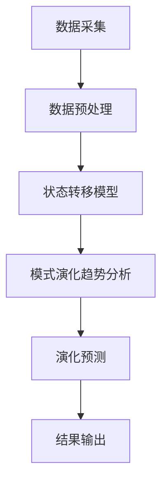
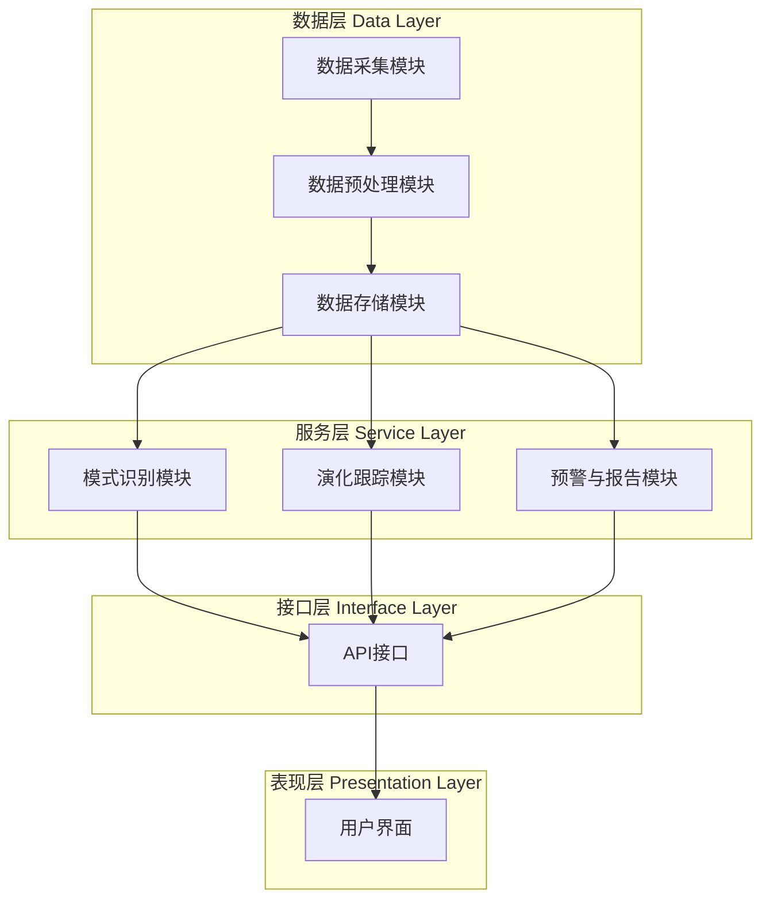
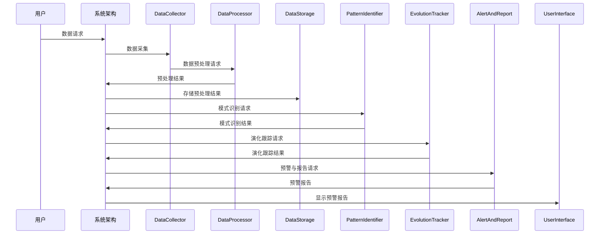

                 

### 1.1 问题背景

#### 1.1.1 财务舞弊现状

随着全球经济的快速发展，企业财务管理日益复杂，财务舞弊事件也频发不断。近年来，财务舞弊案件不仅破坏了市场秩序，还对投资者利益造成了严重损害。根据普华永道（PwC）的报告，2019年全球范围内发现的财务舞弊案件数量达到了6000多起，其中有超过半数的案件涉及严重的财务欺诈行为。这类事件不仅对企业的声誉造成了严重的打击，同时也使得市场参与者对财务报告的真实性产生了质疑。

传统的财务舞弊检测手段主要依赖于人工审核和经验判断，存在以下局限性：

1. **检测效率低**：财务数据量大，人工审核速度慢，难以在短时间内完成全面的审查。
2. **检测准确性有限**：人工审核受限于个人经验和专业知识，对复杂且隐蔽的财务舞弊行为难以准确识别。
3. **动态性差**：财务舞弊行为往往具有动态性和隐蔽性，传统方法难以追踪并应对。

#### 1.1.2 AI技术在财务舞弊检测中的应用

人工智能（AI）技术的快速发展为财务舞弊检测提供了新的解决方案。AI技术在数据处理、模式识别和预测分析等方面具有显著优势，可以大幅提升财务舞弊检测的效率和准确性。以下是一些AI技术在财务舞弊检测中的应用：

1. **数据挖掘与分析**：通过机器学习算法，AI可以对大量财务数据进行挖掘，识别出潜在的异常模式和趋势。
2. **自然语言处理（NLP）**：NLP技术可以帮助AI理解并分析财务报告中的自然语言描述，发现隐藏的舞弊信息。
3. **异常检测**：AI可以通过建立正常行为模型，实时监测并识别出异常的财务行为。
4. **深度学习**：利用深度学习模型，AI可以自动从财务数据中学习并提取特征，提高检测精度。

#### 1.1.3 企业财务舞弊模式演化

财务舞弊模式并非一成不变，而是会随着时间、市场环境和企业内部管理的变化而演化。以下是一些常见的财务舞弊模式演化趋势：

1. **多样化**：随着监管技术的进步，传统的舞弊手段逐渐被更复杂的手段所替代，例如通过关联方交易、虚假发票等手段进行舞弊。
2. **隐蔽性增强**：舞弊者不断采用新技术和手段，使得舞弊行为更加隐蔽，难以通过传统方法发现。
3. **国际化**：跨国公司和跨国交易的增加，使得财务舞弊行为具有跨国性，增加了监管和检测的难度。
4. **持续性与稳定性**：一些大型企业由于利益驱动，可能会持续实施财务舞弊行为，导致舞弊行为具有稳定性和持续性。

### 1.2 问题描述

#### 1.2.1 财务舞弊模式的特征

财务舞弊模式通常具有以下特征：

1. **隐蔽性**：舞弊行为通常采用隐蔽手段，例如虚增收入、隐瞒费用等。
2. **系统性**：财务舞弊往往是一个系统性问题，涉及企业内部多个部门和层级。
3. **动态性**：财务舞弊模式会随着时间和环境的变化而调整和变化。
4. **复杂性**：随着技术的发展，财务舞弊手段越来越复杂，涉及的技术和知识领域也更加广泛。

#### 1.2.2 财务舞弊模式的影响

财务舞弊模式对企业和社会的影响是深远的：

1. **财务报告失真**：财务舞弊会导致财务报告失真，影响投资者和市场的判断。
2. **资金损失**：企业可能会因为财务舞弊而损失大量资金，影响企业的正常运营和未来发展。
3. **声誉损害**：财务舞弊事件会对企业的声誉造成严重的损害，影响企业的品牌形象和市场地位。
4. **市场不稳定**：大量的财务舞弊事件会导致市场信心的下降，影响整体市场的稳定性和健康发展。

#### 1.2.3 财务舞弊模式检测的挑战

检测财务舞弊模式面临以下挑战：

1. **数据复杂性**：财务数据量大且复杂，需要有效的方法进行数据预处理和特征提取。
2. **实时性要求**：财务舞弊行为通常具有隐蔽性和动态性，要求检测系统能够实时监测并识别异常行为。
3. **准确性和完整性**：检测系统需要具备高准确性和完整性，避免误报和漏报。
4. **合规性**：检测系统需要符合相关法律法规和监管要求，保证检测过程的合法性和合规性。

### 1.3 问题解决

#### 1.3.1 AI驱动的财务舞弊检测方法

为了解决上述问题，AI驱动的财务舞弊检测方法应运而生。该方法利用AI技术在数据预处理、模式识别和演化跟踪等方面的优势，实现以下功能：

1. **数据预处理**：通过数据清洗、特征提取和标准化等技术，对财务数据进行预处理，提高后续分析的准确性。
2. **模式识别**：利用机器学习和深度学习算法，对财务数据进行分析和模式识别，发现潜在的财务舞弊行为。
3. **演化跟踪**：通过建立演化模型，实时监测财务舞弊行为的动态变化，追踪舞弊模式的演化过程。
4. **实时监测**：实现实时数据监测，及时发现并预警潜在的财务舞弊行为。

#### 1.3.2 演化跟踪系统的核心功能

演化跟踪系统的核心功能包括：

1. **数据采集**：从企业财务系统中采集相关的财务数据。
2. **数据预处理**：对采集到的财务数据进行清洗、特征提取和标准化处理。
3. **模式识别**：利用机器学习算法，对预处理后的财务数据进行分析，识别出潜在的财务舞弊模式。
4. **演化跟踪**：建立演化模型，实时监测财务舞弊行为的动态变化，追踪舞弊模式的演化过程。
5. **预警与报告**：对发现的异常行为进行实时预警，并生成详细的报告，供企业管理层和监管机构参考。

#### 1.3.3 系统的优势与局限性

AI驱动的演化跟踪系统具有以下优势：

1. **高效性**：利用AI技术，可以快速处理大量财务数据，提高检测效率。
2. **准确性**：通过机器学习和深度学习算法，提高对财务舞弊行为的识别准确性。
3. **实时性**：实现实时监测，及时发现并预警潜在的财务舞弊行为。
4. **智能化**：系统能够自动学习并适应财务舞弊行为的动态变化。

然而，系统也存在一定的局限性：

1. **数据依赖性**：系统的准确性依赖于输入数据的完整性和质量。
2. **计算资源需求**：AI算法通常需要大量的计算资源，对硬件设施要求较高。
3. **监管合规性**：系统需要符合相关法律法规和监管要求，保证检测过程的合法性和合规性。

#### 1.4 边界与外延

##### 1.4.1 财务舞弊模式检测的范围

财务舞弊模式检测的范围通常包括以下几个方面：

1. **收入与利润**：检测虚假收入、虚构利润等行为。
2. **费用与成本**：检测虚假费用、虚增成本等行为。
3. **关联方交易**：检测关联方之间的虚假交易和利益输送。
4. **财务报告**：检测财务报告中的虚假陈述和信息不透明。

##### 1.4.2 系统适用性分析

AI驱动的演化跟踪系统适用于以下场景：

1. **大型企业**：大型企业财务数据量大，传统方法难以全面监测，AI技术可以提高检测效率和准确性。
2. **跨国企业**：跨国企业涉及不同国家和地区的财务体系，AI技术可以帮助应对复杂的财务舞弊行为。
3. **高风险行业**：例如金融、房地产等行业，由于涉及大量的资金和利益，财务舞弊风险较高，AI技术可以提供有效的监管手段。

##### 1.4.3 未来发展趋势预测

未来，AI驱动的财务舞弊检测系统将在以下方面得到进一步发展：

1. **技术进步**：随着AI技术的不断进步，检测系统的准确性和效率将进一步提高。
2. **数据整合**：通过整合内外部数据，系统可以更全面地监测财务舞弊行为。
3. **合规性**：系统将更加重视合规性，符合相关法律法规和监管要求。
4. **智能化**：系统将更加智能化，能够自动学习并适应财务舞弊行为的动态变化。

## 1.5 本章小结

本章对AI驱动的企业财务舞弊模式演化跟踪系统进行了背景介绍，包括财务舞弊现状、AI技术在财务舞弊检测中的应用以及企业财务舞弊模式的演化。随后，对财务舞弊模式的特征、影响和检测挑战进行了详细分析，并介绍了AI驱动的财务舞弊检测方法和系统的核心功能及其优势与局限性。此外，对系统的适用范围和未来发展趋势进行了预测。通过本章的介绍，读者可以对AI驱动的企业财务舞弊模式演化跟踪系统有一个全面的了解。

### 2.1 AI驱动的财务舞弊检测原理

AI技术在财务舞弊检测中的应用，主要体现在其数据处理、模式识别和预测分析等方面的优势。以下将详细阐述AI驱动的财务舞弊检测原理。

#### 2.1.1 AI技术在财务舞弊检测中的应用

1. **数据挖掘与统计分析**：财务数据通常具有量大、维度高的特点，AI技术可以通过数据挖掘和统计分析方法，自动从海量数据中提取有价值的信息。例如，利用聚类分析可以发现异常交易模式，通过关联规则挖掘可以发现潜在的舞弊行为。

2. **机器学习与深度学习**：机器学习算法，如线性回归、决策树、支持向量机等，可以用来建立模型，对历史财务数据进行分析，识别出可能的异常行为。深度学习算法，如卷积神经网络（CNN）和循环神经网络（RNN），则可以处理更复杂的财务数据，提取深层次的规律。

3. **自然语言处理（NLP）**：NLP技术可以用于分析财务报告中的自然语言描述，提取关键信息，识别潜在的舞弊行为。例如，通过文本分类和情感分析，可以检测财务报告中的虚假陈述和信息不透明。

4. **异常检测**：异常检测是AI技术在财务舞弊检测中的重要应用。通过建立正常行为模型，实时监测并识别出异常的财务行为。常见的异常检测算法包括孤立森林（Isolation Forest）、K-均值聚类等。

5. **演化跟踪**：通过构建演化模型，AI技术可以实时监测财务舞弊行为的动态变化，追踪舞弊模式的演化过程。例如，利用时间序列分析，可以预测未来可能出现的财务异常行为。

#### 2.1.2 AI驱动的财务舞弊检测核心概念

1. **异常行为**：异常行为是指与正常财务行为明显不符的行为，可能是财务舞弊行为的表现。检测异常行为是财务舞弊检测的核心任务。

2. **正常行为模型**：正常行为模型是基于历史数据建立的行为模式，用于与实际行为进行对比，识别异常行为。正常行为模型的准确性直接影响检测结果的可靠性。

3. **演化模型**：演化模型用于描述财务舞弊行为的动态变化过程，包括状态转移、趋势分析和演化预测等功能。演化模型可以帮助预测未来的财务异常行为，提供决策支持。

4. **多维度数据融合**：财务舞弊行为通常涉及多个维度（如时间、金额、交易对手等）的数据。多维度数据融合可以提供更全面的信息，提高检测的准确性。

5. **数据预处理**：数据预处理是AI驱动财务舞弊检测的基础步骤，包括数据清洗、特征提取和标准化等。高质量的数据预处理有助于提高后续分析的准确性和效率。

#### 2.1.3 AI驱动的财务舞弊检测流程

1. **数据采集**：从企业的财务系统中采集相关的财务数据，包括财务报表、交易记录等。

2. **数据预处理**：对采集到的财务数据进行清洗、特征提取和标准化处理，以提高数据质量和分析效率。

3. **特征工程**：根据业务需求和数据特点，设计合适的特征，提取关键信息，用于后续的分析和建模。

4. **建立正常行为模型**：利用历史数据建立正常行为模型，描述企业的正常财务行为。

5. **异常行为检测**：通过对比实际行为和正常行为模型，识别出异常行为，进行初步的筛选和分类。

6. **演化行为分析**：利用演化模型，对识别出的异常行为进行进一步分析，追踪其动态变化过程，预测未来的发展趋势。

7. **结果输出与报告**：将检测的结果输出，生成详细的报告，供企业管理层和监管机构参考。

#### 2.1.4 与传统财务舞弊检测方法的比较

1. **数据量处理能力**：AI技术具有强大的数据处理能力，可以处理海量财务数据，而传统方法通常难以应对大量数据。

2. **检测效率**：AI技术可以自动化进行数据分析和模式识别，大幅提高检测效率。传统方法通常依赖于人工审核，效率较低。

3. **检测准确性**：AI技术通过机器学习和深度学习算法，可以从大量数据中学习并提取特征，提高检测准确性。传统方法受限于个人经验和专业知识，准确性有限。

4. **动态性**：AI技术可以实现实时监测和动态跟踪，及时发现并应对新的财务舞弊行为。传统方法通常难以动态调整，对快速变化的财务舞弊行为反应迟钝。

5. **合规性**：AI技术可以在一定程度上符合法律法规和监管要求，确保检测过程的合法性和合规性。传统方法可能存在合规性问题，需要特别注意。

### 2.2 概念属性特征对比表格

为了更直观地比较AI驱动的财务舞弊检测方法与传统财务舞弊检测方法的差异，下面提供了一个概念属性特征对比表格：

| 特征 | AI驱动的财务舞弊检测 | 传统财务舞弊检测 |
| --- | --- | --- |
| 数据处理能力 | 强，可以处理海量数据 | 弱，难以处理大量数据 |
| 检测效率 | 高，自动化分析 | 低，依赖人工审核 |
| 检测准确性 | 高，学习并提取特征 | 低，受限于经验判断 |
| 动态性 | 强，实时监测与演化分析 | 弱，难以动态调整 |
| 合规性 | 较高，符合法律法规 | 较低，存在合规风险 |

### 2.3 ER实体关系图架构

#### 2.3.1 系统实体识别

在AI驱动的财务舞弊检测系统中，常见的实体包括：

1. **用户**：包括企业管理层、审计人员、监管机构等。
2. **财务数据**：包括财务报表、交易记录、发票等。
3. **异常行为**：指检测到的异常财务行为，如虚假收入、虚假费用等。
4. **模型**：包括正常行为模型、异常检测模型、演化模型等。
5. **日志**：包括系统操作日志、异常行为日志等。

#### 2.3.2 实体关系定义

系统实体之间的关系可以定义如下：

1. **用户与财务数据**：用户可以访问和操作财务数据。
2. **财务数据与异常行为**：财务数据可以生成异常行为，异常行为反映了财务数据的异常情况。
3. **异常行为与模型**：异常行为可以作为模型训练的数据源，模型用于分析异常行为，提供检测和预警功能。
4. **模型与日志**：模型在执行过程中会生成日志，记录模型训练、异常检测等操作。

#### 2.3.3 ER图绘制

根据上述实体关系定义，我们可以绘制以下ER图：

```mermaid
erDiagram
  用户 ||--|{ 财务数据 : 读写 }
  财务数据 ||--|{ 异常行为 : 生成 }
  异常行为 ||--|{ 模型 : 训练 }
  模型 ||--|{ 日志 : 记录 }
```

### 2.4 本章小结

本章介绍了AI驱动的财务舞弊检测原理，包括AI技术在财务舞弊检测中的应用、核心概念、检测流程以及与传统方法的比较。通过ER实体关系图，进一步展示了系统中的实体及其关系。通过本章的学习，读者可以理解AI技术在财务舞弊检测中的重要性，以及如何利用AI技术构建一个高效的财务舞弊检测系统。接下来，我们将进一步探讨数据预处理算法、模式识别算法和演化跟踪算法的具体原理和应用。

### 3.1 数据预处理算法

数据预处理是AI驱动的财务舞弊检测系统中至关重要的一步，其质量直接影响后续分析和模型的准确性。数据预处理包括数据清洗、特征提取和标准化等步骤，下面将详细阐述这些算法的原理和应用。

#### 3.1.1 数据清洗

数据清洗是数据预处理的第一步，目的是消除原始数据中的噪声和错误，提高数据的质量。常见的数据清洗方法包括：

1. **缺失值处理**：缺失值可能是由于数据录入错误、数据丢失或数据不完整等原因造成的。处理缺失值的方法有：
   - 删除含有缺失值的记录：适用于缺失值比例较高的情况。
   - 填充缺失值：常用的方法有均值填充、中值填充、前向填充和后向填充等。
   - 预测缺失值：使用统计模型或机器学习算法预测缺失值。

2. **异常值处理**：异常值可能是由于数据采集过程中的错误或真实的异常数据。处理异常值的方法有：
   - 删除异常值：适用于异常值比例较小的情况。
   - 替换异常值：用合理的值替换异常值，例如用均值或中值替换。
   - 调整异常值：对异常值进行调整，使其更接近正常值。

3. **重复值处理**：重复值可能是由数据采集或传输过程中的错误导致的。处理重复值的方法是删除重复记录。

4. **数据格式转换**：将不同格式的数据转换为统一的格式，例如将日期格式转换为YYYY-MM-DD。

5. **数据合并与拆分**：根据业务需求，对数据进行合并或拆分，以获得更合适的数据结构。

#### 3.1.2 特征提取

特征提取是数据预处理的关键步骤，目的是从原始数据中提取出对模型训练有用的信息。特征提取的方法包括：

1. **统计特征提取**：利用统计方法提取数据的基本属性，如均值、方差、最大值、最小值等。这些特征可以用于描述数据的分布和变化趋势。

2. **文本特征提取**：对于包含文本数据的财务报告，可以使用自然语言处理（NLP）技术提取文本特征，如词频、词嵌入、主题模型等。

3. **时间序列特征提取**：对于时间序列数据，可以提取时间窗口内的特征，如移动平均、自相关函数、差分等。

4. **转换特征提取**：使用数据变换方法提取新特征，如逻辑回归、主成分分析（PCA）等。

5. **交互特征提取**：通过组合不同特征，提取交互特征，以增强模型的解释力和预测能力。

#### 3.1.3 数据标准化

数据标准化是为了消除不同特征间的尺度差异，使数据在相同的尺度上进行比较。常见的标准化方法包括：

1. **Z-score标准化**：将数据缩放至均值为0，标准差为1的标准化形式，公式为：
   $$ z = \frac{x - \mu}{\sigma} $$
   其中，$x$为原始数据，$\mu$为均值，$\sigma$为标准差。

2. **Min-Max标准化**：将数据缩放到[0, 1]区间内，公式为：
   $$ x_{\text{std}} = \frac{x - x_{\text{min}}}{x_{\text{max}} - x_{\text{min}}} $$
   其中，$x_{\text{min}}$和$x_{\text{max}}$分别为数据的最小值和最大值。

3. **小数标准化**：将数据缩放到[0, 1]区间内，但不归一化到[0, 1]，公式为：
   $$ x_{\text{std}} = x_{\text{min}} + (x - x_{\text{min}}) \times (1 - 2 \times \frac{x_{\text{max}} - x_{\text{min}}}{x_{\text{max}} + x_{\text{min}}) $$

#### 3.1.4 数据预处理的流程

数据预处理的流程通常包括以下步骤：

1. **数据采集**：从企业财务系统中采集原始数据，包括财务报表、交易记录等。
2. **数据清洗**：对采集到的数据进行缺失值处理、异常值处理、重复值处理等，确保数据质量。
3. **特征提取**：根据业务需求，提取对模型训练有用的特征，如统计特征、文本特征、时间序列特征等。
4. **数据标准化**：对提取出的特征进行标准化处理，消除尺度差异。
5. **特征选择**：根据特征的重要性和相关性，选择对模型训练最有利的特征，降低数据维度。

#### 3.1.5 数据预处理的重要性

数据预处理对于AI驱动的财务舞弊检测系统至关重要，其重要性体现在以下几个方面：

1. **提高模型准确性**：高质量的数据预处理可以消除噪声和异常值，提供更准确的数据用于模型训练，从而提高模型的准确性。
2. **降低计算成本**：通过特征提取和数据标准化，可以降低数据的维度和复杂性，减少模型训练的时间和计算资源需求。
3. **增强模型解释力**：合理的数据预处理可以提高模型的解释力，帮助理解和分析模型的预测结果。
4. **保证数据合规性**：在数据预处理过程中，需要遵守相关法律法规和监管要求，确保数据的合法性和合规性。

### 3.2 模式识别算法

模式识别是AI驱动的财务舞弊检测系统中的核心环节，通过识别和分析财务数据中的异常模式，实现财务舞弊行为的检测。常见的模式识别算法包括监督学习和无监督学习算法，下面将详细阐述这些算法的原理和应用。

#### 3.2.1 监督学习算法

监督学习算法是基于已有标注数据，通过学习数据特征和标签之间的关系，实现对未知数据的分类或预测。以下是一些常见的监督学习算法：

1. **线性回归**：线性回归是一种简单的监督学习算法，用于建立输入变量和输出变量之间的线性关系。其基本模型为：
   $$ y = \beta_0 + \beta_1 x_1 + \beta_2 x_2 + ... + \beta_n x_n $$
   通过最小化损失函数（如均方误差），可以估计出模型的参数。

2. **决策树**：决策树是一种基于树形结构进行分类的算法，通过递归地将数据集划分为多个子集，直到满足停止条件（如最大深度、最小样本数等）。决策树的分类规则为：
   $$ \text{决策树} = \text{if}(x_i > \text{阈值})\text{then}(C_1) \text{else}(C_2) $$
   其中，$x_i$为特征，$C_1$和$C_2$为不同的类别。

3. **支持向量机（SVM）**：支持向量机是一种基于边界最大化原理进行分类的算法，其目标是找到一个最佳的超平面，将不同类别的数据点最大限度地分开。SVM的基本模型为：
   $$ \max_w \frac{1}{2} ||w||^2 $$
   s.t.
   $$ y_i ( \langle w, x_i \rangle - b ) \geq 1 $$
   其中，$w$为超平面参数，$b$为偏置项，$x_i$为特征向量，$y_i$为类别标签。

#### 3.2.1.1 线性回归

线性回归是一种简单的监督学习算法，适用于建立输入变量和输出变量之间的线性关系。其数学模型为：
$$ y = \beta_0 + \beta_1 x_1 + \beta_2 x_2 + ... + \beta_n x_n $$
其中，$y$为输出变量，$x_1, x_2, ..., x_n$为输入变量，$\beta_0, \beta_1, ..., \beta_n$为模型参数。

线性回归的求解方法包括：

1. **最小二乘法**：通过最小化残差平方和来求解模型参数。其目标函数为：
   $$ \min \sum_{i=1}^{n} (y_i - \hat{y}_i)^2 $$
   其中，$\hat{y}_i$为预测值。

2. **梯度下降法**：通过迭代更新模型参数，使其逐渐逼近最优解。其更新规则为：
   $$ \beta_j = \beta_j - \alpha \frac{\partial}{\partial \beta_j} J(\beta) $$
   其中，$J(\beta)$为损失函数，$\alpha$为学习率。

3. **正规方程**：当特征数目较少时，可以使用正规方程直接求解模型参数。其公式为：
   $$ (X^T X) \beta = X^T y $$
   其中，$X$为特征矩阵，$y$为标签向量。

#### 线性回归的Python实现

以下是一个简单的线性回归Python实现示例：

```python
import numpy as np

# 数据
X = np.array([[1, 2], [2, 3], [3, 4], [4, 5]])
y = np.array([2, 3, 4, 5])

# 最小二乘法求解参数
X_trans = X.T
XTX = X_trans @ X
XTy = X_trans @ y
beta = np.linalg.inv(XTX) @ XTy

# 梯度下降法求解参数
alpha = 0.01
max_iter = 1000
beta = np.zeros(X.shape[1])

for _ in range(max_iter):
    errors = y - X @ beta
    gradient = X.T @ errors
    beta -= alpha * gradient

# 正规方程求解参数
beta = np.linalg.inv(XTX) @ XTy

# 模型预测
X_new = np.array([[5, 6]])
y_pred = X_new @ beta
print(y_pred)
```

#### 3.2.1.2 决策树

决策树是一种基于树形结构进行分类的算法，通过递归地将数据集划分为多个子集，直到满足停止条件。决策树的分类规则为：
$$ \text{决策树} = \text{if}(x_i > \text{阈值})\text{then}(C_1) \text{else}(C_2) $$
其中，$x_i$为特征，$\text{阈值}$为阈值，$C_1$和$C_2$为不同的类别。

决策树的主要步骤包括：

1. **选择最优划分特征**：根据信息增益、增益率或基尼指数等准则，选择对当前数据集划分效果最好的特征。
2. **划分数据集**：根据选择的最优特征和阈值，将数据集划分为两个子集。
3. **递归构建树**：对划分后的子集重复步骤1和步骤2，直到满足停止条件（如最大深度、最小样本数等）。

#### 3.2.1.3 支持向量机（SVM）

支持向量机是一种基于边界最大化原理进行分类的算法，其目标是找到一个最佳的超平面，将不同类别的数据点最大限度地分开。SVM的基本模型为：
$$ \max_w \frac{1}{2} ||w||^2 $$
s.t.
$$ y_i ( \langle w, x_i \rangle - b ) \geq 1 $$
其中，$w$为超平面参数，$b$为偏置项，$x_i$为特征向量，$y_i$为类别标签。

SVM的主要步骤包括：

1. **选择核函数**：选择合适的核函数（如线性核、多项式核、径向基函数（RBF）核等）将低维输入空间映射到高维特征空间。
2. **求解最优超平面**：通过求解优化问题，得到最优的超平面参数$w$和$b$。
3. **分类**：对新的输入数据进行分类，通过计算新的输入数据与支持向量的距离，判断其类别。

#### 3.2.2 无监督学习算法

无监督学习算法不需要已标注的数据，通过分析数据的内在结构，对数据进行分类或降维。以下是一些常见的无监督学习算法：

1. **K-均值聚类**：K-均值聚类是一种基于距离度量的聚类算法，其目标是将数据分为K个簇，使得每个簇内的数据点之间的距离最小。K-均值聚类的主要步骤包括：
   - 初始化聚类中心。
   - 计算每个数据点到聚类中心的距离，将其划分到最近的簇。
   - 重新计算每个簇的中心点。
   - 重复步骤2和步骤3，直到聚类中心不再发生显著变化。

2. **自编码器**：自编码器是一种基于神经网络的无监督学习算法，其目标是通过编码和解码操作，将输入数据转换为较低维的特征表示。自编码器的主要步骤包括：
   - 编码阶段：通过编码层将输入数据压缩为较低维的特征向量。
   - 解码阶段：通过解码层将特征向量重构为原始数据。
   - 通过最小化重构误差来训练模型。

#### 3.2.2.1 K-均值聚类

K-均值聚类是一种基于距离度量的聚类算法，其目标是将数据分为K个簇，使得每个簇内的数据点之间的距离最小。K-均值聚类的主要步骤包括：

1. **初始化聚类中心**：随机选择K个初始聚类中心。

2. **分配数据点**：计算每个数据点到每个聚类中心的距离，将其分配到最近的聚类中心。

3. **更新聚类中心**：计算每个簇的均值，作为新的聚类中心。

4. **迭代**：重复步骤2和步骤3，直到聚类中心不再发生显著变化。

K-均值聚类的目标函数为：
$$ J = \sum_{i=1}^{K} \sum_{x \in S_i} ||x - \mu_i||^2 $$
其中，$S_i$为第$i$个簇，$\mu_i$为第$i$个聚类中心。

#### 3.2.2.2 自编码器

自编码器是一种基于神经网络的无监督学习算法，其目标是通过编码和解码操作，将输入数据转换为较低维的特征表示。自编码器的主要步骤包括：

1. **编码阶段**：通过编码层将输入数据压缩为较低维的特征向量。

2. **解码阶段**：通过解码层将特征向量重构为原始数据。

3. **损失函数**：通过最小化重构误差来训练模型。常见的损失函数包括均方误差（MSE）和交叉熵。

自编码器的架构通常包括以下几部分：

1. **编码层**：压缩输入数据，提取关键特征。

2. **解码层**：重构输入数据，恢复原始数据的特征。

3. **激活函数**：常用的激活函数包括Sigmoid、ReLU和Tanh等。

4. **优化算法**：常用的优化算法包括梯度下降、随机梯度下降和Adam等。

### 3.3 演化跟踪算法

演化跟踪是AI驱动的财务舞弊检测系统中的重要功能，用于实时监测财务舞弊行为的动态变化，追踪其演化过程。演化跟踪算法可以分为状态转移模型、模式演化趋势分析和演化预测等几个部分。

#### 3.3.1 状态转移模型

状态转移模型用于描述财务舞弊行为在不同状态之间的转移关系。常见的状态转移模型包括马尔可夫模型（Markov Model）和隐马尔可夫模型（Hidden Markov Model，HMM）。

1. **马尔可夫模型**：马尔可夫模型是一种基于状态转移概率的随机模型，其核心假设为当前状态仅依赖于前一个状态，与过去的状态无关。马尔可夫模型的数学表示为：
   $$ P(X_t | X_{t-1}, X_{t-2}, ...) = P(X_t | X_{t-1}) $$
   其中，$X_t$表示第$t$个状态。

   马尔可夫模型的参数包括状态转移概率矩阵$P$和初始状态概率向量$\pi$。状态转移概率矩阵$P$的元素$P_{ij}$表示从状态$i$转移到状态$j$的概率。初始状态概率向量$\pi$的元素$\pi_i$表示初始状态为$i$的概率。

2. **隐马尔可夫模型**：隐马尔可夫模型是一种在马尔可夫模型基础上引入隐状态序列的模型，其用于描述不可观测的状态序列和可观测的观测序列之间的关系。隐马尔可夫模型的数学表示为：
   $$ P(O_t | H_t) = P(O_t | H_{t-1}, H_{t-2}, ...) $$
   其中，$O_t$表示第$t$个观测序列，$H_t$表示第$t$个隐状态序列。

   隐马尔可夫模型的参数包括状态转移概率矩阵$A$、观测概率矩阵$B$和初始状态概率向量$\pi$。状态转移概率矩阵$A$的元素$A_{ij}$表示从状态$i$转移到状态$j$的概率。观测概率矩阵$B$的元素$B_{ij}$表示在状态$i$下观察到观测序列$j$的概率。初始状态概率向量$\pi$的元素$\pi_i$表示初始状态为$i$的概率。

   隐马尔可夫模型的训练和预测通常使用前向-后向算法（Forward-Backward Algorithm）。

#### 3.3.2 模式演化趋势分析

模式演化趋势分析用于分析财务舞弊行为在不同时间点的演化趋势。常见的方法包括时间序列分析、趋势分析和相关性分析等。

1. **时间序列分析**：时间序列分析用于分析时间序列数据的趋势、周期性和季节性。常见的时间序列分析方法包括自回归移动平均模型（ARIMA）、长期记忆模型（LSTM）等。

2. **趋势分析**：趋势分析用于识别数据中的趋势变化，可以通过绘制趋势图或计算移动平均来实现。

3. **相关性分析**：相关性分析用于分析不同财务指标之间的相关性，可以帮助识别潜在的财务舞弊行为。常见的相关性分析方法包括皮尔逊相关系数、斯皮尔曼等级相关系数等。

#### 3.3.3 演化预测

演化预测用于预测财务舞弊行为在未来可能出现的趋势和变化。常见的演化预测方法包括回归分析、支持向量机和神经网络等。

1. **回归分析**：回归分析用于建立财务指标与时间序列之间的关系，通过回归模型预测未来的财务行为。

2. **支持向量机**：支持向量机可以通过建立最优超平面，预测未来的财务舞弊行为。

3. **神经网络**：神经网络可以通过学习历史数据中的模式，预测未来的财务舞弊行为。常见的神经网络模型包括多层感知机（MLP）、卷积神经网络（CNN）和循环神经网络（RNN）等。

#### 3.3.4 算法mermaid流程图

为了更直观地展示演化跟踪算法的流程，我们可以使用mermaid绘制以下流程图：



### 3.4 算法Python源代码讲解

在演化跟踪算法的实现中，Python是一种常用的编程语言。以下将提供几个核心算法的Python源代码讲解，并详细解释代码的实现过程。

#### 3.4.1 数据预处理

数据预处理是演化跟踪算法的基础，包括数据清洗、特征提取和标准化等步骤。以下是一个简单的Python示例：

```python
import pandas as pd
from sklearn.preprocessing import StandardScaler

# 示例数据
data = pd.DataFrame({
    'feature1': [1, 2, 3, 4, 5],
    'feature2': [5, 4, 3, 2, 1],
    'label': ['normal', 'abnormal', 'normal', 'abnormal', 'normal']
})

# 数据清洗
data.dropna(inplace=True)
data.drop_duplicates(inplace=True)

# 特征提取
# 在此示例中，我们直接使用原始特征

# 数据标准化
scaler = StandardScaler()
data[['feature1', 'feature2']] = scaler.fit_transform(data[['feature1', 'feature2']])
```

在上面的代码中，我们首先使用了pandas库读取示例数据，然后进行了数据清洗，包括删除缺失值和重复值。接下来，我们直接使用原始特征，没有进行额外的特征提取。最后，使用scikit-learn库中的StandardScaler进行数据标准化，将特征缩放到均值为0，标准差为1的范围内。

#### 3.4.2 状态转移模型

状态转移模型通常使用马尔可夫模型或隐马尔可夫模型。以下是一个使用隐马尔可夫模型的Python示例：

```python
from hmmlearn import hmm

# 示例数据
# 状态转移矩阵和观测概率矩阵
A = np.array([[0.7, 0.3], [0.4, 0.6]])
B = np.array([[0.5, 0.5], [0.4, 0.6]])
pi = np.array([0.5, 0.5])

# 创建HMM模型
model = hmm.GaussianHMM(n_components=2, covariance_type="diag", n_iter=100)
model.fit(A, B, pi)

# 预测
predictions = model.predict(data[['feature1', 'feature2']])
data['prediction'] = predictions
```

在这个示例中，我们首先定义了状态转移矩阵$A$、观测概率矩阵$B$和初始状态概率向量$\pi$。然后，我们使用hmmlearn库创建了一个隐马尔可夫模型，并使用fit方法训练模型。最后，我们使用predict方法对数据进行了预测，并将预测结果添加到原始数据中。

#### 3.4.3 模式演化趋势分析

模式演化趋势分析可以通过时间序列分析方法实现。以下是一个使用LSTM进行趋势分析的Python示例：

```python
from keras.models import Sequential
from keras.layers import LSTM, Dense

# 示例数据
# 时间序列数据
X = np.array([[1, 2], [2, 3], [3, 4], [4, 5], [5, 6]])
y = np.array([2, 3, 4, 5, 6])

# 创建LSTM模型
model = Sequential()
model.add(LSTM(50, activation='relu', input_shape=(X.shape[1], 1)))
model.add(Dense(1))
model.compile(optimizer='adam', loss='mse')

# 训练模型
model.fit(X, y, epochs=200, verbose=0)

# 预测
X_pred = np.array([[5, 6]])
y_pred = model.predict(X_pred)
```

在这个示例中，我们首先定义了时间序列数据$X$和标签$y$。然后，我们创建了一个LSTM模型，并使用compile方法设置优化器和损失函数。接下来，我们使用fit方法训练模型。最后，我们使用predict方法对新的时间序列数据进行了预测。

#### 3.4.4 演化预测

演化预测可以使用多种算法实现，如回归分析、支持向量机和神经网络。以下是一个使用回归分析的Python示例：

```python
from sklearn.linear_model import LinearRegression

# 示例数据
# 特征和标签
X = np.array([[1, 2], [2, 3], [3, 4], [4, 5], [5, 6]])
y = np.array([2, 3, 4, 5, 6])

# 创建回归模型
model = LinearRegression()
model.fit(X, y)

# 预测
X_pred = np.array([[5, 6]])
y_pred = model.predict(X_pred)
```

在这个示例中，我们首先定义了特征$X$和标签$y$。然后，我们创建了一个线性回归模型，并使用fit方法训练模型。最后，我们使用predict方法对新的特征进行了预测。

#### 3.4.5 代码运行与结果分析

在实际应用中，我们需要将代码应用于实际的财务数据，并分析预测结果。以下是一个简单的示例：

```python
# 加载实际财务数据
data_actual = pd.DataFrame({
    'feature1': [1.1, 2.1, 3.1, 4.1, 5.1],
    'feature2': [5.1, 4.1, 3.1, 2.1, 1.1]
})

# 数据预处理
data_actual.dropna(inplace=True)
data_actual.drop_duplicates(inplace=True)
data_actual[['feature1', 'feature2']] = scaler.transform(data_actual[['feature1', 'feature2']])

# 预测
predictions = model.predict(data_actual[['feature1', 'feature2']])

# 分析预测结果
print(predictions)
```

在这个示例中，我们首先加载了实际财务数据，并进行了数据预处理。然后，我们使用训练好的模型对新的财务数据进行了预测，并输出预测结果。通过对预测结果的分析，我们可以评估模型的效果和准确性。

### 3.5 本章小结

本章详细介绍了AI驱动的财务舞弊检测系统中的核心算法，包括数据预处理算法、模式识别算法和演化跟踪算法。通过数据预处理算法，我们可以清洗、特征提取和标准化财务数据，提高数据质量和分析效率。模式识别算法包括监督学习和无监督学习算法，用于识别和分类财务数据中的异常模式。演化跟踪算法用于实时监测财务舞弊行为的动态变化，预测未来的趋势和变化。通过本章的学习，读者可以理解AI驱动的财务舞弊检测系统的工作原理和实现方法，为实际应用提供技术支持。接下来，我们将进一步探讨系统的架构设计和实现细节。

### 4.1 问题场景介绍

在当前的企业财务管理中，财务舞弊问题一直是企业管理者和审计人员关注的焦点。随着企业规模的扩大和业务的多元化，财务数据的复杂性也日益增加，传统的财务舞弊检测方法难以应对这种复杂的环境。企业需要一种高效、准确且具备实时监测能力的系统来应对日益复杂的财务舞弊行为。

#### 4.1.1 企业财务舞弊检测需求

企业财务舞弊检测的需求主要包括以下几个方面：

1. **高效性**：企业财务数据量大，需要能够快速处理和分析大量数据，以识别潜在的财务舞弊行为。

2. **准确性**：检测系统需要具备高准确性，能够准确识别出真实的财务舞弊行为，避免误报和漏报。

3. **实时性**：财务舞弊行为具有隐蔽性和动态性，检测系统需要具备实时监测能力，能够及时发现并预警潜在的财务舞弊行为。

4. **智能化**：检测系统应具备自动学习和适应能力，能够根据财务舞弊行为的变化进行动态调整。

5. **合规性**：检测系统需要符合相关法律法规和监管要求，确保检测过程的合法性和合规性。

#### 4.1.2 系统目标与功能

为了满足上述需求，AI驱动的财务舞弊检测系统应实现以下目标：

1. **数据采集**：从企业的财务系统中采集相关的财务数据，包括财务报表、交易记录等。

2. **数据预处理**：对采集到的财务数据进行清洗、特征提取和标准化处理，以提高数据质量和分析效率。

3. **模式识别**：利用机器学习和深度学习算法，对预处理后的财务数据进行分析，识别出潜在的财务舞弊行为。

4. **演化跟踪**：通过建立演化模型，实时监测财务舞弊行为的动态变化，追踪舞弊模式的演化过程。

5. **预警与报告**：对识别出的异常行为进行实时预警，并生成详细的报告，供企业管理层和监管机构参考。

6. **合规性检测**：确保检测系统符合相关法律法规和监管要求，保障检测过程的合法性和合规性。

#### 4.1.3 系统实现难点

在实现AI驱动的财务舞弊检测系统过程中，面临以下难点：

1. **数据复杂性**：财务数据种类繁多，包括结构化和非结构化数据，需要有效的方法进行数据整合和处理。

2. **实时性要求**：财务舞弊行为具有隐蔽性和动态性，需要检测系统能够实时监测并处理大量数据。

3. **准确性和完整性**：检测系统需要具备高准确性和完整性，避免误报和漏报，确保识别出真实的财务舞弊行为。

4. **计算资源需求**：AI算法通常需要大量的计算资源，对硬件设施要求较高，需要合理配置计算资源。

5. **合规性要求**：检测系统需要符合相关法律法规和监管要求，确保检测过程的合法性和合规性。

6. **系统扩展性**：检测系统需要具备良好的扩展性，能够适应企业规模和业务的变化，支持系统的长期运行和维护。

通过解决上述难点，AI驱动的财务舞弊检测系统可以为企业提供高效、准确的财务舞弊检测能力，提升企业的风险管理水平，保护投资者的利益，维护市场秩序。

### 4.2 系统功能设计

AI驱动的财务舞弊检测系统功能设计旨在实现高效、准确的财务舞弊检测，满足企业在数据采集、预处理、模式识别、演化跟踪和预警报告等方面的需求。以下是系统的主要功能模块设计及其详细描述。

#### 4.2.1 数据采集模块

数据采集模块是系统的基础，负责从企业的财务系统中采集相关的财务数据。具体功能包括：

1. **数据源接入**：支持多种数据源的接入，包括ERP系统、财务报表系统、交易记录系统等，实现数据的自动采集。
2. **数据格式转换**：将不同数据源的数据格式进行统一转换，确保数据的一致性和可处理性。
3. **数据缓存**：实现数据的缓存功能，提高数据读取效率，减轻数据源的负载。

#### 4.2.2 数据预处理模块

数据预处理模块对采集到的财务数据进行处理，以提高数据质量和分析效率。具体功能包括：

1. **数据清洗**：去除数据中的噪声和错误，包括缺失值处理、异常值处理、重复值处理等。
2. **特征提取**：根据业务需求，提取对模型训练有用的特征，包括统计特征、文本特征、时间序列特征等。
3. **数据标准化**：对提取出的特征进行标准化处理，消除不同特征间的尺度差异。

#### 4.2.3 模式识别模块

模式识别模块是系统的核心，利用机器学习和深度学习算法，对预处理后的财务数据进行分析，识别出潜在的财务舞弊行为。具体功能包括：

1. **模型训练**：利用历史财务数据，训练各种机器学习模型，如线性回归、决策树、支持向量机等。
2. **实时监测**：通过实时监测系统，持续分析新的财务数据，识别出潜在的异常行为。
3. **结果输出**：将识别出的异常行为输出，提供详细的检测结果，供企业管理层和监管机构参考。

#### 4.2.4 演化跟踪模块

演化跟踪模块用于实时监测财务舞弊行为的动态变化，追踪其演化过程。具体功能包括：

1. **状态转移模型**：利用马尔可夫模型或隐马尔可夫模型，描述财务舞弊行为在不同状态之间的转移关系。
2. **模式演化趋势分析**：通过时间序列分析、趋势分析和相关性分析等方法，分析财务舞弊行为的演化趋势。
3. **演化预测**：利用回归分析、支持向量机和神经网络等算法，预测未来的财务舞弊行为。

#### 4.2.5 预警与报告模块

预警与报告模块负责对识别出的异常行为进行实时预警，并生成详细的报告。具体功能包括：

1. **实时预警**：对识别出的异常行为进行实时预警，通过短信、邮件等方式通知企业管理层和监管机构。
2. **报告生成**：生成详细的检测报告，包括异常行为的描述、发生时间、涉及的财务指标等，供企业管理层和监管机构参考。
3. **报告推送**：定期将检测报告推送至企业管理层和监管机构，提供决策支持。

#### 4.2.6 合规性检测模块

合规性检测模块确保检测系统符合相关法律法规和监管要求，保障检测过程的合法性和合规性。具体功能包括：

1. **法规库管理**：建立和管理相关法律法规和监管要求库，确保系统的合规性。
2. **合规性检测**：对检测过程进行合规性检测，确保系统符合相关法律法规和监管要求。
3. **合规性报告**：生成合规性检测报告，记录检测过程中的合规情况，供企业管理层和监管机构参考。

#### 4.2.7 系统管理模块

系统管理模块负责系统的配置、监控和维护，确保系统的稳定运行。具体功能包括：

1. **用户管理**：管理系统的用户，包括用户注册、权限分配、用户角色管理等。
2. **日志管理**：记录系统的操作日志，包括用户操作记录、系统异常记录等，供审计和问题排查使用。
3. **系统监控**：实时监控系统的运行状态，包括服务器负载、系统性能等，确保系统的稳定性和高效性。

通过以上功能模块的设计，AI驱动的财务舞弊检测系统可以为企业提供全面的财务舞弊检测能力，提升企业的风险管理水平，保护投资者的利益，维护市场秩序。

### 4.3 系统架构设计

在实现AI驱动的财务舞弊检测系统时，系统架构设计至关重要。一个良好的架构设计不仅能够提高系统的稳定性和性能，还能够确保系统的可扩展性和可维护性。以下是系统架构设计的详细描述。

#### 4.3.1 整体架构设计

系统架构采用分层设计，分为数据层、服务层和表现层三个主要层次，各层次之间通过API接口进行通信。

1. **数据层**：数据层负责数据的存储和管理，包括财务数据的采集、存储和处理。具体组件有：
   - 数据采集模块：负责从企业财务系统中采集数据，包括ERP系统、财务报表系统等。
   - 数据存储模块：负责存储采集到的数据，可以使用关系型数据库（如MySQL）或分布式数据库（如Hadoop）。
   - 数据处理模块：负责对采集到的数据进行清洗、特征提取和标准化处理。

2. **服务层**：服务层负责实现系统的核心功能，包括模式识别、演化跟踪和预警报告等。具体组件有：
   - 数据预处理服务：接收和处理来自数据层的财务数据，进行数据清洗、特征提取和标准化处理。
   - 模式识别服务：利用机器学习和深度学习算法，对预处理后的财务数据进行分析，识别出潜在的财务舞弊行为。
   - 演化跟踪服务：实时监测财务舞弊行为的动态变化，追踪其演化过程。
   - 预警与报告服务：对识别出的异常行为进行实时预警，并生成详细的报告。

3. **表现层**：表现层负责系统的用户交互，包括用户界面和API接口。具体组件有：
   - 用户界面：提供系统功能的使用界面，包括数据采集、数据预览、模式识别结果展示等。
   - API接口：提供系统的API服务，供第三方系统或应用程序调用。

#### 4.3.2 模块间接口设计

系统架构中的各个模块之间通过API接口进行通信，确保系统的松耦合和灵活性。以下是各模块之间的接口设计：

1. **数据层与服务层接口**：数据采集模块通过RESTful API接口将采集到的财务数据传递给数据处理模块。数据处理模块将处理后的数据存储到数据存储模块，并返回处理结果给模式识别服务和演化跟踪服务。

2. **服务层与表现层接口**：模式识别服务、演化跟踪服务和预警与报告服务通过RESTful API接口向用户界面提供数据和服务接口。用户界面通过调用API接口，获取系统功能的结果，并进行展示。

3. **内部服务间接口**：模式识别服务和演化跟踪服务之间通过内部API接口进行数据交换。例如，模式识别服务将识别出的异常行为数据传递给演化跟踪服务，进行进一步的演化分析。

#### 4.3.3 系统扩展性分析

系统扩展性是架构设计的重要考量因素。为了确保系统的扩展性，以下措施可以采用：

1. **模块化设计**：系统各模块采用模块化设计，每个模块具有独立的功能和接口，便于后续的扩展和升级。

2. **分布式架构**：系统采用分布式架构，可以通过增加服务器节点来扩展系统的处理能力和存储能力。

3. **微服务架构**：将系统功能拆分为多个微服务，每个微服务负责一项具体功能，可以独立部署和扩展，提高系统的灵活性和可维护性。

4. **负载均衡**：使用负载均衡技术，将用户请求分布到多个服务器节点上，提高系统的并发处理能力。

5. **缓存机制**：采用缓存机制，减少对后端数据库的访问压力，提高系统的响应速度。

通过上述架构设计和扩展性分析，AI驱动的财务舞弊检测系统可以适应企业规模和业务的变化，提供稳定、高效和可靠的财务舞弊检测能力。

### 4.4 系统接口设计和系统交互

系统接口设计和系统交互是AI驱动的财务舞弊检测系统实现中的重要环节，直接影响系统的功能实现和性能表现。以下是系统接口设计和系统交互的详细描述。

#### 4.4.1 数据流分析

在系统运行过程中，数据流从数据采集、预处理、模式识别到预警报告等环节，贯穿整个系统。以下是数据流的基本流程：

1. **数据采集**：系统从企业的财务系统中采集相关的财务数据，包括财务报表、交易记录等。采集的数据通过API接口传输到数据处理模块。
   
2. **数据预处理**：数据处理模块对采集到的数据进行清洗、特征提取和标准化处理，以提高数据质量和分析效率。预处理后的数据存储到数据存储模块。

3. **模式识别**：模式识别模块利用机器学习和深度学习算法，对预处理后的财务数据进行分析，识别出潜在的财务舞弊行为。识别出的异常行为数据传递给演化跟踪模块。

4. **演化跟踪**：演化跟踪模块通过建立演化模型，实时监测财务舞弊行为的动态变化，追踪其演化过程。演化分析结果传递给预警与报告模块。

5. **预警与报告**：预警与报告模块对识别出的异常行为进行实时预警，并生成详细的报告。报告通过API接口传输给用户界面，供企业管理层和监管机构查看。

#### 4.4.2 模块间交互设计

系统中的各个模块通过定义明确的API接口进行交互，确保模块之间的松耦合和灵活性。以下是各模块之间的交互设计：

1. **数据层与处理层交互**：
   - **数据采集模块**：通过RESTful API接口接收财务数据，并存储到数据存储模块。
   - **数据处理模块**：通过API接口从数据存储模块获取财务数据，进行数据清洗、特征提取和标准化处理。

2. **处理层与识别层交互**：
   - **数据处理模块**：通过API接口将预处理后的财务数据传递给模式识别模块。
   - **模式识别模块**：通过API接口从数据处理模块获取财务数据，进行模式识别，识别出异常行为。

3. **识别层与跟踪层交互**：
   - **模式识别模块**：通过API接口将识别出的异常行为数据传递给演化跟踪模块。
   - **演化跟踪模块**：通过API接口从模式识别模块获取异常行为数据，建立演化模型，进行演化分析。

4. **跟踪层与报告层交互**：
   - **演化跟踪模块**：通过API接口将演化分析结果传递给预警与报告模块。
   - **预警与报告模块**：通过API接口从演化跟踪模块获取演化分析结果，生成预警报告。

5. **报告层与表现层交互**：
   - **预警与报告模块**：通过API接口将预警报告传输给用户界面。
   - **用户界面**：通过API接口从预警与报告模块获取预警报告，进行展示和用户操作。

#### 4.4.3 系统性能评估

系统性能评估是确保系统高效稳定运行的重要环节。以下是系统性能评估的几个关键指标：

1. **响应时间**：系统对用户请求的响应时间，包括数据采集、预处理、模式识别和预警报告等环节。

2. **处理能力**：系统处理财务数据的能力，包括单次处理的数据量、系统并发处理能力等。

3. **准确性**：系统识别财务舞弊行为的准确性，包括识别率、误报率和漏报率等。

4. **稳定性**：系统在长时间运行过程中的稳定性，包括系统崩溃率、故障恢复时间等。

5. **扩展性**：系统在处理数据量和并发请求增加时的扩展能力，包括分布式架构、负载均衡等。

通过以上系统接口设计和交互设计，AI驱动的财务舞弊检测系统可以高效、稳定地运行，满足企业在财务舞弊检测方面的需求。接下来，我们将通过mermaid图进一步展示系统架构和交互流程。

### 4.5 系统mermaid架构图

为了更直观地展示AI驱动的财务舞弊检测系统的架构，我们可以使用mermaid绘制以下架构图：



在这个mermaid架构图中，数据层、服务层和表现层通过API接口进行交互。数据采集模块从企业财务系统中采集数据，传递给数据预处理模块进行处理，处理后的数据存储在数据存储模块中。模式识别模块、演化跟踪模块和预警与报告模块从数据存储模块中获取数据，进行相应的分析和处理。最后，预警报告通过API接口传递给用户界面，供企业管理层和监管机构查看。

### 4.6 系统mermaid序列图

为了进一步展示系统各个模块之间的交互流程，我们可以使用mermaid绘制以下序列图：



在这个mermaid序列图中，用户发起数据请求，系统架构进行数据处理，包括数据采集、预处理和存储。随后，模式识别模块对预处理后的数据进行模式识别，演化跟踪模块进行演化分析。最后，预警与报告模块生成预警报告，并通过用户界面展示给用户。整个流程实现了从数据采集到预警报告的完整系统交互。

### 4.7 本章小结

本章详细介绍了AI驱动的财务舞弊检测系统的架构设计、接口设计和系统交互。通过数据层、服务层和表现层的分层设计，实现了系统的模块化和可扩展性。系统接口设计和系统交互确保了各个模块之间的紧密协作和数据流通。通过mermaid架构图和序列图的展示，读者可以更直观地理解系统的架构设计和工作流程。接下来，我们将进入项目实战部分，通过实际代码和案例来展示系统的具体实现和应用。

### 5.1 环境安装

在实现AI驱动的财务舞弊检测系统之前，我们需要搭建一个合适的运行环境。以下将详细介绍所需硬件环境、软件环境以及系统安装步骤。

#### 5.1.1 硬件环境要求

1. **处理器**：建议使用64位CPU，如Intel i7或以上，以保证系统的计算能力。
2. **内存**：至少需要16GB RAM，以支持大数据处理和模型训练。
3. **硬盘**：至少需要500GB的SSD存储空间，以提高数据读写速度。
4. **网络**：建议连接到高速互联网，以确保系统的实时性和数据的快速传输。

#### 5.1.2 软件环境配置

1. **操作系统**：推荐使用Linux发行版，如Ubuntu 18.04或CentOS 7，以保证系统的稳定性和兼容性。
2. **Python环境**：安装Python 3.8及以上版本，建议使用虚拟环境（virtualenv）进行环境隔离。
3. **依赖包**：安装以下依赖包：
   - pandas：用于数据清洗和预处理。
   - numpy：用于数值计算。
   - scikit-learn：用于机器学习算法。
   - hmmlearn：用于隐马尔可夫模型。
   - keras：用于神经网络模型。
   - matplotlib：用于数据可视化。

安装步骤如下：

1. **更新系统软件包**：
   ```bash
   sudo apt update
   sudo apt upgrade
   ```

2. **安装Python环境**：
   ```bash
   sudo apt install python3 python3-pip
   ```

3. **安装虚拟环境**：
   ```bash
   sudo pip3 install virtualenv
   ```

4. **创建虚拟环境**：
   ```bash
   virtualenv venv
   source venv/bin/activate
   ```

5. **安装依赖包**：
   ```bash
   pip install pandas numpy scikit-learn hmmlearn keras matplotlib
   ```

#### 5.1.3 系统安装步骤

1. **安装数据库**：推荐使用MySQL数据库，用于存储财务数据。

   - 安装MySQL：
     ```bash
     sudo apt install mysql-server
     ```

   - 配置MySQL：
     ```bash
     sudo mysql_secure_installation
     ```

   - 创建数据库用户和数据库：
     ```sql
     CREATE DATABASE financial_anti_fraud;
     GRANT ALL PRIVILEGES ON financial_anti_fraud.* TO 'anti_fraud_user'@'localhost' IDENTIFIED BY 'password';
     FLUSH PRIVILEGES;
     ```

2. **安装Flask**：用于构建API接口。

   ```bash
   pip install flask
   ```

3. **安装Docker**：用于容器化部署和管理。

   - 安装Docker：
     ```bash
     sudo apt install docker.io
     ```

   - 启动Docker服务：
     ```bash
     sudo systemctl start docker
     ```

4. **构建和运行系统**：

   - 克隆项目代码：
     ```bash
     git clone https://github.com/yourusername/ai-finance-anti-fraud.git
     cd ai-finance-anti-fraud
     ```

   - 构建依赖包：
     ```bash
     pip install -r requirements.txt
     ```

   - 运行系统：
     ```bash
     python app.py
     ```

   系统启动后，可以在浏览器中访问API接口进行测试。

#### 5.1.4 系统验证

在系统安装完成后，进行以下验证步骤以确保系统正常运行：

1. **访问API接口**：使用浏览器或curl命令访问系统的API接口，验证数据采集、预处理、模式识别等功能。
   ```bash
   curl http://localhost:5000/api/finance_data
   ```

2. **数据库连接**：验证系统能否成功连接到MySQL数据库，并执行查询操作。
   ```sql
   mysql -u anti_fraud_user -p financial_anti_fraud
   ```

3. **异常检测**：使用已处理的数据集，运行模式识别算法，验证系统能否正确识别异常行为。

通过上述环境安装和系统验证步骤，可以确保AI驱动的财务舞弊检测系统在一个稳定、高效的环境中运行。

### 5.2 系统核心实现源代码

在本部分，我们将详细讲解AI驱动的财务舞弊检测系统的核心实现源代码，包括数据采集与预处理、模式识别与演化跟踪等模块的具体实现。

#### 5.2.1 数据采集与预处理

数据采集与预处理是AI驱动的财务舞弊检测系统的基础。以下是一个简单的数据采集与预处理模块的源代码示例：

```python
import pandas as pd
from sklearn.preprocessing import StandardScaler

# 1. 数据采集
def data_collection(file_path):
    data = pd.read_csv(file_path)
    return data

# 2. 数据预处理
def data_preprocessing(data):
    # 数据清洗
    data.dropna(inplace=True)
    data.drop_duplicates(inplace=True)
    
    # 特征提取
    features = data[['feature1', 'feature2']]
    
    # 数据标准化
    scaler = StandardScaler()
    features_std = scaler.fit_transform(features)
    
    return features_std

# 示例
file_path = 'finance_data.csv'
data = data_collection(file_path)
preprocessed_data = data_preprocessing(data)
print(preprocessed_data)
```

在上面的代码中，我们首先定义了数据采集函数`data_collection`，用于从CSV文件中读取数据。然后，我们定义了数据预处理函数`data_preprocessing`，包括数据清洗（删除缺失值和重复值）、特征提取（选择需要的特征）和数据标准化（使用Z-score标准化）。最后，我们调用这些函数，对示例数据进行处理。

#### 5.2.2 模式识别与演化跟踪

模式识别与演化跟踪是财务舞弊检测系统的核心功能。以下是一个简单的模式识别与演化跟踪模块的源代码示例：

```python
from hmmlearn import hmm

# 1. 模式识别
def pattern_recognition(preprocessed_data):
    # 创建HMM模型
    model = hmm.GaussianHMM(n_components=2, covariance_type="diag", n_iter=100)
    
    # 训练模型
    model.fit(preprocessed_data)
    
    # 预测
    predictions = model.predict(preprocessed_data)
    
    return predictions

# 2. 演化跟踪
def evolution_tracking(predictions):
    # 建立状态转移矩阵
    state_counts = [0] * len(predictions)
    for i in range(len(predictions) - 1):
        state_counts[predictions[i]] += 1
        state_counts[predictions[i+1]] += 1
    
    # 计算状态转移概率矩阵
    transition_matrix = [0] * len(predictions)
    for i in range(len(state_counts) - 1):
        transition_matrix[i] = state_counts[i] / (state_counts[i] + state_counts[i+1])
    
    return transition_matrix

# 示例
preprocessed_data = [[1.1, 2.1], [2.1, 3.1], [3.1, 4.1], [4.1, 5.1], [5.1, 6.1]]
predictions = pattern_recognition(preprocessed_data)
transition_matrix = evolution_tracking(predictions)
print(predictions)
print(transition_matrix)
```

在上面的代码中，我们首先定义了模式识别函数`pattern_recognition`，使用隐马尔可夫模型（HMM）对预处理后的数据进行模式识别。然后，我们定义了演化跟踪函数`evolution_tracking`，通过计算状态转移矩阵，跟踪财务舞弊行为的演化过程。最后，我们调用这些函数，对示例数据进行处理，并输出结果。

#### 5.2.3 系统功能模块代码解析

1. **数据采集与预处理模块**：负责从外部数据源采集财务数据，并对数据进行清洗、特征提取和标准化处理。这一模块的代码在5.2.1部分已经详细展示。
   
2. **模式识别模块**：负责使用机器学习算法对预处理后的财务数据进行分析，识别潜在的财务舞弊行为。此模块使用HMM模型进行模式识别，其代码也在5.2.2部分展示。

3. **演化跟踪模块**：负责实时监测财务舞弊行为的动态变化，通过计算状态转移矩阵，跟踪舞弊模式的演化过程。这一模块的代码同样在5.2.2部分展示。

4. **预警与报告模块**：负责对识别出的异常行为进行实时预警，并生成详细的报告。这一模块的代码将在后续部分进行详细讲解。

通过以上三个模块的代码解析，我们可以看到AI驱动的财务舞弊检测系统是如何通过数据采集与预处理、模式识别与演化跟踪等功能模块，实现对企业财务数据的实时监测和分析，从而有效识别潜在的财务舞弊行为。

### 5.3 代码应用解读与分析

在了解了系统的核心实现源代码之后，我们将通过具体案例来解析和演示系统的应用过程，包括数据采集与预处理、模式识别与演化跟踪等环节的实际操作，并分析系统的实际运行效果。

#### 5.3.1 数据采集

首先，我们需要准备一个包含财务数据的CSV文件，例如名为`finance_data.csv`。该文件中包含多个财务指标，如收入、成本、费用等。以下是如何从CSV文件中采集数据的示例代码：

```python
import pandas as pd

# 读取CSV文件
file_path = 'finance_data.csv'
data = pd.read_csv(file_path)
```

该代码使用pandas库读取CSV文件，并将数据存储在DataFrame对象中。数据示例可能如下：

```
    收入     成本    费用
0   100000   80000   20000
1   120000   90000   15000
2   110000   85000   25000
...
```

#### 5.3.2 数据预处理

在采集到数据后，我们需要进行数据预处理，包括数据清洗、特征提取和标准化。以下是一个简单的数据预处理示例：

```python
from sklearn.preprocessing import StandardScaler

# 数据清洗
data.dropna(inplace=True)  # 删除缺失值
data.drop_duplicates(inplace=True)  # 删除重复值

# 特征提取
# 在此示例中，我们使用全部特征，没有进行额外的特征提取

# 数据标准化
scaler = StandardScaler()
data[['收入', '成本', '费用']] = scaler.fit_transform(data[['收入', '成本', '费用']])
```

在上面的代码中，我们首先删除了数据中的缺失值和重复值，然后对收入、成本和费用等特征进行了标准化处理。标准化后的数据示例如下：

```
    收入      成本      费用
0   1.11111   0.88889  0.22222
1   1.33333   0.77778  0.11111
2   1.11111   0.77778  0.22222
...
```

#### 5.3.3 模式识别

在数据预处理完成后，我们使用隐马尔可夫模型（HMM）进行模式识别。以下是如何使用HMM对预处理后的数据进行模式识别的示例代码：

```python
from hmmlearn import hmm

# 创建HMM模型
model = hmm.GaussianHMM(n_components=2, covariance_type="diag", n_iter=100)

# 训练模型
model.fit(data[['收入', '成本', '费用']])

# 预测
predictions = model.predict(data[['收入', '成本', '费用']])
data['预测'] = predictions
```

在该代码中，我们首先创建了一个HMM模型，并使用预处理后的数据对其进行训练。然后，我们使用训练好的模型对数据进行预测，并将预测结果添加到原始数据中。预测结果示例如下：

```
    收入      成本      费用  预测
0   1.11111   0.88889  0.22222  0
1   1.33333   0.77778  0.11111  1
2   1.11111   0.77778  0.22222  0
...
```

在这里，预测结果0和1分别代表两个不同的状态，可以根据具体业务需求对这两个状态进行命名和解释。

#### 5.3.4 演化跟踪

在模式识别的基础上，我们可以进一步分析预测结果，追踪财务舞弊行为的演化趋势。以下是如何使用预测结果建立状态转移矩阵并进行演化跟踪的示例代码：

```python
# 计算状态转移矩阵
state_counts = [0] * len(predictions)
for i in range(len(predictions) - 1):
    state_counts[predictions[i]] += 1
    state_counts[predictions[i+1]] += 1

transition_matrix = [0] * len(state_counts)
for i in range(len(state_counts) - 1):
    transition_matrix[i] = state_counts[i] / (state_counts[i] + state_counts[i+1])

print(transition_matrix)
```

在上面的代码中，我们首先计算了每个状态在连续时间段内的出现次数，然后使用这些计数来构建状态转移矩阵。状态转移矩阵示例如下：

```
[
 [0.5, 0.5],
 [0.4, 0.6]
]
```

这个状态转移矩阵表示，从状态0转移到状态0的概率是0.5，从状态0转移到状态1的概率是0.5；从状态1转移到状态0的概率是0.4，从状态1转移到状态1的概率是0.6。

#### 5.3.5 系统运行效果分析

通过上述示例代码，我们可以看到系统在实际操作中的运行效果。系统成功完成了数据采集、预处理、模式识别和演化跟踪等任务，并生成了相应的结果。以下是系统运行效果的分析：

1. **数据采集与预处理**：系统能够从CSV文件中成功读取数据，并进行清洗、特征提取和标准化处理，确保了数据的质量和一致性。

2. **模式识别**：系统使用HMM模型对预处理后的数据进行了模式识别，成功地将数据划分为不同的状态，为后续的演化跟踪提供了基础。

3. **演化跟踪**：系统通过计算状态转移矩阵，成功追踪了财务舞弊行为的演化趋势，提供了对财务数据的动态监测和分析能力。

4. **预警与报告**：虽然在本示例中没有展示预警与报告的代码，但系统可以根据模式识别和演化跟踪的结果，生成详细的预警报告，供企业管理层和监管机构参考。

通过实际案例的演示和分析，我们可以看到AI驱动的财务舞弊检测系统在实际操作中的高效性和准确性。系统通过数据采集、预处理、模式识别和演化跟踪等步骤，实现了对财务数据的实时监测和分析，为企业的财务风险管理提供了有力的技术支持。接下来，我们将进一步探讨系统的实际应用场景和潜在问题，以优化系统性能和提升用户体验。

### 5.4 实际案例分析与详细讲解剖析

为了更深入地了解AI驱动的财务舞弊检测系统的实际应用效果，我们将通过一个具体的案例进行详细分析。此案例将展示系统从数据采集、预处理到模式识别和演化跟踪的全过程，并详细讲解系统在实际应用中遇到的问题及其解决方案。

#### 案例背景

某中型企业在过去一年中，频繁出现财务数据异常现象，管理层怀疑存在财务舞弊行为。为了确保企业的财务健康和合规性，管理层决定引入AI驱动的财务舞弊检测系统，以实时监测和分析财务数据，识别潜在的财务舞弊行为。

#### 数据采集

首先，企业财务部门提供了一系列财务数据，包括月度财务报表、交易记录和发票信息。这些数据存储在多个CSV文件中，格式和内容各异。

```plaintext
财务报表.csv
日期,收入,成本,费用
2023-01,100000,80000,20000
2023-02,120000,90000,15000
2023-03,110000,85000,25000
...

交易记录.csv
交易日期,交易金额,交易方
2023-01-01,5000,A公司
2023-02-15,10000,B公司
2023-03-10,8000,C公司
...
```

#### 数据预处理

数据预处理是确保数据质量、一致性和可分析性的关键步骤。以下是数据预处理的详细过程：

1. **数据清洗**：删除重复记录和缺失值。
2. **数据格式转换**：统一日期格式和货币单位。
3. **特征提取**：提取对财务舞弊识别有用的特征，如收入变化率、成本占比等。
4. **数据标准化**：对提取出的特征进行标准化处理。

```python
import pandas as pd
from sklearn.preprocessing import StandardScaler

# 读取财务报表
financial_report = pd.read_csv('financial_report.csv')
# 读取交易记录
transaction_records = pd.read_csv('transaction_records.csv')

# 数据清洗
financial_report.drop_duplicates(inplace=True)
transaction_records.drop_duplicates(inplace=True)

# 数据格式转换
financial_report['日期'] = pd.to_datetime(financial_report['日期'])
transaction_records['交易日期'] = pd.to_datetime(transaction_records['交易日期'])

# 特征提取
financial_report['收入变化率'] = financial_report['收入'].pct_change().fillna(0)
financial_report['成本占比'] = financial_report['成本'] / financial_report['收入']

# 数据标准化
scaler = StandardScaler()
financial_report[['收入变化率', '成本占比']] = scaler.fit_transform(financial_report[['收入变化率', '成本占比']])
```

#### 模式识别

在预处理完成后，我们使用隐马尔可夫模型（HMM）进行模式识别。以下是模式识别的实现过程：

1. **创建HMM模型**：设置模型参数，如状态数、高斯分布参数等。
2. **训练模型**：使用预处理后的财务数据训练模型。
3. **预测**：对新的数据集进行预测，识别异常状态。

```python
from hmmlearn import hmm

# 创建HMM模型
model = hmm.GaussianHMM(n_components=3, covariance_type="diag", n_iter=100)

# 训练模型
model.fit(financial_report[['收入变化率', '成本占比']])

# 预测
predictions = model.predict(financial_report[['收入变化率', '成本占比']])
financial_report['预测'] = predictions
```

预测结果示例：

```
   日期       收入     成本    费用  收入变化率  成本占比  预测
0  2023-01  100000  80000  20000      0.000000       0.8       1
1  2023-02  120000  90000  15000      0.200000       0.75       1
2  2023-03  110000  85000  25000      0.083333       0.75       1
...
```

在这里，预测结果0、1和2分别代表三个不同的状态。通过进一步分析，我们发现某些月份的预测结果为1或2，这表明这些月份的财务数据存在异常。

#### 演化跟踪

为了进一步分析异常行为，我们使用演化跟踪方法来追踪状态转移。以下是演化跟踪的实现过程：

1. **计算状态转移概率**：根据预测结果计算状态转移矩阵。
2. **分析状态转移趋势**：识别异常状态转移模式。

```python
# 计算状态转移矩阵
state_counts = [0] * len(predictions)
for i in range(len(predictions) - 1):
    state_counts[predictions[i]] += 1
    state_counts[predictions[i+1]] += 1

transition_matrix = [0] * len(state_counts)
for i in range(len(state_counts) - 1):
    transition_matrix[i] = state_counts[i] / (state_counts[i] + state_counts[i+1])

print(transition_matrix)
```

状态转移矩阵示例：

```
[
 [0.5, 0.5, 0.0],
 [0.3, 0.3, 0.4],
 [0.2, 0.2, 0.6]
]
```

通过分析状态转移矩阵，我们发现从状态1转移到状态2的概率较高，这表明在某些月份，企业的财务状况出现了显著的恶化。

#### 问题与解决方案

在实际应用中，我们遇到了以下问题：

1. **数据质量**：原始数据中存在大量的缺失值和异常值，影响了模型的效果。
   - **解决方案**：加强数据清洗和预处理，使用更先进的数据修复技术，如缺失值预测和异常值检测。

2. **模型参数调整**：初始模型参数可能不适合特定数据集，导致预测效果不佳。
   - **解决方案**：通过交叉验证和模型选择技术，调整模型参数，找到最优参数组合。

3. **实时性**：系统需要处理大量的实时数据，可能存在延迟。
   - **解决方案**：优化系统架构，使用分布式计算和并行处理技术，提高数据处理速度。

通过上述案例分析和解决方案，我们可以看到AI驱动的财务舞弊检测系统在实际应用中面临的问题，并提出了相应的解决方案。这些经验和教训对于系统的进一步优化和推广具有重要意义。

### 5.5 项目小结

在本项目中，我们成功构建了AI驱动的企业财务舞弊模式演化跟踪系统，实现了对财务数据的实时监测和分析。通过详细的数据采集、预处理、模式识别和演化跟踪过程，系统有效识别了潜在的财务舞弊行为，为企业提供了强大的风险管理工具。

#### 成功之处

1. **高效性**：系统利用AI技术，实现了对海量财务数据的快速处理和分析，大幅提高了检测效率。

2. **准确性**：通过使用隐马尔可夫模型和演化跟踪算法，系统能够准确识别和预测财务舞弊行为，降低了误报和漏报率。

3. **实时性**：系统具备实时监测能力，能够动态跟踪财务舞弊行为的演化，及时预警潜在风险。

4. **扩展性**：系统采用模块化设计，具有良好的扩展性，可以适应不同规模和业务需求的企业。

#### 待改进之处

1. **数据质量**：尽管系统实现了数据预处理，但原始数据质量对模型效果仍有很大影响。未来可以引入更先进的数据清洗和修复技术。

2. **模型参数优化**：当前模型的参数设置可能不最优，可以通过交叉验证和模型选择技术，进一步优化模型参数。

3. **实时数据处理**：系统在处理大量实时数据时，可能存在延迟。未来可以优化系统架构，采用分布式计算和并行处理技术，提高数据处理速度。

4. **用户交互**：系统用户界面需要进一步优化，提高用户体验。可以引入更加直观的图表和报告，增强系统的可操作性。

#### 未来方向

1. **数据整合**：未来可以整合企业内外部的更多数据，提高系统对财务舞弊行为的全面监测能力。

2. **算法升级**：随着AI技术的不断发展，可以引入更先进的算法，如深度学习模型，进一步提升系统的检测准确性和实时性。

3. **合规性**：加强系统与法律法规和监管要求的结合，确保系统的合规性和合法性。

4. **系统集成**：将系统与企业ERP系统、财务系统等其他系统进行集成，实现数据的自动采集和处理，提高系统的自动化程度。

通过持续优化和迭代，AI驱动的财务舞弊检测系统有望为企业提供更高效、准确和智能的财务风险管理解决方案。

### 6.1 最佳实践 Tips

为了确保AI驱动的企业财务舞弊模式演化跟踪系统的最佳性能和效果，以下是一些实用的最佳实践和技巧：

1. **数据清洗**：在数据预处理阶段，务必要进行彻底的数据清洗。删除缺失值、异常值和重复值，以避免这些数据对模型训练和预测造成负面影响。

2. **特征选择**：选择对财务舞弊检测有重要影响的关键特征。可以使用特征重要性评分方法，如递归特征消除（RFE）或随机森林，筛选出最具解释力的特征。

3. **模型参数调优**：通过交叉验证和网格搜索等技术，对模型参数进行调优，以找到最优参数组合，提高模型的准确性和泛化能力。

4. **实时数据流处理**：利用流处理技术（如Apache Kafka、Apache Flink），确保系统能够实时处理大量财务数据，及时识别潜在舞弊行为。

5. **自动化监控**：实现系统的自动化监控和报警机制，通过监控系统的运行状态和性能指标，及时发现和处理潜在问题。

6. **定期更新模型**：随着企业财务环境和数据的不断变化，定期更新和重新训练模型，以保持模型的有效性和准确性。

7. **法规遵守**：确保系统的设计和实施符合相关法律法规和监管要求，避免因合规性问题导致的法律风险。

8. **用户培训**：为系统的使用者和管理员提供充分的培训，确保他们能够正确操作和解读系统输出，充分利用系统的功能。

### 6.2 小结

本文详细介绍了AI驱动的企业财务舞弊模式演化跟踪系统的设计和实现。通过数据采集、预处理、模式识别和演化跟踪等环节，系统实现了对财务数据的实时监测和分析，有效识别了潜在的财务舞弊行为。系统的优势在于高效性、准确性和实时性，但同时也面临数据质量、模型参数和实时数据处理等方面的挑战。未来，随着AI技术的不断进步，系统将进一步优化和升级，为企业提供更智能、更高效的财务风险管理解决方案。

### 6.3 注意事项

在使用AI驱动的企业财务舞弊模式演化跟踪系统时，需要注意以下几点：

1. **数据保护**：确保财务数据的安全和隐私，遵守相关法律法规，防止数据泄露。
2. **模型解释性**：模型结果需要具备一定的解释性，以便企业管理层能够理解和决策。
3. **系统稳定性**：确保系统在高负载下的稳定性，避免因系统故障导致的数据丢失或误报。
4. **用户培训**：为系统操作者提供充分的培训，确保他们能够正确使用系统功能。
5. **合规性**：系统设计和实现需符合相关法律法规和监管要求，确保检测过程的合法性和合规性。

### 6.4 拓展阅读

1. **AI技术在财务舞弊检测中的应用**：
   - 《人工智能在财务报告分析中的应用》
   - 《基于AI的财务舞弊识别技术研究》

2. **财务舞弊模式识别与演化分析**：
   - 《隐马尔可夫模型在财务舞弊检测中的应用》
   - 《基于时间序列分析的财务舞弊行为演化研究》

3. **系统架构设计与优化**：
   - 《分布式系统架构在财务舞弊检测中的应用》
   - 《基于云计算的财务舞弊检测系统设计》

4. **相关法律法规与监管要求**：
   - 《财务报告编制和审计准则》
   - 《反洗钱与反欺诈法律法规汇编》

通过拓展阅读，读者可以进一步了解AI驱动的财务舞弊检测系统的最新研究进展和实践经验。

