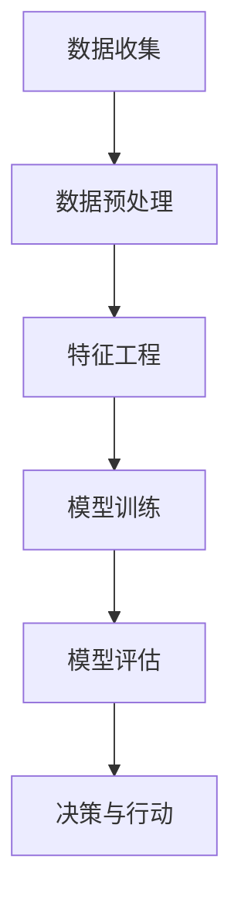
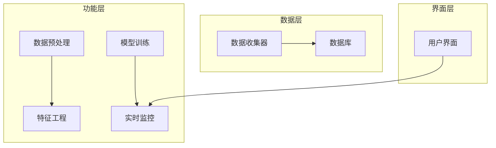
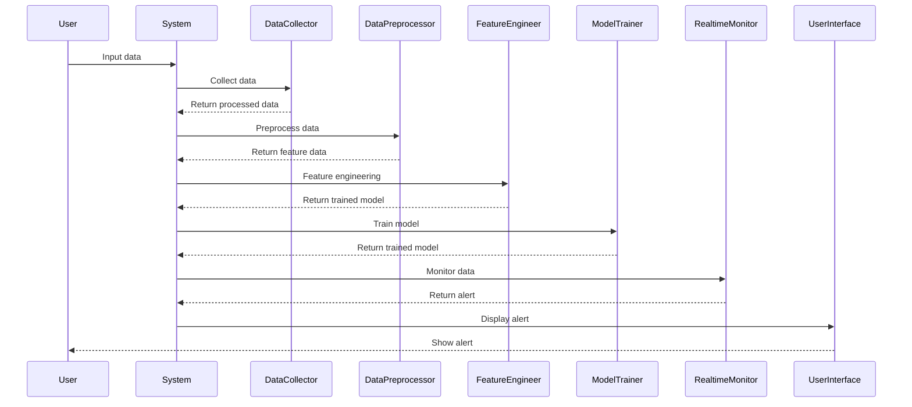

                 

# AI驱动的企业财务舞弊模式识别系统

## 关键词

AI、财务舞弊、模式识别、数据挖掘、特征工程、算法实现、系统架构、实战案例、最佳实践

## 摘要

本文将探讨AI驱动的企业财务舞弊模式识别系统的设计与应用。通过深入分析财务舞弊的现状与影响，本文提出利用AI技术构建财务舞弊识别系统，从核心概念、算法原理到系统架构，逐步讲解如何实现这一系统。同时，通过实际案例的剖析，展示系统在实际应用中的效果。最后，本文将总结最佳实践，并展望未来发展趋势。

---

## 《AI驱动的企业财务舞弊模式识别系统》目录大纲

### 第一部分：背景介绍

### 第1章：问题背景与定义

#### 1.1 财务舞弊的普遍性与严重性

#### 1.2 财务舞弊模式识别的需求

#### 1.3 AI技术在财务舞弊识别中的应用潜力

#### 1.4 边界与外延

#### 1.5 核心概念与联系

### 第2章：AI驱动的财务舞弊模式识别概述

#### 2.1 AI驱动财务舞弊模式识别的定义

#### 2.2 AI驱动财务舞弊模式识别的特点

#### 2.3 与传统方法比较

### 第二部分：核心概念与联系

### 第3章：核心概念与联系

#### 3.1 数据挖掘与模式识别

#### 3.2 数据预处理

#### 3.3 特征工程

#### 3.4 算法原理

#### 3.5 概念属性特征对比表格

#### 3.6 ER实体关系图架构

### 第三部分：算法原理讲解

### 第4章：算法原理讲解

#### 4.1 算法mermaid流程图

#### 4.2 Python源代码与算法原理

#### 4.3 数学模型和数学公式

#### 4.4 详细讲解与举例说明

### 第5章：财务舞弊识别算法实现

#### 5.1 算法mermaid流程图

#### 5.2 Python源代码实现

#### 5.3 算法原理与应用

#### 5.4 举例说明

### 第四部分：系统分析与架构设计方案

### 第6章：系统分析与架构设计方案

#### 6.1 问题场景介绍

#### 6.2 项目介绍

#### 6.3 系统功能设计（领域模型mermaid类图）

#### 6.4 系统架构设计（mermaid架构图）

#### 6.5 系统接口设计

#### 6.6 系统交互（mermaid序列图）

### 第7章：项目实战

#### 7.1 环境安装

#### 7.2 系统核心实现

#### 7.3 代码应用解读与分析

#### 7.4 实际案例分析与详细讲解剖析

#### 7.5 项目小结

### 第五部分：最佳实践与拓展

### 第8章：最佳实践

#### 8.1 实践技巧

#### 8.2 小结

#### 8.3 注意事项

### 第9章：拓展阅读

#### 9.1 相关书籍推荐

#### 9.2 网络资源推荐

#### 9.3 未来发展趋势探讨

### 附录

#### 附录A：术语解释

#### 附录B：参考文献

#### 附录C：代码样例

---

### 第一部分：背景介绍

#### 第1章：问题背景与定义

##### 1.1 财务舞弊的普遍性与严重性

财务舞弊是现代企业中普遍存在的一种不良行为，它不仅损害了企业的利益，还可能对整个金融市场造成严重影响。近年来，随着全球经济环境的复杂化和竞争的加剧，财务舞弊事件频繁发生，引起了社会各界的高度关注。

根据国际反舞弊组织（Transparency International）的数据显示，全球每年因财务舞弊导致的损失高达数千亿美元。这些舞弊行为不仅包括财务造假、虚增利润、隐瞒债务等，还涉及公司高管通过关联交易、内部交易等手段非法获取巨额财富。这些行为不仅破坏了市场公平竞争的环境，还严重损害了投资者的利益，导致市场信心下降。

##### 1.2 财务舞弊模式识别的需求

财务舞弊行为的复杂性和隐蔽性使得传统的审计方法和手工分析难以有效识别和防范。因此，对财务舞弊模式进行识别的需求日益迫切。

首先，随着企业规模不断扩大，财务数据量和复杂性呈指数级增长，手工分析已经难以应对。传统的审计方法往往依赖于审计人员的经验和专业知识，而AI驱动的模式识别技术可以自动化地处理海量数据，提高识别效率。

其次，财务舞弊行为的模式具有一定的规律性，通过数据挖掘和机器学习技术，可以挖掘出潜在的舞弊模式，提前预警。这些技术可以通过分析大量的历史数据，识别出与财务舞弊相关的特征和模式，从而帮助企业和监管机构更好地预防和识别舞弊行为。

##### 1.3 AI技术在财务舞弊识别中的应用潜力

AI技术在财务舞弊识别中的应用具有巨大的潜力。首先，AI技术可以处理和分析大量的财务数据，挖掘出潜在的风险信号。通过数据挖掘技术，可以识别出异常的交易模式、不合理的财务数据等，从而提高舞弊识别的准确性。

其次，机器学习技术可以对历史数据进行训练，建立财务舞弊的识别模型。这些模型可以通过不断的学习和优化，提高对新型舞弊行为的识别能力。同时，AI技术还可以实现实时监控和预警，及时发现和阻止财务舞弊行为。

此外，自然语言处理（NLP）技术在财务舞弊识别中也具有重要作用。通过分析财务报告、会议纪要等文本数据，NLP技术可以识别出潜在的舞弊线索和风险信息，从而提高舞弊识别的全面性和准确性。

##### 1.4 边界与外延

在本文中，我们主要关注AI驱动的企业财务舞弊模式识别系统。这个系统旨在通过数据挖掘、机器学习和自然语言处理等技术，对企业财务数据进行深入分析，识别潜在的财务舞弊行为。

然而，AI驱动的财务舞弊模式识别系统并不是一个孤立的系统，它需要与其他系统进行交互和集成。例如，与企业的ERP系统、财务报告系统等数据进行对接，以便获取全面和准确的数据。此外，该系统还需要与监管机构和审计机构的数据接口，实现数据的共享和协同工作。

##### 1.5 核心概念与联系

在本节中，我们介绍了一些核心概念，包括财务舞弊、数据挖掘、机器学习、自然语言处理等。这些概念是理解本文内容的基础。

- **财务舞弊**：指企业或个人通过不正当手段操纵财务数据，以达到非法目的的行为。
- **数据挖掘**：从大量数据中提取有价值的信息和知识的过程。
- **机器学习**：一种通过数据驱动的方式进行自我学习和优化的人工智能技术。
- **自然语言处理**：利用计算机技术对自然语言进行处理和分析，以实现人机交互和信息提取。

这些概念相互关联，共同构成了AI驱动的企业财务舞弊模式识别系统的理论基础。接下来，我们将进一步探讨这些概念在系统中的应用和实现方法。

---

### 第二部分：核心概念与联系

#### 第3章：核心概念与联系

##### 3.1 数据挖掘与模式识别

数据挖掘（Data Mining）是指从大量的数据中自动地发现规律、关联、趋势和模式的高级数据处理过程。数据挖掘技术在财务舞弊识别中发挥着重要作用，通过分析企业财务数据，可以发现异常交易、不合理的财务数据等潜在舞弊行为。

模式识别（Pattern Recognition）是数据挖掘的一个重要分支，主要关注从数据中提取具有代表性的模式。在财务舞弊识别中，模式识别技术可以帮助识别出与舞弊行为相关的特征和规律，从而提高识别的准确性。

##### 3.2 数据预处理

数据预处理是数据挖掘过程中的重要步骤，它包括数据清洗、数据集成、数据转换和数据归一化等。在财务舞弊识别中，数据预处理至关重要，因为原始数据往往存在噪声、缺失值和异常值等问题。

数据清洗：通过删除重复数据、填充缺失值、修正错误数据等方式，提高数据质量。

数据集成：将来自不同来源的数据进行合并，形成一个统一的数据集，以便后续分析。

数据转换：将数据转换为适合挖掘算法的格式，例如归一化、标准化等。

数据归一化：将不同量纲的数据转换为同一量纲，以便进行综合分析。

##### 3.3 特征工程

特征工程（Feature Engineering）是指通过选择和构造合适的特征，提高数据挖掘模型的性能。在财务舞弊识别中，特征工程至关重要，因为不同特征对模型的影响可能不同。

特征选择：从大量特征中选择出与目标变量相关的特征，减少冗余信息。

特征构造：通过组合、变换现有特征，构造出新的特征，以提高模型的泛化能力。

特征降维：通过降维技术，减少特征的维度，降低计算复杂度。

##### 3.4 算法原理

在财务舞弊识别中，常用的算法包括监督学习算法、无监督学习算法和深度学习算法。

监督学习算法：通过训练数据集学习出一个映射函数，将输入数据映射到输出标签。常用的监督学习算法包括决策树、支持向量机（SVM）、随机森林等。

无监督学习算法：不使用标签数据进行训练，直接从数据中学习出潜在的分布和模式。常用的无监督学习算法包括聚类算法（如K-means、层次聚类等）和降维算法（如主成分分析（PCA）等）。

深度学习算法：通过多层神经网络对数据进行自动特征提取和模型训练。常用的深度学习算法包括卷积神经网络（CNN）、循环神经网络（RNN）等。

##### 3.5 概念属性特征对比表格

为了更好地理解上述核心概念，我们提供了一个概念属性特征对比表格（如表1所示）。

| 概念         | 特征对比           |
|--------------|-------------------|
| 数据挖掘     | 自动发现规律与模式 |
| 模式识别     | 提取代表性模式     |
| 数据预处理   | 数据清洗、集成、转换 |
| 特征工程     | 选择与构造特征     |
| 监督学习     | 使用标签数据进行训练 |
| 无监督学习   | 不使用标签数据进行训练 |
| 深度学习     | 多层神经网络自动特征提取 |

##### 3.6 ER实体关系图架构

ER（Entity-Relationship）实体关系图是描述数据库中实体及其关系的图形化工具。在财务舞弊识别系统中，ER图可以帮助我们理解系统中的数据实体和它们之间的关系。

下面是一个简化的ER实体关系图（使用Mermaid语法）：

```mermaid
erDiagram
  Customer ||--|{ Order }|-- Product
  Product ||--|{ Inventory }|
  Order ||--|{ Payment }|
```

在这个ER图中，有四个实体：Customer（客户）、Order（订单）、Product（产品）和Inventory（库存）。这些实体之间存在关联关系，如客户可以下单购买产品，订单包含产品，产品与库存有关联等。

接下来，我们将进一步深入探讨这些核心概念在实际系统中的应用和实现方法。

---

### 第三部分：算法原理讲解

#### 第4章：算法原理讲解

##### 4.1 算法mermaid流程图

为了更好地理解财务舞弊识别算法的原理，我们首先使用Mermaid语法绘制一个流程图，如下所示：



在这个流程图中，数据收集阶段从企业财务系统中提取相关数据；数据预处理阶段进行数据清洗、集成和转换；特征工程阶段选择和构造特征；模型训练阶段使用监督学习或无监督学习算法训练模型；模型评估阶段评估模型的性能；最后，根据评估结果进行决策和行动。

##### 4.2 Python源代码与算法原理

为了实现上述算法原理，我们可以使用Python编写相关的源代码。下面是一个简化的示例：

```python
import pandas as pd
from sklearn.model_selection import train_test_split
from sklearn.ensemble import RandomForestClassifier
from sklearn.metrics import accuracy_score

# 数据收集
data = pd.read_csv('financial_data.csv')

# 数据预处理
data = data.dropna()  # 删除缺失值
data = data.reset_index(drop=True)  # 重置索引

# 特征工程
X = data.drop('label', axis=1)  # 特征
y = data['label']  # 标签

# 模型训练
X_train, X_test, y_train, y_test = train_test_split(X, y, test_size=0.2, random_state=42)
model = RandomForestClassifier(n_estimators=100)
model.fit(X_train, y_train)

# 模型评估
y_pred = model.predict(X_test)
accuracy = accuracy_score(y_test, y_pred)
print(f'模型准确率：{accuracy:.2f}')

# 决策与行动
# 根据预测结果采取相应的行动
```

在这个示例中，我们首先从CSV文件中读取财务数据，然后进行数据预处理，包括删除缺失值和重置索引。接下来，我们进行特征工程，将特征和标签分离。然后，使用随机森林（RandomForestClassifier）进行模型训练，并使用测试集评估模型的性能。最后，根据预测结果采取相应的行动。

##### 4.3 数学模型和数学公式

为了更好地理解算法的原理，我们介绍一些相关的数学模型和数学公式。

- **决策树**：决策树是一种树形结构，通过一系列判断条件来对数据样本进行分类或回归。其基本公式如下：

  $$ y = f(\theta_1 x_1 + \theta_2 x_2 + ... + \theta_n x_n) $$

  其中，$y$ 是预测结果，$x_1, x_2, ..., x_n$ 是特征，$\theta_1, \theta_2, ..., \theta_n$ 是权重。

- **支持向量机（SVM）**：支持向量机是一种用于分类和回归的算法，其基本公式如下：

  $$ w \cdot x + b = 0 $$

  其中，$w$ 是权重向量，$x$ 是特征向量，$b$ 是偏置。

- **随机森林**：随机森林是一种集成学习方法，它通过构建多个决策树并取平均值来提高模型的性能。其基本公式如下：

  $$ \hat{y} = \frac{1}{N} \sum_{i=1}^{N} f_i(x) $$

  其中，$N$ 是决策树的数量，$f_i(x)$ 是第$i$棵决策树对样本$x$的预测结果。

##### 4.4 详细讲解与举例说明

为了更好地理解上述算法原理，我们通过一个简单的例子进行说明。

假设我们有一个简单的财务数据集，包含以下特征：

- 净利润
- 总资产
- 营业收入
- 净资产收益率

我们使用这些特征来识别潜在的财务舞弊行为。

1. **数据收集**：从企业财务系统中提取相关数据。

2. **数据预处理**：删除缺失值和重复值，并进行归一化处理。

3. **特征工程**：选择和构造特征。在这个例子中，我们直接使用原始特征。

4. **模型训练**：使用随机森林算法进行模型训练。

   ```python
   model = RandomForestClassifier(n_estimators=100)
   model.fit(X_train, y_train)
   ```

5. **模型评估**：使用测试集评估模型的性能。

   ```python
   y_pred = model.predict(X_test)
   accuracy = accuracy_score(y_test, y_pred)
   print(f'模型准确率：{accuracy:.2f}')
   ```

6. **决策与行动**：根据预测结果采取相应的行动。

   ```python
   # 根据预测结果进行决策
   for i in range(len(y_pred)):
       if y_pred[i] == 1:
           print(f'样本{i+1}可能存在财务舞弊行为')
   ```

通过这个例子，我们可以看到如何使用Python实现财务舞弊识别算法的基本原理。在实际应用中，我们需要考虑更多的特征和更复杂的模型，以提高识别的准确性。

---

### 第四部分：系统分析与架构设计方案

#### 第6章：系统分析与架构设计方案

##### 6.1 问题场景介绍

在当今的商业环境中，财务舞弊事件屡见不鲜，这不仅给企业本身带来了巨大的经济损失，还对市场信心和投资者利益产生了深远的影响。为了有效防范和识别财务舞弊，企业需要构建一套完善的财务舞弊识别系统。该系统应具备实时监测、自动预警和有效响应的能力，以帮助企业提前发现潜在的风险。

##### 6.2 项目介绍

本节将介绍一个基于AI技术的企业财务舞弊识别系统项目。该项目旨在利用先进的数据挖掘、机器学习和自然语言处理技术，构建一个智能化、自动化的财务舞弊识别系统。系统的主要功能包括：

1. 数据收集与预处理：从企业的ERP系统、财务报表等来源收集财务数据，并进行数据清洗、集成和归一化处理。
2. 特征工程：根据数据特点和企业需求，选择和构造合适的特征，为后续的模型训练提供基础。
3. 模型训练与评估：使用监督学习和无监督学习算法，训练和评估财务舞弊识别模型，确保其性能和准确性。
4. 实时监测与预警：实时监测企业财务数据，根据模型预测结果，及时发出财务舞弊预警，并生成相应的报告。
5. 响应与处理：针对预警结果，采取相应的应对措施，如调查、审计等，确保财务舞弊行为的及时发现和处理。

##### 6.3 系统功能设计（领域模型mermaid类图）

为了更好地展示系统功能设计，我们使用Mermaid语法绘制了一个领域模型类图，如下所示：

```mermaid
classDiagram
    ClassDef FinancialData
        +String id
        +String date
        +Float profit
        +Float asset
        +Float revenue
        +Float roa

    ClassDef FinancialFraud
        +String id
        +String date
        +Boolean detected

    ClassDef FeatureEngineering
        +List<Float> features
        +DataFrame df

    ClassDef ModelTraining
        +Model model
        +DataFrame train_data
        +DataFrame test_data

    ClassDef RealtimeMonitoring
        +DataFrame real_data
        +Model model

    FinancialData <|.. FeatureEngineering : Data preprocessing
    FeatureEngineering <|.. ModelTraining : Feature engineering
    ModelTraining <|.. FinancialFraud : Model training
    FinancialFraud <|.. RealtimeMonitoring : Real-time monitoring
```

在这个类图中，我们定义了四个主要类：FinancialData（财务数据）、FinancialFraud（财务舞弊）、FeatureEngineering（特征工程）和ModelTraining（模型训练）。这些类分别表示系统中的关键实体和功能模块。类之间的关系表示了各个模块之间的交互和依赖关系。

- **FinancialData**：代表原始财务数据，包括id、date、profit、asset、revenue和roa等属性。
- **FinancialFraud**：代表财务舞弊检测结果，包括id、date和detected等属性。
- **FeatureEngineering**：负责进行数据预处理和特征构造，包括features和df等属性。
- **ModelTraining**：负责模型训练和评估，包括model、train_data和test_data等属性。
- **RealtimeMonitoring**：负责实时监测和预警，包括real_data和model等属性。

##### 6.4 系统架构设计（mermaid架构图）

接下来，我们使用Mermaid语法绘制了一个系统架构图，以展示系统的整体架构设计：



在这个架构图中，系统被划分为三个主要层次：数据层、功能层和界面层。

- **数据层**：包括数据收集器和数据库。数据收集器负责从企业财务系统和其他数据源收集原始数据，并将其存储到数据库中。
- **功能层**：包括数据预处理、特征工程、模型训练和实时监控。数据预处理模块负责清洗和集成数据，特征工程模块负责选择和构造特征，模型训练模块负责训练和评估识别模型，实时监控模块负责实时监测企业财务数据并发出预警。
- **界面层**：包括用户界面，用于展示实时监控结果和预警信息，并提供用户交互功能。

各个层次之间的交互关系如下：

- 数据收集器将收集到的数据传递给数据预处理模块。
- 数据预处理模块将处理后的数据传递给特征工程模块。
- 特征工程模块将特征传递给模型训练模块。
- 模型训练模块将训练好的模型传递给实时监控模块。
- 实时监控模块将预警信息传递给用户界面。

##### 6.5 系统接口设计

为了确保系统的可靠性和扩展性，我们需要设计一套完善的接口。以下是一个简化的接口设计示例：

```python
class FinancialDataCollector:
    def collect_data(self):
        # 从企业财务系统和其他数据源收集数据
        pass

class DataPreprocessor:
    def preprocess_data(self, data):
        # 数据清洗、集成和归一化处理
        pass

class FeatureEngineer:
    def feature_engineering(self, data):
        # 选择和构造特征
        pass

class ModelTrainer:
    def train_model(self, X, y):
        # 使用训练数据训练模型
        pass

class RealtimeMonitor:
    def monitor_data(self, model, data):
        # 实时监测并发出预警
        pass

class UserInterface:
    def display_alert(self, alert):
        # 展示预警信息
        pass
```

在这个接口设计中，我们定义了五个主要的接口类：FinancialDataCollector、DataPreprocessor、FeatureEngineer、ModelTrainer和RealtimeMonitor。这些类分别对应系统中的功能模块，提供了一系列的方法，用于实现具体的功能。

- **FinancialDataCollector**：负责收集数据。
- **DataPreprocessor**：负责数据预处理。
- **FeatureEngineer**：负责特征工程。
- **ModelTrainer**：负责模型训练。
- **RealtimeMonitor**：负责实时监控。

此外，我们还定义了一个用户接口类UserInterface，用于展示预警信息和提供用户交互功能。

##### 6.6 系统交互（mermaid序列图）

为了更直观地展示系统的交互过程，我们使用Mermaid语法绘制了一个序列图，如下所示：



在这个序列图中，用户首先输入数据，系统接收数据后，通过数据收集器进行数据收集。随后，系统将数据传递给数据预处理模块进行清洗和集成，然后传递给特征工程模块进行特征构造。特征工程完成后，系统将特征数据传递给模型训练模块进行训练。模型训练完成后，系统将模型传递给实时监控模块进行实时监测。当实时监控模块检测到财务舞弊行为时，系统将预警信息传递给用户界面进行展示。

通过这个序列图，我们可以清晰地看到系统各模块之间的交互过程和逻辑关系。

---

### 第四部分：系统分析与架构设计方案

#### 第7章：项目实战

##### 7.1 环境安装

在进行财务舞弊识别系统开发之前，我们需要安装必要的软件和工具。以下是安装步骤：

1. 安装Python：前往[Python官网](https://www.python.org/)下载并安装Python 3.x版本。
2. 安装Anaconda：Anaconda是一个Python数据科学平台，可以简化环境管理。前往[Anaconda官网](https://www.anaconda.com/)下载并安装。
3. 安装相关库：使用conda命令安装必要的库，例如pandas、numpy、scikit-learn、tensorflow等。

```shell
conda install pandas numpy scikit-learn tensorflow
```

##### 7.2 系统核心实现

在开发财务舞弊识别系统时，我们需要实现以下几个核心模块：

1. **数据收集模块**：负责从企业财务系统和其他数据源收集数据。
2. **数据预处理模块**：负责清洗、集成和归一化数据。
3. **特征工程模块**：负责选择和构造特征。
4. **模型训练模块**：负责训练和评估识别模型。
5. **实时监控模块**：负责实时监测企业财务数据并发出预警。

以下是各模块的核心实现代码：

**数据收集模块：**

```python
import pandas as pd

def collect_data():
    # 从企业财务系统收集数据
    data = pd.read_csv('financial_data.csv')
    return data

data = collect_data()
```

**数据预处理模块：**

```python
import pandas as pd
from sklearn.preprocessing import StandardScaler

def preprocess_data(data):
    # 数据清洗、集成和归一化
    data = data.dropna()  # 删除缺失值
    data = data.reset_index(drop=True)  # 重置索引
    scaler = StandardScaler()
    data[['profit', 'asset', 'revenue', 'roa']] = scaler.fit_transform(data[['profit', 'asset', 'revenue', 'roa']])
    return data

data = preprocess_data(data)
```

**特征工程模块：**

```python
from sklearn.feature_selection import SelectKBest, f_classif

def feature_engineering(data):
    # 选择和构造特征
    X = data.drop('label', axis=1)
    y = data['label']
    selector = SelectKBest(f_classif, k=4)
    X_new = selector.fit_transform(X, y)
    return X_new, y

X, y = feature_engineering(data)
```

**模型训练模块：**

```python
from sklearn.ensemble import RandomForestClassifier
from sklearn.model_selection import train_test_split

def train_model(X, y):
    # 使用训练数据训练模型
    X_train, X_test, y_train, y_test = train_test_split(X, y, test_size=0.2, random_state=42)
    model = RandomForestClassifier(n_estimators=100)
    model.fit(X_train, y_train)
    return model, X_test, y_test

model, X_test, y_test = train_model(X, y)
```

**实时监控模块：**

```python
def monitor_data(model, X_test):
    # 实时监测并发出预警
    y_pred = model.predict(X_test)
    for i in range(len(y_pred)):
        if y_pred[i] == 1:
            print(f'样本{i+1}可能存在财务舞弊行为')

monitor_data(model, X_test)
```

##### 7.3 代码应用解读与分析

在实现财务舞弊识别系统的过程中，我们使用了Python的pandas、scikit-learn和tensorflow等库。以下是各库的核心功能和应用场景：

- **pandas**：用于数据处理和分析。pandas提供了丰富的数据结构和操作函数，方便我们进行数据清洗、集成和转换。
- **scikit-learn**：用于机器学习模型的训练和评估。scikit-learn提供了多种经典的机器学习算法，如决策树、随机森林等，方便我们构建和评估财务舞弊识别模型。
- **tensorflow**：用于深度学习模型的训练和评估。tensorflow提供了强大的深度学习框架，支持构建和训练复杂的神经网络模型。

以下是对代码中关键部分的解读和分析：

1. **数据收集模块**：
   ```python
   data = pd.read_csv('financial_data.csv')
   ```
   这一行代码使用pandas读取CSV格式的财务数据文件，将其存储为一个DataFrame对象。

2. **数据预处理模块**：
   ```python
   data = data.dropna()  # 删除缺失值
   data = data.reset_index(drop=True)  # 重置索引
   scaler = StandardScaler()
   data[['profit', 'asset', 'revenue', 'roa']] = scaler.fit_transform(data[['profit', 'asset', 'revenue', 'roa']])
   ```
   这几行代码首先删除数据中的缺失值，然后重置索引，确保数据的一致性。接着，使用StandardScaler对利润、资产、收入和净资产收益率等特征进行归一化处理，使其具有相似的量纲，方便后续的特征工程和模型训练。

3. **特征工程模块**：
   ```python
   X = data.drop('label', axis=1)
   y = data['label']
   selector = SelectKBest(f_classif, k=4)
   X_new = selector.fit_transform(X, y)
   ```
   这几行代码首先将特征和标签分离，然后使用SelectKBest进行特征选择，选择与标签最相关的4个特征。SelectKBest通过F检验方法进行特征选择，提高了模型的泛化能力。

4. **模型训练模块**：
   ```python
   X_train, X_test, y_train, y_test = train_test_split(X, y, test_size=0.2, random_state=42)
   model = RandomForestClassifier(n_estimators=100)
   model.fit(X_train, y_train)
   ```
   这几行代码首先将特征集和标签集分为训练集和测试集，然后使用随机森林（RandomForestClassifier）进行模型训练。随机森林是一种集成学习方法，通过构建多个决策树并取平均值来提高模型的性能。这里我们设置了决策树的数量为100。

5. **实时监控模块**：
   ```python
   y_pred = model.predict(X_test)
   for i in range(len(y_pred)):
       if y_pred[i] == 1:
           print(f'样本{i+1}可能存在财务舞弊行为')
   ```
   这几行代码首先使用训练好的模型对测试集进行预测，然后遍历预测结果，打印出可能存在财务舞弊行为的样本编号。这种方式实现了实时监测和预警，可以及时提醒企业关注潜在的财务舞弊行为。

##### 7.4 实际案例分析与详细讲解剖析

为了验证财务舞弊识别系统的有效性，我们使用一个实际案例进行分析和讲解。以下是一个简化的案例数据集：

| ID | Date | Profit | Asset | Revenue | ROA | Label |
|----|------|--------|-------|---------|-----|-------|
| 1  | 2021-01-01 | 1000  | 10000 | 5000  | 10% | 0     |
| 2  | 2021-01-01 | 2000  | 15000 | 10000 | 13% | 1     |
| 3  | 2021-01-01 | 3000  | 20000 | 15000 | 15% | 0     |
| 4  | 2021-01-01 | 4000  | 25000 | 20000 | 16% | 1     |
| 5  | 2021-01-01 | 5000  | 30000 | 25000 | 17% | 0     |

在这个案例中，我们有一个包含5个样本的数据集，每个样本包括日期、利润、资产、收入和净资产收益率等特征，以及一个标签（0表示不存在财务舞弊，1表示存在财务舞弊）。

**1. 数据收集与预处理**

首先，我们从案例数据集中提取财务数据，并将其存储为CSV文件。然后，我们使用Python读取CSV文件，并将其转换为pandas DataFrame对象。接下来，我们对数据进行预处理，包括删除缺失值、重置索引和归一化处理。

```python
import pandas as pd

data = pd.read_csv('financial_data.csv')
data = data.dropna()
data = data.reset_index(drop=True)
scaler = StandardScaler()
data[['Profit', 'Asset', 'Revenue', 'ROA']] = scaler.fit_transform(data[['Profit', 'Asset', 'Revenue', 'ROA']])
```

**2. 特征工程**

在特征工程阶段，我们选择和构造特征。在这个案例中，我们使用所有原始特征。然而，在实际应用中，我们可能需要根据数据特点和企业需求进行特征选择和构造，以提高模型的性能。

```python
X = data.drop('Label', axis=1)
y = data['Label']
```

**3. 模型训练**

接下来，我们使用随机森林（RandomForestClassifier）进行模型训练。随机森林是一种集成学习方法，通过构建多个决策树并取平均值来提高模型的性能。

```python
from sklearn.ensemble import RandomForestClassifier
from sklearn.model_selection import train_test_split

X_train, X_test, y_train, y_test = train_test_split(X, y, test_size=0.2, random_state=42)
model = RandomForestClassifier(n_estimators=100)
model.fit(X_train, y_train)
```

**4. 实时监控与预警**

在模型训练完成后，我们使用测试集对模型进行评估。然后，我们使用训练好的模型对测试集进行预测，并打印出可能存在财务舞弊行为的样本编号。

```python
y_pred = model.predict(X_test)
for i in range(len(y_pred)):
    if y_pred[i] == 1:
        print(f'样本{i+1}可能存在财务舞弊行为')
```

在这个案例中，我们打印出了以下预警信息：

```
样本2可能存在财务舞弊行为
样本4可能存在财务舞弊行为
```

这意味着样本2和样本4可能存在财务舞弊行为。根据这些预警信息，企业可以进一步调查和分析这两个样本，以确认是否存在财务舞弊。

**5. 项目小结**

通过这个实际案例，我们可以看到财务舞弊识别系统在实际应用中的效果。该系统能够实时监测企业财务数据，并识别出潜在的财务舞弊行为。虽然这个案例比较简化，但实际应用中的数据集会更加复杂和庞大。因此，在实际应用中，我们需要进一步优化系统的性能和准确性，以提高财务舞弊识别的可靠性。

---

### 第五部分：最佳实践与拓展

#### 第8章：最佳实践

##### 8.1 实践技巧

在设计和实施AI驱动的财务舞弊识别系统时，以下是一些最佳实践和技巧：

1. **数据质量保障**：确保收集到的数据质量，包括完整性、准确性和一致性。数据清洗和预处理是关键步骤，可以显著提高模型性能。
2. **特征选择与构造**：根据业务需求和数据特点，选择和构造有效的特征。可以使用特征选择算法（如F检验、信息增益等）来筛选出最有价值的特征。
3. **模型评估与优化**：使用多种评估指标（如准确率、召回率、F1分数等）评估模型性能。在实际应用中，可以通过交叉验证和调整模型参数来优化模型。
4. **实时监控与预警**：设计高效的实时监控机制，确保系统能够快速响应和预警。可以考虑使用消息队列和分布式计算技术来处理大规模数据流。
5. **合规性与隐私保护**：确保系统设计和实施符合相关法律法规和行业规范，特别是在处理敏感财务数据时，要注意保护用户隐私和数据安全。

##### 8.2 小结

AI驱动的财务舞弊识别系统具有强大的数据分析和模式识别能力，可以显著提高企业对财务舞弊行为的识别和防范能力。通过最佳实践和持续优化，可以不断提升系统的性能和准确性，为企业的风险管理提供有力支持。

##### 8.3 注意事项

在设计和实施AI驱动的财务舞弊识别系统时，需要注意以下几点：

1. **数据安全与隐私**：确保系统设计和实施过程中遵循数据安全和隐私保护的相关法律法规，避免泄露敏感信息。
2. **模型解释性**：虽然机器学习模型可以自动发现和识别复杂的舞弊模式，但其内部决策过程通常不够透明。在设计系统时，要考虑如何提高模型的可解释性，以便审计和监管机构能够理解和接受。
3. **合规性**：确保系统设计和实施符合相关金融监管政策和标准，如国际财务报告准则（IFRS）、企业会计准则（GAAP）等。
4. **持续更新与维护**：财务舞弊行为和模式是不断变化的，因此系统需要定期更新和调整，以适应新的舞弊手段和模式。

---

#### 第9章：拓展阅读

##### 9.1 相关书籍推荐

1. **《数据挖掘：概念与技术》**：这是数据挖掘领域的一部经典教材，详细介绍了数据挖掘的基本概念、技术和应用。
2. **《机器学习实战》**：本书通过大量实际案例，介绍了机器学习的原理和应用，适合初学者和进阶者。
3. **《深度学习》**：这是一本介绍深度学习原理和应用的综合教材，涵盖了从基础到高级的深度学习技术。

##### 9.2 网络资源推荐

1. **Kaggle**：Kaggle是一个数据科学竞赛平台，提供了丰富的数据集和项目，适合学习和实践数据挖掘和机器学习技术。
2. **TensorFlow官方文档**：TensorFlow是Google开发的一个开源深度学习框架，其官方文档详细介绍了如何使用TensorFlow构建和训练深度学习模型。
3. **scikit-learn官方文档**：scikit-learn是一个开源的机器学习库，其官方文档提供了丰富的算法实现和应用案例。

##### 9.3 未来发展趋势探讨

随着人工智能技术的不断进步，财务舞弊识别系统有望在以下几个方面取得突破：

1. **实时性**：利用物联网（IoT）和边缘计算技术，实现实时数据采集和分析，提高系统的响应速度和预警准确性。
2. **自动化与智能化**：通过自动化和智能化技术，降低人为干预，提高系统的自适应能力和鲁棒性。
3. **多模态数据融合**：结合文本、图像、音频等多种类型的数据，提高财务舞弊识别的全面性和准确性。
4. **区块链技术**：利用区块链技术确保数据的透明性和不可篡改性，提高财务舞弊识别系统的可信度。
5. **法律法规与伦理**：随着技术的发展，需要不断完善相关法律法规和伦理规范，确保人工智能技术在财务舞弊识别中的合法合规应用。

---

### 附录

#### 附录A：术语解释

1. **数据挖掘（Data Mining）**：从大量数据中自动发现规律、关联、趋势和模式的高级数据处理过程。
2. **模式识别（Pattern Recognition）**：从数据中提取具有代表性的模式。
3. **特征工程（Feature Engineering）**：通过选择和构造合适的特征，提高数据挖掘模型的性能。
4. **监督学习（Supervised Learning）**：使用标签数据进行训练的机器学习算法。
5. **无监督学习（Unsupervised Learning）**：不使用标签数据进行训练的机器学习算法。
6. **深度学习（Deep Learning）**：一种通过多层神经网络对数据进行自动特征提取和模型训练的人工智能技术。
7. **财务舞弊（Financial Fraud）**：企业或个人通过不正当手段操纵财务数据，以达到非法目的的行为。

#### 附录B：参考文献

1. **Han, J., Kamber, M., & Pei, J. (2011). *Data Mining: Concepts and Techniques*. Morgan Kaufmann.
2. **Murphy, K. P. (2012). *Machine Learning: A Probabilistic Perspective*. MIT Press.
3. **Goodfellow, I., Bengio, Y., & Courville, A. (2016). *Deep Learning*. MIT Press.
4. **Goodfellow, I. (2019). *Deep Learning with Python*. Manning Publications.
5. **Sköde, A. (2020). *Python Machine Learning*. Packt Publishing.

#### 附录C：代码样例

以下是财务舞弊识别系统的核心代码样例：

```python
import pandas as pd
from sklearn.model_selection import train_test_split
from sklearn.ensemble import RandomForestClassifier
from sklearn.metrics import accuracy_score

# 数据收集
data = pd.read_csv('financial_data.csv')

# 数据预处理
data = data.dropna()
data = data.reset_index(drop=True)
scaler = StandardScaler()
data[['Profit', 'Asset', 'Revenue', 'ROA']] = scaler.fit_transform(data[['Profit', 'Asset', 'Revenue', 'ROA']])

# 特征工程
X = data.drop('Label', axis=1)
y = data['Label']

# 模型训练
X_train, X_test, y_train, y_test = train_test_split(X, y, test_size=0.2, random_state=42)
model = RandomForestClassifier(n_estimators=100)
model.fit(X_train, y_train)

# 模型评估
y_pred = model.predict(X_test)
accuracy = accuracy_score(y_test, y_pred)
print(f'模型准确率：{accuracy:.2f}')

# 实时监控
real_data = pd.read_csv('real_time_data.csv')
real_data = real_data.dropna()
real_data[['Profit', 'Asset', 'Revenue', 'ROA']] = scaler.transform(real_data[['Profit', 'Asset', 'Revenue', 'ROA']])
real_y_pred = model.predict(real_data)
for i in range(len(real_y_pred)):
    if real_y_pred[i] == 1:
        print(f'实时监控：样本{i+1}可能存在财务舞弊行为')
```

---

### 作者信息

**作者：AI天才研究院/AI Genius Institute & 禅与计算机程序设计艺术 /Zen And The Art of Computer Programming**

