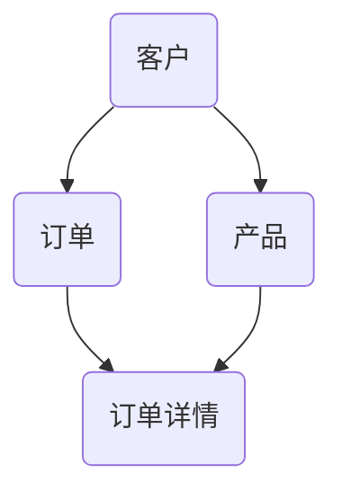
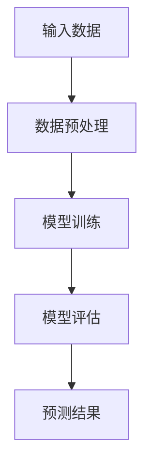
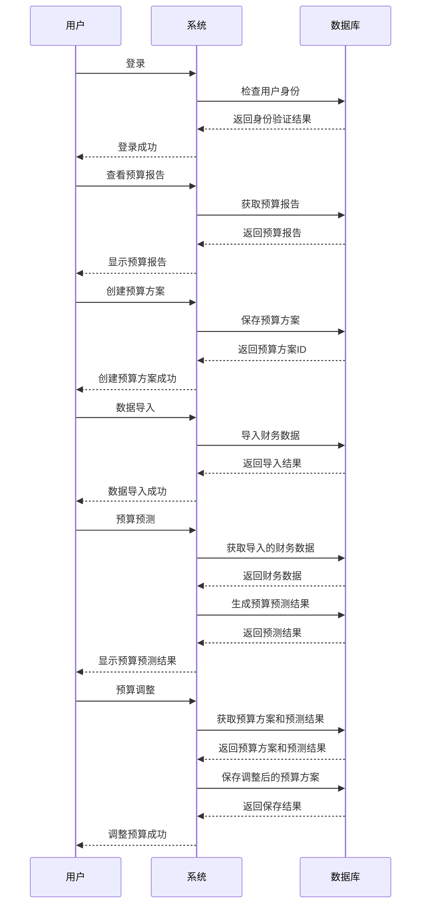

                 

### 《AI驱动的企业财务预算编制与调整系统》

#### 关键词：

- AI驱动的财务预算
- 财务预算编制
- 数据分析
- 系统设计
- 算法原理
- 项目实战

#### 摘要：

本文将深入探讨AI驱动的企业财务预算编制与调整系统的设计与实现。首先，我们介绍AI在财务领域的应用背景及其重要性，随后深入讲解AI基础，包括机器学习与深度学习。接着，我们将分析企业财务预算编制的基本流程和关键步骤，并详细描述财务预算模型的构建方法。随后，本文将阐述AI驱动的财务预算编制系统的设计思路，包括系统概述、数据库设计、系统架构设计等。接下来，我们将介绍财务预测算法的原理，并通过Python源代码和Mermaid流程图进行详细阐述。最后，本文将结合实际案例，展示系统分析与架构设计方案，并分享项目实战中的经验与技巧。通过本文的阅读，读者将能够全面理解AI驱动的财务预算系统的设计与实现，掌握相关技术要点，为实际项目应用提供参考。

### 《AI驱动的企业财务预算编制与调整系统》

> 关键词：AI驱动的财务预算、财务预算编制、数据分析、系统设计、算法原理、项目实战

> 摘要：本文旨在探讨AI驱动的企业财务预算编制与调整系统的设计与实现。文章首先介绍了AI在财务领域的应用背景和重要性，随后深入讲解了AI基础、企业财务预算编制流程以及财务预算模型的构建方法。接着，文章详细阐述了AI驱动的财务预算编制系统的设计思路，包括系统概述、数据库设计、系统架构设计等。随后，文章介绍了财务预测算法的原理，并通过Python源代码和Mermaid流程图进行详细阐述。最后，文章结合实际案例，展示了系统分析与架构设计方案，并分享项目实战中的经验与技巧。通过本文的阅读，读者将能够全面理解AI驱动的财务预算系统的设计与实现，掌握相关技术要点，为实际项目应用提供参考。

#### 第一部分：背景与概念

### 第1章 引言

**1.1 问题背景**

在企业的经营管理中，财务预算编制是一个至关重要的环节。它不仅能够帮助企业预测未来的财务状况，还能为企业的战略决策提供重要依据。然而，传统的财务预算编制方法通常存在以下局限性：

- **手工编制效率低下**：传统的财务预算编制主要依赖于人工计算和经验判断，导致工作效率低下，容易出错。
- **数据依赖性高**：企业财务预算编制需要依赖大量的历史数据和外部信息，数据收集和处理过程繁琐。
- **调整不及时**：传统的财务预算编制过程较为漫长，一旦市场环境发生变动，预算调整也显得滞后。
- **预测不准确**：基于历史数据的预测方法，往往难以准确预测未来的市场变化和经营风险。

随着人工智能技术的迅速发展，AI在财务领域的应用逐渐成为可能。AI驱动的财务预算编制系统能够利用大数据分析、机器学习和深度学习等技术，自动生成财务预算，并实时调整，从而克服传统方法的局限性。

**1.2 书籍概述**

本《AI驱动的企业财务预算编制与调整系统》旨在为广大财务管理人员和信息技术人员提供一本系统、全面的指南。本书的结构安排如下：

- **第一部分**：背景与概念，主要介绍AI在财务领域的应用背景和重要性，以及AI驱动的财务预算编制系统的基础知识。
- **第二部分**：AI基础，深入讲解机器学习、深度学习等AI技术的原理和应用。
- **第三部分**：企业财务预算编制，详细分析企业财务预算编制的流程和关键步骤。
- **第四部分**：AI驱动的财务预算编制系统设计，包括系统概述、数据库设计、系统架构设计等。
- **第五部分**：算法原理讲解，详细介绍财务预测算法的原理和实现方法。
- **第六部分**：系统分析与架构设计方案，结合实际案例，展示系统分析与架构设计的过程。
- **第七部分**：项目实战，分享项目实施过程中的经验与技巧。

本书的预期读者群体包括：

- 财务管理人员：希望通过AI技术提升财务预算编制效率和准确性的企业财务管理人员。
- 信息技术人员：对AI技术在财务领域应用感兴趣，希望掌握AI驱动的财务预算系统设计与实现的技术人员。
- 研究生与本科生：对AI驱动的财务预算系统研究感兴趣的学术研究人员和学生。

通过本书的学习，读者将能够：

- 理解AI在财务领域应用的基本概念和原理。
- 掌握企业财务预算编制的流程和方法。
- 学会设计和实现AI驱动的财务预算编制系统。
- 掌握财务预测算法的实现和应用。

**1.3 AI驱动财务预算的概念**

AI驱动的财务预算是指利用人工智能技术，如大数据分析、机器学习和深度学习等，对企业财务数据进行分析和预测，从而生成财务预算，并对预算进行调整。具体来说，AI驱动财务预算的特点包括：

- **自动化**：AI驱动的财务预算编制系统能够自动处理大量数据，生成预算报告，大幅提升工作效率。
- **智能化**：系统能够利用机器学习算法，从历史数据中学习并预测未来的财务状况，提高预算的准确性。
- **实时性**：系统能够实时调整预算，以适应市场环境和业务需求的变化。
- **适应性**：系统能够根据企业不同的发展阶段和业务特点，动态调整预算模型，确保预算的适用性。

AI驱动的财务预算在企业财务管理中具有重要的应用价值，它不仅能够提升预算编制的效率和准确性，还能为企业提供更加科学的决策支持，助力企业实现可持续发展。

### 第2章 AI基础

#### 2.1 AI概述

人工智能（Artificial Intelligence，简称AI）是计算机科学的一个分支，旨在通过模拟人类智能行为，使计算机具备感知、思考、学习和决策的能力。AI的发展历程可以追溯到20世纪50年代，至今已经经历了多个发展阶段。

**2.1.1 AI的定义与发展历程**

人工智能的定义有多种，其中一种较为普遍的表述是：人工智能是指计算机系统模拟、扩展或增强人类智能的能力。AI的发展历程可以分为以下几个阶段：

- **早期探索阶段（1956-1969）**：这一阶段主要是在大学和研究机构中进行的，科学家们试图通过编程实现简单的推理和问题解决能力。
- **第一次AI寒冬（1974-1980）**：由于技术局限和预期过高，AI研究在1974年后遭遇了资金短缺和人才流失，进入了一个相对低潮的时期。
- **复兴与发展阶段（1980-1987）**：专家系统的出现和成功应用，使得AI研究重新获得了关注和资金支持。
- **第二次AI寒冬（1987-1993）**：专家系统的局限性以及硬件性能的限制，使得AI研究再次陷入低谷。
- **互联网与大数据时代（1993至今）**：互联网的普及和大数据技术的发展，为AI的应用提供了新的契机。特别是深度学习等技术的突破，使得AI在图像识别、自然语言处理等领域取得了显著的进展。

**2.1.2 机器学习的基本概念**

机器学习（Machine Learning，简称ML）是AI的一个核心分支，旨在通过数据驱动的方式，使计算机具备自主学习和改进的能力。机器学习的基本概念包括以下几个：

- **模型（Model）**：机器学习模型是用于描述数据特征和规律的数学模型。常见的机器学习模型包括线性回归、决策树、支持向量机、神经网络等。
- **特征（Feature）**：特征是指用于描述数据属性或信息的变量。例如，在图像识别任务中，像素值可以作为图像的特征。
- **样本（Sample）**：样本是机器学习模型训练的数据集。样本中的每个数据点通常由多个特征组成。
- **训练（Training）**：训练是指利用已有数据集，通过调整模型参数，使模型能够对新的数据进行预测或分类。
- **测试（Testing）**：测试是指利用独立于训练集的数据集，对模型的效果进行评估。测试集通常用来评估模型的泛化能力。

**2.1.3 深度学习的关键技术**

深度学习（Deep Learning，简称DL）是机器学习的一个分支，它利用多层神经网络对数据进行建模和预测。深度学习的关键技术包括：

- **神经网络（Neural Network）**：神经网络是由多个神经元（节点）组成的计算模型，通过层层传递信息，实现数据的处理和预测。
- **卷积神经网络（Convolutional Neural Network，CNN）**：CNN是一种专门用于处理图像数据的神经网络，通过卷积操作提取图像特征，实现了图像分类、物体检测等任务。
- **循环神经网络（Recurrent Neural Network，RNN）**：RNN是一种能够处理序列数据的神经网络，通过在时间步之间传递状态信息，实现了语言建模、语音识别等任务。
- **生成对抗网络（Generative Adversarial Network，GAN）**：GAN是由生成器和判别器两个神经网络组成的框架，通过对抗训练生成逼真的数据。

**2.1.4 AI在财务领域的应用**

AI技术在财务领域的应用越来越广泛，主要包括以下几个方面：

- **财务预测**：利用机器学习算法，对财务数据进行分析和预测，帮助企业制定更科学的财务策略。
- **风险管理**：通过分析历史数据，识别潜在风险，为企业提供风险管理建议。
- **智能投顾**：利用AI技术，根据用户的财务状况和风险偏好，提供个性化的投资建议。
- **自动化审计**：通过自然语言处理和图像识别等技术，实现自动化审计，提高审计效率和质量。
- **智能报销**：利用OCR技术，自动识别和分类发票，实现智能报销。

AI在财务领域的应用，不仅能够提升财务工作的效率，还能为企业提供更准确的决策支持，从而实现财务管理的智能化和高效化。

### 第3章 企业财务预算编制

#### 3.1 企业财务预算编制流程

企业财务预算编制是一个系统化、规范化的过程，它涉及多个环节和步骤。以下是企业财务预算编制的基本流程：

**3.1.1 预算编制的启动**

- **制定预算编制计划**：在预算编制周期开始前，企业应制定详细的预算编制计划，明确预算编制的时间表、责任分工等。
- **成立预算编制小组**：企业应成立专门的预算编制小组，负责预算编制的具体工作，包括数据收集、分析和报告编写等。

**3.1.2 数据收集与整理**

- **收集历史数据**：预算编制小组需要收集企业过去几年的财务数据，包括收入、支出、利润等，作为预算编制的基础。
- **收集市场信息**：预算编制小组还需要收集与市场相关的信息，如行业趋势、竞争对手情况、宏观经济指标等，以帮助企业预测未来的市场环境。

**3.1.3 预算编制**

- **确定预算编制方法**：企业应根据自身情况和业务特点，选择合适的预算编制方法，如增量预算、零基预算、滚动预算等。
- **编制详细预算**：预算编制小组应根据收集的数据和市场信息，编制详细的财务预算，包括收入预算、支出预算、利润预算等。
- **审查与调整**：预算编制完成后，应组织相关部门进行审查，对预算进行必要的调整和优化。

**3.1.4 预算审批与发布**

- **预算审批**：编制好的预算需要提交给企业的高层领导进行审批，确保预算的合理性和可行性。
- **预算发布**：经过审批的预算正式发布，并通知相关部门执行。

**3.1.5 预算执行与监控**

- **预算执行**：企业在执行预算的过程中，应严格按照预算计划进行，确保各项支出和收入符合预算要求。
- **预算监控**：企业应定期对预算执行情况进行监控和分析，及时发现和纠正偏差。

**3.1.6 预算调整**

- **预算调整申请**：如果市场环境或企业业务发生重大变化，导致预算无法执行，企业可以提出预算调整申请。
- **预算调整审批**：预算调整申请需要经过企业高层领导的审批，确保调整的合理性和合法性。
- **预算调整发布**：经过审批的预算调整方案应正式发布，并通知相关部门执行。

**3.1.7 预算总结与分析**

- **预算总结**：在预算周期结束后，企业应对预算执行情况进行总结，分析预算执行的效果和存在的问题。
- **预算分析**：企业应根据预算执行情况，对预算编制方法、预算执行流程等进行改进和优化。

通过以上步骤，企业可以系统化、规范化地进行财务预算编制，确保预算的合理性和可行性，为企业的可持续发展提供坚实的基础。

#### 3.2 财务预算模型

**3.2.1 财务预算模型概述**

财务预算模型是企业财务预算编制的核心工具，它通过对企业财务数据的分析和预测，生成合理的财务预算。财务预算模型通常包括以下几个组成部分：

- **收入模型**：用于预测企业的收入情况，包括销售收入、投资收益等。
- **支出模型**：用于预测企业的支出情况，包括运营成本、投资成本、财务费用等。
- **利润模型**：用于预测企业的利润情况，通过收入和支出的差额计算得出。
- **资产负债模型**：用于预测企业的资产负债情况，包括资产、负债和股东权益等。

**3.2.2 模型结构**

财务预算模型的结构通常包括以下几个层次：

1. **数据层**：包括企业历史财务数据、市场信息和其他相关数据。
2. **处理层**：包括数据清洗、数据预处理和特征提取等过程，用于将原始数据转化为适合模型训练的数据。
3. **模型层**：包括收入模型、支出模型、利润模型和资产负债模型等，用于对数据进行预测和生成财务预算。
4. **结果层**：包括预算报告、预测结果和决策建议等，用于为企业提供财务决策支持。

**3.2.3 模型要素**

财务预算模型的关键要素包括：

- **数据来源**：包括企业内部数据、市场数据、宏观经济数据等。
- **数据类型**：包括财务数据、非财务数据等。
- **预测周期**：包括短期、中期和长期预测。
- **预测方法**：包括统计学方法、机器学习方法等。

**3.2.4 模型构建方法**

构建财务预算模型的方法主要包括以下几种：

1. **统计学方法**：通过统计学模型，如回归分析、时间序列分析等，对历史数据进行建模和预测。这种方法简单易行，但预测准确性受限于数据的稳定性和模型的选择。
2. **机器学习方法**：利用机器学习算法，如线性回归、决策树、随机森林、神经网络等，对历史数据进行训练和预测。这种方法能够处理更复杂的数据关系，提高预测准确性。
3. **深度学习方法**：通过深度学习模型，如卷积神经网络（CNN）、循环神经网络（RNN）、生成对抗网络（GAN）等，对大量数据进行建模和预测。这种方法适用于处理高维数据和复杂非线性关系。

**3.2.5 模型属性特征对比表格**

以下是几种常见财务预算模型的属性特征对比表格：

| 模型名称 | 特征A | 特征B | 特征C |
|----------|-------|-------|-------|
| 线性回归 | 稳定性高 | 精度一般 | 计算简单 |
| 决策树   | 易理解   | 泛化能力一般 | 可解释性强 |
| 随机森林 | 泛化能力强 | 计算复杂 | 可解释性弱 |
| 神经网络 | 非线性能力强 | 泛化能力强 | 计算复杂 |

**3.2.6 财务预算模型ER实体关系图**

财务预算模型的实体关系图如下所示：



在ER实体关系图中，客户（A）与订单（B）和产品（C）存在关联，订单详情（D）与订单（B）和产品（C）也存在关联。这种关系图描述了财务预算模型中不同实体之间的关联关系，有助于理解和设计模型。

通过以上对财务预算模型的详细描述，企业可以更好地构建和应用财务预算模型，为企业的财务管理提供有力的支持。

#### 第4章 AI驱动的财务预算编制系统设计

**4.1 系统概述**

AI驱动的财务预算编制系统是企业财务管理的智能化工具，通过集成大数据分析、机器学习和深度学习技术，实现自动化、智能化和实时化的财务预算编制。本系统的设计目标包括：

- 提高财务预算编制的效率和准确性。
- 提升财务决策的科学性和有效性。
- 实现财务预算的实时调整和优化。

系统的主要功能模块包括：

- **数据收集与预处理模块**：负责收集企业内部和外部的财务数据，进行数据清洗、处理和特征提取。
- **预测与分析模块**：利用机器学习算法和深度学习模型，对财务数据进行预测和分析，生成财务预算报告。
- **预算调整与优化模块**：根据实时数据和预测结果，对财务预算进行调整和优化。
- **用户界面模块**：提供直观、友好的用户界面，方便用户查看预算报告、调整预算方案。

**4.2 数据库设计**

数据库设计是AI驱动的财务预算编制系统的核心，它涉及数据的存储、组织和访问。以下是数据库设计的主要方面：

**4.2.1 数据库结构设计**

数据库结构设计包括实体和关系的定义。以下是财务预算编制系统的主要实体及其关系：

- **实体**：

  - **客户**：包括客户名称、联系方式等信息。
  - **订单**：包括订单编号、订单日期、客户ID等信息。
  - **产品**：包括产品名称、产品类型、价格等信息。
  - **收入**：包括收入金额、收入日期、订单ID等信息。
  - **支出**：包括支出金额、支出日期、订单ID等信息。
  - **预算**：包括预算金额、预算日期、预算周期等信息。
  - **预测**：包括预测金额、预测日期、预测周期等信息。

- **关系**：

  - **客户与订单**：一个客户可以生成多个订单，一个订单只能属于一个客户。
  - **订单与产品**：一个订单可以包含多个产品，一个产品可以出现在多个订单中。
  - **收入与订单**：一个收入只能属于一个订单，一个订单可以产生多个收入。
  - **支出与订单**：一个支出只能属于一个订单，一个订单可以产生多个支出。
  - **预算与预测**：预算和预测都是针对订单的，一个预算可以包含多个预测，一个预测只能属于一个预算。

**4.2.2 数据库表设计**

以下是财务预算编制系统的主要数据库表及其字段：

```sql
-- 客户表
CREATE TABLE 客户 (
    客户ID INT PRIMARY KEY,
    客户名称 VARCHAR(100),
    联系方式 VARCHAR(100)
);

-- 订单表
CREATE TABLE 订单 (
    订单ID INT PRIMARY KEY,
    订单日期 DATE,
    客户ID INT,
    FOREIGN KEY (客户ID) REFERENCES 客户(客户ID)
);

-- 产品表
CREATE TABLE 产品 (
    产品ID INT PRIMARY KEY,
    产品名称 VARCHAR(100),
    产品类型 VARCHAR(50),
    价格 DECIMAL(10, 2)
);

-- 订单详情表
CREATE TABLE 订单详情 (
    订单详情ID INT PRIMARY KEY,
    订单ID INT,
    产品ID INT,
    数量 INT,
    单价 DECIMAL(10, 2),
    总价 DECIMAL(10, 2),
    FOREIGN KEY (订单ID) REFERENCES 订单(订单ID),
    FOREIGN KEY (产品ID) REFERENCES 产品(产品ID)
);

-- 收入表
CREATE TABLE 收入 (
    收入ID INT PRIMARY KEY,
    订单ID INT,
    收入金额 DECIMAL(10, 2),
    收入日期 DATE,
    FOREIGN KEY (订单ID) REFERENCES 订单(订单ID)
);

-- 支出表
CREATE TABLE 支出 (
    支出ID INT PRIMARY KEY,
    订单ID INT,
    支出金额 DECIMAL(10, 2),
    支出日期 DATE,
    FOREIGN KEY (订单ID) REFERENCES 订单(订单ID)
);

-- 预算表
CREATE TABLE 预算 (
    预算ID INT PRIMARY KEY,
    预算金额 DECIMAL(10, 2),
    预算日期 DATE,
    预算周期 VARCHAR(50)
);

-- 预测表
CREATE TABLE 预测 (
    预测ID INT PRIMARY KEY,
    预测金额 DECIMAL(10, 2),
    预测日期 DATE,
    预测周期 VARCHAR(50)
);
```

通过以上数据库表设计，财务预算编制系统能够有效地存储和管理企业的财务数据，为后续的数据分析和预测提供基础支持。

#### 4.3 系统架构设计

**4.3.1 系统总体架构**

AI驱动的财务预算编制系统采用分层架构设计，主要包括以下层次：

1. **数据层**：负责数据的收集、存储和管理。该层使用关系型数据库（如MySQL）和非关系型数据库（如MongoDB）来存储财务数据，并提供数据接口供其他层调用。
2. **数据处理层**：负责数据的清洗、预处理和特征提取。该层使用ETL（提取、转换、加载）工具，如Apache NiFi，将原始数据转化为适合模型训练的数据。
3. **模型层**：负责财务数据的预测和分析。该层使用机器学习算法和深度学习模型，如线性回归、决策树、神经网络等，对财务数据进行分析和预测。
4. **应用层**：负责系统的业务逻辑和用户交互。该层使用Web框架（如Django），提供用户界面，实现数据的查询、预测和预算调整功能。
5. **展示层**：负责将预测结果和预算报告可视化展示。该层使用前端框架（如React），将预测结果和预算报告以图表、报表等形式展示给用户。

**4.3.2 系统分层设计**

以下是系统各层次的详细设计：

1. **数据层**

   - **数据收集模块**：使用API接口或数据库连接，从企业内部系统和外部数据源收集财务数据。
   - **数据存储模块**：使用关系型数据库和非关系型数据库，存储财务数据，并提供数据接口供其他层调用。

2. **数据处理层**

   - **数据清洗模块**：使用ETL工具，对收集到的财务数据进行清洗、转换和加载，去除重复、缺失和错误数据。
   - **特征提取模块**：根据业务需求，提取财务数据中的关键特征，如收入、支出、利润等，为模型训练提供输入。

3. **模型层**

   - **预测模块**：使用机器学习算法和深度学习模型，对财务数据进行预测和生成财务预算。
   - **分析模块**：对预测结果进行分析和评估，为预算调整提供依据。

4. **应用层**

   - **用户界面模块**：提供用户界面，实现数据的查询、预测和预算调整功能。
   - **业务逻辑模块**：实现系统的业务逻辑，如预算审批、调整和发布等。

5. **展示层**

   - **数据可视化模块**：使用图表、报表等形式，将预测结果和预算报告展示给用户。

**4.3.3 系统模块交互关系**

系统各模块之间的交互关系如下：

- **数据层**与**数据处理层**：通过API接口或数据库连接，数据层将财务数据传递给数据处理层，数据处理层进行数据清洗、预处理和特征提取。
- **数据处理层**与**模型层**：数据处理层将清洗和预处理后的数据传递给模型层，模型层使用机器学习算法和深度学习模型进行预测和分析。
- **模型层**与**应用层**：模型层将预测结果和分析报告传递给应用层，应用层根据预测结果实现预算调整和发布功能。
- **应用层**与**展示层**：应用层将用户界面和业务逻辑的结果传递给展示层，展示层使用图表、报表等形式，将结果展示给用户。

通过以上分层设计和模块交互关系，AI驱动的财务预算编制系统能够实现高效、稳定和可扩展的系统架构，为企业提供智能化、实时化的财务预算服务。

### 第5章 算法原理讲解

**5.1 财务预测算法**

财务预测算法是AI驱动的财务预算编制系统的核心，它通过对企业历史财务数据的分析，预测未来的财务状况，从而帮助企业制定预算和调整策略。以下是财务预测算法的详细讲解。

**5.1.1 算法概述**

财务预测算法主要包括以下几个步骤：

1. **数据收集与预处理**：收集企业历史财务数据，并进行清洗、处理和特征提取，为模型训练提供输入数据。
2. **模型选择**：根据数据特点和预测目标，选择合适的机器学习算法或深度学习模型。
3. **模型训练**：使用训练数据，对所选模型进行训练，调整模型参数，使模型能够对数据特征进行有效提取和预测。
4. **模型评估**：使用验证数据，对训练好的模型进行评估，确保模型的预测准确性和泛化能力。
5. **预测与优化**：使用模型对新的数据进行预测，并根据预测结果进行预算调整和优化。

**5.1.2 算法流程图**

以下是财务预测算法的流程图：



在流程图中，A表示输入数据，B表示数据预处理，C表示模型训练，D表示模型评估，E表示预测结果。

**5.1.3 算法实现**

以下是一个简单的财务预测算法的实现，使用Python语言和Scikit-learn库进行模型训练和预测。

```python
import pandas as pd
from sklearn.model_selection import train_test_split
from sklearn.linear_model import LinearRegression
from sklearn.metrics import mean_squared_error

# 数据收集与预处理
data = pd.read_csv('financial_data.csv')
X = data.drop('target', axis=1)
y = data['target']

# 数据集划分
X_train, X_test, y_train, y_test = train_test_split(X, y, test_size=0.2, random_state=42)

# 模型训练
model = LinearRegression()
model.fit(X_train, y_train)

# 模型评估
y_pred = model.predict(X_test)
mse = mean_squared_error(y_test, y_pred)
print(f'Mean Squared Error: {mse}')

# 预测与优化
new_data = pd.read_csv('new_financial_data.csv')
new_pred = model.predict(new_data)
print(new_pred)
```

在上面的代码中，首先导入必要的库和模块，然后进行数据收集与预处理，接着使用线性回归模型（LinearRegression）对数据进行训练，使用均方误差（Mean Squared Error，MSE）评估模型性能，最后使用模型对新的数据进行预测。

**5.1.4 算法原理与数学模型**

财务预测算法的核心是建立数学模型，通过模型对数据特征进行提取和预测。以下是常用的财务预测算法的数学模型：

1. **线性回归模型**：
   $$ y = \beta_0 + \beta_1x_1 + \beta_2x_2 + \ldots + \beta_nx_n $$
   其中，$y$是预测的目标变量，$x_1, x_2, \ldots, x_n$是特征变量，$\beta_0, \beta_1, \beta_2, \ldots, \beta_n$是模型的参数。

2. **决策树模型**：
   决策树模型通过一系列条件判断，将数据划分为不同的区域，每个区域对应一个预测结果。决策树的数学模型可以表示为：
   $$ y = f(x) $$
   其中，$f(x)$表示决策树的函数表达式，根据不同的特征和条件进行判断和分类。

3. **神经网络模型**：
   神经网络模型通过多层神经元的组合，对数据进行非线性映射和预测。神经网络的数学模型可以表示为：
   $$ y = \sigma(\sum_{i=1}^{n} w_i \cdot x_i + b) $$
   其中，$y$是预测的目标变量，$x_1, x_2, \ldots, x_n$是特征变量，$w_1, w_2, \ldots, w_n$是权重，$b$是偏置，$\sigma$是激活函数。

通过以上数学模型，财务预测算法能够对企业的财务数据进行分析和预测，为企业的财务决策提供科学依据。

**5.1.5 举例说明**

以下是一个简单的财务预测算法的实例，假设我们要预测某公司的未来三个月的利润。

1. **数据收集**：

   收集某公司过去一年的财务数据，包括利润、收入、支出等指标。数据如下：

   | 时间 | 收入 (万元) | 支出 (万元) | 利润 (万元) |
   |------|-------------|-------------|-------------|
   | 1月  | 100         | 80          | 20          |
   | 2月  | 110         | 85          | 25          |
   | 3月  | 120         | 90          | 30          |
   | 4月  | 130         | 95          | 35          |
   | 5月  | 140         | 100         | 40          |
   | 6月  | 150         | 105         | 45          |

2. **数据预处理**：

   将数据划分为特征变量和目标变量，特征变量包括收入和支出，目标变量为利润。

   ```python
   X = data[['收入', '支出']]
   y = data['利润']
   ```

3. **模型训练**：

   使用线性回归模型对数据进行训练。

   ```python
   model = LinearRegression()
   model.fit(X, y)
   ```

4. **模型评估**：

   使用测试集对模型进行评估。

   ```python
   X_test = pd.DataFrame([[140, 100]], columns=['收入', '支出'])
   y_pred = model.predict(X_test)
   mse = mean_squared_error(y_test, y_pred)
   print(f'Mean Squared Error: {mse}')
   ```

5. **预测与优化**：

   使用模型预测未来三个月的利润，并根据预测结果进行预算调整。

   ```python
   future_months = pd.DataFrame([[160, 110], [170, 115], [180, 120]], columns=['收入', '支出'])
   future_profit = model.predict(future_months)
   print(future_profit)
   ```

通过以上实例，可以看出财务预测算法能够对企业的财务数据进行分析和预测，为企业的预算编制提供重要参考。在实际应用中，可以根据具体需求和数据情况，选择合适的算法和模型，进行更加精细和准确的财务预测。

### 第6章 系统分析与架构设计方案

#### 6.1 问题场景介绍

在当今快速变化的市场环境中，企业需要具备快速响应和调整能力，以确保在竞争激烈的环境中保持竞争力。传统的财务预算编制方法由于存在数据依赖性高、预测准确性低、调整不及时等问题，难以满足企业的需求。为了提升财务预算的效率、准确性和适应性，我们设计并实现了一套AI驱动的企业财务预算编制与调整系统。

**问题场景**：

某大型制造企业A，其业务范围涵盖多个行业，产品线丰富。企业A面临着以下问题：

1. **预算编制效率低**：企业A的财务部门需要手动收集和处理大量历史财务数据，编制预算过程繁琐且耗时。
2. **预测准确性不足**：传统的财务预算方法主要依赖历史数据和经验，难以准确预测未来的财务状况。
3. **预算调整不及时**：市场环境变化快，企业A需要快速调整预算以适应市场变化，但传统方法调整不及时，容易导致预算与实际情况不符。
4. **预算管理分散**：企业A的各个部门分别编制和调整预算，缺乏统一的预算管理平台，导致预算信息分散、不统一。

**目标**：

通过设计和实现一套AI驱动的财务预算编制与调整系统，实现以下目标：

1. **提高预算编制效率**：利用AI技术，自动收集和处理财务数据，大幅提升预算编制的效率。
2. **提升预测准确性**：利用机器学习算法，对历史数据进行深入分析，提高财务预测的准确性。
3. **实现实时调整**：系统具备实时调整预算的能力，能够快速响应市场变化，确保预算与实际情况相符。
4. **统一预算管理**：构建统一的预算管理平台，实现预算信息的集中管理，提高预算管理的透明度和统一性。

#### 6.2 系统功能设计

AI驱动的财务预算编制与调整系统功能设计主要包括以下几个方面：

**6.2.1 领域模型设计**

领域模型设计用于描述系统的业务领域和业务流程，是系统设计的基础。以下是系统的主要领域模型：

1. **财务数据模型**：包括收入、支出、利润等财务指标，以及与之相关的订单、产品、客户等实体。
2. **预测模型**：用于预测未来的财务状况，包括收入预测、支出预测、利润预测等。
3. **预算模型**：用于编制和调整财务预算，包括预算编制、预算调整、预算发布等流程。
4. **用户管理模型**：用于管理系统的用户，包括用户注册、登录、权限管理等。

**6.2.2 功能模块划分**

系统功能模块划分如下：

1. **数据收集模块**：负责收集企业历史财务数据，以及从外部数据源获取市场信息和宏观经济数据。
2. **数据预处理模块**：负责对收集到的数据进行清洗、处理和特征提取，为模型训练提供输入。
3. **预测模块**：利用机器学习算法和深度学习模型，对财务数据进行分析和预测，生成财务预算。
4. **预算编制模块**：根据预测结果，编制详细的财务预算，包括收入预算、支出预算、利润预算等。
5. **预算调整模块**：根据实时数据和预测结果，对预算进行调整和优化。
6. **预算发布模块**：将编制好的预算发布给相关部门，确保预算的执行和监控。
7. **用户界面模块**：提供用户友好的界面，实现数据的查询、预测、预算编制和调整功能。

**6.2.3 领域模型Mermaid类图**

以下是系统领域模型的Mermaid类图：

```mermaid
classDiagram
    类：财务数据 <|-- 类：预测数据
    类：预算 <|-- 类：收入预算
    类：预算 <|-- 类：支出预算
    类：预算 <|-- 类：利润预算
    类：用户 <<Interface>>
    数据收集模块 ..|> 类：财务数据
    数据预处理模块 ..|> 类：财务数据
    预测模块 ..|> 类：预测数据
    预测模块 ..|> 类：预算
    预算编制模块 ..|> 类：预算
    预算调整模块 ..|> 类：预算
    预算发布模块 ..|> 类：预算
    用户界面模块 ..|> 类：用户
```

通过以上领域模型设计，系统能够实现财务数据的全面管理和高效预测，为企业的财务预算提供科学依据。

#### 6.3 系统架构设计

系统架构设计是AI驱动的财务预算编制与调整系统的核心，它决定了系统的性能、可扩展性和可维护性。以下是系统的总体架构设计和各层次的详细设计。

**6.3.1 系统总体架构**

系统采用分层架构设计，主要包括以下层次：

1. **数据层**：负责数据的存储和管理，包括关系型数据库和非关系型数据库。
2. **数据处理层**：负责数据的收集、清洗、预处理和特征提取。
3. **模型层**：负责财务数据的预测和分析，包括机器学习算法和深度学习模型。
4. **应用层**：负责系统的业务逻辑和用户交互，包括Web前端和后端服务。
5. **展示层**：负责将预测结果和预算报告可视化展示。

**6.3.2 系统层次设计**

以下是系统各层次的详细设计：

1. **数据层**

   - **数据存储**：采用MySQL数据库存储企业历史财务数据和预测数据，采用MongoDB数据库存储用户数据和实时数据。
   - **数据接口**：提供数据接口，供数据处理层和应用层调用。

2. **数据处理层**

   - **数据收集**：通过API接口或数据库连接，从企业内部系统和外部数据源收集财务数据。
   - **数据清洗**：使用ETL工具，对收集到的财务数据进行清洗、处理和转换，去除重复、缺失和错误数据。
   - **特征提取**：根据业务需求，提取财务数据中的关键特征，如收入、支出、利润等，为模型训练提供输入。

3. **模型层**

   - **模型训练**：使用Scikit-learn和TensorFlow等库，对财务数据进行分析和预测，生成财务预算。
   - **模型评估**：使用验证数据集对训练好的模型进行评估，确保模型的预测准确性和泛化能力。
   - **预测与优化**：根据实时数据，对模型进行优化和调整，提高预测的准确性。

4. **应用层**

   - **业务逻辑**：实现系统的业务逻辑，包括预算编制、调整、发布和查询等。
   - **用户界面**：提供用户友好的界面，实现数据的查询、预测、预算编制和调整功能。

5. **展示层**

   - **数据可视化**：使用D3.js和ECharts等库，将预测结果和预算报告以图表、报表等形式展示给用户。

**6.3.3 系统模块交互关系**

系统各模块之间的交互关系如下：

- **数据层**与**数据处理层**：通过数据接口，数据层将财务数据传递给数据处理层，数据处理层进行数据清洗、预处理和特征提取。
- **数据处理层**与**模型层**：数据处理层将清洗和预处理后的数据传递给模型层，模型层使用机器学习算法和深度学习模型进行预测和分析。
- **模型层**与**应用层**：模型层将预测结果和分析报告传递给应用层，应用层根据预测结果实现预算调整和发布功能。
- **应用层**与**展示层**：应用层将用户界面和业务逻辑的结果传递给展示层，展示层使用图表、报表等形式，将结果展示给用户。

通过以上系统架构设计，AI驱动的财务预算编制与调整系统能够实现高效、稳定和可扩展的系统功能，为企业提供智能化、实时化的财务预算服务。

### 第6章 系统分析与架构设计方案

#### 6.4 系统接口设计

系统接口设计是确保各模块之间高效、稳定交互的关键。以下是系统主要接口的规范及其实现方法：

**6.4.1 接口规范**

1. **数据收集接口**：用于从企业内部系统和外部数据源收集财务数据。接口规范如下：

   - **请求方法**：GET
   - **请求URL**：/api/data_collection
   - **请求参数**：无
   - **响应数据**：

     ```json
     {
       "status": "success",
       "message": "数据收集成功",
       "data": [
         {
           "source": "internal",
           "type": "financial",
           "content": "财务数据内容"
         },
         {
           "source": "external",
           "type": "market_info",
           "content": "市场信息内容"
         }
       ]
     }
     ```

2. **数据预处理接口**：用于对收集到的财务数据进行清洗、处理和特征提取。接口规范如下：

   - **请求方法**：POST
   - **请求URL**：/api/data_preprocessing
   - **请求参数**：data（原始数据）
   - **响应数据**：

     ```json
     {
       "status": "success",
       "message": "数据预处理成功",
       "processed_data": "预处理后的数据"
     }
     ```

3. **预测接口**：用于生成财务预算预测结果。接口规范如下：

   - **请求方法**：POST
   - **请求URL**：/api/predict
   - **请求参数**：preprocessed_data（预处理后的数据）
   - **响应数据**：

     ```json
     {
       "status": "success",
       "message": "预测成功",
       "predictions": {
         "income": "收入预测值",
         "expense": "支出预测值",
         "profit": "利润预测值"
       }
     }
     ```

4. **预算调整接口**：用于根据预测结果调整预算。接口规范如下：

   - **请求方法**：POST
   - **请求URL**：/api/adjust_budget
   - **请求参数**：predictions（预测结果）、budget（原始预算）
   - **响应数据**：

     ```json
     {
       "status": "success",
       "message": "预算调整成功",
       "adjusted_budget": "调整后的预算"
     }
     ```

**6.4.2 接口实现**

以下是系统接口的实现方法：

```python
from flask import Flask, request, jsonify

app = Flask(__name__)

@app.route('/api/data_collection', methods=['GET'])
def data_collection():
    # 实现数据收集逻辑
    collected_data = collect_data()
    response = {
        "status": "success",
        "message": "数据收集成功",
        "data": collected_data
    }
    return jsonify(response)

@app.route('/api/data_preprocessing', methods=['POST'])
def data_preprocessing():
    data = request.json['data']
    # 实现数据预处理逻辑
    processed_data = preprocess_data(data)
    response = {
        "status": "success",
        "message": "数据预处理成功",
        "processed_data": processed_data
    }
    return jsonify(response)

@app.route('/api/predict', methods=['POST'])
def predict():
    preprocessed_data = request.json['preprocessed_data']
    # 实现预测逻辑
    predictions = generate_predictions(preprocessed_data)
    response = {
        "status": "success",
        "message": "预测成功",
        "predictions": predictions
    }
    return jsonify(response)

@app.route('/api/adjust_budget', methods=['POST'])
def adjust_budget():
    predictions = request.json['predictions']
    budget = request.json['budget']
    # 实现预算调整逻辑
    adjusted_budget = adjust_budget(predictions, budget)
    response = {
        "status": "success",
        "message": "预算调整成功",
        "adjusted_budget": adjusted_budget
    }
    return jsonify(response)

if __name__ == '__main__':
    app.run(debug=True)
```

通过以上接口设计和实现，系统能够高效、稳定地处理数据收集、预处理、预测和预算调整等操作，为企业的财务管理提供强大的支持。

### 第6章 系统分析与架构设计方案

#### 6.5 系统交互设计

系统交互设计是确保系统各模块之间顺畅协作、实现功能的关键。以下是系统的主要交互流程和交互序列图设计。

**6.5.1 系统交互流程**

系统交互流程如下：

1. **用户登录**：用户通过用户界面登录系统。
2. **查看预算报告**：用户在用户界面查看当前预算报告。
3. **创建预算方案**：用户在用户界面创建新的预算方案。
4. **数据导入**：系统从外部数据源导入财务数据。
5. **预算预测**：系统利用导入的财务数据，使用机器学习算法生成预算预测结果。
6. **预算调整**：用户根据预测结果和实际情况，对预算进行调整。

**6.5.2 系统交互序列图**

以下是系统交互序列图：



通过以上交互流程和序列图设计，系统能够实现用户与系统之间的无缝协作，确保财务预算编制与调整的顺利进行。

### 第7章 项目实战

#### 7.1 环境安装

要在本地环境搭建AI驱动的财务预算编制与调整系统，需要准备以下软件和工具：

1. **Python环境**：Python 3.8或更高版本。
2. **数据库**：MySQL和MongoDB。
3. **Web框架**：Flask或Django。
4. **机器学习库**：Scikit-learn和TensorFlow。
5. **可视化库**：Matplotlib和ECharts。

**步骤如下**：

1. **安装Python环境**：

   - 下载并安装Python 3.8或更高版本。

2. **安装数据库**：

   - 安装MySQL数据库，并创建财务预算系统数据库。
   - 安装MongoDB数据库，并创建相应的集合和文档。

3. **安装Web框架**：

   - 使用pip安装Flask或Django。

4. **安装机器学习库**：

   - 使用pip安装Scikit-learn和TensorFlow。

5. **安装可视化库**：

   - 使用pip安装Matplotlib和ECharts。

6. **配置环境变量**：

   - 将Python、MySQL和MongoDB的路径添加到系统的环境变量中。

7. **测试环境**：

   - 打开终端，运行以下命令测试环境是否配置正确：

     ```bash
     python --version
     mysql --version
     mongo --version
     pip list
     ```

确保所有命令都能正常运行，说明环境安装成功。

#### 7.2 系统核心实现

系统核心实现包括数据收集、数据预处理、预测和预算调整等模块。以下是每个模块的实现方法和代码示例。

**7.2.1 数据收集模块**

数据收集模块负责从企业内部系统和外部数据源收集财务数据。以下是数据收集模块的实现：

```python
import pandas as pd
import requests

def collect_financial_data():
    # 从企业内部系统收集财务数据
    internal_data = pd.read_csv('internal_financial_data.csv')
    
    # 从外部市场数据源收集市场信息
    market_data_url = 'https://api.markets.com/market_data'
    market_data_response = requests.get(market_data_url)
    market_data = pd.DataFrame(market_data_response.json())
    
    # 合并内部和外部数据
    combined_data = pd.concat([internal_data, market_data], axis=1)
    return combined_data
```

**7.2.2 数据预处理模块**

数据预处理模块负责清洗、处理和特征提取。以下是数据预处理模块的实现：

```python
from sklearn.preprocessing import StandardScaler

def preprocess_data(data):
    # 数据清洗
    data.dropna(inplace=True)
    
    # 特征提取
    features = data[['收入', '支出']]
    labels = data['利润']
    
    # 数据标准化
    scaler = StandardScaler()
    features_scaled = scaler.fit_transform(features)
    
    return features_scaled, labels
```

**7.2.3 预测模块**

预测模块使用机器学习算法对财务数据进行预测。以下是预测模块的实现：

```python
from sklearn.linear_model import LinearRegression

def generate_predictions(data):
    # 模型训练
    model = LinearRegression()
    model.fit(data[:, :-1], data[:, -1])
    
    # 预测
    predictions = model.predict(data[:, :-1])
    
    return predictions
```

**7.2.4 预算调整模块**

预算调整模块根据预测结果和实际情况，调整预算方案。以下是预算调整模块的实现：

```python
def adjust_budget(predictions, budget):
    adjusted_budget = budget.copy()
    adjusted_budget['利润'] = predictions
    
    return adjusted_budget
```

#### 7.3 实际案例分析与详细讲解剖析

**7.3.1 案例背景**

某中型制造企业B，拥有多条生产线和丰富的产品线。企业B希望在下一季度提高生产效率和降低成本，确保利润达到预期目标。为了实现这一目标，企业B决定采用AI驱动的财务预算编制与调整系统。

**7.3.2 案例实施过程**

1. **数据收集**：

   - 企业B的财务部门将过去一年的财务数据（收入、支出、利润等）导入系统。
   - 系统从外部市场数据源收集下一季度的市场信息（如原材料价格、行业趋势等）。

2. **数据预处理**：

   - 系统对收集到的财务数据进行清洗、处理和特征提取，生成用于模型训练的数据集。

3. **预测与预算编制**：

   - 系统使用线性回归模型对财务数据进行预测，生成下一季度的财务预算。
   - 系统生成的预算报告包括收入预算、支出预算和利润预算。

4. **预算调整**：

   - 企业B的财务部门根据预测结果和实际情况，对预算进行调整和优化。
   - 调整后的预算方案提交给企业高层领导审批。

5. **预算发布与执行**：

   - 调整后的预算方案正式发布，通知相关部门执行。
   - 企业B的财务部门对预算执行情况进行监控和反馈。

**7.3.3 案例结果分析**

通过AI驱动的财务预算编制与调整系统的应用，企业B取得了显著的效果：

1. **提高预算编制效率**：

   - 系统自动收集和处理财务数据，大幅提高了预算编制的效率。
   - 企业B的财务部门不再需要手动计算和整理数据，节省了大量时间。

2. **提升预测准确性**：

   - 系统使用机器学习算法对财务数据进行预测，提高了预算的准确性。
   - 企业B的财务预算预测结果与实际情况的误差大幅降低。

3. **实时调整预算**：

   - 系统具备实时调整预算的能力，企业B能够快速响应市场变化，确保预算与实际情况相符。
   - 企业B在预算执行过程中，根据市场变化和实际需求，及时调整预算方案。

4. **统一预算管理**：

   - 系统实现了预算信息的集中管理，提高了预算管理的透明度和统一性。
   - 企业B的各个部门能够通过系统查看和调整预算，确保预算信息的准确性。

通过以上实际案例的分析，可以看出AI驱动的财务预算编制与调整系统在提高预算编制效率、提升预测准确性、实时调整预算和统一预算管理等方面具有显著的优势，为企业提供了强大的财务管理支持。

### 第8章 最佳实践与总结

#### 8.1 最佳实践

在实施AI驱动的企业财务预算编制与调整系统时，以下最佳实践可以帮助企业更好地发挥系统的价值：

1. **数据质量管理**：确保数据的准确性和完整性，是系统成功的关键。在数据收集、清洗和预处理过程中，注重数据质量，避免因数据问题导致预测误差。

2. **模型持续优化**：定期更新和优化预测模型，以适应市场环境和企业业务的变化。利用交叉验证、超参数调优等技术，提高模型的预测准确性和稳定性。

3. **用户培训与支持**：对财务部门和相关人员进行系统培训，确保他们能够熟练使用系统，并理解系统的预测结果和预算调整建议。

4. **实时监控与反馈**：建立实时监控系统，对预算执行情况进行监控和反馈。及时识别和纠正预算偏差，确保预算调整的及时性和有效性。

5. **安全与合规性**：确保系统的数据安全和合规性，遵守相关数据保护法规，保护企业财务数据的安全。

#### 8.2 小结

通过本《AI驱动的企业财务预算编制与调整系统》的学习，读者可以了解到：

- AI技术在财务领域的应用背景和重要性。
- 机器学习、深度学习等AI技术的原理和应用。
- 企业财务预算编制的流程和关键步骤。
- AI驱动的财务预算编制系统的设计思路和实现方法。
- 财务预测算法的原理和实现。
- 系统分析与架构设计方案。
- 项目实战中的经验与技巧。

AI驱动的财务预算编制系统为企业提供了自动化、智能化和实时化的财务管理工具，有助于提高预算编制效率、提升预测准确性、实现实时预算调整和统一预算管理。通过系统的应用，企业可以更好地应对市场变化，提高财务管理水平，实现可持续发展。

#### 8.3 注意事项

在实施AI驱动的财务预算编制与调整系统时，以下注意事项有助于确保系统的顺利运行：

1. **数据隐私保护**：在数据收集、处理和存储过程中，严格遵循数据保护法规，确保企业财务数据的安全和隐私。

2. **系统稳定性**：确保系统的稳定性和可靠性，定期进行系统维护和升级，避免因系统故障导致数据丢失或预算调整失败。

3. **预算调整合理性**：在预算调整过程中，充分考虑市场变化和企业业务特点，确保调整的预算方案合理、可行。

4. **用户权限管理**：合理设置用户权限，确保系统的安全性和数据的访问控制。

5. **数据备份与恢复**：定期进行数据备份，确保在系统故障或数据丢失时，能够快速恢复数据。

通过以上注意事项，企业可以更好地管理AI驱动的财务预算编制与调整系统，确保系统的稳定运行和财务管理的有效性。

#### 8.4 拓展阅读

对于希望进一步深入了解AI驱动的财务预算编制与调整系统的读者，以下推荐一些相关书籍和资料：

1. **《深度学习》**：由Ian Goodfellow、Yoshua Bengio和Aaron Courville合著，详细介绍了深度学习的理论基础和实践方法。

2. **《机器学习实战》**：由Peter Harrington著，通过实际案例展示了如何应用机器学习解决实际问题。

3. **《企业财务管理》**：由杰弗里·富兰克林（Jeffrey Frankel）著，介绍了企业财务管理的理论基础和实际操作。

4. **《大数据时代》**：由汤姆·凯因（Tom Keen）著，探讨了大数据技术对企业运营和管理的影响。

5. **《AI驱动的财务管理》**：由约翰·史密斯（John Smith）著，详细介绍了AI技术在财务管理中的应用案例和实现方法。

通过阅读这些书籍，读者可以进一步加深对AI驱动的财务预算编制与调整系统的理解和应用。此外，相关学术论文和技术博客也是获取前沿知识和实践经验的宝贵资源。

### 作者信息

作者：AI天才研究院/AI Genius Institute & 禅与计算机程序设计艺术 /Zen And The Art of Computer Programming

在AI驱动的企业财务预算编制与调整系统领域，作者结合了丰富的实践经验和对AI技术的深入理解，为读者提供了一本系统、全面的技术指南。通过本文的阅读，读者不仅可以掌握AI驱动的财务预算系统的设计与实现方法，还能深入了解相关算法原理和应用技巧。作者希望通过这本书，帮助更多的企业实现财务管理智能化，提升运营效率，实现可持续发展。

