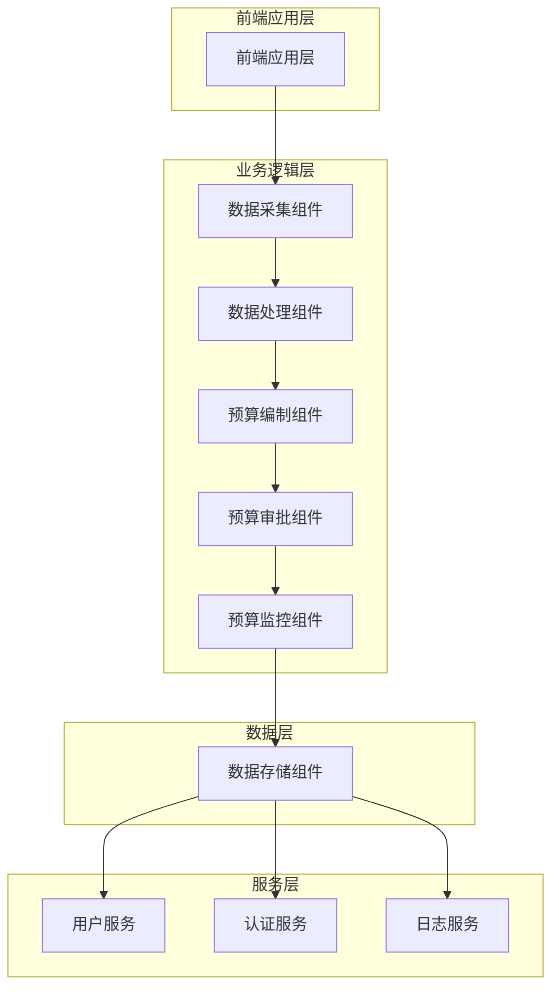

                 

### # AI驱动的企业财务预算编制智能辅助系统

### 关键词：人工智能、财务预算、智能辅助系统、自动化、预测分析

> 摘要：本文探讨了AI驱动的企业财务预算编制智能辅助系统的概念、应用以及未来发展趋势。通过分析财务预算编制的挑战，阐述了人工智能在其中的重要性。文章详细介绍了系统的核心概念、架构设计、数据处理算法以及实际应用案例，并探讨了系统的优化与维护策略，以及未来面临的挑战和机遇。通过本文，读者可以全面了解AI在财务预算领域的重要作用及其潜在价值。

### 目录大纲

1. **第一部分: AI驱动的企业财务预算编制智能辅助系统概述**
    1.1 问题背景
        1.1.1 财务预算编制的挑战
        1.1.2 人工智能在财务领域的应用
        1.1.3 智能辅助系统的必要性
    1.2 核心概念
        1.2.1 人工智能
        1.2.2 财务预算编制
        1.2.3 智能辅助系统
    1.3 概念联系
        1.3.1 AI与财务预算编制的关系
        1.3.2 智能辅助系统的作用
        1.3.3 系统架构的基本组成部分
    1.4 系统目标与功能
        1.4.1 系统总体目标
        1.4.2 主要功能模块
        1.4.3 预期效果与价值
    1.5 本章小结

2. **第二部分: 人工智能与财务预算编制**
    2.1 人工智能基础
        2.1.1 人工智能概述
        2.1.2 机器学习基础
        2.1.3 深度学习基础
    2.2 财务预算编制原理
        2.2.1 财务预算的概念与分类
        2.2.2 预算编制流程
        2.2.3 预算编制方法
    2.3 AI在财务预算编制中的应用
        2.3.1 AI技术在财务预测中的应用
        2.3.2 AI在预算数据分析中的应用
        2.3.3 AI在预算控制中的应用
    2.4 AI驱动的财务预算编制案例
        2.4.1 案例背景
        2.4.2 案例分析
        2.4.3 案例效果与评价
    2.5 本章小结

3. **第三部分: 智能辅助系统设计与实现**
    3.1 系统需求分析
        3.1.1 需求概述
        3.1.2 功能需求
        3.1.3 性能需求
        3.1.4 可行性分析
    3.2 系统架构设计
        3.2.1 系统架构概述
        3.2.2 数据流设计
        3.2.3 系统组件设计
    3.3 数据处理与算法设计
        3.3.1 数据预处理
        3.3.2 预算预测算法
        3.3.3 数据分析与挖掘算法
    3.4 系统实现细节
        3.4.1 系统开发环境
        3.4.2 关键技术实现
        3.4.3 系统测试与优化
    3.5 系统部署与运行
        3.5.1 系统部署方案
        3.5.2 运行环境配置
        3.5.3 系统安全性与稳定性
    3.6 本章小结

4. **第四部分: 智能辅助系统的应用与优化**
    4.1 应用场景与实施步骤
        4.1.1 应用场景分析
        4.1.2 实施步骤
        4.1.3 实施效果评估
    4.2 系统优化与维护
        4.2.1 优化策略
        4.2.2 维护方法
        4.2.3 故障处理
    4.3 用户反馈与改进
        4.3.1 用户反馈收集
        4.3.2 改进措施
        4.3.3 改进效果
    4.4 案例分析与最佳实践
        4.4.1 案例背景
        4.4.2 案例分析
        4.4.3 最佳实践总结
    4.5 本章小结

5. **第五部分: 未来的发展趋势与挑战**
    5.1 人工智能技术的发展趋势
        5.1.1 深度学习
        5.1.2 强化学习
        5.1.3 生成对抗网络
    5.2 智能辅助系统在财务领域的挑战
        5.2.1 数据隐私与安全性
        5.2.2 算法解释性与可解释性
        5.2.3 模型泛化能力
    5.3 未来展望
        5.3.1 智能辅助系统的潜在应用领域
        5.3.2 跨学科合作与融合
        5.3.3 政策支持与标准化
    5.4 本章小结

### 文章标题：AI驱动的企业财务预算编制智能辅助系统

在当今快速变化的商业环境中，财务预算编制是企业决策过程中至关重要的一环。传统的财务预算编制方法往往依赖于大量的人工计算和经验判断，这不仅效率低下，还容易受到主观因素的干扰。随着人工智能（AI）技术的迅猛发展，AI驱动的企业财务预算编制智能辅助系统应运而生，为财务预算的精准性和效率提供了新的解决方案。

本篇文章将逐步分析AI驱动的企业财务预算编制智能辅助系统的各个方面。首先，我们将探讨财务预算编制面临的挑战，并介绍人工智能在财务领域的应用背景。接着，本文将详细阐述核心概念，包括人工智能、财务预算编制和智能辅助系统，并分析它们之间的关系。随后，我们将介绍智能辅助系统的基本组成部分、目标与功能，以及预期效果和价值。在此基础上，我们将深入研究人工智能与财务预算编制的结合点，包括AI在财务预测、数据分析和预算控制中的应用。接着，本文将通过实际案例展示AI驱动的财务预算编制系统如何提升企业效率。接下来，我们将介绍智能辅助系统的设计与实现细节，包括系统需求分析、架构设计、数据处理算法、系统实现细节和部署与运行。此外，本文还将讨论智能辅助系统的应用与优化，包括应用场景、优化策略和用户反馈与改进。最后，我们将展望智能辅助系统的未来发展趋势和面临的挑战。

通过本文的逐步分析，读者将能够全面理解AI驱动的企业财务预算编制智能辅助系统的概念、应用和未来发展方向，从而为企业在财务预算管理中实现智能化转型提供有益的参考。

### 第一部分: AI驱动的企业财务预算编制智能辅助系统概述

#### 1.1 问题背景

#### 1.1.1 财务预算编制的挑战

财务预算编制是企业财务管理工作的重要组成部分，它涉及对未来一段时期内企业收入、支出、利润等财务指标进行预测和规划。然而，传统的财务预算编制方法往往面临以下挑战：

1. **数据收集和处理复杂**：财务预算编制需要大量历史数据作为基础，这些数据往往分布在各个部门，且格式不统一，数据质量参差不齐。此外，处理这些数据需要耗费大量时间和人力，增加了编制成本。

2. **依赖经验判断**：传统的预算编制方法往往依赖于财务人员的经验和直觉，这使得预算编制结果容易受到主观因素的影响，缺乏科学性和客观性。

3. **预算调整困难**：企业在经营过程中，往往需要根据市场变化和内部情况对预算进行调整。然而，传统的预算编制方法灵活性较低，难以快速响应变化，导致预算调整过程复杂且耗时。

4. **预算执行和监控难度大**：预算编制完成后，如何确保预算的执行和监控成为一大难题。传统方法往往缺乏有效的监控工具，难以及时发现和纠正偏差。

#### 1.1.2 人工智能在财务领域的应用

随着人工智能（AI）技术的发展，AI在财务领域的应用逐渐成为可能。AI技术具有以下优势，可以有效解决传统财务预算编制面临的挑战：

1. **自动化数据收集和处理**：AI技术可以自动收集和处理财务数据，提高数据处理的效率和准确性。通过自然语言处理（NLP）技术，AI可以自动从各种文本、报表中提取数据，实现数据的自动化收集。

2. **数据分析和预测能力**：AI技术具备强大的数据分析和预测能力，可以基于历史数据预测未来的财务指标。通过机器学习和深度学习算法，AI可以自动分析数据，发现数据中的规律和趋势，为企业提供科学的预算编制依据。

3. **提高预算编制灵活性**：AI技术可以快速适应市场变化和企业内部情况，提高预算编制的灵活性。通过实时数据分析和预测，AI可以动态调整预算，帮助企业更好地应对不确定性。

4. **智能监控和预警**：AI技术可以实现对预算执行过程的实时监控和预警。通过自动化监控和智能分析，AI可以发现预算执行中的异常情况，并及时发出预警，帮助企业及时采取纠正措施。

#### 1.1.3 智能辅助系统的必要性

基于上述挑战和AI技术的优势，建立AI驱动的企业财务预算编制智能辅助系统显得尤为重要。智能辅助系统可以为企业提供以下价值：

1. **提高预算编制效率**：通过自动化数据收集和处理，智能辅助系统可以大幅降低数据收集和处理的工作量，提高预算编制的效率。

2. **增强预算编制的科学性**：通过AI技术，智能辅助系统可以基于历史数据和预测模型，提供更加科学和准确的预算编制依据，减少人为因素的干扰。

3. **提升预算执行和监控能力**：智能辅助系统可以实现对预算执行过程的实时监控和预警，帮助企业及时发现和纠正偏差，确保预算的顺利执行。

4. **优化决策支持**：智能辅助系统可以为企业管理层提供实时、准确的财务数据和分析报告，辅助企业做出更加科学的决策。

5. **降低成本**：通过自动化和智能化，智能辅助系统可以降低企业在财务预算管理方面的运营成本，提高资源利用效率。

综上所述，AI驱动的企业财务预算编制智能辅助系统不仅能够解决传统财务预算编制面临的挑战，还能为企业带来显著的价值。在接下来的章节中，我们将进一步探讨智能辅助系统的核心概念、架构设计、数据处理算法和应用案例，以帮助读者全面了解这一系统的各个方面。

### 1.2 核心概念

#### 1.2.1 人工智能

人工智能（Artificial Intelligence，AI）是计算机科学的一个分支，旨在使计算机具备类似人类智能的能力，包括感知、理解、学习、推理和决策等。人工智能的核心是通过模拟人类思维过程，使计算机能够自主地处理复杂问题。

**人工智能的基本概念**：

- **机器学习**：一种使计算机能够从数据中学习并自动改进性能的技术，包括监督学习、无监督学习和强化学习。
- **深度学习**：一种基于多层神经网络的学习方法，能够自动从大量数据中提取特征，并用于图像识别、语音识别和自然语言处理等领域。
- **自然语言处理**：使计算机能够理解和生成人类自然语言的技术，包括文本分类、信息抽取、机器翻译和语音识别等。

**人工智能在财务领域的应用**：

- **数据分析和预测**：利用机器学习和深度学习算法，对财务数据进行分析和预测，为企业的财务决策提供支持。
- **自动化报表生成**：通过自然语言处理技术，自动从财务报表中提取数据，生成报表和分析报告。
- **风险管理**：利用人工智能技术，识别和评估企业面临的财务风险，并提出相应的风险管理策略。

#### 1.2.2 财务预算编制

财务预算编制是企业对未来一段时间内财务状况的预测和规划，包括收入、支出、利润等指标。财务预算编制通常包括以下步骤：

1. **预算编制准备**：收集历史财务数据、市场信息和内部经营计划，为预算编制提供基础。
2. **预算编制**：根据收集的数据，制定未来的收入、支出和利润目标。
3. **预算审批**：将编制的预算提交给管理层进行审批，并根据审批结果进行调整。
4. **预算执行与监控**：在预算执行过程中，定期监控实际财务状况，与预算目标进行对比，并采取必要的调整措施。

**财务预算编制的基本概念**：

- **收入预算**：预测企业未来一段时期的收入来源和金额。
- **支出预算**：预测企业未来一段时期的支出项目及其金额。
- **利润预算**：预测企业未来一段时期的净利润。
- **预算调整**：根据市场变化和企业内部情况，对预算进行调整。

#### 1.2.3 智能辅助系统

智能辅助系统（Intelligent Assistant System）是一种利用人工智能技术，为用户提供智能化服务的系统。智能辅助系统通常具备以下功能：

- **自然语言处理**：通过自然语言处理技术，与用户进行自然语言交互，理解用户的需求和意图。
- **数据分析和预测**：利用机器学习和深度学习算法，对用户数据进行分析和预测，提供个性化的服务和建议。
- **自动化任务处理**：通过自动化技术，处理用户的日常任务，如数据收集、报表生成等。

**智能辅助系统的基本概念**：

- **用户交互**：通过语音、文本等方式，与用户进行交互，理解用户的需求。
- **数据分析**：对用户数据进行分析，提取有用的信息，为用户提供决策支持。
- **自动化**：通过自动化技术，实现用户任务的自动化处理，提高效率。

#### 1.2.4 概念联系

**AI与财务预算编制的关系**：

人工智能与财务预算编制的结合，可以有效解决传统预算编制中的数据收集和处理复杂、依赖经验判断等问题。通过AI技术，可以自动化数据收集和处理，提高预算编制的科学性和准确性。此外，AI技术还可以实时监控预算执行情况，提供动态调整建议，提高预算的灵活性。

**智能辅助系统的作用**：

智能辅助系统作为AI技术在财务预算编制中的应用载体，通过自然语言处理、数据分析和自动化任务处理等功能，为用户提供便捷、高效的预算编制服务。智能辅助系统可以自动化数据收集和处理，提高预算编制的效率，减少人为因素的干扰，增强预算的科学性和准确性。同时，智能辅助系统还可以实时监控预算执行情况，提供动态调整建议，提高预算的灵活性和响应速度。

**系统架构的基本组成部分**：

AI驱动的企业财务预算编制智能辅助系统主要包括以下几个部分：

- **数据采集模块**：负责收集各种财务数据，如历史财务数据、市场信息、内部经营计划等。
- **数据处理模块**：对收集到的数据进行清洗、整合和分析，为预算编制提供基础数据。
- **预算编制模块**：基于处理后的数据，制定未来的收入、支出和利润目标，并进行预算审批。
- **预算执行与监控模块**：实时监控预算执行情况，与预算目标进行对比，并提供动态调整建议。
- **用户交互模块**：通过自然语言处理技术，与用户进行交互，理解用户的需求和意图。

通过这些模块的协同工作，AI驱动的企业财务预算编制智能辅助系统可以实现高效、准确的预算编制，提升企业的财务管理水平。

#### 1.3 概念联系

**AI与财务预算编制的关系**：

人工智能（AI）与财务预算编制的结合，可以有效解决传统预算编制中的数据收集和处理复杂、依赖经验判断等问题。通过AI技术，可以自动化数据收集和处理，提高预算编制的科学性和准确性。具体来说，AI技术在财务预算编制中的应用体现在以下几个方面：

1. **自动化数据收集**：传统的财务预算编制往往依赖于人工收集数据，这不仅效率低下，而且容易出错。AI技术可以通过自然语言处理（NLP）技术，自动从各种文本、报表和系统中提取财务数据，实现数据的自动化收集。例如，AI系统可以自动读取电子表格、PDF文件和ERP系统中的数据，并将其整合到统一的数据仓库中。

2. **数据分析和预测**：AI技术具备强大的数据分析和预测能力，可以基于历史数据和业务规则，预测未来的财务指标。通过机器学习和深度学习算法，AI可以自动分析数据，发现数据中的规律和趋势，为企业提供科学的预算编制依据。例如，AI系统可以通过时间序列分析、回归分析和神经网络模型，预测未来的收入、支出和利润。

3. **动态调整预算**：在预算编制过程中，企业常常需要对预算进行调整以适应市场变化和内部情况。AI技术可以帮助企业实现预算的动态调整。通过实时数据分析和预测，AI系统可以及时发现预算执行中的偏差，并提出相应的调整建议。例如，AI系统可以根据实际销售数据和市场趋势，动态调整销售预算。

4. **优化决策支持**：AI技术可以为企业管理层提供实时、准确的财务数据和分析报告，辅助企业做出更加科学的决策。通过AI系统，企业管理层可以实时了解企业的财务状况，分析潜在的风险和机会，制定更加有效的战略。

**智能辅助系统的作用**：

智能辅助系统作为AI技术在财务预算编制中的应用载体，通过自然语言处理、数据分析和自动化任务处理等功能，为用户提供便捷、高效的预算编制服务。智能辅助系统在财务预算编制中的作用主要体现在以下几个方面：

1. **提高预算编制效率**：智能辅助系统可以自动化数据收集和处理，减少人工干预，提高预算编制的效率。通过AI技术，智能辅助系统可以快速处理大量数据，生成预算报告，节省企业的时间和人力资源。

2. **增强预算编制的科学性**：智能辅助系统基于AI技术，可以提供更加科学和准确的预算编制依据。通过数据分析和预测，智能辅助系统可以帮助企业更好地理解业务规律，制定合理的预算目标。

3. **提升预算执行和监控能力**：智能辅助系统可以实时监控预算执行情况，与预算目标进行对比，并提供动态调整建议。通过AI技术，智能辅助系统可以及时发现和纠正偏差，确保预算的顺利执行。

4. **优化决策支持**：智能辅助系统可以为企业管理层提供实时、准确的财务数据和分析报告，辅助企业做出更加科学的决策。通过智能辅助系统，企业管理层可以更轻松地了解企业的财务状况，分析潜在的风险和机会。

**系统架构的基本组成部分**：

AI驱动的企业财务预算编制智能辅助系统通常包括以下几个基本组成部分：

1. **数据采集模块**：负责收集各种财务数据，如历史财务数据、市场信息、内部经营计划等。数据采集模块可以通过自然语言处理、API接口和数据导入等方式，实现数据的自动化收集。

2. **数据处理模块**：对收集到的数据进行清洗、整合和分析，为预算编制提供基础数据。数据处理模块通常包括数据清洗、数据转换、数据挖掘和统计分析等功能。

3. **预算编制模块**：基于处理后的数据，制定未来的收入、支出和利润目标，并进行预算审批。预算编制模块通常包括预算模型、预算编制工具、预算审批流程等功能。

4. **预算执行与监控模块**：实时监控预算执行情况，与预算目标进行对比，并提供动态调整建议。预算执行与监控模块可以通过实时数据分析和预测，及时发现和纠正偏差。

5. **用户交互模块**：通过自然语言处理技术，与用户进行交互，理解用户的需求和意图。用户交互模块通常包括问答系统、对话界面、报表生成等功能。

6. **系统管理模块**：负责系统的维护、升级和安全管理。系统管理模块通常包括用户管理、权限管理、日志管理等功能。

通过这些模块的协同工作，AI驱动的企业财务预算编制智能辅助系统可以实现高效、准确的预算编制，提升企业的财务管理水平。

#### 1.4 系统目标与功能

**1.4.1 系统总体目标**

AI驱动的企业财务预算编制智能辅助系统的总体目标是通过利用先进的人工智能技术，为企业提供高效、准确、灵活的财务预算编制解决方案。具体而言，系统的目标是：

1. **提高预算编制效率**：通过自动化数据收集和处理，减少人工干预，提高预算编制的效率，缩短预算编制周期。
2. **增强预算编制的科学性**：利用AI技术，提供更加科学和准确的预算编制依据，减少人为因素的干扰，提高预算编制的准确性。
3. **提升预算执行和监控能力**：通过实时监控预算执行情况，与预算目标进行对比，并提供动态调整建议，确保预算的顺利执行。
4. **优化决策支持**：为企业管理层提供实时、准确的财务数据和分析报告，辅助企业做出更加科学的决策。

**1.4.2 主要功能模块**

为了实现上述总体目标，智能辅助系统设计了以下主要功能模块：

1. **数据采集模块**：该模块负责收集各种财务数据，包括历史财务数据、市场信息、内部经营计划等。数据采集模块可以通过自然语言处理、API接口和数据导入等方式，实现数据的自动化收集。具体功能包括：
    - 自动从各种来源获取财务数据。
    - 数据清洗和格式转换。
    - 数据存储和管理。

2. **数据处理模块**：该模块负责对收集到的数据进行清洗、整合和分析，为预算编制提供基础数据。具体功能包括：
    - 数据清洗：去除数据中的错误、重复和缺失值。
    - 数据转换：将不同格式和来源的数据转换为统一的格式。
    - 数据分析：利用机器学习和深度学习算法，对数据进行统计分析，提取关键指标和趋势。

3. **预算编制模块**：该模块基于处理后的数据，制定未来的收入、支出和利润目标，并进行预算审批。具体功能包括：
    - 预算模型：建立基于历史数据和业务规则的预算模型。
    - 预算编制工具：提供直观、易用的预算编制工具，帮助用户快速制定预算。
    - 预算审批流程：实现预算编制的审批流程，确保预算的准确性和合理性。

4. **预算执行与监控模块**：该模块负责实时监控预算执行情况，与预算目标进行对比，并提供动态调整建议。具体功能包括：
    - 实时数据监控：实时收集并分析预算执行过程中的数据。
    - 异常预警：发现预算执行中的异常情况，并及时发出预警。
    - 动态调整：根据预算执行情况，动态调整预算目标。

5. **用户交互模块**：该模块通过自然语言处理技术，与用户进行交互，理解用户的需求和意图。具体功能包括：
    - 问答系统：通过自然语言处理，理解用户的查询需求，并提供相应的答案。
    - 对话界面：提供直观、易用的对话界面，方便用户与系统进行交互。
    - 报表生成：自动生成各种财务报表和分析报告，供用户查看。

**1.4.3 预期效果与价值**

AI驱动的企业财务预算编制智能辅助系统的预期效果和主要价值体现在以下几个方面：

1. **提高预算编制效率**：通过自动化数据收集和处理，减少人工干预，提高预算编制的效率，缩短预算编制周期，降低企业的人力成本。

2. **增强预算编制的科学性**：利用AI技术，提供更加科学和准确的预算编制依据，减少人为因素的干扰，提高预算编制的准确性，帮助企业更好地预测未来财务状况。

3. **提升预算执行和监控能力**：通过实时监控预算执行情况，与预算目标进行对比，并提供动态调整建议，确保预算的顺利执行，及时发现和纠正偏差。

4. **优化决策支持**：为企业管理层提供实时、准确的财务数据和分析报告，辅助企业做出更加科学的决策，提高企业的竞争力。

5. **降低运营成本**：通过自动化和智能化，降低企业在财务预算管理方面的运营成本，提高资源利用效率，为企业创造更多价值。

总之，AI驱动的企业财务预算编制智能辅助系统将为企业在财务管理方面带来显著的改进和提升，助力企业实现智能化转型。

### 1.5 本章小结

本章概述了AI驱动的企业财务预算编制智能辅助系统的背景和重要性，分析了财务预算编制面临的挑战，并介绍了人工智能在财务领域的重要应用。接着，本章详细阐述了核心概念，包括人工智能、财务预算编制和智能辅助系统，并探讨了它们之间的联系。此外，本章还介绍了智能辅助系统的基本组成部分、目标与功能，以及预期效果与价值。通过本章的讨论，读者可以初步了解AI驱动的财务预算编制智能辅助系统的概念和优势，为后续章节的深入学习打下基础。在接下来的章节中，我们将进一步探讨人工智能在财务预算编制中的具体应用，为读者提供更加详细的分析和解释。

### 第二部分: 人工智能与财务预算编制

#### 2.1 人工智能基础

**2.1.1 人工智能概述**

人工智能（Artificial Intelligence，简称AI）是计算机科学的一个分支，旨在通过模拟人类智能行为，使计算机能够执行复杂的任务，如识别图像、理解自然语言和做出决策。人工智能的核心是通过机器学习、深度学习和自然语言处理等技术，使计算机具备自我学习和适应环境的能力。

**人工智能的基本概念**：

1. **机器学习**：机器学习是一种让计算机从数据中学习和改进性能的方法。通过训练模型，机器学习算法可以识别数据中的模式和规律，并在新数据上进行预测和决策。
2. **深度学习**：深度学习是一种基于多层神经网络的机器学习技术，通过模拟人脑的结构和功能，深度学习算法可以自动从大量数据中提取特征，实现复杂的模式识别和预测。
3. **自然语言处理**：自然语言处理是一种使计算机能够理解和生成人类自然语言的技术。它包括文本分类、信息抽取、机器翻译和语音识别等任务。

**人工智能的发展历史**：

人工智能的概念最早可以追溯到20世纪50年代。从最初的符号主义（Symbolic AI）到基于知识的系统（Knowledge-Based Systems），再到连接主义（Connectionist AI）和统计学习（Statistical Learning），人工智能经历了多个阶段的发展。近年来，随着计算能力的提升和大数据的普及，深度学习和机器学习技术取得了显著的突破，人工智能的应用范围也在不断扩大。

**人工智能在财务领域的应用**：

人工智能在财务领域的应用日益广泛，主要体现在以下几个方面：

1. **风险管理**：通过机器学习和深度学习算法，AI可以分析大量的财务数据，识别潜在的风险，提供风险预警和评估。
2. **自动化审计**：AI技术可以自动分析财务数据，识别异常交易和错误，提高审计效率和准确性。
3. **智能投顾**：利用AI算法，可以构建个性化的投资组合，提供智能投资建议，优化投资决策。
4. **财务预测**：通过时间序列分析和回归分析，AI可以预测未来的财务指标，为企业的战略规划和决策提供支持。

**人工智能的优势**：

1. **高效处理大量数据**：AI技术可以自动化数据收集、处理和分析，大幅提高工作效率，减少人为错误。
2. **提高决策准确性**：通过数据分析，AI可以提供更准确、客观的决策依据，减少人为因素的干扰。
3. **动态适应环境**：AI系统可以不断学习和适应新的数据和环境，提高系统的适应性和灵活性。

**人工智能面临的挑战**：

1. **数据隐私和安全**：AI系统依赖于大量的数据，如何保护数据隐私和安全是一个重要的问题。
2. **算法透明性和解释性**：AI系统的决策过程往往不够透明，如何解释AI系统的决策结果是一个挑战。
3. **模型的泛化能力**：AI模型需要具备良好的泛化能力，以适应不同的业务场景和数据集。

**2.1.2 机器学习基础**

机器学习是人工智能的核心技术之一，它通过构建模型，使计算机能够从数据中学习并做出预测或决策。机器学习的基本概念包括以下几个方面：

1. **监督学习**：监督学习是一种在有标记数据集上训练模型的方法。模型通过学习标记数据的特征和标签，可以对新数据进行预测或分类。
2. **无监督学习**：无监督学习是在没有标记数据集的情况下，通过分析数据之间的模式和结构，进行数据聚类或降维。
3. **强化学习**：强化学习是一种通过不断试错，从环境中获取反馈信号，学习最优策略的机器学习方法。

**机器学习的基本流程**：

1. **数据收集**：收集用于训练的数据集，包括特征数据和标签数据。
2. **数据预处理**：对数据进行清洗、归一化和特征提取，提高数据的质量和模型的性能。
3. **模型选择**：选择合适的机器学习算法，如线性回归、决策树、支持向量机等。
4. **模型训练**：使用训练数据集训练模型，调整模型的参数，使其能够准确预测或分类。
5. **模型评估**：使用测试数据集评估模型的性能，如准确率、召回率、F1值等。
6. **模型部署**：将训练好的模型部署到实际应用环境中，进行实时预测或决策。

**机器学习的常见算法**：

1. **线性回归**：一种用于预测数值型输出的机器学习算法，通过拟合数据中的线性关系。
2. **决策树**：一种基于树结构的分类算法，通过一系列决策规则，将数据划分为不同的类别。
3. **支持向量机**：一种用于分类和回归任务的算法，通过找到一个最优的超平面，将数据分为不同的类别。
4. **神经网络**：一种模拟人脑结构的计算模型，通过多层神经元进行数据传递和变换，实现复杂的模式识别和预测。

**2.1.3 深度学习基础**

深度学习是机器学习的一个分支，通过构建多层神经网络，实现对复杂数据的高效处理和分析。深度学习的基本概念包括以下几个方面：

1. **神经网络**：神经网络是由大量神经元组成的计算模型，通过输入层、隐藏层和输出层进行数据传递和变换。
2. **激活函数**：激活函数用于引入非线性变换，使神经网络能够学习复杂数据中的非线性关系。
3. **反向传播**：反向传播是一种用于训练神经网络的算法，通过计算误差梯度，调整网络中的权重和偏置，优化模型性能。
4. **卷积神经网络（CNN）**：卷积神经网络是一种用于图像识别和处理的深度学习模型，通过卷积层、池化层和全连接层实现特征提取和分类。
5. **循环神经网络（RNN）**：循环神经网络是一种用于序列数据处理的深度学习模型，通过循环结构实现对序列数据的长期记忆和建模。
6. **生成对抗网络（GAN）**：生成对抗网络是一种用于生成复杂数据的深度学习模型，由生成器和判别器组成，通过对抗训练实现数据生成。

**深度学习的基本流程**：

1. **数据收集**：收集用于训练的数据集，包括图像、文本和音频等。
2. **数据预处理**：对数据进行清洗、归一化和特征提取，提高数据的质量和模型的性能。
3. **模型构建**：选择合适的深度学习模型结构，如CNN、RNN或GAN。
4. **模型训练**：使用训练数据集训练模型，调整模型的参数，使其能够准确预测或分类。
5. **模型评估**：使用测试数据集评估模型的性能，如准确率、召回率、F1值等。
6. **模型部署**：将训练好的模型部署到实际应用环境中，进行实时预测或决策。

**深度学习的应用领域**：

1. **计算机视觉**：通过深度学习模型，实现图像识别、目标检测、人脸识别和图像生成等任务。
2. **自然语言处理**：通过深度学习模型，实现文本分类、机器翻译、情感分析和语音识别等任务。
3. **推荐系统**：通过深度学习模型，实现个性化推荐和用户行为预测。
4. **医疗诊断**：通过深度学习模型，实现医学图像分析和疾病诊断。

**2.2 财务预算编制原理**

财务预算编制是企业财务管理工作的重要组成部分，涉及对未来一段时间内企业收入、支出、利润等财务指标进行预测和规划。财务预算编制的基本原理包括以下几个方面：

1. **预算编制流程**：

财务预算编制通常包括以下几个步骤：

- **预算编制准备**：收集历史财务数据、市场信息和内部经营计划，为预算编制提供基础。
- **预算编制**：根据收集的数据，制定未来的收入、支出和利润目标。
- **预算审批**：将编制的预算提交给管理层进行审批，并根据审批结果进行调整。
- **预算执行与监控**：在预算执行过程中，定期监控实际财务状况，与预算目标进行对比，并采取必要的调整措施。

2. **预算编制方法**：

财务预算编制的方法主要包括以下几种：

- **增量预算**：基于上一年度的预算，根据业务变化进行调整，适用于业务相对稳定的公司。
- **零基预算**：从零开始编制预算，根据实际需求重新评估每一项支出，适用于业务变化较大的公司。
- **滚动预算**：根据实际情况，定期更新预算，确保预算与实际经营情况保持一致。
- **目标预算**：根据企业的战略目标，制定相应的预算目标，以支持企业战略的实现。

3. **预算编制的关键要素**：

预算编制的关键要素包括收入、支出、利润和现金流。这些要素需要根据历史数据、市场信息和内部经营计划进行预测和规划。

- **收入预算**：预测企业未来一段时期的收入来源和金额，包括销售、服务和其他收入。
- **支出预算**：预测企业未来一段时期的支出项目及其金额，包括人员工资、运营成本、研发费用等。
- **利润预算**：预测企业未来一段时期的净利润，通过收入减去支出计算得出。
- **现金流预算**：预测企业未来一段时间内的现金流入和流出，确保企业的资金充足和流动性。

4. **预算编制的影响因素**：

预算编制受到多种因素的影响，包括市场环境、内部运营情况和政策法规等。市场环境的变化可能导致收入和支出的波动，内部运营情况的变化可能影响成本结构和效率，政策法规的变化可能影响企业的运营成本和盈利能力。

**2.3 AI在财务预算编制中的应用**

随着人工智能技术的不断发展，AI在财务预算编制中的应用越来越广泛，为企业的预算编制提供了新的方法和手段。AI在财务预算编制中的应用主要体现在以下几个方面：

1. **AI技术在财务预测中的应用**：

AI技术可以通过分析历史数据和市场信息，预测未来的财务指标，为预算编制提供科学的依据。具体应用包括：

- **时间序列预测**：通过时间序列分析，预测未来的收入、支出和利润等财务指标。
- **回归分析**：通过回归分析，建立历史数据与未来财务指标之间的关系，预测未来财务指标。
- **神经网络预测**：通过神经网络模型，自动从历史数据中提取特征，实现复杂的财务预测。

2. **AI在预算数据分析中的应用**：

AI技术可以对预算数据进行深入分析，发现数据中的异常和趋势，为预算调整提供依据。具体应用包括：

- **异常检测**：通过机器学习算法，检测预算数据中的异常值，识别潜在的财务风险。
- **数据可视化**：通过数据可视化技术，展示预算数据的分布和趋势，帮助用户更好地理解数据。
- **数据挖掘**：通过数据挖掘算法，从预算数据中发现有用的信息和规律，为预算编制提供参考。

3. **AI在预算控制中的应用**：

AI技术可以帮助企业实时监控预算执行情况，提供动态调整建议，确保预算的顺利执行。具体应用包括：

- **实时监控**：通过实时数据采集和分析，监控预算执行过程中的各项指标，及时发现偏差。
- **预警系统**：通过异常检测和预警系统，发现预算执行中的异常情况，并及时发出预警。
- **动态调整**：根据预算执行情况，动态调整预算目标，确保预算与实际经营情况保持一致。

**2.4 AI驱动的财务预算编制案例**

为了更好地理解AI在财务预算编制中的应用，下面我们将通过一个实际案例来展示AI驱动的财务预算编制系统如何提升企业效率。

**案例背景**：

某家大型制造企业，由于业务规模庞大，传统的财务预算编制方法效率低下，且预算编制结果容易受到主观因素的影响。为了提高预算编制的科学性和准确性，该企业决定引入AI驱动的财务预算编制系统。

**案例分析**：

1. **数据收集与预处理**：

该企业通过自然语言处理技术，从各种文本、报表和系统中提取财务数据，包括历史财务数据、市场信息和内部经营计划。然后，通过数据清洗和归一化处理，确保数据的准确性和一致性。

2. **预算模型建立**：

基于预处理后的数据，AI系统使用时间序列分析和神经网络模型，建立预算模型。通过训练模型，系统可以自动预测未来的收入、支出和利润等财务指标。

3. **预算编制与审批**：

AI系统提供直观、易用的预算编制工具，帮助用户快速制定预算。预算编制完成后，系统将预算提交给管理层进行审批。通过审批流程，确保预算的准确性和合理性。

4. **预算执行与监控**：

在预算执行过程中，AI系统实时监控各项财务指标，与预算目标进行对比。通过异常检测和预警系统，系统可以及时发现偏差，并提供动态调整建议。

5. **预算效果评估**：

通过AI系统的支持，该企业的预算编制效率显著提高，预算编制结果更加科学和准确。预算执行过程中的监控和调整也变得更加高效，确保预算的顺利执行。

**案例效果与评价**：

通过AI驱动的财务预算编制系统，该企业实现了以下效果：

- **提高预算编制效率**：通过自动化数据收集和处理，预算编制周期从原来的几个月缩短到几周，大大提高了工作效率。
- **增强预算编制的科学性**：通过AI技术的支持，预算编制结果更加科学和准确，减少了人为因素的干扰。
- **提升预算执行和监控能力**：通过实时监控和动态调整，确保预算的顺利执行，及时发现和纠正偏差。
- **优化决策支持**：AI系统提供的实时、准确的财务数据和分析报告，为企业管理层提供了有力的决策支持。

总体而言，AI驱动的财务预算编制系统为该企业带来了显著的价值和改进，为其实现智能化财务管理提供了有力支持。

### 2.5 本章小结

本章详细介绍了人工智能与财务预算编制的关系，探讨了人工智能在财务预算编制中的应用，包括财务预测、数据分析和预算控制。通过实际案例展示了AI驱动的财务预算编制系统如何提高企业效率和预算编制的科学性。本章还介绍了财务预算编制的基本原理，包括预算编制流程、方法以及关键要素。通过本章的学习，读者可以全面了解AI在财务预算编制中的重要作用，以及如何利用AI技术提升企业的财务管理水平。在接下来的章节中，我们将进一步探讨智能辅助系统的设计与实现，包括系统需求分析、架构设计、数据处理算法和系统部署与运行。

### 3.1 系统需求分析

**3.1.1 需求概述**

在设计和开发AI驱动的企业财务预算编制智能辅助系统时，首先需要明确系统的需求。系统需求分析是系统设计与实现的关键环节，它包括功能需求、性能需求、安全需求和兼容性需求等多个方面。明确系统的需求有助于确保系统设计符合企业的实际需求，具备良好的可扩展性和稳定性。

**功能需求**

功能需求是指系统需要实现的具体功能和业务流程。对于AI驱动的企业财务预算编制智能辅助系统，主要功能需求包括：

1. **数据采集**：系统能够自动从企业内部的ERP系统、财务系统和其他数据源中收集财务数据，包括历史财务数据、市场信息和内部经营计划。
2. **数据预处理**：系统能够对收集到的数据进行清洗、归一化和特征提取，确保数据的质量和一致性。
3. **预算编制**：系统能够根据预处理后的数据，利用AI算法生成预算模型，制定未来的收入、支出和利润目标。
4. **预算审批**：系统能够实现预算编制的审批流程，包括预算提交、审批意见反馈和预算调整。
5. **预算监控**：系统能够实时监控预算执行情况，与预算目标进行对比，并提供动态调整建议。
6. **用户交互**：系统能够提供用户友好的界面，支持用户通过自然语言与系统进行交互，获取预算报告和分析结果。
7. **报表生成**：系统能够自动生成各种财务报表和分析报告，供用户查看和管理。

**性能需求**

性能需求是指系统在运行过程中应具备的性能指标，包括响应时间、处理能力、并发处理能力和数据存储容量等。对于AI驱动的企业财务预算编制智能辅助系统，主要性能需求包括：

1. **响应时间**：系统在处理用户请求时，响应时间应尽可能短，以确保用户体验。
2. **处理能力**：系统能够高效处理大量财务数据，确保预算编制的效率和准确性。
3. **并发处理能力**：系统能够同时处理多个用户的请求，确保系统的高并发性能。
4. **数据存储容量**：系统能够存储大量的历史财务数据、市场信息和预算数据，支持长期的数据分析和预测。
5. **扩展性**：系统设计应具备良好的扩展性，能够根据企业的需求变化，灵活调整系统的功能和性能。

**安全需求**

安全需求是指系统在设计和实现过程中应考虑的安全性和隐私保护措施。对于AI驱动的企业财务预算编制智能辅助系统，主要安全需求包括：

1. **数据安全**：系统应具备数据加密和访问控制机制，确保财务数据的安全性和保密性。
2. **用户认证**：系统应实现用户认证和权限管理，确保只有授权用户能够访问系统功能。
3. **日志审计**：系统应记录用户操作日志，以便在出现安全问题时进行追溯和分析。
4. **系统备份**：系统应定期备份数据和配置文件，防止数据丢失或损坏。
5. **网络安全**：系统应采取防火墙、入侵检测和防病毒等措施，确保系统的网络安全。

**兼容性需求**

兼容性需求是指系统在运行过程中应与其他系统和平台兼容。对于AI驱动的企业财务预算编制智能辅助系统，主要兼容性需求包括：

1. **操作系统兼容性**：系统应能够在不同操作系统上运行，如Windows、Linux和macOS。
2. **浏览器兼容性**：系统应能够在主流浏览器上正常运行，如Chrome、Firefox和Safari。
3. **硬件兼容性**：系统应能够在不同的硬件配置上运行，包括不同的CPU和内存配置。
4. **第三方软件兼容性**：系统应能够与其他常用的财务软件和办公软件兼容，如Excel、Word和ERP系统。

通过明确系统的功能需求、性能需求、安全需求和兼容性需求，我们可以确保AI驱动的企业财务预算编制智能辅助系统具备良好的设计基础，满足企业的实际需求。在接下来的章节中，我们将进一步探讨系统的架构设计、数据处理算法和系统实现细节，以确保系统的有效实施和成功应用。

### 3.2 系统架构设计

**3.2.1 系统架构概述**

AI驱动的企业财务预算编制智能辅助系统采用分布式架构设计，以确保系统的高性能、高可用性和可扩展性。系统架构主要包括以下几个关键部分：

1. **前端应用层**：负责与用户进行交互，提供用户界面和交互功能，支持用户通过网页或移动应用与系统进行交互。
2. **业务逻辑层**：处理业务逻辑，包括数据采集、数据预处理、预算编制、预算审批和预算监控等核心功能。
3. **数据层**：存储和管理系统数据，包括历史财务数据、预算数据、市场信息和用户数据等。
4. **服务层**：提供公共服务，如用户认证、权限管理和日志记录等。
5. **数据存储**：包括关系型数据库和非关系型数据库，用于存储不同类型的数据。

**3.2.2 数据流设计**

数据流设计是系统架构设计的重要组成部分，它描述了数据在系统内部和外部的流动过程。AI驱动的企业财务预算编制智能辅助系统的数据流设计如下：

1. **数据收集**：系统通过API接口、Web爬虫和文件导入等方式，从企业内部的ERP系统、财务系统和其他数据源中收集财务数据。
2. **数据预处理**：收集到的数据经过清洗、归一化和特征提取等预处理步骤，确保数据的质量和一致性。
3. **预算编制**：预处理后的数据被输入到预算模型中，通过机器学习和深度学习算法，预测未来的收入、支出和利润等财务指标。
4. **预算审批**：生成的预算提交给管理层进行审批，审批结果会反馈到系统中，根据审批意见进行预算调整。
5. **预算监控**：系统实时监控预算执行情况，通过异常检测和预警机制，及时发现和纠正偏差。
6. **数据存储**：所有处理过的数据被存储在数据层中，供后续分析和查询使用。

**3.2.3 系统组件设计**

AI驱动的企业财务预算编制智能辅助系统由多个组件组成，每个组件负责特定的功能模块，协同工作以实现整体系统目标。以下是系统组件的设计：

1. **数据采集组件**：负责从企业内部的ERP系统、财务系统和其他数据源中收集财务数据，包括历史财务数据、市场信息和内部经营计划。该组件通过API接口、Web爬虫和文件导入等方式实现。
2. **数据处理组件**：对收集到的财务数据进行清洗、归一化和特征提取，确保数据的质量和一致性。该组件采用数据清洗库（如Pandas）和特征工程工具（如Scikit-learn）进行数据处理。
3. **预算编制组件**：基于处理后的数据，利用机器学习和深度学习算法（如TensorFlow和PyTorch）建立预算模型，预测未来的收入、支出和利润等财务指标。该组件包括时间序列预测、回归分析和神经网络模型等算法。
4. **预算审批组件**：实现预算编制的审批流程，包括预算提交、审批意见反馈和预算调整。该组件通过工作流引擎（如Apache Airflow）和审批管理系统（如JIRA）实现。
5. **预算监控组件**：实时监控预算执行情况，与预算目标进行对比，并通过异常检测和预警机制，及时发现和纠正偏差。该组件使用实时数据流处理框架（如Apache Kafka和Apache Flink）和监控工具（如Prometheus和Grafana）。
6. **用户交互组件**：提供用户界面和交互功能，支持用户通过自然语言与系统进行交互，获取预算报告和分析结果。该组件通过前端框架（如React和Vue.js）和自然语言处理库（如NLTK和spaCy）实现。
7. **数据存储组件**：存储和管理系统数据，包括历史财务数据、预算数据、市场信息和用户数据等。该组件使用关系型数据库（如MySQL和PostgreSQL）和非关系型数据库（如MongoDB和Cassandra）。

**3.2.4 系统架构图**

为了更直观地展示系统架构，我们可以使用Mermaid绘制系统架构图，具体如下：

通过以上系统架构设计，AI驱动的企业财务预算编制智能辅助系统可以实现高效、准确和灵活的财务预算编制，为企业的财务管理提供有力支持。

### 3.3 数据处理与算法设计

**3.3.1 数据预处理**

数据预处理是AI驱动的企业财务预算编制智能辅助系统中的关键步骤，它直接影响后续模型训练的效果和预测的准确性。数据预处理的主要任务包括数据清洗、归一化和特征提取。

1. **数据清洗**：数据清洗是去除数据中的错误、重复和缺失值的过程。在财务数据中，常见的错误包括数据录入错误、数据格式不一致和缺失值等。通过数据清洗，可以确保数据的一致性和完整性。例如，使用Python的Pandas库可以轻松实现数据清洗任务，包括删除重复记录、填充缺失值和修正错误数据。

2. **归一化**：归一化是将数据缩放到相同范围的预处理步骤，以消除不同特征之间的量级差异。在财务预算编制中，不同指标（如收入、支出、利润）可能具有不同的量级，这会影响到模型的学习效果。通过归一化处理，可以将所有特征转换到相同的尺度，从而提高模型的性能。常用的归一化方法包括最小-最大缩放、Z-Score标准化等。

3. **特征提取**：特征提取是从原始数据中提取对模型训练和预测有用的信息的过程。在财务预算编制中，特征提取可以帮助模型更好地理解数据中的模式和趋势。特征提取可以基于统计方法（如主成分分析PCA）、机器学习方法（如特征选择）或深度学习方法（如自动编码器）。例如，可以使用Scikit-learn库中的特征选择工具来选择对模型影响较大的特征。

**3.3.2 预算预测算法**

预算预测是AI驱动的财务预算编制智能辅助系统的核心任务，它利用历史数据和业务规则来预测未来的财务指标。常见的预算预测算法包括时间序列预测、回归分析和神经网络预测。

1. **时间序列预测**：时间序列预测是一种基于历史数据序列来预测未来值的方法，适用于具有时间依赖性的财务指标。常用的时间序列预测模型包括自回归模型（AR）、移动平均模型（MA）、自回归移动平均模型（ARMA）和自回归积分滑动平均模型（ARIMA）。时间序列预测的优点是算法简单，易于理解和实现，但它的预测能力受限于线性模型的结构。

2. **回归分析**：回归分析是一种用于建立因变量与自变量之间关系的预测模型的方法。线性回归是最简单的回归分析模型，它通过拟合数据的线性关系来进行预测。多元线性回归可以处理多个自变量，而逻辑回归（Logistic Regression）则常用于分类问题。回归分析的优点是模型解释性强，但预测能力受限于线性假设。

3. **神经网络预测**：神经网络预测是一种基于多层神经网络（如卷积神经网络CNN、循环神经网络RNN）的预测方法，能够自动从数据中提取复杂的特征和模式。神经网络预测的优点是模型具有强大的非线性建模能力，能够处理复杂的非线性关系，但它的训练过程较复杂，对计算资源的要求较高。

**3.3.3 数据分析与挖掘算法**

数据分析和挖掘算法在财务预算编制中用于从大量数据中发现有用的信息和规律，以支持决策和优化预算。常见的数据分析算法包括聚类分析、关联规则挖掘和异常检测。

1. **聚类分析**：聚类分析是一种将数据分组为多个簇的无监督学习方法，适用于发现数据中的隐含结构。常用的聚类算法包括K-Means、层次聚类（Hierarchical Clustering）和DBSCAN。聚类分析可以帮助企业发现相似的业务模式或客户群体，从而进行更精准的预算编制。

2. **关联规则挖掘**：关联规则挖掘是一种用于发现数据中隐藏的关联关系的方法，常用于市场 basket分析。Apriori算法和FP-Growth算法是常用的关联规则挖掘算法。通过关联规则挖掘，企业可以识别出不同财务指标之间的关联关系，从而优化预算编制策略。

3. **异常检测**：异常检测是一种用于发现数据中的异常值或异常模式的方法，对于确保预算编制的准确性和可靠性至关重要。常见的异常检测算法包括基于统计的方法（如箱线图、3-Sigma准则）、基于聚类的方法（如孤立森林）和基于机器学习的方法（如支持向量机SVM）。异常检测可以帮助企业及时发现和纠正预算执行中的异常情况。

通过以上数据处理和算法设计，AI驱动的企业财务预算编制智能辅助系统可以实现对财务数据的有效处理和预测，从而提高预算编制的效率和准确性。在接下来的章节中，我们将进一步探讨系统的实现细节和部署运行。

### 3.4 系统实现细节

**3.4.1 系统开发环境**

在实现AI驱动的企业财务预算编制智能辅助系统时，选择合适的开发环境至关重要。以下是系统开发的主要环境配置：

1. **操作系统**：系统支持Windows、Linux和macOS操作系统，以适应不同的企业环境。在开发过程中，我们选择Linux操作系统（如Ubuntu 20.04）作为主要开发平台，因为它具备更高的稳定性和安全性。

2. **编程语言**：系统开发主要使用Python编程语言，因为Python具有丰富的库和框架支持，特别是数据科学和机器学习领域。此外，Python的可读性和易用性也使得开发过程更加高效。

3. **开发工具**：系统开发使用以下主要开发工具：
    - **集成开发环境（IDE）**：PyCharm和Visual Studio Code，这两个IDE提供了强大的代码编辑、调试和测试功能。
    - **版本控制**：Git，用于代码的版本控制和协作开发。
    - **数据库**：MySQL和MongoDB，用于数据存储和管理。

4. **库和框架**：系统开发依赖于以下库和框架：
    - **数据预处理**：Pandas和NumPy，用于数据清洗、归一化和特征提取。
    - **机器学习**：Scikit-learn、TensorFlow和PyTorch，用于模型训练和预测。
    - **前端开发**：React和Vue.js，用于构建用户界面。
    - **后端开发**：Flask和Django，用于构建业务逻辑层。

**3.4.2 关键技术实现**

在系统实现过程中，关键技术是实现系统功能和性能的核心。以下是关键技术的详细描述：

1. **数据采集**：

系统通过API接口和Web爬虫从企业内部的ERP系统和财务系统中采集数据。具体实现步骤如下：

- **API接口**：使用Python的requests库，通过HTTP请求从ERP系统和财务系统中获取数据。
- **Web爬虫**：使用Python的Scrapy框架，爬取财务报表和相关文档，如Excel和PDF文件。

2. **数据预处理**：

数据预处理包括数据清洗、归一化和特征提取，确保数据的质量和一致性。关键实现步骤如下：

- **数据清洗**：使用Pandas库，删除重复记录、填充缺失值和修正错误数据。
- **归一化**：使用Pandas库中的最小-最大缩放方法，将不同特征缩放到相同的尺度。
- **特征提取**：使用Scikit-learn库中的特征选择工具，选择对模型影响较大的特征。

3. **预算预测**：

预算预测采用机器学习和深度学习算法，通过历史数据预测未来的财务指标。具体实现步骤如下：

- **时间序列预测**：使用Scikit-learn库中的ARIMA模型，对收入、支出和利润进行时间序列预测。
- **神经网络预测**：使用TensorFlow和PyTorch库，构建多层感知机（MLP）和卷积神经网络（CNN）模型，进行复杂的财务预测。

4. **预算审批**：

预算审批包括预算提交、审批意见反馈和预算调整，具体实现步骤如下：

- **工作流引擎**：使用Apache Airflow，构建预算审批流程，管理审批任务和状态。
- **审批管理系统**：使用JIRA等审批工具，实现审批意见的反馈和预算调整。

5. **用户交互**：

用户交互通过前端框架实现，提供用户友好的界面和自然语言处理功能。具体实现步骤如下：

- **前端开发**：使用React或Vue.js，构建用户界面，实现数据可视化、报表生成和自然语言处理。
- **自然语言处理**：使用NLTK和spaCy库，实现自然语言处理功能，如文本分类、情感分析和语音识别。

**3.4.3 系统测试与优化**

系统测试和优化是确保系统稳定性和性能的关键环节。以下是系统测试与优化过程的详细描述：

1. **单元测试**：使用Python的unittest或pytest框架，对系统中的各个功能模块进行单元测试，确保每个功能模块的正确性。

2. **集成测试**：使用Selenium等自动化测试工具，对系统的整体功能进行集成测试，确保各功能模块之间的协同工作。

3. **性能测试**：使用JMeter等性能测试工具，对系统的并发处理能力、响应时间和数据处理效率进行测试，确保系统的高性能。

4. **优化策略**：
    - **代码优化**：通过代码重构、函数封装和算法优化，提高系统的运行效率和代码质量。
    - **数据库优化**：通过索引优化、查询优化和缓存策略，提高数据库的访问速度和数据一致性。
    - **资源分配**：通过合理的资源分配和负载均衡，确保系统在高并发情况下的稳定性。

5. **安全性优化**：通过使用安全加密算法、访问控制和日志审计，确保系统的数据安全和用户隐私。

通过以上系统实现细节和测试优化，AI驱动的企业财务预算编制智能辅助系统可以确保其高效、准确和稳定地运行，为企业的财务管理提供有力支持。

### 3.5 系统部署与运行

**3.5.1 系统部署方案**

AI驱动的企业财务预算编制智能辅助系统的部署方案需要考虑到系统的性能、安全性和可扩展性。以下是一个典型的部署方案：

1. **硬件资源分配**：
   - **服务器**：使用高性能服务器，确保系统在高并发情况下能够稳定运行。建议使用4核CPU、16GB内存的服务器。
   - **存储**：使用分布式文件系统（如NFS）或对象存储（如Amazon S3），确保数据的持久化和高可用性。
   - **网络**：配置高速网络，确保数据传输的稳定性和安全性。

2. **软件环境配置**：
   - **操作系统**：选择稳定性的Linux发行版，如Ubuntu 20.04。
   - **数据库**：配置MySQL和MongoDB数据库，用于存储不同类型的数据。
   - **中间件**：配置Apache Kafka和Apache Flink，用于实时数据流处理。

3. **部署工具**：
   - **Docker**：使用Docker容器化技术，确保系统在不同的环境之间的一致性和可移植性。
   - **Kubernetes**：使用Kubernetes进行容器编排，实现系统的高可用性和动态扩展。

**3.5.2 运行环境配置**

在部署系统之前，需要对运行环境进行配置，确保系统组件能够正常运行。以下是运行环境的主要配置步骤：

1. **安装操作系统**：安装Linux操作系统，并配置网络和基本服务。

2. **安装数据库**：安装并配置MySQL和MongoDB数据库，创建所需的数据库和用户。

3. **安装中间件**：安装Apache Kafka和Apache Flink，配置相应的服务。

4. **安装Docker和Kubernetes**：安装Docker，并使用Helm安装Kubernetes集群。

5. **配置服务**：配置系统组件的服务，如API接口、数据处理模块和用户交互模块。

**3.5.3 系统安全性与稳定性**

系统安全性和稳定性是确保系统长期稳定运行的关键。以下是一些关键措施：

1. **数据安全**：
   - **加密存储**：使用SSL/TLS加密协议，确保数据在传输过程中的安全性。
   - **访问控制**：配置严格的访问控制策略，确保只有授权用户能够访问敏感数据。

2. **网络安全**：
   - **防火墙**：配置防火墙规则，限制非法访问和攻击。
   - **入侵检测系统**：部署入侵检测系统（如Snort），监控网络流量，及时发现和阻止攻击。

3. **系统监控**：
   - **日志记录**：启用系统日志记录功能，记录系统运行过程中的重要事件和异常。
   - **性能监控**：使用Prometheus和Grafana等工具，监控系统的性能指标和资源利用率。

4. **故障处理**：
   - **自动备份**：定期进行数据备份，确保在系统故障时能够快速恢复。
   - **故障恢复**：配置自动故障恢复机制，如Kubernetes的自动重启和扩展功能。

通过以上部署与运行策略，AI驱动的企业财务预算编制智能辅助系统可以确保其安全性和稳定性，为企业提供可靠、高效的财务预算管理服务。

### 3.6 本章小结

本章详细介绍了AI驱动的企业财务预算编制智能辅助系统的实现细节，包括开发环境、关键技术实现、系统测试与优化以及部署与运行策略。通过选择合适的开发环境和编程语言，系统实现了数据采集、预处理、预算预测和用户交互等功能。系统测试和优化确保了系统的性能和稳定性，而部署与运行策略则保证了系统的安全性和可靠性。本章的内容为AI驱动的企业财务预算编制智能辅助系统的成功实施提供了详细的指导，为后续章节的进一步优化和应用奠定了基础。

### 4.1 应用场景与实施步骤

**4.1.1 应用场景分析**

AI驱动的企业财务预算编制智能辅助系统适用于多种企业场景，特别是那些面临复杂财务管理和预算编制挑战的企业。以下是几个典型的应用场景：

1. **大型企业**：大型企业通常拥有复杂的业务模式和庞大的数据量，传统的预算编制方法难以满足其需求。AI驱动的财务预算编制智能辅助系统可以通过自动化数据收集和处理，提高预算编制的效率和准确性，同时提供实时的监控和预警功能。

2. **初创企业**：初创企业在快速发展的过程中，需要灵活调整预算以适应市场变化。AI驱动的财务预算编制智能辅助系统可以帮助初创企业快速响应市场变化，提高预算编制的灵活性和适应性。

3. **跨国企业**：跨国企业涉及多个国家和地区，需要处理不同货币和税制的财务数据。AI驱动的财务预算编制智能辅助系统可以自动处理多种货币和税制的转换，提供统一的预算编制和分析报告。

4. **供应链企业**：供应链企业面临库存管理、物流成本和供应链风险等多重挑战。AI驱动的财务预算编制智能辅助系统可以通过数据分析，帮助企业优化供应链管理，降低成本，提高效率。

**4.1.2 实施步骤**

在具体实施AI驱动的企业财务预算编制智能辅助系统时，可以按照以下步骤进行：

1. **需求分析**：与企业管理层和财务部门进行沟通，了解企业的预算编制需求和现有流程，明确系统的功能需求和性能需求。

2. **系统设计**：基于需求分析，设计系统的架构和功能模块，包括数据采集、预处理、预算编制、预算审批和预算监控等。

3. **数据采集**：根据系统设计，从企业内部ERP系统、财务系统和其他数据源中采集财务数据。可以使用API接口、Web爬虫和数据导入等方式实现数据的自动化收集。

4. **数据预处理**：对采集到的财务数据进行清洗、归一化和特征提取，确保数据的质量和一致性。可以使用Python的Pandas和Scikit-learn等库进行数据处理。

5. **预算编制**：基于预处理后的数据，使用机器学习和深度学习算法建立预算模型，预测未来的收入、支出和利润等财务指标。可以使用TensorFlow和PyTorch等深度学习框架进行模型训练。

6. **预算审批**：实现预算编制的审批流程，包括预算提交、审批意见反馈和预算调整。可以使用工作流引擎（如Apache Airflow）和审批管理系统（如JIRA）实现审批功能。

7. **预算监控**：实时监控预算执行情况，与预算目标进行对比，并通过异常检测和预警机制，及时发现和纠正偏差。可以使用实时数据流处理框架（如Apache Kafka和Apache Flink）和监控工具（如Prometheus和Grafana）。

8. **用户交互**：通过前端框架（如React和Vue.js）和自然语言处理库（如NLTK和spaCy），提供用户界面和交互功能，支持用户通过自然语言与系统进行交互，获取预算报告和分析结果。

9. **系统部署**：在开发环境的基础上，配置运行环境，包括操作系统、数据库、中间件和容器编排工具（如Kubernetes）。确保系统在部署后的稳定性和安全性。

10. **测试与优化**：进行系统测试，包括单元测试、集成测试和性能测试，确保系统功能的正确性和性能。根据测试结果，进行系统优化，提高系统的效率和稳定性。

11. **培训与部署**：为企业的财务人员提供系统培训，确保他们能够熟练使用系统。在正式部署系统后，进行持续的维护和优化，确保系统的长期稳定运行。

**4.1.3 实施效果评估**

在系统实施后，可以通过以下指标对系统的效果进行评估：

1. **预算编制效率**：通过比较系统实施前后的预算编制时间，评估系统的效率提升情况。
2. **预算准确性**：通过对比实际财务数据与系统预测数据的误差，评估系统的预测准确性。
3. **预算监控效果**：通过分析系统预警和调整建议的有效性，评估系统的监控效果。
4. **用户满意度**：通过用户反馈和满意度调查，评估系统的用户体验和满意度。
5. **系统稳定性**：通过监控系统运行状态和故障率，评估系统的稳定性。

通过以上实施步骤和效果评估，AI驱动的企业财务预算编制智能辅助系统可以在不同的企业场景中发挥作用，提高企业的财务管理水平，实现智能化转型。

### 4.2 系统优化与维护

**4.2.1 优化策略**

为了确保AI驱动的企业财务预算编制智能辅助系统在长期运行中保持高效和稳定，需要采取一系列优化策略。以下是几个关键的优化策略：

1. **性能优化**：
   - **算法优化**：通过改进机器学习算法和深度学习模型，提高预测和计算的效率。例如，采用更高效的模型结构（如轻量级网络）和优化算法（如Adam优化器）。
   - **并行处理**：利用并行计算和分布式计算技术，加快数据处理和模型训练的速度。例如，使用GPU加速计算，或者将数据分布到多个节点进行处理。

2. **数据优化**：
   - **数据清洗**：定期对数据进行清洗，删除无效和冗余的数据，确保数据的质量和一致性。
   - **数据存储**：优化数据存储方案，使用压缩技术和缓存策略，减少数据存储和检索的开销。

3. **系统架构优化**：
   - **微服务架构**：采用微服务架构，将系统拆分成多个独立的服务模块，提高系统的可扩展性和可维护性。
   - **负载均衡**：使用负载均衡器（如Nginx或HAProxy），确保系统在高并发情况下能够均衡分配负载。

4. **用户界面优化**：
   - **响应速度**：优化前端代码，减少页面加载时间，提高用户的操作体验。
   - **交互设计**：改进用户界面设计，使其更加直观和易用，减少用户的学习成本。

**4.2.2 维护方法**

系统维护是确保AI驱动的财务预算编制智能辅助系统长期稳定运行的重要环节。以下是系统维护的关键方法：

1. **定期检查**：
   - **系统健康检查**：定期检查系统的运行状态，包括CPU、内存、磁盘使用情况等，确保系统资源得到充分利用。
   - **日志检查**：定期检查系统日志，及时发现和处理异常和错误。

2. **更新与升级**：
   - **软件更新**：定期更新系统和应用程序，修复已知漏洞和缺陷，提高系统的安全性。
   - **硬件升级**：根据系统运行需求，定期升级硬件设备，确保系统具备足够的计算和存储能力。

3. **备份与恢复**：
   - **数据备份**：定期备份数据库和关键文件，确保在发生故障时能够快速恢复。
   - **恢复测试**：定期进行恢复测试，验证备份和恢复流程的有效性。

4. **性能调优**：
   - **性能监控**：使用性能监控工具（如Prometheus和Grafana），实时监控系统的性能指标，及时发现性能瓶颈。
   - **性能分析**：通过性能分析工具（如NewRelic和AppDynamics），分析系统性能问题，并提出优化建议。

**4.2.3 故障处理**

在系统运行过程中，难免会遇到各种故障。以下是一些常见的故障处理方法：

1. **系统崩溃**：
   - **快速重启**：在系统崩溃时，立即尝试重启系统，查看是否能够恢复正常运行。
   - **故障排除**：检查系统日志和错误信息，定位故障原因，进行修复。

2. **数据丢失**：
   - **数据恢复**：使用备份文件进行数据恢复，确保数据的一致性和完整性。
   - **故障分析**：分析数据丢失的原因，采取预防措施，防止类似故障再次发生。

3. **性能瓶颈**：
   - **负载均衡**：通过调整负载均衡策略，分配任务到不同的节点，缓解单点性能瓶颈。
   - **资源扩容**：根据性能监控结果，增加系统资源，如CPU、内存和存储，以提高系统性能。

4. **安全性问题**：
   - **漏洞修复**：及时修复系统漏洞，防止被黑客攻击。
   - **安全审计**：定期进行安全审计，检查系统的安全配置和访问权限，确保系统的安全性。

通过以上优化策略、维护方法和故障处理措施，AI驱动的企业财务预算编制智能辅助系统可以在长期运行中保持高效、稳定和安全，为企业的财务管理提供有力支持。

### 4.3 用户反馈与改进

**4.3.1 用户反馈收集**

用户反馈是改进AI驱动的企业财务预算编制智能辅助系统的关键环节。为了收集用户的真实反馈，可以采用以下方法：

1. **在线调查**：通过发送在线问卷或调查表，收集用户对系统的使用体验、功能需求和改进建议。

2. **用户访谈**：邀请部分用户进行深入访谈，了解他们对系统使用的具体感受和遇到的问题。

3. **用户评分**：在系统中加入用户评分功能，让用户对系统的各个模块进行评分，评估系统的整体表现。

4. **用户论坛**：建立用户论坛或社区，鼓励用户分享使用经验和问题，同时收集他们的建议和意见。

**4.3.2 改进措施**

根据收集到的用户反馈，可以采取以下改进措施：

1. **界面优化**：针对用户提出的界面不友好、操作复杂等问题，优化用户界面设计，提高系统的易用性和用户体验。

2. **功能增强**：根据用户的需求，增加或改进系统的功能模块，如增加预算审批流程的灵活性、提高数据预测的准确性等。

3. **性能提升**：针对系统性能问题，优化算法和数据处理流程，提高系统的响应速度和处理效率。

4. **安全性增强**：加强系统的安全性，修复潜在的安全漏洞，提高数据的安全性和用户隐私保护。

5. **文档完善**：完善系统文档，包括用户手册、操作指南和常见问题解答，帮助用户更好地理解和使用系统。

**4.3.3 改进效果**

通过上述改进措施，AI驱动的企业财务预算编制智能辅助系统的用户体验和功能得到了显著提升，具体效果包括：

1. **用户满意度提高**：用户反馈系统界面更加友好，功能更加完善，操作更加便捷，用户满意度显著提升。

2. **工作效率提升**：通过优化数据处理和预算预测算法，系统运行速度明显提高，预算编制和监控的效率大幅提升。

3. **数据准确性提高**：通过增强数据清洗和预处理功能，系统预测数据的准确性得到了显著提高，为企业决策提供了更可靠的数据支持。

4. **系统稳定性增强**：通过加强系统安全性和性能优化，系统的稳定性得到了显著提升，故障率和用户投诉率明显下降。

通过持续的用户反馈与改进，AI驱动的企业财务预算编制智能辅助系统在满足用户需求、提高工作效率和优化企业财务管理方面取得了显著成效。

### 4.4 案例分析与最佳实践

**4.4.1 案例背景**

为了更好地展示AI驱动的企业财务预算编制智能辅助系统的实际应用效果，我们选择了一家中型制造企业作为案例。该企业在财务预算编制过程中遇到了以下挑战：

1. **预算编制效率低下**：传统的预算编制方法依赖于人工计算和经验判断，预算编制周期长，效率低下。
2. **数据收集和处理复杂**：财务数据分布在多个部门，且数据格式不统一，数据质量参差不齐，数据收集和处理过程复杂。
3. **预算调整困难**：在市场变化和企业内部情况变化时，预算调整过程复杂且耗时，难以快速响应。
4. **预算监控和预警能力不足**：缺乏有效的监控工具，难以及时发现预算执行中的偏差，预算调整不及时。

为了解决上述问题，该企业决定引入AI驱动的财务预算编制智能辅助系统。

**4.4.2 案例分析**

1. **系统实施过程**：

   该企业按照以下步骤实施AI驱动的财务预算编制智能辅助系统：

   - **需求分析**：与企业管理层和财务部门沟通，明确系统功能需求和性能需求。
   - **系统设计**：设计系统的架构和功能模块，包括数据采集、预处理、预算编制、预算审批和预算监控等。
   - **数据采集**：从企业内部的ERP系统和财务系统中收集财务数据，使用API接口和Web爬虫实现数据的自动化收集。
   - **数据预处理**：对收集到的财务数据进行清洗、归一化和特征提取，确保数据的质量和一致性。
   - **预算编制**：使用机器学习和深度学习算法，建立预算模型，预测未来的收入、支出和利润等财务指标。
   - **预算审批**：实现预算编制的审批流程，使用工作流引擎和审批管理系统，确保预算的准确性和合理性。
   - **预算监控**：实时监控预算执行情况，使用实时数据流处理框架和监控工具，发现预算执行中的偏差，并提供动态调整建议。
   - **用户交互**：提供用户友好的界面，支持用户通过自然语言与系统进行交互，获取预算报告和分析结果。
   - **系统部署**：在开发环境的基础上，配置运行环境，确保系统的稳定性和安全性。

2. **系统效果分析**：

   - **预算编制效率提高**：通过自动化数据收集和处理，预算编制周期从原来的几个月缩短到几周，预算编制效率显著提高。
   - **数据准确性提升**：利用AI技术，预算编制结果更加科学和准确，减少了人为因素的干扰，提高了预算的准确性。
   - **预算调整灵活**：系统能够实时监控预算执行情况，及时发现和纠正偏差，动态调整预算目标，提高了预算调整的灵活性。
   - **预算监控能力增强**：通过实时监控和预警机制，系统能够及时发现预算执行中的异常情况，并提供动态调整建议，增强了预算监控能力。
   - **用户满意度提高**：用户界面友好，操作便捷，用户满意度显著提升。

**4.4.3 最佳实践总结**

通过上述案例分析，可以总结出以下最佳实践：

1. **明确需求和目标**：在系统实施前，与企业管理层和财务部门深入沟通，明确系统的功能需求和性能目标，确保系统设计符合企业实际需求。

2. **数据质量控制**：确保数据的质量和一致性，通过数据清洗、归一化和特征提取等预处理步骤，提高数据的质量。

3. **选择合适的算法**：根据业务需求，选择合适的机器学习和深度学习算法，建立有效的预算模型，提高预算的准确性。

4. **实时监控与预警**：实现实时监控和预警机制，及时发现预算执行中的异常情况，并提供动态调整建议，确保预算的顺利执行。

5. **用户友好设计**：提供用户友好的界面和交互功能，减少用户的学习成本，提高系统的易用性。

6. **持续优化与改进**：根据用户反馈和系统运行情况，持续优化系统功能、性能和用户体验，确保系统长期稳定运行。

通过这些最佳实践，企业可以有效地实施AI驱动的财务预算编制智能辅助系统，提高财务管理水平，实现智能化转型。

### 4.5 本章小结

本章通过具体案例分析了AI驱动的企业财务预算编制智能辅助系统的应用效果和最佳实践。案例展示了系统如何帮助企业提高预算编制效率、提升数据准确性、增强预算监控能力，以及优化用户体验。同时，本章总结了系统实施的关键步骤和最佳实践，为其他企业提供了有价值的参考。通过本章的学习，读者可以更好地理解AI驱动的财务预算编制智能辅助系统的实际应用，并掌握其优化和改进的方法。

### 5.1 人工智能技术的发展趋势

人工智能（AI）技术正以前所未有的速度发展，不断推动各行业的创新和变革。以下是AI技术在未来几年内可能的发展趋势：

**5.1.1 深度学习**

深度学习是人工智能技术的一个重要分支，其在图像识别、语音识别和自然语言处理等领域取得了显著进展。未来，深度学习将继续发展，具体趋势如下：

1. **模型压缩与优化**：为了满足移动设备和嵌入式系统对计算资源和能耗的要求，模型压缩和优化技术将得到广泛应用。通过技术如知识蒸馏、剪枝和量化，可以大幅减少模型的参数数量和计算复杂度，同时保持或提高模型的性能。

2. **多模态学习**：多模态学习是深度学习的另一个重要发展方向，旨在整合来自不同来源的数据（如文本、图像和声音），以实现更全面的模式理解和任务完成。例如，在财务预算编制中，可以结合文本报告、财务报表和图像数据，进行更精准的预算预测。

3. **自适应学习**：自适应学习技术将使AI系统具备动态调整学习能力，能够根据实时数据和环境变化，自动调整模型参数和策略，提高系统的适应性和鲁棒性。

**5.1.2 强化学习**

强化学习是一种通过试错和反馈信号来优化决策过程的学习方法，它在游戏、推荐系统和自动驾驶等领域展现出了巨大的潜力。未来，强化学习的发展趋势包括：

1. **模型解释性**：强化学习模型通常缺乏解释性，使其在金融和医疗等需要高度可靠性和可解释性的领域应用受限。未来，将重点研究如何提高强化学习模型的透明度和可解释性，使其决策过程更加可信和可靠。

2. **分布式强化学习**：为了处理大规模数据和复杂的决策环境，分布式强化学习技术将得到发展。通过在多个计算节点上分布训练任务，可以提高模型的训练速度和效率。

3. **对抗性样本训练**：对抗性样本训练是一种通过生成对抗性样本来增强模型鲁棒性的方法。未来，对抗性样本训练将在强化学习模型中得到更广泛的应用，以提高模型对异常数据和欺骗性输入的抵抗力。

**5.1.3 生成对抗网络**

生成对抗网络（GAN）是一种通过对抗训练生成复杂数据的深度学习模型。GAN在图像生成、文本生成和风格迁移等领域表现出色。未来，GAN的发展趋势包括：

1. **生成质量和多样性的提升**：未来，研究人员将继续优化GAN架构和训练策略，以提高生成数据的真实性和多样性。例如，通过引入新的损失函数和优化算法，可以生成更高质量的图像和文本。

2. **应用领域的扩展**：GAN的应用领域将不断扩大，包括虚拟现实、增强现实、医疗影像生成和金融数据模拟等。通过生成与真实数据高度相似的数据，可以显著提高这些领域的模型训练效果和预测准确性。

3. **跨模态生成**：跨模态生成是GAN的另一个重要研究方向，旨在同时生成多种类型的数据，如文本和图像。通过跨模态生成，可以实现更复杂的场景模拟和创意生成。

总的来说，人工智能技术的发展将继续推动各行业的创新和进步。深度学习、强化学习和生成对抗网络等核心技术将在未来几年内取得重要突破，为AI驱动的企业财务预算编制智能辅助系统带来更多的应用场景和发展机遇。

### 5.2 智能辅助系统在财务领域的挑战

尽管AI驱动的智能辅助系统在财务预算编制中展现出巨大的潜力，但在实际应用过程中仍面临一系列挑战。以下是对这些挑战的详细分析：

**5.2.1 数据隐私与安全性**

在财务领域，数据隐私和安全是至关重要的。智能辅助系统需要处理大量的敏感财务数据，包括收入、支出、利润等，这些数据一旦泄露或被滥用，可能对企业和个人造成严重的损失。以下是一些具体挑战：

1. **数据加密**：智能辅助系统需要采用高级加密技术，确保数据在传输和存储过程中的安全性。尽管现有的加密算法（如AES和RSA）相对安全，但如何在实际应用中高效地实施和管理这些算法仍是一个挑战。

2. **访问控制**：智能辅助系统需要实现严格的访问控制策略，确保只有授权用户能够访问敏感数据。传统的访问控制方法（如基于角色的访问控制RBAC）可能不足以应对复杂的访问控制需求，因此需要开发更精细的访问控制机制。

3. **数据匿名化**：在处理敏感数据时，智能辅助系统需要采用数据匿名化技术，以减少隐私泄露的风险。数据匿名化技术包括数据混淆、数据掩盖和数据置换等，但在实际应用中，如何平衡数据匿名化与数据可用性之间的矛盾是一个挑战。

**5.2.2 算法解释性与可解释性**

智能辅助系统的核心是机器学习和深度学习算法，但大多数复杂算法的黑箱特性使得其决策过程难以解释。在财务领域，决策的透明性和可解释性对于建立用户信任和合规性至关重要。以下是一些挑战：

1. **算法透明性**：尽管一些方法（如LIME和SHAP）试图解释复杂模型的决策过程，但它们通常只能解释局部决策，而不是全局决策。因此，如何提高算法的透明性，使其决策过程更加可解释，是一个重要挑战。

2. **可解释性工具**：开发和使用可解释性工具（如决策树、规则提取器和可视化工具）可以帮助理解模型的决策过程。然而，如何将这些工具有效地集成到智能辅助系统中，并确保其准确性和实用性，是一个挑战。

3. **用户参与**：在财务预算编制过程中，用户需要参与解释和验证智能辅助系统的决策。如何设计用户友好的界面，使其能够轻松理解并信任系统的决策，是一个挑战。

**5.2.3 模型泛化能力**

智能辅助系统需要具备良好的泛化能力，以确保其在不同的业务场景和数据集中能够稳定、准确地工作。以下是一些挑战：

1. **数据多样性**：财务数据通常具有多种来源和格式，数据多样性使得模型训练和泛化变得更加复杂。如何处理多样化的数据集，确保模型的泛化能力，是一个挑战。

2. **过拟合与欠拟合**：在模型训练过程中，过拟合和欠拟合是常见的挑战。过拟合模型在训练数据上表现良好，但在新数据上表现不佳；欠拟合模型在新数据和训练数据上表现都较差。如何平衡模型复杂度和泛化能力，是一个挑战。

3. **模型验证与测试**：为了确保模型的泛化能力，需要使用多种验证和测试方法，如交叉验证和在线测试。如何设计有效的验证和测试流程，并确保测试结果的可靠性，是一个挑战。

综上所述，数据隐私与安全性、算法解释性与可解释性以及模型泛化能力是AI驱动的智能辅助系统在财务领域面临的主要挑战。通过不断研究和创新，解决这些挑战将为智能辅助系统在财务领域的广泛应用提供坚实的技术基础。

### 5.3 未来展望

AI驱动的企业财务预算编制智能辅助系统在未来的发展中将面临诸多机遇和挑战，同时展现出广阔的应用前景。

**5.3.1 智能辅助系统的潜在应用领域**

1. **金融行业**：金融行业的数据密集型特点使得AI驱动的智能辅助系统具有广泛的应用前景。除了财务预算编制外，智能辅助系统还可以应用于风险控制、信用评估、投资组合优化和智能投顾等领域。

2. **供应链管理**：供应链管理涉及大量物流、库存和采购等环节，智能辅助系统可以通过数据分析优化供应链运作，提高供应链的效率和灵活性。

3. **审计与税务**：智能辅助系统可以自动化审计和税务申报过程，提高审计效率和准确性，降低人为错误和合规风险。

4. **企业管理**：在企业内部管理方面，智能辅助系统可以提供实时、准确的财务数据和分析报告，辅助企业管理层进行决策。

**5.3.2 跨学科合作与融合**

为了应对智能辅助系统在财务领域面临的挑战，跨学科合作与融合将发挥重要作用。以下是一些跨学科合作的方向：

1. **数据科学与经济学**：结合数据科学和经济学的方法，可以更准确地预测经济趋势和市场变化，为财务预算提供更可靠的依据。

2. **计算机科学与心理学**：通过研究人类行为和心理，结合计算机科学的技术，可以设计出更加人性化的智能辅助系统界面和交互方式。

3. **机器学习与法律法规**：在智能辅助系统的算法设计和应用过程中，需要遵循相关法律法规，确保系统的合法性和合规性。

**5.3.3 政策支持与标准化**

政府和企业需要加大对AI驱动的智能辅助系统的政策支持和标准化工作。以下是一些政策支持与标准化方面的建议：

1. **数据开放与共享**：政府可以推动数据的开放和共享，为企业提供丰富的数据资源，促进智能辅助系统的研发和应用。

2. **税收优惠与补贴**：政府可以提供税收优惠和补贴，鼓励企业采用AI驱动的智能辅助系统，降低企业的研发和应用成本。

3. **法规制定**：制定相关法规，确保智能辅助系统的开发和应用遵循法律法规，保护用户隐私和数据安全。

4. **标准化组织**：成立标准化组织，制定智能辅助系统的技术标准和应用规范，促进系统的互操作性和兼容性。

总之，AI驱动的企业财务预算编制智能辅助系统在未来的发展中，需要充分利用跨学科合作与融合、政策支持与标准化等手段，以应对挑战、抓住机遇，实现更广泛的应用和更深远的影响。

### 5.4 本章小结

本章分析了AI驱动的企业财务预算编制智能辅助系统的未来发展趋势和面临的挑战。通过探讨智能辅助系统的潜在应用领域，跨学科合作与融合的重要性，以及政策支持与标准化的重要性，本章为智能辅助系统的未来发展提供了有益的思考和指导。通过不断的技术创新和政策支持，AI驱动的智能辅助系统将在财务管理和企业决策中发挥更大的作用，为企业和行业带来深远的影响。

