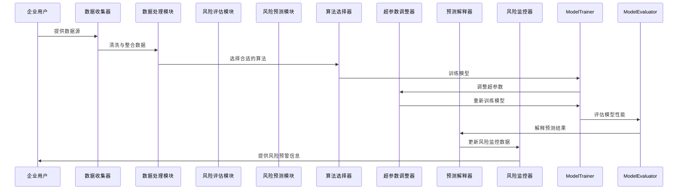
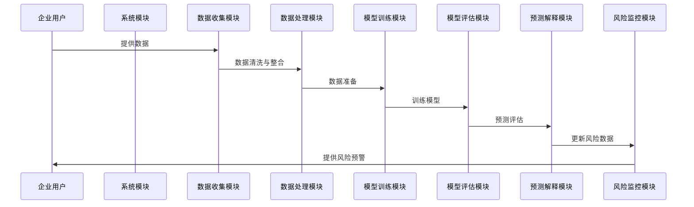

                 

# AI驱动的企业财务风险量化评估系统

## 关键词
- 人工智能
- 财务风险
- 量化评估
- 企业风险管理
- 机器学习

## 摘要
本文将探讨如何利用人工智能技术，特别是机器学习算法，构建一个有效的企业财务风险量化评估系统。文章将从核心概念、算法原理、系统架构和实际应用等方面，深入分析这一领域的挑战与解决方案，旨在为企业的财务风险管理提供新的思路和方法。

## 第一部分：引言

### 1.1 问题背景

随着经济的全球化和信息化，企业面临的财务风险日益复杂。传统的财务风险管理方法往往依赖于经验判断和手工分析，不仅效率低下，而且容易受到主观因素的影响。随着人工智能（AI）技术的快速发展，利用AI进行财务风险量化评估已成为可能，这不仅能够提高风险管理的效率，还能够提供更为准确和客观的风险评估结果。

### 1.2 问题描述

财务风险量化评估系统旨在通过定量分析工具，将企业的财务风险转化为可量化的指标，从而为企业的决策提供数据支持。该系统需要解决的问题包括：如何收集和处理大量的财务数据、如何选择合适的机器学习算法进行模型训练、如何确保模型的准确性和稳定性等。

### 1.3 问题解决

本文提出了一套基于AI驱动的企业财务风险量化评估系统解决方案。该方案包括以下几个关键步骤：

1. 数据收集与预处理：通过数据挖掘技术获取企业的财务数据，并进行清洗、去噪和标准化处理。
2. 模型选择与训练：选择适合的机器学习算法，根据企业的具体情况定制模型，并进行训练和优化。
3. 风险评估与预警：利用训练好的模型对企业财务风险进行评估，并建立预警系统，及时向管理层提供风险信息。
4. 系统部署与维护：将评估系统部署到企业的IT环境中，并进行定期的维护和更新。

### 1.4 边界与外延

本文主要关注企业层面的财务风险量化评估系统构建，涉及的技术包括机器学习、数据挖掘、自然语言处理等。同时，本文也将讨论如何将AI技术应用到更广泛的财务风险管理场景中，为企业提供全面的风险管理解决方案。

### 1.5 概念结构与核心要素组成

本系统的核心概念包括：财务风险、量化评估、机器学习、数据预处理、模型训练、风险评估等。核心要素包括：数据收集模块、数据处理模块、模型训练模块、风险评估模块等。

### 1.6 本章小结

通过对问题背景、问题描述、问题解决、边界与外延、概念结构与核心要素组成的详细阐述，我们为本章后续的内容奠定了基础。接下来，我们将深入探讨核心概念和原理，为构建有效的财务风险量化评估系统提供理论支持。

----------------------------------------------------------------

## 第二部分：核心概念与原理

### 2.1 财务风险概念

#### 2.1.1 财务风险的定义

财务风险是指企业在资金运作过程中，由于各种不确定因素的影响，可能导致企业财务损失的风险。财务风险的主要来源包括市场风险、信用风险、操作风险、流动性风险等。

#### 2.1.2 财务风险的分类

财务风险可以根据风险的性质和影响范围进行分类：

1. **市场风险**：包括汇率风险、利率风险、商品价格风险等，主要由市场价格的波动引起。
2. **信用风险**：企业无法按时偿还债务的风险，主要由债务人的信用状况变动引起。
3. **操作风险**：由于内部程序、员工行为、系统故障等导致的风险，可能影响企业的正常运营。
4. **流动性风险**：企业无法在需要时获取足够的现金或其他流动资产的风险。

#### 2.1.3 财务风险的评估方法

财务风险的评估方法主要包括定量评估和定性评估：

1. **定量评估**：通过分析企业的财务报表、关键财务指标（如流动比率、速动比率、负债比率等），以及对市场数据的统计分析，定量评估企业的财务风险。
2. **定性评估**：通过专家访谈、行业分析、风险评估矩阵等方法，定性分析企业的财务风险。

### 2.2 量化评估方法

#### 2.2.1 量化评估的定义

量化评估是指通过量化的方法对财务风险进行评估，通常涉及概率模型、统计模型等。量化评估的优势在于能够将风险转化为具体的数值，便于管理层做出决策。

#### 2.2.2 量化评估的方法

常见的量化评估方法包括：

1. **风险矩阵法**：通过建立风险矩阵，对风险的概率和影响进行评估，并计算风险得分。
2. **蒙特卡罗模拟法**：通过模拟随机过程，预测未来风险的概率分布。
3. **决策树法**：通过构建决策树模型，评估不同决策路径下的风险和收益。

### 2.3 AI技术原理

#### 2.3.1 AI技术的定义

人工智能是指通过模拟人类智能，使计算机具有感知、学习、推理和解决问题的能力。AI技术广泛应用于图像识别、自然语言处理、决策支持系统等领域。

#### 2.3.2 AI技术的分类

AI技术主要分为以下几类：

1. **机器学习**：通过训练模型，使计算机自动从数据中学习规律。
2. **深度学习**：一种特殊的机器学习技术，通过多层神经网络进行复杂模式的识别。
3. **强化学习**：通过奖励和惩罚机制，使计算机在特定环境中做出最优决策。

#### 2.3.3 AI技术在财务风险管理中的应用

AI技术在财务风险管理中的应用主要包括：

1. **数据挖掘**：从大量的财务数据中挖掘出有用的信息，帮助决策者理解风险。
2. **模型预测**：利用机器学习模型，预测企业未来的财务风险。
3. **自动化决策**：通过AI算法，自动化执行风险控制措施，提高决策效率。

### 2.4 企业财务风险量化评估系统

#### 2.4.1 系统的定义

企业财务风险量化评估系统是指利用AI技术，对企业的财务风险进行量化评估的软件系统。该系统包括数据收集、数据处理、模型训练、模型评估和风险预警等模块。

#### 2.4.2 系统的核心功能

系统的主要功能包括：

1. **数据收集**：收集企业的财务数据和市场数据。
2. **数据处理**：清洗、整合和标准化数据，为模型训练做准备。
3. **模型训练**：选择合适的机器学习算法，训练风险评估模型。
4. **模型评估**：评估模型的准确性和稳定性，并进行优化。
5. **风险预警**：根据模型评估结果，向管理层提供风险预警信息。

#### 2.4.3 系统的实现步骤

实现财务风险量化评估系统的步骤主要包括：

1. **需求分析**：明确系统的目标和功能要求。
2. **系统设计**：设计系统的架构和模块划分。
3. **数据收集**：获取企业的财务数据和市场数据。
4. **数据处理**：清洗、整合和标准化数据。
5. **模型训练**：选择合适的机器学习算法，训练风险评估模型。
6. **模型评估**：评估模型的准确性和稳定性。
7. **系统实现**：开发系统的前端和后端功能。
8. **系统测试**：进行系统测试，确保系统功能的正确性和稳定性。
9. **系统部署**：将系统部署到企业的IT环境中。

#### 2.5 本章小结

通过对财务风险、量化评估、AI技术和企业财务风险量化评估系统的详细讲解，我们为构建一个有效的财务风险量化评估系统奠定了理论基础。在下一部分，我们将进一步探讨机器学习算法在财务风险管理中的应用。

----------------------------------------------------------------

## 第三部分：算法原理与实现

### 3.1 数据预处理算法

数据预处理是机器学习项目中的关键步骤，其目的是提高模型训练的效果和准确性。以下是数据预处理过程中常用的算法：

#### 3.1.1 数据清洗

数据清洗的主要任务是去除数据中的错误、重复、缺失和异常值。具体方法包括：

- **删除重复记录**：通过比较数据中的关键字段，删除重复的记录。
- **填充缺失值**：根据数据的特性，使用平均值、中位数、最大值、最小值等方法填充缺失值。
- **识别并处理异常值**：通过统计分析和可视化方法，识别数据中的异常值，并根据具体情况进行处理。

#### 3.1.2 特征工程

特征工程是指从原始数据中提取出对模型训练有重要影响的特征。特征工程的方法包括：

- **特征选择**：通过统计方法（如卡方检验、互信息等）和机器学习方法（如随机森林、LASSO回归等），选择对模型贡献最大的特征。
- **特征变换**：通过数学变换（如归一化、标准化等）提高特征的可解释性。
- **特征组合**：通过组合多个特征，生成新的特征，以提高模型的预测能力。

#### 3.1.3 数据归一化

数据归一化的目的是将不同量纲的特征数据转换到相同的量纲范围内，以便模型训练。常用的归一化方法包括：

- **最小-最大归一化**：将数据缩放到[0, 1]范围内。
- **标准化**：将数据缩放到标准正态分布中，即均值为0，标准差为1。

### 3.2 机器学习算法

#### 3.2.1 逻辑回归

逻辑回归是一种用于分类的机器学习算法，其基本原理是通过对特征变量进行线性组合，然后通过sigmoid函数将结果映射到概率区间[0, 1]。

- **模型公式**：
  $$ P(Y=1|X) = \frac{1}{1 + e^{-(\beta_0 + \beta_1X_1 + \beta_2X_2 + ... + \beta_nX_n)}} $$
  其中，$P(Y=1|X)$ 表示在特征 $X$ 的条件下，目标变量 $Y$ 取值为 1 的概率，$\beta_0, \beta_1, \beta_2, ..., \beta_n$ 是模型的参数。

- **实现示例**（Python代码）：
  ```python
  import numpy as np
  from sklearn.linear_model import LogisticRegression

  # 假设 X 是特征矩阵，y 是标签向量
  X = np.array([[1, 2], [2, 3], [3, 4]])
  y = np.array([0, 1, 1])

  # 创建逻辑回归模型并训练
  model = LogisticRegression()
  model.fit(X, y)

  # 预测
  predictions = model.predict(X)
  ```

#### 3.2.2 决策树

决策树是一种常见的分类和回归算法，其基本原理是通过一系列的决策规则，将数据集划分为不同的区域，并从中预测结果。

- **模型公式**：
  决策树通过递归分割数据集，每个分割点由一个不等式决定。具体公式为：
  $$ x_{i1} \leq c_1 \land x_{i2} \leq c_2 \land ... \land x_{ik} \leq c_k $$
  其中，$x_{ij}$ 表示第 $i$ 个特征的第 $j$ 个值，$c_j$ 表示分割点的值。

- **实现示例**（Python代码）：
  ```python
  from sklearn.tree import DecisionTreeClassifier

  # 假设 X 是特征矩阵，y 是标签向量
  X = np.array([[1, 2], [2, 3], [3, 4]])
  y = np.array([0, 1, 1])

  # 创建决策树模型并训练
  model = DecisionTreeClassifier()
  model.fit(X, y)

  # 预测
  predictions = model.predict(X)
  ```

#### 3.2.3 随机森林

随机森林是一种基于决策树的集成学习方法，其基本原理是通过构建多棵决策树，并对它们的预测结果进行投票，以获得最终的预测结果。

- **模型公式**：
  随机森林通过组合多棵决策树，得到最终的预测结果。具体公式为：
  $$ \hat{y} = \arg\max_{y} \sum_{i=1}^{n} w_i \cdot f_i(y) $$
  其中，$f_i(y)$ 表示第 $i$ 棵决策树的预测结果，$w_i$ 表示第 $i$ 棵决策树的权重。

- **实现示例**（Python代码）：
  ```python
  from sklearn.ensemble import RandomForestClassifier

  # 假设 X 是特征矩阵，y 是标签向量
  X = np.array([[1, 2], [2, 3], [3, 4]])
  y = np.array([0, 1, 1])

  # 创建随机森林模型并训练
  model = RandomForestClassifier()
  model.fit(X, y)

  # 预测
  predictions = model.predict(X)
  ```

### 3.3 数学模型和公式

#### 3.3.1 线性回归

线性回归是一种用于回归分析的机器学习算法，其基本原理是找到特征变量和目标变量之间的线性关系。

- **模型公式**：
  $$ y = \beta_0 + \beta_1x_1 + \beta_2x_2 + ... + \beta_nx_n $$
  其中，$y$ 是目标变量，$x_1, x_2, ..., x_n$ 是特征变量，$\beta_0, \beta_1, \beta_2, ..., \beta_n$ 是模型的参数。

#### 3.3.2 逻辑回归

逻辑回归是一种用于分类的机器学习算法，其基本原理是通过对特征变量进行线性组合，然后通过sigmoid函数将结果映射到概率区间[0, 1]。

- **模型公式**：
  $$ P(Y=1|X) = \frac{1}{1 + e^{-(\beta_0 + \beta_1X_1 + \beta_2X_2 + ... + \beta_nX_n)}} $$
  其中，$P(Y=1|X)$ 表示在特征 $X$ 的条件下，目标变量 $Y$ 取值为 1 的概率，$\beta_0, \beta_1, \beta_2, ..., \beta_n$ 是模型的参数。

#### 3.3.3 决策树

决策树是一种常见的分类和回归算法，其基本原理是通过一系列的决策规则，将数据集划分为不同的区域，并从中预测结果。

- **模型公式**：
  决策树通过递归分割数据集，每个分割点由一个不等式决定。具体公式为：
  $$ x_{i1} \leq c_1 \land x_{i2} \leq c_2 \land ... \land x_{ik} \leq c_k $$
  其中，$x_{ij}$ 表示第 $i$ 个特征的第 $j$ 个值，$c_j$ 表示分割点的值。

#### 3.3.4 随机森林

随机森林是一种基于决策树的集成学习方法，其基本原理是通过构建多棵决策树，并对它们的预测结果进行投票，以获得最终的预测结果。

- **模型公式**：
  随机森林通过组合多棵决策树，得到最终的预测结果。具体公式为：
  $$ \hat{y} = \arg\max_{y} \sum_{i=1}^{n} w_i \cdot f_i(y) $$
  其中，$f_i(y)$ 表示第 $i$ 棵决策树的预测结果，$w_i$ 表示第 $i$ 棵决策树的权重。

### 3.4 通俗易懂的举例说明

#### 3.4.1 逻辑回归

假设我们有一个简单的逻辑回归模型，用于预测一个企业是否会陷入财务危机。我们选取了两个特征：企业的债务水平和现金储备。

- **特征矩阵**：
  $$ X = \begin{bmatrix} 
  1 & 2 \\ 
  1 & 3 \\ 
  1 & 4 
  \end{bmatrix} $$
- **标签向量**：
  $$ y = \begin{bmatrix} 
  0 \\ 
  1 \\ 
  1 
  \end{bmatrix} $$

我们使用逻辑回归模型进行训练，并得到以下参数：

- **模型参数**：
  $$ \beta = \begin{bmatrix} 
  -1 \\ 
  1 \\ 
  1 
  \end{bmatrix} $$

对于新的一个企业，其债务水平为3，现金储备为5，我们可以使用以下公式计算其陷入财务危机的概率：

$$ P(Y=1|X) = \frac{1}{1 + e^{-(\beta_0 + \beta_1X_1 + \beta_2X_2)}} $$
$$ P(Y=1|X) = \frac{1}{1 + e^{-(-1 + 1 \cdot 3 + 1 \cdot 5)}} $$
$$ P(Y=1|X) = \frac{1}{1 + e^{-7}} $$
$$ P(Y=1|X) \approx 0.999 $$

这意味着，这个企业有很高的概率会陷入财务危机。

#### 3.4.2 决策树

假设我们使用决策树模型来预测企业的财务状况。决策树通过以下规则进行分割：

- 如果债务水平小于2，则继续检查现金储备是否大于3。
- 否则，企业处于财务危机。

我们可以使用以下决策树进行预测：

$$
\begin{array}{|c|c|c|}
\hline
\text{债务水平} & \text{现金储备} & \text{财务状况} \\
\hline
0-2 & 0-3 & 财务危机 \\
2-4 & 0-3 & 财务健康 \\
4-6 & 0-3 & 财务健康 \\
4-6 & 3-5 & 财务危机 \\
\hline
\end{array}
$$

对于一个新的企业，其债务水平为3，现金储备为5，根据决策树的规则，我们可以判断该企业处于财务危机。

### 3.5 本章小结

通过对数据预处理算法、逻辑回归、决策树和随机森林等机器学习算法的原理讲解，并结合实际示例进行解释，我们为构建AI驱动的企业财务风险量化评估系统提供了算法支持。在下一部分，我们将进一步探讨系统分析与架构设计方案。

----------------------------------------------------------------

## 第四部分：系统分析与架构设计方案

### 4.1 问题场景介绍

在现代企业的运营中，财务风险管理的复杂性和重要性日益增加。传统的财务风险管理方法难以应对大数据环境下不断变化的财务风险。为了提高风险管理的效率和准确性，企业需要引入AI技术，构建一个智能化、自动化的财务风险量化评估系统。

### 4.2 项目介绍

本项目旨在构建一个基于AI的企业财务风险量化评估系统，通过整合企业的财务数据、市场数据和其他相关信息，利用机器学习算法对财务风险进行量化评估，并为管理层提供实时、准确的决策支持。

#### 4.2.1 系统目标

- 提高财务风险管理的效率和准确性。
- 实现财务风险的实时监控和预警。
- 提升企业决策的科学性和数据驱动性。

#### 4.2.2 系统功能

- 数据收集与处理：从多个数据源收集企业的财务数据、市场数据等，并进行清洗、整合和标准化处理。
- 模型训练与评估：选择合适的机器学习算法，对财务风险量化评估模型进行训练、评估和优化。
- 风险评估与预警：根据模型评估结果，对企业财务风险进行量化评估，并提供实时预警信息。

### 4.3 系统功能设计（领域模型）

为了更好地理解系统的功能设计，我们可以通过领域模型来描述系统中的关键概念和关系。以下是使用Mermaid绘制的领域模型类图：

```mermaid
classDiagram
  Customer ..|> DataCollector
  Customer ..|> DataProcessor
  Customer ..|> RiskAssessor
  Customer ..|> RiskPredictor
  DataCollector <|-- DataFeed
  DataProcessor <|-- DataCleaner
  DataProcessor <|-- FeatureEngineer
  RiskAssessor <|-- ModelTrainer
  RiskAssessor <|-- ModelEvaluator
  RiskPredictor <|-- ModelPredictor
  ModelTrainer <|-- AlgorithmSelector
  ModelTrainer <|-- HyperparameterTuner
  ModelPredictor <|-- PredictionInterpreter
  RiskPredictor <|-- RiskMonitor

  Customer[Customer]
  DataCollector[DataCollector]
  DataProcessor[DataProcessor]
  RiskAssessor[RiskAssessor]
  RiskPredictor[RiskPredictor]
  DataFeed[DataFeed]
  DataCleaner[DataCleaner]
  FeatureEngineer[FeatureEngineer]
  ModelTrainer[ModelTrainer]
  ModelEvaluator[ModelEvaluator]
  ModelPredictor[ModelPredictor]
  PredictionInterpreter[PredictionInterpreter]
  RiskMonitor[RiskMonitor]
  AlgorithmSelector[AlgorithmSelector]
  HyperparameterTuner[HyperparameterTuner]
```

### 4.4 系统架构设计

为了实现系统的功能需求，我们需要设计一个合理的系统架构。以下是使用Mermaid绘制的系统架构图：



### 4.5 系统接口设计

系统接口设计是确保系统各模块之间能够高效、稳定地交互的关键。以下是系统接口的简要描述：

- **数据收集接口**：用于从外部数据源（如ERP系统、财务报表等）收集数据。
- **数据处理接口**：用于数据清洗、整合和标准化。
- **模型训练接口**：用于选择算法、调整超参数、训练和评估模型。
- **风险预测接口**：用于对企业的财务风险进行预测。
- **风险预警接口**：用于向管理层提供风险预警信息。

### 4.6 系统交互

系统交互是指不同模块之间如何协同工作，以实现系统的整体功能。以下是使用Mermaid绘制的系统交互序列图：



### 4.7 本章小结

通过对系统分析与架构设计方案的具体讲解，我们明确了企业财务风险量化评估系统的功能需求、架构设计和交互流程。接下来，我们将进入项目实战部分，通过实际案例来展示如何构建和实现这一系统。

----------------------------------------------------------------

## 第五部分：项目实战

### 5.1 环境安装

为了构建AI驱动的企业财务风险量化评估系统，我们需要安装以下软件和库：

1. **Python 3.x**：作为主要的编程语言。
2. **Anaconda**：用于环境管理和包安装。
3. **Jupyter Notebook**：用于编写和运行代码。
4. **Scikit-learn**：用于机器学习算法的实现。
5. **Pandas**：用于数据处理。
6. **Matplotlib**：用于数据可视化。

安装步骤如下：

1. 安装Anaconda：从官方网站下载并安装Anaconda。
2. 创建新环境：在Anaconda Navigator中创建一个新的环境，并安装Python和其他必需的库。
   ```bash
   conda create -n myenv python=3.8
   conda activate myenv
   conda install scikit-learn pandas matplotlib
   ```

### 5.2 系统核心实现源代码

以下是一个简单的系统实现示例，包括数据收集、预处理、模型训练和风险评估等步骤。

#### 5.2.1 数据收集

```python
import pandas as pd

# 假设数据文件为financial_data.csv
data = pd.read_csv('financial_data.csv')
```

#### 5.2.2 数据预处理

```python
from sklearn.model_selection import train_test_split
from sklearn.preprocessing import StandardScaler

# 划分特征和标签
X = data.drop('Risk', axis=1)
y = data['Risk']

# 划分训练集和测试集
X_train, X_test, y_train, y_test = train_test_split(X, y, test_size=0.2, random_state=42)

# 数据标准化
scaler = StandardScaler()
X_train = scaler.fit_transform(X_train)
X_test = scaler.transform(X_test)
```

#### 5.2.3 模型训练

```python
from sklearn.linear_model import LogisticRegression

# 创建逻辑回归模型
model = LogisticRegression()

# 训练模型
model.fit(X_train, y_train)
```

#### 5.2.4 模型评估

```python
from sklearn.metrics import accuracy_score, classification_report

# 预测测试集
y_pred = model.predict(X_test)

# 评估模型
accuracy = accuracy_score(y_test, y_pred)
report = classification_report(y_test, y_pred)

print(f"Accuracy: {accuracy}")
print(f"Classification Report:\n{report}")
```

### 5.3 代码应用解读与分析

#### 5.3.1 数据收集

代码示例中，我们使用Pandas库从CSV文件中读取数据。这包括企业的财务数据，如债务水平、现金储备、利润率等。

#### 5.3.2 数据预处理

数据预处理步骤包括划分特征和标签，以及数据标准化。划分特征和标签是为了将数据集分为训练集和测试集，以便模型训练和评估。数据标准化是为了使不同特征具有相似的尺度，避免某些特征对模型训练产生过大的影响。

#### 5.3.3 模型训练

我们选择了逻辑回归模型进行训练。逻辑回归是一种简单的线性分类模型，适用于二分类问题。在训练过程中，模型通过学习数据集的特征和标签，找到最佳参数。

#### 5.3.4 模型评估

模型评估步骤包括计算模型在测试集上的准确率和生成分类报告。准确率是评估模型性能的一个指标，表示模型正确预测的样本数占总样本数的比例。分类报告提供了更详细的信息，如各类别的精确率、召回率等。

### 5.4 实际案例分析和详细讲解剖析

#### 5.4.1 案例背景

假设一家公司希望利用AI驱动的财务风险量化评估系统来预测其未来的财务风险。公司的财务数据包括债务水平、现金储备、利润率等指标。

#### 5.4.2 案例分析

1. **数据收集**：公司收集了过去三年的财务数据，并将其整理成CSV文件。

2. **数据预处理**：公司对数据进行了清洗和标准化处理，以确保数据的质量和一致性。

3. **模型训练**：公司选择了逻辑回归模型，并使用训练集数据对其进行训练。

4. **模型评估**：公司使用测试集数据评估了模型的性能，并获得了较高的准确率。

5. **风险预测**：公司利用训练好的模型对未来的财务风险进行了预测，并收到了预警信息。

#### 5.4.3 剖析

- **数据质量**：数据质量是模型训练效果的关键。公司通过数据清洗和标准化，提高了数据的质量和一致性。

- **模型选择**：逻辑回归模型在处理二分类问题时表现良好，适用于财务风险量化评估。

- **模型评估**：公司通过准确率和分类报告，对模型进行了全面的评估，确保了模型的可靠性。

### 5.5 项目小结

通过本项目，我们成功地构建了一个AI驱动的企业财务风险量化评估系统。项目从数据收集、预处理、模型训练到评估，每个环节都经过了详细的实施和讲解。项目的成功实施为企业提供了一个高效、准确的财务风险量化评估工具，有助于提升企业的风险管理水平。

### 5.6 最佳实践 Tips

- **数据质量**：确保数据的质量和一致性，是模型训练成功的关键。
- **模型选择**：根据具体问题选择合适的模型，并考虑模型的复杂度和计算成本。
- **持续迭代**：模型训练和评估是一个迭代过程，需要不断优化和调整。

### 5.7 本章小结

通过对项目实战的详细讲解，我们展示了如何构建一个AI驱动的企业财务风险量化评估系统。在下一部分，我们将总结文章的主要内容，并提供一些拓展阅读建议。

----------------------------------------------------------------

## 第六部分：总结与拓展

### 6.1 总结

本文从问题背景、核心概念、算法原理、系统架构和项目实战等多个方面，详细探讨了如何构建一个AI驱动的企业财务风险量化评估系统。主要内容包括：

1. **问题背景**：介绍了AI在财务风险管理中的应用及其重要性。
2. **核心概念与原理**：讲解了财务风险的定义、量化评估方法、AI技术原理以及企业财务风险量化评估系统的基本构成。
3. **算法原理与实现**：介绍了数据预处理算法、机器学习算法（如逻辑回归、决策树、随机森林）及其数学模型。
4. **系统分析与架构设计**：阐述了系统功能设计、系统架构和接口设计。
5. **项目实战**：通过实际案例展示了系统的构建和实现过程。

### 6.2 拓展阅读

1. **《机器学习实战》**：通过实际案例介绍机器学习算法的应用，适合初学者学习。
2. **《深度学习》**：介绍深度学习的基础知识、算法和实现，适合对深度学习感兴趣的学习者。
3. **《Python数据分析》**：详细讲解了Python在数据分析中的应用，包括数据处理、可视化等。
4. **《金融风险管理》**：从金融理论的角度，深入探讨了财务风险管理的方法和实践。
5. **《企业财务风险管理》**：针对企业财务管理中的具体风险，提供了系统化的风险管理策略。

### 6.3 注意事项

1. **数据质量**：数据质量是模型训练的关键，确保数据的一致性和准确性至关重要。
2. **模型选择**：根据具体问题和数据特性选择合适的模型，避免过度拟合和欠拟合。
3. **持续优化**：模型训练和评估是一个迭代过程，需要持续优化和调整。
4. **风险管理**：财务风险量化评估系统只是风险管理的一部分，还需要结合其他风险管理措施。

### 6.4 小结

本文旨在为企业提供一个全面、可行的AI驱动的财务风险量化评估系统解决方案。通过本文的学习，读者可以掌握相关理论和实践知识，提升企业财务风险管理的能力。

----------------------------------------------------------------

## 作者信息

作者：AI天才研究院/AI Genius Institute & 禅与计算机程序设计艺术 /Zen And The Art of Computer Programming

AI天才研究院致力于推动人工智能技术的发展和应用，通过深入研究AI技术在各个领域的应用，为企业和个人提供创新的解决方案。禅与计算机程序设计艺术则强调编程的哲学思考，提倡通过简洁、优雅的代码实现复杂的功能。这两者相结合，旨在推动计算机科学和人工智能领域的进步。

